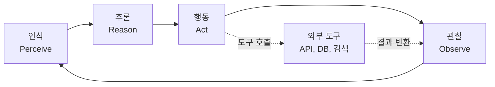
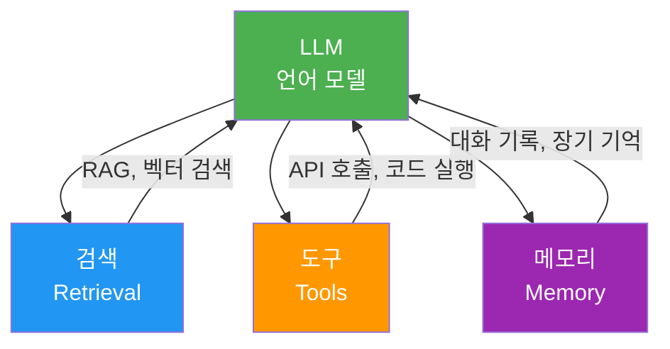
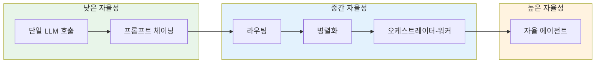
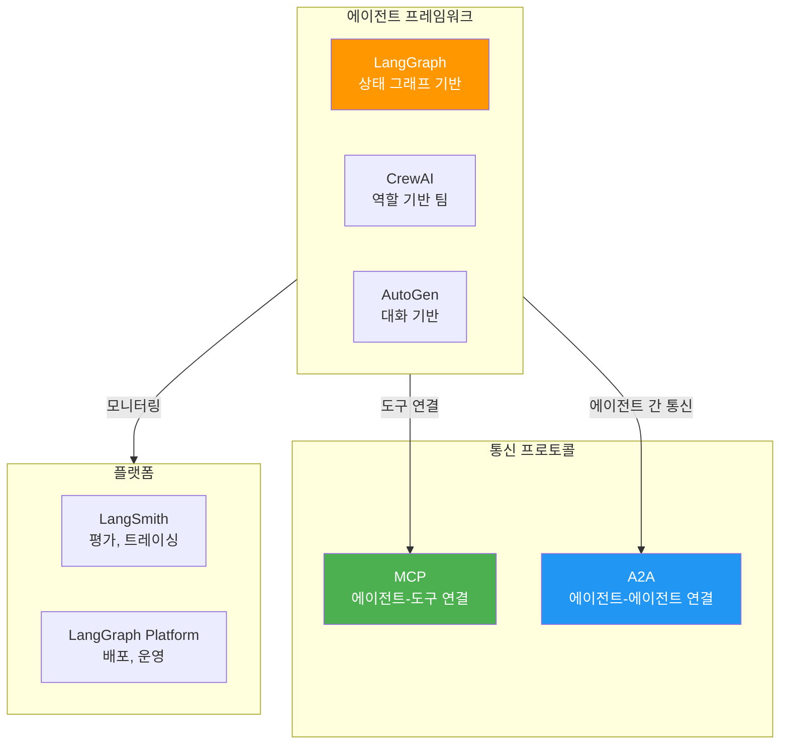
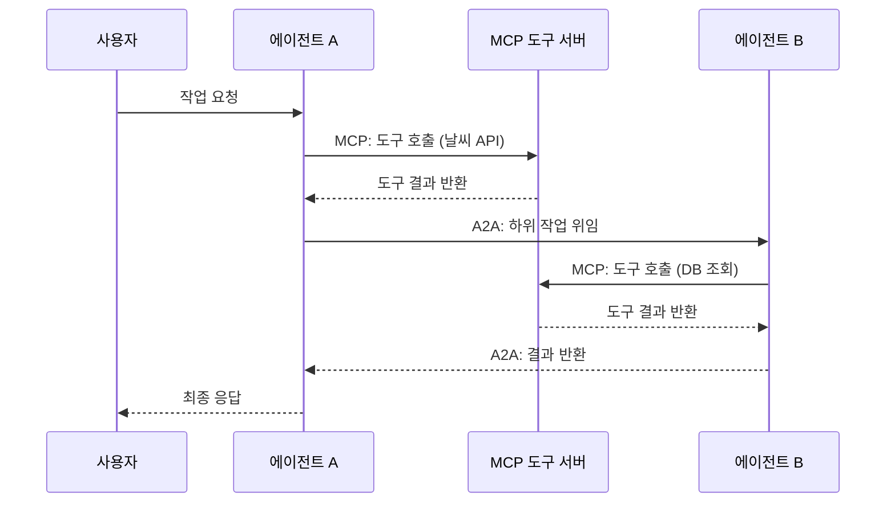

# AI 에이전트란 무엇인가

> LLM 기반 AI 에이전트의 정의, 자율성 스펙트럼, 그리고 2026년 에이전트 생태계를 한눈에 조망합니다

## 개요

이 섹션에서는 AI 에이전트가 정확히 무엇인지, 단순한 챗봇이나 LLM API 호출과 어떻게 다른지, 그리고 왜 지금 에이전트를 배워야 하는지를 살펴봅니다. "에이전트"라는 용어가 범람하는 시대에, 명확한 정의와 분류 체계를 갖추는 것이 이 코스 전체를 관통하는 첫 번째 이정표입니다.

**선수 지식**: Python 기초, LLM API 호출 경험 (OpenAI 또는 Anthropic API를 한 번이라도 써본 적 있으면 충분합니다)
**학습 목표**:
- AI 에이전트의 정의와 핵심 구성 요소를 설명할 수 있다
- 워크플로우(Workflow)와 에이전트(Agent)의 차이를 자율성 스펙트럼 위에서 구분할 수 있다
- 2026년 에이전트 생태계(프레임워크, 프로토콜)의 전체 그림을 그릴 수 있다

## 왜 알아야 할까?

2024년 말, Anthropic은 ["Building Effective Agents"](https://www.anthropic.com/research/building-effective-agents)라는 글에서 이렇게 말했습니다: *"가장 성공적인 구현은 복잡한 프레임워크가 아니라, 단순하고 조합 가능한 패턴 위에 세워졌다."*

그런데 이 "단순한 패턴"을 제대로 쓰려면, 먼저 **내가 만드는 것이 워크플로우인지, 에이전트인지** 구분할 수 있어야 합니다. 이 구분이 모호하면 과도하게 복잡한 시스템을 만들거나, 반대로 에이전트가 필요한 상황에서 하드코딩된 파이프라인에 갇히게 되죠.

2026년 현재, MCP(Model Context Protocol)와 A2A(Agent-to-Agent) 프로토콜이 표준으로 자리잡으면서 에이전트 생태계가 폭발적으로 성장하고 있습니다. 이 코스의 20개 챕터를 관통하는 맥락을 잡기 위해, 첫 섹션에서 전체 지형도를 그려봅시다.

## 핵심 개념

### 개념 1: AI 에이전트의 정의 — "심부름꾼"에서 "자율 비서"로

> 💡 **비유**: 식당에서 주문을 생각해 보세요. **챗봇**은 메뉴판 — 질문하면 정보를 보여주지만, 직접 요리를 하진 않습니다. **워크플로우**는 세트 메뉴 — "전채 → 메인 → 디저트" 순서가 정해져 있죠. **에이전트**는 경험 많은 셰프 — 재료(도구)를 보고, 손님 상태(환경)를 파악해서, 스스로 코스를 구성합니다.

AI 에이전트(AI Agent)란 **환경을 인식(Perceive)하고, 추론(Reason)하며, 도구를 사용해 행동(Act)하고, 그 결과를 관찰(Observe)하여 목표를 달성하는 시스템**입니다. 핵심은 단순히 텍스트를 생성하는 것이 아니라, **자율적으로 판단하고 행동한다**는 점이에요.

> 📊 **그림 1**: AI 에이전트의 핵심 루프 — 인식-추론-행동-관찰



이 루프를 코드로 표현하면 놀랍도록 간단합니다:

```run:python
# AI 에이전트의 핵심 루프를 의사코드로 표현
def simple_agent_loop(user_goal: str) -> str:
    """가장 단순한 에이전트 루프"""
    context = user_goal
    max_steps = 5
    
    for step in range(max_steps):
        # 1. 추론: LLM이 다음 행동을 결정
        thought = f"[Step {step+1}] 목표 '{context}'를 분석 중..."
        
        # 2. 행동: 도구 호출 또는 최종 답변
        if step == 2:  # 시뮬레이션: 3번째 스텝에서 답을 찾음
            action = "최종 답변 생성"
            result = f"목표 '{user_goal}'에 대한 답변을 찾았습니다!"
            print(f"  🧠 {thought}")
            print(f"  🎯 행동: {action}")
            print(f"  ✅ 결과: {result}")
            return result
        else:
            action = f"도구_{step+1} 호출"
            observation = f"도구에서 새로운 정보 획득"
            print(f"  🧠 {thought}")
            print(f"  🔧 행동: {action}")
            print(f"  👀 관찰: {observation}")
            context += f" + {observation}"
    
    return "최대 스텝 도달"

print("=== 에이전트 루프 실행 ===")
result = simple_agent_loop("서울 날씨 알려줘")
print(f"\n최종 결과: {result}")
```

```output
=== 에이전트 루프 실행 ===
  🧠 [Step 1] 목표 '서울 날씨 알려줘'를 분석 중...
  🔧 행동: 도구_1 호출
  👀 관찰: 도구에서 새로운 정보 획득
  🧠 [Step 2] 목표 '서울 날씨 알려줘 + 도구에서 새로운 정보 획득'를 분석 중...
  🔧 행동: 도구_2 호출
  👀 관찰: 도구에서 새로운 정보 획득
  🧠 [Step 3] 목표 '서울 날씨 알려줘 + 도구에서 새로운 정보 획득 + 도구에서 새로운 정보 획득'를 분석 중...
  🎯 행동: 최종 답변 생성
  ✅ 결과: 목표 '서울 날씨 알려줘'에 대한 답변을 찾았습니다!

최종 결과: 목표 '서울 날씨 알려줘'에 대한 답변을 찾았습니다!
```

위 코드에서 핵심은 **루프**입니다. 에이전트는 한 번의 LLM 호출로 끝나지 않고, 관찰 결과를 다시 추론에 반영하며 반복합니다.

### 개념 2: 증강된 LLM — 에이전트의 기본 빌딩 블록

> 💡 **비유**: LLM 혼자는 백과사전을 암기한 학생과 같습니다. 똑똒하지만, 실시간 주가를 모르고, 계산기를 쓸 수 없고, 이메일을 보낼 수도 없죠. **증강된 LLM(Augmented LLM)**은 이 학생에게 인터넷, 계산기, 이메일 클라이언트를 건네준 것과 같습니다.

Anthropic은 에이전트의 기본 빌딩 블록을 **증강된 LLM**이라 정의합니다. 세 가지 핵심 증강이 있습니다:

> 📊 **그림 2**: 증강된 LLM의 세 가지 능력



| 증강 | 설명 | 예시 |
|------|------|------|
| **검색(Retrieval)** | 외부 지식을 실시간으로 가져옴 | RAG, 벡터 DB 검색, 웹 검색 |
| **도구(Tools)** | 외부 시스템과 상호작용 | API 호출, DB 쿼리, 코드 실행 |
| **메모리(Memory)** | 과거 상호작용을 기억 | 대화 기록, 사용자 선호도 |

중요한 점은, 현대 LLM은 이 증강 기능을 **스스로 활용**한다는 것입니다. 검색 쿼리를 직접 생성하고, 적절한 도구를 선택하며, 어떤 정보를 기억할지 판단합니다. 이것이 바로 이 코스의 Ch1~Ch3에서 집중적으로 다루는 내용이죠.

```python
from typing import Any

# 증강된 LLM의 개념적 구조
class AugmentedLLM:
    """에이전트의 기본 빌딩 블록"""
    
    def __init__(self, model: str = "gpt-4o"):
        self.model = model
        self.tools: list[dict] = []       # 도구 정의
        self.memory: list[dict] = []      # 대화 메모리
        self.retriever = None             # 검색 시스템
    
    def add_tool(self, name: str, description: str, function: Any) -> None:
        """도구 등록 — Ch1에서 자세히 다룹니다"""
        self.tools.append({
            "name": name,
            "description": description,
            "function": function,
        })
    
    def invoke(self, user_input: str) -> str:
        """LLM 호출 — 도구 사용 여부를 모델이 결정"""
        # 1. 메모리에서 맥락 로드
        # 2. 필요시 검색 수행 (RAG)
        # 3. LLM 호출 (도구 정의 포함)
        # 4. 도구 호출이 필요하면 실행 후 재호출
        # 5. 최종 응답 반환
        pass  # 이후 섹션에서 구현!
```

### 개념 3: 자율성 스펙트럼 — 워크플로우 vs 에이전트

> 💡 **비유**: 자동차의 자율주행 레벨을 떠올려 보세요. 레벨 0(수동)부터 레벨 5(완전 자율)까지 단계가 있듯이, 에이전트 시스템도 **자율성 스펙트럼** 위에 놓입니다. 모든 것이 에이전트일 필요는 없고, 적절한 자율성 수준을 선택하는 것이 핵심이에요.

LangGraph 공식 문서는 이 스펙트럼을 명확히 정의합니다:

- **워크플로우(Workflow)**: LLM과 도구가 **미리 정해진 코드 경로**에 따라 동작하는 시스템. 실행 순서가 예측 가능합니다.
- **에이전트(Agent)**: LLM이 **자신의 프로세스와 도구 사용을 동적으로 결정**하는 시스템. 실행 경로가 런타임에 결정됩니다.

> 📊 **그림 3**: 자율성 스펙트럼 — 코드 제어 vs LLM 제어



Anthropic이 정리한 다섯 가지 워크플로우 패턴과 자율 에이전트를 비교해 봅시다:

| 패턴 | 자율성 | 코드 제어 | 사용 시나리오 |
|------|--------|-----------|--------------|
| **프롬프트 체이닝** | ★☆☆☆☆ | 높음 | 번역 → 검수 같은 순차 작업 |
| **라우팅** | ★★☆☆☆ | 높음 | 입력 유형별 전문 처리 |
| **병렬화** | ★★☆☆☆ | 높음 | 독립적 하위 작업 동시 실행 |
| **오케스트레이터-워커** | ★★★☆☆ | 중간 | 동적 작업 분해와 위임 |
| **평가자-최적화** | ★★★★☆ | 중간 | 반복 개선이 필요한 작업 |
| **자율 에이전트** | ★★★★★ | 낮음 | 문제와 해법이 예측 불가능한 작업 |

> ⚠️ **흔한 오해**: "에이전트가 워크플로우보다 항상 낫다"고 생각하기 쉽지만, 사실은 정반대인 경우가 많습니다. Anthropic의 권고는 명확합니다 — **가능한 가장 단순한 솔루션으로 시작하고, 필요할 때만 복잡도를 높이세요.** 세트 메뉴(워크플로우)로 충분한 상황에서 셰프(에이전트)를 고용할 필요는 없거든요.

```run:python
# 자율성 수준에 따른 시스템 선택 가이드
scenarios = [
    {
        "task": "블로그 글 번역 → 교정",
        "predictable": True,
        "steps_known": True,
        "recommendation": "프롬프트 체이닝 (워크플로우)",
    },
    {
        "task": "고객 문의 유형별 라우팅",
        "predictable": True,
        "steps_known": True,
        "recommendation": "라우팅 (워크플로우)",
    },
    {
        "task": "복잡한 리서치 + 보고서 작성",
        "predictable": False,
        "steps_known": False,
        "recommendation": "자율 에이전트",
    },
]

print("=== 자율성 수준 선택 가이드 ===\n")
for s in scenarios:
    agent_needed = not s["predictable"] or not s["steps_known"]
    print(f"작업: {s['task']}")
    print(f"  결과 예측 가능? {'예' if s['predictable'] else '아니오'}")
    print(f"  단계가 미리 알려짐? {'예' if s['steps_known'] else '아니오'}")
    print(f"  → 추천: {s['recommendation']}")
    print()
```

```output
=== 자율성 수준 선택 가이드 ===

작업: 블로그 글 번역 → 교정
  결과 예측 가능? 예
  단계가 미리 알려짐? 예
  → 추천: 프롬프트 체이닝 (워크플로우)

작업: 고객 문의 유형별 라우팅
  결과 예측 가능? 예
  단계가 미리 알려짐? 예
  → 추천: 라우팅 (워크플로우)

작업: 복잡한 리서치 + 보고서 작성
  결과 예측 가능? 아니오
  단계가 미리 알려짐? 아니오
  → 추천: 자율 에이전트
```

### 개념 4: 2026년 에이전트 생태계 — 프레임워크와 프로토콜

> 💡 **비유**: 에이전트 생태계를 도시 인프라에 비유해 볼까요? **프레임워크**(LangGraph, CrewAI)는 건물을 짓는 건축 회사, **MCP**는 건물 안의 전기·수도 배관 표준, **A2A**는 건물과 건물을 잇는 도로망입니다.

2026년 현재, 에이전트 생태계는 세 개의 축으로 구성됩니다:

> 📊 **그림 4**: 2026년 AI 에이전트 생태계 구조



| 구성 요소 | 역할 | 이 코스에서 |
|-----------|------|------------|
| **LangGraph** | 상태 기반 에이전트 오케스트레이션 | Ch4~Ch7 (핵심) |
| **MCP** | 에이전트 ↔ 외부 도구/데이터 연결 표준 | Ch9~Ch10 |
| **A2A** | 에이전트 ↔ 에이전트 통신 표준 | Ch11 |
| **CrewAI** | 역할 기반 멀티 에이전트 프레임워크 | Ch16 (비교) |
| **LangSmith** | 평가, 트레이싱, 모니터링 | Ch17~Ch18 |

**MCP(Model Context Protocol)**는 Anthropic이 주도하여 만든 에이전트-도구 통신 표준입니다. 2026년 현재 Claude, ChatGPT, Copilot, Gemini가 모두 네이티브로 지원하며, 사실상의 업계 표준이 되었습니다.

**A2A(Agent-to-Agent Protocol)**는 Google이 2025년 4월 제안하고 Linux Foundation에 기증한 에이전트 간 통신 표준입니다. OpenAI, Anthropic, Microsoft, AWS 등이 공동 설립한 Agentic AI Foundation(AAIF)에서 관리합니다.

> 📊 **그림 5**: MCP와 A2A의 역할 분담



## 실습: 직접 해보기

에이전트의 핵심 구조를 체험하기 위해, **도구를 사용하는 최소 에이전트**를 순수 Python으로 만들어 봅시다. 아직 LangGraph나 외부 라이브러리 없이, 에이전트가 내부적으로 어떻게 동작하는지 직관을 잡는 것이 목표입니다.

```python
import json
from typing import Callable

# === 1단계: 도구 정의 ===
def get_weather(city: str) -> str:
    """도시의 현재 날씨를 반환합니다 (시뮬레이션)"""
    weather_data = {
        "서울": "맑음, 18°C",
        "부산": "흐림, 22°C",
        "제주": "비, 16°C",
    }
    return weather_data.get(city, f"{city}의 날씨 정보를 찾을 수 없습니다")


def get_population(city: str) -> str:
    """도시의 인구 정보를 반환합니다 (시뮬레이션)"""
    pop_data = {
        "서울": "약 950만 명",
        "부산": "약 330만 명",
        "제주": "약 68만 명",
    }
    return pop_data.get(city, f"{city}의 인구 정보를 찾을 수 없습니다")


# === 2단계: 도구 레지스트리 ===
TOOLS: dict[str, Callable] = {
    "get_weather": get_weather,
    "get_population": get_population,
}

TOOL_DESCRIPTIONS = [
    {"name": "get_weather", "description": "도시의 현재 날씨 조회", "params": ["city"]},
    {"name": "get_population", "description": "도시의 인구 정보 조회", "params": ["city"]},
]


# === 3단계: 에이전트 루프 (LLM 호출을 시뮬레이션) ===
def simulate_agent(user_query: str) -> str:
    """
    실제 에이전트의 동작 흐름을 시뮬레이션합니다.
    
    실제 구현에서는 LLM이 도구 호출 여부를 판단하지만,
    여기서는 키워드 매칭으로 단순화했습니다.
    """
    print(f"📥 사용자 입력: {user_query}\n")
    
    # 에이전트의 내부 상태
    messages = [{"role": "user", "content": user_query}]
    collected_info = []
    
    # --- 추론 단계: 어떤 도구를 쓸지 결정 ---
    print("🧠 추론: 어떤 도구가 필요한지 판단 중...")
    tools_to_call = []
    
    if "날씨" in user_query:
        tools_to_call.append(("get_weather", {"city": "서울"}))
    if "인구" in user_query:
        tools_to_call.append(("get_population", {"city": "서울"}))
    
    # 도시 이름 감지 (간단한 키워드 매칭)
    for city in ["부산", "제주"]:
        if city in user_query:
            tools_to_call = [
                (name, {"city": city}) for name, _ in tools_to_call
            ]
    
    if not tools_to_call:
        return "도구 호출 없이 바로 응답합니다: 안녕하세요!"
    
    # --- 행동 단계: 도구 실행 ---
    for tool_name, params in tools_to_call:
        print(f"  🔧 도구 호출: {tool_name}({json.dumps(params, ensure_ascii=False)})")
        result = TOOLS[tool_name](**params)
        print(f"  📋 결과: {result}")
        collected_info.append(f"{tool_name}: {result}")
        
        # 메시지 히스토리에 도구 호출/결과 추가
        messages.append({
            "role": "assistant",
            "tool_calls": [{"name": tool_name, "args": params}],
        })
        messages.append({
            "role": "tool",
            "name": tool_name,
            "content": result,
        })
    
    # --- 최종 응답 생성 ---
    print("\n🧠 추론: 수집된 정보로 최종 답변 생성 중...")
    final_answer = f"조사 결과: {', '.join(collected_info)}"
    print(f"✅ 최종 응답: {final_answer}")
    
    return final_answer


# === 실행 ===
if __name__ == "__main__":
    simulate_agent("서울 날씨와 인구를 알려줘")
```

이 코드를 실행하면:

```console
📥 사용자 입력: 서울 날씨와 인구를 알려줘

🧠 추론: 어떤 도구가 필요한지 판단 중...
  🔧 도구 호출: get_weather({"city": "서울"})
  📋 결과: 맑음, 18°C
  🔧 도구 호출: get_population({"city": "서울"})
  📋 결과: 약 950만 명

🧠 추론: 수집된 정보로 최종 답변 생성 중...
✅ 최종 응답: 조사 결과: get_weather: 맑음, 18°C, get_population: 약 950만 명
```

이 실습의 핵심 포인트:

1. **도구 정의**: 함수와 그 설명을 분리하여 등록 (실제로는 JSON Schema 사용 — 다음 섹션에서!)
2. **추론 → 행동 → 관찰 루프**: 에이전트의 핵심 패턴
3. **메시지 히스토리**: 도구 호출과 결과를 대화 기록에 쌓아감

> 🔥 **실무 팁**: 이 시뮬레이션에서 키워드 매칭으로 처리한 "어떤 도구를 쓸지 판단" 부분을, 실제로는 LLM의 Tool Calling 기능이 담당합니다. [다음 섹션](01-ch1-llm-도구-호출의-이해/02-02-llm-tool-calling-메커니즘.md)에서 이 메커니즘을 깊이 파헤칩니다.

## 더 깊이 알아보기

### "에이전트"라는 이름의 기원

"에이전트"라는 개념은 AI 분야에서 수십 년의 역사를 가지고 있습니다. 1990년대 MIT의 패티 메이스(Pattie Maes) 교수는 "소프트웨어 에이전트"를 연구하며, 사용자를 대신해 자율적으로 작업을 수행하는 프로그램을 구상했습니다. 이메일 필터링, 회의 일정 조율 같은 작업이었죠.

하지만 당시의 에이전트는 규칙 기반(rule-based)이었습니다. "만약 제목에 '긴급'이 포함되면 → 우선순위를 높여라" 같은 if-else 로직이었죠. LLM의 등장으로 이 패러다임이 완전히 바뀌었습니다. 규칙을 하드코딩하는 대신, **LLM이 자연어로 된 맥락을 이해하고 스스로 판단**할 수 있게 된 거예요.

### Anthropic의 선언 — "단순함이 최고다"

2024년 12월, Anthropic이 발표한 "Building Effective Agents"는 업계에 큰 반향을 일으켰습니다. 당시 AutoGPT, BabyAGI 같은 복잡한 에이전트 프레임워크가 주목받던 시기에, Anthropic은 역설적으로 **"프레임워크 없이, LLM API를 직접 쓰는 것이 가장 효과적"**이라고 주장했거든요.

이 글이 제시한 핵심 원칙은 우리 코스 전체를 관통합니다: 먼저 단순한 패턴(Ch1~Ch3)을 완전히 이해하고, 그 다음에 프레임워크(Ch4~Ch7 LangGraph)로 확장하는 것이죠.

### 2025~2026: 프로토콜 전쟁과 통합

2025년은 에이전트 프로토콜의 해였습니다. Anthropic의 MCP가 2024년 11월 공개된 후, 불과 14개월 만에 Claude, ChatGPT, Copilot, Gemini 모두가 지원하는 사실상의 표준이 되었습니다. 이어서 Google이 A2A를 제안하고, IBM의 ACP가 A2A에 합류하면서, **MCP(도구 연결) + A2A(에이전트 간 통신)**이라는 이중 표준 구조가 확립되었습니다.

## 흔한 오해와 팁

> ⚠️ **흔한 오해**: "에이전트 = 자율 AI = AGI에 가까운 것"이라고 생각하는 분이 많습니다. 하지만 현재의 AI 에이전트는 **특정 작업 도메인에서 도구를 활용하는 자동화 시스템**에 가깝습니다. 범용 지능이 아니라, 잘 설계된 도구 + 잘 작성된 프롬프트 + 적절한 가드레일의 조합이에요.

> 💡 **알고 계셨나요?**: LangGraph의 GitHub 스타가 2026년 3월 기준 97,000개를 넘었습니다. 2024년 초만 해도 수천 개 수준이었으니, 에이전트 프레임워크 생태계가 얼마나 빠르게 성장하는지 실감할 수 있죠. CrewAI도 45,900개 이상의 스타를 기록하며, 하루 1,200만 건 이상의 에이전트 실행을 처리하고 있습니다.

> 🔥 **실무 팁**: 에이전트를 도입할 때 첫 질문은 "에이전트가 필요한가?"입니다. 작업 단계가 3개 이하이고 순서가 고정이라면, 단순 워크플로우가 더 빠르고, 디버깅하기 쉽고, 비용도 적게 듭니다. 에이전트의 자율성은 **예측 불가능성**이라는 비용과 함께 온다는 걸 잊지 마세요.

## 핵심 정리

| 개념 | 설명 |
|------|------|
| **AI 에이전트** | 인식→추론→행동→관찰 루프를 통해 자율적으로 목표를 달성하는 시스템 |
| **증강된 LLM** | 검색, 도구, 메모리로 강화된 LLM — 에이전트의 기본 빌딩 블록 |
| **워크플로우** | 미리 정해진 코드 경로를 따르는 LLM 시스템 (높은 예측 가능성) |
| **에이전트** | LLM이 자신의 프로세스와 도구 사용을 동적으로 결정하는 시스템 |
| **자율성 스펙트럼** | 프롬프트 체이닝 → 라우팅 → 병렬화 → 오케스트레이터-워커 → 자율 에이전트 |
| **MCP** | 에이전트 ↔ 외부 도구/데이터 연결을 위한 표준 프로토콜 (Anthropic) |
| **A2A** | 에이전트 ↔ 에이전트 통신을 위한 표준 프로토콜 (Google → Linux Foundation) |
| **Tool Calling** | LLM이 구조화된 JSON으로 외부 함수 호출을 요청하는 메커니즘 |

## 다음 섹션 미리보기

에이전트의 전체 그림을 잡았으니, 이제 에이전트의 첫 번째 핵심 능력인 **Tool Calling**을 파헤칠 차례입니다. [02. LLM Tool Calling 메커니즘](01-ch1-llm-도구-호출의-이해/02-02-llm-tool-calling-메커니즘.md)에서는 LLM이 어떻게 "이 함수를 이 인자로 호출해주세요"라는 구조화된 요청을 생성하는지, Function Calling과 Tool Calling의 차이는 무엇인지, 그리고 JSON Schema로 도구를 정의하는 방법을 다룹니다.

## 참고 자료

- [Building Effective Agents — Anthropic](https://www.anthropic.com/research/building-effective-agents) — 에이전트 vs 워크플로우의 구분, 다섯 가지 워크플로우 패턴, 그리고 "단순함이 최고"라는 핵심 원칙을 제시한 필독 글
- [Workflows and Agents — LangGraph 공식 문서](https://docs.langchain.com/oss/python/langgraph/workflows-agents) — LangGraph가 정의하는 워크플로우와 에이전트의 차이, 자율성 스펙트럼 설명
- [LangGraph Overview — 공식 문서](https://docs.langchain.com/oss/python/langgraph/overview) — LangGraph의 아키텍처, StateGraph, 노드/엣지 개념과 핵심 기능 소개
- [MCP vs A2A: The Complete Guide to AI Agent Protocols in 2026](https://dev.to/pockit_tools/mcp-vs-a2a-the-complete-guide-to-ai-agent-protocols-in-2026-30li) — MCP와 A2A 프로토콜의 역할 분담과 2026년 현황
- [AI Agents in Production: Frameworks, Protocols, and What Actually Works in 2026](https://47billion.com/blog/ai-agents-in-production-frameworks-protocols-and-what-actually-works-in-2026/) — 프로덕션 환경에서의 에이전트 프레임워크 비교와 실전 인사이트