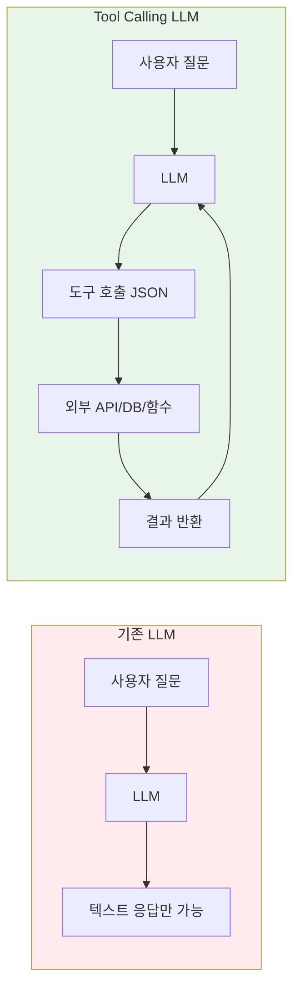
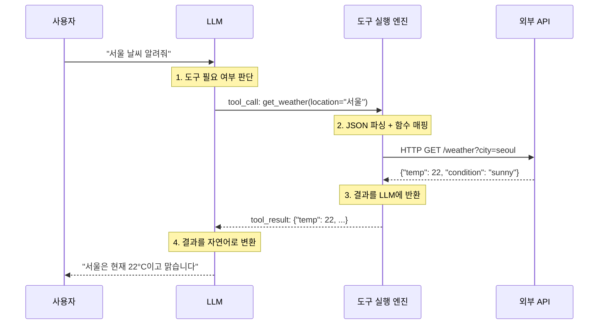
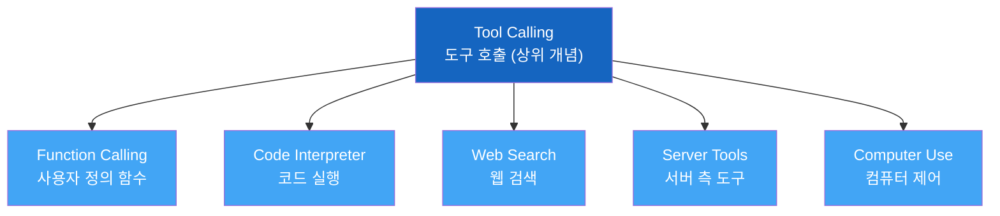
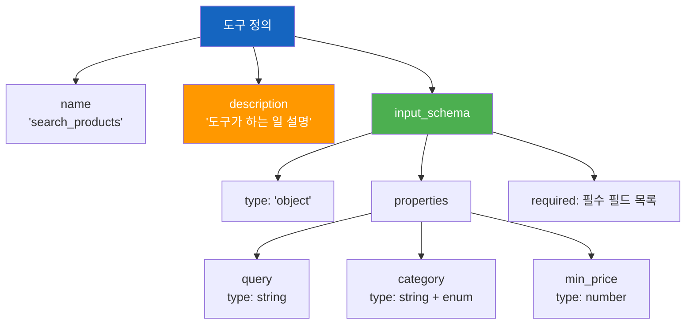
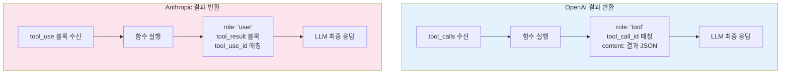

# LLM Tool Calling 메커니즘

> LLM이 외부 세계와 소통하는 언어 — 구조화된 JSON으로 함수를 호출하는 핵심 메커니즘을 파헤칩니다

## 개요

이 섹션에서는 LLM이 어떻게 "말"이 아닌 "행동"을 할 수 있는지, 그 핵심 메커니즘인 Tool Calling을 깊이 있게 살펴봅니다. [이전 섹션](01-ch1-llm-도구-호출의-이해/01-01-ai-에이전트란-무엇인가.md)에서 배운 에이전트 루프의 "행동(Action)" 단계가 실제로 어떻게 구현되는지를 이해하게 됩니다. 사실 에이전트 루프에서 **행동(Act) 단계**는 단순히 "함수를 호출한다"가 아닙니다 — 내부적으로는 **요청 → 판단 → 실행 → 반환**이라는 4단계 라운드트립으로 구현되는데, 이 섹션에서 그 메커니즘을 낱낱이 파헤쳐 보겠습니다.

**선수 지식**: AI 에이전트의 인식-추론-행동-관찰 루프, Augmented LLM 개념
**학습 목표**:
- Tool Calling의 내부 동작 원리를 설명할 수 있다
- Function Calling과 Tool Calling의 관계와 차이를 구분할 수 있다
- JSON Schema 기반 도구 정의 구조를 읽고 작성할 수 있다
- OpenAI와 Anthropic API의 Tool Calling 흐름을 비교할 수 있다

## 왜 알아야 할까?

LLM은 기본적으로 텍스트를 생성하는 모델입니다. 아무리 똑똑한 LLM이라도 현재 날씨를 확인하거나, 데이터베이스에서 데이터를 가져오거나, 이메일을 보내는 건 불가능하죠. 이 한계를 넘는 열쇠가 바로 **Tool Calling**입니다.

Tool Calling을 이해하면:
- 에이전트가 실제로 "행동"하는 방법을 근본부터 알 수 있습니다
- LangGraph나 CrewAI 같은 프레임워크의 내부 동작을 이해할 수 있습니다
- 도구 정의를 잘 설계하면 에이전트의 성능이 극적으로 향상됩니다
- 프로덕션에서 발생하는 도구 호출 실패를 디버깅할 수 있습니다

> 📊 **그림 1**: Tool Calling이 없는 LLM vs 있는 LLM



## 핵심 개념

### 개념 1: Tool Calling이란 무엇인가

> 💡 **비유**: 음식점에서 손님(사용자)이 웨이터(LLM)에게 주문을 하면, 웨이터는 직접 요리하지 않습니다. 대신 주문서(JSON)를 작성해서 주방(외부 함수)에 전달하죠. 주방에서 요리(실행 결과)가 나오면 웨이터가 그걸 받아 손님에게 서빙합니다. Tool Calling은 바로 이 "주문서 작성" 능력입니다.

Tool Calling은 LLM이 자연어 입력을 분석해서, **어떤 함수를 어떤 인자로 호출해야 하는지**를 구조화된 JSON 형태로 출력하는 기능입니다. 핵심 포인트가 있는데요 — LLM은 함수를 **직접 실행하지 않습니다**. 함수명과 인자를 정확한 포맷으로 제안할 뿐이고, 실제 실행은 여러분의 코드가 담당합니다.

```python
# Tool Calling의 본질: LLM은 "무엇을 호출할지" 결정하고
# 개발자의 코드가 "실제로 실행"한다

# LLM이 출력하는 것 (JSON 형태의 호출 요청)
tool_call = {
    "name": "get_weather",        # 어떤 함수?
    "arguments": {                 # 어떤 인자로?
        "location": "서울",
        "unit": "celsius"
    }
}

# 개발자 코드가 실행하는 것
def get_weather(location: str, unit: str = "celsius") -> dict:
    """실제 날씨 API를 호출하는 함수"""
    # 외부 API 호출 로직
    return {"temp": 22, "condition": "맑음"}
```

> 📊 **그림 2**: Tool Calling의 4단계 흐름



이 과정에서 LLM은 두 가지 핵심 판단을 합니다:

1. **도구 사용 여부 결정**: "서울 날씨 알려줘" → 도구 필요 / "안녕하세요" → 도구 불필요
2. **올바른 도구와 인자 선택**: 여러 도구 중 `get_weather`를 선택하고, `location`에 "서울"을 매핑

### 개념 2: Function Calling에서 Tool Calling으로의 진화

> 💡 **비유**: "전화기"가 처음에는 유선 전화(Function Calling)만 의미했지만, 지금은 스마트폰(Tool Calling)처럼 통화뿐 아니라 카메라, 지도, 결제까지 포함하는 넓은 개념이 된 것과 비슷합니다.

이 두 용어는 실무에서 종종 혼용되지만, 엄밀히 구분하면 이런 관계입니다:

| 구분 | Function Calling | Tool Calling |
|------|-----------------|--------------|
| **시기** | 2023년 6월 (OpenAI 최초 도입) | 2023년 11월~ (업계 표준화) |
| **범위** | 사용자 정의 함수 호출 | 함수 + 코드 인터프리터 + 검색 + 서버 도구 등 |
| **관계** | Tool Calling의 하위 개념 | Function Calling을 포함하는 상위 개념 |
| **현재** | 레거시 용어로 사용 | API 표준 용어 |

> 📊 **그림 3**: Tool Calling과 Function Calling의 포함 관계



OpenAI의 진화 과정을 따라가 보면 이 관계가 더 선명해집니다:

- **2023년 3월**: ChatGPT Plugins 출시 — UI 레벨의 도구 연동
- **2023년 6월**: `function_calling` 파라미터로 API 레벨 지원 시작 (GPT-3.5/4)
- **2023년 11월**: `tools` 파라미터로 전환, 병렬 함수 호출 지원
- **2024년 6월**: Structured Outputs (`strict: true`) 도입
- **2025년 3월**: Responses API + 서버 도구(web_search, file_search 등)

Anthropic도 비슷한 경로를 걸었는데요:

- **2024년 4월**: Claude Messages API에 `tools` 파라미터 지원
- **2025년 3월**: 서버 도구(web_search, web_fetch) + MCP 커넥터 도입
- **2025년 11월**: 고급 도구 사용 기능(Tool Search, Programmatic Tool Calling)

### 개념 3: JSON Schema — 도구의 설계도

> 💡 **비유**: JSON Schema는 도구의 "사용 설명서"입니다. 레고 블록 세트를 사면 조립 설명서가 들어 있듯, LLM에게 "이 도구는 이런 부품(파라미터)이 필요하고, 각 부품은 이런 형태여야 해"라고 알려주는 거죠.

도구를 정의할 때 가장 중요한 부분이 JSON Schema입니다. LLM은 이 스키마를 보고 어떤 인자를 어떤 타입으로 전달해야 하는지 판단합니다.

```python
# 잘 설계된 도구 정의 예시
tool_definition = {
    "name": "search_products",                    # 함수 이름 (snake_case)
    "description": (                               # 상세한 설명 — LLM이 도구 선택의 근거로 사용
        "전자상거래 데이터베이스에서 상품을 검색합니다. "
        "키워드, 카테고리, 가격 범위로 필터링할 수 있습니다. "
        "재고가 있는 상품만 반환됩니다."
    ),
    "input_schema": {                              # JSON Schema 정의
        "type": "object",
        "properties": {
            "query": {
                "type": "string",
                "description": "검색 키워드 (예: '무선 이어폰')"
            },
            "category": {
                "type": "string",
                "enum": ["전자기기", "의류", "식품", "도서"],  # 선택지 제한
                "description": "상품 카테고리"
            },
            "min_price": {
                "type": "number",
                "description": "최소 가격 (원)"
            },
            "max_price": {
                "type": "number",
                "description": "최대 가격 (원)"
            },
            "sort_by": {
                "type": "string",
                "enum": ["price_asc", "price_desc", "relevance", "rating"],
                "description": "정렬 기준 (기본값: relevance)"
            }
        },
        "required": ["query"]                      # 필수 파라미터
    }
}
```

JSON Schema에서 LLM의 도구 선택 정확도에 가장 큰 영향을 미치는 요소는 바로 **description**입니다. 함수 이름만으로는 LLM이 언제 이 도구를 써야 하는지 판단하기 어렵거든요.

> 📊 **그림 4**: JSON Schema 구조 해부



> 🔥 **실무 팁**: `description`은 도구의 "광고 문구"라고 생각하세요. LLM이 여러 도구 중 하나를 골라야 할 때, description이 명확하지 않으면 잘못된 도구를 선택하거나 아예 도구를 사용하지 않습니다. **언제 이 도구를 써야 하는지**, **무엇을 반환하는지**, **제약 조건은 무엇인지**를 반드시 포함하세요.

### 개념 4: OpenAI vs Anthropic — API 구조 비교

두 주요 LLM 프로바이더의 Tool Calling API를 나란히 비교해보겠습니다. 핵심 개념은 동일하지만, 메시지 구조와 용어에 차이가 있습니다.

**OpenAI Chat Completions API:**

```python
from openai import OpenAI

client = OpenAI()

# 1단계: 도구 정의 + 사용자 메시지 전송
response = client.chat.completions.create(
    model="gpt-4o",
    messages=[
        {"role": "user", "content": "서울 날씨 알려줘"}
    ],
    tools=[{
        "type": "function",                    # OpenAI는 "function" 타입 명시
        "function": {
            "name": "get_weather",
            "description": "주어진 위치의 현재 날씨를 조회합니다",
            "parameters": {                    # OpenAI: "parameters"
                "type": "object",
                "properties": {
                    "location": {
                        "type": "string",
                        "description": "도시명 (예: 서울, 부산)"
                    }
                },
                "required": ["location"]
            }
        }
    }],
    tool_choice="auto"                         # auto / required / none
)

# 2단계: 도구 호출 결과 확인
tool_call = response.choices[0].message.tool_calls[0]
# tool_call.id = "call_abc123"
# tool_call.function.name = "get_weather"
# tool_call.function.arguments = '{"location": "서울"}'
```

**Anthropic Messages API:**

```python
import anthropic

client = anthropic.Anthropic()

# 1단계: 도구 정의 + 사용자 메시지 전송
response = client.messages.create(
    model="claude-sonnet-4-20250514",
    max_tokens=1024,
    messages=[
        {"role": "user", "content": "서울 날씨 알려줘"}
    ],
    tools=[{
        "name": "get_weather",                 # Anthropic: type 필드 불필요
        "description": "주어진 위치의 현재 날씨를 조회합니다",
        "input_schema": {                      # Anthropic: "input_schema"
            "type": "object",
            "properties": {
                "location": {
                    "type": "string",
                    "description": "도시명 (예: 서울, 부산)"
                }
            },
            "required": ["location"]
        }
    }],
    tool_choice={"type": "auto"}               # auto / any / tool
)

# 2단계: 도구 호출 결과 확인 (content 블록 기반)
for block in response.content:
    if block.type == "tool_use":
        # block.id = "toolu_abc123"
        # block.name = "get_weather"
        # block.input = {"location": "서울"}
        pass
```

주요 차이점을 정리하면:

| 항목 | OpenAI | Anthropic |
|------|--------|-----------|
| **스키마 키** | `parameters` | `input_schema` |
| **도구 래핑** | `{"type": "function", "function": {...}}` | 직접 정의 (래핑 없음) |
| **호출 결과 위치** | `message.tool_calls[]` | `content[]` 블록 (type="tool_use") |
| **인자 형식** | JSON 문자열 (`arguments`) | 파싱된 딕셔너리 (`input`) |
| **종료 이유** | `finish_reason: "tool_calls"` | `stop_reason: "tool_use"` |
| **결과 반환** | `role: "tool"` 메시지 | `role: "user"` + `tool_result` 블록 |
| **tool_choice** | `"auto"`, `"required"`, `"none"` | `{"type": "auto"}`, `{"type": "any"}`, `{"type": "tool", "name": "..."}` |

### 개념 5: 도구 호출 결과를 LLM에 반환하기

Tool Calling은 **왕복 여행**입니다. LLM이 도구 호출을 요청하면, 개발자가 실행한 후 그 결과를 다시 LLM에게 보내야 최종 응답을 생성할 수 있습니다.

> 📊 **그림 5**: 결과 반환 구조 — OpenAI vs Anthropic



```python
# OpenAI: 도구 결과 반환
import json

# 도구 실행 결과를 messages에 추가
messages = [
    {"role": "user", "content": "서울 날씨 알려줘"},
    response.choices[0].message,       # assistant 메시지 (tool_calls 포함)
    {
        "role": "tool",                # OpenAI는 "tool" 역할 사용
        "tool_call_id": tool_call.id,  # 어떤 호출에 대한 결과인지 매칭
        "content": json.dumps({        # 결과는 JSON 문자열로
            "temperature": 22,
            "condition": "맑음",
            "humidity": 45
        })
    }
]

# 최종 응답 생성
final_response = client.chat.completions.create(
    model="gpt-4o",
    messages=messages
)
```

```python
# Anthropic: 도구 결과 반환
messages = [
    {"role": "user", "content": "서울 날씨 알려줘"},
    {"role": "assistant", "content": response.content},  # tool_use 블록 포함
    {
        "role": "user",              # Anthropic은 "user" 역할 사용
        "content": [{
            "type": "tool_result",   # tool_result 블록
            "tool_use_id": block.id, # 어떤 호출에 대한 결과인지 매칭
            "content": json.dumps({  # 결과 데이터
                "temperature": 22,
                "condition": "맑음",
                "humidity": 45
            })
        }]
    }
]

# 최종 응답 생성
final_response = client.messages.create(
    model="claude-sonnet-4-20250514",
    max_tokens=1024,
    messages=messages,
    tools=tools  # 동일한 도구 정의 재전달
)
```

## 실습: 직접 해보기

전체 Tool Calling 라운드트립을 하나의 완전한 코드로 구현해보겠습니다. 실제 API 호출 없이도 동작 원리를 이해할 수 있도록, 시뮬레이션 모드를 포함했습니다.

```run:python
import json
from typing import Any

# ─── 1단계: 도구 레지스트리 정의 ───
TOOL_REGISTRY: dict[str, dict] = {}

def register_tool(name: str, description: str, parameters: dict):
    """도구를 레지스트리에 등록하는 데코레이터"""
    def decorator(func):
        TOOL_REGISTRY[name] = {
            "definition": {
                "name": name,
                "description": description,
                "input_schema": {
                    "type": "object",
                    "properties": parameters.get("properties", {}),
                    "required": parameters.get("required", [])
                }
            },
            "function": func
        }
        return func
    return decorator

# ─── 2단계: 도구 구현 ───
@register_tool(
    name="get_weather",
    description="주어진 도시의 현재 날씨를 조회합니다. 온도, 습도, 상태를 반환합니다.",
    parameters={
        "properties": {
            "city": {"type": "string", "description": "도시명 (예: 서울, 부산, 도쿄)"},
            "unit": {"type": "string", "enum": ["celsius", "fahrenheit"], "description": "온도 단위"}
        },
        "required": ["city"]
    }
)
def get_weather(city: str, unit: str = "celsius") -> dict:
    """날씨 API 시뮬레이션"""
    weather_db = {
        "서울": {"temp": 22, "humidity": 45, "condition": "맑음"},
        "부산": {"temp": 25, "humidity": 60, "condition": "구름 조금"},
        "도쿄": {"temp": 20, "humidity": 55, "condition": "흐림"},
    }
    data = weather_db.get(city, {"temp": 0, "humidity": 0, "condition": "정보 없음"})
    if unit == "fahrenheit":
        data["temp"] = round(data["temp"] * 9/5 + 32, 1)
    data["unit"] = unit
    return data

@register_tool(
    name="calculate",
    description="수학 계산을 수행합니다. 사칙연산과 거듭제곱을 지원합니다.",
    parameters={
        "properties": {
            "expression": {"type": "string", "description": "계산식 (예: '2 + 3 * 4')"}
        },
        "required": ["expression"]
    }
)
def calculate(expression: str) -> dict:
    """안전한 수학 계산"""
    allowed = set("0123456789+-*/.() ")
    if not all(c in allowed for c in expression):
        return {"error": "허용되지 않은 문자가 포함되어 있습니다"}
    result = eval(expression)  # 실습용 — 프로덕션에서는 ast.literal_eval 또는 파서 사용
    return {"expression": expression, "result": result}

# ─── 3단계: 도구 실행 엔진 ───
def execute_tool_call(tool_name: str, arguments: dict[str, Any]) -> dict:
    """도구 이름과 인자로 실제 함수를 실행"""
    if tool_name not in TOOL_REGISTRY:
        return {"error": f"알 수 없는 도구: {tool_name}"}
    
    func = TOOL_REGISTRY[tool_name]["function"]
    try:
        result = func(**arguments)
        return {"status": "success", "result": result}
    except Exception as e:
        return {"status": "error", "error": str(e)}

# ─── 4단계: LLM 시뮬레이션 (Tool Calling 흐름 재현) ───
def simulate_llm_tool_call(user_message: str) -> dict:
    """LLM의 도구 호출 결정을 시뮬레이션"""
    # 실제로는 LLM이 판단하지만, 여기서는 키워드 매칭으로 시뮬레이션
    if "날씨" in user_message:
        city = "서울"  # 실제 LLM은 NLU로 도시명 추출
        for c in ["서울", "부산", "도쿄"]:
            if c in user_message:
                city = c
                break
        return {
            "tool_name": "get_weather",
            "arguments": {"city": city, "unit": "celsius"}
        }
    elif "계산" in user_message or any(op in user_message for op in ["+", "-", "*", "/"]):
        # 숫자와 연산자 추출 (간단한 시뮬레이션)
        return {
            "tool_name": "calculate",
            "arguments": {"expression": "15 * 24 + 365"}
        }
    return {"tool_name": None, "arguments": {}}

# ─── 실행 ───
print("=" * 50)
print("🔧 등록된 도구 목록")
print("=" * 50)
for name, info in TOOL_REGISTRY.items():
    defn = info["definition"]
    required = defn["input_schema"].get("required", [])
    print(f"\n[{name}]")
    print(f"  설명: {defn['description']}")
    print(f"  필수 파라미터: {required}")

print("\n" + "=" * 50)
print("🚀 Tool Calling 시뮬레이션")
print("=" * 50)

user_msg = "부산 날씨 어때?"
print(f"\n사용자: {user_msg}")

# LLM이 도구 호출 결정
tool_call = simulate_llm_tool_call(user_msg)
print(f"LLM 결정: {json.dumps(tool_call, ensure_ascii=False, indent=2)}")

# 도구 실행
result = execute_tool_call(tool_call["tool_name"], tool_call["arguments"])
print(f"도구 결과: {json.dumps(result, ensure_ascii=False, indent=2)}")

# LLM이 최종 응답 생성 (시뮬레이션)
weather = result["result"]
print(f"LLM 응답: 부산의 현재 날씨는 {weather['temp']}°C이며, {weather['condition']}입니다. 습도는 {weather['humidity']}%입니다.")
```

```output
==================================================
🔧 등록된 도구 목록
==================================================

[get_weather]
  설명: 주어진 도시의 현재 날씨를 조회합니다. 온도, 습도, 상태를 반환합니다.
  필수 파라미터: ['city']

[calculate]
  설명: 수학 계산을 수행합니다. 사칙연산과 거듭제곱을 지원합니다.
  필수 파라미터: ['expression']

==================================================
🚀 Tool Calling 시뮬레이션
==================================================

사용자: 부산 날씨 어때?
LLM 결정: {
  "tool_name": "get_weather",
  "arguments": {
    "city": "부산",
    "unit": "celsius"
  }
}
도구 결과: {
  "status": "success",
  "result": {
    "temp": 25,
    "humidity": 60,
    "condition": "구름 조금",
    "unit": "celsius"
  }
}
LLM 응답: 부산의 현재 날씨는 25°C이며, 구름 조금입니다. 습도는 60%입니다.
```

이 코드에서 핵심 패턴을 짚어보면:

1. **도구 레지스트리**: 도구 정의(스키마)와 실제 함수를 매핑
2. **도구 실행 엔진**: 도구 이름으로 함수를 찾아 실행하고, 에러를 포착
3. **라운드트립**: 사용자 입력 → LLM 판단 → 도구 실행 → 결과 반환 → 최종 응답

여기서 사용한 `TOOL_REGISTRY` 딕셔너리와 `register_tool` 데코레이터는 도구 관리의 가장 기본적인 형태입니다. 이 단순한 딕셔너리 레지스트리는 [Ch1 마지막 세션](01-ch1-llm-도구-호출의-이해/05-05-도구-레지스트리-패턴-구현.md)에서 검증, 권한 제어, 스키마 자동 생성 등을 갖춘 프로덕션급 `ToolRegistry` 클래스로 진화합니다.

이 구조가 [다음 섹션](01-ch1-llm-도구-호출의-이해/03-03-openai-api-도구-호출-실습.md)에서 실제 OpenAI API로, 그 다음에는 [Anthropic API](01-ch1-llm-도구-호출의-이해/04-04-anthropic-api-도구-호출-실습.md)로 확장됩니다.

## 더 깊이 알아보기

### Tool Calling의 탄생 — ChatGPT Plugins에서 시작된 여정

Tool Calling의 역사는 2023년 3월 23일, OpenAI가 **ChatGPT Plugins**를 발표한 날로 거슬러 올라갑니다. 당시 OpenAI는 "LLM의 눈과 귀와 손을 달아주자"는 비전 아래, ChatGPT가 Wolfram Alpha, Zapier, Expedia 같은 외부 서비스를 직접 호출할 수 있게 했습니다.

그런데 Plugins에는 한계가 있었습니다. ChatGPT UI에서만 작동하고, API 개발자들은 이 기능을 활용할 수 없었거든요. 그래서 2023년 6월 13일, OpenAI는 GPT-3.5와 GPT-4 모델에 **Function Calling** 기능을 API로 공개했습니다. 이때의 API는 `functions` 파라미터와 `function_call` 파라미터를 사용했죠.

하지만 "Function"이라는 이름이 너무 좁았습니다. 실제로 LLM이 호출하는 대상은 단순한 함수뿐 아니라 코드 인터프리터, 검색 엔진, 파일 시스템 등 다양한 "도구"였으니까요. 2023년 11월, OpenAI는 `tools` 파라미터로 전환하면서 **병렬 도구 호출**(Parallel Tool Calls)도 지원하기 시작했습니다. 하나의 응답에서 여러 도구를 동시에 호출할 수 있게 된 겁니다.

흥미로운 점은, 학술적으로는 이미 2023년 2월 Meta가 **Toolformer** 논문을 발표하며 "LLM이 스스로 도구 사용법을 학습할 수 있다"는 아이디어를 제시했다는 것입니다. OpenAI의 Function Calling은 이를 실용적인 API로 구현한 첫 사례였죠.

> 💡 **알고 계셨나요?**: OpenAI의 Assistants API(2023년 11월 출시)는 Tool Calling을 서버 측에서 자동 관리해주는 고수준 API였지만, 2025년 3월 Responses API로 대체되었고 2026년 8월 종료 예정입니다. 기술의 진화 속도가 정말 빠르죠!

### 파인튜닝의 비밀 — LLM은 어떻게 JSON을 출력할까?

LLM이 자연어 대신 정확한 JSON을 출력하는 게 신기하지 않나요? 비밀은 **파인튜닝**에 있습니다. 모델 학습 시 수만 건의 (사용자 질문 + 도구 정의 → 올바른 도구 호출 JSON) 쌍으로 추가 훈련합니다. 이 과정을 거치면 모델이 도구 정의의 구조를 "이해"하고, 사용자 의도에 맞는 함수명과 인자를 정확히 생성할 수 있게 됩니다.

2024년 6월에는 OpenAI가 **Structured Outputs**를 도입해 `strict: true` 옵션으로 JSON Schema를 100% 준수하는 출력을 보장하게 되었습니다. 기존에는 간혹 필수 필드가 빠지거나 타입이 틀리는 경우가 있었는데, Structured Outputs는 제약된 디코딩(Constrained Decoding) 기법으로 이를 원천 차단합니다.

## 흔한 오해와 팁

> ⚠️ **흔한 오해**: "LLM이 직접 함수를 실행한다" — 아닙니다! LLM은 **어떤 함수를 어떤 인자로 호출해야 하는지** JSON을 생성할 뿐입니다. 실제 실행은 반드시 개발자 코드에서 해야 합니다. 이 구분이 보안과 안전성의 핵심입니다. LLM이 직접 코드를 실행하면 프롬프트 인젝션으로 시스템이 위험해질 수 있거든요.

> ⚠️ **흔한 오해**: "Function Calling과 Tool Calling은 다른 기능이다" — 아닙니다! Function Calling은 Tool Calling의 초기 이름이자 하위 개념입니다. 현재 API에서 `functions` 파라미터는 레거시로 남아 있고, `tools` 파라미터를 사용하는 것이 표준입니다.

> 💡 **알고 계셨나요?**: Anthropic의 Claude는 도구 결과를 `role: "user"` 메시지 안의 `tool_result` 블록으로 반환하는데, OpenAI는 별도의 `role: "tool"` 메시지를 사용합니다. 프레임워크 전환 시 이 차이 때문에 버그가 자주 발생합니다.

> 🔥 **실무 팁**: 도구의 `description`에 **부정 지시문**을 포함하면 정확도가 올라갑니다. 예를 들어 `"현재 날씨만 조회합니다. 과거 날씨나 예보는 지원하지 않습니다."` 처럼요. LLM이 도구의 한계를 명확히 인식하면 잘못된 호출을 줄일 수 있습니다.

> 🔥 **실무 팁**: `enum`을 적극 활용하세요. 자유 텍스트 대신 선택지를 제한하면 LLM이 유효한 값만 생성합니다. `"sort_by": {"type": "string", "enum": ["price", "rating", "relevance"]}` 처럼 사용하면 잘못된 정렬 기준이 들어오는 것을 방지할 수 있습니다.

## 핵심 정리

| 개념 | 설명 |
|------|------|
| **Tool Calling** | LLM이 구조화된 JSON으로 외부 함수/도구 호출을 생성하는 기능. LLM은 실행하지 않고 호출 요청만 생성 |
| **Function Calling** | Tool Calling의 초기 명칭이자 하위 개념. 사용자 정의 함수 호출에 한정 |
| **JSON Schema** | 도구의 입력 구조를 정의하는 명세. `name`, `description`, `properties`, `required` 등으로 구성 |
| **도구 정의의 핵심** | `description`이 LLM의 도구 선택 정확도에 가장 큰 영향. 용도와 제약 조건을 명확히 기술 |
| **라운드트립** | 사용자 → LLM(도구 호출 결정) → 개발자 코드(실행) → LLM(최종 응답) 의 왕복 구조. 에이전트 루프의 행동(Act) 단계가 이 라운드트립으로 구현됨 |
| **tool_choice** | 도구 사용 정책: `auto`(LLM 판단), `required`/`any`(강제 사용), `none`(사용 금지) |
| **OpenAI vs Anthropic** | 스키마 키(`parameters` vs `input_schema`), 결과 반환 방식(`role: tool` vs `tool_result` 블록) 등 차이 |

## 다음 섹션 미리보기

Tool Calling의 이론을 충분히 익혔으니, 다음 섹션 [03. OpenAI API 도구 호출 실습](01-ch1-llm-도구-호출의-이해/03-03-openai-api-도구-호출-실습.md)에서는 실제 OpenAI API를 사용해 도구를 정의하고 호출하는 전체 과정을 직접 구현합니다. 단일 도구 호출부터 병렬 도구 호출, `tool_choice` 제어, 그리고 Structured Outputs(`strict: true`)까지 실전 코드로 다뤄볼 예정입니다.

## 참고 자료

- [Tool use with Claude — Anthropic 공식 문서](https://platform.claude.com/docs/en/agents-and-tools/tool-use/overview) - Claude의 Tool Calling 전체 가이드. 클라이언트/서버 도구, MCP 통합까지 포괄
- [Function Calling — OpenAI 공식 가이드](https://platform.openai.com/docs/guides/function-calling) - OpenAI의 도구 호출 공식 문서. Structured Outputs, parallel tool calls 포함
- [Function calling and other API updates — OpenAI 블로그 (2023)](https://openai.com/index/function-calling-and-other-api-updates/) - Function Calling 최초 발표 블로그. 탄생 배경과 설계 의도
- [Function Calling using LLMs — Martin Fowler](https://martinfowler.com/articles/function-call-LLM.html) - Tool Calling의 원리를 깊이 있게 설명한 아티클
- [Function Calling with LLMs — Prompt Engineering Guide](https://www.promptingguide.ai/applications/function_calling) - 다양한 LLM에서의 Function Calling 활용법과 실전 예제

---
### 🔗 Related Sessions
- [ai agent](01-ch1-llm-도구-호출의-이해/01-01-ai-에이전트란-무엇인가.md) (prerequisite)
- [augmented llm](01-ch1-llm-도구-호출의-이해/01-01-ai-에이전트란-무엇인가.md) (prerequisite)
