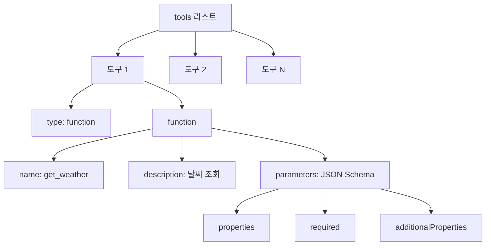
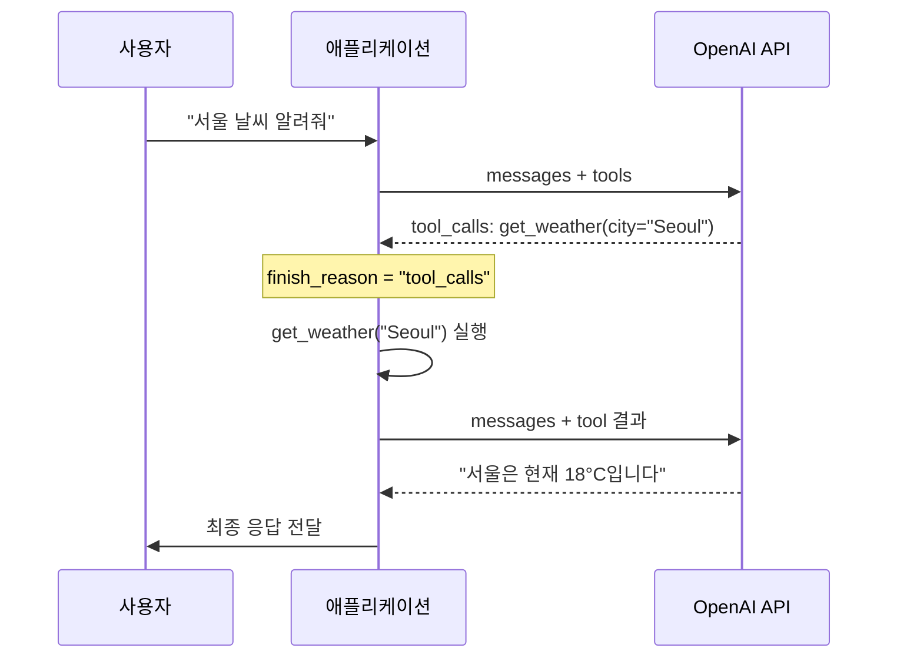
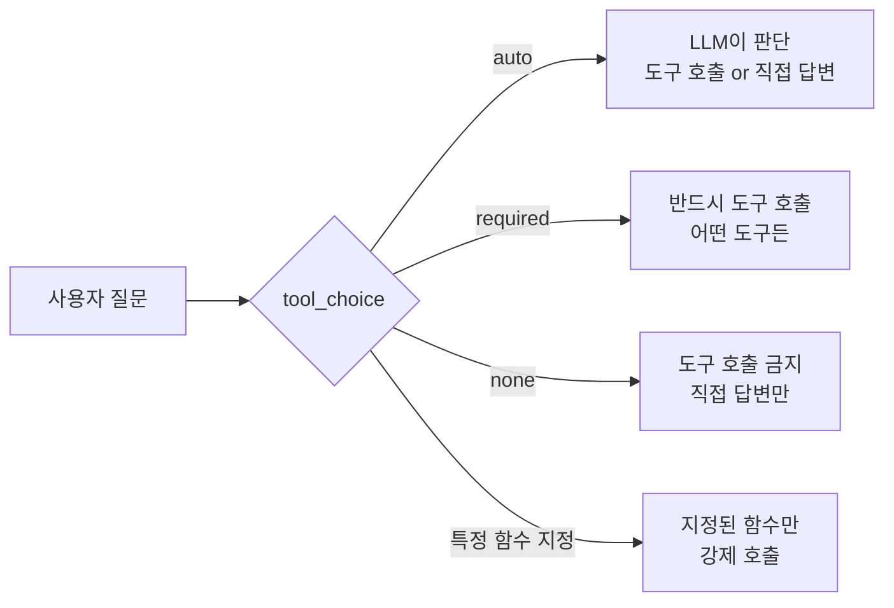
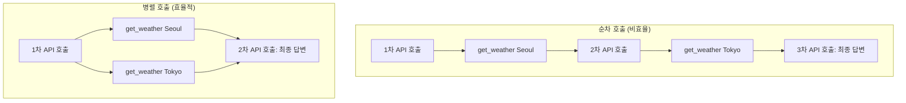
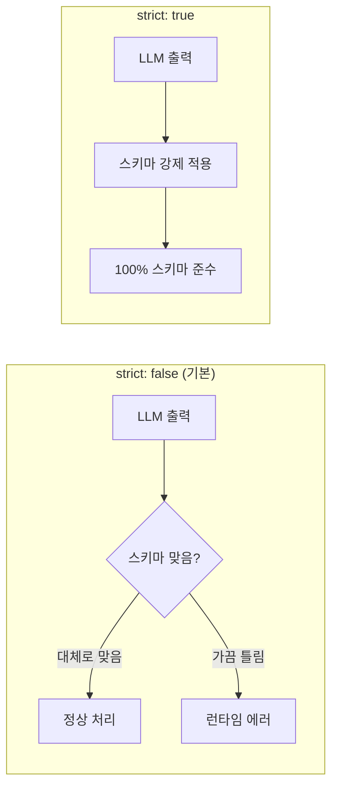

# 03. OpenAI API 도구 호출 실습

> OpenAI Chat Completions API로 도구를 정의하고, tool_choice를 제어하며, 병렬 도구 호출까지 직접 구현합니다

## 개요

이 섹션에서는 OpenAI Python SDK를 사용해 실제로 도구를 정의하고 호출하는 전 과정을 실습합니다. 앞서 [02. LLM Tool Calling 메커니즘](01-ch1-llm-도구-호출의-이해/02-02-llm-tool-calling-메커니즘.md)에서 배운 도구 호출 4단계 흐름을 OpenAI API 위에서 직접 코드로 구현하는 거죠.

**선수 지식**: Tool Calling의 4단계 흐름(요청→판단→실행→반환), JSON Schema 기반 도구 정의 구조
**학습 목표**:
- OpenAI Python SDK로 도구를 정의하고 Chat Completions API에 전달할 수 있다
- `tool_choice` 파라미터로 도구 호출 여부를 제어할 수 있다
- 병렬 도구 호출(parallel tool calls)을 처리하는 라운드트립을 구현할 수 있다
- `strict: True` 모드로 도구 인자의 스키마 안전성을 보장할 수 있다

## 왜 알아야 할까?

LLM 에이전트를 만드는 첫 번째 관문은 "LLM이 도구를 호출하고, 그 결과를 받아 다시 응답하는" 라운드트립을 직접 구현하는 것입니다. LangChain이나 LangGraph 같은 프레임워크가 이 과정을 추상화해주지만, 추상화 아래에서 무슨 일이 일어나는지 모르면 디버깅이 불가능해요.

실무에서 마주치는 상황을 생각해 보세요:
- "왜 LLM이 도구를 호출하지 않고 자기 멋대로 답변하지?" → `tool_choice` 설정 문제
- "같은 도구를 두 번 호출하는데 결과가 하나만 반환돼요" → 병렬 호출 처리 미흡
- "도구 인자에 엉뚱한 필드가 들어와요" → `strict` 모드 미설정

이런 문제들은 OpenAI API의 도구 호출 메커니즘을 직접 손에 익혀야 해결할 수 있습니다. 이 섹션에서 그 기초 체력을 만들어 봅시다.

## 핵심 개념

### 개념 1: 도구 정의 — JSON Schema로 LLM에게 메뉴판 건네기

> 💡 **비유**: 레스토랑에서 메뉴판을 건네는 것과 같습니다. 메뉴판(도구 정의)에는 요리 이름(함수명), 설명, 주문 가능한 옵션(파라미터)이 적혀 있죠. 손님(LLM)은 메뉴판을 보고 "이 요리를 이 옵션으로 주세요"라고 주문합니다. 메뉴판이 명확할수록 주문 실수가 줄어듭니다.

OpenAI Chat Completions API에서 도구는 `tools` 파라미터에 리스트로 전달합니다. 각 도구는 `type: "function"`과 함수 정보를 담은 딕셔너리입니다.

> 📊 **그림 1**: OpenAI API 도구 정의 구조



핵심 구조를 코드로 보겠습니다:

```python
from openai import OpenAI

client = OpenAI()  # OPENAI_API_KEY 환경변수에서 읽음

# 도구 정의 — JSON Schema 형식
tools = [
    {
        "type": "function",
        "function": {
            "name": "get_weather",
            "description": "지정된 도시의 현재 날씨를 조회합니다",
            "parameters": {
                "type": "object",
                "properties": {
                    "city": {
                        "type": "string",
                        "description": "도시명 (예: Seoul, Tokyo)"
                    },
                    "unit": {
                        "type": "string",
                        "enum": ["celsius", "fahrenheit"],
                        "description": "온도 단위"
                    }
                },
                "required": ["city"],  # 필수 파라미터
                "additionalProperties": False
            }
        }
    }
]
```

여기서 핵심 필드 세 가지를 기억하세요:

| 필드 | 역할 | 팁 |
|------|------|-----|
| `name` | LLM이 호출할 함수를 식별하는 키 | 동사+명사 조합 권장 (`get_weather`, `search_docs`) |
| `description` | LLM이 "이 도구를 써야 하나?" 판단하는 근거 | 구체적일수록 호출 정확도 상승 |
| `parameters` | 인자의 타입·제약조건 정의 | `enum`으로 선택지 제한하면 환각 감소 |

> ⚠️ **흔한 오해**: `description`은 사람이 읽으라고 쓰는 주석이 아닙니다. **LLM이 도구 선택의 핵심 근거로 사용하는 프롬프트**입니다. "날씨"라고만 쓰면 LLM이 이 도구의 용도를 정확히 파악하지 못할 수 있어요. "지정된 도시의 현재 날씨(기온, 상태, 습도)를 조회합니다"처럼 구체적으로 쓰세요.

### 개념 2: 라운드트립 — 주문부터 서빙까지 완전한 흐름

> 💡 **비유**: 레스토랑 주문 흐름을 떠올리세요. 손님이 주문(사용자 질문) → 웨이터가 주방에 전달(LLM이 도구 호출 결정) → 주방에서 요리(도구 실행) → 요리를 손님에게 서빙(결과 반환) → 손님이 맛보고 반응(LLM이 최종 응답 생성). 이 전체 왕복이 하나의 라운드트립입니다.

> 📊 **그림 2**: OpenAI API 도구 호출 라운드트립



라운드트립의 핵심은 **두 번의 API 호출**이 필요하다는 것입니다:

1. **1차 호출**: 사용자 메시지 + 도구 정의 전달 → LLM이 도구 호출 결정
2. **도구 실행**: 애플리케이션에서 실제 함수 실행 (LLM은 관여하지 않음)
3. **2차 호출**: 원래 메시지 + LLM의 도구 호출 + 실행 결과 → LLM이 최종 응답 생성

코드로 보면 이렇습니다:

```run:python
import json

# --- 시뮬레이션용 도구 함수 ---
def get_weather(city: str, unit: str = "celsius") -> dict:
    """실제로는 날씨 API를 호출하겠지만, 여기선 시뮬레이션"""
    weather_data = {
        "Seoul": {"temp": 18, "condition": "맑음", "humidity": 45},
        "Tokyo": {"temp": 22, "condition": "흐림", "humidity": 60},
    }
    data = weather_data.get(city, {"temp": 20, "condition": "알 수 없음", "humidity": 50})
    return {"city": city, "unit": unit, **data}

# --- 라운드트립 핵심 흐름 (시뮬레이션) ---

# Step 1: 1차 API 호출 결과 시뮬레이션 — LLM이 도구 호출을 결정
tool_call_from_llm = {
    "id": "call_abc123",
    "type": "function",
    "function": {
        "name": "get_weather",
        "arguments": '{"city": "Seoul", "unit": "celsius"}'
    }
}

# Step 2: 도구 실행 — 우리 코드에서 직접 실행
args = json.loads(tool_call_from_llm["function"]["arguments"])
result = get_weather(**args)
print(f"도구 실행 결과: {json.dumps(result, ensure_ascii=False)}")

# Step 3: 2차 API 호출을 위한 메시지 구성
tool_result_message = {
    "role": "tool",
    "tool_call_id": tool_call_from_llm["id"],  # 반드시 매칭!
    "content": json.dumps(result, ensure_ascii=False)
}
print(f"tool 메시지: role={tool_result_message['role']}, "
      f"tool_call_id={tool_result_message['tool_call_id']}")
```

```output
도구 실행 결과: {"city": "Seoul", "unit": "celsius", "temp": 18, "condition": "맑음", "humidity": 45}
tool 메시지: role=tool, tool_call_id=call_abc123
```

여기서 절대 놓치면 안 되는 포인트가 있습니다. `tool_call_id`를 LLM이 반환한 `id`와 **정확히 매칭**시켜야 합니다. 이 ID가 안 맞으면 OpenAI API가 에러를 반환합니다.

실제 OpenAI API를 사용하는 완전한 코드는 이렇습니다:

```python
from openai import OpenAI
import json

client = OpenAI()

# 도구 정의
tools = [
    {
        "type": "function",
        "function": {
            "name": "get_weather",
            "description": "지정된 도시의 현재 날씨를 조회합니다",
            "parameters": {
                "type": "object",
                "properties": {
                    "city": {"type": "string", "description": "도시명"},
                    "unit": {"type": "string", "enum": ["celsius", "fahrenheit"]}
                },
                "required": ["city"],
                "additionalProperties": False
            }
        }
    }
]

# 도구 레지스트리
TOOL_REGISTRY = {"get_weather": get_weather}

messages = [{"role": "user", "content": "서울 날씨 알려줘"}]

# 1차 호출 — LLM이 도구 호출 결정
response = client.chat.completions.create(
    model="gpt-4o",
    messages=messages,
    tools=tools,
    tool_choice="auto"
)

assistant_msg = response.choices[0].message

# finish_reason이 "tool_calls"인지 확인
if response.choices[0].finish_reason == "tool_calls":
    messages.append(assistant_msg)  # LLM의 도구 호출 메시지 추가

    # 모든 도구 호출 실행
    for tool_call in assistant_msg.tool_calls:
        func = TOOL_REGISTRY[tool_call.function.name]
        args = json.loads(tool_call.function.arguments)
        result = func(**args)

        messages.append({
            "role": "tool",
            "tool_call_id": tool_call.id,
            "content": json.dumps(result, ensure_ascii=False)
        })

    # 2차 호출 — LLM이 도구 결과를 바탕으로 최종 응답
    final = client.chat.completions.create(
        model="gpt-4o",
        messages=messages,
        tools=tools
    )
    print(final.choices[0].message.content)
```

### 개념 3: tool_choice — 도구 호출 제어 스위치

> 💡 **비유**: 자판기의 모드 스위치를 생각해 보세요. "자동 모드"(auto)에서는 동전을 넣으면 기계가 알아서 판단하고, "강제 모드"(required)에서는 반드시 음료를 뽑아야 하며, "잠금 모드"(none)에서는 아무것도 안 나옵니다. `tool_choice`가 바로 이 스위치입니다.

> 📊 **그림 3**: tool_choice 옵션별 동작



`tool_choice`의 네 가지 옵션을 코드로 비교해 봅시다:

```python
# 1. auto (기본값) — LLM이 알아서 판단
response = client.chat.completions.create(
    model="gpt-4o",
    messages=messages,
    tools=tools,
    tool_choice="auto"  # 생략해도 동일
)

# 2. required — 반드시 하나 이상의 도구를 호출
response = client.chat.completions.create(
    model="gpt-4o",
    messages=messages,
    tools=tools,
    tool_choice="required"  # 도구 호출을 강제
)

# 3. none — 도구 호출 금지, 직접 답변만
response = client.chat.completions.create(
    model="gpt-4o",
    messages=messages,
    tools=tools,
    tool_choice="none"  # 도구가 있어도 호출 안 함
)

# 4. 특정 함수 지정 — 해당 함수만 강제 호출
response = client.chat.completions.create(
    model="gpt-4o",
    messages=messages,
    tools=tools,
    tool_choice={
        "type": "function",
        "function": {"name": "get_weather"}
    }
)
```

각 옵션을 언제 써야 할까요?

| 옵션 | 사용 시점 | 예시 |
|------|----------|------|
| `"auto"` | 일반적인 대화 에이전트 | 사용자 질문에 따라 도구 호출 여부 판단 |
| `"required"` | 데이터 추출, 분류 파이프라인 | 입력을 반드시 구조화된 형태로 변환해야 할 때 |
| `"none"` | 도구 결과를 요약할 때 | 2차 호출에서 도구 재호출을 막고 싶을 때 |
| 특정 함수 지정 | 워크플로우의 특정 단계 | "이 단계에서는 반드시 검색을 수행해야 해" |

> 🔥 **실무 팁**: 에이전트 루프에서 2차 호출(도구 결과를 바탕으로 최종 답변을 생성하는 단계) 시 `tool_choice="none"`을 설정하면 무한 루프를 방지할 수 있습니다. LLM이 도구 결과를 보고 또 도구를 호출하는 상황을 막아주거든요.

### 개념 4: 병렬 도구 호출 — 한 번에 여러 주문 처리하기

> 💡 **비유**: 레스토랑에서 한 테이블이 스테이크, 파스타, 샐러드를 동시에 주문하면, 주방은 세 요리를 병렬로 준비합니다. 하나씩 순서대로 만들면 마지막 손님은 한참을 기다려야 하니까요. LLM도 마찬가지 — "서울과 도쿄 날씨를 알려줘"라고 하면 두 도시의 날씨를 **한 번에** 요청합니다.

> 📊 **그림 4**: 순차 호출 vs 병렬 호출 비교



병렬 도구 호출에서는 `response.choices[0].message.tool_calls`에 **복수의 도구 호출**이 담겨 옵니다. 이때 모든 결과를 한꺼번에 반환해야 한다는 게 핵심이에요.

```python
# 병렬 도구 호출 활성화 (기본값 True)
response = client.chat.completions.create(
    model="gpt-4o",
    messages=[
        {"role": "user", "content": "서울과 도쿄 날씨를 동시에 알려줘"}
    ],
    tools=tools,
    parallel_tool_calls=True  # 기본값, 명시적으로 설정
)

msg = response.choices[0].message

# 여러 도구 호출이 한 번에 올 수 있음!
if msg.tool_calls:
    print(f"도구 호출 개수: {len(msg.tool_calls)}")
    for tc in msg.tool_calls:
        print(f"  - {tc.function.name}({tc.function.arguments})")
```

**주의할 점**: 모든 모델이 병렬 호출을 지원하지는 않습니다. `gpt-4o`, `gpt-4.1`, `gpt-4.1-mini` 등은 지원하지만, o3나 o4-mini 같은 추론(reasoning) 모델은 병렬 호출을 지원하지 않습니다. 비활성화하려면 `parallel_tool_calls=False`로 설정하세요.

```run:python
import json

# 병렬 도구 호출 시뮬레이션
parallel_tool_calls = [
    {
        "id": "call_001",
        "type": "function",
        "function": {"name": "get_weather", "arguments": '{"city": "Seoul"}'}
    },
    {
        "id": "call_002",
        "type": "function",
        "function": {"name": "get_weather", "arguments": '{"city": "Tokyo"}'}
    }
]

# 모든 도구를 실행하고 결과 메시지를 구성
tool_results = []
for tc in parallel_tool_calls:
    args = json.loads(tc["function"]["arguments"])
    result = get_weather(**args)
    tool_results.append({
        "role": "tool",
        "tool_call_id": tc["id"],       # 각 호출의 ID와 매칭
        "content": json.dumps(result, ensure_ascii=False)
    })
    print(f"[{tc['id']}] {tc['function']['name']}({args}) → {result['condition']} {result['temp']}°C")

print(f"\n총 {len(tool_results)}개 결과를 2차 호출에 포함")
```

```output
[call_001] get_weather({'city': 'Seoul'}) → 맑음 18°C
[call_002] get_weather({'city': 'Tokyo'}) → 흐림 22°C

총 2개 결과를 2차 호출에 포함
```

### 개념 5: Structured Outputs — strict 모드로 스키마 안전성 보장

> 💡 **비유**: 일반 주문서는 손님이 "적당히 매운 걸로"라고 쓸 수 있지만, 체크박스 주문서는 "순한맛 / 보통 / 매운맛" 중 하나만 선택할 수 있습니다. `strict: True`는 체크박스 주문서와 같아요 — LLM이 스키마에서 벗어나는 인자를 생성하는 것 자체를 **구조적으로 불가능하게** 만듭니다.

[02. LLM Tool Calling 메커니즘](01-ch1-llm-도구-호출의-이해/02-02-llm-tool-calling-메커니즘.md)에서 Structured Outputs라는 개념을 소개했는데요, 여기서는 OpenAI API에서 이를 실제로 적용하는 방법을 살펴봅시다.

> 📊 **그림 5**: strict 모드 on/off 비교



`strict: True`를 설정하면 OpenAI가 **Constrained Decoding**을 적용합니다. 토큰 생성 단계에서 스키마에 어긋나는 토큰의 확률을 0으로 만들어 버리는 거죠. 결과적으로 반환되는 JSON은 100% 스키마를 준수합니다.

```python
# strict 모드 도구 정의
strict_tools = [
    {
        "type": "function",
        "function": {
            "name": "create_event",
            "description": "캘린더에 일정을 생성합니다",
            "strict": True,  # 핵심! Structured Outputs 활성화
            "parameters": {
                "type": "object",
                "properties": {
                    "title": {
                        "type": "string",
                        "description": "일정 제목"
                    },
                    "date": {
                        "type": "string",
                        "description": "YYYY-MM-DD 형식의 날짜"
                    },
                    "priority": {
                        "type": "string",
                        "enum": ["high", "medium", "low"]
                    },
                    "attendees": {
                        "type": "array",
                        "items": {"type": "string"},
                        "description": "참석자 이메일 목록"
                    }
                },
                # strict 모드 필수 조건 ↓
                "required": ["title", "date", "priority", "attendees"],
                "additionalProperties": False
            }
        }
    }
]
```

strict 모드를 쓸 때 반드시 지켜야 할 제약사항이 있습니다:

| 제약사항 | 이유 |
|---------|------|
| `additionalProperties: False` 필수 | 모든 object 레벨에서 명시해야 스키마 컴파일 가능 |
| 모든 속성을 `required`에 포함 | 선택적 필드는 `"anyOf": [{"type": "string"}, {"type": "null"}]`로 표현 |
| 첫 호출 시 약간의 지연 | 스키마를 컴파일하여 캐싱 (이후 호출은 빠름) |
| 중첩 object도 동일 규칙 적용 | 모든 깊이에서 `additionalProperties: False` 필요 |

> 💡 **알고 계셨나요?**: `strict: True`는 2024년 8월 `gpt-4o-2024-08-06` 모델과 함께 출시되었습니다. OpenAI에 따르면, strict 모드에서 구조화된 출력의 스키마 준수율은 **100%**입니다. 이전의 JSON 모드(`response_format: {"type": "json_object"}`)가 "JSON은 맞지만 스키마는 보장 못 함"이었던 것에 비하면 혁명적인 개선이죠.

## 실습: 직접 해보기

여러 도구를 정의하고, 병렬 호출을 포함한 완전한 라운드트립을 구현해 봅시다. 실제 API 키 없이도 흐름을 이해할 수 있도록 시뮬레이션 버전을 함께 제공합니다.

```python
"""
OpenAI API 도구 호출 실습 — 완전한 라운드트립 구현
실행 전 환경변수 설정: export OPENAI_API_KEY="sk-..."
"""
import json
from openai import OpenAI

client = OpenAI()

# --- 1. 도구 함수 정의 ---
def get_weather(city: str, unit: str = "celsius") -> dict:
    """도시의 현재 날씨를 반환합니다 (실제로는 API 호출)"""
    mock_data = {
        "Seoul": {"temp": 18, "condition": "맑음", "humidity": 45},
        "Tokyo": {"temp": 22, "condition": "흐림", "humidity": 60},
        "New York": {"temp": 15, "condition": "비", "humidity": 80},
    }
    data = mock_data.get(city, {"temp": 20, "condition": "정보 없음", "humidity": 50})
    if unit == "fahrenheit":
        data["temp"] = round(data["temp"] * 9 / 5 + 32)
    return {"city": city, "unit": unit, **data}


def search_restaurants(city: str, cuisine: str = "any") -> dict:
    """도시의 레스토랑을 검색합니다"""
    restaurants = {
        "Seoul": [
            {"name": "광화문 국밥", "cuisine": "한식", "rating": 4.5},
            {"name": "이태원 파스타", "cuisine": "양식", "rating": 4.2},
        ],
        "Tokyo": [
            {"name": "스시 다이", "cuisine": "일식", "rating": 4.8},
            {"name": "라멘 이치란", "cuisine": "일식", "rating": 4.6},
        ],
    }
    results = restaurants.get(city, [])
    if cuisine != "any":
        results = [r for r in results if r["cuisine"] == cuisine]
    return {"city": city, "cuisine": cuisine, "results": results}


# --- 2. 도구 스키마 정의 (OpenAI 형식) ---
tools = [
    {
        "type": "function",
        "function": {
            "name": "get_weather",
            "description": "지정된 도시의 현재 날씨(기온, 상태, 습도)를 조회합니다",
            "strict": True,
            "parameters": {
                "type": "object",
                "properties": {
                    "city": {
                        "type": "string",
                        "description": "도시명 (예: Seoul, Tokyo, New York)"
                    },
                    "unit": {
                        "type": "string",
                        "enum": ["celsius", "fahrenheit"],
                        "description": "온도 단위. 기본값 celsius"
                    }
                },
                "required": ["city", "unit"],
                "additionalProperties": False
            }
        }
    },
    {
        "type": "function",
        "function": {
            "name": "search_restaurants",
            "description": "도시의 레스토랑을 검색합니다. 요리 종류로 필터링 가능",
            "strict": True,
            "parameters": {
                "type": "object",
                "properties": {
                    "city": {
                        "type": "string",
                        "description": "레스토랑을 검색할 도시명"
                    },
                    "cuisine": {
                        "type": "string",
                        "description": "요리 종류 필터 (예: 한식, 일식, 양식). 'any'는 전체"
                    }
                },
                "required": ["city", "cuisine"],
                "additionalProperties": False
            }
        }
    }
]

# --- 3. 도구 레지스트리 ---
TOOL_REGISTRY = {
    "get_weather": get_weather,
    "search_restaurants": search_restaurants,
}


# --- 4. 라운드트립 엔진 ---
def run_tool_calling_loop(
    user_message: str,
    tools: list[dict],
    model: str = "gpt-4o",
    max_rounds: int = 5
) -> str:
    """도구 호출 라운드트립을 자동으로 수행합니다"""
    messages = [{"role": "user", "content": user_message}]

    for round_num in range(max_rounds):
        response = client.chat.completions.create(
            model=model,
            messages=messages,
            tools=tools,
            tool_choice="auto",
            parallel_tool_calls=True
        )

        choice = response.choices[0]
        assistant_msg = choice.message

        # 도구 호출이 없으면 최종 응답
        if choice.finish_reason != "tool_calls" or not assistant_msg.tool_calls:
            return assistant_msg.content

        # 도구 호출 처리
        messages.append(assistant_msg)
        print(f"\n[라운드 {round_num + 1}] "
              f"도구 {len(assistant_msg.tool_calls)}개 호출:")

        for tool_call in assistant_msg.tool_calls:
            func_name = tool_call.function.name
            args = json.loads(tool_call.function.arguments)
            print(f"  → {func_name}({args})")

            # 도구 실행
            func = TOOL_REGISTRY.get(func_name)
            if func:
                result = func(**args)
            else:
                result = {"error": f"알 수 없는 도구: {func_name}"}

            messages.append({
                "role": "tool",
                "tool_call_id": tool_call.id,
                "content": json.dumps(result, ensure_ascii=False)
            })

    return "최대 라운드 초과 — 응답을 완료하지 못했습니다."


# --- 5. 실행 ---
if __name__ == "__main__":
    # 테스트 1: 단일 도구 호출
    print("=== 테스트 1: 단일 도구 호출 ===")
    answer = run_tool_calling_loop("서울 날씨 어때?", tools)
    print(f"\n최종 응답: {answer}")

    # 테스트 2: 병렬 도구 호출 (두 도시 동시 조회)
    print("\n\n=== 테스트 2: 병렬 도구 호출 ===")
    answer = run_tool_calling_loop(
        "서울과 도쿄 날씨를 비교해줘, 그리고 서울 맛집도 추천해줘", tools
    )
    print(f"\n최종 응답: {answer}")
```

이 코드는 세 가지 핵심 패턴을 보여줍니다:

1. **도구 레지스트리 패턴**: 함수명 → 함수 객체 매핑 딕셔너리
2. **자동 라운드트립 루프**: `finish_reason` 체크 → 도구 실행 → 재호출, 최대 횟수 제한
3. **병렬 호출 처리**: `tool_calls` 리스트의 모든 항목을 순회하며 결과 수집

## 더 깊이 알아보기

### Function Calling에서 Tool Calling으로 — 이름이 바뀐 진짜 이유

2023년 6월, OpenAI는 GPT-4와 GPT-3.5-turbo에 **Function Calling** 기능을 처음 발표했습니다. 당시 API 파라미터는 `functions`와 `function_call`이었죠. 그런데 불과 5개월 뒤인 2023년 11월, OpenAI는 이를 `tools`와 `tool_choice`로 **개명**합니다.

왜 바꿨을까요? 단순한 네이밍 변경이 아니었습니다. "Function"은 프로그래밍의 함수 하나를 의미하지만, "Tool"은 더 넓은 개념 — 검색 엔진, 코드 인터프리터, 파일 시스템, 웹 브라우저 등을 포괄합니다. 실제로 OpenAI의 Assistants API(이제는 Responses API로 대체됨)에서는 `code_interpreter`, `file_search` 같은 시스템 내장 도구와 사용자 정의 함수를 `tools` 배열에 함께 담았습니다.

이 변경은 업계 전체의 방향을 예고한 것이기도 했습니다. 2024년 말 Anthropic이 MCP(Model Context Protocol)를 발표하면서 "도구"라는 추상화는 업계 표준이 되었고, 2025년에는 Google의 A2A 프로토콜까지 같은 방향으로 합류했죠.

### Responses API의 등장 — Chat Completions의 미래

2025년 3월, OpenAI는 **Responses API**라는 새로운 API를 발표했습니다. Chat Completions API와 달리, Responses API는 에이전트 루프를 API 내부에서 처리합니다. 웹 검색, 파일 검색, 코드 인터프리터, MCP 서버 연결까지 하나의 요청으로 가능하죠.

하지만 Chat Completions API가 사라지는 건 아닙니다. 여전히 가장 범용적이고 안정적인 인터페이스이며, LangChain/LangGraph 등 대부분의 프레임워크가 Chat Completions API를 기반으로 합니다. Chat Completions의 도구 호출 메커니즘을 이해해야 Responses API도, 프레임워크도 제대로 쓸 수 있습니다.

## 흔한 오해와 팁

> ⚠️ **흔한 오해**: "LLM이 도구를 직접 실행한다." — 아닙니다! LLM은 **"이 함수를 이 인자로 호출해줘"라는 JSON을 출력할 뿐**이고, 실제 실행은 우리 애플리케이션 코드에서 합니다. 이것을 이해하지 못하면 보안 취약점(임의 코드 실행 등)을 만들기 쉽습니다.

> ⚠️ **흔한 오해**: "`strict: True`를 쓰면 모든 모델에서 동작한다." — strict 모드는 Structured Outputs를 지원하는 모델에서만 작동합니다. 지원하지 않는 모델에서 `strict: True`를 설정하면 에러가 발생하므로, 모델 호환성을 반드시 확인하세요.

> 💡 **알고 계셨나요?**: `parallel_tool_calls`는 기본값이 `True`입니다. 그런데 o3, o4-mini 같은 **추론(reasoning) 모델**은 이 파라미터를 아예 무시하고 항상 순차적으로 도구를 호출합니다. 추론 모델은 "생각하면서 하나씩" 호출하는 것이 더 정확하다고 판단하기 때문이에요.

> 🔥 **실무 팁**: `description`을 잘 쓰는 것이 프롬프트 엔지니어링의 절반입니다. 도구가 10개 이상이면 LLM이 혼동할 수 있는데, `description`에 **언제 이 도구를 써야 하고 언제 쓰면 안 되는지**를 명시하면 정확도가 크게 올라갑니다. 예: `"실시간 날씨를 조회합니다. 과거 날씨 데이터에는 사용하지 마세요. 과거 데이터는 get_historical_weather를 사용하세요."`

> 🔥 **실무 팁**: 병렬 도구 호출 시 한 도구가 실패하면 어떻게 할까요? 나머지 성공한 결과는 정상적으로 `tool` 메시지로 보내고, 실패한 도구에 대해서는 에러 정보를 `content`에 담아 보내세요. LLM이 에러를 인식하고 사용자에게 적절히 안내하거나 재시도를 결정합니다.

```python
# 도구 실행 실패 처리 패턴
try:
    result = func(**args)
    content = json.dumps(result, ensure_ascii=False)
except Exception as e:
    content = json.dumps({
        "error": str(e),
        "message": f"{func_name} 실행 중 오류가 발생했습니다"
    })

messages.append({
    "role": "tool",
    "tool_call_id": tool_call.id,
    "content": content  # 성공이든 실패든 반드시 결과를 보내야 함
})
```

## 핵심 정리

| 개념 | 설명 |
|------|------|
| `tools` 파라미터 | JSON Schema 형식으로 도구를 정의하여 LLM에 전달하는 리스트 |
| 라운드트립 | 1차 호출(도구 결정) → 도구 실행 → 2차 호출(최종 응답)의 왕복 흐름 |
| `tool_call_id` | LLM이 발행한 ID로 도구 결과를 매칭하는 필수 키 |
| `tool_choice` | `auto` / `required` / `none` / 특정 함수 지정으로 도구 호출 제어 |
| `parallel_tool_calls` | `True`(기본값)이면 여러 도구를 한 번에 호출 가능 (추론 모델 제외) |
| `strict: True` | Structured Outputs 활성화 — 100% 스키마 준수 보장 |
| `role: "tool"` | 도구 실행 결과를 LLM에 반환할 때 사용하는 메시지 역할 |

## 다음 섹션 미리보기

지금까지 OpenAI API에서 도구를 정의하고 호출하는 전체 흐름을 익혔습니다. 다음 섹션 [04. Anthropic API 도구 호출 실습](01-ch1-llm-도구-호출의-이해/04-04-anthropic-api-도구-호출-실습.md)에서는 Anthropic의 Claude API로 동일한 작업을 수행합니다. 두 API는 개념은 같지만 메시지 구조와 파라미터명이 다릅니다 — OpenAI의 `tools`와 Anthropic의 `tools`는 같은 이름이지만 내부 스키마 구조가 다르고, 도구 결과 반환 방식도 차이가 있습니다. 두 API를 모두 다룰 수 있어야 Ch5 이후의 LangGraph 에이전트에서 모델을 자유롭게 교체할 수 있습니다.

## 참고 자료

- [Function calling | OpenAI API](https://platform.openai.com/docs/guides/function-calling) - OpenAI 공식 도구 호출 가이드. tool_choice, parallel_tool_calls 등 전체 파라미터 설명
- [Structured model outputs | OpenAI API](https://platform.openai.com/docs/guides/structured-outputs) - strict 모드와 Structured Outputs의 공식 문서. 스키마 제약사항과 지원 모델 안내
- [o3/o4-mini Function Calling Guide | OpenAI Cookbook](https://cookbook.openai.com/examples/o-series/o3o4-mini_prompting_guide) - 최신 추론 모델에서의 도구 호출 모범 사례와 팁
- [Migrate to the Responses API | OpenAI API](https://platform.openai.com/docs/guides/migrate-to-responses) - Chat Completions에서 Responses API로의 마이그레이션 가이드
- [ReAct: Synergizing Reasoning and Acting in Language Models](https://arxiv.org/abs/2210.03629) - Tool Calling을 에이전트 패턴으로 확장한 ReAct 논문. 다음 챕터의 기초

---
### 🔗 Related Sessions
- [tool calling](01-ch1-llm-도구-호출의-이해/02-02-llm-tool-calling-메커니즘.md) (prerequisite)
- [function calling](01-ch1-llm-도구-호출의-이해/02-02-llm-tool-calling-메커니즘.md) (prerequisite)
- [json schema 도구 정의](01-ch1-llm-도구-호출의-이해/02-02-llm-tool-calling-메커니즘.md) (prerequisite)
- [라운드트립](01-ch1-llm-도구-호출의-이해/02-02-llm-tool-calling-메커니즘.md) (prerequisite)
- [도구 레지스트리](01-ch1-llm-도구-호출의-이해/02-02-llm-tool-calling-메커니즘.md) (prerequisite)
