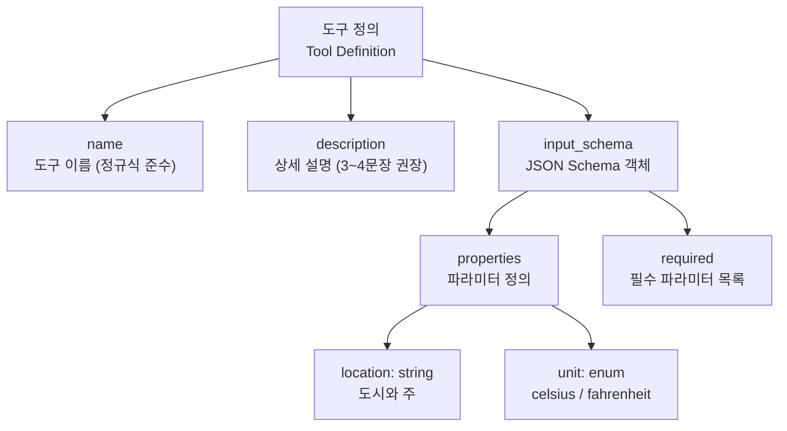
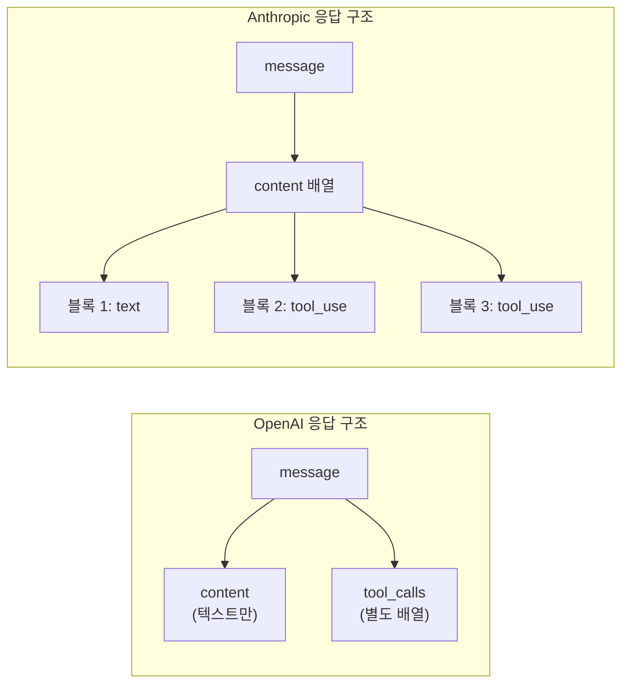
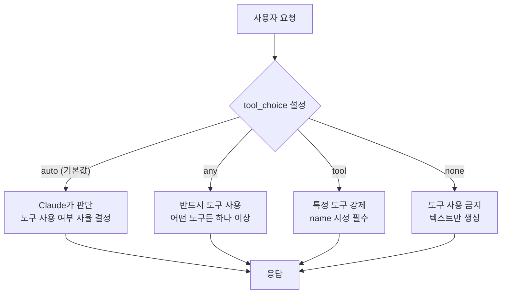
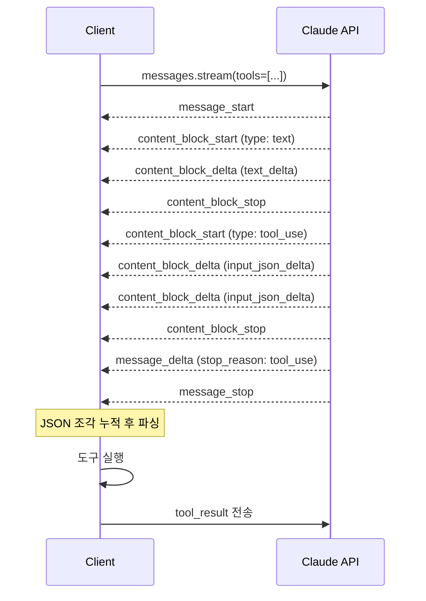

# Anthropic API 도구 호출 실습

> Claude Messages API에서 `tool_use` 블록으로 도구를 호출하고, 스트리밍 환경에서 도구 호출을 처리하는 완전한 워크플로우를 익힙니다.

## 개요

이 섹션에서는 Anthropic의 Claude Messages API를 사용하여 도구 호출을 구현합니다. 앞서 [OpenAI API 도구 호출 실습](01-llm-도구-호출의-이해/03-openai-api-도구-호출-실습.md)에서 배운 라운드트립 패턴을 Anthropic의 독자적인 `tool_use`/`tool_result` 구조로 변환하면서, 두 API 간의 설계 철학 차이를 체감하게 됩니다.

**선수 지식**: [LLM Tool Calling 메커니즘](01-llm-도구-호출의-이해/02-llm-tool-calling-메커니즘.md)에서 배운 4단계 라운드트립 흐름, [OpenAI API 도구 호출 실습](01-llm-도구-호출의-이해/03-openai-api-도구-호출-실습.md)의 도구 정의·호출·결과 반환 패턴

**학습 목표**:
- Anthropic Messages API에서 `tool_use` / `tool_result` 콘텐츠 블록의 구조를 이해한다
- `input_schema`를 사용한 도구 정의와 `tool_choice` 옵션을 자유롭게 활용한다
- 스트리밍 환경에서 `input_json_delta`를 누적하여 도구 호출을 실시간 처리한다
- OpenAI API와의 핵심 차이점을 구조적으로 비교할 수 있다

## 왜 알아야 할까?

LangGraph와 LangChain 생태계는 "모델 교체"가 일상인 세계입니다. OpenAI에서 Claude로, 또는 그 반대로 모델을 바꿀 때 도구 호출 인터페이스의 차이를 모르면 디버깅에 수 시간을 허비하게 됩니다. 특히 Anthropic API는 **콘텐츠 블록(content block)** 기반 설계라서 OpenAI의 `tool_calls` 배열 방식과 근본적으로 다릅니다. 두 API를 모두 손에 익혀두면, Ch2부터 시작되는 에이전트 루프 구현에서 모델에 구애받지 않는 유연한 설계가 가능해집니다.

실무에서도 Claude의 도구 호출은 점점 중요해지고 있는데요. MCP(Model Context Protocol) 생태계의 급성장과 함께, Claude 기반 에이전트 시스템을 구축하는 프로젝트가 폭발적으로 늘고 있거든요. Ch9~Ch10에서 다룰 MCP 서버/클라이언트 통합의 기반도 바로 이 도구 호출 메커니즘입니다.

## 핵심 개념

### 개념 1: Anthropic 도구 정의 — `input_schema` 구조

> 💡 **비유**: OpenAI가 도구를 "함수 호출 명세서"로 정의한다면, Anthropic은 "입력 양식(input form)"으로 정의합니다. 이력서 양식에 이름·나이·경력 칸이 있듯이, `input_schema`에 각 파라미터의 이름·타입·설명을 기술하는 거죠.

Anthropic의 도구 정의는 `name`, `description`, `input_schema` 세 필드로 구성됩니다. OpenAI가 `parameters`라는 이름을 쓰는 반면, Anthropic은 `input_schema`라는 이름을 사용하는데요. 내부 구조는 동일한 JSON Schema이지만, 최상위 키 이름이 다르다는 점이 첫 번째 차이입니다.

> 📊 **그림 1**: Anthropic 도구 정의 구조



도구 정의의 핵심은 `description`입니다. Anthropic 공식 문서에서는 3~4문장 이상의 상세한 설명을 권장하는데요. Claude가 도구를 "언제" 사용해야 할지, "어떤 제약"이 있는지를 이 설명에서 판단하기 때문입니다.

```python
# Anthropic 도구 정의 — input_schema 사용
weather_tool = {
    "name": "get_weather",
    "description": (
        "주어진 위치의 현재 날씨를 조회합니다. "
        "location은 반드시 유효한 도시명이어야 합니다. "
        "최신 기온을 지정된 단위로 반환합니다. "
        "날씨 이외의 정보는 제공하지 않습니다."
    ),
    "input_schema": {  # OpenAI는 "parameters"
        "type": "object",
        "properties": {
            "location": {
                "type": "string",
                "description": "도시와 주, 예: Seoul, KR"
            },
            "unit": {
                "type": "string",
                "enum": ["celsius", "fahrenheit"],
                "description": "온도 단위"
            }
        },
        "required": ["location"]
    }
}
```

> ⚠️ **흔한 오해**: "`input_schema`와 `parameters`는 이름만 다를 뿐 완전히 같다"고 생각하기 쉽지만, Anthropic은 `input_schema` 안에 `additionalProperties`를 명시하지 않아도 됩니다. OpenAI의 `strict: true` 모드에서는 이 필드가 필수인 것과 대비됩니다. 또한 Anthropic의 도구 이름 정규식은 `^[a-zA-Z0-9_-]{1,64}$`로, 최대 64자까지 허용합니다.

### 개념 2: `tool_use` / `tool_result` 콘텐츠 블록

> 💡 **비유**: 편의점 택배를 생각해보세요. OpenAI는 택배 송장(tool_calls)을 별도 필드에 붙이지만, Anthropic은 택배 상자 안에 물건(text)과 송장(tool_use)을 함께 넣습니다. 같은 `content` 배열 안에 텍스트와 도구 호출이 공존하는 거죠.

Anthropic API의 가장 큰 특징은 **콘텐츠 블록 기반 설계**입니다. 응답의 `content`는 여러 블록의 배열이며, 각 블록은 `type` 필드로 구분됩니다.

> 📊 **그림 2**: OpenAI vs Anthropic 응답 구조 비교



Claude가 도구를 호출하기로 결정하면, 응답에 `tool_use` 타입의 콘텐츠 블록이 포함됩니다:

```python
# Claude의 tool_use 응답 블록 구조
{
    "type": "tool_use",
    "id": "toolu_01A09q90qw90lq917835lq9",  # 고유 ID
    "name": "get_weather",                    # 호출할 도구 이름
    "input": {                                # input_schema에 맞는 인자
        "location": "Seoul, KR",
        "unit": "celsius"
    }
}
```

도구를 실행한 후에는 `tool_result` 블록으로 결과를 돌려줍니다. 여기서 핵심은 `tool_use_id`로 어떤 도구 호출에 대한 응답인지 매칭하는 것입니다:

```python
# 도구 결과 반환 — tool_result 블록
{
    "role": "user",
    "content": [
        {
            "type": "tool_result",
            "tool_use_id": "toolu_01A09q90qw90lq917835lq9",
            "content": "서울: 22°C, 맑음",
            "is_error": False  # 에러 시 True로 설정
        }
    ]
}
```

> 🔥 **실무 팁**: `tool_result`의 `content`는 단순 문자열뿐 아니라, `text`와 `image` 블록의 배열로도 전달할 수 있습니다. 예를 들어 차트 이미지와 설명 텍스트를 함께 반환하면 Claude가 시각적 정보까지 활용해서 응답합니다. 이 멀티모달 도구 결과는 OpenAI에는 없는 Anthropic만의 강점이죠.

### 개념 3: `tool_choice`와 병렬 도구 호출

Anthropic의 `tool_choice`는 OpenAI와 유사하지만 옵션 체계가 약간 다릅니다. `type` 필드로 모드를 지정합니다.

> 📊 **그림 3**: tool_choice 옵션별 동작 흐름



```python
import anthropic

client = anthropic.Anthropic()

# auto: Claude가 자율 판단 (기본값)
response = client.messages.create(
    model="claude-sonnet-4-5-20250514",
    max_tokens=1024,
    tools=[weather_tool],
    tool_choice={"type": "auto"},  # 생략 가능
    messages=[{"role": "user", "content": "서울 날씨 알려줘"}]
)

# any: 반드시 도구를 사용하도록 강제
response = client.messages.create(
    model="claude-sonnet-4-5-20250514",
    max_tokens=1024,
    tools=[weather_tool],
    tool_choice={"type": "any"},
    messages=[{"role": "user", "content": "서울 날씨 알려줘"}]
)

# tool: 특정 도구를 강제 지정
response = client.messages.create(
    model="claude-sonnet-4-5-20250514",
    max_tokens=1024,
    tools=[weather_tool],
    tool_choice={"type": "tool", "name": "get_weather"},
    messages=[{"role": "user", "content": "서울 날씨 알려줘"}]
)
```

병렬 도구 호출도 기본적으로 지원됩니다. Claude는 독립적인 여러 도구 호출을 한 응답에 담을 수 있으며, `tool_choice` 내 `disable_parallel_tool_use` 옵션으로 비활성화할 수 있습니다. 이 옵션은 2024년 후반에 추가된 기능이므로, 사용 시 API 버전을 확인하세요. 결과를 돌려줄 때는 모든 `tool_result` 블록을 하나의 `user` 메시지에 담아야 하고, **`tool_result` 블록이 반드시 먼저**, 그 뒤에 텍스트가 와야 합니다.

```python
# 병렬 도구 호출 비활성화 예시
# ※ disable_parallel_tool_use는 2024년 후반 추가된 옵션입니다.
#    anthropic-version: 2023-06-01 이후 SDK에서 지원됩니다.
#    SDK를 최신 버전으로 유지하세요: pip install --upgrade anthropic
response = client.messages.create(
    model="claude-sonnet-4-5-20250514",
    max_tokens=1024,
    tools=tools,
    tool_choice={
        "type": "auto",
        "disable_parallel_tool_use": True  # 한 번에 하나의 도구만 호출
    },
    messages=[{"role": "user", "content": "서울과 도쿄 날씨 비교해줘"}]
)
```

### 개념 4: 스트리밍 환경에서의 도구 호출

> 💡 **비유**: 일반 API 호출이 "택배가 집에 도착한 후 한꺼번에 여는 것"이라면, 스트리밍은 "컨베이어 벨트 위 소포를 하나씩 받는 것"과 같습니다. 도구 호출의 JSON 인자도 조각(delta)으로 나눠서 도착하죠.

스트리밍에서 도구 호출을 처리할 때는 SSE(Server-Sent Events) 이벤트의 흐름을 이해해야 합니다.

> 📊 **그림 4**: 스트리밍 도구 호출 이벤트 시퀀스



핵심은 `input_json_delta` 이벤트입니다. `tool_use` 블록의 `input` 필드가 JSON 문자열 조각으로 전달되는데요. 이 조각들을 문자열로 누적한 뒤, `content_block_stop` 이벤트를 받으면 전체 JSON을 파싱합니다:

```python
import anthropic
import json

client = anthropic.Anthropic()

# 스트리밍에서 도구 호출 처리
with client.messages.stream(
    model="claude-sonnet-4-5-20250514",
    max_tokens=1024,
    tools=[weather_tool],
    messages=[{"role": "user", "content": "서울과 도쿄 날씨 비교해줘"}]
) as stream:
    current_tool_input = ""  # JSON 조각 누적 버퍼
    current_tool_name = ""
    current_tool_id = ""
    
    for event in stream:
        # 텍스트 스트리밍
        if event.type == "content_block_start":
            if hasattr(event.content_block, "type"):
                if event.content_block.type == "tool_use":
                    current_tool_name = event.content_block.name
                    current_tool_id = event.content_block.id
                    current_tool_input = ""
                    
        elif event.type == "content_block_delta":
            if hasattr(event.delta, "type"):
                if event.delta.type == "text_delta":
                    print(event.delta.text, end="", flush=True)
                elif event.delta.type == "input_json_delta":
                    # JSON 조각을 누적
                    current_tool_input += event.delta.partial_json
                    
        elif event.type == "content_block_stop":
            if current_tool_name:
                # 누적된 JSON을 파싱
                tool_input = json.loads(current_tool_input)
                print(f"\n[도구 호출] {current_tool_name}: {tool_input}")
                current_tool_name = ""
```

> 💡 **알고 계셨나요?**: 현재 Claude 모델은 `input`의 키-값 쌍을 한 번에 하나씩 완성해서 내보냅니다. 그래서 스트리밍 중에 도구 인자가 생성되는 동안 잠깐의 지연이 있을 수 있는데요, 이는 모델의 설계적 특성이지 네트워크 문제가 아닙니다. 향후 모델에서는 더 세밀한 단위의 스트리밍이 지원될 수 있다고 Anthropic 문서에 명시되어 있습니다.

## 실습: 직접 해보기

Anthropic API로 완전한 도구 호출 라운드트립을 구현해봅시다. 날씨 조회, 환율 계산 두 가지 도구를 등록하고 병렬 호출까지 처리하는 에이전트 루프입니다.

```python
import anthropic
import json
from typing import Any

# ── 1. Anthropic 클라이언트 초기화 ──
# anthropic >= 0.39.0 권장 (tool_choice.disable_parallel_tool_use 지원)
client = anthropic.Anthropic()  # ANTHROPIC_API_KEY 환경변수 필요

# ── 2. 도구 정의 ──
tools = [
    {
        "name": "get_weather",
        "description": (
            "주어진 도시의 현재 날씨를 조회합니다. "
            "location은 '도시, 국가코드' 형식이어야 합니다. "
            "기온, 날씨 상태, 습도를 반환합니다."
        ),
        "input_schema": {
            "type": "object",
            "properties": {
                "location": {
                    "type": "string",
                    "description": "도시와 국가코드, 예: Seoul, KR"
                },
                "unit": {
                    "type": "string",
                    "enum": ["celsius", "fahrenheit"],
                    "description": "온도 단위 (기본값: celsius)"
                }
            },
            "required": ["location"]
        }
    },
    {
        "name": "convert_currency",
        "description": (
            "통화를 환전합니다. "
            "from_currency와 to_currency는 ISO 4217 통화 코드입니다. "
            "amount는 양수여야 합니다."
        ),
        "input_schema": {
            "type": "object",
            "properties": {
                "amount": {
                    "type": "number",
                    "description": "환전할 금액"
                },
                "from_currency": {
                    "type": "string",
                    "description": "원래 통화 코드 (예: USD, KRW)"
                },
                "to_currency": {
                    "type": "string",
                    "description": "변환할 통화 코드 (예: JPY, EUR)"
                }
            },
            "required": ["amount", "from_currency", "to_currency"]
        }
    }
]

# ── 3. 도구 실행 함수 (시뮬레이션) ──
def execute_tool(name: str, tool_input: dict[str, Any]) -> str:
    """도구를 실행하고 결과를 문자열로 반환합니다."""
    if name == "get_weather":
        # 실제로는 외부 날씨 API 호출
        weather_data = {
            "Seoul, KR": {"temp": 22, "condition": "맑음", "humidity": 45},
            "Tokyo, JP": {"temp": 26, "condition": "흐림", "humidity": 60},
            "New York, US": {"temp": 18, "condition": "비", "humidity": 78},
        }
        loc = tool_input["location"]
        unit = tool_input.get("unit", "celsius")
        data = weather_data.get(loc, {"temp": 20, "condition": "알 수 없음", "humidity": 50})
        temp = data["temp"]
        if unit == "fahrenheit":
            temp = round(temp * 9 / 5 + 32)
        return json.dumps({
            "location": loc,
            "temperature": f"{temp}°{'F' if unit == 'fahrenheit' else 'C'}",
            "condition": data["condition"],
            "humidity": f"{data['humidity']}%"
        }, ensure_ascii=False)

    elif name == "convert_currency":
        # 실제로는 환율 API 호출
        rates = {
            ("USD", "KRW"): 1350.0,
            ("KRW", "JPY"): 0.11,
            ("USD", "JPY"): 149.5,
            ("EUR", "USD"): 1.08,
        }
        pair = (tool_input["from_currency"], tool_input["to_currency"])
        rate = rates.get(pair, 1.0)
        result = tool_input["amount"] * rate
        return json.dumps({
            "from": f"{tool_input['amount']} {pair[0]}",
            "to": f"{result:,.2f} {pair[1]}",
            "rate": rate
        }, ensure_ascii=False)

    return json.dumps({"error": f"알 수 없는 도구: {name}"})

# ── 4. 에이전트 루프 ──
def run_agent(user_message: str, max_turns: int = 5) -> str:
    """Anthropic API 도구 호출 라운드트립 루프를 실행합니다."""
    messages = [{"role": "user", "content": user_message}]

    for turn in range(max_turns):
        # Claude에게 메시지 전송
        response = client.messages.create(
            model="claude-sonnet-4-5-20250514",
            max_tokens=1024,
            tools=tools,
            messages=messages,
        )

        print(f"\n── 턴 {turn + 1} ──")
        print(f"stop_reason: {response.stop_reason}")

        # stop_reason 확인
        if response.stop_reason == "end_turn":
            # 최종 텍스트 응답 추출
            final_text = ""
            for block in response.content:
                if block.type == "text":
                    final_text += block.text
            print(f"최종 응답: {final_text}")
            return final_text

        elif response.stop_reason == "tool_use":
            # 어시스턴트 메시지를 대화에 추가
            messages.append({
                "role": "assistant",
                "content": response.content
            })

            # 모든 tool_use 블록을 찾아서 실행
            tool_results = []
            for block in response.content:
                if block.type == "tool_use":
                    print(f"  도구 호출: {block.name}({block.input})")
                    result = execute_tool(block.name, block.input)
                    print(f"  결과: {result}")
                    tool_results.append({
                        "type": "tool_result",
                        "tool_use_id": block.id,
                        "content": result,
                    })

            # 모든 tool_result를 하나의 user 메시지로 전송
            messages.append({
                "role": "user",
                "content": tool_results
            })

    return "최대 턴 수 초과"

# ── 실행 ──
result = run_agent(
    "서울과 도쿄의 날씨를 비교하고, "
    "10만원을 엔화로 환전하면 얼마인지 알려줘"
)
```

```run:python
# 실행 흐름 시뮬레이션 (API 호출 없이 구조 확인)
import json

# Anthropic 응답 구조 시뮬레이션
simulated_response = {
    "stop_reason": "tool_use",
    "content": [
        {"type": "text", "text": "날씨와 환율을 조회하겠습니다."},
        {
            "type": "tool_use",
            "id": "toolu_01abc",
            "name": "get_weather",
            "input": {"location": "Seoul, KR", "unit": "celsius"}
        },
        {
            "type": "tool_use",
            "id": "toolu_02def",
            "name": "get_weather",
            "input": {"location": "Tokyo, JP", "unit": "celsius"}
        },
        {
            "type": "tool_use",
            "id": "toolu_03ghi",
            "name": "convert_currency",
            "input": {"amount": 100000, "from_currency": "KRW", "to_currency": "JPY"}
        }
    ]
}

# tool_use 블록 추출 및 처리
for block in simulated_response["content"]:
    if block["type"] == "tool_use":
        print(f"도구: {block['name']}")
        print(f"  ID: {block['id']}")
        print(f"  입력: {json.dumps(block['input'], ensure_ascii=False)}")
        print()

# tool_result 구성
tool_results = []
for block in simulated_response["content"]:
    if block["type"] == "tool_use":
        tool_results.append({
            "type": "tool_result",
            "tool_use_id": block["id"],
            "content": f"[{block['name']} 결과]"
        })

print(f"반환할 tool_result 수: {len(tool_results)}")
print(f"첫 번째 result의 tool_use_id: {tool_results[0]['tool_use_id']}")
```

```output
도구: get_weather
  ID: toolu_01abc
  입력: {"location": "Seoul, KR", "unit": "celsius"}

도구: get_weather
  ID: toolu_02def
  입력: {"location": "Tokyo, JP", "unit": "celsius"}

도구: convert_currency
  ID: toolu_03ghi
  입력: {"amount": 100000, "from_currency": "KRW", "to_currency": "JPY"}

반환할 tool_result 수: 3
첫 번째 result의 tool_use_id: toolu_01abc
```

**에러 핸들링 패턴** — 도구 실행이 실패하면 `is_error: True`와 함께 에러 메시지를 반환합니다. Claude는 이 정보를 바탕으로 재시도하거나 사용자에게 안내합니다:

```python
# 에러 발생 시 tool_result 구성
def safe_execute_tool(name: str, tool_input: dict) -> dict:
    """도구를 안전하게 실행하고, 에러 시 is_error를 설정합니다."""
    try:
        result = execute_tool(name, tool_input)
        return {
            "type": "tool_result",
            "tool_use_id": "toolu_...",  # 실제 ID 사용
            "content": result,
        }
    except Exception as e:
        return {
            "type": "tool_result",
            "tool_use_id": "toolu_...",
            "content": f"도구 실행 실패: {str(e)}",
            "is_error": True,  # Claude에게 에러임을 알림
        }
```

## 더 깊이 알아보기

### Anthropic Tool Use의 탄생 배경

Anthropic의 Tool Use 기능은 2024년 5월에 정식 출시되었습니다. 흥미로운 점은, Anthropic이 처음부터 "Function Calling"이라는 이름을 쓰지 않고 **"Tool Use"**라는 용어를 택했다는 것인데요. 이는 단순한 브랜딩 차이가 아닙니다.

OpenAI가 2023년 6월 `function_calling`으로 시작해서 2023년 11월 `tool_calls`로 이름을 바꾼 전례를 보고, Anthropic은 처음부터 "도구(Tool)"라는 더 포괄적인 개념으로 설계한 것이죠. 실제로 Anthropic의 콘텐츠 블록 구조는 텍스트, 도구 호출, 이미지, 사고(thinking) 등을 동일한 추상화 수준에서 다룰 수 있게 해주는데, 이 확장 가능한 설계 덕분에 2025년에 Extended Thinking(확장 사고) 기능을 자연스럽게 추가할 수 있었습니다.

### 콘텐츠 블록 설계의 철학

Anthropic의 `content` 배열 기반 설계는 Dario Amodei가 강조하는 "구성 가능성(composability)" 원칙의 반영이기도 합니다. 모든 것이 블록이면, 새로운 유형의 출력(사고, 코드 실행, 도구 호출)을 추가할 때 API 스키마를 근본적으로 바꿀 필요가 없거든요. 실제로 2025년 하반기에 추가된 Advanced Tool Use — Tool Search Tool, Programmatic Tool Calling — 도 모두 이 블록 구조 위에 자연스럽게 올라갔습니다.

### stop_reason의 진화

초기 Anthropic API에서는 `stop_reason`이 `"stop_sequence"`와 `"max_tokens"` 두 가지뿐이었습니다. Tool Use 출시와 함께 `"tool_use"`가 추가되었고, Extended Thinking에서는 `"end_turn"`과 결합되어 더 풍부한 종료 시그널을 제공하게 되었죠. 이 진화 과정은 API가 어떻게 하위 호환성을 유지하면서 기능을 확장하는지 보여주는 좋은 사례입니다.

## 흔한 오해와 팁

> ⚠️ **흔한 오해**: "Anthropic API에서 `stop_reason`이 `tool_use`이면 텍스트 응답이 없다"고 생각하기 쉽습니다. 하지만 `tool_choice`가 `auto`일 때 Claude는 텍스트 블록과 `tool_use` 블록을 **동시에** 반환할 수 있습니다. "날씨를 확인해보겠습니다"라는 텍스트와 도구 호출이 같은 응답에 담기죠. 반면 `tool_choice`가 `any`나 `tool`이면 텍스트 없이 바로 도구 호출만 나옵니다.

> 💡 **알고 계셨나요?**: Anthropic의 `tool_use_id`는 항상 `toolu_`로 시작합니다. 이 접두사는 "tool use"의 약자인데요, 디버깅할 때 로그에서 도구 호출 관련 ID를 빠르게 식별하는 데 유용합니다. OpenAI의 `call_` 접두사와 비교해보세요.

> 🔥 **실무 팁**: 스트리밍에서 `input_json_delta`를 직접 파싱하는 것보다, Python SDK의 `stream.get_final_message()`를 사용하는 것이 훨씬 안전합니다. SDK가 JSON 조각 누적과 파싱을 자동 처리해주거든요. 직접 구현이 필요한 경우에만 raw 이벤트를 다루세요:

```python
# 권장: SDK 헬퍼 사용
with client.messages.stream(
    model="claude-sonnet-4-5-20250514",
    max_tokens=1024,
    tools=tools,
    messages=messages,
) as stream:
    response = stream.get_final_message()
    # response는 일반 create()와 동일한 Message 객체
```

## 핵심 정리

| 개념 | 설명 |
|------|------|
| `input_schema` | Anthropic의 도구 파라미터 정의 (OpenAI의 `parameters`에 해당) |
| `tool_use` 블록 | Claude가 도구 호출을 요청하는 콘텐츠 블록. `id`, `name`, `input` 포함 |
| `tool_result` 블록 | 도구 실행 결과를 Claude에게 반환하는 블록. `tool_use_id`로 매칭 |
| `tool_choice` | `auto`, `any`, `tool`, `none` 네 가지 모드로 도구 사용 제어 |
| `disable_parallel_tool_use` | `tool_choice` 내 옵션. 병렬 도구 호출 비활성화 (2024년 후반 추가) |
| `stop_reason: "tool_use"` | Claude가 도구 호출을 요청했음을 나타내는 종료 이유 |
| `input_json_delta` | 스트리밍에서 도구 입력 JSON이 조각 단위로 전달되는 이벤트 |
| `is_error` | `tool_result`에서 도구 실행 실패를 알리는 플래그 |
| 콘텐츠 블록 설계 | text, tool_use, thinking 등 모든 출력이 동일한 `content` 배열 내 블록으로 표현 |

## 다음 섹션 미리보기

지금까지 OpenAI와 Anthropic 두 API에서 도구 호출을 구현해봤습니다. 하지만 실제 에이전트를 만들려면 도구 정의·실행·에러 처리를 체계적으로 관리하는 **도구 실행 엔진**이 필요합니다. 다음 섹션 [도구 실행 엔진 구축](01-llm-도구-호출의-이해/05-도구-실행-엔진-구축.md)에서는 두 API 모두를 지원하는 통합 도구 레지스트리와 실행 엔진을 설계합니다. 이 엔진은 Ch2의 ReAct 에이전트 루프에서 핵심 컴포넌트로 재활용됩니다.

## 참고 자료

- [How to implement tool use — Claude API Docs](https://platform.claude.com/docs/en/agents-and-tools/tool-use/implement-tool-use) - Anthropic 공식 도구 사용 구현 가이드. 도구 정의, tool_choice, 병렬 호출, 에러 처리 등 모든 세부사항을 다룹니다
- [Streaming Messages — Claude API Docs](https://platform.claude.com/docs/en/api/messages-streaming) - 스트리밍 환경에서의 이벤트 타입, input_json_delta 처리, SDK 헬퍼 사용법을 설명합니다
- [Anthropic Python SDK — GitHub](https://github.com/anthropics/anthropic-sdk-python) - Python SDK의 최신 코드와 examples 디렉토리에서 도구 호출 예제를 확인할 수 있습니다
- [Introducing Advanced Tool Use — Anthropic Engineering](https://www.anthropic.com/engineering/advanced-tool-use) - Tool Search Tool, Programmatic Tool Calling 등 2025년 추가된 고급 도구 호출 기능 소개
- [Client SDKs — Claude API Docs](https://platform.claude.com/docs/en/api/client-sdks) - Python, TypeScript 등 공식 SDK의 설치 및 설정 가이드

---
### 🔗 Related Sessions
- [tool calling](01-ch1-llm-도구-호출의-이해/02-02-llm-tool-calling-메커니즘.md) (prerequisite)
- [json schema 도구 정의](01-ch1-llm-도구-호출의-이해/02-02-llm-tool-calling-메커니즘.md) (prerequisite)
- [라운드트립](01-ch1-llm-도구-호출의-이해/02-02-llm-tool-calling-메커니즘.md) (prerequisite)
- [도구 레지스트리](01-ch1-llm-도구-호출의-이해/02-02-llm-tool-calling-메커니즘.md) (prerequisite)
- [tool_choice](01-ch1-llm-도구-호출의-이해/02-02-llm-tool-calling-메커니즘.md) (prerequisite)
