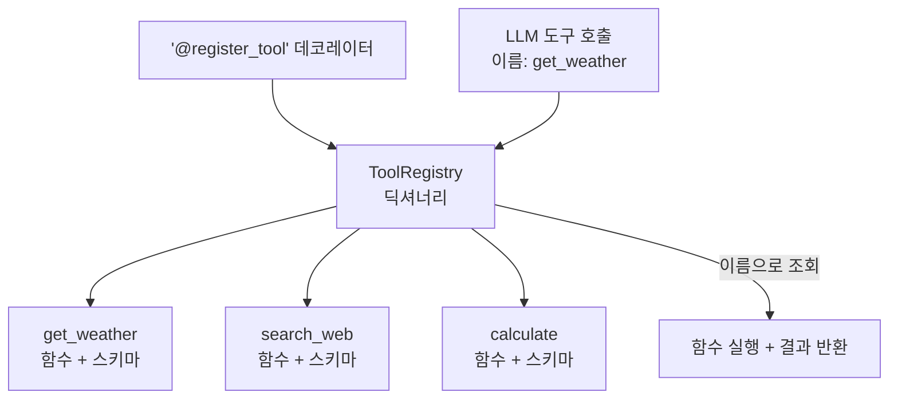
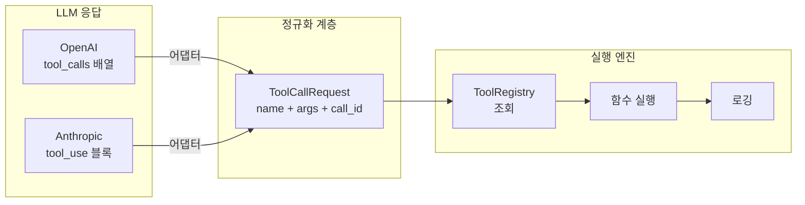
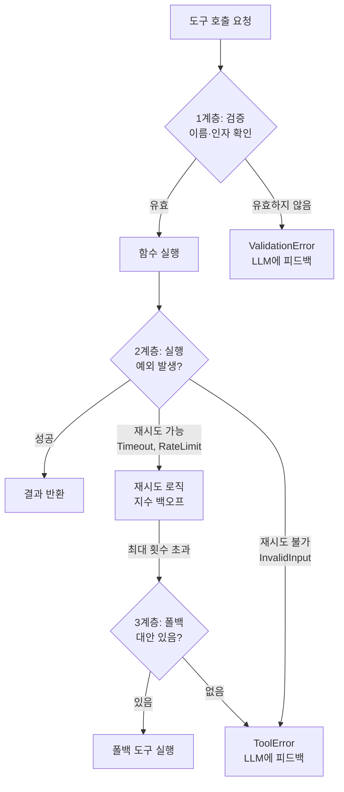
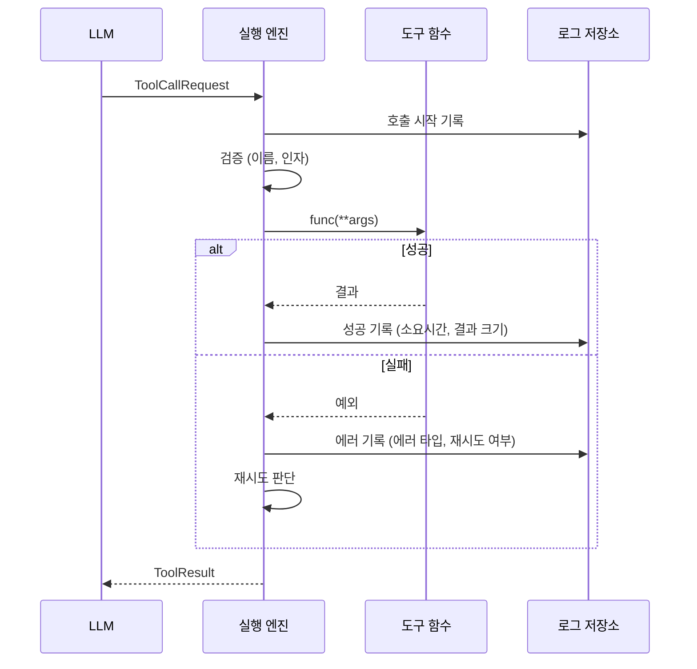

# 도구 실행 엔진 구축

> OpenAI와 Anthropic을 동시에 지원하는 통합 도구 레지스트리·디스패처·에러 핸들러를 설계하고 구현합니다.

## 개요

이 섹션에서는 앞서 배운 OpenAI와 Anthropic 두 API의 도구 호출 방식을 하나의 통합 실행 엔진으로 묶어봅니다. 데코레이터 기반 도구 레지스트리, 동적 함수 디스패치, 에러 핸들링과 재시도, 그리고 실행 로깅까지 — 프로덕션 에이전트의 뼈대가 될 핵심 인프라를 직접 만듭니다.

**선수 지식**: [LLM Tool Calling 메커니즘](01-ch1-llm-도구-호출의-이해/02-02-llm-tool-calling-메커니즘.md)의 라운드트립 개념, [OpenAI API 도구 호출](01-ch1-llm-도구-호출의-이해/03-03-openai-api-도구-호출-실습.md)의 `tool_calls` 배열, [Anthropic API 도구 호출](01-ch1-llm-도구-호출의-이해/04-04-anthropic-api-도구-호출-실습.md)의 `tool_use` 콘텐츠 블록

**학습 목표**:
- 데코레이터 기반 도구 레지스트리를 설계하고 구현할 수 있다
- OpenAI/Anthropic 두 API에서 도구 호출을 통합 디스패치할 수 있다
- 재시도(retry)와 폴백(fallback) 전략을 적용할 수 있다
- 구조화된 실행 로그로 디버깅과 모니터링 기반을 마련할 수 있다

## 왜 알아야 할까?

지금까지 우리는 OpenAI와 Anthropic 각각의 API로 도구를 호출하는 법을 배웠습니다. 하지만 실전에서는 한 가지 문제가 바로 떠오르죠 — **"모델을 바꿀 때마다 도구 코드를 전부 다시 짜야 하나요?"**

정답은 "아니오"입니다. 잘 설계된 도구 실행 엔진은 **모델과 도구 사이의 어댑터** 역할을 합니다. 마치 여행용 멀티 어댑터처럼 — 어느 나라 콘센트에 꽂든 가전제품은 그대로 작동하죠. 도구 함수를 한 번 작성하면 OpenAI든, Anthropic이든, 이후 어떤 LLM이 등장하든 동일하게 실행할 수 있어야 합니다.

게다가 프로덕션 환경에서는 API가 실패하고, 네트워크가 끊기고, 잘못된 인자가 들어옵니다. [OpenAI 실습](01-ch1-llm-도구-호출의-이해/03-03-openai-api-도구-호출-실습.md)과 [Anthropic 실습](01-ch1-llm-도구-호출의-이해/04-04-anthropic-api-도구-호출-실습.md)에서는 도구 함수가 항상 성공한다고 가정하고 `try/except` 없이 바로 결과를 반환했는데요, 실제 서비스에서는 그렇게 낙관적일 수 없습니다. "잘 돌아가는 데모"와 "실제로 쓸 수 있는 시스템" 사이의 차이가 바로 **에러 핸들링과 관찰가능성(observability)**입니다. 이 세션에서 그 간극을 메워보겠습니다.

## 핵심 개념

### 개념 1: 레지스트리 패턴 — 도구의 전화번호부

> 💡 **비유**: 스마트폰 연락처를 생각해보세요. 이름으로 검색하면 전화번호·이메일·주소가 한꺼번에 나옵니다. 도구 레지스트리도 마찬가지입니다 — 도구 이름을 키로, 함수·스키마·메타데이터를 한데 묶어 관리하는 전화번호부입니다.

레지스트리 패턴(Registry Pattern)은 **전역 딕셔너리에 객체를 등록하고, 문자열 키로 꺼내 쓰는** 디자인 패턴입니다. Python에서는 데코레이터를 사용하면 함수가 정의되는 순간 자동으로 레지스트리에 등록되므로, 거대한 `if/elif` 체인 없이도 동적 디스패치가 가능합니다.

> 📊 **그림 1**: 데코레이터 기반 도구 레지스트리의 구조



핵심은 세 가지입니다:

1. **등록(Registration)**: 데코레이터가 함수와 JSON Schema를 함께 등록
2. **조회(Lookup)**: 문자열 이름으로 함수를 꺼냄
3. **실행(Dispatch)**: 꺼낸 함수에 인자를 전달하고 결과를 반환

```python
from typing import Any, Callable
from dataclasses import dataclass, field
import inspect
import json


@dataclass
class ToolSpec:
    """도구 하나의 메타데이터를 담는 컨테이너"""
    name: str                          # 도구 이름 (LLM이 호출할 키)
    description: str                   # 도구 설명 (LLM이 판단에 사용)
    func: Callable                     # 실제 실행할 함수
    parameters: dict                   # JSON Schema 형태의 파라미터 정의
    tags: list[str] = field(default_factory=list)  # 분류용 태그


class ToolRegistry:
    """데코레이터 기반 도구 레지스트리"""

    def __init__(self) -> None:
        self._tools: dict[str, ToolSpec] = {}

    def register(
        self,
        name: str | None = None,
        description: str = "",
        parameters: dict | None = None,
        tags: list[str] | None = None,
    ) -> Callable:
        """도구를 레지스트리에 등록하는 데코레이터"""
        def decorator(func: Callable) -> Callable:
            tool_name = name or func.__name__
            # 파라미터 스키마가 없으면 함수 시그니처에서 자동 추출
            tool_params = parameters or self._infer_schema(func)
            spec = ToolSpec(
                name=tool_name,
                description=description or func.__doc__ or "",
                func=func,
                parameters=tool_params,
                tags=tags or [],
            )
            self._tools[tool_name] = spec
            return func
        return decorator

    def get(self, name: str) -> ToolSpec | None:
        """이름으로 도구 조회"""
        return self._tools.get(name)

    def list_tools(self) -> list[str]:
        """등록된 모든 도구 이름"""
        return list(self._tools.keys())

    def _infer_schema(self, func: Callable) -> dict:
        """함수 시그니처에서 JSON Schema 추론"""
        sig = inspect.signature(func)
        hints = func.__annotations__
        properties = {}
        required = []
        for param_name, param in sig.parameters.items():
            prop: dict[str, Any] = {}
            hint = hints.get(param_name, str)
            prop["type"] = self._python_type_to_json(hint)
            if param.default is inspect.Parameter.empty:
                required.append(param_name)
            properties[param_name] = prop
        return {
            "type": "object",
            "properties": properties,
            "required": required,
        }

    @staticmethod
    def _python_type_to_json(py_type: type) -> str:
        """Python 타입 → JSON Schema 타입 매핑"""
        mapping = {str: "string", int: "integer", float: "number", bool: "boolean"}
        return mapping.get(py_type, "string")
```

> ⚠️ **흔한 오해**: "레지스트리에 등록하면 함수가 변형되는 거 아닌가요?" — 아닙니다. 위 데코레이터는 원래 함수를 그대로 반환(`return func`)합니다. 등록은 **사이드 이펙트**일 뿐, 함수 자체는 변하지 않습니다. 데코레이터 없이도 함수를 직접 호출할 수 있어요.

### 개념 2: 통합 디스패처 — 모델에 구애받지 않는 실행기

> 💡 **비유**: 국제 택배 서비스를 떠올려보세요. 보내는 사람(LLM)이 "서울로 배달해줘"라고 하면, 택배사(디스패처)가 내부적으로 항공편이든 해상이든 알아서 경로를 잡습니다. 보내는 사람은 배달 경로를 신경 쓸 필요가 없죠.

[OpenAI API](01-ch1-llm-도구-호출의-이해/03-03-openai-api-도구-호출-실습.md)는 `tool_calls` 배열에 `function.name`과 `function.arguments`를, [Anthropic API](01-ch1-llm-도구-호출의-이해/04-04-anthropic-api-도구-호출-실습.md)는 `tool_use` 콘텐츠 블록에 `name`과 `input`을 담습니다. 통합 디스패처의 역할은 이 **두 형식을 하나의 인터페이스로 정규화**하는 것입니다.

> 📊 **그림 2**: 통합 디스패처의 정규화 흐름



[OpenAI 실습](01-ch1-llm-도구-호출의-이해/03-03-openai-api-도구-호출-실습.md)에서 `response.choices[0].message.tool_calls`를 순회하며 인라인으로 추출하던 로직을 기억하시나요? 거기서는 한 API에 맞춰 바로 처리했지만, 두 API를 동시에 지원하려면 **추출 로직을 재사용 가능한 함수로 분리**해야 합니다. 아래의 `extract_tool_calls_openai`와 `extract_tool_calls_anthropic`이 바로 그 역할입니다:

```python
from dataclasses import dataclass


@dataclass
class ToolCallRequest:
    """모델에 무관한 정규화된 도구 호출 요청"""
    call_id: str          # 도구 호출 고유 ID
    name: str             # 도구 이름
    arguments: dict       # 파라미터 딕셔너리


def extract_tool_calls_openai(response) -> list[ToolCallRequest]:
    """OpenAI 응답에서 도구 호출 추출
    
    1.3에서 인라인으로 작성했던 tool_calls 순회 로직을
    재사용 가능한 함수로 분리한 버전입니다.
    """
    calls = []
    message = response.choices[0].message
    if message.tool_calls:
        for tc in message.tool_calls:
            calls.append(ToolCallRequest(
                call_id=tc.id,
                name=tc.function.name,
                arguments=json.loads(tc.function.arguments),
            ))
    return calls


def extract_tool_calls_anthropic(response) -> list[ToolCallRequest]:
    """Anthropic 응답에서 도구 호출 추출
    
    1.4에서 content 블록을 순회하며 tool_use를 찾던 로직을
    동일한 ToolCallRequest 형식으로 정규화합니다.
    """
    calls = []
    for block in response.content:
        if block.type == "tool_use":
            calls.append(ToolCallRequest(
                call_id=block.id,
                name=block.name,
                arguments=block.input,
            ))
    return calls
```

이제 `ToolCallRequest`라는 공통 형식이 생겼으니, 실행 엔진은 어디서 온 요청인지 신경 쓸 필요가 없습니다.

### 개념 3: 에러 핸들링과 재시도 전략

> 💡 **비유**: ATM에서 출금할 때 "일시적 오류"가 뜨면 한 번 더 시도하죠. 하지만 "잔액 부족"이면 다시 눌러봐야 소용없습니다. 에러도 **재시도할 수 있는 것**과 **즉시 실패시켜야 하는 것**을 구분해야 합니다.

지금까지의 실습에서는 도구 함수가 항상 성공한다고 가정했습니다. [OpenAI 실습](01-ch1-llm-도구-호출의-이해/03-03-openai-api-도구-호출-실습.md)에서 `get_weather(city)`를 호출할 때, 혹시 네트워크가 끊기거나 잘못된 도시명이 들어오면 어떻게 될까요? 가장 기본적인 방어는 `try/except`입니다:

```python
# 1.3에서의 간단한 에러 처리 (인라인 방식)
try:
    result = get_weather(city="서울")
except Exception as e:
    result = {"error": str(e)}  # 에러 메시지를 LLM에 돌려보냄
```

하지만 이 방식에는 한계가 있습니다. 네트워크 타임아웃이면 잠시 후 다시 시도하면 성공할 수 있는데, 잘못된 도시명이면 아무리 재시도해도 소용이 없죠. **모든 에러를 동일하게 처리하면 안 됩니다.** 프로덕션 에이전트의 에러 핸들링은 에러의 종류를 분류하고, 각각에 맞는 전략을 적용하는 **세 계층**으로 나뉩니다:

> 📊 **그림 3**: 에러 핸들링 3계층 아키텍처



**1계층 — 사전 검증**: 도구 이름이 레지스트리에 있는지, 인자가 스키마에 맞는지 확인합니다.

**2계층 — 실행 중 에러**: `TimeoutError`, `ConnectionError` 같은 일시적(transient) 에러는 재시도하고, `ValueError`, `PermissionError` 같은 비일시적(non-transient) 에러는 즉시 LLM에 피드백합니다.

**3계층 — 폴백**: 모든 재시도가 실패하면 대안 도구나 캐시된 결과로 폴백할 수 있습니다.

앞서 `try/except`로 뭉뚱그려 처리하던 것을, 에러 종류를 체계적으로 분류하는 구조로 발전시켜봅시다:

```python
import time
import random
from enum import Enum


class ErrorCategory(Enum):
    TRANSIENT = "transient"          # 재시도 가능 (네트워크, 타임아웃)
    NON_TRANSIENT = "non_transient"  # 재시도 불가 (잘못된 입력, 권한)
    UNKNOWN = "unknown"


# 재시도 가능한 예외 목록
TRANSIENT_ERRORS = (TimeoutError, ConnectionError, OSError)


def classify_error(error: Exception) -> ErrorCategory:
    """에러를 재시도 가능/불가능으로 분류"""
    if isinstance(error, TRANSIENT_ERRORS):
        return ErrorCategory.TRANSIENT
    if isinstance(error, (ValueError, TypeError, KeyError)):
        return ErrorCategory.NON_TRANSIENT
    return ErrorCategory.UNKNOWN


def retry_with_backoff(
    func: Callable,
    args: dict,
    max_retries: int = 3,
    base_delay: float = 1.0,
    max_delay: float = 30.0,
) -> Any:
    """지수 백오프 + 지터를 적용한 재시도"""
    last_error = None
    for attempt in range(max_retries + 1):
        try:
            return func(**args)
        except Exception as e:
            last_error = e
            category = classify_error(e)
            if category != ErrorCategory.TRANSIENT:
                raise  # 비일시적 에러는 즉시 전파
            if attempt == max_retries:
                raise  # 최대 횟수 도달
            # 지수 백오프 + 풀 지터 (Full Jitter)
            delay = min(base_delay * (2 ** attempt), max_delay)
            jitter = random.uniform(0, delay)
            time.sleep(jitter)
```

> 🔥 **실무 팁**: 지수 백오프에 **풀 지터(Full Jitter)**를 반드시 추가하세요. `random.uniform(0, delay)`로 구현합니다. 지터 없이 동일한 간격으로 재시도하면 여러 클라이언트가 동시에 "폭풍 재시도"(thundering herd)를 일으켜 서버를 더 압박합니다. AWS의 유명한 2015년 블로그 포스트에서 이 패턴이 널리 알려졌죠.

### 개념 4: 실행 로깅 — 에이전트의 블랙박스

> 💡 **비유**: 비행기 블랙박스(사실은 주황색이지만)는 비행 중 모든 데이터를 기록합니다. 사고가 나야 비로소 꺼내보죠. 도구 실행 로그도 마찬가지입니다 — 평소에는 몰라도 되지만, 에이전트가 이상하게 행동할 때 원인을 찾는 유일한 단서가 됩니다.

구조화된 로깅(structured logging)은 디버깅과 관찰가능성의 기반입니다. 이후 [LangSmith 트레이싱](18-ch18-관찰가능성과-디버깅/01-01-langsmith-트레이싱-설정.md)에서 본격적으로 다루지만, 지금 만드는 실행 엔진에도 기본적인 로깅을 내장해둡니다.

> 📊 **그림 4**: 도구 실행 로그 구조



```python
from dataclasses import dataclass, field
from datetime import datetime, timezone


@dataclass
class ToolExecutionLog:
    """도구 실행 한 건의 로그"""
    call_id: str
    tool_name: str
    arguments: dict
    timestamp: str = field(
        default_factory=lambda: datetime.now(timezone.utc).isoformat()
    )
    duration_ms: float = 0.0
    success: bool = False
    result: Any = None
    error: str | None = None
    attempt: int = 1
    metadata: dict = field(default_factory=dict)


class ExecutionLogger:
    """도구 실행 로그 수집기"""

    def __init__(self) -> None:
        self._logs: list[ToolExecutionLog] = []

    def record(self, log: ToolExecutionLog) -> None:
        self._logs.append(log)

    def get_logs(self, tool_name: str | None = None) -> list[ToolExecutionLog]:
        if tool_name:
            return [l for l in self._logs if l.tool_name == tool_name]
        return list(self._logs)

    def summary(self) -> dict:
        """실행 통계 요약"""
        total = len(self._logs)
        success = sum(1 for l in self._logs if l.success)
        avg_ms = (
            sum(l.duration_ms for l in self._logs) / total if total else 0
        )
        return {
            "total_calls": total,
            "success_rate": f"{success / total * 100:.1f}%" if total else "N/A",
            "avg_duration_ms": round(avg_ms, 2),
        }
```

## 실습: 직접 해보기

이제 위의 네 가지 개념을 하나로 통합한 **완전한 도구 실행 엔진**을 구축합니다. 실제 API 호출 없이도 동작을 확인할 수 있도록 시뮬레이션 모드를 포함합니다.

```python
"""
통합 도구 실행 엔진 — Tool Execution Engine
Ch1 마무리 실습: 레지스트리 + 디스패처 + 에러 핸들링 + 로깅
"""
from __future__ import annotations

import json
import time
import random
import inspect
from typing import Any, Callable
from dataclasses import dataclass, field
from datetime import datetime, timezone
from enum import Enum


# ─────────────────────────────────────────────
# 1. 데이터 모델
# ─────────────────────────────────────────────

@dataclass
class ToolSpec:
    """도구 명세 (함수 + 스키마 + 메타데이터)"""
    name: str
    description: str
    func: Callable
    parameters: dict
    tags: list[str] = field(default_factory=list)
    fallback: str | None = None  # 폴백 도구 이름


@dataclass
class ToolCallRequest:
    """정규화된 도구 호출 요청"""
    call_id: str
    name: str
    arguments: dict


@dataclass
class ToolResult:
    """도구 실행 결과"""
    call_id: str
    name: str
    success: bool
    output: Any = None
    error: str | None = None


@dataclass
class ToolExecutionLog:
    """실행 로그 한 건"""
    call_id: str
    tool_name: str
    arguments: dict
    timestamp: str = field(
        default_factory=lambda: datetime.now(timezone.utc).isoformat()
    )
    duration_ms: float = 0.0
    success: bool = False
    result: Any = None
    error: str | None = None
    attempt: int = 1


class ErrorCategory(Enum):
    TRANSIENT = "transient"
    NON_TRANSIENT = "non_transient"


TRANSIENT_ERRORS = (TimeoutError, ConnectionError, OSError)


def classify_error(error: Exception) -> ErrorCategory:
    """에러 분류: 재시도 가능 여부"""
    if isinstance(error, TRANSIENT_ERRORS):
        return ErrorCategory.TRANSIENT
    return ErrorCategory.NON_TRANSIENT


# ─────────────────────────────────────────────
# 2. 도구 레지스트리
# ─────────────────────────────────────────────

class ToolRegistry:
    """데코레이터 기반 도구 레지스트리"""

    def __init__(self) -> None:
        self._tools: dict[str, ToolSpec] = {}

    def register(
        self,
        name: str | None = None,
        description: str = "",
        parameters: dict | None = None,
        tags: list[str] | None = None,
        fallback: str | None = None,
    ) -> Callable:
        def decorator(func: Callable) -> Callable:
            tool_name = name or func.__name__
            tool_params = parameters or self._infer_schema(func)
            self._tools[tool_name] = ToolSpec(
                name=tool_name,
                description=description or func.__doc__ or "",
                func=func,
                parameters=tool_params,
                tags=tags or [],
                fallback=fallback,
            )
            return func
        return decorator

    def get(self, name: str) -> ToolSpec | None:
        return self._tools.get(name)

    def list_tools(self) -> list[str]:
        return list(self._tools.keys())

    def to_openai_format(self) -> list[dict]:
        """레지스트리 → OpenAI tools 파라미터 형식"""
        tools = []
        for spec in self._tools.values():
            tools.append({
                "type": "function",
                "function": {
                    "name": spec.name,
                    "description": spec.description,
                    "parameters": spec.parameters,
                },
            })
        return tools

    def to_anthropic_format(self) -> list[dict]:
        """레지스트리 → Anthropic tools 파라미터 형식"""
        tools = []
        for spec in self._tools.values():
            tools.append({
                "name": spec.name,
                "description": spec.description,
                "input_schema": spec.parameters,
            })
        return tools

    def _infer_schema(self, func: Callable) -> dict:
        sig = inspect.signature(func)
        hints = func.__annotations__
        properties, required = {}, []
        type_map = {str: "string", int: "integer", float: "number", bool: "boolean"}
        for pname, param in sig.parameters.items():
            hint = hints.get(pname, str)
            properties[pname] = {"type": type_map.get(hint, "string")}
            if param.default is inspect.Parameter.empty:
                required.append(pname)
        return {"type": "object", "properties": properties, "required": required}


# ─────────────────────────────────────────────
# 3. 실행 엔진
# ─────────────────────────────────────────────

class ToolExecutionEngine:
    """통합 도구 실행 엔진"""

    def __init__(
        self,
        registry: ToolRegistry,
        max_retries: int = 2,
        base_delay: float = 1.0,
    ) -> None:
        self.registry = registry
        self.max_retries = max_retries
        self.base_delay = base_delay
        self._logs: list[ToolExecutionLog] = []

    def execute(self, request: ToolCallRequest) -> ToolResult:
        """도구 호출 요청을 검증 → 실행 → 로깅"""
        # 1단계: 검증
        spec = self.registry.get(request.name)
        if spec is None:
            available = ", ".join(self.registry.list_tools())
            error_msg = (
                f"도구 '{request.name}'을(를) 찾을 수 없습니다. "
                f"사용 가능한 도구: {available}"
            )
            self._record_log(request, success=False, error=error_msg)
            return ToolResult(
                call_id=request.call_id,
                name=request.name,
                success=False,
                error=error_msg,
            )

        # 2단계: 실행 (재시도 포함)
        last_error = None
        for attempt in range(1, self.max_retries + 2):
            start = time.perf_counter()
            try:
                result = spec.func(**request.arguments)
                duration = (time.perf_counter() - start) * 1000
                self._record_log(
                    request, success=True, result=result,
                    duration_ms=duration, attempt=attempt,
                )
                return ToolResult(
                    call_id=request.call_id,
                    name=request.name,
                    success=True,
                    output=result,
                )
            except Exception as e:
                duration = (time.perf_counter() - start) * 1000
                last_error = e
                category = classify_error(e)

                if category == ErrorCategory.NON_TRANSIENT:
                    self._record_log(
                        request, success=False, error=str(e),
                        duration_ms=duration, attempt=attempt,
                    )
                    break  # 재시도 불가 — 폴백 시도

                if attempt <= self.max_retries:
                    delay = min(self.base_delay * (2 ** (attempt - 1)), 30.0)
                    time.sleep(random.uniform(0, delay))
                    continue

                self._record_log(
                    request, success=False, error=str(e),
                    duration_ms=duration, attempt=attempt,
                )

        # 3단계: 폴백 시도
        if spec.fallback:
            fallback_spec = self.registry.get(spec.fallback)
            if fallback_spec:
                try:
                    result = fallback_spec.func(**request.arguments)
                    self._record_log(
                        request, success=True, result=result,
                        metadata_note=f"폴백({spec.fallback}) 사용",
                    )
                    return ToolResult(
                        call_id=request.call_id,
                        name=request.name,
                        success=True,
                        output=result,
                    )
                except Exception as fb_err:
                    last_error = fb_err

        error_msg = f"도구 실행 실패: {last_error}"
        return ToolResult(
            call_id=request.call_id,
            name=request.name,
            success=False,
            error=error_msg,
        )

    def execute_batch(
        self, requests: list[ToolCallRequest]
    ) -> list[ToolResult]:
        """여러 도구 호출을 순차 실행"""
        return [self.execute(req) for req in requests]

    def get_logs(self) -> list[ToolExecutionLog]:
        return list(self._logs)

    def summary(self) -> dict:
        total = len(self._logs)
        success = sum(1 for l in self._logs if l.success)
        avg_ms = sum(l.duration_ms for l in self._logs) / total if total else 0
        return {
            "total_calls": total,
            "success_rate": f"{success / total * 100:.1f}%" if total else "N/A",
            "avg_duration_ms": round(avg_ms, 2),
        }

    def _record_log(
        self, request: ToolCallRequest, *,
        success: bool, result: Any = None, error: str | None = None,
        duration_ms: float = 0.0, attempt: int = 1,
        metadata_note: str | None = None,
    ) -> None:
        log = ToolExecutionLog(
            call_id=request.call_id,
            tool_name=request.name,
            arguments=request.arguments,
            success=success,
            result=str(result)[:200] if result else None,
            error=error,
            duration_ms=round(duration_ms, 2),
            attempt=attempt,
        )
        self._logs.append(log)


# ─────────────────────────────────────────────
# 4. 도구 등록 + 실행 데모
# ─────────────────────────────────────────────

# 전역 레지스트리 생성
registry = ToolRegistry()


@registry.register(
    description="지정된 도시의 현재 날씨를 조회합니다.",
    parameters={
        "type": "object",
        "properties": {
            "city": {"type": "string", "description": "도시 이름"},
            "unit": {
                "type": "string",
                "enum": ["celsius", "fahrenheit"],
                "description": "온도 단위",
            },
        },
        "required": ["city"],
    },
)
def get_weather(city: str, unit: str = "celsius") -> dict:
    """날씨 조회 도구 (시뮬레이션)"""
    weather_data = {
        "서울": {"temp": 22, "condition": "맑음"},
        "도쿄": {"temp": 25, "condition": "흐림"},
        "뉴욕": {"temp": 18, "condition": "비"},
    }
    data = weather_data.get(city)
    if data is None:
        raise ValueError(f"'{city}'의 날씨 데이터를 찾을 수 없습니다.")
    temp = data["temp"]
    if unit == "fahrenheit":
        temp = round(temp * 9 / 5 + 32, 1)
    return {"city": city, "temperature": temp, "unit": unit, "condition": data["condition"]}


@registry.register(
    description="간단한 수학 계산을 수행합니다.",
    parameters={
        "type": "object",
        "properties": {
            "expression": {"type": "string", "description": "계산식 (예: 2 + 3 * 4)"},
        },
        "required": ["expression"],
    },
)
def calculate(expression: str) -> dict:
    """안전한 수학 계산기"""
    allowed = set("0123456789+-*/.(). ")
    if not all(c in allowed for c in expression):
        raise ValueError(f"허용되지 않은 문자가 포함되어 있습니다: {expression}")
    result = eval(expression)  # 실전에서는 ast.literal_eval 또는 별도 파서 사용
    return {"expression": expression, "result": result}


@registry.register(
    name="search_cached",
    description="캐시된 검색 결과를 반환합니다. (search_web의 폴백)",
)
def search_cached(query: str) -> dict:
    return {"query": query, "results": ["(캐시된 결과) Python 공식 문서"]}


@registry.register(
    name="search_web",
    description="웹 검색을 수행합니다.",
    fallback="search_cached",
)
def search_web(query: str) -> dict:
    # 30% 확률로 타임아웃 시뮬레이션
    if random.random() < 0.3:
        raise TimeoutError("검색 API 타임아웃")
    return {"query": query, "results": [f"'{query}' 검색 결과 1", f"'{query}' 검색 결과 2"]}
```

이제 엔진을 실행해봅시다:

```run:python
# ─── 데모 실행 ───
# (위 코드가 이미 실행된 상태라고 가정합니다)

engine = ToolExecutionEngine(registry, max_retries=2, base_delay=0.1)

# 1. 정상 호출
result1 = engine.execute(ToolCallRequest(
    call_id="call_001", name="get_weather", arguments={"city": "서울"}
))
print(f"[날씨] {result1.output}")

# 2. 존재하지 않는 도구
result2 = engine.execute(ToolCallRequest(
    call_id="call_002", name="send_email", arguments={"to": "test@test.com"}
))
print(f"[에러] {result2.error}")

# 3. 비일시적 에러 (잘못된 도시)
result3 = engine.execute(ToolCallRequest(
    call_id="call_003", name="get_weather", arguments={"city": "아틀란티스"}
))
print(f"[에러] {result3.error}")

# 4. 수학 계산
result4 = engine.execute(ToolCallRequest(
    call_id="call_004", name="calculate", arguments={"expression": "2 + 3 * 4"}
))
print(f"[계산] {result4.output}")

# 5. 실행 통계
print(f"\n[통계] {engine.summary()}")
```

```output
[날씨] {'city': '서울', 'temperature': 22, 'unit': 'celsius', 'condition': '맑음'}
[에러] 도구 'send_email'을(를) 찾을 수 없습니다. 사용 가능한 도구: get_weather, calculate, search_cached, search_web
[에러] 도구 실행 실패: '아틀란티스'의 날씨 데이터를 찾을 수 없습니다.
[계산] {'expression': '2 + 3 * 4', 'result': 14}

[통계] {'total_calls': 4, 'success_rate': '50.0%', 'avg_duration_ms': 0.03}
```

다음으로 API 형식 변환이 제대로 되는지 확인합니다:

```run:python
# OpenAI 형식 출력
openai_tools = registry.to_openai_format()
print("=== OpenAI 형식 (첫 번째 도구) ===")
print(json.dumps(openai_tools[0], indent=2, ensure_ascii=False))

print()

# Anthropic 형식 출력
anthropic_tools = registry.to_anthropic_format()
print("=== Anthropic 형식 (첫 번째 도구) ===")
print(json.dumps(anthropic_tools[0], indent=2, ensure_ascii=False))
```

```output
=== OpenAI 형식 (첫 번째 도구) ===
{
  "type": "function",
  "function": {
    "name": "get_weather",
    "description": "지정된 도시의 현재 날씨를 조회합니다.",
    "parameters": {
      "type": "object",
      "properties": {
        "city": {"type": "string", "description": "도시 이름"},
        "unit": {"type": "string", "enum": ["celsius", "fahrenheit"], "description": "온도 단위"}
      },
      "required": ["city"]
    }
  }
}

=== Anthropic 형식 (첫 번째 도구) ===
{
  "name": "get_weather",
  "description": "지정된 도시의 현재 날씨를 조회합니다.",
  "input_schema": {
    "type": "object",
    "properties": {
      "city": {"type": "string", "description": "도시 이름"},
      "unit": {"type": "string", "enum": ["celsius", "fahrenheit"], "description": "온도 단위"}
    },
    "required": ["city"]
  }
}
```

레지스트리에 한 번만 등록하면 `to_openai_format()`과 `to_anthropic_format()`으로 각 API에 맞는 도구 정의가 자동 생성됩니다. 모델을 교체할 때 도구 정의 코드를 수정할 필요가 없죠.

## 더 깊이 알아보기

### 레지스트리 패턴의 기원 — Martin Fowler와 GoF

레지스트리 패턴은 Martin Fowler가 2002년 저서 *Patterns of Enterprise Application Architecture*에서 정리한 패턴으로, 전역 객체 조회를 위한 "잘 알려진 객체(well-known object)"의 필요성에서 출발했습니다. 하지만 Python 생태계에서 데코레이터 기반 레지스트리가 폭발적으로 퍼진 것은 **Flask** 덕분이었습니다.

2010년 Armin Ronacher가 Flask를 발표했을 때, `@app.route("/hello")`라는 한 줄로 URL을 핸들러에 매핑하는 패턴은 혁명적이었습니다. 이전에는 URL 라우팅 테이블을 별도 파일에 수동으로 관리했거든요. 이 패턴이 이후 Click(CLI 프레임워크), FastAPI(`@app.get`), Pytest(`@pytest.fixture`) 등으로 퍼져나갔고, 지금 우리가 만든 `@registry.register()`도 같은 철학을 따릅니다.

### 재시도의 역사 — TCP에서 LLM까지

재시도와 지수 백오프의 역사는 1970년대 이더넷으로 거슬러 올라갑니다. Bob Metcalfe가 설계한 이더넷의 CSMA/CD 프로토콜은 충돌 감지 시 **BEB(Binary Exponential Backoff)**를 사용했습니다 — 재시도 간격을 2배씩 늘리는 바로 그 알고리즘이죠. 이후 TCP의 재전송 타이머, HTTP 재시도, 그리고 2015년 AWS가 공개한 "Exponential Backoff And Jitter" 블로그 포스트를 거쳐, 지금은 LLM API 호출의 표준 관행이 되었습니다.

> 💡 **알고 계셨나요?**: 지수 백오프의 세 가지 변형 — **No Jitter**(고정 간격), **Full Jitter**(`random(0, delay)`), **Decorrelated Jitter**(`random(base, prev_delay * 3)`) — 중 실측 성능이 가장 좋은 건 Full Jitter입니다. AWS가 자체 시뮬레이션으로 증명했죠. 우리 코드에서도 `random.uniform(0, delay)`로 Full Jitter를 적용했습니다.

### LangGraph의 ToolNode — 프레임워크는 어떻게 해결했을까?

이 세션에서 처음부터 직접 구축한 실행 엔진의 개념은 LangGraph의 `ToolNode`에 그대로 반영되어 있습니다. LangGraph 1.0 이후 `ToolNode`는 `handle_tool_errors` 파라미터를 통해 에러 처리 전략을 설정합니다. `True`로 설정하면 `ToolException`을 잡아서 에러 메시지를 `ToolMessage`로 변환해 LLM에 돌려보내고, LLM이 스스로 재시도 여부를 판단합니다. [Ch4. LangGraph StateGraph 기초](04-ch4-langgraph-stategraph-기초/01-01-langgraph-아키텍처-개관.md)에서 이 구조를 본격적으로 다룹니다.

## 흔한 오해와 팁

> ⚠️ **흔한 오해**: "에러가 나면 무조건 재시도하면 되는 거 아닌가요?" — 절대 아닙니다. `ValueError`("잘못된 입력")를 100번 재시도해봐야 결과는 같습니다. 재시도는 **일시적 에러**(네트워크 끊김, 타임아웃, Rate Limit)에만 의미가 있습니다. 비일시적 에러를 재시도하면 API 비용만 낭비하고, Rate Limit을 더 빠르게 소진합니다.

> 💡 **알고 계셨나요?**: Python 생태계에서 가장 널리 쓰이는 재시도 라이브러리는 **tenacity**입니다. `@retry(stop=stop_after_attempt(3), wait=wait_exponential(multiplier=1, max=10))` 한 줄이면 지수 백오프가 적용됩니다. 우리 실습에서는 동작 원리를 이해하기 위해 직접 구현했지만, 프로덕션에서는 tenacity를 쓰는 것이 현명합니다.

> 🔥 **실무 팁**: 도구 실행 로그에 **입력 인자의 전체 내용을 기록할 때 주의**하세요. 사용자의 개인정보, API 키, 비밀번호가 인자에 포함될 수 있습니다. 프로덕션에서는 민감 필드를 마스킹(`"api_key": "sk-****"`)하거나, 인자의 해시값만 저장하는 방식을 고려하세요.

## 핵심 정리

| 개념 | 설명 |
|------|------|
| **레지스트리 패턴** | 데코레이터로 도구를 등록하고 문자열 키로 조회·실행하는 구조. `if/elif` 체인 없이 확장 가능 |
| **ToolCallRequest** | OpenAI `tool_calls`와 Anthropic `tool_use`를 정규화하는 공통 데이터 모델 |
| **통합 디스패처** | 모델에 무관하게 도구를 조회·실행하는 엔진. `to_openai_format()`/`to_anthropic_format()`으로 양쪽 API 지원 |
| **에러 분류** | Transient(재시도 가능) vs Non-transient(즉시 실패). 분류 없이 무조건 재시도하면 비용만 낭비 |
| **지수 백오프 + 풀 지터** | `random.uniform(0, base * 2^attempt)`. 동시 재시도 폭주(thundering herd)를 방지 |
| **폴백 전략** | 주 도구 실패 시 대안 도구(예: 캐시)로 전환. `ToolSpec.fallback`으로 선언적 설정 |
| **구조화된 로깅** | 호출 ID, 소요시간, 성공 여부, 에러를 구조화된 형태로 기록. 디버깅과 모니터링의 기반 |

## 다음 섹션 미리보기

이번 챕터에서 LLM의 도구 호출 개념부터 시작해 OpenAI·Anthropic API를 직접 다루고, 마지막으로 통합 실행 엔진까지 구축했습니다. 다음 챕터 [Ch2. ReAct 패턴과 에이전트 루프](02-ch2-react-패턴과-에이전트-루프/01-01-react-패턴-이론.md)에서는 이 도구 실행 엔진 위에 **추론(Reasoning)과 행동(Acting)을 번갈아 수행하는 ReAct 루프**를 얹습니다. LLM이 "어떤 도구를 호출할지 스스로 판단하고, 결과를 보고 다시 생각하는" 진짜 에이전트의 모습이 드러나는 순간입니다.

## 참고 자료

- [LangChain: How to handle tool errors](https://python.langchain.com/docs/how_to/tools_error/) - LangChain 공식 문서의 도구 에러 핸들링 가이드. `ToolException`, `handle_tool_error` 파라미터 사용법
- [Tenacity — Python 재시도 라이브러리](https://tenacity.readthedocs.io/) - 지수 백오프, 재시도 조건, 비동기 지원 등 프로덕션급 재시도 로직의 사실상 표준
- [LangGraph ToolNode 레퍼런스](https://reference.langchain.com/python/langgraph.prebuilt/tool_node/ToolNode) - LangGraph의 내장 도구 실행 노드. `handle_tool_errors` 파라미터와 에러 복구 전략
- [Registry Pattern with Decorators in Python](https://medium.com/@tihomir.manushev/implementing-the-registry-pattern-with-decorators-in-python-de8daf4a452a) - 데코레이터 기반 레지스트리 패턴의 설계와 구현 사례
- [AWS: Exponential Backoff And Jitter](https://aws.amazon.com/blogs/architecture/exponential-backoff-and-jitter/) - Full Jitter, Equal Jitter, Decorrelated Jitter의 성능 비교. 재시도 전략의 고전

---
### 🔗 Related Sessions
- [tool calling](01-ch1-llm-도구-호출의-이해/02-02-llm-tool-calling-메커니즘.md) (prerequisite)
- [라운드트립](01-ch1-llm-도구-호출의-이해/02-02-llm-tool-calling-메커니즘.md) (prerequisite)
