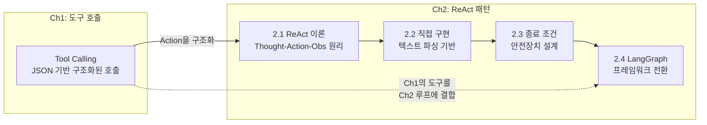
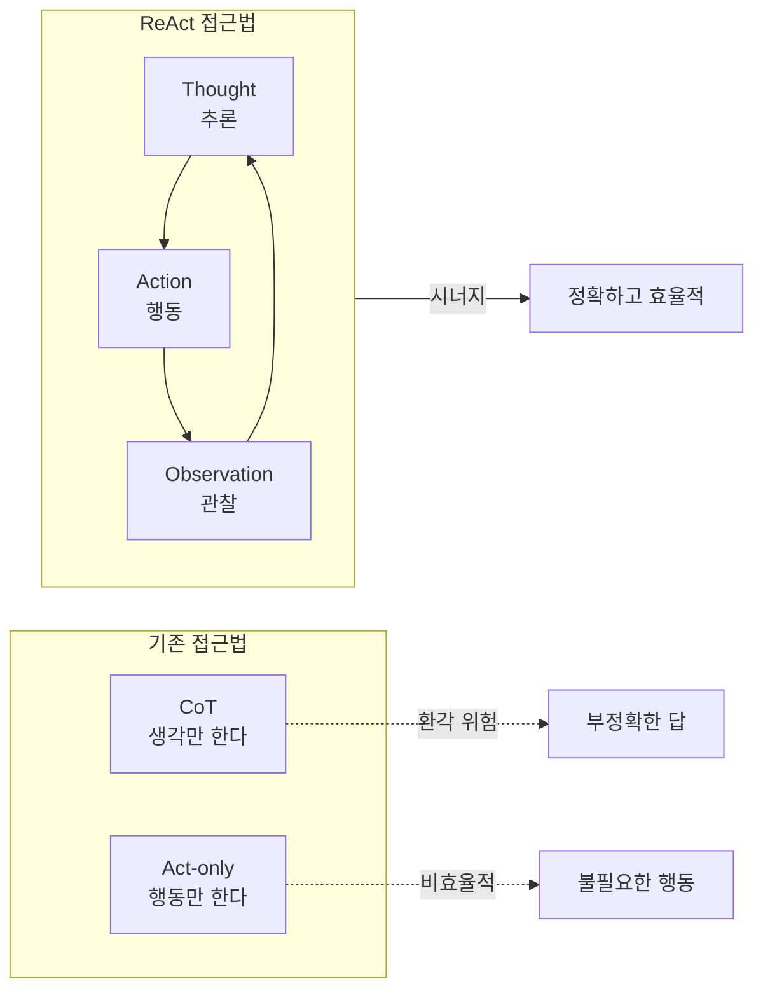
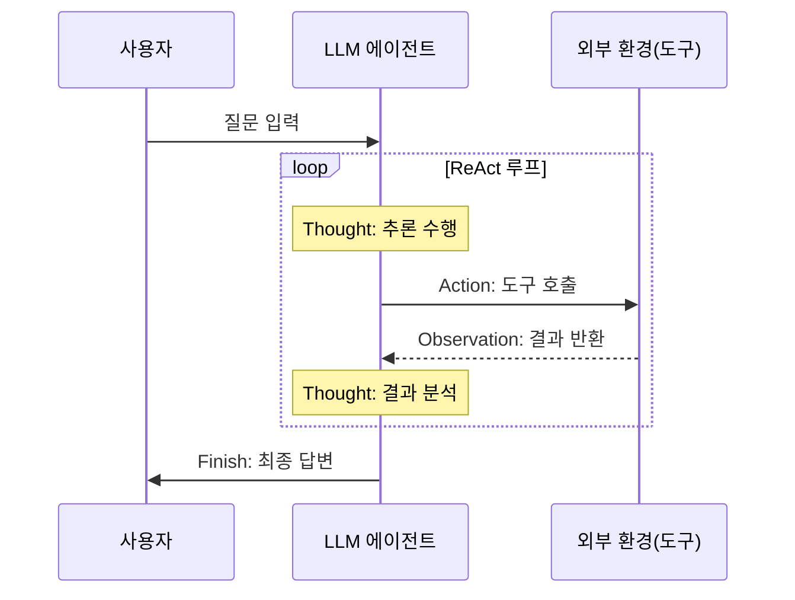
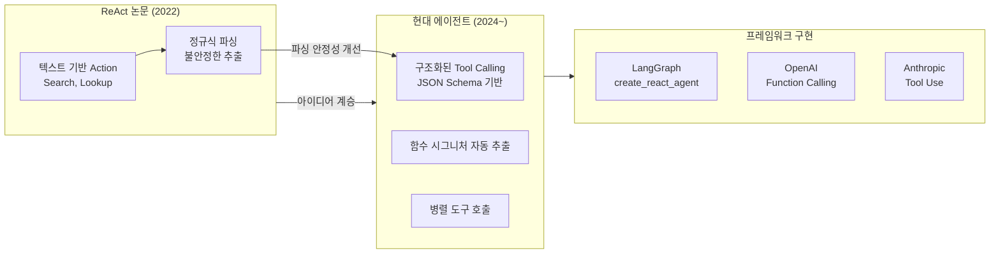
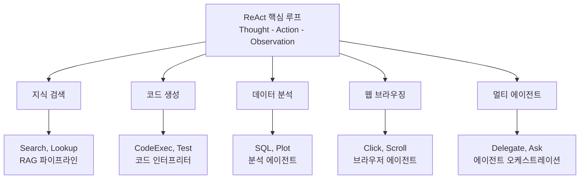

# ReAct 패턴 이론

> LLM이 "생각하고 행동하는" 에이전트가 되는 핵심 원리, ReAct 패턴의 이론적 배경을 완전히 이해합니다

## 개요

이 섹션에서는 2022년 Yao et al.이 발표한 ReAct 논문의 핵심 아이디어를 분석하고, Reasoning(추론)과 Acting(행동)이 어떻게 시너지를 만들어내는지 살펴봅니다. Chain-of-Thought(CoT)만으로는 왜 부족한지, 행동만으로는 왜 불완전한지를 이해하면, 에이전트 시스템 설계의 근본 원리가 보이기 시작합니다.

**선수 지식**: [Ch1. LLM 도구 호출의 이해](01-ch1-llm-도구-호출의-이해/01-01-ai-에이전트란-무엇인가.md)에서 배운 AI 에이전트의 정의와 [도구 호출 메커니즘](01-ch1-llm-도구-호출의-이해/02-02-llm-tool-calling-메커니즘.md)의 기본 개념

**학습 목표**:
- ReAct 논문의 핵심 아이디어(Reasoning + Acting 시너지)를 설명할 수 있다
- Thought-Action-Observation 루프의 각 단계와 역할을 구분할 수 있다
- CoT-only, Act-only 접근법과 비교하여 ReAct의 장점을 논증할 수 있다
- ReAct 트레이스를 읽고 에이전트의 추론 과정을 해석할 수 있다

> 📌 **Ch1에서 Ch2로의 학습 경로**
>
> Ch1에서 우리는 LLM의 **Tool Calling** 메커니즘 — JSON 스키마로 도구를 정의하고, LLM이 구조화된 호출을 생성하는 방식 — 을 배웠습니다. 사실 이 Tool Calling은 ReAct 패턴에서 **Action 단계를 구조화한 현대적 구현**입니다. 그렇다면 왜 이미 Tool Calling이 있는데, Ch2에서 텍스트 파싱 기반 ReAct부터 시작할까요?
>
> 이유는 명확합니다. Tool Calling은 **"어떻게 도구를 호출하는가"**에 대한 답이지만, ReAct는 **"왜, 언제 도구를 호출하고, 결과를 어떻게 활용하는가"**에 대한 답입니다. Tool Calling이 에이전트의 "손"이라면, ReAct의 Thought-Action-Observation 루프는 에이전트의 "두뇌"에 해당하죠. 텍스트 기반으로 직접 루프를 구현해보면(Ch2.1~2.3), 프레임워크가 내부에서 무엇을 자동화하는지 정확히 이해할 수 있습니다. 그 이해를 바탕으로 [Ch2.4 LangGraph 기반 ReAct](02-ch2-react-패턴과-에이전트-루프/04-04-langgraph-기반-react-에이전트.md)에서 프레임워크 기반 구현으로 자연스럽게 전환합니다.

> 📊 **그림 0**: Ch1 → Ch2 학습 경로 — 도구 호출에서 에이전트 루프까지



## 왜 알아야 할까?

여러분이 ChatGPT나 Claude에게 복잡한 질문을 했을 때, LLM이 "혼자 생각만 하다가" 엉뚱한 답을 내놓는 경험을 해본 적이 있을 겁니다. "2024년 노벨 물리학상 수상자의 출신 대학은?" 같은 질문에 LLM이 자기 기억에만 의존하면, 그럴듯하지만 **틀린** 답을 자신 있게 내놓곤 하죠. 이걸 환각(hallucination)이라고 합니다.

반대로, LLM에게 검색 도구를 주고 "무조건 검색해서 답해"라고 하면 어떨까요? 이번엔 검색 키워드를 잘못 잡거나, 불필요한 검색을 반복하는 문제가 생깁니다. **생각 없는 행동**은 비효율적이거든요.

ReAct는 이 두 문제를 한 방에 해결합니다. **"생각하면서 행동하고, 행동 결과를 보고 다시 생각하는"** 루프를 만든 것이죠. 오늘날 LangGraph의 `create_react_agent`, OpenAI의 Function Calling 에이전트, 그리고 대부분의 프로덕션 에이전트 시스템이 이 ReAct 패턴 위에 구축되어 있습니다. AI 에이전트를 제대로 이해하고 설계하려면, 이 패턴의 뿌리를 아는 것이 필수입니다.

Ch1에서 배운 Tool Calling이 "LLM이 도구를 호출하는 인터페이스"였다면, ReAct는 "LLM이 **왜** 그 도구를 호출하고, 결과를 **어떻게** 해석하며, **다음에 무엇을** 할지 결정하는 사고 프레임워크"입니다. Tool Calling 없이 ReAct를 이해하면 원리가 선명해지고, 그 위에 Tool Calling을 얹으면 프로덕션 수준의 에이전트가 완성됩니다.

## 핵심 개념

### 개념 1: ReAct란 — 생각하면서 행동하는 에이전트

> 💡 **비유**: 탐정이 사건을 수사하는 과정을 떠올려보세요. 훌륭한 탐정은 단서를 보고 **추리**(Reasoning)한 다음, 그 추리를 바탕으로 **조사**(Acting)하고, 조사 결과를 **관찰**(Observation)하여 추리를 수정합니다. 방 안에 앉아서 생각만 하는 탐정(CoT-only)은 상상의 나래를 펼치다 엉뚱한 결론에 도달할 수 있고, 생각 없이 무작정 돌아다니기만 하는 탐정(Act-only)은 비효율적이죠.

**ReAct**는 **Re**asoning + **Act**ing의 합성어입니다. 2022년 Princeton 대학의 Yao Shunyu와 Google의 연구진이 함께 발표한 이 논문의 핵심 아이디어는 놀라울 만큼 단순합니다:

> LLM이 **추론 과정(reasoning traces)**과 **작업별 행동(task-specific actions)**을 번갈아 생성하게 하면, 두 가지가 시너지를 만들어 훨씬 더 좋은 결과를 낸다.

기존 접근법들은 추론과 행동을 분리해서 다뤘습니다. Chain-of-Thought(CoT)는 LLM이 단계별로 생각하게 만들지만, 외부 세계와 상호작용하지 않습니다. 반면 기존 에이전트 시스템은 행동을 시키되, 왜 그 행동을 하는지에 대한 추론을 생략합니다. ReAct는 이 둘을 하나의 루프로 엮은 것입니다.

> 📊 **그림 1**: ReAct가 추론과 행동을 통합하는 구조



**추론이 행동을 돕는 방식:**
- 행동 계획을 세우고 수정할 수 있다
- 관찰 결과에서 필요한 정보를 추출한다
- 예외 상황을 감지하고 대응 방향을 결정한다

**행동이 추론을 돕는 방식:**
- 외부 소스에서 새로운 정보를 가져온다
- 추론 과정의 사실 여부를 검증한다
- 추론만으로는 접근할 수 없는 지식에 도달한다

### 개념 2: Thought-Action-Observation 루프

> 💡 **비유**: 요리 레시피를 따라하는 과정을 생각해보세요. "고기가 갈색이 되어야 하니까(Thought), 팬의 온도를 올려야겠다(Action)." 그리고 팬을 확인하고(Observation) "아, 아직 붉은색이니까 1분 더 기다려야겠다(Thought)"로 이어지죠. 이 자연스러운 사고-행동-관찰 루프가 바로 ReAct의 구조입니다.

ReAct 에이전트는 매 단계마다 세 가지 타입의 출력을 생성합니다:

| 단계 | 역할 | 예시 |
|------|------|------|
| **Thought** | 현재 상황 분석, 다음 행동 계획 | "이 질문에 답하려면 먼저 X를 검색해야 한다" |
| **Action** | 외부 도구 호출 (검색, 조회 등) | `Search["노벨 물리학상 2024"]` |
| **Observation** | 도구 실행 결과 (환경이 반환) | "2024년 노벨 물리학상은 John Hopfield와..." |

이 세 단계가 반복되면서 에이전트는 점진적으로 목표에 접근합니다. 중요한 건 **Thought가 자유 형식 텍스트**라는 점입니다. LLM이 자연어로 추론하기 때문에, 사람이 에이전트의 사고 과정을 그대로 읽고 이해할 수 있습니다. 이것이 ReAct의 큰 장점 중 하나인 **해석 가능성(interpretability)**이죠.

여기서 Ch1의 Tool Calling과의 관계를 짚어보면: 원래 ReAct 논문에서 Action은 `Search["query"]` 같은 **텍스트 형태**였습니다. LLM이 텍스트로 도구 호출 의도를 표현하면, 외부 파서가 이를 해석해서 실제 도구를 실행하는 방식이었죠. Ch1에서 배운 **Tool Calling(Function Calling)**은 이 텍스트 파싱 과정을 **JSON 스키마 기반의 구조화된 호출**로 대체한 것입니다. 즉, Tool Calling은 ReAct의 Action 단계를 더 안정적이고 파싱 에러 없이 수행하기 위한 진화된 인터페이스인 셈이에요.

> 📊 **그림 2**: Thought-Action-Observation 루프의 실행 흐름



실제 ReAct 트레이스가 어떻게 생겼는지 살펴볼까요? HotpotQA 벤치마크에서의 예시입니다:

```run:python
# ReAct 트레이스 예시 — 실제 논문의 HotpotQA 스타일
react_trace = """
질문: "Grew"의 감독과 "Casino Royale"의 감독 중 누가 더 나이가 많은가?

Thought 1: 두 영화의 감독을 각각 찾은 다음, 나이를 비교해야 한다.
           먼저 "Grew" 영화의 감독을 검색하자.
Action 1: Search["Grew 영화 감독"]
Observation 1: "Grew"는 2023년 단편 영화로, Jon Smith가 감독했다.

Thought 2: "Grew"의 감독은 Jon Smith이다. 
           이제 "Casino Royale"의 감독을 검색하자.
Action 2: Search["Casino Royale 2006 감독"]
Observation 2: "Casino Royale"(2006)은 Martin Campbell이 감독했다.

Thought 3: 두 감독의 생년을 비교해야 한다. Martin Campbell을 먼저 확인하자.
Action 3: Search["Martin Campbell 생년"]
Observation 3: Martin Campbell은 1943년 10월 24일 뉴질랜드 출생이다.

Thought 4: Martin Campbell은 1943년생이다. 
           이제 Jon Smith의 생년을 검색해야 하지만, 
           동명이인이 많을 수 있으니 영화 감독으로 특정하자.
Action 4: Search["Jon Smith 영화 감독 Grew 생년"]  
Observation 4: 관련 정보를 찾을 수 없다.

Thought 5: Jon Smith의 정보를 찾을 수 없으므로, 
           확인 가능한 정보만으로는 정확한 비교가 어렵다. 
           Martin Campbell(1943년생)의 나이만 확인 가능하다고 답하겠다.
Action 5: Finish["확인된 정보로는 Martin Campbell(1943년생)의 나이만 
          검증 가능합니다."]
"""

print(react_trace)
```

```output

질문: "Grew"의 감독과 "Casino Royale"의 감독 중 누가 더 나이가 많은가?

Thought 1: 두 영화의 감독을 각각 찾은 다음, 나이를 비교해야 한다.
           먼저 "Grew" 영화의 감독을 검색하자.
Action 1: Search["Grew 영화 감독"]
Observation 1: "Grew"는 2023년 단편 영화로, Jon Smith가 감독했다.

Thought 2: "Grew"의 감독은 Jon Smith이다. 
           이제 "Casino Royale"의 감독을 검색하자.
Action 2: Search["Casino Royale 2006 감독"]
Observation 2: "Casino Royale"(2006)은 Martin Campbell이 감독했다.

Thought 3: 두 감독의 생년을 비교해야 한다. Martin Campbell을 먼저 확인하자.
Action 3: Search["Martin Campbell 생년"]
Observation 3: Martin Campbell은 1943년 10월 24일 뉴질랜드 출생이다.

Thought 4: Martin Campbell은 1943년생이다. 
           이제 Jon Smith의 생년을 검색해야 하지만, 
           동명이인이 많을 수 있으니 영화 감독으로 특정하자.
Action 4: Search["Jon Smith 영화 감독 Grew 생년"]  
Observation 4: 관련 정보를 찾을 수 없다.

Thought 5: Jon Smith의 정보를 찾을 수 없으므로, 
           확인 가능한 정보만으로는 정확한 비교가 어렵다. 
           Martin Campbell(1943년생)의 나이만 확인 가능하다고 답하겠다.
Action 5: Finish["확인된 정보로는 Martin Campbell(1943년생)의 나이만 
          검증 가능합니다."]

```

이 트레이스에서 주목할 점이 있습니다. Thought 4에서 에이전트가 "동명이인이 많을 수 있으니 영화 감독으로 특정하자"라고 추론한 것, 그리고 Thought 5에서 정보를 찾지 못했을 때 **솔직하게 한계를 인정**한 것 — 이것이 ReAct의 추론 능력이 빛나는 순간입니다. Act-only 에이전트였다면 무한히 검색을 반복하거나, 잘못된 정보로 억지 답변을 만들었을 겁니다.

### 개념 3: CoT vs Act-only vs ReAct — 세 가지 접근법 비교

> 💡 **비유**: 시험을 치는 세 명의 학생을 상상해보세요. 
> - **CoT 학생**: 오픈북 시험인데 책을 안 펴고, 기억에만 의존해서 "이건 아마 이럴 거야"하며 풀어나갑니다. 추론은 훌륭하지만, 기억이 틀리면 끝입니다.
> - **Act-only 학생**: 책을 미친 듯이 넘기면서 찾긴 하는데, 왜 그걸 찾는지 생각을 안 합니다. 비효율적이고 핵심을 놓칩니다.
> - **ReAct 학생**: "이 문제는 3장에서 본 것 같아"(Thought) → 3장을 펼치고(Action) → "아, 여기 있네, 근데 조건이 좀 달라"(Observation) → "그러면 4장도 봐야겠다"(Thought)... 이렇게 풀어나갑니다.

논문에서는 이 세 접근법을 체계적으로 비교했습니다:

> 📊 **그림 3**: 세 가지 접근법의 구조적 차이

```mermaid
flowchart TD
    subgraph CoT["Chain-of-Thought"]
        C1["질문"] --> C2["생각 1"] --> C3["생각 2"] --> C4["생각 3"] --> C5["답변"]
    end

    subgraph Act["Act-only"]
        A1["질문"] --> A2["Action 1"] --> A3["Obs 1"] --> A4["Action 2"] --> A5["Obs 2"] --> A6["답변"]
    end

    subgraph R["ReAct"]
        R1["질문"] --> R2["Thought 1"] --> R3["Action 1"] --> R4["Obs 1"] --> R5["Thought 2"] --> R6["Action 2"] --> R7["Obs 2"] --> R8["답변"]
    end
```



논문의 벤치마크 결과를 코드로 정리해보겠습니다:

```run:python
# ReAct 논문 벤치마크 결과 비교 (Yao et al., 2022)
benchmarks = {
    "HotpotQA (EM)": {"CoT": 29.4, "Act-only": 25.7, "ReAct": 27.4, "CoT+ReAct": 35.1},
    "FEVER (Acc)":   {"CoT": 56.3, "Act-only": 58.9, "ReAct": 60.9, "CoT+ReAct": 64.7},
    "ALFWorld (SR)": {"CoT": "-",  "Act-only": 45.0, "ReAct": 71.0, "CoT+ReAct": "-"},
    "WebShop (SR)":  {"CoT": "-",  "Act-only": 30.1, "ReAct": 40.0, "CoT+ReAct": "-"},
}

print("=" * 68)
print(f"{'벤치마크':<20} {'CoT':>8} {'Act-only':>10} {'ReAct':>8} {'Best':>10}")
print("=" * 68)
for name, scores in benchmarks.items():
    cot = str(scores["CoT"])
    act = str(scores["Act-only"])
    react = str(scores["ReAct"])
    best = str(scores["CoT+ReAct"])
    print(f"{name:<20} {cot:>8} {act:>10} {react:>8} {best:>10}")
print("=" * 68)
print("\n* EM=Exact Match, Acc=Accuracy, SR=Success Rate")
print("* Best = CoT+ReAct 앙상블 (지식 추론) 또는 ReAct 단독 (의사결정)")
print("* ALFWorld에서 ReAct는 Act-only 대비 +26%p 개선!")
```

```output
====================================================================
벤치마크                  CoT   Act-only    ReAct       Best
====================================================================
HotpotQA (EM)          29.4       25.7     27.4       35.1
FEVER (Acc)            56.3       58.9     60.9       64.7
ALFWorld (SR)             -       45.0     71.0          -
WebShop (SR)              -       30.1     40.0          -
====================================================================

* EM=Exact Match, Acc=Accuracy, SR=Success Rate
* Best = CoT+ReAct 앙상블 (지식 추론) 또는 ReAct 단독 (의사결정)
* ALFWorld에서 ReAct는 Act-only 대비 +26%p 개선!
```

결과에서 재미있는 포인트가 있는데요:

1. **지식 집약 과제**(HotpotQA, FEVER): ReAct 단독보다 **CoT+ReAct 앙상블**이 더 좋습니다. 모델이 내부 지식으로 충분히 답할 수 있을 때는 CoT가 유리하고, 외부 검색이 필요할 때는 ReAct가 유리하니까요.

2. **의사결정 과제**(ALFWorld, WebShop): ReAct가 Act-only를 **압도적으로** 이깁니다. ALFWorld에서 +26%p 차이! 환경과 상호작용하는 과제에서 "생각"의 가치가 극대화됩니다.

### 개념 4: ReAct의 행동 공간 — 어떤 도구를 쓸 수 있나?

> 💡 **비유**: 스위스 아미 나이프를 생각해보세요. 칼만 있으면 나사를 조일 수 없고, 드라이버만 있으면 줄을 자를 수 없습니다. ReAct 에이전트도 마찬가지로, 작업에 맞는 **행동 공간(action space)**을 잘 정의해줘야 합니다.

논문에서는 과제별로 서로 다른 행동 공간을 사용했습니다:

| 과제 유형 | 도구(Actions) | 설명 |
|----------|--------------|------|
| 지식 검색 (HotpotQA, FEVER) | `Search[query]`, `Lookup[term]`, `Finish[answer]` | Wikipedia API 연동 |
| 텍스트 게임 (ALFWorld) | `go to`, `take`, `put`, `open`, `toggle` 등 | 가상 환경 명령 |
| 웹 쇼핑 (WebShop) | `search[query]`, `click[element]`, `buy[item]` | 웹 UI 상호작용 |

현대 AI 에이전트에서 이 개념은 **Tool Calling**으로 발전했습니다. Ch1에서 배운 [도구 호출 메커니즘](01-ch1-llm-도구-호출의-이해/02-02-llm-tool-calling-메커니즘.md)이 바로 ReAct의 Action을 구조화한 것이죠. 논문에서는 LLM이 `Action: Search["query"]`라는 텍스트를 생성하면, 외부 코드가 이를 정규식으로 파싱해서 실제 검색을 수행했습니다. 이 방식의 약점은 명확한데 — LLM이 형식을 조금만 어겨도(`Search: "query"`, `search["query"]` 등) 파싱이 실패합니다. Tool Calling은 이 불안정한 텍스트 파싱을 **JSON 스키마 기반의 구조화된 인터페이스**로 대체하여, 같은 ReAct 패턴을 훨씬 안정적으로 실행할 수 있게 만든 것입니다.

> 📊 **그림 4**: 논문의 텍스트 기반 Action에서 현대 Tool Calling까지의 발전



핵심은 ReAct가 **패턴**이라는 점입니다. 생각(Thought)하고, 도구를 호출(Action)하고, 결과를 관찰(Observation)하는 루프 자체는 도구 호출 방식이 텍스트든 JSON이든 변하지 않습니다. 이 챕터에서 우리가 텍스트 파싱 기반으로 먼저 구현하는 이유도 여기에 있어요 — **패턴의 본질을 이해하면, 인터페이스가 바뀌어도 적용할 수 있습니다.**

> 📊 **그림 5**: ReAct 패턴이 다양한 도메인에 적용되는 확장 구조



이처럼 ReAct의 행동 공간은 **도메인에 따라 자유롭게 확장**됩니다. 중요한 것은 어떤 도구를 주느냐가 아니라, Thought-Action-Observation이라는 **루프 구조 자체**입니다. 이 구조만 유지하면 검색 에이전트든, 코딩 에이전트든, 데이터 분석 에이전트든 동일한 패턴으로 구현할 수 있습니다.

## 실습: 직접 해보기

ReAct 패턴의 핵심을 직접 코드로 구현해봅시다. 아직 프레임워크 없이, 순수 Python으로 ReAct 트레이스를 파싱하고 시뮬레이션하는 코드를 작성합니다. (다음 섹션인 [ReAct 루프 직접 구현](02-ch2-react-패턴과-에이전트-루프/02-02-react-루프-직접-구현.md)에서 LLM을 연결한 완전한 구현을 다룹니다.)

```python
from dataclasses import dataclass, field
from enum import Enum
from typing import Optional


class StepType(Enum):
    """ReAct 루프의 각 단계 타입"""
    THOUGHT = "thought"
    ACTION = "action"
    OBSERVATION = "observation"
    FINISH = "finish"


@dataclass
class ReActStep:
    """ReAct 루프의 단일 단계를 표현"""
    step_type: StepType
    content: str
    step_number: int


@dataclass
class ReActTrace:
    """ReAct 에이전트의 전체 실행 트레이스
    
    이 클래스는 ReAct의 이론적 구조를 그대로 코드로 옮긴 것입니다.
    다음 섹션(2.2)에서는 이 구조를 확장하여, 실제 LLM 응답 파싱과
    도구 실행을 포함하는 AgentTrace로 발전시킵니다.
    ReActTrace가 "이론적 청사진"이라면, AgentTrace는 "실전 구현체"인 셈이죠.
    """
    question: str
    steps: list[ReActStep] = field(default_factory=list)
    final_answer: Optional[str] = None

    def add_thought(self, content: str) -> None:
        """추론 단계 추가"""
        n = len([s for s in self.steps if s.step_type == StepType.THOUGHT]) + 1
        self.steps.append(ReActStep(StepType.THOUGHT, content, n))

    def add_action(self, content: str) -> None:
        """행동 단계 추가"""
        n = len([s for s in self.steps if s.step_type == StepType.ACTION]) + 1
        self.steps.append(ReActStep(StepType.ACTION, content, n))

    def add_observation(self, content: str) -> None:
        """관찰 단계 추가"""
        n = len([s for s in self.steps if s.step_type == StepType.OBSERVATION]) + 1
        self.steps.append(ReActStep(StepType.OBSERVATION, content, n))

    def finish(self, answer: str) -> None:
        """최종 답변으로 루프 종료"""
        self.final_answer = answer
        self.steps.append(
            ReActStep(StepType.FINISH, answer, 1)
        )

    def display(self) -> str:
        """트레이스를 사람이 읽기 좋은 형태로 출력"""
        lines = [f"질문: {self.question}\n"]
        for step in self.steps:
            prefix = {
                StepType.THOUGHT: f"💭 Thought {step.step_number}",
                StepType.ACTION: f"⚡ Action {step.step_number}",
                StepType.OBSERVATION: f"👁 Observation {step.step_number}",
                StepType.FINISH: "✅ Finish",
            }[step.step_type]
            lines.append(f"{prefix}: {step.content}")
        return "\n".join(lines)

    @property
    def num_loops(self) -> int:
        """완료된 T-A-O 루프 수"""
        return len([s for s in self.steps if s.step_type == StepType.THOUGHT])
```

이 구조를 사용해서 실제 트레이스를 시뮬레이션해봅시다:

```run:python
# 간소화된 ReAct 시뮬레이션 (위 클래스를 인라인으로)
from dataclasses import dataclass, field
from enum import Enum
from typing import Optional

class StepType(Enum):
    THOUGHT = "thought"
    ACTION = "action"
    OBSERVATION = "observation"
    FINISH = "finish"

@dataclass
class ReActStep:
    step_type: StepType
    content: str
    step_number: int

@dataclass 
class ReActTrace:
    question: str
    steps: list = field(default_factory=list)
    final_answer: Optional[str] = None

    def add_thought(self, content):
        n = len([s for s in self.steps if s.step_type == StepType.THOUGHT]) + 1
        self.steps.append(ReActStep(StepType.THOUGHT, content, n))

    def add_action(self, content):
        n = len([s for s in self.steps if s.step_type == StepType.ACTION]) + 1
        self.steps.append(ReActStep(StepType.ACTION, content, n))

    def add_observation(self, content):
        n = len([s for s in self.steps if s.step_type == StepType.OBSERVATION]) + 1
        self.steps.append(ReActStep(StepType.OBSERVATION, content, n))

    def finish(self, answer):
        self.final_answer = answer
        self.steps.append(ReActStep(StepType.FINISH, answer, 1))

# --- 시뮬레이션: "파이썬의 창시자는 어느 나라 출신인가?" ---
trace = ReActTrace(question="파이썬의 창시자는 어느 나라 출신인가?")

# 루프 1
trace.add_thought("파이썬의 창시자를 먼저 알아야 한다. 검색해보자.")
trace.add_action('Search["Python programming language creator"]')
trace.add_observation("Python은 Guido van Rossum이 만들었다.")

# 루프 2
trace.add_thought("Guido van Rossum의 출신 국가를 찾아야 한다.")
trace.add_action('Search["Guido van Rossum nationality"]')
trace.add_observation("Guido van Rossum은 네덜란드 출신이다.")

# 루프 3 — 결론 도출
trace.add_thought("파이썬 창시자 Guido van Rossum은 네덜란드 출신이다. 답을 완성하자.")
trace.finish("파이썬의 창시자 Guido van Rossum은 네덜란드 출신입니다.")

# 트레이스 출력
for step in trace.steps:
    prefix = {
        StepType.THOUGHT: f"Thought {step.step_number}",
        StepType.ACTION: f"Action {step.step_number}",
        StepType.OBSERVATION: f"Obs {step.step_number}",
        StepType.FINISH: "Finish",
    }[step.step_type]
    print(f"{prefix}: {step.content}")

print(f"\n총 {len([s for s in trace.steps if s.step_type == StepType.THOUGHT])}번의 T-A-O 루프 실행")
print(f"최종 답변: {trace.final_answer}")
```

```output
Thought 1: 파이썬의 창시자를 먼저 알아야 한다. 검색해보자.
Action 1: Search["Python programming language creator"]
Obs 1: Python은 Guido van Rossum이 만들었다.
Thought 2: Guido van Rossum의 출신 국가를 찾아야 한다.
Action 2: Search["Guido van Rossum nationality"]
Obs 2: Guido van Rossum은 네덜란드 출신이다.
Thought 3: 파이썬 창시자 Guido van Rossum은 네덜란드 출신이다. 답을 완성하자.
Finish: 파이썬의 창시자 Guido van Rossum은 네덜란드 출신입니다.

총 3번의 T-A-O 루프 실행
최종 답변: 파이썬의 창시자 Guido van Rossum은 네덜란드 출신입니다.
```

이 코드의 핵심 포인트를 짚어볼까요:

1. **구조화**: 각 단계가 `StepType`으로 명확히 분류됩니다. 실제 프로덕션 에이전트에서도 이런 타입 구분이 디버깅과 모니터링의 핵심이에요.
2. **추적 가능성**: `ReActTrace`가 전체 실행 경로를 기록합니다. 이건 나중에 [LangSmith 트레이싱](17-ch17-에이전트-평가와-langsmith/01-01-에이전트-평가-전략.md)에서 배울 관찰가능성(observability)의 기초입니다.
3. **종료 조건**: `finish()` 메서드로 루프를 명시적으로 종료합니다. [다음 섹션 2.3](02-ch2-react-패턴과-에이전트-루프/03-03-에이전트-종료-조건과-안전장치.md)에서 종료 조건 설계를 심화합니다.
4. **다음 단계로의 확장**: 여기서 정의한 `ReActTrace`는 이론적 구조를 코드로 표현한 것입니다. [다음 섹션(2.2)](02-ch2-react-패턴과-에이전트-루프/02-02-react-루프-직접-구현.md)에서는 이 구조를 `AgentTrace`로 발전시키면서, LLM 응답 파싱(`ParsedResponse`)과 실제 도구 실행을 연결합니다. `ReActTrace`가 "각 단계를 수동으로 추가"하는 방식이라면, `AgentTrace`는 LLM이 자동으로 루프를 돌면서 단계를 채워나가는 실전 버전이라고 보면 됩니다.

## 더 깊이 알아보기

### ReAct 논문의 탄생 배경

ReAct 논문의 제1저자 Yao Shunyu(야오 순위)는 당시 Princeton 대학 박사과정 학생이었습니다. 그가 이 연구를 시작한 계기가 흥미로운데요 — Google Brain(현 Google DeepMind)에서 인턴십을 하면서 LLM이 단순한 사실 확인 질문조차 자신 있게 틀리는 것을 목격한 것이 출발점이었습니다.

당시 AI 커뮤니티에서는 Chain-of-Thought(Wei et al., 2022)가 큰 화제였습니다. "LLM에게 단계별로 생각하라고 하면 성능이 올라간다"는 발견이었죠. 하지만 Yao는 핵심적인 한계를 포착했습니다 — **아무리 논리적으로 생각해도, 잘못된 사실에 기반한 추론은 결국 틀린다**는 것이요.

"그럼 생각하면서 동시에 외부 정보를 확인할 수 있게 하면 어떨까?" 이 아이디어가 ReAct의 씨앗이었습니다. 재미있는 것은, 이 접근법이 인지과학의 **상황 인지(situated cognition)** 이론과 맥을 같이 한다는 점입니다. 인간의 사고는 진공 상태에서 일어나는 게 아니라, 환경과의 상호작용 속에서 발생한다는 이론이죠.

논문은 2022년 10월에 arXiv에 공개된 후, ICLR 2023에서 구두 발표(oral presentation)로 채택되었습니다. 발표 이후 폭발적인 영향을 미쳐, LangChain, AutoGPT, BabyAGI 등 거의 모든 에이전트 프레임워크가 ReAct 패턴을 핵심 구조로 채택했습니다.

### "ReAct"라는 이름의 이중적 의미

논문 제목 "ReAct: Synergizing Reasoning and Acting in Language Models"에서 ReAct는 **Re**asoning + **Act**ing의 합성어입니다. 하지만 동시에 영어 단어 "react"(반응하다)이기도 하죠. 에이전트가 환경에 **반응**하면서 행동한다는 의미가 담겨 있는, 이름 짓기의 묘미를 보여주는 사례입니다.

> 💡 **알고 계셨나요?**: ReAct 논문은 단 1~2개의 인컨텍스트 예시(few-shot)만으로 에이전트 행동을 유도했습니다. 수천 개의 학습 데이터가 필요한 강화학습 방식과 비교하면, 놀라울 만큼 효율적인 접근이었죠. ALFWorld에서 강화학습+모방학습 대비 ReAct가 34%p나 높은 성공률을 기록한 것은, "프롬프트 엔지니어링의 힘"을 증명한 순간이었습니다.

## 흔한 오해와 팁

> ⚠️ **흔한 오해**: "ReAct는 항상 CoT보다 좋다"
> 
> 사실이 아닙니다! HotpotQA 결과를 보면, **CoT(29.4)가 ReAct(27.4)보다 높습니다**. LLM이 이미 알고 있는 지식으로 충분한 경우, 외부 검색 과정에서 오히려 혼란이 생길 수 있거든요. 논문 저자들도 이를 인정하고, 두 접근법을 **앙상블**하는 것이 최선이라고 밝혔습니다. 프로덕션에서는 "언제 내부 지식만으로 충분하고, 언제 외부 검색이 필요한가?"를 판단하는 라우팅 로직이 중요합니다.

> ⚠️ **흔한 오해**: "Tool Calling이 있으니 ReAct 패턴을 직접 구현할 필요 없다"
>
> Tool Calling은 ReAct의 Action 단계를 **안정적으로 실행하는 인터페이스**이지, ReAct 루프 자체를 대체하는 것이 아닙니다. 언제 도구를 호출할지, 결과를 어떻게 해석할지, 언제 멈출지 — 이 **의사결정 루프**는 여전히 ReAct 패턴이 담당합니다. 텍스트 파싱으로 직접 구현해보면 이 루프의 동작 원리를 체화할 수 있고, 프레임워크의 추상화 뒤에서 무슨 일이 벌어지는지 정확히 이해하게 됩니다.

> 💡 **알고 계셨나요?**: ReAct 논문에서 사용한 LLM은 PaLM-540B입니다. 2022년 당시 가장 큰 모델 중 하나였죠. 하지만 놀랍게도 few-shot 프롬프트만으로 에이전트 행동을 유도했기 때문에, 파인튜닝 없이도 작동했습니다. 오늘날의 GPT-4나 Claude 같은 모델에서는 ReAct 패턴이 더 안정적으로 작동합니다. 모델 자체의 추론 능력이 크게 향상되었거든요.

> 🔥 **실무 팁**: 프로덕션에서 ReAct 에이전트를 구현할 때, Thought 단계를 **반드시 로깅**하세요. 사용자에게는 최종 답변만 보여주더라도, 내부적으로 Thought 트레이스를 저장해두면 에이전트가 왜 그런 행동을 했는지 사후 분석이 가능합니다. LangSmith 같은 도구가 이 역할을 합니다. 디버깅 시간을 90% 줄여줍니다.

## 핵심 정리

| 개념 | 설명 |
|------|------|
| **ReAct** | Reasoning + Acting의 합성어. LLM이 추론과 행동을 번갈아 수행하는 에이전트 패턴 |
| **Thought** | 자유 형식 텍스트로 표현되는 추론 단계. 계획 수립, 상황 분석, 예외 처리 담당 |
| **Action** | 외부 도구(검색, API 등)를 호출하는 행동 단계 |
| **Observation** | Action의 실행 결과. 환경이 에이전트에게 반환하는 정보 |
| **CoT vs ReAct** | CoT는 내부 추론만, ReAct는 추론+외부 행동 결합. 과제에 따라 최적 선택이 다름 |
| **Action Space** | 에이전트가 사용 가능한 도구의 집합. 과제에 맞게 설계해야 함 |
| **해석 가능성** | ReAct의 Thought가 자연어이므로, 에이전트의 추론 과정을 사람이 직접 읽고 검증 가능 |
| **앙상블 전략** | CoT+ReAct를 결합하면 지식 추론 과제에서 최고 성능 달성 |
| **Tool Calling과의 관계** | Tool Calling은 ReAct의 Action 단계를 JSON 기반으로 구조화한 현대적 구현 |
| **ReActTrace → AgentTrace** | 이론적 트레이스 구조(이 섹션)가 다음 섹션에서 실전 구현체로 확장됨 |

## 다음 섹션 미리보기

ReAct 패턴의 이론을 이해했으니, 이제 직접 만들어볼 차례입니다! [다음 섹션: ReAct 루프 직접 구현](02-ch2-react-패턴과-에이전트-루프/02-02-react-루프-직접-구현.md)에서는 OpenAI/Anthropic API를 연결하여 실제로 LLM이 Thought-Action-Observation 루프를 수행하는 에이전트를 처음부터 구현합니다. 이 섹션에서 만든 `ReActTrace`와 `StepType`이 어떻게 `AgentTrace`와 `ParsedResponse`로 발전하는지 — 이론적 청사진이 실전 코드가 되는 과정을 직접 경험하게 됩니다. 텍스트 파싱 기반으로 직접 루프를 돌려보면, [Ch2.4의 LangGraph 기반 ReAct](02-ch2-react-패턴과-에이전트-루프/04-04-langgraph-기반-react-에이전트.md)에서 프레임워크가 자동화하는 부분이 정확히 어디인지 체감할 수 있습니다.

## 참고 자료

- [ReAct: Synergizing Reasoning and Acting in Language Models (Yao et al., 2022)](https://arxiv.org/abs/2210.03629) - ReAct의 원본 논문. Thought-Action-Observation 루프의 정의와 4개 벤치마크 실험 결과를 담고 있습니다
- [ReAct Prompting — Prompting Guide](https://www.promptingguide.ai/techniques/react) - ReAct 패턴을 실용적 관점에서 설명하고, LangChain 구현 예시를 포함한 가이드
- [LangGraph 공식 문서 — Workflows and Agents](https://docs.langchain.com/oss/python/langgraph/workflows-agents) - ReAct 패턴이 LangGraph에서 어떻게 구현되는지 공식 가이드
- [LangGraph ReAct Agent Template (GitHub)](https://github.com/langchain-ai/react-agent) - LangGraph 기반 ReAct 에이전트의 프로덕션 레벨 템플릿 코드
- [ReAct Agent from Scratch with LangGraph (Google AI)](https://ai.google.dev/gemini-api/docs/langgraph-example) - Google Gemini와 LangGraph를 사용한 ReAct 에이전트 구현 튜토리얼