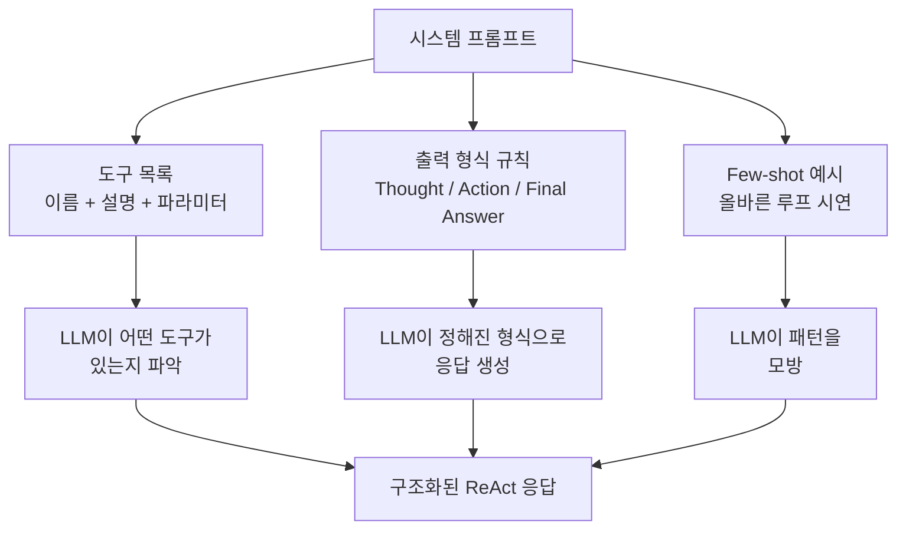
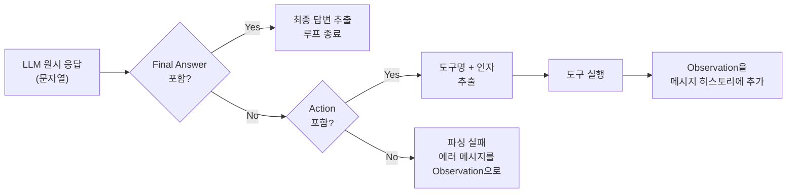
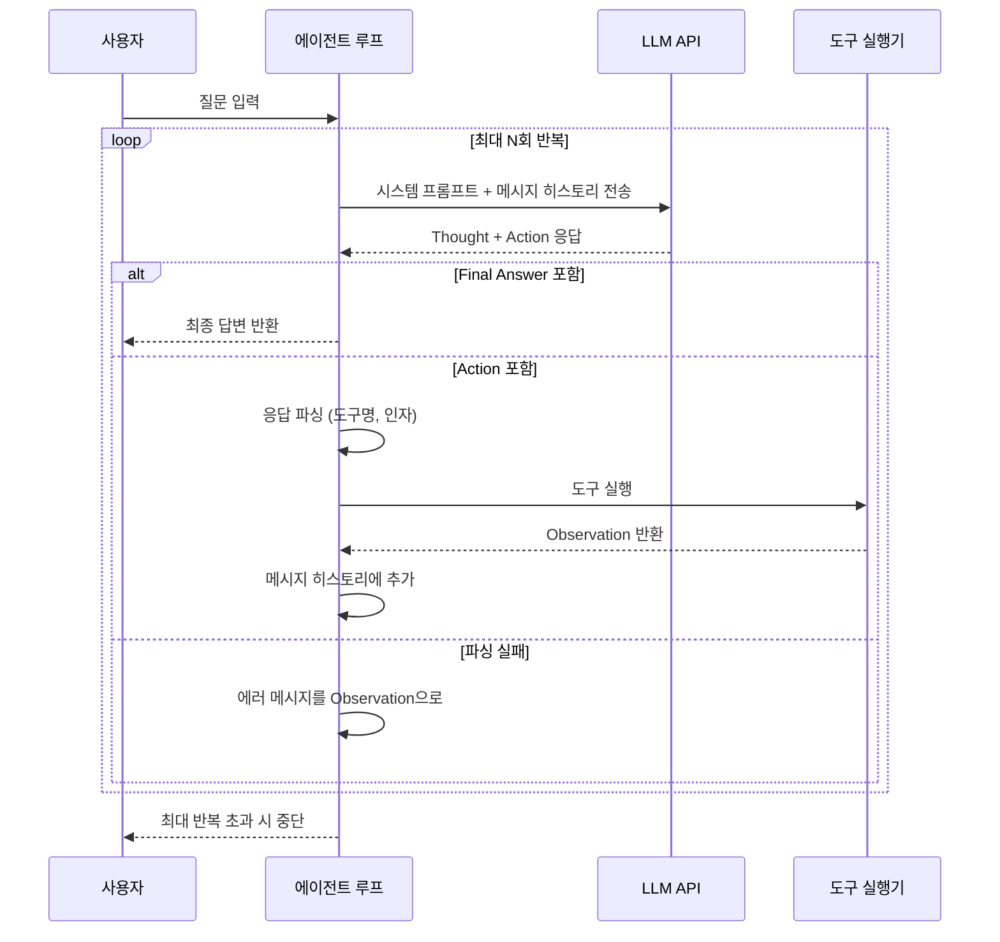
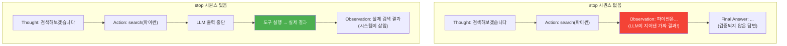
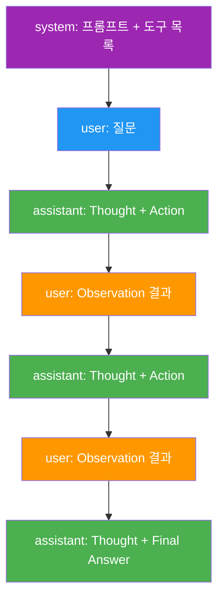

# ReAct 루프 직접 구현

> Thought-Action-Observation 루프를 순수 Python으로 구현하고, 프롬프트 템플릿 설계와 LLM 응답 파싱 전략을 익힌다

## 개요

이 섹션에서는 [이전 섹션](02-ch2-react-패턴과-에이전트-루프/01-01-react-패턴-이론.md)에서 배운 ReAct 이론을 **실제 동작하는 코드**로 옮깁니다. LLM API를 호출하고, 응답에서 Thought·Action·Observation을 파싱하며, 도구를 실행하고 결과를 다시 LLM에게 돌려주는 전체 루프를 처음부터 만들어 봅니다.

**선수 지식**: 
- ReAct의 Thought-Action-Observation 구조 ([01. ReAct 패턴 이론](02-ch2-react-패턴과-에이전트-루프/01-01-react-패턴-이론.md))
- LLM API 호출과 도구 정의 ([Ch1. LLM 도구 호출의 이해](01-ch1-llm-도구-호출의-이해/01-01-ai-에이전트란-무엇인가.md))

**학습 목표**:
- ReAct 프롬프트 템플릿을 설계할 수 있다
- LLM 응답에서 Thought, Action, Final Answer를 정규식으로 파싱할 수 있다
- Thought → Action → Observation 루프를 순수 Python으로 구현할 수 있다

## 왜 알아야 할까?

프레임워크 한 줄이면 ReAct 에이전트를 만들 수 있는 시대입니다. 그런데 왜 직접 구현해야 할까요?

자동차 운전을 배울 때를 떠올려 보세요. 자동차의 엔진 구조를 몰라도 운전은 할 수 있지만, 엔진 원리를 아는 사람은 이상한 소리가 나면 "아, 점화 타이밍 문제일 수 있겠다"고 추론합니다. 마찬가지로 ReAct 루프를 직접 구현해본 개발자는 LangGraph의 `create_react_agent`가 내부에서 뭘 하는지 이해하고, 에이전트가 무한 루프에 빠지거나 엉뚱한 도구를 호출할 때 **어디를 고쳐야 하는지** 바로 파악할 수 있습니다.

오늘 만드는 코드는 약 100줄 남짓입니다. 이 100줄이 LangGraph, LlamaIndex, CrewAI 같은 프레임워크의 에이전트 루프가 하는 일의 본질이에요.

## 핵심 개념

### 개념 1: 프롬프트 템플릿 — 에이전트의 행동 규칙서

> 💡 **비유**: 프롬프트 템플릿은 새로 합류한 직원에게 주는 **업무 매뉴얼**과 같습니다. "문제를 받으면 ① 먼저 생각하고 ② 필요한 도구를 쓰고 ③ 결과를 확인하세요"라고 형식을 알려줘야 LLM이 그 형식대로 행동하거든요.

ReAct 에이전트의 프롬프트는 크게 세 파트로 구성됩니다.

> 📊 **그림 1**: ReAct 프롬프트 템플릿의 3계층 구조



핵심은 **출력 형식을 엄격하게 지정**하는 것입니다. LLM이 자유롭게 말하게 두면 파싱할 수 없거든요. 다음 규칙을 시스템 프롬프트에 명시합니다:

```python
REACT_SYSTEM_PROMPT = """당신은 도구를 사용하여 질문에 답하는 AI 어시스턴트입니다.

사용 가능한 도구:
{tool_descriptions}

반드시 아래 형식을 따르세요:

Thought: 현재 상황을 분석하고 다음에 할 일을 생각합니다
Action: 도구이름(인자)
Observation: [도구 실행 결과가 여기에 삽입됩니다]
... (Thought/Action/Observation을 필요한 만큼 반복)
Thought: 최종 답변을 도출할 수 있습니다
Final Answer: 사용자에게 전달할 최종 답변

중요 규칙:
- 도구가 필요 없다면 바로 Final Answer를 작성하세요
- Action은 반드시 사용 가능한 도구 중 하나여야 합니다
- Observation은 직접 작성하지 마세요. 시스템이 삽입합니다
"""
```

여기서 `{tool_descriptions}`에는 사용 가능한 도구의 이름, 설명, 파라미터가 채워집니다. LLM은 이 목록을 보고 어떤 도구를 쓸지 결정하죠.

> ⚠️ **흔한 오해**: "프롬프트에 예시를 많이 넣으면 좋겠지?" — 사실 예시(few-shot)는 1~2개면 충분합니다. 너무 많으면 컨텍스트 윈도우를 낭비하고, LLM이 예시를 그대로 복사하는 문제가 생깁니다. 핵심은 **형식 규칙을 명확하게** 적는 것이에요.

### 개념 2: 도구 정의 — 에이전트의 손과 발

> 💡 **비유**: 도구는 에이전트의 **앱 서랍** 같은 것입니다. 스마트폰에 계산기, 지도, 검색 앱이 있듯이, 에이전트에게도 "이런 도구들이 있어"라고 알려줘야 적절한 것을 꺼내 씁니다.

도구를 딕셔너리와 함수로 정의합니다. [Ch1에서 만든 도구 실행 엔진](01-ch1-llm-도구-호출의-이해/05-05-도구-실행-엔진-구축.md)을 간결하게 재구성한 버전입니다:

```python
import math
import datetime

# ── 도구 함수 정의 ──────────────────────────────────
def search(query: str) -> str:
    """위키백과 스타일 검색을 시뮬레이션합니다."""
    # 실제로는 Wikipedia API나 검색 엔진 호출
    knowledge = {
        "파이썬": "Python은 1991년 귀도 반 로섬이 만든 프로그래밍 언어입니다.",
        "랭체인": "LangChain은 LLM 애플리케이션 개발 프레임워크입니다.",
        "리액트 패턴": "ReAct는 Reasoning+Acting의 약자로, Yao et al.(2022) 논문에서 제안되었습니다.",
    }
    for key, value in knowledge.items():
        if key in query:
            return value
    return f"'{query}'에 대한 검색 결과를 찾을 수 없습니다."


def calculator(expression: str) -> str:
    """수학 표현식을 계산합니다."""
    try:
        # 안전한 수식 평가 (eval 대신 제한된 환경 사용)
        allowed = {"__builtins__": {}, "math": math}
        result = eval(expression, allowed)
        return str(result)
    except Exception as e:
        return f"계산 오류: {e}"


def get_current_date() -> str:
    """현재 날짜를 반환합니다."""
    return datetime.date.today().isoformat()


# ── 도구 레지스트리 ──────────────────────────────────
TOOLS = {
    "search": {
        "function": search,
        "description": "지식 검색. 사용법: search(검색어)",
    },
    "calculator": {
        "function": calculator,
        "description": "수학 계산. 사용법: calculator(수식)",
    },
    "get_current_date": {
        "function": get_current_date,
        "description": "오늘 날짜 조회. 사용법: get_current_date()",
    },
}
```

도구 레지스트리에서 프롬프트용 설명 문자열을 자동으로 만드는 함수도 준비합니다:

```python
def format_tool_descriptions(tools: dict) -> str:
    """도구 레지스트리에서 프롬프트용 설명을 생성합니다."""
    lines = []
    for name, info in tools.items():
        lines.append(f"- {name}: {info['description']}")
    return "\n".join(lines)
```

```run:python
# 도구 설명 문자열 미리보기
tools_example = {
    "search": {"description": "지식 검색. 사용법: search(검색어)"},
    "calculator": {"description": "수학 계산. 사용법: calculator(수식)"},
    "get_current_date": {"description": "오늘 날짜 조회. 사용법: get_current_date()"},
}
for name, info in tools_example.items():
    print(f"- {name}: {info['description']}")
```

```output
- search: 지식 검색. 사용법: search(검색어)
- calculator: 수학 계산. 사용법: calculator(수식)
- get_current_date: 오늘 날짜 조회. 사용법: get_current_date()
```

### 개념 3: 응답 파싱 — LLM의 말을 구조화된 데이터로

> 💡 **비유**: LLM의 출력을 파싱하는 건 **편지에서 핵심 정보를 추출**하는 것과 같습니다. "생각은 이거고, 행동은 이거야"라는 구조를 정해놓으면 편지의 어느 부분이 생각이고 어느 부분이 행동인지 골라낼 수 있죠.

LLM은 텍스트를 생성할 뿐이므로, 우리가 정해준 형식(`Thought:`, `Action:`, `Final Answer:`)에 따라 응답을 **정규식으로 파싱**해야 합니다.

> 📊 **그림 2**: LLM 응답 파싱 파이프라인



파싱 함수의 핵심 로직은 이렇습니다:

```python
import re
from dataclasses import dataclass
from typing import Optional


@dataclass
class ParsedResponse:
    """LLM 응답 파싱 결과를 담는 데이터 클래스."""
    thought: Optional[str] = None      # 추론 내용
    action: Optional[str] = None       # 도구 이름
    action_input: Optional[str] = None # 도구 인자
    final_answer: Optional[str] = None # 최종 답변


def parse_react_response(response: str) -> ParsedResponse:
    """LLM의 ReAct 형식 응답을 파싱합니다."""
    result = ParsedResponse()

    # 1) Thought 추출
    thought_match = re.search(
        r"Thought:\s*(.+?)(?=\n(?:Action:|Final Answer:)|$)",
        response,
        re.DOTALL,
    )
    if thought_match:
        result.thought = thought_match.group(1).strip()

    # 2) Final Answer 추출 (있으면 루프 종료 신호)
    final_match = re.search(
        r"Final Answer:\s*(.+)",
        response,
        re.DOTALL,
    )
    if final_match:
        result.final_answer = final_match.group(1).strip()
        return result  # Final Answer가 있으면 Action 무시

    # 3) Action 추출 — "도구명(인자)" 형식 파싱
    action_match = re.search(
        r"Action:\s*(\w+)\(([^)]*)\)",
        response,
    )
    if action_match:
        result.action = action_match.group(1).strip()
        result.action_input = action_match.group(2).strip().strip("\"'")

    return result
```

파싱이 실패하는 경우(LLM이 형식을 안 지킨 경우)도 대비해야 합니다. 이때는 에러 메시지를 Observation으로 넣어서 LLM이 형식을 다시 맞추도록 유도하죠.

```run:python
# 파싱 테스트
test_responses = [
    "Thought: 파이썬에 대해 검색해야겠습니다\nAction: search(파이썬)",
    "Thought: 이제 답변을 정리할 수 있습니다\nFinal Answer: 파이썬은 1991년에 만들어졌습니다.",
    "음, 잘 모르겠는데요...",  # 형식 미준수
]

for i, resp in enumerate(test_responses):
    # 간단한 파싱 시뮬레이션
    has_final = "Final Answer:" in resp
    has_action = "Action:" in resp
    status = "Final Answer" if has_final else "Action" if has_action else "파싱 실패"
    print(f"테스트 {i+1}: {status}")
```

```output
테스트 1: Action
테스트 2: Final Answer
테스트 3: 파싱 실패
```

### 개념 4: 에이전트 루프 — 모든 것을 연결하는 심장

> 💡 **비유**: 에이전트 루프는 **요리사의 작업 루틴**과 같습니다. ① 레시피를 확인하고(Thought) ② 재료를 꺼내 손질하고(Action) ③ 결과를 맛보고(Observation) — 맛이 맞으면 서빙하고(Final Answer), 아니면 다시 ①부터 반복합니다.

이제 프롬프트 템플릿, 도구 레지스트리, 응답 파서를 조합하여 **에이전트 루프**를 만듭니다.

> 📊 **그림 3**: ReAct 에이전트 루프의 전체 실행 흐름



루프의 핵심 구조를 코드로 표현하면 다음과 같습니다:

```python
from openai import OpenAI


def run_react_agent(
    question: str,
    tools: dict,
    max_iterations: int = 5,
    model: str = "gpt-4o-mini",
) -> str:
    """ReAct 에이전트를 실행합니다.
    
    Args:
        question: 사용자 질문
        tools: 도구 레지스트리 딕셔너리
        max_iterations: 최대 루프 반복 횟수
        model: 사용할 LLM 모델
    
    Returns:
        에이전트의 최종 답변
    """
    client = OpenAI()  # OPENAI_API_KEY 환경변수 필요

    # ── 시스템 프롬프트 조립 ──
    tool_desc = format_tool_descriptions(tools)
    system_prompt = REACT_SYSTEM_PROMPT.format(tool_descriptions=tool_desc)

    # ── 메시지 히스토리 초기화 ──
    messages = [
        {"role": "system", "content": system_prompt},
        {"role": "user", "content": question},
    ]

    # ── 메인 루프 ──
    for i in range(max_iterations):
        # 1. LLM 호출 (stop 시퀀스로 Observation 환각 방지)
        response = client.chat.completions.create(
            model=model,
            messages=messages,
            temperature=0,
            stop=["Observation:"],  # ← 핵심! LLM이 관찰을 지어내지 못하게
        )
        assistant_text = response.choices[0].message.content.strip()
        print(f"\n{'='*50}")
        print(f"[반복 {i+1}] LLM 응답:")
        print(assistant_text)

        # 2. 응답 파싱
        parsed = parse_react_response(assistant_text)

        # 3. Final Answer면 루프 종료
        if parsed.final_answer:
            print(f"\n✅ 최종 답변: {parsed.final_answer}")
            return parsed.final_answer

        # 4. Action이 있으면 도구 실행
        if parsed.action and parsed.action in tools:
            tool_fn = tools[parsed.action]["function"]
            try:
                observation = tool_fn(parsed.action_input) if parsed.action_input else tool_fn()
            except Exception as e:
                observation = f"도구 실행 에러: {e}"
            print(f"🔧 도구 실행: {parsed.action}({parsed.action_input})")
            print(f"📋 관찰: {observation}")

        elif parsed.action:
            observation = f"오류: '{parsed.action}'은 사용 가능한 도구가 아닙니다. 사용 가능: {list(tools.keys())}"
        else:
            observation = "오류: 응답 형식이 올바르지 않습니다. Thought/Action 또는 Final Answer 형식을 따라주세요."

        # 5. 메시지 히스토리에 추가 (LLM 응답 + Observation)
        messages.append({"role": "assistant", "content": assistant_text})
        messages.append({
            "role": "user",
            "content": f"Observation: {observation}",
        })

    return "최대 반복 횟수를 초과했습니다. 답변을 생성하지 못했습니다."
```

이 코드에서 가장 중요한 부분은 **`stop=["Observation:"]`** 입니다. 이 stop 시퀀스가 없으면 LLM이 Observation까지 직접 지어내버려요. 도구를 실행하지 않고 가짜 결과를 만들어내는 거죠. stop 시퀀스를 걸면 LLM은 `Action:` 까지만 출력하고 멈추고, 실제 도구 실행 결과를 우리가 `Observation:`으로 넣어줍니다.

> 📊 **그림 4**: stop 시퀀스의 역할 — Observation 환각 방지



> 🔥 **실무 팁**: `temperature=0`으로 설정하면 LLM이 동일한 입력에 대해 일관된 출력을 생성합니다. 에이전트 루프에서는 창의성보다 **예측 가능성**이 중요하기 때문에 낮은 temperature를 권장합니다.

### 개념 5: 메시지 히스토리 관리 — 에이전트의 단기 기억

> 💡 **비유**: 메시지 히스토리 관리는 **수사관의 수첩**과 같습니다. 수사관이 증거를 하나씩 기록하며 사건을 풀어가듯, 에이전트도 이전 Thought-Action-Observation을 기록하며 다음 행동을 결정합니다.

`messages` 리스트가 에이전트의 단기 기억, 즉 **메시지 히스토리**입니다. 루프가 반복될수록 이 리스트가 자라나며, LLM은 이전 시도의 결과를 참고하여 더 나은 판단을 할 수 있습니다.

```
[시스템 프롬프트] → [사용자 질문] → [LLM: Thought+Action] → [Observation] → [LLM: Thought+Action] → [Observation] → ... → [LLM: Final Answer]
```

> 📊 **그림 5**: 메시지 히스토리 누적 구조



여기서 중요한 설계 결정이 하나 있습니다. Observation을 **user 역할**로 넣는다는 점입니다. 왜일까요? LLM API의 메시지 형식에서 `assistant` 뒤에는 반드시 `user`가 와야 하고, Observation은 외부 환경(도구)에서 온 정보이므로 LLM 자신의 말이 아니기 때문입니다.

메시지 히스토리가 너무 길어지면 컨텍스트 윈도우를 초과할 수 있는데요, 이 문제는 [03. 에이전트 종료 조건과 안전장치](02-ch2-react-패턴과-에이전트-루프/03-03-에이전트-종료-조건과-안전장치.md)에서 토큰 예산 관리와 함께 다룹니다.

## 실습: 직접 해보기

모든 조각을 합쳐 완전히 동작하는 ReAct 에이전트를 만들어 봅시다. API 키가 없어도 동작을 이해할 수 있도록, **LLM 호출을 시뮬레이션**하는 버전도 함께 제공합니다.

```python
"""ReAct 에이전트 — 순수 Python 구현 (시뮬레이션 버전).

API 키 없이 ReAct 루프의 전체 동작을 확인할 수 있습니다.
실제 LLM을 사용하려면 SimulatedLLM을 OpenAI 클라이언트로 교체하세요.
"""
import re
import math
import datetime
from dataclasses import dataclass, field
from typing import Optional


# ── 1. 데이터 모델 ─────────────────────────────────
@dataclass
class ParsedResponse:
    """LLM 응답 파싱 결과."""
    thought: Optional[str] = None
    action: Optional[str] = None
    action_input: Optional[str] = None
    final_answer: Optional[str] = None


@dataclass
class AgentTrace:
    """에이전트 실행 궤적을 기록합니다."""
    question: str
    steps: list[dict] = field(default_factory=list)
    final_answer: Optional[str] = None

    def add_step(self, thought: str, action: str, 
                 action_input: str, observation: str) -> None:
        self.steps.append({
            "thought": thought,
            "action": action,
            "action_input": action_input,
            "observation": observation,
        })

    def display(self) -> str:
        """사람이 읽기 좋은 트레이스 출력."""
        lines = [f"질문: {self.question}", ""]
        for i, step in enumerate(self.steps, 1):
            lines.append(f"── 반복 {i} ──")
            lines.append(f"💭 Thought: {step['thought']}")
            lines.append(f"🔧 Action: {step['action']}({step['action_input']})")
            lines.append(f"📋 Observation: {step['observation']}")
            lines.append("")
        if self.final_answer:
            lines.append(f"✅ Final Answer: {self.final_answer}")
        return "\n".join(lines)


# ── 2. 도구 정의 ───────────────────────────────────
def search(query: str) -> str:
    """간단한 지식 검색을 시뮬레이션합니다."""
    knowledge = {
        "파이썬 창시자": "귀도 반 로섬(Guido van Rossum)이 1991년에 Python을 만들었습니다.",
        "랭체인": "LangChain은 2022년 Harrison Chase가 만든 LLM 프레임워크입니다.",
        "귀도 반 로섬 나이": "귀도 반 로섬은 1956년 1월 31일생으로, 현재 70세입니다.",
        "1956": "1956년에 태어난 유명인: 귀도 반 로섬(Python 창시자), 스티브 발머 등.",
    }
    for key, value in knowledge.items():
        if key in query.lower() or query.lower() in key:
            return value
    return f"'{query}'에 대한 검색 결과를 찾을 수 없습니다."


def calculator(expression: str) -> str:
    """수학 표현식을 안전하게 계산합니다."""
    try:
        allowed = {"__builtins__": {}, "math": math}
        result = eval(expression, allowed)
        return str(result)
    except Exception as e:
        return f"계산 오류: {e}"


def get_current_date() -> str:
    """오늘 날짜를 반환합니다."""
    return datetime.date.today().isoformat()


TOOLS = {
    "search": {
        "function": search,
        "description": "지식 검색. 사용법: search(검색어)",
    },
    "calculator": {
        "function": calculator,
        "description": "수학 계산. 사용법: calculator(수식)",
    },
    "get_current_date": {
        "function": get_current_date,
        "description": "오늘 날짜 조회. 사용법: get_current_date()",
    },
}


# ── 3. 프롬프트 템플릿 ─────────────────────────────
REACT_SYSTEM_PROMPT = """당신은 도구를 사용하여 질문에 답하는 AI 어시스턴트입니다.

사용 가능한 도구:
{tool_descriptions}

반드시 아래 형식을 따르세요:

Thought: 현재 상황을 분석하고 다음에 할 일을 생각합니다
Action: 도구이름(인자)
Observation: [도구 실행 결과가 여기에 삽입됩니다]
... (Thought/Action/Observation을 필요한 만큼 반복)
Thought: 최종 답변을 도출할 수 있습니다
Final Answer: 사용자에게 전달할 최종 답변

중요 규칙:
- 도구가 필요 없으면 바로 Final Answer를 작성하세요
- Action은 반드시 사용 가능한 도구 중 하나여야 합니다
- Observation은 직접 작성하지 마세요. 시스템이 삽입합니다
"""


def format_tool_descriptions(tools: dict) -> str:
    return "\n".join(f"- {name}: {info['description']}" 
                     for name, info in tools.items())


# ── 4. 응답 파서 ───────────────────────────────────
def parse_react_response(response: str) -> ParsedResponse:
    """LLM의 ReAct 응답을 파싱합니다."""
    result = ParsedResponse()

    # Thought 추출
    thought_match = re.search(
        r"Thought:\s*(.+?)(?=\n(?:Action:|Final Answer:)|$)",
        response, re.DOTALL,
    )
    if thought_match:
        result.thought = thought_match.group(1).strip()

    # Final Answer 추출 (최우선)
    final_match = re.search(r"Final Answer:\s*(.+)", response, re.DOTALL)
    if final_match:
        result.final_answer = final_match.group(1).strip()
        return result

    # Action 추출 — "도구명(인자)" 형식
    action_match = re.search(r"Action:\s*(\w+)\(([^)]*)\)", response)
    if action_match:
        result.action = action_match.group(1).strip()
        result.action_input = action_match.group(2).strip().strip("\"'")
    else:
        # 인자 없는 도구 호출: "Action: get_current_date()"
        no_arg_match = re.search(r"Action:\s*(\w+)\(\s*\)", response)
        if no_arg_match:
            result.action = no_arg_match.group(1).strip()
            result.action_input = ""

    return result


# ── 5. 시뮬레이션 LLM ─────────────────────────────
class SimulatedLLM:
    """LLM API 없이 ReAct 루프를 테스트하기 위한 시뮬레이터.
    
    미리 정의된 응답 시퀀스를 순서대로 반환합니다.
    실제 프로덕션에서는 OpenAILLM 등으로 교체하세요.
    """

    def __init__(self):
        self._call_count = 0
        self._responses = [
            # 반복 1: 파이썬 창시자 검색
            "Thought: 파이썬 창시자가 누구인지 먼저 검색해봐야겠습니다.\n"
            "Action: search(파이썬 창시자)",
            
            # 반복 2: 나이 정보 검색
            "Thought: 귀도 반 로섬이 1991년에 파이썬을 만들었군요. "
            "그의 나이를 알려면 생년을 검색해야 합니다.\n"
            "Action: search(귀도 반 로섬 나이)",
            
            # 반복 3: 나이 계산
            "Thought: 귀도 반 로섬은 1956년생이고 현재 70세입니다. "
            "2026년 기준으로 계산해보겠습니다.\n"
            "Action: calculator(2026 - 1956)",
            
            # 반복 4: 최종 답변
            "Thought: 계산 결과 70살입니다. 충분한 정보를 모았으니 답변을 정리하겠습니다.\n"
            "Final Answer: 파이썬(Python)의 창시자는 귀도 반 로섬(Guido van Rossum)입니다. "
            "1956년 1월 31일생으로, 2026년 기준 70세입니다.",
        ]

    def generate(self, messages: list[dict]) -> str:
        """미리 정해진 응답을 순서대로 반환합니다."""
        if self._call_count < len(self._responses):
            response = self._responses[self._call_count]
            self._call_count += 1
            return response
        return "Final Answer: 더 이상 처리할 수 없습니다."


# ── 6. 에이전트 루프 (핵심!) ──────────────────────
def run_react_agent(
    question: str,
    tools: dict,
    llm=None,
    max_iterations: int = 5,
) -> AgentTrace:
    """ReAct 에이전트를 실행하고 전체 궤적을 반환합니다."""
    if llm is None:
        llm = SimulatedLLM()

    # 프롬프트 조립
    tool_desc = format_tool_descriptions(tools)
    system_prompt = REACT_SYSTEM_PROMPT.format(tool_descriptions=tool_desc)

    # 메시지 히스토리 초기화
    messages = [
        {"role": "system", "content": system_prompt},
        {"role": "user", "content": question},
    ]

    trace = AgentTrace(question=question)

    for i in range(max_iterations):
        # 1) LLM 호출
        assistant_text = llm.generate(messages)

        # 2) 응답 파싱
        parsed = parse_react_response(assistant_text)

        # 3) Final Answer → 루프 종료
        if parsed.final_answer:
            trace.final_answer = parsed.final_answer
            break

        # 4) Action → 도구 실행
        thought = parsed.thought or "(추론 없음)"

        if parsed.action and parsed.action in tools:
            tool_fn = tools[parsed.action]["function"]
            try:
                observation = (tool_fn(parsed.action_input)
                              if parsed.action_input else tool_fn())
            except Exception as e:
                observation = f"도구 실행 에러: {e}"
        elif parsed.action:
            observation = (f"오류: '{parsed.action}'은(는) 없는 도구입니다. "
                          f"사용 가능: {list(tools.keys())}")
        else:
            observation = ("오류: 형식을 따라주세요. "
                          "Thought/Action 또는 Final Answer를 사용하세요.")

        # 5) 궤적 기록
        trace.add_step(
            thought=thought,
            action=parsed.action or "없음",
            action_input=parsed.action_input or "",
            observation=observation,
        )

        # 6) 메시지 히스토리에 추가
        messages.append({"role": "assistant", "content": assistant_text})
        messages.append({"role": "user", "content": f"Observation: {observation}"})

    else:
        trace.final_answer = "최대 반복 횟수를 초과했습니다."

    return trace


# ── 7. 실행 ────────────────────────────────────────
if __name__ == "__main__":
    question = "파이썬의 창시자는 누구이며, 현재 몇 살인가요?"
    trace = run_react_agent(question, TOOLS)
    print(trace.display())
```

```run:python
# 실행 결과 시뮬레이션
lines = [
    "질문: 파이썬의 창시자는 누구이며, 현재 몇 살인가요?",
    "",
    "── 반복 1 ──",
    "💭 Thought: 파이썬 창시자가 누구인지 먼저 검색해봐야겠습니다.",
    "🔧 Action: search(파이썬 창시자)",
    "📋 Observation: 귀도 반 로섬(Guido van Rossum)이 1991년에 Python을 만들었습니다.",
    "",
    "── 반복 2 ──",
    "💭 Thought: 귀도 반 로섬이 1991년에 파이썬을 만들었군요. 그의 나이를 알려면 생년을 검색해야 합니다.",
    "🔧 Action: search(귀도 반 로섬 나이)",
    "📋 Observation: 귀도 반 로섬은 1956년 1월 31일생으로, 현재 70세입니다.",
    "",
    "── 반복 3 ──",
    "💭 Thought: 귀도 반 로섬은 1956년생이고 현재 70세입니다. 2026년 기준으로 계산해보겠습니다.",
    "🔧 Action: calculator(2026 - 1956)",
    "📋 Observation: 70",
    "",
    "✅ Final Answer: 파이썬(Python)의 창시자는 귀도 반 로섬(Guido van Rossum)입니다. 1956년 1월 31일생으로, 2026년 기준 70세입니다.",
]
for line in lines:
    print(line)
```

```output
질문: 파이썬의 창시자는 누구이며, 현재 몇 살인가요?

── 반복 1 ──
💭 Thought: 파이썬 창시자가 누구인지 먼저 검색해봐야겠습니다.
🔧 Action: search(파이썬 창시자)
📋 Observation: 귀도 반 로섬(Guido van Rossum)이 1991년에 Python을 만들었습니다.

── 반복 2 ──
💭 Thought: 귀도 반 로섬이 1991년에 파이썬을 만들었군요. 그의 나이를 알려면 생년을 검색해야 합니다.
🔧 Action: search(귀도 반 로섬 나이)
📋 Observation: 귀도 반 로섬은 1956년 1월 31일생으로, 현재 70세입니다.

── 반복 3 ──
💭 Thought: 귀도 반 로섬은 1956년생이고 현재 70세입니다. 2026년 기준으로 계산해보겠습니다.
🔧 Action: calculator(2026 - 1956)
📋 Observation: 70

✅ Final Answer: 파이썬(Python)의 창시자는 귀도 반 로섬(Guido van Rossum)입니다. 1956년 1월 31일생으로, 2026년 기준 70세입니다.
```

실습 코드의 구조를 정리하면 이렇습니다:

| 컴포넌트 | 역할 | 코드 위치 |
|----------|------|-----------|
| `ParsedResponse` | 파싱 결과 데이터 모델 | 섹션 1, 4 |
| `AgentTrace` | 실행 궤적 기록 | 섹션 1 |
| `TOOLS` | 도구 레지스트리 | 섹션 2 |
| `REACT_SYSTEM_PROMPT` | 형식 지정 프롬프트 | 섹션 3 |
| `parse_react_response()` | 정규식 파서 | 섹션 4 |
| `SimulatedLLM` | API 없이 테스트용 LLM | 섹션 5 |
| `run_react_agent()` | 메인 루프 | 섹션 6 |

실제 LLM을 연결하려면 `SimulatedLLM` 대신 OpenAI 클라이언트를 넣으면 됩니다:

```python
# 실제 LLM 연결 예시
class OpenAILLM:
    def __init__(self, model: str = "gpt-4o-mini"):
        self.client = OpenAI()
        self.model = model

    def generate(self, messages: list[dict]) -> str:
        response = self.client.chat.completions.create(
            model=self.model,
            messages=messages,
            temperature=0,
            stop=["Observation:"],  # Observation 환각 방지
        )
        return response.choices[0].message.content.strip()

# 사용법
# trace = run_react_agent("질문", TOOLS, llm=OpenAILLM())
```

## 더 깊이 알아보기

### Simon Willison의 "100줄 에이전트"

ReAct 에이전트를 직접 구현하는 문화는 2023년 Simon Willison이 블로그에 올린 ["A simple Python implementation of the ReAct pattern for LLMs"](https://til.simonwillison.net/llms/python-react-pattern)에서 크게 확산되었습니다. 그는 단 몇 십 줄의 Python으로 ReAct 루프를 구현하며 "프레임워크 없이도 에이전트를 만들 수 있다"는 것을 보여줬죠.

놀랍게도 이 접근법의 뿌리는 더 깊습니다. ReAct 논문(Yao et al., 2022)의 원래 구현도 본질적으로는 **프롬프트 + while 루프 + 문자열 파싱**이었거든요. 논문 저자들은 GPT-3에게 few-shot 예시를 주고, 출력을 정규식으로 파싱하여 Wikipedia API를 호출했습니다. 2024~2025년 사이 LangChain, LlamaIndex 같은 프레임워크가 이 패턴을 추상화했지만, 내부를 열어보면 여전히 같은 루프가 돌고 있습니다.

### stop 시퀀스의 발견

ReAct 구현 초기에 개발자들이 가장 많이 겪은 문제가 "LLM이 Observation을 지어낸다"는 것이었습니다. LLM은 텍스트 생성기이므로 `Action:` 뒤에 `Observation:`도 자연스럽게 이어서 작성하려 하거든요. 이걸 막기 위해 OpenAI API의 `stop` 파라미터가 활용되기 시작했고, 이것이 ReAct 구현의 핵심 트릭으로 자리잡았습니다. 오늘날에는 Tool Calling API가 이 문제를 근본적으로 해결하지만, 텍스트 기반 ReAct를 이해하면 그 발전 과정도 더 잘 이해할 수 있습니다.

## 흔한 오해와 팁

> ⚠️ **흔한 오해**: "ReAct는 반드시 Tool Calling API를 써야 한다" — 사실 원조 ReAct는 순수 텍스트 파싱 방식입니다. Tool Calling API(`tools` 파라미터)는 파싱 안정성을 높인 **진화된 방식**이지, 필수는 아닙니다. 오늘 우리가 만든 텍스트 기반 구현이 원래의 ReAct 패턴에 가깝습니다.

> 💡 **알고 계셨나요?**: ReAct 논문의 원래 실험에서는 GPT-3(text-davinci-002)를 사용했는데, few-shot 예시 6개만으로 안정적인 Thought-Action-Observation 출력을 얻었습니다. 최신 모델(GPT-4o, Claude 3.5)은 zero-shot으로도 형식을 잘 따르기 때문에 few-shot 예시가 거의 필요 없어졌습니다.

> 🔥 **실무 팁**: 정규식 파싱이 실패하는 경우를 대비하여, 항상 **fallback 로직**을 넣으세요. `parse_react_response()`가 아무것도 추출하지 못했을 때 에러 메시지를 Observation으로 돌려보내면, LLM이 다음 시도에서 형식을 고쳐줍니다. 이런 "자기 교정" 메커니즘이 에이전트를 훨씬 견고하게 만듭니다.

## 핵심 정리

| 개념 | 설명 |
|------|------|
| 프롬프트 템플릿 | 도구 목록 + 출력 형식 규칙 + (선택) few-shot 예시로 구성 |
| 도구 레지스트리 | `{이름: {function, description}}` 딕셔너리로 도구를 관리 |
| 응답 파싱 | 정규식으로 Thought, Action, Final Answer를 추출 |
| stop 시퀀스 | `stop=["Observation:"]`로 LLM의 Observation 환각을 방지 |
| 에이전트 루프 | LLM 호출 → 파싱 → 도구 실행 → Observation 추가를 반복 |
| 메시지 히스토리 | assistant/user 메시지를 번갈아 누적하여 LLM에 컨텍스트 제공 |
| 자기 교정 | 파싱 실패 시 에러를 Observation으로 넣어 LLM이 형식을 고치도록 유도 |

## 다음 섹션 미리보기

지금까지 만든 에이전트는 `max_iterations`가 유일한 안전장치입니다. 하지만 실전에서는 훨씬 다양한 위험이 도사리고 있죠 — 무한 루프, 비용 폭발, 위험한 도구 호출 등. [다음 섹션](02-ch2-react-패턴과-에이전트-루프/03-03-에이전트-종료-조건과-안전장치.md)에서는 **종료 조건 설계**, **토큰 예산 관리**, **도구 호출 제한** 등 에이전트를 안전하게 운영하기 위한 방어 메커니즘을 추가합니다.

## 참고 자료

- [ReAct: Synergizing Reasoning and Acting in Language Models (Yao et al., 2022)](https://arxiv.org/abs/2210.03629) - ReAct 패턴의 원조 논문. Thought-Action-Observation 형식의 근거
- [A simple Python implementation of the ReAct pattern for LLMs — Simon Willison](https://til.simonwillison.net/llms/python-react-pattern) - 수십 줄로 ReAct를 구현한 미니멀 예제. 본 섹션의 영감을 준 글
- [ReAct Prompting — Prompt Engineering Guide](https://www.promptingguide.ai/techniques/react) - ReAct 프롬프트 설계의 실전 가이드와 다양한 예시
- [Implementing ReAct Agentic Pattern From Scratch — Daily Dose of Data Science](https://www.dailydoseofds.com/ai-agents-crash-course-part-10-with-implementation/) - 2026년 최신 ReAct 구현 튜토리얼
- [LangGraph Workflows and Agents — 공식 문서](https://docs.langchain.com/oss/python/langgraph/workflows-agents) - ReAct 패턴이 LangGraph에서 어떻게 추상화되었는지 비교 참고

---
### 🔗 Related Sessions
- [tool calling](01-ch1-llm-도구-호출의-이해/02-02-llm-tool-calling-메커니즘.md) (prerequisite)
- [react](02-ch2-react-패턴과-에이전트-루프/01-01-react-패턴-이론.md) (prerequisite)
- [reacttrace](02-ch2-react-패턴과-에이전트-루프/01-01-react-패턴-이론.md) (prerequisite)
- [steptype](02-ch2-react-패턴과-에이전트-루프/01-01-react-패턴-이론.md) (prerequisite)
