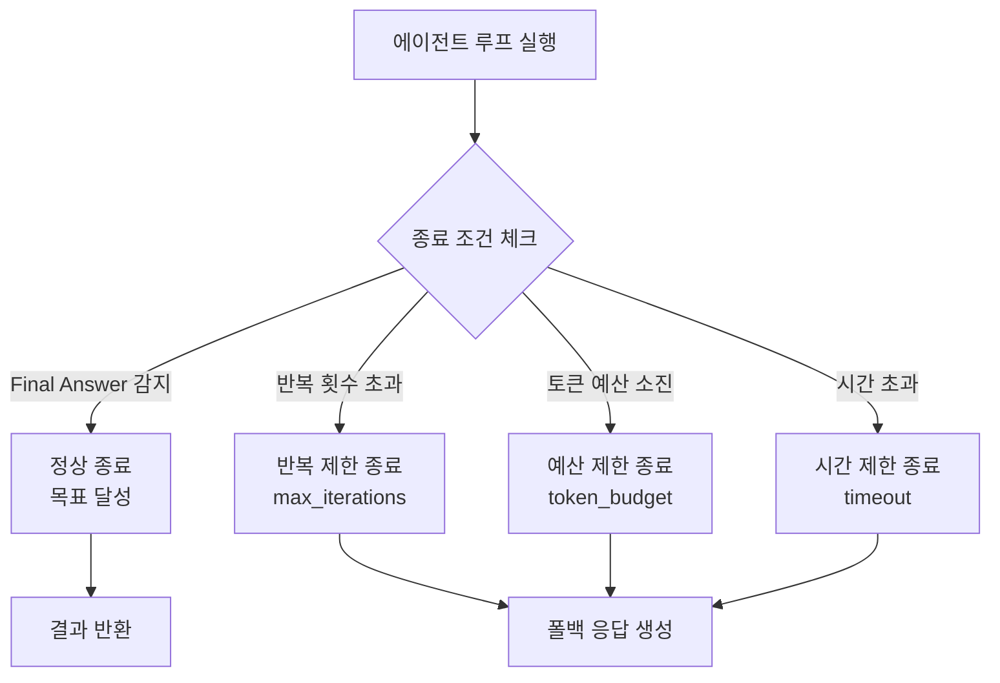
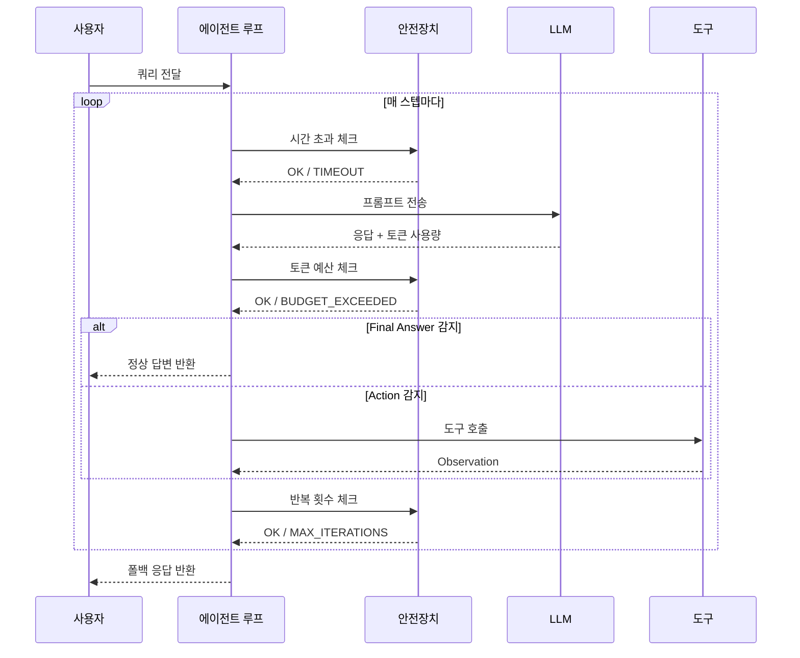
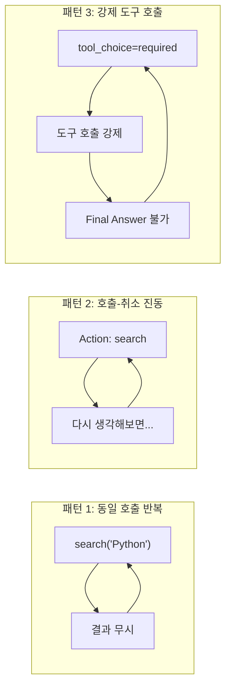
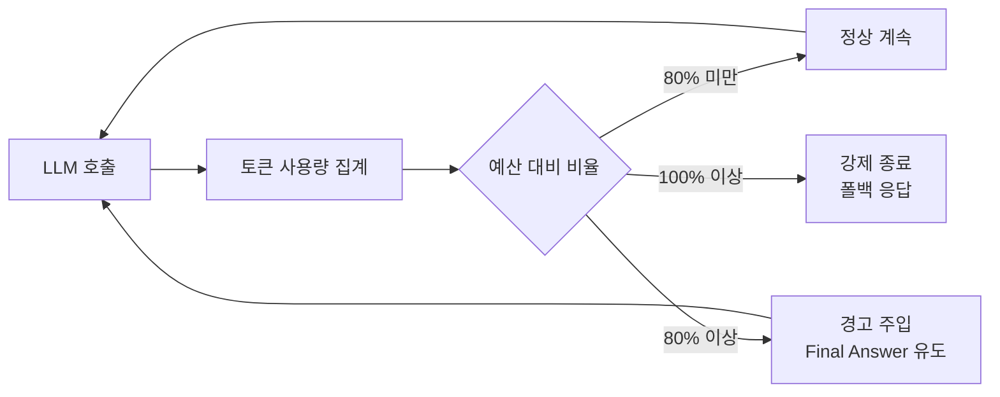
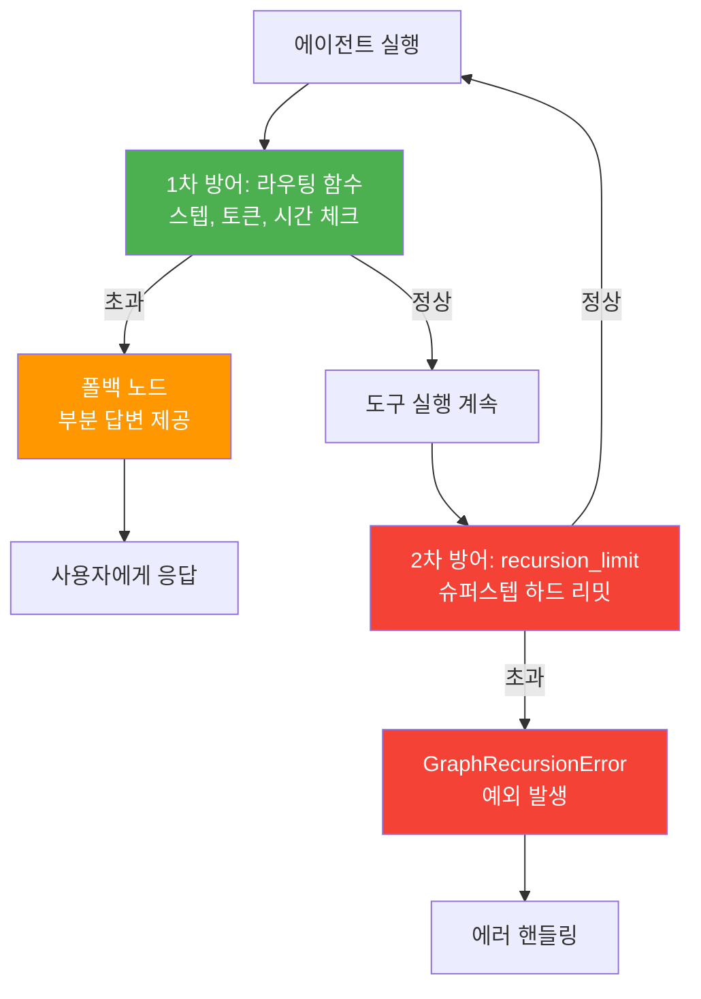

# 에이전트 종료 조건과 안전장치

> 무한 루프를 방지하고, 비용을 통제하며, 예측 가능한 에이전트를 설계하는 안전장치 메커니즘

## 개요

이 섹션에서는 ReAct 에이전트가 **언제, 왜, 어떻게 멈춰야 하는지**를 체계적으로 설계합니다. [이전 섹션](02-ch2-react-패턴과-에이전트-루프/02-02-react-루프-직접-구현.md)에서 구현한 에이전트 루프에 실전 안전장치를 추가하여, 프로덕션에서도 안심하고 사용할 수 있는 에이전트를 만듭니다.

**선수 지식**: 
- [ReAct 패턴 이론](02-ch2-react-패턴과-에이전트-루프/01-01-react-패턴-이론.md)의 Thought-Action-Observation 루프
- [ReAct 루프 직접 구현](02-ch2-react-패턴과-에이전트-루프/02-02-react-루프-직접-구현.md)의 `run_react_agent`, `parse_react_response` 함수

**학습 목표**:
- 에이전트의 4가지 종료 조건(정상 완료, 반복 초과, 토큰 예산, 시간 제한)을 설계할 수 있다
- 무한 루프의 원인을 분석하고 방어 로직을 구현할 수 있다
- 토큰 사용량을 추적하여 비용 예산을 강제할 수 있다
- LangGraph의 `recursion_limit`이 왜 충분하지 않은지 이해하고, 다층 방어 전략의 필요성을 설명할 수 있다

## 왜 알아야 할까?

에이전트를 처음 만들면 누구나 한 번쯤 겪는 일이 있습니다. "잠깐 테스트해볼게"하고 돌려놓은 에이전트가 같은 도구를 30번, 50번 반복 호출하면서 API 비용이 눈덩이처럼 불어나는 상황이죠. 

실제로 LangGraph GitHub에는 "에이전트가 `tool_choice=required` 설정일 때 `GraphRecursionError` 없이 무한 루프에 빠진다"는 유형의 이슈가 여러 차례 보고되었습니다. 프레임워크의 기본 안전장치만 믿었다가는 한 번의 실행에 수만 토큰이 날아갈 수 있다는 얘기입니다.

자율주행 자동차에 브레이크가 필수인 것처럼, 자율적으로 행동하는 에이전트에는 **반드시 멈추는 메커니즘**이 있어야 합니다. 이 섹션은 바로 그 "브레이크 시스템"을 설계하는 시간입니다.

## 핵심 개념

### 개념 1: 에이전트 종료의 4가지 유형

> 💡 **비유**: 마라톤 대회를 떠올려 보세요. 주자가 멈추는 이유는 크게 네 가지입니다. (1) 골인선 통과(정상 완료), (2) 제한 시간 초과(컷오프), (3) 체력 소진(자원 부족), (4) 부상 발생(에러). 에이전트도 똑같은 네 가지 이유로 멈춥니다.

에이전트 루프의 종료 조건은 **정상 종료**와 **강제 종료**로 나뉘고, 강제 종료는 다시 세 가지로 분류됩니다.

> 📊 **그림 1**: 에이전트 종료 조건의 4가지 유형



| 종료 유형 | 트리거 | 우선순위 | 사용자 경험 |
|-----------|--------|---------|------------|
| 정상 종료 | `Final Answer` 토큰 감지 | 최우선 | 완전한 답변 |
| 반복 제한 | `steps >= max_iterations` | 높음 | "최선의 답변" 폴백 |
| 토큰 예산 | `total_tokens >= budget` | 높음 | 비용 보호 + 부분 답변 |
| 시간 제한 | `elapsed >= timeout` | 중간 | 타임아웃 메시지 |

핵심은 **정상 종료가 가장 먼저 체크**되어야 한다는 점입니다. 강제 종료는 정상 종료가 실패했을 때의 안전망이지, 기본 동작이 아닙니다.

### 개념 2: 최대 반복 횟수 제어

> 💡 **비유**: 미로 찾기를 할 때 "100걸음 안에 출구를 못 찾으면 포기하고 돌아간다"라는 규칙을 정해두는 것과 같습니다. 무한히 미로를 헤매는 것보다 훨씬 안전하죠.

가장 기본적이면서도 강력한 안전장치입니다. 에이전트 루프가 특정 횟수 이상 반복하면 강제로 멈추는 방식이죠.

```python
from dataclasses import dataclass, field
from enum import Enum
from typing import Optional


class StopReason(Enum):
    """에이전트가 멈춘 이유"""
    COMPLETED = "completed"           # Final Answer 감지
    MAX_ITERATIONS = "max_iterations" # 반복 횟수 초과
    TOKEN_BUDGET = "token_budget"     # 토큰 예산 소진
    TIMEOUT = "timeout"               # 시간 초과
    ERROR = "error"                   # 에러 발생


@dataclass
class SafetyConfig:
    """에이전트 안전장치 설정"""
    max_iterations: int = 10          # 최대 반복 횟수
    token_budget: int = 50_000        # 최대 토큰 수
    timeout_seconds: float = 120.0    # 최대 실행 시간 (초)
    warn_at_ratio: float = 0.8       # 80% 도달 시 경고


@dataclass
class AgentResult:
    """에이전트 실행 결과"""
    answer: Optional[str] = None
    stop_reason: StopReason = StopReason.COMPLETED
    steps_taken: int = 0
    tokens_used: int = 0
    elapsed_seconds: float = 0.0
    history: list = field(default_factory=list)
```

[이전 섹션](02-ch2-react-패턴과-에이전트-루프/02-02-react-루프-직접-구현.md)의 `run_react_agent`에 반복 제한을 추가하면 이렇게 됩니다:

```python
import time


def run_safe_agent(
    query: str,
    tools: dict,
    llm_call,
    safety: SafetyConfig = SafetyConfig(),
) -> AgentResult:
    """안전장치가 적용된 ReAct 에이전트"""
    history = []
    start_time = time.time()
    total_tokens = 0

    for step in range(safety.max_iterations):
        # --- 시간 제한 체크 ---
        elapsed = time.time() - start_time
        if elapsed >= safety.timeout_seconds:
            return AgentResult(
                answer=_build_fallback(history),
                stop_reason=StopReason.TIMEOUT,
                steps_taken=step,
                tokens_used=total_tokens,
                elapsed_seconds=elapsed,
                history=history,
            )

        # --- LLM 호출 ---
        response, usage = llm_call(history)  # (텍스트, 토큰수) 반환
        total_tokens += usage

        # --- 토큰 예산 체크 ---
        if total_tokens >= safety.token_budget:
            return AgentResult(
                answer=_build_fallback(history),
                stop_reason=StopReason.TOKEN_BUDGET,
                steps_taken=step + 1,
                tokens_used=total_tokens,
                elapsed_seconds=time.time() - start_time,
                history=history,
            )

        # --- 80% 경고 ---
        if total_tokens >= safety.token_budget * safety.warn_at_ratio:
            history.append(
                f"[SYSTEM] 토큰 예산의 {safety.warn_at_ratio*100:.0f}% 사용. "
                f"가능하면 Final Answer를 출력하세요."
            )

        # --- 응답 파싱 ---
        parsed = parse_react_response(response)

        if parsed.final_answer:
            return AgentResult(
                answer=parsed.final_answer,
                stop_reason=StopReason.COMPLETED,
                steps_taken=step + 1,
                tokens_used=total_tokens,
                elapsed_seconds=time.time() - start_time,
                history=history,
            )

        # --- 도구 실행 ---
        if parsed.action and parsed.action in tools:
            observation = tools[parsed.action](parsed.action_input)
            history.append(f"Observation: {observation}")

    # --- 반복 횟수 초과 ---
    return AgentResult(
        answer=_build_fallback(history),
        stop_reason=StopReason.MAX_ITERATIONS,
        steps_taken=safety.max_iterations,
        tokens_used=total_tokens,
        elapsed_seconds=time.time() - start_time,
        history=history,
    )


def _build_fallback(history: list) -> str:
    """지금까지의 정보를 바탕으로 최선의 답변 생성"""
    observations = [h for h in history if h.startswith("Observation:")]
    if observations:
        return f"완료하지 못했지만, 수집된 정보: {observations[-1]}"
    return "제한 시간/횟수 내에 답변을 완성하지 못했습니다."
```

> 📊 **그림 2**: 안전장치가 적용된 에이전트 루프 흐름



### 개념 3: 무한 루프의 원인과 방어

> 💡 **비유**: 네비게이션이 "300m 앞에서 유턴하세요"를 무한 반복하는 것을 본 적 있나요? 에이전트도 비슷한 상황에 빠질 수 있습니다. 도구가 기대한 결과를 반환하지 않으면, 같은 도구를 같은 입력으로 반복 호출하는 "루프 패턴"에 갇히죠.

무한 루프는 크게 세 가지 패턴으로 나타납니다:

| 패턴 | 원인 | 증상 |
|------|------|------|
| 동일 호출 반복 | 도구 결과를 LLM이 이해 못함 | `search("Python")` 무한 반복 |
| 호출 ↔ 취소 진동 | 모호한 프롬프트 | Action → "다시 생각해보면..." 교대 |
| 강제 도구 호출 | `tool_choice=required` | 항상 도구 호출, Final Answer 불가 |

> 📊 **그림 3**: 무한 루프 세 가지 패턴 시각화



이 세 가지를 모두 방어하는 **중복 호출 감지기**를 만들어 봅시다:

```python
from collections import Counter


class LoopDetector:
    """에이전트의 반복 패턴을 감지하는 안전장치"""

    def __init__(self, max_repeats: int = 3, window_size: int = 5):
        self.max_repeats = max_repeats  # 동일 호출 허용 횟수
        self.window_size = window_size  # 관찰 윈도우 크기
        self.call_history: list[str] = []

    def record(self, action: str, action_input: str) -> None:
        """도구 호출 기록"""
        key = f"{action}({action_input})"
        self.call_history.append(key)

    def is_looping(self) -> bool:
        """무한 루프 감지"""
        if len(self.call_history) < self.max_repeats:
            return False

        # 패턴 1: 완전히 동일한 호출 반복
        recent = self.call_history[-self.window_size:]
        counts = Counter(recent)
        if counts.most_common(1)[0][1] >= self.max_repeats:
            return True

        # 패턴 2: A→B→A→B 진동 패턴
        if len(self.call_history) >= 4:
            last_four = self.call_history[-4:]
            if last_four[0] == last_four[2] and last_four[1] == last_four[3]:
                return True

        return False

    def get_suggestion(self) -> str:
        """루프 탈출을 위한 시스템 메시지 생성"""
        counts = Counter(self.call_history[-self.window_size:])
        most_common = counts.most_common(1)[0]
        return (
            f"[SYSTEM] '{most_common[0]}'이(가) {most_common[1]}회 반복되었습니다. "
            f"다른 접근 방식을 시도하거나 Final Answer를 출력하세요."
        )
```

```run:python
from collections import Counter

# 루프 감지 시뮬레이션
class LoopDetector:
    def __init__(self, max_repeats=3, window_size=5):
        self.max_repeats = max_repeats
        self.window_size = window_size
        self.call_history = []

    def record(self, action, action_input):
        self.call_history.append(f"{action}({action_input})")

    def is_looping(self):
        if len(self.call_history) < self.max_repeats:
            return False
        recent = self.call_history[-self.window_size:]
        counts = Counter(recent)
        return counts.most_common(1)[0][1] >= self.max_repeats

detector = LoopDetector(max_repeats=3)

# 정상적인 다양한 호출
detector.record("search", "Python 튜토리얼")
detector.record("calculator", "2+3")
print(f"다양한 호출 후: 루프 감지 = {detector.is_looping()}")

# 같은 호출 3번 반복
detector.record("search", "Python 튜토리얼")
detector.record("search", "Python 튜토리얼")
print(f"동일 호출 3회 후: 루프 감지 = {detector.is_looping()}")
```

```output
다양한 호출 후: 루프 감지 = False
동일 호출 3회 후: 루프 감지 = True
```

### 개념 4: 토큰 예산 관리

> 💡 **비유**: 여행 경비를 관리하는 것과 같습니다. 총 예산(token_budget)을 정해두고, 호텔비(입력 토큰), 식비(출력 토큰), 교통비(도구 호출)를 합산하면서, 80%를 넘으면 "이제 슬슬 돌아갈 준비를 하자"고 알리는 거죠.

LLM API 호출마다 토큰이 소비되고, 각 토큰은 돈입니다. 에이전트가 자율적으로 여러 번 호출하면 비용이 빠르게 누적되므로, 토큰 예산 관리는 실무에서 핵심적인 안전장치입니다.

> 📊 **그림 4**: 토큰 예산 관리 흐름



```python
@dataclass
class TokenTracker:
    """토큰 사용량 추적기"""
    budget: int = 50_000
    input_tokens: int = 0
    output_tokens: int = 0

    @property
    def total(self) -> int:
        return self.input_tokens + self.output_tokens

    @property
    def remaining(self) -> int:
        return max(0, self.budget - self.total)

    @property
    def usage_ratio(self) -> float:
        return self.total / self.budget if self.budget > 0 else 1.0

    def record(self, input_tokens: int, output_tokens: int) -> None:
        """사용량 기록"""
        self.input_tokens += input_tokens
        self.output_tokens += output_tokens

    def is_exceeded(self) -> bool:
        """예산 초과 여부"""
        return self.total >= self.budget

    def should_warn(self, threshold: float = 0.8) -> bool:
        """경고 임계값 도달 여부"""
        return self.usage_ratio >= threshold and not self.is_exceeded()

    def summary(self) -> str:
        """사용량 요약"""
        return (
            f"입력: {self.input_tokens:,} | 출력: {self.output_tokens:,} | "
            f"합계: {self.total:,} / {self.budget:,} "
            f"({self.usage_ratio:.1%})"
        )
```

```run:python
# 토큰 예산 추적 시뮬레이션
class TokenTracker:
    def __init__(self, budget=50_000):
        self.budget = budget
        self.input_tokens = 0
        self.output_tokens = 0

    @property
    def total(self):
        return self.input_tokens + self.output_tokens

    @property
    def usage_ratio(self):
        return self.total / self.budget

    def record(self, inp, out):
        self.input_tokens += inp
        self.output_tokens += out

    def is_exceeded(self):
        return self.total >= self.budget

    def should_warn(self, threshold=0.8):
        return self.usage_ratio >= threshold and not self.is_exceeded()

tracker = TokenTracker(budget=10_000)

# 5번의 LLM 호출 시뮬레이션
calls = [(1500, 500), (1800, 600), (2000, 700), (1200, 400), (1500, 500)]
for i, (inp, out) in enumerate(calls, 1):
    tracker.record(inp, out)
    status = "WARN" if tracker.should_warn() else ("STOP" if tracker.is_exceeded() else "OK")
    print(f"호출 {i}: +{inp+out:,}토큰 → 합계 {tracker.total:,}/{tracker.budget:,} ({tracker.usage_ratio:.0%}) [{status}]")
```

```output
호출 1: +2,000토큰 → 합계 2,000/10,000 (20%) [OK]
호출 2: +2,400토큰 → 합계 4,400/10,000 (44%) [OK]
호출 3: +2,700토큰 → 합계 7,100/10,000 (71%) [OK]
호출 4: +1,600토큰 → 합계 8,700/10,000 (87%) [WARN]
호출 5: +2,000토큰 → 합계 10,700/10,000 (107%) [STOP]
```

### 개념 5: LangGraph의 recursion_limit — 왜 이것만으로는 부족한가

> 💡 **비유**: 건물의 비상구와 스프링클러 시스템의 차이와 비슷합니다. `recursion_limit`은 스프링클러(프레임워크 내장 안전장치)이고, 커스텀 종료 조건은 비상구(직접 설계한 탈출 경로)입니다. 둘 다 있어야 안전합니다.

LangGraph에서 에이전트를 실행하면, 내부적으로 **슈퍼스텝(superstep)** 단위로 실행을 관리합니다. `recursion_limit`은 이 슈퍼스텝의 최대 횟수를 제한하는 프레임워크 내장 안전장치입니다.

```python
from langgraph.errors import GraphRecursionError

# recursion_limit은 config 딕셔너리로 전달
try:
    result = graph.invoke(
        {"messages": [("user", query)], "steps": 0, "total_tokens": 0},
        {"recursion_limit": 30},  # 슈퍼스텝 최대 30회
    )
except GraphRecursionError:
    # 하드 리밋 도달 — 예외로 처리됨 (사용자 경험 나쁨)
    result = {"messages": [("assistant", "처리 한도를 초과했습니다.")]}
```

하지만 `recursion_limit`은 **최후의 보루**일 뿐, 일차 방어선으로는 부적절합니다. 왜 그럴까요?

> 📊 **그림 5**: 다층 방어 전략 — 종료 조건의 계층 구조



| 구분 | recursion_limit | 커스텀 종료 조건 |
|------|----------------|-----------------|
| 제공 주체 | LangGraph 프레임워크 | 개발자 직접 구현 |
| 작동 방식 | 예외(Exception) 발생 | 폴백 노드로 라우팅 |
| 사용자 경험 | 에러 메시지 | 부분 답변 제공 |
| 기준 | 슈퍼스텝 수만 | 스텝, 토큰, 시간 등 자유 |
| 역할 | 최후의 안전망 | 일차 방어선 |

이 섹션에서는 종료 조건의 **개념과 필요성**에 집중했습니다. 실제로 LangGraph 그래프 안에서 이 종료 조건을 어떻게 구현하는지는 이후 챕터에서 단계적으로 다룹니다:

- [Ch4. LangGraph StateGraph 기초](04-ch4-langgraph-stategraph-기초/05-05-조건부-엣지와-라우팅.md)에서 LangGraph가 제공하는 **프리빌트 라우팅 함수** `tools_condition`을 배웁니다. 이것이 "도구 호출이 있으면 계속, 없으면 종료"라는 가장 기본적인 종료 패턴을 한 줄로 처리하는 방법입니다.
- [Ch5. 도구 통합과 Function Calling](05-ch5-도구-통합과-function-calling/01-01-langgraph-도구-통합-아키텍처.md)에서는 `tools_condition`을 넘어 **커스텀 라우팅 함수**를 작성하여, 이 섹션에서 배운 스텝 제한, 토큰 예산, 루프 감지를 LangGraph 그래프 안에 녹이는 방법을 실습합니다.

지금 단계에서 중요한 것은 "프레임워크 내장 안전장치만으로는 충분하지 않으며, **반드시 다층 방어가 필요하다**"는 설계 원칙을 이해하는 것입니다.

## 실습: 직접 해보기

안전장치를 모두 통합한 완전한 에이전트를 구현해 봅시다. API 키 없이도 실행할 수 있도록 시뮬레이션 LLM을 사용합니다.

```python
import time
from dataclasses import dataclass, field
from enum import Enum
from collections import Counter
from typing import Optional, Callable


# ============================================
# 1. 데이터 모델
# ============================================

class StopReason(Enum):
    COMPLETED = "completed"
    MAX_ITERATIONS = "max_iterations"
    TOKEN_BUDGET = "token_budget"
    TIMEOUT = "timeout"
    LOOP_DETECTED = "loop_detected"
    ERROR = "error"


@dataclass
class SafetyConfig:
    max_iterations: int = 10
    token_budget: int = 50_000
    timeout_seconds: float = 120.0
    warn_at_ratio: float = 0.8
    max_repeats: int = 3       # 동일 호출 허용 횟수


@dataclass
class ParsedResponse:
    thought: str = ""
    action: str = ""
    action_input: str = ""
    final_answer: str = ""


@dataclass
class AgentResult:
    answer: str = ""
    stop_reason: StopReason = StopReason.COMPLETED
    steps_taken: int = 0
    tokens_used: int = 0
    elapsed_seconds: float = 0.0
    trace: list = field(default_factory=list)


# ============================================
# 2. 루프 감지기
# ============================================

class LoopDetector:
    def __init__(self, max_repeats: int = 3):
        self.max_repeats = max_repeats
        self.history: list[str] = []

    def record(self, action: str, action_input: str) -> None:
        self.history.append(f"{action}({action_input})")

    def is_looping(self) -> bool:
        if len(self.history) < self.max_repeats:
            return False
        recent = self.history[-5:]
        counts = Counter(recent)
        if counts.most_common(1)[0][1] >= self.max_repeats:
            return True
        # 진동 패턴 감지
        if len(self.history) >= 4:
            h = self.history
            if h[-1] == h[-3] and h[-2] == h[-4]:
                return True
        return False


# ============================================
# 3. 토큰 추적기
# ============================================

class TokenTracker:
    def __init__(self, budget: int):
        self.budget = budget
        self.total = 0

    def record(self, tokens: int) -> None:
        self.total += tokens

    def is_exceeded(self) -> bool:
        return self.total >= self.budget

    def should_warn(self, threshold: float = 0.8) -> bool:
        return (self.total / self.budget) >= threshold and not self.is_exceeded()


# ============================================
# 4. 시뮬레이션 도구 및 LLM
# ============================================

def search_tool(query: str) -> str:
    """검색 시뮬레이션"""
    data = {
        "서울 날씨": "서울: 맑음, 기온 18°C, 습도 45%",
        "서울 인구": "서울 인구: 약 950만 명 (2025년 기준)",
    }
    return data.get(query, f"'{query}'에 대한 검색 결과 없음")


def calculator_tool(expression: str) -> str:
    """계산기 시뮬레이션"""
    try:
        result = eval(expression, {"__builtins__": {}})  # 안전한 eval
        return str(result)
    except Exception as e:
        return f"계산 오류: {e}"


TOOLS = {"search": search_tool, "calculator": calculator_tool}


class SimulatedLLM:
    """시나리오 기반 LLM 시뮬레이션"""

    def __init__(self, scenario: str = "normal"):
        self.scenario = scenario
        self.call_count = 0
        self.tokens_per_call = 500

    def __call__(self, messages: list[str]) -> tuple[str, int]:
        self.call_count += 1

        if self.scenario == "normal":
            return self._normal_scenario()
        elif self.scenario == "infinite_loop":
            return self._loop_scenario()
        elif self.scenario == "token_heavy":
            return self._token_heavy_scenario()

        return "Thought: 모르겠습니다\nFinal Answer: 알 수 없습니다", 200

    def _normal_scenario(self) -> tuple[str, int]:
        """정상 시나리오: 2단계 만에 완료"""
        if self.call_count == 1:
            return (
                "Thought: 서울 날씨를 검색해야겠습니다.\n"
                "Action: search\n"
                "Action Input: 서울 날씨"
            ), self.tokens_per_call
        else:
            return (
                "Thought: 날씨 정보를 얻었습니다.\n"
                "Final Answer: 서울은 현재 맑으며, 기온은 18°C입니다."
            ), self.tokens_per_call

    def _loop_scenario(self) -> tuple[str, int]:
        """무한 루프 시나리오: 같은 검색 반복"""
        return (
            "Thought: 더 자세한 정보가 필요합니다.\n"
            "Action: search\n"
            "Action Input: 서울 날씨"
        ), self.tokens_per_call

    def _token_heavy_scenario(self) -> tuple[str, int]:
        """토큰 과다 사용 시나리오"""
        if self.call_count <= 3:
            return (
                "Thought: 정보를 수집 중입니다.\n"
                "Action: search\n"
                f"Action Input: 서울 인구"
            ), 5000  # 호출당 5000 토큰
        return "Final Answer: 완료", 5000


# ============================================
# 5. 응답 파서
# ============================================

import re

def parse_response(text: str) -> ParsedResponse:
    parsed = ParsedResponse()

    thought_match = re.search(r"Thought:\s*(.+?)(?=\n(?:Action|Final)|\Z)", text, re.S)
    if thought_match:
        parsed.thought = thought_match.group(1).strip()

    final_match = re.search(r"Final Answer:\s*(.+)", text, re.S)
    if final_match:
        parsed.final_answer = final_match.group(1).strip()
        return parsed

    action_match = re.search(r"Action:\s*(.+)", text)
    if action_match:
        parsed.action = action_match.group(1).strip()

    input_match = re.search(r"Action Input:\s*(.+)", text)
    if input_match:
        parsed.action_input = input_match.group(1).strip()

    return parsed


# ============================================
# 6. 안전 에이전트 메인 루프
# ============================================

def run_safe_agent(
    query: str,
    tools: dict[str, Callable],
    llm: Callable,
    config: SafetyConfig = SafetyConfig(),
) -> AgentResult:
    """모든 안전장치가 통합된 ReAct 에이전트"""

    messages = [f"User: {query}"]
    trace = []
    loop_detector = LoopDetector(max_repeats=config.max_repeats)
    token_tracker = TokenTracker(budget=config.token_budget)
    start_time = time.time()

    for step in range(config.max_iterations):
        elapsed = time.time() - start_time

        # 안전장치 1: 시간 제한
        if elapsed >= config.timeout_seconds:
            return AgentResult(
                answer="시간 제한을 초과했습니다.",
                stop_reason=StopReason.TIMEOUT,
                steps_taken=step, tokens_used=token_tracker.total,
                elapsed_seconds=elapsed, trace=trace,
            )

        # LLM 호출
        response_text, tokens = llm(messages)
        token_tracker.record(tokens)
        parsed = parse_response(response_text)
        trace.append({"step": step + 1, "response": response_text, "tokens": tokens})

        # 안전장치 2: 토큰 예산
        if token_tracker.is_exceeded():
            return AgentResult(
                answer=f"토큰 예산 초과. 마지막 사고: {parsed.thought}",
                stop_reason=StopReason.TOKEN_BUDGET,
                steps_taken=step + 1, tokens_used=token_tracker.total,
                elapsed_seconds=time.time() - start_time, trace=trace,
            )

        # 토큰 경고 주입
        if token_tracker.should_warn(config.warn_at_ratio):
            messages.append("[SYSTEM] 토큰 예산 80% 도달. Final Answer를 출력하세요.")

        # 정상 종료
        if parsed.final_answer:
            return AgentResult(
                answer=parsed.final_answer,
                stop_reason=StopReason.COMPLETED,
                steps_taken=step + 1, tokens_used=token_tracker.total,
                elapsed_seconds=time.time() - start_time, trace=trace,
            )

        # 도구 실행
        if parsed.action and parsed.action in tools:
            # 안전장치 3: 루프 감지
            loop_detector.record(parsed.action, parsed.action_input)
            if loop_detector.is_looping():
                return AgentResult(
                    answer=f"반복 패턴 감지로 중단. 마지막 사고: {parsed.thought}",
                    stop_reason=StopReason.LOOP_DETECTED,
                    steps_taken=step + 1, tokens_used=token_tracker.total,
                    elapsed_seconds=time.time() - start_time, trace=trace,
                )

            observation = tools[parsed.action](parsed.action_input)
            messages.append(f"Observation: {observation}")
            trace[-1]["observation"] = observation

    # 안전장치 4: 반복 제한
    return AgentResult(
        answer="최대 반복 횟수에 도달했습니다.",
        stop_reason=StopReason.MAX_ITERATIONS,
        steps_taken=config.max_iterations, tokens_used=token_tracker.total,
        elapsed_seconds=time.time() - start_time, trace=trace,
    )
```

이제 세 가지 시나리오를 실행해서 안전장치가 잘 동작하는지 확인합니다:

```run:python
import time, re
from collections import Counter
from enum import Enum
from dataclasses import dataclass, field

class StopReason(Enum):
    COMPLETED = "completed"
    MAX_ITERATIONS = "max_iterations"
    TOKEN_BUDGET = "token_budget"
    LOOP_DETECTED = "loop_detected"

@dataclass
class SafetyConfig:
    max_iterations: int = 10
    token_budget: int = 50_000
    timeout_seconds: float = 120.0
    warn_at_ratio: float = 0.8
    max_repeats: int = 3

@dataclass
class ParsedResponse:
    thought: str = ""
    action: str = ""
    action_input: str = ""
    final_answer: str = ""

@dataclass
class AgentResult:
    answer: str = ""
    stop_reason: StopReason = StopReason.COMPLETED
    steps_taken: int = 0
    tokens_used: int = 0
    trace: list = field(default_factory=list)

class LoopDetector:
    def __init__(self, max_repeats=3):
        self.max_repeats = max_repeats
        self.history = []
    def record(self, action, action_input):
        self.history.append(f"{action}({action_input})")
    def is_looping(self):
        if len(self.history) < self.max_repeats:
            return False
        recent = self.history[-5:]
        counts = Counter(recent)
        return counts.most_common(1)[0][1] >= self.max_repeats

class TokenTracker:
    def __init__(self, budget):
        self.budget = budget
        self.total = 0
    def record(self, tokens):
        self.total += tokens
    def is_exceeded(self):
        return self.total >= self.budget

def parse_response(text):
    p = ParsedResponse()
    m = re.search(r"Thought:\s*(.+?)(?=\n(?:Action|Final)|\Z)", text, re.S)
    if m: p.thought = m.group(1).strip()
    m = re.search(r"Final Answer:\s*(.+)", text, re.S)
    if m: p.final_answer = m.group(1).strip(); return p
    m = re.search(r"Action:\s*(.+)", text)
    if m: p.action = m.group(1).strip()
    m = re.search(r"Action Input:\s*(.+)", text)
    if m: p.action_input = m.group(1).strip()
    return p

def search_tool(q):
    return {"서울 날씨": "서울: 맑음, 18°C"}.get(q, f"'{q}' 결과 없음")

TOOLS = {"search": search_tool}

class SimLLM:
    def __init__(self, scenario):
        self.scenario = scenario
        self.n = 0
        self.tpc = 500
    def __call__(self, msgs):
        self.n += 1
        if self.scenario == "normal":
            if self.n == 1: return "Thought: 검색하자\nAction: search\nAction Input: 서울 날씨", self.tpc
            return "Thought: 정보 획득\nFinal Answer: 서울은 맑음, 18°C", self.tpc
        elif self.scenario == "loop":
            return "Thought: 다시 검색\nAction: search\nAction Input: 서울 날씨", self.tpc
        elif self.scenario == "token_heavy":
            if self.n <= 3: return "Thought: 수집 중\nAction: search\nAction Input: 서울 날씨", 5000
            return "Final Answer: 완료", 5000

def run_agent(query, tools, llm, config=SafetyConfig()):
    msgs, trace = [f"User: {query}"], []
    ld = LoopDetector(config.max_repeats)
    tt = TokenTracker(config.token_budget)
    for step in range(config.max_iterations):
        resp, tok = llm(msgs)
        tt.record(tok)
        p = parse_response(resp)
        if tt.is_exceeded():
            return AgentResult("토큰 예산 초과", StopReason.TOKEN_BUDGET, step+1, tt.total)
        if p.final_answer:
            return AgentResult(p.final_answer, StopReason.COMPLETED, step+1, tt.total)
        if p.action and p.action in tools:
            ld.record(p.action, p.action_input)
            if ld.is_looping():
                return AgentResult("루프 감지 중단", StopReason.LOOP_DETECTED, step+1, tt.total)
            obs = tools[p.action](p.action_input)
            msgs.append(f"Observation: {obs}")
    return AgentResult("반복 제한 도달", StopReason.MAX_ITERATIONS, config.max_iterations, tt.total)

# 시나리오 1: 정상 완료
r1 = run_agent("서울 날씨?", TOOLS, SimLLM("normal"))
print(f"[정상] {r1.stop_reason.value} | {r1.steps_taken}스텝 | {r1.tokens_used:,}토큰 | 답변: {r1.answer}")

# 시나리오 2: 무한 루프 → 감지
r2 = run_agent("서울 날씨?", TOOLS, SimLLM("loop"))
print(f"[루프] {r2.stop_reason.value} | {r2.steps_taken}스텝 | {r2.tokens_used:,}토큰 | 답변: {r2.answer}")

# 시나리오 3: 토큰 예산 초과
r3 = run_agent("서울 날씨?", TOOLS, SimLLM("token_heavy"), SafetyConfig(token_budget=12_000))
print(f"[예산] {r3.stop_reason.value} | {r3.steps_taken}스텝 | {r3.tokens_used:,}토큰 | 답변: {r3.answer}")
```

```output
[정상] completed | 2스텝 | 1,000토큰 | 답변: 서울은 맑음, 18°C
[루프] loop_detected | 3스텝 | 1,500토큰 | 답변: 루프 감지 중단
[예산] token_budget | 3스텝 | 15,000토큰 | 답변: 토큰 예산 초과
```

## 더 깊이 알아보기

### "할루시네이션 방지의 원조" — stop 시퀀스의 탄생

ReAct 논문(Yao et al., 2022)에서 제안한 중요한 기법 중 하나가 바로 **stop 시퀀스**입니다. 논문 저자들은 LLM이 `Action:`을 출력한 뒤 `Observation:`까지 스스로 지어내는 현상을 발견했습니다. 도구를 실행하지도 않았는데 결과를 "상상"하는 거죠. 

이를 막기 위해 OpenAI API의 `stop` 파라미터에 `"\nObservation:"` 을 넣어, LLM이 그 토큰을 만나면 즉시 생성을 멈추게 했습니다. 이 단순한 아이디어가 지금까지도 모든 ReAct 구현의 표준 기법으로 사용됩니다.

사실 "멈추는 타이밍을 정확히 제어한다"는 것은 이 섹션의 핵심 주제와 일맥상통합니다. 거시적으로는 에이전트의 전체 실행을 멈추는 것, 미시적으로는 LLM의 한 번 생성을 정확한 지점에서 멈추는 것 — 모두 "언제 멈출 것인가"의 문제입니다.

### LangGraph의 슈퍼스텝 모델

LangGraph가 `max_iterations` 대신 `recursion_limit`이라는 용어를 쓰는 이유가 있습니다. LangGraph는 Google의 **Pregel 그래프 연산 모델**에서 영감을 받았는데요, Pregel에서는 그래프의 한 번 전체 실행을 "슈퍼스텝(superstep)"이라 부릅니다. 에이전트 → 도구 → 에이전트처럼 노드가 순환하면 각 순환이 하나의 슈퍼스텝이 되고, `recursion_limit`은 이 슈퍼스텝의 최대 횟수를 제한합니다. [Ch4. LangGraph StateGraph 기초](04-ch4-langgraph-stategraph-기초/01-01-langgraph-아키텍처-개관.md)에서 이 아키텍처를 더 자세히 다룹니다.

## 흔한 오해와 팁

> ⚠️ **흔한 오해**: "recursion_limit만 설정하면 안전하다"고 생각하는 분이 많습니다. 하지만 `recursion_limit`은 **예외(Exception)를 던지는 하드 리밋**이라 사용자 경험이 좋지 않습니다. 게다가 `tool_choice=required`처럼 특정 설정에서는 LLM이 항상 도구를 호출하도록 강제되어, `recursion_limit`에 도달하기 전에 예상치 못한 무한 루프에 빠질 수 있습니다. LangGraph 이슈 트래커에도 이런 유형의 버그가 여러 건 보고되어 있습니다. 반드시 커스텀 종료 조건을 함께 구현해야 합니다.

> 💡 **알고 계셨나요?**: 레거시 LangChain의 `AgentExecutor`에는 `max_iterations`(기본 15)와 `max_execution_time`(초 단위), `early_stopping_method`("generate" 또는 "force")가 있었습니다. LangGraph로 넘어오면서 이 파라미터들은 사라졌고, 대신 `recursion_limit` + 라우팅 함수 패턴으로 대체되었습니다. 더 유연하지만, 개발자가 직접 설계해야 한다는 의미이기도 합니다.

> 🔥 **실무 팁**: 프로덕션에서는 "방어 깊이(Defense in Depth)" 전략을 사용하세요. (1) 프롬프트에 "10번 이내로 해결하라"는 지시, (2) 라우팅 함수에서 스텝/토큰/시간 체크, (3) `recursion_limit`을 최후의 안전망으로 설정. 세 겹의 방어선이 겹치면 어떤 엣지 케이스에서도 에이전트를 멈출 수 있습니다. 이 라우팅 함수 구현은 [Ch4 조건부 엣지와 라우팅](04-ch4-langgraph-stategraph-기초/05-05-조건부-엣지와-라우팅.md)에서 프리빌트 `tools_condition`부터, [Ch5 도구 통합 아키텍처](05-ch5-도구-통합과-function-calling/01-01-langgraph-도구-통합-아키텍처.md)에서 커스텀 확장까지 단계적으로 다룹니다.

## 핵심 정리

| 개념 | 설명 |
|------|------|
| StopReason | 에이전트가 멈춘 이유를 열거형으로 구분 (COMPLETED, MAX_ITERATIONS, TOKEN_BUDGET, TIMEOUT, LOOP_DETECTED) |
| SafetyConfig | 최대 반복, 토큰 예산, 시간 제한, 경고 비율을 하나로 묶은 설정 객체 |
| LoopDetector | 동일 호출 반복과 A↔B 진동 패턴을 감지하는 안전장치 |
| TokenTracker | 누적 토큰 사용량을 추적하고 예산 대비 비율을 관리 |
| recursion_limit | LangGraph 내장 슈퍼스텝 제한. 초과 시 GraphRecursionError 발생. 최후의 안전망 역할 |
| 폴백 응답 | 강제 종료 시 수집된 정보를 기반으로 최선의 답변을 제공하는 메커니즘 |
| 방어 깊이 | 프롬프트 지시 + 라우팅 함수 + 프레임워크 리밋의 다층 방어 전략 |

## 다음 섹션 미리보기

안전장치를 갖춘 에이전트의 뼈대가 완성되었습니다. 다음 섹션 [LangGraph의 create_react_agent](02-ch2-react-패턴과-에이전트-루프/04-04-langgraph의-create-react-agent.md)에서는 지금까지 직접 만든 모든 것 — 프롬프트 구성, 응답 파싱, 도구 실행, 종료 조건 — 을 LangGraph가 어떻게 한 줄의 `create_react_agent()`로 캡슐화하는지 살펴봅니다. 프레임워크가 제공하는 편의성과 우리가 직접 구현한 이해를 비교하면, LangGraph를 훨씬 깊이 있게 활용할 수 있게 됩니다.

## 참고 자료

- [ReAct: Synergizing Reasoning and Acting in Language Models](https://arxiv.org/abs/2210.03629) - 원본 ReAct 논문. 섹션 3에서 stop 시퀀스를 활용한 관찰 환각 방지 기법 설명
- [LangGraph GRAPH_RECURSION_LIMIT 가이드](https://docs.langchain.com/oss/python/langgraph/errors/GRAPH_RECURSION_LIMIT) - LangGraph 공식 문서의 recursion_limit 에러 해결 가이드
- [LangGraph Workflows and Agents](https://docs.langchain.com/oss/python/langgraph/workflows-agents) - LangGraph 공식 문서의 에이전트 워크플로우 패턴과 종료 조건 설계
- [LangGraph How-to: Recursion Limit](https://langchain-ai.github.io/langgraph/how-tos/recursion-limit/) - recursion_limit 설정 방법과 GraphRecursionError 처리 실습
- [Optimizing LangGraph Cycles](https://rajatpandit.com/optimizing-langgraph-cycles/) - 무한 루프 방지, 조건부 종료, 성능 최적화 실전 가이드

---
### 🔗 Related Sessions
- [react](02-ch2-react-패턴과-에이전트-루프/01-01-react-패턴-이론.md) (prerequisite)
- [reacttrace](02-ch2-react-패턴과-에이전트-루프/01-01-react-패턴-이론.md) (prerequisite)
- [parse_react_response](02-ch2-react-패턴과-에이전트-루프/02-02-react-루프-직접-구현.md) (prerequisite)
- [run_react_agent](02-ch2-react-패턴과-에이전트-루프/02-02-react-루프-직접-구현.md) (prerequisite)
