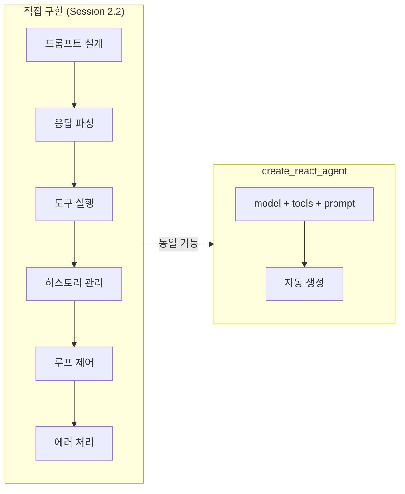
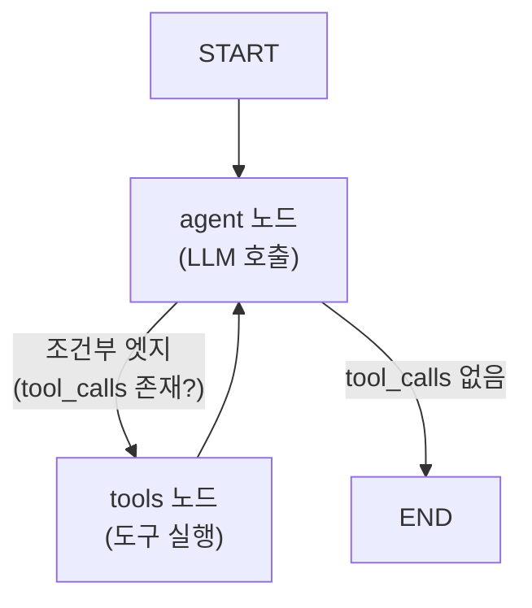
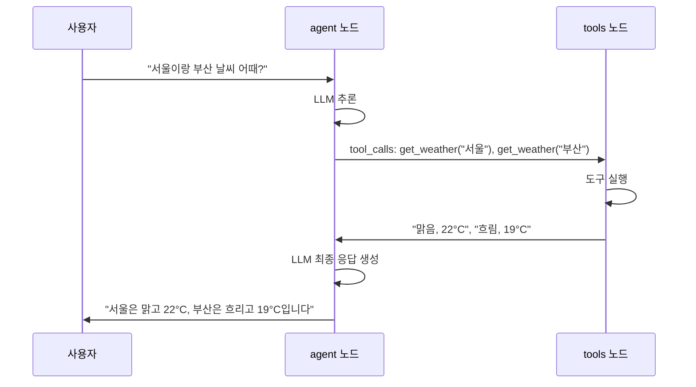
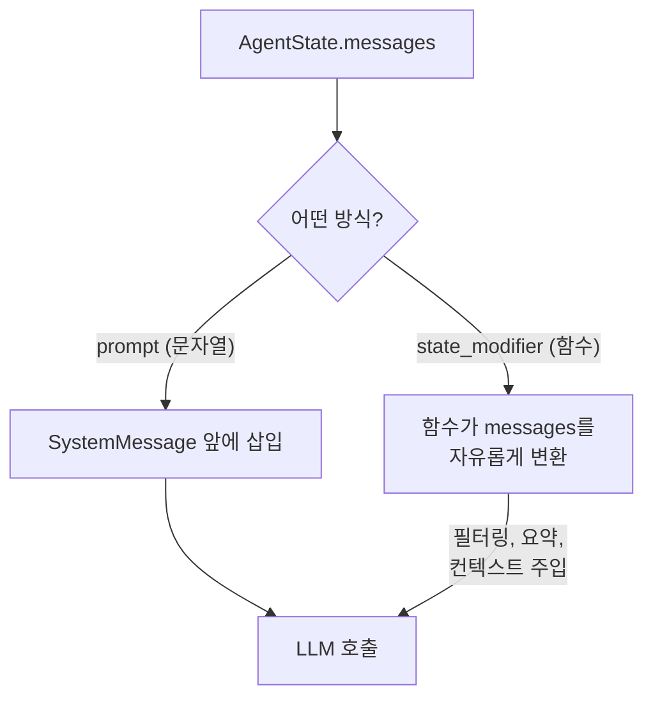
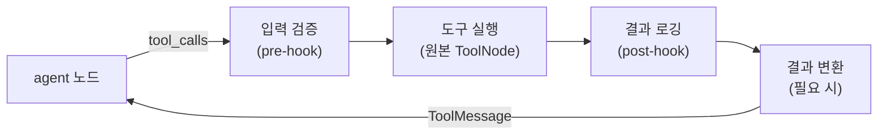
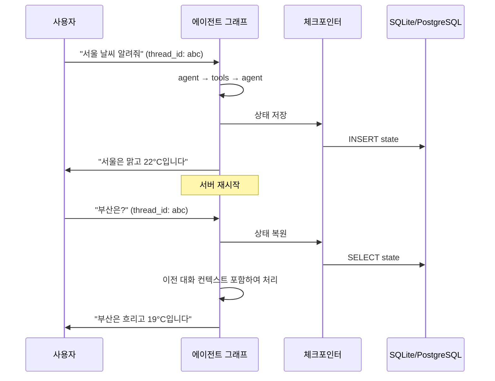
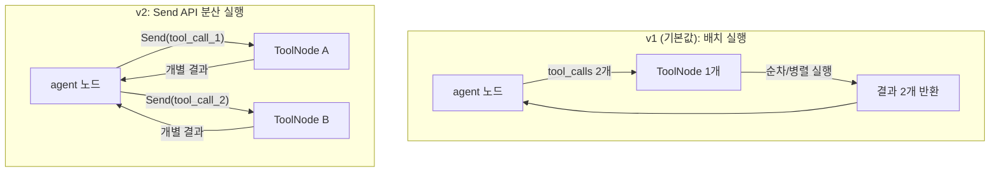

# LangGraph의 create_react_agent

> LangGraph의 내장 팩토리 함수로 프로덕션급 ReAct 에이전트를 한 줄에 생성하고, 커스터마이징하는 방법을 배웁니다.

## 개요

이 섹션에서는 앞서 직접 구현했던 ReAct 루프를 LangGraph의 `create_react_agent` 팩토리 함수로 대체하는 방법을 학습합니다. 단순한 "한 줄 생성"에서 그치지 않고, `state_modifier`로 상태를 동적 변환하고, 커스텀 `ToolNode`로 도구 실행을 제어하며, 체크포인트와 스트리밍까지 연결하는 **프로덕션급 커스터마이징**을 다룹니다.

**선수 지식**: [02. ReAct 루프 직접 구현](02-ch2-react-패턴과-에이전트-루프/02-02-react-루프-직접-구현.md)에서 만든 에이전트 루프 구조, [03. 에이전트 종료 조건과 안전장치](02-ch2-react-패턴과-에이전트-루프/03-03-에이전트-종료-조건과-안전장치.md)에서 설계한 `recursion_limit`과 종료 조건 개념

**학습 목표**:
- `create_react_agent`의 내부 그래프 구조(agent 노드, tools 노드, 라우팅)를 설명할 수 있다
- `state_modifier`와 `prompt`를 활용해 에이전트 동작을 동적으로 제어할 수 있다
- 커스텀 `ToolNode`를 만들어 도구 실행 전후에 로깅, 검증, 변환 로직을 삽입할 수 있다
- v1과 v2의 도구 실행 방식 차이를 이해하고 적절히 선택할 수 있다
- 체크포인트를 연결하여 대화 상태를 영속화할 수 있다

## 왜 알아야 할까?

[02. ReAct 루프 직접 구현](02-ch2-react-패턴과-에이전트-루프/02-02-react-루프-직접-구현.md)에서 우리는 프롬프트 설계, 응답 파싱, 도구 실행, 히스토리 관리까지 모두 직접 코딩했습니다. 교육적으로는 훌륭하지만, 프로덕션에서 이 코드를 쓰면 어떨까요?

스트리밍 응답이 필요해지면 루프를 뜯어고쳐야 하고, 대화 중단 후 재개하려면 체크포인트 시스템을 밑바닥부터 만들어야 합니다. 멀티턴 대화의 메시지 히스토리가 꼬이면 디버깅 지옥이 펼쳐지죠.

> 📊 **그림 1**: 직접 구현 vs 프레임워크 — 개발 범위 비교



하지만 `create_react_agent`의 진짜 가치는 "간편함"이 아닙니다. **커스터마이징의 깊이**에 있습니다. 기본 생성 후 `state_modifier`로 메시지를 동적으로 변환하고, 커스텀 `ToolNode`로 도구 실행을 감싸며, 체크포인트로 상태를 영속화하는 — 이런 프로덕션 패턴들을 프레임워크가 자연스럽게 지원한다는 것이 핵심이죠.

직접 구현을 이해한 지금이야말로, 프레임워크가 "무엇을 대신해주고, 어디서 우리가 개입해야 하는지"를 정확히 파악할 수 있는 최적의 시점입니다.

## 핵심 개념

### 개념 1: create_react_agent의 내부 아키텍처

> 💡 **비유**: 자동차를 직접 조립해본 사람이 공장 생산라인을 보는 것과 같습니다. 엔진(LLM), 변속기(도구 실행), 계기판(상태 관리)을 하나하나 만들어본 경험이 있으니, 이제 공장에서 이것들을 어떻게 자동으로 조립하는지 한눈에 이해할 수 있죠.

`create_react_agent`는 내부적으로 LangGraph의 `StateGraph`를 구성합니다. 우리가 [02. ReAct 루프 직접 구현](02-ch2-react-패턴과-에이전트-루프/02-02-react-루프-직접-구현.md)에서 `while` 루프로 만든 것을 그래프 구조로 표현한 것인데요, 핵심 구성 요소는 딱 두 개의 노드와 하나의 조건부 엣지입니다.

> 📊 **그림 2**: create_react_agent 내부 그래프 구조



각 구성 요소를 우리가 직접 구현한 코드와 대응시켜 보면, 프레임워크가 정확히 무엇을 자동화해주는지 명확해집니다:

| create_react_agent 내부 | 직접 구현 (Session 2.2) | 역할 | 핵심 차이 |
|---|---|---|---|
| `agent` 노드 | `llm.invoke(messages)` | LLM에 메시지 전달, 응답 받기 | 네이티브 tool calling API 사용 (파싱 불필요) |
| `tools` 노드 (`ToolNode`) | `tool_registry[name](**args)` | 도구 함수 실행, 결과를 `ToolMessage`로 반환 | 에러 핸들링, 결과 직렬화 자동 처리 |
| 조건부 엣지 | `if response.type == "final_answer"` | 도구 호출 존재 여부로 루프 종료 판단 | `tool_calls` 속성만 확인 — 파싱 불필요 |
| `AgentState.messages` | `history: list[dict]` | 전체 대화 히스토리 누적 | LangChain 메시지 타입으로 자동 정규화 |
| `remaining_steps` | `max_iterations` 카운터 | 무한 루프 방지, 기본값 25 | 2 미만 시 자동 소프트 랜딩 메시지 생성 |

라우팅(루프를 계속할지 종료할지 판단하는 로직)은 여기서는 개념만 이해하면 충분합니다. `create_react_agent`는 LLM 응답에 `tool_calls`가 있으면 도구 노드로, 없으면 종료로 보내는 단순한 조건 분기를 사용합니다. 이 라우팅을 LangGraph의 프리빌트 `tools_condition` 함수로 직접 다루는 방법은 [Ch4/s5](04-ch4-langgraph-상태-그래프-프레임워크/05-04-05-프리빌트-컴포넌트-활용.md)에서, 완전히 커스텀 라우팅 함수로 확장하는 것은 [Ch5](05-ch5-멀티스텝-에이전트-설계/01-05-01-복잡한-작업-분해-전략.md)에서 다룹니다.

### 개념 2: 기본 사용법 — 세 줄로 에이전트 만들기

> 💡 **비유**: 라면을 끓이는 두 가지 방법이 있죠. 면을 밀가루부터 반죽하고 스프를 직접 배합하는 방법(Session 2.2)과, 봉지를 뜯어 물에 넣는 방법. `create_react_agent`는 후자입니다 — 하지만 우리는 이미 면 반죽을 해봤으니, 봉지 안에 뭐가 들었는지 정확히 알고 있죠.

가장 기본적인 사용법을 먼저 봅시다:

```python
from langgraph.prebuilt import create_react_agent
from langchain_openai import ChatOpenAI
from langchain_core.tools import tool

# 1. 도구 정의
@tool
def get_weather(city: str) -> str:
    """도시의 현재 날씨를 조회합니다."""
    weather_data = {
        "서울": "맑음, 22°C",
        "부산": "흐림, 19°C",
        "제주": "비, 17°C",
    }
    return weather_data.get(city, f"{city}의 날씨 정보를 찾을 수 없습니다.")

# 2. 에이전트 생성 (핵심은 이 한 줄!)
agent = create_react_agent(
    model=ChatOpenAI(model="gpt-4o"),
    tools=[get_weather],
)

# 3. 실행
result = agent.invoke(
    {"messages": [("user", "서울이랑 부산 날씨 어때?")]}
)
```

이 코드에서 `create_react_agent`가 자동으로 해주는 일들:

1. **도구 바인딩**: `model.bind_tools([get_weather])`를 내부에서 호출
2. **그래프 구성**: `agent` 노드 + `tools` 노드 + 조건부 엣지 자동 생성
3. **상태 스키마**: `AgentState` (messages + remaining_steps) 자동 설정
4. **루프 제어**: `remaining_steps`로 무한 루프 방지 (기본값 25)

> 📊 **그림 3**: create_react_agent 실행 흐름 (날씨 조회 예시)



기본 사용법은 이처럼 간단하지만, 프로덕션에서는 거의 항상 커스터마이징이 필요합니다. 이어지는 개념에서 그 방법들을 차례로 살펴보겠습니다.

### 개념 3: state_modifier — 에이전트의 두뇌를 동적으로 제어

> 💡 **비유**: 같은 요리사(LLM)라도 "한식당 셰프"로 일할 때와 "이탈리안 레스토랑 셰프"로 일할 때 행동이 완전히 달라지죠. `state_modifier`는 요리사에게 "오늘의 메뉴판"을 매 주문마다 다르게 보여주는 역할입니다 — 단순 프롬프트보다 훨씬 강력하죠.

`create_react_agent`에는 `prompt`와 `state_modifier`라는 두 가지 커스터마이징 진입점이 있습니다. `prompt`는 단순 시스템 메시지를 추가하는 것이고, `state_modifier`는 LLM에 전달되는 전체 메시지 목록을 동적으로 변환할 수 있는 함수입니다.

> 📊 **그림 4**: prompt vs state_modifier — 메시지 흐름 비교



**`prompt` 파라미터 — 정적 시스템 메시지**

```python
# 가장 간단한 형태: 문자열
agent = create_react_agent(
    model=ChatOpenAI(model="gpt-4o"),
    tools=[get_weather],
    prompt="당신은 친절한 날씨 안내 봇입니다. 항상 한국어로 답변하세요."
)
```

문자열을 전달하면 `SystemMessage`로 변환되어 메시지 목록 맨 앞에 삽입됩니다. `SystemMessage` 객체를 직접 전달하면 프로바이더별 옵션(예: Anthropic의 프롬프트 캐싱)도 활용할 수 있죠.

**`state_modifier` — 동적 메시지 변환**

진짜 위력은 `state_modifier`에 있습니다. 이 함수는 `AgentState`를 받아 LLM에 전달할 메시지 리스트를 반환합니다. 토큰 제한 관리, 대화 요약, 컨텍스트 주입 등 프로덕션에서 필수적인 전처리를 여기서 처리합니다:

```python
from langchain_core.messages import SystemMessage, trim_messages

def production_state_modifier(state: dict) -> list:
    """프로덕션용 상태 변환기 — 토큰 관리 + 동적 컨텍스트"""
    messages = state["messages"]
    
    # 1. 토큰 제한: 최근 메시지만 유지 (Session 2.3의 TokenTracker 역할)
    trimmed = trim_messages(
        messages,
        max_tokens=4000,
        token_counter=len,  # 실제로는 tiktoken 사용
        strategy="last",    # 최근 메시지 우선 유지
        start_on="human",   # Human 메시지부터 시작
    )
    
    # 2. 동적 시스템 프롬프트: 상태에 따라 지시 변경
    tool_call_count = sum(
        1 for m in messages if hasattr(m, "tool_calls") and m.tool_calls
    )
    if tool_call_count > 5:
        instruction = "도구 호출이 많아지고 있습니다. 최종 답변을 정리하세요."
    else:
        instruction = "필요한 도구를 적극적으로 활용하세요."
    
    system = SystemMessage(content=f"당신은 AI 어시스턴트입니다. {instruction}")
    return [system] + trimmed

agent = create_react_agent(
    model=ChatOpenAI(model="gpt-4o"),
    tools=[get_weather, search_web],
    state_modifier=production_state_modifier,
)
```

`state_modifier`가 `prompt`와 결정적으로 다른 점은, **매 LLM 호출마다 실행**된다는 것입니다. 즉, 도구를 호출하고 돌아올 때마다 새로운 메시지 목록이 구성됩니다. 이 특성 덕분에:

- 대화가 길어질수록 오래된 메시지를 잘라내거나 요약할 수 있고
- 도구 호출 횟수에 따라 LLM 지시를 바꿀 수 있으며
- 외부 데이터(현재 시간, 사용자 프로필 등)를 실시간으로 주입할 수 있습니다

### 개념 4: 커스텀 ToolNode — 도구 실행을 감싸기

> 💡 **비유**: 공장의 생산라인에서 기본 조립 로봇이 일하고 있다면, 커스텀 ToolNode는 그 로봇 앞뒤에 **품질 검사관**을 배치하는 것입니다. 조립 전에 부품을 검수하고, 조립 후에 결과물을 검사하죠.

기본 `ToolNode`는 도구를 실행하고 결과를 반환하는 단순한 역할을 합니다. 하지만 프로덕션에서는 도구 실행 전후에 로깅, 입력 검증, 결과 변환, 비용 추적 같은 로직이 필요할 때가 많습니다.

```python
from langgraph.prebuilt import ToolNode
from langchain_core.messages import ToolMessage
import logging
import time

logger = logging.getLogger(__name__)

class InstrumentedToolNode(ToolNode):
    """로깅과 실행 시간 추적이 포함된 커스텀 ToolNode"""
    
    def invoke(self, input_state: dict, config=None):
        messages = input_state["messages"]
        last_message = messages[-1]
        
        # 실행 전: 도구 호출 로깅
        for tc in last_message.tool_calls:
            logger.info(
                f"Tool call: {tc['name']} | args: {tc['args']} | "
                f"call_id: {tc['id']}"
            )
        
        # 실행 시간 측정
        start = time.time()
        result = super().invoke(input_state, config)
        elapsed = time.time() - start
        
        # 실행 후: 성능 로깅
        logger.info(f"Tool execution completed in {elapsed:.2f}s")
        
        return result

# 커스텀 ToolNode를 에이전트에 연결
custom_tools_node = InstrumentedToolNode([get_weather, search_web, calculator])

agent = create_react_agent(
    model=ChatOpenAI(model="gpt-4o"),
    tools=[get_weather, search_web, calculator],
    tools_node=custom_tools_node,  # 커스텀 노드 주입
)
```

> 📊 **그림 5**: 커스텀 ToolNode의 실행 흐름



더 고급 패턴으로, 특정 도구 호출을 **가로채서** 다른 동작으로 대체할 수도 있습니다:

```python
class GuardedToolNode(ToolNode):
    """위험한 도구 호출을 차단하는 가드 ToolNode"""
    
    DANGEROUS_TOOLS = {"delete_record", "send_email", "execute_sql"}
    
    def invoke(self, input_state: dict, config=None):
        messages = input_state["messages"]
        last_message = messages[-1]
        
        # 위험한 도구 호출을 감지하고 차단
        for tc in last_message.tool_calls:
            if tc["name"] in self.DANGEROUS_TOOLS:
                logger.warning(f"Blocked dangerous tool: {tc['name']}")
                # 도구를 실행하지 않고 경고 메시지로 대체
                return {
                    "messages": [
                        ToolMessage(
                            content=f"[BLOCKED] {tc['name']}은 승인 없이 "
                                    f"실행할 수 없습니다.",
                            tool_call_id=tc["id"],
                        )
                    ]
                }
        
        return super().invoke(input_state, config)
```

이 패턴은 [Ch7. 안전한 에이전트 설계](07-ch7-안전한-에이전트-설계/01-07-01-에이전트-보안-위협-모델.md)에서 다루는 Human-in-the-Loop 승인 시스템의 기반이 됩니다.

### 개념 5: 도구 정의와 바인딩

LangGraph에서 도구는 `@tool` 데코레이터로 정의합니다. [05. 도구 실행 엔진 구축](01-ch1-llm-도구-호출의-이해/05-05-도구-실행-엔진-구축.md)에서 만든 도구 레지스트리를 떠올려보세요 — `create_react_agent`는 이 과정을 완전히 자동화합니다.

```python
from langchain_core.tools import tool
from pydantic import BaseModel, Field

# 방법 1: @tool 데코레이터 (간단한 도구)
@tool
def search_web(query: str) -> str:
    """웹에서 최신 정보를 검색합니다."""
    return f"'{query}'에 대한 검색 결과: ..."

# 방법 2: 스키마가 있는 도구 (복잡한 입력)
class CalculatorInput(BaseModel):
    """계산기 입력 스키마"""
    expression: str = Field(description="계산할 수학 표현식")

@tool(args_schema=CalculatorInput)
def calculator(expression: str) -> str:
    """수학 표현식을 계산합니다."""
    try:
        result = eval(expression)  # 실습용 — 프로덕션에서는 안전한 파서 사용
        return f"결과: {result}"
    except Exception as e:
        return f"계산 오류: {e}"

# 도구 리스트로 전달하면 자동 바인딩
agent = create_react_agent(
    model=ChatOpenAI(model="gpt-4o"),
    tools=[search_web, calculator, get_weather],
    prompt="당신은 다재다능한 AI 어시스턴트입니다.",
)
```

`@tool` 데코레이터는 함수의 **docstring**과 **타입 힌트**를 자동으로 읽어 LLM에 전달할 도구 스키마를 생성합니다. LLM은 이 설명을 보고 언제 어떤 도구를 쓸지 판단하니까, docstring을 명확하게 작성하는 것이 정말 중요합니다.

`@tool` 데코레이터의 주요 옵션:

```python
@tool(
    name="web_search",           # 도구 이름 커스텀 (기본: 함수명)
    description="최신 뉴스 검색",  # docstring 대신 사용
    return_direct=True,          # 도구 결과를 LLM 거치지 않고 바로 반환
    args_schema=MySchema,        # Pydantic 스키마로 입력 검증
)
def my_tool(query: str) -> str:
    ...
```

`return_direct=True`는 도구 결과를 LLM이 다시 가공하지 않고 사용자에게 그대로 전달할 때 사용합니다. API 응답이 이미 완성된 형태일 때 유용하죠.

### 개념 6: 체크포인트와 대화 영속화

`create_react_agent`의 진짜 프로덕션 가치 중 하나는 **체크포인터**와의 자연스러운 통합입니다. 체크포인터를 연결하면 대화 상태가 자동으로 저장되어, 서버 재시작이나 네트워크 중단 후에도 대화를 이어갈 수 있습니다.

> 📊 **그림 6**: 체크포인트를 통한 대화 영속화



```python
from langgraph.checkpoint.memory import MemorySaver
from langgraph.checkpoint.sqlite import SqliteSaver

# 방법 1: 인메모리 체크포인터 (개발/테스트용)
memory = MemorySaver()

agent = create_react_agent(
    model=ChatOpenAI(model="gpt-4o"),
    tools=[get_weather],
    checkpointer=memory,
)

# thread_id로 대화 세션 구분
config = {"configurable": {"thread_id": "user-123"}}

# 첫 번째 질문
result1 = agent.invoke(
    {"messages": [("user", "서울 날씨 어때?")]},
    config=config,
)

# 두 번째 질문 — 이전 대화 컨텍스트가 자동으로 이어짐
result2 = agent.invoke(
    {"messages": [("user", "거기 내일은?")]},
    config=config,  # 같은 thread_id
)

# 방법 2: SQLite 체크포인터 (프로덕션용)
with SqliteSaver.from_conn_string("conversations.db") as saver:
    agent = create_react_agent(
        model=ChatOpenAI(model="gpt-4o"),
        tools=[get_weather],
        checkpointer=saver,
    )
    # 서버 재시작 후에도 대화 이어짐
```

체크포인터 없이 `create_react_agent`를 사용하면 매 호출이 독립적인 단발 대화가 됩니다. 멀티턴 대화가 필요하면 반드시 체크포인터를 연결해야 합니다.

### 개념 7: v1과 v2 — 도구 실행 방식의 진화

`create_react_agent`에는 `version` 파라미터가 있어 도구 실행 방식을 선택할 수 있습니다.

> 📊 **그림 7**: v1 vs v2 도구 실행 방식 비교



**v1 (기본값)**: 하나의 `ToolNode`가 모든 도구 호출을 한 번에 받아 처리합니다. 간단하고 빠르지만, 개별 도구 호출에 대한 세밀한 제어(예: 특정 도구만 Human-in-the-Loop 승인)가 어렵습니다.

**v2**: LangGraph의 `Send` API를 활용하여 각 도구 호출을 별도의 `ToolNode` 인스턴스로 분산 실행합니다. 각 도구 호출이 독립적인 실행 단위가 되므로, `interrupt`로 개별 승인을 받거나 특정 도구 호출만 재시도하는 것이 가능합니다.

```python
# v2: 분산 실행 — HITL이 필요한 경우
agent_v2 = create_react_agent(
    model=ChatOpenAI(model="gpt-4o"),
    tools=[get_weather, search_web],
    version=2,  # Send API 기반 분산 실행
)
```

| 기준 | v1 추천 | v2 추천 |
|------|---------|---------|
| 복잡도 | 단순한 도구 조합 | 승인이 필요한 위험한 도구 포함 |
| 성능 | 오버헤드 적음 | 개별 도구 재시도/취소 필요 |
| Human-in-the-Loop | 전체 도구 일괄 승인/거부 | 도구별 개별 승인/거부 |
| 디버깅 | 한 노드에서 모든 결과 확인 | 도구별 실행 추적 가능 |

대부분의 경우 v1으로 충분합니다. v2는 결제 처리, 데이터 삭제 같은 **부작용이 큰 도구**를 에이전트가 사용할 때 개별 승인이 필요한 시나리오에서 빛을 발합니다.

## 실습: 직접 해보기

이제 **커스터마이징된** ReAct 에이전트를 만들어 봅시다. 단순 생성이 아닌, `state_modifier`로 동적 프롬프트를 적용하고 체크포인터로 대화를 영속화하는 프로덕션 패턴을 실습합니다.

```python
"""
create_react_agent 실습 — 커스터마이징된 프로덕션 에이전트
필수 패키지: pip install langgraph langchain-openai
"""

from langgraph.prebuilt import create_react_agent
from langgraph.checkpoint.memory import MemorySaver
from langchain_openai import ChatOpenAI
from langchain_core.tools import tool
from langchain_core.messages import SystemMessage, HumanMessage, trim_messages
import json
from datetime import datetime

# ──────────────────────────────────────────
# 1단계: 도구 정의
# ──────────────────────────────────────────

@tool
def get_current_time() -> str:
    """현재 날짜와 시간을 반환합니다."""
    now = datetime.now()
    return now.strftime("%Y년 %m월 %d일 %H시 %M분")

@tool
def calculate(expression: str) -> str:
    """수학 표현식을 계산합니다. 예: '2 + 3 * 4', '100 / 7'"""
    try:
        allowed_chars = set("0123456789+-*/.() ")
        if not all(c in allowed_chars for c in expression):
            return "오류: 허용되지 않는 문자가 포함되어 있습니다."
        result = eval(expression)
        return f"{expression} = {result}"
    except Exception as e:
        return f"계산 오류: {str(e)}"

@tool
def search_knowledge(topic: str) -> str:
    """주어진 주제에 대한 기본 지식을 검색합니다."""
    knowledge_base = {
        "python": "Python은 1991년 귀도 반 로섬이 만든 프로그래밍 언어입니다.",
        "langgraph": "LangGraph는 LangChain 팀이 만든 상태 기계 기반 에이전트 프레임워크입니다.",
        "react": "ReAct는 Reasoning + Acting의 약자로, 추론과 행동을 결합한 에이전트 패턴입니다.",
    }
    for key, value in knowledge_base.items():
        if key in topic.lower():
            return value
    return f"'{topic}'에 대한 정보를 찾을 수 없습니다."

# ──────────────────────────────────────────
# 2단계: state_modifier로 동적 제어
# ──────────────────────────────────────────

def adaptive_state_modifier(state: dict) -> list:
    """도구 호출 횟수와 대화 길이에 따라 동적으로 프롬프트를 조정"""
    messages = state["messages"]
    
    # 토큰 관리: 최근 메시지만 유지
    trimmed = trim_messages(
        messages,
        max_tokens=3000,
        token_counter=len,
        strategy="last",
        start_on="human",
    )
    
    # 도구 호출 횟수에 따른 동적 지시
    tool_calls = sum(
        len(m.tool_calls) for m in messages
        if hasattr(m, "tool_calls") and m.tool_calls
    )
    
    if tool_calls > 6:
        mode = "도구 호출이 많아졌습니다. 가진 정보로 최종 답변을 정리하세요."
    elif tool_calls > 3:
        mode = "핵심 정보를 충분히 수집했다면 답변을 시작하세요."
    else:
        mode = "필요한 도구를 적극적으로 활용하세요."
    
    system = SystemMessage(content=(
        "당신은 다재다능한 AI 어시스턴트입니다.\n\n"
        "규칙:\n"
        "1. 사용자의 질문에 적절한 도구를 선택하여 정확한 정보를 제공합니다.\n"
        "2. 도구 실행 결과를 자연스러운 한국어로 정리하여 답변합니다.\n"
        "3. 여러 도구가 필요하면 순차적으로 호출합니다.\n"
        "4. 도구 없이 답변할 수 있는 질문은 직접 답변합니다.\n\n"
        f"현재 모드: {mode}"
    ))
    
    return [system] + trimmed

# ──────────────────────────────────────────
# 3단계: 체크포인터 연결 + 에이전트 생성
# ──────────────────────────────────────────

memory = MemorySaver()

agent = create_react_agent(
    model=ChatOpenAI(model="gpt-4o", temperature=0),
    tools=[get_current_time, calculate, search_knowledge],
    state_modifier=adaptive_state_modifier,
    checkpointer=memory,  # 대화 상태 영속화
)

# ──────────────────────────────────────────
# 4단계: 멀티턴 대화 실행
# ──────────────────────────────────────────

def run_agent(query: str, thread_id: str = "demo") -> None:
    """에이전트를 실행하고 전체 과정을 출력합니다."""
    print(f"\n{'='*60}")
    print(f"질문: {query}")
    print(f"{'='*60}")
    
    config = {
        "configurable": {"thread_id": thread_id},
        "recursion_limit": 15,
    }
    
    result = agent.invoke(
        {"messages": [HumanMessage(content=query)]},
        config=config,
    )
    
    # 마지막 실행에서 생성된 메시지만 추적
    for msg in result["messages"]:
        if msg.type == "human":
            print(f"\n👤 사용자: {msg.content}")
        elif msg.type == "ai":
            if msg.tool_calls:
                for tc in msg.tool_calls:
                    print(f"\n🤖 도구 호출: {tc['name']}({tc['args']})")
            if msg.content:
                print(f"\n🤖 AI: {msg.content}")
        elif msg.type == "tool":
            print(f"\n🔧 도구 결과: {msg.content}")

# 테스트: 같은 thread에서 멀티턴 대화
run_agent("지금 몇 시야? 그리고 (17 * 23) + 45를 계산해줘.", "session-1")
run_agent("방금 계산 결과에 100을 더하면?", "session-1")  # 이전 대화 기억!
```

```output
============================================================
질문: 지금 몇 시야? 그리고 (17 * 23) + 45를 계산해줘.
============================================================

👤 사용자: 지금 몇 시야? 그리고 (17 * 23) + 45를 계산해줘.

🤖 도구 호출: get_current_time({})

🔧 도구 결과: 2026년 03월 19일 14시 30분

🤖 도구 호출: calculate({'expression': '(17 * 23) + 45'})

🔧 도구 결과: (17 * 23) + 45 = 436

🤖 AI: 현재 시각은 2026년 3월 19일 오후 2시 30분이고, (17 × 23) + 45의 계산 결과는 436입니다.

============================================================
질문: 방금 계산 결과에 100을 더하면?
============================================================

👤 사용자: 방금 계산 결과에 100을 더하면?

🤖 도구 호출: calculate({'expression': '436 + 100'})

🔧 도구 결과: 436 + 100 = 536

🤖 AI: 방금 계산 결과 436에 100을 더하면 536입니다.
```

두 번째 질문에서 "방금 계산 결과"가 436이라는 것을 에이전트가 기억하고 있다는 점에 주목하세요. 체크포인터가 이전 대화 컨텍스트를 자동으로 유지해주기 때문입니다.

**스트리밍으로 실행하기**: `invoke` 대신 `stream`을 사용하면 각 노드의 실행 결과를 실시간으로 받을 수 있습니다.

```run:python
# 스트리밍 실행 시뮬레이션 — 노드별 업데이트 확인
# 실제 코드: agent.stream(..., stream_mode="updates")

stream_events = [
    ("agent", "ai", "(도구 호출: search_knowledge)"),
    ("tools", "tool", "Python은 1991년 귀도 반 로섬이 만든 프로그래밍 언어입니다."),
    ("agent", "ai", "Python은 1991년 귀도 반 로섬이 만든 범용 프로그래밍 언어입니다."),
]

for node, msg_type, content in stream_events:
    print(f"--- {node} 노드 실행 ---")
    print(f"  {msg_type}: {content}")
    print()
```

```output
--- agent 노드 실행 ---
  ai: (도구 호출: search_knowledge)

--- tools 노드 실행 ---
  tool: Python은 1991년 귀도 반 로섬이 만든 프로그래밍 언어입니다.

--- agent 노드 실행 ---
  ai: Python은 1991년 귀도 반 로섬이 만든 범용 프로그래밍 언어입니다.
```

실제 스트리밍 코드:

```python
# 스트리밍 실행 — 각 노드 결과를 실시간 수신
for chunk in agent.stream(
    {"messages": [HumanMessage(content="Python이 뭐야?")]},
    config={"configurable": {"thread_id": "stream-demo"}, "recursion_limit": 15},
    stream_mode="updates",
):
    for node_name, update in chunk.items():
        print(f"\n--- {node_name} 노드 실행 ---")
        if "messages" in update:
            for msg in update["messages"]:
                print(f"  {msg.type}: {msg.content[:100] if msg.content else '(도구 호출)'}")
```

`stream_mode` 옵션:

| stream_mode | 단위 | 용도 |
|---|---|---|
| `"updates"` | 노드 실행 완료 단위 | 어떤 노드가 실행됐는지 추적 |
| `"values"` | 전체 상태 스냅샷 | 매 스텝의 전체 상태 확인 |
| `"messages"` | LLM 토큰 단위 | 실시간 타이핑 효과 (ChatGPT처럼) |

프로덕션에서는 `"messages"` 모드로 사용자에게 실시간 응답을 보여주면서, 백그라운드에서 `"updates"` 모드로 실행 과정을 로깅하는 조합이 일반적입니다.

## 더 깊이 알아보기

### create_react_agent의 탄생 이야기

LangGraph의 `create_react_agent`는 사실 두 가지 서로 다른 맥락에서 발전해 왔습니다.

원래 LangChain에는 `AgentExecutor`라는 에이전트 실행기가 있었습니다. 2023년 초에 등장한 이 클래스는 ReAct 에이전트를 실행하는 데 널리 쓰였지만, 몇 가지 구조적 한계가 있었습니다. 복잡한 분기 로직을 추가하기 어렵고, 중간 상태를 저장·복원하는 것이 사실상 불가능했죠.

2024년 초, LangChain 팀은 LangGraph를 별도 프로젝트로 분리하면서 **그래프 기반 에이전트**라는 새로운 패러다임을 제시했습니다. `StateGraph`로 노드와 엣지를 직접 구성하는 방식은 유연했지만, 간단한 ReAct 에이전트를 만들기에는 보일러플레이트가 너무 많았습니다. 그래서 등장한 것이 바로 `create_react_agent` — 가장 흔한 패턴을 한 줄로 만들 수 있는 **프리빌트 팩토리**입니다.

흥미로운 점은, Harrison Chase(LangChain 창립자)가 이 함수를 "99%의 에이전트 유스케이스를 커버하는 골든 패스"라고 표현했다는 것입니다. 실제로 대부분의 LangGraph 프로젝트는 `create_react_agent`로 시작해서, 필요에 따라 커스텀 `StateGraph`로 확장하는 패턴을 따릅니다.

### AgentExecutor에서 create_react_agent로

LangChain 공식 문서에서는 `AgentExecutor`를 "레거시"로 분류하고 `create_react_agent`로의 마이그레이션을 권장합니다:

| 특성 | AgentExecutor (레거시) | create_react_agent (현재) |
|------|----------------------|--------------------------|
| 도구 호출 방식 | 텍스트 파싱 (tool_choice) | 네이티브 tool calling API |
| 상태 관리 | 내부 메모리 (제한적) | StateGraph (체크포인트 지원) |
| 확장성 | 커스텀 콜백으로 제한적 확장 | 노드/엣지 추가로 자유로운 확장 |
| 스트리밍 | 토큰 단위만 지원 | 노드/상태/토큰 다중 모드 |
| Human-in-the-Loop | 지원 안 됨 | interrupt로 네이티브 지원 |

## 흔한 오해와 팁

> ⚠️ **흔한 오해**: "create_react_agent는 내부적으로 ReAct 프롬프트(Thought/Action/Observation 텍스트)를 사용한다" — 아닙니다! Session 2.2에서 우리가 만든 것은 **텍스트 기반 ReAct**였지만, `create_react_agent`는 LLM의 **네이티브 tool calling API**를 사용합니다. "Thought:"나 "Action:"이라는 텍스트가 실제로 오가지 않습니다. ReAct *패턴*(추론→행동→관찰 루프)을 따르되, 구현 메커니즘이 다른 것이죠.

> ⚠️ **흔한 오해**: "`state_modifier`와 `prompt`를 동시에 쓸 수 있다" — 아닙니다! 둘 다 지정하면 `ValueError`가 발생합니다. `prompt`는 단순 시스템 메시지 추가용이고, `state_modifier`는 그 상위 호환입니다. 동적 제어가 필요하면 처음부터 `state_modifier`를 사용하세요.

> 💡 **알고 계셨나요?**: `create_react_agent`가 반환하는 객체는 사실 `CompiledStateGraph`입니다. 즉, `agent.get_graph().draw_mermaid()`로 내부 그래프 구조를 Mermaid 다이어그램으로 바로 시각화할 수 있습니다. 디버깅할 때 정말 유용한 기능이에요!

> 🔥 **실무 팁**: `@tool` 데코레이터의 **docstring이 에이전트 성능을 좌우**합니다. LLM은 docstring을 보고 언제 어떤 도구를 쓸지 결정합니다. "검색합니다"보다 "주어진 키워드로 웹에서 최신 뉴스와 정보를 검색합니다. 실시간 정보나 최신 이벤트에 대한 질문에 사용하세요."처럼 구체적으로 작성하면 도구 선택 정확도가 크게 올라갑니다.

> 🔥 **실무 팁**: `recursion_limit`은 **노드 실행 횟수**의 제한이지, 도구 호출 횟수 제한이 아닙니다. agent 노드 → tools 노드 → agent 노드로 한 바퀴가 3회 소모됩니다. `recursion_limit=15`라면 약 7회의 도구 호출 루프가 가능하다는 뜻입니다. 넉넉하게 설정하되, 비용 제어를 위해 상한을 두는 것이 좋습니다.

## 핵심 정리

| 개념 | 설명 |
|------|------|
| `create_react_agent` | LangGraph의 프리빌트 팩토리 함수. 모델 + 도구 + 프롬프트로 ReAct 에이전트 그래프를 자동 생성 |
| 내부 그래프 구조 | `agent` 노드(LLM 호출) + `tools` 노드(도구 실행) + 조건부 엣지(tool_calls 존재 여부 판단) |
| `prompt` 파라미터 | 문자열 또는 SystemMessage로 정적 시스템 프롬프트 지정. `state_modifier`와 동시 사용 불가 |
| `state_modifier` | 매 LLM 호출마다 실행되는 함수. 메시지 트리밍, 동적 프롬프트, 컨텍스트 주입에 활용 |
| 커스텀 `ToolNode` | `ToolNode`를 상속하여 로깅, 입력 검증, 도구 차단 등 실행 전후 훅 추가 |
| `checkpointer` | `MemorySaver`(개발) 또는 `SqliteSaver`(프로덕션)로 대화 상태 영속화. `thread_id`로 세션 구분 |
| `@tool` 데코레이터 | 함수를 LangGraph 도구로 변환. docstring이 LLM의 도구 선택 판단 기준 |
| `remaining_steps` | 기본 25. 내부 스텝 카운터로 무한 루프 방지. 2 미만 시 자동 종료 |
| v1 vs v2 | v1은 ToolNode 하나로 배치 실행, v2는 Send API로 도구별 분산 실행. v2가 HITL에 유리 |
| 라우팅 계층 | 여기서는 개념 소개, [Ch4/s5](04-ch4-langgraph-상태-그래프-프레임워크/05-04-05-프리빌트-컴포넌트-활용.md)에서 `tools_condition` 프리빌트, [Ch5](05-ch5-멀티스텝-에이전트-설계/01-05-01-복잡한-작업-분해-전략.md)에서 커스텀 라우팅 |

## 다음 섹션 미리보기

이제 `create_react_agent`로 에이전트를 빠르게 만들고 커스터마이징하는 방법까지 익혔습니다. 다음 [05. ReAct 에이전트 실전 프로젝트](02-ch2-react-패턴과-에이전트-루프/05-05-react-에이전트-실전-프로젝트.md)에서는 이 도구를 활용하여 실제 문제를 해결하는 종합 프로젝트를 진행합니다. 여러 도구를 조합하고, 에이전트의 추론 과정을 분석하며, 프롬프트 엔지니어링으로 행동을 정밀하게 제어하는 실전 경험을 쌓게 됩니다.

## 참고 자료

- [LangGraph Agents 공식 문서](https://docs.langchain.com/oss/python/langchain/agents) — `create_react_agent`와 `create_agent`의 최신 API 레퍼런스
- [LangGraph 공식 GitHub](https://github.com/langchain-ai/langgraph) — 소스 코드와 예제, 최신 릴리스 노트 확인
- [ReAct Agent DeepWiki 분석](https://deepwiki.com/langchain-ai/langgraph/8.1-react-agent-(create_react_agent)) — create_react_agent의 내부 아키텍처와 코드 흐름 심층 분석
- [LangGraph: Build Stateful AI Agents in Python (Real Python)](https://realpython.com/langgraph-python/) — StateGraph와 에이전트 구축 실습 튜토리얼
- [ReAct 논문 (Yao et al., 2022)](https://arxiv.org/abs/2210.03629) — ReAct 패턴의 원본 논문, 이론적 기반 이해에 필수

---
### 🔗 Related Sessions
- [react](02-ch2-react-패턴과-에이전트-루프/01-01-react-패턴-이론.md) (prerequisite)
- [react_system_prompt](02-ch2-react-패턴과-에이전트-루프/02-02-react-루프-직접-구현.md) (prerequisite)
- [safetyconfig](02-ch2-react-패턴과-에이전트-루프/03-03-에이전트-종료-조건과-안전장치.md) (prerequisite)
- [loopdetector](02-ch2-react-패턴과-에이전트-루프/03-03-에이전트-종료-조건과-안전장치.md) (prerequisite)
