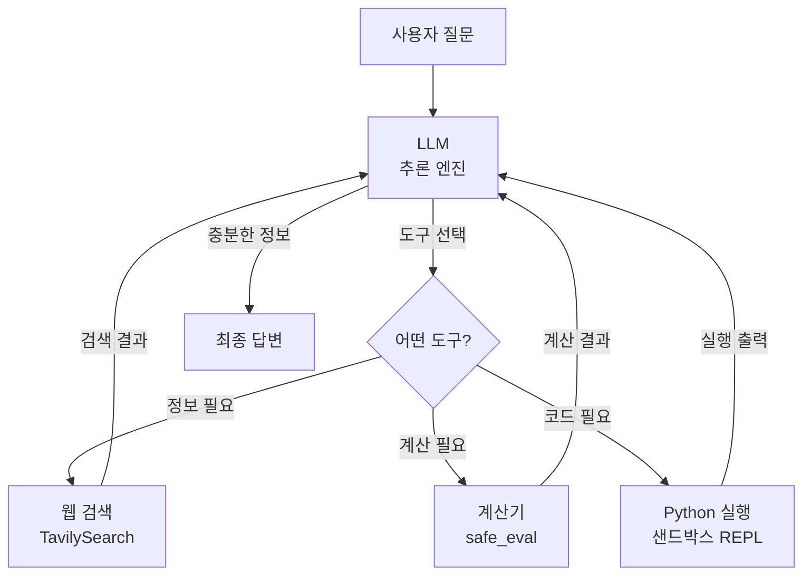
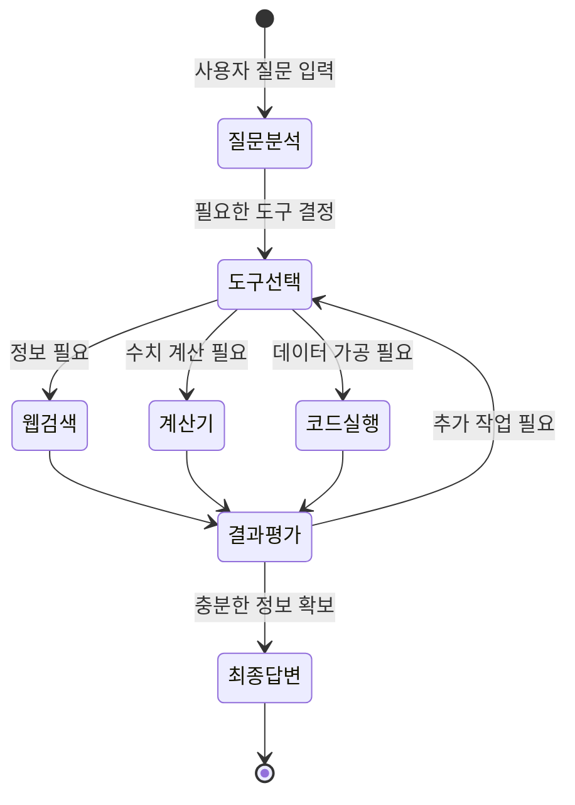
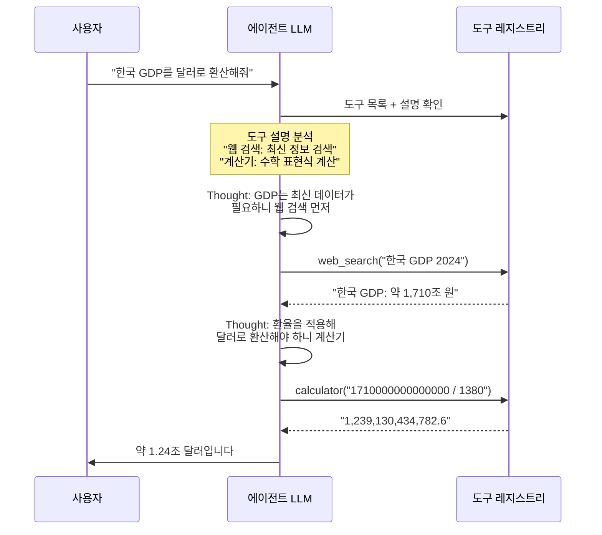
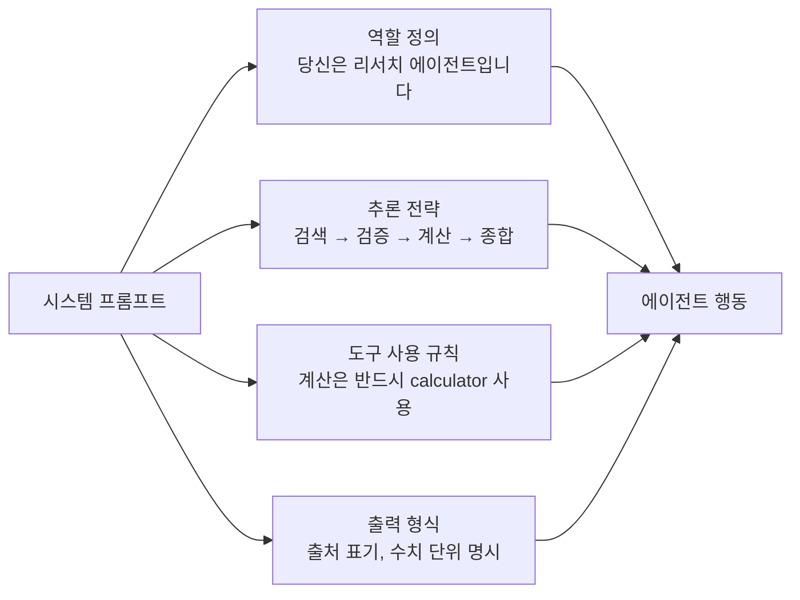
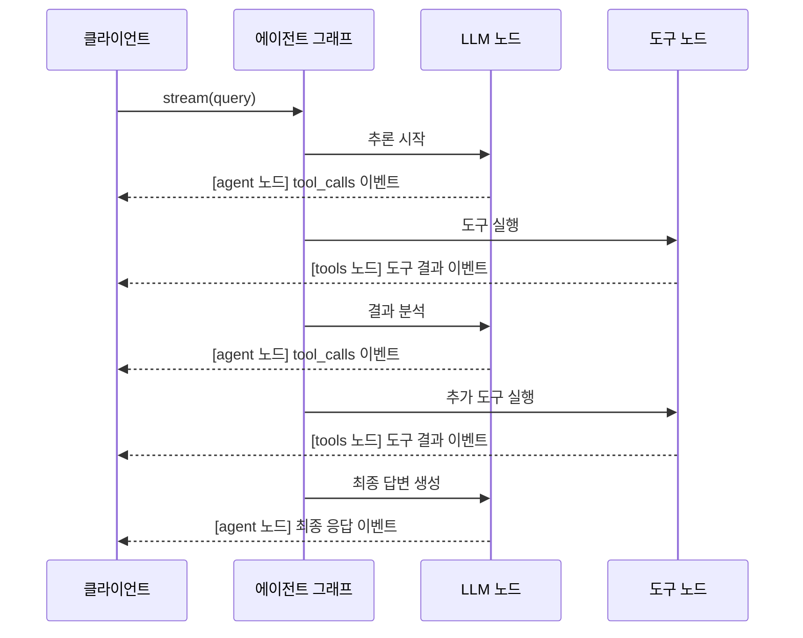

# ReAct 에이전트 실전 프로젝트

> 웹 검색, 계산기, 코드 실행 도구를 결합한 리서치 에이전트를 처음부터 끝까지 구축합니다

## 개요

이번 섹션은 Ch2의 마지막 세션으로, 지금까지 배운 모든 개념을 하나의 실전 프로젝트로 통합합니다. [ReAct 패턴 이론](02-ch2-react-패턴과-에이전트-루프/01-01-react-패턴-이론.md)에서 배운 Thought-Action-Observation 루프, [ReAct 루프 직접 구현](02-ch2-react-패턴과-에이전트-루프/02-02-react-루프-직접-구현.md)에서 만든 파싱 로직, [에이전트 종료 조건과 안전장치](02-ch2-react-패턴과-에이전트-루프/03-03-에이전트-종료-조건과-안전장치.md)의 방어 패턴, 그리고 [LangGraph의 create_react_agent](02-ch2-react-패턴과-에이전트-루프/04-04-langgraph의-create-react-agent.md)의 프레임워크 활용법을 모두 결합합니다.

**선수 지식**:
- Ch1의 [도구 호출 메커니즘](01-ch1-llm-도구-호출의-이해/02-02-llm-tool-calling-메커니즘.md)과 `@tool` 데코레이터
- Ch2 전체 — ReAct 패턴, 에이전트 루프, 안전장치, `create_react_agent`

**학습 목표**:
- 웹 검색, 계산기, Python 코드 실행 등 이질적인 도구를 하나의 에이전트에 통합할 수 있다
- 도구 설명(description)이 에이전트의 도구 선택에 미치는 영향을 이해하고 최적화할 수 있다
- 시스템 프롬프트로 에이전트의 추론 스타일과 행동 패턴을 제어할 수 있다
- 스트리밍으로 에이전트의 실시간 추론 과정을 관찰하고 디버깅할 수 있다

## 왜 알아야 할까?

실제 업무에서 에이전트가 가치를 발휘하는 순간은 **여러 능력을 조합해서 문제를 풀 때**입니다. "2024년 한국의 GDP가 얼마야?" 같은 단순 질문은 웹 검색 하나로 충분하죠. 하지만 "2024년 한국과 일본의 GDP를 비교하고, 환율을 적용해서 1인당 GDP 차이를 계산해줘"라는 질문은 어떨까요?

이 질문에 답하려면 에이전트가 스스로 판단해야 합니다:
1. **검색**: 한국과 일본의 GDP 데이터를 웹에서 찾고
2. **계산**: 환율을 적용하고 1인당 수치를 나누고
3. **분석**: 결과를 코드로 정리해서 비교표를 만들고

이처럼 "검색 → 계산 → 코드 실행"을 자율적으로 조합하는 능력이 바로 에이전트의 진짜 힘입니다. 이번 실전 프로젝트에서는 이 세 가지 도구를 가진 **리서치 에이전트**를 구축하면서, 프로덕션 수준의 에이전트 설계 감각을 익히겠습니다.

## 핵심 개념

### 개념 1: 다중 도구 에이전트 아키텍처

> 💡 **비유**: 리서치 에이전트는 **만능 연구 조교**와 같습니다. 인터넷에서 자료를 찾고(웹 검색), 숫자를 계산하고(계산기), 데이터를 분석할 코드를 짜는(코드 실행) 능력을 갖춘 조교가 여러분의 질문에 알아서 능력을 조합해 답을 찾아줍니다.

다중 도구 에이전트의 핵심 과제는 **도구 선택(Tool Selection)**입니다. LLM이 질문을 분석하고, 어떤 도구를 어떤 순서로 호출할지 스스로 결정해야 합니다. 이 결정은 두 가지에 의존합니다:

1. **도구 설명(description)**: LLM이 도구를 이해하는 유일한 단서
2. **시스템 프롬프트**: 에이전트의 추론 전략과 행동 규칙

> 📊 **그림 1**: 리서치 에이전트의 다중 도구 아키텍처



에이전트는 이 루프를 여러 번 반복할 수 있습니다. 웹 검색 결과를 바탕으로 계산하고, 계산 결과를 코드로 시각화하는 식이죠. `create_react_agent`가 이 루프를 자동으로 관리합니다.

> 📊 **그림 2**: 도구 선택부터 반복 루프까지의 전체 흐름



각 도구를 LangChain의 `@tool` 데코레이터로 정의하면, LLM은 도구의 이름, 설명, 파라미터 스키마를 보고 호출 여부를 판단합니다:

```python
from langchain_core.tools import tool

@tool
def web_search(query: str) -> str:
    """웹에서 최신 정보를 검색합니다.
    실시간 데이터, 뉴스, 통계 등 최신 정보가 필요할 때 사용하세요.
    """
    # Tavily API 호출
    ...

@tool
def calculator(expression: str) -> str:
    """수학 표현식을 계산합니다.
    사칙연산, 거듭제곱, 백분율 등 수치 계산이 필요할 때 사용하세요.
    """
    # AST 기반 안전한 수식 평가
    ...

@tool
def python_execute(code: str) -> str:
    """Python 코드를 실행하고 결과를 반환합니다.
    데이터 분석, 정렬, 포맷팅 등 복잡한 로직이 필요할 때 사용하세요.
    """
    # 제한된 __builtins__로 샌드박스 실행
    ...
```

> ⚠️ **흔한 오해**: "도구가 많을수록 에이전트가 더 똑똑해진다"고 생각하기 쉽지만, 실제로는 **도구가 많을수록 선택 오류가 증가**합니다. 도구 수가 10개를 넘으면 LLM의 도구 선택 정확도가 눈에 띄게 떨어집니다. 프로덕션에서는 관련 도구를 그룹화하거나, 상황에 따라 도구 목록을 동적으로 필터링하는 전략이 필요합니다.

### 개념 2: 도구 설명 최적화 — 에이전트의 "메뉴판"

> 💡 **비유**: 도구 설명은 레스토랑의 **메뉴판**입니다. "파스타"라고만 쓰인 메뉴와 "토마토 바질 크림 파스타 — 신선한 방울토마토와 생바질을 사용한 크림 소스"라고 쓰인 메뉴 중 어떤 것이 선택에 도움이 될까요? LLM도 마찬가지입니다. 도구 설명이 구체적일수록 올바른 도구를 선택할 확률이 높아집니다.

도구 설명은 에이전트 성능의 핵심 레버입니다. 같은 도구라도 설명을 어떻게 쓰느냐에 따라 에이전트 행동이 완전히 달라집니다.

> 📊 **그림 3**: 도구 설명이 에이전트 결정에 미치는 영향



**좋은 도구 설명의 3원칙**:

| 원칙 | 나쁜 예 | 좋은 예 |
|------|---------|---------|
| **기능 명시** | "검색합니다" | "웹에서 최신 정보를 검색합니다" |
| **사용 시점** | (없음) | "실시간 데이터가 필요할 때 사용" |
| **입력 가이드** | (없음) | "구체적인 검색 쿼리를 영어로 입력" |

```python
# ❌ 나쁜 도구 설명
@tool
def search(q: str) -> str:
    """검색"""  # LLM이 언제 써야 할지 판단 불가
    ...

# ✅ 좋은 도구 설명
@tool
def web_search(query: str) -> str:
    """웹에서 최신 정보를 검색합니다.
    
    실시간 데이터, 최신 뉴스, 통계, 사실 확인이 필요할 때 사용하세요.
    이미 알고 있는 정보의 계산이나 변환에는 사용하지 마세요.
    
    Args:
        query: 구체적인 검색 쿼리 (영어 권장)
    """
    ...
```

### 개념 3: 시스템 프롬프트로 에이전트 행동 제어

> 💡 **비유**: 시스템 프롬프트는 에이전트의 **업무 매뉴얼**입니다. 같은 직원이라도 "고객에게 친절하게 응대하세요"라는 매뉴얼과 "사실만 간결하게 전달하세요"라는 매뉴얼을 받으면 완전히 다르게 행동하죠.

`create_react_agent`의 `prompt` 파라미터를 통해 에이전트의 성격, 추론 전략, 도구 사용 규칙을 세밀하게 제어할 수 있습니다. 이전 세션에서 문자열이나 `SystemMessage`를 넘기는 방법을 배웠는데, 실전에서는 훨씬 구체적인 지시가 필요합니다.

> 📊 **그림 4**: 시스템 프롬프트가 에이전트 행동을 결정하는 구조



리서치 에이전트를 위한 시스템 프롬프트 설계 패턴을 살펴보겠습니다:

```python
RESEARCH_AGENT_PROMPT = """당신은 정확하고 신뢰할 수 있는 리서치 에이전트입니다.

## 역할
사용자의 질문에 대해 웹 검색, 계산, 코드 실행을 조합하여 
정확한 답변을 제공합니다.

## 추론 전략
1. 질문을 분석하여 필요한 정보와 계산을 파악하세요.
2. 사실(fact)은 반드시 web_search로 확인하세요.
3. 수치 계산은 반드시 calculator 도구를 사용하세요 (암산 금지).
4. 복잡한 데이터 처리는 python_execute를 활용하세요.
5. 모든 수치에는 출처와 단위를 명시하세요.

## 금지 사항
- 검증되지 않은 수치를 제시하지 마세요.
- 도구 없이 복잡한 계산을 시도하지 마세요.
- 한 번의 검색으로 충분하면 불필요한 추가 검색을 하지 마세요.
"""
```

프롬프트의 각 섹션이 에이전트 행동에 직접적인 영향을 미칩니다. "수치 계산은 반드시 calculator 도구를 사용하세요"라는 지시가 없으면, LLM은 종종 암산으로 잘못된 답을 내놓습니다. "한 번의 검색으로 충분하면" 같은 조건부 지시는 불필요한 도구 호출을 줄여 비용과 지연 시간을 절약합니다.

### 개념 4: 스트리밍으로 에이전트 추론 과정 관찰

> 💡 **비유**: 스트리밍은 요리사의 **오픈 키친**과 같습니다. 최종 요리만 받는 대신, 재료를 씻고, 자르고, 볶는 과정을 실시간으로 볼 수 있죠. 에이전트가 어떤 도구를 왜 선택했는지, 중간 결과가 무엇인지 실시간으로 확인할 수 있습니다.

LangGraph의 `stream` 메서드를 사용하면 에이전트의 매 단계(노드 실행)를 실시간으로 받아볼 수 있습니다. 이는 디버깅뿐 아니라, 사용자에게 진행 상황을 보여주는 UX 측면에서도 매우 중요합니다.

> 📊 **그림 5**: 스트리밍 이벤트의 흐름



```python
# 스트리밍으로 에이전트 관찰
for chunk in agent.stream(
    {"messages": [("user", "한국 GDP를 분석해줘")]},
    stream_mode="updates",  # 노드별 업데이트
):
    for node_name, update in chunk.items():
        print(f"\n--- {node_name} ---")
        if "messages" in update:
            for msg in update["messages"]:
                # 도구 호출 이벤트
                if hasattr(msg, "tool_calls") and msg.tool_calls:
                    for tc in msg.tool_calls:
                        print(f"🔧 도구 호출: {tc['name']}")
                        print(f"   인자: {tc['args']}")
                # 도구 결과 이벤트
                elif msg.type == "tool":
                    print(f"📋 결과: {msg.content[:200]}")
                # 최종 응답
                elif msg.type == "ai" and not getattr(msg, "tool_calls", []):
                    print(f"💬 답변: {msg.content[:200]}")
```

`stream_mode`에 따라 받을 수 있는 정보가 달라집니다:

| stream_mode | 내용 | 용도 |
|-------------|------|------|
| `"updates"` | 노드별 상태 변경분 | 디버깅, 진행 상황 표시 |
| `"values"` | 전체 상태 스냅샷 | 상태 추적, 로깅 |
| `"messages"` | 개별 메시지 단위 | 채팅 UI에 실시간 표시 |

## 실습: 직접 해보기

이제 세 가지 도구를 갖춘 리서치 에이전트를 처음부터 끝까지 구축합니다. 코드는 **API 키 없이도 핵심 구조를 확인할 수 있도록** 시뮬레이션 모드를 포함합니다.

### Step 1: 도구 정의

먼저 세 가지 핵심 도구를 정의합니다:

```python
import ast
import operator
from typing import Any

from langchain_core.tools import tool


# ── 도구 1: 웹 검색 ──────────────────────────────────
@tool
def web_search(query: str) -> str:
    """웹에서 최신 정보를 검색합니다.

    실시간 데이터, 최신 뉴스, 통계, 인물 정보 등
    최신 사실 확인이 필요할 때 사용하세요.
    이미 알고 있는 정보의 단순 계산에는 사용하지 마세요.

    Args:
        query: 검색할 내용을 구체적으로 기술
    """
    # 실전에서는 TavilySearchResults를 사용합니다
    # from langchain_community.tools.tavily_search import TavilySearchResults
    # tavily = TavilySearchResults(max_results=3)
    # return tavily.invoke(query)

    # 시뮬레이션: 데모용 더미 응답
    mock_data = {
        "한국 GDP": "한국 2024년 GDP: 약 1,710조 원 (IMF 추정). "
                    "1인당 GDP: 약 33,150달러. 인구: 약 5,160만 명.",
        "일본 GDP": "일본 2024년 GDP: 약 4.2조 달러 (IMF 추정). "
                    "1인당 GDP: 약 33,800달러. 인구: 약 1.24억 명.",
        "환율":     "2024년 평균 원달러 환율: 약 1,380원/달러.",
    }
    for key, value in mock_data.items():
        if key in query:
            return value
    return f"'{query}'에 대한 검색 결과: 관련 정보를 찾지 못했습니다."


# ── 도구 2: 계산기 (AST 기반 안전한 수식 평가) ────────
SAFE_OPERATORS = {
    ast.Add: operator.add,      # 덧셈
    ast.Sub: operator.sub,      # 뺄셈
    ast.Mult: operator.mul,     # 곱셈
    ast.Div: operator.truediv,  # 나눗셈
    ast.Pow: operator.pow,      # 거듭제곱
    ast.USub: operator.neg,     # 단항 마이너스
    ast.Mod: operator.mod,      # 나머지
}


def _safe_eval(node: ast.AST) -> float:
    """AST 노드를 재귀적으로 안전하게 평가합니다.
    
    eval()을 직접 호출하면 임의 코드 실행이 가능하므로,
    AST를 파싱하여 숫자와 허용된 연산자만 처리합니다.
    """
    # 숫자 리터럴
    if isinstance(node, ast.Constant) and isinstance(node.value, (int, float)):
        return float(node.value)
    # 이항 연산 (a + b, a * b 등)
    if isinstance(node, ast.BinOp):
        op_func = SAFE_OPERATORS.get(type(node.op))
        if op_func is None:
            raise ValueError(f"지원하지 않는 연산: {type(node.op).__name__}")
        return op_func(_safe_eval(node.left), _safe_eval(node.right))
    # 단항 마이너스 (-a)
    if isinstance(node, ast.UnaryOp) and isinstance(node.op, ast.USub):
        return -_safe_eval(node.operand)
    raise ValueError(f"허용되지 않는 표현식: {ast.dump(node)}")


@tool
def calculator(expression: str) -> str:
    """수학 표현식을 안전하게 계산합니다.

    사칙연산, 거듭제곱(**), 나머지(%) 등 수치 계산이 필요할 때 사용하세요.
    문자열이나 변수는 사용할 수 없습니다. 순수 숫자 표현식만 가능합니다.

    Args:
        expression: 계산할 수학 표현식 (예: "1710 / 1380 * 1000000000")
    """
    try:
        # 문자열을 AST로 파싱 → 안전한 노드만 평가
        tree = ast.parse(expression, mode="eval")
        result = _safe_eval(tree.body)
        # 소수점 정리: 정수면 정수로, 아니면 소수점 2자리
        if result == int(result):
            return str(int(result))
        return f"{result:,.2f}"
    except Exception as e:
        return f"계산 오류: {e}"


# ── 도구 3: Python 코드 실행 (샌드박스) ───────────────
@tool
def python_execute(code: str) -> str:
    """Python 코드를 실행하고 stdout 출력을 반환합니다.

    데이터 정렬, 포맷팅, 리스트 처리, 문자열 가공 등
    복잡한 로직이 필요할 때 사용하세요.
    단순 사칙연산에는 calculator를 사용하세요.

    Args:
        code: 실행할 Python 코드 (print 문으로 결과 출력)
    """
    # 실전에서는 langchain_experimental의 PythonREPLTool 또는
    # 격리된 Docker/E2B 샌드박스를 사용합니다
    import io
    import contextlib

    # 허용 목록 (보안을 위한 최소한의 필터)
    forbidden = ["import os", "import sys", "import subprocess",
                 "open(", "__import__", "exec(", "eval("]
    for f in forbidden:
        if f in code:
            return f"보안 오류: '{f}'는 허용되지 않습니다."

    # 제한된 빌트인만 제공하여 파일 접근, 네트워크 등을 차단
    stdout_capture = io.StringIO()
    try:
        with contextlib.redirect_stdout(stdout_capture):
            exec(code, {"__builtins__": {
                "print": print, "range": range, "len": len,
                "int": int, "float": float, "str": str,
                "list": list, "dict": dict, "sorted": sorted,
                "round": round, "abs": abs, "sum": sum,
                "min": min, "max": max, "enumerate": enumerate,
                "zip": zip, "map": map, "filter": filter,
                "format": format, "f": None,
            }})
        output = stdout_capture.getvalue()
        return output if output else "(코드 실행 완료, 출력 없음)"
    except Exception as e:
        return f"실행 오류: {type(e).__name__}: {e}"
```

### Step 2: 에이전트 조립

도구를 `create_react_agent`로 조립합니다:

```python
from langgraph.prebuilt import create_react_agent
from langchain_openai import ChatOpenAI

# LLM 초기화
llm = ChatOpenAI(model="gpt-4o-mini", temperature=0)

# 도구 목록
tools = [web_search, calculator, python_execute]

# 시스템 프롬프트
SYSTEM_PROMPT = """당신은 정확하고 신뢰할 수 있는 리서치 에이전트입니다.

## 추론 원칙
1. 질문을 소주제로 분해하세요.
2. 사실 확인이 필요하면 반드시 web_search를 사용하세요.
3. 수치 계산은 반드시 calculator를 사용하세요. 절대 암산하지 마세요.
4. 복잡한 데이터 처리(정렬, 비교표 등)는 python_execute를 사용하세요.
5. 모든 수치에 출처와 단위를 명시하세요.

## 도구 사용 규칙
- 단순 사칙연산 → calculator
- 데이터 검색 → web_search  
- 여러 데이터 가공/포맷팅 → python_execute
- 한 번의 도구 호출로 해결되면 불필요한 추가 호출을 하지 마세요.

## 출력 형식
- 핵심 답변을 먼저 제시하세요.
- 수치에는 단위와 출처를 명시하세요.
- 계산 과정이 있으면 간략히 설명하세요.
"""

# 에이전트 생성
agent = create_react_agent(
    model=llm,
    tools=tools,
    prompt=SYSTEM_PROMPT,
)
```

### Step 3: 실행과 스트리밍 관찰

에이전트를 실행하고 추론 과정을 단계별로 관찰합니다:

```run:python
# 시뮬레이션 모드로 에이전트 추론 과정을 재현합니다
# (실제 LLM 호출 없이 에이전트 동작 흐름을 보여주는 데모)

steps = [
    ("agent", "도구 호출", "web_search", {"query": "한국 GDP 2024"}),
    ("tools", "검색 결과", None, 
     "한국 2024년 GDP: 약 1,710조 원 (IMF 추정). 1인당 GDP: 약 33,150달러."),
    ("agent", "도구 호출", "web_search", {"query": "일본 GDP 2024"}),
    ("tools", "검색 결과", None,
     "일본 2024년 GDP: 약 4.2조 달러 (IMF 추정). 1인당 GDP: 약 33,800달러."),
    ("agent", "도구 호출", "calculator", {"expression": "33800 - 33150"}),
    ("tools", "계산 결과", None, "650"),
    ("agent", "도구 호출", "python_execute", 
     {"code": "print('| 항목 | 한국 | 일본 |')\\nprint('| 1인당 GDP | $33,150 | $33,800 |')"}),
    ("tools", "코드 결과", None, 
     "| 항목 | 한국 | 일본 |\n| 1인당 GDP | $33,150 | $33,800 |"),
    ("agent", "최종 답변", None,
     "한국과 일본의 1인당 GDP 차이는 약 $650입니다."),
]

print("=" * 55)
print("  리서치 에이전트 추론 과정 (시뮬레이션)")
print("=" * 55)

for node, action, tool_name, data in steps:
    if tool_name:
        print(f"\n[{node}] {action}: {tool_name}")
        print(f"  Args: {data}")
    elif node == "tools":
        result_preview = str(data)[:60]
        print(f"[{node}] {action}: {result_preview}...")
    else:
        print(f"\n[{node}] {action}: {data}")

print("\n" + "=" * 55)
print("도구 호출 횟수: 검색 2회, 계산 1회, 코드 1회")
print("=" * 55)
```

```output
=======================================================
  리서치 에이전트 추론 과정 (시뮬레이션)
=======================================================

[agent] 도구 호출: web_search
  Args: {'query': '한국 GDP 2024'}
[tools] 검색 결과: 한국 2024년 GDP: 약 1,710조 원 (IMF 추정). 1인당 GDP: ...

[agent] 도구 호출: web_search
  Args: {'query': '일본 GDP 2024'}
[tools] 검색 결과: 일본 2024년 GDP: 약 4.2조 달러 (IMF 추정). 1인당 GDP: ...

[agent] 도구 호출: calculator
  Args: {'expression': '33800 - 33150'}
[tools] 계산 결과: 650...

[agent] 도구 호출: python_execute
  Args: {'code': "print('| 항목 | 한국 | 일본 |')\nprint('| 1인당 GDP | $33,150 | $33,800 |')"}
[tools] 코드 결과: | 항목 | 한국 | 일본 |
| 1인당 GDP | $33,150 | ...

[agent] 최종 답변: 한국과 일본의 1인당 GDP 차이는 약 $650입니다.

=======================================================
도구 호출 횟수: 검색 2회, 계산 1회, 코드 1회
=======================================================
```

### Step 4: 실제 LLM 연동 코드 (전체)

API 키가 있는 환경에서 바로 실행할 수 있는 전체 코드입니다:

```python
"""
리서치 에이전트 — 완전한 실행 코드
실행 전: pip install langchain-openai langgraph langchain-community tavily-python
환경변수: OPENAI_API_KEY, TAVILY_API_KEY
"""
import ast
import operator
from typing import Any

from langchain_core.tools import tool
from langchain_openai import ChatOpenAI
from langgraph.prebuilt import create_react_agent


# ── 도구 정의 ────────────────────────────────────────

SAFE_OPS = {
    ast.Add: operator.add, ast.Sub: operator.sub,
    ast.Mult: operator.mul, ast.Div: operator.truediv,
    ast.Pow: operator.pow, ast.USub: operator.neg,
    ast.Mod: operator.mod,
}

def _safe_eval(node: ast.AST) -> float:
    """AST 기반 안전한 수식 평가 — eval() 대신 사용."""
    if isinstance(node, ast.Constant) and isinstance(node.value, (int, float)):
        return float(node.value)
    if isinstance(node, ast.BinOp):
        fn = SAFE_OPS.get(type(node.op))
        if fn is None:
            raise ValueError(f"지원하지 않는 연산: {type(node.op).__name__}")
        return fn(_safe_eval(node.left), _safe_eval(node.right))
    if isinstance(node, ast.UnaryOp) and isinstance(node.op, ast.USub):
        return -_safe_eval(node.operand)
    raise ValueError(f"허용되지 않는 표현식")


@tool
def web_search(query: str) -> str:
    """웹에서 최신 정보를 검색합니다.

    실시간 데이터, 뉴스, 통계, 사실 확인이 필요할 때 사용하세요.
    이미 알고 있는 정보의 계산이나 변환에는 사용하지 마세요.

    Args:
        query: 구체적인 검색 쿼리
    """
    from langchain_community.tools.tavily_search import TavilySearchResults
    tavily = TavilySearchResults(max_results=3)
    results = tavily.invoke(query)
    # 결과를 읽기 좋은 텍스트로 변환
    if isinstance(results, list):
        return "\n\n".join(
            f"[{r.get('title', 'N/A')}]\n{r.get('content', '')}"
            for r in results[:3]
        )
    return str(results)


@tool
def calculator(expression: str) -> str:
    """수학 표현식을 안전하게 계산합니다.

    사칙연산, 거듭제곱(**), 나머지(%) 등 수치 계산에 사용하세요.
    순수 숫자와 연산자만 허용됩니다.

    Args:
        expression: 수학 표현식 (예: "1710000000 / 1380")
    """
    try:
        tree = ast.parse(expression, mode="eval")
        result = _safe_eval(tree.body)
        if result == int(result):
            return str(int(result))
        return f"{result:,.2f}"
    except Exception as e:
        return f"계산 오류: {e}"


@tool
def python_execute(code: str) -> str:
    """Python 코드를 실행하고 stdout 출력을 반환합니다.

    데이터 정렬, 포맷팅, 비교표 생성 등 복잡한 로직에 사용하세요.
    단순 사칙연산에는 calculator를 사용하세요.

    Args:
        code: 실행할 Python 코드 (print로 결과 출력)
    """
    import io, contextlib
    forbidden = ["import os", "import sys", "subprocess",
                 "open(", "__import__", "exec(", "eval("]
    for f in forbidden:
        if f in code:
            return f"보안 오류: '{f}'는 허용되지 않습니다."
    buf = io.StringIO()
    try:
        with contextlib.redirect_stdout(buf):
            exec(code, {"__builtins__": {
                "print": print, "range": range, "len": len,
                "int": int, "float": float, "str": str,
                "list": list, "dict": dict, "sorted": sorted,
                "round": round, "abs": abs, "sum": sum,
                "min": min, "max": max, "enumerate": enumerate,
                "zip": zip, "map": map, "filter": filter,
                "format": format,
            }})
        out = buf.getvalue()
        return out if out else "(실행 완료, 출력 없음)"
    except Exception as e:
        return f"실행 오류: {type(e).__name__}: {e}"


# ── 에이전트 조립 ────────────────────────────────────

SYSTEM_PROMPT = """당신은 정확하고 신뢰할 수 있는 리서치 에이전트입니다.

## 추론 원칙
1. 질문을 소주제로 분해하세요.
2. 사실 확인이 필요하면 반드시 web_search를 사용하세요.
3. 수치 계산은 반드시 calculator를 사용하세요 (암산 금지).
4. 복잡한 데이터 처리는 python_execute를 사용하세요.
5. 모든 수치에 출처와 단위를 명시하세요.
"""

llm = ChatOpenAI(model="gpt-4o-mini", temperature=0)
tools = [web_search, calculator, python_execute]

agent = create_react_agent(
    model=llm,
    tools=tools,
    prompt=SYSTEM_PROMPT,
)


# ── 스트리밍 실행 ────────────────────────────────────

def run_research(question: str) -> str:
    """리서치 에이전트를 스트리밍으로 실행합니다."""
    final_answer = ""

    for chunk in agent.stream(
        {"messages": [("user", question)]},
        stream_mode="updates",
    ):
        for node_name, update in chunk.items():
            messages = update.get("messages", [])
            for msg in messages:
                # 도구 호출 이벤트
                if hasattr(msg, "tool_calls") and msg.tool_calls:
                    for tc in msg.tool_calls:
                        print(f"🔧 [{tc['name']}] {tc['args']}")
                # 도구 결과
                elif msg.type == "tool":
                    preview = msg.content[:100].replace("\n", " ")
                    print(f"   → {preview}")
                # 최종 응답
                elif msg.type == "ai" and not getattr(msg, "tool_calls", []):
                    final_answer = msg.content
                    print(f"\n💬 최종 답변:\n{msg.content}")

    return final_answer


# 실행 예시
if __name__ == "__main__":
    run_research(
        "한국과 일본의 2024년 1인당 GDP를 비교 분석해줘. "
        "환율을 적용한 원화 기준 비교도 포함해줘."
    )
```

### Step 5: 프롬프트 엔지니어링 실험

같은 에이전트를 다른 프롬프트로 실행하면 행동이 완전히 달라집니다:

```run:python
# 프롬프트에 따른 에이전트 행동 변화 시뮬레이션

prompts = {
    "간결한 분석가": {
        "rule": "핵심 수치만 간결하게 답하세요. 부가 설명 최소화.",
        "behavior": "도구 2회 → 즉시 답변 (검색→계산→끝)",
        "tool_calls": 2,
    },
    "꼼꼼한 연구원": {
        "rule": "모든 데이터를 교차 검증하세요. 출처를 2개 이상 확인.",
        "behavior": "도구 5회+ → 상세 보고서 (검색×3→계산→코드→끝)",
        "tool_calls": 5,
    },
    "비판적 사고가": {
        "rule": "데이터의 한계와 주의사항을 반드시 언급하세요.",
        "behavior": "도구 3회 → 답변 + 주의사항 (검색→계산→검색→끝)",
        "tool_calls": 3,
    },
}

print("프롬프트에 따른 에이전트 행동 비교")
print("=" * 55)
for name, info in prompts.items():
    print(f"\n📋 페르소나: {name}")
    print(f"   규칙: {info['rule']}")
    print(f"   예상 행동: {info['behavior']}")
    print(f"   도구 호출 횟수: ~{info['tool_calls']}회")
```

```output
프롬프트에 따른 에이전트 행동 비교
=======================================================

📋 페르소나: 간결한 분석가
   규칙: 핵심 수치만 간결하게 답하세요. 부가 설명 최소화.
   예상 행동: 도구 2회 → 즉시 답변 (검색→계산→끝)
   도구 호출 횟수: ~2회

📋 페르소나: 꼼꼼한 연구원
   규칙: 모든 데이터를 교차 검증하세요. 출처를 2개 이상 확인.
   예상 행동: 도구 5회+ → 상세 보고서 (검색×3→계산→코드→끝)
   도구 호출 횟수: ~5회

📋 페르소나: 비판적 사고가
   규칙: 데이터의 한계와 주의사항을 반드시 언급하세요.
   예상 행동: 도구 3회 → 답변 + 주의사항 (검색→계산→검색→끝)
   도구 호출 횟수: ~3회
```

> 🔥 **실무 팁**: 프롬프트 하나의 문장 차이가 도구 호출 횟수(= 비용)에 직접적인 영향을 미칩니다. 프로덕션에서는 "최소한의 도구 호출로 충분한 품질을 달성하는" 프롬프트를 A/B 테스트로 찾아내는 것이 중요합니다. [LangSmith](17-ch17-에이전트-평가와-langsmith/01-01-에이전트-평가-전략.md)를 활용하면 프롬프트별 도구 호출 패턴과 답변 품질을 체계적으로 비교할 수 있습니다.

## 더 깊이 알아보기

### "도구 사용" 아이디어의 기원

에이전트가 도구를 사용한다는 아이디어는 2023년 Schick et al.의 **"Toolformer"** 논문에서 크게 주목받았습니다. 이 논문의 핵심 아이디어는 놀라울 정도로 단순했는데요 — LLM이 스스로 "여기서 계산기를 호출하면 좋겠다"고 판단하는 지점을 학습 데이터에서 찾아내고, 그 위치에 API 호출 토큰을 삽입하는 방식이었습니다.

흥미로운 점은 Toolformer 이전에도 이미 **TALM(Tool Augmented Language Models, Parisi et al., 2022)**이 비슷한 개념을 탐구하고 있었다는 것입니다. 하지만 Toolformer가 더 주목받은 이유는 "LLM이 스스로 도구 호출 시점을 결정한다"는 자율성 측면을 강조했기 때문이죠.

ReAct 논문(Yao et al., 2022)은 여기에 **추론(Reasoning)**을 결합한 것입니다. 도구를 단순히 호출하는 것이 아니라, "왜 이 도구를 호출해야 하는지"를 Thought로 먼저 추론하게 만든 겁니다. 이 조합이 오늘날 대부분의 에이전트 프레임워크의 기본 패턴이 되었습니다.

### LangGraph는 왜 "그래프"인가?

LangGraph라는 이름에서 알 수 있듯이, 이 프레임워크는 Google의 **Pregel** 분산 그래프 처리 모델에서 영감을 받았습니다. Pregel은 2010년 Google이 발표한 대규모 그래프 처리 시스템으로, "정점(vertex)이 메시지를 주고받으며 슈퍼스텝(superstep) 단위로 계산한다"는 모델입니다. LangGraph의 노드와 엣지, 상태 전달 방식이 바로 이 Pregel 모델을 따릅니다. 우리가 만든 리서치 에이전트의 `agent → tools → agent` 루프도 결국 Pregel 슈퍼스텝의 반복인 셈이죠. 이 아키텍처 배경은 [LangGraph 아키텍처 개관](04-ch4-langgraph-stategraph-기초/01-01-langgraph-아키텍처-개관.md)에서 더 깊이 다룹니다.

## 흔한 오해와 팁

> ⚠️ **흔한 오해**: "`python_execute`에 아무 코드나 실행해도 안전하다"고 생각하면 위험합니다. LLM이 생성하는 코드는 예측 불가능합니다. `os.system("rm -rf /")` 같은 코드가 생성될 수도 있습니다. 프로덕션에서는 반드시 **샌드박스**(Docker 컨테이너, E2B 클라우드 샌드박스 등)에서 실행하거나, 허용 함수 목록(allowlist)을 엄격하게 관리해야 합니다. 위 실습 코드의 `forbidden` 리스트와 제한된 `__builtins__`는 최소한의 안전장치일 뿐입니다.

> 💡 **알고 계셨나요?**: `create_react_agent`의 `prompt` 파라미터는 문자열 외에 **Callable**도 받습니다. `def my_prompt(state: AgentState) -> list[BaseMessage]` 형태의 함수를 넘기면, 실행 시점의 상태(이전 메시지, 도구 결과 등)를 보고 동적으로 프롬프트를 생성할 수 있습니다. 예를 들어 "도구 호출이 3회를 넘었으면 '마무리하세요'라는 지시를 추가"하는 식으로 런타임에 행동을 제어할 수 있죠.

> 🔥 **실무 팁**: 에이전트가 계산을 암산으로 틀리는 문제는 매우 흔합니다. 이를 해결하는 가장 확실한 방법은 시스템 프롬프트에 **"수치 계산은 반드시 calculator 도구를 사용하세요. 절대 직접 계산하지 마세요."**라고 명시하는 것입니다. 이 한 줄의 지시만으로 계산 정확도가 극적으로 향상됩니다. `python_execute`와 `calculator`의 역할 분담도 프롬프트에서 명확히 지시해야 혼동이 줄어듭니다.

## 핵심 정리

| 개념 | 설명 |
|------|------|
| 다중 도구 에이전트 | 이질적인 도구(검색, 계산, 코드 실행)를 LLM이 자율적으로 선택·조합하는 패턴 |
| 도구 설명 최적화 | 기능 + 사용 시점 + 입력 가이드를 포함한 설명이 도구 선택 정확도를 결정 |
| 시스템 프롬프트 제어 | 역할, 추론 전략, 도구 규칙, 출력 형식을 지시하여 에이전트 행동을 결정 |
| 안전한 코드 실행 | `__builtins__` 제한, 금지 키워드 필터, 프로덕션에서는 샌드박스 필수 |
| AST 기반 계산기 | `eval()` 대신 AST 파싱으로 안전한 수식 평가 — 코드 인젝션 방지 |
| 스트리밍 관찰 | `stream_mode="updates"`로 에이전트의 매 단계를 실시간 모니터링 |
| 프롬프트 A/B 테스트 | 같은 도구 세트에서 프롬프트에 따라 도구 호출 패턴과 비용이 달라짐 |

## 다음 섹션 미리보기

Ch2에서 ReAct 패턴의 이론부터 실전까지 완주했습니다! 다음 Ch3 [대화 메모리의 기초](03-ch3-대화-메모리와-상태-관리/01-01-대화-메모리의-기초.md)에서는 에이전트에 **기억**을 부여합니다. 지금까지 만든 리서치 에이전트는 매 질문을 독립적으로 처리하지만, 실제 업무에서는 "아까 검색한 한국 GDP 기준으로 성장률을 계산해줘"처럼 이전 대화를 참조하는 경우가 대부분이죠. 대화 메모리와 상태 관리를 배우면, 에이전트가 맥락을 유지하며 연속적인 리서치를 수행할 수 있게 됩니다.

## 참고 자료

- [LangGraph Agents 공식 문서](https://docs.langchain.com/oss/python/langgraph/quickstart) — `create_react_agent`와 도구 바인딩의 공식 가이드. 최신 API 패턴 확인 필수
- [LangGraph: Build Stateful AI Agents in Python (Real Python)](https://realpython.com/langgraph-python/) — ReAct 에이전트 구축을 단계별로 실습하는 심화 튜토리얼
- [ReAct: Synergizing Reasoning and Acting in Language Models (Yao et al., 2022)](https://arxiv.org/abs/2210.03629) — ReAct 패턴의 원본 논문. 이번 챕터 전체의 이론적 기반
- [LangGraph Agent Orchestration](https://www.langchain.com/langgraph) — LangGraph의 에이전트 오케스트레이션 아키텍처 개요와 사용 사례
- [Give LangGraph Code Execution Capabilities — E2B](https://e2b.dev/blog/langgraph-with-code-interpreter-guide-with-code) — 에이전트에 안전한 코드 실행 환경(E2B 샌드박스)을 연동하는 실전 가이드

---
### 🔗 Related Sessions
- [toolnode](04-ch4-langgraph-stategraph-기초/05-05-첫-번째-langgraph-에이전트.md) (prerequisite)
- [react](02-ch2-react-패턴과-에이전트-루프/01-01-react-패턴-이론.md) (prerequisite)
- [should_continue](02-ch2-react-패턴과-에이전트-루프/04-04-langgraph의-create-react-agent.md) (prerequisite)
- [safetyconfig](02-ch2-react-패턴과-에이전트-루프/03-03-에이전트-종료-조건과-안전장치.md) (prerequisite)
- [create_react_agent](02-ch2-react-패턴과-에이전트-루프/04-04-langgraph의-create-react-agent.md) (prerequisite)
- [agentstate](02-ch2-react-패턴과-에이전트-루프/04-04-langgraph의-create-react-agent.md) (prerequisite)
- [bind_tools](02-ch2-react-패턴과-에이전트-루프/04-04-langgraph의-create-react-agent.md) (prerequisite)
- [stopreason](02-ch2-react-패턴과-에이전트-루프/03-03-에이전트-종료-조건과-안전장치.md) (prerequisite)
