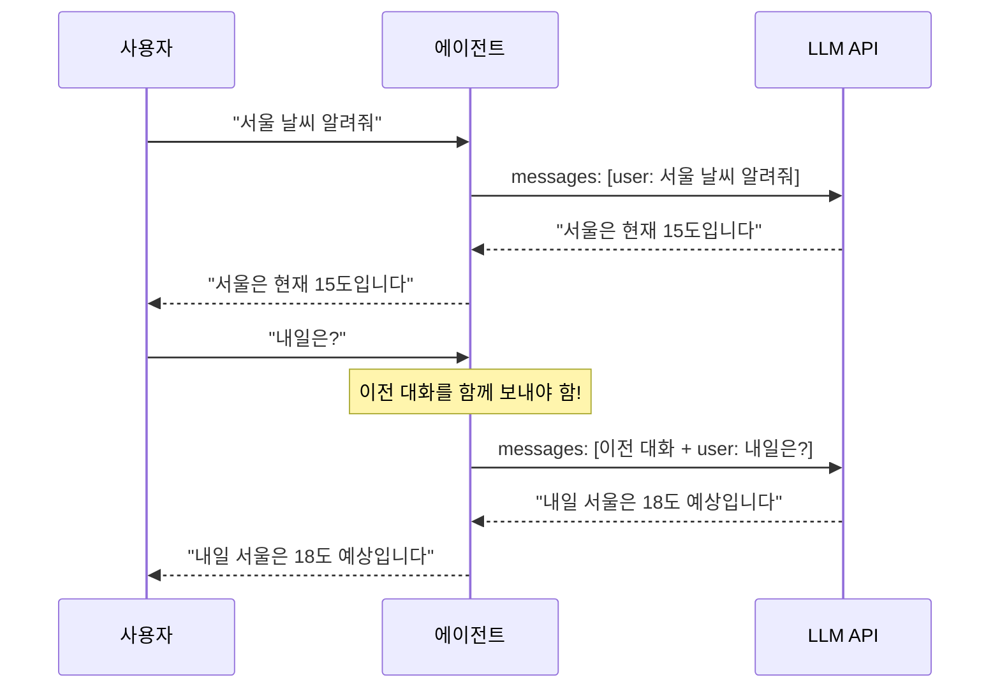
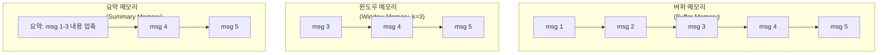
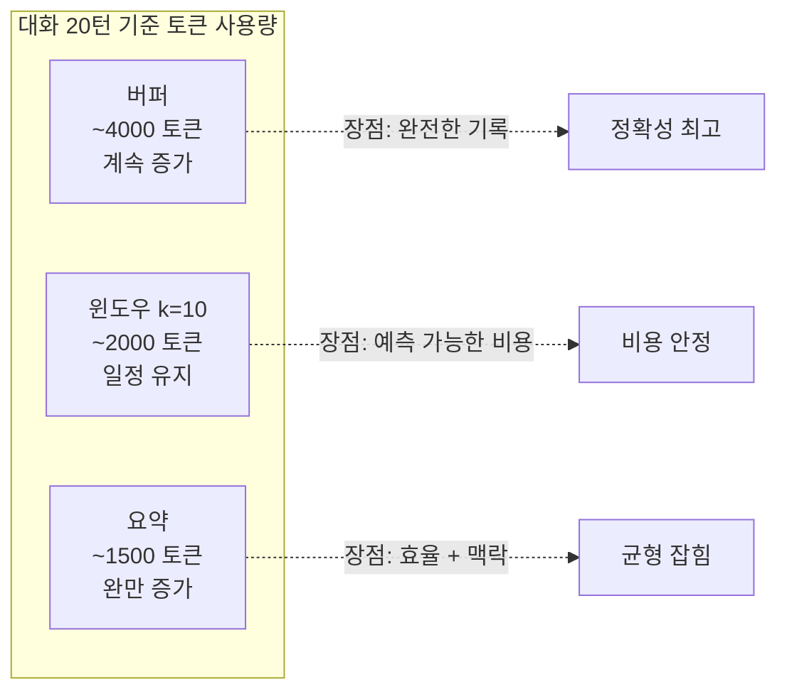
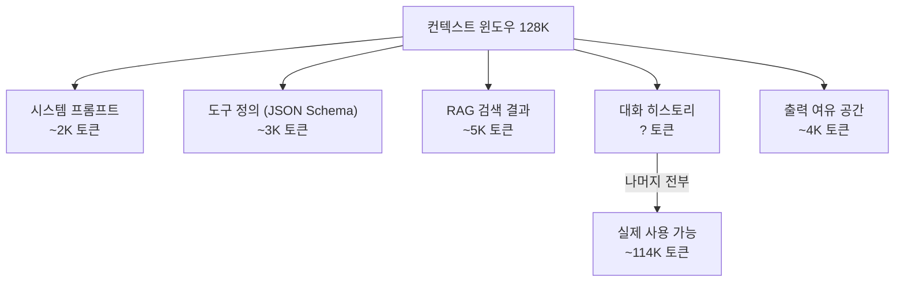
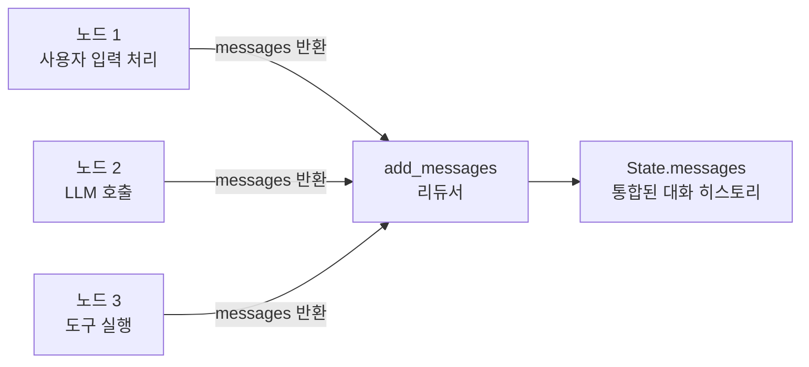

# 대화 메모리의 기초

> LLM 에이전트가 대화를 "기억"하는 원리를 이해하고, 버퍼·요약·윈도우 메모리 전략을 비교합니다.

## 개요

이 섹션에서는 AI 에이전트가 여러 턴에 걸친 대화를 어떻게 기억하는지, 그리고 그 기억을 어떻게 관리하는지 살펴봅니다. 앞서 [Ch1](01-ch1-llm-도구-호출의-이해/01-01-ai-에이전트란-무엇인가.md)에서 배운 것처럼 LLM은 본질적으로 **상태가 없는(stateless)** 모델인데요, 그렇다면 에이전트는 어떻게 대화를 이어갈 수 있는 걸까요?

**선수 지식**: LLM API 호출 경험, [Ch2의 ReAct 패턴](02-ch2-react-패턴과-에이전트-루프/01-01-react-패턴-이론.md)에서 배운 에이전트 루프 개념
**학습 목표**:
- LLM의 stateless 특성과 메모리의 필요성을 이해할 수 있다
- 버퍼, 요약, 윈도우 메모리의 차이를 설명할 수 있다
- 컨텍스트 윈도우 한계와 주요 대응 전략의 종류를 설명할 수 있다
- LangGraph의 메시지 상태 관리 기초를 이해할 수 있다

## 왜 알아야 할까?

여러분이 카페에서 친구와 대화한다고 상상해보세요. 10분 전에 "나 다음 주에 제주도 간다"고 했는데, 친구가 5분 후에 "다음 주에 뭐 해?"라고 물어본다면? 좀 당황스럽겠죠. 대화에서 **맥락을 기억하는 것**은 자연스러운 소통의 핵심입니다.

LLM도 마찬가지입니다. API를 한 번 호출하면 이전 대화를 전혀 모릅니다. 매번 **새로운 사람을 만나는 것**과 같거든요. 그래서 에이전트가 자연스러운 멀티턴 대화를 하려면, 개발자가 직접 "기억"을 관리해줘야 합니다.

프로덕션 환경에서 메모리 관리를 잘못하면 어떻게 될까요?
- **토큰 폭발**: 대화가 길어지면 API 비용이 기하급수적으로 증가
- **컨텍스트 초과**: 모델의 최대 토큰 한도를 넘겨 에러 발생
- **성능 저하**: 너무 긴 컨텍스트는 LLM의 응답 품질을 떨어뜨림
- **핵심 누락**: 정작 중요한 정보가 오래된 메시지에 묻혀 사라짐

이 섹션에서 배울 메모리 전략은 [Ch6의 체크포인트 시스템](06-ch6-체크포인트와-영속적-실행/01-01-체크포인트-시스템-이해.md)과 [Ch7의 Human-in-the-Loop](07-ch7-human-in-the-loop-워크플로우/01-01-human-in-the-loop-패턴-개관.md)의 기반이 됩니다.

## 핵심 개념

### 개념 1: LLM은 금붕어다 — Stateless의 의미

> 💡 **비유**: LLM은 칠판에 적힌 내용만 보고 답하는 선생님과 같습니다. 칠판을 지우면(API 호출이 끝나면) 이전에 뭘 적었는지 전혀 기억하지 못하죠. 다음 수업에서 같은 내용을 다루려면, 우리가 다시 칠판에 적어줘야 합니다.

LLM API는 **stateless**입니다. 매 호출마다 독립적인 요청-응답을 처리하며, 서버 측에 대화 기록을 저장하지 않습니다. 그래서 "대화를 이어간다"는 것은 사실 **이전 메시지를 모두 다시 보내는 것**이죠.

> 📊 **그림 1**: LLM API 호출의 Stateless 특성



두 번째 호출에서 "내일은?"만 보내면 LLM은 "내일이 뭔데요?"라고 반응합니다. 이전 메시지를 함께 보내야 "서울 날씨의 내일"이라는 맥락을 이해하죠. 이것이 바로 **메시지 히스토리(Message History)** — 대화 메모리의 가장 기본적인 형태입니다.

```python
from openai import OpenAI

client = OpenAI()

# ❌ 컨텍스트 없이 호출 — LLM은 "내일"이 뭔지 모름
response = client.chat.completions.create(
    model="gpt-4o",
    messages=[
        {"role": "user", "content": "내일은?"}  # 뭘 묻는 건지 알 수 없음
    ]
)

# ✅ 이전 대화를 포함하여 호출 — 맥락을 이해함
response = client.chat.completions.create(
    model="gpt-4o",
    messages=[
        {"role": "user", "content": "서울 날씨 알려줘"},
        {"role": "assistant", "content": "서울은 현재 15도입니다."},
        {"role": "user", "content": "내일은?"}  # "서울 날씨의 내일"로 이해
    ]
)
```

### 개념 2: 세 가지 메모리 전략 — 버퍼, 윈도우, 요약

> 💡 **비유**: 메모리 전략은 일기장 관리 방법과 같습니다.
> - **버퍼 메모리**: 모든 일기를 처음부터 끝까지 보관 (완전하지만 책이 두꺼워짐)
> - **윈도우 메모리**: 최근 일주일치만 보관하고 나머지는 버림 (가볍지만 오래된 기억 소실)
> - **요약 메모리**: 오래된 일기는 "한 줄 요약"으로 압축 (효율적이지만 디테일 손실)

> 📊 **그림 2**: 세 가지 메모리 전략 비교



각 전략의 특성을 코드로 살펴보겠습니다.

**1) 버퍼 메모리 (Buffer Memory)**

가장 단순한 방식입니다. 모든 대화 내용을 그대로 리스트에 쌓아둡니다.

```python
class BufferMemory:
    """모든 메시지를 그대로 저장하는 가장 단순한 메모리"""

    def __init__(self):
        self.messages: list[dict] = []

    def add_message(self, role: str, content: str) -> None:
        self.messages.append({"role": role, "content": content})

    def get_messages(self) -> list[dict]:
        return self.messages  # 전체 히스토리 반환

    def token_count_estimate(self) -> int:
        """대략적인 토큰 수 추정 (영어 1토큰 ≈ 4자, 한국어 1토큰 ≈ 2자)"""
        total_chars = sum(len(m["content"]) for m in self.messages)
        return total_chars // 2  # 한국어 기준 대략적 추정
```

**2) 윈도우 메모리 (Window Memory)**

최근 k개의 메시지만 유지합니다. 오래된 메시지는 버립니다.

```python
class WindowMemory:
    """최근 k개 메시지만 유지하는 슬라이딩 윈도우 메모리"""

    def __init__(self, k: int = 10):
        self.messages: list[dict] = []
        self.k = k  # 유지할 최대 메시지 수

    def add_message(self, role: str, content: str) -> None:
        self.messages.append({"role": role, "content": content})

    def get_messages(self) -> list[dict]:
        # 최근 k개만 반환, 오래된 것은 잘림
        return self.messages[-self.k:]
```

**3) 요약 메모리 (Summary Memory)**

오래된 대화를 LLM으로 요약하고, 최근 대화만 원본을 유지합니다.

```python
class SummaryMemory:
    """오래된 대화를 요약하고, 최근 대화만 원본 유지"""

    def __init__(self, max_messages: int = 6):
        self.messages: list[dict] = []
        self.summary: str = ""  # 누적 요약
        self.max_messages = max_messages

    def add_message(self, role: str, content: str) -> None:
        self.messages.append({"role": role, "content": content})

    def should_summarize(self) -> bool:
        return len(self.messages) > self.max_messages

    def get_messages(self) -> list[dict]:
        """요약 + 최근 메시지를 합쳐서 반환"""
        result = []
        if self.summary:
            result.append({
                "role": "system",
                "content": f"이전 대화 요약: {self.summary}"
            })
        result.extend(self.messages[-self.max_messages:])
        return result
```

> 📊 **그림 3**: 메모리 전략별 토큰 사용량 변화



### 개념 3: 컨텍스트 윈도우 — 에이전트의 "작업 메모리" 한계

> 💡 **비유**: 컨텍스트 윈도우는 책상 위의 공간과 같습니다. 아무리 많은 문서가 있어도, 책상 위에 펼쳐놓을 수 있는 양에는 한계가 있죠. 새 문서를 올리려면 기존 문서를 치워야 합니다.

모든 LLM에는 **컨텍스트 윈도우(Context Window)** — 한 번에 처리할 수 있는 최대 토큰 수 — 가 있습니다.

| 모델 | 컨텍스트 윈도우 | 한국어 기준 대략 |
|------|----------------|-----------------|
| GPT-4o | 128K 토큰 | ~6만 자 |
| Claude 3.5 Sonnet | 200K 토큰 | ~10만 자 |
| Claude Opus 4.6 | 1M 토큰 | ~50만 자 |
| Gemini 2.5 Pro | 1M 토큰 | ~50만 자 |

넉넉해 보이지만, 에이전트 시스템에서는 시스템 프롬프트, 도구 정의, 검색 결과 등이 함께 들어가므로 실제 대화에 쓸 수 있는 공간은 훨씬 적습니다.

> 📊 **그림 4**: 컨텍스트 윈도우 내부 공간 분배



컨텍스트 한계에 대응하는 주요 전략은 크게 세 가지입니다. 여기서는 각 전략의 **개념과 역할**을 소개하고, 실제 구현은 다음 섹션에서 본격적으로 다룹니다.

```python
from langchain_core.messages import trim_messages, HumanMessage, AIMessage

# 전략 1: 메시지 트리밍 — 최근 N개 토큰만 유지
# trim_messages는 토큰 기준으로 히스토리를 잘라주는 유틸리티입니다
trimmed = trim_messages(
    messages,
    max_tokens=4000,          # 최대 토큰 수
    strategy="last",          # 최근 메시지 우선
    token_counter=len,        # 토큰 카운터 함수
    allow_partial=False,      # 메시지 중간 자르기 금지
    start_on="human",         # 항상 human 메시지로 시작
)

# 전략 2: 요약 압축 — 오래된 대화를 요약으로 교체
# (다음 섹션에서 자세히 구현합니다)

# 전략 3: 선택적 제거 — 특정 메시지만 삭제
from langchain_core.messages import RemoveMessage
# 도구 호출 결과 같은 긴 메시지를 선별 삭제
delete_actions = [RemoveMessage(id=m.id) for m in old_tool_messages]
```

> 🔥 **실무 팁**: `trim_messages`와 `RemoveMessage`의 구체적인 활용법 — 토큰 예산 계산, 트리밍 시점 결정, 선택적 삭제 기준 설정 등 — 은 [02. 슬라이딩 윈도우와 토큰 관리](03-ch3-대화-메모리와-상태-관리/02-02-슬라이딩-윈도우와-토큰-관리.md)에서 단계별로 구현합니다. 이 섹션에서는 "어떤 도구가 있는지"를 먼저 파악해두세요.

### 개념 4: LangGraph의 메시지 상태 관리 — 첫 만남

> 💡 **비유**: LangGraph의 상태 관리는 대화 기록용 공유 노트패드와 같습니다. 여러 사람(노드)이 번갈아 적어도, 순서가 꼬이지 않고 쌓이죠.

앞서 배운 메모리 전략을 직접 구현할 수도 있지만, LangGraph는 이를 **그래프 상태(State)** 에 녹여 자동으로 관리해줍니다. 핵심은 `add_messages`라는 **리듀서(reducer)** 인데요, 이 함수가 새 메시지를 기존 리스트에 어떻게 병합할지를 결정합니다.

```python
from typing import Annotated, TypedDict
from langgraph.graph.message import add_messages
from langchain_core.messages import AnyMessage

# LangGraph 상태 스키마 정의
class AgentState(TypedDict):
    # add_messages 리듀서: 새 메시지를 기존 리스트에 추가
    messages: Annotated[list[AnyMessage], add_messages]
```

이렇게 선언하면 그래프의 각 노드가 `{"messages": [새 메시지]}` 를 반환할 때마다, `add_messages`가 기존 히스토리에 자동으로 병합해줍니다. 단순한 append뿐 아니라, 같은 ID의 메시지는 업데이트하고 `RemoveMessage`로 삭제도 가능한 **똑똑한 병합 로직**이 내장되어 있거든요.

> 📊 **그림 5**: LangGraph 상태에서 메시지 흐름



`add_messages`의 ID 기반 병합, 메시지 업데이트, `RemoveMessage`를 활용한 선택적 삭제 등 상세한 동작 방식은 [03. add_messages와 메시지 리듀서 패턴](03-ch3-대화-메모리와-상태-관리/03-03-add-messages와-메시지-리듀서-패턴.md)에서 본격적으로 다룹니다. 지금은 "LangGraph가 메시지 관리를 자동화해주고, 그 핵심이 `add_messages` 리듀서"라는 점만 기억해두세요.

## 실습: 직접 해보기

세 가지 메모리 전략을 하나의 실행 가능한 코드에서 비교해보겠습니다. LLM API 없이도 동작을 확인할 수 있도록 구성했습니다.

```run:python
from dataclasses import dataclass, field

@dataclass
class SimpleMessage:
    role: str
    content: str
    token_estimate: int = 0

    def __post_init__(self):
        # 한국어 기준 대략 2자 = 1토큰
        self.token_estimate = max(len(self.content) // 2, 1)

# ── 세 가지 메모리 전략 구현 ──
class BufferMemory:
    """전체 대화를 저장"""
    def __init__(self):
        self.messages: list[SimpleMessage] = []

    def add(self, role: str, content: str):
        self.messages.append(SimpleMessage(role, content))

    def get_messages(self) -> list[SimpleMessage]:
        return self.messages

    def total_tokens(self) -> int:
        return sum(m.token_estimate for m in self.messages)

class WindowMemory:
    """최근 k개만 유지"""
    def __init__(self, k: int = 4):
        self.messages: list[SimpleMessage] = []
        self.k = k

    def add(self, role: str, content: str):
        self.messages.append(SimpleMessage(role, content))

    def get_messages(self) -> list[SimpleMessage]:
        return self.messages[-self.k:]

    def total_tokens(self) -> int:
        return sum(m.token_estimate for m in self.get_messages())

class SummaryMemory:
    """오래된 대화를 요약으로 압축"""
    def __init__(self, max_recent: int = 4):
        self.messages: list[SimpleMessage] = []
        self.summary: str = ""
        self.max_recent = max_recent

    def add(self, role: str, content: str):
        self.messages.append(SimpleMessage(role, content))
        # 메시지가 임계치를 넘으면 요약 수행 (여기선 시뮬레이션)
        if len(self.messages) > self.max_recent + 2:
            old = self.messages[:-self.max_recent]
            topics = [m.content[:15] for m in old]
            self.summary = f"이전 대화 요약: {', '.join(topics)}..."
            self.messages = self.messages[-self.max_recent:]

    def get_messages(self) -> list[SimpleMessage]:
        result = []
        if self.summary:
            result.append(SimpleMessage("system", self.summary))
        result.extend(self.messages)
        return result

    def total_tokens(self) -> int:
        return sum(m.token_estimate for m in self.get_messages())

# ── 대화 시뮬레이션 ──
conversation = [
    ("user", "서울 날씨 알려줘"),
    ("assistant", "서울은 현재 15도이고 맑습니다."),
    ("user", "내일 비 와?"),
    ("assistant", "내일 서울은 오후에 비가 예상됩니다. 우산을 챙기세요."),
    ("user", "부산은 어때?"),
    ("assistant", "부산은 내일 흐리지만 비는 오지 않을 예정입니다."),
    ("user", "주말 제주도 날씨는?"),
    ("assistant", "주말 제주도는 맑고 20도 내외로 나들이하기 좋겠습니다."),
    ("user", "고마워, 그러면 제주도로 갈게"),
    ("assistant", "좋은 선택이네요! 즐거운 제주도 여행 되세요."),
]

buf = BufferMemory()
win = WindowMemory(k=4)
summ = SummaryMemory(max_recent=4)

for role, content in conversation:
    buf.add(role, content)
    win.add(role, content)
    summ.add(role, content)

print("=== 메모리 전략 비교 (10개 메시지 후) ===\n")
print(f"버퍼 메모리: {len(buf.get_messages())}개 메시지, ~{buf.total_tokens()} 토큰")
print(f"윈도우 메모리(k=4): {len(win.get_messages())}개 메시지, ~{win.total_tokens()} 토큰")
print(f"요약 메모리: {len(summ.get_messages())}개 메시지, ~{summ.total_tokens()} 토큰")
print(f"\n--- 요약 메모리가 보내는 내용 ---")
for m in summ.get_messages():
    print(f"[{m.role}] {m.content[:60]}{'...' if len(m.content) > 60 else ''}")
```

```output
=== 메모리 전략 비교 (10개 메시지 후) ===

버퍼 메모리: 10개 메시지, ~109 토큰
윈도우 메모리(k=4): 4개 메시지, ~51 토큰
요약 메모리: 5개 메시지, ~72 토큰

--- 요약 메모리가 보내는 내용 ---
[system] 이전 대화 요약: 서울 날씨 알려줘, 서울은 현재 15도이고, 내일 비 와?, 내일 서울은 오후에 비가, 부산은 어때?, 부산은 내일 흐리지만...
[user] 주말 제주도 날씨는?
[assistant] 주말 제주도는 맑고 20도 내외로 나들이하기 좋겠습니다.
[user] 고마워, 그러면 제주도로 갈게
[assistant] 좋은 선택이네요! 즐거운 제주도 여행 되세요.
```

다음으로, LangGraph에서 체크포인터를 활용한 기본 메모리 그래프를 만들어보겠습니다.

```python
from typing import Annotated, TypedDict
from langchain_core.messages import HumanMessage, AIMessage, SystemMessage
from langgraph.graph import StateGraph, START, END
from langgraph.graph.message import add_messages
from langgraph.checkpoint.memory import MemorySaver

# 1. 상태 정의 — add_messages 리듀서 사용
class ChatState(TypedDict):
    messages: Annotated[list, add_messages]

# 2. 챗봇 노드 — 실제로는 LLM을 호출
def chatbot(state: ChatState) -> dict:
    # 여기서 state["messages"]에 전체 대화 히스토리가 담겨 있음
    last_message = state["messages"][-1]
    # 실제 구현에서는 llm.invoke(state["messages"])
    response = AIMessage(content=f"'{last_message.content}'에 대한 응답입니다.")
    return {"messages": [response]}

# 3. 그래프 구성
graph_builder = StateGraph(ChatState)
graph_builder.add_node("chatbot", chatbot)
graph_builder.add_edge(START, "chatbot")
graph_builder.add_edge("chatbot", END)

# 4. 체크포인터 연결 → 대화 히스토리 자동 영속화
memory = MemorySaver()  # 인메모리 체크포인터 (langgraph.checkpoint.memory)
graph = graph_builder.compile(checkpointer=memory)

# 5. 실행 — thread_id로 대화 세션 구분
config = {"configurable": {"thread_id": "user-123"}}

# 첫 번째 메시지
result1 = graph.invoke(
    {"messages": [HumanMessage(content="안녕하세요!")]},
    config=config
)

# 두 번째 메시지 — 이전 대화가 자동으로 포함됨
result2 = graph.invoke(
    {"messages": [HumanMessage(content="날씨 알려줘")]},
    config=config
)

# 전체 대화 히스토리 확인
for msg in result2["messages"]:
    print(f"[{msg.type}] {msg.content}")
```

핵심은 `MemorySaver` 체크포인터입니다. `langgraph.checkpoint.memory` 모듈에 있는 이 클래스는 메모리(RAM) 기반의 체크포인터로, `thread_id`별로 상태를 저장합니다. 두 번째 `invoke` 호출 시 첫 번째 대화의 메시지가 자동으로 포함되는 것이 LangGraph 메모리의 기본 동작 원리입니다.

> ⚠️ **흔한 오해**: 간혹 `InMemorySaver`라는 이름으로 소개하는 자료가 있는데, LangGraph 공식 클래스명은 **`MemorySaver`** (`langgraph.checkpoint.memory`)입니다. "인메모리"라는 특성 때문에 혼동하기 쉬우니, import 경로를 확인하세요.

## 더 깊이 알아보기

### 대화 메모리의 역사 — "기억"을 향한 AI의 긴 여정

대화 메모리라는 개념은 사실 LLM 이전부터 존재했습니다. 1966년 MIT의 Joseph Weizenbaum이 만든 **ELIZA**는 최초의 대화형 프로그램인데요, 놀랍게도 ELIZA에는 메모리가 전혀 없었습니다. 매 응답이 독립적이었고, 패턴 매칭만으로 사람처럼 대화하는 "환상"을 만들었죠. 그런데도 사람들은 ELIZA에게 진심으로 상담을 받고 있다고 느꼈다고 합니다 — 이를 "ELIZA 효과"라 부릅니다.

그로부터 반세기가 지난 2020년대, Transformer 기반 LLM이 등장하면서 상황이 바뀌었습니다. LLM은 컨텍스트 윈도우 안에 있는 모든 텍스트를 "이해"할 수 있지만, 여전히 stateless였죠. LangChain은 2022년 말에 이 문제를 해결하려 `ConversationBufferMemory`, `ConversationSummaryMemory` 등의 메모리 클래스를 도입했습니다. 하지만 이 접근법에는 한계가 있었습니다 — 체인(chain) 실행 중에만 메모리가 유지되고, 복잡한 분기나 병렬 처리에서는 상태 관리가 어려웠거든요.

2024년, LangChain 팀은 **LangGraph**를 발표하면서 메모리 패러다임을 근본적으로 바꿨습니다. 메모리를 별도 모듈이 아닌 **그래프 상태(State)** 의 일부로 만든 것이죠. 이 결정은 메모리 관리를 훨씬 유연하고 예측 가능하게 만들었고, LangChain v0.3.1에서 레거시 메모리 클래스는 공식적으로 deprecated 되었습니다.

### 인간의 기억 시스템과 AI 메모리

심리학에서는 인간의 기억을 **단기 기억(Short-term Memory)** 과 **장기 기억(Long-term Memory)** 으로 나눕니다. 흥미롭게도 LangGraph의 메모리 아키텍처도 이와 유사하게 설계되어 있습니다:

- **단기 기억** → 스레드(thread) 단위의 메시지 히스토리 (체크포인트)
- **장기 기억** → 스레드를 넘나드는 Memory Store (사용자 선호도, 과거 사실 등)

이 구분은 [04. 장기 메모리 구현](03-ch3-대화-메모리와-상태-관리/04-04-장기-메모리-구현.md)에서 실제로 구현해 봅니다.

## 흔한 오해와 팁

> ⚠️ **흔한 오해**: "컨텍스트 윈도우가 크면 메모리 관리가 필요 없다"
> 
> Claude나 Gemini의 컨텍스트가 100만 토큰이니 메시지를 전부 넣으면 된다고 생각하기 쉬운데요, **실제로는 그렇지 않습니다**. 첫째, 토큰 수에 비례하여 API 비용이 증가합니다. 둘째, 연구에 따르면 LLM은 매우 긴 컨텍스트에서 중간 부분의 정보를 놓치는 경향이 있습니다("Lost in the Middle" 현상). 셋째, 지연 시간(latency)이 늘어납니다. 메모리 관리는 모델 크기와 무관하게 **항상 필요**합니다.

> 💡 **알고 계셨나요?**: LangChain의 레거시 메모리 클래스(`ConversationBufferMemory` 등)는 LangChain v0.3.1부터 공식 deprecated되었습니다. 이제 LangGraph의 체크포인터 + `add_messages` 리듀서가 표준 방식입니다. 기존 코드를 마이그레이션할 때는 LangChain 공식 [마이그레이션 가이드](https://python.langchain.com/docs/versions/migrating_memory/)를 참고하세요.

> 🔥 **실무 팁**: 프로덕션에서 메모리 전략을 선택할 때는 이 기준을 따르세요:
> - **짧은 대화** (고객 상담, Q&A) → 윈도우 메모리(k=10~20)로 충분
> - **긴 대화** (코딩 에이전트, 프로젝트 관리) → 요약 메모리 + 최근 메시지 조합
> - **다중 세션** (개인 비서, 학습 도우미) → LangGraph Memory Store로 장기 기억 분리
> 
> 핵심은 "모든 것을 기억"하는 게 아니라, **중요한 것만 효율적으로 기억**하는 것입니다.

## 핵심 정리

| 개념 | 설명 |
|------|------|
| Stateless LLM | LLM API는 상태를 저장하지 않음. 매 호출 시 전체 대화를 다시 전송해야 함 |
| 버퍼 메모리 | 모든 메시지를 그대로 저장. 단순하지만 토큰 비용이 무한 증가 |
| 윈도우 메모리 | 최근 k개 메시지만 유지. 비용 예측 가능하지만 오래된 맥락 소실 |
| 요약 메모리 | 오래된 대화를 LLM으로 요약. 효율적이지만 디테일 손실 + 요약 비용 발생 |
| 컨텍스트 윈도우 | 모델이 한 번에 처리할 수 있는 최대 토큰 수. 시스템 프롬프트 등을 제외하면 실제 사용 가능 공간은 더 작음 |
| `add_messages` 리듀서 | LangGraph의 메시지 병합 함수. 새 메시지 추가, ID 기반 업데이트, 삭제를 자동 처리. 상세 동작은 [03. add_messages와 메시지 리듀서 패턴](03-ch3-대화-메모리와-상태-관리/03-03-add-messages와-메시지-리듀서-패턴.md) 참고 |
| `MemorySaver` | LangGraph의 인메모리 체크포인터(`langgraph.checkpoint.memory`). `thread_id`별로 상태를 자동 영속화. 일부 자료에서 `InMemorySaver`로 표기하기도 하나 공식 클래스명은 `MemorySaver` |
| `trim_messages` | LangChain이 제공하는 메시지 트리밍 유틸리티. 토큰 기준으로 히스토리 자르기 |

## 다음 섹션 미리보기

이번 섹션에서 메모리의 기본 개념과 세 가지 전략을 배웠습니다. 다음 섹션 [02. 슬라이딩 윈도우와 토큰 관리](03-ch3-대화-메모리와-상태-관리/02-02-슬라이딩-윈도우와-토큰-관리.md)에서는 윈도우 메모리를 LangGraph 그래프 안에서 실제로 구현하고, `trim_messages`와 `RemoveMessage`를 활용하여 토큰 예산 내에서 최적의 메시지 히스토리를 유지하는 전략을 깊이 있게 다룹니다.

## 참고 자료

- [Memory overview — LangGraph 공식 문서](https://docs.langchain.com/oss/python/langgraph/memory) - LangGraph의 단기/장기 메모리 아키텍처를 체계적으로 설명하는 공식 가이드
- [How to migrate to LangGraph memory — LangChain 문서](https://python.langchain.com/docs/versions/migrating_memory/) - 레거시 LangChain 메모리에서 LangGraph로 마이그레이션하는 공식 가이드
- [LangGraph: Build Stateful AI Agents in Python — Real Python](https://realpython.com/langgraph-python/) - LangGraph의 상태 관리와 체크포인터를 실습 중심으로 설명하는 튜토리얼
- [Conversational Memory for LLMs with LangChain — Pinecone](https://www.pinecone.io/learn/series/langchain/langchain-conversational-memory/) - 버퍼, 윈도우, 요약 등 메모리 유형별 개념과 차이를 시각적으로 잘 정리한 학습 자료
- [Building Long-Term Memory in AI Agents with LangGraph and Mem0 — DigitalOcean](https://www.digitalocean.com/community/tutorials/langgraph-mem0-integration-long-term-ai-memory) - 장기 메모리 통합 패턴을 실습하는 튜토리얼