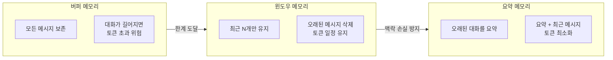
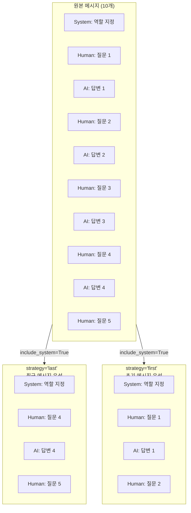
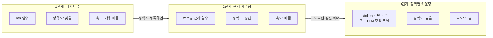
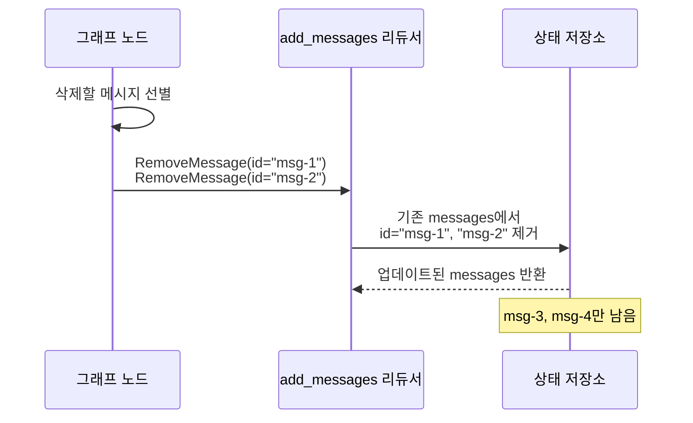
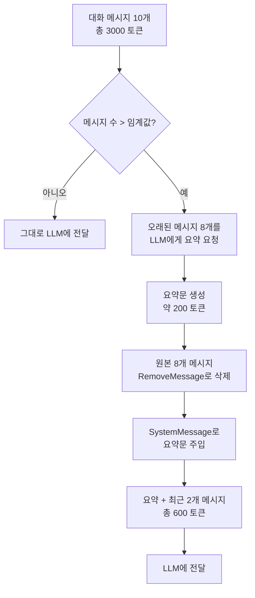
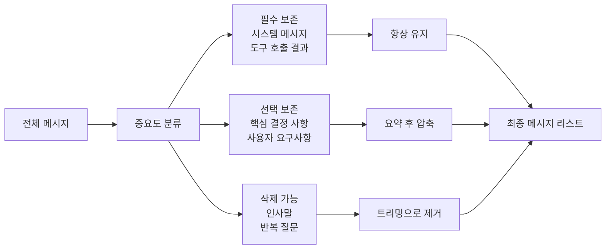

# 슬라이딩 윈도우와 토큰 관리

> 대화가 길어져도 에이전트가 똑똑하게 기억을 관리하는 법 — 메시지 트리밍, 토큰 카운팅, 요약 압축의 모든 것

## 개요

이 섹션에서는 LLM의 컨텍스트 윈도우 한계를 실전에서 관리하는 구체적인 기법들을 다룹니다. [이전 섹션](03-ch3-대화-메모리와-상태-관리/01-01-대화-메모리의-기초.md)에서 배운 버퍼/윈도우/요약 메모리의 개념을 실제 코드로 구현하고, LangGraph의 `trim_messages`와 `RemoveMessage`를 활용해 메시지를 정밀하게 제어하는 방법을 배웁니다.

**선수 지식**: `add_messages` 리듀서, `MemorySaver`, `MessagesState` 개념 ([세션 3.1](03-ch3-대화-메모리와-상태-관리/01-01-대화-메모리의-기초.md) 참조)
**학습 목표**:
- 윈도우 메모리가 왜 필요한지 직관적으로 이해할 수 있다
- `trim_messages` API의 주요 파라미터를 이해하고 활용할 수 있다
- 토큰 카운팅의 세 가지 접근법(정확, 근사, 메시지 수)을 비교하고 선택할 수 있다
- `RemoveMessage`를 사용해 상태에서 메시지를 명시적으로 삭제할 수 있다
- 요약 기반 압축 노드를 StateGraph에 통합할 수 있다

## 왜 알아야 할까?

실제 프로덕션 에이전트를 운영하면 대화가 수십, 수백 턴까지 이어지는 일이 흔합니다. 고객 지원 챗봇이 한 세션에서 50번 이상 대화할 수도 있고, 코딩 어시스턴트가 긴 디버깅 세션을 이어갈 수도 있죠. 문제는 **LLM의 컨텍스트 윈도우가 유한하다**는 겁니다. GPT-4o가 128K 토큰을 지원한다고 해도, 모든 메시지를 그대로 넣으면 비용이 폭발하고 응답 품질도 떨어집니다.

더 현실적인 문제도 있습니다. 토큰이 넘치면 API 호출 자체가 실패하거든요. 이런 상황을 방지하면서도 중요한 맥락은 보존해야 합니다. 이 섹션에서 배우는 기법들은 "기억의 용량은 제한적이지만, 중요한 것은 잊지 않는" 에이전트를 만드는 핵심 역량입니다.

## 핵심 개념

### 개념 0: 윈도우 메모리 복습 — 왜 "자르기"가 필요한가

본격적으로 코드로 들어가기 전에, [이전 섹션](03-ch3-대화-메모리와-상태-관리/01-01-대화-메모리의-기초.md)에서 배운 세 가지 메모리 전략을 잠깐 떠올려봅시다.

> 💡 **비유**: 스마트폰 사진 앨범을 생각해보세요. **버퍼 메모리**는 사진을 찍는 대로 전부 저장하는 방식이고(용량 폭발!), **윈도우 메모리**는 최근 100장만 남기고 오래된 사진을 자동 삭제하는 방식, **요약 메모리**는 여행 앨범별로 대표 사진 1장씩만 남기는 방식입니다. 오늘 배울 내용은 이 "자동 삭제"와 "대표 사진 선별"을 코드로 구현하는 겁니다.

> 📊 **그림 1**: 메모리 전략별 컨텍스트 사용량 비교



이전 섹션에서는 이런 전략들의 **개념**을 배웠습니다. 이번 섹션에서는 이 개념들을 실제로 구현하는 도구들을 하나씩 익혀볼 건데요, 가장 간단한 것부터 시작하겠습니다.

아래는 윈도우 메모리의 **가장 기초적인 구현**입니다. 파이썬 리스트 슬라이싱만으로도 만들 수 있죠:

```python
from langchain_core.messages import HumanMessage, AIMessage, SystemMessage

# 대화 기록이 쌓여있다고 가정
messages = [
    SystemMessage(content="당신은 AI 비서입니다."),
    HumanMessage(content="안녕!"),
    AIMessage(content="안녕하세요!"),
    HumanMessage(content="파이썬 알려줘"),
    AIMessage(content="파이썬은 프로그래밍 언어입니다."),
    HumanMessage(content="웹 프레임워크는?"),
    AIMessage(content="FastAPI를 추천합니다."),
    HumanMessage(content="DB 연결은?"),  # 가장 최근
]

# 가장 단순한 윈도우: 시스템 메시지 + 최근 4개만 유지
system = messages[0]
recent = messages[-4:]  # 마지막 4개 메시지
windowed = [system] + recent

print(f"전체: {len(messages)}개 → 윈도우 적용: {len(windowed)}개")
```

이 방식은 작동하지만, 실전에서는 몇 가지 문제가 있습니다:
- **토큰 수를 고려하지 않음**: 메시지 4개라도 각각 1000토큰이면 이미 4000토큰
- **AI 메시지로 시작할 수 있음**: LLM이 혼란스러워함
- **매번 수동으로 슬라이싱**: 반복적이고 실수하기 쉬움

이런 문제들을 한 번에 해결해주는 것이 바로 `trim_messages`입니다. 위의 수동 슬라이싱을 **선언적 API**로 바꿔주는 도구라고 생각하면 됩니다.

### 개념 1: trim_messages — 메시지 가위

> 💡 **비유**: 냉장고 정리를 떠올려보세요. 냉장고 용량이 한정되어 있으니, 새 식재료를 넣으려면 오래된 것부터 빼야 합니다. 그런데 기본 양념(소금, 간장)은 항상 냉장고에 남겨두죠. `trim_messages`가 하는 일이 정확히 이겁니다 — 시스템 메시지(기본 양념)는 보존하면서 오래된 대화(상한 식재료)를 정리합니다.

방금 본 수동 슬라이싱의 모든 문제를 해결하는 `trim_messages`의 기본 사용법부터 봅시다:

```python
from langchain_core.messages import trim_messages

# 앞서 수동으로 하던 윈도우 작업을 한 줄로!
trimmed = trim_messages(
    messages,                    # 원본 메시지 리스트
    max_tokens=4,                # 여기서는 메시지 수 기준 (token_counter=len이므로)
    token_counter=len,           # 토큰 카운팅 함수 (가장 단순한 방식)
    strategy="last",             # "last" = 최근 메시지 우선
    include_system=True,         # 시스템 메시지 항상 보존
    start_on="human",            # Human 메시지로 시작하도록 보장
)
```

위 코드에서 `token_counter=len`은 "메시지 개수를 토큰 수로 간주하겠다"는 뜻입니다. 즉 `max_tokens=4`는 "메시지 4개까지만 유지"와 같습니다. 가장 직관적인 시작점이죠.

이제 각 파라미터를 하나씩 살펴봅시다:

```python
trimmed = trim_messages(
    messages,                    # 원본 메시지 리스트
    max_tokens=4000,             # 최대 토큰 수 (token_counter에 따라 의미가 달라짐)
    token_counter=len,           # 토큰 카운팅 함수 (callable)
    strategy="last",             # "last" = 최근 메시지 우선, "first" = 오래된 메시지 우선
    include_system=True,         # 시스템 메시지 항상 보존
    start_on="human",            # Human 메시지로 시작하도록 보장
    allow_partial=False,         # 메시지를 잘라서 보내지 않음
)
```

> 📊 **그림 2**: trim_messages의 strategy별 동작 비교



`strategy="last"`는 가장 최근 대화를 유지하므로 **대부분의 챗봇 시나리오에 적합**합니다. `strategy="first"`는 초기 지시사항이 중요한 경우(예: 긴 문서 분석 작업)에 유용합니다.

`start_on="human"` 옵션도 중요한데요, 트리밍 후 AI 메시지로 시작하면 LLM이 혼란스러워할 수 있습니다. 사람의 질문으로 시작하도록 보장하면 대화 흐름이 자연스럽게 유지됩니다.

### 개념 2: 토큰 카운팅 전략

> 💡 **비유**: 여행 가방의 무게를 재는 방법이 여러 가지인 것과 비슷합니다. 정밀 저울(tiktoken)로 그램 단위까지 재거나, 손으로 들어서 "약 15kg쯤?" 하고 어림잡거나(근사 함수), 아예 물건 개수만 세거나(len). 각각 정확도와 속도의 트레이드오프가 있죠.

앞서 `token_counter=len`을 사용했죠? 이건 메시지 개수만 세는 가장 단순한 방식이었습니다. 하지만 실제로는 "메시지 5개"라도 각 메시지 길이에 따라 토큰 수가 천차만별입니다. 그래서 더 정교한 카운팅이 필요하죠.

`trim_messages`의 `token_counter` 파라미터는 **callable(호출 가능한 함수)**을 기대합니다. 메시지 리스트를 받아 정수(토큰 수)를 반환하는 함수면 무엇이든 사용 가능합니다. 단순한 것부터 정교한 것 순서로 살펴봅시다:

> 📊 **그림 3**: 토큰 카운팅 세 가지 전략 비교



**1단계) 메시지 수 기준 — len 함수 (이미 배웠죠!)**

```python
# 토큰이 아닌 메시지 개수로 트리밍
# max_tokens=6이면 최근 6개 메시지만 유지
trimmed = trim_messages(
    messages,
    max_tokens=6,
    token_counter=len,  # 메시지 개수 기준
    strategy="last",
    include_system=True,
)
```

가장 단순하지만, 메시지 길이가 들쭉날쭉할 때는 예측 불가능합니다. 프로토타입이나 학습 단계에서 사용하세요.

**2단계) 근사 카운팅 — 커스텀 함수**

외부 의존성 없이 빠르게 토큰을 어림잡는 방식입니다. `len` 함수에서 한 단계만 올라가면 됩니다:

```python
def approximate_token_counter(messages: list) -> int:
    """외부 의존성 없이 토큰 수를 근사 계산"""
    total = 0
    for msg in messages:
        # 영어 기준 약 4글자 = 1토큰, 한국어는 약 2글자 = 1토큰
        # 메시지당 3토큰 오버헤드 추가
        total += 3 + len(msg.content) // 4
    return total

# 이제 메시지 길이를 고려한 트리밍!
trimmed = trim_messages(
    messages,
    max_tokens=4000,
    token_counter=approximate_token_counter,  # 커스텀 근사 함수
    strategy="last",
    include_system=True,
)
```

`langchain_core` **0.3.x 이상** 버전에서는 문자열 `"approximate"`도 지원합니다. 내부의 `count_tokens_approximately` 함수를 자동으로 사용하죠:

```python
# langchain_core >= 0.3.x에서 지원하는 편의 기능
# 내부적으로 영어 4글자당 1토큰 + 메시지당 3토큰 오버헤드로 계산
trimmed = trim_messages(
    messages,
    max_tokens=4000,
    token_counter="approximate",  # 문자열 리터럴 (버전 확인 필요!)
    strategy="last",
    include_system=True,
)
```

> ⚠️ **흔한 오해**: `token_counter="approximate"`는 모든 `langchain_core` 버전에서 동작하는 것이 아닙니다. **0.3.x 미만 버전**에서는 `token_counter`가 반드시 callable이어야 하며, 문자열을 전달하면 `TypeError`가 발생합니다. 버전이 확실하지 않다면 위의 `approximate_token_counter`처럼 직접 함수를 만들어 전달하는 것이 가장 안전합니다.

**3단계) 정확한 카운팅 — tiktoken 기반 callable**

가장 정확한 방식은 tiktoken을 직접 사용하여 토큰 카운팅 함수를 만드는 것입니다:

```python
import tiktoken

# tiktoken 기반 토큰 카운터 함수 작성
def tiktoken_counter(messages: list) -> int:
    """tiktoken으로 정확한 토큰 수를 계산하는 callable"""
    encoding = tiktoken.encoding_for_model("gpt-4o")
    total = 0
    for msg in messages:
        # 메시지당 기본 오버헤드 (role, 구분자 등) 약 4토큰
        total += 4
        total += len(encoding.encode(msg.content))
    return total

# callable을 token_counter에 전달
trimmed = trim_messages(
    messages,
    max_tokens=4000,
    token_counter=tiktoken_counter,  # 직접 만든 함수 전달
    strategy="last",
    include_system=True,
)
```

LLM 모델 객체를 직접 전달하는 것도 가능합니다 — 내부적으로 해당 모델의 토크나이저를 사용합니다:

```python
from langchain_openai import ChatOpenAI

model = ChatOpenAI(model="gpt-4o")

# LLM 객체도 callable로 동작 (내부적으로 tiktoken 사용)
trimmed = trim_messages(
    messages,
    max_tokens=4000,
    token_counter=model,  # BaseLanguageModel도 허용
    strategy="last",
    include_system=True,
)
```

> 🔥 **실무 팁**: 프로덕션에서는 tiktoken 기반 callable이나 커스텀 근사 함수를 기본으로 쓰되, `max_tokens`를 모델 한도의 **70~80%**로 설정하세요. 응답 생성에 필요한 토큰 여유분과 도구 스키마가 차지하는 토큰을 감안해야 합니다. 학습 중에는 `len`으로 시작해도 충분합니다 — 중요한 건 `trim_messages`의 동작 원리를 이해하는 거니까요.

### 개념 3: RemoveMessage — 정밀 메시지 삭제

> 💡 **비유**: `trim_messages`가 "오래된 것부터 자르는 가위"라면, `RemoveMessage`는 "특정 항목만 골라서 지우는 지우개"입니다. 도서관에서 책장 앞쪽 10권을 일괄 반납하는 게 아니라, 특정 ISBN의 책만 찾아서 반납하는 거죠.

`trim_messages`는 편리하지만 "최근 N개" 같은 단순한 규칙만 적용할 수 있습니다. 만약 "중간에 있는 특정 메시지만 삭제"하고 싶다면? 여기서 `RemoveMessage`가 등장합니다.

`RemoveMessage`는 `add_messages` 리듀서와 함께 동작하는 특수 메시지입니다. 상태에서 특정 ID의 메시지를 삭제하라는 "명령"이죠.

```python
from langchain_core.messages import RemoveMessage

# 특정 메시지를 ID로 삭제
delete_msg = RemoveMessage(id="message-uuid-here")
```

> 📊 **그림 4**: RemoveMessage와 add_messages 리듀서의 동작 흐름



`RemoveMessage`의 핵심 특징:
- `id` 파라미터만 받습니다 (`content`를 전달하면 `ValueError` 발생)
- 반드시 `add_messages` 리듀서가 적용된 상태 키에서만 동작합니다
- 존재하지 않는 ID를 삭제하려 하면 에러가 발생합니다

그래프 노드에서 사용하는 전형적인 패턴은 이렇습니다:

```python
from langgraph.graph import MessagesState

def cleanup_messages(state: MessagesState):
    """오래된 메시지를 삭제하고 최근 4개만 유지"""
    messages = state["messages"]
    if len(messages) <= 4:
        return {"messages": []}  # 삭제할 것 없음
    
    # 마지막 4개를 제외한 모든 메시지에 대해 RemoveMessage 생성
    delete_messages = [RemoveMessage(id=m.id) for m in messages[:-4]]
    return {"messages": delete_messages}
```

### 개념 4: 요약 기반 압축 — 기억을 응축하기

> 💡 **비유**: 회의록 작성을 생각해보세요. 3시간짜리 회의를 녹음 파일 전체로 보관할 수도 있지만, 핵심만 정리한 1페이지 요약본을 만들면 훨씬 효율적이죠. 다음 회의에서 "지난번에 뭘 결정했지?" 할 때 요약본 한 장이면 충분합니다. 요약 기반 압축이 정확히 이 원리입니다.

지금까지 배운 `trim_messages`와 `RemoveMessage`를 조합하면 강력한 패턴을 만들 수 있습니다. 단순 트리밍은 오래된 메시지를 **통째로 버립니다**. 하지만 초반 대화에 중요한 맥락(사용자 요구사항, 결정 사항)이 있었다면? 요약 기반 압축은 이 문제를 해결합니다:

1. 오래된 메시지들을 LLM에게 요약 요청
2. 요약문을 시스템 메시지로 주입
3. 원본 메시지를 `RemoveMessage`로 삭제
4. 최근 메시지 + 요약 = 컴팩트한 컨텍스트

> 📊 **그림 5**: 요약 기반 압축 파이프라인



이 패턴을 StateGraph에 구현하면 이렇게 됩니다:

```python
from typing import Literal
from typing_extensions import TypedDict, Annotated
from langchain_core.messages import (
    SystemMessage, RemoveMessage, HumanMessage, AIMessage,
)
from langchain_openai import ChatOpenAI
from langgraph.graph import StateGraph, START, END, MessagesState
from langgraph.graph.message import add_messages

model = ChatOpenAI(model="gpt-4o-mini")

class State(MessagesState):
    summary: str  # 누적 요약문을 저장할 필드

def call_model(state: State):
    """요약이 있으면 시스템 메시지로 주입 후 LLM 호출"""
    summary = state.get("summary", "")
    if summary:
        system_msg = f"이전 대화 요약:\n{summary}"
        messages = [SystemMessage(content=system_msg)] + state["messages"]
    else:
        messages = state["messages"]
    
    response = model.invoke(messages)
    return {"messages": [response]}

def should_summarize(state: State) -> Literal["summarize", END]:
    """메시지가 6개를 넘으면 요약 실행"""
    if len(state["messages"]) > 6:
        return "summarize"
    return END

def summarize_conversation(state: State):
    """대화를 요약하고 오래된 메시지를 삭제"""
    summary = state.get("summary", "")
    if summary:
        prompt = (
            f"기존 대화 요약:\n{summary}\n\n"
            "위 요약에 새로운 대화 내용을 반영하여 요약을 업데이트해주세요."
        )
    else:
        prompt = "지금까지의 대화 내용을 핵심만 간결하게 요약해주세요."
    
    messages = state["messages"] + [HumanMessage(content=prompt)]
    response = model.invoke(messages)
    
    # 최근 2개만 남기고 나머지 삭제
    delete_messages = [RemoveMessage(id=m.id) for m in state["messages"][:-2]]
    return {"summary": response.content, "messages": delete_messages}
```

이 요약 노드는 **누적(running) 요약** 방식입니다. 매번 이전 요약에 새 내용을 합쳐가므로, 대화가 아무리 길어져도 요약문은 일정 크기를 유지합니다.

### 개념 5: 중요 메시지 보존 전략

모든 메시지가 동일한 가치를 가지진 않습니다. 도구 호출 결과, 사용자의 핵심 요구사항, 중요한 결정은 최근이 아니더라도 보존해야 할 수 있죠.

> 📊 **그림 6**: 중요도 기반 메시지 보존 전략



`trim_messages`와 `RemoveMessage`를 조합하면 이런 전략을 구현할 수 있습니다:

```python
from langchain_core.messages import (
    AIMessage, HumanMessage, ToolMessage, trim_messages,
)

def smart_trim(state: MessagesState, max_tokens: int = 4000):
    """중요 메시지를 보존하면서 트리밍"""
    messages = state["messages"]
    
    # 1단계: 도구 호출 결과 메시지를 별도 보존
    tool_messages = [m for m in messages if isinstance(m, ToolMessage)]
    other_messages = [m for m in messages if not isinstance(m, ToolMessage)]
    
    # 2단계: 도구 메시지 토큰 예산 계산 (전체의 30%)
    tool_budget = int(max_tokens * 0.3)
    conversation_budget = max_tokens - tool_budget
    
    # 3단계: 각각 독립적으로 트리밍
    trimmed_conversation = trim_messages(
        other_messages,
        max_tokens=conversation_budget,
        token_counter=len,  # 프로토타입에서는 메시지 수 기준
        strategy="last",
        include_system=True,
        start_on="human",
    )
    
    trimmed_tools = trim_messages(
        tool_messages,
        max_tokens=tool_budget,
        token_counter=len,
        strategy="last",
    )
    
    return trimmed_conversation + trimmed_tools
```

## 실습: 직접 해보기

요약 기반 메모리를 가진 완전한 대화 에이전트를 구축해봅시다. 이 에이전트는 대화가 길어지면 자동으로 요약을 생성하고, 오래된 메시지를 정리합니다.

```python
"""
슬라이딩 윈도우 + 요약 메모리를 가진 대화 에이전트
- 메시지가 6개를 초과하면 자동 요약
- 시스템 메시지는 항상 보존
- 요약은 누적 업데이트 방식
"""

from typing import Literal
from typing_extensions import TypedDict, Annotated
from langchain_core.messages import (
    SystemMessage, HumanMessage, AIMessage, RemoveMessage, trim_messages,
)
from langchain_openai import ChatOpenAI
from langgraph.graph import StateGraph, START, END, MessagesState
from langgraph.graph.message import add_messages
from langgraph.checkpoint.memory import MemorySaver


# --- 1. 상태 정의 ---
class AgentState(MessagesState):
    """대화 메시지 + 누적 요약을 관리하는 상태"""
    summary: str


# --- 2. 모델 초기화 ---
model = ChatOpenAI(model="gpt-4o-mini", temperature=0.7)

SYSTEM_PROMPT = """당신은 친절하고 유능한 AI 비서입니다.
이전 대화 요약이 제공되면 이를 참고하여 일관된 대화를 이어가세요."""


# --- 3. 토큰 카운터 정의 ---
# 방법 A: tiktoken 기반 정확한 카운터 (프로덕션 권장)
# import tiktoken
# def token_counter(messages: list) -> int:
#     enc = tiktoken.encoding_for_model("gpt-4o")
#     return sum(4 + len(enc.encode(m.content)) for m in messages)

# 방법 B: 외부 의존성 없는 근사 카운터
def token_counter(messages: list) -> int:
    """메시지 리스트의 토큰 수를 근사 계산하는 callable"""
    return sum(3 + len(m.content) // 4 for m in messages)

# 방법 C: langchain_core >= 0.3.x라면 "approximate" 문자열도 가능
# token_counter = "approximate"


# --- 4. 노드 함수 정의 ---
def call_model(state: AgentState) -> dict:
    """트리밍 + 요약 주입 후 LLM 호출"""
    summary = state.get("summary", "")
    
    # 시스템 메시지 구성
    if summary:
        system_content = f"{SYSTEM_PROMPT}\n\n[이전 대화 요약]\n{summary}"
    else:
        system_content = SYSTEM_PROMPT
    
    # 현재 메시지에 trim_messages 적용 (안전장치)
    trimmed = trim_messages(
        state["messages"],
        max_tokens=2000,
        token_counter=token_counter,  # callable 전달
        strategy="last",
        start_on="human",
    )
    
    # 시스템 메시지 + 트리밍된 대화
    full_messages = [SystemMessage(content=system_content)] + trimmed
    response = model.invoke(full_messages)
    return {"messages": [response]}


def should_summarize(state: AgentState) -> Literal["summarize", END]:
    """메시지 수가 임계값을 넘으면 요약 트리거"""
    if len(state["messages"]) > 6:
        return "summarize"
    return END


def summarize_conversation(state: AgentState) -> dict:
    """대화를 요약하고 오래된 메시지를 정리"""
    summary = state.get("summary", "")
    
    if summary:
        summarize_prompt = (
            f"기존 요약:\n{summary}\n\n"
            "위 요약에 아래 새로운 대화 내용을 반영하여 "
            "핵심 정보(사용자 요구, 결정 사항, 중요 맥락)를 포함한 "
            "간결한 요약으로 업데이트해주세요."
        )
    else:
        summarize_prompt = (
            "아래 대화의 핵심 정보(사용자 요구, 결정 사항, 중요 맥락)를 "
            "간결하게 요약해주세요."
        )
    
    # 요약 요청
    messages = state["messages"] + [HumanMessage(content=summarize_prompt)]
    response = model.invoke(messages)
    
    # 최근 2개 메시지만 남기고 삭제
    delete_messages = [
        RemoveMessage(id=m.id) for m in state["messages"][:-2]
    ]
    
    return {
        "summary": response.content,
        "messages": delete_messages,
    }


# --- 5. 그래프 구성 ---
builder = StateGraph(AgentState)

# 노드 추가
builder.add_node("conversation", call_model)
builder.add_node("summarize", summarize_conversation)

# 엣지 구성
builder.add_edge(START, "conversation")
builder.add_conditional_edges("conversation", should_summarize)
builder.add_edge("summarize", END)

# 체크포인터와 함께 컴파일
memory = MemorySaver()
graph = builder.compile(checkpointer=memory)


# --- 6. 대화 실행 ---
config = {"configurable": {"thread_id": "user-session-1"}}

# 여러 턴의 대화 시뮬레이션
conversations = [
    "안녕하세요! 저는 파이썬 개발자입니다.",
    "FastAPI로 REST API를 만들고 있어요.",
    "데이터베이스는 PostgreSQL을 사용 중입니다.",
    "인증 기능을 추가하고 싶은데 어떤 방법이 좋을까요?",
    "JWT 토큰 방식으로 가겠습니다.",
    "리프레시 토큰도 구현해야 할까요?",
    "보안 관련 모범 사례도 알려주세요.",
    "지금까지 논의한 내용을 정리해줄 수 있나요?",
]

for user_input in conversations:
    result = graph.invoke(
        {"messages": [HumanMessage(content=user_input)]},
        config=config,
    )
    ai_response = result["messages"][-1].content
    msg_count = len(result["messages"])
    summary = result.get("summary", "없음")
    
    print(f"[메시지 수: {msg_count}] User: {user_input}")
    print(f"  AI: {ai_response[:80]}...")
    if summary != "없음":
        print(f"  [요약 활성화] {summary[:60]}...")
    print()
```

```run:python
# 핵심 동작만 시뮬레이션으로 확인
from langchain_core.messages import (
    HumanMessage, AIMessage, SystemMessage, trim_messages,
)

# 10개의 대화 메시지 생성
messages = [
    SystemMessage(content="당신은 AI 비서입니다."),
    HumanMessage(content="안녕하세요!"),
    AIMessage(content="안녕하세요! 무엇을 도와드릴까요?"),
    HumanMessage(content="파이썬에 대해 알려주세요."),
    AIMessage(content="파이썬은 범용 프로그래밍 언어입니다."),
    HumanMessage(content="웹 프레임워크는 뭐가 좋아요?"),
    AIMessage(content="FastAPI와 Django가 인기 있습니다."),
    HumanMessage(content="FastAPI를 쓰겠습니다."),
    AIMessage(content="좋은 선택입니다! FastAPI는 빠르고 현대적이죠."),
    HumanMessage(content="데이터베이스 연결은 어떻게 하나요?"),
]

print(f"원본 메시지 수: {len(messages)}")

# strategy="last", include_system=True
trimmed = trim_messages(
    messages,
    max_tokens=4,           # 메시지 4개만
    token_counter=len,      # 메시지 수 기준
    strategy="last",
    include_system=True,
    start_on="human",
)

print(f"트리밍 후 메시지 수: {len(trimmed)}")
for m in trimmed:
    print(f"  [{m.type}] {m.content[:40]}")
```

```output
원본 메시지 수: 10
트리밍 후 메시지 수: 4
  [system] 당신은 AI 비서입니다.
  [human] FastAPI를 쓰겠습니다.
  [ai] 좋은 선택입니다! FastAPI는 빠르고 현대적이죠.
  [human] 데이터베이스 연결은 어떻게 하나요?
```

```run:python
# RemoveMessage 동작 확인
from langchain_core.messages import HumanMessage, AIMessage, RemoveMessage
from langgraph.graph.message import add_messages

messages = [
    HumanMessage(content="질문 1", id="msg-1"),
    AIMessage(content="답변 1", id="msg-2"),
    HumanMessage(content="질문 2", id="msg-3"),
    AIMessage(content="답변 2", id="msg-4"),
]

# msg-1, msg-2를 삭제
removals = [RemoveMessage(id="msg-1"), RemoveMessage(id="msg-2")]

result = add_messages(messages, removals)
print(f"삭제 전: {len(messages)}개 → 삭제 후: {len(result)}개")
for m in result:
    print(f"  [{m.id}] {m.content}")
```

```output
삭제 전: 4개 → 삭제 후: 2개
  [msg-3] 질문 2
  [msg-4] 답변 2
```

## 더 깊이 알아보기

### 토큰의 탄생 — BPE의 기원

"토큰"이라는 개념이 왜 이렇게 복잡해졌는지 궁금하셨을 겁니다. 원래 자연어 처리에서 토큰화는 단순히 공백으로 단어를 쪼개는 것이었습니다. 그런데 2015년, Rico Sennrich 등이 발표한 **BPE(Byte Pair Encoding)** 논문이 판도를 바꿨습니다.

BPE는 원래 1994년 Philip Gage가 데이터 압축 알고리즘으로 고안한 건데요, Sennrich가 이것을 자연어 처리에 적용한 겁니다. "가장 자주 등장하는 글자 쌍을 하나로 합치기"를 반복하면, 자주 쓰는 단어는 하나의 토큰이 되고, 드문 단어는 여러 토큰으로 쪼개집니다. "unhappiness"가 ["un", "happiness"]처럼요.

OpenAI가 이 BPE를 발전시킨 것이 **tiktoken** 라이브러리입니다. GPT 모델의 토큰화를 담당하는데, GPT-4o는 약 200K개의 토큰 어휘를 사용합니다. 한국어는 영어보다 토큰 효율이 낮아서, 같은 의미를 표현하는 데 **1.5~2배 더 많은 토큰**이 필요합니다. 이것이 바로 한국어 에이전트에서 토큰 관리가 더 중요한 이유입니다.

### LangMem — 차세대 메모리 관리

2025년에 LangChain 팀은 `langmem`이라는 별도 라이브러리를 출시했습니다. `SummarizationNode`라는 드롭인 노드를 제공해서, 위에서 직접 구현한 요약 로직을 한 줄로 대체할 수 있죠:

```python
from langmem.short_term import SummarizationNode

# 요약 노드 생성 — 위의 수동 구현을 이것으로 대체 가능
summarization_node = SummarizationNode(
    model=model,
    max_tokens=256,
    max_tokens_before_summary=512,
    max_summary_tokens=128,
)
```

직접 구현을 이해한 뒤 라이브러리를 활용하면 내부 동작을 정확히 파악한 상태에서 쓸 수 있습니다.

## 흔한 오해와 팁

> ⚠️ **흔한 오해**: "컨텍스트 윈도우가 128K 토큰이면 토큰 관리가 필요 없다." — 전혀 그렇지 않습니다. 첫째, 토큰 수가 많아지면 **비용이 선형으로 증가**합니다. 둘째, "Lost in the Middle" 현상 때문에 컨텍스트 중간에 있는 정보는 LLM이 잘 활용하지 못합니다. 실제로 4K~8K 토큰 범위가 응답 품질 대비 비용이 가장 효율적입니다.

> 💡 **알고 계셨나요?**: `trim_messages`의 `include_system=True` 옵션은 **인덱스 0의 시스템 메시지만** 보존합니다. 대화 중간에 삽입된 시스템 메시지는 보존 대상이 아닙니다. 여러 시스템 메시지를 사용하는 패턴이라면 `RemoveMessage`로 직접 제어해야 합니다.

> 🔥 **실무 팁**: 트리밍과 요약을 **함께** 사용하세요. `trim_messages`를 매 LLM 호출 전 안전장치로 걸고, 요약 노드는 주기적으로(메시지 6~10개마다) 실행합니다. 트리밍만 쓰면 맥락을 잃고, 요약만 쓰면 요약 LLM 호출 비용이 쌓입니다. 병행이 최적입니다.

## 핵심 정리

| 개념 | 설명 |
|------|------|
| 윈도우 메모리 기초 | 리스트 슬라이싱으로도 구현 가능하지만, 토큰 수 미고려·대화 흐름 깨짐 등의 한계가 있음 |
| `trim_messages` | 메시지 리스트를 토큰 한도 내로 자르는 유틸리티. `strategy`, `include_system`, `start_on` 등으로 세밀한 제어 가능 |
| `token_counter` | callable 기반 토큰 카운팅 — `len`(메시지 수, 입문용) → 커스텀 근사 함수(권장) → tiktoken 함수(프로덕션). `langchain_core` 0.3.x+에서는 `"approximate"` 문자열도 지원 |
| `RemoveMessage` | `add_messages` 리듀서와 함께 동작하는 특수 메시지. ID로 특정 메시지를 상태에서 삭제 |
| 요약 기반 압축 | 오래된 메시지를 LLM으로 요약 → 시스템 메시지로 주입 → 원본 삭제. 맥락 보존과 토큰 절약을 동시에 달성 |
| 누적 요약 | 이전 요약 + 새 대화 → 업데이트된 요약. 대화 길이에 관계없이 요약 크기 일정 유지 |
| `include_system` | `trim_messages`에서 인덱스 0의 시스템 메시지를 트리밍 대상에서 제외 |
| `start_on="human"` | 트리밍 후 Human 메시지로 시작하도록 보장하여 대화 흐름 유지 |

## 다음 섹션 미리보기

지금까지 메시지를 자르고, 요약하고, 삭제하는 기법을 배웠습니다. 하지만 이 모든 것이 LangGraph의 상태(State) 안에서 어떻게 관리되는지 더 깊이 이해할 필요가 있죠. [다음 섹션](03-ch3-대화-메모리와-상태-관리/03-03-langgraph-메시지-상태.md)에서는 LangGraph의 `MessagesState`, `add_messages` 리듀서의 내부 동작, 메시지 ID 관리, 그리고 `format` 옵션까지 — 메시지 상태 관리의 전체 그림을 살펴봅니다.

## 참고 자료

- [How to trim messages — LangChain 공식 문서](https://python.langchain.com/docs/how_to/trim_messages/) - `trim_messages`의 모든 파라미터와 사용 예제를 다루는 공식 가이드
- [trim_messages API Reference](https://python.langchain.com/api_reference/core/messages/langchain_core.messages.utils.trim_messages.html) - 전체 API 시그니처와 타입 정보
- [LangMem Summarization Guide](https://langchain-ai.github.io/langmem/guides/summarization/) - `SummarizationNode`와 `summarize_messages`를 활용한 고급 요약 패턴
- [LangGraph 공식 문서](https://docs.langchain.com/oss/python/langgraph/overview) - StateGraph, 메시지 관리, 체크포인터 등 전체 아키텍처 가이드
- [LangGraph: Build Stateful AI Agents — Real Python](https://realpython.com/langgraph-python/) - 실전 중심의 LangGraph 튜토리얼

---
### 🔗 Related Sessions
- [stategraph](04-ch4-langgraph-stategraph-기초/01-01-langgraph-아키텍처-개관.md) (prerequisite)
- [add_messages](03-ch3-대화-메모리와-상태-관리/01-01-대화-메모리의-기초.md) (prerequisite)
- [memorysaver](03-ch3-대화-메모리와-상태-관리/01-01-대화-메모리의-기초.md) (prerequisite)
- [messagesstate](04-ch4-langgraph-stategraph-기초/02-02-상태-스키마-정의.md) (prerequisite)
- [buffer_memory](03-ch3-대화-메모리와-상태-관리/01-01-대화-메모리의-기초.md) (prerequisite)
- [window_memory](03-ch3-대화-메모리와-상태-관리/01-01-대화-메모리의-기초.md) (prerequisite)
- [summary_memory](03-ch3-대화-메모리와-상태-관리/01-01-대화-메모리의-기초.md) (prerequisite)
- [context_window](03-ch3-대화-메모리와-상태-관리/01-01-대화-메모리의-기초.md) (prerequisite)
