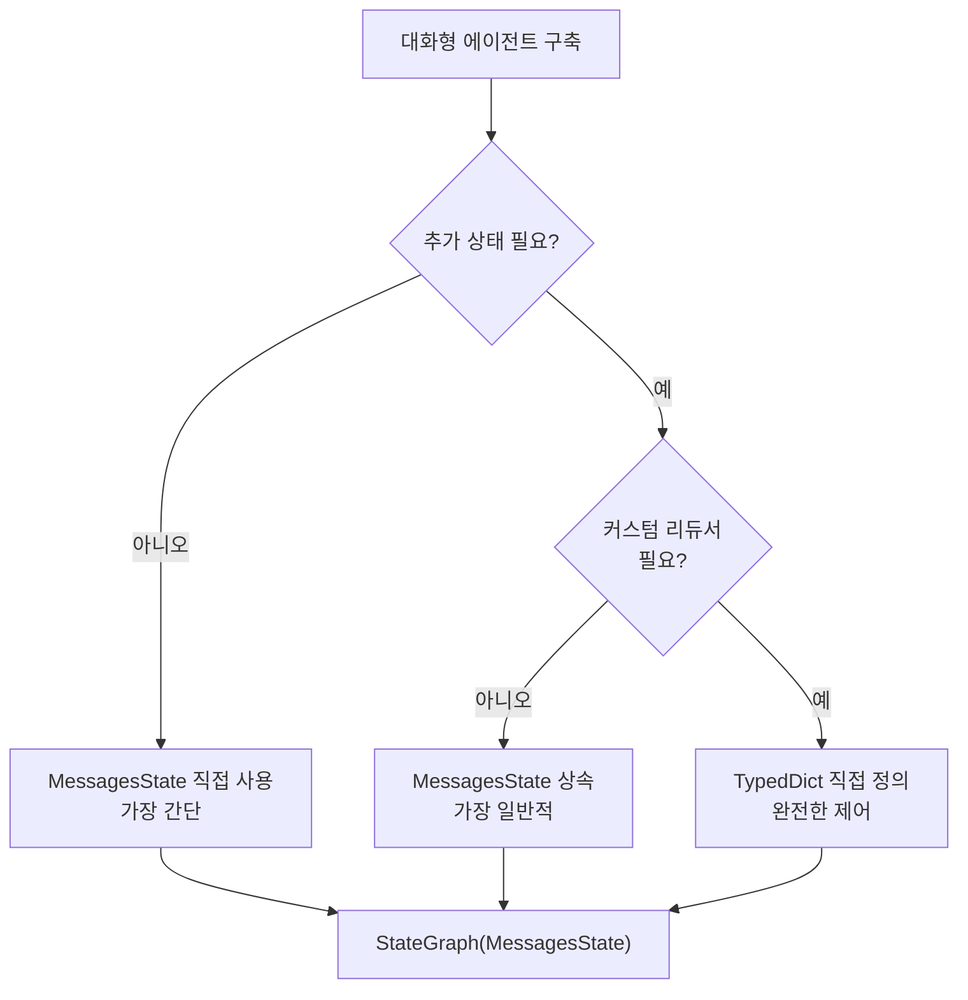
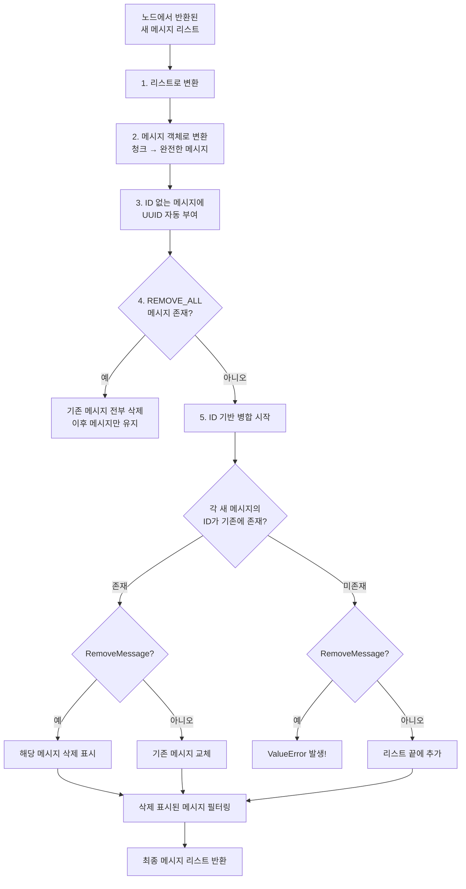
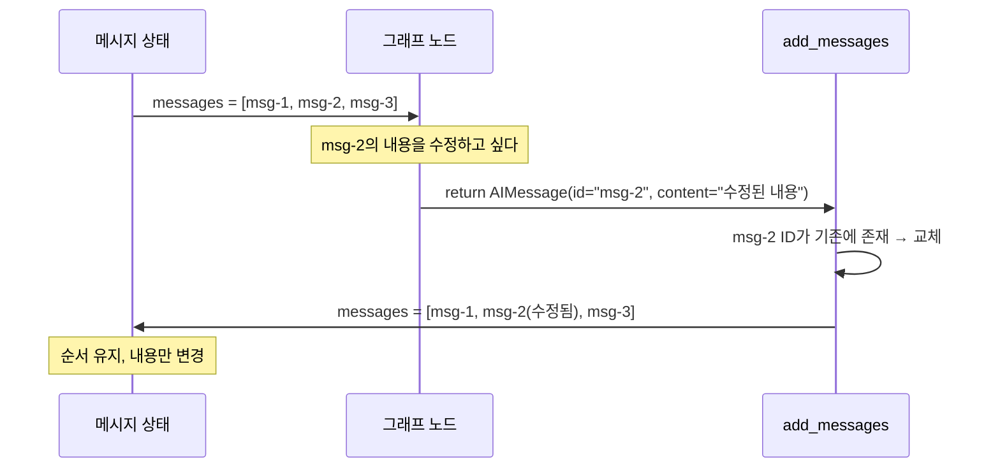
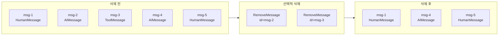
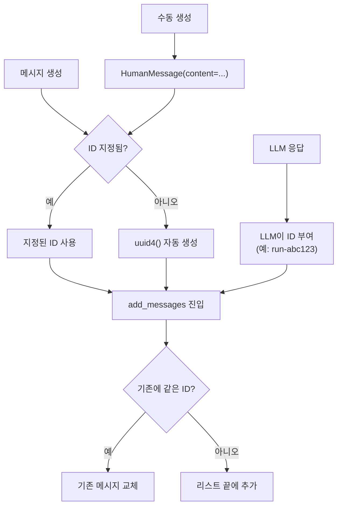

# LangGraph 메시지 상태

> MessagesState와 add_messages 리듀서의 내부 동작을 이해하고, 메시지를 정밀하게 수정·삭제하는 패턴을 마스터합니다.

## 개요

이 섹션에서는 LangGraph가 대화 메시지를 어떻게 관리하는지 그 내부 메커니즘을 깊이 파헤칩니다. [이전 섹션](03-ch3-대화-메모리와-상태-관리/01-01-대화-메모리의-기초.md)에서 `add_messages`와 `MemorySaver`를 처음 사용해봤고, [슬라이딩 윈도우](03-ch3-대화-메모리와-상태-관리/02-02-슬라이딩-윈도우와-토큰-관리.md)에서 `trim_messages`와 `RemoveMessage`로 토큰을 관리했죠. 이번에는 그 아래에서 실제로 무슨 일이 벌어지는지 들여다봅니다.

**선수 지식**: Ch3 세션 1~2의 메모리 전략, `add_messages` 기본 사용법, `RemoveMessage` 기초
**학습 목표**:
- `MessagesState`의 내부 구조와 사용 이점을 설명할 수 있다
- `add_messages` 리듀서의 ID 기반 병합 알고리즘을 이해한다
- 메시지 ID를 활용하여 특정 메시지를 수정(교체)할 수 있다
- `RemoveMessage`와 `REMOVE_ALL_MESSAGES`로 정밀한 삭제를 구현한다

## 왜 알아야 할까?

에이전트가 복잡해질수록 메시지 관리는 단순한 "쌓기"를 넘어섭니다. 잘못된 도구 호출 결과를 교체해야 할 때, 민감한 정보가 담긴 메시지를 즉시 삭제해야 할 때, 또는 에이전트가 자기 응답을 스스로 수정해야 할 때 — 이 모든 상황에서 `add_messages`의 ID 기반 병합 메커니즘을 정확히 알아야 합니다.

실무에서 흔히 마주치는 시나리오를 볼까요?

- **자기 교정(Self-correction)**: 에이전트가 이전 응답을 수정해야 할 때, 같은 ID로 새 메시지를 반환하면 원본이 교체됩니다
- **메모리 정리**: 불필요한 중간 메시지를 삭제하면서도 대화 맥락을 유지해야 합니다
- **보안**: PII(개인식별정보)가 포함된 메시지를 실행 도중에 제거해야 합니다

`MessagesState`를 제대로 이해하면 이 모든 것이 몇 줄의 코드로 해결됩니다.

## 핵심 개념

### 개념 1: MessagesState — 대화를 위한 기성복

> 💡 **비유**: `MessagesState`는 가구점에서 파는 **조립 완료 책장**이에요. `TypedDict`에 `add_messages`를 직접 달아 쓰는 건 IKEA에서 부품을 사서 직접 조립하는 것과 같죠. 결과물은 같지만, 대부분의 대화형 에이전트에서는 이미 완성된 책장이 더 편합니다.

`MessagesState`는 LangGraph가 제공하는 **사전 정의된 상태 스키마**입니다. 내부 구현을 살펴보면 놀랍도록 단순합니다:

```python
# LangGraph 내부 정의 (langgraph/graph/message.py)
from typing import Annotated
from typing_extensions import TypedDict
from langchain_core.messages import AnyMessage
from langgraph.graph.message import add_messages

class MessagesState(TypedDict):
    messages: Annotated[list[AnyMessage], add_messages]
```

딱 한 줄이죠? `messages`라는 키에 `add_messages` 리듀서가 붙어 있습니다. 이게 전부예요.

> 📊 **그림 1**: MessagesState 사용 방식 비교



세 가지 사용 패턴을 코드로 비교해볼까요?

```python
from langgraph.graph import StateGraph, MessagesState
from langgraph.graph.message import add_messages
from langchain_core.messages import AnyMessage
from typing import Annotated
from typing_extensions import TypedDict

# 패턴 1: MessagesState 직접 사용 (메시지만 필요할 때)
graph1 = StateGraph(MessagesState)

# 패턴 2: MessagesState 상속 (추가 필드가 필요할 때) ★ 가장 일반적
class AgentState(MessagesState):
    user_id: str
    context: list[str]
    summary: str

graph2 = StateGraph(AgentState)

# 패턴 3: TypedDict 직접 정의 (format 옵션 등 커스텀 필요할 때)
class CustomState(TypedDict):
    messages: Annotated[list[AnyMessage], add_messages]
    iteration_count: int  # 리듀서 없음 = 덮어쓰기

graph3 = StateGraph(CustomState)
```

패턴 2가 실무에서 가장 많이 쓰입니다. `MessagesState`를 상속하면 `messages` 키와 `add_messages` 리듀서를 공짜로 받으면서, 필요한 필드를 자유롭게 추가할 수 있거든요.

### 개념 2: add_messages 리듀서의 ID 기반 병합

> 💡 **비유**: `add_messages`는 **학생 명단 관리자**와 같습니다. 새 학생(새 ID)이 오면 명단 끝에 추가하고, 이미 등록된 학생(같은 ID)이 정보 변경을 요청하면 기존 정보를 교체합니다. 퇴학 처리(RemoveMessage)를 요청하면 해당 학생을 명단에서 삭제하죠.

`add_messages`는 단순히 리스트에 `append`하는 것이 아닙니다. **메시지 ID를 기준으로 지능적인 병합**을 수행합니다. 내부 알고리즘을 단계별로 살펴보겠습니다:

> 📊 **그림 2**: add_messages 내부 병합 알고리즘



핵심 동작을 표로 정리하면:

| 상황 | 동작 | 예시 |
|------|------|------|
| 새 ID의 메시지 | 리스트 끝에 **추가** | 일반적인 대화 진행 |
| 기존과 같은 ID | 기존 메시지를 **교체** | 자기 교정, 응답 수정 |
| `RemoveMessage` + 기존 ID | 해당 메시지 **삭제** | 선택적 메모리 정리 |
| `RemoveMessage` + 없는 ID | `ValueError` **발생** | 버그 — 방어 코드 필요 |
| ID가 `None` | UUID 자동 생성 후 **추가** | 수동 메시지 생성 시 |

이제 실제 코드로 확인해보겠습니다:

```run:python
from langgraph.graph.message import add_messages
from langchain_core.messages import HumanMessage, AIMessage

# 기존 메시지 리스트 (left)
existing = [
    HumanMessage(content="안녕하세요", id="msg-1"),
    AIMessage(content="안녕하세요! 무엇을 도와드릴까요?", id="msg-2"),
]

# 새 메시지 (right) — 새 ID이므로 추가됨
new_messages = [
    HumanMessage(content="날씨 알려줘", id="msg-3"),
]

result = add_messages(existing, new_messages)
print(f"메시지 수: {len(result)}")
for m in result:
    print(f"  [{m.id}] {m.__class__.__name__}: {m.content}")
```

```output
메시지 수: 3
  [msg-1] HumanMessage: 안녕하세요
  [msg-2] AIMessage: 안녕하세요! 무엇을 도와드릴까요?
  [msg-3] HumanMessage: 날씨 알려줘
```

### 개념 3: 메시지 수정 — 같은 ID로 교체

> 💡 **비유**: 위키피디아 편집을 생각해보세요. 같은 문서 제목(ID)으로 새 내용을 올리면 기존 내용이 **교체**되지, 새 문서가 생기지 않잖아요? `add_messages`도 정확히 같은 방식입니다.

같은 ID를 가진 메시지를 반환하면, 기존 메시지가 **제자리에서(in-place)** 교체됩니다. 이 메커니즘은 에이전트의 자기 교정에 매우 유용합니다:

> 📊 **그림 3**: 메시지 교체 흐름



```run:python
from langgraph.graph.message import add_messages
from langchain_core.messages import HumanMessage, AIMessage

existing = [
    HumanMessage(content="파이썬이 뭐야?", id="msg-1"),
    AIMessage(content="파이썬은 뱀입니다.", id="msg-2"),  # 잘못된 답변!
    HumanMessage(content="프로그래밍 언어 말이야", id="msg-3"),
]

# 같은 ID("msg-2")로 수정된 메시지를 보내면 → 교체
corrected = [
    AIMessage(
        content="파이썬은 범용 프로그래밍 언어입니다. 간결한 문법과 풍부한 생태계가 특징이에요.",
        id="msg-2"  # ← 기존 msg-2와 같은 ID
    ),
]

result = add_messages(existing, corrected)
print(f"메시지 수: {len(result)} (3개 유지 — 교체이지 추가가 아님)")
for m in result:
    print(f"  [{m.id}] {m.content[:50]}")
```

```output
메시지 수: 3 (3개 유지 — 교체이지 추가가 아님)
  [msg-1] 파이썬이 뭐야?
  [msg-2] 파이썬은 범용 프로그래밍 언어입니다. 간결한 문법과 풍부한 생태계가 특징이에요.
  [msg-3] 프로그래밍 언어 말이야
```

이 패턴을 그래프 노드에서 활용하면 **자기 교정 에이전트**를 만들 수 있습니다:

```python
from langchain_core.messages import AIMessage

def self_correct_node(state: AgentState) -> dict:
    """이전 AI 응답이 부적절하면 같은 ID로 교체"""
    last_ai_msg = None
    for msg in reversed(state["messages"]):
        if isinstance(msg, AIMessage):
            last_ai_msg = msg
            break
    
    if last_ai_msg and needs_correction(last_ai_msg.content):
        corrected_content = generate_better_response(state)
        # 같은 ID → add_messages가 기존 메시지를 교체
        return {"messages": [
            AIMessage(content=corrected_content, id=last_ai_msg.id)
        ]}
    return {}
```

### 개념 4: RemoveMessage와 정밀 삭제

앞 섹션에서 `RemoveMessage`를 토큰 관리 용도로 사용했는데, 여기서는 좀 더 정밀한 삭제 패턴을 살펴봅니다.

> 📊 **그림 4**: RemoveMessage 삭제 패턴



**선택적 삭제** — 특정 메시지만 골라서 제거:

```python
from langchain_core.messages import RemoveMessage

def clean_tool_messages(state: AgentState) -> dict:
    """완료된 도구 호출/결과 메시지를 정리"""
    from langchain_core.messages import ToolMessage, AIMessage
    
    to_remove = []
    for msg in state["messages"]:
        # 도구 결과 메시지 삭제
        if isinstance(msg, ToolMessage):
            to_remove.append(RemoveMessage(id=msg.id))
        # tool_calls가 있는 AI 메시지도 삭제
        elif isinstance(msg, AIMessage) and msg.tool_calls:
            to_remove.append(RemoveMessage(id=msg.id))
    
    return {"messages": to_remove} if to_remove else {}
```

**전체 삭제** — `REMOVE_ALL_MESSAGES`로 대화 히스토리를 완전 초기화:

> ⚠️ **버전 참고**: `REMOVE_ALL_MESSAGES`는 LangGraph **v0.2.x 이상**에서 지원됩니다. 그 이전 버전을 사용 중이라면 `ImportError`가 발생하거나 기능이 동작하지 않을 수 있으니, `pip install -U langgraph`로 업데이트하세요.

```python
from langgraph.graph.message import REMOVE_ALL_MESSAGES
from langchain_core.messages import RemoveMessage, SystemMessage

def reset_conversation(state: AgentState) -> dict:
    """대화를 초기화하고 시스템 메시지만 유지"""
    return {"messages": [
        RemoveMessage(id=REMOVE_ALL_MESSAGES),
        SystemMessage(content="새 대화가 시작되었습니다."),
    ]}
```

`REMOVE_ALL_MESSAGES`는 내부적으로 `"__remove_all__"` 문자열입니다. 이 ID를 가진 `RemoveMessage`가 `right`(새 메시지 리스트)에 있으면, 기존 메시지가 모두 삭제되고 그 **뒤에 오는 메시지만** 유지됩니다.

> ⚠️ **흔한 오해**: `RemoveMessage`로 존재하지 않는 ID를 삭제하려 하면 `ValueError`가 발생합니다. 삭제 전에 반드시 해당 ID가 현재 상태에 존재하는지 확인하세요.

### 개념 5: 메시지 ID 자동 부여와 관리

LangGraph에서 메시지 ID가 어떻게 흘러가는지 이해하면 버그를 예방할 수 있습니다.

> 📊 **그림 5**: 메시지 ID 생성과 관리 흐름



```python
from langchain_core.messages import HumanMessage, AIMessage

# ID를 명시적으로 지정 — 교체/삭제에 사용
msg1 = HumanMessage(content="안녕", id="custom-id-001")
print(f"명시 ID: {msg1.id}")  # custom-id-001

# ID 미지정 — add_messages 통과 시 UUID 자동 생성
msg2 = HumanMessage(content="안녕")
print(f"생성 전: {msg2.id}")  # None

# LLM 응답은 대부분 자체 ID를 가짐
ai_msg = AIMessage(content="응답", id="run-abc123")
print(f"LLM ID: {ai_msg.id}")  # run-abc123
```

실무에서 ID를 직접 지정하는 경우는 드물지만, **자기 교정 패턴**이나 **외부 시스템 연동** 시에는 매우 유용합니다.

## 실습: 직접 해보기

지금까지 배운 개념을 종합하여, 메시지를 교체·삭제하는 **자기 교정 에이전트**를 만들어봅시다. 이 에이전트는 답변 후 자체 검증을 수행하고, 문제가 있으면 응답을 교체합니다.

```python
from typing import Annotated, Literal
from typing_extensions import TypedDict
from langchain_core.messages import (
    HumanMessage, AIMessage, SystemMessage, 
    RemoveMessage, AnyMessage,
)
from langgraph.graph import StateGraph, END
from langgraph.graph.message import add_messages, REMOVE_ALL_MESSAGES
from langgraph.checkpoint.memory import MemorySaver


# --- 1. 상태 정의: MessagesState 상속 ---
class AgentState(TypedDict):
    messages: Annotated[list[AnyMessage], add_messages]
    correction_count: int  # 교정 횟수 추적


# --- 2. 노드 함수들 ---
def respond(state: AgentState) -> dict:
    """사용자 질문에 응답 (데모용 하드코딩)"""
    last_msg = state["messages"][-1]
    
    # 데모: 첫 번째 시도에서 일부러 부정확한 답변
    if state.get("correction_count", 0) == 0:
        return {
            "messages": [AIMessage(
                content=f"'{last_msg.content}'에 대한 답변: 파이썬은 1995년에 만들어졌습니다.",
                id="ai-response-main"
            )],
            "correction_count": 0,
        }
    return {}


def verify(state: AgentState) -> dict:
    """AI 응답을 검증"""
    for msg in reversed(state["messages"]):
        if isinstance(msg, AIMessage):
            # 데모: "1995"라는 잘못된 정보 감지
            if "1995" in msg.content:
                return {"messages": [], "correction_count": 1}
            break
    return {"messages": [], "correction_count": 0}


def correct(state: AgentState) -> dict:
    """잘못된 응답을 같은 ID로 교체"""
    for msg in reversed(state["messages"]):
        if isinstance(msg, AIMessage):
            corrected = AIMessage(
                content=msg.content.replace(
                    "1995년에 만들어졌습니다",
                    "1991년 Guido van Rossum이 만들었습니다"
                ),
                id=msg.id  # ★ 같은 ID → 교체!
            )
            return {"messages": [corrected], "correction_count": 0}
    return {}


def route_after_verify(state: AgentState) -> Literal["correct", "__end__"]:
    """검증 결과에 따라 교정 또는 종료"""
    if state.get("correction_count", 0) > 0:
        return "correct"
    return END


# --- 3. 그래프 구성 ---
builder = StateGraph(AgentState)
builder.add_node("respond", respond)
builder.add_node("verify", verify)
builder.add_node("correct", correct)

builder.set_entry_point("respond")
builder.add_edge("respond", "verify")
builder.add_conditional_edges("verify", route_after_verify)
builder.add_edge("correct", END)

memory = MemorySaver()
graph = builder.compile(checkpointer=memory)

# --- 4. 실행 ---
config = {"configurable": {"thread_id": "demo-correction"}}
result = graph.invoke(
    {
        "messages": [HumanMessage(content="파이썬은 언제 만들어졌나요?")],
        "correction_count": 0,
    },
    config=config,
)

print("=== 최종 결과 ===")
for msg in result["messages"]:
    role = msg.__class__.__name__.replace("Message", "")
    print(f"[{role}] {msg.content}")
    print(f"       ID: {msg.id}")
```

이 코드의 핵심은 `correct` 노드에서 **기존 AI 메시지와 같은 ID**로 새 메시지를 반환하는 부분입니다. `add_messages`가 ID 매칭을 통해 기존 응답을 교체하므로, 최종 결과에는 수정된 답변만 남습니다.

## 더 깊이 알아보기

### add_messages의 탄생 배경

LangGraph 초기 버전에서는 상태의 `messages` 필드도 다른 필드처럼 **덮어쓰기** 방식이었습니다. 그런데 이게 에이전트 개발에서 엄청난 불편을 초래했죠. 모든 노드가 전체 메시지 히스토리를 받아서, 새 메시지를 추가하고, 전체 리스트를 다시 반환해야 했습니다. 노드 하나가 실수로 이전 메시지를 빠뜨리면 대화 히스토리가 통째로 사라지는 사고가 빈번했고요.

LangChain 팀은 이 문제를 **리듀서(Reducer)** 개념으로 해결했습니다. Google의 Pregel 모델에서 영감을 받은 것인데요, 분산 그래프 컴퓨팅에서 각 노드가 부분 결과만 보내면 프레임워크가 합쳐주는 것처럼, LangGraph에서도 노드가 **새 메시지만** 반환하면 `add_messages`가 기존 리스트와 병합해줍니다.

재미있는 점은 `add_messages`의 ID 기반 교체 기능이 처음부터 계획된 것은 아니었다는 것입니다. 초기에는 단순 `append`만 했는데, 사용자들이 GitHub Issue에서 "에이전트가 자기 응답을 수정할 수 있어야 한다"는 요구를 많이 보내면서 ID 기반 병합이 추가되었습니다. `REMOVE_ALL_MESSAGES`도 비교적 최근(2024년 하반기)에 추가된 기능으로, LangGraph v0.2.x부터 도입되어 대화 초기화 요구에 대응한 것입니다.

### format 파라미터의 의미

`add_messages`에는 잘 알려지지 않은 `format` 파라미터가 있습니다:

```python
class OpenAIState(TypedDict):
    messages: Annotated[list, add_messages(format="langchain-openai")]
```

`format="langchain-openai"`를 지정하면 메시지가 OpenAI의 멀티모달 형식(text, image_url 블록)으로 자동 변환됩니다. 이미지가 포함된 멀티모달 대화를 만들 때 유용하죠. 다만 이 기능은 `langchain-core>=0.3.11`이 필요합니다.

## 흔한 오해와 팁

> ⚠️ **흔한 오해**: "MessagesState와 직접 TypedDict를 정의하는 것은 성능 차이가 있다?" — 전혀 없습니다. `MessagesState`는 단순한 `TypedDict` 서브클래스일 뿐이고, 런타임에 아무런 추가 오버헤드가 없습니다. 차이는 순전히 편의성과 코드 가독성입니다.

> 💡 **알고 계셨나요?**: `add_messages`는 LangChain의 스트리밍 청크(`AIMessageChunk`)도 자동으로 완전한 `AIMessage`로 변환합니다. 내부적으로 `message_chunk_to_message()` 함수가 호출되거든요. 그래서 스트리밍 노드의 출력을 별도 처리 없이 바로 상태에 넣을 수 있습니다.

> 🔥 **실무 팁**: `RemoveMessage`로 도구 호출 메시지를 삭제할 때는 **쌍(pair)**으로 삭제하세요. `tool_calls`가 있는 `AIMessage`만 삭제하고 대응하는 `ToolMessage`를 남기면, OpenAI 등 일부 LLM 프로바이더가 "tool result without tool call" 에러를 던집니다. 반드시 `AIMessage(tool_calls=...)` + `ToolMessage(tool_call_id=...)` 세트로 삭제하세요.

> 🔥 **실무 팁**: 서브그래프에서 `RemoveMessage`를 사용할 때 주의하세요. 서브그래프의 상태에서 메시지를 삭제하더라도, 부모 그래프의 상태에는 여전히 남아 있을 수 있습니다. 메시지 정리 로직은 가능하면 **최상위 그래프**에서 수행하는 것이 안전합니다.

## 핵심 정리

| 개념 | 설명 |
|------|------|
| `MessagesState` | `messages` 키 + `add_messages` 리듀서가 사전 정의된 TypedDict. 상속하여 필드 추가 가능 |
| `add_messages` | ID 기반 병합 리듀서. 새 ID → 추가, 같은 ID → 교체, RemoveMessage → 삭제 |
| 메시지 ID 자동 부여 | `id=None`이면 `uuid4()`가 자동 생성. LLM 응답은 자체 ID 보유 |
| 메시지 교체 | 같은 `id`로 새 메시지를 반환하면 기존 메시지가 제자리에서 교체됨 |
| `RemoveMessage` | 특정 ID의 메시지를 삭제. 존재하지 않는 ID 지정 시 `ValueError` |
| `REMOVE_ALL_MESSAGES` | `"__remove_all__"` — 전체 메시지 삭제 후 이후 메시지만 유지 (v0.2.x+) |
| `format` 파라미터 | `"langchain-openai"` 지정 시 멀티모달 형식 자동 변환 |
| 도구 메시지 쌍 삭제 | `AIMessage(tool_calls)` + `ToolMessage` 반드시 세트로 삭제 |

## 다음 섹션 미리보기

지금까지 대화 메시지의 **구조와 관리**를 깊이 살펴봤습니다. 하지만 메시지 히스토리만으로는 에이전트가 진정한 "기억"을 가졌다고 할 수 없죠. 다음 섹션 [04. 장기 메모리 구현](03-ch3-대화-메모리와-상태-관리/04-04-장기-메모리-구현.md)에서는 대화가 끝나도 사라지지 않는 **장기 메모리(Long-term Memory)**를 구현합니다. LangGraph의 `Store` API와 `NamespacedMemory`를 활용하여, 사용자 선호도나 학습된 정보를 영속적으로 저장하고 검색하는 방법을 배울 거예요.

## 참고 자료

- [LangGraph Graph API 개요 — MessagesState 공식 문서](https://docs.langchain.com/oss/python/langgraph/graph-api) - MessagesState와 add_messages의 공식 레퍼런스
- [LangGraph 메모리 가이드 — 메시지 삭제](https://docs.langchain.com/oss/python/langgraph/add-memory) - RemoveMessage와 메모리 관리 공식 How-to 가이드
- [LangGraph message.py 소스 코드](https://github.com/langchain-ai/langgraph/blob/main/libs/langgraph/langgraph/graph/message.py) - add_messages와 MessagesState의 실제 구현 코드
- [LangGraph 101 튜토리얼 노트북](https://github.com/langchain-ai/langgraph-101) - LangGraph 핵심 개념 실습 노트북
- [LangGraph Concepts: Low Level](https://github.com/langchain-ai/langgraph/blob/main/docs/docs/concepts/low_level.md) - 리듀서, 상태 관리 등 저수준 개념 상세 문서

---
### 🔗 Related Sessions
- [stategraph](04-ch4-langgraph-stategraph-기초/01-01-langgraph-아키텍처-개관.md) (prerequisite)
- [add_messages](03-ch3-대화-메모리와-상태-관리/01-01-대화-메모리의-기초.md) (prerequisite)
- [memorysaver](03-ch3-대화-메모리와-상태-관리/01-01-대화-메모리의-기초.md) (prerequisite)
- [trim_messages](03-ch3-대화-메모리와-상태-관리/01-01-대화-메모리의-기초.md) (prerequisite)
- [removemessage](03-ch3-대화-메모리와-상태-관리/01-01-대화-메모리의-기초.md) (prerequisite)
