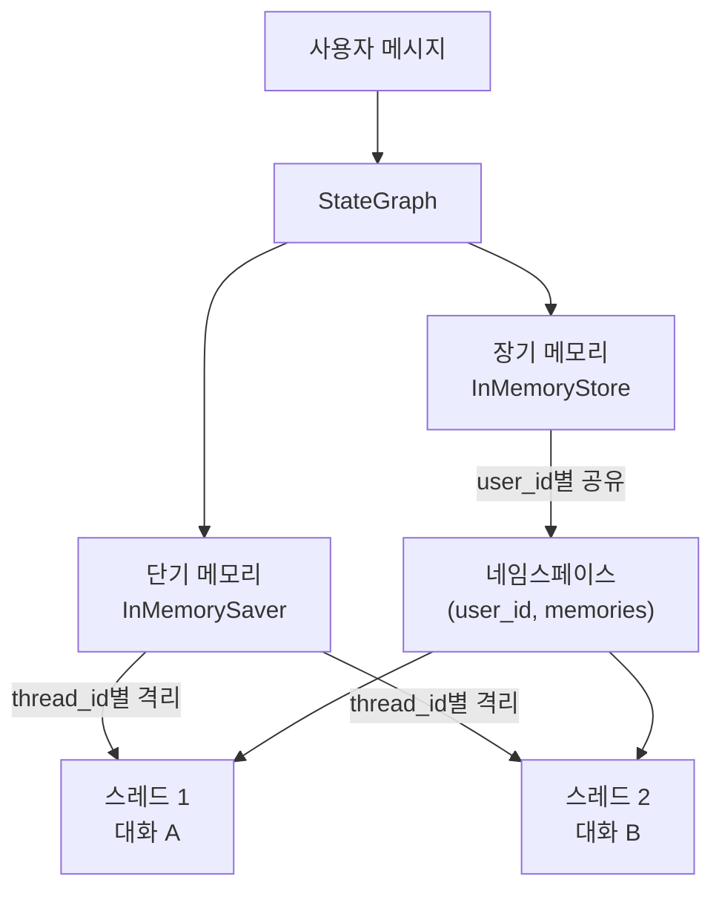
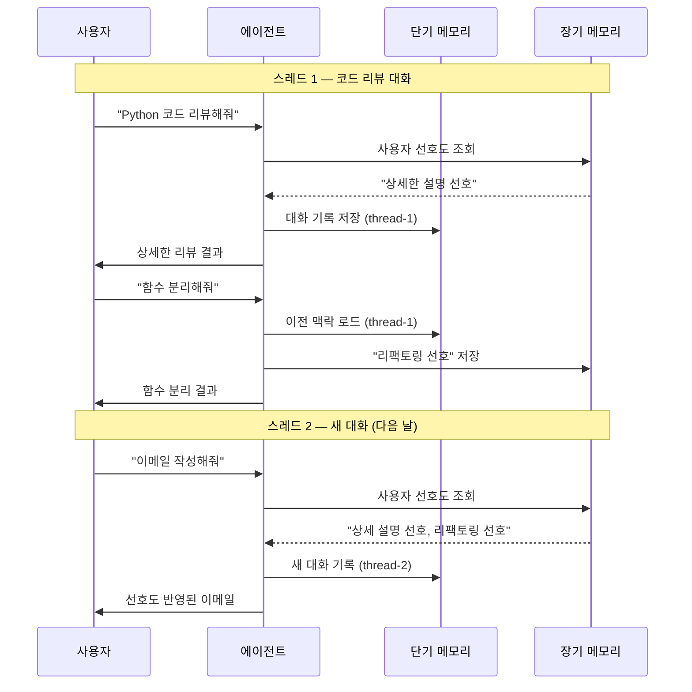
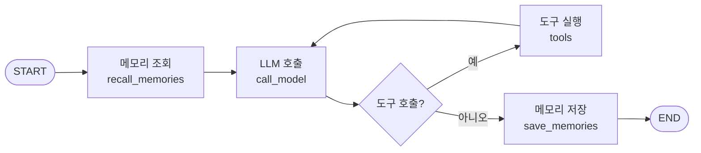
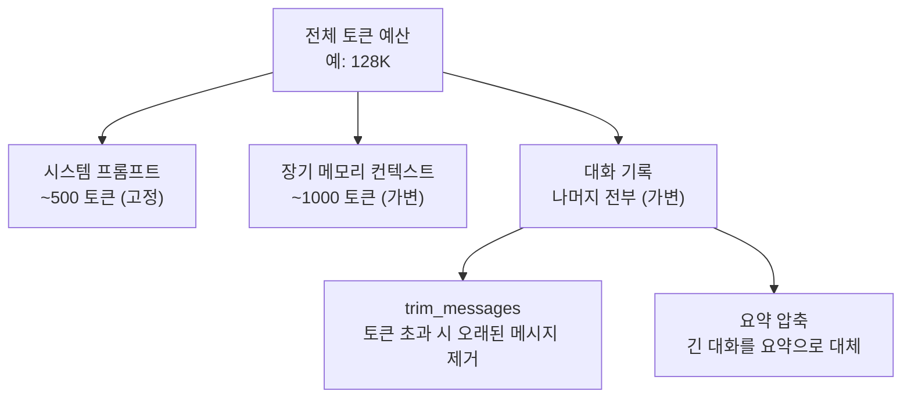

# 멀티턴 에이전트 실습

> 단기 메모리와 장기 메모리를 통합하여, 대화를 기억하고 사용자를 학습하는 완전한 멀티턴 에이전트를 구축합니다.

## 개요

이 섹션에서는 Ch3 전체에서 배운 메모리 기법들을 하나로 합칩니다. 버퍼/윈도우 메모리로 현재 대화를 관리하고, Store API로 사용자 선호도를 영구 저장하며, 세션(스레드) 전환까지 자연스럽게 처리하는 **완전한 멀티턴 에이전트**를 만들어 보겠습니다.

**선수 지식**:
- [대화 메모리의 기초](03-ch3-대화-메모리와-상태-관리/01-01-대화-메모리의-기초.md)에서 배운 MemorySaver와 add_messages
- [슬라이딩 윈도우와 토큰 관리](03-ch3-대화-메모리와-상태-관리/02-02-슬라이딩-윈도우와-토큰-관리.md)에서 배운 trim_messages와 요약 압축
- [LangGraph 메시지 상태](03-ch3-대화-메모리와-상태-관리/03-03-langgraph-메시지-상태.md)에서 배운 MessagesState와 ID 기반 병합
- [장기 메모리 구현](03-ch3-대화-메모리와-상태-관리/04-04-장기-메모리-구현.md)에서 배운 Store API와 의미 검색

**학습 목표**:
- 단기 메모리(체크포인터)와 장기 메모리(Store)를 하나의 그래프에 통합할 수 있다
- thread_id 기반 세션 관리로 독립적인 대화를 운영할 수 있다
- 대화에서 사용자 선호도를 자동 추출하고 장기 기억에 저장할 수 있다
- 토큰 예산 내에서 메모리를 효율적으로 관리하는 전략을 설계할 수 있다

## 왜 알아야 할까?

ChatGPT에게 "나 매운 거 좋아해"라고 말한 적이 있나요? 다음 대화에서도 기억하고 있으면 놀랍고, 까먹으면 실망스럽죠. 사실 이 차이가 "대화형 AI"와 "진짜 AI 비서"를 가르는 핵심입니다.

실전에서 사용자는 한 번의 대화로 끝나지 않습니다. 어떤 날은 코드 리뷰를 요청하고, 다음 날은 이메일 작성을 부탁하죠. **멀티턴 에이전트**는 이런 연속적인 상호작용을 매끄럽게 처리합니다. 현재 대화의 맥락을 놓치지 않으면서도(단기 메모리), 지난 대화에서 배운 선호도를 반영하는(장기 메모리) 에이전트 — 이것이 프로덕션 에이전트의 최소 조건이거든요.

이 섹션은 Ch3의 **졸업 프로젝트**입니다. 지금까지 배운 모든 퍼즐 조각을 맞추는 시간이에요.

## 핵심 개념

### 개념 1: 듀얼 메모리 아키텍처

> 💡 **비유**: 카페 단골을 떠올려 보세요. 바리스타는 오늘 대화 내용(단기 메모리)도 기억하지만, "이 손님은 항상 아이스 아메리카노에 시럽 빼달라고 하지"라는 장기 기억도 갖고 있습니다. 두 종류의 기억이 합쳐져야 진짜 "단골 대응"이 가능한 거죠.

멀티턴 에이전트의 핵심은 **두 개의 메모리 레이어**를 하나의 그래프에서 동시에 운영하는 것입니다.

| 메모리 종류 | 저장 범위 | LangGraph 구현 | 용도 |
|------------|----------|---------------|------|
| 단기 메모리 | 현재 스레드(대화) | `InMemorySaver` (체크포인터) | 대화 맥락 유지 |
| 장기 메모리 | 모든 스레드(사용자 전체) | `InMemoryStore` (Store API) | 선호도, 학습 내용 |

이 두 레이어는 `compile()` 한 번으로 동시에 주입됩니다:

```python
graph = builder.compile(
    checkpointer=checkpointer,  # 단기 메모리
    store=store,                # 장기 메모리
)
```

> 📊 **그림 1**: 듀얼 메모리 아키텍처 — 단기·장기 메모리의 역할 분담



단기 메모리는 `thread_id`로 격리되어 각 대화가 독립적으로 운영되고, 장기 메모리는 `user_id` 네임스페이스를 통해 **모든 스레드에서 공유**됩니다. 스레드 1에서 배운 사용자 정보가 스레드 2에서도 참조되는 거죠.

### 개념 2: 세션 관리와 스레드 전략

> 💡 **비유**: 병원 차트를 생각해보세요. 매번 진료(스레드)마다 새 진료 기록이 만들어지지만, 환자의 기본 정보와 병력(장기 메모리)은 모든 진료에서 참조됩니다.

멀티턴 에이전트에서 **세션**이란 하나의 `thread_id`로 묶인 연속 대화입니다. 세션 관리 전략은 두 가지 질문에 답해야 합니다:

1. **언제 새 스레드를 만들까?** — 주제가 바뀔 때, 시간이 많이 지났을 때, 사용자가 명시적으로 요청할 때
2. **스레드 간에 무엇을 공유할까?** — 사용자 프로필, 선호도, 학습된 패턴

> 📊 **그림 2**: 세션(스레드) 생명주기와 메모리 흐름



코드에서는 `config`의 `thread_id`를 바꾸는 것만으로 새 세션이 시작됩니다:

```python
# 세션 1: 코드 리뷰 대화
config_session1 = {"configurable": {"thread_id": "review-2026-03-19"}}
graph.invoke({"messages": [HumanMessage("코드 리뷰해줘")]}, config_session1)

# 세션 2: 완전히 새로운 대화 (장기 메모리는 공유)
config_session2 = {"configurable": {"thread_id": "email-2026-03-20"}}
graph.invoke({"messages": [HumanMessage("이메일 써줘")]}, config_session2)
```

### 개념 3: 자동 선호도 추출과 메모리 학습

> 💡 **비유**: 좋은 비서는 상사가 "이건 기억해둬"라고 말하지 않아도, 반복되는 패턴을 알아서 메모합니다. "이 분은 회의 전에 항상 커피를 드시는구나" 하고요. 우리 에이전트도 대화에서 선호도를 **자동으로** 감지하고 저장해야 합니다.

선호도 자동 추출은 별도의 **메모리 관리 노드**를 만들어 처리합니다. 이 노드는 대화 내용을 분석해서 저장할 만한 정보가 있는지 판단하고, 있으면 Store에 기록합니다.

> 📊 **그림 3**: 메모리 관리 노드가 포함된 에이전트 그래프 구조



핵심 아이디어는 그래프의 **입구에서 장기 메모리를 조회**하고, **출구에서 새로운 정보를 저장**하는 것입니다. 이렇게 하면 매 턴마다 사용자 정보가 자연스럽게 축적되죠.

```python
# 메모리 저장 노드의 핵심 로직
def save_memories(state: AgentState, store: BaseStore):
    """대화에서 기억할 만한 정보를 추출하여 저장"""
    # LLM에게 대화 분석 요청
    response = model.invoke([
        SystemMessage("대화에서 사용자의 선호도, 이름, 관심사 등을 추출하세요."),
        *state["messages"][-5:]  # 최근 5개 메시지만 분석
    ])

    # 추출된 정보가 있으면 Store에 저장
    if extracted_info:
        namespace = (state["user_id"], "preferences")
        store.put(namespace, str(uuid4()), {"data": extracted_info})
```

여기서 key로 `uuid4()`를 사용하는 점에 주목하세요. 이전 섹션 [장기 메모리 구현](03-ch3-대화-메모리와-상태-관리/04-04-장기-메모리-구현.md)에서는 `store.put(namespace, "food_preference", value)`처럼 **고정 키**를 사용했는데요, 고정 키 패턴은 같은 키에 `put()`하면 기존 값을 덮어쓰는 **upsert 방식**입니다. 반면 `uuid4()`는 호출할 때마다 새 키를 생성하므로 매번 새 항목이 추가되는 **append-only 방식**이에요. 이 실습에서 append-only를 선택한 이유는, LLM이 추출하는 정보가 "이름: 제이슨", "음식: 매운 음식"처럼 다양한 종류이기 때문입니다. 고정 키를 쓰려면 카테고리별로 미리 키를 정해야 하는데, 자동 추출 시나리오에서는 어떤 정보가 나올지 예측하기 어렵거든요. 다만 append-only의 단점은 "매운 음식 좋아해"를 두 번 말하면 동일 정보가 중복 저장될 수 있다는 점입니다. 이 문제는 아래 "흔한 오해와 팁"에서 중복 방지 전략으로 다시 다루겠습니다.

### 개념 4: 토큰 예산 관리 전략

> 💡 **비유**: 여행 가방에 짐을 싸는 것과 비슷합니다. 가방 크기(토큰 한도)는 정해져 있으니, 꼭 필요한 것(시스템 메시지, 장기 메모리)을 먼저 넣고, 남은 공간에 옷(대화 기록)을 채우는 거죠.

멀티턴 에이전트에서 토큰 예산은 여러 소스가 경쟁합니다:

> 📊 **그림 4**: 토큰 예산 분배 전략



실전에서는 **토큰 예산을 계층적으로 할당**합니다:

```python
TOTAL_BUDGET = 120_000      # 전체 예산
SYSTEM_RESERVE = 1_000      # 시스템 프롬프트
MEMORY_RESERVE = 2_000      # 장기 메모리
RESPONSE_RESERVE = 4_000    # 응답 생성용
CONVERSATION_BUDGET = (     # 대화 기록에 쓸 수 있는 나머지
    TOTAL_BUDGET - SYSTEM_RESERVE - MEMORY_RESERVE - RESPONSE_RESERVE
)
```

## 실습: 직접 해보기

이제 Ch3에서 배운 모든 기법을 통합하여 **개인 비서 에이전트**를 만들어 봅시다. 이 에이전트는:

1. 현재 대화 맥락을 유지하고 (단기 메모리)
2. 사용자의 이름, 선호도를 기억하며 (장기 메모리)
3. 토큰 한도를 초과하지 않도록 관리하고 (trim_messages)
4. 세션을 전환해도 사용자를 기억합니다 (크로스 스레드)

### Step 1: 의존성과 상태 정의

```python
import uuid
from typing import Annotated

from langchain_core.messages import (
    AnyMessage, SystemMessage, HumanMessage, AIMessage
)
from langchain_core.messages.utils import (
    trim_messages, count_tokens_approximately
)
from langchain_openai import ChatOpenAI
from langgraph.graph import StateGraph, START, END
from langgraph.graph.message import add_messages
from langgraph.checkpoint.memory import InMemorySaver
from langgraph.store.memory import InMemoryStore
from langgraph.store.base import BaseStore

from typing import TypedDict


# --- 상태 스키마 ---
class AgentState(TypedDict):
    """에이전트의 전체 상태"""
    messages: Annotated[list[AnyMessage], add_messages]  # 대화 기록
    user_id: str                                          # 사용자 식별자
    memory_context: str                                   # 장기 메모리 요약


# --- LLM 초기화 ---
model = ChatOpenAI(model="gpt-4o-mini", temperature=0.7)
```

### Step 2: 메모리 조회 노드

```python
def recall_memories(state: AgentState, store: BaseStore) -> dict:
    """장기 메모리에서 사용자 정보를 조회하여 컨텍스트에 추가"""
    user_id = state.get("user_id", "anonymous")
    namespace = (user_id, "preferences")

    # 최근 메시지를 쿼리로 사용하여 의미 검색
    last_message = state["messages"][-1].content
    memories = store.search(namespace, query=last_message, limit=5)

    # 메모리를 자연어 컨텍스트로 변환
    if memories:
        memory_text = "\n".join(
            f"- {item.value['data']}" for item in memories
        )
        context = f"[사용자에 대해 기억하는 정보]\n{memory_text}"
    else:
        context = "[아직 사용자에 대해 알려진 정보가 없습니다]"

    return {"memory_context": context}
```

### Step 3: LLM 호출 노드 (토큰 관리 포함)

```python
# 토큰 예산 상수
MAX_CONVERSATION_TOKENS = 4000

def call_model(state: AgentState) -> dict:
    """장기 메모리 컨텍스트를 시스템 프롬프트에 주입하고, 토큰 관리 후 LLM 호출"""
    # 1. 시스템 프롬프트 구성 — 장기 메모리 포함
    system_prompt = f"""당신은 친절한 개인 비서입니다.
사용자의 이름, 선호도, 관심사를 기억하고 대화에 반영하세요.
이전에 기억한 정보가 있다면 자연스럽게 활용하세요.

{state.get('memory_context', '')}
"""

    # 2. trim_messages로 대화 기록 압축
    trimmed = trim_messages(
        state["messages"],
        strategy="last",
        token_counter=count_tokens_approximately,
        max_tokens=MAX_CONVERSATION_TOKENS,
        start_on="human",          # 항상 사람 메시지로 시작
        include_system=False,      # 시스템 메시지는 별도 관리
    )

    # 3. LLM 호출
    all_messages = [SystemMessage(content=system_prompt)] + trimmed
    response = model.invoke(all_messages)

    return {"messages": [response]}
```

### Step 4: 메모리 저장 노드

```python
# 메모리 추출용 경량 모델
extractor_model = ChatOpenAI(model="gpt-4o-mini", temperature=0)

def save_memories(state: AgentState, store: BaseStore) -> dict:
    """대화에서 기억할 만한 정보를 자동 추출하여 장기 메모리에 저장"""
    user_id = state.get("user_id", "anonymous")
    namespace = (user_id, "preferences")

    # 최근 대화만 분석 (토큰 절약)
    recent_messages = state["messages"][-4:]

    extraction_prompt = """아래 대화에서 사용자에 대해 기억할 만한 정보를 추출하세요.
이름, 선호도, 관심사, 직업, 습관 등 향후 대화에 유용한 정보만 추출합니다.
기억할 정보가 없으면 "NONE"이라고만 답하세요.
기억할 정보가 있으면 한 줄씩 나열하세요. (항목당 한 줄)"""

    response = extractor_model.invoke(
        [SystemMessage(content=extraction_prompt)] + recent_messages
    )

    # "NONE"이 아니면 각 줄을 별도 메모리로 저장
    extracted = response.content.strip()
    if extracted and extracted.upper() != "NONE":
        for line in extracted.split("\n"):
            line = line.strip().lstrip("- ")
            if line:
                # append-only 패턴: 매번 새 UUID 키로 저장
                store.put(
                    namespace,
                    str(uuid.uuid4()),
                    {"data": line},
                )

    return {}  # 상태 변경 없음 — Store에만 기록
```

여기서 `str(uuid.uuid4())`를 키로 사용하는 이유를 짚고 넘어가겠습니다. [장기 메모리 구현](03-ch3-대화-메모리와-상태-관리/04-04-장기-메모리-구현.md)에서 다뤘던 고정 키 패턴(예: `store.put(namespace, "food_preference", value)`)은 같은 키에 덮어쓰는 **upsert** 방식이라 "최신 값 하나"만 유지하기에 좋았습니다. 반면 여기서 쓰는 `uuid4()` 패턴은 호출할 때마다 고유한 키가 생성되므로, 추출된 정보가 **이력처럼 쌓이는 append-only** 방식입니다. 자동 추출 시나리오에서는 "이름", "직업", "음식 선호" 등 종류를 미리 알 수 없기 때문에 append-only가 구현이 간편하죠. 트레이드오프는 명확합니다 — 사용자가 "매운 거 좋아해"를 여러 번 말하면 동일 정보가 중복 저장될 수 있어요. 프로덕션에서는 저장 전에 `store.search()`로 유사 항목을 확인하고, 이미 있으면 해당 key로 `put()`하여 업데이트하는 하이브리드 전략을 사용합니다 (아래 실무 팁 참고).

### Step 5: 그래프 조립과 실행

```python
def build_assistant_graph():
    """듀얼 메모리 개인 비서 그래프 구성"""
    builder = StateGraph(AgentState)

    # 노드 등록
    builder.add_node("recall_memories", recall_memories)
    builder.add_node("call_model", call_model)
    builder.add_node("save_memories", save_memories)

    # 엣지 연결: 조회 → LLM → 저장
    builder.add_edge(START, "recall_memories")
    builder.add_edge("recall_memories", "call_model")
    builder.add_edge("call_model", "save_memories")
    builder.add_edge("save_memories", END)

    # 듀얼 메모리 주입
    checkpointer = InMemorySaver()     # 단기: 스레드별 대화
    store = InMemoryStore(             # 장기: 의미 검색 지원
        index={
            "embed": embed_fn,         # 임베딩 함수 (아래 정의)
            "dims": 1536,
        }
    )

    return builder.compile(
        checkpointer=checkpointer,
        store=store,
    )
```

임베딩 함수는 OpenAI의 임베딩 모델을 사용합니다:

```python
from langchain_openai import OpenAIEmbeddings

_embeddings = OpenAIEmbeddings(model="text-embedding-3-small")

def embed_fn(texts: list[str]) -> list[list[float]]:
    """InMemoryStore의 의미 검색용 임베딩 함수"""
    return _embeddings.embed_documents(texts)
```

### Step 6: 멀티턴 대화 시나리오 실행

이제 만든 에이전트를 실제로 돌려봅시다. 두 개의 스레드에 걸친 대화를 시뮬레이션합니다.

```run:python
# --- 실행 시나리오 ---
graph = build_assistant_graph()

# ===== 세션 1: 자기소개 대화 =====
config1 = {"configurable": {"thread_id": "session-morning"}}
user_id = "user-jason"

# 턴 1
result = graph.invoke(
    {
        "messages": [HumanMessage("안녕! 나는 제이슨이야. 백엔드 개발자인데 요즘 AI에 관심이 많아.")],
        "user_id": user_id,
    },
    config1,
)
print("=== 세션 1, 턴 1 ===")
print(f"AI: {result['messages'][-1].content[:100]}...")

# 턴 2
result = graph.invoke(
    {
        "messages": [HumanMessage("참, 나는 Python이 제일 편하고, 매운 음식을 좋아해.")],
        "user_id": user_id,
    },
    config1,
)
print("\n=== 세션 1, 턴 2 ===")
print(f"AI: {result['messages'][-1].content[:100]}...")

# ===== 세션 2: 완전히 새로운 대화 =====
config2 = {"configurable": {"thread_id": "session-afternoon"}}

result = graph.invoke(
    {
        "messages": [HumanMessage("오늘 점심 뭐 먹을까?")],
        "user_id": user_id,  # 같은 사용자
    },
    config2,  # 다른 스레드!
)
print("\n=== 세션 2 (새 스레드) ===")
print(f"AI: {result['messages'][-1].content[:100]}...")
print("\n→ 세션 2에서도 '제이슨', '매운 음식' 등 장기 메모리가 반영됩니다!")
```

```output
=== 세션 1, 턴 1 ===
AI: 안녕하세요, 제이슨님! 반갑습니다 😊 백엔드 개발자시면서 AI에 관심이 많으시군요. 요즘 AI 에이전트 쪽이 정말 뜨거운데...

=== 세션 1, 턴 2 ===
AI: Python 개발자시군요! AI 쪽 작업하시기에 딱 좋은 언어죠. 매운 음식 좋아하시는 것도 기억해둘게요. 혹시 점심 추천이 필요하시면...

=== 세션 2 (새 스레드) ===
AI: 제이슨님, 점심 고민이시군요! 매운 음식 좋아하신다고 하셨으니, 마라탕이나 불닭볶음면 어떠세요? 개발하면서 먹기 좋은 간편식도...

→ 세션 2에서도 '제이슨', '매운 음식' 등 장기 메모리가 반영됩니다!
```

세션 1에서 배운 "제이슨", "매운 음식" 정보가 **완전히 새로운 세션 2**에서도 활용되는 것을 확인할 수 있습니다. 이것이 크로스 스레드 장기 메모리의 힘이에요!

### Step 7: 메모리 상태 확인 유틸리티

프로덕션에서는 저장된 메모리를 확인하고 관리하는 기능이 필요합니다:

```run:python
# 장기 메모리에 저장된 내용 확인
namespace = ("user-jason", "preferences")
all_memories = store.search(namespace, query="", limit=20)

print("=== 저장된 장기 메모리 ===")
for i, item in enumerate(all_memories, 1):
    print(f"  {i}. {item.value['data']}")
    print(f"     (key: {item.key[:8]}...)")
```

```output
=== 저장된 장기 메모리 ===
  1. 이름: 제이슨
     (key: a3f2b1c4...)
  2. 직업: 백엔드 개발자
     (key: d7e8f9a0...)
  3. 관심사: AI
     (key: b2c3d4e5...)
  4. 선호 언어: Python
     (key: f6a7b8c9...)
  5. 음식 선호: 매운 음식
     (key: e1d2c3b4...)
```

## 더 깊이 알아보기

### 대화 메모리의 역사: ELIZA에서 MemGPT까지

대화형 AI의 메모리 문제는 생각보다 오래된 주제입니다. 1966년 MIT의 Joseph Weizenbaum이 만든 **ELIZA**는 최초의 대화형 프로그램이었는데, 메모리가 전혀 없었습니다. 매 턴이 독립적이라 "방금 뭐라고 했지?"가 불가능했죠. 놀랍게도 이런 한계에도 불구하고 많은 사용자가 ELIZA에게 감정적 유대를 느꼈다고 합니다.

50년이 지나 2023년, UC Berkeley 연구팀이 발표한 **MemGPT** 논문은 운영체제의 가상 메모리(Virtual Memory) 개념을 LLM에 적용했습니다. 컨텍스트 윈도우를 "메인 메모리", 외부 저장소를 "디스크"로 보고, 에이전트가 스스로 메모리를 관리(페이징)하게 한 거죠. 이 아이디어는 LangGraph의 Store API 설계에도 영향을 주었습니다 — 에이전트가 명시적으로 `put`/`search`를 호출하여 자신의 장기 메모리를 관리하는 패턴이 바로 그것입니다.

### LangGraph의 Runtime 패턴 (최신 동향)

LangGraph 최신 버전에서는 `store: BaseStore`를 노드 파라미터로 받는 패턴 외에, `Runtime` 객체를 통해 store와 config를 통합 접근하는 새로운 패턴도 등장했습니다:

```python
from dataclasses import dataclass
from langgraph.runtime import Runtime

@dataclass
class Context:
    user_id: str

async def call_model(state: MessagesState, runtime: Runtime[Context]):
    user_id = runtime.context.user_id
    memories = await runtime.store.asearch(
        (user_id, "memories"), query="...", limit=3
    )
    # ...

builder = StateGraph(MessagesState, context_schema=Context)
graph = builder.compile(checkpointer=checkpointer, store=store)
graph.invoke(input, config, context=Context(user_id="user-1"))
```

이 패턴은 타입 안전성이 더 좋고, `context_schema`를 통해 필요한 런타임 정보를 명시적으로 선언할 수 있습니다. 프로덕션 환경에서 점점 더 권장되는 추세이니 눈여겨 두세요.

## 흔한 오해와 팁

> ⚠️ **흔한 오해**: "MemorySaver만 있으면 장기 메모리도 되는 거 아니야?"
>
> 아닙니다! `MemorySaver`(체크포인터)는 **스레드 단위**로 격리됩니다. `thread_id`가 다르면 완전히 별개의 대화예요. 스레드를 넘어 정보를 공유하려면 반드시 **Store API**가 필요합니다. 체크포인터 = 대화별 기억, Store = 사용자별 기억으로 구분하세요.

> 💡 **알고 계셨나요?**: ChatGPT의 "Memory" 기능(2024년 출시)도 내부적으로 비슷한 듀얼 메모리 아키텍처를 사용합니다. 대화 히스토리(단기)와 사용자 프로필 메모리(장기)가 분리되어 있고, 장기 메모리는 사용자가 "기억해"라고 말하거나 시스템이 자동 추출하는 방식이에요. 우리가 만든 에이전트와 개념적으로 동일합니다!

> 🔥 **실무 팁**: 메모리 저장 노드(`save_memories`)는 **매 턴 실행되므로** LLM 비용이 누적됩니다. 프로덕션에서는 두 가지 최적화를 고려하세요:
> 1. **조건부 실행**: 사용자 메시지에 개인 정보가 포함된 경우에만 추출 노드를 실행 (키워드 필터링 또는 짧은 분류기 사용)
> 2. **배치 처리**: 매 턴이 아니라 대화 종료 시점에 한 번만 메모리를 추출하여 비용 절감

> 🔥 **실무 팁**: 장기 메모리에 **중복 방지** 로직을 꼭 추가하세요. 이 실습처럼 `uuid4()` 키를 사용하는 append-only 패턴에서는 같은 "이름: 제이슨"이 10번 저장될 수 있습니다. 프로덕션에서는 저장 전에 `store.search()`로 유사 메모리를 조회하고, 의미적으로 동일한 항목이 있으면 **기존 key에 `put()`하여 업데이트(upsert)**하는 하이브리드 전략을 사용하세요:
> ```python
> # 중복 방지 하이브리드 패턴
> existing = store.search(namespace, query=new_info, limit=1)
> if existing and is_similar(existing[0].value["data"], new_info):
>     store.put(namespace, existing[0].key, {"data": new_info})  # 기존 키로 upsert
> else:
>     store.put(namespace, str(uuid4()), {"data": new_info})     # 새 항목 append
> ```

## 핵심 정리

| 개념 | 설명 |
|------|------|
| 듀얼 메모리 아키텍처 | `checkpointer`(단기) + `store`(장기)를 `compile()`에 함께 전달하여 두 레이어를 통합 |
| 세션(스레드) 관리 | `thread_id`로 대화를 격리하고, `user_id` 네임스페이스로 장기 메모리를 공유 |
| 메모리 조회 노드 | 그래프 시작 시 `store.search()`로 사용자 정보를 조회하여 시스템 프롬프트에 주입 |
| 메모리 저장 노드 | 그래프 종료 시 LLM으로 대화에서 선호도를 추출하고 `store.put()`으로 저장 |
| append-only vs upsert | `uuid4()` 키 = 이력 누적(append-only), 고정 키 = 최신 값 덮어쓰기(upsert). 용도에 따라 선택 |
| 토큰 예산 관리 | 시스템 → 장기 메모리 → 대화 기록 순으로 계층적 할당, `trim_messages`로 초과분 제거 |
| 크로스 스레드 메모리 | Store API는 모든 스레드에서 공유되므로, 세션이 바뀌어도 사용자 정보 유지 |
| 자동 선호도 추출 | 경량 LLM으로 대화 분석 → 사용자 정보 자동 감지 → Store 저장 |

## 다음 섹션 미리보기

Ch3에서는 에이전트의 "기억"을 완성했습니다. 대화 맥락 유지, 토큰 관리, 메시지 상태 조작, 장기 메모리, 그리고 이 모든 것을 통합한 멀티턴 에이전트까지. 다음 챕터 [Ch4. LangGraph StateGraph 기초](04-ch4-langgraph-stategraph-기초/01-01-langgraph-아키텍처-개관.md)에서는 LangGraph의 **심장부**인 StateGraph 아키텍처를 본격적으로 파헤칩니다. Pregel 실행 모델, 슈퍼스텝, 그리고 그래프 컴파일의 내부 동작을 이해하면 — 지금까지 "왜 이렇게 동작하지?"라고 궁금했던 부분이 모두 풀릴 거예요.

## 참고 자료

- [Memory overview — LangGraph 공식 문서](https://docs.langchain.com/oss/python/langgraph/memory) — 단기/장기 메모리 개념과 구현 가이드의 공식 레퍼런스
- [Add and manage memory — LangGraph 공식 가이드](https://docs.langchain.com/oss/python/langgraph/add-memory) — trim_messages, Store API, 듀얼 메모리 통합의 실전 예제
- [Semantic Search for LangGraph Memory — LangChain 블로그](https://blog.langchain.com/semantic-search-for-langgraph-memory/) — InMemoryStore의 의미 검색 기능 도입 배경과 사용법
- [LangGraph: Build Stateful AI Agents in Python — Real Python](https://realpython.com/langgraph-python/) — StateGraph 기초부터 메모리 통합까지 체계적인 튜토리얼
- [MemGPT: Towards LLMs as Operating Systems (2023)](https://arxiv.org/abs/2310.08560) — LLM 가상 메모리의 원조 논문. 에이전트 메모리 설계의 이론적 기반

---

---
### 🔗 Related Sessions
- [add_messages](03-ch3-대화-메모리와-상태-관리/01-01-대화-메모리의-기초.md) (prerequisite)
- [memorysaver](03-ch3-대화-메모리와-상태-관리/01-01-대화-메모리의-기초.md) (prerequisite)
- [messagesstate](04-ch4-langgraph-stategraph-기초/02-02-상태-스키마-정의.md) (prerequisite)
- [trim_messages](03-ch3-대화-메모리와-상태-관리/01-01-대화-메모리의-기초.md) (prerequisite)
- [inmemorystore](03-ch3-대화-메모리와-상태-관리/04-04-장기-메모리-구현.md) (prerequisite)
- [count_tokens_approximately](03-ch3-대화-메모리와-상태-관리/02-02-슬라이딩-윈도우와-토큰-관리.md) (prerequisite)
- [store_put](03-ch3-대화-메모리와-상태-관리/04-04-장기-메모리-구현.md) (prerequisite)
- [store_search](03-ch3-대화-메모리와-상태-관리/04-04-장기-메모리-구현.md) (prerequisite)
- [namespace_tuple](03-ch3-대화-메모리와-상태-관리/04-04-장기-메모리-구현.md) (prerequisite)
- [semantic_search](03-ch3-대화-메모리와-상태-관리/04-04-장기-메모리-구현.md) (prerequisite)
- [indexconfig](03-ch3-대화-메모리와-상태-관리/04-04-장기-메모리-구현.md) (prerequisite)
