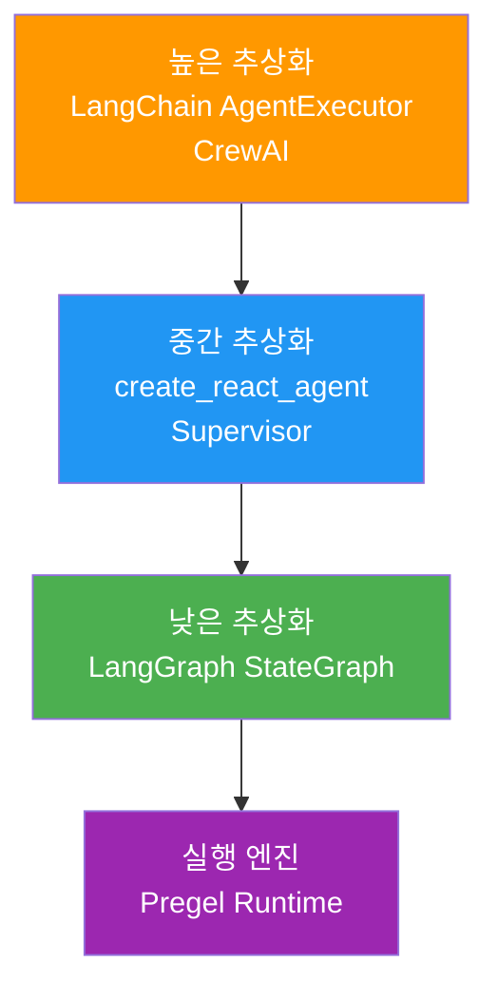
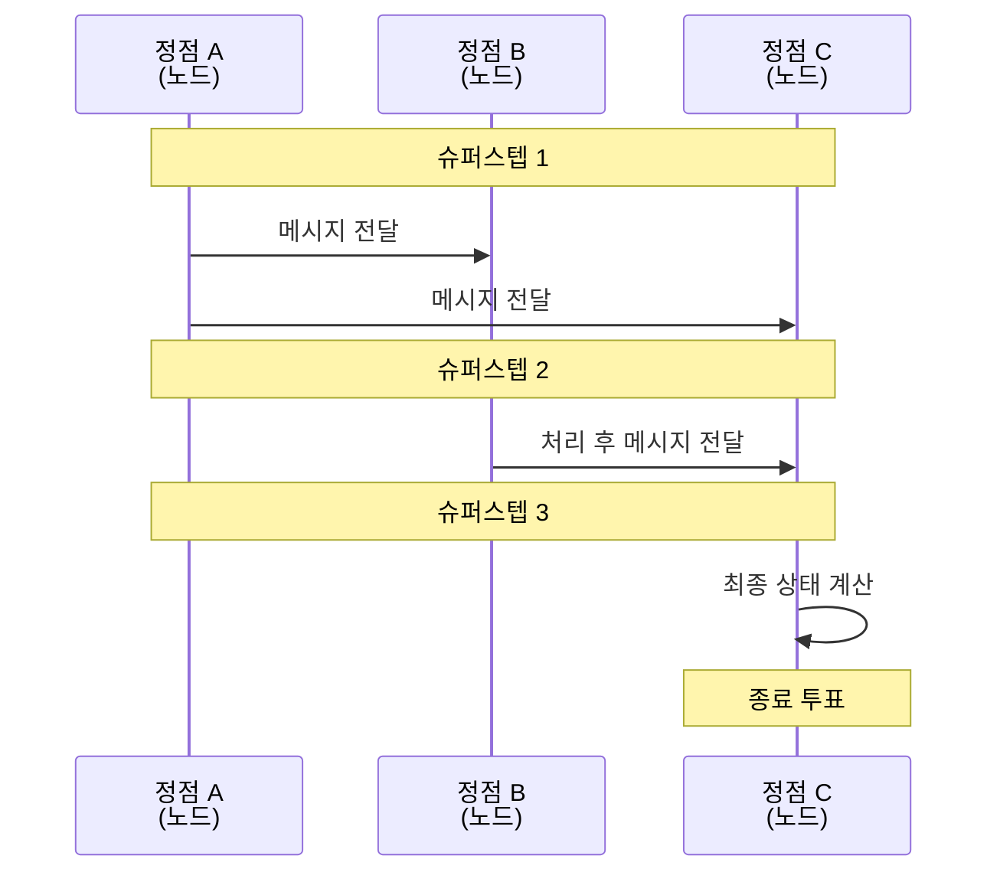
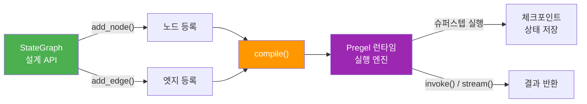
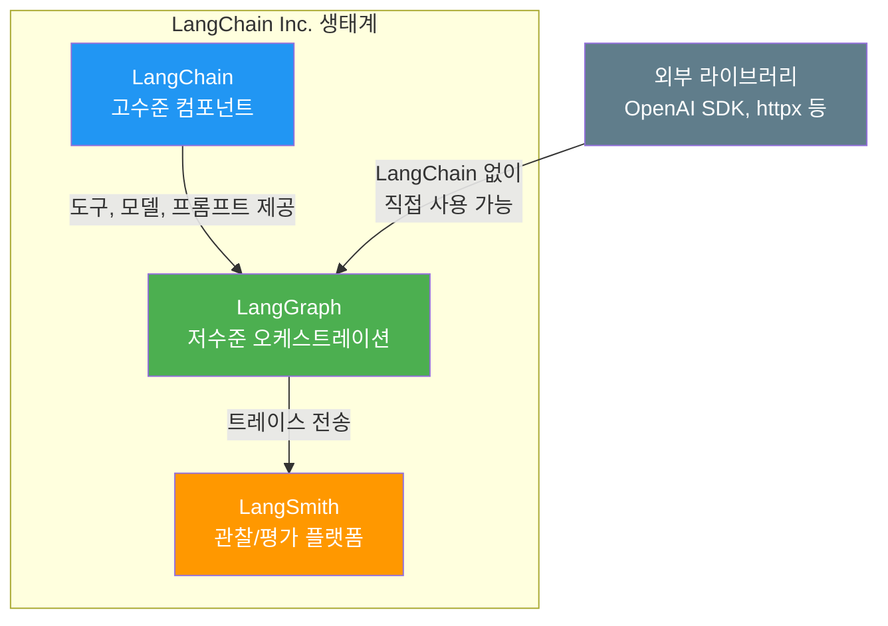
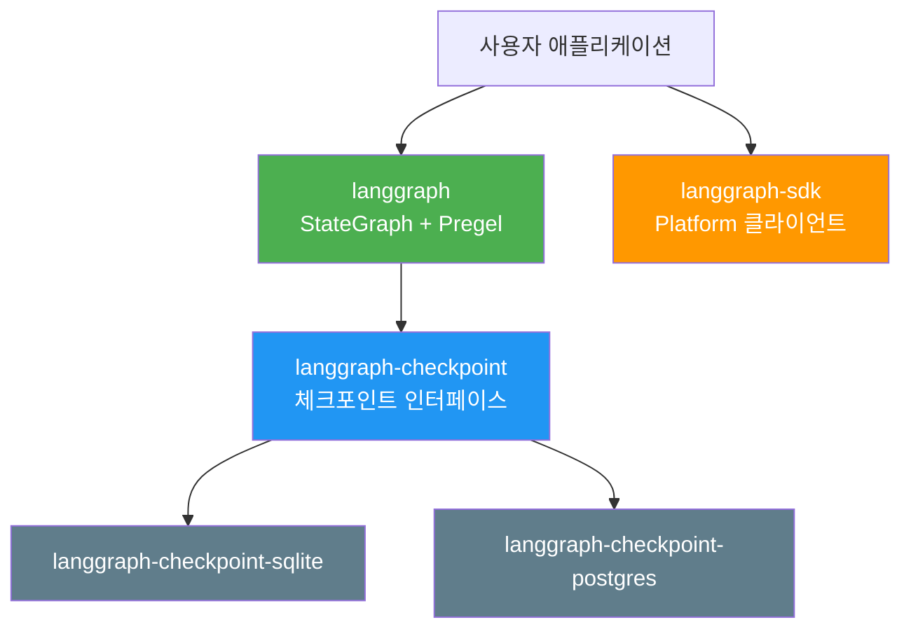

# LangGraph 아키텍처 개관

> LangGraph의 설계 철학과 핵심 아키텍처를 이해하고, Pregel 모델에서 영감받은 그래프 기반 에이전트 오케스트레이션의 원리를 파악합니다.

## 개요

이 섹션에서는 LangGraph가 **왜** 만들어졌고, **어떤 철학**으로 설계되었으며, 내부적으로 **어떻게 동작**하는지를 살펴봅니다. Google의 Pregel 시스템에서 영감받은 실행 모델, LangChain과의 관계, 그리고 독립적으로 사용할 수 있는 저수준 오케스트레이션 프레임워크로서의 정체성을 이해합니다.

**선수 지식**: [Ch2에서 배운 ReAct 패턴](02-ch2-react-패턴과-에이전트-루프/01-01-react-패턴-이론.md)과 [Ch3의 상태 관리 개념](03-ch3-대화-메모리와-상태-관리/03-03-langgraph-메시지-상태.md)을 알고 있으면 좋습니다.

**학습 목표**:
- LangGraph의 설계 철학과 탄생 배경을 설명할 수 있다
- Pregel 모델의 "슈퍼스텝" 실행 방식과 LangGraph의 관계를 이해한다
- LangChain과 LangGraph의 역할 차이를 구분할 수 있다
- StateGraph → compile() → Pregel 변환 과정을 설명할 수 있다

## 왜 알아야 할까?

Ch1~Ch3에서 우리는 도구 호출, ReAct 루프, 메모리 관리를 직접 구현해봤습니다. 동작은 하지만, 실전에서는 금방 한계에 부딪히죠. 에이전트가 중간에 실패하면? 사람의 승인이 필요하면? 여러 에이전트가 협업해야 한다면?

이런 문제를 해결하려면 **상태 머신 기반의 견고한 실행 엔진**이 필요합니다. LangGraph는 바로 이 문제를 풀기 위해 만들어졌거든요. Google이 수십억 개의 웹 페이지 랭킹을 계산하기 위해 만든 Pregel 시스템의 아이디어를 — 놀랍게도 — AI 에이전트 오케스트레이션에 적용한 것입니다.

이번 챕터에서 LangGraph를 제대로 이해하면, Ch5의 조건 분기, Ch6의 체크포인트, Ch7의 Human-in-the-Loop까지 자연스럽게 이어집니다. 이 모든 것의 기반이 바로 이 아키텍처이니까요.

## 핵심 개념

### 개념 1: LangGraph의 정체 — "저수준 오케스트레이션 프레임워크"

> 💡 **비유**: LangGraph는 **교통 신호 시스템**과 같습니다. 자동차(노드)가 어디로 갈지, 언제 출발할지를 직접 운전하지 않고 — 신호등과 도로(엣지)가 교통 흐름을 제어하죠. LangGraph는 에이전트의 "실행 흐름"을 제어하는 교통 인프라입니다.

LangGraph는 자신을 **"low-level orchestration framework and runtime"**이라고 정의합니다. 여기서 핵심 단어는 "low-level"인데요, 이는 프롬프트나 에이전트 아키텍처를 추상화하지 않겠다는 선언이에요. 대신 **어떤 장기 실행, 상태 유지 워크플로우든** 실행할 수 있는 인프라를 제공합니다.

> 📊 **그림 1**: LangGraph의 포지셔닝 — 추상화 수준별 비교



그렇다면 LangGraph가 제공하는 핵심 능력은 무엇일까요? 공식 문서에서는 다섯 가지를 강조합니다:

| 능력 | 설명 | 왜 중요한가? |
|------|------|-------------|
| **내구적 실행(Durable Execution)** | 각 슈퍼스텝 후 상태를 자동 저장하여, 실패해도 정확히 그 지점에서 재개 | 긴 워크플로우에서 중간 장애가 전체를 망치지 않음 |
| **스트리밍(Streaming)** | 토큰 단위, 노드 단위, 이벤트 단위 등 다양한 스트리밍 모드 지원 | 사용자에게 실시간 피드백 제공, UX 향상 |
| **Human-in-the-Loop** | `interrupt()`로 실행을 일시 중단하고, 사람의 승인·수정 후 재개 가능 | 고위험 작업(결제, 이메일 발송 등)에서 안전장치 역할 |
| **체크포인트(Checkpointing)** | 대화 스레드별 상태 영속화. SQLite, PostgreSQL 등 다양한 백엔드 지원 | 서버 재시작 후에도 대화 맥락 유지, 타임 트래블(과거 상태 복원) 가능 |
| **디버깅과 가시성(Observability)** | LangSmith 통합으로 실행 경로, 상태 전이, 노드별 입출력 시각화 | 복잡한 멀티스텝 에이전트에서 "어디서 잘못됐는지" 즉시 파악 |

이 다섯 가지 능력은 이번 Ch4~Ch10에 걸쳐 하나씩 깊이 다루게 됩니다. 특히 스트리밍은 [Ch8](08-ch8-스트리밍과-실시간-처리/01-01-스트리밍-모드-이해.md)에서, 체크포인트는 [Ch6](06-ch6-체크포인트와-영속성/01-01-체크포인트-개념과-설정.md)에서, Human-in-the-Loop은 [Ch7](07-ch7-human-in-the-loop/01-01-인터럽트와-승인-패턴.md)에서 본격적으로 실습합니다.

### 개념 2: Pregel 모델 — "정점처럼 사고하라"

> 💡 **비유**: 대형 마트의 **계산대 시스템**을 떠올려보세요. 각 계산대(정점)는 자기 앞의 고객만 처리합니다. "3번 계산대, 고객을 5번으로 보내세요"라는 메시지를 받으면 다음 라운드에 처리하죠. 모든 계산대가 한 라운드의 작업을 끝내면 다음 라운드가 시작됩니다. 이게 바로 **슈퍼스텝(Superstep)**이에요.

2010년, Google은 수십억 개의 웹 페이지에 PageRank를 계산하는 문제에 직면했습니다. 기존 MapReduce로는 그래프 알고리즘을 효율적으로 처리할 수 없었죠. 그래서 Malewicz 등이 발표한 논문이 바로 **"Pregel: A System for Large-Scale Graph Processing"**입니다.

Pregel의 핵심 아이디어는 **"Think Like a Vertex"(정점처럼 사고하라)**였습니다:

1. 각 정점(Vertex)은 자기 상태만 관리한다
2. 이웃에게 메시지를 보내고, 이웃으로부터 메시지를 받는다
3. 모든 정점이 한 라운드 작업을 끝내면 → 다음 **슈퍼스텝**이 시작된다

> 📊 **그림 2**: Pregel 슈퍼스텝 실행 모델



LangGraph는 이 모델을 AI 에이전트에 적용했습니다. LangGraph에서의 대응 관계를 보면:

| Pregel 개념 | LangGraph 대응 | 역할 |
|-------------|---------------|------|
| Vertex (정점) | Node (노드 함수) | 상태를 읽고 변환하는 작업 단위 |
| Edge (간선) | Edge (엣지) | 다음 노드로의 전이 규칙 |
| Message | State (상태 딕셔너리) | 노드 간 공유되는 데이터 |
| Superstep | 그래프 실행 스텝 | 하나의 노드가 실행되는 단위 |
| BSP 동기화 | compile() 후 Pregel 런타임 | 실행 순서 보장 |

### 개념 3: StateGraph → compile() → Pregel 변환

> 💡 **비유**: StateGraph는 **건축 설계도**이고, `compile()`은 **시공 과정**이며, Pregel은 실제 **건물(실행 엔진)**입니다. 설계도에 방(노드)과 복도(엣지)를 그리고, 시공하면 실제로 사람이 다닐 수 있는 건물이 되는 거죠.

이것이 LangGraph를 이해하는 데 가장 중요한 포인트입니다. 개발자가 직접 다루는 것은 `StateGraph` API인데, 이건 사실 **편의 API**에요. 진짜 실행은 `compile()` 후 생성되는 `Pregel` 객체가 담당합니다.

> 📊 **그림 3**: StateGraph에서 Pregel로의 변환 과정



코드로 보면 이 과정이 더 명확해집니다:

```python
from langgraph.graph import StateGraph, START, END
from typing import TypedDict

# 1. 상태 스키마 정의
class MyState(TypedDict):
    message: str
    count: int

# 2. 노드 함수 정의 — (state) -> dict 시그니처
def greet(state: MyState) -> dict:
    return {"message": f"안녕하세요! 카운트: {state['count']}"}

def increment(state: MyState) -> dict:
    return {"count": state["count"] + 1}

# 3. StateGraph로 설계도 작성
builder = StateGraph(MyState)
builder.add_node("greet", greet)
builder.add_node("increment", increment)
builder.add_edge(START, "increment")
builder.add_edge("increment", "greet")
builder.add_edge("greet", END)

# 4. compile() → Pregel 런타임 생성
graph = builder.compile()

# 5. 실행
result = graph.invoke({"message": "", "count": 0})
print(result)
```

`compile()` 전에는 단순한 파이썬 딕셔너리와 함수 참조의 모음이지만, `compile()` 후에는 슈퍼스텝, 체크포인트, 트랜잭션이 가능한 완전한 실행 엔진으로 변환됩니다.

### 개념 4: LangChain과의 관계 — 독립적이지만 상호보완적

> 💡 **비유**: LangChain은 **가구가 배치된 쇼룸**, LangGraph는 **빈 건물의 뼈대**입니다. 쇼룸의 가구(프롬프트 템플릿, 체인 등)를 빈 건물에 가져다 놓을 수도 있고, 건물만 따로 쓸 수도 있어요.

많은 분들이 "LangGraph는 LangChain의 일부인가요?"라고 묻는데요, 정확한 답은 **"같은 회사(LangChain Inc.)에서 만들었지만 독립적으로 사용 가능"**합니다.

> 📊 **그림 4**: LangChain 생태계와 LangGraph의 관계



```python
# LangChain 없이 LangGraph만 사용하는 예시
from langgraph.graph import StateGraph, START, END
from typing import TypedDict
import openai  # LangChain 아닌 순수 OpenAI SDK

class State(TypedDict):
    question: str
    answer: str

def call_llm(state: State) -> dict:
    # LangChain의 ChatOpenAI가 아닌 직접 호출
    client = openai.OpenAI()
    response = client.chat.completions.create(
        model="gpt-4o",
        messages=[{"role": "user", "content": state["question"]}]
    )
    return {"answer": response.choices[0].message.content}

builder = StateGraph(State)
builder.add_node("llm", call_llm)
builder.add_edge(START, "llm")
builder.add_edge("llm", END)

graph = builder.compile()
# LangChain 의존성 제로!
```

두 프레임워크의 역할을 명확히 정리하면:

| 구분 | LangChain | LangGraph |
|------|-----------|-----------|
| 추상화 수준 | 높음 (프롬프트, 체인, 에이전트) | 낮음 (상태, 노드, 엣지) |
| 주요 역할 | LLM 컴포넌트 조합 | 워크플로우 오케스트레이션 |
| 상태 관리 | 제한적 | 핵심 기능 (체크포인트, 메모리) |
| 독립 사용 | 가능 | 가능 |
| 적합한 상황 | 단순 체인, RAG 파이프라인 | 복잡한 에이전트, 멀티스텝 워크플로우 |

### 개념 5: LangGraph 패키지 구조

LangGraph는 단일 패키지가 아니라 여러 모듈로 나뉘어 있습니다. 현재 최신 버전은 **langgraph v1.1.3** (2026년 3월 기준)이에요.

```bash
pip install -U langgraph  # 핵심 그래프 엔진
```

주요 모듈 구조:

| 패키지 | 역할 |
|--------|------|
| `langgraph` | 핵심 — StateGraph, Pregel 런타임 |
| `langgraph-checkpoint` | 체크포인트 저장소 인터페이스 |
| `langgraph-checkpoint-sqlite` | SQLite 기반 체크포인터 |
| `langgraph-checkpoint-postgres` | PostgreSQL 기반 체크포인터 |
| `langgraph-sdk` | LangGraph Platform API 클라이언트 |

> 📊 **그림 5**: LangGraph 패키지 아키텍처



## 실습: 직접 해보기

가장 기본적인 LangGraph 그래프를 구축하고, StateGraph에서 Pregel로 변환되는 과정을 확인해봅시다.

```python
# 필요한 패키지 설치
# pip install -U langgraph

from langgraph.graph import StateGraph, START, END
from typing import TypedDict

# --- 1. 상태 스키마 정의 ---
class WorkflowState(TypedDict):
    """그래프 전체에서 공유되는 상태"""
    input_text: str       # 사용자 입력
    processed: str        # 전처리된 텍스트
    result: str           # 최종 결과
    step_count: int       # 처리 단계 추적

# --- 2. 노드 함수 정의 ---
def preprocess(state: WorkflowState) -> dict:
    """입력 텍스트를 전처리하는 노드"""
    text = state["input_text"].strip().lower()
    return {
        "processed": text,
        "step_count": state.get("step_count", 0) + 1,
    }

def analyze(state: WorkflowState) -> dict:
    """전처리된 텍스트를 분석하는 노드"""
    text = state["processed"]
    word_count = len(text.split())
    char_count = len(text)
    result = f"단어 {word_count}개, 문자 {char_count}개 분석 완료"
    return {
        "result": result,
        "step_count": state.get("step_count", 0) + 1,
    }

# --- 3. StateGraph 구축 (설계도) ---
builder = StateGraph(WorkflowState)

# 노드 추가
builder.add_node("preprocess", preprocess)
builder.add_node("analyze", analyze)

# 엣지 연결: START → preprocess → analyze → END
builder.add_edge(START, "preprocess")
builder.add_edge("preprocess", "analyze")
builder.add_edge("analyze", END)

# --- 4. compile() → Pregel 런타임 생성 ---
graph = builder.compile()

# --- 5. 실행 ---
initial_state = {
    "input_text": "  LangGraph는 정말 강력한 프레임워크입니다!  ",
    "processed": "",
    "result": "",
    "step_count": 0,
}
```

```run:python
# 그래프 실행 및 결과 확인
result = graph.invoke(initial_state)

print(f"입력: {result['input_text']}")
print(f"전처리: {result['processed']}")
print(f"분석 결과: {result['result']}")
print(f"총 처리 단계: {result['step_count']}")
```

```output
입력:   LangGraph는 정말 강력한 프레임워크입니다!  
전처리: langgraph는 정말 강력한 프레임워크입니다!
분석 결과: 단어 4개, 문자 25개 분석 완료
총 처리 단계: 2
```

compile() 후 생성된 객체의 타입도 확인해봅시다:

```run:python
# Pregel 런타임 확인
print(f"graph 타입: {type(graph).__name__}")
print(f"graph 클래스 계층: {type(graph).__mro__}")
```

```output
graph 타입: CompiledStateGraph
graph 클래스 계층: (<class 'langgraph.graph.state.CompiledStateGraph'>, <class 'langgraph.graph.state.CompiledGraph'>, <class 'langgraph.pregel.Pregel'>, ...)
```

보이시나요? `CompiledStateGraph`의 부모 클래스가 바로 `Pregel`입니다. StateGraph는 개발자 친화적 API이고, 실제 실행은 Pregel이 담당한다는 것이 코드에서도 확인됩니다.

스트리밍으로 각 슈퍼스텝의 실행을 추적할 수도 있습니다:

```run:python
# stream으로 슈퍼스텝별 상태 변화 관찰
for step in graph.stream(initial_state):
    node_name = list(step.keys())[0]
    updates = step[node_name]
    print(f"[슈퍼스텝] 노드 '{node_name}' 실행 → 업데이트: {updates}")
```

```output
[슈퍼스텝] 노드 'preprocess' 실행 → 업데이트: {'processed': 'langgraph는 정말 강력한 프레임워크입니다!', 'step_count': 1}
[슈퍼스텝] 노드 'analyze' 실행 → 업데이트: {'result': '단어 4개, 문자 25개 분석 완료', 'step_count': 2}
```

`stream()`을 쓰면 각 슈퍼스텝에서 어떤 노드가 실행되고, 상태가 어떻게 업데이트되는지를 실시간으로 추적할 수 있습니다. 이것이 Pregel의 슈퍼스텝 모델이 실전에서 동작하는 모습이에요.

## 더 깊이 알아보기

### Pregel의 탄생 — Google과 PageRank의 도전

2010년, Google의 Grzegorz Malewicz를 비롯한 연구진은 SIGMOD 학회에서 "Pregel: A System for Large-Scale Graph Processing"이라는 논문을 발표했습니다. 이름의 유래가 재미있는데요, 유명한 수학자 레온하르트 오일러(Euler)가 쾨니히스베르크의 **프레겔(Pregel) 강**에 놓인 다리 문제를 풀면서 그래프 이론의 시초를 열었거든요. Google은 그래프 처리 시스템에 이 역사적인 강의 이름을 붙인 겁니다.

당시 Google은 수십억 개의 웹 페이지에 PageRank를 적용해야 했지만, MapReduce는 반복적 그래프 알고리즘에 비효율적이었습니다. Pregel은 **BSP(Bulk Synchronous Parallel)** 모델을 채택해서, 모든 정점이 병렬로 계산하고 → 동기화하고 → 다음 스텝으로 넘어가는 깔끔한 패턴을 제안했죠. 이 아이디어는 이후 Apache Giraph(Facebook이 소셜 네트워크 분석에 사용), Apache Spark GraphX 등에 영감을 줬습니다.

### LangGraph는 왜 Pregel을 선택했나?

LangGraph 팀이 Pregel 모델을 채택한 이유는 AI 에이전트의 실행 패턴이 그래프 처리와 놀라울 정도로 유사하기 때문입니다:

- **정점 = 노드 함수**: 각자 자기 역할만 수행
- **메시지 = 상태 업데이트**: 다음 노드에 전달
- **슈퍼스텝 = 실행 단계**: 하나씩 순차적으로 (또는 병렬로) 진행
- **체크포인트**: 각 슈퍼스텝 후 상태를 저장 → 장애 복구 가능

또한 LangGraph의 공개 API는 Python 그래프 라이브러리 **NetworkX**에서 영감을 받았습니다. `add_node()`, `add_edge()` 같은 메서드가 NetworkX와 거의 동일한 것도 우연이 아니에요.

> 💡 **알고 계셨나요?**: LangGraph v1.1(2025년)에서는 `version="v2"` 옵션이 추가되어 타입 안전한 스트리밍이 가능해졌습니다. `stream()`이 `StreamPart` TypedDict를 반환하고, `invoke()`가 `.value`와 `.interrupts` 속성을 가진 `GraphOutput` 객체를 반환하게 되었죠. 기존 코드는 `version="v1"`(기본값)으로 그대로 동작합니다.

## 흔한 오해와 팁

> ⚠️ **흔한 오해**: "LangGraph를 쓰려면 LangChain을 반드시 설치해야 한다"
> 
> 아닙니다! `pip install langgraph`만으로 충분합니다. LangChain의 ChatOpenAI, 프롬프트 템플릿 등을 쓰면 편리하지만, 순수 OpenAI SDK나 Anthropic SDK와 직접 조합해도 완벽하게 동작합니다. LangGraph는 독립적인 프레임워크입니다.

> 💡 **알고 계셨나요?**: StateGraph에서 `compile()`을 호출하기 전까지는 슈퍼스텝도, 체크포인트도, 트랜잭션도 존재하지 않습니다. `compile()`이 StateGraph를 Pregel 런타임으로 변환하는 결정적인 순간이에요. 마치 Python 코드가 바이트코드로 컴파일되는 것처럼요.

> 🔥 **실무 팁**: LangGraph 그래프를 디버깅할 때는 `stream()`을 적극 활용하세요. `invoke()`는 최종 결과만 반환하지만, `stream()`은 각 슈퍼스텝마다 어떤 노드가 실행되었고 상태가 어떻게 변했는지를 실시간으로 보여줍니다. 복잡한 그래프에서 버그를 추적할 때 필수입니다.

## 핵심 정리

| 개념 | 설명 |
|------|------|
| LangGraph | 장기 실행, 상태 유지 에이전트를 위한 저수준 오케스트레이션 프레임워크 |
| Pregel 모델 | Google의 그래프 처리 시스템. "정점처럼 사고하라" + 슈퍼스텝 실행 |
| StateGraph | 개발자가 사용하는 설계 API. 노드와 엣지를 정의 |
| compile() | StateGraph → Pregel 런타임 변환. 체크포인트·트랜잭션 활성화 |
| LangChain 관계 | 같은 회사 제품이지만 독립 사용 가능. 상호보완적 |
| 슈퍼스텝 | 하나의 노드가 실행되는 단위. stream()으로 추적 가능 |
| 5대 핵심 능력 | 내구적 실행, 스트리밍, Human-in-the-Loop, 체크포인트, 디버깅/가시성 |

## 다음 섹션 미리보기

이번 섹션에서 LangGraph의 큰 그림을 이해했으니, 다음 섹션 [02. 상태 스키마 정의](04-ch4-langgraph-stategraph-기초/02-02-상태-스키마-정의.md)에서는 StateGraph의 핵심인 **상태(State)를 어떻게 설계하는지** 깊이 다룹니다. `TypedDict`와 `Pydantic` 기반 스키마의 차이, 그리고 LangGraph의 `MessagesState` 편의 클래스를 실습합니다.

## 참고 자료

- [LangGraph 공식 문서 — Overview](https://docs.langchain.com/oss/python/langgraph/overview) - LangGraph의 설계 철학과 핵심 기능을 공식적으로 설명하는 문서
- [LangGraph GitHub 리포지토리](https://github.com/langchain-ai/langgraph) - 소스 코드, 릴리스 노트, 패키지 구조를 확인할 수 있는 공식 저장소 (v1.1.3)
- [LangChain & LangGraph 1.0 발표 블로그](https://blog.langchain.com/langchain-langgraph-1dot0/) - LangGraph 1.0 GA 발표와 LangChain과의 관계 설명
- [Pregel: A System for Large-Scale Graph Processing (2010)](https://kowshik.github.io/JPregel/pregel_paper.pdf) - Google의 원본 Pregel 논문. LangGraph 아키텍처의 이론적 기반
- [LangGraph: Build Stateful AI Agents in Python (Real Python)](https://realpython.com/langgraph-python/) - 실습 중심의 LangGraph 입문 튜토리얼
- [The Evolution of Graph Processing: From Pregel to LangGraph](https://medium.com/@pur4v/the-evolution-of-graph-processing-from-pregel-to-langgraph-6e8c2063df98) - Pregel에서 LangGraph까지의 진화 과정을 설명하는 글