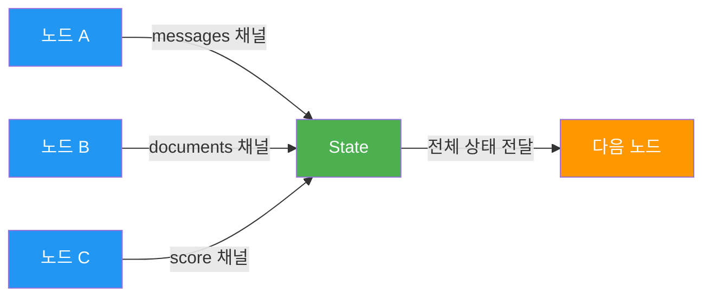
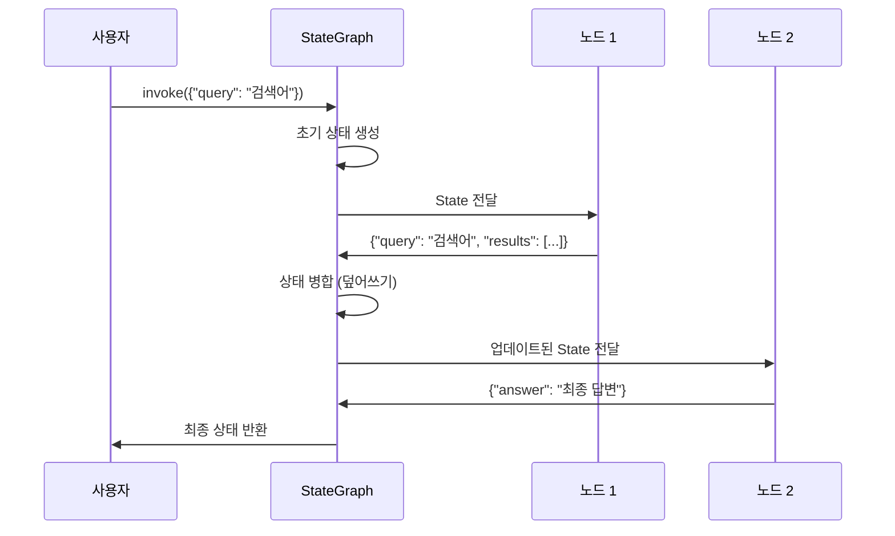
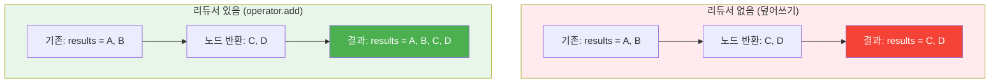
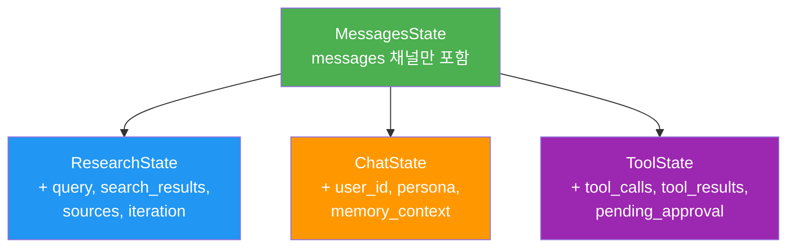
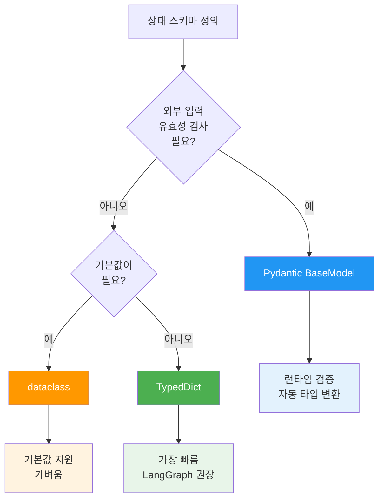
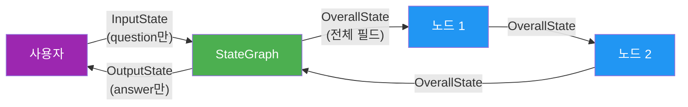

# 상태 스키마 정의

> LangGraph의 심장부 — TypedDict, Pydantic, Annotated로 에이전트의 데이터 흐름을 설계하는 법

## 개요

이 섹션에서는 LangGraph 그래프의 **상태(State)**를 정의하는 방법을 학습합니다. 상태 스키마는 그래프를 흐르는 데이터의 "형태"를 결정하고, 노드가 어떤 데이터를 읽고 쓸 수 있는지를 규정합니다. 리듀서(Reducer)의 존재와 기본 사용법도 함께 살펴보되, 리듀서의 심화 패턴은 [04. 리듀서와 상태 업데이트 전략](04-ch4-langgraph-stategraph-기초/04-04-리듀서와-상태-업데이트-전략.md)에서 본격적으로 다룹니다.

**선수 지식**: [01. LangGraph 아키텍처 개관](04-ch4-langgraph-stategraph-기초/01-01-langgraph-아키텍처-개관.md)에서 배운 StateGraph, 슈퍼스텝, compile() 개념. [03. 메시지 상태와 add_messages 리듀서](03-ch3-langchain-expression-language-lcel/03-03-메시지-상태와-add-messages-리듀서.md)에서 배운 add_messages와 MessagesState 기초.
**학습 목표**:
- TypedDict 기반 상태 스키마를 정의하고 노드에서 활용할 수 있다
- Annotated 타입으로 리듀서를 지정하는 기본 문법을 이해한다
- Pydantic 모델로 런타임 유효성 검사가 포함된 상태를 구성할 수 있다
- MessagesState를 확장해 커스텀 필드를 추가하는 패턴을 적용할 수 있다
- 입력/출력 스키마 분리와 프라이빗 상태 패턴을 적용할 수 있다

## 왜 알아야 할까?

에이전트 개발에서 가장 흔한 버그는 무엇일까요? 바로 **상태 관리 실수**입니다. 메시지가 사라지거나, 도구 결과가 덮어써지거나, 병렬 노드가 서로의 데이터를 날려버리는 문제들이죠.

LangGraph가 다른 에이전트 프레임워크와 차별화되는 핵심이 바로 이 **명시적 상태 관리**입니다. 프롬프트 체이닝 방식에서는 데이터가 암묵적으로 흐르지만, LangGraph에서는 상태 스키마를 통해 "어떤 데이터가 존재하고, 어떻게 업데이트되는지"를 코드로 선언합니다. 이 선언이 체크포인트, 타임 트래블, Human-in-the-Loop 같은 고급 기능의 기반이 됩니다.

상태 스키마를 잘못 설계하면 나중에 전체 그래프를 다시 짜야 할 수도 있어요. 반대로 잘 설계하면, 노드를 추가하거나 분기를 변경할 때도 기존 코드를 거의 건드리지 않아도 됩니다.

## 핵심 개념

### 개념 1: 상태 채널(State Channel)의 이해

> 💡 **비유**: 상태 채널을 **우편함 시스템**이라고 생각해보세요. 아파트에 여러 세대가 있듯이, 그래프에는 여러 노드가 있습니다. 각 세대에는 이름이 적힌 우편함(채널)이 있고, 우편배달부(리듀서)가 새 우편물을 기존 우편물에 어떻게 합칠지 결정합니다 — 교체할지, 쌓아둘지요.

LangGraph에서 상태의 각 **필드**가 곧 하나의 **채널(Channel)**입니다. `StateGraph`에 스키마를 전달하면, LangGraph는 각 필드를 독립적인 채널로 관리합니다. 노드가 반환하는 딕셔너리의 키가 채널 이름과 매칭되어 해당 채널만 업데이트됩니다.

> 📊 **그림 1**: 상태 채널과 노드의 관계



핵심은 이겁니다: 노드는 **전체 상태를 받지만**, 업데이트할 **일부 채널만 반환**합니다. 반환하지 않은 채널은 그대로 유지되죠.

```python
from typing_extensions import TypedDict

class State(TypedDict):
    messages: list[str]     # 채널 1: 대화 메시지
    documents: list[str]    # 채널 2: 검색된 문서
    score: float            # 채널 3: 평가 점수

# 노드는 전체 State를 받고, 변경할 부분만 반환
def my_node(state: State) -> dict:
    # state["messages"], state["documents"], state["score"] 모두 접근 가능
    return {"score": 0.95}  # score 채널만 업데이트
```

리듀서가 없는 채널은 **덮어쓰기(overwrite)** 방식으로 동작합니다. 즉, 노드가 `{"score": 0.95}`를 반환하면 기존 score 값은 사라지고 0.95로 교체됩니다.

### 개념 2: TypedDict 기반 상태 정의

> 💡 **비유**: TypedDict는 **양식(Form)**과 같습니다. "이름은 문자열, 나이는 숫자, 취미는 목록" 이런 식으로 칸을 미리 정해두는 거죠. 칸에 맞지 않는 값을 넣으면 타입 체커가 경고해줍니다.

TypedDict는 LangGraph에서 가장 권장되는 상태 정의 방식입니다. 가볍고, 빠르고, LangGraph의 모든 기능과 완벽히 호환되기 때문이죠.

> 📊 **그림 2**: TypedDict 상태의 생명주기



기본적인 TypedDict 상태를 만들어보겠습니다:

```python
from typing_extensions import TypedDict

class AgentState(TypedDict):
    query: str                # 사용자 질문
    results: list[str]        # 검색 결과
    answer: str               # 최종 답변
    iteration_count: int      # 반복 횟수
```

이 상태를 사용하는 간단한 그래프를 구성하면:

```run:python
from typing_extensions import TypedDict
from langgraph.graph import StateGraph, START, END

# 상태 스키마 정의
class AgentState(TypedDict):
    query: str
    results: list[str]
    answer: str

# 노드 함수: 전체 상태를 받고, 변경 부분만 반환
def search_node(state: AgentState) -> dict:
    query = state["query"]
    return {"results": [f"{query}에 대한 결과 1", f"{query}에 대한 결과 2"]}

def answer_node(state: AgentState) -> dict:
    results = state["results"]
    return {"answer": f"총 {len(results)}개의 결과를 기반으로 한 답변입니다."}

# 그래프 구성
builder = StateGraph(AgentState)
builder.add_node("search", search_node)
builder.add_node("answer", answer_node)
builder.add_edge(START, "search")
builder.add_edge("search", "answer")
builder.add_edge("answer", END)

graph = builder.compile()

# 실행
result = graph.invoke({"query": "LangGraph 상태", "results": [], "answer": ""})
print(f"Query: {result['query']}")
print(f"Results: {result['results']}")
print(f"Answer: {result['answer']}")
```

```output
Query: LangGraph 상태
Results: ['LangGraph 상태에 대한 결과 1', 'LangGraph 상태에 대한 결과 2']
Answer: 총 2개의 결과를 기반으로 한 답변입니다.
```

여기서 중요한 패턴은: 각 노드가 **전체 상태를 dict로 반환하지 않아도 된다**는 점입니다. `search_node`는 `results`만, `answer_node`는 `answer`만 반환합니다. 나머지 필드는 LangGraph가 자동으로 보존합니다.

### 개념 3: Annotated 타입과 리듀서 기초

> 💡 **비유**: 리듀서 없는 상태 업데이트는 **칠판 지우기**와 같습니다. 새 내용을 쓸 때마다 기존 내용이 지워지죠. 하지만 리듀서를 붙이면 **노트에 추가하기**로 바뀝니다. 새 내용이 기존 내용 아래에 이어붙여지는 겁니다.

리듀서가 없으면 같은 채널에 값을 쓸 때 이전 값이 사라집니다. 검색 결과를 누적하고 싶거나, 메시지 히스토리를 쌓고 싶다면? `Annotated` 타입과 리듀서 함수를 사용합니다.

> 📊 **그림 3**: 리듀서 유무에 따른 상태 업데이트 차이



Python의 `Annotated` 타입을 사용하여 각 채널에 리듀서를 지정합니다:

```python
from typing import Annotated
from typing_extensions import TypedDict
import operator

class AgentState(TypedDict):
    query: str                                         # 리듀서 없음 → 덮어쓰기
    results: Annotated[list[str], operator.add]         # 리듀서 있음 → 리스트 병합
    iteration_count: Annotated[int, operator.add]       # 리듀서 있음 → 숫자 덧셈
```

`Annotated[타입, 리듀서_함수]` 형식에서 리듀서 함수는 `(기존값, 새값) -> 병합값`의 시그니처를 가집니다. `operator.add`는 리스트에 쓰면 `+` (이어붙이기), 숫자에 쓰면 `+` (덧셈)이 되죠.

이 섹션에서는 리듀서가 **왜 필요하고, 기본 문법이 무엇인지**에 집중합니다. 커스텀 리듀서 작성, 병렬 노드 병합 전략, 그리고 고급 패턴들은 [04. 리듀서와 상태 업데이트 전략](04-ch4-langgraph-stategraph-기초/04-04-리듀서와-상태-업데이트-전략.md)에서 체계적으로 다룹니다.

가장 자주 쓰이는 기본 리듀서 두 가지만 기억하세요:

| 리듀서 | 타입 | 동작 | 용도 |
|--------|------|------|------|
| `operator.add` | `list` | 리스트 이어붙이기 | 검색 결과 누적, 로그 수집 |
| `add_messages` | `list[AnyMessage]` | 메시지 ID 기반 병합 | 대화 히스토리 |

> ⚠️ **흔한 오해**: "`operator.add`는 리스트 전용이다" — 아닙니다! `operator.add`는 Python의 `+` 연산자를 래핑한 것이므로, `int` + `int`, `str` + `str`, `list` + `list` 모두 동작합니다. 단, 타입이 맞지 않으면 (`list` + `int`) 런타임 에러가 발생하니 주의하세요.

### 개념 4: MessagesState 확장 — 커스텀 필드 추가 패턴

> 💡 **비유**: `MessagesState`는 **기본 옵션이 장착된 자동차**와 같습니다. 에어컨, 오디오 같은 필수 기능(messages + add_messages)은 이미 갖추고 있죠. 여기에 썬루프나 열선 시트 같은 **옵션(커스텀 필드)**을 추가하는 게 이 패턴입니다.

[Ch3에서 배운 MessagesState와 add_messages](03-ch3-langchain-expression-language-lcel/03-03-메시지-상태와-add-messages-리듀서.md)를 기억하시죠? `MessagesState`는 `messages: Annotated[list[AnyMessage], add_messages]`가 미리 정의된 편의 클래스였습니다. 여기서는 **그래프 상태 설계 관점**에서 이를 어떻게 확장하는지에 집중합니다.

실제 에이전트에서 메시지만으로는 부족합니다. 검색 결과, 도구 호출 이력, 반복 횟수, 신뢰도 점수 같은 **도메인 특화 데이터**가 필요하거든요. `MessagesState`를 상속하면 메시지 관리는 그대로 가져가면서 필요한 채널을 자유롭게 추가할 수 있습니다:

> 📊 **그림 4**: MessagesState 확장 패턴 — 기본에서 도메인 특화까지



```python
from typing import Annotated
from langgraph.graph import MessagesState
import operator

# 패턴 1: 검색 에이전트 — 결과를 누적하는 커스텀 필드
class ResearchState(MessagesState):
    query: str                                              # 덮어쓰기
    search_results: Annotated[list[str], operator.add]      # 누적
    sources: Annotated[list[str], operator.add]              # 누적
    iteration: Annotated[int, operator.add]                  # 합산

# 패턴 2: 대화 에이전트 — 사용자 컨텍스트 추가
class ChatState(MessagesState):
    user_id: str                    # 세션 식별
    persona: str                    # 에이전트 성격
    memory_context: list[str]       # 장기 기억 (덮어쓰기)

# 패턴 3: 도구 에이전트 — 승인 워크플로
class ToolState(MessagesState):
    tool_calls: Annotated[list[dict], operator.add]     # 도구 호출 이력 누적
    pending_approval: bool                               # 사람 승인 대기 여부
```

핵심 설계 원칙은: **각 커스텀 필드에 리듀서가 필요한지 아닌지를 판단하는 것**입니다. 누적이 필요하면 `Annotated[..., operator.add]`, 최신값만 유지하면 그냥 타입만 선언하면 됩니다. 이 판단이 상태 스키마 설계의 핵심이에요.

### 개념 5: Pydantic 모델로 상태 정의

> 💡 **비유**: TypedDict가 "양식 틀"이라면, Pydantic은 **보안 검문소가 달린 양식 틀**입니다. 값을 채울 때마다 "이 값이 규격에 맞는지" 실시간으로 검사합니다. 안전하지만 그만큼 검사 비용이 듭니다.

Pydantic `BaseModel`을 사용하면 런타임에 입력값을 자동 검증합니다. API 입력처럼 외부에서 들어오는 데이터의 유효성을 보장하고 싶을 때 유용합니다.

```python
from pydantic import BaseModel, Field
from typing import Annotated
import operator

class ValidatedState(BaseModel):
    query: str = Field(description="사용자 질문", min_length=1)
    temperature: float = Field(default=0.7, ge=0.0, le=2.0)
    results: Annotated[list[str], operator.add] = Field(default_factory=list)
    max_iterations: int = Field(default=3, ge=1, le=10)
```

> 📊 **그림 5**: TypedDict vs Pydantic 선택 기준



하지만 Pydantic 상태에는 주의할 점이 있습니다:

| 특성 | TypedDict | Pydantic |
|------|-----------|----------|
| 성능 | 빠름 (타입 체크 없음) | 느림 (런타임 검증) |
| 기본값 | 지원 안 함 (total=False로 우회) | `Field(default=...)` |
| `create_react_agent` 호환 | 완벽 | 미지원 |
| 노드 반환값 | dict | dict (Pydantic 인스턴스 아님) |
| 유효성 검사 | 없음 (타입 힌트만) | 자동 (입력 시) |

> 🔥 **실무 팁**: 대부분의 에이전트에서는 **TypedDict가 정답**입니다. Pydantic은 사용자 입력이 직접 상태로 들어오는 API 서버 등 **외부 경계(boundary)**에서만 쓰세요. 내부 노드 간 데이터 전달에는 TypedDict의 가벼움이 훨씬 유리합니다.

### 개념 6: 입력/출력 스키마 분리

실제 프로덕션 에이전트에서는 내부 상태가 외부에 노출되면 안 되는 경우가 많습니다. 예를 들어 내부 추론 과정이나 중간 점수 같은 것은 사용자에게 보여줄 필요가 없죠.

LangGraph는 `input_schema`와 `output_schema`를 별도로 지정할 수 있습니다:

> 📊 **그림 6**: 입력/출력 스키마 분리 아키텍처



```python
from typing_extensions import TypedDict
from langgraph.graph import StateGraph, START, END

# 입력 스키마: 사용자가 제공하는 것만
class InputState(TypedDict):
    question: str

# 출력 스키마: 사용자에게 보여줄 것만
class OutputState(TypedDict):
    answer: str

# 내부 상태: 모든 필드 포함
class OverallState(InputState, OutputState):
    search_results: list[str]        # 내부용
    confidence_score: float          # 내부용
    retry_count: int                 # 내부용

def process(state: OverallState) -> dict:
    return {
        "search_results": ["결과1"],
        "confidence_score": 0.92,
        "answer": f"'{state['question']}'에 대한 답변입니다.",
        "retry_count": 0,
    }

# 스키마 분리 적용
builder = StateGraph(
    OverallState,
    input=InputState,       # invoke 시 이 스키마로 입력 검증
    output=OutputState      # invoke 결과에 이 스키마 필드만 포함
)
builder.add_node("process", process)
builder.add_edge(START, "process")
builder.add_edge("process", END)
graph = builder.compile()

# 사용자는 question만 주고, answer만 받음
# 내부의 search_results, confidence_score는 외부에 노출되지 않음
```

이 패턴은 [Ch20. FastAPI 배포와 프로덕션 운영](20-ch20-fastapi-배포와-프로덕션-운영/01-01-fastapi-langgraph-통합.md)에서 API 엔드포인트 설계 시 핵심적으로 활용됩니다.

## 실습: 직접 해보기

리듀서와 MessagesState 확장을 활용해 대화형 검색 에이전트의 상태를 설계해봅시다. Ch3에서 배운 `add_messages`가 메시지 채널을 자동 관리해주므로, 여기서는 **커스텀 필드 설계**에 집중합니다. 이 에이전트는 사용자 질문을 받아 검색하고, 결과를 누적하며, 최종 답변을 생성합니다.

```run:python
from typing import Annotated
from typing_extensions import TypedDict
from langgraph.graph import StateGraph, MessagesState, START, END
from langgraph.graph.message import add_messages
from langchain_core.messages import HumanMessage, AIMessage, SystemMessage
import operator

# ── 1단계: MessagesState 확장으로 상태 스키마 정의 ──
class ResearchState(MessagesState):
    """연구 에이전트 상태: 메시지(상속) + 검색 도메인 필드"""
    query: str                                              # 현재 질문 (덮어쓰기)
    search_results: Annotated[list[str], operator.add]      # 검색 결과 누적
    sources: Annotated[list[str], operator.add]              # 출처 누적
    iteration: Annotated[int, operator.add]                  # 검색 반복 횟수 합산

# ── 2단계: 노드 함수 정의 ──
def analyze_query(state: ResearchState) -> dict:
    """사용자 질문 분석"""
    query = state["query"]
    return {
        "messages": [
            SystemMessage(content="검색 에이전트입니다."),
            AIMessage(content=f"'{query}'를 분석합니다...")
        ]
    }

def search(state: ResearchState) -> dict:
    """검색 수행 (시뮬레이션)"""
    query = state["query"]
    # operator.add 리듀서로 기존 결과에 누적됨
    return {
        "search_results": [f"[논문] {query} 관련 최신 연구"],
        "sources": ["arxiv.org"],
        "iteration": 1,
        "messages": [AIMessage(content=f"검색 완료: {query}")]
    }

def synthesize(state: ResearchState) -> dict:
    """결과 종합"""
    n_results = len(state["search_results"])
    n_sources = len(state["sources"])
    iteration = state["iteration"]
    summary = (
        f"{iteration}회 검색으로 {n_results}개 결과를 "
        f"{n_sources}개 출처에서 수집했습니다."
    )
    return {
        "messages": [AIMessage(content=summary)]
    }

# ── 3단계: 그래프 구성 ──
builder = StateGraph(ResearchState)
builder.add_node("analyze", analyze_query)
builder.add_node("search", search)
builder.add_node("synthesize", synthesize)

builder.add_edge(START, "analyze")
builder.add_edge("analyze", "search")
builder.add_edge("search", "synthesize")
builder.add_edge("synthesize", END)

graph = builder.compile()

# ── 4단계: 실행 ──
initial_state = {
    "messages": [HumanMessage(content="LangGraph 상태 관리에 대해 알려줘")],
    "query": "LangGraph 상태 관리",
    "search_results": [],
    "sources": [],
    "iteration": 0,
}

result = graph.invoke(initial_state)

print(f"=== 실행 결과 ===")
print(f"검색 횟수: {result['iteration']}")
print(f"검색 결과 수: {len(result['search_results'])}")
print(f"출처: {result['sources']}")
print(f"메시지 수: {len(result['messages'])}")
for msg in result["messages"]:
    print(f"  [{msg.__class__.__name__}] {msg.content}")
```

```output
=== 실행 결과 ===
검색 횟수: 1
검색 결과 수: 1
출처: ['arxiv.org']
메시지 수: 4
  [HumanMessage] LangGraph 상태 관리에 대해 알려줘
  [SystemMessage] 검색 에이전트입니다.
  [AIMessage] 'LangGraph 상태 관리'를 분석합니다...
  [AIMessage] 검색 완료: LangGraph 상태 관리
  [AIMessage] 1회 검색으로 1개 결과를 1개 출처에서 수집했습니다.
```

주목할 점:
- `messages`는 Ch3에서 배운 `add_messages` 리듀서 덕분에 모든 노드의 메시지가 **순서대로 누적**됨
- `search_results`와 `sources`는 `operator.add` 리듀서로 **리스트가 이어붙여짐**
- `iteration`은 `operator.add`로 **숫자가 합산**됨 (0 + 1 = 1)
- `query`는 리듀서가 없으므로 초기값 그대로 유지

이 실습의 핵심은 **어떤 필드에 리듀서를 붙이고, 어떤 필드는 덮어쓰기로 둘지를 의식적으로 결정**하는 과정입니다. 이 판단력이 좋은 상태 스키마 설계의 본질이에요.

## 더 깊이 알아보기

### 상태 채널의 기원: Google Pregel에서 LangGraph로

LangGraph의 상태 채널 개념은 Google이 2010년에 발표한 **Pregel** 논문에서 영감을 받았습니다. Pregel은 대규모 그래프 처리 시스템으로, 각 정점(vertex)이 "메시지"를 통해 통신하는 모델이었죠. 

흥미롭게도 Pregel이라는 이름은 수학자 **레온하르트 오일러**가 1736년에 "쾨니히스베르크의 다리 문제"를 풀면서 그래프 이론을 탄생시킨 도시 **프레겔 강(Pregel River)**에서 따온 것입니다. 그래프 이론의 발상지 이름을 그래프 처리 시스템에 붙인 셈이죠.

LangGraph의 Harrison Chase(LangChain 창업자)는 이 Pregel 모델을 AI 에이전트 오케스트레이션에 맞게 재해석했습니다. Pregel에서 정점 간 메시지 전달이 LangGraph에서는 **상태 채널과 리듀서**로 변모한 것입니다. 각 노드가 독립적으로 상태의 일부분만 업데이트하고, 리듀서가 병합을 담당하는 이 패턴은 대규모 분산 시스템의 설계 원칙이 AI 에이전트에 적용된 사례입니다.

### TypedDict의 "숨겨진" 역사

Python의 `TypedDict`는 원래 **Dropbox의 MyPy 팀**이 만들었습니다. Dropbox는 수백만 줄의 Python 코드를 관리하면서 딕셔너리의 키 타입을 추적하지 못해 버그가 반복되자, 2018년에 PEP 589로 `TypedDict`를 제안했습니다. 런타임 오버헤드 없이 정적 타입 체크만 제공하겠다는 설계 철학이 LangGraph의 "가벼운 상태 관리" 요구사항과 완벽히 맞아떨어진 거죠.

## 흔한 오해와 팁

> ⚠️ **흔한 오해**: "Pydantic이 TypedDict보다 무조건 좋다" — Pydantic은 런타임 검증 비용이 있고, LangGraph의 일부 고수준 API(`create_react_agent` 등)와 호환되지 않습니다. 내부 상태에는 TypedDict, 외부 경계에만 Pydantic을 쓰는 것이 베스트 프랙티스입니다.

> 💡 **알고 계셨나요?**: `MessagesState`를 확장할 때 커스텀 필드의 리듀서 선택이 가장 중요한 설계 결정입니다. "이 데이터는 누적해야 하는가, 최신값만 있으면 되는가?"를 자문해보세요. 잘못된 선택은 나중에 수정하기 까다롭습니다 — 체크포인트에 이미 저장된 상태 구조와 충돌할 수 있거든요. 리듀서의 고급 패턴은 [04. 리듀서와 상태 업데이트 전략](04-ch4-langgraph-stategraph-기초/04-04-리듀서와-상태-업데이트-전략.md)에서 체계적으로 다룹니다.

> 🔥 **실무 팁**: 상태 필드는 처음부터 많이 만들지 마세요. **"지금 당장 필요한 필드"**만 정의하고, 그래프가 복잡해지면 점진적으로 추가하세요. TypedDict는 상속을 지원하므로 `class ExtendedState(BaseState):`처럼 기존 스키마를 확장할 수 있습니다. 불필요한 채널은 메모리와 체크포인트 용량을 낭비합니다.

> 🔥 **실무 팁**: 디버깅할 때 상태를 출력하려면 `graph.invoke()` 결과를 그대로 `print()`하면 됩니다. TypedDict 상태는 일반 `dict`로 동작하므로 `result["messages"]`처럼 키로 바로 접근 가능합니다.

## 핵심 정리

| 개념 | 설명 |
|------|------|
| 상태 채널 | 상태의 각 필드가 하나의 독립적 채널. 노드는 필요한 채널만 업데이트 |
| TypedDict | 가장 권장되는 상태 정의 방식. 가볍고 모든 LangGraph 기능과 호환 |
| Annotated + 리듀서 | `Annotated[타입, 함수]`로 상태 업데이트 방식을 선언적으로 지정 |
| operator.add | 리스트 이어붙이기, 숫자 덧셈 등 `+` 연산을 리듀서로 활용 |
| MessagesState 확장 | 상속으로 messages 채널을 유지하면서 도메인 필드 추가 |
| Pydantic 상태 | 런타임 유효성 검사 지원. 외부 입력 경계에서 활용 |
| 입력/출력 스키마 | `input`/`output` 파라미터로 내부 상태를 외부에 노출하지 않는 패턴 |

## 다음 섹션 미리보기

상태 스키마를 정의하는 법을 배웠으니, 이제 이 상태 위에서 실제로 **작업을 수행하는 노드(Node)**와 노드 간 **이동 경로인 엣지(Edge)**를 구성하는 법을 알아볼 차례입니다. [03. 노드와 엣지 구성](04-ch4-langgraph-stategraph-기초/03-03-노드와-엣지-구성.md)에서는 `add_node`, `add_edge`, 그리고 `START`/`END` 특수 노드를 활용해 완전한 실행 흐름을 만드는 방법을 학습합니다. 노드와 엣지를 충분히 익힌 뒤, [04. 리듀서와 상태 업데이트 전략](04-ch4-langgraph-stategraph-기초/04-04-리듀서와-상태-업데이트-전략.md)에서 리듀서의 심화 패턴을 다룹니다.

## 참고 자료

- [Use the Graph API — LangGraph 공식 문서](https://docs.langchain.com/oss/python/langgraph/use-graph-api) - 상태 스키마, 리듀서, 입출력 스키마 분리까지 공식 가이드
- [Graph API Overview — LangGraph 공식 문서](https://docs.langchain.com/oss/python/langgraph/graph-api) - StateGraph 초기화, 채널, TypedDict vs Pydantic 비교
- [LangGraph GitHub Repository](https://github.com/langchain-ai/langgraph) - 소스 코드와 최신 예제 확인
- [LangGraph 101 Tutorial Notebooks](https://github.com/langchain-ai/langgraph-101) - 단계별 실습 노트북
- [LangGraph: Build Stateful AI Agents in Python (Real Python)](https://realpython.com/langgraph-python/) - TypedDict/Annotated 패턴의 실전 활용 튜토리얼
- [PEP 589 – TypedDict](https://peps.python.org/pep-0589/) - TypedDict의 공식 Python 사양

---
### 🔗 Related Sessions
- [stategraph](04-ch4-langgraph-stategraph-기초/01-01-langgraph-아키텍처-개관.md) (prerequisite)
- [compile()](04-ch4-langgraph-stategraph-기초/01-01-langgraph-아키텍처-개관.md) (prerequisite)
- [pregel 모델](04-ch4-langgraph-stategraph-기초/01-01-langgraph-아키텍처-개관.md) (prerequisite)
