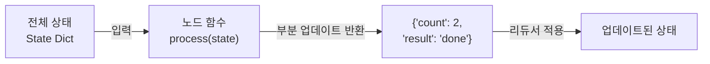
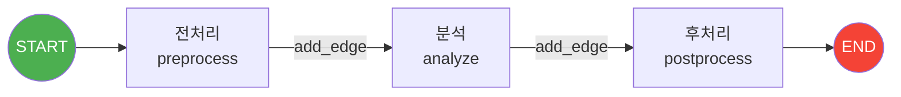
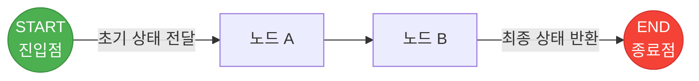
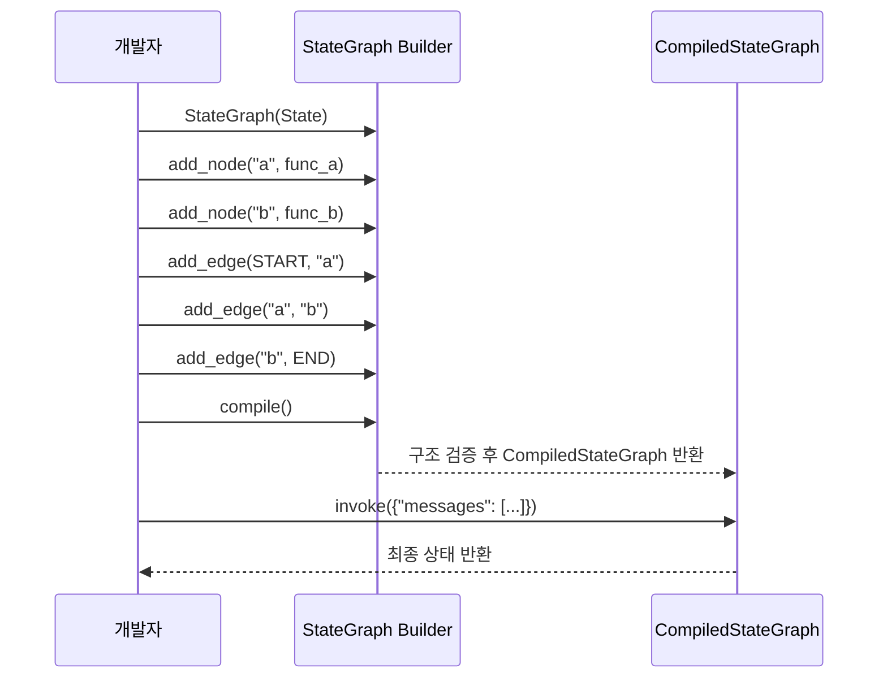
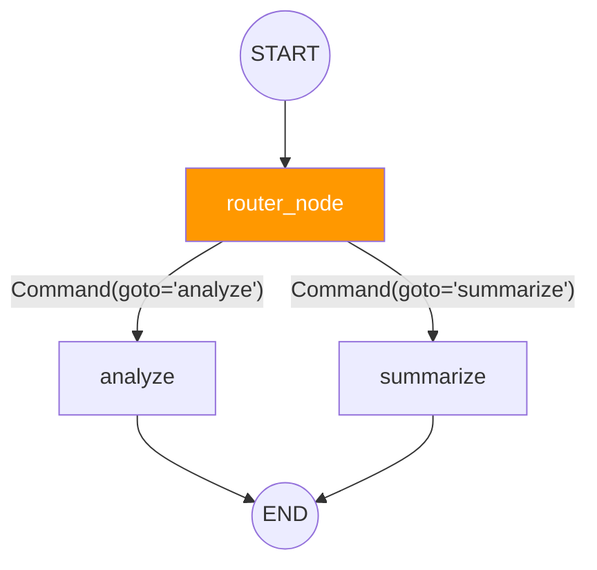

# 노드와 엣지 구성

> StateGraph의 뼈대를 세우는 법 — 노드 함수 작성부터 그래프 실행까지 한 번에 익히기

## 개요

이 섹션에서는 LangGraph 그래프의 실질적인 구성 요소인 **노드(Node)**와 **엣지(Edge)**를 다룹니다. [이전 섹션](04-ch4-langgraph-stategraph-기초/02-02-상태-스키마-정의.md)에서 정의한 상태 스키마 위에 노드 함수를 작성하고, 엣지로 연결하여 실행 가능한 그래프를 만드는 전체 과정을 학습합니다.

**선수 지식**: 
- [LangGraph 아키텍처 개관](04-ch4-langgraph-stategraph-기초/01-01-langgraph-아키텍처-개관.md)에서 배운 StateGraph → compile() → Pregel 변환 과정
- [상태 스키마 정의](04-ch4-langgraph-stategraph-기초/02-02-상태-스키마-정의.md)에서 배운 TypedDict, Annotated 리듀서, MessagesState

**학습 목표**:
- 노드 함수의 시그니처와 반환값 규칙을 이해하고 작성할 수 있다
- `add_node()`와 `add_edge()`로 그래프를 구성할 수 있다
- `START`와 `END` 특수 노드의 역할을 설명하고 활용할 수 있다
- `compile()`로 그래프를 확정하고 `invoke()`/`stream()`으로 실행할 수 있다

## 왜 알아야 할까?

상태 스키마가 **데이터의 형태**를 정의한다면, 노드와 엣지는 **그 데이터가 어떻게 흘러가는지**를 결정합니다. 아무리 완벽한 상태 스키마를 만들어도 노드와 엣지가 없으면 그래프는 아무 일도 하지 않는 빈 껍데기에 불과하거든요.

실무에서 LangGraph를 사용하는 모든 작업 — ReAct 에이전트 구축, RAG 파이프라인, Human-in-the-Loop 워크플로우 — 은 결국 "어떤 노드를 만들고, 어떤 순서로 연결할까"라는 질문으로 귀결됩니다. 이 섹션에서 익힌 패턴은 이후 [조건 분기](05-ch5-조건-분기와-동적-라우팅/01-01-조건부-엣지의-이해.md), [체크포인트](06-ch6-체크포인트와-영속적-실행/01-01-체크포인트-시스템-이해.md), [멀티 에이전트](15-ch15-supervisorworker-멀티-에이전트/01-01-멀티-에이전트-아키텍처-패턴.md)까지 계속 확장되는 기본기입니다.

## 핵심 개념

### 개념 1: 노드(Node) — 그래프의 작업자

> 💡 **비유**: 노드를 **공장의 작업 스테이션**이라고 생각해보세요. 컨베이어 벨트(상태)를 타고 부품(데이터)이 들어오면, 각 스테이션은 자기 역할에 맞는 가공을 한 뒤 다시 벨트에 올려놓습니다. 도색 스테이션은 색을 칠하고, 검수 스테이션은 품질을 확인하는 것처럼 — 각 노드는 상태의 특정 부분을 변환하는 독립적인 작업 단위입니다.

LangGraph에서 노드는 **상태를 입력받아 상태 업데이트를 반환하는 Python 함수**입니다. 핵심 규칙은 딱 두 가지예요:

1. **입력**: 현재 그래프 상태(State)를 딕셔너리로 받는다
2. **출력**: 업데이트할 필드만 담은 딕셔너리를 반환한다 (전체 상태가 아님!)

> 📊 **그림 1**: 노드 함수의 입출력 흐름



노드 함수의 기본 형태를 살펴보겠습니다:

```python
from typing import TypedDict, Annotated
import operator

# 상태 정의
class State(TypedDict):
    messages: list[str]
    count: Annotated[int, operator.add]  # operator.add 리듀서: 반환값을 기존 값에 더함

# 노드 함수 — 상태를 받아서 업데이트할 부분만 반환
def greet_node(state: State) -> dict:
    name = state["messages"][-1]  # 상태에서 데이터 읽기
    return {
        "messages": [f"안녕하세요, {name}님!"],  # messages 리스트에 추가
        "count": 1                                # count에 1을 더함 (operator.add 리듀서)
    }
```

리듀서가 지정된 필드는 반환값이 기존 값과 **병합**된다는 점을 기억하세요. 위 예제에서 `count`에 `operator.add`가 지정되어 있으므로, 노드가 `{"count": 1}`을 반환하면 기존 count 값에 1이 **더해집니다**. 리듀서의 세부 동작 원리는 [리듀서와 상태 업데이트 패턴](04-ch4-langgraph-stategraph-기초/04-04-리듀서와-상태-업데이트-패턴.md)에서 깊이 다룹니다.

**`add_node()` 메서드**로 노드를 그래프에 등록합니다:

```python
from langgraph.graph import StateGraph

builder = StateGraph(State)

# 방법 1: 이름 + 함수 전달
builder.add_node("greet", greet_node)

# 방법 2: 함수만 전달 (함수 이름이 노드 이름이 됨)
builder.add_node(greet_node)  # 노드 이름 = "greet_node"
```

> ⚠️ **흔한 오해**: "노드 함수는 전체 상태를 반환해야 한다"고 생각하기 쉬운데요, **변경할 필드만 반환하면 됩니다**. 반환하지 않은 필드는 기존 값이 그대로 유지됩니다. 리듀서가 지정된 필드는 반환 값과 기존 값이 리듀서로 병합되고, 리듀서가 없는 필드는 반환 값으로 덮어쓰기(overwrite)됩니다.

### 개념 2: 엣지(Edge) — 실행 순서의 연결선

> 💡 **비유**: 엣지를 공장의 **컨베이어 벨트**라고 생각하세요. 스테이션 A의 작업이 끝나면 벨트가 부품을 스테이션 B로 옮깁니다. 벨트가 없으면 아무리 많은 스테이션을 설치해도 부품이 움직이지 않죠. 엣지는 "이 노드 다음에는 저 노드를 실행하라"는 지시입니다.

`add_edge()`는 두 노드 사이에 **고정 경로**를 만듭니다:

```python
# source → target 순서로 연결
builder.add_edge("node_a", "node_b")  # node_a 완료 후 node_b 실행
```

> 📊 **그림 2**: 엣지로 연결된 3단계 파이프라인



여러 노드를 한 번에 연결하고 싶을 때는 엣지를 순차적으로 추가하면 됩니다:

```python
builder.add_edge(START, "preprocess")
builder.add_edge("preprocess", "analyze")
builder.add_edge("analyze", "postprocess")
builder.add_edge("postprocess", END)
```

> 🔥 **실무 팁**: 한 노드에서 여러 노드로 고정 엣지를 연결하면 **병렬 실행**이 됩니다. `add_edge("start", "branch_a")`와 `add_edge("start", "branch_b")`를 동시에 등록하면 `branch_a`와 `branch_b`가 같은 슈퍼스텝에서 동시에 실행됩니다.

### 개념 3: START와 END — 그래프의 관문

> 💡 **비유**: START는 공장의 **원자재 투입구**, END는 **완제품 출하구**입니다. 모든 제조 공정은 투입구에서 시작해서 출하구로 끝나야 하듯, 모든 LangGraph 그래프도 START에서 시작해서 END로 끝나야 합니다.

`START`와 `END`는 LangGraph가 제공하는 **특수 노드**입니다. 실제 로직을 수행하지는 않지만, 그래프의 진입점과 종료점을 명시합니다.

```python
from langgraph.graph import StateGraph, START, END

builder = StateGraph(State)
builder.add_node("process", process_node)

# START → process: 그래프 실행이 시작되면 process 노드부터 실행
builder.add_edge(START, "process")

# process → END: process 노드 완료 후 그래프 종료
builder.add_edge("process", END)
```

> 📊 **그림 3**: START/END와 노드의 관계



**START 규칙:**
- 반드시 하나 이상의 노드로 연결해야 합니다
- 여러 노드로 연결하면 병렬로 시작합니다
- `invoke()`에 전달한 초기 상태가 START를 통해 첫 노드에 도달합니다

**END 규칙:**
- END로 향하는 엣지가 없으면 그래프가 종료되지 않아 무한 루프에 빠질 수 있습니다
- 여러 노드에서 END로 연결할 수 있습니다 (여러 종료 경로)
- END에 도달한 시점의 상태가 `invoke()`의 반환값이 됩니다

### 개념 4: compile()과 invoke() — 그래프의 확정과 실행

> 💡 **비유**: `compile()`은 건축의 **준공 검사**와 같습니다. 도면(노드와 엣지)을 그린 뒤, 실제로 건물을 사용하기 전에 구조 안전성을 확인하는 단계죠. 문이 없는 방(도달 불가 노드)이나 출구가 없는 건물(END 없음) 같은 문제를 이 시점에 잡아냅니다.

`compile()`은 StateGraph 빌더를 **실행 가능한 CompiledStateGraph** 객체로 변환합니다:

```python
# 기본 컴파일
graph = builder.compile()

# 체크포인터와 함께 컴파일 (6장에서 자세히 다룹니다)
from langgraph.checkpoint.memory import MemorySaver
graph = builder.compile(checkpointer=MemorySaver())
```

컴파일 시 수행되는 검증:
- 모든 노드가 START에서 도달 가능한가?
- 고아 노드(어디에서도 연결되지 않은 노드)가 없는가?
- 엣지의 source/target이 실제 존재하는 노드인가?

> 📊 **그림 4**: 빌더 패턴의 전체 흐름 — 정의 → 구성 → 컴파일 → 실행



**실행 방법은 세 가지**입니다:

```python
# 1. invoke() — 전체 실행 후 최종 상태 반환
result = graph.invoke({"messages": ["안녕하세요"]})

# 2. stream() — 각 노드 완료 시마다 중간 상태를 스트리밍
for event in graph.stream({"messages": ["안녕하세요"]}):
    print(event)  # {"node_name": {"field": "updated_value"}}

# 3. ainvoke() / astream() — 비동기 버전
result = await graph.ainvoke({"messages": ["안녕하세요"]})
```

`stream()`이 반환하는 이벤트는 `{노드이름: 상태업데이트}` 형식의 딕셔너리입니다. 어떤 노드가 어떤 업데이트를 했는지 실시간으로 추적할 수 있어 디버깅에 매우 유용하죠.

### 개념 5: Command — 상태 업데이트와 라우팅의 통합 (v0.2.60+)

> 💡 **비유**: 기존 노드가 "작업만 하는 작업자"라면, `Command`를 반환하는 노드는 **"작업도 하고 다음 스테이션도 지정하는 팀장"**입니다. 엣지 없이도 노드 안에서 다음 행선지를 결정할 수 있습니다.

`Command`는 상태 업데이트(`update`)와 제어 흐름(`goto`)을 하나의 반환값으로 합칩니다:

```python
from langgraph.types import Command
from typing import Literal

def router_node(state: State) -> Command[Literal["analyze", "summarize"]]:
    if len(state["messages"]) > 5:
        return Command(update={"count": 1}, goto="summarize")
    else:
        return Command(update={"count": 1}, goto="analyze")
```

> 📊 **그림 5**: Command를 사용한 동적 라우팅



`Command`는 `add_conditional_edges()` 없이도 노드 내부에서 분기를 처리할 수 있어, 복잡한 라우팅 로직을 더 깔끔하게 표현할 수 있습니다. 이 패턴은 [Ch5. 조건 분기와 동적 라우팅](05-ch5-조건-분기와-동적-라우팅/01-01-조건부-엣지의-이해.md)에서 더 자세히 다루겠습니다.

## 실습: 직접 해보기

텍스트를 입력받아 **전처리 → 분석 → 보고서 생성**을 수행하는 3단계 파이프라인을 만들어봅시다.

```python
from typing import TypedDict, Annotated
import operator
from langgraph.graph import StateGraph, START, END


# ── 1단계: 상태 정의 ──────────────────────────────
class TextAnalysisState(TypedDict):
    text: str                                    # 원본 텍스트
    words: list[str]                             # 전처리된 단어 목록
    word_count: int                              # 단어 수
    log: Annotated[list[str], operator.add]      # 처리 로그 (리듀서로 누적)


# ── 2단계: 노드 함수 작성 ──────────────────────────
def preprocess(state: TextAnalysisState) -> dict:
    """텍스트를 소문자로 변환하고 단어로 분리"""
    text = state["text"].lower().strip()
    words = text.split()
    return {
        "words": words,
        "log": ["[전처리] 텍스트를 소문자 변환 및 토큰화 완료"]
    }


def analyze(state: TextAnalysisState) -> dict:
    """단어 수를 세고 통계 생성"""
    words = state["words"]
    word_count = len(words)
    return {
        "word_count": word_count,
        "log": [f"[분석] 총 {word_count}개 단어 발견"]
    }


def report(state: TextAnalysisState) -> dict:
    """최종 보고서 요약 생성"""
    summary = (
        f"분석 완료: '{state['text'][:30]}...' "
        f"→ {state['word_count']}단어"
    )
    return {
        "log": [f"[보고서] {summary}"]
    }


# ── 3단계: 그래프 구성 ──────────────────────────────
builder = StateGraph(TextAnalysisState)

# 노드 등록
builder.add_node("preprocess", preprocess)
builder.add_node("analyze", analyze)
builder.add_node("report", report)

# 엣지 연결: START → 전처리 → 분석 → 보고서 → END
builder.add_edge(START, "preprocess")
builder.add_edge("preprocess", "analyze")
builder.add_edge("analyze", "report")
builder.add_edge("report", END)

# ── 4단계: 컴파일 및 실행 ──────────────────────────
graph = builder.compile()

# 초기 상태를 전달하여 실행
result = graph.invoke({
    "text": "LangGraph makes it easy to build stateful AI agents",
    "words": [],
    "word_count": 0,
    "log": []
})

# 결과 출력
print("=== 최종 상태 ===")
print(f"단어 목록: {result['words']}")
print(f"단어 수: {result['word_count']}")
print(f"\n=== 처리 로그 ===")
for entry in result["log"]:
    print(f"  {entry}")
```

```output
=== 최종 상태 ===
단어 목록: ['langgraph', 'makes', 'it', 'easy', 'to', 'build', 'stateful', 'ai', 'agents']
단어 수: 9

=== 처리 로그 ===
  [전처리] 텍스트를 소문자 변환 및 토큰화 완료
  [분석] 총 9개 단어 발견
  [보고서] 분석 완료: 'LangGraph makes it easy to bui...' → 9단어
```

`stream()`으로 실행하면 각 노드의 출력을 실시간으로 관찰할 수 있습니다:

```run:python
# stream()으로 노드별 중간 출력 관찰
for event in graph.stream({
    "text": "Hello LangGraph World",
    "words": [],
    "word_count": 0,
    "log": []
}):
    node_name = list(event.keys())[0]
    update = event[node_name]
    print(f"[{node_name}] → {update}")
```

```output
[preprocess] → {'words': ['hello', 'langgraph', 'world'], 'log': ['[전처리] 텍스트를 소문자 변환 및 토큰화 완료']}
[analyze] → {'word_count': 3, 'log': ['[분석] 총 3개 단어 발견']}
[report] → {'log': ["[보고서] 분석 완료: 'Hello LangGraph World...' → 3단어"]}
```

`stream()` 출력에서 각 이벤트의 키가 노드 이름이고, 값이 그 노드가 반환한 상태 업데이트인 것을 확인할 수 있습니다. 이 패턴은 [Ch18. 관찰가능성과 디버깅](18-ch18-관찰가능성과-디버깅/01-01-langsmith-트레이싱-설정.md)에서 LangSmith 트레이싱과 연결됩니다.

## 더 깊이 알아보기

### 그래프 이론에서 LangGraph로

LangGraph의 노드-엣지 모델은 사실 컴퓨터 과학의 고전적인 **방향 그래프(Directed Graph)** 개념을 그대로 차용한 것입니다. 1736년 오일러가 쾨니히스베르크 다리 문제를 풀면서 시작된 그래프 이론은, 300년이 지난 지금 AI 에이전트의 실행 흐름을 설계하는 데까지 이어지고 있습니다.

LangGraph 팀이 특히 영감을 받은 것은 Google의 **Pregel** 논문(2010)입니다. 앞서 [LangGraph 아키텍처 개관](04-ch4-langgraph-stategraph-기초/01-01-langgraph-아키텍처-개관.md)에서 배운 것처럼, Pregel은 대규모 그래프 처리를 "슈퍼스텝(superstep)" 단위로 나누어 실행하는 모델인데요, LangGraph는 이 아이디어를 LLM 에이전트 워크플로우에 적용했습니다. 각 슈퍼스텝에서 동시에 실행 가능한 노드들이 병렬로 처리되고, 모든 노드가 완료되면 다음 슈퍼스텝으로 넘어가는 구조입니다.

### 왜 "빌더 패턴"일까?

LangGraph가 `StateGraph` → `add_node()` → `add_edge()` → `compile()` 순서를 강제하는 것은 GoF 디자인 패턴 중 **빌더(Builder) 패턴**입니다. 한 번에 모든 걸 생성자에 넣는 대신, 단계적으로 구성 요소를 추가하고 마지막에 `compile()`로 확정합니다. 이렇게 하면 구성 중간에 노드를 추가하거나 제거하는 것이 자유롭고, 컴파일 시점에 한 번에 전체 구조를 검증할 수 있습니다.

> 💡 **알고 계셨나요?**: LangGraph v0.2.60에서 도입된 `Command` 객체는 원래 멀티 에이전트 아키텍처를 위해 설계되었습니다. 서브그래프의 노드가 부모 그래프의 다른 노드로 직접 이동할 수 있게 하려면 `Command(goto="target", graph=Command.PARENT)`처럼 작성하면 되거든요. 단순한 라우팅 도구로 시작했지만, 지금은 LangGraph의 제어 흐름을 다루는 핵심 프리미티브로 자리잡았습니다.

## 흔한 오해와 팁

> ⚠️ **흔한 오해**: "노드 함수에서 상태를 직접 수정(mutate)해도 된다"고 생각하기 쉽습니다. 예를 들어 `state["messages"].append("new")`처럼요. 하지만 이렇게 하면 리듀서가 제대로 작동하지 않고, 체크포인트도 올바르게 기록되지 않습니다. **반드시 새 딕셔너리를 반환**하는 방식을 사용하세요.

> 💡 **알고 계셨나요?**: `add_node()`에 함수만 전달하면 함수 이름이 노드 이름으로 사용됩니다. 그래서 `lambda` 함수를 노드로 등록하면 이름이 `"<lambda>"`가 되어 디버깅이 매우 어려워집니다. 항상 이름이 있는 함수를 사용하거나 명시적으로 이름을 지정하세요.

> 🔥 **실무 팁**: 그래프 디버깅 시 `graph.get_graph().draw_mermaid()`를 호출하면 그래프 구조를 Mermaid 다이어그램 코드로 출력합니다. Jupyter 노트북에서는 `graph.get_graph().draw_mermaid_png()`로 바로 시각화할 수도 있어요. 복잡한 그래프일수록 이 기능이 큰 도움이 됩니다.

> 🔥 **실무 팁**: `invoke()`에 초기 상태를 전달할 때, 입력 스키마에 해당하는 필드만 넣으면 됩니다. 나머지 필드는 리듀서가 있으면 리듀서의 초기값으로, 없으면 기본값으로 초기화됩니다. 위 실습에서 `words`나 `log`를 빈 리스트로 명시했지만, 실전에서는 `{"text": "입력값"}`만 넣어도 충분합니다.

## 핵심 정리

| 개념 | 설명 |
|------|------|
| **노드(Node)** | 상태를 입력받아 부분 업데이트 딕셔너리를 반환하는 Python 함수 |
| **엣지(Edge)** | `add_edge(source, target)`로 정의하는 노드 간 고정 연결선 |
| **START** | 그래프의 진입점. `invoke()` 초기 상태가 여기서 시작됨 |
| **END** | 그래프의 종료점. 여기에 도달하면 실행 종료, 최종 상태 반환 |
| **add_node()** | 노드 이름과 함수를 그래프에 등록. 함수만 전달 시 함수명이 이름 |
| **add_edge()** | 두 노드 사이에 고정 경로 생성. 순차 실행 보장 |
| **compile()** | 빌더를 CompiledStateGraph로 변환. 구조 검증 수행 |
| **invoke()** | 그래프를 동기 실행하고 최종 상태를 반환 |
| **stream()** | 노드별 중간 업데이트를 이벤트로 스트리밍 |
| **Command** | 상태 업데이트(update)와 다음 노드 지정(goto)을 하나로 합친 반환값 |

## 다음 섹션 미리보기

노드와 엣지로 그래프의 뼈대를 세우는 법을 배웠으니, 다음 섹션 [리듀서와 상태 업데이트 패턴](04-ch4-langgraph-stategraph-기초/04-04-리듀서와-상태-업데이트-패턴.md)에서는 **여러 노드가 같은 필드를 동시에 업데이트할 때 발생하는 충돌**을 리듀서가 어떻게 해결하는지를 실전 관점에서 파고듭니다. [상태 스키마 정의](04-ch4-langgraph-stategraph-기초/02-02-상태-스키마-정의.md)에서 `Annotated[int, operator.add]` 같은 기본 리듀서를 소개했다면, 다음 섹션에서는 **커스텀 리듀서 함수 작성**, **`add_messages` 리듀서의 메시지 병합 전략**, **리듀서 선택이 에이전트 동작에 미치는 영향** 등 실제 에이전트 구축 시 마주치는 고급 패턴을 다룰 예정입니다.

## 참고 자료

- [LangGraph Graph API 공식 가이드](https://docs.langchain.com/oss/python/langgraph/use-graph-api) - 노드, 엣지, 컴파일, 실행의 전체 API 레퍼런스
- [LangGraph: Build Stateful AI Agents in Python (Real Python)](https://realpython.com/langgraph-python/) - StateGraph 구성부터 실행까지의 실전 튜토리얼
- [LangGraph add_node API 레퍼런스](https://reference.langchain.com/python/langgraph/graph/state/StateGraph/add_node) - add_node 메서드의 전체 시그니처와 파라미터
- [Command: A New Tool for Multi-Agent Architectures](https://blog.langchain.com/command-a-new-tool-for-multi-agent-architectures-in-langgraph/) - Command 객체의 설계 배경과 활용법
- [LangGraph GitHub Repository](https://github.com/langchain-ai/langgraph) - 소스 코드와 최신 릴리스 노트

---
### 🔗 Related Sessions
- [stategraph](04-ch4-langgraph-stategraph-기초/01-01-langgraph-아키텍처-개관.md) (prerequisite)
- [pregel 모델](04-ch4-langgraph-stategraph-기초/01-01-langgraph-아키텍처-개관.md) (prerequisite)
