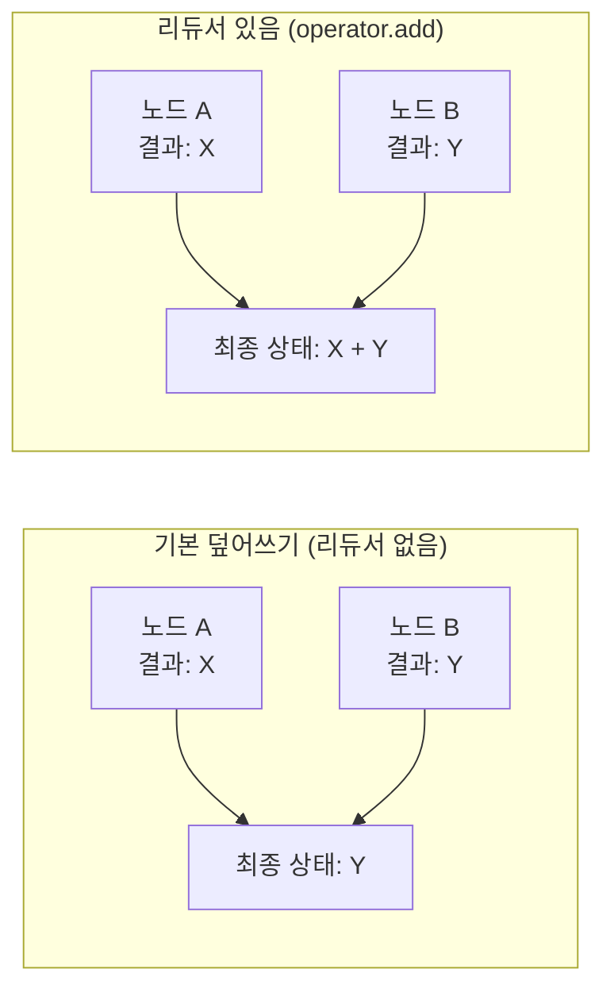
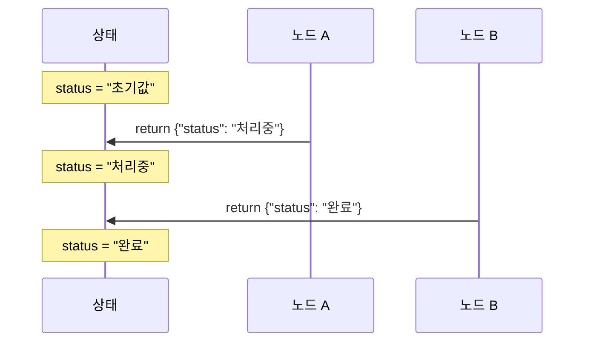
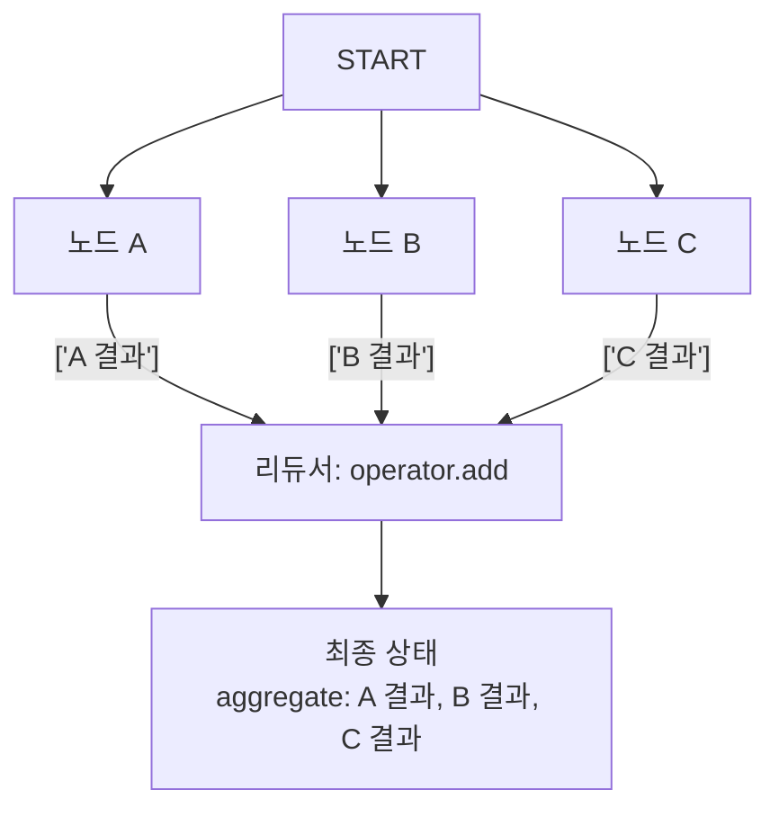
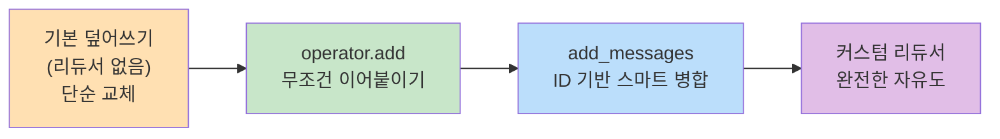
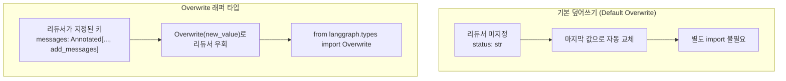
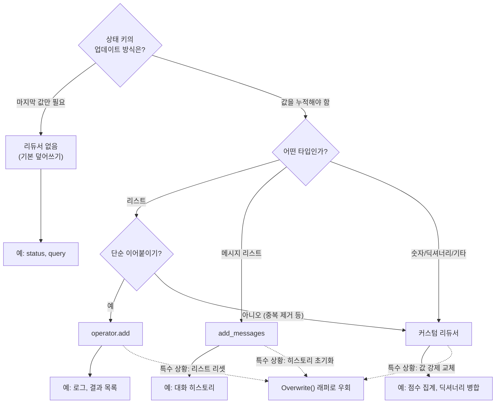

# 리듀서와 상태 업데이트 패턴

> LangGraph 리듀서의 동작 원리를 파헤치고, 다양한 상태 업데이트 전략을 실전에서 활용하는 법을 배웁니다

## 개요

이 섹션에서는 [상태 스키마 정의](04-ch4-langgraph-stategraph-기초/02-02-상태-스키마-정의.md)에서 맛보기로 살펴본 리듀서(Reducer)를 본격적으로 파헤칩니다. `operator.add`, `add_messages` 같은 내장 리듀서부터 비즈니스 로직에 맞는 커스텀 리듀서 작성, 그리고 `langgraph.types`의 `Overwrite()` 래퍼를 활용한 상태 강제 교체까지 — 상태 업데이트의 모든 패턴을 다룹니다.

**선수 지식**: [상태 스키마 정의](04-ch4-langgraph-stategraph-기초/02-02-상태-스키마-정의.md)의 `TypedDict`, `Annotated` 타입 / [노드와 엣지 구성](04-ch4-langgraph-stategraph-기초/03-03-노드와-엣지-구성.md)의 `add_node`, `add_edge`, `invoke` / [대화 히스토리 구조와 add_messages](03-ch3-대화-메모리와-상태-관리/03-03-대화-히스토리-구조와-add_messages.md)의 `add_messages` 동작 원리

**학습 목표**:
- 리듀서가 없는 상태(기본 덮어쓰기)와 리듀서가 있는 상태의 차이를 설명할 수 있다
- `operator.add`, `add_messages`, 커스텀 리듀서를 상황에 맞게 선택할 수 있다
- 병렬 노드 실행 시 리듀서의 병합 동작을 예측할 수 있다
- `Overwrite()` 래퍼 타입으로 리듀서를 우회하는 시점을 판단할 수 있다
- 불변성 원칙을 지키며 부수효과 없는 노드를 작성할 수 있다

## 왜 알아야 할까?

LangGraph에서 노드는 독립적으로 실행되는 작은 함수들이죠. 문제는 **여러 노드가 같은 상태 키를 동시에 건드릴 때** 발생합니다. 예를 들어, 검색 노드와 분석 노드가 둘 다 `results` 리스트에 항목을 추가하려 한다면? 리듀서 없이는 마지막에 실행된 노드의 값만 남고 나머지는 사라집니다.

리듀서를 제대로 이해하면:
- **병렬 실행**에서도 데이터 손실 없이 상태를 안전하게 병합할 수 있습니다
- **대화 히스토리**가 매끄럽게 누적됩니다
- **복잡한 비즈니스 로직**(투표, 점수 집계, 중복 제거)을 상태 레벨에서 처리할 수 있습니다
- **디버깅**이 쉬워집니다 — 상태 변화를 추적하고 재현할 수 있거든요

> 📊 **그림 1**: 기본 덮어쓰기 vs 리듀서가 있는 상태의 차이



리듀서는 "여러 업데이트를 어떻게 합칠 것인가?"에 대한 **선언적 규칙**입니다. 이 규칙만 잘 정해두면 나머지는 LangGraph가 알아서 처리해줍니다.

> ⚠️ **흔한 오해**: 이 섹션에서 "Overwrite"라는 단어가 두 가지 맥락으로 등장합니다. **(1) 기본 덮어쓰기(default overwrite)** — 리듀서를 지정하지 않았을 때 LangGraph가 마지막 값으로 교체하는 기본 동작, **(2) `Overwrite()` 래퍼 타입** — `langgraph.types`에서 제공하는 클래스로, 리듀서가 지정된 키라도 강제로 값을 교체하는 명시적 도구. 이 둘은 완전히 다른 메커니즘이니 헷갈리지 마세요!

## 핵심 개념

### 개념 1: 기본 덮어쓰기(Default Overwrite) — 리듀서 없는 상태의 기본 동작

> 💡 **비유**: 화이트보드에 글을 쓴다고 생각해보세요. 누군가 새로 쓰면 이전 내용은 지워지고 새 내용만 남습니다. 이게 바로 리듀서가 없을 때의 기본 동작입니다.

`Annotated`로 리듀서를 지정하지 않은 상태 키는 **기본 덮어쓰기(default overwrite)** 모드로 동작합니다. 새로운 값이 들어오면 기존 값을 완전히 교체하죠. 이것은 LangGraph의 내장 동작이며, 별도의 타입을 import할 필요가 없습니다.

```python
from typing_extensions import TypedDict

class State(TypedDict):
    query: str          # 리듀서 없음 → 기본 덮어쓰기
    status: str         # 리듀서 없음 → 기본 덮어쓰기
    result: dict        # 리듀서 없음 → 기본 덮어쓰기
```

이 방식은 **단일 값**을 관리할 때 적합합니다. 현재 상태 플래그(`"processing"` → `"analyzing"` → `"done"`), 최종 결과값, 사용자 입력처럼 **항상 최신 값 하나만 유지**하면 되는 경우가 대표적이죠. 값의 이력을 추적할 필요가 없고, 가장 마지막에 세팅된 값만 의미 있는 상황에서 사용합니다.

> 📊 **그림 2**: 기본 덮어쓰기 동작의 시간 흐름



하지만 **병렬 실행**에서는 주의가 필요합니다. 두 노드가 같은 키를 동시에 업데이트하면, 기본 덮어쓰기 모드에서는 어떤 값이 남을지 보장할 수 없습니다:

```python
from langgraph.graph import StateGraph, START, END

class State(TypedDict):
    result: str  # 리듀서 없음 — 기본 덮어쓰기

def node_a(state: State) -> dict:
    return {"result": "A의 결과"}

def node_b(state: State) -> dict:
    return {"result": "B의 결과"}

builder = StateGraph(State)
builder.add_node("a", node_a)
builder.add_node("b", node_b)
# 둘 다 START에서 동시 출발 → 같은 키에 동시 쓰기 → 충돌!
builder.add_edge(START, "a")
builder.add_edge(START, "b")
builder.add_edge("a", END)
builder.add_edge("b", END)

graph = builder.compile()
# InvalidUpdateError 발생 가능!
```

> ⚠️ **흔한 오해**: "리듀서 없으면 순서대로 덮어쓰겠지"라고 생각하기 쉬운데, 병렬 슈퍼스텝에서는 **두 업데이트가 동시에** 도착합니다. LangGraph는 리듀서 없이 같은 키에 대한 병렬 업데이트를 허용하지 않습니다.

### 개념 2: operator.add — 리스트 누적의 기본기

> 💡 **비유**: 여러 사람이 각자 종이에 할 일 목록을 적어서 제출하면, 비서가 모든 종이를 받아 하나의 긴 목록으로 합치는 것과 같습니다. 순서대로 이어붙이기만 하죠.

Python 표준 라이브러리 `operator.add`는 LangGraph에서 가장 많이 쓰이는 리듀서입니다. 리스트를 **이어붙이기(concatenation)** 해줍니다:

```run:python
import operator
from typing import Annotated
from typing_extensions import TypedDict

class State(TypedDict):
    items: Annotated[list[str], operator.add]

# 리듀서 시뮬레이션
current = ["기존 항목"]
update = ["새 항목 1", "새 항목 2"]

# operator.add가 하는 일:
result = operator.add(current, update)
print(f"기존: {current}")
print(f"업데이트: {update}")
print(f"병합 결과: {result}")
```

```output
기존: ['기존 항목']
업데이트: ['새 항목 1', '새 항목 2']
병합 결과: ['기존 항목', '새 항목 1', '새 항목 2']
```

> 📊 **그림 3**: operator.add의 병렬 병합 과정



실제 그래프에서 사용하는 모습을 볼까요:

```python
import operator
from typing import Annotated
from typing_extensions import TypedDict
from langgraph.graph import StateGraph, START, END

class State(TypedDict):
    aggregate: Annotated[list[str], operator.add]

def node_a(state: State) -> dict:
    return {"aggregate": ["A 처리 완료"]}

def node_b(state: State) -> dict:
    return {"aggregate": ["B 처리 완료"]}

def node_c(state: State) -> dict:
    return {"aggregate": ["C 처리 완료"]}

builder = StateGraph(State)
builder.add_node("a", node_a)
builder.add_node("b", node_b)
builder.add_node("c", node_c)

# a → b, c 동시 실행 → END
builder.add_edge(START, "a")
builder.add_edge("a", "b")
builder.add_edge("a", "c")
builder.add_edge("b", END)
builder.add_edge("c", END)

graph = builder.compile()
result = graph.invoke({"aggregate": []})
# result["aggregate"] = ["A 처리 완료", "B 처리 완료", "C 처리 완료"]
```

여기서 핵심은 노드 B와 C가 **동시에 실행**되더라도 `operator.add` 리듀서 덕분에 양쪽 결과가 모두 안전하게 합쳐진다는 점입니다.

### 개념 3: add_messages — 리듀서 관점에서 다시 보기

> 💡 **비유**: `operator.add`가 무조건 이어붙이는 "단순 비서"라면, `add_messages`는 **중복 편지를 걸러내고, 수정본은 교체하고, 취소 요청은 삭제하는 "스마트 비서"**입니다.

[대화 히스토리 구조와 add_messages](03-ch3-대화-메모리와-상태-관리/03-03-대화-히스토리-구조와-add_messages.md)에서 `add_messages`의 동작 원리 — ID 기반 병합, 기존 메시지 교체, `RemoveMessage`를 통한 삭제 — 를 자세히 배웠습니다. 이번 섹션에서는 그 지식을 전제로, **리듀서 체계 안에서 `add_messages`가 어떤 위치를 차지하는지**에 초점을 맞춥니다.

핵심은 `add_messages`가 단순한 `operator.add`보다 **훨씬 정교한 리듀서**라는 점입니다:

| 비교 기준 | `operator.add` | `add_messages` |
|-----------|---------------|----------------|
| **병합 전략** | 무조건 이어붙이기 | ID 기반 스마트 병합 |
| **중복 처리** | 중복 허용 | 같은 ID → 교체 |
| **삭제 지원** | 불가 | `RemoveMessage`로 선택적 삭제 |
| **타입 변환** | 없음 | 딕셔너리 → `BaseMessage` 자동 변환 |
| **적용 대상** | 범용 리스트 | `BaseMessage` 리스트 전용 |

> 📊 **그림 4**: 리듀서 정교함 스펙트럼 — 기본 덮어쓰기부터 커스텀 리듀서까지



StateGraph에서 `add_messages`를 리듀서로 선언하는 방법은 다른 리듀서와 동일합니다:

```python
from typing import Annotated
from typing_extensions import TypedDict
from langgraph.graph.message import add_messages
from langchain_core.messages import BaseMessage

class AgentState(TypedDict):
    messages: Annotated[list[BaseMessage], add_messages]  # 스마트 리듀서
    steps: Annotated[list[str], operator.add]              # 단순 리듀서
    status: str                                            # 리듀서 없음
```

이 선언만으로 LangGraph가 메시지 히스토리 관리를 자동으로 처리합니다. 노드에서는 단순히 새 메시지를 반환하면 되고, ID 기반 병합이나 교체 로직은 리듀서가 알아서 수행하죠.

실전에서 `add_messages`가 다른 리듀서와 **조합**되는 패턴을 자주 보게 됩니다:

```python
def chat_node(state: AgentState) -> dict:
    """대화 노드 — 여러 리듀서가 동시에 동작"""
    response = llm.invoke(state["messages"])
    return {
        "messages": [response],                # add_messages 리듀서 → 스마트 병합
        "steps": [f"LLM 응답 생성"],            # operator.add 리듀서 → 이어붙이기
        "status": "응답 완료",                   # 기본 덮어쓰기 → 교체
    }
```

하나의 노드 반환값이 **세 가지 다른 리듀서**를 동시에 트리거합니다. 이것이 리듀서 시스템의 진정한 힘입니다 — 각 상태 키가 자신만의 업데이트 규칙을 독립적으로 갖고, 노드는 그 규칙을 의식할 필요 없이 값만 반환하면 됩니다.

> 🔥 **실무 팁**: `add_messages`의 ID 기반 교체와 `RemoveMessage` 삭제에 대한 자세한 동작 방식과 코드 예제는 [대화 히스토리 구조와 add_messages](03-ch3-대화-메모리와-상태-관리/03-03-대화-히스토리-구조와-add_messages.md)를 참조하세요. 이 섹션에서는 리듀서 선택 전략에 집중합니다.

### 개념 4: 커스텀 리듀서 — 나만의 병합 규칙 만들기

> 💡 **비유**: 투표함을 생각해보세요. 여러 사람이 투표지를 넣으면, 개표 방법(다수결? 가중 평균? 만장일치?)은 우리가 정합니다. 커스텀 리듀서는 바로 이 "개표 방법"을 직접 정의하는 것입니다.

내장 리듀서로 해결되지 않는 경우, 커스텀 리듀서를 작성할 수 있습니다. 리듀서 함수는 두 인자를 받습니다 — **현재 값(left)**과 **새로운 값(right)**.

```python
from typing import Annotated
from typing_extensions import TypedDict

# 1) 중복 제거 리듀서
def unique_list(left: list[str], right: list[str]) -> list[str]:
    """중복 없이 항목을 추가"""
    seen = set(left)
    result = list(left)
    for item in right:
        if item not in seen:
            result.append(item)
            seen.add(item)
    return result

# 2) 최대값 유지 리듀서
def keep_max(left: float, right: float) -> float:
    """항상 더 큰 값을 유지"""
    return max(left, right)

# 3) 딕셔너리 깊은 병합 리듀서
def deep_merge(left: dict, right: dict) -> dict:
    """딕셔너리를 재귀적으로 병합"""
    result = left.copy()
    for key, value in right.items():
        if key in result and isinstance(result[key], dict) and isinstance(value, dict):
            result[key] = deep_merge(result[key], value)
        else:
            result[key] = value
    return result

class AnalysisState(TypedDict):
    tags: Annotated[list[str], unique_list]        # 중복 없는 태그 목록
    confidence: Annotated[float, keep_max]          # 최고 신뢰도 유지
    metadata: Annotated[dict, deep_merge]           # 메타데이터 병합
```

커스텀 리듀서를 작성할 때 반드시 지켜야 할 **두 가지 원칙**이 있습니다:

1. **순수 함수(Pure Function)**: 입력만으로 결과가 결정되어야 합니다. `print()`, 파일 쓰기, API 호출 같은 부수효과는 금물입니다.
2. **입력 불변(No Mutation)**: `left`와 `right`를 직접 수정하지 마세요. 새로운 값을 만들어 반환해야 합니다.

```python
# ❌ 나쁜 리듀서 — 부수효과 + 입력 변경
def bad_reducer(left: list, right: list) -> list:
    print(f"병합 중: {left} + {right}")  # 부수효과!
    left.extend(right)                     # 입력 변경!
    return left

# ✅ 좋은 리듀서 — 순수 함수 + 불변
def good_reducer(left: list, right: list) -> list:
    return left + right  # 새 리스트 반환
```

### 개념 5: `Overwrite()` 래퍼 타입 — 리듀서를 명시적으로 우회하기

> 💡 **비유**: 화이트보드에 "수정 금지"라고 써놔도, 가끔은 전부 지우고 새로 써야 할 때가 있죠. `Overwrite()`는 리듀서를 무시하고 값을 **통째로 교체**하는 "비상 버튼"입니다.

앞서 개념 1에서 배운 **기본 덮어쓰기(default overwrite)**는 리듀서를 *지정하지 않았을 때*의 기본 동작이었죠. 여기서 소개하는 `Overwrite()`는 전혀 다릅니다 — `langgraph.types`에서 import하는 **명시적 래퍼 타입**으로, 리듀서가 *이미 지정되어 있는* 상태 키의 값을 강제로 교체할 때 사용합니다.

> 📊 **그림 5**: 기본 덮어쓰기 vs `Overwrite()` 래퍼 — 동작 비교



두 개념의 차이를 명확히 정리하면:

| 구분 | 기본 덮어쓰기 (Default Overwrite) | `Overwrite()` 래퍼 타입 |
|------|----------------------------------|------------------------|
| **발동 조건** | 리듀서를 지정하지 않은 상태 키 | 리듀서가 있는 키에서 명시적으로 사용 |
| **import** | 불필요 | `from langgraph.types import Overwrite` |
| **용도** | `status`, `query` 등 단일 값 관리 | 대화 요약 후 히스토리 초기화 등 특수 상황 |
| **동작** | 항상 마지막 값으로 교체 | 리듀서를 한 번만 건너뛰고 값을 통째로 교체 |

리듀서가 지정된 상태 키라도, 특정 상황에서는 기존 값을 완전히 교체하고 싶을 때가 있습니다. 예를 들어, 대화를 요약한 뒤 메시지 히스토리를 요약본으로 교체하는 경우:

```python
from langgraph.types import Overwrite  # 명시적 import 필요!
from langchain_core.messages import SystemMessage

def summarize_and_reset(state: State) -> dict:
    """대화를 요약하고 메시지 히스토리를 초기화"""
    messages = state["messages"]
    # LLM으로 요약 생성 (여기서는 간략화)
    summary = f"이전 대화 요약: {len(messages)}개 메시지 처리됨"
    
    # Overwrite()로 add_messages 리듀서를 우회하여 통째로 교체
    return {
        "messages": Overwrite([
            SystemMessage(content=summary)
        ])
    }
```

`Overwrite()` 없이 그냥 새 메시지 리스트를 반환하면, `add_messages` 리듀서가 기존 메시지 뒤에 **이어붙이기** 합니다. `Overwrite()`로 감싸야만 리듀서를 건너뛰고 값 자체를 교체할 수 있죠.

> ⚠️ **흔한 오해**: `Overwrite()`는 병렬 슈퍼스텝에서 **하나의 노드만** 사용할 수 있습니다. 두 노드가 같은 키에 동시에 `Overwrite()`를 시도하면 충돌이 발생합니다. 또한, 기본 덮어쓰기 모드의 키(리듀서 없는 키)에 `Overwrite()`를 쓸 필요는 없습니다 — 이미 덮어쓰기가 기본 동작이니까요.

> 📊 **그림 6**: 상태 업데이트 전략 결정 트리



## 실습: 직접 해보기

다양한 리듀서를 활용한 **다단계 문서 처리 파이프라인**을 구축해봅시다. 여러 분석 노드가 병렬로 실행되며 각자의 결과를 안전하게 합치는 그래프입니다.

```python
import operator
from typing import Annotated
from typing_extensions import TypedDict
from langgraph.graph import StateGraph, START, END


# --- 1) 커스텀 리듀서 정의 ---

def unique_tags(left: list[str], right: list[str]) -> list[str]:
    """중복 없이 태그를 누적하는 리듀서"""
    seen = set(left)
    result = list(left)
    for tag in right:
        if tag not in seen:
            result.append(tag)
            seen.add(tag)
    return result


def max_score(left: float, right: float) -> float:
    """항상 더 높은 점수를 유지하는 리듀서"""
    return max(left, right)


# --- 2) 상태 스키마 정의 ---

class DocState(TypedDict):
    text: str                                          # 기본 덮어쓰기 (원문)
    status: str                                        # 기본 덮어쓰기 (현재 상태)
    steps: Annotated[list[str], operator.add]           # 처리 단계 로그
    tags: Annotated[list[str], unique_tags]             # 중복 없는 태그
    quality_score: Annotated[float, max_score]          # 최고 품질 점수


# --- 3) 노드 함수 정의 ---

def preprocess(state: DocState) -> dict:
    """텍스트 전처리"""
    text = state["text"].strip().lower()
    return {
        "text": text,
        "status": "전처리 완료",
        "steps": ["전처리: 공백 제거 및 소문자 변환"],
        "quality_score": 0.5,
    }


def extract_keywords(state: DocState) -> dict:
    """키워드 추출 (병렬 노드 1)"""
    words = state["text"].split()
    # 간단한 키워드 추출: 3글자 이상 단어
    keywords = [w for w in words if len(w) >= 3][:5]
    return {
        "steps": ["키워드 추출 완료"],
        "tags": keywords,
        "quality_score": 0.7,
    }


def classify_topic(state: DocState) -> dict:
    """토픽 분류 (병렬 노드 2)"""
    text = state["text"]
    # 간단한 규칙 기반 분류
    topic_tags = []
    if "agent" in text or "에이전트" in text:
        topic_tags.append("AI-에이전트")
    if "graph" in text or "그래프" in text:
        topic_tags.append("그래프")
    if "state" in text or "상태" in text:
        topic_tags.append("상태관리")
    if not topic_tags:
        topic_tags.append("일반")
    return {
        "steps": ["토픽 분류 완료"],
        "tags": topic_tags,
        "quality_score": 0.8,
    }


def sentiment_analysis(state: DocState) -> dict:
    """감성 분석 (병렬 노드 3)"""
    text = state["text"]
    # 간단한 감성 판단
    positive_words = {"좋", "훌륭", "great", "good", "excellent"}
    score = sum(1 for w in text.split() if w in positive_words) * 0.1 + 0.6
    return {
        "steps": ["감성 분석 완료"],
        "tags": [f"감성-{score:.1f}"],
        "quality_score": score,
    }


def finalize(state: DocState) -> dict:
    """최종 결과 집계"""
    return {
        "status": "분석 완료",
        "steps": [f"최종 집계: {len(state['tags'])}개 태그, "
                  f"품질 {state['quality_score']:.1f}"],
    }


# --- 4) 그래프 구성 ---

builder = StateGraph(DocState)

builder.add_node("preprocess", preprocess)
builder.add_node("keywords", extract_keywords)
builder.add_node("classify", classify_topic)
builder.add_node("sentiment", sentiment_analysis)
builder.add_node("finalize", finalize)

# 전처리 → 3개 분석 노드 병렬 → 최종 집계
builder.add_edge(START, "preprocess")
builder.add_edge("preprocess", "keywords")
builder.add_edge("preprocess", "classify")
builder.add_edge("preprocess", "sentiment")
builder.add_edge("keywords", "finalize")
builder.add_edge("classify", "finalize")
builder.add_edge("sentiment", "finalize")
builder.add_edge("finalize", END)

graph = builder.compile()

# --- 5) 실행 ---

result = graph.invoke({
    "text": "  LangGraph Agent는 State Graph를 사용하여 상태를 관리합니다  ",
    "status": "시작",
    "steps": [],
    "tags": [],
    "quality_score": 0.0,
})

print("=== 문서 분석 결과 ===")
print(f"상태: {result['status']}")
print(f"품질 점수: {result['quality_score']}")
print(f"태그: {result['tags']}")
print(f"\n처리 단계:")
for i, step in enumerate(result["steps"], 1):
    print(f"  {i}. {step}")
```

이 실습 코드의 핵심 포인트를 정리하면:

| 상태 키 | 리듀서 | 동작 |
|---------|--------|------|
| `text` | 없음 (기본 덮어쓰기) | 전처리 노드가 정제된 텍스트로 교체 |
| `status` | 없음 (기본 덮어쓰기) | 마지막 노드의 상태만 유지 |
| `steps` | `operator.add` | 모든 노드의 처리 로그가 순서대로 누적 |
| `tags` | `unique_tags` (커스텀) | 중복 없이 태그를 수집 |
| `quality_score` | `max_score` (커스텀) | 가장 높은 점수만 유지 |

병렬 노드(keywords, classify, sentiment)가 동시에 `steps`, `tags`, `quality_score`를 업데이트하지만, 각 리듀서가 적절한 병합 전략으로 데이터 손실 없이 합쳐줍니다.

## 더 깊이 알아보기

### 리듀서의 뿌리: 함수형 프로그래밍의 fold/reduce

리듀서라는 개념은 사실 LangGraph가 발명한 것이 아닙니다. 1960년대 LISP에서 시작된 **fold** 연산이 그 기원입니다. JavaScript의 `Array.reduce()`, Python의 `functools.reduce()`, 그리고 웹 프론트엔드 세계에서 유명한 **Redux**까지 — 모두 같은 뿌리에서 나온 개념이죠.

Redux의 창시자 Dan Abramov는 2015년 React Europe 컨퍼런스에서 "핫 리로딩과 타임 트래블 디버깅"을 데모하며 Redux를 소개했는데, LangGraph가 추구하는 "체크포인트와 타임 트래블"과 놀라울 정도로 닮아있습니다. LangGraph의 리듀서가 Redux의 reducer와 같은 이름을 쓰는 건 우연이 아닙니다.

핵심 공통 원칙은 동일합니다:
1. **상태는 불변(immutable)** — 직접 수정하지 않고 새 값을 반환
2. **순수 함수(pure function)** — 같은 입력에는 항상 같은 출력
3. **중앙 집중 관리** — 상태 변경은 정해진 경로를 통해서만

### Google Pregel과 슈퍼스텝의 만남

[LangGraph 아키텍처 개관](04-ch4-langgraph-stategraph-기초/01-01-langgraph-아키텍처-개관.md)에서 배운 것처럼, LangGraph는 Google의 Pregel 모델에서 영감을 받았습니다. Pregel에서 각 정점(vertex)은 **슈퍼스텝**마다 이웃에게 메시지를 보내고, 수신된 메시지를 **combine 함수**로 합칩니다. 이 combine 함수가 바로 LangGraph의 리듀서에 해당합니다.

Pregel 논문(2010, Google)에서 제안한 "Think Like a Vertex" 패러다임은 노드 단위의 독립적 연산 + 리듀서 기반 상태 합산이라는 구조를 확립했고, 이것이 10여 년 뒤 AI 에이전트 오케스트레이션에 재활용된 것입니다.

## 흔한 오해와 팁

> ⚠️ **흔한 오해**: "리듀서를 쓰면 성능이 떨어진다"고 생각하는 분들이 있습니다. 리듀서는 Python 함수 한 번 호출일 뿐이고, LLM 호출 비용에 비하면 무시할 수 있는 수준입니다. 성능 걱정 말고 안전한 상태 관리에 집중하세요.

> ⚠️ **흔한 오해**: "기본 덮어쓰기와 `Overwrite()` 래퍼는 같은 거 아냐?"라고 혼동하는 분들이 많습니다. 기본 덮어쓰기는 리듀서를 **안 붙인** 키의 자동 동작이고, `Overwrite()`는 리듀서가 **이미 붙어 있는** 키에서 그 리듀서를 한 번 건너뛰기 위해 사용하는 명시적 래퍼입니다. 리듀서 없는 키에 `Overwrite()`를 쓸 필요는 없습니다.

> 💡 **알고 계셨나요?**: `operator.add`는 리스트뿐 아니라 **숫자의 덧셈**에도 쓸 수 있습니다. `counter: Annotated[int, operator.add]`로 정의하면 각 노드가 반환하는 숫자가 누적됩니다. `return {"counter": 1}`을 3개 노드에서 반환하면 최종 값은 3이 되죠.

> 🔥 **실무 팁**: 노드 함수에서 상태를 읽을 때는 방어적으로 접근하세요. 상태 키가 아직 초기화되지 않았을 수 있습니다. `state.get("key", default_value)` 패턴을 사용하거나, 상태 스키마에 기본값을 설정하세요. 특히 `Annotated[list, operator.add]` 타입은 초기값으로 빈 리스트 `[]`를 넘기는 것이 안전합니다.

> 🔥 **실무 팁**: 노드 함수는 반드시 **딕셔너리를 반환**해야 하며, 변경되지 않은 키는 생략하세요. 모든 키를 반환하면 불필요한 리듀서 호출이 발생합니다. `return {"steps": ["새 단계"]}` 처럼 변경된 키만 반환하는 것이 정석입니다.

## 핵심 정리

| 개념 | 설명 |
|------|------|
| 기본 덮어쓰기 (Default Overwrite) | 리듀서 미지정 시 마지막 값으로 자동 교체. 단일 값(status, query)에 적합. import 불필요 |
| `operator.add` | 리스트 이어붙이기. 로그, 결과 목록 누적에 사용 |
| `add_messages` | Ch3에서 배운 스마트 리듀서 — ID 기반 병합 + 교체 + 삭제. 대화 히스토리 전용 |
| 커스텀 리듀서 | `(left, right) -> merged` 시그니처의 순수 함수. 중복 제거, 최대값 등 자유로운 병합 로직 |
| `Overwrite()` 래퍼 타입 | `langgraph.types`에서 import. 리듀서가 있는 키의 값을 강제 교체. 병렬 슈퍼스텝에서 한 노드만 사용 가능 |
| 불변성 원칙 | 노드는 상태를 직접 수정하지 않고, 변경할 키만 담은 새 딕셔너리를 반환 |
| 순수 함수 원칙 | 리듀서에 `print()`, 파일 I/O 등 부수효과 금지 |

## 다음 섹션 미리보기

리듀서와 상태 업데이트 패턴을 모두 익혔으니, 이제 **진짜 에이전트**를 만들 차례입니다! [첫 번째 LangGraph 에이전트](04-ch4-langgraph-stategraph-기초/05-05-첫-번째-langgraph-에이전트.md)에서는 Ch4에서 배운 StateGraph, 상태 스키마, 노드/엣지, 리듀서를 모두 결합하여 LLM과 도구를 연동하는 완전한 에이전트를 구축합니다. Ch1~Ch3의 ReAct 패턴과 도구 호출 지식이 LangGraph 위에서 어떻게 꽃피우는지 직접 체험하게 될 것입니다.

## 참고 자료

- [LangGraph 공식 문서 — Use the Graph API](https://docs.langchain.com/oss/python/langgraph/use-graph-api) - 상태 정의, 리듀서, Overwrite 등 핵심 API의 공식 레퍼런스
- [LangGraph 101 Tutorial Repository](https://github.com/langchain-ai/langgraph-101) - LangGraph 팀이 제공하는 공식 튜토리얼 노트북. 리듀서 패턴 예제 포함
- [LangGraph Cheatsheet — Writing LangGraph Code](https://sumanmichael.github.io/langgraph-cheatsheet/cheatsheet/writing-langgraph-code/) - 리듀서 전략, 노드 반환 패턴, 상태 최적화 등 실전 모범 사례 정리
- [Mastering State Reducers in LangGraph (Medium)](https://medium.com/data-science-collective/mastering-state-reducers-in-langgraph-a-complete-guide-b049af272817) - 커스텀 리듀서 작성과 병렬 상태 병합에 대한 상세 가이드
- [LangGraph Durable Execution 공식 문서](https://docs.langchain.com/oss/python/langgraph/durable-execution) - 불변성, 부수효과 관리, task 래핑 등 프로덕션 레벨 상태 관리

---
### 🔗 Related Sessions
- [add_messages](03-ch3-대화-메모리와-상태-관리/01-01-대화-메모리의-기초.md) (prerequisite)
- [add_node](04-ch4-langgraph-stategraph-기초/03-03-노드와-엣지-구성.md) (prerequisite)
- [add_edge](04-ch4-langgraph-stategraph-기초/03-03-노드와-엣지-구성.md) (prerequisite)
- [start](04-ch4-langgraph-stategraph-기초/03-03-노드와-엣지-구성.md) (prerequisite)
- [end](04-ch4-langgraph-stategraph-기초/03-03-노드와-엣지-구성.md) (prerequisite)
- [messagesstate](04-ch4-langgraph-stategraph-기초/02-02-상태-스키마-정의.md) (prerequisite)
- [compile](04-ch4-langgraph-stategraph-기초/03-03-노드와-엣지-구성.md) (prerequisite)
- [invoke](04-ch4-langgraph-stategraph-기초/03-03-노드와-엣지-구성.md) (prerequisite)
