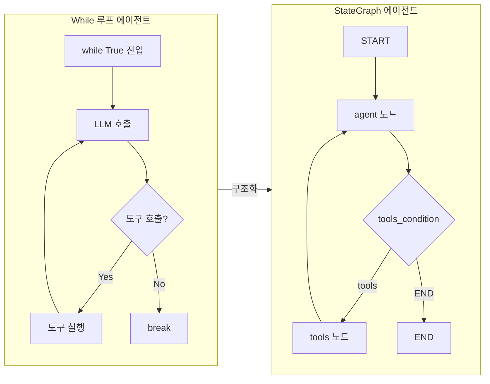
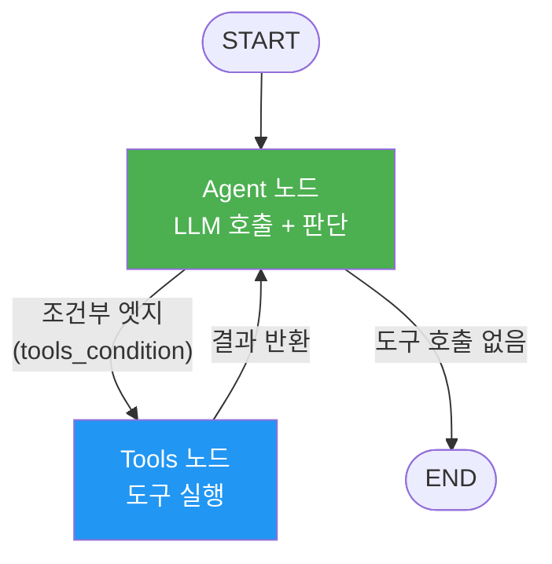
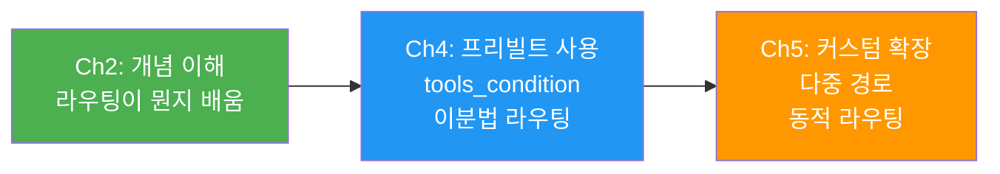
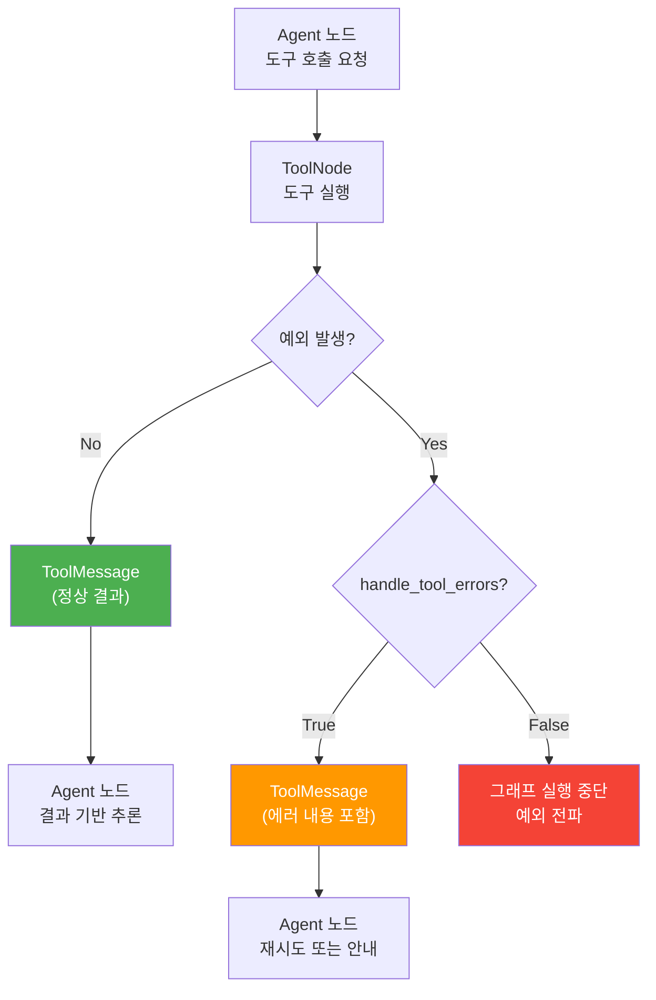
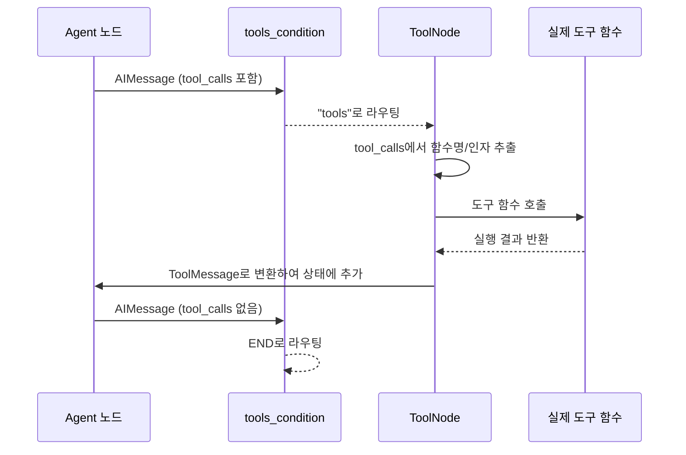
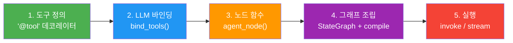
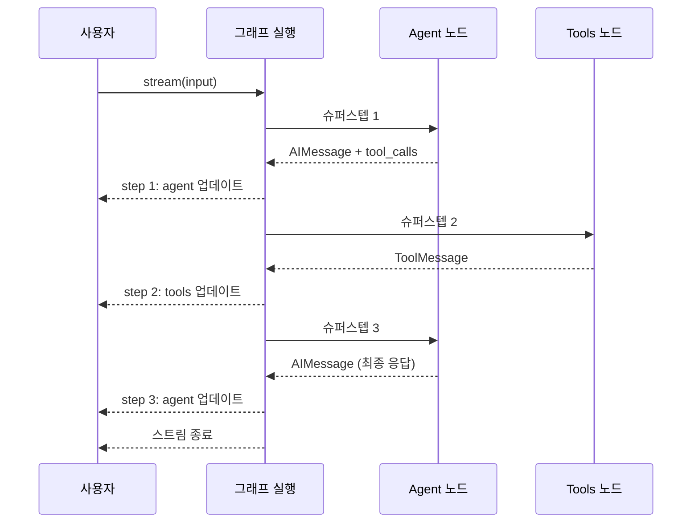

# 첫 번째 LangGraph 에이전트

> Ch4에서 배운 모든 것을 결합하여 도구를 호출하는 완전한 LangGraph 에이전트를 구축하고, 그래프를 시각화하며 실행 흐름을 단계별로 추적합니다.

## 개요

드디어 이번 챕터의 피날레입니다. [LangGraph 아키텍처](04-ch4-langgraph-stategraph-기초/01-01-langgraph-아키텍처-개관.md)에서 시작하여 [상태 스키마](04-ch4-langgraph-stategraph-기초/02-02-상태-스키마-정의.md), [노드와 엣지](04-ch4-langgraph-stategraph-기초/03-03-노드와-엣지-구성.md), [리듀서](04-ch4-langgraph-stategraph-기초/04-04-리듀서와-상태-업데이트-패턴.md)까지 쌓아올린 퍼즐 조각들을 하나로 조립합니다. 결과물은 LLM이 자체적으로 판단하여 도구를 호출하고, 결과를 반영해 다시 추론하는 **완전한 에이전트 루프**입니다.

**선수 지식**:
- StateGraph, compile(), invoke/stream (세션 4.1~4.3)
- MessagesState와 add_messages 리듀서 (세션 4.2)
- 노드 함수 시그니처와 엣지 연결 패턴 (세션 4.3)
- `@tool` 데코레이터와 도구 호출 메커니즘 (Ch1)
- 조건부 라우팅의 개념 (Ch2 세션 3~4에서 개념적으로 소개)

**학습 목표**:
- LLM + 도구 호출을 StateGraph 에이전트로 구현할 수 있다
- `ToolNode`와 `tools_condition` 프리빌트 컴포넌트를 활용할 수 있다
- `get_graph().draw_mermaid()`로 그래프 구조를 시각화할 수 있다
- `stream`으로 에이전트의 매 슈퍼스텝을 추적할 수 있다

## 왜 알아야 할까?

Ch1~Ch3에서 우리는 LLM 도구 호출과 ReAct 루프를 **직접 while문**으로 구현했습니다. 동작은 했지만, 분기가 복잡해지면 if/elif 지옥이 되고, 상태 관리는 개발자의 기억력에 의존하게 됩니다.

StateGraph 에이전트는 이 문제를 구조적으로 해결합니다. "LLM이 도구를 호출했으면 → 도구 노드로, 아니면 → 종료"라는 로직이 **그래프의 엣지**로 선언됩니다. 상태는 MessagesState가 자동 관리하고, 실행 흐름은 그래프가 보장합니다.

이것이 중요한 이유는 **재현 가능성**입니다. while 루프 에이전트는 디버깅할 때 "도대체 몇 번째 루프에서 뭘 했지?"를 추적하기 어렵습니다. StateGraph 에이전트는 매 슈퍼스텝의 상태가 기록되고, 그래프 구조 자체가 문서가 됩니다.

> 📊 **그림 1**: while 루프 에이전트 vs StateGraph 에이전트 비교



## 핵심 개념

### 개념 1: 에이전트 그래프의 구조 — 세 가지 구성 요소

> 💡 **비유**: 에이전트 그래프는 **식당 주방의 주문 시스템**과 같습니다. 셰프(LLM)가 주문을 보고 "이건 오븐이 필요해"라고 판단하면 → 오븐 담당(도구 노드)이 실행 → 결과를 다시 셰프에게 전달 → 셰프가 "이제 됐다" 판단하면 서빙. 이 흐름이 메뉴판(그래프)에 미리 정의되어 있는 겁니다.

도구 호출 에이전트의 StateGraph는 딱 세 가지 구성 요소로 이루어집니다:

1. **Agent 노드**: LLM을 호출하여 다음 행동을 결정합니다. 도구를 호출할지, 최종 응답을 할지 판단합니다.
2. **Tools 노드**: Agent 노드가 요청한 도구를 실행하고 결과를 반환합니다.
3. **조건부 엣지**: Agent의 응답에 도구 호출이 포함되어 있으면 Tools 노드로, 아니면 END로 라우팅합니다.

> 📊 **그림 2**: 에이전트 그래프의 세 가지 구성 요소



이 패턴은 LangGraph 에이전트의 **표준 아키텍처**입니다. Ch5에서 배울 조건 분기, Ch7의 Human-in-the-Loop 등 모든 고급 패턴이 이 기본 구조 위에 확장됩니다.

### 개념 2: ToolNode와 tools_condition — 프리빌트 컴포넌트

> 💡 **비유**: 매번 식당을 열 때마다 주방 장비를 처음부터 만들 필요는 없겠죠? LangGraph의 `ToolNode`와 `tools_condition`은 **기성품 주방 장비**와 같습니다. 도구 실행과 라우팅이라는 반복적인 패턴을 미리 만들어둔 것입니다.

`langgraph-prebuilt` 패키지는 에이전트 구축에 필요한 핵심 컴포넌트를 제공합니다:

**`ToolNode`**: 도구 실행을 담당하는 프리빌트 노드입니다. LLM 응답의 `tool_calls`를 읽어서 해당 도구를 실행하고, 결과를 `ToolMessage`로 변환하여 상태에 추가합니다.

**`tools_condition`**: 조건부 엣지에 사용하는 프리빌트 라우팅 함수입니다. [Ch2에서 "도구 호출 여부에 따라 분기한다"는 개념](02-ch2-langchain-에이전트-프레임워크/03-03-에이전트-루프의-이해.md)을 배웠는데, `tools_condition`은 바로 그 개념의 **공식 구현**입니다. 마지막 메시지에 `tool_calls`가 있으면 `"tools"`를 반환하고, 없으면 `END`를 반환합니다.

```python
from langgraph.prebuilt import ToolNode, tools_condition

# ToolNode에 도구 리스트를 전달하면 끝
tool_node = ToolNode([search, calculator])

# tools_condition은 그대로 조건부 엣지에 연결
builder.add_conditional_edges("agent", tools_condition)
```

여기서 핵심은 `tools_condition`이 **이분법적 라우팅**(도구 호출 O/X)만 제공한다는 점입니다. "이 질문은 검색이 필요하니 A 노드로, 계산이 필요하니 B 노드로"와 같은 **다중 경로 라우팅**이 필요하다면, [Ch5에서 배울 커스텀 라우팅 함수](05-ch5-조건-분기와-동적-라우팅/01-01-조건부-엣지의-이해.md)로 확장해야 합니다.

정리하면, 라우팅 함수의 발전 단계는 이렇습니다:

> 📊 **그림 3**: 라우팅 함수의 발전 단계 — 개념에서 커스텀까지



> ⚠️ **흔한 오해**: "`ToolNode`를 쓰면 커스터마이징이 불가능하다"고 생각하는 분이 있는데, 사실 `ToolNode`는 `handle_tool_errors=True` 옵션으로 에러 처리를 활성화하거나, 직접 도구 노드 함수를 작성하여 완전히 대체할 수 있습니다. 프리빌트는 출발점이지 한계가 아닙니다.

#### handle_tool_errors의 동작 메커니즘

`ToolNode`의 `handle_tool_errors` 옵션은 에이전트의 **복원력(resilience)**을 결정하는 핵심 설정입니다. 기본값은 `True`인데, 이것이 어떻게 동작하는지 정확히 이해해둘 필요가 있습니다.

**`handle_tool_errors=True`일 때 (권장)**:
1. 도구 함수 실행 중 예외가 발생하면, `ToolNode`가 예외를 **catch**합니다
2. 에러 메시지를 `ToolMessage`의 `content`에 담아 상태에 추가합니다
3. 이 `ToolMessage`가 다시 Agent 노드로 전달됩니다
4. LLM은 에러 내용을 보고 **다른 인자로 재시도**하거나, 사용자에게 **에러 상황을 설명**합니다

**`handle_tool_errors=False`일 때**:
1. 도구 함수 실행 중 예외가 발생하면, 예외가 그대로 **상위로 전파**됩니다
2. 그래프 실행이 즉시 **중단**됩니다 — `invoke()`나 `stream()`이 에러를 던집니다

> 📊 **그림 4**: handle_tool_errors에 따른 에러 처리 흐름 비교



실제로 에러가 전파되는 과정을 코드로 살펴보면 이렇습니다:

```python
# handle_tool_errors=True 시, ToolNode 내부에서 일어나는 일 (간략화)
try:
    result = tool_function(**tool_args)
    return ToolMessage(content=str(result), tool_call_id=call_id)
except Exception as e:
    # 예외를 잡아서 에러 메시지로 변환
    error_msg = f"Error in {tool_name}: {repr(e)}"
    return ToolMessage(content=error_msg, tool_call_id=call_id)
```

LLM은 이 에러 메시지를 받으면 "아, 인자가 잘못됐구나" 하고 수정된 인자로 도구를 다시 호출하는 경우가 많습니다. 예를 들어 `calculate("2 ^ 10")`이 실패하면 LLM이 `calculate("2 ** 10")`으로 재시도하는 식이죠. 이런 **자기 복구(self-healing)** 능력이 에이전트의 핵심 장점입니다.

> 📊 **그림 5**: ToolNode의 내부 동작 흐름



### 개념 3: 에이전트 구축 — 5단계 레시피

> 💡 **비유**: 레고 조립 설명서처럼, LangGraph 에이전트에도 정해진 조립 순서가 있습니다. 부품(도구, LLM, 상태)을 준비하고 → 설계도(그래프)에 따라 연결하고 → 완성품(컴파일)을 만듭니다.

에이전트 구축은 5단계로 진행됩니다:

**1단계: 도구 정의**

```python
from langchain_core.tools import tool

@tool
def search_web(query: str) -> str:
    """웹에서 최신 정보를 검색합니다."""
    # 실제 구현에서는 검색 API 호출
    return f"'{query}'에 대한 검색 결과입니다."

@tool
def calculate(expression: str) -> str:
    """수학 표현식을 계산합니다."""
    try:
        result = eval(expression)  # 실습용 — 프로덕션에서는 안전한 파서 사용
        return str(result)
    except Exception as e:
        return f"계산 오류: {e}"
```

**2단계: LLM에 도구 바인딩**

```python
from langchain_openai import ChatOpenAI

tools = [search_web, calculate]
llm = ChatOpenAI(model="gpt-4o-mini", temperature=0)
llm_with_tools = llm.bind_tools(tools)
```

`bind_tools()`는 LLM에게 "이런 도구들을 사용할 수 있어"라고 알려줍니다. LLM은 필요할 때 `tool_calls`를 포함한 AIMessage를 반환합니다.

**3단계: 노드 함수 정의**

```python
from langgraph.graph import MessagesState
from langchain_core.messages import SystemMessage

def agent_node(state: MessagesState) -> dict:
    """LLM을 호출하여 다음 행동을 결정합니다."""
    system = SystemMessage(content="당신은 도움이 되는 AI 어시스턴트입니다.")
    response = llm_with_tools.invoke([system] + state["messages"])
    return {"messages": [response]}
```

여기서 핵심은 반환값입니다. `{"messages": [response]}`를 반환하면 `MessagesState`의 `add_messages` 리듀서가 기존 메시지 목록에 새 메시지를 추가합니다 — 세션 4.2에서 배운 그대로입니다.

**4단계: 그래프 조립**

```python
from langgraph.graph import StateGraph, START, END
from langgraph.prebuilt import ToolNode, tools_condition

builder = StateGraph(MessagesState)

# 노드 추가
builder.add_node("agent", agent_node)
builder.add_node("tools", ToolNode(tools))

# 엣지 연결
builder.add_edge(START, "agent")
builder.add_conditional_edges("agent", tools_condition)
builder.add_edge("tools", "agent")

# 컴파일
agent = builder.compile()
```

**5단계: 실행**

```python
from langchain_core.messages import HumanMessage

result = agent.invoke({
    "messages": [HumanMessage(content="2의 10승은 얼마인가요?")]
})
print(result["messages"][-1].content)
```

> 📊 **그림 6**: 에이전트 구축 5단계 흐름



> 💡 **알고 계셨나요?**: 지금 만든 에이전트는 대화가 끝나면 모든 것을 잊습니다. MessagesState는 한 번의 `invoke()` 동안만 유효한 **단기 메모리**입니다. Ch3에서 배운 Store API(장기 메모리)를 StateGraph와 통합하면 이전 대화의 맥락을 기억하는 에이전트를 만들 수 있는데, 이 방법은 [Ch6. 체크포인트와 메모리 관리](06-ch6-체크포인트와-메모리-관리/01-01-체크포인터의-이해.md)에서 체크포인터와 함께 본격적으로 다룹니다.

### 개념 4: 그래프 시각화 — 구조를 눈으로 확인하기

> 💡 **비유**: 건축 설계를 마치면 도면을 출력해서 검토하듯, LangGraph도 완성된 그래프를 시각적으로 확인할 수 있습니다. "내가 만든 그래프가 의도대로 연결되어 있는가?"를 눈으로 검증하는 겁니다.

컴파일된 그래프는 `get_graph()` 메서드로 시각화할 수 있습니다:

```python
# Mermaid 다이어그램 코드 출력
print(agent.get_graph().draw_mermaid())
```

```run:python
# 출력되는 Mermaid 코드 예시
mermaid_code = """%%{init: {'flowchart': {'curve': 'linear'}}}%%
graph TD;
\t__start__([<p>__start__</p>]):::first
\tagent(agent)
\ttools(tools)
\t__end__([<p>__end__</p>]):::last
\t__start__ --> agent;
\tagent -.-> tools;
\tagent -.-> __end__;
\ttools --> agent;"""
print(mermaid_code)
```

```output
%%{init: {'flowchart': {'curve': 'linear'}}}%%
graph TD;
	__start__([<p>__start__</p>]):::first
	agent(agent)
	tools(tools)
	__end__([<p>__end__</p>]):::last
	__start__ --> agent;
	agent -.-> tools;
	agent -.-> __end__;
	tools --> agent;
```

PNG 이미지로 저장할 수도 있습니다:

```python
# PNG 이미지로 저장 (graphviz 또는 mermaid.ink 사용)
png_data = agent.get_graph().draw_mermaid_png()
with open("agent_graph.png", "wb") as f:
    f.write(png_data)
```

> 🔥 **실무 팁**: `draw_mermaid()`의 출력을 [Mermaid Live Editor](https://mermaid.live)에 붙여넣으면 브라우저에서 바로 그래프를 확인할 수 있습니다. CI/CD 파이프라인에서 자동으로 그래프 이미지를 생성하여 문서에 포함하는 팀도 많습니다.

### 개념 5: 단계별 실행 추적 — stream으로 슈퍼스텝 관찰

> 💡 **비유**: 요리 과정을 중간중간 사진으로 찍어두면 나중에 "어디서 잘못됐지?"를 찾기 쉽겠죠? `stream`은 에이전트의 매 단계를 사진처럼 캡처하여 보여주는 기능입니다.

`invoke`는 최종 결과만 반환하지만, `stream`은 **매 슈퍼스텝마다** 중간 상태를 반환합니다. 에이전트 디버깅에 필수적인 기능이거든요.

```python
from langchain_core.messages import HumanMessage

input_message = {"messages": [HumanMessage(content="17 * 24를 계산해줘")]}

for step in agent.stream(input_message, stream_mode="updates"):
    # step은 {노드명: 상태_업데이트} 딕셔너리
    for node_name, update in step.items():
        print(f"--- {node_name} ---")
        for msg in update.get("messages", []):
            print(f"  [{msg.__class__.__name__}] {msg.content[:100]}")
            if hasattr(msg, "tool_calls") and msg.tool_calls:
                for tc in msg.tool_calls:
                    print(f"  → 도구 호출: {tc['name']}({tc['args']})")
```

`stream_mode`에 따라 출력이 달라집니다:

| stream_mode | 반환 내용 | 용도 |
|-------------|----------|------|
| `"values"` | 매 슈퍼스텝의 전체 상태 | 상태 변화 전후 비교 |
| `"updates"` | 각 노드가 반환한 업데이트만 | 디버깅, 어떤 노드가 뭘 했는지 |
| `"messages"` | 메시지 토큰 단위 스트리밍 | 실시간 UI 표시 |

> 📊 **그림 7**: stream으로 관찰하는 에이전트 실행 흐름



## 실습: 직접 해보기

이제 Ch4의 모든 개념을 결합하여 **수학 계산 + 단위 변환이 가능한 에이전트**를 처음부터 끝까지 구축합니다.

```python
# === 1. 임포트 ===
from typing import Annotated
from langchain_core.tools import tool
from langchain_core.messages import HumanMessage, SystemMessage
from langchain_openai import ChatOpenAI
from langgraph.graph import StateGraph, MessagesState, START, END
from langgraph.prebuilt import ToolNode, tools_condition


# === 2. 도구 정의 ===
@tool
def calculate(expression: str) -> str:
    """수학 표현식을 계산합니다. 예: '2 ** 10', '(3 + 5) * 12'"""
    # 허용된 연산자만 포함하는지 간단 검증
    allowed = set("0123456789+-*/.()**% ")
    if not all(c in allowed for c in expression):
        return "오류: 허용되지 않은 문자가 포함되어 있습니다."
    try:
        result = eval(expression)  # 실습용 — 프로덕션에서는 numexpr 등 사용
        return f"{expression} = {result}"
    except Exception as e:
        return f"계산 오류: {e}"


@tool
def convert_unit(value: float, from_unit: str, to_unit: str) -> str:
    """단위를 변환합니다. 지원: km/mi, kg/lb, celsius/fahrenheit"""
    conversions = {
        ("km", "mi"): lambda v: v * 0.621371,
        ("mi", "km"): lambda v: v * 1.60934,
        ("kg", "lb"): lambda v: v * 2.20462,
        ("lb", "kg"): lambda v: v * 0.453592,
        ("celsius", "fahrenheit"): lambda v: v * 9 / 5 + 32,
        ("fahrenheit", "celsius"): lambda v: (v - 32) * 5 / 9,
    }
    key = (from_unit.lower(), to_unit.lower())
    if key not in conversions:
        return f"지원하지 않는 변환: {from_unit} → {to_unit}"
    result = conversions[key](value)
    return f"{value} {from_unit} = {result:.4f} {to_unit}"


# === 3. LLM + 도구 바인딩 ===
tools = [calculate, convert_unit]
llm = ChatOpenAI(model="gpt-4o-mini", temperature=0)
llm_with_tools = llm.bind_tools(tools)


# === 4. 노드 함수 정의 ===
SYSTEM_PROMPT = """당신은 수학 계산과 단위 변환을 도와주는 AI 어시스턴트입니다.
사용자의 질문에 적절한 도구를 사용하여 정확한 답변을 제공하세요.
여러 도구를 순차적으로 사용할 수 있습니다."""


def agent_node(state: MessagesState) -> dict:
    """LLM을 호출하여 다음 행동을 결정합니다."""
    messages = [SystemMessage(content=SYSTEM_PROMPT)] + state["messages"]
    response = llm_with_tools.invoke(messages)
    return {"messages": [response]}


# === 5. 그래프 조립 ===
builder = StateGraph(MessagesState)

# 노드 등록
builder.add_node("agent", agent_node)
builder.add_node("tools", ToolNode(tools, handle_tool_errors=True))

# 엣지 연결
builder.add_edge(START, "agent")              # 시작 → agent
builder.add_conditional_edges("agent", tools_condition)  # agent → tools 또는 END
builder.add_edge("tools", "agent")            # tools → agent (루프)

# 컴파일
agent = builder.compile()


# === 6. 그래프 시각화 ===
print("=== 그래프 구조 (Mermaid) ===")
print(agent.get_graph().draw_mermaid())
print()


# === 7. 실행 — stream으로 단계별 추적 ===
def run_agent(query: str) -> None:
    """에이전트를 실행하고 매 슈퍼스텝을 출력합니다."""
    print(f"\n{'='*60}")
    print(f"질문: {query}")
    print(f"{'='*60}")

    input_state = {"messages": [HumanMessage(content=query)]}
    step_count = 0

    for step in agent.stream(input_state, stream_mode="updates"):
        for node_name, update in step.items():
            step_count += 1
            print(f"\n[슈퍼스텝 {step_count}] {node_name} 노드")
            print("-" * 40)

            for msg in update.get("messages", []):
                msg_type = msg.__class__.__name__

                if hasattr(msg, "tool_calls") and msg.tool_calls:
                    # 도구 호출 요청
                    for tc in msg.tool_calls:
                        print(f"  🔧 도구 호출: {tc['name']}")
                        print(f"     인자: {tc['args']}")
                elif msg_type == "ToolMessage":
                    # 도구 실행 결과
                    print(f"  📦 도구 결과: {msg.content}")
                else:
                    # 최종 응답
                    print(f"  💬 응답: {msg.content}")

    print(f"\n총 {step_count}개 슈퍼스텝 완료\n")


# === 8. 테스트 ===
# 테스트 1: 단일 도구 호출
run_agent("2의 20승은 얼마인가요?")

# 테스트 2: 다른 도구 호출
run_agent("마라톤 42.195km는 몇 마일인가요?")

# 테스트 3: 복합 질문 (여러 도구 순차 호출)
run_agent("100파운드를 킬로그램으로 변환하고, 그 값의 제곱을 계산해주세요")
```

실행하면 다음과 같은 출력을 볼 수 있습니다:

```run:python
# 시뮬레이션된 출력 (실제 LLM 호출 없이 흐름을 보여줍니다)
output = """============================================================
질문: 2의 20승은 얼마인가요?
============================================================

[슈퍼스텝 1] agent 노드
----------------------------------------
  🔧 도구 호출: calculate
     인자: {'expression': '2 ** 20'}

[슈퍼스텝 2] tools 노드
----------------------------------------
  📦 도구 결과: 2 ** 20 = 1048576

[슈퍼스텝 3] agent 노드
----------------------------------------
  💬 응답: 2의 20승은 **1,048,576**입니다.

총 3개 슈퍼스텝 완료"""
print(output)
```

```output
============================================================
질문: 2의 20승은 얼마인가요?
============================================================

[슈퍼스텝 1] agent 노드
----------------------------------------
  🔧 도구 호출: calculate
     인자: {'expression': '2 ** 20'}

[슈퍼스텝 2] tools 노드
----------------------------------------
  📦 도구 결과: 2 ** 20 = 1048576

[슈퍼스텝 3] agent 노드
----------------------------------------
  💬 응답: 2의 20승은 **1,048,576**입니다.

총 3개 슈퍼스텝 완료
```

3개의 슈퍼스텝이 어떻게 연결되는지 주목하세요:
1. **슈퍼스텝 1** (agent): LLM이 `calculate` 도구를 호출하기로 결정
2. **슈퍼스텝 2** (tools): `ToolNode`가 도구를 실행하고 결과를 `ToolMessage`로 반환
3. **슈퍼스텝 3** (agent): LLM이 도구 결과를 보고 최종 응답 생성 — `tool_calls`가 없으므로 `tools_condition`이 END로 라우팅

복합 질문(테스트 3)의 경우 agent→tools→agent→tools→agent로 5개 슈퍼스텝이 됩니다. LLM이 첫 번째 도구 결과를 보고 두 번째 도구를 호출하는 것이죠.

## 더 깊이 알아보기

### 에이전트 루프의 역사 — STRIPS에서 LangGraph까지

AI 에이전트가 "계획하고 실행하는" 구조는 사실 1971년까지 거슬러 올라갑니다. 스탠포드의 Richard Fikes와 Nils Nilsson이 만든 **STRIPS**(STanford Research Institute Problem Solver)가 최초의 자동 계획 시스템이었습니다. STRIPS는 "현재 상태 → 행동 → 새로운 상태"라는 패턴으로 작동했는데, 이것이 바로 LangGraph의 "상태 → 노드 실행 → 상태 업데이트" 패턴의 원형입니다.

2022년 Shunyu Yao가 발표한 ReAct 논문이 이 고전적 패턴을 LLM 시대에 부활시켰습니다. "Thought → Action → Observation" 루프는 STRIPS의 현대적 재해석이라 할 수 있죠. 그리고 2024년, LangChain 팀이 ReAct 루프를 그래프 구조로 일반화한 것이 LangGraph입니다.

흥미로운 점은 LangGraph의 이름에 "Lang"이 들어가지만, 실제로는 LangChain과 독립적으로 사용할 수 있다는 겁니다. `langgraph-prebuilt`의 `ToolNode`가 LangChain의 메시지 포맷을 사용하기에 함께 쓰는 게 편하지만, 상태 그래프 자체는 범용 오케스트레이션 프레임워크입니다.

### 프리빌트 vs 커스텀 — 언제 직접 만들어야 할까?

LangGraph 1.0에서 `ToolNode`와 `tools_condition`이 `langgraph-prebuilt` 패키지로 분리되었습니다. 이 결정의 배경에는 "프리빌트는 80%의 사용 사례를 빠르게 해결하고, 나머지 20%는 커스텀으로"라는 철학이 있습니다.

프리빌트를 넘어서야 하는 대표적인 경우:
- 도구 실행 전에 **승인**이 필요할 때 (Ch7 Human-in-the-Loop)
- 도구 결과에 따라 **다른 노드로 분기**해야 할 때 (Ch5 조건 분기)
- 도구 실행 기록을 **외부 시스템에 로깅**해야 할 때 (Ch18 관찰가능성)

## 흔한 오해와 팁

> ⚠️ **흔한 오해**: "에이전트는 항상 도구를 호출한다"고 생각하기 쉽지만, LLM은 도구 없이도 답변할 수 있습니다. "안녕하세요"라고 입력하면 에이전트는 도구를 호출하지 않고 바로 응답합니다. `tools_condition`이 `END`를 반환하여 단 1개의 슈퍼스텝(agent 노드)만 실행되죠.

> 💡 **알고 계셨나요?**: `ToolNode`는 LLM이 한 번의 응답에서 여러 도구를 동시에 호출하면(parallel tool calls), 모든 도구를 **병렬로** 실행합니다. 예를 들어 LLM이 `calculate`과 `convert_unit`을 동시에 호출하면, 두 도구가 동시에 실행되어 결과가 함께 반환됩니다.

> 🔥 **실무 팁**: 에이전트 디버깅 시 `stream_mode="updates"`를 사용하세요. `"values"` 모드는 매 슈퍼스텝의 전체 상태를 반환하므로 메시지가 많아지면 출력이 방대해집니다. `"updates"`는 각 노드가 변경한 부분만 보여주므로 디버깅에 훨씬 효율적입니다.

> 🔥 **실무 팁**: `handle_tool_errors=True`를 `ToolNode`에 전달하면, 도구 실행 중 예외가 발생해도 그래프가 중단되지 않습니다. 에러 메시지가 `ToolMessage`로 LLM에 전달되어, LLM이 다른 접근법을 시도하거나 사용자에게 에러를 알릴 수 있습니다. 프로덕션에서는 반드시 활성화하세요.

## 핵심 정리

| 개념 | 설명 |
|------|------|
| 에이전트 그래프 구조 | Agent 노드(LLM 판단) + Tools 노드(도구 실행) + 조건부 엣지(라우팅) |
| `ToolNode` | 프리빌트 도구 실행 노드. `tool_calls`를 읽어 도구를 실행하고 `ToolMessage` 반환 |
| `tools_condition` | 프리빌트 이분법 라우팅. `tool_calls` 유무에 따라 `"tools"` 또는 `END` 반환. 다중 경로가 필요하면 Ch5의 커스텀 라우팅으로 확장 |
| `bind_tools()` | LLM에 사용 가능한 도구 목록을 알려주는 메서드 |
| `get_graph().draw_mermaid()` | 컴파일된 그래프의 구조를 Mermaid 코드로 시각화 |
| `stream(mode="updates")` | 매 슈퍼스텝의 노드별 업데이트를 실시간 추적 |
| `handle_tool_errors` | `ToolNode` 에러 처리 옵션. 도구 예외를 catch하여 에러 메시지를 LLM에 전달, 자기 복구 유도 |
| 에이전트 루프 | agent → tools_condition → tools → agent 반복, tool_calls 없으면 종료 |

## 다음 섹션 미리보기

축하합니다! Ch4에서 StateGraph의 기초를 완전히 마스터했습니다. 하지만 현재 에이전트에는 한 가지 중요한 제약이 있습니다 — `tools_condition`은 "도구 호출이냐 아니냐"의 이분법만 제공합니다. 실제 에이전트는 "검색이 필요한 질문이면 A로, 계산이면 B로, 일상 대화면 C로" 같은 **다중 분기**가 필요합니다.

[Ch5. 조건 분기와 동적 라우팅](05-ch5-조건-분기와-동적-라우팅/01-01-조건부-엣지의-이해.md)에서는 `add_conditional_edges`의 본격적인 활용법을 배웁니다. 커스텀 라우팅 함수로 3개 이상의 경로를 동적으로 선택하고, 서브그래프로 복잡한 워크플로우를 모듈화하는 방법을 학습합니다.

## 참고 자료

- [LangGraph: Build Stateful AI Agents in Python — Real Python](https://realpython.com/langgraph-python/) - StateGraph 기반 에이전트 구축의 단계별 튜토리얼. 도구 정의부터 시각화까지 실습 중심으로 설명
- [Workflows and Agents — LangChain Docs](https://docs.langchain.com/oss/python/langgraph/workflows-agents) - LangGraph 공식 문서의 에이전트 패턴 가이드. 도구 호출 에이전트의 정식 구현 방법
- [Using Tools in LangGraph — IsCoding](https://stuart.mchattie.net/posts/2026/03/14/using-tools-in-langgraph/) - 2026년 3월 기준 ToolNode와 tools_condition 활용법. langgraph-prebuilt 최신 API 반영
- [LangGraph GitHub Repository](https://github.com/langchain-ai/langgraph) - 소스 코드와 예제. `libs/prebuilt/` 디렉토리에서 ToolNode와 tools_condition의 실제 구현을 확인 가능
- [ReAct: Synergizing Reasoning and Acting in Language Models](https://arxiv.org/abs/2210.03629) - Shunyu Yao 등의 원논문. LangGraph 에이전트 루프의 이론적 토대

---
### 🔗 Related Sessions
- [stategraph](04-ch4-langgraph-stategraph-기초/01-01-langgraph-아키텍처-개관.md) (prerequisite)
- [add_messages](03-ch3-대화-메모리와-상태-관리/01-01-대화-메모리의-기초.md) (prerequisite)
- [add_node](04-ch4-langgraph-stategraph-기초/03-03-노드와-엣지-구성.md) (prerequisite)
- [add_edge](04-ch4-langgraph-stategraph-기초/03-03-노드와-엣지-구성.md) (prerequisite)
- [start](04-ch4-langgraph-stategraph-기초/03-03-노드와-엣지-구성.md) (prerequisite)
- [end](04-ch4-langgraph-stategraph-기초/03-03-노드와-엣지-구성.md) (prerequisite)
- [messagesstate](04-ch4-langgraph-stategraph-기초/02-02-상태-스키마-정의.md) (prerequisite)
- [compile](04-ch4-langgraph-stategraph-기초/03-03-노드와-엣지-구성.md) (prerequisite)
- [invoke](04-ch4-langgraph-stategraph-기초/03-03-노드와-엣지-구성.md) (prerequisite)
- [add_conditional_edges](05-ch5-조건-분기와-동적-라우팅/01-01-조건부-엣지의-이해.md) (prerequisite)
- [stream](04-ch4-langgraph-stategraph-기초/03-03-노드와-엣지-구성.md) (prerequisite)
