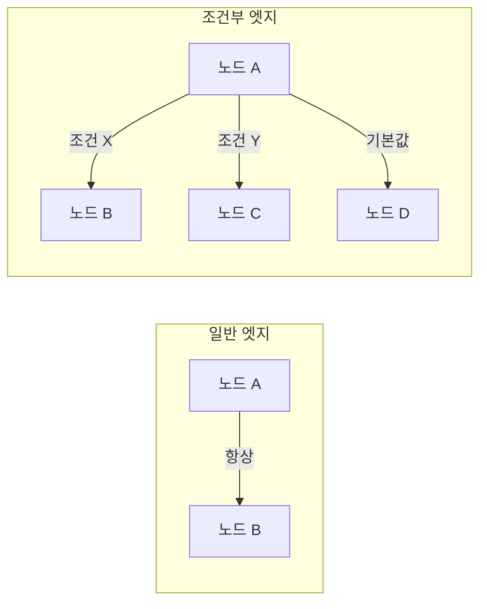
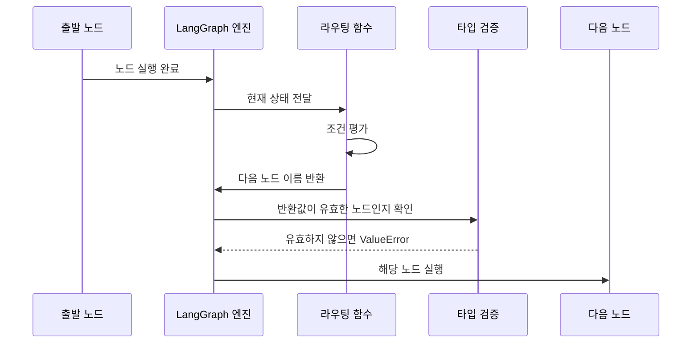
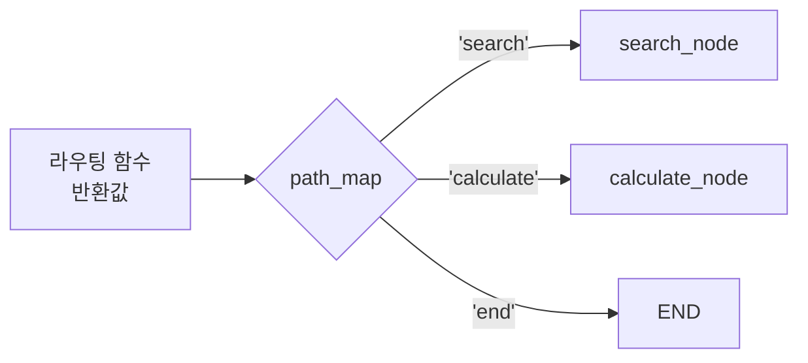
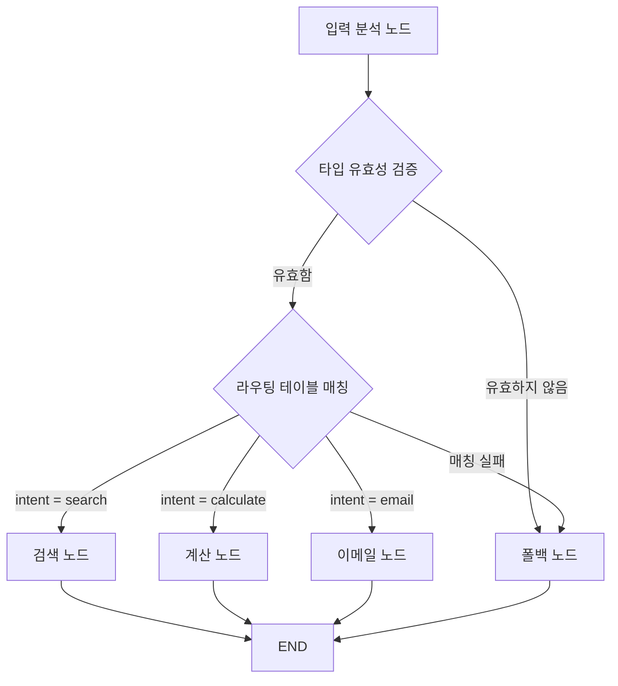
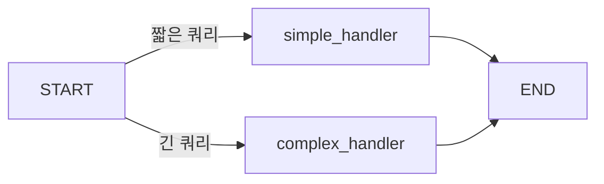
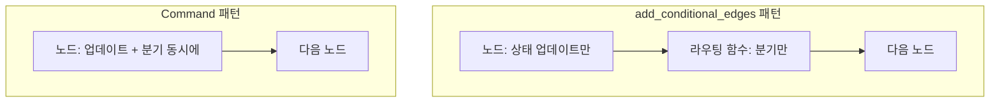

# 조건부 엣지의 이해

> LangGraph `add_conditional_edges`로 그래프 흐름을 동적으로 분기하는 방법을 마스터하고, 프로덕션 수준의 안전한 라우팅 설계를 익힙니다.

## 개요

이 섹션에서는 LangGraph StateGraph의 핵심 기능인 **조건부 엣지(Conditional Edges)**를 깊이 있게 다룹니다. [Ch4에서 만든 첫 번째 에이전트](04-ch4-langgraph-stategraph-기초/05-05-첫-번째-에이전트-구현.md)는 도구 호출 여부에 따라 분기하는 단순한 패턴이었죠. 이번 챕터부터는 **다중 분기, 폴백 전략, 타입 안전성, 디버깅**까지 — 실전 에이전트에 필요한 조건부 엣지의 모든 측면을 파헤칩니다.

**선수 지식**: [Ch4. 첫 번째 에이전트 구현](04-ch4-langgraph-stategraph-기초/05-05-첫-번째-에이전트-구현.md)에서 다룬 `tools_condition` 활용 경험, `add_node`, `add_edge`, `StateGraph` 기본 사용법
**학습 목표**:
- `add_conditional_edges` API의 시그니처와 각 파라미터의 역할을 정확히 이해한다
- 타입 안전한 라우팅 함수를 작성하고, `Literal` 힌트의 내부 동작을 파악한다
- `path_map`과 직접 반환 방식의 트레이드오프를 판단할 수 있다
- 프로덕션 환경에서의 폴백 전략과 에러 핸들링 패턴을 설계한다
- `Command` 객체와 조건부 엣지의 차이를 이해하고 적절한 상황에 선택한다

## 왜 알아야 할까?

고속도로를 달리고 있다고 상상해 보세요. 내비게이션이 "이 앞에서 무조건 좌회전하세요"라고만 한다면 어떨까요? 공사 구간이든, 막히는 구간이든 무조건 같은 길로만 가야 합니다. 하지만 실제 내비게이션은 교통 상황, 날씨, 도로 공사 여부에 따라 **매번 최적의 경로를 선택**하죠.

에이전트도 마찬가지입니다. 사용자가 "날씨 알려줘"라고 하면 날씨 도구를, "이메일 보내줘"라고 하면 이메일 도구를 호출해야 합니다. 입력에 따라 **다른 노드로 분기**하는 능력이 없다면 에이전트는 그저 정해진 순서대로 작업을 수행하는 스크립트에 불과합니다.

사실 Ch4에서 이미 `tools_condition`이라는 조건부 분기를 써봤어요. 하지만 `tools_condition`은 LangGraph가 미리 만들어 놓은 "도구 호출 여부"만 판단하는 제한된 분기였죠. 실전에서는 **LLM의 판단 결과, 상태의 복합 조건, 에러 여부, 사용자 권한** 등 훨씬 다양한 기준으로 분기해야 합니다.

조건부 엣지는 LangGraph에서 **에이전트의 의사결정 능력**을 구현하는 핵심 메커니즘입니다. [Ch2에서 배운 ReAct 패턴](02-ch2-react-패턴과-에이전트-루프/01-01-react-패턴-이론.md)의 "행동 선택"이 바로 이 조건부 엣지로 구현되거든요. 이번 섹션에서는 그 내부 동작을 완전히 이해하고, 직접 설계할 수 있는 수준까지 올라갑니다.

## 핵심 개념

### 개념 1: 조건부 엣지란 무엇인가

> 💡 **비유**: 기차역의 **선로 전환기(포인트)**를 떠올려 보세요. 기차가 분기점에 도착하면 선로 전환기가 현재 상황(행선지, 시간표, 선로 상태)을 확인하고 열차를 올바른 선로로 보냅니다. 조건부 엣지는 바로 이 선로 전환기 역할을 합니다.

일반 엣지(`add_edge`)는 "A 다음에는 항상 B로 간다"라는 고정 경로입니다. 반면 조건부 엣지(`add_conditional_edges`)는 "A 다음에는 **현재 상태를 보고** B, C, D 중 하나로 간다"라는 동적 경로입니다.

> 📊 **그림 1**: 일반 엣지 vs 조건부 엣지



LangGraph에서 조건부 엣지를 추가하는 API는 `add_conditional_edges`입니다. 현재 시그니처를 살펴보겠습니다:

```python
def add_conditional_edges(
    self,
    source: str,                    # 출발 노드 이름
    path: Callable[..., Hashable],  # 라우팅 함수
    path_map: dict | list | None = None,  # 반환값 → 노드 매핑 (선택)
) -> Self:
```

세 개의 파라미터가 핵심이에요:

| 파라미터 | 역할 | 필수 여부 |
|----------|------|-----------|
| `source` | 조건 분기가 시작되는 출발 노드의 이름. `START`를 넣으면 그래프 진입점에서 분기 가능 | 필수 |
| `path` | 현재 상태(`State`)를 입력받아 다음으로 이동할 노드 이름(또는 `END`)을 반환하는 라우팅 함수 | 필수 |
| `path_map` | 라우팅 함수의 반환값을 실제 노드 이름으로 변환하는 딕셔너리 또는 리스트. 생략하면 반환값이 곧 노드 이름 | 선택 (기본값 `None`) |

Ch4에서 썼던 `tools_condition`을 다시 떠올려 보면, 이것도 사실 라우팅 함수의 일종이었습니다:

```python
# Ch4에서 이렇게 썼었죠
graph.add_conditional_edges("agent", tools_condition)

# tools_condition 내부는 대략 이런 구조입니다:
def tools_condition(state) -> Literal["tools", "__end__"]:
    if state["messages"][-1].tool_calls:
        return "tools"
    return END
```

이제 우리가 할 일은 **`tools_condition` 같은 라우팅 함수를 직접 작성**하는 것입니다. 더 복잡한 조건, 더 많은 분기, 더 안전한 폴백까지요.

> ⚠️ **흔한 오해**: 과거 버전(v0.x)에는 `then` 파라미터가 있어서 분기 후 합류 노드를 지정할 수 있었지만, **LangGraph v1.0+에서는 제거**되었습니다. 분기 후 합류가 필요하면 각 분기 노드에서 별도로 `add_edge`를 연결해야 합니다.

### 개념 2: 라우팅 함수 작성법과 타입 안전성

> 💡 **비유**: 라우팅 함수는 공항의 **탑승구 안내 직원**과 같습니다. 승객(상태)의 탑승권(데이터)을 확인하고 "3번 게이트로 가세요" 또는 "12번 게이트로 가세요"라고 안내하죠. 그런데 존재하지 않는 "99번 게이트"를 안내하면? 공항 시스템이 멈춰 버립니다. 라우팅 함수도 마찬가지로 **유효한 목적지만** 반환해야 합니다.

라우팅 함수는 그래프의 현재 상태를 입력받아 다음으로 이동할 노드 이름을 반환하는 함수입니다. 가장 기본적인 형태를 봅시다:

```python
from typing import Literal
from langgraph.graph import END

def route_by_sentiment(state: State) -> Literal["positive_handler", "negative_handler", "__end__"]:
    """감성 분석 결과에 따라 다음 노드를 결정"""
    sentiment = state["sentiment"]
    if sentiment == "positive":
        return "positive_handler"
    elif sentiment == "negative":
        return "negative_handler"
    return END  # "__end__" — 그래프 종료
```

여기서 핵심은 **`Literal` 타입 힌트**입니다. 단순히 코드 가독성 문제가 아니에요. LangGraph 내부에서 실제로 `get_type_hints()`를 호출해서 `Literal` 값을 파싱하고, 이를 기반으로 두 가지 중요한 일을 합니다:

1. **그래프 시각화** — `graph.get_graph().draw_mermaid()`에서 가능한 분기 경로를 정확히 표시
2. **컴파일 타임 검증** — `path_map`이 없을 때, `Literal` 값이 실제 노드 이름과 매치되는지 확인

> 📊 **그림 2**: 라우팅 함수의 실행 흐름과 타입 검증



라우팅 함수를 그래프에 연결하는 코드는 이렇습니다:

```python
from langgraph.graph import StateGraph, START, END
from typing import TypedDict, Literal

class State(TypedDict):
    text: str
    sentiment: str

# 라우팅 함수 — 상태를 보고 다음 노드 결정
def route_by_sentiment(state: State) -> Literal["positive_handler", "negative_handler"]:
    if state["sentiment"] == "positive":
        return "positive_handler"
    return "negative_handler"

# 그래프 구성
graph = StateGraph(State)
graph.add_node("analyzer", analyze_sentiment)
graph.add_node("positive_handler", handle_positive)
graph.add_node("negative_handler", handle_negative)

graph.add_edge(START, "analyzer")
# 조건부 엣지: analyzer 완료 후 라우팅 함수로 분기
graph.add_conditional_edges("analyzer", route_by_sentiment)
graph.add_edge("positive_handler", END)
graph.add_edge("negative_handler", END)
```

`Literal` 힌트를 생략하면 어떻게 될까요? `path_map`도 없다면 LangGraph는 가능한 경로를 알 수 없어서, 시각화에서 **모든 노드를 잠재적 목적지로 표시**합니다. 디버깅할 때 그래프 다이어그램이 "스파게티"처럼 보이는 주범이 바로 이것입니다.

### 개념 3: path_map으로 다중 분기 설계

> 💡 **비유**: `path_map`은 엘리베이터의 **층수 매핑표**와 같습니다. 버튼에는 "로비", "사무실", "식당"이라고 적혀 있지만 실제로는 1층, 5층, 12층으로 이동하죠. `path_map`도 라우팅 함수의 반환값(라벨)을 실제 노드 이름으로 변환해 줍니다.

`path_map`을 사용하지 않으면 라우팅 함수가 반환하는 값이 **그대로 노드 이름**으로 사용됩니다. 하지만 `path_map`을 지정하면 반환값을 원하는 노드 이름으로 **매핑**할 수 있어요:

```python
# path_map 없이 — 반환값 = 노드 이름
def route_direct(state: State) -> Literal["search_node", "calculate_node"]:
    if state["intent"] == "search":
        return "search_node"  # 이 값이 곧 노드 이름
    return "calculate_node"

# path_map 사용 — 반환값을 노드 이름으로 매핑
def route_with_map(state: State) -> Literal["search", "calculate", "end"]:
    return state["intent"]  # "search", "calculate", "end" 중 하나

graph.add_conditional_edges(
    "classifier",
    route_with_map,
    {
        "search": "search_node",       # "search" → search_node로
        "calculate": "calculate_node",  # "calculate" → calculate_node로
        "end": END,                     # "end" → 그래프 종료
    }
)
```

> 📊 **그림 3**: path_map의 매핑 과정



`path_map`은 리스트 형태로도 사용할 수 있습니다. 리스트를 넘기면 `{name: name for name in list}`로 자동 변환됩니다:

```python
# 리스트 형태 — 반환값과 노드 이름이 같을 때 편리
graph.add_conditional_edges(
    "dispatcher",
    route_function,
    ["node_a", "node_b", "node_c"]  # dict 변환: {"node_a": "node_a", ...}
)
```

어떤 형태를 사용할지는 상황에 따라 달라요:

| 형태 | 언제 사용 | 장단점 |
|------|----------|--------|
| `path_map=None` + `Literal` | 반환값 = 노드 이름이고, 분기가 2-3개일 때 | 가장 간결하지만 리팩터링 시 노드 이름 변경 영향 큼 |
| `dict` | 반환값과 노드 이름이 다를 때, 또는 매핑을 명시적으로 문서화하고 싶을 때 | 가독성 최고, 모든 경로가 한눈에 보임 |
| `list` | 반환값 = 노드 이름이지만 `Literal` 힌트 없이 시각화를 위해 경로를 알려줄 때 | 간편하지만 매핑 유연성 없음 |

실무에서는 분기가 3개 이상이면 `dict` 형태의 `path_map`이 가장 많이 쓰입니다. 매핑이 코드에 명시적으로 드러나서 코드 리뷰에서도 분기 누락을 잡아내기 쉽거든요.

### 개념 4: 기본 경로와 프로덕션 수준의 안전한 분기 설계

> 💡 **비유**: 자판기에서 동전을 넣고 버튼을 눌렀는데, 해당 음료가 품절이면 어떻게 되나요? 잘 만든 자판기는 "품절입니다. 동전을 반환합니다"라고 처리하죠. 기본 경로는 예상치 못한 입력이 들어왔을 때 에이전트가 **안전하게 대응**하도록 만드는 장치입니다.

LangGraph의 `add_conditional_edges`에는 별도의 `default` 파라미터가 없습니다. 기본 경로는 **라우팅 함수 안에서 직접 구현**해야 해요. 프로덕션 환경에서는 단순한 `else` 분기를 넘어서, 몇 가지 방어적 패턴을 적용해야 합니다:

```python
import logging
logger = logging.getLogger(__name__)

def safe_route(state: State) -> str:
    intent = state.get("intent", "")
    
    # 1. 유효성 검증 — 예상하는 타입인지 확인
    if not isinstance(intent, str):
        logger.warning(f"Invalid intent type: {type(intent)}, falling back")
        return "fallback_node"
    
    # 2. 명시적 분기 — 알려진 경로
    routing_table = {
        "search": "search_node",
        "calculate": "calculate_node",
        "email": "email_node",
    }
    
    if intent in routing_table:
        return routing_table[intent]
    
    # 3. 기본 경로 — 알 수 없는 의도는 fallback으로
    logger.info(f"Unknown intent '{intent}', routing to fallback")
    return "fallback_node"
```

이 패턴이 중요한 이유가 있습니다. 라우팅 함수가 `None`을 반환하거나, `path_map`에 없는 값을 반환하면 LangGraph는 `ValueError`를 발생시킵니다. 프로덕션 환경에서 이런 에러는 치명적이죠.

> 📊 **그림 4**: 프로덕션 수준의 방어적 라우팅 패턴



`path_map`을 사용할 때는 **`path_map`의 키와 라우팅 함수의 가능한 반환값이 정확히 일치**해야 합니다. 일치하지 않으면 런타임 에러가 발생하는데, 이걸 컴파일 타임에 잡는 방법이 있어요:

```python
# path_map의 키 목록을 Literal로 강제하는 패턴
INTENT_MAP = {
    "search": "search_node",
    "calculate": "calculate_node",
    "email": "email_node",
    "unknown": "fallback_node",
}

def route_by_intent(state: State) -> str:
    intent = state.get("intent", "unknown")
    if intent not in INTENT_MAP:
        intent = "unknown"
    return intent

graph.add_conditional_edges("classifier", route_by_intent, INTENT_MAP)
```

이렇게 하면 라우팅 함수가 반환할 수 있는 모든 값이 `INTENT_MAP`에 있으므로, `path_map` 매핑 실패가 원천적으로 차단됩니다.

안전한 라우팅을 위한 체크리스트:

1. **항상 기본 반환값을 두세요** — `if/elif` 체인의 마지막은 반드시 `else` 또는 최종 `return`
2. **`state.get()`을 사용하세요** — 키가 없을 수 있는 상태 값은 `get()`으로 안전하게 접근
3. **`path_map`을 쓸 때는 모든 가능한 반환값을 커버하세요** — 매핑에 없는 값이 반환되면 에러
4. **로깅을 추가하세요** — 예상 밖 경로로 분기했을 때 원인 추적이 가능해야 합니다

### 개념 5: START에서의 조건부 분기

그래프의 시작점(`START`)에서도 조건부 엣지를 사용할 수 있습니다. 입력 데이터에 따라 첫 번째 실행 노드를 다르게 선택하는 패턴이죠:

```python
from langgraph.graph import START

def route_entry(state: State) -> Literal["simple_handler", "complex_handler"]:
    """입력 복잡도에 따라 첫 노드 결정"""
    if len(state["query"]) < 20:
        return "simple_handler"
    return "complex_handler"

# 권장 패턴: add_conditional_edges에 START를 source로 전달
graph.add_conditional_edges(START, route_entry)
```

> 📊 **그림 5**: START에서의 조건부 분기



> ⚠️ **Deprecated API 주의**: 이전 버전의 LangGraph에는 `set_conditional_entry_point(path, path_map)`이라는 헬퍼 메서드가 있었습니다. 이 메서드는 내부적으로 `add_conditional_edges(START, path, path_map)`을 호출하는 단순 래퍼였는데, **현재는 deprecated 상태**입니다. 기존 코드에서 이 메서드를 보더라도 `add_conditional_edges(START, ...)`로 교체하는 것을 권장합니다.

```python
# ❌ Deprecated — 사용하지 마세요
# graph.set_conditional_entry_point(route_entry)

# ✅ 권장 — START에서의 조건부 분기는 이렇게
graph.add_conditional_edges(START, route_entry)
```

### 개념 6: Command 객체 — 조건부 엣지의 현대적 대안

LangGraph v0.4 이후 도입된 `Command` 객체는 조건부 엣지와 다른 접근법을 제공합니다. 노드 함수 내부에서 상태 업데이트와 라우팅을 **동시에** 처리할 수 있어요:

```python
from langgraph.types import Command
from typing import Literal

def classify_and_route(state: State) -> Command[Literal["handler_a", "handler_b"]]:
    """분류와 라우팅을 한 노드에서 처리"""
    if state["score"] > 0.8:
        return Command(
            update={"category": "high"},  # 상태 업데이트
            goto="handler_a"              # 다음 노드 지정
        )
    return Command(
        update={"category": "low"},
        goto="handler_b"
    )
```

언제 `Command`를, 언제 `add_conditional_edges`를 써야 할까요? 실제로 코드를 작성하다 보면 이 선택이 꽤 중요해집니다:

> 📊 **그림 6**: add_conditional_edges vs Command 패턴 비교



| 기준 | `add_conditional_edges` | `Command` |
|------|------------------------|-----------|
| **관심사 분리** | 노드 로직과 라우팅 분리 (좋음) | 하나에 합침 (간결하지만 혼재) |
| **테스트 용이성** | 라우팅 함수를 독립적으로 단위 테스트 | 노드 함수 전체를 테스트해야 함 |
| **재사용성** | 같은 라우팅 함수를 여러 소스에 재사용 가능 | 노드마다 개별 작성 |
| **가독성** | 그래프 구조가 `add_` 호출에서 한눈에 보임 | 분기 로직이 노드 내부에 숨겨짐 |
| **유연성** | 단일 노드 이름만 반환 | `goto`에 리스트도 가능 (팬아웃) |
| **적합한 상황** | 분기가 3개 이상, 라우팅 로직이 복잡 | 분기가 2개, 업데이트와 라우팅이 긴밀 |

> 💡 `Command`의 고급 패턴(서브그래프 간 통신, `Send`와의 조합, `goto`에 리스트 전달 등)은 다음 [02. 복잡한 라우팅 전략](05-ch5-조건-분기와-동적-라우팅/02-02-복잡한-라우팅-전략.md)에서 본격적으로 다룹니다.

## 실습: 직접 해보기

단순한 키워드 매칭을 넘어서, **LLM 응답의 구조화된 결과를 기반으로 라우팅**하는 실전 패턴을 만들어 봅시다. 고객 문의가 들어오면 의도와 긴급도를 동시에 분석하고, 그 조합에 따라 다른 처리 파이프라인으로 라우팅합니다.

```run:python
from typing import TypedDict, Literal
from langgraph.graph import StateGraph, START, END
import logging

logging.basicConfig(level=logging.INFO)
logger = logging.getLogger("router")

# --- 1. 상태 정의: 복합 조건을 위한 필드 ---
class CustomerState(TypedDict):
    query: str           # 고객 문의 내용
    intent: str          # 분류된 의도 (refund, technical, general)
    urgency: str         # 긴급도 (high, normal)
    response: str        # 최종 응답

# --- 2. 노드 함수 정의 ---
def classify_intent(state: CustomerState) -> dict:
    """의도와 긴급도를 동시에 분류하는 노드 (실제로는 LLM 호출)"""
    query = state["query"].lower()
    
    # 의도 분류
    if "환불" in query or "취소" in query or "반품" in query:
        intent = "refund"
    elif "오류" in query or "안됨" in query or "버그" in query:
        intent = "technical"
    elif "안녕" in query or "감사" in query or "문의" in query:
        intent = "general"
    else:
        intent = "unknown"
    
    # 긴급도 분류
    urgency = "high" if ("급해" in query or "긴급" in query or "지금" in query) else "normal"
    
    return {"intent": intent, "urgency": urgency}

def handle_urgent_refund(state: CustomerState) -> dict:
    return {"response": f"[긴급 환불] 즉시 처리 시작: '{state['query']}'"}

def handle_refund(state: CustomerState) -> dict:
    return {"response": f"[환불] 환불 절차 안내: '{state['query']}'"}

def handle_urgent_technical(state: CustomerState) -> dict:
    return {"response": f"[긴급 기술지원] 시니어 엔지니어 배정: '{state['query']}'"}

def handle_technical(state: CustomerState) -> dict:
    return {"response": f"[기술지원] 지원팀 티켓 생성: '{state['query']}'"}

def handle_general(state: CustomerState) -> dict:
    return {"response": f"[일반] 답변 드립니다: '{state['query']}'"}

def handle_fallback(state: CustomerState) -> dict:
    return {"response": f"[폴백] 상담원 연결: '{state['query']}'"}

# --- 3. 복합 조건 라우팅 함수 ---
ROUTE_MAP = {
    ("refund", "high"): "handle_urgent_refund",
    ("refund", "normal"): "handle_refund",
    ("technical", "high"): "handle_urgent_technical",
    ("technical", "normal"): "handle_technical",
    ("general", "high"): "handle_general",      # 일반 문의는 긴급도 무관
    ("general", "normal"): "handle_general",
}

def route_by_intent_and_urgency(state: CustomerState) -> str:
    """의도 + 긴급도 조합으로 라우팅"""
    key = (state.get("intent", "unknown"), state.get("urgency", "normal"))
    destination = ROUTE_MAP.get(key, "handle_fallback")
    logger.info(f"Routing: {key} → {destination}")
    return destination

# --- 4. 그래프 구성 ---
graph = StateGraph(CustomerState)

graph.add_node("classify", classify_intent)
graph.add_node("handle_urgent_refund", handle_urgent_refund)
graph.add_node("handle_refund", handle_refund)
graph.add_node("handle_urgent_technical", handle_urgent_technical)
graph.add_node("handle_technical", handle_technical)
graph.add_node("handle_general", handle_general)
graph.add_node("handle_fallback", handle_fallback)

graph.add_edge(START, "classify")
graph.add_conditional_edges("classify", route_by_intent_and_urgency)

# 모든 처리 노드 → END
for node in ["handle_urgent_refund", "handle_refund", "handle_urgent_technical",
             "handle_technical", "handle_general", "handle_fallback"]:
    graph.add_edge(node, END)

app = graph.compile()

# --- 5. 테스트 ---
test_queries = [
    "주문한 상품을 환불하고 싶습니다",
    "환불 급해요! 지금 바로 처리해주세요",
    "로그인이 안됨, 오류가 계속 발생해요",
    "긴급! 서버 오류로 결제가 안됨",
    "안녕하세요, 배송 문의드립니다",
    "xyzabc 무슨 말인지 모르겠어요",
]

for query in test_queries:
    result = app.invoke({"query": query})
    print(f"문의: {query}")
    print(f"  → 의도={result['intent']}, 긴급도={result['urgency']}")
    print(f"  → {result['response']}")
    print()
```

```output
문의: 주문한 상품을 환불하고 싶습니다
  → 의도=refund, 긴급도=normal
  → [환불] 환불 절차 안내: '주문한 상품을 환불하고 싶습니다'

문의: 환불 급해요! 지금 바로 처리해주세요
  → 의도=refund, 긴급도=high
  → [긴급 환불] 즉시 처리 시작: '환불 급해요! 지금 바로 처리해주세요'

문의: 로그인이 안됨, 오류가 계속 발생해요
  → 의도=technical, 긴급도=normal
  → [기술지원] 지원팀 티켓 생성: '로그인이 안됨, 오류가 계속 발생해요'

문의: 긴급! 서버 오류로 결제가 안됨
  → 의도=technical, 긴급도=high
  → [긴급 기술지원] 시니어 엔지니어 배정: '긴급! 서버 오류로 결제가 안됨'

문의: 안녕하세요, 배송 문의드립니다
  → 의도=general, 긴급도=normal
  → [일반] 답변 드립니다: '안녕하세요, 배송 문의드립니다'

문의: xyzabc 무슨 말인지 모르겠어요
  → 의도=unknown, 긴급도=normal
  → [폴백] 상담원 연결: 'xyzabc 무슨 말인지 모르겠어요'
```

이 실습에서 단순 키워드 분류를 넘어 주목할 패턴들이 있어요:

1. **복합 조건 라우팅** — `(intent, urgency)` 튜플을 키로 사용해서 2차원 분기를 구현. 같은 의도라도 긴급도에 따라 다른 처리 파이프라인으로 분기합니다.
2. **라우팅 테이블 분리** — `ROUTE_MAP`을 별도 상수로 분리해서 라우팅 로직이 한눈에 보이고, 새 경로 추가 시 딕셔너리에 한 줄만 추가하면 됩니다.
3. **로깅 내장** — 어떤 조건 조합에서 어떤 노드로 분기했는지 기록되므로 프로덕션 디버깅이 가능합니다.
4. **폴백 안전장치** — `ROUTE_MAP`에 없는 키 조합은 모두 `"handle_fallback"`으로 라우팅.

`path_map`을 사용하는 버전으로 리팩터링하면 이렇게 됩니다:

```python
# path_map을 사용하는 대안 버전
# 라우팅 함수가 "라벨"을 반환하고, path_map이 노드 이름으로 매핑
def route_label(state: CustomerState) -> str:
    key = (state.get("intent", "unknown"), state.get("urgency", "normal"))
    labels = {
        ("refund", "high"): "urgent_refund",
        ("refund", "normal"): "refund",
        ("technical", "high"): "urgent_tech",
        ("technical", "normal"): "tech",
        ("general", "high"): "general",
        ("general", "normal"): "general",
    }
    return labels.get(key, "fallback")

graph.add_conditional_edges(
    "classify",
    route_label,
    {
        "urgent_refund": "handle_urgent_refund",
        "refund": "handle_refund",
        "urgent_tech": "handle_urgent_technical",
        "tech": "handle_technical",
        "general": "handle_general",
        "fallback": "handle_fallback",
    }
)
```

두 접근법 모두 동일하게 동작합니다. 노드 이름이 길고 복잡한 프로젝트에서는 `path_map`이 매핑을 중앙 집중화해서 관리하기 편하고, 노드가 적은 경우에는 직접 반환이 더 간결합니다.

## 더 깊이 알아보기

### 유한 상태 기계에서 LangGraph까지

조건부 엣지의 뿌리는 1950년대 **유한 상태 기계(Finite State Machine, FSM)**까지 거슬러 올라갑니다. 컴퓨터 과학의 선구자 앨런 튜링의 동료이자 정보 이론의 아버지인 클로드 섀넌은 1956년 논문에서 유한 오토마타의 수학적 기초를 정립했는데요, "현재 상태와 입력에 따라 다음 상태가 결정된다"는 원리는 70년이 지난 지금 LangGraph의 `add_conditional_edges`에서도 똑같이 작동하고 있습니다.

LangGraph의 창시자 해리슨 체이스(Harrison Chase)는 LangChain을 만들면서 에이전트의 복잡한 제어 흐름을 표현하는 데 한계를 느꼈습니다. 단순한 체인(Chain)은 선형적이고, 에이전트(Agent)는 루프가 있지만 분기 로직을 세밀하게 제어하기 어려웠죠. 그래서 탄생한 것이 LangGraph — 상태 기계 위에 LLM 에이전트를 올린 프레임워크입니다. `add_conditional_edges`는 이 상태 기계의 **전이 함수(transition function)**를 그대로 프로그래밍할 수 있게 해주는 API입니다.

실제로 FSM과 LangGraph의 `add_conditional_edges`를 나란히 놓으면 구조가 놀라울 정도로 닮아 있어요:

| FSM 요소 | LangGraph 대응 |
|----------|---------------|
| 상태 집합 Q | 노드들의 집합 |
| 입력 알파벳 Σ | `State` TypedDict의 값들 |
| 전이 함수 δ(q, σ) | 라우팅 함수 `path(state)` |
| 시작 상태 q₀ | `START` |
| 종료 상태 F | `END` |

### LLM 기반 라우팅 — 실전 에이전트의 분기

실습에서는 키워드 매칭으로 분류했지만, 실전 에이전트에서는 LLM이 분류를 담당합니다. 이때 주의해야 할 점이 있어요 — LLM의 출력은 **비결정적(non-deterministic)**이라는 것입니다:

```python
from langchain_openai import ChatOpenAI

llm = ChatOpenAI(model="gpt-4o-mini", temperature=0)

def llm_route(state: State) -> str:
    """LLM으로 의도를 분류하고 라우팅"""
    response = llm.invoke(
        f"다음 문의의 의도를 refund, technical, general 중 하나로만 답하세요: {state['query']}"
    )
    intent = response.content.strip().lower()
    
    # LLM이 예상 밖의 값을 반환할 수 있으므로 반드시 검증
    valid_intents = {"refund", "technical", "general"}
    if intent not in valid_intents:
        logger.warning(f"LLM returned unexpected intent: '{intent}'")
        return "handle_fallback"
    
    return f"handle_{intent}"
```

LLM이 `"환불"`, `"Refund"`, `"refund."` 같은 변형을 반환할 수 있기 때문에, **반환값 정규화**와 **유효성 검증**이 필수입니다. 더 안정적인 방법은 Structured Output(구조화된 출력)을 사용하는 것인데, 이건 [Ch7. 도구 사용과 통합](07-ch7-도구-사용과-통합/01-01-langgraph-도구-통합-기초.md)에서 다룹니다.

## 흔한 오해와 팁

> ⚠️ **흔한 오해**: "라우팅 함수에서 `None`을 반환해도 괜찮다?" — 아닙니다! LangGraph는 라우팅 함수가 `None`을 반환하면 `ValueError`를 발생시킵니다. 모든 경로에서 반드시 유효한 노드 이름(또는 `END`)을 반환해야 합니다. `START`를 반환하는 것도 금지되어 있어요.

> 💡 **알고 계셨나요?**: `Literal` 타입 힌트를 라우팅 함수에 추가하면 단순히 코드 가독성만 높아지는 게 아닙니다. LangGraph가 이 힌트를 파싱해서 **그래프 시각화(Mermaid 다이어그램)**에 가능한 경로를 자동으로 그려줍니다. `path_map`이 없고 `Literal` 힌트도 없으면 시각화에서 "모든 노드로 갈 수 있음"으로 표시되어 디버깅이 어려워집니다. LangGraph 소스 코드에서 `typing.get_type_hints()`로 실제로 이 정보를 추출하는 부분을 확인할 수 있어요.

> 🔥 **실무 팁**: 프로덕션 에이전트에서는 라우팅 함수에 **로깅과 메트릭**을 추가하세요. 어떤 상태에서 어떤 경로로 분기했는지, 각 경로의 트래픽 비율은 어떤지 기록해 두면 에이전트 최적화에 핵심 데이터가 됩니다.
> ```python
> import logging
> from collections import Counter
> 
> logger = logging.getLogger(__name__)
> route_counter = Counter()  # 프로덕션에서는 Prometheus 등 사용
> 
> def route_with_observability(state: State) -> str:
>     decision = determine_route(state)
>     logger.info(f"Routing: {decision} | state_keys={list(state.keys())}")
>     route_counter[decision] += 1
>     return decision
> ```

## 핵심 정리

| 개념 | 설명 |
|------|------|
| `add_conditional_edges` | 상태 기반으로 다음 노드를 동적 결정하는 LangGraph API |
| 라우팅 함수 (`path`) | 상태를 입력받아 다음 노드 이름을 반환하는 함수. 반드시 유효한 값 반환 |
| `path_map` | 라우팅 함수 반환값을 실제 노드 이름으로 매핑하는 딕셔너리/리스트 |
| `Literal` 타입 힌트 | 가능한 반환값을 명시하여 그래프 시각화와 컴파일 검증 지원 |
| 기본 경로 | 라우팅 함수 내에서 `else`/`dict.get()`으로 구현하는 폴백 |
| `START` 분기 | `add_conditional_edges(START, ...)`로 진입점에서 조건부 분기 |
| `Command` 객체 | 노드 내부에서 상태 업데이트와 라우팅을 동시 처리하는 대안 패턴 |
| 복합 조건 라우팅 | 여러 상태 필드의 조합을 키로 사용하는 다차원 분기 전략 |

## 다음 섹션 미리보기

이번 섹션에서 `add_conditional_edges`의 API, 라우팅 함수, `path_map`, 그리고 프로덕션 수준의 안전한 분기 설계까지 다뤘습니다. 다음 [02. 복잡한 라우팅 전략](05-ch5-조건-분기와-동적-라우팅/02-02-복잡한-라우팅-전략.md)에서는 **다단계 분기(체이닝)**, **`Send` 객체를 활용한 동적 팬아웃**, **`Command`의 고급 활용**(서브그래프 간 통신, `goto`에 리스트 전달) 등 더 정교한 라우팅 패턴을 다룹니다. "하나의 입력으로 여러 노드를 동시에 실행"하는 방법이 궁금하다면 기대해 주세요.

## 참고 자료

- [LangGraph Graph API Documentation](https://docs.langchain.com/oss/python/langgraph/use-graph-api) - `add_conditional_edges` 공식 API 문서와 사용 예제
- [LangGraph GitHub Repository](https://github.com/langchain-ai/langgraph) - StateGraph 소스 코드와 최신 변경 사항 확인
- [Advanced LangGraph: Implementing Conditional Edges and Tool-Calling Agents](https://dev.to/jamesli/advanced-langgraph-implementing-conditional-edges-and-tool-calling-agents-3pdn) - 조건부 엣지와 도구 호출 에이전트 통합 튜토리얼
- [LangGraph: Build Stateful AI Agents in Python (Real Python)](https://realpython.com/langgraph-python/) - Python 개발자를 위한 LangGraph 실습 가이드
- [LangGraph Workflows and Agents](https://docs.langchain.com/oss/python/langgraph/workflows-agents) - 워크플로우와 에이전트의 차이, 조건부 라우팅 패턴 설명

---
### 🔗 Related Sessions
- [stategraph](04-ch4-langgraph-stategraph-기초/01-01-langgraph-아키텍처-개관.md) (prerequisite)
- [add_node](04-ch4-langgraph-stategraph-기초/03-03-노드와-엣지-구성.md) (prerequisite)
- [add_edge](04-ch4-langgraph-stategraph-기초/03-03-노드와-엣지-구성.md) (prerequisite)
- [start](04-ch4-langgraph-stategraph-기초/03-03-노드와-엣지-구성.md) (prerequisite)
- [end](04-ch4-langgraph-stategraph-기초/03-03-노드와-엣지-구성.md) (prerequisite)
