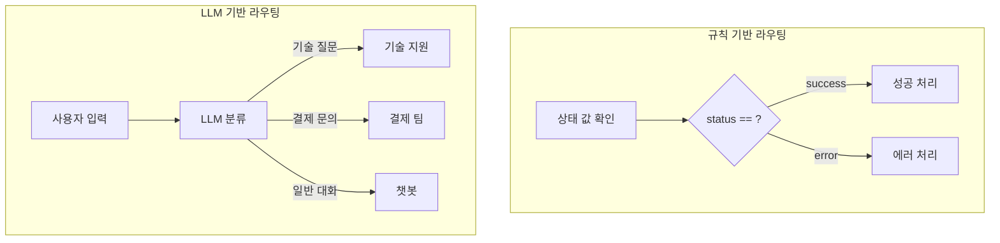
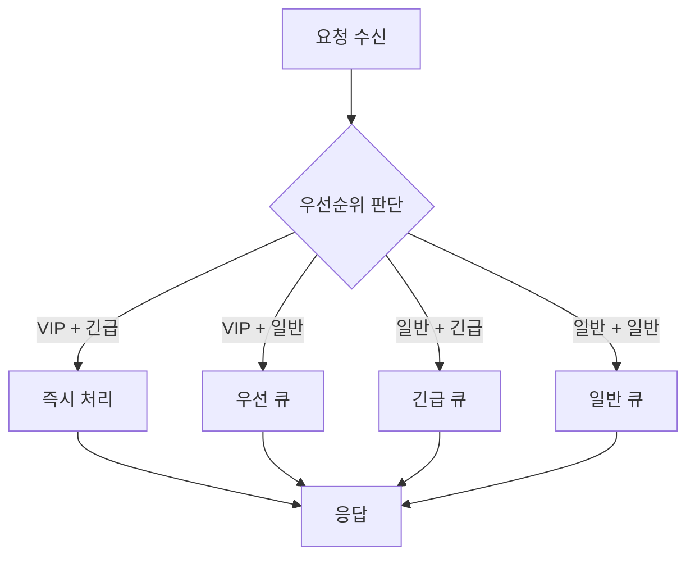
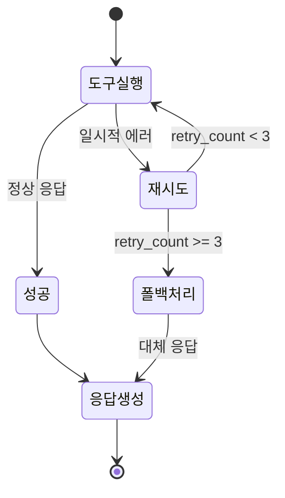
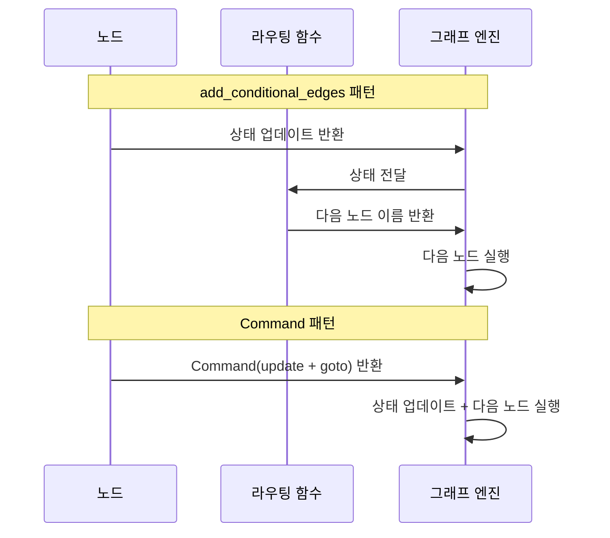
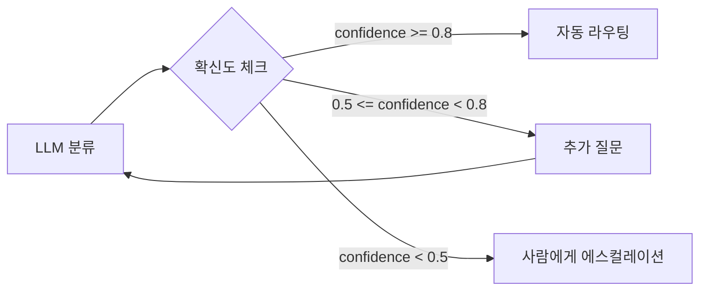

# 복잡한 라우팅 전략

> LLM 기반 라우팅, 상태 기반 다단계 분기, 에러 라우팅과 폴백 경로로 실전 워크플로우를 설계한다

## 개요

이 섹션에서는 단순한 if-else 수준을 넘어, 실전 에이전트에서 마주치는 **복잡한 라우팅 시나리오**를 다룹니다. LLM이 직접 경로를 결정하는 패턴, 여러 상태 필드를 종합해 판단하는 다단계 분기, 에러가 발생했을 때 우아하게 복구하는 폴백 라우팅까지 — 프로덕션 수준의 에이전트를 만들기 위한 라우팅 전략을 체계적으로 학습합니다.

**선수 지식**: [01. 조건부 엣지의 이해](05-ch5-조건-분기와-동적-라우팅/01-01-조건부-엣지의-이해.md)에서 배운 `add_conditional_edges`, `path_map`, 라우팅 함수 기초
**학습 목표**:
- LLM을 활용한 의미 기반 라우팅을 구현할 수 있다
- 여러 상태 필드를 조합한 다단계 분기 로직을 설계할 수 있다
- 에러 핸들링과 폴백 경로로 견고한 워크플로우를 구축할 수 있다
- `Command` 객체로 상태 업데이트와 라우팅을 동시에 처리할 수 있다

## 왜 알아야 할까?

이전 섹션에서 배운 조건부 엣지는 "상태 값 A면 노드 X로, 값 B면 노드 Y로"처럼 명확한 규칙 기반이었죠. 하지만 실전에서는 이런 단순한 분기만으로는 부족합니다.

고객이 "환불해주세요, 근데 다른 상품으로 교환도 괜찮아요"라고 말하면 어떤 노드로 보내야 할까요? `state["category"]`에 깔끔하게 들어있는 값이 아니라, 자연어를 **이해**해서 라우팅해야 합니다. 또 외부 API가 타임아웃되면? 3번 재시도 후에도 실패하면? 이런 예외 상황을 처리하지 않으면 에이전트는 그냥 멈춰버립니다.

복잡한 라우팅 전략은 에이전트가 **똑똑하게 판단하고**, **실패에서 복구하며**, **예측 불가능한 상황에 적응**하게 만드는 핵심 기술입니다.

## 핵심 개념

### 개념 1: LLM 기반 라우팅 — 의미를 이해하는 분기

> 💡 **비유**: 규칙 기반 라우팅이 우체국의 우편번호 분류기라면, LLM 기반 라우팅은 비서가 편지 내용을 읽고 "이건 법무팀으로, 이건 마케팅팀으로" 판단하는 것과 같습니다. 우편번호(규칙)로는 구분할 수 없는 것도, 내용(의미)을 파악하면 정확히 라우팅할 수 있죠.

규칙 기반 라우팅은 `state["status"] == "error"` 같은 명시적 값을 비교합니다. 하지만 사용자 입력처럼 **비정형 데이터**를 기반으로 분기해야 할 때는 LLM이 직접 판단하게 하는 게 훨씬 자연스럽습니다.

> 📊 **그림 1**: 규칙 기반 vs LLM 기반 라우팅 비교



LLM 기반 라우팅의 핵심은 **Structured Output**을 활용하는 것입니다. LLM의 자유 텍스트 응답 대신, 정해진 카테고리 중 하나를 반환하도록 강제하면 안정적인 라우팅이 가능합니다.

```python
from typing import Literal, TypedDict, Annotated
from pydantic import BaseModel, Field
from langchain_openai import ChatOpenAI
from langgraph.graph import StateGraph, START, END
from langgraph.types import Command  # Command는 항상 langgraph.types에서 임포트

# 1. LLM이 반환할 라우팅 결과를 Pydantic 모델로 정의
class RouteDecision(BaseModel):
    """사용자 요청을 적절한 팀으로 라우팅하는 스키마.
    
    with_structured_output()에 전달하면 LLM이 이 스키마에 맞는
    JSON을 생성하고, Pydantic이 자동으로 파싱/검증합니다.
    """
    destination: Literal["technical", "billing", "general"] = Field(
        description="요청 유형: technical(기술), billing(결제), general(일반)"
    )
    confidence: float = Field(
        description="분류 확신도 (0.0 ~ 1.0)",
        ge=0.0,  # 최솟값 제약
        le=1.0,  # 최댓값 제약
    )
    reasoning: str = Field(
        description="라우팅 판단 이유"
    )

# 2. 상태 정의
class State(TypedDict):
    user_input: str
    route: str
    confidence: float
    response: str

# 3. LLM 라우팅 노드
llm = ChatOpenAI(model="gpt-4o-mini", temperature=0)

# with_structured_output()은 LLM 응답을 RouteDecision 인스턴스로 자동 변환
# 내부적으로 function calling 또는 JSON mode를 사용
structured_llm = llm.with_structured_output(RouteDecision)

def classify_request(state: State) -> dict:
    """LLM이 사용자 요청을 분류 — 반환값은 RouteDecision 인스턴스"""
    decision: RouteDecision = structured_llm.invoke(
        f"다음 고객 요청을 분류하세요: {state['user_input']}"
    )
    # decision.destination, decision.confidence 등으로 접근
    return {
        "route": decision.destination,
        "confidence": decision.confidence,
    }

# 4. 라우팅 함수 — LLM이 설정한 상태 값을 읽어 분기
def route_by_classification(
    state: State,
) -> Literal["technical_support", "billing_support", "general_chat"]:
    route_map = {
        "technical": "technical_support",
        "billing": "billing_support",
        "general": "general_chat",
    }
    return route_map[state["route"]]
```

여기서 중요한 포인트가 있습니다. LLM 호출은 **노드** 안에서 하고, **라우팅 함수**는 그 결과(상태 값)만 읽어서 분기합니다. 라우팅 함수 자체에서 LLM을 호출하면 안 됩니다 — 라우팅 함수는 가볍고 빠르게 실행되어야 하거든요.

```run:python
# with_structured_output의 반환 타입 확인 (시뮬레이션)
from pydantic import BaseModel, Field
from typing import Literal

class RouteDecision(BaseModel):
    destination: Literal["technical", "billing", "general"] = Field(
        description="요청 유형"
    )
    confidence: float = Field(ge=0.0, le=1.0)
    reasoning: str = Field(description="판단 이유")

# LLM이 반환한 것처럼 시뮬레이션
decision = RouteDecision(
    destination="technical",
    confidence=0.92,
    reasoning="서버 에러와 로그 관련 기술 문의"
)
print(f"타입: {type(decision).__name__}")
print(f"목적지: {decision.destination}")
print(f"확신도: {decision.confidence:.0%}")
print(f"이유: {decision.reasoning}")
```

```output
타입: RouteDecision
목적지: technical
확신도: 92%
이유: 서버 에러와 로그 관련 기술 문의
```

> ⚠️ **흔한 오해**: "라우팅 함수 안에서 LLM을 호출하면 안 되나요?" — 기술적으로는 가능하지만, 라우팅 함수는 **순수 함수**여야 합니다. LLM 호출 같은 부작용(side effect)은 노드에서 처리하고, 라우팅 함수는 상태만 읽어야 디버깅도 쉽고 체크포인트 복원도 안전합니다.

### 개념 2: 다단계 상태 기반 분기 — 여러 조건의 조합

> 💡 **비유**: 병원 응급실의 트리아지(triage)를 생각해보세요. 환자를 분류할 때 "의식이 있는가?", "출혈이 있는가?", "호흡이 정상인가?"를 **동시에** 고려합니다. 하나의 조건이 아니라 여러 조건의 조합으로 우선순위를 결정하죠. 다단계 분기도 마찬가지입니다.

실전 워크플로우에서는 단일 상태 필드가 아니라 **여러 필드를 종합**해서 분기해야 할 때가 많습니다. 예를 들어 "사용자 등급 + 요청 유형 + 시스템 부하"를 모두 고려해서 라우팅하는 경우죠.

> 📊 **그림 2**: 다단계 상태 기반 분기 흐름



```python
import operator
from typing import Annotated

class MultiState(TypedDict):
    user_input: str
    user_tier: str            # "vip" | "standard"
    request_type: str         # "urgent" | "normal"
    retry_count: int
    error_message: str
    response: str
    messages: Annotated[list, operator.add]

def multi_condition_router(
    state: MultiState,
) -> Literal["immediate", "priority_queue", "urgent_queue", "normal_queue", "escalate"]:
    """여러 상태 필드를 종합하여 라우팅 결정"""
    tier = state.get("user_tier", "standard")
    req_type = state.get("request_type", "normal")
    retry_count = state.get("retry_count", 0)

    # 재시도 횟수 초과 → 무조건 에스컬레이션
    if retry_count >= 3:
        return "escalate"

    # 2차원 매트릭스로 라우팅
    route_matrix = {
        ("vip", "urgent"): "immediate",
        ("vip", "normal"): "priority_queue",
        ("standard", "urgent"): "urgent_queue",
        ("standard", "normal"): "normal_queue",
    }

    return route_matrix.get((tier, req_type), "normal_queue")
```

이 패턴의 핵심은 **라우팅 매트릭스**입니다. 조건이 2~3개만 조합되어도 경우의 수가 기하급수적으로 늘어나는데, 딕셔너리 매트릭스로 관리하면 if-elif 체인보다 훨씬 깔끔하고 유지보수하기 좋습니다.

### 개념 3: 에러 라우팅과 폴백 경로

> 💡 **비유**: 자동차 내비게이션이 "전방 사고로 통행 불가"를 감지하면 자동으로 우회 경로를 찾아주듯, 에러 라우팅은 워크플로우에서 장애가 발생했을 때 **자동으로 대체 경로**를 찾아가는 메커니즘입니다.

프로덕션 에이전트에서 가장 흔한 실패 시나리오는 세 가지입니다: 외부 API 타임아웃, LLM 할루시네이션, 도구 실행 에러. 이 각각에 대한 폴백 경로를 미리 설계해두면 에이전트가 멈추지 않고 계속 동작할 수 있습니다.

> 📊 **그림 3**: 에러 라우팅과 폴백 경로 설계



```python
def execute_tool(state: MultiState) -> dict:
    """도구 실행 — 에러 발생 시 상태에 기록"""
    try:
        # 외부 API 호출 시뮬레이션
        result = call_external_api(state["user_input"])
        return {
            "response": result,
            "error_message": "",
            "retry_count": 0,
        }
    except TimeoutError:
        return {
            "error_message": "API 타임아웃",
            "retry_count": state.get("retry_count", 0) + 1,
        }
    except Exception as e:
        return {
            "error_message": str(e),
            "retry_count": state.get("retry_count", 0) + 1,
        }

def error_router(
    state: MultiState,
) -> Literal["retry", "fallback", "respond"]:
    """에러 상태에 따라 재시도, 폴백, 정상 응답 분기"""
    if not state.get("error_message"):
        return "respond"

    if state.get("retry_count", 0) < 3:
        return "retry"

    return "fallback"

def fallback_handler(state: MultiState) -> dict:
    """폴백 — 캐시된 응답이나 기본 메시지 반환"""
    return {
        "response": (
            f"현재 서비스에 일시적 문제가 있습니다. "
            f"에러: {state['error_message']}. "
            f"잠시 후 다시 시도해주세요."
        ),
        "error_message": "",
    }
```

에러 라우팅에서 핵심은 **retry_count를 상태로 관리**하는 것입니다. LangGraph의 상태는 체크포인트에 자동 저장되므로, 재시도 횟수도 영속적으로 추적됩니다. 재시도 루프가 무한히 돌지 않도록 상한선을 반드시 설정하세요.

### 개념 4: Command 객체 — 상태 업데이트 + 라우팅을 한 번에

> 💡 **비유**: 택배 기사가 물건을 배달하면서 동시에 "다음 배달지 주소"를 내비에 입력하는 것과 같습니다. `Command`는 "상태를 이렇게 바꾸고, 다음 노드는 여기로 가"를 하나의 동작으로 합칩니다. 별도의 라우팅 함수 없이도 노드가 직접 다음 행선지를 결정할 수 있죠.

[이전 섹션](05-ch5-조건-분기와-동적-라우팅/01-01-조건부-엣지의-이해.md)에서 `Command`를 간단히 소개했는데, 복잡한 라우팅에서 `Command`는 진가를 발휘합니다. `add_conditional_edges` + 별도 라우팅 함수 패턴 대신, **노드 자체가 라우팅 결정**을 내리는 거죠.

> 📊 **그림 4**: add_conditional_edges vs Command 패턴 비교



`Command`는 `langgraph.types` 모듈에서 임포트합니다. 이 임포트 경로는 LangGraph 전체에서 동일하므로, 어느 파일에서든 아래와 같이 사용하면 됩니다.

```python
# Command의 공식 임포트 경로 — 모든 코드에서 이 경로를 사용
from langgraph.types import Command

def smart_classifier(state: State) -> Command[Literal["technical_support", "billing_support", "escalate"]]:
    """LLM 분류 결과에 따라 상태 업데이트와 라우팅을 동시에 수행"""
    decision = structured_llm.invoke(
        f"다음 고객 요청을 분류하세요: {state['user_input']}"
    )

    # 확신도가 낮으면 → 사람에게 에스컬레이션
    if decision.confidence < 0.7:
        return Command(
            update={
                "route": "uncertain",
                "confidence": decision.confidence,
            },
            goto="escalate",
        )

    destination_map = {
        "technical": "technical_support",
        "billing": "billing_support",
    }

    return Command(
        update={
            "route": decision.destination,
            "confidence": decision.confidence,
        },
        goto=destination_map.get(decision.destination, "escalate"),
    )
```

`Command`를 사용할 때는 노드의 반환 타입을 `Command[Literal["노드1", "노드2"]]`로 명시해야 합니다. 이 타입 힌트가 그래프 컴파일 시 유효한 경로를 검증하는 데 사용되거든요.

```run:python
# Command 사용 시 타입 힌트가 어떻게 작동하는지 확인
from typing import Literal, get_args, get_origin

# Command의 타입 파라미터에서 가능한 목적지 추출
CommandType = Literal["node_a", "node_b", "node_c"]
destinations = get_args(CommandType)
print(f"가능한 목적지: {destinations}")
print(f"목적지 개수: {len(destinations)}")
```

```output
가능한 목적지: ('node_a', 'node_b', 'node_c')
목적지 개수: 3
```

> 🔥 **실무 팁**: `Command`는 `add_conditional_edges`를 완전히 대체하는 게 아닙니다. **노드 내부에서 라우팅 로직이 상태 업데이트와 밀접하게 연관**될 때 `Command`가 유리하고, 라우팅 로직을 **재사용하거나 여러 노드에서 공유**할 때는 별도 라우팅 함수 + `add_conditional_edges`가 더 깔끔합니다.

### 개념 5: 확신도 기반 라우팅 — 불확실성을 다루는 전략

> 💡 **비유**: 의사가 증상만으로 확신이 없으면 추가 검사를 지시하듯이, 에이전트도 LLM의 분류 확신도가 낮으면 **추가 정보를 수집하거나 사람에게 넘기는** 전략이 필요합니다.

LLM 기반 라우팅에서 가장 중요하지만 놓치기 쉬운 부분이 바로 **확신도(confidence) 처리**입니다. LLM이 "이건 기술 문의입니다"라고 분류했는데 확신도가 50%라면, 그대로 기술 지원 노드로 보내면 안 됩니다.

> 📊 **그림 5**: 확신도 기반 3단계 라우팅



```python
def confidence_based_router(
    state: State,
) -> Literal["auto_route", "clarify", "escalate"]:
    """확신도에 따른 3단계 라우팅"""
    confidence = state.get("confidence", 0.0)

    if confidence >= 0.8:
        return "auto_route"      # 자동 처리
    elif confidence >= 0.5:
        return "clarify"         # 추가 질문으로 정보 보완
    else:
        return "escalate"        # 사람에게 넘기기

def clarify_node(state: State) -> dict:
    """확신도가 중간일 때 — 추가 질문을 생성하여 정보 보강"""
    clarification = llm.invoke(
        f"고객 요청 '{state['user_input']}'에 대해 "
        f"정확한 분류를 위한 확인 질문 1개를 생성하세요."
    )
    return {
        "response": clarification.content,
        "retry_count": state.get("retry_count", 0) + 1,
    }
```

## 실습: 직접 해보기

이제 위에서 배운 모든 패턴을 통합한 **스마트 고객 지원 라우터**를 만들어봅시다. LLM 기반 분류, 확신도 기반 분기, 에러 폴백을 모두 포함하는 완전한 그래프입니다.

```python
from typing import TypedDict, Literal, Annotated
import operator
from pydantic import BaseModel, Field
from langchain_openai import ChatOpenAI
from langgraph.graph import StateGraph, START, END
from langgraph.types import Command  # Command 임포트 경로 통일

# ── 1. 모델 정의 ──────────────────────────────────────────

class RouteDecision(BaseModel):
    """LLM 라우팅 결정 스키마 — with_structured_output()에 전달"""
    destination: Literal["technical", "billing", "general"] = Field(
        description="요청 카테고리"
    )
    confidence: float = Field(
        description="분류 확신도 (0.0 ~ 1.0)", ge=0.0, le=1.0
    )

class SupportState(TypedDict):
    user_input: str
    user_tier: str          # "vip" | "standard"
    route: str
    confidence: float
    retry_count: int
    error_message: str
    response: str

# ── 2. LLM 설정 ──────────────────────────────────────────

llm = ChatOpenAI(model="gpt-4o-mini", temperature=0)

# RouteDecision 스키마를 넘기면 LLM이 해당 형식으로 응답을 강제
# 내부적으로 OpenAI function calling → Pydantic 인스턴스 자동 변환
classifier_llm = llm.with_structured_output(RouteDecision)

# ── 3. 노드 함수 ─────────────────────────────────────────

def classify(state: SupportState) -> dict:
    """LLM으로 사용자 요청 분류"""
    try:
        decision: RouteDecision = classifier_llm.invoke(
            f"고객 요청을 분류하세요: {state['user_input']}"
        )
        return {
            "route": decision.destination,
            "confidence": decision.confidence,
            "error_message": "",
        }
    except Exception as e:
        return {
            "route": "unknown",
            "confidence": 0.0,
            "error_message": f"분류 실패: {e}",
        }

def handle_technical(state: SupportState) -> dict:
    """기술 지원 처리"""
    response = llm.invoke(
        f"기술 지원 담당자로서 답변하세요: {state['user_input']}"
    )
    return {"response": response.content}

def handle_billing(state: SupportState) -> dict:
    """결제 문의 처리"""
    response = llm.invoke(
        f"결제 담당자로서 답변하세요: {state['user_input']}"
    )
    return {"response": response.content}

def handle_general(state: SupportState) -> dict:
    """일반 문의 처리"""
    response = llm.invoke(
        f"친절한 상담원으로서 답변하세요: {state['user_input']}"
    )
    return {"response": response.content}

def ask_clarification(state: SupportState) -> dict:
    """확신도가 낮을 때 추가 질문 생성"""
    return {
        "response": "요청을 정확히 이해하기 위해 추가 정보가 필요합니다. "
                     "기술적인 문제인가요, 결제 관련 문의인가요?",
        "retry_count": state.get("retry_count", 0) + 1,
    }

def escalate(state: SupportState) -> dict:
    """사람 상담원에게 에스컬레이션"""
    return {
        "response": f"[에스컬레이션] 상담원 연결이 필요합니다. "
                     f"사유: {state.get('error_message', '확신도 부족')}",
    }

def fallback(state: SupportState) -> dict:
    """에러 폴백 처리"""
    return {
        "response": "현재 시스템에 일시적 문제가 있습니다. "
                     "잠시 후 다시 시도해주세요.",
        "error_message": "",
    }

# ── 4. 라우팅 함수 ────────────────────────────────────────

def route_after_classify(
    state: SupportState,
) -> Literal["handle_technical", "handle_billing",
             "handle_general", "ask_clarification",
             "escalate", "fallback"]:
    """분류 결과 + 확신도 + 에러 상태를 종합한 라우팅"""
    # 에러 발생 시 → 재시도 or 폴백
    if state.get("error_message"):
        if state.get("retry_count", 0) < 2:
            return "fallback"
        return "escalate"

    confidence = state.get("confidence", 0.0)

    # 확신도 낮으면 → 추가 질문 or 에스컬레이션
    if confidence < 0.5:
        return "escalate"
    if confidence < 0.8:
        return "ask_clarification"

    # 확신도 높으면 → VIP 고려한 자동 라우팅
    route_map = {
        "technical": "handle_technical",
        "billing": "handle_billing",
        "general": "handle_general",
    }
    return route_map.get(state["route"], "handle_general")

# ── 5. 그래프 구성 ────────────────────────────────────────

builder = StateGraph(SupportState)

# 노드 등록
builder.add_node("classify", classify)
builder.add_node("handle_technical", handle_technical)
builder.add_node("handle_billing", handle_billing)
builder.add_node("handle_general", handle_general)
builder.add_node("ask_clarification", ask_clarification)
builder.add_node("escalate", escalate)
builder.add_node("fallback", fallback)

# 엣지 구성
builder.add_edge(START, "classify")
builder.add_conditional_edges("classify", route_after_classify)

# 모든 처리 노드 → 종료
for node in ["handle_technical", "handle_billing",
             "handle_general", "ask_clarification",
             "escalate", "fallback"]:
    builder.add_edge(node, END)

graph = builder.compile()

# ── 6. 실행 ───────────────────────────────────────────────

# 테스트 케이스 1: 명확한 기술 문의
result = graph.invoke({
    "user_input": "서버 500 에러가 계속 발생하는데 로그 확인 방법을 알려주세요",
    "user_tier": "vip",
    "route": "",
    "confidence": 0.0,
    "retry_count": 0,
    "error_message": "",
    "response": "",
})
print(f"[기술 문의] 라우팅: {result['route']} (확신도: {result['confidence']:.1%})")
print(f"응답: {result['response'][:80]}...")
```

그래프 구조를 시각적으로 확인하면 이렇게 됩니다:

```run:python
# 그래프의 노드와 엣지 구조 확인 (시뮬레이션)
nodes = ["classify", "handle_technical", "handle_billing",
         "handle_general", "ask_clarification", "escalate", "fallback"]
routes = {
    "classify → handle_technical": "confidence >= 0.8 & route=technical",
    "classify → handle_billing": "confidence >= 0.8 & route=billing",
    "classify → handle_general": "confidence >= 0.8 & route=general",
    "classify → ask_clarification": "0.5 <= confidence < 0.8",
    "classify → escalate": "confidence < 0.5 또는 재시도 초과",
    "classify → fallback": "에러 발생 & retry < 2",
}
print(f"노드 수: {len(nodes)}")
print(f"조건부 경로 수: {len(routes)}")
print()
for route, condition in routes.items():
    print(f"  {route}")
    print(f"    조건: {condition}")
```

```output
노드 수: 7
조건부 경로 수: 6

  classify → handle_technical
    조건: confidence >= 0.8 & route=technical
  classify → handle_billing
    조건: confidence >= 0.8 & route=billing
  classify → handle_general
    조건: confidence >= 0.8 & route=general
  classify → ask_clarification
    조건: 0.5 <= confidence < 0.8
  classify → escalate
    조건: confidence < 0.5 또는 재시도 초과
  classify → fallback
    조건: 에러 발생 & retry < 2
```

## 더 깊이 알아보기

### Command 객체의 탄생 배경

LangGraph 초기 버전에서는 모든 라우팅이 `add_conditional_edges`를 통해서만 가능했습니다. 하지만 LangGraph 팀이 복잡한 에이전트를 구축하면서 **"노드가 상태를 업데이트하면서 동시에 다음 경로를 결정해야 하는"** 패턴이 반복적으로 등장한다는 걸 발견했죠.

기존 방식에서는 노드가 상태를 업데이트 → 별도 라우팅 함수가 업데이트된 상태를 다시 읽어 → 경로를 결정하는 2단계가 필요했습니다. `Command` 객체는 이 2단계를 하나로 합쳐서, 노드가 "상태는 이렇게 바꾸고, 다음엔 여기로 가"라고 한 번에 선언할 수 있게 만들었습니다. 2025년 LangGraph가 1.0으로 안정화되면서 `Command`는 공식 API의 핵심 요소로 자리잡았습니다.

`Command`의 임포트 경로는 `from langgraph.types import Command`로 확정되었으며, `langgraph.graph`나 다른 서브모듈이 아닌 `langgraph.types`가 정식 위치입니다. 같은 모듈에서 `Send` 객체도 함께 임포트할 수 있는데, 이는 [맵-리듀스와 동적 병렬 실행](05-ch5-조건-분기와-동적-라우팅/04-04-맵-리듀스와-동적-병렬-실행.md)에서 자세히 다룹니다.

### Google의 Pregel 모델과 라우팅

LangGraph의 실행 모델은 Google이 2010년에 발표한 **Pregel** 논문에 기반합니다. [이전에 배운 것처럼](04-ch4-langgraph-stategraph-기초/01-01-langgraph-아키텍처-개관.md) 슈퍼스텝(superstep) 기반 실행 모델에서, 각 슈퍼스텝은 "활성화된 노드들이 동시 실행 → 결과를 다음 슈퍼스텝으로 전달"하는 구조입니다. 조건부 엣지는 바로 이 "다음 슈퍼스텝에서 어떤 노드를 활성화할지"를 결정하는 메커니즘인 셈이죠.

> 💡 **알고 계셨나요?**: Google의 Pregel 이름은 독일 쾨니히스베르크의 **프레겔 강**에서 유래했습니다. 오일러가 이 강의 다리를 건너는 문제를 풀면서 그래프 이론이 탄생했거든요. 그래프 기반 프레임워크에 이보다 더 적절한 이름이 있을까요?

## 흔한 오해와 팁

> ⚠️ **흔한 오해**: "라우팅 경로가 많을수록 좋은 설계다" — 아닙니다. 라우팅 경로가 10개를 넘어가면 디버깅이 사실상 불가능해집니다. 5~7개가 적정선이고, 그 이상은 서브그래프로 분리하세요. 다음 섹션에서 배울 [서브그래프와 그래프 합성](05-ch5-조건-분기와-동적-라우팅/03-03-서브그래프와-그래프-합성.md)이 바로 이 문제의 해결책입니다.

> 💡 **알고 계셨나요?**: LangGraph의 `Command` 객체는 서브그래프에서 부모 그래프로 라우팅할 때도 사용됩니다. `Command(goto="node_name", graph=Command.PARENT)`로 서브그래프 → 부모 그래프 전환이 가능한데, 이 패턴은 에이전트 간 위임(handoff)에 핵심적입니다.

> 🔥 **실무 팁**: LLM 기반 라우팅에서 `temperature=0`으로 설정하세요. 라우팅은 **결정론적**이어야 합니다. 같은 입력에 대해 매번 다른 경로로 가면 디버깅이 지옥이 됩니다. 또한 `with_structured_output()`을 사용하면 JSON 파싱 에러 없이 안정적으로 라우팅 결과를 받을 수 있습니다.

## 핵심 정리

| 개념 | 설명 |
|------|------|
| LLM 기반 라우팅 | Structured Output으로 LLM의 분류 결과를 받아 라우팅. 비정형 입력 처리에 강점 |
| with_structured_output | Pydantic 모델을 넘기면 LLM 응답을 해당 인스턴스로 자동 변환. function calling 기반 |
| 다단계 상태 분기 | 여러 상태 필드를 딕셔너리 매트릭스로 조합하여 경로 결정 |
| 에러 라우팅 | retry_count + error_message로 재시도/폴백/에스컬레이션 분기 |
| 폴백 경로 | 모든 재시도 실패 시 안전한 기본 응답을 반환하는 최후 방어선 |
| Command 객체 | `from langgraph.types import Command`. 상태 업데이트(`update`)와 라우팅(`goto`)을 하나의 반환값으로 합침 |
| 확신도 기반 라우팅 | LLM의 confidence 값으로 자동 처리/추가 질문/에스컬레이션을 3단계 분기 |
| 라우팅 매트릭스 | 다중 조건을 딕셔너리 키 튜플로 관리하는 패턴. if-elif보다 깔끔 |

## 다음 섹션 미리보기

라우팅 경로가 복잡해질수록 하나의 그래프에 모든 로직을 담기 어려워집니다. [다음 섹션](05-ch5-조건-분기와-동적-라우팅/03-03-서브그래프와-그래프-합성.md)에서는 **서브그래프**를 활용해 그래프를 모듈 단위로 분리하고, 부모-자식 그래프 간 통신과 상태 매핑을 배웁니다. 복잡한 워크플로우를 레고 블록처럼 조립하는 기술이죠.

## 참고 자료

- [Advanced LangGraph: Implementing Conditional Edges and Tool-Calling Agents](https://dev.to/jamesli/advanced-langgraph-implementing-conditional-edges-and-tool-calling-agents-3pdn) - 조건부 엣지와 에러 라우팅 패턴을 실전 예제로 설명
- [LangGraph Graph API Overview](https://docs.langchain.com/oss/python/langgraph/graph-api) - 공식 문서의 그래프 API 가이드. Command, Send, 조건부 엣지 API 레퍼런스
- [A Beginner's Guide to Dynamic Routing in LangGraph with Command()](https://dev.to/aiengineering/a-beginners-guide-to-dynamic-routing-in-langgraph-with-command-2c5l) - Command 객체를 활용한 동적 라우팅 패턴 가이드
- [Controlling Flow with Conditional Edges in LangGraph](https://stuart.mchattie.net/posts/2025/10/25/flow-control-in-langgraph/) - 조건부 엣지를 활용한 흐름 제어 상세 해설
- [LangGraph: Build Stateful AI Agents in Python (Real Python)](https://realpython.com/langgraph-python/) - LangGraph 전반 튜토리얼, 라우팅 패턴 포함

---
### 🔗 Related Sessions
- [stategraph](04-ch4-langgraph-stategraph-기초/01-01-langgraph-아키텍처-개관.md) (prerequisite)
- [add_conditional_edges](05-ch5-조건-분기와-동적-라우팅/01-01-조건부-엣지의-이해.md) (prerequisite)
- [path_map](05-ch5-조건-분기와-동적-라우팅/01-01-조건부-엣지의-이해.md) (prerequisite)
- [routing_function](05-ch5-조건-분기와-동적-라우팅/01-01-조건부-엣지의-이해.md) (prerequisite)
- [structured_output](19-ch19-가드레일과-structured-output/03-03-structured-output-기초.md) (prerequisite)
