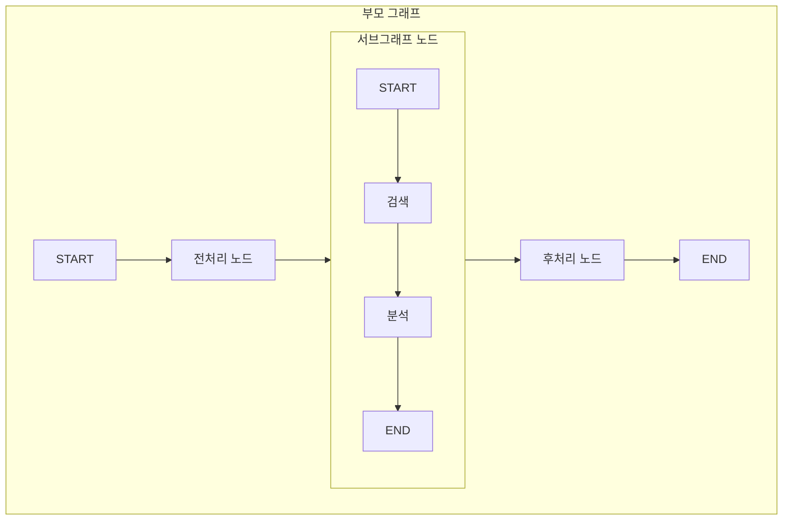
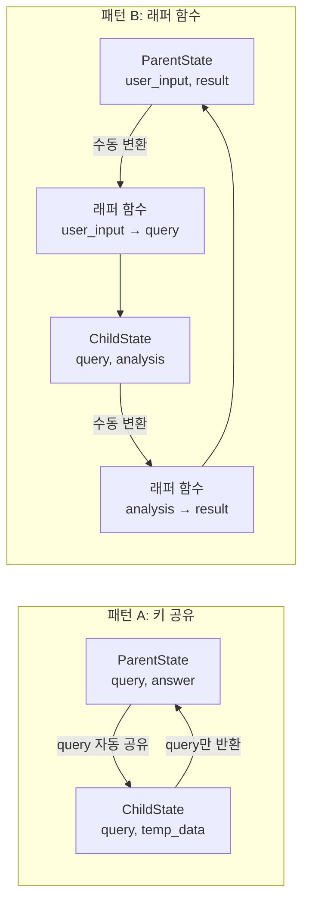
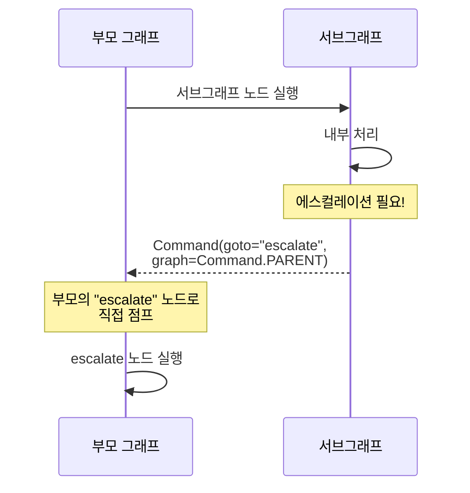
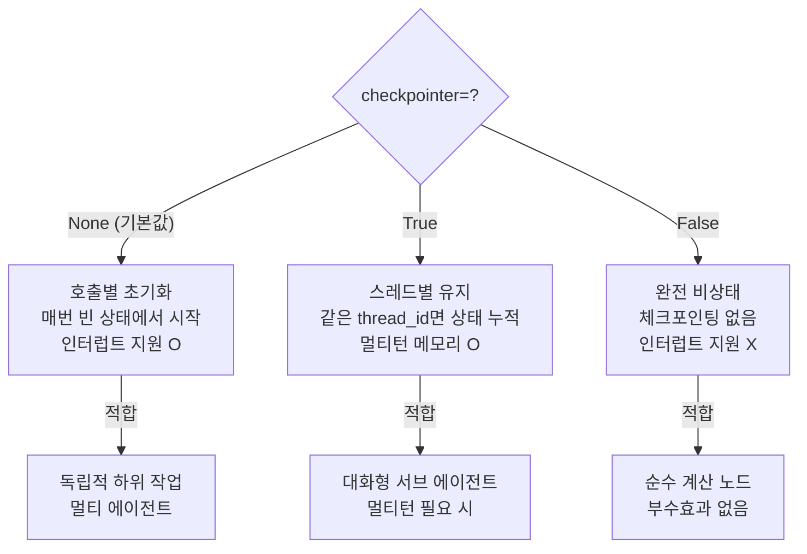
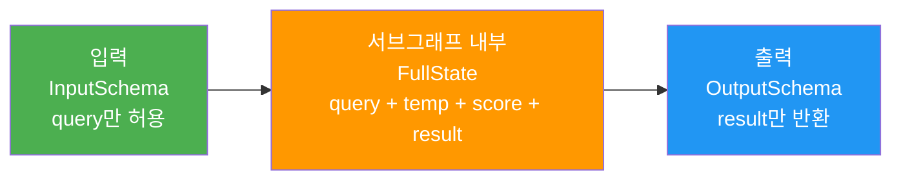

# 서브그래프와 그래프 합성

> LangGraph의 서브그래프로 복잡한 워크플로우를 모듈화하고, 부모-자식 그래프 간 상태를 매핑하는 방법을 배웁니다.

## 개요

이 섹션에서는 LangGraph의 서브그래프(Subgraph) 패턴을 학습합니다. 복잡한 에이전트 워크플로우를 독립적인 단위로 분리하고, 이를 부모 그래프에 조립하여 유지보수성과 재사용성을 높이는 방법을 다룹니다.

**선수 지식**: [조건부 엣지의 이해](05-ch5-조건-분기와-동적-라우팅/01-01-조건부-엣지의-이해.md)에서 배운 `add_conditional_edges`와 [복잡한 라우팅 전략](05-ch5-조건-분기와-동적-라우팅/02-02-복잡한-라우팅-전략.md)의 `Command` 객체 활용법이 필요합니다. [노드와 엣지 구성](04-ch4-langgraph-stategraph-기초/03-03-노드와-엣지-구성.md)에서 배운 `StateGraph` 기본 구성도 전제합니다.

**학습 목표**:
- 서브그래프를 정의하고 부모 그래프의 노드로 추가할 수 있다
- 부모-자식 그래프 간 상태 매핑 전략을 이해하고 적용할 수 있다
- `Command.PARENT`를 활용한 크로스 그래프 라우팅을 구현할 수 있다
- 서브그래프 체크포인터 설정에 따른 동작 차이를 이해한다

## 왜 알아야 할까?

실무에서 에이전트 워크플로우는 금세 복잡해집니다. 고객 문의 처리 하나만 봐도 — 의도 분류, 정보 검색, 응답 생성, 검증, 에스컬레이션 — 수십 개의 노드가 한 그래프에 뒤섞이면 디버깅도, 테스트도 악몽이 되죠.

서브그래프는 이 문제의 핵심 해법입니다. 마치 프로그래밍에서 하나의 거대한 함수를 여러 함수로 분리하듯, 복잡한 그래프를 **독립적으로 테스트 가능한 모듈**로 분리합니다. 각 서브그래프는 자체 상태 스키마를 가지고, 독립적으로 `invoke()`할 수도 있으며, 다른 프로젝트에 그대로 재사용할 수도 있습니다.

특히 팀 단위 개발에서 빛을 발합니다. 검색 팀은 검색 서브그래프를, 응답 생성 팀은 생성 서브그래프를 각자 개발·테스트한 뒤 최종 조립만 하면 됩니다.

## 핵심 개념

### 개념 1: 서브그래프란 무엇인가

> 💡 **비유**: 레고 블록을 생각해보세요. 작은 블록(노드)들을 모아 하나의 모듈(서브그래프)을 만들고, 이 모듈들을 다시 조립해서 거대한 구조물(전체 워크플로우)을 완성합니다. 각 모듈은 독립적으로 만들고 테스트할 수 있고, 다른 구조물에도 그대로 끼워 쓸 수 있죠.

서브그래프는 **컴파일된 `StateGraph`를 다른 그래프의 노드로 추가한 것**입니다. 기술적으로 서브그래프는 일반 그래프와 완전히 동일한 객체입니다. 차이가 있다면 다른 그래프 안에 "노드"로 포함되었다는 것뿐이죠.

> 📊 **그림 1**: 서브그래프 구조 — 부모 그래프 안에 독립적인 자식 그래프가 노드로 포함



서브그래프를 만드는 방법은 간단합니다. `StateGraph`를 빌드하고 `compile()`한 결과를 부모 그래프의 `add_node()`에 전달하면 됩니다:

```run:python
from langgraph.graph import StateGraph, START, END
from typing_extensions import TypedDict

# 1. 서브그래프 정의 & 컴파일
class SearchState(TypedDict):
    query: str
    results: list[str]

def search(state: SearchState) -> dict:
    # 검색 로직 (실제로는 벡터 DB나 API 호출)
    return {"results": [f"'{state['query']}' 검색 결과 1", f"'{state['query']}' 검색 결과 2"]}

def rank(state: SearchState) -> dict:
    # 검색 결과 정렬 (실제로는 관련성 점수 기반)
    ranked = sorted(state["results"], key=len)
    return {"results": ranked}

sub_builder = StateGraph(SearchState)
sub_builder.add_node("search", search)
sub_builder.add_node("rank", rank)
sub_builder.add_edge(START, "search")
sub_builder.add_edge("search", "rank")
sub_builder.add_edge("rank", END)
subgraph = sub_builder.compile()  # 독립 실행 가능한 컴파일된 그래프

# 서브그래프 단독 테스트
standalone_result = subgraph.invoke({"query": "LangGraph 서브그래프"})
print(f"서브그래프 단독 실행:")
print(f"  query: {standalone_result['query']}")
print(f"  results: {standalone_result['results']}")

# 2. 부모 그래프에 노드로 추가
class ParentState(TypedDict):
    query: str        # SearchState와 겹치는 키 → 자동 공유
    final_answer: str

def generate(state: ParentState) -> dict:
    return {"final_answer": f"'{state['query']}'에 대한 최종 답변입니다."}

parent_builder = StateGraph(ParentState)
parent_builder.add_node("search_subgraph", subgraph)  # 컴파일된 그래프를 직접 전달
parent_builder.add_node("generate", generate)
parent_builder.add_edge(START, "search_subgraph")
parent_builder.add_edge("search_subgraph", "generate")
parent_builder.add_edge("generate", END)
graph = parent_builder.compile()

# 부모 그래프 실행
result = graph.invoke({"query": "LangGraph 서브그래프"})
print(f"\n부모 그래프 실행:")
print(f"  query: {result['query']}")
print(f"  final_answer: {result['final_answer']}")
```

```output
서브그래프 단독 실행:
  query: LangGraph 서브그래프
  results: ['LangGraph 서브그래프 검색 결과 1', 'LangGraph 서브그래프 검색 결과 2']

부모 그래프 실행:
  query: LangGraph 서브그래프
  final_answer: 'LangGraph 서브그래프'에 대한 최종 답변입니다.
```

핵심은 `add_node("이름", 컴파일된_그래프)` 한 줄입니다. 일반 함수 노드와 동일한 방식으로 추가되므로, `add_edge`나 `add_conditional_edges`도 그대로 사용할 수 있습니다. 위 예시처럼 서브그래프를 먼저 단독으로 `invoke()`하여 테스트한 뒤, 부모 그래프에 조립하는 것이 일반적인 개발 흐름입니다.

### 개념 2: 상태 매핑 — 부모와 자식이 데이터를 나누는 방법

> 💡 **비유**: 본사(부모 그래프)와 지사(서브그래프)를 생각해보세요. 두 조직이 같은 이름의 문서(상태 키)를 쓰면 자동으로 공유됩니다. 지사만의 내부 문서는 본사에 노출되지 않고요. 만약 문서 이름이 아예 다르다면? 중간에 번역 담당(래퍼 함수)이 필요합니다.

부모-자식 간 상태 매핑에는 두 가지 패턴이 있습니다.

> 📊 **그림 2**: 두 가지 상태 매핑 패턴 비교



**패턴 A — 키 공유 (직접 추가)** *(이 강좌에서 사용하는 명칭입니다. LangGraph 공식 문서에서는 "overlapping keys" 또는 "shared keys" 등으로 설명됩니다)*

부모와 자식 상태에 같은 이름의 키가 있으면 LangGraph가 자동으로 매핑합니다:

```run:python
from langgraph.graph import StateGraph, START, END
from typing_extensions import TypedDict

# 자식: query(공유) + internal_data(비공유)
class ChildState(TypedDict):
    query: str           # 부모와 겹침 → 자동 공유
    internal_data: str   # 자식만의 키 → 부모에 노출 안 됨

def child_node(state: ChildState) -> dict:
    return {
        "query": state["query"].upper(),  # 공유 키 업데이트 → 부모에 반영
        "internal_data": "자식 내부 데이터"  # 비공유 → 부모에 미반영
    }

child_builder = StateGraph(ChildState)
child_builder.add_node("process", child_node)
child_builder.add_edge(START, "process")
child_builder.add_edge("process", END)
child_graph = child_builder.compile()

# 부모: query(공유) + answer(부모만)
class ParentState(TypedDict):
    query: str
    answer: str

def answer_node(state: ParentState) -> dict:
    return {"answer": f"처리됨: {state['query']}"}

parent_builder = StateGraph(ParentState)
parent_builder.add_node("child", child_graph)  # 직접 추가
parent_builder.add_node("answer", answer_node)
parent_builder.add_edge(START, "child")
parent_builder.add_edge("child", "answer")
parent_builder.add_edge("answer", END)
parent_graph = parent_builder.compile()

result = parent_graph.invoke({"query": "hello"})
print(f"query: {result['query']}")
print(f"answer: {result['answer']}")
```

```output
query: HELLO
answer: 처리됨: HELLO
```

`query`는 양쪽에 존재하므로 자동 공유됩니다. 자식이 `query`를 대문자로 바꾸면 부모에도 반영되죠. 반면 `internal_data`는 자식에만 존재하므로 부모 상태에 나타나지 않습니다.

**패턴 B — 래퍼 함수 (상태 변환)** *(이 강좌에서 사용하는 명칭입니다. LangGraph 공식 문서에서는 "state transformation" 또는 "wrapper node"로 불리는 일반적 패턴입니다)*

부모와 자식의 키 이름이 다를 때는 래퍼 함수로 감싸야 합니다:

```python
class ParentState(TypedDict):
    user_input: str    # 부모는 'user_input' 사용
    result: str

class ChildState(TypedDict):
    query: str         # 자식은 'query' 사용
    analysis: str

def call_child(state: ParentState) -> dict:
    """래퍼 함수: 부모 → 자식 상태 변환"""
    # 부모 상태를 자식 형식으로 변환
    child_input = {"query": state["user_input"]}
    
    # 서브그래프 실행
    child_output = child_graph.invoke(child_input)
    
    # 자식 결과를 부모 형식으로 변환
    return {"result": child_output["analysis"]}

parent_builder.add_node("child", call_child)  # 래퍼 함수를 노드로 추가
```

> 🔥 **실무 팁**: 가능하면 패턴 A(키 공유)를 사용하세요. 코드가 간결하고 LangGraph의 내부 최적화(체크포인팅, 스트리밍 등)를 그대로 활용할 수 있습니다. 패턴 B는 기존 서브그래프의 스키마를 수정할 수 없는 경우에만 사용하세요.

### 개념 3: Command.PARENT — 자식에서 부모로 점프하기

> 💡 **비유**: 지사(서브그래프) 직원이 업무 중 "이건 본사(부모 그래프) 직접 처리가 필요합니다"라고 판단하면, 보고서(상태 업데이트)와 함께 본사의 특정 부서(부모 노드)로 바로 에스컬레이션하는 것과 같습니다.

[복잡한 라우팅 전략](05-ch5-조건-분기와-동적-라우팅/02-02-복잡한-라우팅-전략.md)에서 배운 `Command` 객체에 `graph=Command.PARENT`를 지정하면, 서브그래프 내부에서 부모 그래프의 특정 노드로 직접 라우팅할 수 있습니다.

> 📊 **그림 3**: Command.PARENT를 활용한 크로스 그래프 라우팅



```python
from langgraph.graph import StateGraph, START, END, Command
from typing import Annotated, Literal
from operator import add

class ChildState(TypedDict):
    query: str
    severity: str

class ParentState(TypedDict):
    query: str
    severity: str
    logs: Annotated[list[str], add]  # 리듀서 필수!

def evaluate_node(state: ChildState) -> Command[Literal["escalate", "respond"]]:
    """서브그래프 노드: 심각도에 따라 부모로 라우팅"""
    if state["severity"] == "critical":
        return Command(
            update={"logs": ["[서브그래프] 긴급 에스컬레이션"]},
            goto="escalate",         # 부모 그래프의 노드 이름
            graph=Command.PARENT     # 부모 그래프로 라우팅!
        )
    return Command(
        update={"logs": ["[서브그래프] 일반 처리 완료"]},
        goto="respond",
        graph=Command.PARENT
    )
```

주의할 점이 있습니다. `Command.PARENT`로 상태를 업데이트할 때, 해당 키에 **리듀서(Reducer)가 정의되어 있어야** 합니다. 위 예시에서 `logs` 키에 `Annotated[list[str], add]`로 리듀서를 지정한 이유가 바로 이것이죠. 리듀서 없이 `Command.PARENT`로 상태를 업데이트하면 에러가 발생합니다.

> ⚠️ **흔한 오해**: "서브그래프에서 `Command.PARENT`를 쓰면 서브그래프의 나머지 노드는 건너뛰어진다"고 생각하기 쉽지만, **정적 엣지(`add_edge`)로 연결된 다음 노드는 여전히 실행될 수 있습니다**. `Command.PARENT`는 추가 목적지를 지정하는 것이지, 기존 엣지를 취소하는 것이 아닙니다. 깔끔한 라우팅을 위해서는 `add_conditional_edges`와 함께 사용하세요.

### 개념 4: 서브그래프 체크포인터 설정

서브그래프를 `compile()`할 때 `checkpointer` 옵션에 따라 동작이 크게 달라집니다. 이 설정은 서브그래프가 실행 간에 상태를 어떻게 관리하는지를 결정합니다.

> 📊 **그림 4**: 체크포인터 설정별 서브그래프 동작 비교



```python
# 기본값 (None) — 가장 일반적
subgraph = sub_builder.compile()  # checkpointer=None

# 스레드별 상태 유지 — 멀티턴 서브 에이전트
subgraph = sub_builder.compile(checkpointer=True)

# 완전 비상태 — 순수 계산
subgraph = sub_builder.compile(checkpointer=False)
```

| 설정 | 동작 | 인터럽트 | 사용 시나리오 |
|------|------|---------|-------------|
| `None` (기본) | 매 호출마다 초기 상태에서 시작 | 지원 | 대부분의 서브그래프 |
| `True` | 같은 thread_id에서 상태 누적 | 지원 | 멀티턴 대화 서브 에이전트 |
| `False` | 체크포인팅 완전 비활성화 | 미지원 | 순수 변환 로직 |

> 💡 **알고 계셨나요?**: `checkpointer=True`로 설정하면 서브그래프에 멀티턴 메모리가 생기지만, **병렬 도구 호출은 지원되지 않습니다**. 체크포인트 네임스페이스 충돌 때문인데, 병렬 처리가 필요하다면 기본값(`None`)을 유지해야 합니다.

### 개념 5: input/output 스키마로 서브그래프 경계 설정

서브그래프를 외부에 공개할 때, 모든 내부 상태를 노출하고 싶지 않을 수 있습니다. `StateGraph`의 `input_schema`와 `output_schema`를 활용하면 서브그래프의 "공개 API"를 정의할 수 있습니다.

> 📊 **그림 5**: input/output 스키마로 서브그래프 인터페이스 제한



```python
class InputSchema(TypedDict):
    query: str

class OutputSchema(TypedDict):
    result: str

class FullState(TypedDict):
    query: str
    temp_data: str     # 내부용
    score: float       # 내부용
    result: str

sub_builder = StateGraph(
    FullState,
    input=InputSchema,     # 외부에서 받을 키
    output=OutputSchema    # 외부로 내보낼 키
)
```

이렇게 하면 서브그래프를 `invoke()`할 때 `query`만 넣으면 되고, 결과로 `result`만 돌아옵니다. `temp_data`나 `score` 같은 내부 상태는 완전히 캡슐화됩니다.

## 실습: 직접 해보기

고객 지원 시스템을 서브그래프로 모듈화해봅시다. 의도 분류, 기술 지원, 일반 문의의 세 서브그래프를 만들고 부모 그래프에서 조건부 라우팅으로 연결합니다.

```python
"""
고객 지원 시스템 — 서브그래프 기반 모듈화
- 분류 서브그래프: 고객 문의를 카테고리별로 분류
- 기술 지원 서브그래프: 기술 문제 해결
- 일반 문의 서브그래프: FAQ 기반 응답
"""

from typing import Annotated, Literal, TypedDict
from operator import add
from langgraph.graph import StateGraph, START, END, Command

# ─── 공유 상태 키 ───
class BaseState(TypedDict):
    query: str
    category: str
    logs: Annotated[list[str], add]

# ═══════════════════════════════════════
# 서브그래프 1: 의도 분류기
# ═══════════════════════════════════════
class ClassifierState(TypedDict):
    query: str
    category: str
    confidence: float
    logs: Annotated[list[str], add]

def classify(state: ClassifierState) -> dict:
    """간단한 키워드 기반 분류 (실제로는 LLM 사용)"""
    query = state["query"].lower()
    if any(kw in query for kw in ["에러", "오류", "버그", "설치", "crash"]):
        category, confidence = "technical", 0.9
    elif any(kw in query for kw in ["가격", "환불", "결제", "구독"]):
        category, confidence = "billing", 0.85
    else:
        category, confidence = "general", 0.7
    
    return {
        "category": category,
        "confidence": confidence,
        "logs": [f"[분류기] '{query}' → {category} (확신도: {confidence})"]
    }

# 분류 서브그래프 빌드
classifier_builder = StateGraph(ClassifierState)
classifier_builder.add_node("classify", classify)
classifier_builder.add_edge(START, "classify")
classifier_builder.add_edge("classify", END)
classifier_graph = classifier_builder.compile()

# ═══════════════════════════════════════
# 서브그래프 2: 기술 지원
# ═══════════════════════════════════════
class TechState(TypedDict):
    query: str
    logs: Annotated[list[str], add]
    solution: str

def diagnose(state: TechState) -> dict:
    return {
        "solution": "",
        "logs": [f"[기술지원] 문제 진단 중: {state['query']}"]
    }

def suggest_fix(state: TechState) -> dict:
    return {
        "solution": f"'{state['query']}'에 대한 해결 방법: 앱을 재시작하고 캐시를 삭제하세요.",
        "logs": ["[기술지원] 해결책 제안 완료"]
    }

tech_builder = StateGraph(TechState)
tech_builder.add_node("diagnose", diagnose)
tech_builder.add_node("suggest_fix", suggest_fix)
tech_builder.add_edge(START, "diagnose")
tech_builder.add_edge("diagnose", "suggest_fix")
tech_builder.add_edge("suggest_fix", END)
tech_graph = tech_builder.compile()

# ═══════════════════════════════════════
# 서브그래프 3: 일반 문의
# ═══════════════════════════════════════
class GeneralState(TypedDict):
    query: str
    logs: Annotated[list[str], add]
    answer: str

def faq_lookup(state: GeneralState) -> dict:
    faq = {
        "영업시간": "평일 9시~18시, 주말 휴무입니다.",
        "default": "담당 부서로 연결해드리겠습니다."
    }
    query = state["query"]
    answer = next(
        (v for k, v in faq.items() if k in query),
        faq["default"]
    )
    return {
        "answer": answer,
        "logs": [f"[일반문의] FAQ 응답: {answer[:30]}..."]
    }

general_builder = StateGraph(GeneralState)
general_builder.add_node("faq_lookup", faq_lookup)
general_builder.add_edge(START, "faq_lookup")
general_builder.add_edge("faq_lookup", END)
general_graph = general_builder.compile()

# ═══════════════════════════════════════
# 부모 그래프: 전체 조립
# ═══════════════════════════════════════
class MainState(TypedDict):
    query: str
    category: str
    solution: str
    answer: str
    logs: Annotated[list[str], add]
    final_response: str

def route_by_category(state: MainState) -> Literal["tech_support", "general_inquiry"]:
    """분류 결과에 따라 적절한 서브그래프로 라우팅"""
    if state["category"] == "technical":
        return "tech_support"
    return "general_inquiry"

def compose_response(state: MainState) -> dict:
    """최종 응답 합성"""
    if state.get("solution"):
        response = f"[기술 지원]\n{state['solution']}"
    elif state.get("answer"):
        response = f"[일반 안내]\n{state['answer']}"
    else:
        response = "담당자에게 연결해드리겠습니다."
    return {
        "final_response": response,
        "logs": ["[메인] 최종 응답 생성 완료"]
    }

# 부모 그래프 구성
main_builder = StateGraph(MainState)

# 서브그래프를 노드로 추가
main_builder.add_node("classifier", classifier_graph)
main_builder.add_node("tech_support", tech_graph)
main_builder.add_node("general_inquiry", general_graph)
main_builder.add_node("compose", compose_response)

# 엣지 구성
main_builder.add_edge(START, "classifier")
main_builder.add_conditional_edges("classifier", route_by_category)
main_builder.add_edge("tech_support", "compose")
main_builder.add_edge("general_inquiry", "compose")
main_builder.add_edge("compose", END)

# 컴파일 & 실행
main_graph = main_builder.compile()

# 테스트
result = main_graph.invoke({
    "query": "앱에서 에러가 계속 발생해요",
    "logs": []
})
print(f"카테고리: {result['category']}")
print(f"최종 응답: {result['final_response']}")
print(f"\n실행 로그:")
for log in result['logs']:
    print(f"  {log}")
```

```output
카테고리: technical
최종 응답: [기술 지원]
'앱에서 에러가 계속 발생해요'에 대한 해결 방법: 앱을 재시작하고 캐시를 삭제하세요.

실행 로그:
  [분류기] '앱에서 에러가 계속 발생해요' → technical (확신도: 0.9)
  [기술지원] 문제 진단 중: 앱에서 에러가 계속 발생해요
  [기술지원] 해결책 제안 완료
  [메인] 최종 응답 생성 완료
```

각 서브그래프는 독립적으로 테스트할 수 있습니다:

```run:python
# 서브그래프 단독 테스트
tech_result = tech_graph.invoke({
    "query": "로그인 실패",
    "logs": []
})
print(f"기술 지원 단독 결과: {tech_result['solution']}")

general_result = general_graph.invoke({
    "query": "영업시간 알려주세요",
    "logs": []
})
print(f"일반 문의 단독 결과: {general_result['answer']}")
```

```output
기술 지원 단독 결과: '로그인 실패'에 대한 해결 방법: 앱을 재시작하고 캐시를 삭제하세요.
일반 문의 단독 결과: 평일 9시~18시, 주말 휴무입니다.
```

## 더 깊이 알아보기

### 서브그래프 패턴의 기원: Unix 철학과 Pregel 모델

서브그래프 합성은 사실 소프트웨어 공학의 오래된 원칙을 그래프 실행에 적용한 것입니다. 1978년 Doug McIlroy가 제안한 Unix 철학 — *"한 가지를 잘 하는 프로그램을 만들고, 파이프로 연결하라"* — 이 서브그래프 패턴의 정신적 뿌리라 할 수 있죠.

LangGraph의 서브그래프 구현은 Google의 **Pregel 논문(2010)**에서도 영향을 받았습니다. Pregel은 대규모 그래프 처리를 위한 분산 프레임워크로, "**슈퍼스텝(superstep)**" 단위로 노드들이 메시지를 주고받습니다. [LangGraph 아키텍처 개관](04-ch4-langgraph-stategraph-기초/01-01-langgraph-아키텍처-개관.md)에서 다룬 것처럼, LangGraph 역시 내부적으로 Pregel 모델을 채택했는데, 서브그래프는 이 Pregel 실행 안에서 중첩된 Pregel 실행을 만드는 셈입니다.

흥미로운 점은, 초기 LangGraph(v0.0.x)에는 서브그래프 기능이 없었다는 것입니다. 사용자들이 복잡한 워크플로우를 하나의 거대한 그래프로 만들면서 유지보수 문제가 빈번히 보고되자, Harrison Chase(LangChain CEO)가 2024년 중반 서브그래프 지원을 핵심 기능으로 추가했습니다. `Command.PARENT`는 그보다 나중에 추가된 기능으로, 서브그래프 간 유연한 제어 흐름을 가능하게 해줬습니다.

## 흔한 오해와 팁

> ⚠️ **흔한 오해**: "서브그래프는 부모의 모든 상태에 접근할 수 있다" — 아닙니다. 서브그래프는 **자신의 상태 스키마에 정의된 키**만 볼 수 있습니다. 부모에 `api_key`가 있어도 자식 스키마에 `api_key`가 없으면 접근 불가합니다. 이는 의도된 캡슐화이며, 보안 관점에서도 바람직합니다.

> 💡 **알고 계셨나요?**: 서브그래프 실행을 디버깅할 때 `graph.stream(input, subgraphs=True)`를 사용하면 서브그래프 내부 노드의 실행 상태까지 스트리밍으로 확인할 수 있습니다. 부모 그래프만 스트리밍하면 서브그래프는 하나의 노드로 보여 내부가 블랙박스가 되는데, 이 옵션이 그 문제를 해결합니다.

> 🔥 **실무 팁**: 서브그래프를 설계할 때는 **"이 서브그래프만 떼어내서 단독 테스트할 수 있는가?"**를 항상 자문하세요. 단독 테스트가 불가능하다면 부모에 대한 의존성이 너무 강하다는 신호입니다. `input_schema`/`output_schema`를 정의하면 서브그래프의 인터페이스가 명확해져서 단독 테스트가 쉬워집니다.

## 핵심 정리

| 개념 | 설명 |
|------|------|
| 서브그래프 | 컴파일된 `StateGraph`를 다른 그래프의 노드로 추가한 것 |
| 키 공유 패턴 | 부모·자식에 같은 키가 있으면 자동 매핑. 가장 간결한 방식 *(이 강좌 명칭)* |
| 래퍼 함수 패턴 | 키 이름이 다를 때 변환 함수로 감싸서 수동 매핑 *(이 강좌 명칭)* |
| `Command.PARENT` | 서브그래프에서 부모 그래프의 특정 노드로 직접 라우팅 |
| 리듀서 필수 | `Command.PARENT`로 상태 업데이트 시 대상 키에 리듀서가 있어야 함 |
| `checkpointer=None` | 기본값. 매 호출마다 초기화, 인터럽트 지원 |
| `checkpointer=True` | 스레드별 상태 누적. 멀티턴 메모리 필요 시 사용 |
| `input/output` 스키마 | 서브그래프의 공개 인터페이스를 제한하여 캡슐화 강화 |

## 다음 섹션 미리보기

서브그래프로 워크플로우를 모듈화하는 방법을 배웠으니, 다음은 **병렬 처리**입니다. [맵-리듀스 병렬 처리](05-ch5-조건-분기와-동적-라우팅/04-04-맵-리듀스-병렬-처리.md)에서는 `Send` 객체를 활용한 동적 팬아웃(fan-out) 패턴과, 여러 워커에게 작업을 분배하고 결과를 합치는 맵-리듀스 패턴을 학습합니다. 이 패턴은 서브그래프와 결합하면 대규모 병렬 에이전트 시스템을 구축하는 강력한 도구가 됩니다.

## 참고 자료

- [LangGraph Subgraphs 공식 문서](https://docs.langchain.com/oss/python/langgraph/use-subgraphs) - 서브그래프 패턴의 공식 가이드, 상태 매핑과 체크포인터 설정 설명
- [LangGraph 핵심 개념 (Low Level)](https://github.com/langchain-ai/langgraph/blob/main/docs/docs/concepts/low_level.md) - StateGraph, 노드, 엣지, Command의 내부 구조 상세 문서
- [LangGraph GitHub 리포지토리](https://github.com/langchain-ai/langgraph) - 최신 릴리스 노트와 예제 코드
- [LangGraph: Build Stateful AI Agents in Python (Real Python)](https://realpython.com/langgraph-python/) - 서브그래프 포함 실전 튜토리얼
- [Pregel: A System for Large-Scale Graph Processing (Google, 2010)](https://dl.acm.org/doi/10.1145/1807167.1807184) - LangGraph의 실행 모델에 영향을 준 원본 논문

---
### 🔗 Related Sessions
- [stategraph](04-ch4-langgraph-stategraph-기초/01-01-langgraph-아키텍처-개관.md) (prerequisite)
- [compile()](04-ch4-langgraph-stategraph-기초/01-01-langgraph-아키텍처-개관.md) (prerequisite)
- [command](07-ch7-human-in-the-loop-워크플로우/01-01-human-in-the-loop-패턴-개관.md) (prerequisite)
- [add_node](04-ch4-langgraph-stategraph-기초/03-03-노드와-엣지-구성.md) (prerequisite)
- [add_edge](04-ch4-langgraph-stategraph-기초/03-03-노드와-엣지-구성.md) (prerequisite)
- [add_conditional_edges](05-ch5-조건-분기와-동적-라우팅/01-01-조건부-엣지의-이해.md) (prerequisite)
