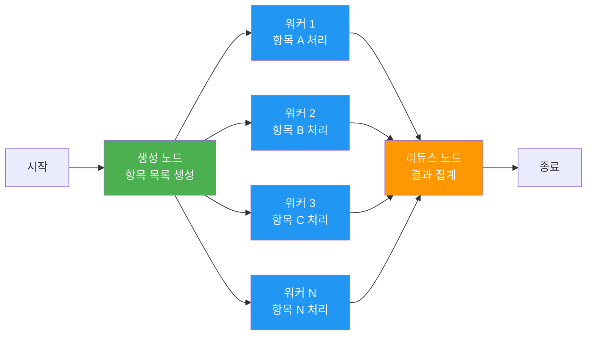
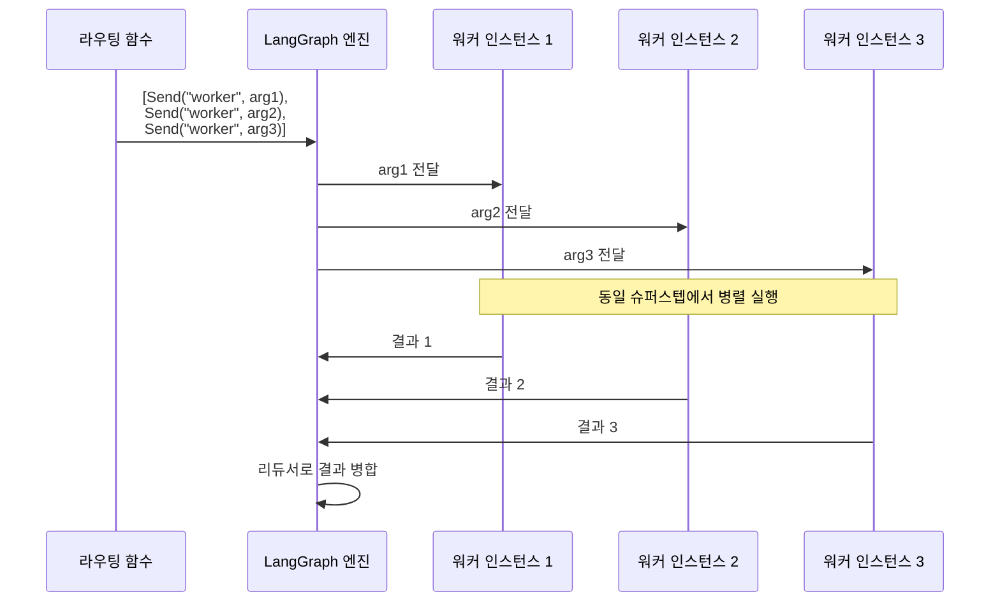
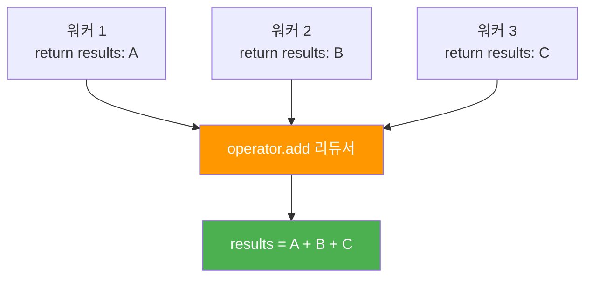
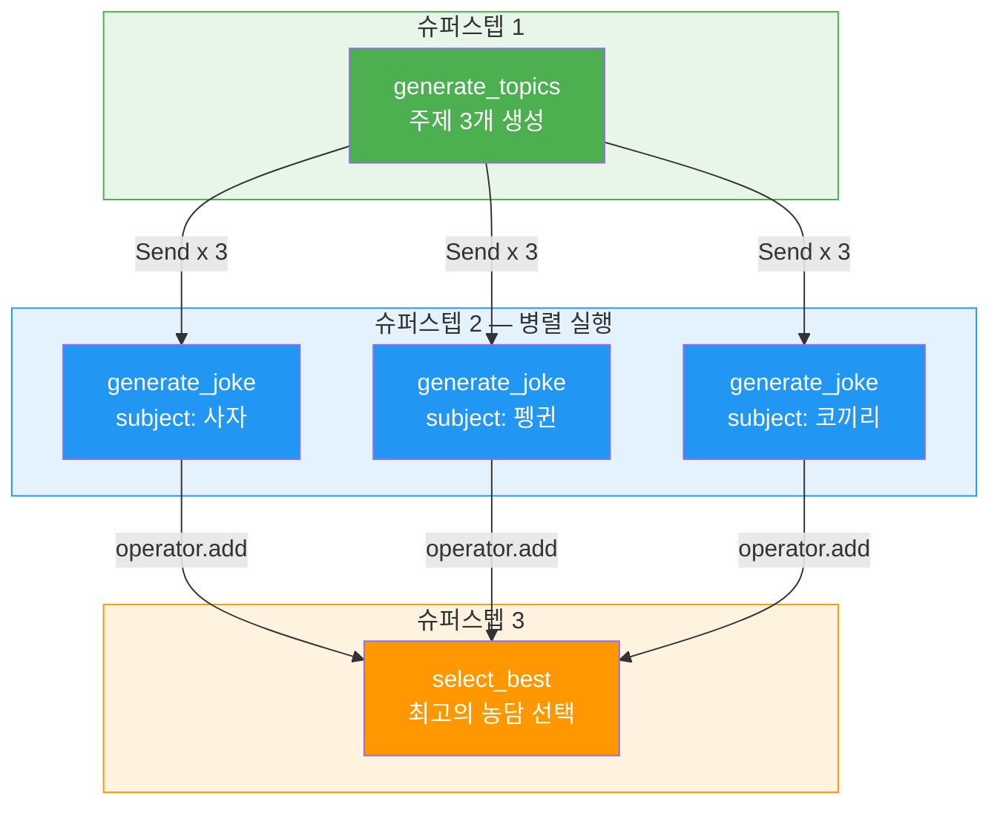
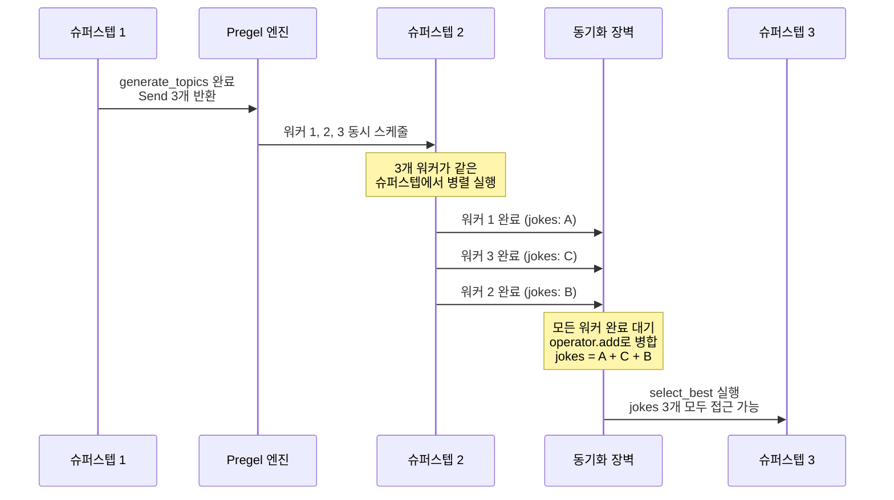
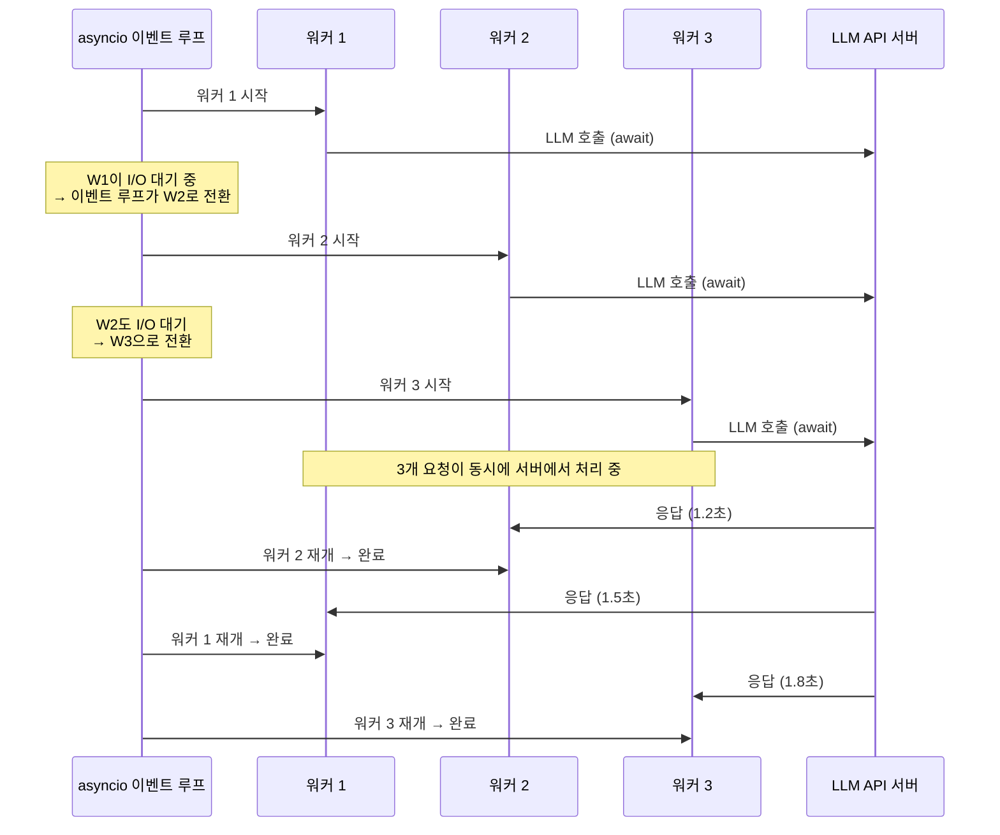

# 맵-리듀스 병렬 처리

> LangGraph의 Send API로 동적 병렬 노드를 생성하고, 팬아웃/팬인 패턴으로 대규모 작업을 효율적으로 처리하는 방법을 학습합니다.

## 개요

이 섹션에서는 LangGraph의 `Send` 객체를 활용한 맵-리듀스(Map-Reduce) 병렬 처리 패턴을 학습합니다. 앞서 [서브그래프와 그래프 합성](05-ch5-조건-분기와-동적-라우팅/03-03-서브그래프와-그래프-합성.md)에서 모듈화된 그래프를 조립하는 법을 배웠다면, 이번에는 **런타임에 동적으로 병렬 노드를 생성**하여 작업을 분산 처리하는 방법을 다룹니다.

**선수 지식**:
- [조건부 엣지의 이해](05-ch5-조건-분기와-동적-라우팅/01-01-조건부-엣지의-이해.md)의 `add_conditional_edges`와 라우팅 함수
- [리듀서와 상태 업데이트 패턴](04-ch4-langgraph-stategraph-기초/04-04-리듀서와-상태-업데이트-패턴.md)의 `Annotated` 리듀서 개념
- [LangGraph 아키텍처 개관](04-ch4-langgraph-stategraph-기초/01-01-langgraph-아키텍처-개관.md)의 슈퍼스텝(superstep) 실행 모델

**학습 목표**:
- `Send` 객체의 동작 원리와 사용법을 이해한다
- 팬아웃(fan-out) / 팬인(fan-in) 패턴을 구현할 수 있다
- 리듀서를 활용한 결과 집계 전략을 설계할 수 있다
- Send의 실제 실행 모델(비동기 동시성 vs 진정한 병렬)을 정확히 이해한다
- 실전 맵-리듀스 에이전트 워크플로우를 구축할 수 있다

## 왜 알아야 할까?

실무에서 에이전트를 운영하다 보면 이런 상황을 자주 만나게 됩니다.

- 사용자가 올린 문서 **10개를 동시에 요약**해야 할 때
- 하나의 질문에 대해 **여러 관점으로 답변을 생성**한 뒤 최선의 답변을 고를 때
- 검색 결과 **5개를 병렬로 평가**하고 관련성 높은 것만 필터링할 때

이때 문제가 있습니다. 그래프를 설계할 시점에는 처리할 항목이 몇 개인지 모른다는 거죠. 문서가 3개일 수도 있고 100개일 수도 있는데, 각 항목마다 노드를 미리 만들어 놓을 수는 없잖아요?

`Send` API는 바로 이 문제를 해결합니다. **런타임에 데이터를 보고 그 수만큼 병렬 노드를 동적으로 생성**해주거든요. 전통적인 분산 컴퓨팅의 맵-리듀스 패턴을 LangGraph의 상태 머신 위에 자연스럽게 구현한 것입니다.

## 핵심 개념

### 개념 1: 맵-리듀스 패턴의 이해

> 💡 **비유**: 시험 채점을 생각해보세요. 선생님 한 명이 100장을 순서대로 채점하면 하루가 꼬박 걸립니다. 하지만 선생님 10명이 10장씩 **나눠서 동시에 채점**(Map)한 뒤, 결과를 **한 곳에 모아** 성적표를 만들면(Reduce) 훨씬 빠르죠. 맵-리듀스는 바로 이 원리입니다.

맵-리듀스는 대규모 데이터를 처리하는 고전적인 분산 컴퓨팅 패턴입니다. LangGraph에서는 이를 세 단계로 구현합니다:

1. **생성(Generate)**: 처리할 항목 목록을 만든다
2. **맵(Map)**: 각 항목을 병렬 워커 노드에 분배한다 → **팬아웃**
3. **리듀스(Reduce)**: 모든 워커의 결과를 수집하여 하나로 합친다 → **팬인**

> 📊 **그림 1**: 맵-리듀스 패턴의 전체 흐름



핵심은 **워커 노드의 수가 런타임에 결정된다**는 점입니다. 일반적인 `add_conditional_edges`는 라우팅 함수가 문자열(노드 이름)을 반환하여 하나의 경로를 선택하지만, 맵-리듀스에서는 `Send` 객체의 **리스트**를 반환하여 여러 경로를 동시에 생성합니다.

### 개념 2: Send 객체의 구조와 동작

> 💡 **비유**: `Send`는 우체국의 **동시 배달 시스템**과 같습니다. 하나의 소포를 여러 수신자에게 각각 다른 내용물을 담아 동시에 배송하는 거죠. 수신자(노드)는 같은 곳이지만, 각 소포(상태)는 다릅니다.

`Send` 클래스는 `langgraph.types`에서 임포트합니다:

```python
from langgraph.types import Send
```

생성자는 두 가지 인자를 받습니다:

```python
Send(node: str, arg: Any)
```

| 파라미터 | 설명 | 예시 |
|----------|------|------|
| `node` | 실행할 대상 노드 이름 | `"analyze_document"` |
| `arg` | 해당 노드에 전달할 상태 딕셔너리 | `{"doc": "문서 내용..."}` |

중요한 점이 있습니다. `Send`에 전달하는 `arg`는 그래프의 전체 상태(State)와 **다른 스키마**여도 됩니다. 워커 노드는 자신만의 입력 형태를 받을 수 있어요.

> 📊 **그림 2**: Send 객체의 동작 원리



라우팅 함수가 `Send` 객체의 리스트를 반환하면, LangGraph 엔진은 이를 감지하여 자동으로 병렬 실행을 수행합니다. 일반 라우팅 함수가 문자열을 반환하는 것과 구별되는 핵심 차이점이죠.

```python
# 일반 라우팅: 문자열 반환 → 하나의 경로
def normal_route(state: State) -> str:
    return "next_node"

# Send 라우팅: Send 리스트 반환 → 여러 병렬 경로
def fan_out_route(state: State) -> list[Send]:
    return [Send("worker", {"item": item}) for item in state["items"]]
```

### 개념 3: 리듀서 기반 결과 집계

> 💡 **비유**: 여러 심사위원이 동시에 점수를 매기고, 점수판에 결과를 하나씩 붙이는 상황을 떠올려보세요. 점수판(리스트)에 `operator.add` 리듀서가 달려 있으면, 각 심사위원이 자기 점수를 붙일 때 기존 점수를 덮어쓰지 않고 **뒤에 추가**합니다.

맵-리듀스에서 가장 중요한 부분은 **병렬 워커들의 결과를 안전하게 합치는 것**입니다. 여러 노드가 동시에 같은 상태 키를 업데이트하면 충돌이 일어날 수 있거든요. 이때 리듀서가 해결사 역할을 합니다.

```python
import operator
from typing import Annotated, TypedDict

class State(TypedDict):
    items: list[str]                              # 처리할 항목
    results: Annotated[list[str], operator.add]   # 리듀서로 안전한 병합
    summary: str                                  # 최종 집계 결과
```

`Annotated[list[str], operator.add]`가 핵심입니다. 각 워커 노드가 `{"results": ["내 결과"]}`를 반환하면, 리듀서가 모든 결과를 **자동으로 연결(concatenate)** 해줍니다.

> 📊 **그림 3**: 리듀서의 결과 병합 과정



리듀서 선택은 집계 전략에 따라 달라집니다:

| 리듀서 | 동작 | 사용 사례 |
|--------|------|----------|
| `operator.add` | 리스트 연결 | 결과 수집, 로그 누적 |
| 커스텀 함수 | 자유로운 병합 로직 | 점수 평균, 투표, 필터링 |

커스텀 리듀서 예시를 보겠습니다:

```python
def best_score_reducer(current: list[dict], new: list[dict]) -> list[dict]:
    """점수가 0.7 이상인 결과만 유지하는 커스텀 리듀서"""
    combined = current + new
    return [r for r in combined if r["score"] >= 0.7]

class State(TypedDict):
    results: Annotated[list[dict], best_score_reducer]
```

### 개념 4: 팬아웃/팬인 그래프 구성

> 💡 **비유**: 팬아웃은 부채(fan)를 펼치는 것, 팬인은 다시 접는 것입니다. 한 점에서 여러 갈래로 퍼졌다가 다시 한 점으로 모이는 흐름이죠.

전체 그래프 구성을 코드로 살펴보겠습니다. 세 가지 핵심 요소가 어떻게 조합되는지 주목하세요:

```python
from langgraph.graph import StateGraph, START, END
from langgraph.types import Send
from typing import Annotated, TypedDict
import operator


# 1️⃣ 상태 정의: 리듀서가 핵심
class OverallState(TypedDict):
    topic: str
    subjects: list[str]
    jokes: Annotated[list[str], operator.add]  # 병렬 결과 수집용
    best_joke: str


# 2️⃣ 생성 노드: 처리할 항목 목록 생성
def generate_topics(state: OverallState) -> dict:
    # 실제로는 LLM을 호출하여 주제 목록을 생성
    return {"subjects": ["사자", "펭귄", "코끼리"]}


# 3️⃣ 라우팅 함수: Send 리스트 반환 → 팬아웃
def route_to_workers(state: OverallState) -> list[Send]:
    return [Send("generate_joke", {"subject": s}) for s in state["subjects"]]


# 4️⃣ 워커 노드: 개별 항목 처리
def generate_joke(state: dict) -> dict:
    subject = state["subject"]
    # 실제로는 LLM 호출
    joke = f"{subject}에 대한 재미있는 농담"
    return {"jokes": [joke]}  # 리스트로 감싸야 operator.add 동작


# 5️⃣ 리듀스 노드: 결과 집계
def select_best(state: OverallState) -> dict:
    return {"best_joke": state["jokes"][0]}


# 6️⃣ 그래프 조립
builder = StateGraph(OverallState)
builder.add_node("generate_topics", generate_topics)
builder.add_node("generate_joke", generate_joke)
builder.add_node("select_best", select_best)

builder.add_edge(START, "generate_topics")
builder.add_conditional_edges("generate_topics", route_to_workers, ["generate_joke"])
builder.add_edge("generate_joke", "select_best")
builder.add_edge("select_best", END)

graph = builder.compile()
```

`add_conditional_edges`의 세 번째 인자 `["generate_joke"]`은 **path_map**으로, Send가 라우팅할 수 있는 노드 이름 목록입니다. LangGraph가 그래프 구조를 검증할 때 사용하죠.

> 📊 **그림 4**: 팬아웃/팬인 실행 흐름의 슈퍼스텝



#### Send와 슈퍼스텝 실행 모델의 관계

[LangGraph 아키텍처 개관](04-ch4-langgraph-stategraph-기초/01-01-langgraph-아키텍처-개관.md)에서 배운 슈퍼스텝(superstep) 실행 모델이 여기서 핵심적인 역할을 합니다. Send로 생성된 병렬 워커들이 실제로 어떻게 실행되는지 정확히 이해해봅시다.

LangGraph의 Pregel 엔진은 BSP(Bulk Synchronous Parallel) 모델을 따릅니다. 이 모델에서 하나의 슈퍼스텝은 세 단계로 구성됩니다:

1. **계산(Computation)**: 해당 슈퍼스텝에 스케줄된 모든 노드가 동시에 실행
2. **통신(Communication)**: 각 노드의 출력이 리듀서를 통해 상태에 병합
3. **동기화 장벽(Barrier Synchronization)**: 모든 노드가 완료될 때까지 대기 → 완료 후 다음 슈퍼스텝으로 진행

`Send`가 반환하는 워커들은 **모두 동일한 슈퍼스텝에 스케줄**됩니다. 위 예시에서 흐름을 따라가보면:

- **슈퍼스텝 1**: `generate_topics` 실행 → 라우팅 함수가 `Send` 3개 반환
- **슈퍼스텝 2**: 3개의 `generate_joke` 인스턴스가 **같은 슈퍼스텝에서 동시 실행** → 모든 워커가 완료될 때까지 동기화 장벽이 대기 → 완료 후 각 워커의 `{"jokes": [...]}` 결과가 `operator.add` 리듀서로 병합
- **슈퍼스텝 3**: 리듀서 병합이 끝난 후에야 `select_best`가 실행 → 이때 `state["jokes"]`에는 3개 워커의 결과가 모두 들어있음

> 📊 **그림 5**: 슈퍼스텝 내 Send 워커의 실행과 동기화



이 동기화 장벽이 중요한 이유는, **워커들의 완료 순서가 보장되지 않기 때문**입니다. 워커 3이 워커 1보다 먼저 끝날 수 있지만, 리듀스 노드는 항상 **모든 워커가 완료된 후**에만 실행됩니다. 이것이 바로 BSP 모델의 "Bulk Synchronous" — 대량의 작업을 동기적으로 묶어 처리한다는 의미입니다.

한 가지 중요한 점은, 같은 슈퍼스텝의 워커들은 **서로의 결과를 볼 수 없다**는 것입니다. 워커 2가 워커 1의 결과를 참조해야 하는 경우라면 맵-리듀스 패턴이 아닌 순차 실행을 써야 합니다. 각 워커는 오직 `Send`의 `arg`로 전달받은 데이터만 가지고 독립적으로 작업합니다.

#### Send의 실제 실행 모델: "논리적 병렬"의 정체

여기서 Python 개발자라면 자연스럽게 의문이 생길 겁니다. "동시 실행이라고 했는데, Python에는 GIL이 있잖아? 정말 병렬인가요?"

핵심부터 말하면, **Send 워커들은 `asyncio`를 통한 동시성(concurrency)이지, OS 스레드를 사용한 진정한 병렬성(parallelism)이 아닙니다.** 하지만 에이전트 워크로드에서는 사실상 병렬과 동일한 효과를 냅니다. 왜 그런지 실행 모델을 정확히 들여다봅시다.

> 📊 **그림 6**: Send 워커의 실제 실행 타임라인 — asyncio 동시성



LangGraph의 Pregel 엔진은 내부적으로 `asyncio.gather()` (또는 이에 준하는 메커니즘)로 같은 슈퍼스텝의 워커들을 실행합니다. 동작 방식을 단계별로 보면:

1. **워커 1 시작** → LLM API 호출(`await`) → **I/O 대기 상태**로 전환
2. **이벤트 루프가 워커 2 시작** → 마찬가지로 LLM 호출 후 I/O 대기
3. **워커 3도 동일** → 이 시점에서 3개의 HTTP 요청이 **네트워크 상에서 동시에** 진행 중
4. 응답이 돌아오는 순서대로 워커를 재개하여 후처리 완료

이 구조가 의미하는 바를 정리하면:

| 구분 | 설명 |
|------|------|
| **실행 모델** | 단일 스레드, `asyncio` 이벤트 루프 기반 동시성 |
| **GIL 영향** | 없음 — 스레드가 아닌 코루틴이므로 GIL과 무관 |
| **I/O 바운드 작업** | 사실상 병렬 — 네트워크 요청이 동시에 진행되므로 총 소요 시간 ≈ 가장 느린 워커 1개의 시간 |
| **CPU 바운드 작업** | 순차와 동일 — 이벤트 루프가 양보(yield) 없이 CPU를 점유하면 다른 워커가 실행되지 못함 |

그래서 "동시 실행"이라는 표현이 정확합니다. **논리적으로는 병렬**이고(같은 슈퍼스텝에서 동시에 스케줄), **물리적으로는 코루틴 전환**이며, **효과적으로는 I/O 작업에 한해 진짜 병렬에 가깝습니다.**

에이전트 워크로드의 대부분은 LLM API 호출이라는 I/O 바운드 작업이기 때문에, Send의 asyncio 기반 동시성은 실무에서 매우 효과적입니다. 문서 3개를 각각 1.5초씩 LLM으로 분석한다면, 순차 실행은 4.5초가 걸리지만 Send로 팬아웃하면 약 1.5~1.8초면 됩니다.

> ⚠️ **흔한 오해**: "CPU 바운드 워커는 `Send`로 보내면 안 된다"고 단정짓기 쉽지만, 실무에서 **순수 CPU 바운드인 에이전트 워커는 거의 없습니다.** 텍스트 전처리, 임베딩 생성, API 호출 등 대부분의 에이전트 태스크에는 I/O가 섞여 있어서 Send의 동시성 혜택을 충분히 받습니다. 만약 정말 무거운 CPU 작업(대규모 행렬 연산 등)이 필요하다면, 워커 안에서 `asyncio.to_thread()`로 별도 스레드에 위임하거나, 외부 서비스로 오프로드하는 것이 정석입니다.

### 개념 5: 워커 노드의 상태 스키마 분리

맵-리듀스에서 자주 헷갈리는 부분이 있습니다. 워커 노드가 받는 상태는 그래프의 `OverallState`가 아닐 수 있다는 점이에요.

```python
# 그래프 전체 상태
class OverallState(TypedDict):
    documents: list[str]
    summaries: Annotated[list[str], operator.add]


# 워커 노드가 받는 상태 (별도 스키마)
class WorkerInput(TypedDict):
    doc_content: str
    doc_index: int


# 라우팅 함수에서 WorkerInput 형태로 Send
def fan_out_docs(state: OverallState) -> list[Send]:
    return [
        Send("summarize", {"doc_content": doc, "doc_index": i})
        for i, doc in enumerate(state["documents"])
    ]


# 워커는 WorkerInput을 받지만, OverallState 키로 결과를 반환
def summarize(state: WorkerInput) -> dict:
    content = state["doc_content"]
    idx = state["doc_index"]
    summary = f"문서 {idx}의 요약: {content[:50]}..."
    return {"summaries": [summary]}  # OverallState의 리듀서 키로 반환
```

핵심 규칙을 정리하면:

1. `Send`의 `arg`는 **워커 노드의 입력 형태**를 결정한다
2. 워커 노드의 **반환값**은 반드시 **OverallState의 리듀서 키**에 맞춰야 한다
3. 리듀서가 없는 키를 여러 워커가 동시에 업데이트하면 **마지막 쓰기 우선(last-writer-wins)** — 결과가 비결정적이 된다

> ⚠️ **흔한 오해**: `Send`에 전달하는 상태가 반드시 `OverallState`의 부분집합이어야 한다고 생각하기 쉽지만, 실제로는 완전히 다른 스키마도 가능합니다. 워커 노드의 타입 힌트를 별도로 정의하면 됩니다.

## 실습: 직접 해보기

다중 문서를 병렬로 분석하는 실전 워크플로우를 만들어보겠습니다. 여러 기술 문서를 동시에 요약하고, 키워드를 추출한 뒤, 전체 보고서를 생성하는 에이전트입니다.

```python
"""맵-리듀스 패턴: 다중 문서 병렬 분석 에이전트"""

import operator
from typing import Annotated, TypedDict

from langchain_openai import ChatOpenAI
from langgraph.graph import StateGraph, START, END
from langgraph.types import Send


# ── 상태 정의 ──────────────────────────────────────────

class OverallState(TypedDict):
    """그래프 전체 상태"""
    topic: str                                           # 분석 주제
    documents: list[str]                                 # 원본 문서 목록
    analyses: Annotated[list[dict], operator.add]        # 병렬 분석 결과
    report: str                                          # 최종 보고서


class DocAnalysisInput(TypedDict):
    """워커 노드 입력 스키마 (OverallState와 다름!)"""
    doc_content: str
    doc_index: int
    topic: str


# ── LLM 설정 ──────────────────────────────────────────

llm = ChatOpenAI(model="gpt-4o-mini", temperature=0)


# ── 노드 함수 ─────────────────────────────────────────

def prepare_documents(state: OverallState) -> dict:
    """Step 1: 문서 목록 준비 (실제로는 DB/API에서 가져옴)"""
    documents = [
        "LangGraph는 상태 기계 기반의 에이전트 프레임워크입니다. "
        "노드와 엣지로 구성된 그래프를 통해 복잡한 워크플로우를 구현합니다.",

        "MCP(Model Context Protocol)는 LLM과 외부 도구 간의 "
        "표준 통합 프로토콜입니다. Anthropic이 주도하여 개발했습니다.",

        "ReAct 패턴은 추론(Reasoning)과 행동(Acting)을 번갈아 수행하며 "
        "문제를 해결하는 에이전트 설계 패턴입니다.",
    ]
    return {"documents": documents}


def route_to_analyzers(state: OverallState) -> list[Send]:
    """Step 2: 문서 수만큼 워커 노드를 동적으로 생성 (팬아웃)"""
    return [
        Send("analyze_document", {
            "doc_content": doc,
            "doc_index": i,
            "topic": state["topic"],
        })
        for i, doc in enumerate(state["documents"])
    ]


def analyze_document(state: DocAnalysisInput) -> dict:
    """Step 3: 개별 문서 분석 (병렬 실행되는 워커)"""
    response = llm.invoke(
        f"다음 문서를 '{state['topic']}' 관점에서 분석하세요.\n\n"
        f"문서 {state['doc_index'] + 1}:\n{state['doc_content']}\n\n"
        f"JSON 형식으로 답하세요: "
        f'{{"summary": "한 줄 요약", "keywords": ["키워드1", "키워드2"], '
        f'"relevance": "high/medium/low"}}'
    )
    return {
        "analyses": [{
            "doc_index": state["doc_index"],
            "analysis": response.content,
        }]
    }


def generate_report(state: OverallState) -> dict:
    """Step 4: 분석 결과 집계 (리듀스)"""
    analyses_text = "\n".join(
        f"문서 {a['doc_index'] + 1}: {a['analysis']}"
        for a in sorted(state["analyses"], key=lambda x: x["doc_index"])
    )
    response = llm.invoke(
        f"아래 {len(state['analyses'])}개 문서 분석 결과를 종합하여 "
        f"'{state['topic']}' 주제에 대한 종합 보고서를 작성하세요.\n\n"
        f"{analyses_text}"
    )
    return {"report": response.content}


# ── 그래프 조립 ────────────────────────────────────────

builder = StateGraph(OverallState)

# 노드 등록
builder.add_node("prepare_documents", prepare_documents)
builder.add_node("analyze_document", analyze_document)
builder.add_node("generate_report", generate_report)

# 엣지 연결
builder.add_edge(START, "prepare_documents")
builder.add_conditional_edges(
    "prepare_documents",
    route_to_analyzers,
    ["analyze_document"],       # path_map: Send가 라우팅할 노드 목록
)
builder.add_edge("analyze_document", "generate_report")
builder.add_edge("generate_report", END)

# 컴파일
graph = builder.compile()
```

이제 실행해보겠습니다:

```run:python
# 그래프 실행
result = graph.invoke({"topic": "AI 에이전트 프레임워크"})

print(f"분석된 문서 수: {len(result['analyses'])}")
print(f"\n=== 종합 보고서 ===")
print(result["report"][:500])
```

```output
분석된 문서 수: 3

=== 종합 보고서 ===
# AI 에이전트 프레임워크 종합 분석 보고서

3개 문서를 분석한 결과, AI 에이전트 프레임워크의 핵심 구성 요소를 다음과 같이 정리할 수 있습니다.

1. **LangGraph**: 상태 기계 기반의 그래프 프레임워크로, 복잡한 워크플로우를 노드와 엣지로 구조화합니다.
2. **MCP**: LLM과 외부 도구 간의 표준 프로토콜로, 에이전트의 도구 통합 레이어를 담당합니다.
3. **ReAct 패턴**: 추론-행동 순환 구조를 통해 에이전트의 문제 해결 전략을 정의합니다.

이 세 기술은 각각 인프라(LangGraph), 통합(MCP), 설계(ReAct) 레이어에서 AI 에이전트를 지원합니다.
```

스트리밍으로 각 워커의 진행 상황을 관찰할 수도 있습니다:

```run:python
# 스트리밍으로 병렬 실행 관찰
for event in graph.stream(
    {"topic": "AI 에이전트 프레임워크"},
    stream_mode="updates",
):
    for node_name, update in event.items():
        if node_name == "analyze_document":
            idx = update["analyses"][0]["doc_index"]
            print(f"[워커] 문서 {idx + 1} 분석 완료")
        elif node_name == "generate_report":
            print(f"[리듀스] 종합 보고서 생성 완료")
```

```output
[워커] 문서 1 분석 완료
[워커] 문서 2 분석 완료
[워커] 문서 3 분석 완료
[리듀스] 종합 보고서 생성 완료
```

> 🔥 **실무 팁**: 스트리밍 모드에서 워커들은 실행 완료 순서대로 이벤트를 발생시킵니다. 문서 2가 문서 1보다 먼저 완료될 수 있으니, `doc_index`로 순서를 추적하는 것이 좋습니다. 리듀스 노드에서 `sorted()`를 사용하는 이유이기도 하죠.

## 더 깊이 알아보기

### Pregel에서 LangGraph까지 — 병렬 그래프 처리의 계보

LangGraph의 실행 엔진 이름이 왜 **Pregel**인지 궁금했던 적 있으신가요?

2010년, Google은 대규모 그래프 처리를 위한 시스템 **Pregel**을 발표합니다. 이 이름은 수학자 레온하르트 오일러가 "쾨니히스베르크의 다리 문제"를 풀 때 건넜던 **프레겔 강(Pregel River)**에서 따온 것이에요. 그래프 이론의 시조격 문제와 연결되는 멋진 네이밍이죠.

Pregel의 핵심 아이디어는 Leslie Valiant이 1980년대에 제안한 **BSP(Bulk Synchronous Parallel)** 모델에서 왔습니다. BSP의 핵심은 "슈퍼스텝"입니다 — 모든 프로세서가 동시에 계산하고, 동기화 장벽(barrier)에서 결과를 교환한 뒤, 다음 슈퍼스텝으로 넘어가는 구조입니다.

LangGraph는 이 Pregel 모델을 AI 에이전트에 적용했습니다. 각 노드가 "정점(vertex)"이 되고, 엣지가 "메시지 전달 경로"가 되며, 하나의 슈퍼스텝에서 병렬 노드들이 동시에 실행된 후 리듀서로 결과를 동기화합니다. `Send` API는 바로 Pregel의 "정점이 이웃에게 메시지를 보내는" 개념을 LangGraph식으로 구현한 것입니다.

### MapReduce의 빅데이터 유산

물론 맵-리듀스 자체의 역사는 더 깊습니다. 2004년 Google의 Jeffrey Dean과 Sanjay Ghemawat이 발표한 **MapReduce** 논문은 빅데이터 시대를 열었습니다. Hadoop, Spark 등 현대 데이터 처리 프레임워크의 조상이죠. LangGraph의 맵-리듀스는 이 거인의 어깨 위에서 AI 에이전트의 병렬 처리라는 새로운 문제를 풀고 있는 셈입니다.

> 💡 **알고 계셨나요?**: Google Pregel 논문의 예시 중 하나는 PageRank 알고리즘의 병렬 계산이었습니다. 수십억 개의 웹 페이지 그래프에서 각 정점이 이웃의 PageRank를 받아 자신의 순위를 업데이트하는 과정이 슈퍼스텝으로 반복되었죠. LangGraph에서 여러 문서를 병렬로 분석하는 것은 이 고전적 패턴의 AI 에이전트 버전입니다.

## 흔한 오해와 팁

> ⚠️ **흔한 오해**: "Send로 보낸 워커들이 멀티스레드로 진짜 병렬 실행된다"고 생각하기 쉽습니다. 실제로는 **asyncio 이벤트 루프** 기반의 동시성(concurrency)입니다. 워커 노드 안에서 `await`이 발생할 때(LLM API 호출, HTTP 요청 등) 이벤트 루프가 다른 워커에게 실행 기회를 넘기는 구조죠. GIL(Global Interpreter Lock)이 문제가 되지 않는 이유이기도 합니다 — 애초에 멀티스레드가 아니라 단일 스레드 위의 코루틴이니까요. I/O 바운드 워크로드(LLM 호출, API 요청)에서는 사실상 병렬과 동일한 성능을 보이지만, 순수 CPU 바운드 작업만 있는 워커라면 순차 실행과 차이가 없습니다.

> 💡 **알고 계셨나요?**: `Send` 객체는 `__hash__`와 `__eq__`가 구현되어 있어서, 동일한 노드+인자 조합은 중복 제거됩니다. 같은 문서를 실수로 두 번 보내도 한 번만 실행되는 안전장치가 있는 거죠.

> 🔥 **실무 팁**: 워커 노드의 결과를 리스트로 반환할 때 `{"results": [value]}`처럼 **반드시 리스트로 감싸세요**. `{"results": value}`로 반환하면 `operator.add` 리듀서가 문자열 결합을 시도하여 예상치 못한 결과가 나옵니다. 이것은 가장 흔한 실수 중 하나입니다!

> 🔥 **실무 팁**: 워커 수가 많아질 때는 LLM API의 **Rate Limit**을 고려해야 합니다. 100개 문서를 동시에 Send하면 100개의 API 호출이 거의 동시에 발생합니다. 실무에서는 배치 크기를 제한하거나, [에이전트 종료 조건과 안전장치](02-ch2-react-패턴과-에이전트-루프/03-03-에이전트-종료-조건과-안전장치.md)에서 배운 것처럼 재시도 로직을 워커 안에 넣어두는 것이 좋습니다.

## 핵심 정리

| 개념 | 설명 |
|------|------|
| `Send(node, arg)` | 대상 노드에 특정 상태를 전달하여 병렬 인스턴스를 생성하는 객체 |
| 팬아웃(Fan-out) | 라우팅 함수가 `Send` 리스트를 반환하여 여러 워커를 동시에 생성 |
| 팬인(Fan-in) | 모든 워커 완료 후 리듀서가 결과를 병합하여 다음 노드로 전달 |
| `operator.add` 리듀서 | 병렬 워커의 리스트 결과를 안전하게 연결(concatenate) |
| 워커 상태 분리 | `Send`의 `arg`는 그래프 전체 상태와 다른 스키마 가능 |
| path_map | `add_conditional_edges`의 세 번째 인자로 Send 대상 노드 목록 명시 |
| 슈퍼스텝 실행 | Send 워커들은 동일 슈퍼스텝에서 동시 실행되고, 동기화 장벽에서 모든 완료를 대기한 후 다음 슈퍼스텝으로 진행 |
| 동기화 장벽(Barrier) | BSP 모델의 핵심 — 같은 슈퍼스텝의 워커끼리는 서로의 결과를 볼 수 없음 |
| asyncio 동시성 | Send 워커는 단일 스레드 이벤트 루프 위의 코루틴 — I/O 대기 시 다른 워커로 전환되므로 GIL과 무관하며, I/O 바운드 작업에서 사실상 병렬 |

## 다음 섹션 미리보기

이번 섹션에서 배운 맵-리듀스 병렬 처리는 다음 [의사결정 에이전트 실습](05-ch5-조건-분기와-동적-라우팅/05-05-의사결정-에이전트-실습.md)에서 지금까지 배운 모든 라우팅 기법 — 조건부 엣지, 복잡한 라우팅 전략, 서브그래프, 맵-리듀스 — 을 통합하여 실전 의사결정 에이전트를 구축합니다. 여러 분석 관점을 병렬로 실행하고 종합 판단을 내리는 완전한 워크플로우를 만들어 보겠습니다.

## 참고 자료

- [LangGraph 공식 문서: Use the Graph API](https://docs.langchain.com/oss/python/langgraph/use-graph-api) - Send API와 맵-리듀스 패턴의 공식 가이드. `Send` 생성자, 리듀서 연동, path_map 사용법이 상세히 설명되어 있습니다.
- [LangGraph GitHub Repository](https://github.com/langchain-ai/langgraph) - `langgraph.types` 모듈의 `Send` 클래스 소스 코드를 직접 확인할 수 있습니다. `__hash__`, `__eq__` 등 내부 동작 이해에 유용합니다.
- [LangGraph Academy: Map-Reduce Pattern](https://deepwiki.com/langchain-ai/langchain-academy/7.1-map-reduce-pattern) - langchain-academy 교육 과정의 맵-리듀스 섹션. 단계별 실습과 함께 팬아웃/팬인 패턴을 학습할 수 있습니다.
- [Pregel: A System for Large-Scale Graph Processing (Google, 2010)](https://15799.courses.cs.cmu.edu/fall2013/static/papers/p135-malewicz.pdf) - LangGraph 실행 엔진의 이론적 기반인 Pregel 논문. 슈퍼스텝과 BSP 모델을 이해하는 데 필수적입니다.
- [The Evolution of Graph Processing: From Pregel to LangGraph](https://medium.com/@pur4v/the-evolution-of-graph-processing-from-pregel-to-langgraph-6e8c2063df98) - Pregel에서 LangGraph까지의 기술 계보를 정리한 글. 분산 그래프 처리가 AI 에이전트로 진화한 과정을 이해할 수 있습니다.

---
### 🔗 Related Sessions
- [stategraph](04-ch4-langgraph-stategraph-기초/01-01-langgraph-아키텍처-개관.md) (prerequisite)
- [add_conditional_edges](05-ch5-조건-분기와-동적-라우팅/01-01-조건부-엣지의-이해.md) (prerequisite)
- [routing_function](05-ch5-조건-분기와-동적-라우팅/01-01-조건부-엣지의-이해.md) (prerequisite)
