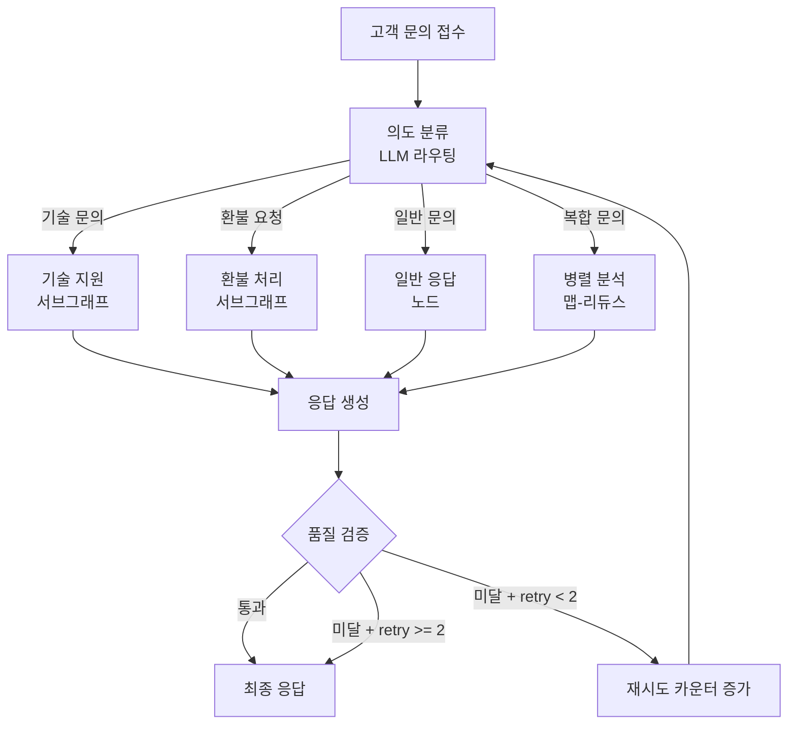
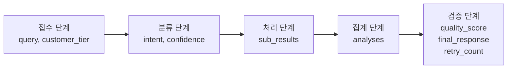
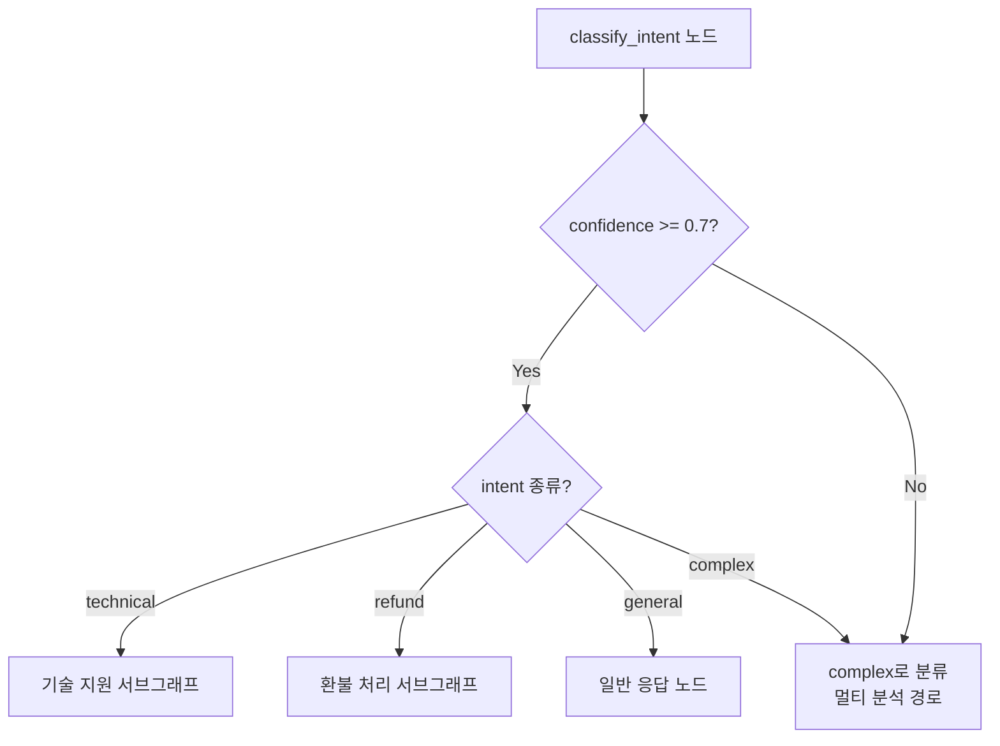
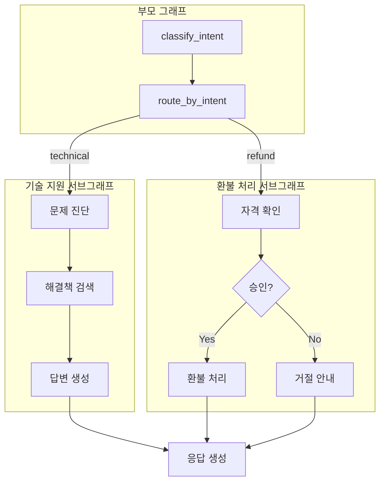
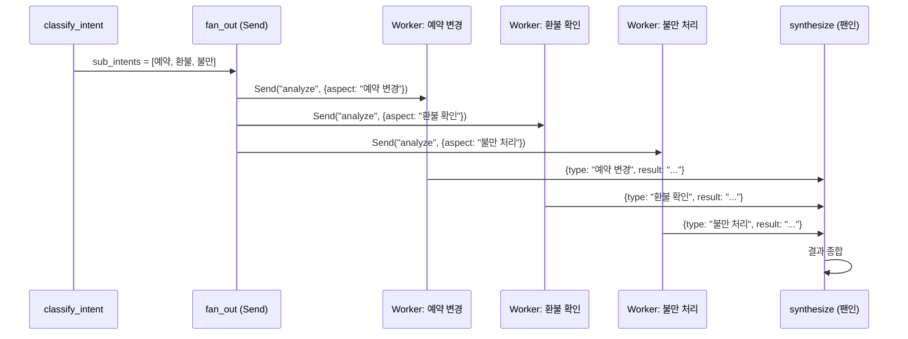
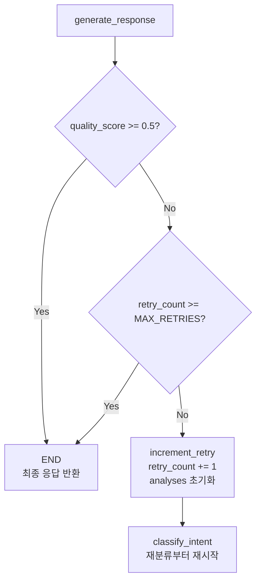

# 의사결정 에이전트 실습

> 조건부 엣지, 서브그래프, 맵-리듀스를 통합한 프로덕션급 고객 지원 라우팅 에이전트를 구축합니다.

## 개요

이 섹션은 Ch5 전체의 마무리 프로젝트입니다. [조건부 엣지](05-ch5-조건-분기와-동적-라우팅/01-01-조건부-엣지의-이해.md), [복잡한 라우팅](05-ch5-조건-분기와-동적-라우팅/02-02-복잡한-라우팅-전략.md), [서브그래프](05-ch5-조건-분기와-동적-라우팅/03-03-서브그래프와-그래프-합성.md), [맵-리듀스](05-ch5-조건-분기와-동적-라우팅/04-04-맵-리듀스-병렬-처리.md)에서 배운 모든 기법을 하나의 에이전트 시스템으로 통합합니다.

**선수 지식**: Ch5의 모든 이전 섹션 (5.1~5.4)
**학습 목표**:
- 조건부 엣지 + LLM 기반 라우팅 + 서브그래프 + 맵-리듀스를 하나의 그래프로 통합할 수 있다
- 복합 상태 스키마로 다단계 의사결정 흐름을 설계할 수 있다
- 에러 핸들링과 폴백 경로를 포함한 프로덕션급 워크플로우를 구현할 수 있다

## 왜 알아야 할까?

지금까지 우리는 라우팅 기법을 하나씩 분리해서 배웠습니다. 하지만 실전에서는 이 기법들이 **동시에** 필요합니다. 고객 문의 하나를 처리하려면 — 먼저 의도를 분류하고(조건부 엣지), 복잡도에 따라 전문 팀으로 보내고(LLM 라우팅), 각 팀은 독립적인 워크플로우를 수행하며(서브그래프), 여러 관점에서 동시에 분석한 결과를 종합해야 합니다(맵-리듀스).

이 섹션에서 구축할 **고객 지원 의사결정 에이전트**는 바로 그런 시스템입니다. 레스토랑 예약 플랫폼의 고객 지원 에이전트를 만들면서, 4가지 기법이 어떻게 맞물려 돌아가는지 체험해 보겠습니다.

> 📊 **그림 1**: 이번 실습에서 구축할 의사결정 에이전트의 전체 아키텍처



위 다이어그램에서 주목할 점은 **품질 검증 → 재시도 경로에 `retry < 2` 조건**이 걸려 있다는 것입니다. 이 조건이 없으면 LLM이 계속 저품질 응답을 생성할 때 무한 루프에 빠지게 됩니다. 최대 2회 재시도 후에는 현재 응답을 그대로 반환하거나, 실무에서는 사람에게 에스컬레이션하는 경로를 추가합니다.

## 핵심 개념

### 개념 1: 통합 상태 스키마 설계

> 💡 **비유**: 병원 차트를 생각해보세요. 환자가 접수할 때 기본 정보가 기록되고, 진료과마다 각자의 소견을 추가하고, 검사 결과가 쌓이고, 최종 진단이 내려집니다. 우리의 상태 스키마도 같은 역할 — 에이전트가 문의를 처리하는 **전 과정**의 기록입니다.

4가지 기법을 통합하려면 상태 스키마가 핵심입니다. 각 노드가 읽고 쓸 정보, 라우팅에 필요한 메타데이터, 맵-리듀스의 집계 결과를 모두 담아야 하거든요.

> 📊 **그림 2**: 통합 상태 스키마의 데이터 흐름



```python
import operator
from typing import Annotated, Literal, TypedDict


class AgentState(TypedDict):
    """고객 지원 의사결정 에이전트의 통합 상태"""
    # ── 입력 정보 ──
    query: str                    # 고객 문의 원문
    customer_tier: str            # "free", "premium", "enterprise"

    # ── 분류 결과 ──
    intent: str                   # "technical", "refund", "general", "complex"
    confidence: float             # LLM 분류 확신도 (0.0 ~ 1.0)
    sub_intents: list[str]        # 복합 문의 시 세부 의도 목록

    # ── 처리 결과 (리듀서로 병렬 결과 집계) ──
    analyses: Annotated[list[dict], operator.add]

    # ── 최종 출력 ──
    final_response: str           # 고객에게 전달할 최종 응답
    quality_score: float          # 품질 점수 (0.0 ~ 1.0)

    # ── 재시도 제어 ──
    retry_count: int              # 현재 재시도 횟수 (max 2)
```

설계 포인트를 살펴보면:

- **`analyses`에 `operator.add` 리듀서**를 적용했습니다. 맵-리듀스에서 여러 워커가 동시에 결과를 추가해도 안전하게 병합됩니다.
- **`sub_intents`**는 복합 문의를 쪼갤 때 사용합니다. "예약도 변경하고 환불도 하고 싶어요"라면 `["reservation_change", "partial_refund"]`가 됩니다.
- **`retry_count`**로 품질 미달 시 재시도 횟수를 추적합니다. 상한(기본 2회)을 초과하면 현재 응답을 강제 반환하여 **무한 루프를 방지**합니다.

### 개념 2: LLM 라우팅과 조건부 엣지의 결합

> 💡 **비유**: 대형 병원의 접수 데스크를 상상해보세요. 숙련된 간호사가 환자 증상을 듣고 "내과로 가세요", "외과 상담이 필요합니다", "증상이 복합적이니 여러 과를 동시에 진료받으셔야 합니다"라고 안내합니다. LLM이 바로 이 간호사 역할이에요.

[5.2절](05-ch5-조건-분기와-동적-라우팅/02-02-복잡한-라우팅-전략.md)에서 배운 LLM 기반 의미 라우팅과 [5.1절](05-ch5-조건-분기와-동적-라우팅/01-01-조건부-엣지의-이해.md)의 `add_conditional_edges`를 결합합니다.

> 📊 **그림 3**: 분류 노드의 의사결정 흐름



```python
from pydantic import BaseModel, Field
from langchain_openai import ChatOpenAI


class IntentClassification(BaseModel):
    """고객 문의 의도 분류 결과"""
    intent: Literal["technical", "refund", "general", "complex"] = Field(
        description="문의의 주요 의도"
    )
    confidence: float = Field(
        ge=0.0, le=1.0,
        description="분류 확신도 (0~1)"
    )
    sub_intents: list[str] = Field(
        default_factory=list,
        description="복합 문의의 경우 세부 의도 목록"
    )
    reasoning: str = Field(
        description="분류 근거 (디버깅용)"
    )


llm = ChatOpenAI(model="gpt-4o-mini", temperature=0)
classifier = llm.with_structured_output(IntentClassification)


def classify_intent(state: AgentState) -> dict:
    """LLM으로 고객 문의 의도를 분류하는 노드"""
    result = classifier.invoke(
        f"고객 등급: {state['customer_tier']}\n"
        f"문의 내용: {state['query']}\n\n"
        "이 문의의 의도를 분류하세요. "
        "여러 의도가 섞여 있으면 'complex'로 분류하고 "
        "sub_intents에 각 세부 의도를 나열하세요."
    )

    # 확신도가 낮으면 complex로 전환 — 더 신중한 경로
    intent = result.intent if result.confidence >= 0.7 else "complex"
    sub_intents = result.sub_intents or [result.intent]

    return {
        "intent": intent,
        "confidence": result.confidence,
        "sub_intents": sub_intents if intent == "complex" else [],
    }
```

라우팅 함수는 상태의 `intent` 필드를 읽어 분기합니다:

```python
from langgraph.graph import END


def route_by_intent(state: AgentState) -> str:
    """의도에 따라 다음 노드를 결정하는 라우팅 함수"""
    route_map = {
        "technical": "tech_support",
        "refund": "refund_handler",
        "general": "general_response",
        "complex": "parallel_analysis",
    }
    return route_map.get(state["intent"], "general_response")
```

### 개념 3: 서브그래프로 전문 워크플로우 캡슐화

> 💡 **비유**: 대형 마트의 각 코너를 생각해보세요. 정육 코너, 수산 코너, 베이커리는 각각 독립적인 작업 흐름과 전문 인력이 있지만, 모두 같은 건물(부모 그래프) 안에서 운영됩니다.

[5.3절](05-ch5-조건-분기와-동적-라우팅/03-03-서브그래프와-그래프-합성.md)에서 배운 서브그래프 패턴을 적용합니다. 기술 지원과 환불 처리를 각각 독립 서브그래프로 만들면, 테스트와 유지보수가 훨씬 수월해집니다.

> 📊 **그림 4**: 서브그래프 내부 구조와 부모 그래프 연결



```python
from langgraph.graph import StateGraph, START, END


# --- 기술 지원 서브그래프 ---
class TechState(TypedDict):
    """기술 지원 서브그래프의 내부 상태"""
    query: str  # 부모와 공유하는 키
    customer_tier: str
    diagnosis: str
    solution: str


def diagnose_issue(state: TechState) -> dict:
    """기술 문제를 진단하는 노드"""
    # 실제로는 LLM 호출 또는 지식베이스 검색
    diagnosis = f"문제 진단 완료: '{state['query']}' → 예약 시스템 관련 이슈"
    return {"diagnosis": diagnosis}


def generate_solution(state: TechState) -> dict:
    """진단을 바탕으로 해결책을 생성하는 노드"""
    tier_context = (
        "우선 처리 대상" if state["customer_tier"] == "enterprise"
        else "일반 처리"
    )
    solution = (
        f"[{tier_context}] {state['diagnosis']}에 대한 해결 방안:\n"
        "1. 브라우저 캐시를 삭제해 주세요.\n"
        "2. 문제가 지속되면 고객센터에 연락 부탁드립니다."
    )
    return {"solution": solution}


# 서브그래프 빌드 + 컴파일
tech_builder = StateGraph(TechState)
tech_builder.add_node("diagnose", diagnose_issue)
tech_builder.add_node("solve", generate_solution)
tech_builder.add_edge(START, "diagnose")
tech_builder.add_edge("diagnose", "solve")
tech_builder.add_edge("solve", END)
tech_subgraph = tech_builder.compile()


# --- 환불 처리 서브그래프 ---
class RefundState(TypedDict):
    query: str
    customer_tier: str
    eligible: bool
    refund_result: str


def check_eligibility(state: RefundState) -> dict:
    """환불 자격을 확인하는 노드"""
    # 프리미엄 이상은 무조건 자격 부여 (비즈니스 룰)
    eligible = state["customer_tier"] in ("premium", "enterprise")
    return {"eligible": eligible}


def process_refund(state: RefundState) -> dict:
    return {"refund_result": "환불이 승인되었습니다. 3-5 영업일 내 처리됩니다."}


def deny_refund(state: RefundState) -> dict:
    return {"refund_result": "죄송합니다. 현재 환불 자격 요건에 해당하지 않습니다."}


def route_eligibility(state: RefundState) -> str:
    return "process" if state["eligible"] else "deny"


refund_builder = StateGraph(RefundState)
refund_builder.add_node("check", check_eligibility)
refund_builder.add_node("process", process_refund)
refund_builder.add_node("deny", deny_refund)
refund_builder.add_edge(START, "check")
refund_builder.add_conditional_edges("check", route_eligibility)
refund_builder.add_edge("process", END)
refund_builder.add_edge("deny", END)
refund_subgraph = refund_builder.compile()
```

서브그래프를 부모 그래프에 연결할 때는 **래퍼 함수 패턴**을 사용합니다. 서브그래프의 결과를 부모 상태의 `analyses` 리스트로 변환하는 거죠:

```python
def tech_support_wrapper(state: AgentState) -> dict:
    """기술 지원 서브그래프 래퍼 — 결과를 부모 상태 형태로 변환"""
    result = tech_subgraph.invoke({
        "query": state["query"],
        "customer_tier": state["customer_tier"],
    })
    return {
        "analyses": [{"type": "technical", "result": result["solution"]}]
    }


def refund_handler_wrapper(state: AgentState) -> dict:
    """환불 처리 서브그래프 래퍼"""
    result = refund_subgraph.invoke({
        "query": state["query"],
        "customer_tier": state["customer_tier"],
    })
    return {
        "analyses": [{"type": "refund", "result": result["refund_result"]}]
    }
```

### 개념 4: 맵-리듀스로 복합 문의 병렬 처리

> 💡 **비유**: 복합 문의는 마치 종합건강검진과 같습니다. 혈액검사, X-ray, 초음파를 **동시에** 진행한 뒤, 모든 결과를 모아 종합 소견을 작성하죠. 순서대로 하나씩 했다간 하루 종일 걸릴 겁니다.

[5.4절](05-ch5-조건-분기와-동적-라우팅/04-04-맵-리듀스-병렬-처리.md)에서 배운 `Send` 객체를 활용합니다. 복합 문의에 포함된 각 세부 의도를 **병렬 워커**에게 동시에 보내고, 결과를 `operator.add` 리듀서로 집계합니다.

> 📊 **그림 5**: 맵-리듀스 병렬 분석 흐름



```python
from langgraph.types import Send


class AnalysisWorkerState(TypedDict):
    """병렬 분석 워커의 독립 상태"""
    query: str
    aspect: str  # 분석할 세부 의도
    customer_tier: str


def fan_out_analysis(state: AgentState) -> list[Send]:
    """복합 문의의 세부 의도를 병렬 워커에게 분배 (팬아웃)"""
    return [
        Send("analyze_aspect", {
            "query": state["query"],
            "aspect": aspect,
            "customer_tier": state["customer_tier"],
        })
        for aspect in state["sub_intents"]
    ]


def analyze_aspect(state: AnalysisWorkerState) -> dict:
    """개별 세부 의도를 분석하는 워커 노드"""
    # 실제로는 LLM 호출로 해당 관점에서 분석
    analysis = (
        f"[{state['aspect']}] 분석 결과: "
        f"'{state['query']}'에 대해 {state['aspect']} 관점에서 "
        f"검토 완료. 고객 등급({state['customer_tier']}) 반영."
    )
    return {
        "analyses": [{"type": state["aspect"], "result": analysis}]
    }
```

### 개념 5: 품질 게이트와 재시도 루프

현실 세계에서 에이전트의 첫 번째 응답이 항상 만족스러운 건 아닙니다. 품질 검증 노드를 추가해서, 기준 미달이면 재분류부터 다시 시작하는 피드백 루프를 만들겠습니다.

다만 여기서 중요한 건 **무한 루프 방지**입니다. LLM이 계속 저품질 응답을 생성하면 재시도가 끝없이 반복될 수 있거든요. 그래서 `retry_count`를 상태에 포함시키고, 최대 재시도 횟수(`MAX_RETRIES = 2`)를 초과하면 현재 응답을 강제로 반환합니다.

> 📊 **그림 6**: 품질 게이트의 재시도 흐름과 무한 루프 방지



이 패턴은 **bounded retry(유한 재시도)**라고 부르는데요, 프로덕션 시스템에서는 필수입니다. 재시도 상한을 초과했을 때의 처리 전략은 크게 세 가지가 있습니다:

| 전략 | 설명 | 적합한 상황 |
|------|------|-------------|
| **강제 반환** | 현재 응답을 그대로 반환 | 응답이 없는 것보다 나은 경우 |
| **에스컬레이션** | Human-in-the-Loop로 전환 | 고위험 문의 (환불, 법률 등) |
| **폴백 응답** | 미리 준비된 안전한 응답 반환 | 고객 대면 서비스 |

```python
MAX_RETRIES = 2  # 최대 재시도 횟수


def generate_response(state: AgentState) -> dict:
    """분석 결과를 종합하여 최종 응답을 생성하는 노드"""
    if not state.get("analyses"):
        return {
            "final_response": "죄송합니다. 문의를 처리하는 중 오류가 발생했습니다.",
            "quality_score": 0.0,
        }

    # 모든 분석 결과를 하나의 응답으로 종합
    parts = []
    for analysis in state["analyses"]:
        parts.append(f"[{analysis['type']}] {analysis['result']}")

    response = "고객님의 문의에 대한 답변입니다.\n\n" + "\n\n".join(parts)

    # 간단한 품질 점수 (실무에서는 LLM-as-judge 활용)
    score = min(1.0, len(response) / 200)  # 응답 길이 기반 임시 점수

    return {
        "final_response": response,
        "quality_score": score,
    }


def check_quality(state: AgentState) -> str:
    """품질 게이트 — 통과하면 종료, 미달이면 재시도 (상한 초과 시 강제 통과)"""
    if state["quality_score"] >= 0.5:
        return "pass"
    # 무한 루프 방지: 최대 재시도 횟수 초과 시 강제 통과
    if state.get("retry_count", 0) >= MAX_RETRIES:
        return "pass"
    return "retry"


def increment_retry(state: AgentState) -> dict:
    """재시도 카운터를 증가시키고 이전 분석 결과를 초기화하는 노드"""
    return {
        "retry_count": state.get("retry_count", 0) + 1,
        "analyses": [],  # 이전 분석 결과 초기화 — 재시도 시 깨끗한 상태에서 시작
    }
```

## 실습: 직접 해보기

이제 모든 조각을 조립하여 완전한 의사결정 에이전트를 구축합니다.

```python
"""
고객 지원 의사결정 에이전트 — Ch5 통합 실습
조건부 엣지 + LLM 라우팅 + 서브그래프 + 맵-리듀스 통합
"""
import operator
from typing import Annotated, Literal, TypedDict

from langgraph.graph import StateGraph, START, END
from langgraph.types import Send


# ============================================================
# 상수
# ============================================================
MAX_RETRIES = 2  # 품질 미달 시 최대 재시도 횟수 (무한 루프 방지)


# ============================================================
# 1. 상태 정의
# ============================================================
class AgentState(TypedDict):
    """고객 지원 의사결정 에이전트의 통합 상태"""
    # 입력 정보
    query: str                                          # 고객 문의 원문
    customer_tier: str                                  # "free" | "premium" | "enterprise"

    # 분류 결과
    intent: str                                         # "technical" | "refund" | "general" | "complex"
    confidence: float                                   # LLM 분류 확신도 (0.0 ~ 1.0)
    sub_intents: list[str]                              # 복합 문의 시 세부 의도 목록

    # 처리 결과 (리듀서로 병렬 결과 병합)
    analyses: Annotated[list[dict], operator.add]

    # 최종 출력
    final_response: str                                 # 고객에게 전달할 최종 응답
    quality_score: float                                # 품질 점수 (0.0 ~ 1.0)

    # 재시도 제어
    retry_count: int                                    # 현재 재시도 횟수


class AnalysisWorkerState(TypedDict):
    """맵-리듀스 워커 전용 상태"""
    query: str
    aspect: str
    customer_tier: str


class TechState(TypedDict):
    query: str
    customer_tier: str
    diagnosis: str
    solution: str


class RefundState(TypedDict):
    query: str
    customer_tier: str
    eligible: bool
    refund_result: str


# ============================================================
# 2. 서브그래프: 기술 지원
# ============================================================
def diagnose_issue(state: TechState) -> dict:
    category = "예약 시스템" if "예약" in state["query"] else "일반 기술"
    return {"diagnosis": f"{category} 관련 이슈 진단 완료"}


def generate_tech_solution(state: TechState) -> dict:
    priority = "긴급" if state["customer_tier"] == "enterprise" else "일반"
    return {
        "solution": (
            f"[{priority} 처리] {state['diagnosis']}\n"
            "해결 방법: 앱을 최신 버전으로 업데이트 후 재시도해 주세요."
        )
    }


tech_builder = StateGraph(TechState)
tech_builder.add_node("diagnose", diagnose_issue)
tech_builder.add_node("solve", generate_tech_solution)
tech_builder.add_edge(START, "diagnose")
tech_builder.add_edge("diagnose", "solve")
tech_builder.add_edge("solve", END)
tech_subgraph = tech_builder.compile()


# ============================================================
# 3. 서브그래프: 환불 처리
# ============================================================
def check_eligibility(state: RefundState) -> dict:
    return {"eligible": state["customer_tier"] in ("premium", "enterprise")}


def process_refund(state: RefundState) -> dict:
    return {"refund_result": "환불이 승인되었습니다. 3~5 영업일 내 처리됩니다."}


def deny_refund(state: RefundState) -> dict:
    return {
        "refund_result": (
            "현재 환불 자격 요건에 해당하지 않습니다. "
            "프리미엄 플랜 업그레이드 시 환불 정책이 적용됩니다."
        )
    }


def route_eligibility(state: RefundState) -> str:
    return "process" if state["eligible"] else "deny"


refund_builder = StateGraph(RefundState)
refund_builder.add_node("check", check_eligibility)
refund_builder.add_node("process", process_refund)
refund_builder.add_node("deny", deny_refund)
refund_builder.add_edge(START, "check")
refund_builder.add_conditional_edges("check", route_eligibility)
refund_builder.add_edge("process", END)
refund_builder.add_edge("deny", END)
refund_subgraph = refund_builder.compile()


# ============================================================
# 4. 부모 그래프 노드 함수
# ============================================================
def classify_intent(state: AgentState) -> dict:
    """의도 분류 (실무에서는 LLM with_structured_output 사용)"""
    query = state["query"].lower()

    # 규칙 기반 분류 (데모용 — 실무에서는 LLM 사용)
    has_tech = any(kw in query for kw in ["오류", "안됨", "버그", "에러"])
    has_refund = any(kw in query for kw in ["환불", "취소", "돈"])
    has_both = has_tech and has_refund

    if has_both:
        intent, confidence = "complex", 0.6
        sub_intents = ["technical", "refund"]
    elif has_tech:
        intent, confidence = "technical", 0.9
        sub_intents = []
    elif has_refund:
        intent, confidence = "refund", 0.85
        sub_intents = []
    else:
        intent, confidence = "general", 0.8
        sub_intents = []

    return {
        "intent": intent,
        "confidence": confidence,
        "sub_intents": sub_intents,
    }


def route_by_intent(state: AgentState) -> str:
    """조건부 엣지 라우팅 함수"""
    return {
        "technical": "tech_support",
        "refund": "refund_handler",
        "general": "general_response",
        "complex": "parallel_analysis",
    }.get(state["intent"], "general_response")


def tech_support_wrapper(state: AgentState) -> dict:
    """서브그래프 래퍼 — 결과를 analyses 리스트로 변환"""
    result = tech_subgraph.invoke({
        "query": state["query"],
        "customer_tier": state["customer_tier"],
    })
    return {"analyses": [{"type": "technical", "result": result["solution"]}]}


def refund_handler_wrapper(state: AgentState) -> dict:
    result = refund_subgraph.invoke({
        "query": state["query"],
        "customer_tier": state["customer_tier"],
    })
    return {"analyses": [{"type": "refund", "result": result["refund_result"]}]}


def general_response(state: AgentState) -> dict:
    return {
        "analyses": [{
            "type": "general",
            "result": f"문의해 주셔서 감사합니다. '{state['query']}'에 대한 안내입니다.",
        }]
    }


# --- 맵-리듀스: 팬아웃 + 워커 ---
def fan_out_analysis(state: AgentState) -> list[Send]:
    """복합 문의의 각 세부 의도를 병렬 워커에게 분배"""
    return [
        Send("analyze_aspect", {
            "query": state["query"],
            "aspect": aspect,
            "customer_tier": state["customer_tier"],
        })
        for aspect in state["sub_intents"]
    ]


def analyze_aspect(state: AnalysisWorkerState) -> dict:
    """각 관점별 분석 워커"""
    aspect_responses = {
        "technical": "기술팀 검토: 시스템 로그 분석 결과 일시적 오류로 확인됨",
        "refund": "환불팀 검토: 정책에 따라 부분 환불 가능",
    }
    result = aspect_responses.get(
        state["aspect"],
        f"{state['aspect']} 관점 분석 완료"
    )
    return {"analyses": [{"type": state["aspect"], "result": result}]}


# --- 응답 생성 + 품질 검증 ---
def generate_response(state: AgentState) -> dict:
    if not state.get("analyses"):
        return {"final_response": "처리 중 오류가 발생했습니다.", "quality_score": 0.0}

    parts = [f"  - [{a['type']}] {a['result']}" for a in state["analyses"]]
    tier_greeting = {
        "enterprise": "소중한 엔터프라이즈",
        "premium": "프리미엄",
        "free": "",
    }.get(state["customer_tier"], "")

    response = (
        f"{tier_greeting} 고객님, 문의에 대한 답변입니다.\n\n"
        + "\n".join(parts)
        + "\n\n추가 문의사항이 있으시면 언제든 연락해 주세요."
    )
    score = min(1.0, len(state["analyses"]) * 0.4 + 0.3)
    return {"final_response": response, "quality_score": score}


def check_quality(state: AgentState) -> str:
    """품질 게이트 — 통과/재시도 결정 (무한 루프 방지 포함)"""
    if state.get("quality_score", 0) >= 0.5:
        return "pass"
    if state.get("retry_count", 0) >= MAX_RETRIES:
        return "pass"  # 상한 초과 → 강제 통과 (무한 루프 방지)
    return "retry"


def increment_retry(state: AgentState) -> dict:
    """재시도 카운터 증가 + 이전 분석 결과 초기화"""
    return {"retry_count": state.get("retry_count", 0) + 1, "analyses": []}


# ============================================================
# 5. 그래프 조립
# ============================================================
builder = StateGraph(AgentState)

# 노드 등록
builder.add_node("classify", classify_intent)
builder.add_node("tech_support", tech_support_wrapper)
builder.add_node("refund_handler", refund_handler_wrapper)
builder.add_node("general_response", general_response)
builder.add_node("parallel_analysis", fan_out_analysis)  # 팬아웃 (Send 반환)
builder.add_node("analyze_aspect", analyze_aspect)        # 맵-리듀스 워커
builder.add_node("generate_response", generate_response)
builder.add_node("quality_gate", increment_retry)

# 엣지 연결
builder.add_edge(START, "classify")

# 핵심: 조건부 엣지로 4가지 경로 분기
builder.add_conditional_edges("classify", route_by_intent)

# 각 경로 → 응답 생성으로 합류
builder.add_edge("tech_support", "generate_response")
builder.add_edge("refund_handler", "generate_response")
builder.add_edge("general_response", "generate_response")
builder.add_edge("analyze_aspect", "generate_response")  # 맵-리듀스 팬인

# 품질 검증 루프 (retry_count >= MAX_RETRIES이면 강제 통과)
builder.add_conditional_edges("generate_response", check_quality, {
    "pass": END,
    "retry": "quality_gate",
})
builder.add_edge("quality_gate", "classify")  # 재분류부터 재시작

# 컴파일
graph = builder.compile()
```

이제 다양한 시나리오를 테스트해 봅시다:

```run:python
# === 시나리오 테스트 (그래프 실행) ===
# 참고: 위 코드가 모두 실행된 상태에서 진행

# 테스트 1: 기술 문의 (단일 경로)
result_1 = graph.invoke({
    "query": "예약 페이지에서 오류가 나요",
    "customer_tier": "premium",
    "intent": "",
    "confidence": 0.0,
    "sub_intents": [],
    "analyses": [],
    "final_response": "",
    "quality_score": 0.0,
    "retry_count": 0,
})
print("=== 테스트 1: 기술 문의 ===")
print(f"분류: {result_1['intent']} (확신도: {result_1['confidence']})")
print(f"응답:\n{result_1['final_response']}")
print()

# 테스트 2: 환불 요청 (서브그래프 경로)
result_2 = graph.invoke({
    "query": "지난 주 결제한 건 환불해 주세요",
    "customer_tier": "free",
    "intent": "",
    "confidence": 0.0,
    "sub_intents": [],
    "analyses": [],
    "final_response": "",
    "quality_score": 0.0,
    "retry_count": 0,
})
print("=== 테스트 2: 환불 요청 (free 등급) ===")
print(f"분류: {result_2['intent']} (확신도: {result_2['confidence']})")
print(f"응답:\n{result_2['final_response']}")
print()

# 테스트 3: 복합 문의 (맵-리듀스 경로)
result_3 = graph.invoke({
    "query": "결제 오류가 나서 예약이 안되는데 환불도 하고 싶어요",
    "customer_tier": "enterprise",
    "intent": "",
    "confidence": 0.0,
    "sub_intents": [],
    "analyses": [],
    "final_response": "",
    "quality_score": 0.0,
    "retry_count": 0,
})
print("=== 테스트 3: 복합 문의 (엔터프라이즈) ===")
print(f"분류: {result_3['intent']} (확신도: {result_3['confidence']})")
print(f"세부 의도: {result_3['sub_intents']}")
print(f"분석 건수: {len(result_3['analyses'])}")
print(f"응답:\n{result_3['final_response']}")
```

```output
=== 테스트 1: 기술 문의 ===
분류: technical (확신도: 0.9)
응답:
프리미엄 고객님, 문의에 대한 답변입니다.

  - [technical] [일반 처리] 예약 시스템 관련 이슈 진단 완료
해결 방법: 앱을 최신 버전으로 업데이트 후 재시도해 주세요.

추가 문의사항이 있으시면 언제든 연락해 주세요.

=== 테스트 2: 환불 요청 (free 등급) ===
분류: refund (확신도: 0.85)
응답:
 고객님, 문의에 대한 답변입니다.

  - [refund] 현재 환불 자격 요건에 해당하지 않습니다. 프리미엄 플랜 업그레이드 시 환불 정책이 적용됩니다.

추가 문의사항이 있으시면 언제든 연락해 주세요.

=== 테스트 3: 복합 문의 (엔터프라이즈) ===
분류: complex (확신도: 0.6)
세부 의도: ['technical', 'refund']
분석 건수: 2
응답:
소중한 엔터프라이즈 고객님, 문의에 대한 답변입니다.

  - [technical] 기술팀 검토: 시스템 로그 분석 결과 일시적 오류로 확인됨
  - [refund] 환불팀 검토: 정책에 따라 부분 환불 가능

추가 문의사항이 있으시면 언제든 연락해 주세요.
```

각 시나리오가 서로 다른 경로를 타는 것을 확인할 수 있습니다:
- **테스트 1**: `classify` → `tech_support` (서브그래프) → `generate_response` → END
- **테스트 2**: `classify` → `refund_handler` (서브그래프) → `generate_response` → END
- **테스트 3**: `classify` → `parallel_analysis` (Send 팬아웃) → `analyze_aspect` ×2 (병렬) → `generate_response` → END

## 더 깊이 알아보기

### 의사결정 트리에서 에이전트 그래프로

오늘 우리가 구축한 시스템의 뿌리는 1960년대로 거슬러 올라갑니다. Stanford 대학의 Edward Feigenbaum은 **DENDRAL**(1965)이라는 전문가 시스템을 만들었는데, 이것이 규칙 기반 의사결정 시스템의 시초입니다. "만약 X라면 Y를 해라"라는 if-then 규칙의 집합이었죠.

그런데 문제가 있었습니다. 규칙이 수백 개를 넘어가면 서로 충돌하고, 새로운 규칙을 추가할 때마다 기존 규칙과의 상호작용을 전부 검증해야 했거든요. 이를 **규칙 폭발(Rule Explosion)** 문제라고 합니다.

LangGraph의 접근법은 이 문제를 우아하게 해결합니다. 규칙을 한 곳에 몰아넣는 대신, **각 노드가 자신의 영역만 책임**지게 만든 겁니다. 분류 노드는 분류만, 기술 지원 서브그래프는 기술 지원만, 환불 서브그래프는 환불만. 이것이 바로 그래프 기반 에이전트 아키텍처의 핵심 장점입니다.

흥미롭게도, Google의 Pregel 논문(2010)에서 제안한 "각 노드가 독립적으로 계산하고, 메시지 전달로 협조한다"는 개념이 LangGraph의 [StateGraph 아키텍처](04-ch4-langgraph-stategraph-기초/01-01-langgraph-아키텍처-개관.md)에 그대로 녹아들어 있습니다.

### 실무 확장 포인트

프로덕션에 배포할 때 이 아키텍처를 확장하는 방법을 정리합니다:

| 확장 방향 | 적용 기법 | 참고 챕터 |
|-----------|-----------|-----------|
| 대화 이력 유지 | 체크포인트 + 스레드 | [Ch6](06-ch6-체크포인트와-영속적-실행/01-01-체크포인트-시스템-이해.md) |
| 고위험 작업 승인 | Human-in-the-Loop | [Ch7](07-ch7-human-in-the-loop-워크플로우/01-01-human-in-the-loop-패턴-개관.md) |
| 외부 시스템 연동 | MCP 서버/클라이언트 | [Ch9](09-ch9-mcp-서버-구축/01-01-mcp-프로토콜-이해.md)~[Ch10](10-ch10-mcp-클라이언트와-에이전트-통합/01-01-mcp-클라이언트-구축.md) |
| 품질 평가 고도화 | LLM-as-Judge | [Ch17](17-ch17-에이전트-평가와-langsmith/03-03-llm-as-judge-평가.md) |
| API 배포 | FastAPI 통합 | [Ch20](20-ch20-fastapi-배포와-프로덕션-운영/01-01-fastapi-langgraph-통합.md) |

## 흔한 오해와 팁

> ⚠️ **흔한 오해**: "맵-리듀스와 서브그래프를 동시에 쓰면 상태가 꼬인다"
> 그렇지 않습니다! 서브그래프는 **래퍼 함수**를 통해 부모 상태와 격리되고, 맵-리듀스의 `Send`는 **독립 상태 슬라이스**를 각 워커에게 전달합니다. 핵심은 `operator.add` 리듀서로 결과를 안전하게 병합하는 것입니다. 두 패턴이 `analyses` 리스트에 동일한 형태(`list[dict]`)로 결과를 추가하므로 충돌이 발생하지 않습니다.

> 💡 **알고 계셨나요?**: LangGraph의 `Send` 객체는 Google의 Pregel 모델에서 영감을 받았습니다. Pregel에서 각 버텍스는 이웃에게 메시지를 "보내고(send)", 다음 슈퍼스텝에서 이웃이 그 메시지를 처리합니다. LangGraph의 `Send`도 같은 원리로, 다음 슈퍼스텝에서 실행될 노드에 상태를 전달합니다.

> 🔥 **실무 팁**: 품질 게이트의 `retry_count` 상한은 반드시 설정하세요. 없으면 LLM이 계속 낮은 품질 응답을 생성할 때 무한 루프에 빠집니다. 실무에서는 2~3회가 적절하며, 상한 초과 시 "사람에게 에스컬레이션" 경로를 추가하는 것이 좋습니다. [Ch7의 Human-in-the-Loop](07-ch7-human-in-the-loop-워크플로우/01-01-human-in-the-loop-패턴-개관.md)에서 이 패턴을 자세히 다룹니다.

## 핵심 정리

| 개념 | 설명 |
|------|------|
| 통합 상태 스키마 | 분류·처리·집계·검증 전 단계의 데이터를 하나의 TypedDict로 관리 |
| 조건부 엣지 라우팅 | `add_conditional_edges`로 intent에 따라 4가지 경로 분기 |
| 서브그래프 래퍼 패턴 | 서브그래프 실행 결과를 부모 상태 형태(`analyses`)로 변환하여 반환 |
| Send 맵-리듀스 | 복합 문의의 세부 의도를 병렬 워커에 분배, `operator.add`로 결과 집계 |
| 품질 게이트 + bounded retry | `generate_response` → 점수 검증 → 미달 시 `classify`로 재시도 (MAX_RETRIES=2) |
| 팬아웃/팬인 | 팬아웃 = Send로 워커 생성, 팬인 = 리듀서로 자동 집계 후 다음 노드 진행 |

## 다음 섹션 미리보기

Ch5에서 동적 라우팅과 워크플로우 설계를 마스터했습니다. 하지만 현재 우리의 에이전트는 **실행이 끝나면 모든 상태가 사라집니다**. 대화 이력도, 처리 기록도 휘발됩니다. 다음 [Ch6. 체크포인트와 영속적 실행](06-ch6-체크포인트와-영속적-실행/01-01-체크포인트-시스템-이해.md)에서는 그래프 실행 상태를 저장하고, 중단된 곳에서 재개하고, 과거 시점으로 "타임 트래블"하는 방법을 배웁니다. 오늘 만든 의사결정 에이전트가 대화를 기억하는 에이전트로 진화하는 거죠.

## 참고 자료

- [LangGraph 공식 문서 — Graph API](https://docs.langchain.com/oss/python/langgraph/graph-api) — `add_conditional_edges`, `Send`, `Command` API의 정확한 시그니처와 사용법
- [LangGraph 공식 문서 — Workflows and Agents](https://docs.langchain.com/oss/python/langgraph/workflows-agents) — 라우팅 에이전트, 오케스트레이터-워커 패턴 등 에이전트 워크플로우 설계 가이드
- [LangGraph: Build Stateful AI Agents in Python (Real Python)](https://realpython.com/langgraph-python/) — StateGraph 기초부터 조건부 엣지 활용까지의 실전 튜토리얼
- [LangGraph 공식 문서 — Subgraphs](https://docs.langchain.com/oss/python/langgraph/use-subgraphs) — 서브그래프 통합 패턴, 체크포인터 설정, 상태 매핑 가이드
- [LangGraph GitHub 리포지토리](https://github.com/langchain-ai/langgraph) — 최신 소스코드와 예제

---
### 🔗 Related Sessions
- [subgraph](05-ch5-조건-분기와-동적-라우팅/03-03-서브그래프와-그래프-합성.md) (prerequisite)
- [add_conditional_edges](05-ch5-조건-분기와-동적-라우팅/01-01-조건부-엣지의-이해.md) (prerequisite)
- [path_map](05-ch5-조건-분기와-동적-라우팅/01-01-조건부-엣지의-이해.md) (prerequisite)
- [routing_function](05-ch5-조건-분기와-동적-라우팅/01-01-조건부-엣지의-이해.md) (prerequisite)
- [llm_based_routing](05-ch5-조건-분기와-동적-라우팅/02-02-복잡한-라우팅-전략.md) (prerequisite)
- [confidence_based_routing](05-ch5-조건-분기와-동적-라우팅/02-02-복잡한-라우팅-전략.md) (prerequisite)
- [graph_composition](05-ch5-조건-분기와-동적-라우팅/03-03-서브그래프와-그래프-합성.md) (prerequisite)
- [state_mapping](05-ch5-조건-분기와-동적-라우팅/03-03-서브그래프와-그래프-합성.md) (prerequisite)
- [send](05-ch5-조건-분기와-동적-라우팅/04-04-맵-리듀스-병렬-처리.md) (prerequisite)
- [fan_out](05-ch5-조건-분기와-동적-라우팅/04-04-맵-리듀스-병렬-처리.md) (prerequisite)
- [fan_in](05-ch5-조건-분기와-동적-라우팅/04-04-맵-리듀스-병렬-처리.md) (prerequisite)
- [map_reduce_pattern](05-ch5-조건-분기와-동적-라우팅/04-04-맵-리듀스-병렬-처리.md) (prerequisite)
