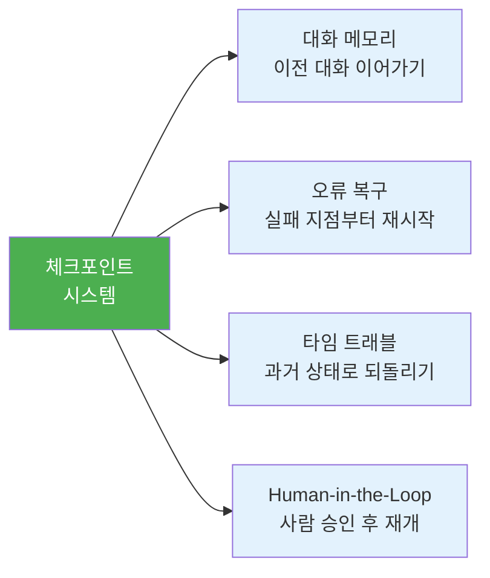
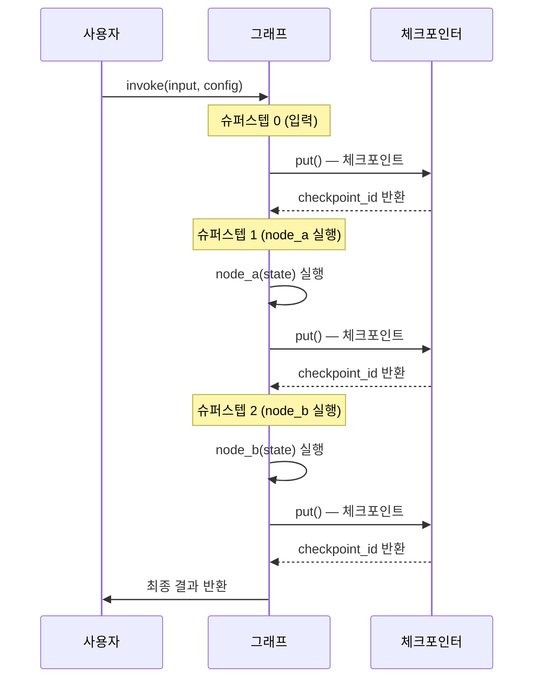
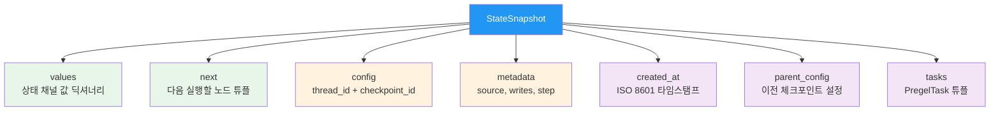
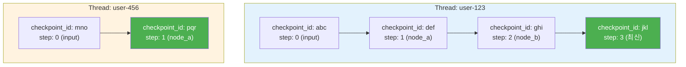
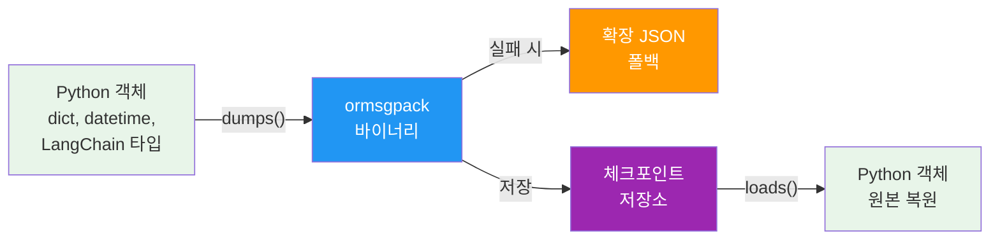

# 체크포인트 시스템 이해

> LangGraph의 체크포인트 아키텍처를 이해하고, 스냅샷 구조와 thread_id/checkpoint_id 기반 상태 관리의 원리를 학습합니다.

## 개요

이 섹션에서는 LangGraph 그래프 실행의 핵심 인프라인 **체크포인트 시스템**을 깊이 있게 다룹니다. 체크포인트가 왜 필요한지, 어떤 구조로 저장되는지, 그리고 thread_id와 checkpoint_id가 어떻게 상태를 식별하는지 살펴봅니다.

**선수 지식**: [StateGraph 기초](04-ch4-langgraph-stategraph-기초/01-01-langgraph-아키텍처-개관.md)에서 배운 노드/엣지 개념, [리듀서와 상태 업데이트 패턴](04-ch4-langgraph-stategraph-기초/04-04-리듀서와-상태-업데이트-패턴.md)에서 다룬 상태 스키마 정의

**학습 목표**:
- 체크포인트가 그래프 실행의 각 슈퍼스텝(superstep)에서 어떻게 생성되는지 설명할 수 있다
- StateSnapshot 객체의 핵심 필드(values, next, config, metadata)를 이해한다
- thread_id와 checkpoint_id의 역할과 차이를 구분할 수 있다
- JsonPlusSerializer의 직렬화 방식을 이해한다

## 왜 알아야 할까?

여러분이 ChatGPT나 Claude를 쓸 때, 브라우저를 닫았다가 다시 열어도 이전 대화가 그대로 남아있죠? 이게 바로 **영속성(Persistence)**입니다. LangGraph 에이전트도 마찬가지입니다. 체크포인트 없이는 에이전트가 "기억상실"에 걸립니다 — 매번 처음부터 시작해야 하거든요.

체크포인트 시스템이 제공하는 네 가지 핵심 능력을 살펴볼까요?

> 📊 **그림 1**: 체크포인트가 가능하게 하는 네 가지 핵심 능력



실무에서 이 네 가지는 모두 프로덕션 에이전트의 필수 요건입니다. 고객 상담 봇이 매 질문마다 "처음 뵙겠습니다"라고 하면 곤란하고, 외부 API 호출이 실패했을 때 처음부터 다시 실행하면 비용이 낭비됩니다. 체크포인트는 이 모든 문제의 해법이에요.

## 핵심 개념

### 개념 1: 슈퍼스텝과 체크포인트 생성 시점

> 💡 **비유**: 체크포인트는 게임의 **자동 저장(Auto-Save)** 시스템과 같습니다. RPG 게임에서 던전의 각 층을 클리어할 때마다 자동 저장이 되잖아요? 보스한테 지면 마지막 저장 지점에서 다시 시작하듯, LangGraph도 각 슈퍼스텝마다 상태를 저장해서 실패 시 그 지점부터 재개할 수 있습니다. 이 비유는 이후 섹션에서도 '로컬 세이브 vs 클라우드 세이브' 같은 형태로 확장되니 잘 기억해두세요.

LangGraph에서 **슈퍼스텝(superstep)**이란 그래프가 한 번 틱(tick)하는 단위입니다. 한 슈퍼스텝에서 스케줄된 모든 노드가 (잠재적으로 병렬로) 실행됩니다. 체크포인트는 **각 슈퍼스텝의 경계**에서 자동으로 생성됩니다.

> 📊 **그림 2**: 슈퍼스텝과 체크포인트 생성 타이밍 — 체크포인터의 `put()` 호출 흐름 포함



눈여겨볼 점은 체크포인터의 `put()` 메서드입니다. 그래프 런타임(Pregel)이 각 슈퍼스텝을 마칠 때마다 내부적으로 `checkpointer.put(config, checkpoint, metadata, new_versions)` 를 호출합니다. 이 `put()` 호출이 실제로 상태를 직렬화하고 저장소에 기록하는 핵심 동작이에요. 반환된 `checkpoint_id`를 통해 나중에 정확히 그 시점으로 돌아갈 수 있게 됩니다.

핵심은 이겁니다 — 체크포인터를 컴파일 시점에 지정하기만 하면, 나머지는 LangGraph가 알아서 처리합니다:

```python
from langgraph.graph import StateGraph, START, END
from langgraph.checkpoint.memory import InMemorySaver

# 체크포인터 생성
checkpointer = InMemorySaver()

# 그래프 컴파일 시 체크포인터 주입
graph = workflow.compile(checkpointer=checkpointer)
```

체크포인터 없이 `compile()`하면? 상태가 아무 데도 저장되지 않습니다. `get_state()`나 `get_state_history()`를 호출하면 에러가 발생하죠.

### 개념 2: StateSnapshot — 체크포인트의 실체

> 💡 **비유**: StateSnapshot은 **사진 한 장**과 같습니다. 그 순간의 모든 정보 — 누가 어디에 있었는지(values), 다음에 뭘 해야 하는지(next), 이 사진이 언제 어떻게 찍혔는지(metadata) — 를 담고 있어요.

`graph.get_state(config)`를 호출하면 `StateSnapshot` 객체가 반환됩니다. 이 객체가 체크포인트의 실체인데요, 핵심 필드를 하나씩 살펴보겠습니다:

> 📊 **그림 3**: StateSnapshot 객체의 핵심 필드 구조



각 필드의 역할을 코드로 확인해볼까요?

```run:python
# StateSnapshot 구조 시뮬레이션
snapshot_example = {
    "values": {"foo": "b", "bar": ["a", "b"]},
    "next": (),  # 빈 튜플 = 실행 완료
    "config": {
        "configurable": {
            "thread_id": "1",
            "checkpoint_ns": "",
            "checkpoint_id": "1ef663ba-28fe-6528-8002-5a559208592c"
        }
    },
    "metadata": {
        "source": "loop",       # "input" | "loop" | "update"
        "writes": {"node_b": {"foo": "b", "bar": ["b"]}},
        "step": 2
    },
    "created_at": "2025-08-29T19:19:38.821749+00:00",
    "parent_config": {
        "configurable": {
            "thread_id": "1",
            "checkpoint_id": "1ef663ba-28fd-6526-8001-..."
        }
    }
}

# 핵심 필드 분석
print(f"현재 상태: {snapshot_example['values']}")
print(f"다음 노드: {snapshot_example['next'] or '실행 완료'}")
print(f"메타데이터 소스: {snapshot_example['metadata']['source']}")
print(f"실행 스텝: {snapshot_example['metadata']['step']}")
```

```output
현재 상태: {'foo': 'b', 'bar': ['a', 'b']}
다음 노드: 실행 완료
메타데이터 소스: loop
실행 스텝: 2
```

**metadata.source** 필드는 특히 중요합니다. 이 체크포인트가 어떻게 만들어졌는지 알려주거든요:

| source 값 | 의미 |
|-----------|------|
| `"input"` | 사용자 입력으로 생성된 최초 체크포인트 |
| `"loop"` | 그래프 실행 루프 중 노드 실행 후 생성 |
| `"update"` | `update_state()`로 수동 생성 (Human-in-the-Loop) |

### 개념 3: thread_id와 checkpoint_id — 이중 식별 체계

> 💡 **비유**: thread_id는 **노트북**이고, checkpoint_id는 그 노트북의 **페이지 번호**입니다. "1번 노트북의 23페이지"라고 하면 정확히 하나의 상태를 가리킬 수 있죠. 노트북만 지정하면 마지막 페이지(최신 상태)를 열게 됩니다.

LangGraph의 체크포인트는 **이중 식별 체계**로 관리됩니다:

```python
# thread_id만 지정 → 최신 체크포인트
config_latest = {
    "configurable": {"thread_id": "user-123"}
}

# thread_id + checkpoint_id → 특정 시점의 체크포인트
config_specific = {
    "configurable": {
        "thread_id": "user-123",
        "checkpoint_id": "1ef663ba-28fe-6528-8002-5a559208592c"
    }
}
```

> 📊 **그림 4**: thread_id와 checkpoint_id의 관계



여기서 중요한 포인트가 있어요. LangGraph v0.2에서 기존의 `thread_ts`와 `parent_ts`가 각각 `checkpoint_id`와 `parent_checkpoint_id`로 **이름이 바뀌었습니다**. 오래된 튜토리얼에서 `thread_ts`를 보면 같은 개념이라고 이해하면 됩니다.

**checkpoint_ns(네임스페이스)**도 알아둬야 합니다:

```python
# 루트 그래프 체크포인트
checkpoint_ns = ""

# 서브그래프 체크포인트 (Ch5에서 배운 서브그래프!)
checkpoint_ns = "search_subgraph:a1b2c3d4"

# 중첩 서브그래프
checkpoint_ns = "outer_node:uuid1|inner_node:uuid2"
```

이 네임스페이스 덕분에 [서브그래프](05-ch5-조건-분기와-동적-라우팅/03-03-서브그래프와-그래프-합성.md)의 상태도 독립적으로 추적할 수 있습니다.

### 개념 4: 직렬화 — 상태를 어떻게 저장하는가

> 💡 **비유**: 직렬화는 **이사할 때 짐을 박스에 포장하는 것**과 같습니다. 복잡한 Python 객체(가구)를 바이트 스트림(박스)으로 변환해서 저장소(새 집)에 넣고, 필요할 때 다시 꺼내서 원래 형태로 복원하는 거죠.

LangGraph의 기본 직렬화기는 **JsonPlusSerializer**입니다. 이름에서 알 수 있듯이 일반 JSON보다 훨씬 많은 타입을 처리할 수 있어요:

> 📊 **그림 5**: JsonPlusSerializer의 직렬화/역직렬화 흐름



```python
from langgraph.checkpoint.serde.jsonplus import JsonPlusSerializer

# 기본 사용 — 대부분의 경우 이것으로 충분
serde = JsonPlusSerializer()

# Pandas DataFrame 같은 특수 객체가 있다면 pickle 폴백 활성화
serde_with_pickle = JsonPlusSerializer(pickle_fallback=True)
```

> ⚠️ **흔한 오해**: "체크포인트는 JSON으로 저장된다"고 생각하기 쉽지만, 실제로는 **ormsgpack**(MessagePack의 Rust 구현)이 기본입니다. JSON은 ormsgpack이 실패했을 때의 폴백이에요. 그래서 "JsonPlus"라는 이름이 약간 오해의 소지가 있죠.

**보안 참고**: `langgraph-checkpoint` v3.0 이전 버전의 JsonPlusSerializer에는 원격 코드 실행(RCE) 취약점이 있었습니다. 반드시 v3.0 이상을 사용하세요. 이 업데이트는 커스텀 객체의 역직렬화를 차단하여 보안을 강화했습니다.

## 실습: 직접 해보기

체크포인트 시스템의 전체 흐름을 직접 구현하고 확인해보겠습니다.

### 1단계: 환경 설정

```python
# 필요한 패키지 설치
# pip install langgraph langchain-core
```

### 2단계: 체크포인트 기반 그래프 구성

```python
from typing import Annotated, TypedDict
from operator import add
from langgraph.graph import StateGraph, START, END
from langgraph.checkpoint.memory import InMemorySaver

# 상태 스키마 정의 — bar는 리듀서(add)로 누적
class State(TypedDict):
    foo: str
    bar: Annotated[list[str], add]

# 노드 함수 정의
def node_a(state: State) -> dict:
    """첫 번째 노드: foo를 'a'로 설정, bar에 'a' 추가"""
    print(f"  [node_a] 입력 상태: foo={state.get('foo')}")
    return {"foo": "a", "bar": ["a"]}

def node_b(state: State) -> dict:
    """두 번째 노드: foo를 'b'로 변경, bar에 'b' 추가"""
    print(f"  [node_b] 입력 상태: foo={state.get('foo')}, bar={state.get('bar')}")
    return {"foo": "b", "bar": ["b"]}

# 그래프 빌드
workflow = StateGraph(State)
workflow.add_node("node_a", node_a)
workflow.add_node("node_b", node_b)
workflow.add_edge(START, "node_a")
workflow.add_edge("node_a", "node_b")
workflow.add_edge("node_b", END)

# 체크포인터와 함께 컴파일
checkpointer = InMemorySaver()
graph = workflow.compile(checkpointer=checkpointer)
```

### 3단계: 실행 및 체크포인트 탐색

```run:python
# 시뮬레이션 — 실제 실행 결과를 보여줍니다
print("=== 그래프 실행 ===")
print("  [node_a] 입력 상태: foo=")
print("  [node_b] 입력 상태: foo=a, bar=['a']")
print()

# 실행 결과
result = {"foo": "b", "bar": ["a", "b"]}
print(f"실행 결과: {result}")
print()

# get_state() 결과 분석
print("=== 최신 체크포인트 분석 ===")
print(f"  values: {{'foo': 'b', 'bar': ['a', 'b']}}")
print(f"  next: () (실행 완료)")
print(f"  step: 2")
print(f"  source: loop")
print()

# 전체 히스토리 탐색
print("=== 체크포인트 히스토리 (최신순) ===")
for i, (step, source, values, next_node) in enumerate([
    (2, "loop",  {"foo": "b", "bar": ["a", "b"]}, ()),
    (1, "loop",  {"foo": "a", "bar": ["a"]},       ("node_b",)),
    (0, "input", {"foo": "",   "bar": []},          ("node_a",)),
]):
    print(f"  [{i}] step={step}, source={source}")
    print(f"      values={values}")
    print(f"      next={next_node}")
```

```output
=== 그래프 실행 ===
  [node_a] 입력 상태: foo=
  [node_b] 입력 상태: foo=a, bar=['a']

실행 결과: {'foo': 'b', 'bar': ['a', 'b']}

=== 최신 체크포인트 분석 ===
  values: {'foo': 'b', 'bar': ['a', 'b']}
  next: () (실행 완료)
  step: 2
  source: loop

=== 체크포인트 히스토리 (최신순) ===
  [0] step=2, source=loop
      values={'foo': 'b', 'bar': ['a', 'b']}
      next=()
  [1] step=1, source=loop
      values={'foo': 'a', 'bar': ['a']}
      next=('node_b',)
  [0] step=0, source=input
      values={'foo': '', 'bar': []}
      next=('node_a',)
```

### 4단계: 체크포인트 API 전체 코드

```python
# === 실제 실행 코드 (복사-붙여넣기용) ===
config = {"configurable": {"thread_id": "demo-1"}}

# 1. 그래프 실행
result = graph.invoke({"foo": "", "bar": []}, config)
print(f"실행 결과: {result}")

# 2. 최신 상태 조회
snapshot = graph.get_state(config)
print(f"values: {snapshot.values}")
print(f"next: {snapshot.next}")
print(f"step: {snapshot.metadata['step']}")

# 3. 전체 히스토리 조회 (최신순)
for state in graph.get_state_history(config):
    print(f"step={state.metadata['step']}, "
          f"source={state.metadata['source']}, "
          f"next={state.next}")

# 4. 특정 시점 상태 복원
history = list(graph.get_state_history(config))
step_1_config = history[1].config  # step 1의 config 가져오기
old_state = graph.get_state(step_1_config)
print(f"step 1 상태: {old_state.values}")

# 5. 수동 상태 업데이트
graph.update_state(config, {"foo": "manually_updated"})
updated = graph.get_state(config)
print(f"업데이트 후: {updated.values}")
print(f"source: {updated.metadata['source']}")  # "update"
```

> 🔥 **실무 팁**: `get_state_history()`는 **최신순**으로 반환합니다. 가장 오래된 체크포인트를 찾으려면 `list()`로 변환 후 마지막 요소를 참조하세요.

## 더 깊이 알아보기

### 체크포인트의 탄생 — 게임 업계에서 온 아이디어

체크포인트라는 개념은 사실 컴퓨터 과학의 오래된 아이디어입니다. 1960년대 IBM의 메인프레임 시스템에서 **장시간 배치 작업**의 중간 상태를 저장하는 기법으로 시작되었습니다. 당시에는 컴퓨터가 자주 고장났기 때문에, 3시간짜리 작업이 2시간 50분에 실패하면 처음부터 다시 시작해야 했거든요.

이 아이디어가 대중적으로 알려진 건 **비디오 게임** 덕분입니다. 1986년 닌텐도의 "젤다의 전설"이 배터리 백업 세이브 기능을 도입하면서, "진행 상태 저장"이라는 개념이 보편화되었죠. LangGraph의 Harrison Chase(LangChain 창시자)가 체크포인트 시스템을 설계할 때도, 게임의 세이브/로드 시스템에서 직접적인 영감을 받았다고 합니다.

특히 "타임 트래블(Time Travel)"이라는 이름은 Redux DevTools에서 영향받은 것으로 알려져 있습니다. React 생태계의 Redux에서 "상태를 되감기"하는 디버깅 기법을 "Time Travel Debugging"이라 불렀는데, LangGraph가 이를 에이전트 세계로 가져온 거예요.

### v0.2의 중요한 변화

LangGraph v0.2에서 체크포인트 시스템에 큰 변화가 있었습니다. 체크포인터 구현이 별도 패키지로 분리되었거든요:

| 패키지 | 용도 |
|--------|------|
| `langgraph-checkpoint` | 베이스 인터페이스 + InMemorySaver |
| `langgraph-checkpoint-sqlite` | SQLite 체크포인터 |
| `langgraph-checkpoint-postgres` | PostgreSQL 체크포인터 |

이렇게 분리한 이유는 의존성 최소화입니다. SQLite가 필요 없는 프로젝트에서 SQLite 라이브러리를 설치할 필요가 없으니까요.

## 흔한 오해와 팁

> ⚠️ **흔한 오해**: "체크포인트는 매 노드 실행마다 생성된다"고 생각하기 쉽습니다. 하지만 정확히는 **슈퍼스텝** 단위입니다. 같은 슈퍼스텝에서 병렬 실행되는 노드 A, B가 있다면, A와 B가 **모두 완료된 후** 하나의 체크포인트가 생성됩니다.

> 💡 **알고 계셨나요?**: `InMemorySaver`는 과거에 `MemorySaver`라는 이름이었습니다. 코드에서 `from langgraph.checkpoint.memory import MemorySaver`가 보이면 같은 클래스의 구버전 이름입니다. 현재는 `InMemorySaver`가 권장됩니다.

> 🔥 **실무 팁**: `update_state()`로 상태를 수정하면 **새로운 체크포인트가 생성**됩니다. 기존 체크포인트를 덮어쓰지 않아요. 이것이 타임 트래블이 가능한 이유입니다 — 모든 변경 이력이 보존되거든요. `metadata['source']`가 `"update"`인 체크포인트를 필터링하면 수동 개입 이력만 추적할 수 있습니다.

## 핵심 정리

| 개념 | 설명 |
|------|------|
| **슈퍼스텝(superstep)** | 그래프의 한 틱. 스케줄된 모든 노드가 실행되는 단위 |
| **체크포인트** | 슈퍼스텝 경계에서 `put()`으로 저장되는 그래프 상태 스냅샷 |
| **StateSnapshot** | 체크포인트의 Python 표현. values, next, config, metadata 포함 |
| **thread_id** | 대화/실행 세션을 식별하는 고유 ID (노트북) |
| **checkpoint_id** | 스레드 내 특정 시점을 식별하는 UUID (페이지 번호) |
| **checkpoint_ns** | 서브그래프 체크포인트를 구분하는 네임스페이스 |
| **metadata.source** | 체크포인트 생성 방법: `"input"`, `"loop"`, `"update"` |
| **JsonPlusSerializer** | 기본 직렬화기. ormsgpack 우선, JSON 폴백 |
| **InMemorySaver** | 메모리 기반 체크포인터 (개발/테스트용, 휘발성) |

## 다음 섹션 미리보기

이번 섹션에서 체크포인트의 구조와 식별 체계를 이해했다면, 다음 섹션 [메모리 및 SQLite 체크포인터](06-ch6-체크포인트와-영속적-실행/02-02-메모리-및-sqlite-체크포인터.md)에서는 실제 체크포인터 구현체를 심층 비교합니다. InMemorySaver, SqliteSaver, PostgresSaver의 특성과 사용 시나리오를 다루고, 비동기 체크포인터까지 실습합니다.

## 참고 자료

- [LangGraph Persistence 공식 문서](https://docs.langchain.com/oss/python/langgraph/persistence) - 체크포인트 시스템의 공식 가이드. StateSnapshot, get_state(), get_state_history() 등 모든 API를 다룹니다
- [LangGraph v0.2: Increased customization with new checkpointers](https://blog.langchain.com/langgraph-v0-2/) - 체크포인터 패키지 분리와 새로운 기능에 대한 공식 발표
- [langgraph-checkpoint PyPI](https://pypi.org/project/langgraph-checkpoint/) - 체크포인트 베이스 패키지. 버전별 변경사항과 보안 업데이트 확인
- [LangGraph GitHub Repository](https://github.com/langchain-ai/langgraph) - 소스 코드와 예제. 체크포인터 구현 세부사항을 확인할 수 있습니다
- [Mastering Persistence in LangGraph](https://medium.com/@vinodkrane/mastering-persistence-in-langgraph-checkpoints-threads-and-beyond-21e412aaed60) - 실전 예제와 함께 체크포인트 시스템을 심층 분석한 튜토리얼

---
### 🔗 Related Sessions
- [stategraph](04-ch4-langgraph-stategraph-기초/01-01-langgraph-아키텍처-개관.md) (prerequisite)
- [subgraph](05-ch5-조건-분기와-동적-라우팅/03-03-서브그래프와-그래프-합성.md) (prerequisite)
