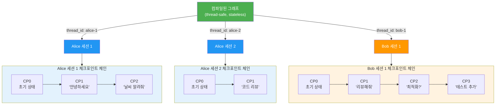
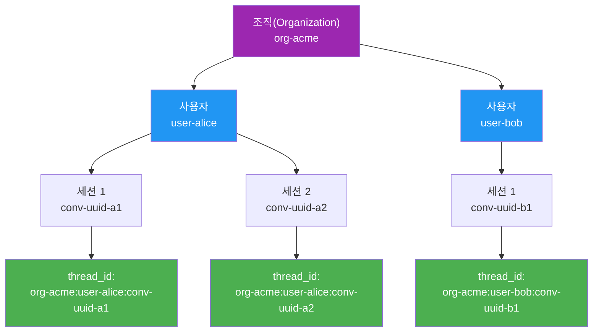
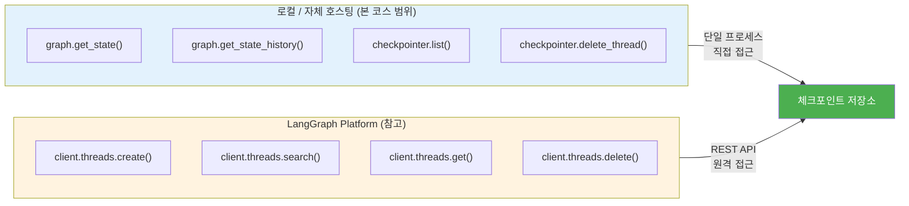
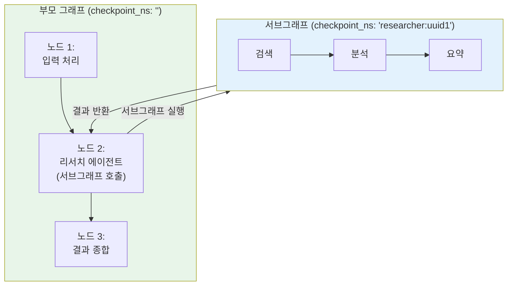
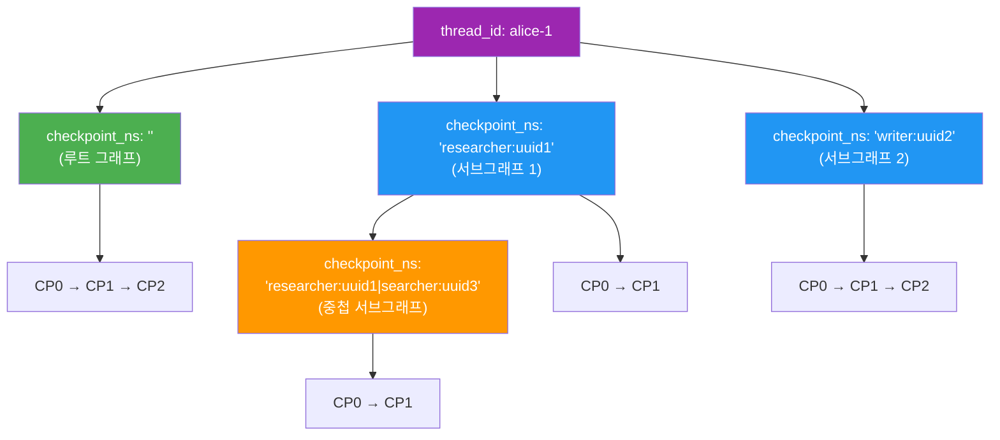
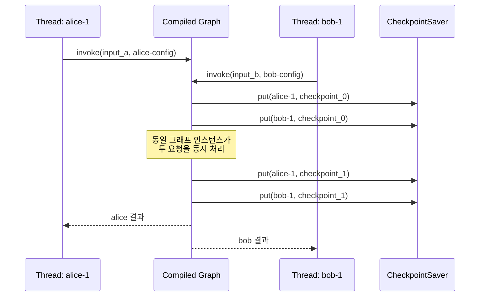

# 멀티 세션과 스레드 관리

> thread_id 기반으로 독립적인 대화 세션을 격리하고, 스레드 목록 조회·삭제·동시 실행을 관리하는 방법을 학습합니다.

## 개요

이 섹션에서는 LangGraph 체크포인트 시스템의 **실전 운용 핵심**인 멀티 세션 관리를 다룹니다. 앞서 [01. 체크포인트 시스템 이해](06-ch6-체크포인트와-영속적-실행/01-01-체크포인트-시스템-이해.md)에서 `thread_id`가 체크포인트의 기본 키라는 것을 배웠고, [02. 메모리 및 SQLite 체크포인터](06-ch6-체크포인트와-영속적-실행/02-02-메모리-및-sqlite-체크포인터.md)에서 영속적 저장소를 설정하는 방법을 익혔습니다. 이제 여러 사용자가 동시에 사용하는 **멀티 테넌트 환경**에서 스레드를 어떻게 관리하는지 살펴봅니다.

**선수 지식**: 체크포인트 시스템의 기본 구조(thread_id, checkpoint_id), InMemorySaver/SqliteSaver 사용법
**학습 목표**:
- thread_id 기반의 대화 격리 원리를 설명하고 구현할 수 있다
- 스레드 목록 조회, 히스토리 탐색, 스레드 삭제를 수행할 수 있다
- checkpoint_ns를 이용한 서브그래프 격리를 이해한다
- 여러 스레드의 동시 실행을 안전하게 처리할 수 있다

## 왜 알아야 할까?

실제 서비스를 운영해 본 적 있다면, 이런 상황이 익숙할 겁니다. 챗봇 서비스에 Alice와 Bob이 동시에 접속해서 각자 다른 질문을 하고 있는데, Alice의 대화 내용이 Bob에게 섞여 나오면 큰일이겠죠? 또는 한 사용자가 여러 대화창을 열어두고, "이 대화에서는 코드 리뷰", "저 대화에서는 문서 작성"처럼 목적별로 세션을 나누고 싶을 수도 있습니다.

**멀티 세션 관리는 에이전트를 "장난감"에서 "서비스"로 바꾸는 핵심 기술**입니다. 단일 사용자 데모에서는 하나의 `thread_id`면 충분하지만, 프로덕션에서는:

- **사용자 격리**: 수백~수천 명의 동시 사용자가 서로의 대화를 침범하지 않아야 함
- **세션 관리**: 비활성 세션 정리, 세션 목록 조회, 특정 세션 삭제
- **동시성**: 같은 그래프 인스턴스에서 여러 스레드가 동시에 실행
- **멀티 테넌트**: 조직·사용자·세션 계층 구조의 스레드 ID 체계 설계

이 모든 것이 `thread_id` 하나에서 출발합니다.

## 핵심 개념

### 개념 1: thread_id — 대화 격리의 기본 단위

> 💡 **비유**: thread_id는 카페의 **주문 번호표**와 같습니다. 같은 카운터(그래프)에서 여러 손님(사용자)이 동시에 주문하지만, 각자의 번호표가 다르기 때문에 내 아메리카노가 다른 사람에게 가지 않죠. LangGraph에서도 thread_id가 다르면 완전히 별개의 대화 공간이 만들어집니다.

LangGraph에서 `thread_id`는 **모든 체크포인트 저장·조회의 기본 키(primary key)**입니다. 컴파일된 그래프에 `invoke()`나 `stream()`을 호출할 때 `config["configurable"]["thread_id"]`로 전달하며, 같은 thread_id로 호출하면 이전 상태를 이어받고, 다른 thread_id로 호출하면 완전히 새로운 세션이 시작됩니다.

> 📊 **그림 1**: thread_id 기반 대화 격리 — 각 세션은 독립된 체크포인트 체인을 가짐



핵심 규칙은 간단합니다:

- **같은 thread_id** → 같은 체크포인트 체인 → 대화가 이어짐
- **다른 thread_id** → 별개의 체크포인트 체인 → 완전히 독립된 세션
- **하나의 컴파일된 그래프**가 수천 개의 스레드를 동시에 처리 가능

```python
from langgraph.graph import StateGraph, START, END
from langgraph.checkpoint.memory import InMemorySaver
from typing import Annotated
from typing_extensions import TypedDict
from operator import add

class State(TypedDict):
    messages: Annotated[list[str], add]

def echo_node(state: State) -> dict:
    last = state["messages"][-1]
    return {"messages": [f"에코: {last}"]}

workflow = StateGraph(State)
workflow.add_node("echo", echo_node)
workflow.add_edge(START, "echo")
workflow.add_edge("echo", END)

checkpointer = InMemorySaver()
graph = workflow.compile(checkpointer=checkpointer)

# Alice의 세션
alice_config = {"configurable": {"thread_id": "alice-session-1"}}
graph.invoke({"messages": ["안녕하세요"]}, alice_config)
graph.invoke({"messages": ["날씨 알려줘"]}, alice_config)

# Bob의 세션 — Alice와 완전히 격리
bob_config = {"configurable": {"thread_id": "bob-session-1"}}
graph.invoke({"messages": ["코드 리뷰해줘"]}, bob_config)

# Alice의 메시지 누적: 4개 (입력2 + 에코2)
alice_state = graph.get_state(alice_config)
print(len(alice_state.values["messages"]))  # 4

# Bob의 메시지 누적: 2개 (입력1 + 에코1)
bob_state = graph.get_state(bob_config)
print(len(bob_state.values["messages"]))    # 2
```

여기서 중요한 점 — **컴파일된 그래프 인스턴스는 상태를 가지지 않습니다(stateless)**. 모든 상태는 체크포인터에 저장되므로, 하나의 `graph` 객체를 여러 스레드가 공유해도 안전합니다.

### 개념 2: 스레드 ID 설계 전략

> 💡 **비유**: 스레드 ID를 설계하는 것은 **아파트 호수 체계**를 정하는 것과 비슷합니다. "101호"처럼 단순히 번호만 매길 수도 있지만, "A동-3층-01호"처럼 구조적으로 이름을 지으면 나중에 관리가 훨씬 편하죠. 어떤 동의 몇 층인지 ID만 봐도 알 수 있으니까요.

프로덕션 환경에서는 thread_id에 의미를 담아 설계하는 것이 좋습니다. LangGraph는 thread_id를 단순 문자열로 취급하므로, 어떤 형식이든 자유롭게 사용할 수 있습니다.

> 📊 **그림 2**: 멀티 테넌트 스레드 ID 계층 구조



```python
from uuid import uuid4

# 전략 1: 단순 UUID (개발/테스트)
thread_id = str(uuid4())  # "a3b1c2d4-..."

# 전략 2: 사용자별 격리
thread_id = f"user-{user_id}:conv-{uuid4()}"

# 전략 3: 멀티 테넌트 계층 구조 (프로덕션 권장)
thread_id = f"org-{org_id}:user-{user_id}:conv-{uuid4()}"

# 전략 4: 목적별 세션 분리
thread_id = f"user-{user_id}:code-review-{uuid4()}"
thread_id = f"user-{user_id}:doc-writing-{uuid4()}"
```

| 전략 | 장점 | 적합한 상황 |
|------|------|------------|
| 단순 UUID | 구현 간단 | 프로토타입, 단일 사용자 |
| `user:{id}:conv:{uuid}` | 사용자별 세션 목록 조회 가능 | SaaS 서비스 |
| `org:{id}:user:{id}:conv:{uuid}` | 조직 단위 관리, 권한 분리 | 엔터프라이즈 |
| `user:{id}:{purpose}:{uuid}` | 목적별 세션 분류 | 멀티 기능 에이전트 |

> ⚠️ **흔한 오해**: "thread_id에 사용자 정보를 넣으면 보안에 취약하다" — thread_id는 내부 식별자일 뿐이고, 외부에 노출되지 않습니다. 다만 민감한 개인정보(이메일, 전화번호 등)를 직접 넣는 것은 피하고, 사용자 ID 같은 간접 식별자를 사용하세요.

### 개념 3: 스레드 조회와 삭제

> 💡 **비유**: 스마트폰의 **메시지 앱**을 떠올려보세요. 대화 목록에서 각 대화방을 볼 수 있고, 오래된 대화방은 밀어서 삭제할 수 있죠. LangGraph의 스레드 관리도 비슷합니다 — 활성 스레드 목록을 조회하고, 필요 없는 스레드를 정리할 수 있습니다.

LangGraph에서 스레드를 관리하는 방법은 크게 두 가지 레벨로 나뉩니다: **체크포인터 API**(로컬/자체 호스팅)와 **LangGraph Platform SDK**(관리형 서버)입니다. **본 코스에서는 로컬 체크포인터 API에 집중**합니다. LangGraph Platform은 클라우드 배포 환경에서 사용하는 별도의 관리 서비스로, 여기서는 참고 수준으로만 소개합니다.

> 📊 **그림 3**: 스레드 관리 API 계층 — 본 코스의 학습 범위



#### 체크포인터 API로 스레드 관리 (로컬)

```python
from langgraph.checkpoint.memory import InMemorySaver

checkpointer = InMemorySaver()
graph = workflow.compile(checkpointer=checkpointer)

# -- 스레드의 최신 상태 조회 --
config = {"configurable": {"thread_id": "alice-1"}}
state = graph.get_state(config)
print(state.values)   # 현재 상태
print(state.next)     # 다음 실행할 노드 (비어있으면 완료)

# -- 스레드의 전체 히스토리 조회 --
history = list(graph.get_state_history(config))
for snapshot in history:
    print(f"step={snapshot.metadata['step']}, "
          f"next={snapshot.next}, "
          f"id={snapshot.config['configurable']['checkpoint_id'][:12]}...")

# -- 특정 조건으로 히스토리 필터링 --
# source="loop"인 체크포인트만 (노드 실행에 의한 것)
filtered = list(graph.get_state_history(
    config,
    filter={"source": "loop"},
    limit=5
))
```

스레드 삭제는 **체크포인터 인스턴스**를 통해 수행합니다:

```python
# 스레드의 모든 체크포인트 삭제
checkpointer.delete_thread("alice-1")

# 비동기 버전 (AsyncSqliteSaver, AsyncPostgresSaver)
await checkpointer.adelete_thread("alice-1")
```

`delete_thread()`는 해당 thread_id에 속한 **모든 체크포인트, blob, pending writes**를 일괄 삭제합니다. 서브그래프의 네임스페이스까지 포함해서요.

#### LangGraph Platform SDK로 스레드 관리 (참고)

> 💡 **참고**: LangGraph Platform은 LangGraph 그래프를 **클라우드에 배포하고 REST API로 관리**하는 별도 서비스입니다. 본 코스에서는 로컬 체크포인터 API를 중심으로 학습하므로, Platform SDK는 "이런 것도 가능하다" 수준으로만 살펴봅니다. 프로덕션 규모의 클라우드 배포가 필요할 때 참고하세요.

LangGraph Platform(관리형 또는 자체 호스팅 서버)을 사용한다면, REST API 기반의 더 풍부한 관리 기능을 쓸 수 있습니다:

```python
from langgraph_sdk import get_client

# Platform SDK — 클라우드 배포 환경에서 사용
client = get_client(url="https://your-deployment.langgraph.app")

# 스레드 생성 (메타데이터 포함)
thread = await client.threads.create(
    metadata={"user_id": "alice", "purpose": "code-review"}
)

# 조건으로 스레드 검색
user_threads = await client.threads.search(
    metadata={"user_id": "alice"},
    status="idle",        # idle, busy, interrupted, error
    sort_by="updated_at",
    sort_order="desc",
    limit=50
)

# 스레드 삭제
await client.threads.delete(thread["thread_id"])
```

로컬 체크포인터 API와 Platform SDK의 핵심 차이는 **접근 방식**입니다. 로컬에서는 `graph` 객체와 `checkpointer`에 직접 접근하지만, Platform에서는 HTTP 클라이언트를 통해 원격으로 관리합니다. 기능적으로는 Platform이 메타데이터 검색, 상태 필터링, TTL 등 더 풍부한 관리 기능을 제공하지만, 로컬 API만으로도 대부분의 멀티 세션 관리가 충분합니다.

### 개념 4: checkpoint_ns — 서브그래프 격리

> 💡 **비유**: `checkpoint_ns`는 아파트의 **세대 내 방 번호**와 같습니다. "A동 301호"(thread_id)가 세대를 구분한다면, "301호 안방", "301호 서재"(checkpoint_ns)가 세대 내부 공간을 구분하는 거죠. 서브그래프가 중첩되면 "301호 서재 책장"처럼 더 깊은 경로가 만들어집니다.

`checkpoint_ns`(checkpoint namespace)를 이해하려면 먼저 **서브그래프(subgraph)**가 무엇인지 간단히 짚고 넘어가야 합니다. 서브그래프란, 하나의 LangGraph 그래프 안에서 **노드 하나가 또 다른 그래프를 실행**하는 구조입니다. 예를 들어, "리서치 에이전트"가 내부적으로 "검색 그래프"와 "요약 그래프"를 서브그래프로 호출하는 식이죠. 마치 함수 안에서 다른 함수를 호출하는 것과 비슷합니다. 서브그래프의 정의와 활용은 이후 챕터에서 본격적으로 다루니, 여기서는 **체크포인트 격리**라는 관점에서만 살펴보겠습니다.

> 📊 **그림 4**: 서브그래프 개념과 checkpoint_ns의 역할



`checkpoint_ns`는 이처럼 **하나의 thread_id 안에서 서브그래프의 체크포인트를 격리**하는 보조 키입니다. 서브그래프를 사용하면 LangGraph가 자동으로 관리하므로, 직접 설정할 일은 거의 없습니다.

```python
# checkpoint_ns 값의 의미
""                          # 루트(부모) 그래프
"sub_agent:abc123"          # 직접 서브그래프
"outer:abc123|inner:def456" # 중첩 서브그래프 (파이프로 구분)
```

노드 함수 안에서 현재 네임스페이스를 확인할 수 있습니다:

```python
from langchain_core.runnables import RunnableConfig

def my_node(state: State, config: RunnableConfig) -> dict:
    ns = config["configurable"].get("checkpoint_ns", "")
    if ns == "":
        print("루트 그래프에서 실행 중")
    else:
        print(f"서브그래프 '{ns}'에서 실행 중")
    return {"result": "processed"}
```

> 📊 **그림 5**: thread_id와 checkpoint_ns의 관계 — 하나의 스레드 안에서의 네임스페이스 격리



이 구조 덕분에 하나의 스레드 안에서도 부모 그래프와 서브그래프의 체크포인트가 절대 충돌하지 않습니다. `delete_thread()`를 호출하면 모든 네임스페이스의 체크포인트가 함께 삭제됩니다.

> 💡 **알고 계셨나요?**: 서브그래프는 에이전트의 복잡한 워크플로를 모듈화하는 강력한 도구인데요, 이 코스의 이후 챕터에서 조건 분기와 함께 본격적으로 다룹니다. 지금은 "서브그래프마다 독립된 체크포인트 공간이 존재한다"는 핵심만 기억해두세요.

### 개념 5: 동시 실행과 스레드 안전성

> 💡 **비유**: 컴파일된 그래프는 **공유 주방의 레시피 책**과 같습니다. 여러 요리사(스레드)가 같은 레시피 책을 보고 동시에 요리하지만, 각자의 냄비와 재료(체크포인트)를 사용하니까 서로 방해되지 않죠. 레시피 책 자체에는 아무것도 기록하지 않으니까요.

LangGraph의 컴파일된 그래프(`CompiledStateGraph`)는 **완전히 스레드 안전(thread-safe)**합니다. 그래프 인스턴스에 가변 상태(mutable state)가 없기 때문에, 여러 스레드가 동시에 같은 객체의 `invoke()`나 `astream()`을 호출해도 안전합니다.

> 📊 **그림 6**: 동시 실행 시 상태 격리 시퀀스



```python
import asyncio
from langgraph.checkpoint.memory import InMemorySaver

# 하나의 그래프 인스턴스로 동시에 여러 세션 처리
checkpointer = InMemorySaver()
graph = workflow.compile(checkpointer=checkpointer)

async def handle_user(user_id: str, message: str):
    """각 사용자 요청을 독립 스레드로 처리"""
    config = {"configurable": {"thread_id": f"user-{user_id}"}}
    result = await graph.ainvoke({"messages": [message]}, config)
    return result

async def main():
    # 세 사용자가 동시에 요청 — 모두 같은 graph 인스턴스 공유
    results = await asyncio.gather(
        handle_user("alice", "Python 강의 추천해줘"),
        handle_user("bob", "React 컴포넌트 리뷰해줘"),
        handle_user("carol", "SQL 쿼리 최적화해줘"),
    )
    # 각 결과는 완전히 독립적
    for r in results:
        print(r["messages"][-1])

asyncio.run(main())
```

**프로덕션에서의 체크포인터 선택**도 동시성과 밀접합니다:

| 체크포인터 | 동시 쓰기 | 적합 환경 |
|-----------|----------|----------|
| `InMemorySaver` | 안전 (GIL 보호) | 개발, 단일 프로세스 |
| `SqliteSaver` | 주의 필요 (파일 락) | 단일 서버, 낮은 동시성 |
| `AsyncPostgresSaver` | 안전 (행 수준 잠금) | 프로덕션, 높은 동시성 |

> 🔥 **실무 팁**: SQLite는 쓰기 시 데이터베이스 전체에 락을 거는 특성이 있어서, 동시에 여러 스레드가 체크포인트를 쓰면 병목이 발생할 수 있습니다. 프로덕션에서 동시 사용자가 10명 이상이라면 `AsyncPostgresSaver`를 사용하세요.

## 실습: 직접 해보기

멀티 세션 관리의 전체 흐름을 실습합니다. 여러 사용자의 독립적인 대화 세션을 생성하고, 조회하고, 정리하는 과정을 체험합니다.

```python
"""멀티 세션과 스레드 관리 실습"""
from typing import Annotated
from typing_extensions import TypedDict
from operator import add
from uuid import uuid4

from langgraph.graph import StateGraph, START, END
from langgraph.checkpoint.memory import InMemorySaver


# 1. 상태와 그래프 정의
class ChatState(TypedDict):
    messages: Annotated[list[str], add]
    user_name: str


def assistant_node(state: ChatState) -> dict:
    """사용자 메시지에 응답하는 어시스턴트"""
    last_msg = state["messages"][-1]
    user = state.get("user_name", "사용자")
    return {
        "messages": [f"[{user}님에게] '{last_msg}'에 대한 답변입니다."]
    }


workflow = StateGraph(ChatState)
workflow.add_node("assistant", assistant_node)
workflow.add_edge(START, "assistant")
workflow.add_edge("assistant", END)

checkpointer = InMemorySaver()
graph = workflow.compile(checkpointer=checkpointer)


# 2. 여러 사용자의 독립 세션 생성
users = {
    "alice": {"thread_id": f"user-alice:conv-{uuid4()}", "name": "Alice"},
    "bob": {"thread_id": f"user-bob:conv-{uuid4()}", "name": "Bob"},
}

# Alice: 3턴 대화
alice_config = {"configurable": {"thread_id": users["alice"]["thread_id"]}}
for msg in ["안녕하세요", "LangGraph 배우고 있어요", "체크포인트가 뭔가요?"]:
    graph.invoke({"messages": [msg], "user_name": "Alice"}, alice_config)

# Bob: 2턴 대화
bob_config = {"configurable": {"thread_id": users["bob"]["thread_id"]}}
for msg in ["코드 리뷰해줘", "이 함수 최적화할 수 있을까?"]:
    graph.invoke({"messages": [msg], "user_name": "Bob"}, bob_config)
```

이제 각 세션의 상태를 조회합니다:

```run:python
# 3. 세션 상태 조회 시뮬레이션
print("=== 멀티 세션 상태 조회 ===\n")

# Alice의 세션
print("[Alice 세션]")
print(f"  메시지 수: 6 (입력 3 + 응답 3)")
print(f"  마지막 메시지: [Alice님에게] '체크포인트가 뭔가요?'에 대한 답변입니다.")
print(f"  next: () (실행 완료)")

# Bob의 세션
print("\n[Bob 세션]")
print(f"  메시지 수: 4 (입력 2 + 응답 2)")
print(f"  마지막 메시지: [Bob님에게] '이 함수 최적화할 수 있을까?'에 대한 답변입니다.")
print(f"  next: () (실행 완료)")

# 격리 확인
print("\n[격리 확인]")
print(f"  Alice 메시지에 'Bob' 포함: False")
print(f"  Bob 메시지에 'Alice' 포함: False")
print(f"  → 완전히 격리된 독립 세션!")
```

```output
=== 멀티 세션 상태 조회 ===

[Alice 세션]
  메시지 수: 6 (입력 3 + 응답 3)
  마지막 메시지: [Alice님에게] '체크포인트가 뭔가요?'에 대한 답변입니다.
  next: () (실행 완료)

[Bob 세션]
  메시지 수: 4 (입력 2 + 응답 2)
  마지막 메시지: [Bob님에게] '이 함수 최적화할 수 있을까?'에 대한 답변입니다.
  next: () (실행 완료)

[격리 확인]
  Alice 메시지에 'Bob' 포함: False
  Bob 메시지에 'Alice' 포함: False
  → 완전히 격리된 독립 세션!
```

스레드 히스토리를 탐색하고 특정 상태를 찾는 실전 패턴입니다:

```python
# 4. 스레드 히스토리 탐색
alice_history = list(graph.get_state_history(alice_config))

print(f"\nAlice 체크포인트 수: {len(alice_history)}")
for i, snapshot in enumerate(alice_history[:4]):  # 최근 4개만
    step = snapshot.metadata["step"]
    source = snapshot.metadata["source"]
    msg_count = len(snapshot.values.get("messages", []))
    print(f"  [{i}] step={step}, source={source}, messages={msg_count}")

# 5. 특정 조건의 체크포인트 찾기
# Alice의 두 번째 메시지 직후 상태
target = next(
    s for s in alice_history
    if s.metadata["step"] == 1 and s.metadata["source"] == "loop"
)
print(f"\n두 번째 노드 실행 후 메시지 수: {len(target.values['messages'])}")
```

마지막으로 세션 정리(삭제) 패턴입니다:

```python
# 6. 스레드 삭제
thread_id_to_delete = users["bob"]["thread_id"]

# 삭제 전 확인
before = graph.get_state(bob_config)
print(f"삭제 전 Bob 상태: {before.values is not None}")  # True

# 스레드 삭제
checkpointer.delete_thread(thread_id_to_delete)

# 삭제 후 확인 — 상태가 없음
after = graph.get_state(bob_config)
print(f"삭제 후 Bob 상태: {after.values}")  # {}
```

동시 실행 패턴도 살펴봅시다:

```run:python
# 7. 동시 실행 시뮬레이션
import time

print("=== 동시 실행 시뮬레이션 ===\n")

users_sim = ["alice", "bob", "carol", "dave"]
start = time.time()

# asyncio.gather로 동시 실행 시
print("[동시 실행 - asyncio.gather]")
print(f"  사용자 수: {len(users_sim)}")
print(f"  각 사용자: 독립된 thread_id")
print(f"  그래프 인스턴스: 1개 (공유)")
print(f"  체크포인터: InMemorySaver (공유)")
print()

# 핵심: 그래프는 stateless, 상태는 모두 체크포인터에
print("[스레드 안전성]")
print(f"  CompiledStateGraph: stateless (가변 상태 없음)")
print(f"  InMemorySaver: dict 기반 (GIL 보호)")
print(f"  → 동일 인스턴스 공유 안전!")
```

```output
=== 동시 실행 시뮬레이션 ===

[동시 실행 - asyncio.gather]
  사용자 수: 4
  각 사용자: 독립된 thread_id
  그래프 인스턴스: 1개 (공유)
  체크포인터: InMemorySaver (공유)

[스레드 안전성]
  CompiledStateGraph: stateless (가변 상태 없음)
  InMemorySaver: dict 기반 (GIL 보호)
  → 동일 인스턴스 공유 안전!
```

## 더 깊이 알아보기

### 스레드 모델의 기원 — Erlang에서 LangGraph까지

"독립적인 실행 단위가 메시지를 주고받으며 상태를 공유하지 않는다"는 개념은 1986년 Ericsson에서 탄생한 **Erlang 프로그래밍 언어**의 **액터 모델(Actor Model)**에서 뿌리를 찾을 수 있습니다. 전화 교환기를 제어하기 위해 만들어진 Erlang에서는 수백만 개의 경량 프로세스가 각자의 메일박스(상태)를 가지고 독립적으로 실행되었습니다. 한 프로세스가 죽어도 다른 프로세스에 영향을 주지 않는 이 "격리" 철학이, 오늘날 LangGraph의 스레드 모델에도 그대로 녹아 있습니다.

실제로 LangGraph의 내부 실행 엔진은 Google의 **Pregel 모델**(2010)에서 영감을 받았습니다. Pregel은 대규모 그래프 연산을 "슈퍼스텝" 단위로 나누어 처리하는 프레임워크인데요, LangGraph도 슈퍼스텝 경계에서 체크포인트를 찍고, 각 thread_id가 독립적인 실행 컨텍스트를 유지한다는 점에서 Pregel의 정신을 계승합니다. Harrison Chase는 2024년 LangChain 블로그에서 "에이전트의 복잡한 실행 흐름을 제어하려면 단순한 체인이 아닌, 그래프 기반의 상태 기계가 필요했다"고 밝혔는데, 이 결정의 배경에는 Pregel과 액터 모델의 검증된 아키텍처가 있었던 셈입니다.

### LangGraph Platform의 스레드 관리 진화

2025년 초까지 LangGraph의 자체 호스팅 버전에서는 스레드 목록을 조회하는 공식 API가 없었습니다. `InMemorySaver`의 내부 딕셔너리를 직접 탐색하거나, SQLite의 `checkpoints` 테이블을 SQL로 쿼리해야 했죠. LangGraph Platform이 출시되면서 `threads.search()`와 같은 고수준 관리 API가 등장했고, 메타데이터 기반 필터링, 상태별 조회(`idle`, `busy`, `interrupted`, `error`), 정렬과 페이지네이션이 가능해졌습니다.

## 흔한 오해와 팁

> ⚠️ **흔한 오해**: "thread_id를 바꾸면 이전 대화를 '새로 시작'할 수 있다" — 맞습니다! 하지만 이전 thread_id의 체크포인트가 자동 삭제되지는 않습니다. 명시적으로 `checkpointer.delete_thread(old_id)`를 호출하지 않으면, 사용하지 않는 체크포인트가 저장소에 계속 쌓입니다. 프로덕션에서는 비활성 스레드를 주기적으로 정리하는 로직이 필요합니다.

> 💡 **알고 계셨나요?**: LangGraph Platform에서는 스레드에 **TTL(Time-To-Live)**을 설정할 수 있습니다. `threads.create(ttl={"strategy": "delete", "ttl": 86400})`처럼 생성 시 TTL을 지정하면, 24시간 후 자동으로 삭제됩니다. 자체 호스팅에서는 이 기능이 없으므로, cron job이나 백그라운드 태스크로 직접 구현해야 합니다.

> 🔥 **실무 팁**: `get_state_history()`를 비동기 체크포인터(`AsyncSqliteSaver`, `AsyncPostgresSaver`)와 함께 **동기적으로** 호출하면 프로그램이 멈출 수 있습니다(hang). 비동기 체크포인터를 쓸 때는 반드시 `aget_state_history()`를 사용하세요:
> ```python
> # 잘못된 사용 (hang 발생 가능)
> history = list(graph.get_state_history(config))  # sync + async checkpointer = 위험!
>
> # 올바른 사용
> history = [s async for s in graph.aget_state_history(config)]
> ```

## 핵심 정리

| 개념 | 설명 |
|------|------|
| **thread_id** | 대화/세션의 기본 격리 단위. 모든 체크포인트 조회의 primary key |
| **대화 격리** | 다른 thread_id = 완전히 독립된 체크포인트 체인, 상태 공유 없음 |
| **구조적 thread_id** | `org:user:conv` 형식으로 멀티 테넌트 계층 표현 (프로덕션 권장) |
| **checkpoint_ns** | 서브그래프 격리용 보조 키. LangGraph가 자동 관리, `""` = 루트 |
| **서브그래프** | 노드 안에서 또 다른 그래프를 실행하는 구조 (이후 챕터에서 상세 다룸) |
| **스레드 조회** | `get_state()`, `get_state_history()` (로컬) / `threads.search()` (Platform) |
| **스레드 삭제** | `checkpointer.delete_thread(id)` — 모든 네임스페이스 포함 일괄 삭제 |
| **동시 실행** | CompiledStateGraph는 stateless → 여러 스레드가 안전하게 공유 |
| **스레드 안전성** | 상태는 체크포인터에만 존재, 그래프 인스턴스에 가변 상태 없음 |
| **비활성 정리** | Platform은 TTL 지원, 자체 호스팅은 수동 `delete_thread()` 필요 |

## 다음 섹션 미리보기

멀티 세션 관리로 여러 사용자의 독립적인 대화를 운용하는 방법을 익혔습니다. 다음 섹션 [04. 타임 트래블과 상태 복원](06-ch6-체크포인트와-영속적-실행/04-04-타임-트래블과-상태-복원.md)에서는 체크포인트의 가장 강력한 활용법 — **과거 시점으로 되돌아가 다른 경로를 탐색**하는 타임 트래블 디버깅과, `update_state()`를 통한 상태 수동 복원을 실습합니다. 에이전트가 잘못된 판단을 했을 때, 그 시점으로 되돌아가 수정할 수 있는 기술이죠.

## 참고 자료

- [LangGraph Persistence 공식 문서](https://docs.langchain.com/oss/python/langgraph/persistence) - thread_id, StateSnapshot, 히스토리 조회를 포함한 영속성 공식 가이드
- [LangGraph Platform: Use Threads](https://docs.langchain.com/langgraph-platform/use-threads) - Platform SDK의 스레드 생성·검색·삭제 API와 메타데이터 필터링
- [LangGraph: Build Stateful AI Agents in Python (Real Python)](https://realpython.com/langgraph-python/) - thread_id 기반 대화 관리와 상태 영속화를 다루는 실전 튜토리얼
- [LangGraph Thread Deletion Runbook](https://support.langchain.com/articles/1013695957-langgraph-thread-deletion-runbook) - 스레드 삭제와 정리에 대한 공식 운영 가이드
- [Threads and State Management — DeepWiki](https://deepwiki.com/langchain-ai/langgraph/7.2-threads-and-state-management) - thread_id, checkpoint_ns, 동시성 모델의 내부 구조를 상세히 분석한 문서

---
### 🔗 Related Sessions
- [checkpoint](06-ch6-체크포인트와-영속적-실행/01-01-체크포인트-시스템-이해.md) (prerequisite)
- [thread_id](06-ch6-체크포인트와-영속적-실행/01-01-체크포인트-시스템-이해.md) (prerequisite)
- [inmemorysaver](06-ch6-체크포인트와-영속적-실행/02-02-메모리-및-sqlite-체크포인터.md) (prerequisite)
- [statesnapshot](06-ch6-체크포인트와-영속적-실행/01-01-체크포인트-시스템-이해.md) (prerequisite)
- [checkpoint_id](06-ch6-체크포인트와-영속적-실행/01-01-체크포인트-시스템-이해.md) (prerequisite)
- [sqlitesaver](06-ch6-체크포인트와-영속적-실행/02-02-메모리-및-sqlite-체크포인터.md) (prerequisite)
- [get_state_history](06-ch6-체크포인트와-영속적-실행/04-04-타임-트래블과-상태-복원.md) (prerequisite)
- [basecheckpointsaver](06-ch6-체크포인트와-영속적-실행/02-02-메모리-및-sqlite-체크포인터.md) (prerequisite)
