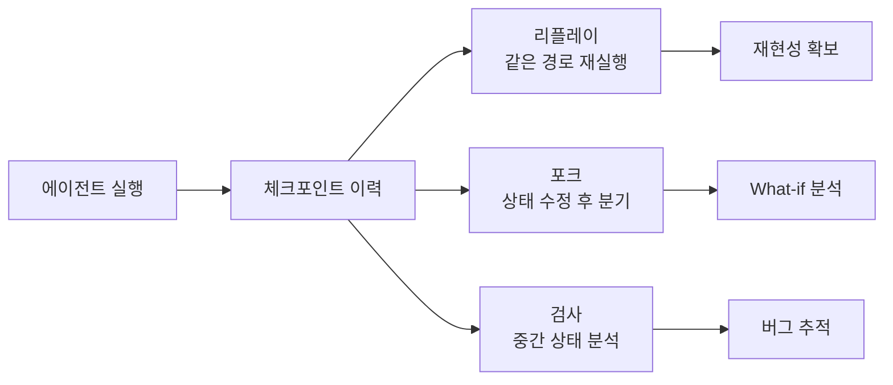
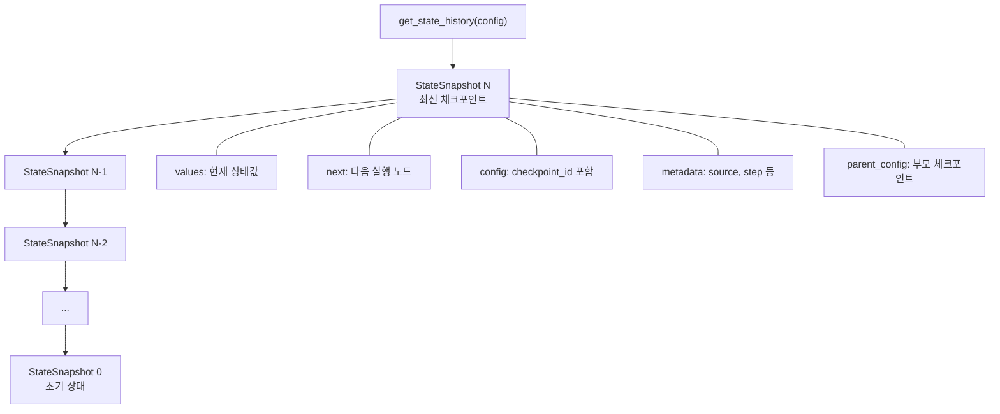
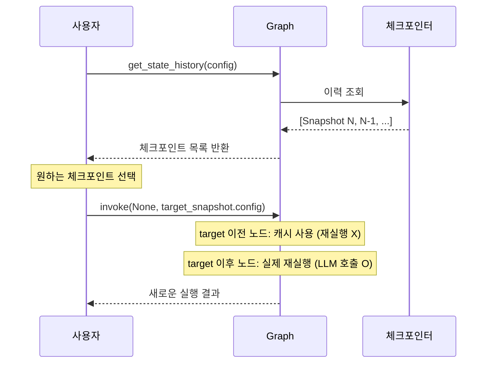
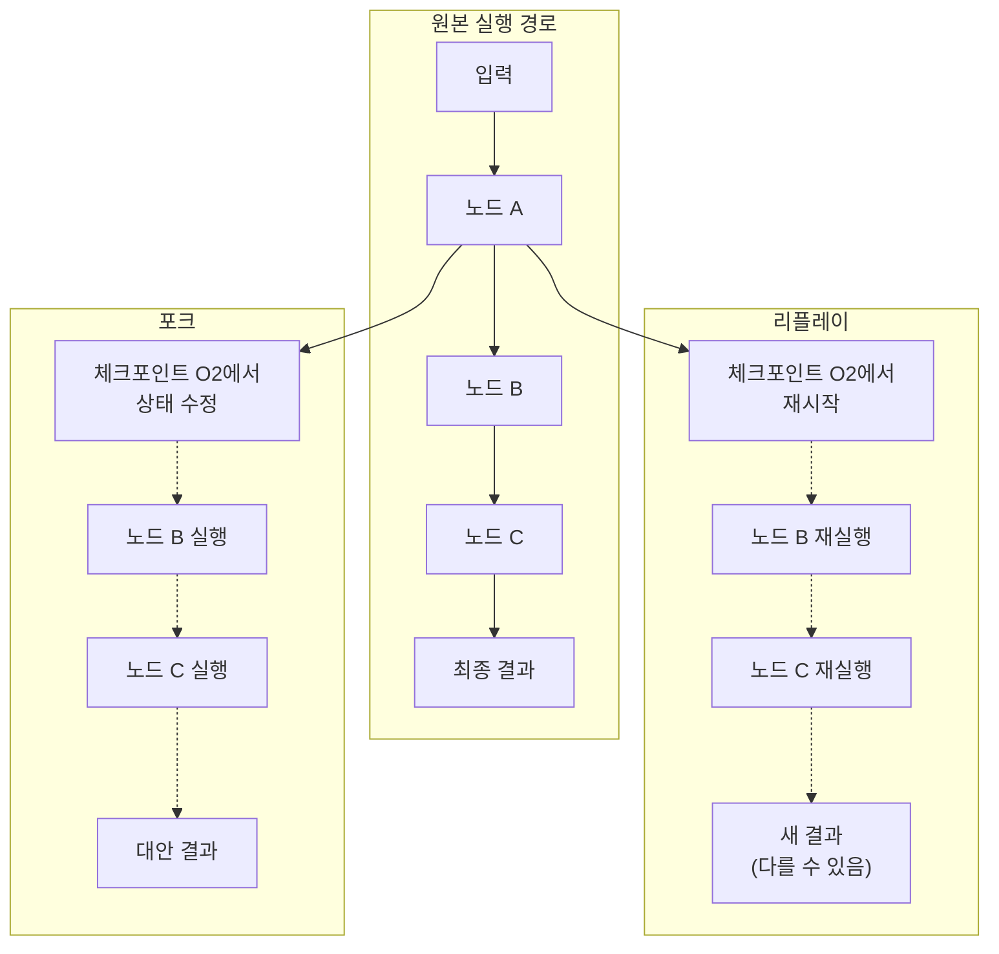
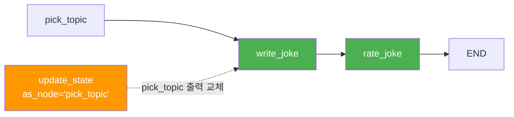
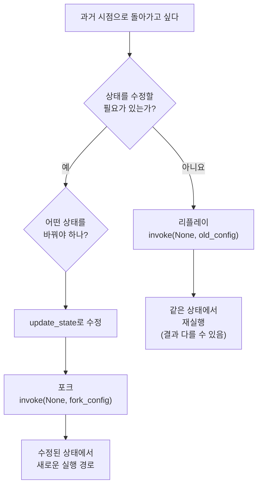

# 타임 트래블과 상태 복원

> LangGraph의 타임 트래블 기능으로 과거 체크포인트를 탐색하고, 리플레이와 포크로 실행 경로를 자유롭게 조작하는 방법을 배웁니다.

## 개요

이 섹션에서는 LangGraph 체크포인트 시스템의 꽃이라 할 수 있는 **타임 트래블(Time Travel)** 기능을 다룹니다. `get_state_history()`로 실행 이력을 조회하고, 특정 체크포인트로 **리플레이(Replay)**하거나, 상태를 수정하여 **포크(Fork)**로 새로운 실행 경로를 탐색하는 방법을 학습합니다.

**선수 지식**: [체크포인트 시스템 이해](06-ch6-체크포인트와-영속적-실행/01-01-체크포인트-시스템-이해.md)에서 배운 StateSnapshot 구조, [메모리 및 SQLite 체크포인터](06-ch6-체크포인트와-영속적-실행/02-02-메모리-및-sqlite-체크포인터.md)의 체크포인터 사용법, [멀티 세션과 스레드 관리](06-ch6-체크포인트와-영속적-실행/03-03-멀티-세션과-스레드-관리.md)의 thread_id 개념

**학습 목표**:
- `get_state_history()`로 체크포인트 이력을 조회하고 원하는 시점을 찾을 수 있다
- 리플레이(Replay)와 포크(Fork)의 차이를 이해하고 상황에 맞게 사용할 수 있다
- `update_state()`의 포크 메커니즘을 이해하고 대안 실행 경로를 탐색할 수 있다
- 타임 트래블을 활용한 디버깅 워크플로우를 설계할 수 있다

## 왜 알아야 할까?

LLM 에이전트를 개발하다 보면 이런 상황을 자주 만나게 됩니다 — "방금 에이전트가 잘못된 도구를 선택했는데, 그 직전 상태에서 다시 시작할 수 없을까?" 또는 "같은 입력인데 다른 결과가 나왔다. 중간 과정을 비교할 수 없을까?"

전통적인 소프트웨어에서는 디버거의 "스텝 백(step back)" 기능이 있지만, LLM 기반 에이전트는 **비결정적(non-deterministic)**이기 때문에 단순 재실행으로는 같은 결과를 보장할 수 없죠. 바로 이 지점에서 LangGraph의 타임 트래블이 빛을 발합니다.

타임 트래블은 크게 세 가지 시나리오에서 활용됩니다:

1. **디버깅**: 에이전트 실행의 중간 상태를 하나하나 들여다보며 문제 지점을 찾아낼 수 있습니다
2. **What-if 분석**: "만약 이 시점에서 상태가 달랐다면?" 같은 가정을 실험할 수 있습니다
3. **오류 복구**: 잘못된 경로로 빠진 에이전트를 이전 시점으로 되돌려 정상 경로로 다시 실행할 수 있습니다

> 📊 **그림 1**: 타임 트래블 활용 시나리오



## 핵심 개념

### 개념 1: get_state_history — 실행 이력 탐색

> 💡 **비유**: 브라우저의 "뒤로 가기"를 떠올려보세요. 브라우저는 방문한 페이지를 순서대로 기억하고 있어서, 언제든 이전 페이지로 돌아갈 수 있죠. `get_state_history()`는 에이전트의 "브라우저 히스토리"입니다. 에이전트가 거쳐간 모든 상태를 역순으로 보여주며, 원하는 시점으로 정확히 돌아갈 수 있게 해줍니다.

`get_state_history(config)`는 특정 스레드의 **모든 체크포인트를 역시간순(최신 → 과거)**으로 반환하는 제너레이터입니다. 각 항목은 [체크포인트 시스템 이해](06-ch6-체크포인트와-영속적-실행/01-01-체크포인트-시스템-이해.md)에서 배운 `StateSnapshot` 객체이며, 다음 핵심 필드를 통해 "언제, 어떤 노드가, 어떤 상태를 만들었는지" 파악할 수 있습니다.

> 📊 **그림 2**: get_state_history 반환 구조



핵심 필드를 하나씩 살펴보겠습니다:

| 필드 | 타입 | 설명 | 타임 트래블에서의 용도 |
|------|------|------|----------------------|
| `values` | `dict` | 해당 시점의 전체 상태 딕셔너리 | 상태 검사 — 각 시점에서 어떤 데이터가 있었는지 확인 |
| `next` | `tuple[str, ...]` | 다음에 실행될 노드 이름의 튜플 | 원하는 실행 시점 찾기 — `("call_model",)` 등으로 필터링 |
| `config` | `dict` | `checkpoint_id`, `checkpoint_ns` 포함 설정 | 리플레이/포크 대상 지정 — `invoke(None, snapshot.config)` |
| `metadata` | `dict` | `source`, `step`, `writes`, `parents` 등 | 누가(어떤 노드가) 이 상태를 만들었는지 추적 |
| `parent_config` | `dict or None` | 부모 체크포인트의 설정 (첫 체크포인트는 `None`) | 체크포인트 체인 추적 — 이력 그래프 구성 |
| `tasks` | `tuple` | 이 체크포인트에서 실행할 예정인 태스크 정보 | 노드 실행 전 입력/출력 미리 확인 |

`metadata` 딕셔너리 안에는 디버깅에 특히 유용한 서브 필드가 들어있습니다:

| metadata 키 | 설명 | 예시 값 |
|-------------|------|---------|
| `source` | 체크포인트 생성 원인 | `"input"`, `"loop"`, `"update"` |
| `step` | 실행 스텝 번호 (0부터 시작) | `0`, `1`, `2`, ... |
| `writes` | 이 스텝에서 기록된 상태 변경 | `{"call_model": {"response": "..."}}` |
| `parents` | 부모 체크포인트들의 네임스페이스별 설정 | `{"": {"checkpoint_id": "..."}}` |

이력을 조회하는 기본 패턴은 다음과 같습니다:

```python
# 스레드의 전체 체크포인트 이력 조회
config = {"configurable": {"thread_id": "my-thread"}}

for snapshot in graph.get_state_history(config):
    print(
        f"step={snapshot.metadata.get('step', '?'):>2} | "
        f"next={snapshot.next} | "
        f"source={snapshot.metadata.get('source', '?')} | "
        f"checkpoint_id={snapshot.config['configurable']['checkpoint_id'][:8]}..."
    )
```

`metadata['source']` 필드가 특히 유용한데요, 이 값으로 체크포인트가 어떻게 생성되었는지 알 수 있습니다:

- `"input"`: 사용자 입력으로 생성된 초기 체크포인트
- `"loop"`: 그래프 실행 중 슈퍼스텝 경계에서 자동 생성
- `"update"`: `update_state()` 호출로 수동 생성 (포크!)
- `"fork"`: 포크 작업으로 분기된 체크포인트

특정 시점을 찾을 때는 `next` 필드와 `metadata['writes']`를 조합하면 효과적입니다:

```python
# 특정 노드 실행 직전 체크포인트 찾기
before_model = next(
    s for s in graph.get_state_history(config)
    if s.next == ("call_model",)
)

# 특정 노드가 기록한 상태 변경 확인
for snapshot in graph.get_state_history(config):
    writes = snapshot.metadata.get("writes", {})
    if "call_model" in writes:
        print(f"call_model이 기록한 값: {writes['call_model']}")
```

### 개념 2: 리플레이(Replay) — 과거 시점에서 재실행

> 💡 **비유**: 게임의 "세이브 포인트에서 다시 시작"과 똑같습니다. 보스전에서 졌을 때, 세이브 포인트로 돌아가서 다시 도전하는 것처럼, 에이전트가 잘못된 결과를 낸 시점의 직전 체크포인트에서 다시 실행할 수 있습니다.

리플레이는 과거 체크포인트의 `config`를 사용하여 그래프를 다시 `invoke`하는 것입니다. **상태를 변경하지 않고**, 해당 시점부터 그래프 실행을 이어갑니다.

> 📊 **그림 3**: 리플레이 실행 흐름



리플레이의 핵심 동작을 이해하는 게 중요합니다:

1. **타겟 체크포인트 이전 노드**: 재실행하지 않습니다. 이미 저장된 결과를 그대로 사용합니다.
2. **타겟 체크포인트 이후 노드**: **실제로 다시 실행**합니다. LLM 호출, API 요청이 다시 일어나므로, **비결정적인 LLM 특성상 다른 결과가 나올 수 있습니다.**

```python
# Step 1: 이력에서 원하는 체크포인트 찾기
history = list(graph.get_state_history(config))

# next가 ("call_model",)인 체크포인트 = call_model 실행 직전
before_model = next(
    s for s in history 
    if s.next == ("call_model",)
)

# Step 2: 해당 시점에서 리플레이
result = graph.invoke(None, before_model.config)
```

> ⚠️ **흔한 오해**: "리플레이하면 항상 같은 결과가 나온다"고 생각하기 쉽지만, 그렇지 않습니다! 타겟 시점 이후의 노드는 실제로 재실행되기 때문에 LLM 호출이 다시 일어나고, LLM의 비결정적 특성상 다른 결과가 나올 수 있습니다. 온도(temperature)가 0이어도 완벽한 재현성은 보장되지 않아요.

### 개념 3: 포크(Fork) — 상태를 수정하고 분기하기

> 💡 **비유**: Git의 브랜치를 떠올려보세요. 특정 커밋에서 새 브랜치를 만들고, 코드를 수정한 뒤 다른 방향으로 개발을 이어가는 것처럼, 포크는 특정 체크포인트에서 **상태를 변경하고** 새로운 실행 경로를 만듭니다. 원래 실행 이력은 그대로 남아있죠.

포크는 리플레이와 달리, `update_state()`를 사용하여 **과거 상태를 수정한 뒤** 실행을 재개합니다. 이때 원래 체크포인트 이력은 건드리지 않고, **새로운 분기 체크포인트**를 생성합니다.

> 📊 **그림 4**: 리플레이 vs 포크 비교



포크의 핵심은 `update_state()`로 **과거 체크포인트의 상태를 수정**하는 것입니다. 이 함수는 새로운 분기 체크포인트를 만들어내고, 그 config를 반환합니다:

```python
# Step 1: 포크할 체크포인트 선택
history = list(graph.get_state_history(config))
target = next(s for s in history if s.next == ("write_joke",))

# Step 2: 상태를 수정하여 포크 생성
fork_config = graph.update_state(
    target.config,                    # 어떤 체크포인트에서 분기할지
    values={"topic": "고양이"},        # 수정할 상태 값
    as_node="generate_topic"          # 어떤 노드가 이 업데이트를 했다고 기록할지
)

# Step 3: 포크된 경로에서 실행 재개
fork_result = graph.invoke(None, fork_config)
```

포크 맥락에서 `as_node`는 **실행 재개 지점을 결정**합니다. 지정한 노드의 후속 엣지부터 그래프가 이어지기 때문에, 어떤 노드의 출력을 "교체"하고 싶은지에 따라 값을 선택하면 됩니다. `update_state()`의 전체 API 동작 — 리듀서 적용, Human-in-the-Loop에서의 피드백 주입, `as_node` 세부 규칙 등 — 은 [피드백 주입과 상태 수정](07-ch7-human-in-the-loop-워크플로우/03-03-피드백-주입과-상태-수정.md)에서 종합적으로 다룹니다.

> 📊 **그림 5**: 포크에서 as_node가 실행 재개 지점을 결정하는 원리



### 개념 4: 리플레이와 포크의 선택 기준

두 가지 타임 트래블 방식을 언제 사용해야 할지 정리해보겠습니다.

> 📊 **그림 6**: 타임 트래블 의사결정 흐름



| 기준 | 리플레이 | 포크 |
|------|---------|------|
| **상태 변경** | 없음 | `update_state()`로 수정 |
| **원본 이력** | 보존 | 보존 (새 분기 생성) |
| **사용 시나리오** | 재시도, 재현성 테스트 | What-if 분석, 오류 수정 |
| **LLM 재호출** | 타겟 이후 노드에서 발생 | 타겟 이후 노드에서 발생 |
| **새 checkpoint_id** | 생성됨 | 생성됨 |

## 실습: 직접 해보기

실제로 타임 트래블을 체험해봅시다. 간단한 "주제 → 조크 생성" 에이전트를 만들고, 리플레이와 포크를 모두 실습합니다.

```python
from typing import TypedDict
from langgraph.graph import StateGraph, START, END
from langgraph.checkpoint.memory import InMemorySaver
import random


# --- 1. 상태 정의 ---
class JokeState(TypedDict):
    topic: str           # 주제
    setup: str           # 조크 앞부분
    punchline: str       # 조크 뒷부분 (핵심 웃음 포인트)
    rating: int          # 평가 점수 (1~10)


# --- 2. 노드 함수 정의 ---
def pick_topic(state: JokeState) -> dict:
    """무작위 주제를 선택합니다."""
    topics = ["프로그래머", "AI", "Python", "커피", "버그"]
    chosen = random.choice(topics)
    print(f"[pick_topic] 선택된 주제: {chosen}")
    return {"topic": chosen}


def write_joke(state: JokeState) -> dict:
    """주제에 맞는 조크를 생성합니다 (LLM 대신 시뮬레이션)."""
    jokes = {
        "프로그래머": ("프로그래머가 바다에 가면?", "바이트(byte)를 잡는다"),
        "AI": ("AI가 시험에 떨어지면?", "재학습(re-training)한다"),
        "Python": ("Python이 느린 이유는?", "들여쓰기(indent)하느라 바쁘니까"),
        "커피": ("개발자가 커피를 마시면?", "Java가 실행된다"),
        "버그": ("버그가 사라지지 않는 이유는?", "feature라고 이름을 바꿔서"),
    }
    setup, punchline = jokes.get(
        state["topic"], ("알 수 없는 주제", "알 수 없는 펀치라인")
    )
    print(f"[write_joke] 조크 생성 완료: {setup}")
    return {"setup": setup, "punchline": punchline}


def rate_joke(state: JokeState) -> dict:
    """조크를 평가합니다 (비결정적 — 매번 다를 수 있음)."""
    score = random.randint(3, 10)
    print(f"[rate_joke] 평가 점수: {score}/10")
    return {"rating": score}


# --- 3. 그래프 구성 ---
builder = StateGraph(JokeState)
builder.add_node("pick_topic", pick_topic)
builder.add_node("write_joke", write_joke)
builder.add_node("rate_joke", rate_joke)

builder.add_edge(START, "pick_topic")
builder.add_edge("pick_topic", "write_joke")
builder.add_edge("write_joke", "rate_joke")
builder.add_edge("rate_joke", END)

# 체크포인터 설정
checkpointer = InMemorySaver()
graph = builder.compile(checkpointer=checkpointer)

# --- 4. 최초 실행 ---
config = {"configurable": {"thread_id": "joke-1"}}
result = graph.invoke({"topic": ""}, config)
```

```run:python
# --- 5. 체크포인트 이력 조회 ---
print("=" * 60)
print("체크포인트 이력 (역시간순)")
print("=" * 60)

history = list(graph.get_state_history(config))
for i, snapshot in enumerate(history):
    step = snapshot.metadata.get("step", "?")
    source = snapshot.metadata.get("source", "?")
    next_nodes = snapshot.next
    cp_id = snapshot.config["configurable"]["checkpoint_id"][:8]
    topic = snapshot.values.get("topic", "(없음)")
    
    print(
        f"[{i}] step={step} | source={source:>6} | "
        f"next={next_nodes} | topic={topic} | "
        f"id={cp_id}..."
    )
```

```output
============================================================
체크포인트 이력 (역시간순)
============================================================
[0] step=3 | source=  loop | next=() | topic=AI | id=1ef8a3b2...
[1] step=2 | source=  loop | next=('rate_joke',) | topic=AI | id=1ef8a3b1...
[2] step=1 | source=  loop | next=('write_joke',) | topic=AI | id=1ef8a3b0...
[3] step=0 | source=  loop | next=('pick_topic',) | topic= | id=1ef8a3af...
[4] step=-1 | source= input | next=('__start__',) | topic= | id=1ef8a3ae...
```

```python
# --- 6. 리플레이: write_joke 직전으로 돌아가서 재실행 ---
print("\n" + "=" * 60)
print("리플레이: write_joke 직전에서 재시작")
print("=" * 60)

# next가 ('write_joke',)인 체크포인트를 찾기
before_joke = next(
    s for s in history 
    if s.next == ("write_joke",)
)
print(f"리플레이 대상: step={before_joke.metadata['step']}, "
      f"topic={before_joke.values.get('topic')}")

# 해당 시점에서 리플레이 (상태 변경 없이 재실행)
replay_result = graph.invoke(None, before_joke.config)
print(f"리플레이 결과: {replay_result}")
```

```python
# --- 7. 포크: 주제를 바꿔서 분기 실행 ---
print("\n" + "=" * 60)
print("포크: 주제를 '커피'로 바꿔서 분기")
print("=" * 60)

# write_joke 직전 체크포인트에서 topic을 수정
fork_config = graph.update_state(
    before_joke.config,              # 포크 시작점
    values={"topic": "커피"},         # 상태 수정
    as_node="pick_topic"             # pick_topic의 출력을 교체 → write_joke부터 재개
)

print(f"포크 config: checkpoint_id={fork_config['configurable']['checkpoint_id'][:8]}...")

# 포크된 경로에서 실행
fork_result = graph.invoke(None, fork_config)
print(f"포크 결과: topic={fork_result['topic']}, "
      f"setup={fork_result['setup']}")
```

```run:python
# --- 8. 포크 후 이력 확인 ---
print("\n" + "=" * 60)
print("포크 후 전체 이력 (포크 분기 포함)")
print("=" * 60)

all_history = list(graph.get_state_history(config))
for i, snapshot in enumerate(all_history):
    step = snapshot.metadata.get("step", "?")
    source = snapshot.metadata.get("source", "?")
    topic = snapshot.values.get("topic", "(없음)")
    rating = snapshot.values.get("rating", "-")
    marker = " ◀ FORK" if source == "update" else ""
    
    print(
        f"[{i}] step={step} | source={source:>6} | "
        f"topic={topic} | rating={rating}{marker}"
    )
```

```output
============================================================
포크 후 전체 이력 (포크 분기 포함)
============================================================
[0] step=3 | source=  loop | topic=커피 | rating=7
[1] step=2 | source=  loop | topic=커피 | rating=-
[2] step=1 | source=update | topic=커피 | rating=- ◀ FORK
[3] step=3 | source=  loop | topic=AI | rating=8
[4] step=2 | source=  loop | topic=AI | rating=-
[5] step=1 | source=  loop | topic=AI | rating=-
[6] step=0 | source=  loop | topic= | rating=-
[7] step=-1 | source= input | topic= | rating=-
```

```python
# --- 9. 특정 체크포인트에서 상태 검사 (디버깅) ---
print("\n" + "=" * 60)
print("디버깅: 각 노드 실행 후 상태 변화 추적")
print("=" * 60)

# 원본 실행의 체크포인트만 필터링
original_checkpoints = [
    s for s in all_history 
    if s.metadata.get("source") != "update"
       and s.values.get("topic") != "커피"
]

for snapshot in reversed(original_checkpoints):
    step = snapshot.metadata.get("step", "?")
    writes = snapshot.metadata.get("writes", {})
    print(f"\n--- Step {step} ---")
    print(f"  next: {snapshot.next}")
    print(f"  values: {dict(snapshot.values)}")
    if writes:
        print(f"  writes: {writes}")
```

## 더 깊이 알아보기

### 타임 트래블의 기원: 이벤트 소싱과 CQRS

타임 트래블이라는 개념은 LangGraph가 처음 만든 것이 아닙니다. 그 뿌리는 **이벤트 소싱(Event Sourcing)** 패턴에 있습니다.

2005년 Martin Fowler가 정리한 이벤트 소싱 패턴은 "시스템의 현재 상태를 저장하는 대신, 상태를 변경한 모든 이벤트를 순서대로 저장한다"는 아이디어입니다. 은행 거래 내역을 생각해보세요 — 현재 잔고만 저장하는 게 아니라, "입금 100만원", "출금 30만원" 같은 모든 거래를 기록하기 때문에, 특정 날짜의 잔고를 정확히 재구성할 수 있죠.

Redux(React 상태 관리)의 "타임 트래블 디버깅"도 같은 원리입니다. Dan Abramov가 2015년 React Europe 컨퍼런스에서 시연한 "Hot Reloading with Time Travel"은 큰 반향을 일으켰는데요, 모든 상태 변화를 액션으로 기록하고 슬라이더를 움직여 과거 상태로 돌아갈 수 있다는 데모였습니다.

LangGraph의 타임 트래블은 이 아이디어를 **AI 에이전트 실행**에 적용한 것입니다. 슈퍼스텝마다 체크포인트를 자동 생성하는 것이 이벤트 기록에 해당하고, `get_state_history()`로 이력을 조회하는 것이 이벤트 리플레이에 해당합니다. 다만 전통적인 이벤트 소싱과 달리, LLM의 비결정적 특성 때문에 "순수 리플레이(같은 입력 → 같은 출력)"가 보장되지 않는다는 점이 AI 에이전트 특유의 도전 과제입니다.

### 인터럽트와 타임 트래블의 관계

타임 트래블 시 주의할 점이 있습니다. 그래프에 `interrupt()` 또는 `interrupt_before`/`interrupt_after`가 설정된 노드가 있다면, 리플레이나 포크 과정에서 해당 인터럽트가 **다시 발생**합니다. 이때는 `Command(resume=...)` 응답을 다시 제공해야 합니다. 이 부분은 [Human-in-the-Loop 패턴 개관](07-ch7-human-in-the-loop-워크플로우/01-01-human-in-the-loop-패턴-개관.md)에서 자세히 다룹니다.

## 흔한 오해와 팁

> ⚠️ **흔한 오해**: "리플레이하면 LLM 비용이 들지 않는다"고 생각하는 분이 많습니다. 하지만 **타겟 체크포인트 이전 노드만** 캐시를 사용하고, 이후 노드는 실제로 재실행됩니다. LLM 호출이 포함된 노드가 재실행 범위에 있다면, API 호출 비용이 발생합니다! 비용을 절약하려면, 가능한 한 마지막 체크포인트에 가까운 시점에서 리플레이하세요.

> 💡 **알고 계셨나요?**: 포크에서 `update_state()`는 단순히 값을 덮어쓰는 게 아니라, 해당 필드에 설정된 **리듀서(Reducer)**를 거칩니다. 예를 들어 `messages` 필드에 `add_messages` 리듀서가 설정되어 있다면, 기존 메시지를 덮어쓰지 않고 **추가**합니다. 리듀서와 `update_state()`의 상호작용에 대한 자세한 규칙은 [피드백 주입과 상태 수정](07-ch7-human-in-the-loop-워크플로우/03-03-피드백-주입과-상태-수정.md)에서 종합적으로 다룹니다.

> 🔥 **실무 팁**: 디버깅할 때 `get_state_history`의 결과를 그냥 출력하면 정보가 너무 많습니다. `metadata['writes']` 필드를 활용하세요 — 각 체크포인트에서 **어떤 노드가 어떤 값을 기록했는지** 핵심 정보만 골라볼 수 있습니다.

> 🔥 **실무 팁**: SqliteSaver나 PostgresSaver를 사용하면 **프로세스를 재시작해도** 타임 트래블이 가능합니다. 이전 세션의 `thread_id`만 알면, 나중에 다시 이력을 조회하고 포크할 수 있어요. 장기 실행 워크플로우에서 매우 유용한 패턴인데, 이 내용은 [장기 실행 워크플로우 구축](06-ch6-체크포인트와-영속적-실행/05-05-장기-실행-워크플로우-구축.md)에서 본격적으로 다룹니다.

## 핵심 정리

| 개념 | 설명 |
|------|------|
| `get_state_history(config)` | 스레드의 전체 체크포인트를 역시간순으로 반환하는 제너레이터 |
| 리플레이(Replay) | 과거 체크포인트의 config로 `invoke(None, config)` — 상태 변경 없이 재실행 |
| 포크(Fork) | `update_state(config, values, as_node)`로 상태를 수정한 뒤 분기 실행 |
| 포크의 `as_node` | 실행 재개 지점 결정 — 해당 노드의 후속 엣지부터 실행. 상세 규칙은 Ch7.3 참조 |
| `metadata['source']` | 체크포인트 생성 원인: `"input"`, `"loop"`, `"update"` |
| `metadata['writes']` | 해당 스텝에서 각 노드가 기록한 상태 변경 내역 |
| `parent_config` | 부모 체크포인트 설정 — 체크포인트 체인 추적에 활용 |
| 재실행 범위 | 타겟 이전 노드는 캐시, 타겟 이후 노드는 실제 재실행 (비용 발생) |
| 원본 이력 보존 | 리플레이와 포크 모두 원본 체크포인트 체인을 변경하지 않음 |

## 다음 섹션 미리보기

타임 트래블로 과거를 탐색하고 대안 경로를 실험하는 방법을 배웠습니다. 다음 섹션 [장기 실행 워크플로우 구축](06-ch6-체크포인트와-영속적-실행/05-05-장기-실행-워크플로우-구축.md)에서는 이 체크포인트 시스템을 활용하여 **수 시간 또는 수 일에 걸쳐 실행되는 워크플로우**를 설계합니다. 장애 내성(fault tolerance), 재시도(retry), 그리고 프로세스 재시작 후 이어서 실행하는 패턴을 다루며, 체크포인트의 진정한 가치가 드러나는 프로덕션 시나리오를 체험합니다.

## 참고 자료

- [Use Time Travel — LangGraph 공식 문서](https://docs.langchain.com/oss/python/langgraph/use-time-travel) - 리플레이와 포크의 공식 가이드. 인터럽트, 서브그래프와의 상호작용도 설명
- [LangGraph Persistence Guide (2025)](https://fast.io/resources/langgraph-persistence/) - 체크포인터와 타임 트래블을 포함한 영속성 전체 가이드
- [Debugging Non-Deterministic LLM Agents: Checkpoint-Based State Replay](https://dev.to/sreeni5018/debugging-non-deterministic-llm-agents-implementing-checkpoint-based-state-replay-with-langgraph-5171) - 타임 트래블을 활용한 비결정적 에이전트 디버깅 실전 사례
- [State Replay and Forking — DeepWiki](https://deepwiki.com/esurovtsev/langgraph-intro/3.4.1-state-replay-and-forking) - 리플레이와 포크의 개념을 코드와 함께 정리
- [langgraph-checkpoint — PyPI](https://pypi.org/project/langgraph-checkpoint/) - 체크포인트 패키지의 최신 버전과 API 레퍼런스

---
### 🔗 Related Sessions
- [checkpoint](06-ch6-체크포인트와-영속적-실행/01-01-체크포인트-시스템-이해.md) (prerequisite)
- [thread_id](06-ch6-체크포인트와-영속적-실행/01-01-체크포인트-시스템-이해.md) (prerequisite)
- [inmemorysaver](06-ch6-체크포인트와-영속적-실행/02-02-메모리-및-sqlite-체크포인터.md) (prerequisite)
- [super-step](06-ch6-체크포인트와-영속적-실행/01-01-체크포인트-시스템-이해.md) (prerequisite)
- [statesnapshot](06-ch6-체크포인트와-영속적-실행/01-01-체크포인트-시스템-이해.md) (prerequisite)
- [checkpoint_id](06-ch6-체크포인트와-영속적-실행/01-01-체크포인트-시스템-이해.md) (prerequisite)
- [update_state](07-ch7-human-in-the-loop-워크플로우/03-03-상태-수정과-피드백-주입.md) (prerequisite)
- [sqlitesaver](06-ch6-체크포인트와-영속적-실행/02-02-메모리-및-sqlite-체크포인터.md) (prerequisite)
