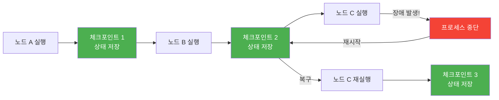
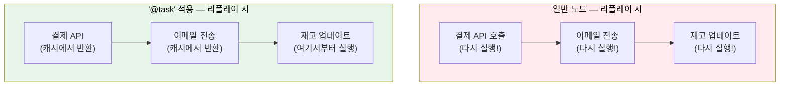
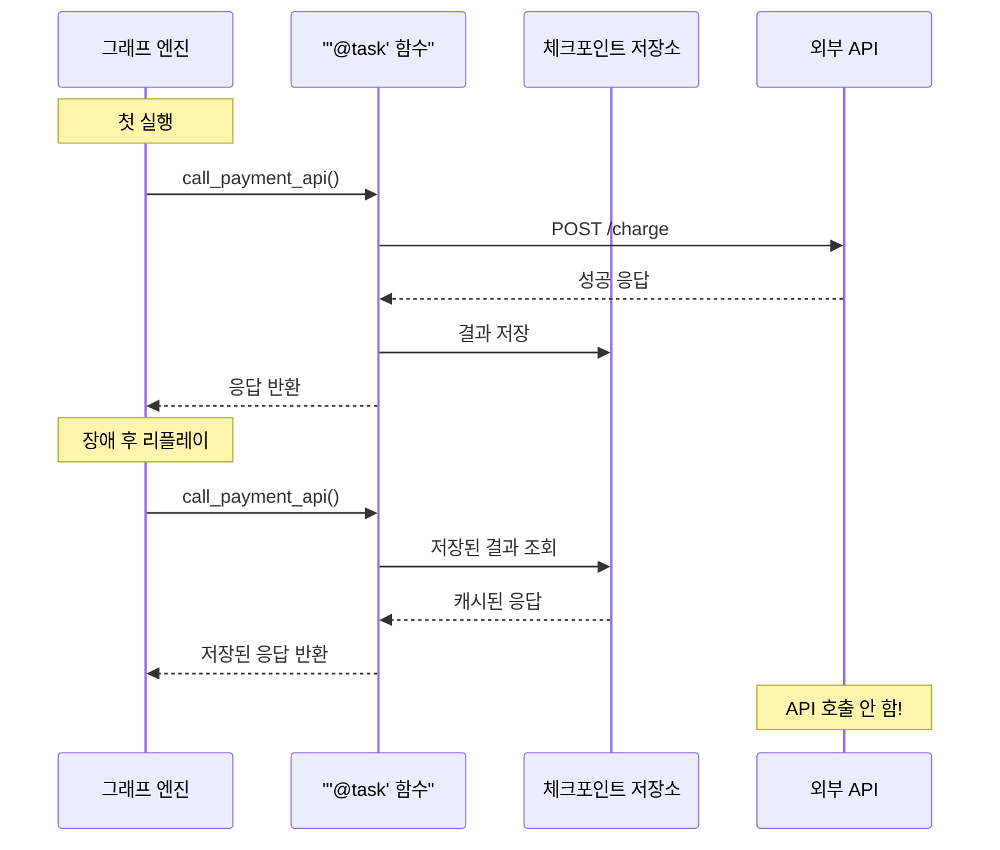
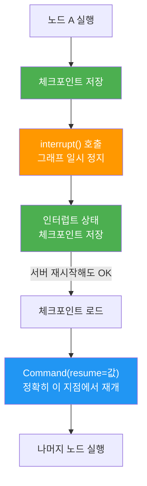
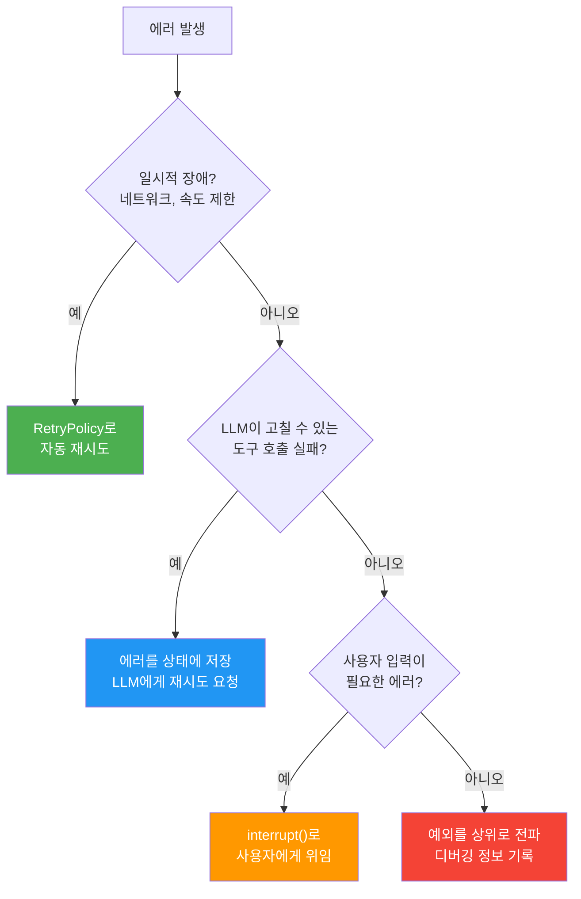

# 장기 실행 워크플로우 구축

> 체크포인트 기반의 내구성 있는 실행으로 며칠이 걸리는 워크플로우도 안전하게 관리한다

## 개요

이 섹션에서는 LangGraph의 체크포인트 시스템을 활용하여 **장기 실행 워크플로우**(Long-Running Workflow)를 구축하는 방법을 학습합니다. 외부 이벤트 대기, 프로세스 재시작 후 이어서 실행, 장애 발생 시 자동 복구까지 — 프로덕션 에이전트에 반드시 필요한 내구성(Durability) 패턴을 다룹니다.

**선수 지식**: 이전 섹션에서 배운 [체크포인트 시스템](06-ch6-체크포인트와-영속적-실행/01-01-체크포인트-시스템-이해.md), [SqliteSaver/PostgresSaver](06-ch6-체크포인트와-영속적-실행/02-02-메모리-및-sqlite-체크포인터.md), [멀티 세션 관리](06-ch6-체크포인트와-영속적-실행/03-03-멀티-세션과-스레드-관리.md), [타임 트래블](06-ch6-체크포인트와-영속적-실행/04-04-타임-트래블과-상태-복원.md)

**학습 목표**:
- 내구성 실행(Durable Execution)의 원리와 세 가지 모드를 설명할 수 있다
- `@task` 데코레이터로 부수 효과를 안전하게 감싸 재실행을 방지할 수 있다
- `RetryPolicy`를 활용하여 일시적 장애에 자동 대응하는 노드를 구성할 수 있다
- 장기 실행 워크플로우에서 `interrupt()`가 체크포인트와 결합하여 어떻게 내구성을 제공하는지 이해할 수 있다

## 왜 알아야 할까?

실제 비즈니스 워크플로우는 "질문-응답" 한 턴으로 끝나지 않습니다. 결재 승인을 기다리는 데 3일, 외부 API 응답을 기다리는 데 수 시간, 배치 작업 완료를 기다리는 데 수십 분이 걸리기도 하죠. 이런 상황에서 에이전트가 메모리에서만 상태를 유지한다면 어떻게 될까요?

- 서버가 재시작되면 **진행 상황이 모두 사라집니다**
- 네트워크 오류 한 번에 **처음부터 다시 시작**해야 합니다
- 외부 승인을 기다리는 동안 **서버 리소스를 점유**합니다

LangGraph의 내구성 실행은 이 문제들을 체크포인트로 해결합니다. 노드 경계마다 상태를 저장하고, 중단되더라도 마지막 체크포인트에서 이어서 실행할 수 있거든요. 마치 게임의 자동 저장처럼 — 보스전에서 졌어도 던전 입구부터 다시 시작할 필요가 없는 것입니다.

## 핵심 개념

### 개념 1: 내구성 실행(Durable Execution)이란?

> 💡 **비유**: 내구성 실행은 **책갈피가 끼워진 독서**와 같습니다. 300쪽짜리 책을 읽다가 잠이 들어도, 책갈피가 있으면 다음 날 정확히 그 페이지에서 이어 읽을 수 있죠. 만약 책갈피 없이 책을 덮었다면? 어디까지 읽었는지 처음부터 훑어봐야 합니다. LangGraph의 체크포인트가 바로 이 "자동 책갈피"입니다.

**내구성 실행**(Durable Execution)은 워크플로우가 핵심 지점마다 진행 상태를 저장하여, 중단 후에도 정확히 멈춘 곳에서 재개할 수 있는 실행 방식입니다. LangGraph에서는 **노드 경계**(node boundary)에서 자동으로 체크포인트가 생성됩니다.

> 📊 **그림 1**: 내구성 실행의 체크포인트 저장 흐름



핵심은 **노드 크기 설계**입니다. 노드가 작을수록 체크포인트가 자주 저장되어 장애 시 반복할 작업이 줄어듭니다. 하지만 너무 잘게 쪼개면 그래프가 복잡해지죠. 경험적으로 **외부 API 호출, LLM 호출, 파일 I/O**를 각각 별도 노드로 분리하는 것이 좋은 균형점입니다.

#### 세 가지 내구성 모드

LangGraph는 체크포인트 저장 타이밍을 세 가지 모드로 제어할 수 있습니다:

```python
# 모드 1: 기본값 — 완료/에러/인터럽트 시에만 저장
graph = builder.compile(checkpointer=checkpointer)

# 모드 2: 비동기 — 다음 노드 실행 중 백그라운드로 저장
graph = builder.compile(checkpointer=checkpointer, durability="async")

# 모드 3: 동기 — 각 노드 실행 전 반드시 저장 완료
graph = builder.compile(checkpointer=checkpointer, durability="sync")
```

> 📊 **그림 2**: 내구성 모드별 체크포인트 저장 타이밍 비교

```mermaid
flowchart TD
    subgraph EXIT["exit 모드 — 기본값"]
        E1["노드 A"] --> E2["노드 B"] --> E3["노드 C"]
        E3 --> E4["완료 시<br/>체크포인트 저장"]
    end

    subgraph ASYNC["async 모드 — 균형"]
        A1["노드 A"] --> A2["비동기 저장 +<br/>노드 B 동시 실행"]
        A2 --> A3["비동기 저장 +<br/>노드 C 동시 실행"]
    end

    subgraph SYNC["sync 모드 — 최고 내구성"]
        S1["체크포인트 저장"] --> S2["노드 A"]
        S2 --> S3["체크포인트 저장"]
        S3 --> S4["노드 B"]
        S4 --> S5["체크포인트 저장"]
        S5 --> S6["노드 C"]
    end

    style EXIT fill:#E3F2FD,color:#000
    style ASYNC fill:#FFF3E0,color:#000
    style SYNC fill:#E8F5E9,color:#000
```



| 모드 | 저장 시점 | 성능 | 내구성 | 사용 시나리오 |
|------|----------|------|--------|-------------|
| `"exit"` | 완료/에러/인터럽트 시 | 최고 | 중간 실행 중 복구 불가 | 짧은 워크플로우, 개발/테스트 |
| `"async"` | 다음 노드와 병렬 | 좋음 | 대부분 복구 가능 | 균형 잡힌 프로덕션 |
| `"sync"` | 각 노드 실행 전 | 오버헤드 있음 | 완전 복구 | 미션 크리티컬 워크플로우 |

### 개념 2: `@task` 데코레이터와 부수 효과 안전성

> 💡 **비유**: 요리할 때 "완성된 요리 사진"을 찍어두는 것과 비슷합니다. 요리를 다시 해야 하는 상황이 오면, 이미 사진(결과)이 있는 요리는 다시 만들지 않고 기록만 참조하면 되죠. `@task`는 함수의 실행 결과를 체크포인트에 "사진처럼" 저장해서, 워크플로우가 재개될 때 이미 완료된 작업을 반복하지 않도록 합니다.

워크플로우가 재개될 때, LangGraph는 이미 완료된 노드를 **리플레이**(replay)합니다. 이때 문제가 생깁니다 — API 호출, 결제 요청 같은 **부수 효과**(side effect)가 있는 코드가 다시 실행되면 결제가 이중으로 처리될 수 있죠! `@task` 데코레이터는 이 문제를 해결합니다.

#### 기존 노드 함수 방식과 `@task`의 차이

지금까지 우리는 노드 함수를 일반 Python 함수로 작성해왔습니다. `add_node("이름", 함수)`로 등록하면 LangGraph가 노드 경계에서 체크포인트를 만들어주죠. 이 방식은 잘 동작하지만, **노드 내부에서 여러 외부 호출**이 일어나면 한계가 드러납니다.

```python
# 기존 방식: 일반 노드 함수
def process_order(state: State) -> dict:
    receipt = call_payment_api(state["order_id"])   # 외부 API 호출 1
    send_email(state["user_email"], receipt)         # 외부 API 호출 2
    update_inventory(state["items"])                 # 외부 API 호출 3
    return {"status": "completed"}
```

위 노드에서 `send_email` 직후 프로세스가 죽으면 어떻게 될까요? 리플레이 시 노드 전체가 다시 실행되면서 **결제가 이중으로 처리**됩니다. 노드를 3개로 쪼개면 해결되지만, 단순한 순차 작업을 위해 그래프가 불필요하게 복잡해지죠.

`@task`는 이 딜레마를 해결합니다 — **노드 내부의 개별 함수 호출 단위**로 결과를 캐싱하여, 노드를 쪼개지 않고도 부수 효과를 안전하게 보호합니다.

> 📊 **그림 3**: 일반 노드 vs `@task` — 리플레이 시 차이



`@task`는 LangGraph의 **Functional API**에서 도입된 비교적 새로운 기능입니다. 기존의 `StateGraph` + 노드 함수 방식(Graph API)과 함께 사용할 수 있으며, 특히 장기 실행 워크플로우처럼 부수 효과가 많은 시나리오에서 위력을 발휘합니다.

```python
from langgraph.func import task

@task
def call_payment_api(order_id: str, amount: float) -> dict:
    """결제 API 호출 — @task로 감싸서 재실행 방지"""
    response = requests.post(
        "https://api.payment.com/charge",
        json={"order_id": order_id, "amount": amount}
    )
    return response.json()

@task
def send_notification(user_id: str, message: str) -> bool:
    """알림 전송 — 역시 부수 효과이므로 @task 필수"""
    result = notification_service.send(user_id, message)
    return result.success
```

`@task`로 감싼 함수는:
1. **첫 실행**: 정상적으로 실행되고, 결과가 체크포인트에 저장됩니다
2. **리플레이 시**: 함수를 다시 호출하지 않고, 저장된 결과를 반환합니다

> 📊 **그림 4**: `@task` 데코레이터의 리플레이 동작



#### 언제 `@task`를 사용해야 할까?

| 상황 | `@task` 필요? | 이유 |
|------|:---:|------|
| 외부 API 호출 | O | 이중 호출 방지 |
| 결제/이체 처리 | O | 이중 결제 방지 (필수!) |
| 이메일/SMS 전송 | O | 중복 전송 방지 |
| 난수 생성 | O | 재실행 시 같은 값 보장 |
| 순수 계산 (문자열 가공 등) | X | 리플레이해도 결과 동일 |
| LLM 호출 | △ | 비결정적이므로 권장, 하지만 노드 자체가 보호 |

> ⚠️ **흔한 오해**: "`@task`만 쓰면 모든 게 안전하다"고 생각하기 쉽지만, **멱등성**(idempotency) 설계도 함께 필요합니다. `@task`의 캐시가 유실될 수 있는 극단적 상황(체크포인터 DB 장애)에서도 안전하려면, 외부 API 호출에 멱등키(idempotency key)를 함께 보내는 것이 좋습니다.

### 개념 3: RetryPolicy로 일시적 장애 자동 복구

> 💡 **비유**: 전화 통화 중 상대방 목소리가 끊길 때를 떠올려보세요. 대부분은 "여보세요?" 하고 한두 번 더 불러보면 다시 연결됩니다. 하지만 10번을 불러도 안 되면 전화를 끊고 다시 걸죠. `RetryPolicy`는 이 "여보세요 몇 번까지 할지, 간격은 얼마나 둘지"를 설정하는 것입니다.

LangGraph는 노드 단위로 재시도 정책을 설정할 수 있습니다. 네트워크 일시 오류, API 속도 제한, 일시적 서버 다운 등 **일시적 장애**(transient failure)에 자동으로 대응합니다.

```python
from langgraph.pregel import RetryPolicy

# 기본값: 3회 시도, 지수 백오프, 지터 포함
default_policy = RetryPolicy()

# 커스텀: 5회 시도, 초기 1초, 최대 60초 대기
aggressive_policy = RetryPolicy(
    max_attempts=5,          # 최대 5회 시도 (첫 시도 포함)
    initial_interval=1.0,    # 첫 재시도까지 1초 대기
    backoff_factor=2.0,      # 대기 시간 2배씩 증가
    max_interval=60.0,       # 최대 대기 60초
    jitter=True,             # 무작위 지터 추가 (동시 재시도 방지)
)

# 노드에 정책 적용
builder.add_node(
    "call_external_api",
    call_external_api,
    retry=aggressive_policy
)
```

`RetryPolicy`의 매개변수를 정리하면:

| 매개변수 | 타입 | 기본값 | 설명 |
|----------|------|--------|------|
| `initial_interval` | `float` | `0.5` | 첫 재시도까지 대기 시간(초) |
| `backoff_factor` | `float` | `2.0` | 대기 시간 증가 배수 |
| `max_interval` | `float` | `128.0` | 최대 대기 시간(초) |
| `max_attempts` | `int` | `3` | 최대 시도 횟수 (첫 시도 포함) |
| `jitter` | `bool` | `True` | 무작위 지터 추가 여부 |
| `retry_on` | `Callable` | 기본 필터 | 재시도할 예외 필터 함수 |

> 📊 **그림 5**: RetryPolicy의 지수 백오프 동작


기본 `retry_on` 필터는 대부분의 예외에서 재시도하되, `ValueError`, `TypeError`, `SyntaxError` 같은 **프로그래머 실수**는 재시도하지 않습니다. HTTP 라이브러리의 경우 5xx 상태 코드만 재시도합니다. 커스텀 필터도 만들 수 있죠:

```python
def retry_on_rate_limit(exc: Exception) -> bool:
    """429 Too Many Requests만 재시도"""
    if hasattr(exc, "status_code"):
        return exc.status_code == 429
    return False

builder.add_node(
    "call_llm",
    call_llm_node,
    retry=RetryPolicy(
        max_attempts=5,
        initial_interval=2.0,
        retry_on=retry_on_rate_limit
    )
)
```

### 개념 4: interrupt()와 장기 대기 — 내구성의 핵심 연결고리

> 💡 **비유**: 우체국에 등기우편을 보내러 갔는데, 상대방 주소 확인이 필요하다고 합니다. 번호표를 받고 잠깐 나갔다가, 주소를 확인한 뒤 번호표를 다시 제시하면 접수가 이어지죠. `interrupt()`는 번호표를 발급하는 것이고, `Command(resume=...)`은 주소를 가지고 돌아와 번호표를 제시하는 것입니다.

장기 실행 워크플로우에서 가장 흔한 패턴은 **외부 이벤트 대기**입니다. 사람의 승인, 외부 시스템의 콜백, 배치 작업 완료 등을 기다려야 할 때가 있죠. 이때 `interrupt()`가 체크포인트 시스템과 결합하면 강력한 내구성 패턴이 됩니다.

**왜 interrupt에 체크포인트가 필수인가요?** `interrupt()`는 그래프 실행을 일시 정지시키고, 나중에 `Command(resume=...)`으로 재개합니다. 이 "나중에"가 몇 초일 수도 있고 며칠일 수도 있는데, 그 사이에 서버가 재시작되면? 체크포인트가 없다면 "어디서 멈췄는지" 자체가 사라져 버립니다. 즉, **interrupt의 내구성은 전적으로 체크포인터에 의존**합니다.

> 📊 **그림 6**: interrupt가 체크포인트에 의존하는 구조



간단한 예시를 보겠습니다. 관리자 승인이 필요한 노드에서 `interrupt()`로 실행을 멈추고, 승인 결과를 받아 재개하는 패턴입니다:

```python
from langgraph.types import interrupt, Command

def approval_node(state: State) -> Command:
    """관리자 승인을 기다리는 노드 — 며칠이 걸려도 OK"""
    # interrupt()는 그래프를 일시 정지시킵니다
    decision = interrupt({
        "type": "approval_required",
        "order_id": state["order_id"],
        "amount": state["total_amount"],
    })

    # Command(resume=...)로 재개되면 decision에 값이 들어옵니다
    if decision["approved"]:
        return Command(update={"status": "approved"}, goto="process")
    else:
        return Command(update={"status": "rejected"}, goto="end")
```

재개하는 쪽에서는 동일한 `thread_id`로 `Command(resume=...)`을 보냅니다:

```python
# 승인하여 재개 — 며칠 후에도 같은 thread_id면 OK
graph.invoke(
    Command(resume={"approved": True}),
    config={"configurable": {"thread_id": "order-12345"}}
)
```

이 패턴의 핵심은 **시간 제약이 없다**는 것입니다. `interrupt()` 후 몇 초, 몇 시간, 심지어 며칠이 지나도 동일한 `thread_id`로 `Command(resume=...)`을 보내면 정확히 그 지점에서 이어서 실행됩니다. 체크포인터가 상태를 영속적으로 보관하고 있기 때문이죠.

> 💡 **Ch7에서 본격적으로 다룹니다**: 이 섹션에서는 `interrupt()`를 **내구성(durability) 관점** — 장시간 대기와 프로세스 재시작 후 복구 — 에서만 다루고 있습니다. `interrupt()`와 `Command`의 상세한 동작 원리, 도구 호출 승인, 상태 수정과 피드백 주입, 동적 중단점(Dynamic Breakpoint), 복수 인터럽트 처리 등 **Human-in-the-Loop의 본격적인 패턴**은 [Ch7. Human-in-the-Loop 워크플로우](07-ch7-human-in-the-loop-워크플로우/01-01-human-in-the-loop-패턴-개관.md)에서 깊이 있게 다룹니다. 여기서는 "interrupt가 체크포인트에 의존하며, 이 조합이 장기 실행을 가능하게 한다"는 점만 확실히 잡아가시면 됩니다.

### 개념 5: 에러 분류와 복구 전략

장기 실행 워크플로우에서는 다양한 종류의 에러가 발생합니다. 모든 에러를 같은 방식으로 처리하면 안 되며, **에러의 성격에 따라 전략을 달리**해야 합니다.

> 📊 **그림 7**: 에러 유형별 복구 전략 분류



이 네 가지 전략을 코드로 구현하면:

```python
from langgraph.pregel import RetryPolicy

def build_resilient_graph():
    builder = StateGraph(State)

    # 전략 1: 일시적 장애 → RetryPolicy
    builder.add_node(
        "fetch_data",
        fetch_data_node,
        retry=RetryPolicy(max_attempts=3, initial_interval=1.0)
    )

    # 전략 2: 도구 실패 → LLM에게 에러 피드백
    builder.add_node("call_tool", call_tool_with_error_feedback)

    # 전략 3: 사용자 입력 필요 → interrupt
    builder.add_node("human_review", human_review_node)

    # 전략 4: 예상치 못한 에러 → 상태에 기록 후 종료
    builder.add_node("handle_fatal", handle_fatal_error)

    return builder

def call_tool_with_error_feedback(state: State) -> dict:
    """도구 실행 실패 시 에러를 상태에 저장하여 LLM이 재시도"""
    try:
        result = execute_tool(state["tool_name"], state["tool_args"])
        return {"tool_result": result, "error": None, "attempts": 0}
    except Exception as e:
        attempts = state.get("attempts", 0) + 1
        if attempts >= 3:
            return {"error": f"최대 재시도 초과: {e}", "attempts": attempts}
        # 에러를 LLM에게 전달하여 다른 접근법 유도
        return {
            "error": str(e),
            "attempts": attempts,
            "messages": [{"role": "tool", "content": f"도구 실행 실패: {e}"}]
        }
```

## 실습: 직접 해보기

주문 처리 워크플로우를 구축해봅시다. 주문 접수 → 재고 확인 → 관리자 승인 → 결제 → 배송 처리의 5단계로, 외부 이벤트 대기와 자동 재시도를 모두 포함합니다. 특히 `interrupt()`가 체크포인트와 결합하여 며칠이 지나도 재개 가능한 워크플로우를 직접 체험해보세요.

```python
import time
import random
from typing import TypedDict, Annotated, Literal
from langgraph.graph import StateGraph, START, END
from langgraph.types import interrupt, Command
from langgraph.checkpoint.memory import MemorySaver
from langgraph.pregel import RetryPolicy


# --- 1. 상태 정의 ---
class OrderState(TypedDict):
    order_id: str
    items: list[dict]           # [{"name": "...", "qty": N, "price": N}]
    total_amount: float
    stock_status: str           # "pending" | "available" | "unavailable"
    approval_status: str        # "pending" | "approved" | "rejected"
    payment_status: str         # "pending" | "success" | "failed"
    shipping_status: str        # "pending" | "shipped"
    error: str | None


# --- 2. 노드 함수 정의 ---
def check_inventory(state: OrderState) -> dict:
    """재고 확인 — 외부 시스템 호출 시뮬레이션"""
    print(f"[재고 확인] 주문 {state['order_id']}의 재고를 확인합니다...")
    # 실제로는 재고 관리 API를 호출
    time.sleep(0.5)

    all_available = all(item["qty"] <= 10 for item in state["items"])
    status = "available" if all_available else "unavailable"
    print(f"[재고 확인] 결과: {status}")
    return {"stock_status": status}


def request_approval(state: OrderState) -> Command:
    """관리자 승인 요청 — interrupt로 외부 이벤트 대기"""
    if state["stock_status"] == "unavailable":
        return Command(
            update={"approval_status": "rejected", "error": "재고 부족"},
            goto="notify_result"
        )

    # 5만원 이상이면 관리자 승인 필요
    if state["total_amount"] >= 50000:
        print(f"[승인 요청] {state['total_amount']:,.0f}원 — 관리자 승인 대기 중...")
        decision = interrupt({
            "type": "approval_required",
            "order_id": state["order_id"],
            "amount": state["total_amount"],
            "message": f"주문 {state['order_id']}: {state['total_amount']:,.0f}원 승인 필요"
        })
        return Command(
            update={"approval_status": decision.get("status", "rejected")},
            goto="process_payment" if decision.get("status") == "approved" else "notify_result"
        )
    else:
        print(f"[승인 요청] {state['total_amount']:,.0f}원 — 자동 승인")
        return Command(
            update={"approval_status": "approved"},
            goto="process_payment"
        )


def process_payment(state: OrderState) -> dict:
    """결제 처리 — 일시적 장애 발생 가능 (RetryPolicy로 보호)"""
    print(f"[결제] 주문 {state['order_id']} 결제 처리 중...")

    # 30% 확률로 일시적 네트워크 오류 시뮬레이션
    if random.random() < 0.3:
        raise ConnectionError("결제 게이트웨이 일시 연결 실패")

    print(f"[결제] {state['total_amount']:,.0f}원 결제 완료!")
    return {"payment_status": "success"}


def ship_order(state: OrderState) -> dict:
    """배송 처리"""
    print(f"[배송] 주문 {state['order_id']} 배송을 시작합니다...")
    time.sleep(0.3)
    print(f"[배송] 배송 접수 완료!")
    return {"shipping_status": "shipped"}


def notify_result(state: OrderState) -> dict:
    """결과 알림"""
    if state.get("shipping_status") == "shipped":
        print(f"[알림] 주문 {state['order_id']} 배송이 시작되었습니다!")
    elif state.get("approval_status") == "rejected":
        reason = state.get("error", "관리자 거절")
        print(f"[알림] 주문 {state['order_id']} 거절: {reason}")
    elif state.get("payment_status") == "failed":
        print(f"[알림] 주문 {state['order_id']} 결제 실패")
    return {}


# --- 3. 라우팅 함수 ---
def after_payment(state: OrderState) -> Literal["ship_order", "notify_result"]:
    if state.get("payment_status") == "success":
        return "ship_order"
    return "notify_result"


# --- 4. 그래프 구성 ---
def build_order_workflow():
    builder = StateGraph(OrderState)

    # 노드 추가 (결제 노드에 RetryPolicy 적용)
    builder.add_node("check_inventory", check_inventory)
    builder.add_node("request_approval", request_approval)
    builder.add_node(
        "process_payment",
        process_payment,
        retry=RetryPolicy(
            max_attempts=5,
            initial_interval=1.0,
            backoff_factor=2.0,
            jitter=True
        )
    )
    builder.add_node("ship_order", ship_order)
    builder.add_node("notify_result", notify_result)

    # 엣지 연결
    builder.add_edge(START, "check_inventory")
    builder.add_edge("check_inventory", "request_approval")
    # request_approval은 Command로 직접 라우팅
    builder.add_conditional_edges("process_payment", after_payment)
    builder.add_edge("ship_order", "notify_result")
    builder.add_edge("notify_result", END)

    return builder
```

이제 워크플로우를 실행하고, 외부 이벤트로 재개하는 전체 흐름을 체험해봅시다:

```run:python
# --- 실행 예제 (시뮬레이션) ---
# 실제 실행 시 위의 build_order_workflow()와 함께 사용합니다

# 그래프 컴파일
checkpointer = MemorySaver()
builder = build_order_workflow()
graph = builder.compile(checkpointer=checkpointer)

# 주문 입력
order_input = {
    "order_id": "ORD-2026-0319",
    "items": [
        {"name": "Python 교재", "qty": 2, "price": 35000},
        {"name": "노트북 거치대", "qty": 1, "price": 28000}
    ],
    "total_amount": 98000,
    "stock_status": "pending",
    "approval_status": "pending",
    "payment_status": "pending",
    "shipping_status": "pending",
    "error": None
}

config = {"configurable": {"thread_id": "order-session-001"}}

# 1단계: 그래프 실행 → 승인 대기에서 중단
print("=" * 50)
print("1단계: 주문 실행 시작")
print("=" * 50)
result = graph.invoke(order_input, config)

# 중단 상태 확인
snapshot = graph.get_state(config)
print(f"\n현재 상태: next={snapshot.next}")
print(f"승인 상태: {snapshot.values.get('approval_status')}")
print(f"재고 상태: {snapshot.values.get('stock_status')}")

# 2단계: 관리자가 승인 (시간이 얼마나 지나도 OK)
print("\n" + "=" * 50)
print("2단계: 관리자 승인 후 재개")
print("=" * 50)
result = graph.invoke(
    Command(resume={"status": "approved"}),
    config
)

# 최종 상태 확인
final_state = graph.get_state(config)
print(f"\n최종 결과:")
print(f"  승인: {final_state.values.get('approval_status')}")
print(f"  결제: {final_state.values.get('payment_status')}")
print(f"  배송: {final_state.values.get('shipping_status')}")
```

```output
==================================================
1단계: 주문 실행 시작
==================================================
[재고 확인] 주문 ORD-2026-0319의 재고를 확인합니다...
[재고 확인] 결과: available
[승인 요청] 98,000원 — 관리자 승인 대기 중...

현재 상태: next=('request_approval',)
승인 상태: pending
재고 상태: available

==================================================
2단계: 관리자 승인 후 재개
==================================================
[결제] 주문 ORD-2026-0319 결제 처리 중...
[결제] 98,000원 결제 완료!
[배송] 주문 ORD-2026-0319 배송을 시작합니다...
[배송] 배송 접수 완료!
[알림] 주문 ORD-2026-0319 배송이 시작되었습니다!

최종 결과:
  승인: approved
  결제: success
  배송: shipped
```

## 더 깊이 알아보기

### 내구성 실행의 기원 — Temporal과 Durable Functions

내구성 실행 개념은 LangGraph가 처음 만든 것이 아닙니다. 2017년 마이크로소프트의 **Azure Durable Functions**가 "오케스트레이터 패턴"을 서버리스에 도입하면서 대중화되었고, 2020년 **Temporal**(전 Uber Cadence)이 범용 내구성 실행 엔진으로 자리잡았습니다.

Temporal의 창시자 **Maxim Fateev**는 Uber에서 마이크로서비스 간 장기 트랜잭션이 수시로 실패하는 문제를 겪으며, "코드를 평범하게 작성하되, 런타임이 알아서 상태를 저장하고 복구해주면 좋겠다"는 아이디어를 발전시켰습니다. 이 철학은 LangGraph에도 그대로 이어졌죠 — 개발자는 일반 Python 함수를 작성하고, LangGraph 런타임이 체크포인트를 통해 내구성을 보장합니다.

흥미로운 점은 Temporal이 "리플레이 기반 복구"를 사용하는데, 이것이 LangGraph의 리플레이 메커니즘과 거의 동일하다는 것입니다. [타임 트래블과 상태 복원](06-ch6-체크포인트와-영속적-실행/04-04-타임-트래블과-상태-복원.md)에서 배운 리플레이가 바로 이 계보의 최신 구현인 셈이죠.

### Graph API vs Functional API — `@task`의 위치

LangGraph는 두 가지 API를 제공합니다. 우리가 지금까지 사용해온 `StateGraph` + `add_node()`는 **Graph API**이고, `@task`와 `@entrypoint`를 사용하는 방식은 **Functional API**입니다. 둘은 상호 배타적이지 않습니다 — Graph API의 노드 함수 안에서 `@task` 함수를 호출하는 것이 장기 실행 워크플로우에서 가장 실용적인 조합이죠.

```python
# Graph API 노드 안에서 @task 함수 호출
def order_processing_node(state: State) -> dict:
    """그래프 노드 — 내부에서 @task로 부수 효과 보호"""
    receipt = call_payment_api(state["order_id"], state["amount"])  # @task
    send_notification(state["user_id"], f"결제 완료: {receipt}")     # @task
    return {"receipt": receipt, "status": "paid"}
```

Harrison Chase는 "에이전트를 그래프로 표현하면 각 단계를 독립적으로 관찰·디버깅·복구할 수 있다"고 강조했습니다. 이 분해(decomposition)가 바로 스트리밍 진행 업데이트, 내구성 실행, 단계별 디버깅을 가능하게 하는 핵심입니다. 큰 함수 하나로 에이전트를 만들면 "어디서 실패했는지"를 알 수 없지만, 작은 노드 + `@task`로 분해하면 노드 경계의 체크포인트가 정확한 복구 지점이 됩니다.

## 흔한 오해와 팁

> ⚠️ **흔한 오해**: "내구성 모드를 항상 `sync`로 설정하면 가장 안전하다"고 생각하기 쉽습니다. 하지만 `sync` 모드는 **매 노드 실행 전**에 체크포인트를 동기적으로 저장하므로 성능 오버헤드가 큽니다. 짧은 워크플로우(5개 이하 노드)에서는 기본 `exit` 모드로도 충분하며, 대부분의 프로덕션 환경에서는 `async` 모드가 좋은 균형점입니다.

> ⚠️ **흔한 오해**: "`@task`는 Functional API 전용이라 기존 코드를 바꿔야 한다"고 오해하기 쉽습니다. 실제로는 Graph API의 노드 함수 안에서 `@task` 함수를 자유롭게 호출할 수 있습니다. 기존 `StateGraph` 구조를 유지하면서 부수 효과가 있는 내부 호출만 `@task`로 감싸면 됩니다.

> 💡 **알고 계셨나요?**: LangGraph v0.4(2025년 4월)부터 **병렬 인터럽트 재개**가 가능해졌습니다. 여러 노드가 동시에 `interrupt()`를 호출한 경우, 인터럽트 ID를 키로 하는 딕셔너리를 한 번에 `resume`할 수 있습니다. 이전에는 하나씩 순서대로 재개해야 했죠.

> 🔥 **실무 팁**: `RetryPolicy`는 **일시적** 장애에만 사용하세요. "API 키가 잘못됨"이나 "권한 없음" 같은 영구적 오류에 재시도하면 무의미한 대기만 늘어납니다. `retry_on` 매개변수로 재시도할 예외를 명확히 필터링하고, 기본 필터를 그대로 쓰더라도 어떤 예외가 재시도되는지 한 번은 확인해두세요.

> 🔥 **실무 팁**: 장기 실행 워크플로우에서 `MemorySaver`는 절대 사용하지 마세요. 프로세스가 종료되면 모든 체크포인트가 사라집니다. 개발 중 테스트에만 사용하고, 스테이징/프로덕션에서는 반드시 [SqliteSaver 또는 PostgresSaver](06-ch6-체크포인트와-영속적-실행/02-02-메모리-및-sqlite-체크포인터.md)를 사용하세요.

## 핵심 정리

| 개념 | 설명 |
|------|------|
| 내구성 실행(Durable Execution) | 노드 경계마다 상태를 저장하여 중단 후 재개할 수 있는 실행 방식 |
| 내구성 모드 | `"exit"` (완료 시), `"async"` (비동기), `"sync"` (매 노드 전) |
| `@task` 데코레이터 | 부수 효과를 감싸서 리플레이 시 재실행을 방지. Graph API 노드 안에서도 사용 가능 |
| Graph API vs Functional API | `@task`는 Functional API에서 도입되었지만 Graph API와 함께 쓸 수 있음 |
| `RetryPolicy` | 노드별 자동 재시도 정책 — 지수 백오프, 지터, 예외 필터 |
| `interrupt()` + 체크포인트 | interrupt는 체크포인터에 의존하여 장기 대기 후 재개를 보장 (상세 패턴은 Ch7) |
| 에러 분류 | 일시적→재시도, LLM→피드백, 사용자→인터럽트, 치명적→전파 |
| 멱등성(Idempotency) | 같은 작업이 여러 번 실행되어도 결과가 동일하도록 설계 |
| 노드 크기 설계 | 작은 노드 = 빈번한 체크포인트 = 높은 복구력 (트레이드오프 존재) |

## 다음 섹션 미리보기

Chapter 6에서 체크포인트 시스템의 기초부터 장기 실행 워크플로우까지 완주했습니다! 다음 챕터 [Ch7. Human-in-the-Loop 워크플로우](07-ch7-human-in-the-loop-워크플로우/01-01-human-in-the-loop-패턴-개관.md)에서는 이번 섹션에서 내구성 관점으로 맛본 `interrupt()`와 `Command` 패턴을 **인터랙션 설계 관점**으로 본격 확장합니다. 이번 챕터에서 체크포인트가 interrupt의 내구성을 보장한다는 사실을 배웠으니, Ch7에서는 이 기반 위에 도구 호출 승인, 상태 수정과 피드백 주입, 동적 중단점(Dynamic Breakpoint) 등 — 사람과 에이전트가 협업하는 워크플로우의 모든 패턴을 쌓아올립니다.

## 참고 자료

- [Durable Execution — LangGraph 공식 문서](https://docs.langchain.com/oss/python/langgraph/durable-execution) - 내구성 실행의 개념, 모드, @task 데코레이터 상세 설명
- [Thinking in LangGraph — 공식 가이드](https://docs.langchain.com/oss/python/langgraph/thinking-in-langgraph) - 노드 설계 원칙, 에러 분류, RetryPolicy 활용 패턴
- [RetryPolicy API Reference](https://reference.langchain.com/python/langgraph/types/RetryPolicy) - RetryPolicy의 전체 매개변수 및 기본값 레퍼런스
- [LangGraph v0.4: Working with Interrupts](https://changelog.langchain.com/announcements/langgraph-v0-4-working-with-interrupts) - 병렬 인터럽트 재개 등 v0.4 업데이트 내용
- [Build Durable AI Agents with LangGraph and Amazon DynamoDB](https://aws.amazon.com/blogs/database/build-durable-ai-agents-with-langgraph-and-amazon-dynamodb/) - 프로덕션 환경에서의 내구성 실행 구현 사례

---
### 🔗 Related Sessions
- [checkpoint](06-ch6-체크포인트와-영속적-실행/01-01-체크포인트-시스템-이해.md) (prerequisite)
- [thread_id](06-ch6-체크포인트와-영속적-실행/01-01-체크포인트-시스템-이해.md) (prerequisite)
- [inmemorysaver](06-ch6-체크포인트와-영속적-실행/02-02-메모리-및-sqlite-체크포인터.md) (prerequisite)
- [interrupt](07-ch7-human-in-the-loop-워크플로우/01-01-human-in-the-loop-패턴-개관.md) (prerequisite)
- [command](07-ch7-human-in-the-loop-워크플로우/01-01-human-in-the-loop-패턴-개관.md) (prerequisite)
- [statesnapshot](06-ch6-체크포인트와-영속적-실행/01-01-체크포인트-시스템-이해.md) (prerequisite)
- [update_state](07-ch7-human-in-the-loop-워크플로우/03-03-상태-수정과-피드백-주입.md) (prerequisite)
- [sqlitesaver](06-ch6-체크포인트와-영속적-실행/02-02-메모리-및-sqlite-체크포인터.md) (prerequisite)
- [get_state_history](06-ch6-체크포인트와-영속적-실행/04-04-타임-트래블과-상태-복원.md) (prerequisite)
- [postgressaver](06-ch6-체크포인트와-영속적-실행/02-02-메모리-및-sqlite-체크포인터.md) (prerequisite)
- [replay](06-ch6-체크포인트와-영속적-실행/04-04-타임-트래블과-상태-복원.md) (prerequisite)
- [fork](06-ch6-체크포인트와-영속적-실행/04-04-타임-트래블과-상태-복원.md) (prerequisite)
- [time_travel](06-ch6-체크포인트와-영속적-실행/04-04-타임-트래블과-상태-복원.md) (prerequisite)
