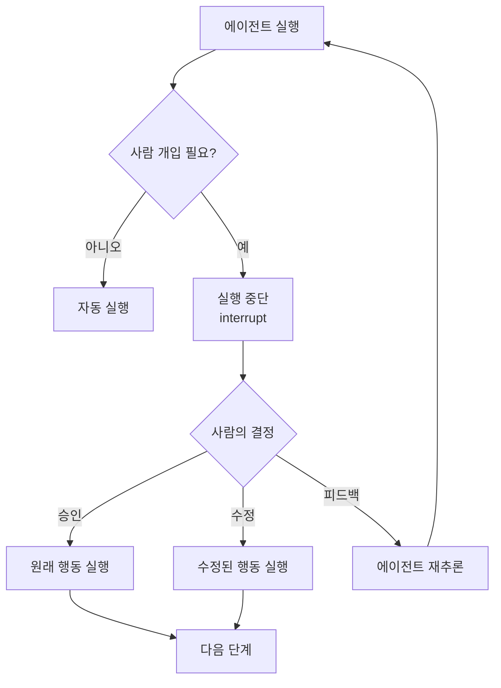
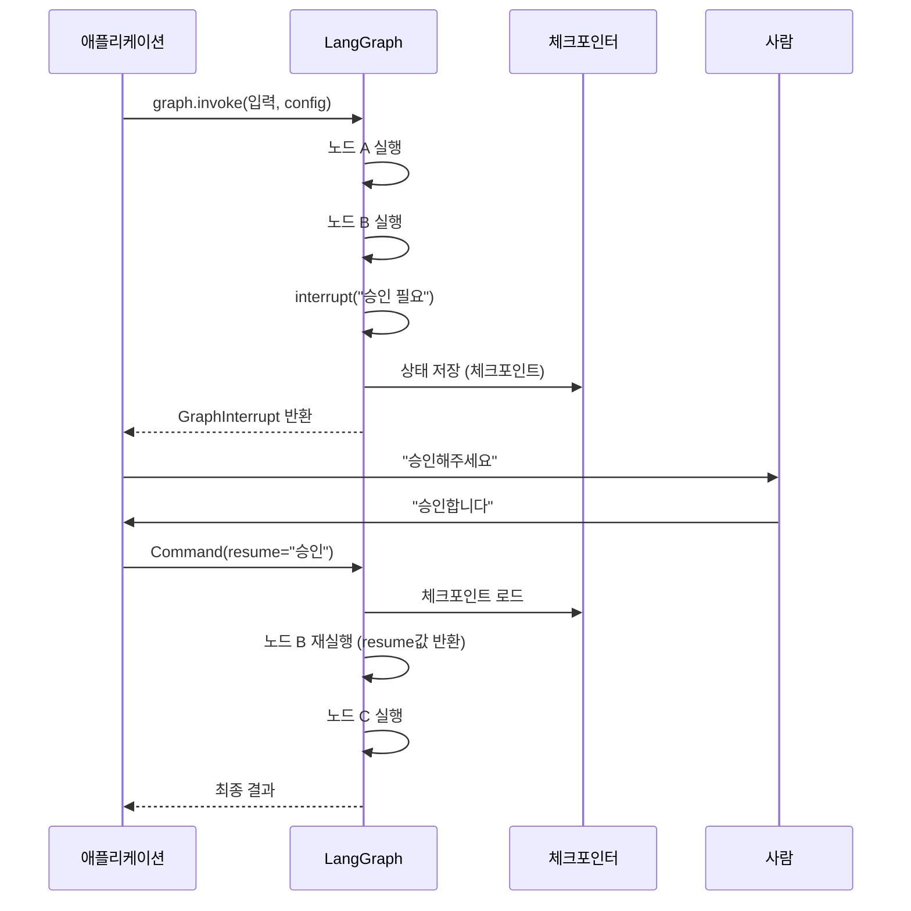
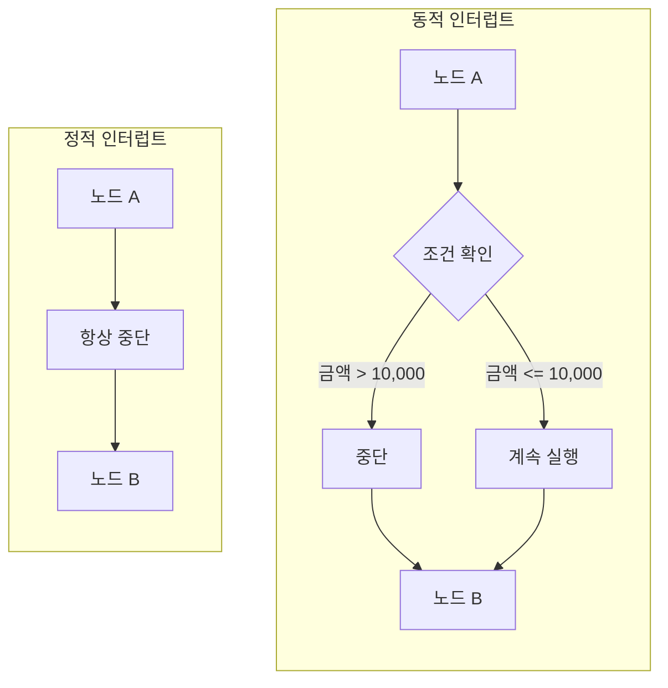
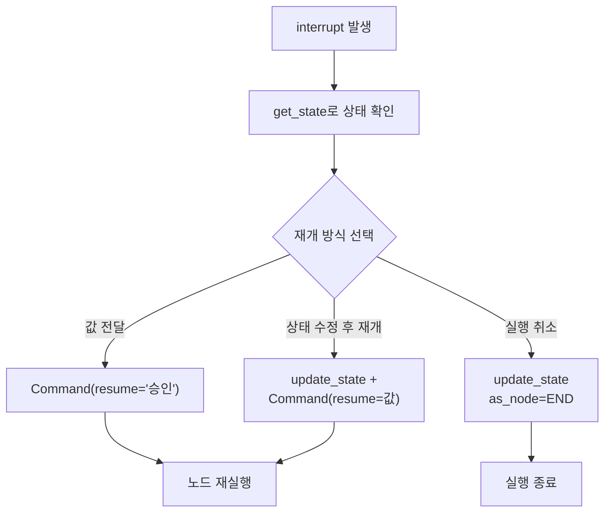

# Human-in-the-Loop 패턴 개관

> 에이전트가 스스로 모든 결정을 내리는 것이 위험할 때, 사람이 개입하는 방법을 설계합니다.

## 개요

이 섹션에서는 AI 에이전트 실행 과정에서 **사람이 개입할 수 있는 지점과 방식**을 체계적으로 학습합니다. 왜 완전 자율 에이전트가 위험할 수 있는지, 그리고 LangGraph의 `interrupt` 메커니즘이 이 문제를 어떻게 해결하는지 알아봅니다.

**선수 지식**:
- [체크포인트 시스템 이해](06-ch6-체크포인트와-영속적-실행/01-01-체크포인트-시스템-이해.md)에서 배운 체크포인트와 스레드 개념
- [노드와 엣지 구성](04-ch4-langgraph-stategraph-기초/03-03-노드와-엣지-구성.md)에서 배운 그래프 실행 흐름

**학습 목표**:
- Human-in-the-Loop(HITL)가 필요한 이유와 세 가지 핵심 패턴(승인, 수정, 피드백)을 설명할 수 있다
- LangGraph의 `interrupt`와 `Command(resume=...)` 메커니즘의 작동 원리를 이해한다
- 정적 인터럽트와 동적 인터럽트의 차이를 구분할 수 있다

## 왜 알아야 할까?

2023년 한 핀테크 스타트업에서 LLM 기반 고객 지원 에이전트가 환불 처리 도구를 자율적으로 호출하다가, 하루 만에 수천 건의 잘못된 환불을 실행한 사건이 있었습니다. 에이전트는 "고객 불만 → 환불"이라는 패턴을 과도하게 일반화한 것이죠. 만약 **고액 환불에 대해 사람의 승인을 요구하는 체크포인트**가 있었다면, 이 사고는 초기에 차단됐을 겁니다.

AI 에이전트가 점점 더 강력한 도구에 접근하면서, **"이 행동을 정말 실행해도 될까?"**라는 질문은 선택이 아니라 필수가 됐습니다. 데이터베이스 쿼리 실행, 이메일 발송, API 호출, 금융 거래 — 이런 행동은 되돌리기 어렵거든요.

Human-in-the-Loop는 에이전트의 자율성과 사람의 통제 사이에서 **최적의 균형점**을 찾는 설계 패턴입니다.

## 핵심 개념

### 개념 1: HITL의 세 가지 패턴 — 승인, 수정, 피드백

> 💡 **비유**: 회사에서 결재 시스템을 생각해보세요. 신입 사원(에이전트)이 보고서를 작성했을 때, 팀장은 세 가지 선택을 할 수 있습니다 — **"좋아, 이대로 보내"**(승인), **"여기 수치를 고쳐서 보내"**(수정), **"방향이 틀렸어, 다시 해봐"**(피드백). HITL도 정확히 같은 구조입니다.

AI 에이전트의 실행 과정에서 사람이 개입하는 방식은 크게 세 가지로 나뉩니다:

| 패턴 | 설명 | 사용 시점 |
|------|------|----------|
| **승인(Approve/Reject)** | 에이전트가 제안한 행동을 그대로 실행하거나 거부 | 위험한 도구 호출 전 (DB 삭제, 결제 등) |
| **수정(Edit)** | 에이전트의 행동 인자를 사람이 직접 수정 | 도구 호출 인자가 부정확할 때 |
| **피드백(Feedback)** | 에이전트에게 추가 정보나 방향을 제시 | 에이전트가 잘못된 방향으로 진행할 때 |

> 📊 **그림 1**: HITL의 세 가지 핵심 패턴



이 세 패턴은 상호 배타적이지 않습니다. 하나의 워크플로우에서 도구별로 다른 패턴을 적용할 수 있어요. 예를 들어, 읽기 전용 도구는 자동 승인, 쓰기 도구는 사람의 승인을 요구하는 식이죠.

### 개념 2: LangGraph의 interrupt 메커니즘

> 💡 **비유**: Python의 `input()` 함수를 떠올려보세요. 프로그램이 실행 중에 멈추고 사용자 입력을 기다리죠? LangGraph의 `interrupt`도 비슷합니다. 다만 `input()`은 터미널에서만 작동하고 프로세스가 종료되면 끝이지만, `interrupt`는 상태를 체크포인트에 저장하기 때문에 **몇 시간 후, 심지어 다른 서버에서도 재개**할 수 있습니다.

LangGraph는 `interrupt` 함수를 통해 그래프 실행을 일시 중지하고 사람의 입력을 기다립니다. 핵심 동작 흐름은 이렇습니다:

1. 노드 내에서 `interrupt("메시지")`를 호출
2. 현재 그래프 상태가 체크포인트에 저장됨
3. 스레드가 `interrupted` 상태로 표시됨
4. 사람이 검토 후 `Command(resume=값)`으로 재개
5. 중단된 노드가 **처음부터 다시 실행**되되, `interrupt`는 resume 값을 반환

> 📊 **그림 2**: interrupt와 Command(resume)의 실행 흐름



간단한 코드로 살펴보겠습니다:

```python
from langgraph.types import interrupt, Command
from langgraph.graph import StateGraph, START, END
from langgraph.checkpoint.memory import InMemorySaver
from typing import TypedDict

class State(TypedDict):
    query: str
    result: str

def analyze_node(state: State) -> dict:
    """분석을 수행하고 사람의 승인을 요청하는 노드"""
    analysis = f"'{state['query']}'에 대한 분석 완료"

    # 여기서 실행이 중단되고, 사람의 입력을 기다림
    decision = interrupt({
        "message": "이 분석 결과를 승인하시겠습니까?",
        "analysis": analysis
    })

    # resume 후 이 라인부터 이어서 실행
    if decision == "approve":
        return {"result": analysis}
    else:
        return {"result": "분석이 거부되었습니다"}

# 그래프 구성
builder = StateGraph(State)
builder.add_node("analyze", analyze_node)
builder.add_edge(START, "analyze")
builder.add_edge("analyze", END)

# 체크포인터 필수!
checkpointer = InMemorySaver()
graph = builder.compile(checkpointer=checkpointer)
```

> ⚠️ **흔한 오해**: `interrupt` 이후 코드가 "이어서" 실행된다고 생각하기 쉽지만, 실제로는 **노드 전체가 처음부터 다시 실행**됩니다. 다만 `interrupt` 호출 시점에서 이전에 저장된 resume 값이 반환되므로, 결과적으로는 이어서 실행되는 것처럼 보이는 거죠.

### 개념 3: 정적 인터럽트 vs 동적 인터럽트

LangGraph는 두 가지 인터럽트 방식을 제공합니다. 둘의 차이를 이해하는 것이 중요합니다.

**정적 인터럽트(Static Interrupt)**는 그래프 컴파일 시점에 설정합니다. 특정 노드 실행 전/후에 항상 중단됩니다:

```python
# 컴파일 시 interrupt_before 또는 interrupt_after 지정
graph = builder.compile(
    checkpointer=checkpointer,
    interrupt_before=["dangerous_tool_node"],  # 이 노드 실행 전 중단
    interrupt_after=["review_node"],           # 이 노드 실행 후 중단
)
```

**동적 인터럽트(Dynamic Interrupt)**는 노드 내부의 로직에 따라 조건부로 중단합니다:

```python
def process_order(state: State) -> dict:
    amount = state["order_amount"]

    # 조건에 따라 동적으로 중단
    if amount > 10000:
        approval = interrupt(f"고액 주문({amount}원) 승인이 필요합니다")
        if approval != "approve":
            return {"status": "rejected"}

    return {"status": "processed"}
```

> 📊 **그림 3**: 정적 인터럽트와 동적 인터럽트 비교



| 구분 | 정적 인터럽트 | 동적 인터럽트 |
|------|-------------|-------------|
| **설정 시점** | 컴파일 시 (`compile()`) | 런타임 (노드 내부) |
| **중단 조건** | 항상 (무조건) | 조건부 |
| **사용 함수** | `interrupt_before` / `interrupt_after` | `interrupt()` |
| **재개 방식** | `graph.invoke(None, config)` | `Command(resume=값)` |
| **유연성** | 낮음 | 높음 |
| **권장 용도** | 단순한 승인 게이트 | 복잡한 비즈니스 로직 |

LangGraph 공식 블로그에서도 동적 `interrupt`를 **권장 방식**으로 소개하고 있는데요, 정적 인터럽트는 중단 "시점"만 제어할 수 있는 반면, 동적 인터럽트는 중단 여부, 메시지, 재개 값까지 모두 세밀하게 제어할 수 있기 때문입니다.

### 개념 4: Command 클래스와 재개 패턴

`Command` 클래스는 LangGraph에서 그래프 실행을 제어하는 핵심 도구입니다. 단순히 resume 값을 전달하는 것 외에도, **상태 업데이트와 라우팅 지시**까지 결합할 수 있습니다.

> 📊 **그림 4**: Command를 통한 다양한 재개 패턴



```python
from langgraph.types import Command

config = {"configurable": {"thread_id": "order-123"}}

# 패턴 1: 단순 승인
graph.invoke(Command(resume="approve"), config)

# 패턴 2: 수정된 값으로 재개
graph.invoke(
    Command(resume={
        "type": "edit",
        "edited_action": {
            "name": "send_email",
            "args": {"to": "corrected@example.com"}  # 수정된 인자
        }
    }),
    config
)

# 패턴 3: 상태를 직접 수정한 뒤 재개
graph.update_state(config, {"order_amount": 5000})  # 상태 수정
graph.invoke(Command(resume="approve"), config)       # 재개

# 패턴 4: 실행 자체를 취소
graph.update_state(config, {"status": "cancelled"}, as_node="__end__")
```

> 🔥 **실무 팁**: `get_state()`로 현재 상태를 확인한 뒤 재개하는 습관을 들이세요. 특히 여러 시간이 지난 뒤 재개할 때는 상태가 의도한 것과 다를 수 있습니다.

```python
# 재개 전 상태 확인
snapshot = graph.get_state(config)
print(f"현재 상태: {snapshot.values}")
print(f"대기 중인 인터럽트: {snapshot.interrupts}")
print(f"다음 노드: {snapshot.next}")
```

## 실습: 직접 해보기

간단한 주문 처리 에이전트를 만들어봅시다. 일정 금액 이상의 주문은 사람의 승인을 요구하는 HITL 워크플로우입니다.

```python
"""Human-in-the-Loop 주문 처리 에이전트"""
from typing import TypedDict, Annotated
from langgraph.graph import StateGraph, START, END
from langgraph.checkpoint.memory import InMemorySaver
from langgraph.types import interrupt, Command

# --- 상태 정의 ---
class OrderState(TypedDict):
    order_id: str
    item: str
    amount: int
    status: str
    approval_note: str

# --- 노드 함수들 ---
def validate_order(state: OrderState) -> dict:
    """주문 유효성 검증"""
    item = state["item"]
    amount = state["amount"]
    print(f"[검증] 주문 '{item}' (금액: {amount:,}원) 검증 중...")

    if amount <= 0:
        return {"status": "invalid"}
    return {"status": "validated"}

def check_approval(state: OrderState) -> dict:
    """고액 주문에 대해 사람의 승인을 요청"""
    amount = state["amount"]

    if amount >= 50000:
        # 동적 인터럽트: 고액 주문만 사람에게 물어봄
        decision = interrupt({
            "message": f"고액 주문 승인이 필요합니다",
            "order_id": state["order_id"],
            "item": state["item"],
            "amount": f"{amount:,}원",
            "options": ["approve", "reject"]
        })
        return {
            "status": "approved" if decision == "approve" else "rejected",
            "approval_note": f"사람 결정: {decision}"
        }

    # 소액 주문은 자동 승인
    return {"status": "approved", "approval_note": "자동 승인 (5만원 미만)"}

def process_order(state: OrderState) -> dict:
    """주문 최종 처리"""
    if state["status"] == "approved":
        print(f"[처리] 주문 {state['order_id']} 처리 완료!")
        return {"status": "completed"}
    else:
        print(f"[거부] 주문 {state['order_id']} 거부됨")
        return {"status": "cancelled"}

# --- 라우팅 함수 ---
def route_after_validation(state: OrderState) -> str:
    if state["status"] == "invalid":
        return END
    return "check_approval"

# --- 그래프 구성 ---
builder = StateGraph(OrderState)
builder.add_node("validate", validate_order)
builder.add_node("check_approval", check_approval)
builder.add_node("process", process_order)

builder.add_edge(START, "validate")
builder.add_conditional_edges("validate", route_after_validation)
builder.add_edge("check_approval", "process")
builder.add_edge("process", END)

# 체크포인터 설정 (HITL 필수!)
memory = InMemorySaver()
graph = builder.compile(checkpointer=memory)
```

이제 이 그래프를 실행해봅시다:

```run:python
# --- 시나리오 1: 소액 주문 (자동 승인) ---
config_small = {"configurable": {"thread_id": "order-small-001"}}

result = graph.invoke(
    {"order_id": "ORD-001", "item": "USB 케이블", "amount": 15000, "status": "", "approval_note": ""},
    config_small
)
print(f"소액 주문 결과: {result['status']}")
print(f"승인 메모: {result['approval_note']}")
```

```output
[검증] 주문 'USB 케이블' (금액: 15,000원) 검증 중...
[처리] 주문 ORD-001 처리 완료!
소액 주문 결과: completed
승인 메모: 자동 승인 (5만원 미만)
```

```run:python
# --- 시나리오 2: 고액 주문 (사람 승인 필요) ---
config_large = {"configurable": {"thread_id": "order-large-001"}}

# 1단계: 실행 → interrupt 발생
result = graph.invoke(
    {"order_id": "ORD-002", "item": "노트북", "amount": 1500000, "status": "", "approval_note": ""},
    config_large
)
# interrupt가 발생하면 여기서 멈춤

# 현재 상태 확인
snapshot = graph.get_state(config_large)
print(f"다음 노드: {snapshot.next}")
print(f"인터럽트: {snapshot.interrupts[0].value}")
```

```output
[검증] 주문 '노트북' (금액: 1,500,000원) 검증 중...
다음 노드: ('check_approval',)
인터럽트: {'message': '고액 주문 승인이 필요합니다', 'order_id': 'ORD-002', 'item': '노트북', 'amount': '1,500,000원', 'options': ['approve', 'reject']}
```

```run:python
# 2단계: 사람이 승인 → 실행 재개
result = graph.invoke(Command(resume="approve"), config_large)
print(f"고액 주문 결과: {result['status']}")
print(f"승인 메모: {result['approval_note']}")
```

```output
[처리] 주문 ORD-002 처리 완료!
고액 주문 결과: completed
승인 메모: 사람 결정: approve
```

## 더 깊이 알아보기

### "사람이 끼어드는 자동화"의 역사

Human-in-the-Loop라는 개념은 AI 시대에 갑자기 등장한 것이 아닙니다. 1950-60년대 미국의 **반자동 지상 방공 시스템(SAGE)**이 최초의 대규모 HITL 시스템으로 꼽히는데요, 레이더가 탐지한 물체를 컴퓨터가 분석하되 최종 요격 명령은 반드시 사람이 내리는 구조였습니다. "기계는 빠르게 분석하고, 사람은 최종 판단을 내린다"는 원칙은 70년이 지난 지금도 동일합니다.

AI 에이전트 분야에서 HITL가 본격적으로 주목받기 시작한 것은 2023년 AutoGPT의 등장 이후입니다. AutoGPT는 완전 자율 에이전트를 표방했지만, 실제 운영에서 수많은 문제가 발생했죠. 잘못된 파일 삭제, 의도치 않은 API 호출, 무한 루프 등. 이런 경험을 통해 업계는 **"자율성에는 반드시 안전장치가 필요하다"**는 교훈을 얻었고, LangGraph는 이를 `interrupt` 메커니즘으로 프레임워크 차원에서 지원하게 됐습니다.

### interrupt의 설계 철학

LangGraph의 `interrupt`는 Python의 `input()` 함수에서 영감을 받았다고 공식 블로그에서 밝히고 있습니다. 다만 결정적 차이가 있는데, `input()`은 프로세스 메모리에 상태가 있어 프로세스가 죽으면 끝이지만, `interrupt`는 상태를 체크포인트(영속 저장소)에 저장합니다. 덕분에 **서버가 재시작되더라도, 심지어 다른 서버에서도** 동일한 thread_id로 실행을 재개할 수 있죠. 이것이 프로덕션 환경에서 HITL을 실현 가능하게 만든 핵심 설계입니다.

> 💡 **알고 계셨나요?**: LangGraph 초기 버전에서는 `interrupt_before`와 `interrupt_after`(정적 인터럽트)만 지원했습니다. 동적 `interrupt()` 함수는 2024년 말에 추가된 비교적 새로운 기능인데, 이 기능이 나온 후 HITL 워크플로우의 구현 복잡도가 크게 낮아졌습니다. LangGraph 공식 블로그에서도 새 프로젝트에는 동적 `interrupt`를 권장하고 있어요.

## 흔한 오해와 팁

> ⚠️ **흔한 오해**: "interrupt를 쓰면 에이전트 성능이 느려진다"고 생각하시는 분이 있는데, interrupt는 사람의 판단이 **필요한 지점에서만** 발동합니다. 전체 도구 호출의 5-10%만 승인이 필요한 경우, 나머지 90%는 자동으로 실행됩니다. 오히려 잘못된 행동을 사후에 복구하는 비용이 훨씬 큽니다.

> 🔥 **실무 팁**: 체크포인터 없이 `interrupt`를 호출하면 에러가 발생합니다. 프로덕션에서는 `InMemorySaver` 대신 `AsyncPostgresSaver`나 `SqliteSaver`를 사용하세요. 서버 재시작 시 `InMemorySaver`의 데이터는 사라지기 때문입니다.

> 💡 **알고 계셨나요?**: `interrupt`에 전달하는 값은 어떤 타입이든 가능합니다 — 문자열, 딕셔너리, 심지어 Pydantic 모델도요. 이 값은 체크포인트의 `__interrupt__` 채널에 저장되며, `get_state()`의 `interrupts` 속성으로 조회할 수 있습니다.

## 핵심 정리

| 개념 | 설명 |
|------|------|
| **HITL** | 에이전트 실행 중 사람의 승인·수정·피드백을 받는 워크플로우 패턴 |
| **승인 패턴** | 에이전트가 제안한 행동을 사람이 승인/거부 (approve/reject) |
| **수정 패턴** | 에이전트의 행동 인자를 사람이 직접 수정 후 실행 (edit) |
| **피드백 패턴** | 에이전트에게 추가 정보·방향을 제시하여 재추론 유도 |
| **interrupt()** | 노드 내부에서 실행을 중단하고 사람의 입력을 기다리는 함수 |
| **Command(resume=)** | 중단된 그래프에 사람의 결정을 전달하여 실행을 재개하는 클래스 |
| **정적 인터럽트** | `compile()` 시 설정, 노드 전/후에 항상 중단 |
| **동적 인터럽트** | 노드 내부 로직에 따라 조건부로 중단 (권장 방식) |
| **체크포인터** | interrupt 사용의 필수 요소. 중단 시 상태를 영속 저장 |

## 다음 섹션 미리보기

이번 섹션에서 HITL의 전체 그림과 `interrupt`의 기본 메커니즘을 이해했습니다. 다음 섹션 [도구 호출 승인 워크플로우](07-ch7-human-in-the-loop-워크플로우/02-02-도구-호출-승인-워크플로우.md)에서는 가장 많이 사용되는 HITL 패턴인 **도구 호출 전 사람의 승인을 요구하는 워크플로우**를 LangGraph의 `HumanInTheLoopMiddleware`를 활용해 본격적으로 구현합니다. 실제 도구(파일 쓰기, SQL 실행 등)에 대해 승인/수정/거부를 적용하는 실전 패턴을 다룰 예정이에요.

## 참고 자료

- [Human-in-the-loop — LangChain 공식 문서](https://docs.langchain.com/oss/python/langchain/human-in-the-loop) - HITL 미들웨어의 공식 가이드. 승인/수정/거부 패턴과 스트리밍 통합 방법을 상세히 설명합니다.
- [Making it easier to build human-in-the-loop agents with interrupt — LangChain 블로그](https://blog.langchain.com/making-it-easier-to-build-human-in-the-loop-agents-with-interrupt/) - `interrupt` 함수의 설계 철학과 `input()`과의 비교, 네 가지 HITL 패턴을 소개하는 공식 블로그 포스트입니다.
- [Human-in-the-Loop and Interrupts — DeepWiki](https://deepwiki.com/langchain-ai/langgraph/3.7-human-in-the-loop-and-interrupts) - LangGraph 소스 코드 기반으로 interrupt 내부 동작(Scratchpad, 체크포인트 채널, resume 매칭)을 심층 분석합니다.
- [How to Build Human-in-the-Loop Plan-and-Execute AI Agents — MarkTechPost](https://www.marktechpost.com/2026/02/16/how-to-build-human-in-the-loop-plan-and-execute-ai-agents-with-explicit-user-approval-using-langgraph-and-streamlit/) - LangGraph + Streamlit로 HITL 에이전트를 구축하는 2026년 최신 튜토리얼입니다.
- [ReAct: Synergizing Reasoning and Acting in Language Models](https://arxiv.org/abs/2210.03629) - 에이전트 루프의 기반이 된 ReAct 논문. HITL의 필요성을 이해하는 맥락에서 참고할 만합니다.

---
### 🔗 Related Sessions
- [checkpoint](06-ch6-체크포인트와-영속적-실행/01-01-체크포인트-시스템-이해.md) (prerequisite)
- [stategraph](04-ch4-langgraph-stategraph-기초/01-01-langgraph-아키텍처-개관.md) (prerequisite)
- [thread_id](06-ch6-체크포인트와-영속적-실행/01-01-체크포인트-시스템-이해.md) (prerequisite)
- [inmemorysaver](06-ch6-체크포인트와-영속적-실행/02-02-메모리-및-sqlite-체크포인터.md) (prerequisite)
