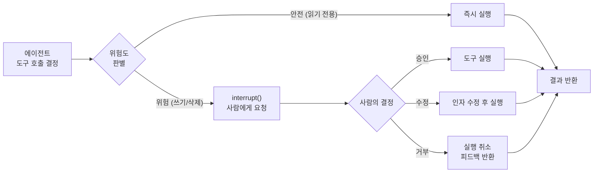
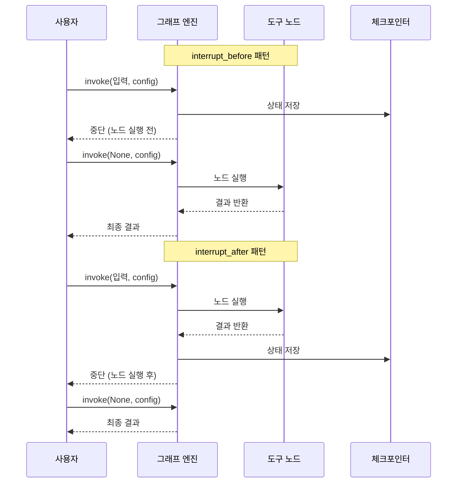
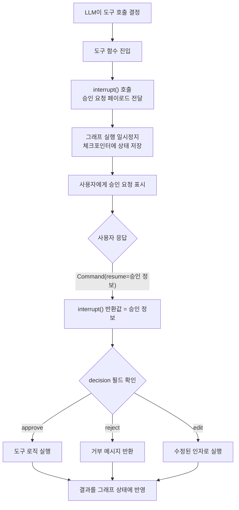
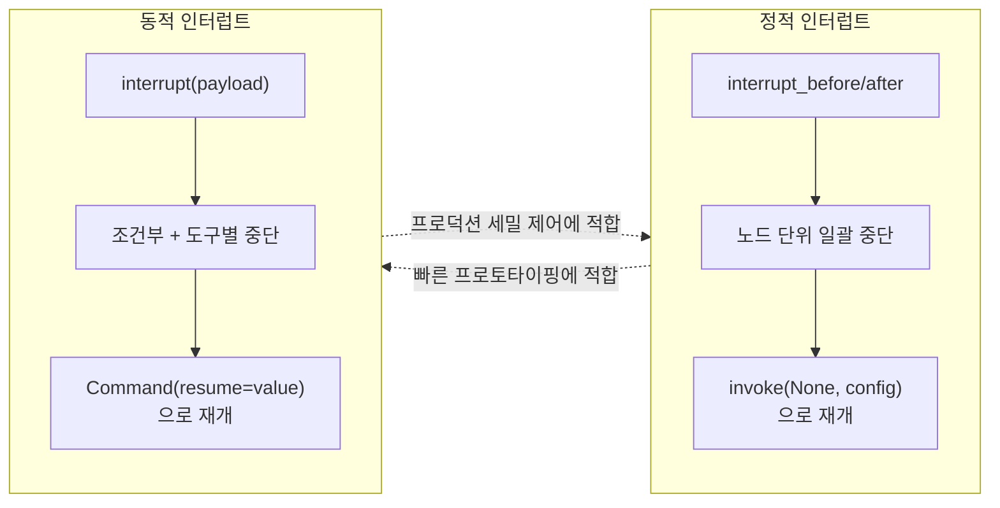
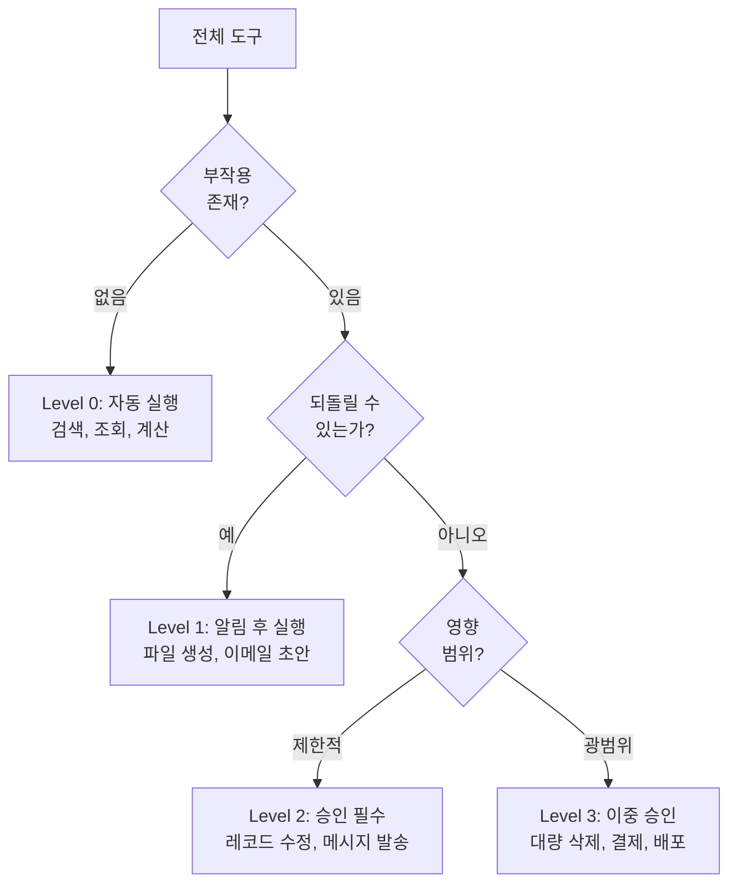

# 도구 호출 승인 워크플로우

> LangGraph의 interrupt를 활용하여 위험한 도구 호출 전 사람의 승인을 받는 워크플로우를 설계합니다

## 개요

이 섹션에서는 에이전트가 외부 도구를 호출하기 전에 사람의 승인을 받는 **도구 호출 승인 워크플로우**를 구축합니다. [이전 섹션](07-ch7-human-in-the-loop-워크플로우/01-01-human-in-the-loop-패턴-개관.md)에서 학습한 `interrupt()`와 `Command(resume=value)`를 이미 알고 있다는 전제 하에, 곧바로 **도구 승인 시나리오**에 적용합니다.

이 섹션의 고유한 초점은 두 가지입니다:
1. **`interrupt_before`/`interrupt_after`**(정적 인터럽트)를 정식으로 정의하고, 동적 인터럽트와 비교
2. **위험도 기반 도구 분류** — 도구별로 승인 수준을 달리하는 실전 설계 패턴

**선수 지식**:
- `interrupt()`와 `Command(resume=value)` 기본 메커니즘 (7.1에서 학습)
- 체크포인터를 활용한 상태 저장/복원 (Ch6)
- LangGraph 노드/엣지 구성 (Ch4)
- 도구 호출 기본 개념 (Ch1)

**학습 목표**:
- `interrupt_before`/`interrupt_after` 컴파일 옵션으로 정적 승인 포인트를 설정할 수 있다
- 도구 함수 내부에 `interrupt()`를 배치하여 동적 승인 로직을 구현할 수 있다
- 승인(approve)/수정(edit)/거부(reject) 세 가지 결정 패턴을 구현할 수 있다
- 위험도 기반으로 도구를 분류하고, 선택적 승인 워크플로우를 설계할 수 있다

## 왜 알아야 할까?

에이전트가 "이메일 보내기", "데이터베이스 레코드 삭제", "결제 실행" 같은 도구를 호출한다고 상상해 보세요. LLM이 잘못 판단해서 실수로 전체 고객 데이터를 삭제하거나, 엉뚱한 사람에게 이메일을 보내면 어떻게 될까요?

이건 단순한 가정이 아닙니다. 실제 프로덕션 환경에서 에이전트는 **환각(hallucination)**에 의해 의도치 않은 도구 호출을 할 수 있고, 그 결과가 되돌릴 수 없는 경우가 많습니다. 금융 거래, 인프라 변경, 외부 API 호출 같은 **부작용(side effect)**이 있는 작업은 반드시 사람의 눈을 거쳐야 합니다.

7.1에서 배운 기본 메커니즘을 **도구별 위험도에 따라 선택적으로 적용**하는 것이 이 섹션의 핵심입니다. 마치 회사의 결재 시스템처럼 — 일상적인 업무는 자동 처리하되, 중요한 결정만 상급자에게 올리는 거죠.

> 📊 **그림 1**: 도구 위험도에 따른 승인 흐름



## 핵심 개념

### 개념 1: 정적 승인 — interrupt_before / interrupt_after

> 💡 **비유**: `interrupt_before`는 공항 보안 검색대와 비슷합니다. 탑승구(노드)에 도착하기 **전에** 반드시 검문을 통과해야 하죠. `interrupt_after`는 세관 검사처럼, 입국(노드 실행) **후에** 짐을 검사하는 겁니다. 어디에 검문소를 둘지는 미리 정해놓는 거예요.

7.1에서 다룬 `interrupt()`가 코드 내부에서 호출하는 **동적** 방식이었다면, LangGraph는 그래프를 **컴파일할 때** 노드 전후에 자동으로 멈추는 **정적** 방식도 제공합니다. 코드를 변경하지 않고도, 특정 노드에 "게이트"를 설치할 수 있어요.

| 구분 | `interrupt_before` | `interrupt_after` |
|------|-------------------|-------------------|
| 중단 시점 | 노드 실행 **전** | 노드 실행 **후** |
| 용도 | 실행 전 승인/검토 | 실행 결과 검토 후 계속 여부 결정 |
| 재개 방식 | `graph.invoke(None, config)` | `graph.invoke(None, config)` |
| 상태 저장 | 노드 진입 전 상태 | 노드 완료 후 상태 |

> 📊 **그림 2**: interrupt_before vs interrupt_after 동작 비교



**컴파일 시 설정:**

```python
from langgraph.graph import StateGraph
from langgraph.checkpoint.memory import InMemorySaver

# 그래프 빌더 구성 후 컴파일 시 정적 인터럽트 설정
graph = builder.compile(
    checkpointer=InMemorySaver(),
    interrupt_before=["execute_tool"],   # 도구 실행 노드 전에 멈춤
    interrupt_after=["generate_plan"],   # 계획 생성 노드 후에 멈춤
)
```

**런타임 설정:**

```python
# 컴파일 시가 아닌, 실행 시에도 동적으로 지정 가능
config = {"configurable": {"thread_id": "approval-thread-1"}}

graph.invoke(
    {"messages": [HumanMessage(content="오래된 로그 삭제해줘")]},
    config=config,
    interrupt_before=["execute_tool"],  # 런타임에 지정
)
```

정적 승인은 구현이 단순하지만, **모든** 도구 호출에 동일한 규칙이 적용됩니다. "읽기 전용 도구는 자동 실행, 쓰기 도구만 승인"처럼 세밀한 제어가 필요하다면 동적 승인이 필요하죠.

> ⚠️ **흔한 오해**: 정적 인터럽트(`interrupt_before`/`interrupt_after`)의 재개 방식은 `graph.invoke(None, config)`입니다 — 입력을 `None`으로 전달해 "중단된 지점부터 계속"이라고 알리는 거예요. 7.1에서 배운 `Command(resume=value)`는 동적 `interrupt()` 전용이므로 혼동하지 마세요.

### 개념 2: 동적 승인 — 도구 내부에서 조건부로 멈추기

> 💡 **비유**: 정적 승인이 "모든 차량 검문"이라면, 동적 승인은 **AI 카메라가 위험 차량만 잡아내는** 스마트 검문소입니다. 도구 함수 내부에서 조건에 따라 승인을 요구하니까, 안전한 작업은 빠르게 통과하고 위험한 작업만 멈추는 거죠.

7.1에서 배운 `interrupt()`를 도구 함수 안에 직접 배치하면, 해당 도구가 호출될 때 사람의 승인을 요청할 수 있습니다. 여기서는 기본 원리 대신 **도구 승인에 특화된 설계 패턴**에 집중합니다.

> 📊 **그림 3**: 도구 내부 interrupt() 동작 흐름



**페이로드 설계가 핵심입니다.** `interrupt()`에 전달하는 정보가 풍부할수록, 사람이 더 정확한 판단을 내릴 수 있어요. 어떤 도구를, 어떤 인자로, 어떤 영향이 예상되는지를 명확히 담아야 합니다.

```python
from langchain_core.tools import tool
from langgraph.types import interrupt

@tool
def delete_records(table: str, condition: str) -> str:
    """데이터베이스 레코드를 삭제합니다."""
    # 풍부한 페이로드로 승인 요청
    response = interrupt({
        "action": "delete_records",
        "table": table,
        "condition": condition,
        "message": f"'{table}' 테이블에서 '{condition}' 조건의 레코드를 삭제합니다. 승인하시겠습니까?"
    })

    if response.get("decision") == "approve":
        return f"'{table}'에서 조건 '{condition}'에 해당하는 레코드를 삭제했습니다."
    elif response.get("decision") == "edit":
        new_condition = response.get("new_condition", condition)
        return f"'{table}'에서 수정된 조건 '{new_condition}'으로 삭제했습니다."
    else:
        return f"사용자가 삭제를 거부했습니다: {response.get('reason', '사유 없음')}"
```

> 📊 **그림 4**: 정적 vs 동적 인터럽트 — 선택 기준



### 개념 3: 세 가지 결정 — 승인, 수정, 거부

> 💡 **비유**: 출판사 편집자가 원고를 검토할 때 세 가지 결정을 내립니다 — "이대로 출판"(승인), "이 부분 수정 후 출판"(수정), "출판 불가"(거부). 도구 호출 승인도 정확히 같은 세 가지 경로를 제공합니다.

동적 인터럽트에서 `Command(resume=value)`로 재개할 때, value에 담는 결정 정보는 세 가지 타입으로 나뉩니다:

| 결정 | 설명 | `Command(resume=value)` 예시 |
|------|------|-------------------------------|
| **승인(Approve)** | 도구 호출을 그대로 실행 | `Command(resume={"decision": "approve"})` |
| **수정(Edit)** | 인자를 변경한 뒤 실행 | `Command(resume={"decision": "edit", "args": {...}})` |
| **거부(Reject)** | 실행을 취소하고 피드백 제공 | `Command(resume={"decision": "reject", "reason": "..."})` |

```python
from langgraph.types import Command

config = {"configurable": {"thread_id": "thread-1"}}

# 1단계: 에이전트 실행 → 도구 호출 시 interrupt
result = graph.invoke(
    {"messages": [HumanMessage(content="고객 DB에서 비활성 사용자 삭제해줘")]},
    config=config,
)

# 2단계: 사람이 결정 후 Command(resume=value)로 재개
# 승인 — 그대로 실행
graph.invoke(Command(resume={"decision": "approve"}), config=config)

# 수정 — 조건 변경
graph.invoke(Command(resume={
    "decision": "edit",
    "new_condition": "last_login < '2024-01-01' AND status = 'inactive'"
}), config=config)

# 거부 — 실행 취소
graph.invoke(Command(resume={
    "decision": "reject",
    "reason": "비활성 사용자 정의를 먼저 확인해야 합니다"
}), config=config)
```

> 🔥 **실무 팁**: 수정(edit) 결정을 남발하면 LLM이 혼란스러워할 수 있습니다. 공식 문서에서도 "대폭 수정하면 모델이 접근 방식을 재평가하여 도구를 여러 번 실행할 수 있다"고 경고하거든요. 사소한 오타 수정 정도만 edit으로 처리하고, 근본적인 변경은 reject 후 새 지시를 내리는 것이 안전합니다.

### 개념 4: 위험도 기반 도구 분류

> 💡 **비유**: 공항 보안에서 액체류는 검사하지만, 옷이나 책은 그냥 통과하죠. 마찬가지로 도구도 위험도에 따라 "자동 통과"와 "검사 필수"로 나누면 사용성과 안전성을 동시에 챙길 수 있습니다.

실전에서는 모든 도구에 승인을 요구하면 사용자가 피곤해집니다. **읽기 전용** 도구는 자동 실행하고, **부작용이 있는** 도구만 승인을 요구하는 것이 효과적이에요.

> 📊 **그림 5**: 위험도 기반 도구 분류 체계



```python
from enum import IntEnum
from typing import Any

class RiskLevel(IntEnum):
    """도구 위험도 등급"""
    AUTO = 0       # 자동 실행 (읽기 전용)
    NOTIFY = 1     # 알림 후 실행 (되돌릴 수 있는 쓰기)
    APPROVE = 2    # 승인 필수 (되돌리기 어려운 작업)
    CRITICAL = 3   # 이중 승인 (고위험 작업)

# 도구별 위험도 매핑
TOOL_RISK_MAP: dict[str, RiskLevel] = {
    "search_documents": RiskLevel.AUTO,
    "get_user_info": RiskLevel.AUTO,
    "create_draft": RiskLevel.NOTIFY,
    "send_email": RiskLevel.APPROVE,
    "delete_records": RiskLevel.CRITICAL,
    "execute_payment": RiskLevel.CRITICAL,
}

def check_tool_approval(tool_name: str, tool_args: dict[str, Any]) -> dict | None:
    """도구 위험도에 따라 승인 요청 여부를 결정합니다."""
    risk = TOOL_RISK_MAP.get(tool_name, RiskLevel.APPROVE)

    if risk == RiskLevel.AUTO:
        return None  # 승인 불필요

    if risk >= RiskLevel.APPROVE:
        # interrupt로 사람에게 승인 요청
        return interrupt({
            "tool": tool_name,
            "args": tool_args,
            "risk_level": risk.name,
            "message": f"[{risk.name}] '{tool_name}' 실행을 승인하시겠습니까?",
        })

    return None  # NOTIFY 레벨은 로깅만
```

이 패턴을 도구 실행 노드에 통합하면, 위험도가 낮은 작업은 빠르게 처리하고 위험한 작업만 사람의 확인을 거치는 스마트한 워크플로우가 완성됩니다.

## 실습: 직접 해보기

고객 지원 에이전트를 구축합니다. 이 에이전트는 고객 정보를 **조회**하는 것은 자동으로 처리하지만, 정보를 **수정**하거나 **이메일을 발송**하는 작업은 반드시 사람의 승인을 받습니다.

```python
"""도구 호출 승인 워크플로우 — 고객 지원 에이전트 실습"""

from typing import Annotated, Any
from typing_extensions import TypedDict

from langchain_core.messages import HumanMessage, AIMessage, ToolMessage
from langchain_core.tools import tool
from langchain_openai import ChatOpenAI
from langgraph.graph import StateGraph, START, END
from langgraph.graph.message import add_messages
from langgraph.checkpoint.memory import InMemorySaver
from langgraph.prebuilt import ToolNode
from langgraph.types import interrupt, Command


# ── 상태 정의 ──────────────────────────────────────
class State(TypedDict):
    messages: Annotated[list, add_messages]


# ── 모의 데이터베이스 ──────────────────────────────
CUSTOMER_DB: dict[str, dict[str, Any]] = {
    "C001": {"name": "김민수", "email": "minsu@example.com", "plan": "basic"},
    "C002": {"name": "이서연", "email": "seoyeon@example.com", "plan": "premium"},
}


# ── 도구 정의 ──────────────────────────────────────
@tool
def lookup_customer(customer_id: str) -> str:
    """고객 정보를 조회합니다. (안전 — 자동 실행)"""
    customer = CUSTOMER_DB.get(customer_id)
    if not customer:
        return f"고객 ID '{customer_id}'를 찾을 수 없습니다."
    return f"고객 정보: 이름={customer['name']}, 이메일={customer['email']}, 플랜={customer['plan']}"


@tool
def update_customer_plan(customer_id: str, new_plan: str) -> str:
    """고객의 플랜을 변경합니다. (위험 — 승인 필요)"""
    customer = CUSTOMER_DB.get(customer_id)
    if not customer:
        return f"고객 ID '{customer_id}'를 찾을 수 없습니다."

    old_plan = customer["plan"]

    # 승인 요청 — 변경 내용을 사람에게 보여줌
    response = interrupt({
        "tool": "update_customer_plan",
        "customer_id": customer_id,
        "customer_name": customer["name"],
        "old_plan": old_plan,
        "new_plan": new_plan,
        "message": f"'{customer['name']}'님의 플랜을 '{old_plan}' → '{new_plan}'으로 변경합니다. 승인하시겠습니까?",
    })

    # Command(resume=value)에서 전달된 value가 response
    if response.get("decision") == "approve":
        CUSTOMER_DB[customer_id]["plan"] = new_plan
        return f"'{customer['name']}'님의 플랜을 '{old_plan}'에서 '{new_plan}'으로 변경했습니다."
    elif response.get("decision") == "edit":
        edited_plan = response.get("new_plan", new_plan)
        CUSTOMER_DB[customer_id]["plan"] = edited_plan
        return f"'{customer['name']}'님의 플랜을 '{old_plan}'에서 '{edited_plan}'으로 변경했습니다."
    else:
        reason = response.get("reason", "사유 미제공")
        return f"플랜 변경이 거부되었습니다. 사유: {reason}"


@tool
def send_notification(customer_id: str, subject: str, body: str) -> str:
    """고객에게 알림 이메일을 발송합니다. (위험 — 승인 필요)"""
    customer = CUSTOMER_DB.get(customer_id)
    if not customer:
        return f"고객 ID '{customer_id}'를 찾을 수 없습니다."

    # 승인 요청 — 이메일 내용을 사람에게 보여줌
    response = interrupt({
        "tool": "send_notification",
        "to": customer["email"],
        "subject": subject,
        "body": body,
        "message": f"'{customer['name']}'({customer['email']})에게 이메일을 보냅니다. 승인하시겠습니까?",
    })

    if response.get("decision") == "approve":
        return f"'{customer['name']}'({customer['email']})에게 '{subject}' 이메일을 발송했습니다."
    elif response.get("decision") == "edit":
        edited_subject = response.get("subject", subject)
        edited_body = response.get("body", body)
        return f"수정된 내용으로 '{customer['name']}'에게 '{edited_subject}' 이메일을 발송했습니다."
    else:
        return f"이메일 발송이 거부되었습니다."


# ── 도구 목록 & LLM 바인딩 ──────────────────────────
tools = [lookup_customer, update_customer_plan, send_notification]
llm = ChatOpenAI(model="gpt-4o-mini").bind_tools(tools)


# ── 노드 정의 ──────────────────────────────────────
def call_model(state: State) -> dict:
    """LLM을 호출하여 응답 또는 도구 호출을 생성합니다."""
    response = llm.invoke(state["messages"])
    return {"messages": [response]}


def should_continue(state: State) -> str:
    """마지막 메시지에 도구 호출이 있으면 도구 노드로, 없으면 종료."""
    last = state["messages"][-1]
    if hasattr(last, "tool_calls") and last.tool_calls:
        return "tools"
    return END


# ── 그래프 구성 ────────────────────────────────────
builder = StateGraph(State)
builder.add_node("agent", call_model)
builder.add_node("tools", ToolNode(tools))

builder.add_edge(START, "agent")
builder.add_conditional_edges("agent", should_continue, {"tools": "tools", END: END})
builder.add_edge("tools", "agent")

# 체크포인터 필수 — interrupt()가 상태를 저장/복원함
checkpointer = InMemorySaver()
graph = builder.compile(checkpointer=checkpointer)


# ── 실행 ───────────────────────────────────────────
config = {"configurable": {"thread_id": "support-session-1"}}

# 1단계: 안전한 조회 요청 → 자동 실행
print("=== 1단계: 고객 조회 (자동 실행) ===")
result = graph.invoke(
    {"messages": [HumanMessage(content="고객 C001의 정보를 알려줘")]},
    config=config,
)
print(result["messages"][-1].content)

# 2단계: 위험한 플랜 변경 요청 → interrupt 발생
print("\n=== 2단계: 플랜 변경 (승인 필요) ===")
config2 = {"configurable": {"thread_id": "support-session-2"}}
result = graph.invoke(
    {"messages": [HumanMessage(content="고객 C001의 플랜을 premium으로 업그레이드해줘")]},
    config=config2,
)

# interrupt 발생 시 상태 확인
snapshot = graph.get_state(config2)
if snapshot.tasks:
    for task in snapshot.tasks:
        if hasattr(task, "interrupts"):
            for intr in task.interrupts:
                print(f"승인 요청: {intr.value}")

# 3단계: Command(resume=value)로 승인하고 재개
print("\n=== 3단계: 승인 후 재개 ===")
result = graph.invoke(
    Command(resume={"decision": "approve"}),
    config=config2,
)
print(result["messages"][-1].content)
```

```run:python
# 시뮬레이션: 승인 워크플로우의 핵심 동작 확인
from enum import IntEnum

class RiskLevel(IntEnum):
    AUTO = 0
    NOTIFY = 1
    APPROVE = 2
    CRITICAL = 3

TOOL_RISK_MAP = {
    "lookup_customer": RiskLevel.AUTO,
    "update_customer_plan": RiskLevel.APPROVE,
    "send_notification": RiskLevel.APPROVE,
    "delete_records": RiskLevel.CRITICAL,
}

# 도구 호출 시 승인 필요 여부 판단
for tool_name, risk in TOOL_RISK_MAP.items():
    needs_approval = risk >= RiskLevel.APPROVE
    print(f"{tool_name:30s} → 위험도: {risk.name:10s} → 승인 필요: {needs_approval}")
```

```output
lookup_customer                → 위험도: AUTO       → 승인 필요: False
update_customer_plan           → 위험도: APPROVE    → 승인 필요: True
send_notification              → 위험도: APPROVE    → 승인 필요: True
delete_records                 → 위험도: CRITICAL   → 승인 필요: True
```

```run:python
# interrupt/Command 시뮬레이션: 세 가지 결정 경로
decisions = [
    {"decision": "approve"},
    {"decision": "edit", "new_plan": "enterprise"},
    {"decision": "reject", "reason": "상위 관리자 승인 필요"},
]

for i, response in enumerate(decisions, 1):
    decision = response["decision"]
    if decision == "approve":
        result = "도구 호출을 그대로 실행합니다."
    elif decision == "edit":
        result = f"수정된 인자로 실행합니다: {response.get('new_plan', 'N/A')}"
    else:
        result = f"실행이 거부되었습니다. 사유: {response.get('reason', 'N/A')}"
    print(f"결정 {i}: [{decision.upper():7s}] → {result}")
```

```output
결정 1: [APPROVE] → 도구 호출을 그대로 실행합니다.
결정 2: [EDIT   ] → 수정된 인자로 실행합니다: enterprise
결정 3: [REJECT ] → 실행이 거부되었습니다. 사유: 상위 관리자 승인 필요
```

## 더 깊이 알아보기

### interrupt_before의 기원: 디버거에서 에이전트로

`interrupt_before`와 `interrupt_after`의 개념은 사실 새로운 것이 아닙니다. 소프트웨어 디버거의 **브레이크포인트(breakpoint)**에서 직접 영감을 받았어요. GDB나 VS Code 디버거에서 특정 줄에 브레이크포인트를 걸면, 프로그램이 그 줄 **직전**에 멈추고 개발자가 변수를 확인하거나 수정한 뒤 계속 실행할 수 있죠.

LangGraph 팀은 이 친숙한 패턴을 AI 에이전트에 적용했습니다. 초기 버전(2024년 초)에서는 `interrupt_before`/`interrupt_after`만 지원했는데, 이게 디버거의 "줄 단위 브레이크포인트"와 같았습니다. 하지만 실제 프로덕션에서는 "이 도구는 자동, 저 도구는 승인"처럼 **조건부** 중단이 필요했고, 그래서 2024년 후반에 `interrupt()` 함수가 도입되었습니다. 이건 디버거의 **조건부 브레이크포인트**(`break if x > 100`)에 해당하는 거죠.

재미있는 것은, `interrupt()`가 내부적으로 예외(exception)를 던져서 그래프 실행을 멈춘다는 점입니다. Python의 `StopIteration`이나 `GeneratorExit`처럼, 제어 흐름용 예외를 활용하는 패턴인데요 — 그래서 공식 문서에서 "절대로 `interrupt()`를 `try/except`로 감싸지 말라"고 강조하는 겁니다. 일반 예외 핸들러가 인터럽트 예외까지 잡아버리면, 그래프가 멈추지 못하고 엉뚱한 동작을 하거든요.

> 💡 **알고 계셨나요?**: LangGraph의 체크포인터는 Google의 Pregel 논문(2010)에서 영감을 받았습니다. 대규모 그래프 연산에서 각 "슈퍼스텝" 사이에 상태를 저장하는 개념이, 에이전트의 "각 노드 실행 사이에 상태를 저장"하는 인터럽트 시스템으로 발전한 거예요. [LangGraph 아키텍처 개관](04-ch4-langgraph-stategraph-기초/01-01-langgraph-아키텍처-개관.md)에서 Pregel 모델을 더 자세히 다뤘습니다.

## 흔한 오해와 팁

> ⚠️ **흔한 오해**: "interrupt_before와 interrupt()는 같은 것이다" — 아닙니다! `interrupt_before`는 **노드 단위**로 작동하여 해당 노드 실행 전에 무조건 멈추는 **정적** 방식입니다. 반면 `interrupt()`는 **코드 내 아무 위치**에서 호출할 수 있는 **동적** 방식으로, 조건에 따라 멈출지 말지를 결정할 수 있습니다. 재개 방식도 다릅니다 — 정적은 `invoke(None, config)`, 동적은 `Command(resume=value)`.

> 💡 **알고 계셨나요?**: `interrupt()` 앞의 코드는 재개 시 다시 실행됩니다. 노드가 재개될 때 처음부터 다시 시작하고, `interrupt()` 지점에서 저장된 resume 값을 반환하거든요. 따라서 `interrupt()` 앞에 API 호출이나 DB 쓰기가 있다면 반드시 **멱등성(idempotent)**을 보장해야 해요 — `INSERT` 대신 `UPSERT`, `create` 대신 `create_or_update`를 쓰세요.

> 🔥 **실무 팁**: 프로덕션에서는 `InMemorySaver` 대신 `AsyncPostgresSaver`나 `SqliteSaver`를 사용하세요. 서버가 재시작되어도 중단된 승인 요청의 상태가 유지됩니다. 또한 승인 대기 시간에 **타임아웃**을 구현하는 것도 중요합니다 — 3일 동안 아무도 승인하지 않은 요청은 자동으로 만료시키는 로직을 별도로 관리하세요.

> 🔥 **실무 팁**: `interrupt()`의 페이로드는 반드시 **JSON 직렬화 가능**해야 합니다. 함수 객체, 클래스 인스턴스, datetime 같은 타입은 직렬화 오류를 발생시킵니다. `str`, `int`, `float`, `bool`, `list`, `dict`, `None`만 사용하세요.

## 핵심 정리

| 개념 | 설명 |
|------|------|
| `interrupt_before` | 컴파일/런타임에 지정하는 정적 중단점. 노드 실행 **전**에 멈춤 |
| `interrupt_after` | 노드 실행 **후**에 멈추는 정적 중단점. 실행 결과 검토 후 계속 여부 결정 |
| 정적 vs 동적 | 정적은 노드 단위 일괄, 동적은 코드 내 조건부. 재개 방식도 다름 |
| 승인/수정/거부 | 세 가지 결정 타입. resume value의 `decision` 필드로 전달 |
| 위험도 분류 | AUTO(자동) → NOTIFY(알림) → APPROVE(승인) → CRITICAL(이중 승인) |
| 페이로드 설계 | interrupt()에 도구명, 인자, 예상 영향을 포함해 판단 근거 제공 |
| 멱등성 | `interrupt()` 앞의 코드는 재개 시 재실행되므로 부작용이 없어야 함 |
| 체크포인터 필수 | `interrupt` 사용 시 `InMemorySaver` 등 체크포인터가 반드시 필요 |

## 다음 섹션 미리보기

이번 섹션에서는 도구 호출 **전**에 승인을 받는 패턴을 구축했습니다. 다음 [상태 수정과 피드백 주입](07-ch7-human-in-the-loop-워크플로우/03-03-상태-수정과-피드백-주입.md)에서는 에이전트가 이미 생성한 **상태를 사람이 직접 수정**하는 패턴을 다룹니다. `graph.update_state()`를 사용하여 에이전트의 메시지 히스토리, 중간 결과, 계획을 사람이 편집하는 방법을 배우게 됩니다 — 승인/거부를 넘어서, 에이전트의 "생각"을 직접 바꾸는 더 강력한 개입 방식입니다.

## 참고 자료

- [LangGraph Interrupts 공식 문서](https://docs.langchain.com/oss/python/langgraph/interrupts) - interrupt(), Command(resume=), interrupt_before/after의 전체 API와 예제를 다루는 공식 레퍼런스
- [Human-in-the-Loop 공식 가이드](https://docs.langchain.com/oss/python/langchain/human-in-the-loop) - HumanInTheLoopMiddleware와 승인/수정/거부 결정 패턴의 공식 문서
- [LangGraph 201: Adding Human Oversight to Your Deep Research Agent](https://towardsdatascience.com/langgraph-201-adding-human-oversight-to-your-deep-research-agent/) - 실제 딥리서치 에이전트에 HITL을 적용하는 실전 가이드
- [Interrupts and Commands in LangGraph (DEV Community)](https://dev.to/jamesbmour/interrupts-and-commands-in-langgraph-building-human-in-the-loop-workflows-4ngl) - interrupt/Command 패턴을 단계별로 설명하는 튜토리얼
- [LangGraph GitHub Repository](https://github.com/langchain-ai/langgraph) - LangGraph 소스 코드와 예제

---
### 🔗 Related Sessions
- [stategraph](04-ch4-langgraph-stategraph-기초/01-01-langgraph-아키텍처-개관.md) (prerequisite)
- [interrupt](07-ch7-human-in-the-loop-워크플로우/01-01-human-in-the-loop-패턴-개관.md) (prerequisite)
- [command](07-ch7-human-in-the-loop-워크플로우/01-01-human-in-the-loop-패턴-개관.md) (prerequisite)
- [toolnode](04-ch4-langgraph-stategraph-기초/05-05-첫-번째-langgraph-에이전트.md) (prerequisite)
- [add_messages](03-ch3-대화-메모리와-상태-관리/01-01-대화-메모리의-기초.md) (prerequisite)
