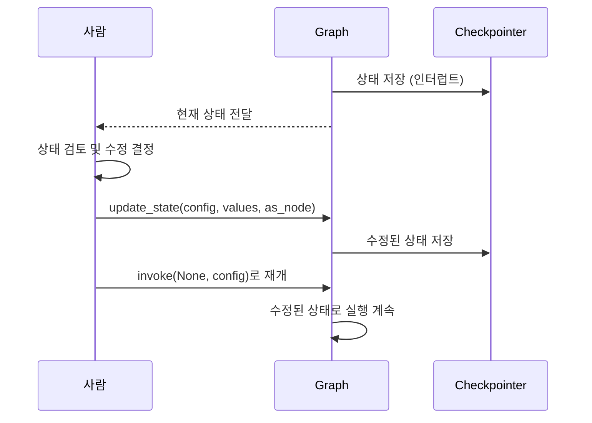
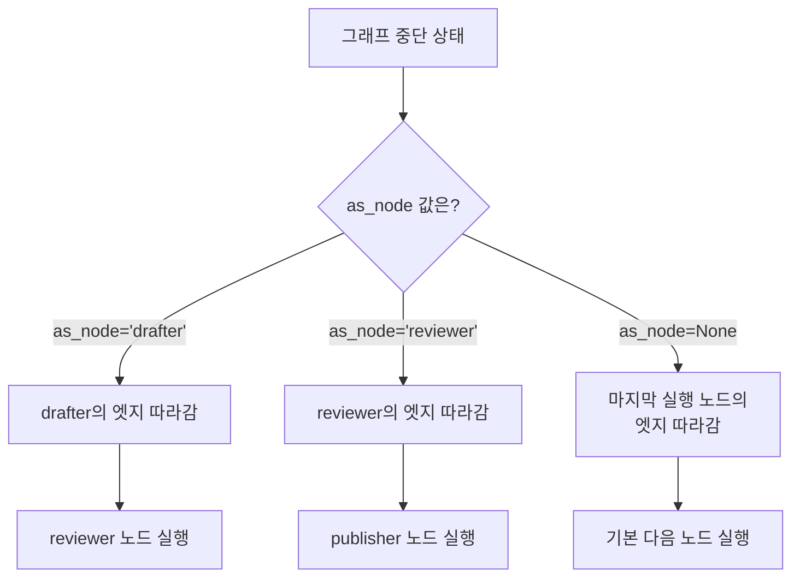
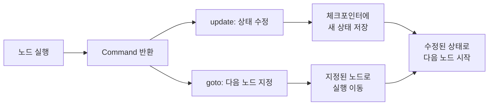
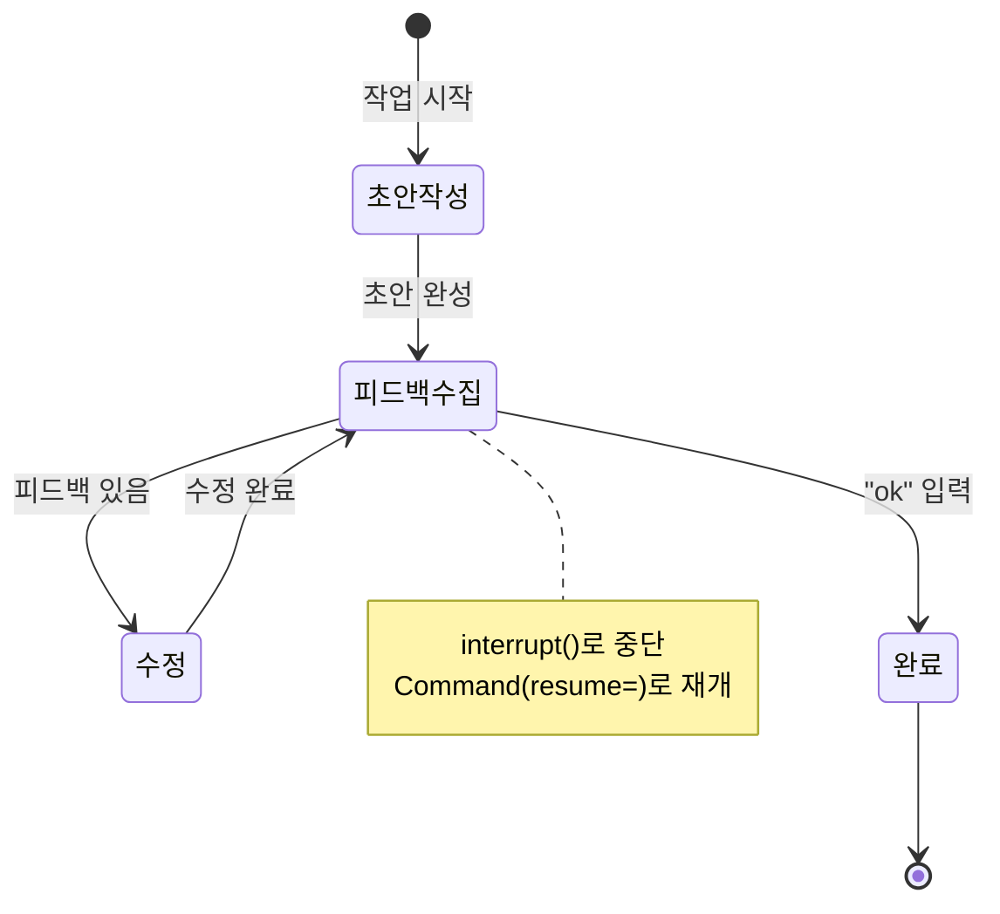
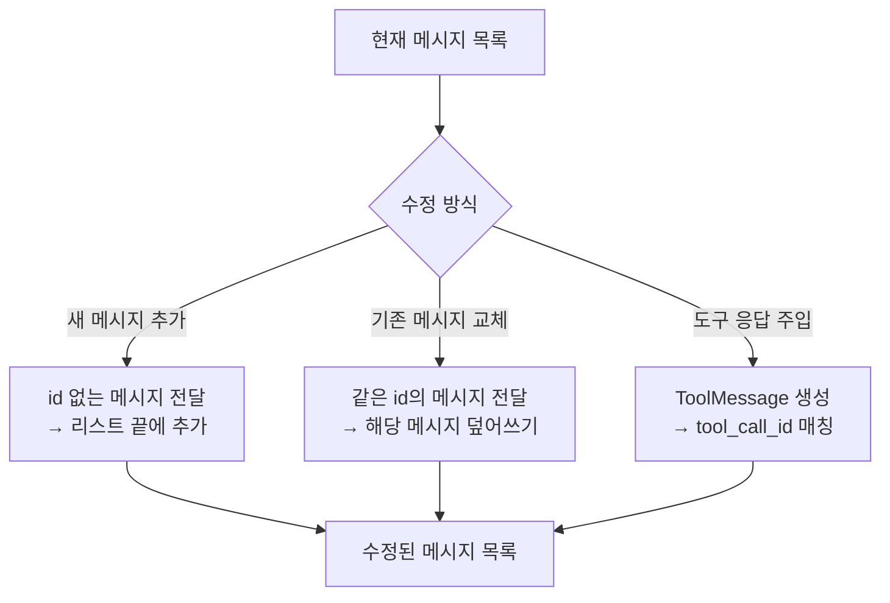

# 상태 수정과 피드백 주입

> LangGraph의 `update_state()`와 `Command(update=)`로 에이전트 상태를 직접 수정하고, 사람의 피드백을 그래프에 주입하는 패턴을 마스터합니다.

## 개요

이 섹션에서는 에이전트 실행 중 사람이 **상태를 직접 수정**하거나 **피드백을 주입**하는 두 가지 핵심 패턴을 학습합니다. [이전 섹션](07-ch7-human-in-the-loop-워크플로우/02-02-도구-호출-승인-워크플로우.md)에서 배운 승인/거부 워크플로우가 "예/아니오"의 이진 결정이었다면, 이번에는 상태를 원하는 값으로 **자유롭게 수정**하고 **새로운 정보를 주입**하는 더 유연한 패턴을 다룹니다.

**선수 지식**:
- [체크포인트 시스템](06-ch6-체크포인트와-영속적-실행/01-01-체크포인트-시스템-이해.md)과 `get_state()` 이해
- [interrupt와 Command(resume)](07-ch7-human-in-the-loop-워크플로우/01-01-human-in-the-loop-패턴-개관.md) 기본 개념
- [도구 호출 승인 워크플로우](07-ch7-human-in-the-loop-워크플로우/02-02-도구-호출-승인-워크플로우.md) 패턴

**학습 목표**:
- `graph.update_state()`로 그래프 외부에서 상태를 직접 수정할 수 있다
- `Command(update=)`로 노드 내부에서 상태와 라우팅을 동시에 제어할 수 있다
- `as_node` 매개변수의 역할과 사용 시점을 이해한다
- 사람의 피드백을 상태에 반영하여 에이전트 행동을 교정하는 워크플로우를 설계할 수 있다

## 왜 알아야 할까?

에이전트가 잘못된 방향으로 가고 있을 때, 단순히 "중단" 버튼을 누르는 것만으로는 충분하지 않습니다. 고객 지원 에이전트가 환불 금액을 잘못 계산했다면? 여행 계획 에이전트가 엉뚱한 도시의 호텔을 예약하려 한다면? 이런 상황에서 필요한 것은 **에이전트의 머릿속을 열어서 직접 고쳐주는 능력**입니다.

실무에서 이 패턴이 필수인 이유는 명확합니다:

- **비용 절감**: 처음부터 다시 실행하는 대신, 잘못된 부분만 고쳐서 이어갈 수 있습니다
- **정밀한 제어**: "승인/거부"를 넘어 "이 값을 X로 바꿔라"는 정밀한 지시가 가능합니다
- **도메인 지식 주입**: LLM이 모르는 내부 정보(고객 등급, 특별 할인율 등)를 실행 중에 넣어줄 수 있습니다
- **안전한 교정**: 에이전트가 잘못된 추론 경로에 빠졌을 때 궤도를 수정합니다

## 핵심 개념

### 개념 1: 외부 상태 수정 — `graph.update_state()`

> 💡 **비유**: 시험 중인 학생의 답안지를 선생님이 중간에 가져와서 특정 답을 고쳐주는 것과 같습니다. 학생(에이전트)은 고쳐진 답안지를 받아 나머지 문제를 계속 풀어갑니다.

`update_state()`는 그래프 **외부**에서 상태를 직접 수정하는 메서드입니다. 실행이 중단된 상태에서 사람이 원하는 값으로 상태를 변경한 뒤 실행을 재개할 수 있습니다.

> 📊 **그림 1**: update_state() 외부 상태 수정 흐름



`update_state()`의 전체 시그니처를 살펴보겠습니다:

```python
graph.update_state(
    config: RunnableConfig,   # 스레드 설정 (thread_id 포함)
    values: dict | Any,       # 업데이트할 상태 값
    as_node: str | None = None,  # 어떤 노드가 업데이트한 것처럼 처리할지
) -> RunnableConfig           # 업데이트된 체크포인트의 config 반환
```

각 매개변수의 역할을 좀 더 자세히 살펴보겠습니다:

- **`config`**: `{"configurable": {"thread_id": "..."}}`처럼 스레드를 식별하는 설정입니다. 특정 체크포인트를 대상으로 하려면 `checkpoint_id`도 포함할 수 있습니다.
- **`values`**: 업데이트할 상태 값의 딕셔너리입니다. 이 값은 해당 필드에 설정된 **리듀서를 통해 적용**됩니다 — 단순 덮어쓰기가 아닐 수 있으므로 주의가 필요합니다.
- **`as_node`**: 어떤 노드가 이 업데이트를 수행한 것으로 간주할지 지정합니다. 이 값에 따라 **다음에 실행될 노드가 달라집니다**. LangGraph는 지정된 노드의 나가는 엣지(outgoing edge)를 따라 다음 노드를 결정하거든요.
- **반환값**: 새로 생성된 체크포인트의 `RunnableConfig`를 반환합니다. 이를 통해 업데이트가 정상적으로 체크포인트에 기록되었는지 확인할 수 있습니다.

```python
from langgraph.graph import StateGraph, START, END
from langgraph.checkpoint.memory import MemorySaver
from typing import TypedDict, Annotated
from langchain_core.messages import AnyMessage, HumanMessage, AIMessage
from langgraph.graph.message import add_messages

class State(TypedDict):
    messages: Annotated[list[AnyMessage], add_messages]
    draft: str            # 에이전트가 작성한 초안
    feedback: str         # 사람의 피드백
    revision_count: int   # 수정 횟수

# 그래프 실행 후 상태 확인
config = {"configurable": {"thread_id": "review-1"}}
snapshot = graph.get_state(config)

# 사람이 초안을 직접 수정
updated_config = graph.update_state(
    config,
    values={
        "draft": "사람이 수정한 새로운 초안 내용",
        "feedback": "도입부를 더 간결하게 수정했습니다"
    },
    as_node="editor"  # "editor" 노드가 수정한 것처럼 처리
)

# 반환된 config로 새 체크포인트 확인 가능
print(f"새 체크포인트: {updated_config['configurable']['checkpoint_id']}")

# 수정된 상태로 실행 재개
result = graph.invoke(None, config)
```

> ⚠️ **흔한 오해**: `update_state()`를 호출하면 자동으로 실행이 재개된다고 생각하기 쉽지만, **상태만 수정될 뿐 실행은 재개되지 않습니다**. 반드시 `graph.invoke(None, config)` 또는 `graph.stream(None, config)`를 별도로 호출해야 합니다.

### 개념 2: `as_node`의 역할 — 누가 수정했는지가 중요하다

> 💡 **비유**: 회사에서 보고서를 수정할 때, **누가** 수정했느냐에 따라 다음 결재 라인이 달라지는 것과 같습니다. 팀장이 수정하면 부장에게, 부장이 수정하면 임원에게 가는 것처럼, `as_node`가 "누가 이 상태를 만들었는가"를 결정합니다.

`as_node`는 상태 업데이트의 **출처 노드**를 지정합니다. LangGraph는 이 정보를 바탕으로 해당 노드의 나가는 엣지(outgoing edge)를 따라 다음 실행 노드를 결정합니다.

> 📊 **그림 2**: as_node에 따른 실행 흐름 분기



```run:python
# as_node의 효과를 이해하기 위한 간단한 예시
# 실제 실행은 그래프 컴파일 후 가능하지만, 개념을 코드로 표현합니다

scenarios = {
    "as_node='drafter'": "drafter → reviewer (drafter의 엣지를 따름)",
    "as_node='reviewer'": "reviewer → publisher (reviewer의 엣지를 따름)",
    "as_node=None": "마지막 실행 노드의 엣지를 따름",
}

for scenario, result in scenarios.items():
    print(f"{scenario:25s} → 다음 실행: {result}")
```

```output
as_node='drafter'         → 다음 실행: drafter → reviewer (drafter의 엣지를 따름)
as_node='reviewer'        → 다음 실행: reviewer → publisher (reviewer의 엣지를 따름)
as_node=None              → 다음 실행: 마지막 실행 노드의 엣지를 따름
```

`as_node`를 생략하면 LangGraph는 마지막으로 실행된 노드를 기준으로 다음 노드를 결정합니다. 대부분의 간단한 경우에는 이것으로 충분하지만, 복잡한 그래프에서 **실행 흐름을 명시적으로 제어**하고 싶을 때 `as_node`가 빛을 발합니다.

### 개념 3: 내부 상태 수정 — `Command(update=)`

> 💡 **비유**: `update_state()`가 감독이 밖에서 선수를 교체하는 것이라면, `Command(update=)`는 경기 중인 선수가 직접 전술 보드를 수정하면서 동시에 다음 플레이를 지시하는 것입니다. 상태 수정과 라우팅이 **한 번에** 이루어집니다.

`Command(update=)`는 노드 **내부**에서 상태를 수정하면서 동시에 다음 실행할 노드를 지정합니다. `interrupt()`로 받은 피드백을 처리한 뒤, 상태 업데이트와 라우팅을 한 번에 할 수 있어서 매우 강력합니다.

> 📊 **그림 3**: Command(update=)의 동시 수정+라우팅



```python
from langgraph.types import Command, interrupt
from typing import Literal

def feedback_node(state: State) -> Command[Literal["revise", "publish"]]:
    """사람의 피드백을 받아 상태를 수정하고 다음 노드를 결정합니다."""
    
    # 사람에게 현재 초안을 보여주고 피드백 요청
    human_input = interrupt({
        "question": "초안을 검토해주세요. 수정이 필요하면 피드백을, 괜찮으면 'ok'를 입력하세요.",
        "current_draft": state["draft"]
    })
    
    if human_input == "ok":
        # 승인 → publish 노드로 이동
        return Command(
            update={"feedback": "승인됨", "status": "approved"},
            goto="publish"
        )
    else:
        # 피드백 → 상태에 피드백 저장 + revise 노드로 이동
        return Command(
            update={
                "feedback": human_input,
                "revision_count": state["revision_count"] + 1
            },
            goto="revise"
        )
```

`Command`와 `update_state()`의 핵심 차이를 정리하면:

| 구분 | `update_state()` | `Command(update=)` |
|------|-----------------|-------------------|
| **호출 위치** | 그래프 외부 (클라이언트 코드) | 그래프 내부 (노드 함수) |
| **라우팅** | `as_node`의 엣지를 따름 | `goto`로 명시적 지정 |
| **실행 재개** | 별도 `invoke(None)` 필요 | 자동으로 다음 노드 실행 |
| **사용 시점** | 인터럽트 중 외부 개입 | 노드 로직 내에서 분기 |

### 개념 4: 피드백 주입 패턴 — interrupt + Command(resume)

> 💡 **비유**: 요리 경연 프로그램에서 심사위원이 "소금이 좀 더 필요해요"라고 코멘트를 주면, 셰프가 그 피드백을 반영해서 요리를 수정하는 것과 같습니다. `interrupt()`가 심사위원에게 접시를 보여주는 것이고, `Command(resume=)`이 심사위원의 코멘트를 전달하는 것입니다.

피드백 주입은 [7.1절](07-ch7-human-in-the-loop-워크플로우/01-01-human-in-the-loop-패턴-개관.md)에서 배운 `interrupt()`/`Command(resume=)` 쌍의 응용입니다. 핵심은 사람이 제공한 피드백이 **그래프 상태에 반영**되어 이후 노드들의 행동을 바꾼다는 것입니다.

> 📊 **그림 4**: 피드백 주입 전체 워크플로우



```python
def draft_node(state: State) -> dict:
    """LLM이 초안을 생성합니다."""
    # 이전 피드백이 있으면 반영
    prompt = f"다음 주제로 글을 작성하세요: {state['topic']}"
    if state.get("feedback"):
        prompt += f"\n\n이전 피드백을 반영하세요: {state['feedback']}"
    
    response = llm.invoke(prompt)
    return {"draft": response.content, "status": "draft_ready"}

def review_node(state: State) -> Command[Literal["draft", "finalize"]]:
    """사람의 피드백을 수집하고 상태에 반영합니다."""
    feedback = interrupt({
        "message": "초안을 검토해주세요",
        "draft": state["draft"],
        "revision": state.get("revision_count", 0)
    })
    
    if feedback.strip().lower() == "ok":
        return Command(update={"status": "approved"}, goto="finalize")
    
    return Command(
        update={
            "feedback": feedback,
            "revision_count": state.get("revision_count", 0) + 1
        },
        goto="draft"  # 피드백 반영하여 재작성
    )
```

이 패턴의 핵심은 **피드백이 상태에 누적**된다는 점입니다. `draft_node`는 `state["feedback"]`를 확인하여 LLM 프롬프트에 포함시키므로, 사람의 피드백이 자연스럽게 다음 초안에 반영됩니다.

### 개념 5: 메시지 상태 수정 — 대화 히스토리 조작

> 💡 **비유**: 회의록에서 잘못 기록된 부분을 수정하는 것과 같습니다. 전체 회의를 다시 하는 게 아니라, 기록만 정정해서 이후 논의가 올바른 맥락에서 이어지게 합니다.

LLM 에이전트에서 가장 자주 수정하는 상태는 **메시지 리스트**입니다. `add_messages` 리듀서를 사용하면 `update_state()`로 메시지를 추가하거나 기존 메시지를 덮어쓸 수 있습니다.

> 📊 **그림 5**: 메시지 상태 수정 패턴



```python
from langchain_core.messages import (
    HumanMessage, AIMessage, ToolMessage
)

# 패턴 1: 새 메시지 추가 (사람이 직접 정보 제공)
graph.update_state(
    config,
    values={
        "messages": [
            HumanMessage(content="참고: 이 고객은 VIP 등급입니다")
        ]
    }
)

# 패턴 2: AI의 잘못된 응답을 수정 (같은 id로 덮어쓰기)
snapshot = graph.get_state(config)
last_ai_msg = snapshot.values["messages"][-1]

corrected_msg = AIMessage(
    content="수정된 응답 내용",
    id=last_ai_msg.id  # 같은 id → 기존 메시지를 덮어씀
)
graph.update_state(config, values={"messages": [corrected_msg]})

# 패턴 3: 사람이 도구 응답을 대신 제공
tool_call = last_ai_msg.tool_calls[0]
human_tool_response = ToolMessage(
    content='{"balance": 150000, "grade": "VIP"}',
    tool_call_id=tool_call["id"],  # 원래 도구 호출과 매칭
    name=tool_call["name"]
)
graph.update_state(
    config,
    values={"messages": [human_tool_response]},
    as_node="tools"  # tools 노드가 응답한 것처럼 처리
)
```

패턴 3이 특히 실용적인데요 — 도구가 실패했을 때 사람이 대신 결과를 제공하면 에이전트가 정상적으로 계속 실행됩니다. `as_node="tools"`로 지정하면 tools 노드의 엣지를 따라 LLM 노드로 돌아가서 나머지 처리를 이어갑니다.

## 실습: 직접 해보기

보고서 작성 에이전트를 만들어보겠습니다. 이 에이전트는 초안을 생성한 뒤 사람의 피드백을 받아 수정하고, 사람이 상태를 직접 수정할 수도 있습니다.

```python
"""보고서 작성 에이전트 — 상태 수정과 피드백 주입 실습"""
from typing import TypedDict, Annotated, Literal
from langgraph.graph import StateGraph, START, END
from langgraph.graph.message import add_messages
from langgraph.checkpoint.memory import MemorySaver
from langgraph.types import Command, interrupt
from langchain_core.messages import AnyMessage, HumanMessage, AIMessage, SystemMessage

# --- 1. 상태 정의 ---
class ReportState(TypedDict):
    messages: Annotated[list[AnyMessage], add_messages]
    topic: str                # 보고서 주제
    draft: str                # 현재 초안
    feedback: str             # 사람의 피드백
    revision_count: int       # 수정 횟수
    max_revisions: int        # 최대 수정 허용 횟수
    status: str               # draft | review | approved | published

# --- 2. 노드 정의 ---
def generate_draft(state: ReportState) -> dict:
    """초안을 생성하거나 피드백을 반영하여 수정합니다."""
    revision = state.get("revision_count", 0)
    topic = state["topic"]
    feedback = state.get("feedback", "")
    
    if revision == 0:
        # 최초 생성
        draft = f"[{topic}] 보고서 초안 (v1)\n"
        draft += f"1. 개요: {topic}에 대한 분석\n"
        draft += f"2. 현황: 최신 트렌드 정리\n"
        draft += f"3. 결론: 향후 전망"
    else:
        # 피드백 반영 수정
        draft = f"[{topic}] 보고서 수정본 (v{revision + 1})\n"
        draft += f"[피드백 반영: {feedback}]\n"
        draft += f"1. 개요: {topic}에 대한 심층 분석\n"
        draft += f"2. 현황: 피드백을 반영한 수정된 내용\n"
        draft += f"3. 결론: 구체적 데이터 기반 전망"
    
    return {"draft": draft, "status": "review"}

def collect_feedback(state: ReportState) -> Command[Literal["generate_draft", "publish"]]:
    """사람의 피드백을 수집합니다. interrupt()로 중단 후 Command(resume=)로 재개."""
    revision = state.get("revision_count", 0)
    max_rev = state.get("max_revisions", 3)
    
    # 사람에게 초안을 보여주고 피드백 요청
    human_input = interrupt({
        "type": "review_request",
        "draft": state["draft"],
        "revision": revision,
        "max_revisions": max_rev,
        "instruction": "피드백을 입력하세요. 승인하려면 'ok'를 입력하세요."
    })
    
    # 승인
    if isinstance(human_input, str) and human_input.strip().lower() == "ok":
        return Command(
            update={"feedback": "", "status": "approved"},
            goto="publish"
        )
    
    # 최대 수정 횟수 초과
    if revision >= max_rev:
        return Command(
            update={
                "feedback": human_input,
                "status": "approved",
                "draft": state["draft"] + f"\n[최종 피드백: {human_input}]"
            },
            goto="publish"
        )
    
    # 피드백 반영하여 재작성
    return Command(
        update={
            "feedback": human_input,
            "revision_count": revision + 1,
        },
        goto="generate_draft"
    )

def publish(state: ReportState) -> dict:
    """최종 보고서를 발행합니다."""
    return {"status": "published"}

# --- 3. 그래프 구성 ---
builder = StateGraph(ReportState)
builder.add_node("generate_draft", generate_draft)
builder.add_node("collect_feedback", collect_feedback)
builder.add_node("publish", publish)

builder.add_edge(START, "generate_draft")
builder.add_edge("generate_draft", "collect_feedback")
# collect_feedback → Command로 라우팅하므로 add_edge 불필요
builder.add_edge("publish", END)

memory = MemorySaver()
graph = builder.compile(checkpointer=memory)
```

이제 이 그래프를 실행하면서 세 가지 상호작용 패턴을 실습해봅시다:

```run:python
# --- 실행 예시: 피드백 주입 패턴 ---
# (실제 실행 시 위의 그래프 정의가 필요합니다)

# 시뮬레이션으로 흐름을 보여줍니다
print("=" * 50)
print("보고서 작성 에이전트 — 피드백 주입 실습")
print("=" * 50)

# Step 1: 초안 생성
print("\n[Step 1] 에이전트가 초안을 생성합니다...")
print("  → 상태: topic='AI 에이전트 동향', status='review'")
print("  → 초안 v1 생성 완료")

# Step 2: 피드백 주입 (Command(resume=))
print("\n[Step 2] interrupt() → 사람의 피드백 대기...")
print("  사람 입력: '구체적인 수치 데이터를 추가해주세요'")
print("  → Command(resume='구체적인 수치 데이터를 추가해주세요')")
print("  → feedback 상태 업데이트, revision_count: 0 → 1")
print("  → goto='generate_draft' (재작성)")

# Step 3: 수정된 초안
print("\n[Step 3] 에이전트가 피드백을 반영하여 초안을 수정합니다...")
print("  → 초안 v2 생성 (피드백 반영)")

# Step 4: 승인
print("\n[Step 4] interrupt() → 사람의 피드백 대기...")
print("  사람 입력: 'ok'")
print("  → Command(update={'status': 'approved'}, goto='publish')")
print("  → 보고서 발행 완료!")
```

```output
==================================================
보고서 작성 에이전트 — 피드백 주입 실습
==================================================

[Step 1] 에이전트가 초안을 생성합니다...
  → 상태: topic='AI 에이전트 동향', status='review'
  → 초안 v1 생성 완료

[Step 2] interrupt() → 사람의 피드백 대기...
  사람 입력: '구체적인 수치 데이터를 추가해주세요'
  → Command(resume='구체적인 수치 데이터를 추가해주세요')
  → feedback 상태 업데이트, revision_count: 0 → 1
  → goto='generate_draft' (재작성)

[Step 3] 에이전트가 피드백을 반영하여 초안을 수정합니다...
  → 초안 v2 생성 (피드백 반영)

[Step 4] interrupt() → 사람의 피드백 대기...
  사람 입력: 'ok'
  → Command(update={'status': 'approved'}, goto='publish')
  → 보고서 발행 완료!
```

외부에서 `update_state()`로 상태를 직접 수정하는 패턴도 함께 보겠습니다:

```python
# --- 패턴 B: update_state()로 외부 직접 수정 ---

config = {"configurable": {"thread_id": "report-1"}}

# 1. 그래프 실행 → collect_feedback에서 interrupt로 중단
for event in graph.stream(
    {"topic": "AI 에이전트 동향", "revision_count": 0, "max_revisions": 3},
    config,
    stream_mode="values"
):
    print(f"상태: {event.get('status', 'starting')}")

# 2. 현재 상태 확인
snapshot = graph.get_state(config)
print(f"중단 위치: {snapshot.next}")         # ('collect_feedback',)
print(f"현재 초안: {snapshot.values['draft'][:50]}...")

# 3-A: 피드백 주입 (Command(resume)으로 재개)
for event in graph.stream(
    Command(resume="결론에 ROI 수치를 추가해주세요"),
    config,
    stream_mode="values"
):
    print(f"상태: {event.get('status')}")

# 3-B: 또는 update_state()로 초안 자체를 직접 수정
graph.update_state(
    config,
    values={
        "draft": "사람이 직접 작성한 보고서 내용...",
        "status": "approved"
    },
    as_node="collect_feedback"  # collect_feedback이 수정한 것처럼
)

# 4. 수정된 상태로 실행 재개
for event in graph.stream(None, config, stream_mode="values"):
    print(f"최종 상태: {event.get('status')}")
```

> 🔥 **실무 팁**: `update_state()`와 `Command(resume=)`를 혼용하지 마세요. 하나의 인터럽트 지점에서는 한 가지 방식만 사용해야 합니다. `Command(resume=)`으로 재개하면 interrupt()가 반환값을 받고, `update_state()`는 상태를 직접 덮어씁니다. 같은 인터럽트에 두 방식을 섞으면 상태 불일치가 발생할 수 있습니다.

## 더 깊이 알아보기

### Human-in-the-Loop의 역사: 사이버네틱스에서 AI까지

"Human-in-the-Loop"라는 개념은 1940년대 **사이버네틱스(Cybernetics)** 운동에서 시작되었습니다. 수학자 Norbert Wiener는 2차 세계대전 중 대공포 조준 시스템을 연구하면서, 기계의 자동 제어와 인간 조작자의 판단을 결합하는 **피드백 루프(feedback loop)** 개념을 정립했습니다.

흥미로운 점은 초기 HITL 시스템에서도 오늘날 LangGraph가 구현하는 것과 동일한 세 가지 패턴이 존재했다는 것입니다:
- **승인**: 미사일 발사 전 장교의 최종 확인
- **수정**: 조준 각도를 사람이 직접 보정
- **피드백**: 명중률 데이터를 다음 조준에 반영

LangGraph의 `update_state()`는 이 70년 된 "사람이 기계의 내부 상태를 수정한다"는 아이디어의 현대적 구현입니다. 다만 미사일 대신 LLM의 메시지 히스토리를, 조준 각도 대신 에이전트의 실행 상태를 수정한다는 차이가 있을 뿐이죠.

### Command 객체의 탄생

LangGraph의 `Command` 객체는 2024년 말에 도입되었습니다. 그 전에는 상태 수정과 라우팅을 별도로 처리해야 했는데, 이는 코드가 복잡해지고 경쟁 상태(race condition)가 발생하기 쉬웠습니다. LangChain 팀은 Erlang의 메시지 패싱 패턴에서 영감을 받아, "상태 업데이트 + 라우팅 지시"를 하나의 원자적 명령으로 묶은 `Command` 객체를 설계했습니다. 이 덕분에 `update`와 `goto`가 항상 함께 적용되어 상태 불일치 문제가 원천적으로 해결되었습니다.

## 흔한 오해와 팁

> ⚠️ **흔한 오해**: `update_state()`를 호출하면 인터럽트 상태가 유지된다고 생각하는 분들이 많습니다. 하지만 `update_state()`는 **새로운 체크포인트를 생성**하면서 기존 인터럽트 정보를 덮어쓸 수 있습니다. 인터럽트를 보존하면서 상태를 수정하려면, `Command(resume=)` 패턴을 사용하는 것이 더 안전합니다.

> 💡 **알고 계셨나요?**: `update_state()`의 `values`는 리듀서를 통해 적용됩니다. 즉, `messages` 필드에 `add_messages` 리듀서가 설정되어 있으면, 전달한 메시지가 기존 목록에 **추가**됩니다 (덮어쓰기가 아닙니다). 기존 메시지를 교체하려면 같은 `id`를 가진 메시지를 전달해야 합니다.

> 🔥 **실무 팁**: 프로덕션 환경에서 `update_state()`를 사용할 때는 반드시 **감사 로그(audit log)**를 남기세요. 누가 언제 어떤 상태를 수정했는지 추적할 수 없으면, 에이전트의 이상 동작 원인을 파악하기 어렵습니다. 간단히 `logging.info(f"State updated by {user_id}: {changes}")` 한 줄이면 됩니다.

## 핵심 정리

| 개념 | 설명 |
|------|------|
| `graph.update_state()` | 그래프 **외부**에서 상태를 직접 수정. 별도 `invoke(None)` 호출로 재개 필요 |
| `as_node` | 어떤 노드가 수정한 것처럼 처리. 다음 실행 노드 결정에 영향 |
| `Command(update=)` | 노드 **내부**에서 상태 수정 + 라우팅을 원자적으로 처리 |
| `Command(resume=)` | `interrupt()` 이후 사람의 입력값을 전달하여 실행 재개 |
| 메시지 교체 | 같은 `id`의 메시지를 전달하면 기존 메시지를 덮어씀 |
| ToolMessage 주입 | `tool_call_id`를 매칭하여 사람이 도구 응답을 대신 제공 |
| 리듀서 적용 | `update_state()`의 값도 리듀서를 거침 (추가 vs 덮어쓰기 주의) |

## 다음 섹션 미리보기

이번 섹션에서 상태를 수정하고 피드백을 주입하는 기본 패턴을 마스터했습니다. 다음 [동적 중단점과 조건부 승인](07-ch7-human-in-the-loop-워크플로우/04-04-동적-중단점과-조건부-승인.md)에서는 **런타임 조건에 따라 인터럽트 여부를 동적으로 결정**하는 패턴을 학습합니다. 예를 들어 "금액이 100만 원 이상일 때만 승인 요청", "위험도 점수가 임계값을 초과할 때만 사람 개입" 같은 **임계값 계층(threshold tiers)**을 설계하여 더 정교한 워크플로우를 구현합니다.

## 참고 자료

- [LangGraph Human-in-the-Loop 공식 가이드](https://docs.langchain.com/oss/python/langchain/human-in-the-loop) - `update_state()`와 Command 패턴의 공식 문서
- [LangGraph Interrupts 공식 문서](https://docs.langchain.com/oss/javascript/langgraph/interrupts) - interrupt/Command(resume) 메커니즘의 상세 설명
- [LangGraph State Customization 튜토리얼](https://langchain-opentutorial.gitbook.io/langchain-opentutorial/17-langgraph/01-core-features/08-langgraph-state-customization) - `update_state()`와 `as_node` 활용 예제
- [LangGraph GitHub Repository](https://github.com/langchain-ai/langgraph) - 최신 API 및 예제 코드
- [LangGraph Graph API 사용 가이드](https://docs.langchain.com/oss/python/langgraph/use-graph-api) - 그래프 상태 관리 API 레퍼런스
- [Interrupts and Commands in LangGraph (DEV Community)](https://dev.to/jamesbmour/interrupts-and-commands-in-langgraph-building-human-in-the-loop-workflows-4ngl) - Command 패턴의 실전 활용 예시

---
### 🔗 Related Sessions
- [checkpoint](06-ch6-체크포인트와-영속적-실행/01-01-체크포인트-시스템-이해.md) (prerequisite)
- [interrupt](07-ch7-human-in-the-loop-워크플로우/01-01-human-in-the-loop-패턴-개관.md) (prerequisite)
- [add_messages](03-ch3-대화-메모리와-상태-관리/01-01-대화-메모리의-기초.md) (prerequisite)
- [memorysaver](03-ch3-대화-메모리와-상태-관리/01-01-대화-메모리의-기초.md) (prerequisite)
