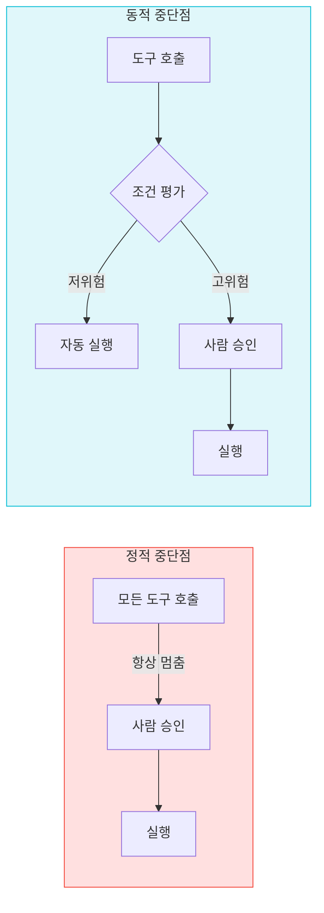
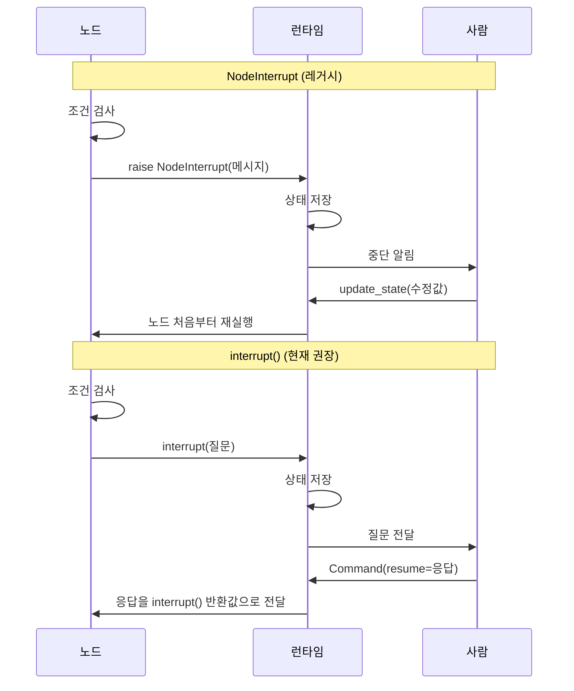
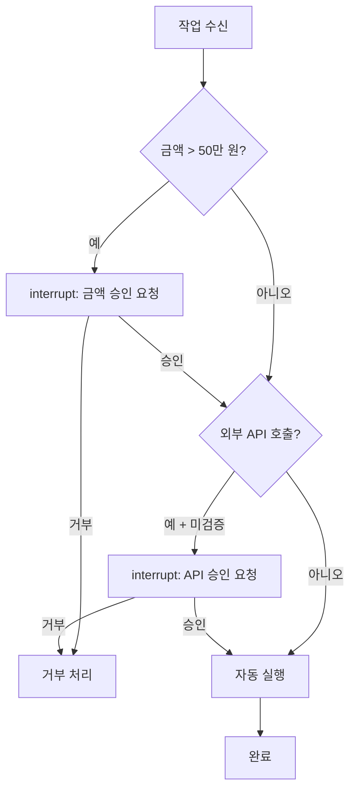
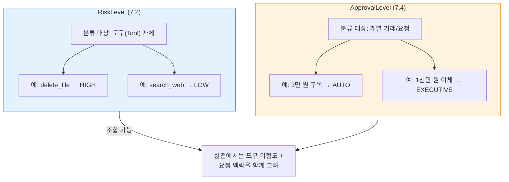
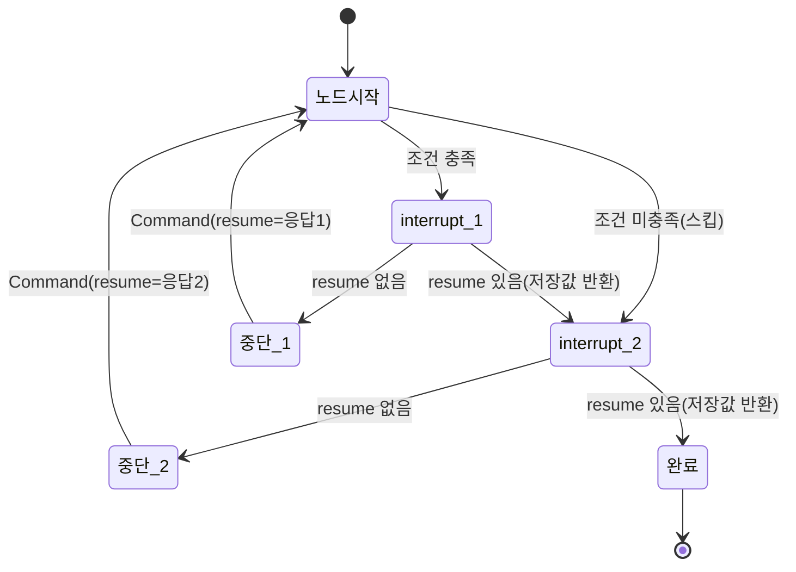
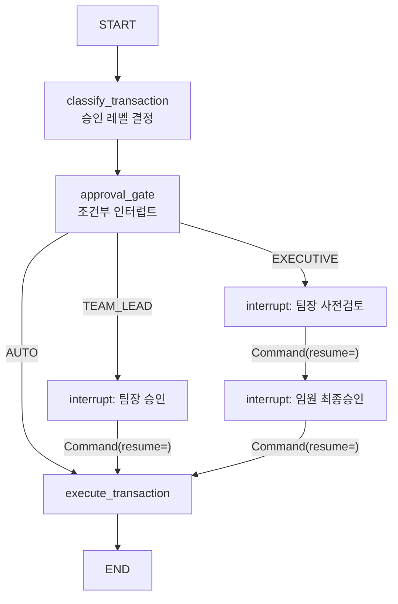

# 동적 중단점과 조건부 승인

> 조건에 따라 인터럽트 여부를 런타임에 결정하는 동적 중단점 패턴을 익히고, 규칙 기반 조건부 승인 워크플로우를 설계합니다.

## 개요

이 섹션에서는 모든 실행을 멈추는 정적 중단점을 넘어, **런타임 상태를 분석하여 "멈출지 말지"를 동적으로 결정**하는 패턴을 학습합니다. 금액 임계값, 위험도 점수, 비즈니스 규칙 등 조건에 따라 인터럽트를 선택적으로 발동시키는 실전 워크플로우를 구축합니다.

**선수 지식**: [HITL 패턴 개관](07-ch7-human-in-the-loop-워크플로우/01-01-human-in-the-loop-패턴-개관.md)의 `interrupt`/`Command(resume)` 메커니즘, [도구 호출 승인 워크플로우](07-ch7-human-in-the-loop-워크플로우/02-02-도구-호출-승인-워크플로우.md)의 정적 승인 패턴과 RiskLevel/TOOL_RISK_MAP 분류 체계, [상태 수정과 피드백 주입](07-ch7-human-in-the-loop-워크플로우/03-03-상태-수정과-피드백-주입.md)의 `update_state`와 `Command(update=)` 활용법

**학습 목표**:
- `interrupt()` 함수를 조건문과 결합하여 동적 중단점을 구현할 수 있다
- NodeInterrupt 예외의 역할과 현재 권장 패턴과의 차이를 설명할 수 있다
- 금액 임계값, 위험도 점수 등 다중 조건 기반 승인 워크플로우를 설계할 수 있다
- 하나의 노드에서 복수의 `interrupt()`를 안전하게 사용할 수 있다

## 왜 알아야 할까?

실제 프로덕션 환경을 떠올려 보세요. 고객이 커피 한 잔을 주문할 때마다 매니저의 승인을 받아야 한다면 어떨까요? 업무가 마비될 겁니다. 반대로, 1억 원짜리 장비 발주를 아무 확인 없이 자동 처리한다면요? 그건 재앙이죠.

현실 세계의 승인 시스템은 **조건부**입니다. 10만 원 이하는 자동 승인, 10만~100만 원은 팀장 승인, 100만 원 이상은 임원 승인 — 이런 계층적 규칙이 자연스럽거든요. 에이전트도 마찬가지입니다. 모든 도구 호출을 멈추는 `interrupt_before`는 안전하지만, 사용자 경험을 크게 해칩니다. **진짜 위험한 작업만 골라서 멈추는** 동적 중단점이야말로 프로덕션에서 필요한 패턴입니다.

> 📊 **그림 1**: 정적 중단점 vs 동적 중단점 비교



## 핵심 개념

### 개념 1: NodeInterrupt에서 interrupt()로 — 동적 중단점의 진화

> 💡 **비유**: 과거의 동적 중단점은 "비상벨"이었습니다. 위험을 감지하면 벨을 누르고(`raise NodeInterrupt`), 건물 전체가 멈췄죠. 새로운 `interrupt()` 함수는 "인터폰"에 가깝습니다. 상황을 설명하고, 상대방의 답변을 받아서, 그 자리에서 바로 이어가는 거예요.

LangGraph 초기에는 **NodeInterrupt 예외**를 `raise`하여 동적 중단점을 구현했습니다. 노드 내부에서 조건을 검사한 뒤, 조건에 해당하면 예외를 발생시켜 그래프 실행을 멈추는 방식이었죠.

```python
# ⚠️ 레거시 방식 — NodeInterrupt 예외
from langgraph.errors import NodeInterrupt

def process_payment(state: State) -> dict:
    """결제를 처리하되, 고액 결제는 NodeInterrupt로 중단"""
    amount = state["amount"]
    
    # 100만 원 초과 시 예외를 발생시켜 그래프 실행을 멈춤
    if amount > 1_000_000:
        raise NodeInterrupt(
            f"고액 결제 감지: {amount:,}원. 승인이 필요합니다."
        )
    
    # 100만 원 이하는 자동 처리
    return {"status": "approved", "amount": amount}

# ── 레거시 방식의 재개 흐름 ──
# 1) 그래프 실행 → NodeInterrupt에서 중단
# result = graph.invoke({"amount": 2_000_000}, config)
#
# 2) 상태를 수동으로 수정해야 재개 가능 (값을 직접 전달할 수 없음)
# graph.update_state(config, {"amount": 2_000_000, "override_approved": True})
#
# 3) None을 전달하여 중단된 노드부터 재실행
# result = graph.invoke(None, config)
# → 노드가 처음부터 재실행되므로, override_approved를 확인하는
#   별도 로직이 필요함
```

이 방식은 동작하지만, **재개할 때 값을 직접 전달받을 수 없다**는 한계가 있었습니다. 중단 후 재개하려면 `update_state`로 상태를 수동 수정한 뒤, 상태 변경을 감지하는 분기 로직을 별도로 작성해야 했거든요. 코드가 장황해지고 실수하기 쉬운 구조였습니다.

현재 LangGraph v1.1+에서 권장하는 방식은 **`interrupt()` 함수**입니다. `interrupt()`는 Python의 `input()` 함수처럼 **값을 보내고, 응답을 돌려받는** 양방향 통신이 가능합니다.

```python
# ✅ 현재 권장 방식 — interrupt() 함수
from langgraph.types import interrupt, Command

def process_payment(state: State) -> dict:
    """결제를 처리하되, 고액 결제는 interrupt()로 승인을 요청"""
    amount = state["amount"]
    
    if amount > 1_000_000:  # 100만 원 초과일 때만 멈춤
        # interrupt()가 질문을 보내고, 사람의 응답을 반환값으로 받음
        decision = interrupt({
            "type": "high_amount_approval",
            "amount": amount,
            "message": f"고액 결제 {amount:,}원을 승인하시겠습니까?"
        })
        # decision에는 Command(resume=...)로 전달된 값이 들어옴
        if decision["action"] == "reject":
            return {"status": "rejected", "reason": decision.get("reason", "")}
    
    return {"status": "approved", "amount": amount}

# ── 현재 방식의 재개 흐름 ──
# 1) 그래프 실행 → interrupt()에서 중단
# result = graph.invoke({"amount": 2_000_000}, config)
#
# 2) Command(resume=)으로 값을 직접 전달하며 재개
# result = graph.invoke(
#     Command(resume={"action": "approve"}),
#     config,
# )
# → interrupt()의 반환값으로 {"action": "approve"}가 전달됨
```

> 📊 **그림 2**: NodeInterrupt vs interrupt() 실행 흐름 비교



핵심 차이를 정리하면 이렇습니다:

| 구분 | NodeInterrupt (레거시) | interrupt() (권장) |
|------|----------------------|-------------------|
| 중단 방식 | `raise` 예외 | 함수 호출 |
| 재개 시 값 전달 | `update_state` 필요 | `Command(resume=값)` 직접 전달 |
| 반환값 | 없음 | resume 값이 반환값 |
| 복수 중단점 | 불편 | 자연스럽게 지원 |
| 현재 상태 | 동작하지만 비권장 | **공식 권장** |

> ⚠️ **흔한 오해**: "NodeInterrupt가 완전히 제거됐다"고 생각하는 분이 있는데요, 아직 동작합니다. 다만 `interrupt()` 함수가 더 직관적이고 기능이 풍부하기 때문에 새 코드에서는 `interrupt()`를 쓰는 것이 좋습니다.

### 개념 2: 조건부 인터럽트 — 규칙 기반 동적 중단

> 💡 **비유**: 공항 보안 검색대를 떠올려 보세요. 모든 승객이 X-ray 검색을 받지만, 금속 탐지기에 반응하는 승객만 추가 검사를 받죠. 모든 승객을 수색한다면 공항은 마비될 겁니다. 조건부 인터럽트는 바로 이 "금속 탐지기" 역할을 합니다.

조건부 인터럽트의 핵심은 간단합니다: **`if` 문 안에 `interrupt()`를 넣는 것**입니다.

```python
from langgraph.types import interrupt

def execute_action(state: State) -> dict:
    action = state["pending_action"]
    
    # 규칙 1: 금액 기반 조건부 승인
    if action.get("amount", 0) > 500_000:
        decision = interrupt({
            "rule": "high_amount",
            "detail": f"금액 {action['amount']:,}원이 임계값(50만 원)을 초과했습니다.",
            "action": action,
        })
        if decision == "reject":
            return {"result": "거부됨", "reason": "금액 초과 — 사람이 거부"}

    # 규칙 2: 외부 API 호출 조건부 승인
    if action.get("type") == "external_api" and not action.get("verified"):
        decision = interrupt({
            "rule": "unverified_api",
            "detail": f"미검증 외부 API 호출: {action['endpoint']}",
            "action": action,
        })
        if decision == "reject":
            return {"result": "거부됨", "reason": "미검증 API — 사람이 거부"}

    # 조건에 해당하지 않으면 자동 실행
    return {"result": "실행 완료", "action": action}
```

이 패턴의 장점은 **규칙을 자유롭게 조합**할 수 있다는 점입니다. 금액, 유형, 시간대, 사용자 권한 등 어떤 조건이든 `if` 문으로 표현할 수 있으니까요.

> 📊 **그림 3**: 다중 조건 평가 흐름



#### RiskLevel과 ApprovalLevel — 두 분류 체계의 관계

[도구 호출 승인 워크플로우](07-ch7-human-in-the-loop-워크플로우/02-02-도구-호출-승인-워크플로우.md)에서 `RiskLevel`과 `TOOL_RISK_MAP`을 배웠는데요, 이번 섹션에서 등장하는 `ApprovalLevel`과 헷갈릴 수 있습니다. 둘은 **분류 대상이 다릅니다**.

> 📊 **그림 3-1**: RiskLevel과 ApprovalLevel의 분류 대상 비교



| 구분 | RiskLevel (7.2) | ApprovalLevel (7.4) |
|------|-----------------|---------------------|
| **분류 대상** | 도구(Tool) 자체 | 개별 거래/요청 |
| **결정 시점** | 설계 시 (정적 매핑) | 런타임 (동적 평가) |
| **기준** | 도구의 본질적 위험도 | 금액, 유형, 맥락 등 요청 속성 |
| **예시** | `delete_file` → HIGH | 1,000만 원 이체 → EXECUTIVE |
| **목적** | "어떤 도구를 항상 멈출지" 결정 | "이 요청을 누가 승인할지" 결정 |

실전에서는 두 체계를 **조합**합니다. 예를 들어, `execute_payment` 도구의 `RiskLevel`이 MEDIUM이라 기본적으로 승인이 필요하지만, 해당 결제의 `ApprovalLevel`이 AUTO(소액)라면 자동 통과시키는 식이죠. 도구 단위 위험도가 1차 필터, 요청 단위 승인 레벨이 2차 필터라고 생각하면 됩니다.

#### 임계값 계층 패턴

실무에서 가장 흔한 패턴은 **금액이나 점수에 따라 승인 수준을 달리하는 계층형 구조**입니다.

```python
from enum import Enum
from langgraph.types import interrupt

class ApprovalLevel(str, Enum):
    """요청/거래 단위의 승인 레벨 (RiskLevel과 달리 런타임에 동적 결정)"""
    AUTO = "auto"         # 자동 승인
    TEAM_LEAD = "team"    # 팀장 승인
    DIRECTOR = "director" # 임원 승인

def get_approval_level(amount: int) -> ApprovalLevel:
    """금액에 따른 승인 레벨 결정"""
    if amount <= 100_000:
        return ApprovalLevel.AUTO
    elif amount <= 1_000_000:
        return ApprovalLevel.TEAM_LEAD
    else:
        return ApprovalLevel.DIRECTOR

def approval_gate(state: State) -> dict:
    amount = state["amount"]
    level = get_approval_level(amount)
    
    if level == ApprovalLevel.AUTO:
        # 10만 원 이하: 자동 통과
        return {"approved": True, "approval_level": level.value}
    
    # 10만 원 초과: 해당 레벨의 승인 요청
    decision = interrupt({
        "approval_level": level.value,
        "amount": amount,
        "message": f"{level.value} 레벨 승인 필요: {amount:,}원",
    })
    
    return {
        "approved": decision.get("approved", False),
        "approval_level": level.value,
        "approver": decision.get("approver", ""),
    }
```

### 개념 3: 복수 인터럽트와 실행 순서 보장

> 💡 **비유**: 은행에서 대출을 받을 때를 생각해 보세요. 먼저 신용 확인(1차 중단), 그 다음 담보 평가(2차 중단), 마지막으로 최종 승인(3차 중단)을 거치죠. 각 단계의 승인이 순서대로 진행되어야 합니다.

하나의 노드 안에 `interrupt()`를 여러 번 호출할 수 있습니다. LangGraph는 내부적으로 **resume 값의 리스트**를 관리하여, 각 `interrupt()`가 올바른 응답을 받도록 보장합니다.

```python
def multi_step_approval(state: State) -> dict:
    proposal = state["proposal"]
    
    # 1단계: 기술 검토
    tech_review = interrupt({
        "step": 1,
        "type": "tech_review",
        "question": f"기술적으로 적합한가요? 제안: {proposal['title']}"
    })
    
    if not tech_review.get("approved"):
        return {"status": "rejected", "stage": "tech_review"}
    
    # 2단계: 예산 승인 (1단계 통과 시에만 도달)
    budget_review = interrupt({
        "step": 2,
        "type": "budget_review",
        "question": f"예산 {proposal['budget']:,}원을 승인하시겠습니까?",
        "tech_feedback": tech_review.get("feedback", "")
    })
    
    if not budget_review.get("approved"):
        return {"status": "rejected", "stage": "budget_review"}
    
    return {
        "status": "approved",
        "tech_reviewer": tech_review["reviewer"],
        "budget_approver": budget_review["approver"]
    }
```

**중요한 동작 원리**: 재개할 때 LangGraph는 **노드를 처음부터 다시 실행**합니다. 이때 이미 응답받은 `interrupt()`는 저장된 resume 값을 즉시 반환하고, 아직 응답받지 못한 `interrupt()`에서 다시 멈춥니다.

```python
# 1차 재개: tech_review에 대한 응답
graph.invoke(
    Command(resume={"approved": True, "reviewer": "김기술", "feedback": "LGTM"}),
    config
)
# → 1번째 interrupt()는 resume값 반환, 2번째 interrupt()에서 다시 멈춤

# 2차 재개: budget_review에 대한 응답
graph.invoke(
    Command(resume={"approved": True, "approver": "이예산"}),
    config
)
# → 두 interrupt() 모두 통과, 노드 완료
```

> 🔥 **실무 팁**: 복수 인터럽트를 사용할 때, 첫 번째 `interrupt()` 전에 **부수 효과(side effect)**가 있는 코드를 두면 안 됩니다. 노드가 처음부터 재실행되기 때문에, DB 삽입이나 API 호출 같은 작업이 중복 실행될 수 있어요. 부수 효과는 모든 `interrupt()` 이후에 배치하세요.

> 📊 **그림 4**: 복수 인터럽트의 재실행 메커니즘



### 개념 4: 멱등성과 안전한 노드 설계

> 💡 **비유**: ATM에서 출금 버튼을 누르는데 통신 오류가 나서 다시 시도했더니, 돈이 두 번 빠져나가면 큰일이죠. 그래서 은행 시스템은 같은 거래 ID로 재시도하면 한 번만 처리되도록 설계합니다. 이것이 바로 멱등성(idempotency)입니다.

`interrupt()`가 있는 노드는 **재개할 때마다 처음부터 다시 실행**됩니다. 따라서 `interrupt()` 앞에 있는 모든 코드는 여러 번 실행될 수 있다는 점을 반드시 고려해야 합니다.

```python
# ❌ 위험한 패턴 — interrupt 전에 부수 효과
def dangerous_node(state: State) -> dict:
    # 이 코드는 재개할 때마다 반복 실행됨!
    db.insert({"log": "작업 시작", "time": datetime.now()})  # 중복 삽입!
    send_notification("작업을 시작합니다")                      # 중복 알림!
    
    decision = interrupt({"question": "계속할까요?"})
    return {"result": decision}
```

```python
# ✅ 안전한 패턴 — 부수 효과를 interrupt 뒤로 이동
def safe_node(state: State) -> dict:
    # interrupt 전: 읽기 전용 연산만
    amount = state["amount"]
    risk_score = calculate_risk(amount)  # 순수 함수, 부수 효과 없음
    
    if risk_score > 0.7:
        decision = interrupt({
            "risk_score": risk_score,
            "amount": amount,
            "message": f"위험도 {risk_score:.1%}. 승인하시겠습니까?"
        })
        if decision == "reject":
            return {"status": "rejected"}
    
    # interrupt 뒤: 부수 효과 배치 (한 번만 실행됨)
    db.insert({"log": "작업 승인됨", "amount": amount})
    return {"status": "approved"}
```

또한 `interrupt()`를 **try/except 블록으로 감싸면 안 됩니다**. `interrupt()`는 내부적으로 특수 예외를 발생시켜 실행을 중단하는데, `except Exception`이 이 예외를 잡아버리면 인터럽트가 작동하지 않습니다.

```python
# ❌ 절대 금지 — interrupt를 try/except로 감싸기
def broken_node(state: State) -> dict:
    try:
        decision = interrupt("승인해 주세요")  # 예외가 except에 잡힘!
    except Exception:
        decision = "auto_approved"  # interrupt가 무시됨
    return {"decision": decision}
```

```python
# ✅ 올바른 패턴 — interrupt 밖에서 try/except 사용
def correct_node(state: State) -> dict:
    decision = interrupt("승인해 주세요")
    
    try:
        result = external_api_call(decision)  # API 호출만 보호
    except Exception as e:
        result = {"error": str(e)}
    
    return {"result": result}
```

## 실습: 직접 해보기

금융 거래 처리 에이전트를 만들어 봅시다. 거래 금액과 유형에 따라 **자동 승인, 팀장 승인, 임원 승인**을 동적으로 결정하는 조건부 승인 워크플로우입니다.

```python
"""동적 중단점 기반 금융 거래 승인 에이전트"""

from typing import TypedDict, Annotated, Literal
from enum import Enum
from langgraph.graph import StateGraph, START, END
from langgraph.checkpoint.memory import MemorySaver
from langgraph.types import interrupt, Command

# ── 1. 상태 및 타입 정의 ──────────────────────

class ApprovalLevel(str, Enum):
    AUTO = "auto"
    TEAM_LEAD = "team_lead"
    EXECUTIVE = "executive"

class Transaction(TypedDict):
    tx_id: str
    amount: int
    tx_type: str        # "transfer", "refund", "subscription"
    destination: str

class State(TypedDict):
    transaction: Transaction
    approval_level: str
    approved: bool
    messages: Annotated[list[str], lambda a, b: a + b]

# ── 2. 승인 규칙 엔진 ─────────────────────────

# 거래 유형별 자동 승인 한도
AUTO_APPROVE_LIMITS: dict[str, int] = {
    "subscription": 50_000,     # 구독: 5만 원까지 자동
    "refund": 100_000,          # 환불: 10만 원까지 자동
    "transfer": 500_000,        # 이체: 50만 원까지 자동
}

# 임원 승인 필요 임계값
EXECUTIVE_THRESHOLD = 5_000_000  # 500만 원 이상

def evaluate_approval_level(tx: Transaction) -> ApprovalLevel:
    """거래 유형과 금액을 조합하여 승인 레벨 결정"""
    auto_limit = AUTO_APPROVE_LIMITS.get(tx["tx_type"], 100_000)
    
    if tx["amount"] <= auto_limit:
        return ApprovalLevel.AUTO
    elif tx["amount"] >= EXECUTIVE_THRESHOLD:
        return ApprovalLevel.EXECUTIVE
    else:
        return ApprovalLevel.TEAM_LEAD

# ── 3. 그래프 노드 ─────────────────────────────

def classify_transaction(state: State) -> dict:
    """거래를 분석하고 승인 레벨을 결정하는 노드"""
    tx = state["transaction"]
    level = evaluate_approval_level(tx)
    return {
        "approval_level": level.value,
        "messages": [
            f"[분류] 거래 {tx['tx_id']}: {tx['tx_type']} "
            f"{tx['amount']:,}원 → 승인 레벨: {level.value}"
        ],
    }

def approval_gate(state: State) -> dict:
    """조건부 인터럽트를 사용한 승인 게이트"""
    tx = state["transaction"]
    level = state["approval_level"]
    
    # 자동 승인: interrupt 없이 통과
    if level == ApprovalLevel.AUTO.value:
        return {
            "approved": True,
            "messages": [f"[자동승인] 거래 {tx['tx_id']} 자동 승인됨"],
        }
    
    # 팀장 승인: 첫 번째 조건부 인터럽트
    if level == ApprovalLevel.TEAM_LEAD.value:
        decision = interrupt({
            "approval_type": "team_lead",
            "tx_id": tx["tx_id"],
            "amount": tx["amount"],
            "tx_type": tx["tx_type"],
            "destination": tx["destination"],
            "message": (
                f"[팀장 승인 요청] {tx['tx_type']} 거래 "
                f"{tx['amount']:,}원 → {tx['destination']}"
            ),
        })
        return {
            "approved": decision.get("approved", False),
            "messages": [
                f"[팀장승인] {decision.get('approver', '?')}: "
                f"{'승인' if decision.get('approved') else '거부'}"
            ],
        }
    
    # 임원 승인: 2단계 인터럽트 (팀장 검토 → 임원 최종 승인)
    if level == ApprovalLevel.EXECUTIVE.value:
        # 1단계: 팀장 사전 검토
        team_review = interrupt({
            "approval_type": "team_lead_pre_review",
            "step": "1/2",
            "tx_id": tx["tx_id"],
            "amount": tx["amount"],
            "message": (
                f"[1단계 팀장 사전검토] 고액 거래 {tx['amount']:,}원. "
                f"임원 승인에 앞서 검토 의견을 주세요."
            ),
        })
        
        if not team_review.get("proceed", False):
            return {
                "approved": False,
                "messages": [f"[거부] 팀장 사전검토에서 거부됨: {team_review.get('reason', '')}"],
            }
        
        # 2단계: 임원 최종 승인
        exec_decision = interrupt({
            "approval_type": "executive",
            "step": "2/2",
            "tx_id": tx["tx_id"],
            "amount": tx["amount"],
            "team_review_note": team_review.get("note", ""),
            "message": (
                f"[2단계 임원 최종승인] {tx['amount']:,}원. "
                f"팀장 의견: {team_review.get('note', '없음')}"
            ),
        })
        
        return {
            "approved": exec_decision.get("approved", False),
            "messages": [
                f"[임원승인] {exec_decision.get('approver', '?')}: "
                f"{'승인' if exec_decision.get('approved') else '거부'}"
            ],
        }
    
    return {"approved": False, "messages": ["[오류] 알 수 없는 승인 레벨"]}

def execute_transaction(state: State) -> dict:
    """승인 결과에 따라 거래를 실행하는 노드"""
    tx = state["transaction"]
    if state["approved"]:
        return {
            "messages": [f"[실행] 거래 {tx['tx_id']} 성공적으로 처리됨 ✓"],
        }
    else:
        return {
            "messages": [f"[취소] 거래 {tx['tx_id']} 거부되어 취소됨"],
        }

# ── 4. 그래프 구성 ─────────────────────────────

def build_graph():
    builder = StateGraph(State)
    
    builder.add_node("classify", classify_transaction)
    builder.add_node("approval_gate", approval_gate)
    builder.add_node("execute", execute_transaction)
    
    builder.add_edge(START, "classify")
    builder.add_edge("classify", "approval_gate")
    builder.add_edge("approval_gate", "execute")
    builder.add_edge("execute", END)
    
    checkpointer = MemorySaver()
    return builder.compile(checkpointer=checkpointer)

graph = build_graph()
```

이제 세 가지 시나리오를 실행해 봅시다.

**시나리오 1: 자동 승인 (저액 거래)**

```run:python
# 시나리오 1: 3만 원 구독 — 자동 승인
config = {"configurable": {"thread_id": "tx-001"}}
result = graph.invoke(
    {
        "transaction": {
            "tx_id": "TX-001",
            "amount": 30_000,
            "tx_type": "subscription",
            "destination": "Netflix",
        },
        "messages": [],
    },
    config,
)

for msg in result["messages"]:
    print(msg)
```

```output
[분류] 거래 TX-001: subscription 30,000원 → 승인 레벨: auto
[자동승인] 거래 TX-001 자동 승인됨
[실행] 거래 TX-001 성공적으로 처리됨 ✓
```

**시나리오 2: 팀장 승인 (중액 거래)**

```run:python
# 시나리오 2: 200만 원 이체 — 팀장 승인 필요
config = {"configurable": {"thread_id": "tx-002"}}
result = graph.invoke(
    {
        "transaction": {
            "tx_id": "TX-002",
            "amount": 2_000_000,
            "tx_type": "transfer",
            "destination": "홍길동 계좌",
        },
        "messages": [],
    },
    config,
)

# 인터럽트 발생 — 중단 정보 확인
print("중단됨! 승인 대기 중...")
interrupt_info = result["__interrupt__"]
print(f"요청 내용: {interrupt_info[0].value['message']}")

# 팀장이 승인
result = graph.invoke(
    Command(resume={"approved": True, "approver": "박팀장"}),
    config,
)
for msg in result["messages"]:
    print(msg)
```

```output
중단됨! 승인 대기 중...
요청 내용: [팀장 승인 요청] transfer 거래 2,000,000원 → 홍길동 계좌
[분류] 거래 TX-002: transfer 2,000,000원 → 승인 레벨: team_lead
[팀장승인] 박팀장: 승인
[실행] 거래 TX-002 성공적으로 처리됨 ✓
```

**시나리오 3: 임원 승인 — 2단계 복수 인터럽트 (고액 거래)**

```run:python
# 시나리오 3: 1,000만 원 이체 — 2단계 승인 (팀장 검토 → 임원 승인)
config = {"configurable": {"thread_id": "tx-003"}}
result = graph.invoke(
    {
        "transaction": {
            "tx_id": "TX-003",
            "amount": 10_000_000,
            "tx_type": "transfer",
            "destination": "해외 법인 계좌",
        },
        "messages": [],
    },
    config,
)

# 1단계 인터럽트: 팀장 사전 검토
print("1단계 중단:", result["__interrupt__"][0].value["message"])

# 팀장이 검토 의견과 함께 승인
result = graph.invoke(
    Command(resume={"proceed": True, "note": "거래처 확인 완료, 적합함"}),
    config,
)

# 2단계 인터럽트: 임원 최종 승인
print("2단계 중단:", result["__interrupt__"][0].value["message"])

# 임원이 최종 승인
result = graph.invoke(
    Command(resume={"approved": True, "approver": "김이사"}),
    config,
)
for msg in result["messages"]:
    print(msg)
```

```output
1단계 중단: [1단계 팀장 사전검토] 고액 거래 10,000,000원. 임원 승인에 앞서 검토 의견을 주세요.
2단계 중단: [2단계 임원 최종승인] 10,000,000원. 팀장 의견: 거래처 확인 완료, 적합함
[분류] 거래 TX-003: transfer 10,000,000원 → 승인 레벨: executive
[임원승인] 김이사: 승인
[실행] 거래 TX-003 성공적으로 처리됨 ✓
```

> 📊 **그림 5**: 실습 전체 워크플로우 구조



## 더 깊이 알아보기

### interrupt() 함수의 탄생 배경

LangGraph의 Human-in-the-Loop 메커니즘은 세 단계에 걸쳐 진화했습니다.

**1세대 — 정적 중단점 (2024 초)**: `compile(interrupt_before=["node_name"])`으로 특정 노드 전후에 항상 멈추는 방식이었습니다. 간단하지만, 조건부 중단이 불가능하다는 치명적 한계가 있었죠.

**2세대 — NodeInterrupt 예외 (2024 중반)**: LangGraph 팀이 "동적 중단점(Dynamic Breakpoints)"이라는 이름으로 도입했습니다. 노드 안에서 `raise NodeInterrupt("메시지")`를 호출하면, 런타임이 이 예외를 잡아서 실행을 중단하는 방식이었어요. 조건부 중단이 가능해졌지만, 재개 시 값 전달이 불편했습니다.

**3세대 — interrupt() 함수 (2024 말~2025)**: LangChain의 블로그 포스트 "Making it easier to build human-in-the-loop agents with interrupt"에서 공식 발표되었습니다. 핵심 영감은 Python의 `input()` 함수였습니다 — 질문을 보내고 답변을 받는, 프로그래머에게 익숙한 패턴이죠. 다만 프로덕션 환경에서는 동기적 블로킹이 불가능하므로, 체크포인터 기반의 "중단-저장-재개" 메커니즘으로 구현했습니다.

> 💡 **알고 계셨나요?**: `interrupt()` 함수의 내부 구현은 Python의 **제너레이터(Generator)**와 유사한 개념입니다. `yield`가 함수 실행을 잠시 멈추고 값을 내보낸 뒤, `send()`로 값을 받아 재개하는 것처럼, `interrupt()`도 실행을 멈추고 값을 내보낸 뒤, `Command(resume=)`으로 값을 받아 재개합니다. 다만 제너레이터는 메모리에 상태를 유지하지만, `interrupt()`는 체크포인터를 통해 **영속적 저장소에 상태를 직렬화**한다는 차이가 있죠.

## 흔한 오해와 팁

> ⚠️ **흔한 오해**: "interrupt()가 호출된 정확한 줄에서 재개된다"고 생각하기 쉽지만, 실제로는 **노드 전체가 처음부터 다시 실행**됩니다. LangGraph는 이전에 처리된 `interrupt()`에 대해 저장된 resume 값을 즉시 반환하고, 아직 응답받지 못한 `interrupt()`에서 다시 멈춥니다. 이 때문에 `interrupt()` 앞의 코드는 반드시 멱등성을 보장해야 합니다.

> 💡 **알고 계셨나요?**: `interrupt()`에 전달하는 값은 **JSON 직렬화가 가능해야** 합니다. 딕셔너리, 리스트, 문자열, 숫자 등은 괜찮지만, 함수 객체, 클래스 인스턴스, 파일 핸들 같은 것은 전달할 수 없습니다. 프론트엔드에 표시할 정보(메시지, 선택지, 맥락 데이터)를 구조화된 딕셔너리로 정리하는 것이 모범 사례입니다.

> 🔥 **실무 팁**: 조건부 인터럽트의 규칙 로직은 **별도 함수로 분리**하세요. 위 실습의 `evaluate_approval_level()` 함수처럼 규칙 엔진을 노드 밖으로 빼면, 단위 테스트가 쉬워지고 규칙 변경 시 노드를 수정할 필요가 없습니다. 규칙은 자주 바뀌지만 워크플로우 구조는 안정적이어야 하거든요.

> 🔥 **실무 팁**: `interrupt()`의 반환값 스키마를 사전에 정의하세요. 프론트엔드와 백엔드 사이의 계약(contract)을 명확히 하면, "어떤 키로 승인 여부를 보내야 하지?"라는 혼란을 방지할 수 있습니다. Pydantic 모델로 검증하면 더 안전합니다.

## 핵심 정리

| 개념 | 설명 |
|------|------|
| **동적 중단점** | `if` 조건 안에 `interrupt()`를 배치하여, 런타임 상태에 따라 중단 여부를 결정하는 패턴 |
| **NodeInterrupt** | 레거시 방식. `raise NodeInterrupt(msg)`로 중단. 동작하지만 `interrupt()` 권장 |
| **interrupt() 함수** | `input()` 스타일의 양방향 통신. 값을 보내고 `Command(resume=)` 응답을 반환값으로 받음 |
| **조건부 승인** | 금액, 유형, 위험도 등 비즈니스 규칙에 따라 승인 경로를 분기하는 워크플로우 |
| **복수 인터럽트** | 하나의 노드에서 `interrupt()`를 여러 번 호출. resume 리스트로 순서 보장 |
| **멱등성** | `interrupt()` 전 코드는 재실행될 수 있으므로, 부수 효과를 `interrupt()` 뒤에 배치 |
| **try/except 금지** | `interrupt()`를 `try/except`로 감싸면 내부 예외가 잡혀 인터럽트가 무시됨 |
| **임계값 계층** | `AUTO → TEAM_LEAD → EXECUTIVE` 등 금액/점수 기반 승인 레벨 분류 패턴 |
| **RiskLevel vs ApprovalLevel** | RiskLevel은 도구 단위 정적 분류(7.2), ApprovalLevel은 거래/요청 단위 동적 분류(7.4) |

## 다음 섹션 미리보기

지금까지 Ch7을 통해 Human-in-the-Loop의 전체 스펙트럼을 학습했습니다. [다음 섹션](07-ch7-human-in-the-loop-워크플로우/05-05-hitl-실전-프로젝트.md)에서는 이 모든 패턴 — 정적/동적 인터럽트, 상태 수정, 조건부 승인, 복수 인터럽트 — 을 하나의 **실전 프로젝트**로 통합합니다. 고객 지원 + 주문 관리 + 결제 처리를 아우르는 엔드투엔드 HITL 에이전트를 처음부터 끝까지 만들어 보면서, 프로덕션 환경에서의 설계 판단을 연습하게 됩니다.

## 참고 자료

- [Interrupts — LangGraph 공식 문서](https://docs.langchain.com/oss/python/langgraph/interrupts) - interrupt() 함수의 공식 레퍼런스. 사용법, 제약 사항, 안티패턴을 체계적으로 정리
- [Making it easier to build human-in-the-loop agents with interrupt — LangChain Blog](https://blog.langchain.com/making-it-easier-to-build-human-in-the-loop-agents-with-interrupt/) - interrupt() 함수 도입 배경과 설계 철학을 다룬 공식 블로그 포스트
- [LangGraph Python: Dynamic breakpoints — LangChain Changelog](https://changelog.langchain.com/announcements/langgraph-python-dynamic-breakpoints-error-tracking-in-checkpointer-and-custom-configs) - NodeInterrupt에서 interrupt()로의 진화를 추적할 수 있는 변경 이력
- [Human-in-the-Loop — LangChain 공식 가이드](https://docs.langchain.com/oss/python/langchain/human-in-the-loop) - HITL 패턴의 전체적인 개관과 모범 사례 가이드
- [LangGraph Overview — 공식 문서](https://docs.langchain.com/oss/python/langgraph/overview) - StateGraph, 체크포인터 등 기반 개념의 공식 레퍼런스

---
### 🔗 Related Sessions
- [stategraph](04-ch4-langgraph-stategraph-기초/01-01-langgraph-아키텍처-개관.md) (prerequisite)
- [interrupt](07-ch7-human-in-the-loop-워크플로우/01-01-human-in-the-loop-패턴-개관.md) (prerequisite)
- [interrupt_before](07-ch7-human-in-the-loop-워크플로우/02-02-도구-호출-승인-워크플로우.md) (prerequisite)
- [update_state](07-ch7-human-in-the-loop-워크플로우/03-03-상태-수정과-피드백-주입.md) (prerequisite)
