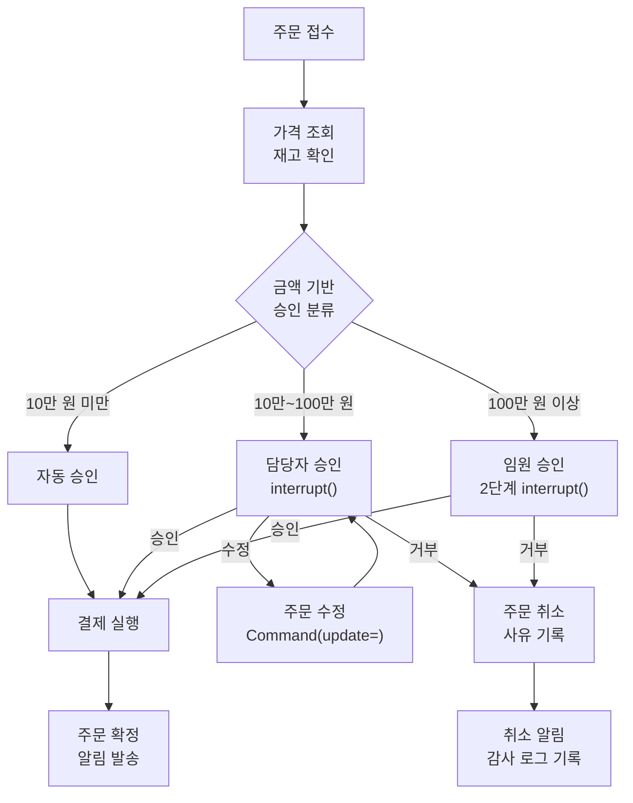
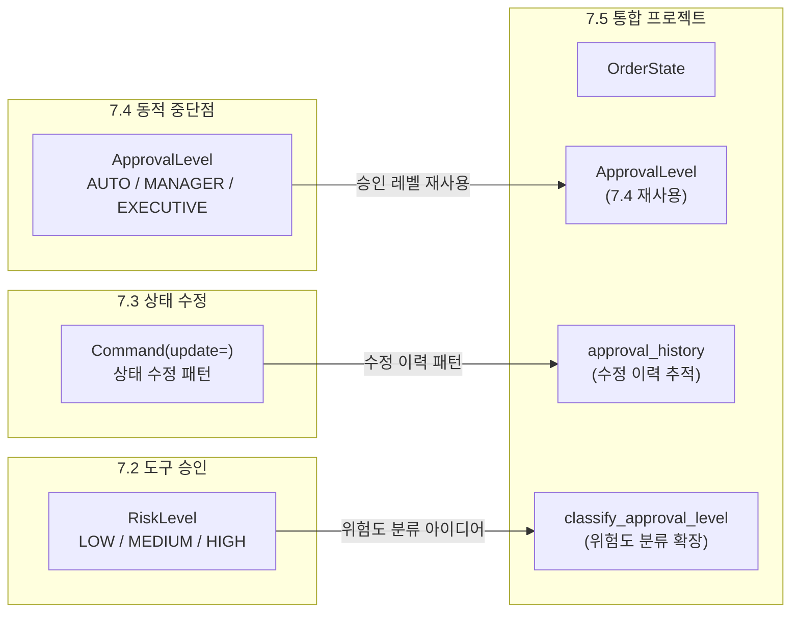
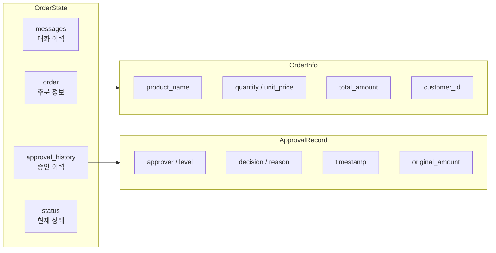
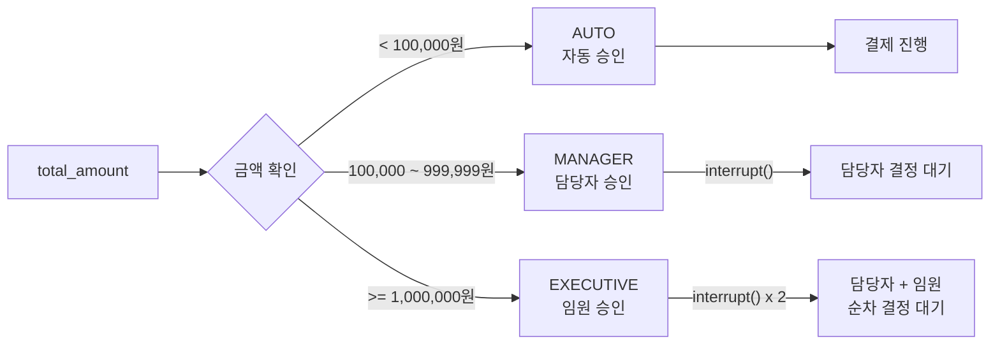
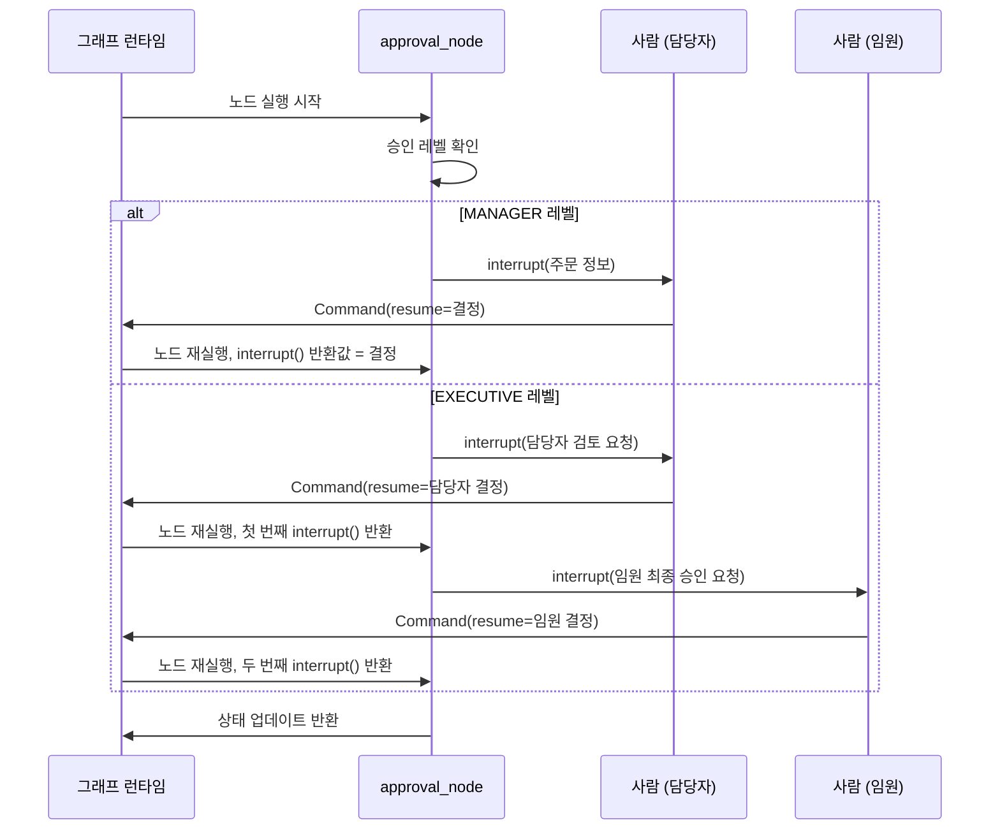
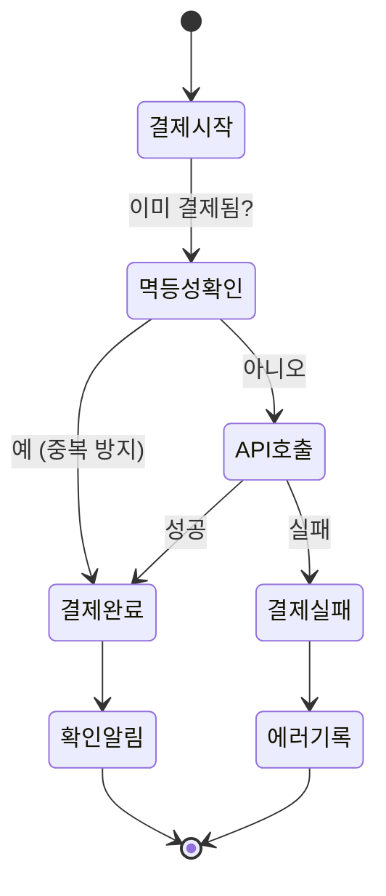

# HITL 실전 프로젝트

> Ch7의 모든 패턴을 하나로 — 주문 처리 에이전트로 정적/동적 인터럽트, 상태 수정, 조건부 승인을 통합합니다

## 개요

이 섹션에서는 Ch7 전체에서 학습한 Human-in-the-Loop 패턴들을 **하나의 엔드투엔드 주문 처리 에이전트**로 통합합니다. 가격 확인 → 사람 승인 → 결제 실행이라는 실제 비즈니스 워크플로우를 구축하면서, 각 패턴이 언제 왜 필요한지 체감할 수 있습니다.

**선수 지식**:
- [HITL 패턴 개관](07-ch7-human-in-the-loop-워크플로우/01-01-human-in-the-loop-패턴-개관.md)의 interrupt/Command(resume) 메커니즘
- [도구 호출 승인 워크플로우](07-ch7-human-in-the-loop-워크플로우/02-02-도구-호출-승인-워크플로우.md)의 정적/동적 승인 패턴
- [상태 수정과 피드백 주입](07-ch7-human-in-the-loop-워크플로우/03-03-상태-수정과-피드백-주입.md)의 update_state와 Command(update=)
- [동적 중단점과 조건부 승인](07-ch7-human-in-the-loop-워크플로우/04-04-동적-중단점과-조건부-승인.md)의 임계값 계층과 복수 인터럽트

**학습 목표**:
- 4가지 HITL 패턴(승인, 수정, 피드백, 조건부 승인)을 단일 그래프에 통합할 수 있다
- 금액/위험도 기반 다단계 승인 체계를 설계할 수 있다
- interrupt()와 Command(resume=)로 실제 비즈니스 워크플로우를 구현할 수 있다
- 멱등성과 에러 복구를 고려한 프로덕션 수준의 HITL 에이전트를 설계할 수 있다

## 왜 알아야 할까?

개별 HITL 패턴을 이해하는 것과 이를 **하나의 실전 시스템으로 조합**하는 것은 완전히 다른 문제입니다. 실제 비즈니스 워크플로우에서는 하나의 요청이 여러 단계의 검증을 거치게 되거든요.

온라인 쇼핑몰을 예로 들어볼까요? 고객이 100만 원짜리 노트북을 주문하면 어떤 일이 벌어질까요?

1. **가격 확인** — 재고가 있는지, 가격이 맞는지 자동 검증
2. **담당자 승인** — 고액 주문이니 매니저 승인 필요
3. **결제 실행** — 승인 후 실제 결제 처리
4. **주문 확정** — 배송 준비 시작

이 과정에서 매니저가 "가격을 5% 할인해주세요"라고 수정할 수도 있고, "이 고객은 블랙리스트니 거부합니다"라고 할 수도 있죠. 한 워크플로우 안에서 **자동 실행, 조건부 중단, 상태 수정, 승인/거부**가 모두 필요합니다.

이번 실전 프로젝트에서 이 모든 것을 하나로 엮어봅시다.

## 핵심 개념

### 개념 1: 통합 아키텍처 설계

> 💡 **비유**: 공항 보안 검색대를 떠올려보세요. 모든 승객이 X-ray 검사를 받지만, 금속 탐지기가 울린 사람만 정밀 검사를 받습니다. 외교관은 별도 라인으로 안내되고, 의심스러운 물품은 보안 책임자의 최종 판단을 기다립니다. 우리 에이전트도 마찬가지입니다 — 요청의 "위험도"에 따라 다른 수준의 검증을 적용합니다.

통합 에이전트의 핵심은 **언제 자동으로 처리하고, 언제 사람을 개입시킬지**를 명확히 구분하는 것입니다. 이를 위해 3계층 승인 체계를 설계합니다.

> 📊 **그림 1**: 주문 처리 에이전트의 전체 아키텍처



이 아키텍처에서 Ch7의 패턴들이 어떻게 조합되는지 정리하면:

| 단계 | 적용 패턴 | 출처 세션 |
|------|----------|----------|
| 가격/재고 확인 | 자동 도구 실행 | 7.1 기본 HITL |
| 금액 기반 분류 | 조건부 인터럽트 | 7.4 동적 중단점 |
| 담당자 승인 요청 | interrupt() + Command(resume=) | 7.2 도구 승인 |
| 주문 내용 수정 | update_state / Command(update=) | 7.3 상태 수정 |
| 2단계 임원 승인 | 복수 interrupt() | 7.4 복수 인터럽트 |
| 결제 후 확인 | 피드백 루프 | 7.3 피드백 주입 |

### 개념 2: 상태 스키마 설계 — 이전 세션 개념의 통합

> 💡 **비유**: 병원 진료 기록부처럼, 주문의 모든 이력을 하나의 상태에 기록합니다. 누가 언제 어떤 결정을 내렸는지, 수정 전 금액은 얼마였는지 — 나중에 감사(audit)할 때 빠짐없이 추적할 수 있어야 하거든요.

HITL 통합 에이전트의 상태는 단순한 데이터 저장소가 아닙니다. **의사결정 이력**까지 포함해야 합니다. 여기서 중요한 점은, 이번 프로젝트의 `OrderState`가 이전 세션에서 하나씩 발전시켜 온 개념들을 **하나로 모은 결과물**이라는 것입니다.

어떤 개념이 어디서 왔는지 짚어볼까요?

| 이전 세션 | 도입한 개념 | OrderState에서의 역할 |
|-----------|------------|---------------------|
| [7.2 도구 호출 승인](07-ch7-human-in-the-loop-워크플로우/02-02-도구-호출-승인-워크플로우.md) | `RiskLevel` (LOW/MEDIUM/HIGH) | 위험도 분류 아이디어 → `classify_approval_level()`의 3단계 분류로 발전 |
| [7.3 상태 수정](07-ch7-human-in-the-loop-워크플로우/03-03-상태-수정과-피드백-주입.md) | `Command(update=)` 패턴 | `approval_history`에 수정 이력 누적, `original_amount` 추적 |
| [7.4 동적 중단점](07-ch7-human-in-the-loop-워크플로우/04-04-동적-중단점과-조건부-승인.md) | `ApprovalLevel` (AUTO/MANAGER/EXECUTIVE) | 금액 임계값 기반 승인 레벨 **그대로 재사용** |

> 📊 **그림 2**: 이전 세션 개념이 OrderState로 통합되는 흐름



특히 7.4에서 정의한 `ApprovalLevel` 열거형을 그대로 가져와 사용하고, 7.2의 위험도 기반 분류 아이디어를 금액 임계값 기반으로 구체화한 것이 핵심입니다. 7.3의 상태 수정 패턴은 `approval_history`의 `original_amount` 필드로 이어져, 수정 전후의 변경 사항을 추적할 수 있게 됩니다.

> 📊 **그림 3**: 주문 상태 스키마의 구조



```python
from typing import TypedDict, Annotated, Literal
from langgraph.graph import add_messages
from datetime import datetime


class OrderInfo(TypedDict):
    """주문 상세 정보"""
    product_name: str
    quantity: int
    unit_price: float
    total_amount: float
    customer_id: str


class ApprovalRecord(TypedDict):
    """승인 이력 레코드
    7.3의 Command(update=) 패턴에서 영감을 받아,
    수정 시 원래 금액을 original_amount에 보존합니다.
    """
    approver: str
    level: str  # "auto", "manager", "executive" — 7.4 ApprovalLevel 기반
    decision: str  # "approved", "modified", "rejected"
    reason: str
    timestamp: str
    original_amount: float | None  # 수정 시 원래 금액 (7.3 상태 수정 패턴)


class OrderState(TypedDict):
    """주문 처리 에이전트 통합 상태

    이 상태 스키마는 Ch7 전체 세션의 개념을 통합합니다:
    - messages: 7.1의 기본 대화 상태
    - approval_history: 7.2의 RiskLevel 분류 + 7.3의 수정 이력 추적
    - status: 7.4의 ApprovalLevel 기반 상태 전이
    """
    messages: Annotated[list, add_messages]
    order: OrderInfo | None
    approval_history: list[ApprovalRecord]  # 리듀서 없이 교체 방식
    status: Literal[
        "pending", "price_checked", "awaiting_approval",
        "approved", "modified", "rejected",
        "payment_processing", "completed", "failed"
    ]
    error: str | None
```

핵심 포인트는 `approval_history`입니다. 리스트에 레코드를 누적하면서, 나중에 "누가 왜 이 주문을 수정했는지" 추적할 수 있습니다. 이것이 프로덕션 HITL 시스템에서 **감사 추적(Audit Trail)**의 기본이죠. 7.3에서 배운 `Command(update=)` 패턴이 여기서는 `original_amount` 필드로 구체화된 것입니다 — 단순히 상태를 덮어쓰는 게 아니라, **변경 전 값을 보존**하면서 수정합니다.

### 개념 3: 조건부 승인 라우터

> 💡 **비유**: 회사의 결재 규정을 떠올려보세요. 10만 원 미만 비품은 팀원이 바로 구매하고, 100만 원까지는 팀장 결재, 그 이상은 임원 결재가 필요하죠. 우리 에이전트도 동일한 임계값 계층을 구현합니다.

[동적 중단점과 조건부 승인](07-ch7-human-in-the-loop-워크플로우/04-04-동적-중단점과-조건부-승인.md)에서 배운 임계값 계층 패턴을 실전에 적용합니다. 7.4에서 정의한 `ApprovalLevel` 열거형을 그대로 가져오되, 주문 도메인에 맞는 구체적인 금액 임계값을 설정합니다. 또한 7.2에서 다룬 `RiskLevel`(LOW/MEDIUM/HIGH)의 3단계 분류 아이디어를 금액 기반으로 재해석한 것이기도 합니다.

> 📊 **그림 4**: 승인 레벨 라우팅 흐름



```python
from enum import Enum


# 7.4에서 정의한 ApprovalLevel을 그대로 사용합니다.
# 7.2의 RiskLevel(LOW/MEDIUM/HIGH)과 대응되지만,
# 주문 도메인에서는 금액 기반 분류가 더 직관적이므로
# ApprovalLevel(AUTO/MANAGER/EXECUTIVE)을 채택합니다.
class ApprovalLevel(Enum):
    AUTO = "auto"           # 자동 승인 (7.2의 LOW에 대응)
    MANAGER = "manager"     # 담당자 승인 (7.2의 MEDIUM에 대응)
    EXECUTIVE = "executive" # 임원 승인 (7.2의 HIGH에 대응)


# 금액 임계값 설정
APPROVAL_THRESHOLDS = {
    ApprovalLevel.AUTO: 100_000,       # 10만 원 미만
    ApprovalLevel.MANAGER: 1_000_000,  # 10만~100만 원
    # 100만 원 이상은 EXECUTIVE
}


def classify_approval_level(total_amount: float) -> ApprovalLevel:
    """금액 기반 승인 레벨 분류

    7.2의 RiskLevel 분류 패턴을 금액 임계값 기반으로 구체화한 버전입니다.
    7.4의 임계값 계층 패턴을 실전 적용합니다.
    """
    if total_amount < APPROVAL_THRESHOLDS[ApprovalLevel.AUTO]:
        return ApprovalLevel.AUTO
    elif total_amount < APPROVAL_THRESHOLDS[ApprovalLevel.MANAGER]:
        return ApprovalLevel.MANAGER
    else:
        return ApprovalLevel.EXECUTIVE
```

### 개념 4: 승인 노드와 복수 인터럽트

가장 핵심적인 부분 — 승인 노드에서 interrupt()를 사용해 사람의 결정을 기다리고, 결정에 따라 승인/수정/거부를 처리합니다.

> 📊 **그림 5**: 승인 노드 내부의 결정 흐름



여기서 중요한 점은 `interrupt()`의 **멱등성**입니다. 노드가 재실행될 때 이미 응답된 interrupt()는 즉시 저장된 값을 반환하고, 아직 응답되지 않은 다음 interrupt()에서 멈춥니다. 이 동작 원리를 [동적 중단점과 조건부 승인](07-ch7-human-in-the-loop-워크플로우/04-04-동적-중단점과-조건부-승인.md)에서 학습했죠.

```python
from langgraph.types import interrupt, Command


def approval_node(state: OrderState) -> dict:
    """통합 승인 노드 — 조건부 + 복수 인터럽트"""
    order = state["order"]
    level = classify_approval_level(order["total_amount"])
    history = list(state.get("approval_history", []))
    now = datetime.now().isoformat()

    # 자동 승인
    if level == ApprovalLevel.AUTO:
        history.append({
            "approver": "system",
            "level": "auto",
            "decision": "approved",
            "reason": f"금액 {order['total_amount']:,.0f}원 — 자동 승인 기준 이내",
            "timestamp": now,
            "original_amount": None,
        })
        return {
            "status": "approved",
            "approval_history": history,
        }

    # 담당자 승인 요청 (MANAGER + EXECUTIVE 모두)
    manager_decision = interrupt({
        "type": "manager_approval",
        "message": f"주문 승인 요청: {order['product_name']} "
                   f"x {order['quantity']}개, "
                   f"총 {order['total_amount']:,.0f}원",
        "order": order,
        "options": ["approve", "modify", "reject"],
    })

    # 담당자 거부 시 즉시 종료
    if manager_decision["decision"] == "reject":
        history.append({
            "approver": manager_decision.get("approver", "manager"),
            "level": "manager",
            "decision": "rejected",
            "reason": manager_decision.get("reason", ""),
            "timestamp": now,
            "original_amount": None,
        })
        return {
            "status": "rejected",
            "approval_history": history,
        }

    # 담당자 수정 시 주문 금액 변경 (7.3 상태 수정 패턴 적용)
    modified_order = dict(order)
    if manager_decision["decision"] == "modify":
        original_amount = order["total_amount"]
        modified_order.update(manager_decision.get("changes", {}))
        # 수량이나 단가가 변경되면 총액 재계산
        modified_order["total_amount"] = (
            modified_order["quantity"] * modified_order["unit_price"]
        )
        history.append({
            "approver": manager_decision.get("approver", "manager"),
            "level": "manager",
            "decision": "modified",
            "reason": manager_decision.get("reason", ""),
            "timestamp": now,
            "original_amount": original_amount,
        })
    else:
        history.append({
            "approver": manager_decision.get("approver", "manager"),
            "level": "manager",
            "decision": "approved",
            "reason": manager_decision.get("reason", "승인"),
            "timestamp": now,
            "original_amount": None,
        })

    # EXECUTIVE 레벨: 임원 2차 승인 필요 (7.4 복수 인터럽트 패턴)
    if level == ApprovalLevel.EXECUTIVE:
        exec_decision = interrupt({
            "type": "executive_approval",
            "message": f"[임원 승인 요청] 고액 주문: "
                       f"{modified_order['product_name']}, "
                       f"총 {modified_order['total_amount']:,.0f}원\n"
                       f"담당자 결정: {manager_decision['decision']}",
            "order": modified_order,
            "manager_decision": manager_decision,
            "options": ["approve", "reject"],
        })

        if exec_decision["decision"] == "reject":
            history.append({
                "approver": exec_decision.get("approver", "executive"),
                "level": "executive",
                "decision": "rejected",
                "reason": exec_decision.get("reason", ""),
                "timestamp": datetime.now().isoformat(),
                "original_amount": None,
            })
            return {
                "status": "rejected",
                "approval_history": history,
            }

        history.append({
            "approver": exec_decision.get("approver", "executive"),
            "level": "executive",
            "decision": "approved",
            "reason": exec_decision.get("reason", "최종 승인"),
            "timestamp": datetime.now().isoformat(),
            "original_amount": None,
        })

    return {
        "order": modified_order,
        "status": "approved",
        "approval_history": history,
    }
```

> ⚠️ **흔한 오해**: "interrupt()를 try/except로 감싸면 안 되나요?"라고 생각할 수 있는데, 절대 안 됩니다! interrupt()는 내부적으로 특수한 예외를 발생시켜 그래프 런타임에 "여기서 멈춰라"고 알립니다. bare `except`로 이를 잡아버리면 인터럽트 메커니즘 자체가 깨집니다.

### 개념 5: 결제 실행과 에러 복구

결제 노드는 실제 외부 API를 호출하는 **부수효과(side effect)**가 있는 노드입니다. 멱등성 보장이 특히 중요합니다.

> 📊 **그림 6**: 결제 노드의 안전한 실행 흐름



```python
import uuid


def process_payment(state: OrderState) -> dict:
    """결제 실행 노드 — 멱등성 보장"""
    order = state["order"]

    # 멱등성 체크: 이미 결제 처리된 상태라면 스킵
    if state["status"] == "completed":
        return {"status": "completed"}

    # 결제 처리 시뮬레이션
    payment_id = str(uuid.uuid4())[:8]
    try:
        # 실제 환경에서는 결제 API 호출
        # result = payment_api.charge(
        #     amount=order["total_amount"],
        #     customer_id=order["customer_id"],
        #     idempotency_key=f"order-{order['customer_id']}-{payment_id}"
        # )

        # 시뮬레이션: 항상 성공
        result = {
            "success": True,
            "payment_id": payment_id,
            "amount": order["total_amount"],
        }

        if result["success"]:
            return {
                "status": "completed",
                "messages": [{
                    "role": "assistant",
                    "content": (
                        f"결제 완료! (결제 ID: {result['payment_id']})\n"
                        f"상품: {order['product_name']} x {order['quantity']}개\n"
                        f"결제 금액: {order['total_amount']:,.0f}원"
                    ),
                }],
            }
    except Exception as e:
        return {
            "status": "failed",
            "error": f"결제 실패: {str(e)}",
        }
```

> 🔥 **실무 팁**: 결제 API를 호출할 때는 반드시 **멱등성 키(idempotency key)**를 사용하세요. 네트워크 타임아웃으로 노드가 재실행될 수 있고, 이때 같은 결제가 두 번 이뤄지면 심각한 문제가 됩니다. Stripe, 토스 등 대부분의 결제 API가 멱등성 키를 지원합니다.

## 실습: 직접 해보기

이제 모든 조각을 조합해서 완전한 주문 처리 에이전트를 구축합니다.

```python
"""
HITL 실전 프로젝트 — 주문 처리 에이전트
Ch7 전체 패턴 통합: 조건부 승인 + 상태 수정 + 복수 인터럽트 + 결제 실행

이전 세션과의 연결:
- ApprovalLevel: 7.4에서 정의한 열거형 재사용
- RiskLevel 개념: 7.2의 위험도 분류를 금액 임계값으로 구체화
- Command(update=) 패턴: 7.3의 상태 수정을 approval_history로 확장
"""

from typing import TypedDict, Annotated, Literal
from datetime import datetime
from enum import Enum
import uuid

from langgraph.graph import StateGraph, START, END, add_messages
from langgraph.types import interrupt, Command
from langgraph.checkpoint.memory import InMemorySaver


# ── 1. 상태 및 모델 정의 ──────────────────────────────
# 7.2의 RiskLevel + 7.3의 상태 수정 + 7.4의 ApprovalLevel을 통합

class OrderInfo(TypedDict):
    product_name: str
    quantity: int
    unit_price: float
    total_amount: float
    customer_id: str


class ApprovalRecord(TypedDict):
    approver: str
    level: str       # 7.4 ApprovalLevel 기반: "auto", "manager", "executive"
    decision: str    # "approved", "modified", "rejected"
    reason: str
    timestamp: str
    original_amount: float | None  # 7.3 상태 수정 패턴: 변경 전 값 보존


class OrderState(TypedDict):
    messages: Annotated[list, add_messages]
    order: OrderInfo | None
    approval_history: list[ApprovalRecord]
    status: Literal[
        "pending", "price_checked", "awaiting_approval",
        "approved", "modified", "rejected",
        "payment_processing", "completed", "failed"
    ]
    error: str | None


# ── 2. 승인 레벨 분류 ─────────────────────────────────
# 7.4의 ApprovalLevel을 재사용하고,
# 7.2의 RiskLevel 분류 아이디어를 금액 기반으로 구체화

class ApprovalLevel(Enum):
    AUTO = "auto"
    MANAGER = "manager"
    EXECUTIVE = "executive"


APPROVAL_THRESHOLDS = {
    ApprovalLevel.AUTO: 100_000,
    ApprovalLevel.MANAGER: 1_000_000,
}


def classify_approval_level(total_amount: float) -> ApprovalLevel:
    if total_amount < APPROVAL_THRESHOLDS[ApprovalLevel.AUTO]:
        return ApprovalLevel.AUTO
    elif total_amount < APPROVAL_THRESHOLDS[ApprovalLevel.MANAGER]:
        return ApprovalLevel.MANAGER
    else:
        return ApprovalLevel.EXECUTIVE


# ── 3. 시뮬레이션용 상품 DB ───────────────────────────

PRODUCT_CATALOG = {
    "무선 키보드": {"price": 45_000, "stock": 50},
    "4K 모니터": {"price": 550_000, "stock": 10},
    "맥북 프로 M4": {"price": 3_200_000, "stock": 5},
    "USB-C 허브": {"price": 25_000, "stock": 200},
}


# ── 4. 노드 함수들 ────────────────────────────────────

def receive_order(state: OrderState) -> dict:
    """주문 접수 및 검증"""
    order = state.get("order")
    if not order:
        return {
            "status": "failed",
            "error": "주문 정보가 없습니다.",
        }
    return {"status": "pending"}


def check_price_and_stock(state: OrderState) -> dict:
    """가격 조회 및 재고 확인"""
    order = state["order"]
    product = PRODUCT_CATALOG.get(order["product_name"])

    if not product:
        return {
            "status": "failed",
            "error": f"상품 '{order['product_name']}'을(를) 찾을 수 없습니다.",
        }

    if product["stock"] < order["quantity"]:
        return {
            "status": "failed",
            "error": (
                f"재고 부족: {order['product_name']} "
                f"(요청: {order['quantity']}개, 재고: {product['stock']}개)"
            ),
        }

    # 최신 가격으로 업데이트
    updated_order = dict(order)
    updated_order["unit_price"] = product["price"]
    updated_order["total_amount"] = product["price"] * order["quantity"]

    return {
        "order": updated_order,
        "status": "price_checked",
        "messages": [{
            "role": "assistant",
            "content": (
                f"가격 확인 완료: {order['product_name']} "
                f"x {order['quantity']}개\n"
                f"단가: {product['price']:,.0f}원, "
                f"총액: {updated_order['total_amount']:,.0f}원"
            ),
        }],
    }


def approval_node(state: OrderState) -> dict:
    """통합 승인 노드 — 조건부 인터럽트 + 복수 인터럽트"""
    order = state["order"]
    level = classify_approval_level(order["total_amount"])
    history = list(state.get("approval_history", []))
    now = datetime.now().isoformat()

    # ── 자동 승인 ──
    if level == ApprovalLevel.AUTO:
        history.append({
            "approver": "system",
            "level": "auto",
            "decision": "approved",
            "reason": f"금액 {order['total_amount']:,.0f}원 — 자동 승인",
            "timestamp": now,
            "original_amount": None,
        })
        return {
            "status": "approved",
            "approval_history": history,
            "messages": [{
                "role": "assistant",
                "content": f"자동 승인 완료 (금액 기준 이내)",
            }],
        }

    # ── 담당자 승인 요청 ──
    manager_decision = interrupt({
        "type": "manager_approval",
        "message": (
            f"[담당자 승인 요청]\n"
            f"상품: {order['product_name']} x {order['quantity']}개\n"
            f"총액: {order['total_amount']:,.0f}원\n"
            f"승인 레벨: {level.value}"
        ),
        "order": order,
        "options": ["approve", "modify", "reject"],
    })

    # 거부
    if manager_decision["decision"] == "reject":
        history.append({
            "approver": manager_decision.get("approver", "manager"),
            "level": "manager",
            "decision": "rejected",
            "reason": manager_decision.get("reason", "거부"),
            "timestamp": now,
            "original_amount": None,
        })
        return {
            "status": "rejected",
            "approval_history": history,
            "messages": [{
                "role": "assistant",
                "content": f"주문이 거부되었습니다: {manager_decision.get('reason', '')}",
            }],
        }

    # 수정 (7.3 상태 수정 패턴 적용)
    modified_order = dict(order)
    if manager_decision["decision"] == "modify":
        original_amount = order["total_amount"]
        changes = manager_decision.get("changes", {})
        modified_order.update(changes)
        modified_order["total_amount"] = (
            modified_order["quantity"] * modified_order["unit_price"]
        )
        history.append({
            "approver": manager_decision.get("approver", "manager"),
            "level": "manager",
            "decision": "modified",
            "reason": manager_decision.get("reason", "수정 승인"),
            "timestamp": now,
            "original_amount": original_amount,
        })
    else:
        history.append({
            "approver": manager_decision.get("approver", "manager"),
            "level": "manager",
            "decision": "approved",
            "reason": manager_decision.get("reason", "승인"),
            "timestamp": now,
            "original_amount": None,
        })

    # ── 임원 2차 승인 (EXECUTIVE만, 7.4 복수 인터럽트 패턴) ──
    if level == ApprovalLevel.EXECUTIVE:
        exec_decision = interrupt({
            "type": "executive_approval",
            "message": (
                f"[임원 최종 승인 요청]\n"
                f"상품: {modified_order['product_name']} "
                f"x {modified_order['quantity']}개\n"
                f"총액: {modified_order['total_amount']:,.0f}원\n"
                f"담당자 결정: {manager_decision['decision']}"
            ),
            "order": modified_order,
            "manager_history": history[-1],
            "options": ["approve", "reject"],
        })

        exec_now = datetime.now().isoformat()
        if exec_decision["decision"] == "reject":
            history.append({
                "approver": exec_decision.get("approver", "executive"),
                "level": "executive",
                "decision": "rejected",
                "reason": exec_decision.get("reason", "최종 거부"),
                "timestamp": exec_now,
                "original_amount": None,
            })
            return {
                "status": "rejected",
                "approval_history": history,
                "messages": [{
                    "role": "assistant",
                    "content": f"임원이 주문을 거부했습니다: {exec_decision.get('reason', '')}",
                }],
            }

        history.append({
            "approver": exec_decision.get("approver", "executive"),
            "level": "executive",
            "decision": "approved",
            "reason": exec_decision.get("reason", "최종 승인"),
            "timestamp": exec_now,
            "original_amount": None,
        })

    return {
        "order": modified_order,
        "status": "approved",
        "approval_history": history,
        "messages": [{
            "role": "assistant",
            "content": f"승인 완료! 결제를 진행합니다.",
        }],
    }


def process_payment(state: OrderState) -> dict:
    """결제 실행 — 멱등성 보장"""
    if state["status"] == "completed":
        return {"status": "completed"}

    order = state["order"]
    payment_id = str(uuid.uuid4())[:8]

    # 결제 시뮬레이션 (실제로는 외부 API 호출)
    return {
        "status": "completed",
        "messages": [{
            "role": "assistant",
            "content": (
                f"결제 완료!\n"
                f"결제 ID: {payment_id}\n"
                f"상품: {order['product_name']} x {order['quantity']}개\n"
                f"결제 금액: {order['total_amount']:,.0f}원\n"
                f"고객: {order['customer_id']}"
            ),
        }],
    }


# ── 5. 라우팅 함수 ────────────────────────────────────

def route_after_check(state: OrderState) -> str:
    """가격 확인 후 라우팅"""
    if state["status"] == "failed":
        return "end"
    return "approval"


def route_after_approval(state: OrderState) -> str:
    """승인 후 라우팅"""
    if state["status"] in ("rejected", "failed"):
        return "end"
    return "payment"


# ── 6. 그래프 구성 ─────────────────────────────────────

def build_order_agent():
    """주문 처리 에이전트 그래프 구성"""
    builder = StateGraph(OrderState)

    # 노드 등록
    builder.add_node("receive", receive_order)
    builder.add_node("check_price", check_price_and_stock)
    builder.add_node("approval", approval_node)
    builder.add_node("payment", process_payment)

    # 엣지 연결
    builder.add_edge(START, "receive")
    builder.add_edge("receive", "check_price")
    builder.add_conditional_edges("check_price", route_after_check, {
        "approval": "approval",
        "end": END,
    })
    builder.add_conditional_edges("approval", route_after_approval, {
        "payment": "payment",
        "end": END,
    })
    builder.add_edge("payment", END)

    # 체크포인터 필수!
    checkpointer = InMemorySaver()
    return builder.compile(checkpointer=checkpointer)
```

이제 3가지 시나리오를 실행해봅시다.

**시나리오 1: 소액 주문 — 자동 승인**

```run:python
# 시나리오 1: USB-C 허브 2개 (50,000원) — 자동 승인
graph = build_order_agent()
config = {"configurable": {"thread_id": "order-001"}}

result = graph.invoke({
    "messages": [{"role": "user", "content": "USB-C 허브 2개 주문합니다"}],
    "order": {
        "product_name": "USB-C 허브",
        "quantity": 2,
        "unit_price": 0,  # check_price에서 업데이트
        "total_amount": 0,
        "customer_id": "CUST-1001",
    },
    "approval_history": [],
    "status": "pending",
    "error": None,
}, config)

print(f"최종 상태: {result['status']}")
print(f"승인 이력: {len(result['approval_history'])}건")
for record in result["approval_history"]:
    print(f"  - [{record['level']}] {record['decision']}: {record['reason']}")
print(f"\n마지막 메시지: {result['messages'][-1].content}")
```

```output
최종 상태: completed
승인 이력: 1건
  - [auto] approved: 금액 50,000원 — 자동 승인

마지막 메시지: 결제 완료!
결제 ID: a3f7b2c1
상품: USB-C 허브 x 2개
결제 금액: 50,000원
고객: CUST-1001
```

**시나리오 2: 중간 금액 — 담당자 승인 + 수정**

```run:python
# 시나리오 2: 4K 모니터 1대 (550,000원) — 담당자 승인 필요
graph = build_order_agent()
config = {"configurable": {"thread_id": "order-002"}}

# 1단계: 주문 제출 → 담당자 승인 대기에서 중단
result = graph.invoke({
    "messages": [{"role": "user", "content": "4K 모니터 1대 주문"}],
    "order": {
        "product_name": "4K 모니터",
        "quantity": 1,
        "unit_price": 0,
        "total_amount": 0,
        "customer_id": "CUST-1002",
    },
    "approval_history": [],
    "status": "pending",
    "error": None,
}, config)

# 인터럽트 상태 확인
state = graph.get_state(config)
interrupt_info = state.tasks[0].interrupts[0].value
print(f"중단됨! 인터럽트 타입: {interrupt_info['type']}")
print(f"메시지: {interrupt_info['message']}")

# 2단계: 담당자가 10% 할인 수정 후 승인
result = graph.invoke(
    Command(resume={
        "decision": "modify",
        "approver": "김팀장",
        "reason": "VIP 고객 10% 할인 적용",
        "changes": {"unit_price": 495_000},  # 10% 할인
    }),
    config,
)

print(f"\n최종 상태: {result['status']}")
print(f"수정된 금액: {result['order']['total_amount']:,.0f}원")
for record in result["approval_history"]:
    print(f"  - [{record['level']}] {record['decision']}: {record['reason']}")
    if record["original_amount"]:
        print(f"    원래 금액: {record['original_amount']:,.0f}원")
```

```output
중단됨! 인터럽트 타입: manager_approval
메시지: [담당자 승인 요청]
상품: 4K 모니터 x 1개
총액: 550,000원
승인 레벨: manager

최종 상태: completed
수정된 금액: 495,000원
  - [manager] modified: VIP 고객 10% 할인 적용
    원래 금액: 550,000원
```

**시나리오 3: 고액 주문 — 2단계 승인 (담당자 + 임원)**

```run:python
# 시나리오 3: 맥북 프로 M4 2대 (6,400,000원) — 임원 승인 필요
graph = build_order_agent()
config = {"configurable": {"thread_id": "order-003"}}

# 1단계: 주문 제출
result = graph.invoke({
    "messages": [{"role": "user", "content": "맥북 프로 M4 2대 주문"}],
    "order": {
        "product_name": "맥북 프로 M4",
        "quantity": 2,
        "unit_price": 0,
        "total_amount": 0,
        "customer_id": "CUST-1003",
    },
    "approval_history": [],
    "status": "pending",
    "error": None,
}, config)

state = graph.get_state(config)
print(f"1차 중단: {state.tasks[0].interrupts[0].value['type']}")

# 2단계: 담당자 승인
result = graph.invoke(
    Command(resume={
        "decision": "approve",
        "approver": "김팀장",
        "reason": "신규 입사자 장비 — 예산 승인됨",
    }),
    config,
)

# 3단계: 임원 승인 대기에서 다시 중단
state = graph.get_state(config)
print(f"2차 중단: {state.tasks[0].interrupts[-1].value['type']}")

# 4단계: 임원 최종 승인
result = graph.invoke(
    Command(resume={
        "decision": "approve",
        "approver": "박이사",
        "reason": "IT 인프라 예산 범위 내 — 최종 승인",
    }),
    config,
)

print(f"\n최종 상태: {result['status']}")
print(f"승인 이력:")
for i, record in enumerate(result["approval_history"], 1):
    print(f"  {i}. [{record['level']}] {record['approver']}: "
          f"{record['decision']} - {record['reason']}")
```

```output
1차 중단: manager_approval
2차 중단: executive_approval

최종 상태: completed
승인 이력:
  1. [manager] 김팀장: approved - 신규 입사자 장비 — 예산 승인됨
  2. [executive] 박이사: approved - IT 인프라 예산 범위 내 — 최종 승인
```

## 더 깊이 알아보기

### Human-in-the-Loop의 기원 — 미사일 방어에서 AI 에이전트까지

"Human-in-the-Loop"라는 용어는 1960년대 **미국 국방부의 SAGE(Semi-Automatic Ground Environment) 시스템**에서 유래했습니다. 냉전 시대, 소련의 핵미사일을 감지하고 대응하는 방공 시스템에서 컴퓨터가 레이더 데이터를 분석하되, **최종 발사 결정은 반드시 인간 장교가 내리도록** 설계한 것이 HITL의 원형입니다.

1983년 소련 장교 스타니슬라프 페트로프(Stanislav Petrov)가 조기경보 시스템의 "핵미사일 발사 감지" 경보를 **오경보로 판단**하고 보복 발사를 하지 않은 사건은, 자동화 시스템에 인간 판단이 왜 필수적인지를 극적으로 보여줍니다. 만약 완전 자동화 시스템이었다면 핵전쟁이 시작되었을 겁니다.

오늘날 AI 에이전트에서의 HITL도 본질은 같습니다 — **되돌릴 수 없는 행동(결제, 삭제, 전송)** 앞에서 인간의 판단을 거치는 것. LangGraph의 interrupt/Command(resume) 패턴은 이 60년 된 원칙을 코드로 구현한 현대적 버전이라고 할 수 있습니다.

### LangGraph의 interrupt() 탄생 배경

LangGraph 초기 버전에서는 `interrupt_before`/`interrupt_after`(정적 인터럽트)만 지원했습니다. 하지만 실제 프로덕션에서는 "특정 조건에서만 멈추고 싶다"는 요구가 압도적으로 많았죠. 2024년 말 LangChain 팀이 Python의 `input()` 함수에서 영감을 받아 `interrupt()` 함수를 설계했습니다. `input()`처럼 호출 시점에 실행을 멈추고, 외부 입력을 받아 반환값으로 돌려주는 직관적인 API가 탄생한 겁니다.

## 흔한 오해와 팁

> ⚠️ **흔한 오해**: "interrupt() 전에 DB에 데이터를 저장해도 되겠지?" — 위험합니다! 노드는 resume 시 **처음부터 재실행**됩니다. interrupt() 전의 코드도 다시 실행되기 때문에, 비멱등적 작업(INSERT, 결제 API 호출 등)을 interrupt() 앞에 배치하면 중복 실행될 수 있습니다. 부수효과가 있는 작업은 반드시 interrupt() **뒤에** 배치하세요.

> 💡 **알고 계셨나요?**: LangGraph의 체크포인터는 interrupt 시점의 **전체 그래프 상태**를 직렬화해서 저장합니다. 이는 승인 대기가 몇 시간, 며칠이 걸려도 정확히 같은 지점에서 재개할 수 있다는 뜻입니다. 프로덕션에서는 `InMemorySaver` 대신 `AsyncPostgresSaver`나 `AsyncSqliteSaver`를 사용해 서버 재시작에도 상태가 유지되도록 합니다.

> 🔥 **실무 팁**: 감사 추적(Audit Trail)은 규제 산업에서 필수입니다. 이번 실습의 `approval_history` 패턴을 확장하여, 각 레코드에 IP 주소, 세션 ID, 타임스탬프를 추가하면 금융/의료 도메인의 규정 준수(compliance) 요건을 충족할 수 있습니다. LangSmith 트레이싱과 연동하면 더 강력한 감사 시스템이 됩니다.

## 핵심 정리

| 개념 | 설명 |
|------|------|
| 통합 아키텍처 | 자동 실행 + 조건부 인터럽트 + 상태 수정 + 복수 인터럽트를 하나의 그래프로 조합 |
| 이전 세션 통합 | 7.2 RiskLevel → 금액 분류, 7.3 Command(update=) → 수정 이력, 7.4 ApprovalLevel → 재사용 |
| 3계층 승인 체계 | AUTO(소액) → MANAGER(중간) → EXECUTIVE(고액) 금액 기반 동적 라우팅 |
| 조건부 interrupt() | 금액 임계값에 따라 인터럽트 여부를 동적으로 결정 |
| 복수 인터럽트 | EXECUTIVE 레벨에서 담당자 → 임원 순차 2단계 승인 |
| 상태 수정 패턴 | 승인자가 주문 내용(수량, 단가)을 수정 후 진행, original_amount로 변경 전 값 보존 |
| 감사 추적 | approval_history에 모든 결정 이력을 누적 기록 |
| 멱등성 보장 | 결제 노드의 중복 실행 방지, interrupt() 전 부수효과 금지 |
| 라우팅 분리 | 조건 분기 로직을 별도 함수로 분리하여 그래프 가독성 확보 |

## 다음 섹션 미리보기

Ch7에서 HITL 패턴의 이론과 실전을 모두 다루었습니다. 다음 [Ch8. 커스텀 도구 개발](08-ch8-커스텀-도구-개발/01-01-tool-데코레이터-심화.md)에서는 에이전트가 사용하는 **도구 자체를 직접 설계하고 구현**하는 방법을 배웁니다. `@tool` 데코레이터 심화, 복합 도구 설계 패턴, 비동기 외부 API 연동 등을 다루면서 — 이번 챕터에서 만든 주문 처리 에이전트의 도구들을 더 정교하게 발전시킬 수 있는 기반을 다지게 됩니다.

## 참고 자료

- [LangGraph Human-in-the-Loop 공식 가이드](https://docs.langchain.com/oss/python/langchain/human-in-the-loop) - interrupt/Command(resume) 패턴의 공식 레퍼런스
- [LangGraph Interrupts 공식 문서](https://docs.langchain.com/oss/python/langgraph/interrupts) - interrupt() 함수 API 레퍼런스와 정적/동적 인터럽트 비교
- [LangGraph 201: Adding Human Oversight to Your Deep Research Agent](https://towardsdatascience.com/langgraph-201-adding-human-oversight-to-your-deep-research-agent/) - HITL 패턴을 실제 에이전트에 적용하는 심층 튜토리얼
- [Making it easier to build human-in-the-loop agents with interrupt](https://blog.langchain.com/making-it-easier-to-build-human-in-the-loop-agents-with-interrupt/) - LangChain 팀의 interrupt() 설계 배경과 철학
- [LangGraph: Build Stateful AI Agents in Python (Real Python)](https://realpython.com/langgraph-python/) - StateGraph 기반 에이전트 구축 종합 튜토리얼

---
### 🔗 Related Sessions
- [stategraph](04-ch4-langgraph-stategraph-기초/01-01-langgraph-아키텍처-개관.md) (prerequisite)
- [inmemorysaver](06-ch6-체크포인트와-영속적-실행/02-02-메모리-및-sqlite-체크포인터.md) (prerequisite)
- [interrupt](07-ch7-human-in-the-loop-워크플로우/01-01-human-in-the-loop-패턴-개관.md) (prerequisite)
- [command](07-ch7-human-in-the-loop-워크플로우/01-01-human-in-the-loop-패턴-개관.md) (prerequisite)
- [add_messages](03-ch3-대화-메모리와-상태-관리/01-01-대화-메모리의-기초.md) (prerequisite)
- [interrupt_before](07-ch7-human-in-the-loop-워크플로우/02-02-도구-호출-승인-워크플로우.md) (prerequisite)
- [update_state](07-ch7-human-in-the-loop-워크플로우/03-03-상태-수정과-피드백-주입.md) (prerequisite)
- [approvallevel](07-ch7-human-in-the-loop-워크플로우/04-04-동적-중단점과-조건부-승인.md) (prerequisite)
- [interrupt_after](07-ch7-human-in-the-loop-워크플로우/02-02-도구-호출-승인-워크플로우.md) (prerequisite)
- [nodeinterrupt](07-ch7-human-in-the-loop-워크플로우/04-04-동적-중단점과-조건부-승인.md) (prerequisite)
