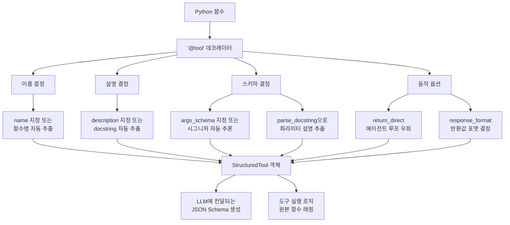
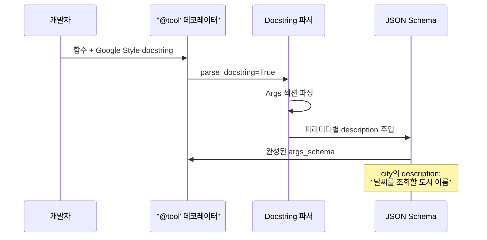
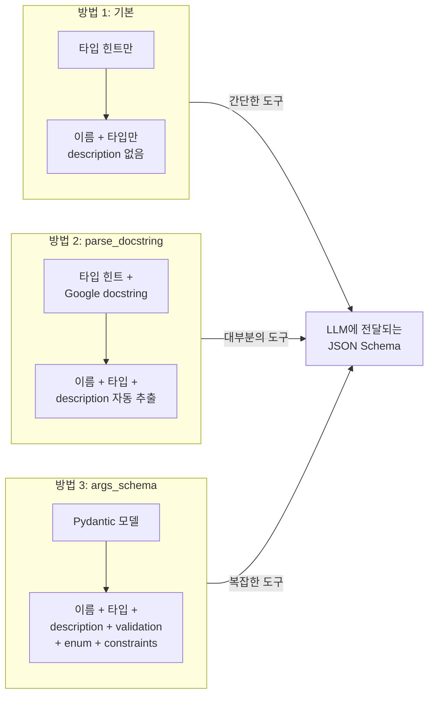
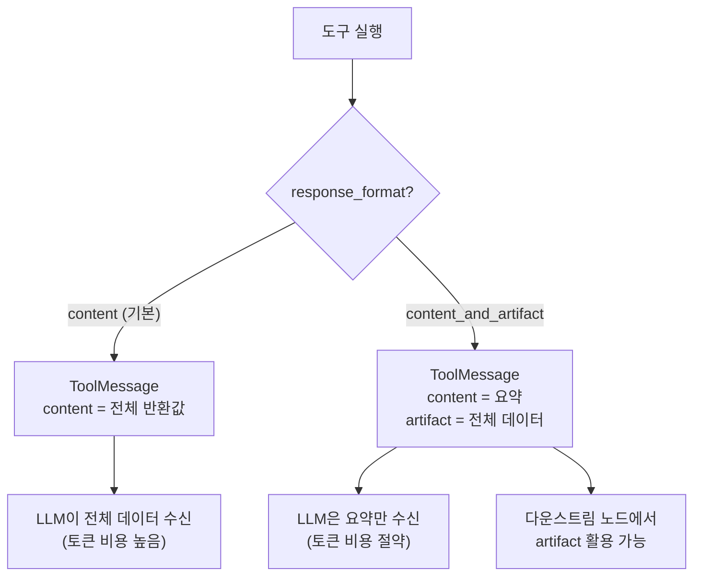
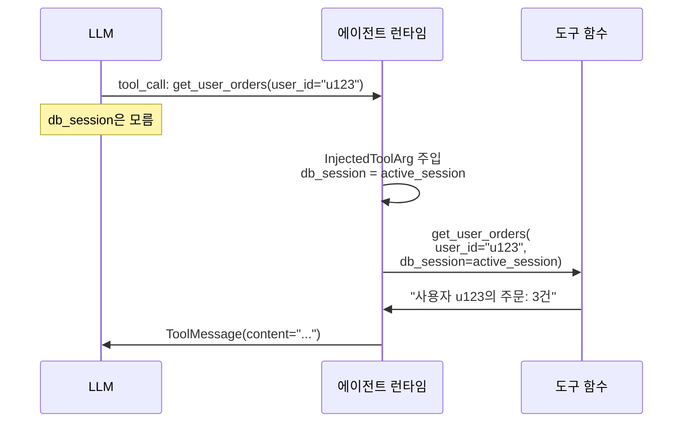

# @tool 데코레이터 심화

> LangChain `@tool` 데코레이터의 모든 옵션을 마스터하고, docstring 기반 스키마 자동 생성부터 `args_schema` 커스터마이징까지 도구 정의의 정석을 배웁니다.

## 개요

이 섹션에서는 LangChain의 `@tool` 데코레이터가 제공하는 다양한 옵션을 깊이 있게 살펴봅니다. 단순히 함수를 도구로 감싸는 것을 넘어, LLM이 도구를 정확하게 이해하고 호출할 수 있도록 스키마를 최적화하는 기법을 학습합니다.

**선수 지식**: [LLM Tool Calling 메커니즘](01-ch1-llm-도구-호출의-이해/02-02-llm-tool-calling-메커니즘.md)에서 배운 도구 호출의 기본 원리, [도구 실행 엔진 구축](01-ch1-llm-도구-호출의-이해/05-05-도구-실행-엔진-구축.md)에서 다룬 도구 실행 패턴

**학습 목표**:
- `@tool` 데코레이터의 전체 파라미터를 이해하고 상황에 맞게 활용할 수 있다
- `parse_docstring`을 활용한 자동 스키마 생성 원리를 설명할 수 있다
- Pydantic `args_schema`로 복잡한 입력 스키마를 정의할 수 있다
- `response_format`, `return_direct` 등 고급 옵션을 적재적소에 사용할 수 있다

## 왜 알아야 할까?

에이전트의 성능은 LLM의 추론 능력만큼이나 **도구가 얼마나 잘 정의되어 있느냐**에 달려 있습니다. 아무리 똑똑한 LLM이라도 도구의 이름이 모호하거나, 파라미터 설명이 부실하면 잘못된 도구를 호출하거나 엉뚱한 인자를 전달하게 됩니다.

실제로 프로덕션 에이전트에서 발생하는 오류의 상당수가 "도구 호출 실패"입니다. 함수 자체는 잘 동작하는데, LLM이 파라미터를 잘못 채워 넣는 거죠. 이 문제의 근본 원인은 **도구 스키마가 LLM에게 충분한 정보를 제공하지 못하기 때문**입니다.

`@tool` 데코레이터의 옵션들을 제대로 활용하면, LLM이 도구를 마치 잘 작성된 API 문서를 읽듯이 이해할 수 있게 됩니다. 이번 섹션은 그 정석을 알려드립니다.

## 핵심 개념

### 개념 1: @tool 데코레이터의 전체 시그니처

> 💡 **비유**: `@tool` 데코레이터는 **레스토랑 메뉴판**을 만드는 과정과 같습니다. 요리(함수) 자체도 중요하지만, 메뉴판에 요리 이름, 재료, 설명이 얼마나 잘 적혀있느냐가 손님(LLM)의 주문 정확도를 결정하죠.

`@tool` 데코레이터는 단순한 래퍼가 아니라, 도구의 모든 메타데이터를 제어하는 팩토리입니다. 전체 시그니처를 먼저 살펴보겠습니다.

```python
from langchain_core.tools import tool

@tool(
    name_or_callable=None,    # 도구 이름 (생략 시 함수명 사용)
    description=None,          # 도구 설명 (생략 시 docstring 사용)
    return_direct=False,       # True면 에이전트 루프 없이 바로 반환
    args_schema=None,          # Pydantic 모델로 입력 스키마 지정
    infer_schema=True,         # 함수 시그니처에서 스키마 자동 추론
    response_format="content", # "content" 또는 "content_and_artifact"
    parse_docstring=False,     # docstring에서 파라미터 설명 추출
    error_on_invalid_docstring=True,  # docstring 파싱 실패 시 에러
)
def my_tool(param: str) -> str:
    """도구 설명"""
    return result
```

> 📊 **그림 1**: `@tool` 데코레이터가 Python 함수를 StructuredTool로 변환하는 전체 흐름



각 옵션이 하는 역할을 정리하면 이렇습니다:

| 파라미터 | 기본값 | 역할 |
|---------|--------|------|
| `name_or_callable` | 함수명 | LLM이 호출할 도구 이름 |
| `description` | docstring | LLM이 도구 용도를 파악하는 설명 |
| `args_schema` | `None` | Pydantic 모델로 입력 스키마 명시 |
| `infer_schema` | `True` | 함수 시그니처에서 스키마 자동 추론 |
| `return_direct` | `False` | 에이전트 루프 우회 여부 |
| `response_format` | `"content"` | 반환값 포맷 (아티팩트 포함 여부) |
| `parse_docstring` | `False` | docstring에서 파라미터 설명 추출 |
| `error_on_invalid_docstring` | `True` | docstring 파싱 실패 시 에러 발생 여부 |

> 🔥 **실무 팁**: 도구 이름은 반드시 `snake_case`로 작성하세요. 일부 LLM 프로바이더는 하이픈이나 공백이 포함된 이름을 거부합니다. `alphanumeric + underscore + hyphen`만 사용하는 것이 안전합니다.

### 개념 2: docstring 기반 스키마 자동 생성

> 💡 **비유**: `parse_docstring`은 마치 **자동 번역기**와 같습니다. 개발자가 자연스럽게 작성한 함수 설명(docstring)을 LLM이 이해할 수 있는 구조화된 스키마(JSON Schema)로 자동 변환해주거든요.

`parse_docstring=True`를 설정하면, Google 스타일 docstring의 `Args:` 섹션에서 각 파라미터의 설명을 자동으로 추출하여 스키마에 반영합니다. 이것이 가장 간편하면서도 강력한 방법입니다.

```python
from langchain_core.tools import tool

# parse_docstring=False (기본값) — 파라미터 설명 없음
@tool
def search_weather(city: str, unit: str = "celsius") -> str:
    """주어진 도시의 현재 날씨를 조회합니다."""
    return f"{city}의 날씨: 맑음, 22도"

# parse_docstring=True — 파라미터 설명 자동 추출
@tool(parse_docstring=True)
def search_weather_v2(city: str, unit: str = "celsius") -> str:
    """주어진 도시의 현재 날씨를 조회합니다.

    Args:
        city: 날씨를 조회할 도시 이름 (예: "서울", "New York")
        unit: 온도 단위. "celsius" 또는 "fahrenheit" (기본값: celsius)
    """
    return f"{city}의 날씨: 맑음, 22도"
```

두 버전의 차이를 확인해보겠습니다:

```run:python
from langchain_core.tools import tool
import json

@tool
def search_weather(city: str, unit: str = "celsius") -> str:
    """주어진 도시의 현재 날씨를 조회합니다."""
    return f"{city}의 날씨: 맑음, 22도"

@tool(parse_docstring=True)
def search_weather_v2(city: str, unit: str = "celsius") -> str:
    """주어진 도시의 현재 날씨를 조회합니다.

    Args:
        city: 날씨를 조회할 도시 이름 (예: "서울", "New York")
        unit: 온도 단위. "celsius" 또는 "fahrenheit" (기본값: celsius)
    """
    return f"{city}의 날씨: 맑음, 22도"

print("=== parse_docstring=False ===")
print(json.dumps(search_weather.args_schema.model_json_schema(), indent=2, ensure_ascii=False))
print("\n=== parse_docstring=True ===")
print(json.dumps(search_weather_v2.args_schema.model_json_schema(), indent=2, ensure_ascii=False))
```

```output
=== parse_docstring=False ===
{
  "description": "주어진 도시의 현재 날씨를 조회합니다.",
  "properties": {
    "city": {
      "title": "City",
      "type": "string"
    },
    "unit": {
      "default": "celsius",
      "title": "Unit",
      "type": "string"
    }
  },
  "required": [
    "city"
  ],
  "title": "search_weather",
  "type": "object"
}

=== parse_docstring=True ===
{
  "description": "주어진 도시의 현재 날씨를 조회합니다.",
  "properties": {
    "city": {
      "description": "날씨를 조회할 도시 이름 (예: \"서울\", \"New York\")",
      "title": "City",
      "type": "string"
    },
    "unit": {
      "default": "celsius",
      "description": "온도 단위. \"celsius\" 또는 \"fahrenheit\" (기본값: celsius)",
      "title": "Unit",
      "type": "string"
    }
  },
  "required": [
    "city"
  ],
  "title": "search_weather_v2",
  "type": "object"
}
```

> 📊 **그림 2**: `parse_docstring`의 스키마 변환 흐름



핵심은 `parse_docstring=True`가 각 파라미터에 `description` 필드를 추가한다는 점입니다. 이 설명이 LLM에게 전달되어 **어떤 값을 넣어야 하는지** 정확하게 알려주는 역할을 합니다.

> ⚠️ **흔한 오해**: "`parse_docstring`이 기본적으로 활성화되어 있다"고 생각하는 분이 많은데, 기본값은 `False`입니다. 반드시 명시적으로 `True`로 설정해야 합니다. LangChain GitHub에서도 이를 기본값으로 바꿔야 한다는 [이슈 논의](https://github.com/langchain-ai/langchain/issues/34292)가 진행 중입니다.

docstring은 반드시 **Google 스타일**을 따라야 합니다:

```python
def example(param1: str, param2: int) -> str:
    """함수의 전체 설명.       # ← 첫 줄: 도구 description에 사용

    더 자세한 설명...          # ← (선택) 추가 설명

    Args:                      # ← 필수: 정확히 "Args:" 키워드
        param1: 첫 번째 파라미터 설명  # ← "파라미터명: 설명" 형식
        param2: 두 번째 파라미터 설명

    Returns:                   # ← (선택) 반환값 설명
        결과 문자열
    """
```

### 개념 3: Pydantic args_schema로 정교한 스키마 정의

> 💡 **비유**: `parse_docstring`이 **자동 스캔**이라면, `args_schema`는 **수제 설계도**입니다. 자동 스캔은 빠르고 편리하지만, 밸리데이션 규칙이나 복잡한 제약 조건은 직접 설계해야 정밀하게 표현할 수 있죠.

Pydantic 모델을 `args_schema`로 직접 전달하면, 타입 검증(validation), 기본값, 열거형(enum), 값 범위(constraints) 등을 세밀하게 제어할 수 있습니다.

```python
from langchain_core.tools import tool
from pydantic import BaseModel, Field
from typing import Literal

class WeatherInput(BaseModel):
    """날씨 조회 입력 스키마"""
    city: str = Field(
        description="날씨를 조회할 도시 이름 (예: '서울', 'Tokyo')"
    )
    unit: Literal["celsius", "fahrenheit"] = Field(
        default="celsius",
        description="온도 단위"
    )
    include_forecast: bool = Field(
        default=False,
        description="True면 3일간 예보도 포함"
    )

@tool(args_schema=WeatherInput)
def get_weather(city: str, unit: str = "celsius", include_forecast: bool = False) -> str:
    """현재 날씨와 선택적 예보를 조회합니다."""
    result = f"{city}: 맑음, 22°{'C' if unit == 'celsius' else 'F'}"
    if include_forecast:
        result += " | 3일 예보: 맑음→구름→비"
    return result
```

> 📊 **그림 3**: 세 가지 스키마 정의 방식 비교



`args_schema`를 사용하면 `Literal` 타입으로 허용 값 목록을 지정하거나, Pydantic의 `Field` 제약 조건을 활용할 수 있습니다:

```python
from pydantic import BaseModel, Field
from typing import Literal

class DatabaseQueryInput(BaseModel):
    """데이터베이스 쿼리 입력"""
    table: Literal["users", "orders", "products"] = Field(
        description="조회할 테이블 이름"
    )
    limit: int = Field(
        default=10,
        ge=1,       # 최솟값 1
        le=100,     # 최댓값 100
        description="반환할 최대 행 수 (1~100)"
    )
    columns: list[str] = Field(
        default=["*"],
        description="조회할 컬럼 목록. 기본값은 전체 컬럼"
    )
```

**언제 어떤 방식을 선택해야 할까요?**

| 상황 | 추천 방식 |
|------|----------|
| 파라미터 1~2개, 단순 타입 | 기본 (`infer_schema=True`) |
| 파라미터 설명이 중요한 대부분의 도구 | `parse_docstring=True` |
| 열거형, 값 범위, 중첩 객체 등 복잡한 입력 | `args_schema=PydanticModel` |
| 기존 Pydantic 모델을 재활용하고 싶을 때 | `args_schema=PydanticModel` |

### 개념 4: response_format과 도구 아티팩트

> 💡 **비유**: 식당에서 주문하면 보통 완성된 요리(content)만 받죠? 하지만 가끔은 요리와 함께 레시피 카드(artifact)도 받고 싶을 때가 있습니다. `response_format="content_and_artifact"`가 바로 그 역할입니다.

기본적으로 도구는 문자열이나 딕셔너리를 반환합니다. 하지만 `response_format="content_and_artifact"`를 사용하면, **LLM에게 보여줄 요약 내용**과 **다운스트림에서 사용할 전체 데이터**를 분리하여 반환할 수 있습니다.

```python
from langchain_core.tools import tool
from typing import Tuple

@tool(response_format="content_and_artifact")
def search_documents(query: str) -> Tuple[str, list[dict]]:
    """문서를 검색하여 관련 결과를 반환합니다.

    Args:
        query: 검색 쿼리 문자열
    """
    # 실제로는 벡터 DB나 검색 엔진 호출
    results = [
        {"id": 1, "title": "LangChain 소개", "score": 0.95, "content": "...전체 내용..."},
        {"id": 2, "title": "에이전트 패턴", "score": 0.87, "content": "...전체 내용..."},
    ]
    
    # content: LLM이 읽을 요약 (토큰 절약)
    summary = f"검색 결과 {len(results)}건: " + ", ".join(r["title"] for r in results)
    
    # artifact: 전체 데이터 (다운스트림에서 활용)
    return summary, results
```

> 📊 **그림 4**: `response_format` 옵션에 따른 데이터 흐름



이 패턴이 특히 유용한 경우는 검색 결과처럼 **전체 데이터는 크지만 LLM은 요약만 보면 되는** 상황입니다. 토큰 비용을 절약하면서도 전체 데이터를 파이프라인 내에서 활용할 수 있죠.

### 개념 5: InjectedToolArg — 런타임 인자 주입

> 💡 **비유**: 카페에서 주문할 때 고객은 "아메리카노 하나"만 말하지만, 바리스타는 내부적으로 **고객 멤버십 등급**을 확인해서 할인을 적용합니다. 고객(LLM)은 몰라도 되는 내부 정보를 시스템이 자동으로 주입하는 거죠.

`InjectedToolArg`는 LLM에게 노출되지 않지만, 런타임에 자동으로 주입되는 파라미터를 정의합니다. 사용자 인증 토큰, 데이터베이스 세션, 설정값 등 **LLM이 알 필요 없는** 컨텍스트를 전달할 때 사용합니다.

```python
from typing import Annotated
from langchain_core.tools import tool, InjectedToolArg

@tool(parse_docstring=True)
def get_user_orders(
    user_id: str,
    db_session: Annotated[object, InjectedToolArg],
    auth_token: Annotated[str, InjectedToolArg],
) -> str:
    """특정 사용자의 주문 내역을 조회합니다.

    Args:
        user_id: 조회할 사용자 ID
        db_session: 데이터베이스 세션 (런타임 주입)
        auth_token: 인증 토큰 (런타임 주입)
    """
    # db_session과 auth_token은 LLM 스키마에 포함되지 않음
    # 런타임에 시스템이 주입
    return f"사용자 {user_id}의 주문: 3건"
```

```run:python
from typing import Annotated
from langchain_core.tools import tool, InjectedToolArg
import json

@tool(parse_docstring=True)
def get_user_orders(
    user_id: str,
    db_session: Annotated[object, InjectedToolArg],
) -> str:
    """특정 사용자의 주문 내역을 조회합니다.

    Args:
        user_id: 조회할 사용자 ID
        db_session: 데이터베이스 세션 (런타임 주입)
    """
    return f"사용자 {user_id}의 주문: 3건"

# LLM에게 보이는 스키마 확인
schema = get_user_orders.get_input_schema().model_json_schema()
print("LLM이 보는 스키마:")
print(json.dumps(schema, indent=2, ensure_ascii=False))
print(f"\n스키마 필드: {list(schema.get('properties', {}).keys())}")
print("→ db_session은 스키마에 없음!")
```

```output
LLM이 보는 스키마:
{
  "description": "특정 사용자의 주문 내역을 조회합니다.",
  "properties": {
    "user_id": {
      "description": "조회할 사용자 ID",
      "title": "User Id",
      "type": "string"
    }
  },
  "required": [
    "user_id"
  ],
  "title": "get_user_orders",
  "type": "object"
}

스키마 필드: ['user_id']
→ db_session은 스키마에 없음!
```

> 📊 **그림 5**: InjectedToolArg의 동작 원리



## 실습: 직접 해보기

실제 에이전트에서 사용할 수 있는 도구 세트를 만들어보겠습니다. 세 가지 방식을 모두 활용하여 도구를 정의하고, 스키마를 비교합니다.

```python
"""@tool 데코레이터 심화 실습
세 가지 도구 정의 방식을 비교하고, 에이전트에서 활용합니다.
"""
from typing import Annotated, Literal, Tuple
from langchain_core.tools import tool, InjectedToolArg
from pydantic import BaseModel, Field
import json


# ━━━━━━━━━━━━━━━━━━━━━━━━━━━━━━━━━━━━━━━
# 1. 기본 방식 — 타입 힌트만으로 정의
# ━━━━━━━━━━━━━━━━━━━━━━━━━━━━━━━━━━━━━━━
@tool
def calculate_bmi(weight_kg: float, height_cm: float) -> str:
    """체질량지수(BMI)를 계산합니다."""
    height_m = height_cm / 100
    bmi = weight_kg / (height_m ** 2)
    if bmi < 18.5:
        category = "저체중"
    elif bmi < 25:
        category = "정상"
    elif bmi < 30:
        category = "과체중"
    else:
        category = "비만"
    return f"BMI: {bmi:.1f} ({category})"


# ━━━━━━━━━━━━━━━━━━━━━━━━━━━━━━━━━━━━━━━
# 2. parse_docstring 방식 — docstring에서 설명 자동 추출
# ━━━━━━━━━━━━━━━━━━━━━━━━━━━━━━━━━━━━━━━
@tool(parse_docstring=True)
def search_products(
    query: str,
    category: str = "all",
    max_results: int = 5,
) -> str:
    """상품을 검색하여 결과를 반환합니다.

    Args:
        query: 검색 키워드 (예: "무선 이어폰", "노트북 가방")
        category: 상품 카테고리 필터. "electronics", "books", "clothing", "all" 중 선택
        max_results: 반환할 최대 결과 수 (1~20, 기본값: 5)
    """
    # 실제로는 검색 엔진 API 호출
    return f"'{query}' 검색 결과 (카테고리: {category}): {max_results}건 표시"


# ━━━━━━━━━━━━━━━━━━━━━━━━━━━━━━━━━━━━━━━
# 3. args_schema 방식 — Pydantic 모델로 정교한 스키마
# ━━━━━━━━━━━━━━━━━━━━━━━━━━━━━━━━━━━━━━━
class FlightSearchInput(BaseModel):
    """항공편 검색 입력 스키마"""
    departure: str = Field(
        description="출발 공항 코드 (예: 'ICN', 'NRT')"
    )
    arrival: str = Field(
        description="도착 공항 코드 (예: 'LAX', 'SFO')"
    )
    date: str = Field(
        description="출발 날짜 (YYYY-MM-DD 형식)"
    )
    cabin_class: Literal["economy", "business", "first"] = Field(
        default="economy",
        description="좌석 등급"
    )
    passengers: int = Field(
        default=1,
        ge=1,
        le=9,
        description="탑승 인원 수 (1~9명)"
    )

@tool(args_schema=FlightSearchInput)
def search_flights(
    departure: str,
    arrival: str,
    date: str,
    cabin_class: str = "economy",
    passengers: int = 1,
) -> str:
    """항공편을 검색합니다."""
    return (
        f"{date} {departure}→{arrival} "
        f"({cabin_class}, {passengers}명): 3개 항공편 발견"
    )


# ━━━━━━━━━━━━━━━━━━━━━━━━━━━━━━━━━━━━━━━
# 4. response_format + InjectedToolArg 조합
# ━━━━━━━━━━━━━━━━━━━━━━━━━━━━━━━━━━━━━━━
@tool(parse_docstring=True, response_format="content_and_artifact")
def fetch_order_details(
    order_id: str,
    api_client: Annotated[object, InjectedToolArg],
) -> Tuple[str, dict]:
    """주문 상세 정보를 조회합니다.

    Args:
        order_id: 조회할 주문 번호 (예: "ORD-20260319-001")
        api_client: 내부 API 클라이언트 (시스템 주입)
    """
    # 실제로는 api_client를 사용하여 주문 조회
    full_data = {
        "order_id": order_id,
        "items": [
            {"name": "무선 이어폰", "qty": 1, "price": 89000},
            {"name": "케이스", "qty": 2, "price": 15000},
        ],
        "total": 119000,
        "status": "배송중",
        "tracking": "KR1234567890",
    }
    
    # content: LLM이 볼 요약
    summary = f"주문 {order_id}: {full_data['status']}, 총 {full_data['total']:,}원"
    
    # artifact: 전체 데이터
    return summary, full_data


# ━━━━━━━━━━━━━━━━━━━━━━━━━━━━━━━━━━━━━━━
# 스키마 비교 출력
# ━━━━━━━━━━━━━━━━━━━━━━━━━━━━━━━━━━━━━━━
tools = [calculate_bmi, search_products, search_flights, fetch_order_details]

for t in tools:
    schema = t.get_input_schema().model_json_schema()
    props = schema.get("properties", {})
    fields_info = []
    for name, info in props.items():
        desc = info.get("description", "(설명 없음)")
        fields_info.append(f"    {name}: {desc[:40]}")
    
    print(f"🔧 {t.name}")
    print(f"   설명: {t.description[:50]}")
    print(f"   파라미터:")
    print("\n".join(fields_info))
    print()
```

이 코드를 실행하면 네 가지 도구의 스키마가 얼마나 다른지 확인할 수 있습니다. `args_schema`를 사용한 `search_flights`가 가장 풍부한 메타데이터를 제공하는 것을 볼 수 있을 겁니다.

## 더 깊이 알아보기

### @tool 데코레이터의 탄생 배경

LangChain 초기(2022~2023)에는 도구를 만들려면 `BaseTool` 클래스를 상속받아 `_run` 메서드를 구현해야 했습니다. 간단한 함수 하나를 도구로 만드는 데도 10줄 이상의 보일러플레이트가 필요했죠.

```python
# 옛날 방식 (BaseTool 상속)
class SearchTool(BaseTool):
    name = "search"
    description = "검색을 수행합니다"
    args_schema = SearchInput  # Pydantic 모델
    
    def _run(self, query: str) -> str:
        return f"검색 결과: {query}"
```

이 불편함을 해소하기 위해 Harrison Chase(LangChain 창시자)와 커뮤니티가 **"함수만 작성하면 나머지는 자동으로"**라는 철학으로 `@tool` 데코레이터를 설계했습니다. Python의 `inspect` 모듈로 함수 시그니처를 분석하고, Pydantic을 활용해 동적으로 스키마를 생성하는 방식이었죠.

2024년 LangChain 0.2에서 `StructuredTool`이 강화되면서, `parse_docstring` 옵션이 추가되었습니다. 개발자가 이미 작성하는 docstring을 스키마에 활용하자는 아이디어였는데, 이는 OpenAPI 명세에서 코드 주석을 API 문서로 변환하는 Swagger/FastAPI의 접근법에서 영감을 받은 것입니다.

2025년 LangChain 1.0 릴리스에서는 `InjectedToolArg`, `response_format="content_and_artifact"` 등이 안정화되면서, `@tool` 데코레이터 하나로 프로덕션 수준의 도구를 정의할 수 있는 현재의 형태가 완성되었습니다.

### 도구 이름이 중요한 이유 — OpenAI의 내부 실험

OpenAI가 2023년 Function Calling을 발표할 때, 내부 실험에서 흥미로운 사실을 발견했습니다. **함수 이름만 바꿔도 호출 정확도가 최대 20%까지 달라졌다**는 것입니다. `get_weather`보다 `search_current_weather_by_city`가, `run_query`보다 `execute_sql_select_query`가 더 높은 정확도를 보였습니다. 이는 LLM이 도구 이름을 **의미론적으로 해석**하기 때문입니다.

## 흔한 오해와 팁

> ⚠️ **흔한 오해**: "docstring을 잘 쓰면 `args_schema`는 필요 없다"고 생각하기 쉽지만, `parse_docstring`은 **타입 제약(enum, 범위 등)을 표현할 수 없습니다**. `Literal["a", "b"]`이나 `ge=1, le=100` 같은 검증 규칙은 Pydantic `args_schema`에서만 가능합니다.

> 💡 **알고 계셨나요?**: `@tool` 데코레이터는 내부적으로 `StructuredTool.from_function()`을 호출합니다. 따라서 `@tool`로 만든 도구와 `StructuredTool.from_function()`으로 만든 도구는 완전히 동일한 객체입니다. 다만 데코레이터 문법이 훨씬 깔끔하죠.

> 🔥 **실무 팁**: 도구 설명(description)은 **LLM이 "이 도구를 써야 할까?"를 판단하는 유일한 근거**입니다. "날씨를 조회합니다"보다 "주어진 도시의 현재 기온, 습도, 날씨 상태를 실시간으로 조회합니다. 도시 이름이나 좌표를 입력받습니다"처럼 **언제, 무엇을, 어떻게** 사용하는지 명확하게 쓰세요.

> 🔥 **실무 팁**: `return_direct=True`는 도구의 결과를 에이전트 루프 없이 사용자에게 바로 반환합니다. **최종 답변을 생성하는 도구**(예: 포맷팅 도구, 보고서 생성 도구)에 적합하지만, 대부분의 도구는 LLM이 결과를 해석해야 하므로 기본값(`False`)을 유지하세요.

## 핵심 정리

| 개념 | 설명 |
|------|------|
| `@tool` 데코레이터 | 함수를 LangChain 도구로 변환. 이름·설명·스키마를 자동 추론 |
| `parse_docstring=True` | Google 스타일 docstring의 `Args:` 섹션에서 파라미터 설명 자동 추출 |
| `args_schema` | Pydantic 모델로 입력 스키마를 명시. enum, 범위 제약, 중첩 객체 등 지원 |
| `response_format` | `"content_and_artifact"`로 LLM용 요약과 전체 데이터를 분리 반환 |
| `InjectedToolArg` | LLM 스키마에 노출되지 않는 런타임 주입 파라미터 (인증, DB 세션 등) |
| `return_direct` | `True`면 도구 결과를 에이전트 루프 없이 바로 사용자에게 반환 |
| 도구 이름 규칙 | `snake_case`, 동사로 시작, 의미 명확한 이름 사용 |

## 다음 섹션 미리보기

이번 섹션에서 `@tool` 데코레이터의 옵션을 마스터했다면, 다음 [복합 도구 설계 패턴](08-ch8-커스텀-도구-개발/02-02-복합-도구-설계-패턴.md)에서는 여러 도구를 조합하여 복잡한 작업을 수행하는 패턴을 학습합니다. 도구 간 의존성 관리, `ToolNode`를 활용한 자동 실행, 그리고 `BaseTool` 클래스를 상속한 고급 도구 설계까지 다뤄볼 예정입니다.

## 참고 자료

- [LangChain Tools 공식 문서](https://docs.langchain.com/oss/python/langchain/tools) - `@tool` 데코레이터의 전체 가이드와 예제
- [LangChain @tool API 레퍼런스](https://reference.langchain.com/python/langchain-core/tools/convert/tool) - 전체 시그니처 및 파라미터 상세
- [LangChain & LangGraph 1.0 발표](https://blog.langchain.com/langchain-langgraph-1dot0/) - 도구 시스템 안정화를 포함한 1.0 릴리스 변경사항
- [LangGraph Workflows and Agents](https://docs.langchain.com/oss/python/langgraph/workflows-agents) - 에이전트에서 도구 활용 패턴
- [parse_docstring 기본값 변경 논의 (GitHub Issue #34292)](https://github.com/langchain-ai/langchain/issues/34292) - `parse_docstring=True`를 기본값으로 변경하자는 커뮤니티 논의