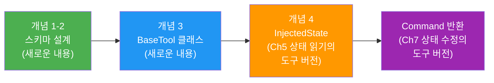
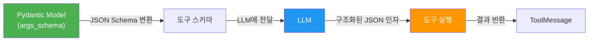
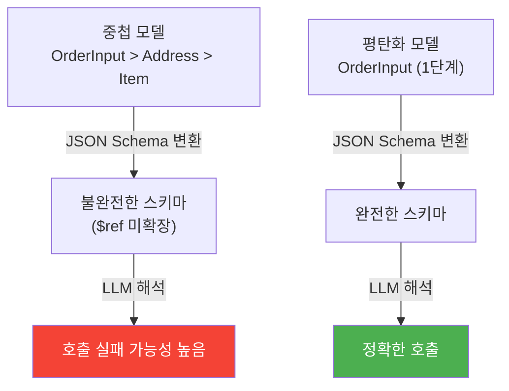
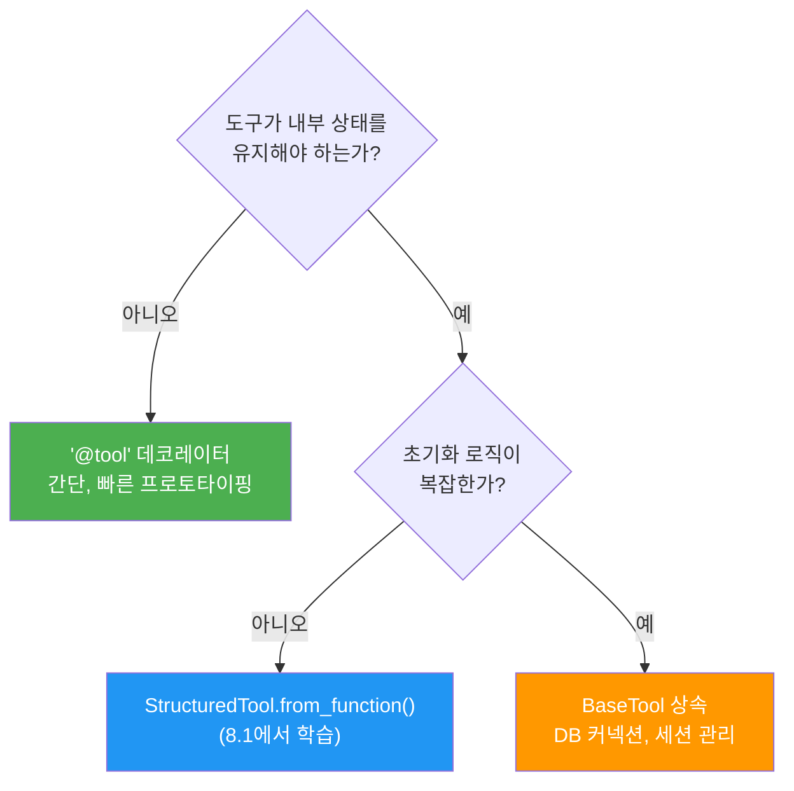
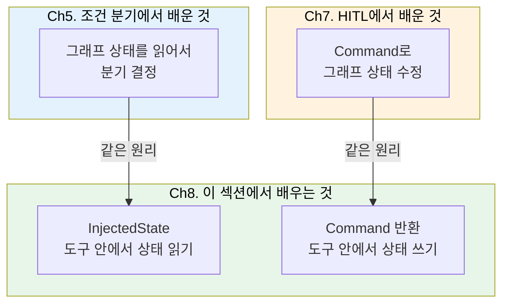
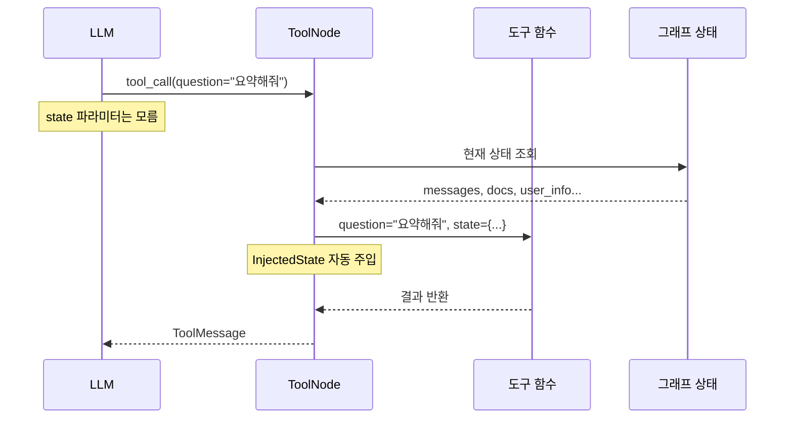
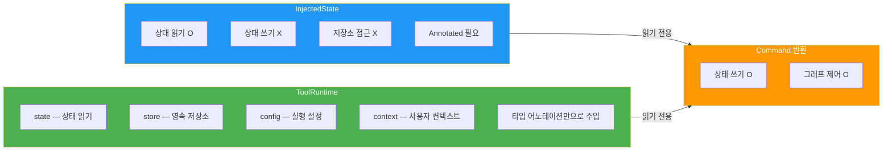

# 복합 도구 설계 패턴

> 다중 파라미터, 중첩 객체, 파일 입출력, 상태 접근까지 — 실전 도구 설계의 모든 것

## 개요

이 섹션에서는 단순한 단일 파라미터 도구를 넘어, 실무에서 마주하는 **복잡한 입출력 구조**를 가진 도구를 설계하는 패턴을 학습합니다. 다중 파라미터 도구, 중첩 Pydantic 모델을 활용한 스키마 설계, 파일 입출력 도구, 그리고 LangGraph의 `InjectedState`와 `ToolRuntime`을 통해 그래프 상태를 도구 안에서 활용하는 방법까지 다룹니다.

**선수 지식**: [01. @tool 데코레이터 심화](08-ch8-커스텀-도구-개발/01-01-tool-데코레이터-심화.md)에서 배운 `@tool` 데코레이터, `args_schema`, `StructuredTool`, `parse_docstring` 등의 기본 옵션
**학습 목표**:
- 다중 파라미터와 선택적 파라미터를 가진 도구를 설계할 수 있다
- Pydantic 모델로 복잡한 입력 스키마를 정의하고, 중첩 모델의 한계를 이해한다
- `BaseTool` 클래스를 상속하여 상태를 가진 도구를 구현할 수 있다
- `InjectedState`와 `ToolRuntime`으로 그래프 상태를 도구에 주입할 수 있다

> 💡 **이전 학습과의 연결**: 이 섹션 후반부에서 다루는 `InjectedState`와 `Command` 반환 패턴이 생소하게 느껴질 수 있는데요, 사실 이미 배운 개념의 **도구 버전**입니다. [Ch5. 조건 분기](05-ch5-조건부-분기와-라우팅/01-01-조건부-엣지와-라우팅-패턴.md)에서 그래프 상태를 기반으로 분기하는 패턴을 배웠고, [Ch7. Human-in-the-Loop](07-ch7-human-in-the-loop-워크플로우/03-03-상태-수정과-피드백-주입.md)에서는 `Command`로 그래프 상태를 수정하는 방법을 실습했죠. 이번에는 그 **같은 메커니즘을 "도구 안에서" 사용하는 방법**을 배우는 것뿐입니다. 전반부(개념 1~3)는 도구 스키마 설계에 집중하니 부담 없이 따라오시고, 후반부(개념 4)에서 친숙한 개념이 도구 컨텍스트로 확장되는 과정을 확인해보세요.

## 왜 알아야 할까?

실제 에이전트 시스템에서 도구는 "도시 이름 하나 받아서 날씨 알려주기" 같은 단순한 형태로 끝나지 않습니다. 주문 처리 도구는 상품 목록, 배송 주소, 결제 정보를 동시에 받아야 하고, 보고서 생성 도구는 현재 대화 상태를 참조해야 합니다. 이런 복합 도구를 **LLM이 정확히 호출할 수 있도록** 스키마를 설계하는 것이 에이전트 성능의 핵심입니다.

도구 스키마가 모호하면 LLM은 엉뚱한 인자를 넘기고, 너무 복잡하면 호출 자체를 포기합니다. 이 섹션에서 배우는 패턴들은 **"LLM이 이해하기 쉬우면서도 충분히 표현력 있는 도구"**를 만드는 실전 기술입니다.

> 📊 **그림 1**: 이 섹션의 학습 로드맵 — 스키마 설계에서 상태 접근까지



## 핵심 개념

### 개념 1: 다중 파라미터 도구와 스키마 최적화

> 💡 **비유**: 커피 주문을 생각해보세요. "아메리카노 한 잔"이라고만 하면 바리스타가 사이즈, 온도, 샷 수를 다 물어봐야 하죠. 하지만 주문서 양식이 있으면 — 음료 종류, 사이즈(S/M/L), 온도(핫/아이스), 샷 추가 여부 — 한 번에 정확히 주문할 수 있습니다. Pydantic `args_schema`가 바로 이 주문서 양식입니다.

다중 파라미터 도구에서 가장 중요한 것은 **각 파라미터의 의미를 LLM에게 명확히 전달하는 것**입니다. `Field`의 `description`이 곧 LLM이 읽는 설명서거든요.

> 📊 **그림 2**: 다중 파라미터 도구의 스키마 전달 흐름



기본적인 다중 파라미터 도구부터 살펴보겠습니다:

```python
from langchain_core.tools import tool
from pydantic import BaseModel, Field
from typing import Literal


class ProductSearchInput(BaseModel):
    """상품 검색 입력 스키마."""
    keyword: str = Field(description="검색 키워드")
    category: str = Field(
        default="all",
        description="상품 카테고리 (electronics, books, clothing, all)"
    )
    min_price: int = Field(
        default=0,
        description="최소 가격 (원)"
    )
    max_price: int = Field(
        default=1_000_000,
        description="최대 가격 (원)"
    )
    sort_by: Literal["price_asc", "price_desc", "rating", "newest"] = Field(
        default="rating",
        description="정렬 기준"
    )


@tool(args_schema=ProductSearchInput)
def search_products(
    keyword: str,
    category: str = "all",
    min_price: int = 0,
    max_price: int = 1_000_000,
    sort_by: str = "rating",
) -> str:
    """상품을 검색합니다. 카테고리, 가격 범위, 정렬 기준을 지정할 수 있습니다."""
    # 실제로는 DB 쿼리 또는 API 호출
    return (
        f"'{keyword}' 검색 결과 (카테고리: {category}, "
        f"가격: {min_price}~{max_price}원, 정렬: {sort_by}): "
        f"3개 상품 발견"
    )
```

여기서 핵심 포인트가 있습니다. `Literal` 타입을 사용하면 LLM이 **유효한 값만 선택**하도록 유도할 수 있어요. `sort_by: str`이라고만 하면 LLM이 "가격순", "price", "cheap_first" 같은 엉뚱한 값을 넘길 수 있지만, `Literal["price_asc", "price_desc", "rating", "newest"]`라고 명시하면 이 중에서만 고릅니다.

> ⚠️ **흔한 오해**: "파라미터가 많을수록 도구가 강력하다"고 생각하기 쉽지만, **파라미터가 7개를 넘으면 LLM의 호출 정확도가 급격히 떨어집니다**. 필수 파라미터는 3~4개 이내로 유지하고, 나머지는 적절한 기본값을 가진 선택 파라미터로 설계하세요.

### 개념 2: 중첩 객체 입력과 평탄화 전략

> 💡 **비유**: 택배 송장을 작성할 때, "보내는 사람"과 "받는 사람" 정보가 각각 이름/주소/전화번호를 가지죠. 프로그래머라면 자연스럽게 중첩 구조로 설계하겠지만, LLM은 **1단계 깊이의 평탄한(flat) 구조**를 훨씬 잘 이해합니다.

LangChain에서 중첩 Pydantic 모델을 `args_schema`로 사용하면 어떤 일이 벌어질까요? 결론부터 말하면, **완전히 지원되지 않습니다**. JSON Schema로 변환될 때 내부의 `$ref` 정의가 제대로 확장되지 않아서, LLM이 불완전한 스키마 정보를 받게 됩니다. 이 문제는 LangChain GitHub 이슈 #9375에서도 확인되었고, "NOT_PLANNED"으로 종료되었습니다.

> 📊 **그림 3**: 중첩 모델 vs 평탄화 모델의 LLM 호출 성공률



**잘못된 예 — 중첩 모델 (LLM이 실패할 수 있음)**:

```python
# ❌ 중첩 모델 — LLM이 내부 구조를 이해하지 못할 수 있음
class Address(BaseModel):
    city: str
    street: str
    zip_code: str

class OrderInput(BaseModel):
    product_id: str
    quantity: int
    shipping_address: Address  # 중첩!
```

**올바른 예 — 평탄화 전략**:

```python
# ✅ 평탄화된 모델 — LLM이 정확히 이해
class OrderInput(BaseModel):
    """주문 입력 스키마."""
    product_id: str = Field(description="주문할 상품 ID")
    quantity: int = Field(description="주문 수량", ge=1, le=100)
    shipping_city: str = Field(description="배송 도시")
    shipping_street: str = Field(description="배송 상세 주소")
    shipping_zip: str = Field(description="우편번호 (5자리)")


@tool(args_schema=OrderInput)
def place_order(
    product_id: str,
    quantity: int,
    shipping_city: str,
    shipping_street: str,
    shipping_zip: str,
) -> str:
    """상품을 주문합니다."""
    return (
        f"주문 완료: {product_id} x {quantity}개, "
        f"배송지: {shipping_city} {shipping_street} ({shipping_zip})"
    )
```

평탄화할 때 접두사 네이밍(`shipping_city`, `shipping_street`)을 사용하면 의미가 명확해집니다. LLM은 `_` 구분자를 보고 논리적 그룹을 파악할 수 있거든요.

**복잡한 리스트 입력이 필요한 경우**에는 어떻게 할까요? `List[str]` 같은 단순 리스트는 잘 동작하지만, `List[dict]`처럼 구조화된 리스트는 피하는 것이 좋습니다:

```python
class BatchSearchInput(BaseModel):
    """다중 검색 입력."""
    # ✅ 단순 리스트 — 잘 동작
    keywords: list[str] = Field(
        description="검색할 키워드 목록 (예: ['파이썬', '머신러닝'])"
    )
    # ✅ Literal 리스트 — 유효값 제한
    categories: list[Literal["tech", "science", "business"]] = Field(
        default=["tech"],
        description="검색할 카테고리 목록"
    )
```

> 🔥 **실무 팁**: 도구 하나에 모든 걸 담으려 하지 마세요. 주문 흐름이 복잡하다면, `search_product` → `add_to_cart` → `place_order` 처럼 **도구를 단계별로 분리**하는 것이 LLM 호출 정확도와 디버깅 편의성 모두에서 유리합니다.

### 개념 3: BaseTool 클래스 — 상태를 가진 도구

> 💡 **비유**: `@tool` 데코레이터가 **일회용 포스트잇**이라면, `BaseTool` 클래스는 **전용 사무실**입니다. DB 커넥션, API 클라이언트, 캐시 같은 장비를 사무실에 갖춰 놓고, 매번 요청이 올 때마다 재사용하는 거죠.

`@tool` 데코레이터로는 커버하기 어려운 경우가 있습니다. 도구가 **자체적인 상태**(DB 연결, API 세션, 캐시)를 유지해야 할 때, `BaseTool`을 상속하는 것이 적합합니다.

[이전 섹션](08-ch8-커스텀-도구-개발/01-01-tool-데코레이터-심화.md)에서 `StructuredTool.from_function()`을 배웠는데요, 이것은 **기존 함수를 감싸는** 래퍼 방식이었죠. `BaseTool`은 한 단계 더 나아가 **클래스 자체가 도구**가 됩니다. 실제로 `StructuredTool`도 내부적으로 `BaseTool`을 상속하고 있어요. 차이를 정리하면 이렇습니다:

- **`StructuredTool.from_function()`**: 이미 있는 함수를 도구로 변환. 상태 없는 간단한 케이스에 적합 (8.1에서 학습)
- **`BaseTool` 상속**: 클래스에 인스턴스 변수로 상태를 보유. 초기화 로직, DB 커넥션, 세션 관리가 필요한 복잡한 케이스에 적합

> 📊 **그림 4**: LangChain 도구 계층 구조와 사용 시점



`BaseTool`을 상속할 때 반드시 구현해야 하는 메서드는 `_run()`입니다. 비동기 실행이 필요하면 `_arun()`도 오버라이드합니다:

```python
from langchain_core.tools import BaseTool
from pydantic import BaseModel, Field
from typing import Type
import httpx


class APIQueryInput(BaseModel):
    """API 쿼리 입력."""
    endpoint: str = Field(description="API 엔드포인트 경로 (예: /users, /products)")
    method: str = Field(
        default="GET",
        description="HTTP 메서드 (GET 또는 POST)"
    )
    params: str = Field(
        default="",
        description="쿼리 파라미터 (key=value&key2=value2 형식)"
    )


class APIClientTool(BaseTool):
    """HTTP API 클라이언트 도구 — 내부에 세션을 유지합니다."""

    name: str = "api_client"
    description: str = "외부 REST API를 호출합니다. GET/POST 요청을 지원합니다."
    args_schema: Type[BaseModel] = APIQueryInput

    # 커스텀 인스턴스 변수
    base_url: str
    api_key: str = ""
    timeout: int = 30

    def _run(self, endpoint: str, method: str = "GET", params: str = "") -> str:
        """동기 실행."""
        url = f"{self.base_url}{endpoint}"
        headers = {"Authorization": f"Bearer {self.api_key}"} if self.api_key else {}
        query_params = dict(
            pair.split("=") for pair in params.split("&") if "=" in pair
        )

        with httpx.Client(timeout=self.timeout) as client:
            if method.upper() == "GET":
                response = client.get(url, headers=headers, params=query_params)
            else:
                response = client.post(url, headers=headers, json=query_params)

        return f"[{response.status_code}] {response.text[:500]}"

    async def _arun(self, endpoint: str, method: str = "GET", params: str = "") -> str:
        """비동기 실행."""
        url = f"{self.base_url}{endpoint}"
        headers = {"Authorization": f"Bearer {self.api_key}"} if self.api_key else {}

        async with httpx.AsyncClient(timeout=self.timeout) as client:
            if method.upper() == "GET":
                response = await client.get(url, headers=headers)
            else:
                response = await client.post(url, headers=headers)

        return f"[{response.status_code}] {response.text[:500]}"


# 인스턴스 생성 — 상태(base_url, api_key)가 유지됨
weather_api = APIClientTool(
    base_url="https://api.openweathermap.org/data/2.5",
    api_key="your-api-key-here",
    timeout=10,
)
```

`BaseTool`의 장점은 `base_url`, `api_key` 같은 설정이 **인스턴스 레벨에서 한 번만 초기화**되고, 이후 도구 호출마다 재사용된다는 점입니다. `@tool` 데코레이터로는 이런 패턴이 깔끔하지 않죠.

### 개념 4: InjectedState와 ToolRuntime — 그래프 상태 접근

여기서부터는 **도구가 그래프 상태를 읽고 쓰는 방법**을 다룹니다. 처음 보면 새로운 개념 같지만, 사실 이전 챕터에서 이미 배운 패턴의 확장입니다. 먼저 어떻게 연결되는지 정리해볼게요.

> 📊 **그림 5**: 이전 챕터에서 배운 개념이 도구 안으로 확장되는 과정



Ch5에서는 **노드 함수** 안에서 `state["messages"]`를 읽어 조건부 라우팅을 했었죠. `InjectedState`는 이것과 똑같은 일을 **도구 함수** 안에서 하는 것입니다. Ch7에서는 `Command(update={...})`로 상태를 수정했는데, 도구에서도 **같은 `Command` 객체를 반환**하면 됩니다. 새로운 메커니즘이 아니라, 이미 친숙한 패턴의 **사용 위치만 달라진 것**이에요.

간단한 비교로 먼저 감을 잡아보겠습니다:

```python
# Ch5에서 했던 것 — 노드 함수에서 상태 읽기
def route_by_intent(state: AgentState) -> str:
    messages = state["messages"]  # 상태 직접 접근
    last_msg = messages[-1].content
    return "search" if "검색" in last_msg else "general"

# Ch8에서 배우는 것 — 도구 함수에서 상태 읽기 (InjectedState)
@tool
def summarize_conversation(
    style: str,
    state: Annotated[dict, InjectedState],  # 프레임워크가 주입
) -> str:
    messages = state["messages"]  # 같은 방식으로 접근!
    return f"총 {len(messages)}개 메시지를 '{style}' 스타일로 요약"
```

```python
# Ch7에서 했던 것 — 노드에서 Command로 상태 수정
def human_feedback_node(state: AgentState) -> Command:
    return Command(update={"approved": True})

# Ch8에서 배우는 것 — 도구에서 Command로 상태 수정
@tool
def set_language(language: str, runtime: ToolRuntime) -> Command:
    return Command(update={"preferred_language": language, ...})
```

차이가 보이시나요? **원리는 완전히 동일**하고, 실행 주체가 "노드 함수"에서 "도구 함수"로 바뀌었을 뿐입니다. 그럼 이제 세부 사항을 살펴보겠습니다.

> 💡 **비유**: 회사에서 일할 때, 모든 직원이 자기 업무만 하는 게 아니라 **공유 문서함**(그래프 상태)을 참고하잖아요? `InjectedState`는 도구가 "지금 공유 문서함에 뭐가 있는지" 읽을 수 있게 해주는 열쇠이고, `ToolRuntime`은 문서함뿐 아니라 회의실 예약 현황(config), 보관함(store)까지 한꺼번에 접근할 수 있는 사원증입니다.

LangGraph 에이전트에서 도구가 **현재 대화 상태나 사용자 정보를 참조**해야 할 때, `InjectedState`를 사용합니다. 핵심은 이 파라미터가 **LLM의 도구 스키마에는 노출되지 않는다**는 것입니다. LLM은 이 파라미터의 존재를 모르고, LangGraph의 `ToolNode`가 실행 시점에 자동으로 주입합니다.

> 📊 **그림 6**: InjectedState와 ToolRuntime의 주입 메커니즘



**InjectedState — 전체 상태 주입**:

```python
from typing import Annotated
from langgraph.prebuilt import InjectedState
from langchain_core.tools import tool


@tool
def summarize_conversation(
    style: str,
    state: Annotated[dict, InjectedState],  # LLM에 노출 안 됨
) -> str:
    """현재 대화를 요약합니다.

    Args:
        style: 요약 스타일 (brief, detailed, bullet_points)
    """
    messages = state.get("messages", [])
    msg_count = len(messages)
    return f"총 {msg_count}개 메시지를 '{style}' 스타일로 요약합니다."
```

**InjectedState — 특정 필드만 주입**:

```python
@tool
def check_user_permissions(
    action: str,
    user_role: Annotated[str, InjectedState("user_role")],  # 특정 필드만
) -> str:
    """사용자 권한을 확인합니다.

    Args:
        action: 확인할 작업 (read, write, delete)
    """
    allowed = {
        "admin": ["read", "write", "delete"],
        "editor": ["read", "write"],
        "viewer": ["read"],
    }
    role_perms = allowed.get(user_role, [])
    if action in role_perms:
        return f"'{action}' 작업이 허용됩니다 (역할: {user_role})"
    return f"'{action}' 작업이 거부됩니다 (역할: {user_role})"
```

**ToolRuntime — 상태 + 저장소 + 컨텍스트 통합 접근**:

`ToolRuntime`은 LangChain 최신 버전에서 도입된 통합 런타임 객체입니다. `InjectedState`보다 더 많은 것을 제공합니다:

```python
from langchain_core.tools import tool, ToolRuntime


@tool
def get_user_history(
    query: str,
    runtime: ToolRuntime,  # 타입 어노테이션만으로 자동 주입
) -> str:
    """사용자의 과거 상호작용을 검색합니다.

    Args:
        query: 검색할 내용
    """
    # runtime.state — 현재 그래프 상태
    messages = runtime.state.get("messages", [])

    # runtime.config — 실행 설정 (thread_id 등)
    thread_id = runtime.config.get("configurable", {}).get("thread_id", "unknown")

    # runtime.store — 영속 저장소 접근
    if runtime.store:
        history = runtime.store.get(("user_history",), thread_id)
        if history:
            return f"과거 기록 발견: {history.value}"

    return f"스레드 {thread_id}에서 '{query}' 관련 기록 없음"
```

> 📊 **그림 7**: InjectedState vs ToolRuntime 비교



**Command 반환으로 상태 쓰기**:

`InjectedState`와 `ToolRuntime` 모두 **읽기 전용**입니다. 도구에서 그래프 상태를 **수정**하려면, [07. 상태 수정과 피드백 주입](07-ch7-human-in-the-loop-워크플로우/03-03-상태-수정과-피드백-주입.md)에서 배운 `Command`를 반환합니다. Ch7에서는 노드 함수가 `Command`를 반환했지만, 여기서는 **도구 함수가 반환**한다는 점만 다릅니다:

```python
from langgraph.types import Command
from langchain_core.messages import ToolMessage


@tool
def set_language(
    language: str,
    runtime: ToolRuntime,
) -> Command:
    """대화 언어를 설정합니다.

    Args:
        language: 설정할 언어 (ko, en, ja)
    """
    # Ch7의 Command와 완전히 같은 구조!
    # 차이점: tool_call_id를 ToolMessage에 포함해야 함
    return Command(
        update={
            "preferred_language": language,
            "messages": [
                ToolMessage(
                    content=f"언어가 '{language}'(으)로 설정되었습니다.",
                    tool_call_id=runtime.tool_call_id,
                )
            ],
        }
    )
```

> 💡 **Ch7과의 차이점 하나**: 노드에서 `Command`를 반환할 때는 `tool_call_id`가 필요 없었지만, 도구에서 반환할 때는 `ToolMessage`에 **반드시 `tool_call_id`를 포함**해야 합니다. LangGraph가 "이 응답이 어떤 도구 호출에 대한 것인지" 매칭하는 데 필요하거든요.

## 실습: 직접 해보기

전자상거래 에이전트의 도구 세트를 구축해봅시다. 다중 파라미터 검색, 상태 기반 장바구니, `BaseTool`을 활용한 재고 API 클라이언트를 조합합니다.

```python
"""전자상거래 에이전트 도구 세트 — 복합 도구 설계 패턴 실습."""

from typing import Annotated, Literal, Type
from pydantic import BaseModel, Field
from langchain_core.tools import tool, BaseTool, ToolRuntime
from langgraph.prebuilt import InjectedState, ToolNode
from langgraph.types import Command
from langchain_core.messages import ToolMessage


# ── 1. 다중 파라미터 검색 도구 ──

class ProductSearchInput(BaseModel):
    """상품 검색 입력."""
    keyword: str = Field(description="검색 키워드")
    category: Literal["electronics", "books", "clothing", "all"] = Field(
        default="all", description="상품 카테고리"
    )
    max_price: int = Field(default=500_000, description="최대 가격 (원)")
    sort_by: Literal["price", "rating", "newest"] = Field(
        default="rating", description="정렬 기준"
    )


# 모의 상품 DB
PRODUCTS = [
    {"id": "P001", "name": "파이썬 완전정복", "category": "books", "price": 32000, "rating": 4.8},
    {"id": "P002", "name": "무선 키보드", "category": "electronics", "price": 89000, "rating": 4.5},
    {"id": "P003", "name": "USB-C 허브", "category": "electronics", "price": 45000, "rating": 4.2},
]


@tool(args_schema=ProductSearchInput)
def search_products(
    keyword: str,
    category: str = "all",
    max_price: int = 500_000,
    sort_by: str = "rating",
) -> str:
    """상품을 검색합니다. 카테고리, 가격, 정렬 기준을 지정할 수 있습니다."""
    results = [
        p for p in PRODUCTS
        if keyword.lower() in p["name"].lower()
        and (category == "all" or p["category"] == category)
        and p["price"] <= max_price
    ]
    # 정렬
    sort_key = {"price": "price", "rating": "rating", "newest": "id"}
    results.sort(key=lambda x: x[sort_key.get(sort_by, "rating")], reverse=(sort_by == "rating"))

    if not results:
        return "검색 결과가 없습니다."
    lines = [f"- {p['name']} ({p['price']:,}원, ★{p['rating']})" for p in results]
    return f"검색 결과 ({len(results)}건):\n" + "\n".join(lines)


# ── 2. 상태 기반 장바구니 도구 (InjectedState) ──
# Ch5에서 그래프 상태를 읽어 분기했던 것처럼,
# 여기서는 도구 안에서 상태를 읽어 장바구니 정보를 활용합니다.

@tool
def add_to_cart(
    product_id: str,
    quantity: int,
    state: Annotated[dict, InjectedState],  # LLM에 노출 안 됨
) -> str:
    """장바구니에 상품을 추가합니다.

    Args:
        product_id: 상품 ID (예: P001)
        quantity: 수량
    """
    # 현재 장바구니 확인 — Ch5의 state["messages"] 접근과 동일한 패턴
    cart = state.get("cart", [])
    product = next((p for p in PRODUCTS if p["id"] == product_id), None)
    if not product:
        return f"상품 '{product_id}'를 찾을 수 없습니다."

    return (
        f"장바구니에 추가: {product['name']} x {quantity}개 "
        f"({product['price'] * quantity:,}원). "
        f"현재 장바구니: {len(cart) + 1}개 항목"
    )


# ── 3. BaseTool — 재고 확인 API 도구 ──

class InventoryCheckInput(BaseModel):
    """재고 확인 입력."""
    product_id: str = Field(description="확인할 상품 ID")
    warehouse: Literal["seoul", "busan", "all"] = Field(
        default="all", description="창고 위치"
    )


class InventoryChecker(BaseTool):
    """재고 확인 도구 — 내부 캐시를 유지합니다."""

    name: str = "check_inventory"
    description: str = "상품의 재고 상태를 확인합니다."
    args_schema: Type[BaseModel] = InventoryCheckInput

    # 모의 재고 데이터 (실제로는 DB 연결)
    inventory_cache: dict = {
        "P001": {"seoul": 150, "busan": 80},
        "P002": {"seoul": 0, "busan": 25},
        "P003": {"seoul": 42, "busan": 42},
    }

    def _run(self, product_id: str, warehouse: str = "all") -> str:
        stock = self.inventory_cache.get(product_id)
        if not stock:
            return f"상품 '{product_id}'의 재고 정보가 없습니다."

        if warehouse == "all":
            total = sum(stock.values())
            details = ", ".join(f"{k}: {v}개" for k, v in stock.items())
            return f"상품 {product_id} 총 재고: {total}개 ({details})"
        else:
            qty = stock.get(warehouse, 0)
            status = "재고 있음" if qty > 0 else "품절"
            return f"상품 {product_id} {warehouse} 창고: {qty}개 ({status})"


# ── 4. ToolRuntime 활용 도구 ──

@tool
def get_order_summary(runtime: ToolRuntime) -> str:
    """현재 대화의 주문 요약을 생성합니다."""
    messages = runtime.state.get("messages", [])
    cart = runtime.state.get("cart", [])
    thread_id = runtime.config.get("configurable", {}).get("thread_id", "unknown")

    return (
        f"[스레드 {thread_id}] "
        f"대화 {len(messages)}턴, "
        f"장바구니 {len(cart)}개 항목"
    )


# ── 도구 모음 ──

inventory_checker = InventoryChecker()

tools = [search_products, add_to_cart, inventory_checker, get_order_summary]
```

이 도구들을 LangGraph에 통합하는 코드입니다:

```run:python
from pydantic import BaseModel, Field
from typing import Annotated, Literal, Type
from langchain_core.tools import tool, BaseTool

# 도구 스키마 확인 — LLM이 실제로 받는 정보
class ProductSearchInput(BaseModel):
    keyword: str = Field(description="검색 키워드")
    category: Literal["electronics", "books", "clothing", "all"] = Field(
        default="all", description="상품 카테고리"
    )
    max_price: int = Field(default=500_000, description="최대 가격 (원)")

@tool(args_schema=ProductSearchInput)
def search_products(keyword: str, category: str = "all", max_price: int = 500_000) -> str:
    """상품을 검색합니다."""
    return f"'{keyword}' 검색 완료"

# LLM에 전달되는 스키마 출력
schema = search_products.get_input_schema().model_json_schema()
print("도구 이름:", search_products.name)
print("파라미터:", list(schema.get("properties", {}).keys()))
print("필수 파라미터:", schema.get("required", []))
```

```output
도구 이름: search_products
파라미터: ['keyword', 'category', 'max_price']
필수 파라미터: ['keyword']
```

`InjectedState` 파라미터가 스키마에서 제외되는지 확인해보겠습니다:

```run:python
from typing import Annotated
from langchain_core.tools import tool

# InjectedState는 임포트 없이 시뮬레이션
# (실제로는 from langgraph.prebuilt import InjectedState)

@tool
def my_tool(
    query: str,
    count: int = 5,
) -> str:
    """검색을 수행합니다.

    Args:
        query: 검색어
        count: 결과 수
    """
    return f"검색: {query}, {count}건"

schema = my_tool.get_input_schema().model_json_schema()
print("LLM이 보는 파라미터:", list(schema.get("properties", {}).keys()))
print("→ InjectedState/ToolRuntime 파라미터는 여기 없음 (자동 제외)")
```

```output
LLM이 보는 파라미터: ['query', 'count']
→ InjectedState/ToolRuntime 파라미터는 여기 없음 (자동 제외)
```

## 더 깊이 알아보기

### 도구 스키마의 역사 — "함수 호출"에서 "도구 호출"로

OpenAI가 2023년 6월 "Function Calling"을 처음 발표했을 때, 도구는 단순히 `{"name": "fn", "parameters": {...}}` 형태의 JSON Schema로 기술되었습니다. 그런데 놀랍게도 이 아이디어의 뿌리는 더 오래전으로 거슬러 올라갑니다. 2022년 Google DeepMind의 **Toolformer** 논문은 LLM이 스스로 도구 사용법을 학습할 수 있다는 것을 보여줬고, 이것이 "LLM + 외부 도구" 패러다임의 시작이었습니다.

LangChain 초기에는 `Tool` 클래스가 **단일 문자열 입력**만 지원했습니다. `"검색어: 파이썬, 카테고리: 교육"` 같은 문자열을 파싱해야 했죠! 이후 `StructuredTool`이 등장하면서 다중 파라미터 지원이 가능해졌고([이전 섹션](08-ch8-커스텀-도구-개발/01-01-tool-데코레이터-심화.md)에서 `StructuredTool.from_function()`을 다뤘습니다), 현재의 `@tool` 데코레이터 + Pydantic 모델 조합은 그 진화의 최종 형태입니다. 이번 섹션에서 다룬 `BaseTool`은 `StructuredTool`의 부모 클래스로, 도구 계층의 최상위에 위치합니다. 그리고 가장 최근에는 `ToolRuntime`이 추가되어, 도구가 실행 컨텍스트 전체에 접근할 수 있는 시대가 되었습니다.

### InjectedState의 탄생 배경

LangGraph 팀이 `InjectedState`를 도입한 이유는 명확했습니다. 에이전트 도구가 "현재 대화에서 사용자가 뭐라고 했지?"를 알아야 하는 경우가 너무 많았거든요. 그런데 이 정보를 LLM이 도구 인자로 전달하게 만들면 — 예를 들어 `summarize(messages=[...전체 대화...])` — 토큰 낭비가 어마어마합니다. 대화 내용이 이미 LLM 컨텍스트에 있는데, 다시 도구 인자로 보내는 셈이니까요. `InjectedState`는 이 문제를 **프레임워크 레벨에서 해결**한 것입니다.

## 흔한 오해와 팁

> ⚠️ **흔한 오해**: "`InjectedState`로 상태를 받았으니 바로 수정하면 되겠지?" — 아닙니다. `InjectedState`와 `ToolRuntime`은 **읽기 전용**입니다. 상태를 수정하려면 반드시 `Command` 객체를 반환해야 합니다. 직접 `state["key"] = value`를 하면 변경이 그래프에 반영되지 않습니다. 이것은 Ch7에서 배운 것과 같은 원칙이에요 — 상태 수정은 항상 `Command`를 통해야 LangGraph가 올바르게 추적할 수 있습니다.

> 💡 **알고 계셨나요?**: `ToolRuntime`의 `tool_call_id`는 LLM이 생성한 고유 ID입니다. `Command`로 상태를 업데이트할 때 `ToolMessage`에 이 ID를 포함해야 LangGraph가 어떤 도구 호출의 응답인지 매칭할 수 있습니다. 이걸 빠뜨리면 실행이 멈추는 미스터리한 버그가 발생할 수 있어요.

> 🔥 **실무 팁**: `BaseTool` 클래스에서 인스턴스 변수로 선언한 필드(`base_url`, `api_key` 등)는 Pydantic v2 모델의 필드가 됩니다. `args_schema`와 혼동되지 않도록, 도구 인자로 노출하고 싶지 않은 설정 값에는 반드시 별도의 `args_schema` 클래스를 명시적으로 지정하세요.

> 🔥 **실무 팁**: `config`와 `runtime`이라는 이름은 LangChain 내부에서 **예약된 파라미터명**입니다. 도구 함수의 인자 이름으로 사용하면 안 됩니다. 의도치 않게 DI(Dependency Injection) 시스템과 충돌할 수 있어요.

## 핵심 정리

| 개념 | 설명 |
|------|------|
| 다중 파라미터 스키마 | Pydantic `Field`의 `description`과 `Literal` 타입으로 LLM의 호출 정확도를 높임 |
| 평탄화 전략 | 중첩 Pydantic 모델 대신 접두사 네이밍(`shipping_city`)으로 1단계 평탄 구조 유지 |
| `BaseTool` 상속 | `StructuredTool`의 부모 클래스. 상태를 가진 도구(DB 커넥션, 캐시)에 적합. `_run()` 메서드 구현 필수 |
| `InjectedState` | 그래프 상태를 도구에 읽기 전용으로 주입. Ch5의 상태 읽기 패턴의 도구 버전. LLM 스키마에 노출 안 됨 |
| `ToolRuntime` | state + store + config + context 통합 접근. 타입 어노테이션으로 자동 주입 |
| `Command` 반환 | 도구에서 그래프 상태를 수정할 유일한 방법. Ch7의 Command와 동일 원리. `tool_call_id` 매칭 필수 |
| 파라미터 설계 | 필수 3~4개 이내, 나머지는 기본값 있는 선택 파라미터. 7개 초과 시 호출 정확도 하락 |

## 다음 섹션 미리보기

도구의 구조를 잡았으니, 이제 **속도**를 높일 차례입니다. [03. 비동기 도구와 외부 API 연동](08-ch8-커스텀-도구-개발/03-03-비동기-도구와-외부-api-연동.md)에서는 `async def _arun()`을 활용한 비동기 도구 구현, 여러 외부 API를 동시에 호출하는 패턴, 그리고 스트리밍 응답을 반환하는 도구를 다룹니다. 특히 실전에서 자주 마주하는 "API 타임아웃 처리"와 "동시 호출 제한(rate limiting)" 패턴도 함께 배웁니다.

## 참고 자료

- [LangChain Tools 공식 문서](https://docs.langchain.com/oss/python/langchain/tools) - @tool, BaseTool, ToolRuntime 등 도구 시스템 전체 레퍼런스
- [LangGraph Prebuilt ToolNode 소스코드](https://github.com/langchain-ai/langgraph/blob/main/libs/prebuilt/langgraph/prebuilt/tool_node.py) - ToolNode가 InjectedState를 처리하는 내부 구현
- [LangGraph에서 도구로 그래프 상태 수정하기](https://changelog.langchain.com/announcements/modify-graph-state-from-tools-in-langgraph) - Command 반환을 통한 상태 쓰기 패턴 공식 발표
- [LangChain 커뮤니티 포럼: InjectedStore vs InjectedState vs ToolRuntime](https://forum.langchain.com/t/difference-between-injectedstore-injectedstate-toolruntime-runtime-context/1995) - 세 가지 주입 방식의 차이를 상세히 비교하는 커뮤니티 토론
- [LangGraph 공식 문서: Workflows and Agents](https://docs.langchain.com/oss/python/langgraph/workflows-agents) - 에이전트 워크플로우에서 도구 활용 패턴

---
### 🔗 Related Sessions
- [args_schema](08-ch8-커스텀-도구-개발/01-01-tool-데코레이터-심화.md) (prerequisite)
- [parse_docstring](08-ch8-커스텀-도구-개발/01-01-tool-데코레이터-심화.md) (prerequisite)
