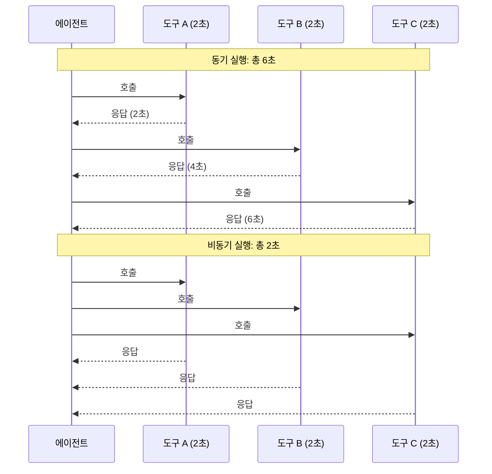
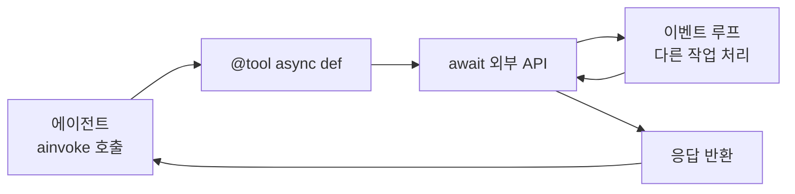
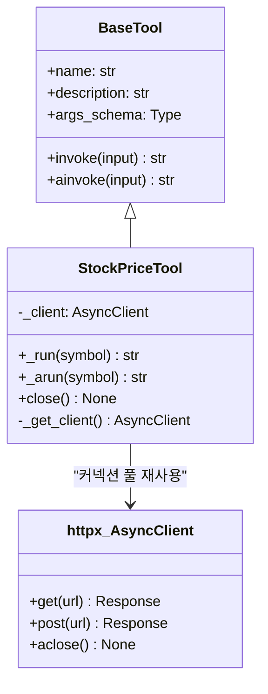
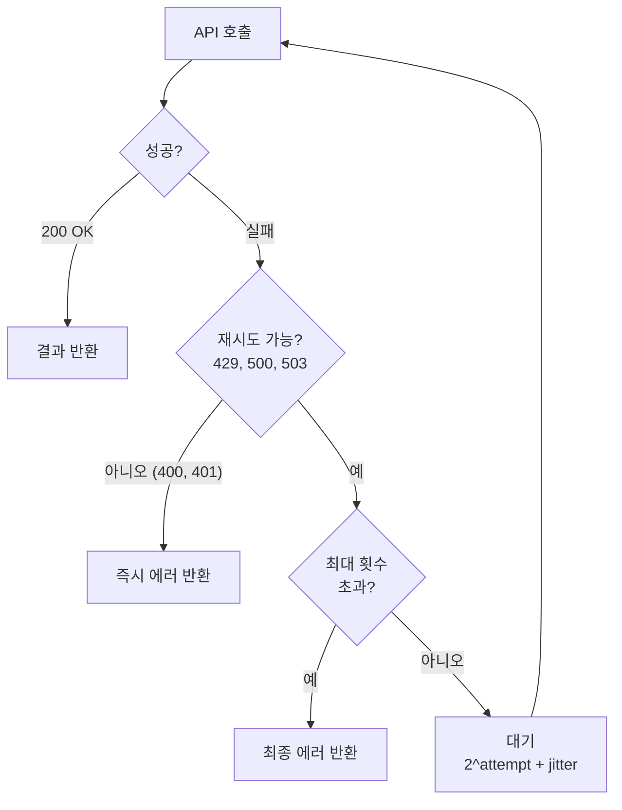
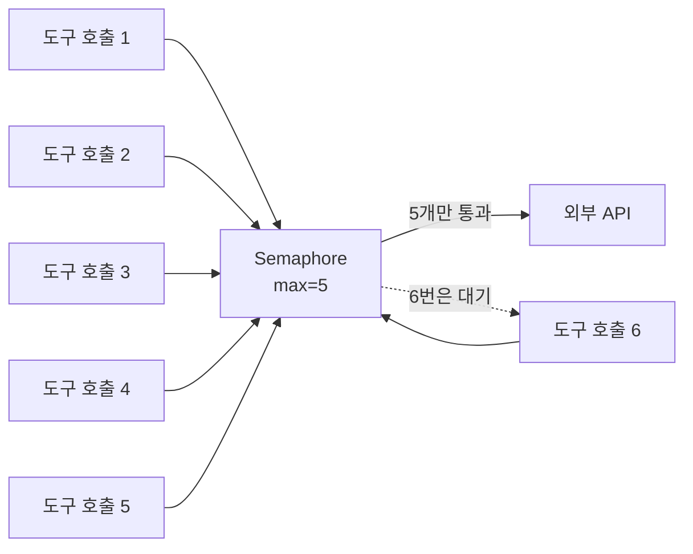

# 비동기 도구와 외부 API 연동

> async 도구 구현부터 httpx 기반 외부 API 호출, 타임아웃과 재시도, rate limiting까지 — 프로덕션 수준의 비동기 도구를 만드는 법

## 개요

이 섹션에서는 LangChain의 `@tool` 데코레이터와 `BaseTool`을 활용해 **비동기(async) 도구**를 구현하고, `httpx.AsyncClient`로 외부 API를 호출하는 패턴을 학습합니다. 단순히 `async def`를 붙이는 것을 넘어, 타임아웃 설정, 지수 백오프 재시도, rate limiting 같은 **프로덕션 필수 패턴**까지 다룹니다.

**선수 지식**: [01. @tool 데코레이터 심화](08-ch8-커스텀-도구-개발/01-01-tool-데코레이터-심화.md)에서 배운 `@tool` 데코레이터 옵션과 [02. 복합 도구 설계 패턴](08-ch8-커스텀-도구-개발/02-02-복합-도구-설계-패턴.md)에서 배운 `BaseTool` 상속 패턴

**추가 라이브러리**: 이 섹션에서는 `httpx`(비동기 HTTP 클라이언트)와 `tenacity`(재시도 라이브러리)를 사용합니다. 아래 "개념 4"에서 tenacity를 처음 소개하니, 사전 설치만 해두세요:

```console
pip install httpx tenacity
```

**학습 목표**:
- `@tool` 데코레이터로 비동기 도구를 정의하고 `ainvoke`로 실행할 수 있다
- `BaseTool`의 `_arun` 메서드로 상태 유지 비동기 도구를 구현할 수 있다
- `httpx.AsyncClient`를 활용해 외부 API를 효율적으로 호출할 수 있다
- tenacity를 활용한 지수 백오프 재시도와 rate limiting을 구현할 수 있다

## 왜 알아야 할까?

에이전트가 실제 업무를 수행하려면 외부 API를 호출해야 합니다. 날씨 조회, 데이터베이스 검색, 결제 처리 — 이 모든 작업이 네트워크를 통해 이루어지죠. 문제는 네트워크 호출이 **느리고 불안정**하다는 겁니다.

동기(sync) 도구로 API 3개를 순차 호출하면? 각각 2초씩, 총 6초를 기다려야 합니다. 하지만 비동기로 동시에 호출하면? **2초면 끝납니다**. LangGraph의 `ToolNode`는 여러 도구 호출을 감지하면 자동으로 병렬 실행하는데, 이때 도구가 비동기로 구현되어 있어야 진정한 동시성의 이점을 누릴 수 있습니다.

> 📊 **그림 1**: 동기 vs 비동기 도구 실행 비교



게다가 프로덕션 환경에서는 API가 응답하지 않거나, 일시적으로 429(Rate Limit) 에러를 반환하거나, 네트워크가 끊기는 상황이 일상입니다. 이런 상황에서도 에이전트가 우아하게 대처하도록 만드는 것 — 그것이 이 섹션의 목표입니다.

## 핵심 개념

### 개념 1: @tool로 비동기 도구 만들기

> 💡 **비유**: 동기 도구는 카페에서 커피를 주문하고 나올 때까지 카운터 앞에 서 있는 것이고, 비동기 도구는 진동벨을 받고 자리에 가서 다른 일을 하다가 벨이 울리면 커피를 가져오는 것입니다.

LangChain에서 비동기 도구를 만드는 가장 간단한 방법은 `@tool` 데코레이터를 `async def` 함수에 붙이는 것입니다. 동기 버전과 문법적 차이는 딱 두 가지: `async def`와 `await`뿐이죠.

```python
from langchain_core.tools import tool
import httpx

# 동기 도구
@tool
def search_sync(query: str) -> str:
    """동기 검색 도구"""
    import requests
    resp = requests.get(f"https://api.example.com/search?q={query}")
    return resp.text

# 비동기 도구 — async def + await
@tool
async def search_async(query: str) -> str:
    """비동기 검색 도구. 외부 API에서 실시간 데이터를 검색합니다."""
    async with httpx.AsyncClient() as client:
        resp = await client.get(
            f"https://api.example.com/search?q={query}"
        )
        return resp.text
```

차이점을 정리하면 이렇습니다:

| 구분 | 동기 도구 | 비동기 도구 |
|------|----------|-----------|
| 함수 정의 | `def func(...)` | `async def func(...)` |
| HTTP 클라이언트 | `requests` | `httpx.AsyncClient` |
| 호출 방식 | `tool.invoke(...)` | `await tool.ainvoke(...)` |
| 병렬 실행 | 별도 스레드 필요 | `asyncio.gather`로 자연스럽게 |

비동기 도구를 실행하는 방법도 다릅니다. `invoke` 대신 `ainvoke`를 사용합니다:

```run:python
import asyncio
from langchain_core.tools import tool

@tool
async def greet(name: str) -> str:
    """이름을 받아 인사말을 반환합니다."""
    await asyncio.sleep(0.1)  # 비동기 작업 시뮬레이션
    return f"안녕하세요, {name}님!"

# 비동기 도구 실행
result = asyncio.run(greet.ainvoke({"name": "Jason"}))
print(result)
print(f"도구 이름: {greet.name}")
print(f"도구 설명: {greet.description}")
```

```output
안녕하세요, Jason님!
도구 이름: greet
도구 설명: 이름을 받아 인사말을 반환합니다.
```

> 📊 **그림 2**: @tool 비동기 도구의 실행 흐름



중요한 점은, `@tool`로 `async def` 함수를 감싸면 LangChain이 자동으로 이 도구가 비동기를 지원한다는 것을 인식한다는 겁니다. `ToolNode`는 비동기 도구를 발견하면 `asyncio.gather`로 병렬 실행할 수 있게 됩니다.

**동기와 비동기를 함께 제공하기**: 한 도구에서 두 가지 모두 지원하고 싶다면 `StructuredTool`을 사용합니다:

```python
from langchain_core.tools import StructuredTool
import httpx

def search_sync(query: str) -> str:
    """검색 도구"""
    import requests
    return requests.get(f"https://api.example.com/search?q={query}").text

async def search_async(query: str) -> str:
    """검색 도구"""
    async with httpx.AsyncClient() as client:
        resp = await client.get(
            f"https://api.example.com/search?q={query}"
        )
        return resp.text

search_tool = StructuredTool.from_function(
    func=search_sync,       # 동기 버전
    coroutine=search_async,  # 비동기 버전
    name="search",
    description="외부 API에서 실시간 검색",
)
```

### 개념 2: BaseTool의 _arun 메서드

> 💡 **비유**: `BaseTool`의 `_run`과 `_arun`은 같은 식당의 점심 메뉴와 저녁 메뉴 같은 것입니다. 같은 주방(클래스)에서 만들지만, 저녁(async)에는 더 정교한 코스 요리(커넥션 풀, 세션 관리)를 서빙할 수 있죠.

이전 세션에서 배운 `BaseTool` 상속 패턴에 비동기 지원을 추가하려면 `_arun` 메서드를 구현합니다. 특히 **커넥션 풀을 재사용**해야 하는 HTTP 클라이언트 기반 도구에서 `BaseTool`이 빛을 발합니다.

```python
from langchain_core.tools import BaseTool
from pydantic import BaseModel, Field
import httpx
from typing import Optional, Type

class StockPriceInput(BaseModel):
    symbol: str = Field(description="주식 종목 코드 (예: AAPL, GOOGL)")

class StockPriceTool(BaseTool):
    """실시간 주가를 조회하는 비동기 도구"""
    name: str = "stock_price"
    description: str = "주식 종목 코드로 현재 주가를 조회합니다"
    args_schema: Type[BaseModel] = StockPriceInput

    # httpx.AsyncClient를 클래스 수준에서 관리
    _client: Optional[httpx.AsyncClient] = None

    async def _get_client(self) -> httpx.AsyncClient:
        """커넥션 풀을 재사용하는 싱글턴 클라이언트"""
        if self._client is None or self._client.is_closed:
            self._client = httpx.AsyncClient(
                timeout=httpx.Timeout(connect=5.0, read=10.0, write=5.0, pool=5.0),
                limits=httpx.Limits(max_connections=20, max_keepalive_connections=10),
            )
        return self._client

    def _run(self, symbol: str) -> str:
        """동기 폴백 — 비동기 불가 환경용"""
        import requests
        resp = requests.get(
            f"https://api.stockdata.com/v1/quote/{symbol}",
            timeout=10,
        )
        return f"{symbol}: ${resp.json()['price']}"

    async def _arun(self, symbol: str) -> str:
        """비동기 실행 — 커넥션 풀 재사용"""
        client = await self._get_client()
        resp = await client.get(f"https://api.stockdata.com/v1/quote/{symbol}")
        resp.raise_for_status()
        data = resp.json()
        return f"{symbol}: ${data['price']}"

    async def close(self) -> None:
        """리소스 정리"""
        if self._client and not self._client.is_closed:
            await self._client.aclose()
```

> 📊 **그림 3**: BaseTool 비동기 도구의 클래스 구조



`_arun`을 구현하지 않으면 어떻게 될까요? LangChain은 `_run`을 `asyncio.get_event_loop().run_in_executor()`로 감싸서 별도 스레드에서 실행합니다. 동작은 하지만, 커넥션 풀 재사용이 안 되고, 스레드 전환 오버헤드가 발생합니다. 프로덕션에서는 반드시 `_arun`을 직접 구현하세요.

### 개념 3: httpx.AsyncClient 활용 패턴

> 💡 **비유**: `httpx.AsyncClient`는 고속도로의 하이패스와 비슷합니다. 매번 톨게이트에서 창문 열고 카드 찍는(새 연결 맺는) 대신, 한 번 등록하면 감속 없이 쭉 통과(커넥션 재사용)하는 거죠.

`httpx`는 Python의 차세대 HTTP 클라이언트로, `requests`의 직관적인 API에 비동기 지원을 더한 라이브러리입니다. 에이전트 도구에서 외부 API를 호출할 때 가장 권장되는 선택입니다.

**핵심 원칙: 클라이언트를 재사용하라**

```python
import httpx

# ❌ 나쁜 패턴 — 매 호출마다 새 클라이언트 생성
async def bad_fetch(url: str) -> str:
    async with httpx.AsyncClient() as client:  # 매번 커넥션 풀 생성/파괴
        resp = await client.get(url)
        return resp.text

# ✅ 좋은 패턴 — 장기 유지 클라이언트 재사용
client = httpx.AsyncClient(
    timeout=httpx.Timeout(
        connect=5.0,   # TCP 연결 수립 대기
        read=30.0,     # 응답 수신 대기
        write=10.0,    # 요청 전송 대기
        pool=5.0,      # 커넥션 풀 대기
    ),
    limits=httpx.Limits(
        max_connections=100,          # 전체 최대 동시 연결
        max_keepalive_connections=20, # 유지되는 연결 수
    ),
    headers={"User-Agent": "MyAgent/1.0"},
)
```

타임아웃을 세분화하는 이유가 있습니다. API마다 특성이 다르거든요:
- **빠른 API** (캐시된 데이터): `read=5.0`이면 충분
- **느린 API** (ML 추론, 대용량 처리): `read=60.0` 이상 필요
- **연결 자체가 불안정**: `connect=10.0`으로 여유 확보

```python
# API 특성별 타임아웃 전략
FAST_TIMEOUT = httpx.Timeout(connect=3.0, read=5.0, write=3.0, pool=3.0)
SLOW_TIMEOUT = httpx.Timeout(connect=5.0, read=60.0, write=10.0, pool=5.0)

@tool
async def quick_lookup(query: str) -> str:
    """캐시된 데이터 빠른 조회"""
    async with httpx.AsyncClient(timeout=FAST_TIMEOUT) as client:
        resp = await client.get(f"https://cache-api.com/lookup?q={query}")
        return resp.text

@tool
async def ml_inference(text: str) -> str:
    """ML 모델 추론 — 응답이 느릴 수 있음"""
    async with httpx.AsyncClient(timeout=SLOW_TIMEOUT) as client:
        resp = await client.post("https://ml-api.com/predict", json={"text": text})
        return resp.json()["result"]
```

### 개념 4: 재시도와 지수 백오프

> 💡 **비유**: 전화했는데 통화 중이면 어떻게 하시나요? 바로 다시 걸고, 또 통화 중이면 좀 기다렸다가 걸고, 그래도 안 되면 더 오래 기다리는 게 자연스럽죠. 이게 바로 **지수 백오프(Exponential Backoff)**입니다.

외부 API는 일시적으로 실패할 수 있습니다. 서버 과부하(503), 요청 제한(429), 네트워크 순단 등. 이런 일시적 오류에는 **재시도**가 정답입니다. Python의 `tenacity` 라이브러리가 이를 우아하게 처리해줍니다.

> 💡 **tenacity란?** `tenacity`는 Python의 범용 재시도 라이브러리입니다. `@retry` 데코레이터 하나로 "몇 번 재시도할지", "얼마나 기다릴지", "어떤 에러만 재시도할지"를 선언적으로 설정할 수 있죠. 동기/비동기 함수 모두 지원하며, `pip install tenacity`로 설치합니다. 이름 자체가 "끈기"라는 뜻 — 포기하지 않고 끈질기게 재시도하는 라이브러리입니다.

> 📊 **그림 4**: 지수 백오프 재시도 패턴



tenacity의 핵심 구성 요소를 먼저 살펴보겠습니다:

| 구성 요소 | 역할 | 주요 옵션 |
|----------|------|----------|
| `stop` | 언제 포기할지 | `stop_after_attempt(3)` — 3회 시도 후 중단 |
| `wait` | 재시도 간 대기 시간 | `wait_exponential_jitter(initial=1, max=10)` — 1→2→4초 + 무작위 |
| `retry` | 어떤 에러를 재시도할지 | `retry_if_exception_type(...)` — 특정 예외만 재시도 |
| `before_sleep` | 재시도 전 콜백 | `before_sleep_log(logger, ...)` — 로깅 |

이제 실제 코드로 적용해봅시다:

```python
from tenacity import (
    retry,
    stop_after_attempt,
    wait_exponential_jitter,
    retry_if_exception_type,
    before_sleep_log,
)
import httpx
import logging

logger = logging.getLogger(__name__)

# 재시도 데코레이터 — 비동기 함수에도 동작
@retry(
    stop=stop_after_attempt(3),                      # 최대 3회 시도
    wait=wait_exponential_jitter(initial=1, max=10),  # 1초 → 2초 → 4초 (+ 무작위 지터)
    retry=retry_if_exception_type((                   # 이 에러만 재시도
        httpx.TimeoutException,
        httpx.NetworkError,
    )),
    before_sleep=before_sleep_log(logger, logging.WARNING),  # 재시도 전 로깅
)
async def fetch_with_retry(client: httpx.AsyncClient, url: str) -> dict:
    """재시도 로직이 내장된 API 호출"""
    resp = await client.get(url)

    # 429(Rate Limit)나 5xx(서버 에러)는 재시도 대상
    if resp.status_code == 429:
        retry_after = int(resp.headers.get("Retry-After", 5))
        raise httpx.TimeoutException(
            f"Rate limited. Retry after {retry_after}s"
        )
    if resp.status_code >= 500:
        raise httpx.NetworkError(f"Server error: {resp.status_code}")

    resp.raise_for_status()  # 4xx는 즉시 실패
    return resp.json()
```

**왜 지터(jitter)가 중요한가요?** 만약 서버가 과부하로 500을 반환했는데, 100개의 클라이언트가 정확히 같은 시간에 재시도하면? 서버가 또 죽습니다. 지터는 각 클라이언트의 재시도 타이밍을 무작위로 흩어놓아 이 "**thundering herd**" 문제를 방지합니다.

### 개념 5: Rate Limiting 구현

> 💡 **비유**: 놀이공원의 입장 인원 제한을 생각해보세요. 한 번에 100명까지만 들어갈 수 있고, 누군가 나와야 다음 사람이 들어갑니다. Rate limiter는 이 "입장 관리자" 역할을 합니다.

외부 API는 대부분 분당/초당 호출 횟수를 제한합니다. 이를 초과하면 429 에러가 돌아오죠. 에이전트가 여러 도구를 병렬로 호출하면 이 한계에 금방 도달합니다. `asyncio.Semaphore`로 동시 호출 수를 제한할 수 있습니다.

> 📊 **그림 5**: Rate Limiting 패턴 — Semaphore 기반



```python
import asyncio
import time

class RateLimiter:
    """토큰 버킷 기반 rate limiter"""

    def __init__(self, calls_per_second: float = 10.0):
        self._rate = calls_per_second
        self._semaphore = asyncio.Semaphore(int(calls_per_second))
        self._lock = asyncio.Lock()
        self._tokens = calls_per_second
        self._last_refill = time.monotonic()

    async def acquire(self) -> None:
        """호출 권한 획득 — 토큰이 없으면 대기"""
        while True:
            async with self._lock:
                now = time.monotonic()
                elapsed = now - self._last_refill
                self._tokens = min(
                    self._rate,
                    self._tokens + elapsed * self._rate,
                )
                self._last_refill = now

                if self._tokens >= 1.0:
                    self._tokens -= 1.0
                    return

            await asyncio.sleep(1.0 / self._rate)  # 토큰 충전 대기

# rate limiter를 도구에 통합
rate_limiter = RateLimiter(calls_per_second=5.0)

@tool
async def rate_limited_search(query: str) -> str:
    """초당 5회로 제한된 검색 도구"""
    await rate_limiter.acquire()  # 호출 권한 획득
    async with httpx.AsyncClient(timeout=10.0) as client:
        resp = await client.get(
            "https://api.example.com/search",
            params={"q": query},
        )
        return resp.text
```

더 간단한 방법으로 `asyncio.Semaphore`만 사용할 수도 있습니다:

```python
# 동시 호출 수 제한 (간단 버전)
MAX_CONCURRENT = 5
api_semaphore = asyncio.Semaphore(MAX_CONCURRENT)

@tool
async def controlled_api_call(endpoint: str) -> str:
    """동시 호출 수가 제한된 API 도구"""
    async with api_semaphore:  # 5개 초과 시 대기
        async with httpx.AsyncClient(timeout=10.0) as client:
            resp = await client.get(endpoint)
            return resp.text
```

## 실습: 직접 해보기

실제 공개 API를 호출하는 비동기 도구 세트를 만들고, LangGraph 에이전트에 통합해봅시다. 날씨 API와 뉴스 API를 동시에 호출하는 "리서치 어시스턴트"를 구현합니다.

```python
"""비동기 도구 + LangGraph 에이전트 실습"""

import asyncio
import httpx
from typing import Optional
from langchain_core.tools import tool, BaseTool
from pydantic import BaseModel, Field
from tenacity import retry, stop_after_attempt, wait_exponential_jitter

# ─── 1. 공용 httpx 클라이언트 (커넥션 풀 재사용) ───

http_client = httpx.AsyncClient(
    timeout=httpx.Timeout(connect=5.0, read=15.0, write=5.0, pool=5.0),
    limits=httpx.Limits(max_connections=50, max_keepalive_connections=10),
    headers={"Accept": "application/json"},
)

# ─── 2. 재시도 래퍼 ───

@retry(
    stop=stop_after_attempt(3),
    wait=wait_exponential_jitter(initial=1, max=10),
)
async def safe_get(url: str, params: Optional[dict] = None) -> dict:
    """재시도가 내장된 안전한 GET 요청"""
    resp = await http_client.get(url, params=params)
    if resp.status_code == 429:
        raise httpx.TimeoutException("Rate limited")
    if resp.status_code >= 500:
        raise httpx.NetworkError(f"Server error: {resp.status_code}")
    resp.raise_for_status()
    return resp.json()

# ─── 3. 비동기 도구 정의 ───

@tool
async def get_weather(city: str) -> str:
    """도시의 현재 날씨 정보를 조회합니다.

    Args:
        city: 날씨를 조회할 도시 이름 (영문)
    """
    # wttr.in은 무료 날씨 API
    data = await safe_get(
        f"https://wttr.in/{city}",
        params={"format": "j1"},
    )
    current = data["current_condition"][0]
    return (
        f"{city} 날씨: {current['weatherDesc'][0]['value']}, "
        f"온도: {current['temp_C']}°C, "
        f"습도: {current['humidity']}%"
    )

@tool
async def search_news(topic: str, max_results: int = 3) -> str:
    """최신 뉴스를 검색합니다.

    Args:
        topic: 검색할 뉴스 주제
        max_results: 반환할 최대 뉴스 수 (기본 3)
    """
    # 예시용 — 실제로는 NewsAPI 등 사용
    data = await safe_get(
        "https://newsapi.org/v2/everything",
        params={
            "q": topic,
            "pageSize": max_results,
            "apiKey": "YOUR_API_KEY",  # 환경변수로 관리
        },
    )
    articles = data.get("articles", [])
    if not articles:
        return f"'{topic}' 관련 뉴스를 찾지 못했습니다."

    results = []
    for art in articles[:max_results]:
        results.append(f"- {art['title']} ({art['source']['name']})")
    return f"'{topic}' 관련 최신 뉴스:\n" + "\n".join(results)

@tool
async def get_exchange_rate(base: str, target: str) -> str:
    """환율 정보를 조회합니다.

    Args:
        base: 기준 통화 코드 (예: USD)
        target: 대상 통화 코드 (예: KRW)
    """
    data = await safe_get(
        f"https://api.exchangerate-api.com/v4/latest/{base}"
    )
    rate = data["rates"].get(target)
    if rate is None:
        return f"{target} 통화 코드를 찾을 수 없습니다."
    return f"환율: 1 {base} = {rate:,.2f} {target}"

# ─── 4. LangGraph 에이전트 통합 ───

from langgraph.prebuilt import create_react_agent
from langchain_openai import ChatOpenAI

async def main():
    # 도구 목록
    tools = [get_weather, search_news, get_exchange_rate]

    # 에이전트 생성
    llm = ChatOpenAI(model="gpt-4o-mini", temperature=0)
    agent = create_react_agent(llm, tools)

    # 에이전트 실행 — ainvoke로 비동기 실행
    result = await agent.ainvoke({
        "messages": [
            {"role": "user", "content": "서울 날씨와 USD/KRW 환율을 알려주세요"}
        ]
    })

    # 결과 출력
    for msg in result["messages"]:
        print(f"[{msg.type}] {msg.content[:200] if msg.content else ''}")

    # 정리
    await http_client.aclose()

# asyncio.run(main())
```

에이전트가 "서울 날씨와 USD/KRW 환율"을 요청받으면, LLM은 `get_weather`와 `get_exchange_rate` 두 도구를 **동시에 호출**합니다. 이때 `ToolNode`가 두 비동기 도구를 `asyncio.gather`로 병렬 실행하여 응답 시간을 절반으로 줄입니다.

**병렬 실행 확인하기**: 도구에 실행 시간 로깅을 추가하면 병렬 실행을 직접 확인할 수 있습니다:

```run:python
import asyncio
import time

async def simulate_weather():
    start = time.monotonic()
    await asyncio.sleep(1.0)  # API 호출 시뮬레이션
    elapsed = time.monotonic() - start
    print(f"[날씨 도구] 완료: {elapsed:.1f}초")
    return "서울: 맑음, 22°C"

async def simulate_exchange():
    start = time.monotonic()
    await asyncio.sleep(1.0)  # API 호출 시뮬레이션
    elapsed = time.monotonic() - start
    print(f"[환율 도구] 완료: {elapsed:.1f}초")
    return "1 USD = 1,350 KRW"

async def main():
    start = time.monotonic()
    # asyncio.gather로 병렬 실행
    results = await asyncio.gather(
        simulate_weather(),
        simulate_exchange(),
    )
    total = time.monotonic() - start
    print(f"\n전체 소요: {total:.1f}초 (순차라면 2.0초)")
    for r in results:
        print(f"결과: {r}")

asyncio.run(main())
```

```output
[날씨 도구] 완료: 1.0초
[환율 도구] 완료: 1.0초

전체 소요: 1.0초 (순차라면 2.0초)
결과: 서울: 맑음, 22°C
결과: 1 USD = 1,350 KRW
```

## 더 깊이 알아보기

### asyncio의 탄생 스토리

Python의 비동기 역사는 꽤 파란만장합니다. 2001년 `Twisted` 프레임워크가 콜백 기반 비동기를 도입했고, 2012년 Python 창시자 Guido van Rossum이 직접 `tulip` 프로젝트를 시작했습니다. 이것이 2014년 Python 3.4의 `asyncio` 모듈이 됩니다. 하지만 초기의 `@asyncio.coroutine`과 `yield from` 문법은 너무 복잡했죠.

전환점은 Python 3.5(2015)의 `async`/`await` 키워드였습니다. C#에서 영감을 받은 이 문법 덕분에 비동기 코드가 동기 코드처럼 읽히게 되었고, 이후 `aiohttp`, `httpx`, `uvicorn` 같은 생태계가 폭발적으로 성장합니다. 2020년 출시된 `httpx`는 `requests`의 정신적 후계자로, 동기와 비동기를 하나의 API로 통합한 것이 결정적 차별점이었습니다.

### tenacity의 유래

`tenacity`는 "끈기"라는 뜻인데, 이 라이브러리의 전신인 `retrying`이 관리되지 않게 되자 Julien Danjou가 2016년에 fork하여 만들었습니다. 이름처럼 "포기하지 않고 끈질기게 재시도하는" 라이브러리죠. 재미있는 점은, 분산 시스템의 기본 원칙 중 하나인 "일시적 장애는 재시도로 해결된다"를 가장 Pythonic하게 구현한 것으로 평가받는다는 것입니다. AWS의 내부 마이크로서비스들도 지수 백오프 + 지터를 필수 패턴으로 사용합니다.

## 흔한 오해와 팁

> ⚠️ **흔한 오해**: "async def로 만들면 자동으로 빨라진다"
>
> 아닙니다! `async def` 안에서 `requests.get()`이나 `time.sleep()` 같은 **동기 블로킹 호출**을 하면 이벤트 루프 전체가 멈춥니다. 반드시 `httpx`(비동기 HTTP)와 `asyncio.sleep()`(비동기 대기)을 사용하세요. 동기 라이브러리를 써야 한다면 `asyncio.to_thread()`로 감싸세요.

> 💡 **알고 계셨나요?**: `httpx.AsyncClient`를 `async with` 안에서 매번 생성하면 요청마다 TCP 핸드셰이크 + TLS 협상이 발생합니다. 클라이언트를 재사용하면 이 비용이 사라져 요청당 **50~200ms** 절약됩니다. 특히 HTTPS API에서 차이가 극적이에요.

> 🔥 **실무 팁**: 재시도할 때 **모든 에러를 재시도하면 안 됩니다**. 401(인증 실패), 403(권한 없음), 404(리소스 없음)는 재시도해도 결과가 같습니다. 재시도 대상은 429(Rate Limit), 500/502/503(서버 에러), 타임아웃, 네트워크 에러로 한정하세요. 클라이언트 에러(4xx)를 재시도하면 API 제공자에게 악의적 트래픽으로 오인될 수 있습니다.

> 🔥 **실무 팁**: `httpx.Timeout(read=None)`처럼 타임아웃을 `None`으로 설정하면 타임아웃이 비활성화됩니다. 프로덕션에서 이렇게 하면 하나의 느린 API가 에이전트 전체를 **무한 대기** 상태에 빠뜨릴 수 있습니다. 항상 명시적 타임아웃을 설정하세요.

## 핵심 정리

| 개념 | 설명 |
|------|------|
| `@tool` + `async def` | 가장 간단한 비동기 도구 정의 방법. `ainvoke`로 실행 |
| `BaseTool._arun` | 상태 유지(커넥션 풀 등)가 필요한 비동기 도구용 |
| `StructuredTool(coroutine=...)` | 동기/비동기 버전을 함께 제공할 때 사용 |
| `httpx.AsyncClient` | 비동기 HTTP 클라이언트. 커넥션 풀 재사용이 핵심 |
| `httpx.Timeout` | connect/read/write/pool 4단계 세분화 타임아웃 |
| `tenacity.retry` | 지수 백오프 + 지터로 일시적 오류 자동 재시도 |
| `asyncio.Semaphore` | 동시 호출 수 제한 (간단한 rate limiting) |
| 토큰 버킷 | 초당 호출률을 정밀하게 제어하는 rate limiting 패턴 |
| `asyncio.gather` | 여러 비동기 도구를 병렬 실행 (ToolNode 내부 동작) |

## 다음 섹션 미리보기

비동기 도구로 외부 API를 안정적으로 호출할 수 있게 되었지만, 여전히 남은 문제가 있습니다 — API가 **영구적으로** 실패하거나, 도구 내부에서 **예외**가 발생하면 어떻게 할까요? 다음 [04. 도구 에러 핸들링](08-ch8-커스텀-도구-개발/04-04-도구-에러-핸들링.md)에서는 `ToolException`, 폴백 전략, 그리고 에이전트가 도구 실패를 **스스로 판단하고 대처하는** 패턴을 다룹니다.

## 참고 자료

- [httpx 공식 문서 — Async Support](https://www.python-httpx.org/async/) - httpx의 비동기 클라이언트 사용법, 스트리밍, 커넥션 관리 상세 가이드
- [httpx 공식 문서 — Timeouts](https://www.python-httpx.org/advanced/timeouts/) - connect/read/write/pool 세분화 타임아웃 설정 방법
- [tenacity 공식 문서](https://tenacity.readthedocs.io/en/stable/) - 재시도 라이브러리의 전체 API와 비동기 지원 패턴
- [LangGraph 공식 문서 — Overview](https://docs.langchain.com/oss/python/langgraph/overview) - LangGraph의 비동기 실행과 ToolNode 동작 방식
- [LangChain Tools 공식 레퍼런스](https://reference.langchain.com/python/langchain/tools) - BaseTool, @tool 데코레이터, StructuredTool의 최신 API
- [Python asyncio 공식 문서](https://docs.python.org/3/library/asyncio.html) - Semaphore, gather, to_thread 등 비동기 프리미티브 레퍼런스

---
### 🔗 Related Sessions
- [toolnode](04-ch4-langgraph-stategraph-기초/05-05-첫-번째-langgraph-에이전트.md) (prerequisite)
- [args_schema](08-ch8-커스텀-도구-개발/01-01-tool-데코레이터-심화.md) (prerequisite)
- [parse_docstring](08-ch8-커스텀-도구-개발/01-01-tool-데코레이터-심화.md) (prerequisite)
- [create_react_agent](02-ch2-react-패턴과-에이전트-루프/04-04-langgraph의-create-react-agent.md) (prerequisite)
- [basetool](08-ch8-커스텀-도구-개발/02-02-복합-도구-설계-패턴.md) (prerequisite)
- [structuredtool](08-ch8-커스텀-도구-개발/02-02-복합-도구-설계-패턴.md) (prerequisite)
