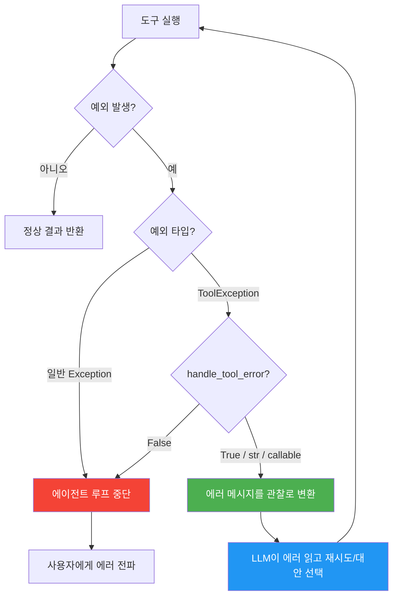
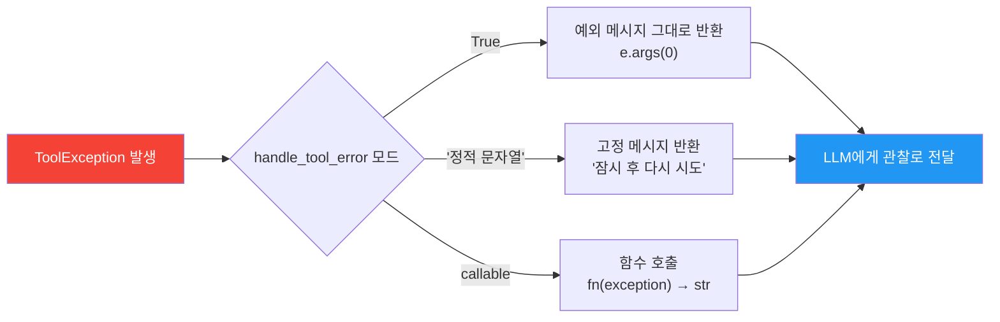
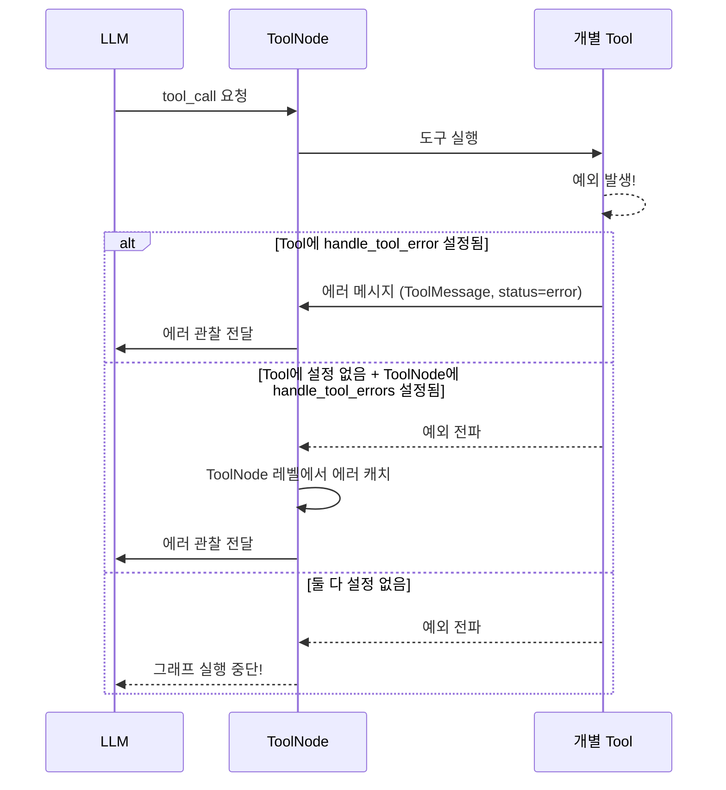
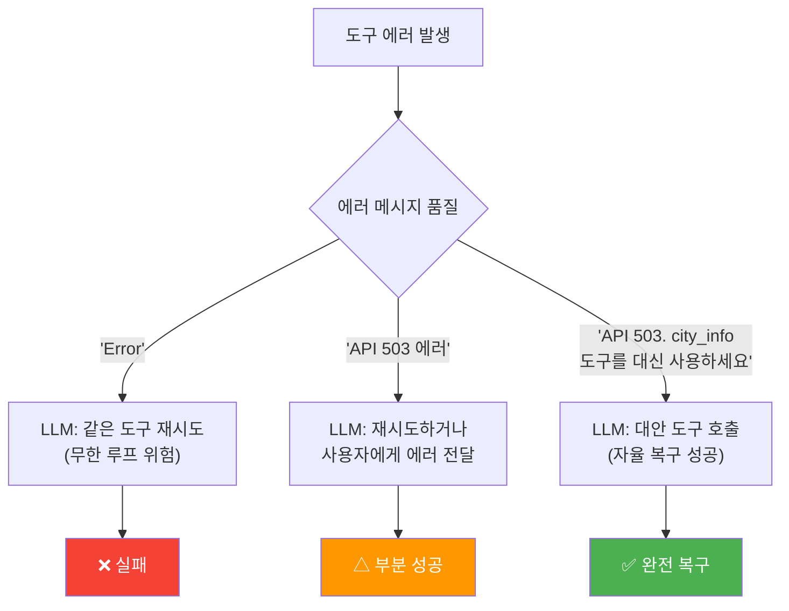
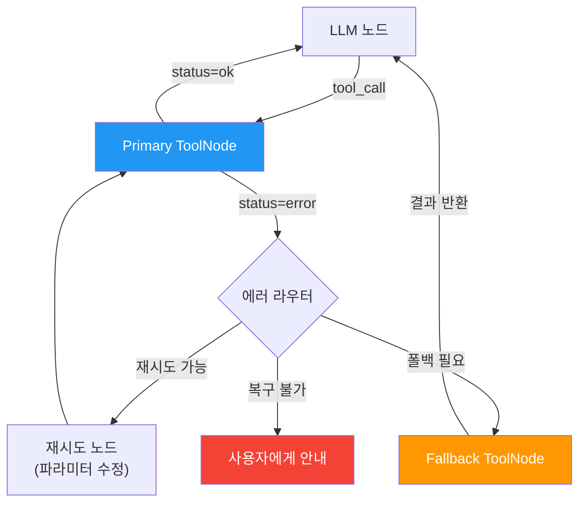

# 도구 에러 핸들링

> ToolException과 handle_tool_error를 활용하여 에이전트가 도구 실패에 자율적으로 대처하는 전략을 학습합니다

## 개요

이 섹션에서는 에이전트의 도구 실행 중 발생하는 에러를 우아하게 처리하는 방법을 다룹니다. 단순히 예외를 잡는 것을 넘어, **에이전트가 에러 메시지를 읽고 스스로 대안을 찾도록** 만드는 것이 핵심이에요.

**선수 지식**: 
- [@tool 데코레이터의 주요 옵션](08-ch8-커스텀-도구-개발/01-01-tool-데코레이터-심화.md)과 args_schema
- [BaseTool 상속과 상태 주입 패턴](08-ch8-커스텀-도구-개발/02-02-복합-도구-설계-패턴.md)
- [비동기 도구와 재시도 패턴](08-ch8-커스텀-도구-개발/03-03-비동기-도구와-외부-api-연동.md)

**학습 목표**:
- ToolException의 역할과 일반 Exception과의 차이를 이해할 수 있다
- handle_tool_error의 세 가지 모드(bool, str, callable)를 사용할 수 있다
- LangGraph ToolNode의 에러 핸들링 옵션을 설정할 수 있다
- 폴백 도구 체인과 자기복구 에이전트 패턴을 구현할 수 있다

## 왜 알아야 할까?

프로덕션 환경에서 도구는 **반드시 실패합니다**. 외부 API가 다운되거나, 사용자 입력이 예상 밖이거나, 네트워크가 불안정하거나. 문제는 실패 자체가 아니라, 실패했을 때 에이전트가 어떻게 반응하느냐입니다.

일반적인 Python 예외가 발생하면 에이전트 루프 전체가 중단됩니다. 사용자는 "Internal Server Error" 같은 무의미한 메시지를 받게 되죠. 하지만 `ToolException`을 사용하면 에러 메시지가 **LLM에게 다시 전달**되어, 에이전트가 "이 도구가 실패했으니 다른 방법을 시도해볼게요"라고 자율적으로 대처할 수 있습니다.

이전 섹션에서 배운 tenacity 기반 재시도가 **같은 요청을 반복**하는 전략이었다면, 이번 섹션의 에러 핸들링은 **다른 전략을 선택**하게 만드는 것입니다. 두 접근법을 조합하면 매우 견고한 에이전트를 만들 수 있어요.

## 핵심 개념

### 개념 1: ToolException — 에이전트에게 보내는 에러 메시지

> 💡 **비유**: 식당에서 "이 메뉴는 재료가 떨어졌습니다"라고 안내받으면, 다른 메뉴를 고를 수 있죠. 하지만 주방에서 화재가 나면 식당 자체가 문을 닫아야 합니다. ToolException은 전자 — 에이전트에게 "이건 안 되니 다른 걸 시도해봐"라고 알려주는 정중한 실패 신호입니다.

`ToolException`은 `langchain_core.tools`에서 제공하는 특수 예외 클래스입니다. 일반 `Exception`과의 결정적인 차이는 **에러가 에이전트를 중단시키지 않고, LLM에게 관찰(observation)으로 전달된다**는 점이에요.

```python
from langchain_core.tools import ToolException

# ToolException은 Exception의 단순한 서브클래스
class ToolException(Exception):
    """도구 실행 에러 발생 시 던지는 예외.
    에이전트를 중단하지 않고, 에러 메시지를 관찰로 반환한다."""
    pass
```

> 📊 **그림 1**: 일반 Exception vs ToolException의 처리 흐름



핵심은 `handle_tool_error` 설정과의 조합입니다. ToolException을 던지더라도 `handle_tool_error`가 `False`(기본값)면 여전히 에러가 전파됩니다. 두 가지를 반드시 함께 설정해야 해요.

```python
from langchain_core.tools import tool, ToolException

@tool
def search_database(query: str) -> str:
    """데이터베이스에서 정보를 검색합니다.

    Args:
        query: 검색 쿼리 문자열
    """
    if not query.strip():
        raise ToolException("검색어가 비어 있습니다. 구체적인 검색어를 입력해주세요.")

    try:
        # 데이터베이스 호출 시뮬레이션
        results = _call_database(query)
        if not results:
            raise ToolException(
                f"'{query}'에 대한 결과가 없습니다. "
                "다른 키워드로 검색하거나 검색 범위를 넓혀보세요."
            )
        return str(results)
    except ConnectionError:
        raise ToolException(
            "데이터베이스에 연결할 수 없습니다. "
            "web_search 도구를 대신 사용해보세요."
        )

# 반드시 handle_tool_error를 설정해야 동작!
search_database.handle_tool_error = True
```

> ⚠️ **흔한 오해**: "ToolException만 던지면 에이전트가 알아서 처리한다" — 아닙니다! `handle_tool_error = True`가 반드시 함께 설정되어야 합니다. 기본값은 `False`이므로 설정하지 않으면 일반 예외와 동일하게 에이전트가 중단됩니다.

### 개념 2: handle_tool_error의 세 가지 모드

> 💡 **비유**: 고객센터 응대 방식을 생각해보세요. (1) 기본 자동응답: "잠시 후 다시 시도하세요" → `True`, (2) 고정 메시지: "현재 점검 중입니다. 1시간 후 이용해주세요" → `str`, (3) 상황별 맞춤 응대: "결제 오류시엔 A, 배송 오류시엔 B 안내" → `callable`. 에러의 복잡도에 따라 적절한 모드를 선택합니다.

`handle_tool_error`는 `BaseTool`의 필드로, 세 가지 타입을 받습니다:

```python
handle_tool_error: bool | str | Callable[[ToolException], str] | None = False
```

> 📊 **그림 2**: handle_tool_error 세 가지 모드 비교



**모드 1: `True` — 예외 메시지 그대로 전달**

가장 간단한 방식입니다. ToolException에 담긴 메시지를 그대로 LLM에게 돌려줍니다.

```python
from langchain_core.tools import tool, ToolException

@tool
def get_stock_price(ticker: str) -> str:
    """주식 시세를 조회합니다.

    Args:
        ticker: 종목 코드 (예: AAPL, TSLA)
    """
    valid_tickers = {"AAPL", "TSLA", "GOOGL", "MSFT"}
    if ticker.upper() not in valid_tickers:
        raise ToolException(
            f"'{ticker}'는 지원되지 않는 종목입니다. "
            f"지원 종목: {', '.join(sorted(valid_tickers))}"
        )
    # 시세 조회 로직...
    return f"{ticker}: $150.00"

# 모드 1: 예외 메시지를 그대로 LLM에게 전달
get_stock_price.handle_tool_error = True
```

**모드 2: `str` — 고정 메시지 전달**

에러 내부 정보를 LLM에게 노출하고 싶지 않을 때 유용합니다. 보안에 민감한 도구에서 특히 중요하죠.

```python
@tool
def query_internal_db(sql: str) -> str:
    """내부 데이터베이스를 쿼리합니다.

    Args:
        sql: SQL 쿼리문
    """
    try:
        return _execute_query(sql)
    except Exception:
        # 내부 DB 에러 상세를 LLM에게 노출하지 않음
        raise ToolException("쿼리 실행 실패")

# 모드 2: 내부 에러 대신 안전한 고정 메시지 전달
query_internal_db.handle_tool_error = (
    "데이터베이스 쿼리에 실패했습니다. "
    "쿼리 문법을 확인하고 다시 시도하거나, "
    "다른 도구를 사용해주세요."
)
```

**모드 3: `Callable` — 에러별 맞춤 메시지**

가장 강력한 모드입니다. 에러 내용을 분석해서 LLM에게 **구체적인 다음 행동을 안내**할 수 있어요.

```python
from langchain_core.tools import BaseTool, ToolException
from pydantic import Field

def handle_api_error(error: ToolException) -> str:
    """에러 타입별 맞춤 안내 메시지를 생성합니다."""
    msg = str(error)

    if "rate limit" in msg.lower():
        return (
            "API 호출 한도에 도달했습니다. "
            "잠시 후 다시 시도하거나, cache_search 도구를 사용해보세요."
        )
    elif "not found" in msg.lower():
        return (
            "요청한 리소스를 찾을 수 없습니다. "
            "검색어를 변경하거나 broader_search 도구를 시도해보세요."
        )
    elif "timeout" in msg.lower():
        return (
            "요청 시간이 초과되었습니다. "
            "더 짧은 쿼리로 다시 시도하거나, "
            "local_search 도구를 사용해보세요."
        )
    else:
        return f"도구 실행 중 오류가 발생했습니다: {msg}. 다른 접근법을 시도해주세요."


class WeatherTool(BaseTool):
    name: str = "get_weather"
    description: str = "도시의 현재 날씨를 조회합니다"
    handle_tool_error: object = handle_api_error  # callable 모드

    def _run(self, city: str) -> str:
        if not city:
            raise ToolException("city not found: 도시 이름이 비어 있습니다")
        # API 호출 로직...
        return f"{city}: 맑음, 22°C"
```

> 🔥 **실무 팁**: callable 모드에서 에러 메시지에 **대안 도구 이름을 명시**하면 에이전트가 자동으로 해당 도구를 호출합니다. "web_search 도구를 대신 사용해보세요"처럼 구체적인 지시를 넣으세요.

### 개념 3: LangGraph ToolNode의 에러 핸들링

> 💡 **비유**: `handle_tool_error`가 각 직원(도구)의 에러 처리 방침이라면, ToolNode의 `handle_tool_errors`는 부서(노드) 차원의 에러 정책입니다. 개별 직원이 대응 방침이 없더라도, 부서 정책이 "모든 에러를 상위에 보고한다"면 에러가 처리됩니다.

LangGraph에서 도구를 실행하는 `ToolNode`에도 별도의 에러 핸들링 옵션이 있습니다. 이름이 비슷하지만 **별개의 설정**이라는 점에 주의하세요:

| 설정 | 위치 | 이름 | 적용 범위 |
|------|------|------|-----------|
| `handle_tool_error` | BaseTool | 단수(singular) | 개별 도구 |
| `handle_tool_errors` | ToolNode | 복수(plural) | 노드 전체 도구 |

> 📊 **그림 3**: BaseTool vs ToolNode 에러 핸들링 계층



```python
from langgraph.prebuilt import ToolNode

# 방법 1: 모든 에러를 메시지로 변환 (가장 안전)
tool_node = ToolNode(
    tools=[search_tool, weather_tool],
    handle_tool_errors=True,  # 복수형 주의!
)

# 방법 2: 특정 예외만 처리
tool_node = ToolNode(
    tools=[search_tool, weather_tool],
    handle_tool_errors=(ValueError, ConnectionError),
)

# 방법 3: 커스텀 핸들러
def node_error_handler(e: Exception) -> str:
    return f"도구 실행 실패: {type(e).__name__}. 다른 도구를 시도해주세요."

tool_node = ToolNode(
    tools=[search_tool, weather_tool],
    handle_tool_errors=node_error_handler,
)
```

두 계층의 우선순위를 정리하면:

1. **도구 레벨** (`handle_tool_error`): ToolException이 발생하고 도구에 핸들러가 있으면, 도구 자체에서 에러 메시지로 변환
2. **노드 레벨** (`handle_tool_errors`): 도구에서 처리하지 못한 예외가 ToolNode까지 올라오면, 노드 레벨에서 캐치
3. **둘 다 없으면**: 그래프 실행 중단

> ⚠️ **흔한 오해**: "`handle_tool_error`와 `handle_tool_errors`는 같은 설정이다" — 아닙니다! 전자는 BaseTool의 필드(단수), 후자는 ToolNode의 생성자 파라미터(복수)입니다. 이름이 비슷해서 혼동하기 쉽지만, 독립적으로 동작합니다. 프로덕션에서는 **둘 다 설정**하는 것을 권장합니다.

### 개념 4: 에러 메시지 포맷팅 — LLM이 이해하는 에러

> 💡 **비유**: 의사에게 "아파요"라고만 하면 진단이 어렵지만, "오른쪽 무릎이 3일 전부터 걸을 때 시큰거려요"라고 하면 바로 원인을 추론할 수 있습니다. LLM에게 전달하는 에러 메시지도 마찬가지예요 — **구체적이고 행동 가능한** 메시지가 에이전트의 자율 대처 능력을 결정합니다.

에러 메시지는 LLM이 다음 행동을 결정하는 핵심 입력입니다. 좋은 에러 메시지에는 세 가지 요소가 있어요:

```python
# ❌ 나쁜 에러 메시지
raise ToolException("Error")
raise ToolException("API call failed")
raise ToolException(str(e))  # 스택트레이스가 그대로 노출

# ✅ 좋은 에러 메시지 — 구조: 무엇이 + 왜 + 어떻게
raise ToolException(
    "날씨 API 호출에 실패했습니다 (503 Service Unavailable). "  # 무엇이
    "서비스가 일시적으로 중단된 상태입니다. "                       # 왜
    "city_info 도구를 대신 사용하거나, "                          # 어떻게
    "잠시 후 다시 시도해주세요."
)
```

> 📊 **그림 4**: 에러 메시지 품질에 따른 에이전트 행동 차이



에러 메시지 작성 패턴을 함수로 정리하면:

```python
def format_tool_error(
    tool_name: str,
    what: str,
    why: str | None = None,
    alternatives: list[str] | None = None,
) -> str:
    """LLM이 행동할 수 있는 구조화된 에러 메시지를 생성합니다."""
    parts = [f"[{tool_name}] {what}"]

    if why:
        parts.append(f"원인: {why}")

    if alternatives:
        alt_str = ", ".join(alternatives)
        parts.append(f"대안: {alt_str} 도구를 시도해보세요")

    return ". ".join(parts) + "."


# 사용 예시
raise ToolException(
    format_tool_error(
        tool_name="weather_api",
        what="서울 날씨 조회에 실패했습니다",
        why="API 서버 점검 중 (503)",
        alternatives=["city_info", "web_search"],
    )
)
# → "[weather_api] 서울 날씨 조회에 실패했습니다. 원인: API 서버 점검 중 (503). 대안: city_info, web_search 도구를 시도해보세요."
```

### 개념 5: 폴백 도구 체인

> 💡 **비유**: 내비게이션이 "이 도로가 막혀서 우회 경로를 안내합니다"라고 하는 것과 같아요. 주 도구가 실패하면 자동으로 대안 도구가 실행되는 패턴입니다.

폴백은 두 가지 수준에서 구현할 수 있습니다:

**패턴 1: 도구 내부 폴백 — try/except 체인**

```python
import httpx
from langchain_core.tools import tool, ToolException

@tool
def get_exchange_rate(currency: str) -> str:
    """환율 정보를 조회합니다. 여러 소스를 순차적으로 시도합니다.

    Args:
        currency: 통화 코드 (예: USD, EUR, JPY)
    """
    apis = [
        ("primary", f"https://api.primary.com/rate/{currency}"),
        ("secondary", f"https://api.secondary.com/rate/{currency}"),
    ]

    last_error = None
    for name, url in apis:
        try:
            with httpx.Client(timeout=5.0) as client:
                resp = client.get(url)
                resp.raise_for_status()
                data = resp.json()
                return f"1 {currency} = {data['rate']} KRW (출처: {name})"
        except Exception as e:
            last_error = e
            continue  # 다음 API로 폴백

    # 모든 API 실패 시 에이전트에게 알림
    raise ToolException(
        f"모든 환율 API가 실패했습니다 ({currency}). "
        "web_search 도구로 최신 환율을 검색해보세요."
    )

get_exchange_rate.handle_tool_error = True
```

**패턴 2: 그래프 레벨 폴백 — 조건부 라우팅**

LangGraph의 조건 분기를 활용하면 도구 실패 시 자동으로 폴백 노드로 라우팅할 수 있습니다.

> 📊 **그림 5**: 그래프 레벨 폴백 도구 체인



```python
from typing import TypedDict, Annotated
from langgraph.graph import StateGraph, START, END
from langgraph.graph.message import add_messages
from langgraph.prebuilt import ToolNode

class State(TypedDict):
    messages: Annotated[list, add_messages]

def should_continue(state: State) -> str:
    """마지막 메시지를 확인하여 라우팅을 결정합니다."""
    last_msg = state["messages"][-1]

    # 도구 호출이 있으면 도구 실행
    if hasattr(last_msg, "tool_calls") and last_msg.tool_calls:
        return "tools"

    # 그 외에는 종료
    return END

def check_tool_result(state: State) -> str:
    """도구 실행 결과를 확인하여 에러 시 폴백 라우팅."""
    last_msg = state["messages"][-1]

    # ToolMessage의 status가 error이면 에이전트에게 돌려보냄
    if hasattr(last_msg, "status") and last_msg.status == "error":
        return "agent"  # LLM이 에러를 읽고 대안을 선택하도록

    return "agent"  # 정상 결과도 에이전트로


# 그래프 구성
builder = StateGraph(State)
builder.add_node("agent", call_model)
builder.add_node("tools", ToolNode(
    tools=[primary_tool, fallback_tool],
    handle_tool_errors=True,  # 에러를 메시지로 변환
))
builder.add_edge(START, "agent")
builder.add_conditional_edges("agent", should_continue)
builder.add_edge("tools", "agent")  # 항상 에이전트로 돌아감

graph = builder.compile()
```

이 패턴에서는 ToolNode가 에러를 `status="error"` ToolMessage로 변환하고, LLM이 이를 읽어 자율적으로 다른 도구를 선택합니다.

## 실습: 직접 해보기

에러 핸들링의 핵심 패턴을 종합하는 실습입니다. 날씨 조회 에이전트를 만들되, 주 API 실패 시 폴백 검색 도구로 자동 전환되는 자기복구 에이전트를 구현합니다.

```python
"""도구 에러 핸들링 실습 — 자기복구 에이전트.

주 도구 실패 시 에이전트가 자율적으로 대안 도구를 선택합니다.
"""

from typing import TypedDict, Annotated
from langchain_core.tools import tool, ToolException
from langchain_core.messages import HumanMessage
from langchain_openai import ChatOpenAI
from langgraph.graph import StateGraph, START, END
from langgraph.graph.message import add_messages
from langgraph.prebuilt import ToolNode


# --- 1. 도구 정의 ---

@tool
def get_weather(city: str) -> str:
    """도시의 현재 날씨를 조회합니다. 주요 도시만 지원합니다.

    Args:
        city: 도시 이름 (예: 서울, 부산, 제주)
    """
    # 시뮬레이션: 일부 도시만 지원
    weather_data = {
        "서울": "맑음, 22°C, 습도 45%",
        "부산": "흐림, 19°C, 습도 72%",
        "제주": "비, 17°C, 습도 88%",
    }
    if city not in weather_data:
        raise ToolException(
            f"'{city}'는 날씨 API에서 지원하지 않는 도시입니다. "
            f"지원 도시: {', '.join(weather_data.keys())}. "
            "지원되지 않는 도시는 fallback_search 도구를 사용해주세요."
        )
    return f"{city} 날씨: {weather_data[city]}"


# handle_tool_error를 callable로 설정
def weather_error_handler(error: ToolException) -> str:
    """날씨 도구 에러를 LLM이 행동할 수 있는 메시지로 변환."""
    msg = str(error)
    if "지원하지 않는 도시" in msg:
        return msg  # 이미 대안 안내가 포함됨
    return f"날씨 조회 실패: {msg}. fallback_search 도구를 시도해주세요."

get_weather.handle_tool_error = weather_error_handler


@tool
def fallback_search(query: str) -> str:
    """웹에서 정보를 검색합니다. 다른 도구가 실패했을 때 폴백으로 사용합니다.

    Args:
        query: 검색 쿼리
    """
    # 시뮬레이션: 항상 결과를 반환하는 폴백
    return f"[검색 결과] '{query}': 대전 날씨 - 맑음, 24°C (웹 검색 기반)"


# --- 2. 그래프 구성 ---

class AgentState(TypedDict):
    messages: Annotated[list, add_messages]


tools = [get_weather, fallback_search]
llm = ChatOpenAI(model="gpt-4o-mini").bind_tools(tools)


def call_model(state: AgentState) -> dict:
    """LLM을 호출하여 응답 또는 도구 호출을 생성합니다."""
    response = llm.invoke(state["messages"])
    return {"messages": [response]}


def should_continue(state: AgentState) -> str:
    """도구 호출이 있으면 tools, 없으면 종료."""
    last = state["messages"][-1]
    if hasattr(last, "tool_calls") and last.tool_calls:
        return "tools"
    return END


# ToolNode: 노드 레벨 에러 핸들링도 설정 (이중 안전망)
tool_node = ToolNode(tools=tools, handle_tool_errors=True)

builder = StateGraph(AgentState)
builder.add_node("agent", call_model)
builder.add_node("tools", tool_node)
builder.add_edge(START, "agent")
builder.add_conditional_edges("agent", should_continue)
builder.add_edge("tools", "agent")

graph = builder.compile()


# --- 3. 실행 및 결과 확인 ---

def run_agent(query: str) -> None:
    """에이전트를 실행하고 대화 흐름을 출력합니다."""
    print(f"\n{'='*60}")
    print(f"질문: {query}")
    print(f"{'='*60}")

    result = graph.invoke({
        "messages": [HumanMessage(content=query)]
    })

    for msg in result["messages"]:
        role = msg.__class__.__name__
        content = msg.content if hasattr(msg, "content") else str(msg)

        if role == "ToolMessage":
            status = getattr(msg, "status", "ok")
            print(f"  [{role}] ({status}) {content[:100]}")
        elif role == "AIMessage" and hasattr(msg, "tool_calls") and msg.tool_calls:
            for tc in msg.tool_calls:
                print(f"  [도구 호출] {tc['name']}({tc['args']})")
        elif role == "AIMessage":
            print(f"  [응답] {content}")
        else:
            print(f"  [{role}] {content}")


# 테스트 1: 지원되는 도시 (정상 동작)
run_agent("서울 날씨 알려줘")

# 테스트 2: 지원되지 않는 도시 (에러 → 폴백 도구 자동 전환)
run_agent("대전 날씨 알려줘")
```

```output
============================================================
질문: 서울 날씨 알려줘
============================================================
  [도구 호출] get_weather({'city': '서울'})
  [ToolMessage] (ok) 서울 날씨: 맑음, 22°C, 습도 45%
  [응답] 서울의 현재 날씨는 맑음이며, 기온 22°C, 습도 45%입니다.

============================================================
질문: 대전 날씨 알려줘
============================================================
  [도구 호출] get_weather({'city': '대전'})
  [ToolMessage] (error) '대전'는 날씨 API에서 지원하지 않는 도시입니다. 지원 도시: 서울, 부산, 제주. 지원되지 않는
  [도구 호출] fallback_search({'query': '대전 날씨'})
  [ToolMessage] (ok) [검색 결과] '대전 날씨': 대전 날씨 - 맑음, 24°C (웹 검색 기반)
  [응답] 대전의 현재 날씨는 맑음이며, 기온은 약 24°C입니다. (웹 검색 기반)
```

테스트 2에서 에이전트의 자율 복구 과정을 확인할 수 있습니다: `get_weather` 실패 → 에러 메시지에서 `fallback_search` 안내를 읽음 → 자동으로 `fallback_search` 호출 → 성공적으로 답변 완성.

## 더 깊이 알아보기

### ToolException의 탄생 배경

LangChain 초기(2022년)의 에이전트는 도구 에러 처리가 매우 원시적이었습니다. 도구에서 예외가 발생하면 에이전트 루프 전체가 중단되었고, 사용자에게는 Python 스택트레이스가 그대로 노출되었죠.

Harrison Chase(LangChain 창시자)와 커뮤니티는 OpenAI의 function calling이 성숙해지면서 흥미로운 사실을 발견합니다 — **LLM이 에러 메시지를 읽고 전략을 수정하는 능력이 뛰어나다**는 것이었어요. "이 API가 404를 반환했다"는 관찰을 받은 GPT-4는 파라미터를 수정하거나 다른 도구를 시도하는 등 자율적으로 문제를 해결했습니다.

이 발견이 `ToolException`과 `handle_tool_error` 설계의 핵심 동기가 되었습니다. 에러를 **프로그래밍적 예외**가 아니라 **에이전트의 관찰**로 취급하자는 철학이죠. 이 접근은 이후 OpenAI Assistants API, Anthropic의 tool_use에도 비슷한 패턴으로 도입됩니다.

LangGraph의 `ToolNode`가 별도의 `handle_tool_errors`(복수형!)를 도입한 것은 2024년 중반입니다. 단수/복수 네이밍의 불일치는 커뮤니티에서도 혼란을 야기했는데, LangGraph 팀은 "BaseTool과 ToolNode는 서로 다른 계층의 에러를 처리하므로 의도적으로 이름을 달리했다"고 설명합니다. 다만 실무에서 혼동이 잦아 [GitHub 이슈](https://github.com/langchain-ai/langgraph/issues/6486)에서 활발한 논의가 진행 중이에요.

### handle_validation_error — 또 다른 안전망

`BaseTool`에는 `handle_tool_error`와 함께 `handle_validation_error`라는 필드도 있습니다. 이것은 Pydantic의 `ValidationError`를 잡아주는 설정인데, LLM이 도구 스키마와 맞지 않는 인자를 보냈을 때 (예: 정수 필드에 문자열을 보내는 경우) 동작합니다. 프로덕션에서는 둘 다 설정하는 것을 권장합니다.

```python
class RobustTool(BaseTool):
    name: str = "robust_tool"
    description: str = "견고한 도구"
    handle_tool_error: bool = True
    handle_validation_error: bool = True  # 입력 검증 에러도 처리

    def _run(self, **kwargs) -> str:
        ...
```

## 흔한 오해와 팁

> ⚠️ **흔한 오해**: "ToolNode의 `handle_tool_errors=True`만 설정하면 모든 에러가 처리된다" — 기본적으로 ToolNode의 디폴트 핸들러는 모든 예외를 처리하지만, **에러 메시지가 단순 스택트레이스**가 됩니다. LLM이 의미 있게 대처하려면 도구 내부에서 ToolException으로 **행동 가능한 메시지**를 만들어야 합니다. 두 계층을 함께 설계하세요.

> 💡 **알고 계셨나요?**: `@tool` 데코레이터는 `handle_tool_error`를 파라미터로 받지 않습니다. `@tool(handle_tool_error=True)`처럼 쓰면 무시되거나 에러가 납니다. 반드시 데코레이터 밖에서 `my_tool.handle_tool_error = True`로 설정하거나, BaseTool 서브클래스를 사용하세요.

> 🔥 **실무 팁**: 에러 메시지에 **재시도 횟수 제한 힌트**를 넣으세요. "이 도구가 3회 연속 실패했습니다. 다른 방법을 사용해주세요."처럼 구체적인 지침이 없으면, LLM이 같은 도구를 무한 반복 호출하는 루프에 빠질 수 있습니다. [에이전트 종료 조건](02-ch2-react-패턴과-에이전트-루프/03-03-에이전트-종료-조건과-안전장치.md)에서 배운 안전장치와 함께 사용하면 더 견고합니다.

> 🔥 **실무 팁**: 프로덕션에서는 에러 핸들러 안에서 **로깅**도 함께 하세요. ToolException은 에러를 LLM에게 잘 전달하지만, 운영팀이 장애를 모니터링하려면 별도의 로그 기록이 필요합니다. callable 모드와 함께 `logger.warning()`을 호출하는 패턴이 실전에서 가장 흔합니다.

## 핵심 정리

| 개념 | 설명 |
|------|------|
| **ToolException** | 에이전트를 중단시키지 않고 에러를 관찰로 전달하는 특수 예외 (`langchain_core.tools`) |
| **handle_tool_error = True** | ToolException 메시지를 그대로 LLM에게 반환 |
| **handle_tool_error = str** | 고정 에러 메시지 반환 (내부 정보 은닉에 유용) |
| **handle_tool_error = callable** | 에러 분석 후 맞춤 메시지 생성 (가장 강력) |
| **ToolNode handle_tool_errors** | 노드 레벨 에러 처리. 개별 도구에 핸들러가 없을 때 안전망 역할 |
| **에러 메시지 3요소** | 무엇이 실패 + 왜 실패 + 어떻게 대처 (대안 도구 명시) |
| **내부 폴백** | 도구 안에서 try/except로 여러 소스를 순차 시도 |
| **그래프 폴백** | ToolNode + 조건 라우팅으로 LLM이 자율적으로 대안 도구 선택 |

## 다음 섹션 미리보기

도구를 잘 만들었으면 이제 **검증**할 차례입니다. [다음 섹션](08-ch8-커스텀-도구-개발/05-05-도구-테스트와-모킹.md)에서는 도구의 단위 테스트 작성법, LLM 호출을 모킹하는 기법, 그리고 도구 선택 정확도를 벤치마킹하는 전략을 다룹니다. 에러 핸들러가 정말로 올바른 메시지를 반환하는지 테스트하는 패턴도 실습합니다.

## 참고 자료

- [How to handle tool errors — LangChain 공식 가이드](https://python.langchain.com/docs/how_to/tools_error/) - ToolException과 handle_tool_error의 공식 사용법과 예제
- [ToolException API Reference](https://python.langchain.com/api_reference/core/tools/langchain_core.tools.base.ToolException.html) - ToolException 클래스의 API 레퍼런스
- [LangGraph ToolNode 소스 코드](https://github.com/langchain-ai/langgraph/blob/main/libs/prebuilt/langgraph/prebuilt/tool_node.py) - handle_tool_errors 구현 상세와 에러 처리 로직
- [LangGraph 에이전트 공식 문서](https://docs.langchain.com/oss/python/langgraph/workflows-agents) - LangGraph 기반 에이전트 워크플로우의 전체 구조

---
### 🔗 Related Sessions
- [stategraph](04-ch4-langgraph-stategraph-기초/01-01-langgraph-아키텍처-개관.md) (prerequisite)
- [toolnode](04-ch4-langgraph-stategraph-기초/05-05-첫-번째-langgraph-에이전트.md) (prerequisite)
- [add_messages](03-ch3-대화-메모리와-상태-관리/01-01-대화-메모리의-기초.md) (prerequisite)
- [basetool](08-ch8-커스텀-도구-개발/02-02-복합-도구-설계-패턴.md) (prerequisite)
