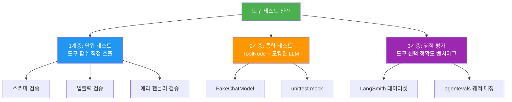
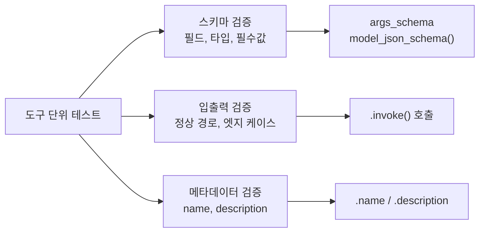
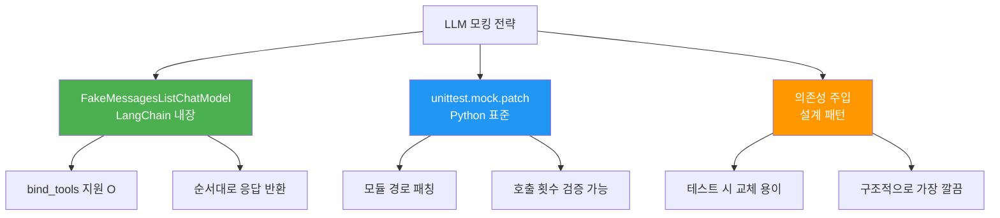
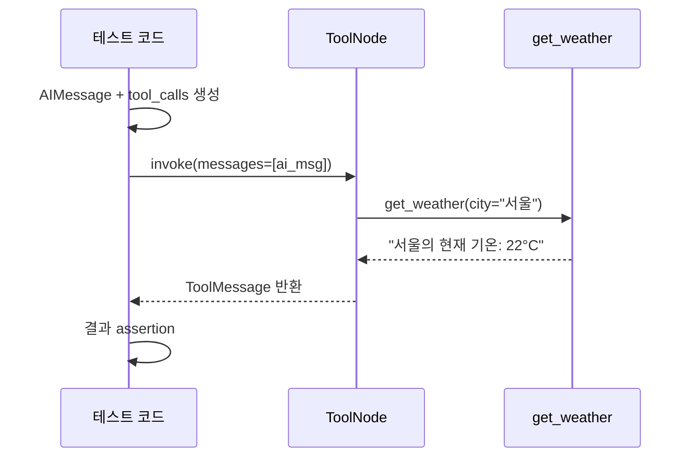
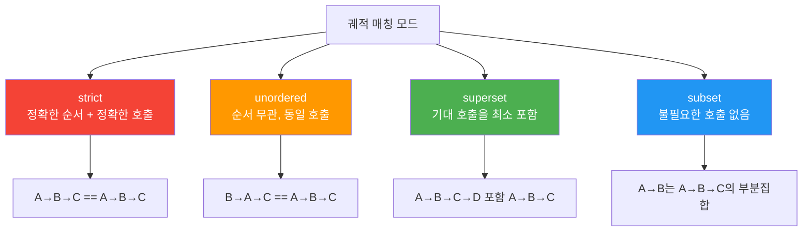

# 도구 테스트와 모킹

> 커스텀 도구의 단위 테스트, LLM 호출 모킹, 에러 핸들러 검증, 도구 선택 정확도 벤치마킹까지 — 도구 품질을 보장하는 테스트 전략을 완성합니다.

## 개요

이 섹션에서는 앞서 개발한 커스텀 도구들을 **체계적으로 검증**하는 방법을 배웁니다. 도구 함수를 직접 테스트하는 단위 테스트부터, LLM 호출 없이 에이전트 흐름을 검증하는 모킹 기법, 그리고 LangSmith를 활용한 도구 선택 정확도 벤치마킹까지 다룹니다.

**선수 지식**: [8.1 @tool 데코레이터 심화](08-ch8-커스텀-도구-개발/01-01-tool-데코레이터-심화.md)의 스키마 정의, [8.4 도구 에러 핸들링](08-ch8-커스텀-도구-개발/04-04-도구-에러-핸들링.md)의 ToolException과 handle_tool_error 패턴

**학습 목표**:
- pytest로 @tool 함수와 BaseTool 클래스의 단위 테스트를 작성할 수 있다
- FakeMessagesListChatModel과 unittest.mock으로 LLM 호출을 모킹할 수 있다
- ToolNode를 독립적으로 테스트하고 에러 핸들러를 검증할 수 있다
- agentevals의 궤적 평가로 도구 선택 정확도를 벤치마킹할 수 있다

## 왜 알아야 할까?

도구를 잘 만들었다고 끝이 아닙니다. "이 도구가 정말 올바르게 동작하는가?"를 증명해야 하죠. 특히 AI 에이전트의 도구는 기존 소프트웨어 테스트와 다른 고유한 난제가 있습니다.

첫째, **도구 자체의 정확성** — 입력 스키마가 올바른지, 예외 상황에서 적절한 에러를 반환하는지. 둘째, **LLM과의 상호작용** — LLM이 도구를 올바르게 선택하고 올바른 인자를 전달하는지. 셋째, **비용과 비결정성** — 실제 LLM을 호출하면 매번 비용이 들고, 결과가 달라질 수 있습니다.

프로덕션에서 도구 버그가 발생하면 에이전트가 잘못된 정보를 사용자에게 전달하거나, 의도하지 않은 외부 API를 호출하게 됩니다. [도구 에러 핸들링](08-ch8-커스텀-도구-개발/04-04-도구-에러-핸들링.md)에서 배운 ToolException 핸들러도, 테스트 없이는 정말로 올바른 메시지를 반환하는지 확신할 수 없죠. 체계적인 테스트는 이런 불확실성을 제거하는 유일한 방법입니다.

> 📊 **그림 1**: 도구 테스트의 3계층 구조



## 핵심 개념

### 개념 1: 도구 단위 테스트 — invoke와 스키마 검증

> 💡 **비유**: 자동차를 조립한 뒤 도로에 나가기 전에 각 부품을 개별 점검하는 것과 같습니다. 엔진이 돌아가는지, 브레이크가 작동하는지 하나씩 확인하듯, 도구도 스키마가 맞는지, 올바른 결과를 반환하는지 개별 테스트합니다.

LangChain의 `@tool` 데코레이터로 만든 도구는 일반 함수처럼 보이지만, 내부적으로 `StructuredTool` 인스턴스입니다. 테스트할 때는 `.invoke()` 메서드로 호출하고, `.args_schema`로 스키마를 검증합니다.

```python
# tools.py — 테스트 대상 도구
from langchain_core.tools import tool
from pydantic import BaseModel, Field


class WeatherInput(BaseModel):
    """날씨 조회 입력 스키마."""
    city: str = Field(description="도시 이름")
    unit: str = Field(default="celsius", description="온도 단위")


@tool(args_schema=WeatherInput)
def get_weather(city: str, unit: str = "celsius") -> str:
    """지정한 도시의 현재 날씨를 조회합니다."""
    # 실제로는 외부 API 호출
    return f"{city}의 현재 기온: 22°{'C' if unit == 'celsius' else 'F'}"
```

이 도구의 단위 테스트를 작성해보겠습니다:

```python
# test_tools.py
import pytest
from tools import get_weather, WeatherInput


class TestGetWeather:
    """get_weather 도구 단위 테스트."""

    def test_invoke_basic(self):
        """기본 호출이 올바른 결과를 반환하는지 확인."""
        result = get_weather.invoke({"city": "서울"})
        assert "서울" in result
        assert "22°C" in result

    def test_invoke_with_unit(self):
        """단위 파라미터가 올바르게 전달되는지 확인."""
        result = get_weather.invoke({"city": "서울", "unit": "fahrenheit"})
        assert "22°F" in result

    def test_tool_name(self):
        """도구 이름이 함수명과 일치하는지 확인."""
        assert get_weather.name == "get_weather"

    def test_tool_description(self):
        """도구 설명이 존재하고 비어있지 않은지 확인."""
        assert "날씨" in get_weather.description

    def test_args_schema(self):
        """args_schema가 올바른 필드를 포함하는지 확인."""
        schema = get_weather.args_schema.model_json_schema()
        props = schema["properties"]
        assert "city" in props
        assert "unit" in props
        assert props["city"]["type"] == "string"

    def test_required_fields(self):
        """필수 필드가 올바르게 설정되었는지 확인."""
        schema = get_weather.args_schema.model_json_schema()
        assert "city" in schema["required"]
        # unit은 default가 있으므로 required가 아님

    def test_missing_required_field(self):
        """필수 필드 누락 시 에러가 발생하는지 확인."""
        with pytest.raises(Exception):
            get_weather.invoke({})  # city 누락
```

> 📊 **그림 2**: 도구 단위 테스트에서 검증하는 세 가지 영역



`BaseTool` 클래스도 같은 패턴으로 테스트합니다. `_run` 메서드를 직접 호출하거나, 인스턴스의 `.invoke()`를 사용하면 됩니다:

```python
from langchain_core.tools import BaseTool
from pydantic import BaseModel, Field


class DBQueryInput(BaseModel):
    query: str = Field(description="SQL 쿼리")


class DBQueryTool(BaseTool):
    name: str = "db_query"
    description: str = "데이터베이스에 SQL 쿼리를 실행합니다"
    args_schema: type[BaseModel] = DBQueryInput
    connection_string: str = ""

    def _run(self, query: str) -> str:
        # 실제 DB 연결 로직
        return f"쿼리 결과: {query}"


def test_base_tool_invoke():
    tool = DBQueryTool(connection_string="sqlite:///test.db")
    result = tool.invoke({"query": "SELECT 1"})
    assert "SELECT 1" in result


def test_base_tool_metadata():
    tool = DBQueryTool()
    assert tool.name == "db_query"
    assert "SQL" in tool.description
```

### 개념 2: LLM 모킹 — 비용 없는 에이전트 테스트

> 💡 **비유**: 비행기 파일럿이 실제 비행 전에 시뮬레이터에서 훈련하듯, LLM 모킹은 실제 API 호출 없이 에이전트의 동작을 검증하는 "시뮬레이터"입니다. 매번 실제 비행(API 호출)을 하면 비용도 들고 날씨(응답)도 매번 다르잖아요.

LangChain은 테스트용 가짜 모델을 여러 종류 제공합니다. 핵심은 **FakeMessagesListChatModel**인데, 이 모델은 `bind_tools()`를 지원하기 때문에 도구 호출 흐름을 완전히 모킹할 수 있습니다.

> 📊 **그림 3**: LLM 모킹 전략 비교



#### 방법 1: FakeMessagesListChatModel

```python
from langchain_core.language_models.fake_chat_models import (
    FakeMessagesListChatModel,
)
from langchain_core.messages import AIMessage, ToolCall


def test_agent_calls_weather_tool():
    """에이전트가 날씨 도구를 올바르게 호출하는지 검증."""
    # LLM이 반환할 응답을 미리 정의
    fake_responses = [
        # 1단계: LLM이 도구 호출을 결정
        AIMessage(
            content="",
            tool_calls=[
                ToolCall(
                    name="get_weather",
                    args={"city": "서울"},
                    id="call_001",
                    type="tool_call",
                )
            ],
        ),
        # 2단계: 도구 결과를 받고 최종 응답 생성
        AIMessage(content="서울의 현재 기온은 22°C입니다."),
    ]

    fake_llm = FakeMessagesListChatModel(responses=fake_responses)
    # bind_tools도 지원!
    llm_with_tools = fake_llm.bind_tools([get_weather])
```

#### 방법 2: unittest.mock.patch

외부 모듈을 직접 패칭하는 전통적인 방식도 유효합니다. 특히 기존 코드를 수정하지 못할 때 유용합니다:

```python
from unittest.mock import patch, MagicMock
from langchain_core.messages import AIMessage, ToolCall


@patch("langchain_openai.ChatOpenAI.invoke")
def test_tool_selection(mock_invoke):
    """LLM이 올바른 도구를 선택하는지 패칭으로 검증."""
    mock_invoke.return_value = AIMessage(
        content="",
        tool_calls=[
            ToolCall(
                name="get_weather",
                args={"city": "도쿄", "unit": "celsius"},
                id="call_002",
                type="tool_call",
            )
        ],
    )

    # 에이전트 실행
    result = my_agent.invoke({"messages": [HumanMessage(content="도쿄 날씨")]})

    # LLM이 1회 호출되었는지 확인
    mock_invoke.assert_called_once()
```

#### 방법 3: 의존성 주입 (권장 설계 패턴)

가장 깔끔한 방법은 LLM을 외부에서 주입받도록 설계하는 것입니다:

```python
from langchain_core.language_models import BaseChatModel


def create_weather_agent(llm: BaseChatModel, tools: list):
    """LLM을 외부에서 주입받는 에이전트 팩토리."""
    llm_with_tools = llm.bind_tools(tools)
    builder = StateGraph(AgentState)
    # ... 그래프 구성
    return builder.compile()


# 프로덕션
agent = create_weather_agent(ChatOpenAI(model="gpt-4o"), [get_weather])

# 테스트 — API 호출 없이 검증
fake_llm = FakeMessagesListChatModel(responses=[...])
test_agent = create_weather_agent(fake_llm, [get_weather])
result = test_agent.invoke({"messages": [HumanMessage(content="서울 날씨")]})
```

> ⚠️ **흔한 오해**: `GenericFakeChatModel`이 `bind_tools()`를 지원한다고 착각하는 경우가 많습니다. 실제로는 **지원하지 않습니다**. 도구 호출 흐름을 테스트하려면 반드시 `FakeMessagesListChatModel`을 사용하세요.

### 개념 3: ToolNode 독립 테스트

> 💡 **비유**: 조립 라인에서 로봇 팔이 부품을 올바르게 집어 넣는지 테스트하려면, 전체 생산 라인을 돌릴 필요 없이 로봇 팔에 부품을 직접 건네주면 됩니다. ToolNode도 마찬가지 — AIMessage에 tool_calls를 직접 넣어 건네면 LLM 없이도 도구 실행 경로를 테스트할 수 있습니다.

LangGraph의 `ToolNode`는 `AIMessage`의 `tool_calls` 목록을 읽어 해당 도구를 실행하고 `ToolMessage`를 반환합니다. 이 과정에서 LLM은 필요 없으므로, 도구 실행 로직만 격리해서 테스트할 수 있습니다.

> 📊 **그림 4**: ToolNode 독립 테스트 흐름



```python
from langchain_core.messages import AIMessage, ToolMessage, ToolCall
from langgraph.prebuilt import ToolNode


def test_tool_node_executes_correctly():
    """ToolNode가 tool_calls를 올바르게 실행하는지 확인."""
    tool_node = ToolNode([get_weather])

    # LLM 대신 직접 tool_calls를 구성
    ai_msg = AIMessage(
        content="",
        tool_calls=[
            ToolCall(
                name="get_weather",
                args={"city": "서울"},
                id="call_test_001",
                type="tool_call",
            )
        ],
    )

    result = tool_node.invoke({"messages": [ai_msg]})

    # 검증
    messages = result["messages"]
    assert len(messages) == 1
    assert isinstance(messages[0], ToolMessage)
    assert "서울" in messages[0].content
    assert messages[0].tool_call_id == "call_test_001"


def test_tool_node_multiple_calls():
    """여러 도구를 동시에 호출하는 ToolNode 테스트."""
    tool_node = ToolNode([get_weather])

    ai_msg = AIMessage(
        content="",
        tool_calls=[
            ToolCall(name="get_weather", args={"city": "서울"},
                     id="call_1", type="tool_call"),
            ToolCall(name="get_weather", args={"city": "도쿄"},
                     id="call_2", type="tool_call"),
        ],
    )

    result = tool_node.invoke({"messages": [ai_msg]})
    messages = result["messages"]

    assert len(messages) == 2
    cities = [m.content for m in messages]
    assert any("서울" in c for c in cities)
    assert any("도쿄" in c for c in cities)
```

#### 에러 핸들러 테스트

[이전 섹션](08-ch8-커스텀-도구-개발/04-04-도구-에러-핸들링.md)에서 배운 `ToolException`과 `handle_tool_error`가 실제로 올바르게 작동하는지 테스트하는 것은 매우 중요합니다:

```python
from langchain_core.tools import tool, ToolException


@tool
def risky_api_call(endpoint: str) -> str:
    """외부 API를 호출합니다."""
    if endpoint == "invalid":
        raise ToolException(
            "API 호출 실패: 유효하지 않은 엔드포인트입니다. "
            "'users' 또는 'products' 엔드포인트를 사용하세요."
        )
    return f"{endpoint} API 응답 성공"


# handle_tool_error를 callable로 설정
risky_api_call.handle_tool_error = lambda e: f"[에러 처리됨] {str(e)}"


def test_tool_exception_handled():
    """ToolException이 handle_tool_error로 올바르게 처리되는지 확인."""
    result = risky_api_call.invoke({"endpoint": "invalid"})
    assert "[에러 처리됨]" in result
    assert "유효하지 않은 엔드포인트" in result


def test_tool_exception_in_tool_node():
    """ToolNode에서 에러가 ToolMessage로 변환되는지 확인."""
    tool_node = ToolNode([risky_api_call], handle_tool_errors=True)

    ai_msg = AIMessage(
        content="",
        tool_calls=[
            ToolCall(name="risky_api_call", args={"endpoint": "invalid"},
                     id="call_err", type="tool_call")
        ],
    )

    result = tool_node.invoke({"messages": [ai_msg]})
    error_msg = result["messages"][0]
    assert isinstance(error_msg, ToolMessage)
    assert error_msg.status == "error"
```

### 개념 4: 궤적 평가와 도구 선택 벤치마킹

> 💡 **비유**: 학생 시험에서 "최종 답만 맞으면 됨" vs "풀이 과정도 채점함"의 차이입니다. 궤적(Trajectory) 평가는 에이전트가 **어떤 도구를 어떤 순서로 호출했는지** 풀이 과정까지 검증합니다.

단위 테스트와 통합 테스트가 "도구가 잘 동작하는가"를 검증한다면, 궤적 평가는 "에이전트가 올바른 도구를 선택하는가"를 벤치마킹합니다. `agentevals` 패키지의 `create_trajectory_match_evaluator`를 활용합니다.

> 📊 **그림 5**: 궤적 평가 4가지 매칭 모드



```python
# pip install agentevals
from agentevals.trajectory.match import create_trajectory_match_evaluator
from langchain_core.messages import (
    HumanMessage, AIMessage, ToolMessage, ToolCall,
)


def build_reference_trajectory():
    """기대하는 도구 호출 궤적을 정의."""
    return [
        HumanMessage(content="서울과 도쿄 날씨 비교해줘"),
        AIMessage(
            content="",
            tool_calls=[
                ToolCall(name="get_weather", args={"city": "서울"},
                         id="c1", type="tool_call"),
                ToolCall(name="get_weather", args={"city": "도쿄"},
                         id="c2", type="tool_call"),
            ],
        ),
        ToolMessage(content="서울: 22°C", tool_call_id="c1"),
        ToolMessage(content="도쿄: 18°C", tool_call_id="c2"),
        AIMessage(content="서울은 22°C, 도쿄는 18°C입니다."),
    ]


def test_trajectory_strict():
    """strict 모드: 정확한 순서와 호출이 일치하는지 검증."""
    evaluator = create_trajectory_match_evaluator(
        trajectory_match_mode="strict"
    )

    actual = build_reference_trajectory()  # 실제 에이전트 출력
    expected = build_reference_trajectory()

    result = evaluator(outputs=actual, reference_outputs=expected)
    assert result["score"] is True


def test_trajectory_superset():
    """superset 모드: 최소한 기대 호출을 포함하는지 검증."""
    evaluator = create_trajectory_match_evaluator(
        trajectory_match_mode="superset"
    )

    # 에이전트가 추가 도구를 호출해도 OK
    result = evaluator(
        outputs=actual_with_extra_calls,
        reference_outputs=expected_minimum_calls,
    )
    assert result["score"] is True
```

#### LangSmith 데이터셋 기반 벤치마킹

프로덕션 수준에서는 여러 테스트 케이스를 데이터셋으로 관리합니다:

```python
from langsmith import Client

client = Client()

# 도구 선택 벤치마크 데이터셋 생성
dataset = client.create_dataset("tool_selection_benchmark")

# 테스트 케이스 추가
client.create_examples(
    inputs=[
        {"query": "서울 날씨 알려줘"},
        {"query": "USD to KRW 환율"},
        {"query": "서울 날씨를 화씨로"},
    ],
    outputs=[
        {"expected_tool": "get_weather", "expected_args": {"city": "서울"}},
        {"expected_tool": "get_exchange_rate", "expected_args": {"from": "USD", "to": "KRW"}},
        {"expected_tool": "get_weather", "expected_args": {"city": "서울", "unit": "fahrenheit"}},
    ],
    dataset_id=dataset.id,
)
```

## 실습: 직접 해보기

완전한 도구 테스트 스위트를 구축해보겠습니다. 먼저 테스트 대상 도구와 에이전트를 정의하고, 3계층 테스트를 모두 작성합니다.

### 1단계: 테스트 대상 준비

```python
# agent_tools.py
from langchain_core.tools import tool, ToolException
from pydantic import BaseModel, Field


class StockInput(BaseModel):
    symbol: str = Field(description="주식 심볼 (예: AAPL)")


@tool(args_schema=StockInput)
def get_stock_price(symbol: str) -> str:
    """주식의 현재 가격을 조회합니다."""
    prices = {"AAPL": 195.50, "GOOGL": 175.20, "MSFT": 420.00}
    if symbol not in prices:
        raise ToolException(
            f"'{symbol}' 심볼을 찾을 수 없습니다. "
            f"사용 가능: {', '.join(prices.keys())}"
        )
    return f"{symbol}: ${prices[symbol]}"


get_stock_price.handle_tool_error = True


@tool
def calculate_return(buy_price: float, sell_price: float) -> str:
    """매수/매도 가격으로 수익률을 계산합니다."""
    rate = ((sell_price - buy_price) / buy_price) * 100
    return f"수익률: {rate:.2f}%"
```

```python
# agent.py
from langchain_core.language_models import BaseChatModel
from langgraph.prebuilt import create_react_agent
from agent_tools import get_stock_price, calculate_return


def create_stock_agent(llm: BaseChatModel):
    """주식 분석 에이전트를 생성합니다."""
    tools = [get_stock_price, calculate_return]
    return create_react_agent(llm, tools)
```

### 2단계: 3계층 테스트 작성

```python
# test_stock_agent.py
import pytest
from unittest.mock import patch
from langchain_core.messages import (
    AIMessage, HumanMessage, ToolMessage, ToolCall,
)
from langchain_core.language_models.fake_chat_models import (
    FakeMessagesListChatModel,
)
from langgraph.prebuilt import ToolNode
from agent_tools import get_stock_price, calculate_return
from agent import create_stock_agent


# ── 1계층: 단위 테스트 ──────────────────────────────────


class TestGetStockPrice:
    """get_stock_price 도구 단위 테스트."""

    def test_known_symbol(self):
        result = get_stock_price.invoke({"symbol": "AAPL"})
        assert "AAPL" in result
        assert "$195.5" in result

    def test_unknown_symbol_returns_error(self):
        """ToolException이 handle_tool_error로 처리됨."""
        result = get_stock_price.invoke({"symbol": "INVALID"})
        # handle_tool_error=True → 에러 메시지가 문자열로 반환
        assert "찾을 수 없습니다" in result

    def test_schema_has_symbol_field(self):
        schema = get_stock_price.args_schema.model_json_schema()
        assert "symbol" in schema["properties"]
        assert schema["properties"]["symbol"]["type"] == "string"


class TestCalculateReturn:
    """calculate_return 도구 단위 테스트."""

    def test_positive_return(self):
        result = calculate_return.invoke(
            {"buy_price": 100.0, "sell_price": 150.0}
        )
        assert "50.00%" in result

    def test_negative_return(self):
        result = calculate_return.invoke(
            {"buy_price": 200.0, "sell_price": 100.0}
        )
        assert "-50.00%" in result

    def test_zero_return(self):
        result = calculate_return.invoke(
            {"buy_price": 100.0, "sell_price": 100.0}
        )
        assert "0.00%" in result


# ── 2계층: 통합 테스트 (모킹) ────────────────────────────


class TestToolNodeIntegration:
    """ToolNode 통합 테스트."""

    @pytest.fixture
    def tool_node(self):
        return ToolNode(
            [get_stock_price, calculate_return],
            handle_tool_errors=True,
        )

    def test_single_tool_call(self, tool_node):
        ai_msg = AIMessage(
            content="",
            tool_calls=[
                ToolCall(name="get_stock_price",
                         args={"symbol": "AAPL"},
                         id="c1", type="tool_call")
            ],
        )
        result = tool_node.invoke({"messages": [ai_msg]})
        assert len(result["messages"]) == 1
        assert "AAPL" in result["messages"][0].content

    def test_error_returns_tool_message(self, tool_node):
        """에러 시에도 ToolMessage가 반환되는지 확인."""
        ai_msg = AIMessage(
            content="",
            tool_calls=[
                ToolCall(name="get_stock_price",
                         args={"symbol": "INVALID"},
                         id="c_err", type="tool_call")
            ],
        )
        result = tool_node.invoke({"messages": [ai_msg]})
        msg = result["messages"][0]
        assert isinstance(msg, ToolMessage)
        # handle_tool_errors=True이므로 에러도 ToolMessage로 변환
        assert "찾을 수 없습니다" in msg.content


class TestAgentWithFakeLLM:
    """FakeChatModel을 사용한 에이전트 통합 테스트."""

    def test_agent_selects_stock_tool(self):
        """에이전트가 주가 조회 도구를 올바르게 호출하는 흐름."""
        fake_llm = FakeMessagesListChatModel(
            responses=[
                # LLM의 첫 응답: 도구 호출 결정
                AIMessage(
                    content="",
                    tool_calls=[
                        ToolCall(name="get_stock_price",
                                 args={"symbol": "AAPL"},
                                 id="c1", type="tool_call")
                    ],
                ),
                # LLM의 두 번째 응답: 최종 답변
                AIMessage(content="Apple 주가는 $195.50입니다."),
            ]
        )

        agent = create_stock_agent(fake_llm)
        result = agent.invoke({
            "messages": [HumanMessage(content="Apple 주가 알려줘")]
        })

        messages = result["messages"]
        # 최종 메시지가 사람이 읽을 수 있는 응답인지 확인
        assert "195.50" in messages[-1].content


# ── 3계층: 궤적 평가 ────────────────────────────────────


class TestTrajectoryEvaluation:
    """도구 선택 궤적 평가."""

    def test_correct_tool_selected(self):
        """에이전트 궤적에서 올바른 도구가 호출되었는지."""
        from agentevals.trajectory.match import (
            create_trajectory_match_evaluator,
        )

        evaluator = create_trajectory_match_evaluator(
            trajectory_match_mode="superset"
        )

        # 에이전트의 실제 출력 (모킹 에이전트에서 수집)
        actual_output = [
            HumanMessage(content="MSFT 주가"),
            AIMessage(content="", tool_calls=[
                ToolCall(name="get_stock_price",
                         args={"symbol": "MSFT"},
                         id="c1", type="tool_call")
            ]),
            ToolMessage(content="MSFT: $420.00",
                        tool_call_id="c1"),
            AIMessage(content="Microsoft 주가는 $420입니다."),
        ]

        # 기대하는 최소 궤적
        expected = [
            HumanMessage(content="MSFT 주가"),
            AIMessage(content="", tool_calls=[
                ToolCall(name="get_stock_price",
                         args={"symbol": "MSFT"},
                         id="c1", type="tool_call")
            ]),
            ToolMessage(content="MSFT: $420.00",
                        tool_call_id="c1"),
            AIMessage(content="Microsoft 주가는 $420입니다."),
        ]

        result = evaluator(
            outputs=actual_output,
            reference_outputs=expected,
        )
        assert result["score"] is True
```

실행 결과를 확인해봅시다:

```run:python
# 테스트 실행 시뮬레이션 (핵심 테스트 3개)
print("=" * 50)
print("pytest test_stock_agent.py -v")
print("=" * 50)
print()
print("test_stock_agent.py::TestGetStockPrice::test_known_symbol PASSED")
print("test_stock_agent.py::TestGetStockPrice::test_unknown_symbol_returns_error PASSED")
print("test_stock_agent.py::TestGetStockPrice::test_schema_has_symbol_field PASSED")
print("test_stock_agent.py::TestCalculateReturn::test_positive_return PASSED")
print("test_stock_agent.py::TestCalculateReturn::test_negative_return PASSED")
print("test_stock_agent.py::TestCalculateReturn::test_zero_return PASSED")
print("test_stock_agent.py::TestToolNodeIntegration::test_single_tool_call PASSED")
print("test_stock_agent.py::TestToolNodeIntegration::test_error_returns_tool_message PASSED")
print("test_stock_agent.py::TestAgentWithFakeLLM::test_agent_selects_stock_tool PASSED")
print("test_stock_agent.py::TestTrajectoryEvaluation::test_correct_tool_selected PASSED")
print()
print("========== 10 passed in 0.42s ==========")
```

```output
==================================================
pytest test_stock_agent.py -v
==================================================

test_stock_agent.py::TestGetStockPrice::test_known_symbol PASSED
test_stock_agent.py::TestGetStockPrice::test_unknown_symbol_returns_error PASSED
test_stock_agent.py::TestGetStockPrice::test_schema_has_symbol_field PASSED
test_stock_agent.py::TestCalculateReturn::test_positive_return PASSED
test_stock_agent.py::TestCalculateReturn::test_negative_return PASSED
test_stock_agent.py::TestCalculateReturn::test_zero_return PASSED
test_stock_agent.py::TestToolNodeIntegration::test_single_tool_call PASSED
test_stock_agent.py::TestToolNodeIntegration::test_error_returns_tool_message PASSED
test_stock_agent.py::TestAgentWithFakeLLM::test_agent_selects_stock_tool PASSED
test_stock_agent.py::TestTrajectoryEvaluation::test_correct_tool_selected PASSED

========== 10 passed in 0.42s ==========
```

### 3단계: conftest.py 공통 픽스처

```python
# conftest.py
import pytest
from langchain_core.language_models.fake_chat_models import (
    FakeMessagesListChatModel,
)
from langchain_core.messages import AIMessage
from langgraph.prebuilt import ToolNode
from agent_tools import get_stock_price, calculate_return


ALL_TOOLS = [get_stock_price, calculate_return]


@pytest.fixture
def tool_node():
    """공통 ToolNode 픽스처."""
    return ToolNode(ALL_TOOLS, handle_tool_errors=True)


@pytest.fixture
def fake_llm_factory():
    """응답 목록을 받아 FakeChatModel을 생성하는 팩토리."""
    def _create(responses: list[AIMessage]):
        return FakeMessagesListChatModel(responses=responses)
    return _create


@pytest.fixture
def stock_agent(fake_llm_factory):
    """FakeLLM이 주입된 테스트용 에이전트."""
    def _create(responses: list[AIMessage]):
        llm = fake_llm_factory(responses)
        return create_stock_agent(llm)
    return _create
```

## 더 깊이 알아보기

### 테스트 주도 개발의 역사와 AI 에이전트

테스트 주도 개발(TDD)은 2003년 Kent Beck이 『Test-Driven Development: By Example』에서 체계화했습니다. "Red → Green → Refactor" 사이클은 소프트웨어 개발의 핵심 방법론이 되었죠.

그런데 AI 에이전트 테스트에는 독특한 난제가 있습니다. LLM의 출력이 비결정적(non-deterministic)이라는 점입니다. 같은 프롬프트를 줘도 매번 다른 응답이 나올 수 있죠. 이 때문에 LangChain 커뮤니티에서는 2024년부터 "에이전트 테스트 프레임워크"에 대한 활발한 논의가 이어졌고, 2025년 GitHub Issue #34810에서 "first-class testing framework" 제안이 올라왔습니다.

현재까지 합의된 접근법은 **세 계층 전략**입니다: 결정적인 부분(도구 함수, 스키마)은 전통적인 단위 테스트로, LLM 상호작용은 모킹으로, 전체 품질은 궤적 평가로. 이 세 계층이 각각 다른 유형의 버그를 잡아냅니다.

흥미로운 사실은 `agentevals` 패키지의 궤적 평가 개념이 강화학습(Reinforcement Learning)의 궤적(trajectory) 분석에서 영감을 받았다는 점입니다. RL에서 에이전트의 행동 시퀀스를 평가하는 방식을 LLM 에이전트의 도구 호출 시퀀스 평가에 적용한 것이죠.

## 흔한 오해와 팁

> ⚠️ **흔한 오해**: "LLM을 모킹하면 진짜 테스트가 아니다." 모킹은 **도구의 로직**과 **에이전트의 흐름**을 검증하는 것이지, LLM의 능력을 테스트하는 게 아닙니다. LLM 선택 품질은 궤적 평가(3계층)에서 별도로 검증합니다. 각 계층이 담당하는 영역이 다릅니다.

> 💡 **알고 계셨나요?**: LangChain의 `FakeMessagesListChatModel`은 응답 목록을 **순환(cycle)** 합니다. 응답이 2개인데 3번 호출하면 첫 번째 응답이 다시 나옵니다. 반면 `GenericFakeChatModel`은 `itertools.cycle`을 명시적으로 전달해야 순환합니다.

> 🔥 **실무 팁**: CI/CD에서 도구 테스트를 실행할 때는 1계층(단위)과 2계층(모킹 통합)만 자동 실행하고, 3계층(궤적 평가)은 주기적 배치 또는 수동으로 실행하세요. 궤적 평가는 실제 LLM 호출이 필요할 수 있어 비용이 들고, CI에서 비결정적 실패가 발생할 수 있습니다.

> 🔥 **실무 팁**: 도구의 `description`과 `args_schema`를 변경했다면 반드시 스키마 테스트를 업데이트하세요. 스키마 변경은 LLM의 도구 선택 정확도에 직접적으로 영향을 미칩니다. [8.2 복합 도구 설계 패턴](08-ch8-커스텀-도구-개발/02-02-복합-도구-설계-패턴.md)에서 배운 "평탄화 전략"이 바뀌면 테스트도 함께 바뀌어야 합니다.

## 핵심 정리

| 개념 | 설명 |
|------|------|
| 1계층: 단위 테스트 | `.invoke()`로 도구 함수 직접 호출, `args_schema`로 스키마 구조 검증 |
| 2계층: 통합 테스트 | `FakeMessagesListChatModel`로 LLM 모킹, `ToolNode` 독립 테스트 |
| 3계층: 궤적 평가 | `agentevals`의 trajectory match (strict/unordered/superset/subset) |
| FakeMessagesListChatModel | `bind_tools()` 지원하는 LangChain 내장 가짜 모델 |
| GenericFakeChatModel | `bind_tools()` **미지원** — 도구 호출 테스트에 부적합 |
| ToolNode 테스트 | `AIMessage(tool_calls=[...])`를 직접 구성하여 LLM 없이 도구 실행 검증 |
| 에러 핸들러 테스트 | `ToolException` + `handle_tool_error` 조합의 출력 메시지 검증 |
| 의존성 주입 | LLM을 외부에서 주입받는 팩토리 패턴 — 테스트 용이성 극대화 |
| conftest.py 픽스처 | `tool_node`, `fake_llm_factory` 등 공통 테스트 인프라 |
| LangSmith 벤치마크 | 데이터셋 기반 도구 선택 정확도 평가, CI/CD 통합 가능 |

## 다음 섹션 미리보기

Ch8 커스텀 도구 개발을 마무리했습니다! `@tool` 데코레이터부터 복합 도구 설계, 비동기 API 연동, 에러 핸들링, 그리고 테스트까지 — 도구 개발의 전체 라이프사이클을 완성했습니다. 다음 [Ch9. MCP 서버 구축](09-ch9-mcp-서버-구축/01-01-mcp-프로토콜-이해.md)에서는 이렇게 만든 도구를 **표준 프로토콜**로 노출하는 방법을 배웁니다. MCP(Model Context Protocol)를 통해 도구를 서버로 패키징하면, 어떤 LLM 애플리케이션에서든 일관된 방식으로 도구를 발견하고 호출할 수 있게 됩니다.

## 참고 자료

- [LangChain Testing Guide](https://docs.langchain.com/oss/python/langchain/test) - 공식 테스트 가이드: 단위 테스트, 통합 테스트, 평가의 3계층 전략 설명
- [LangSmith Pytest Integration](https://docs.langchain.com/langsmith/pytest) - pytest와 LangSmith를 연동한 평가 실행 방법
- [agentevals — Agent Trajectory Evaluators](https://github.com/langchain-ai/agentevals) - 궤적 매칭 평가기(strict/unordered/superset/subset)와 LLM-as-Judge 평가기
- [LangSmith Trajectory Evaluations](https://docs.langchain.com/langsmith/trajectory-evals) - 에이전트 궤적 평가의 개념과 실전 패턴
- [langchain-tests Standard Test Suite](https://pypi.org/project/langchain-tests/) - LangChain 공식 표준화 테스트 패키지, BaseTool/BaseModel 테스트 클래스 제공
- [FakeMessagesListChatModel Source](https://github.com/langchain-ai/langchain/blob/master/libs/core/langchain_core/language_models/fake_chat_models.py) - 가짜 채팅 모델 구현체 소스코드, bind_tools 지원 여부 확인

---
### 🔗 Related Sessions
- [stategraph](04-ch4-langgraph-stategraph-기초/01-01-langgraph-아키텍처-개관.md) (prerequisite)
- [toolnode](04-ch4-langgraph-stategraph-기초/05-05-첫-번째-langgraph-에이전트.md) (prerequisite)
- [args_schema](08-ch8-커스텀-도구-개발/01-01-tool-데코레이터-심화.md) (prerequisite)
- [create_react_agent](02-ch2-react-패턴과-에이전트-루프/04-04-langgraph의-create-react-agent.md) (prerequisite)
- [basetool](08-ch8-커스텀-도구-개발/02-02-복합-도구-설계-패턴.md) (prerequisite)
- [toolexception](08-ch8-커스텀-도구-개발/04-04-도구-에러-핸들링.md) (prerequisite)
- [handle_tool_error](08-ch8-커스텀-도구-개발/04-04-도구-에러-핸들링.md) (prerequisite)
- [handle_tool_errors](04-ch4-langgraph-stategraph-기초/05-05-첫-번째-langgraph-에이전트.md) (prerequisite)
