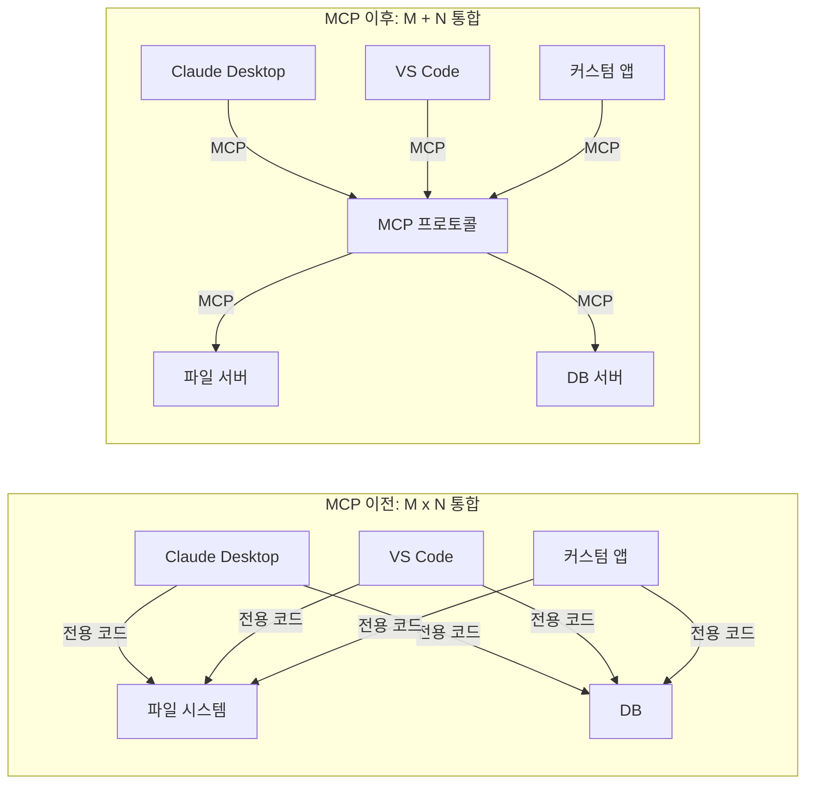
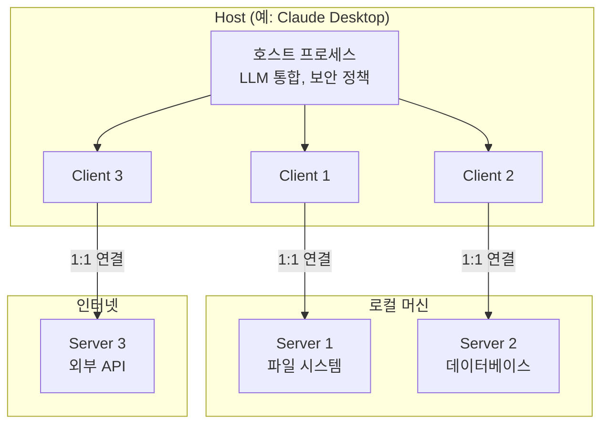
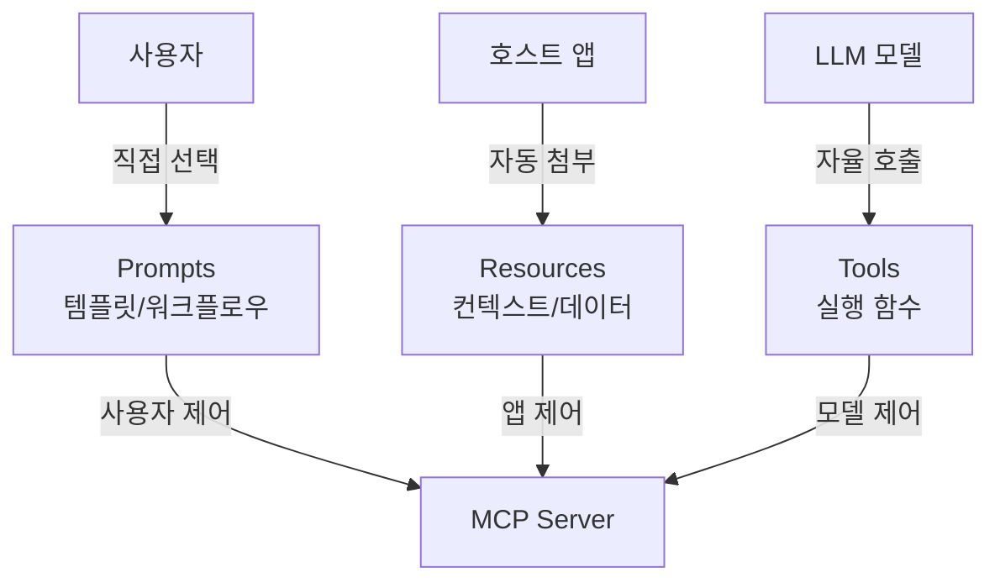
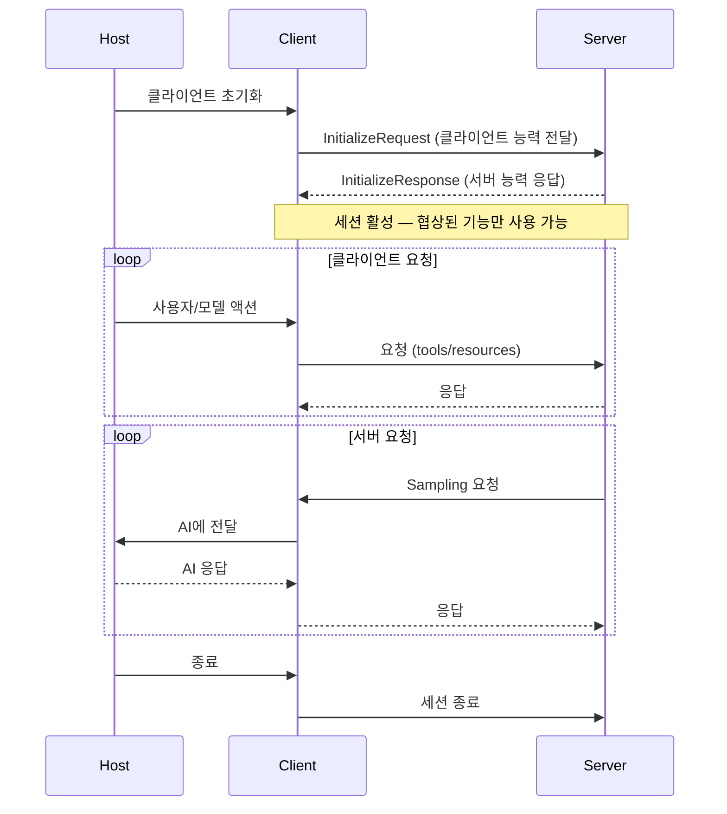
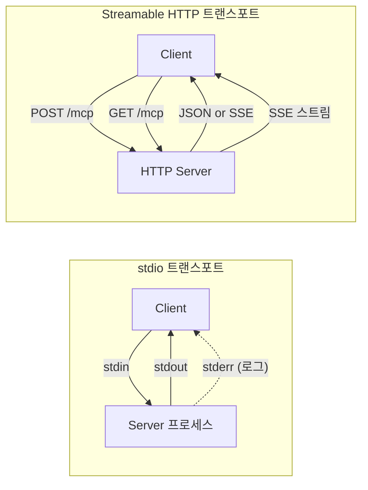

# MCP 프로토콜 이해

> Model Context Protocol의 탄생 배경과 Host/Client/Server 아키텍처, 프로토콜 스펙의 핵심 개념을 학습합니다

## 개요

이 섹션에서는 AI 에이전트 생태계의 "USB 포트"라 불리는 **MCP(Model Context Protocol)**의 전체 그림을 살펴봅니다. MCP가 왜 필요한지, 어떤 구조로 동작하는지, 그리고 세 가지 핵심 프리미티브(Tools, Resources, Prompts)가 무엇인지를 이해하게 됩니다.

**선수 지식**: [커스텀 도구 개발](08-ch8-커스텀-도구-개발/01-01-tool-데코레이터-심화.md) 챕터에서 다룬 도구 정의 방식과 LLM의 Tool Calling 메커니즘에 대한 이해
**학습 목표**:
- MCP가 탄생한 배경과 해결하려는 문제를 설명할 수 있다
- Host/Client/Server 3계층 아키텍처의 역할과 관계를 이해한다
- Tools, Resources, Prompts 세 가지 프리미티브의 차이를 구분할 수 있다
- stdio와 Streamable HTTP 트랜스포트의 특성을 비교할 수 있다

## 왜 알아야 할까?

여러분이 LangGraph로 에이전트를 만들었다고 가정해 보겠습니다. 이 에이전트가 파일 시스템을 읽고, 데이터베이스를 조회하고, 외부 API를 호출해야 합니다. 지금까지는 **각 도구를 직접 Python 함수로 구현**했죠. 그런데 다른 팀에서 만든 에이전트도 같은 데이터베이스에 접근해야 합니다. 또 다른 팀은 Go로 에이전트를 개발 중이고요. 모두가 같은 도구를 각자 언어로 다시 구현하고 있습니다.

이것은 마치 **프린터를 컴퓨터에 연결하던 1990년대**와 비슷합니다. 프린터마다, 컴퓨터마다 전용 케이블과 드라이버가 필요했죠. USB가 등장하기 전까지요.

MCP는 AI 에이전트 세계의 USB입니다. **한 번 도구를 MCP 서버로 만들면**, Claude Desktop이든, VS Code Copilot이든, 여러분의 커스텀 에이전트든, 어떤 호스트 애플리케이션에서든 그 도구를 사용할 수 있습니다. "M×N 문제"(M개의 앱 × N개의 도구)를 "M+N 문제"로 바꾸는 것이죠.

> 📊 **그림 1**: MCP가 해결하는 M×N 문제



2024년 11월 Anthropic이 MCP를 공개한 이후, OpenAI와 Google DeepMind도 채택했고, 지금은 Linux Foundation 산하 오픈 표준으로 성장했습니다. **AI 에이전트를 실전에 배포한다면, MCP는 선택이 아닌 필수입니다.**

## 핵심 개념

### 개념 1: MCP의 기본 철학 — "쉬운 서버, 격리된 실행"

> 💡 **비유**: MCP 서버는 **레스토랑의 전문 셰프**와 같습니다. 스시 셰프는 스시만 만들고, 파스타 셰프는 파스타만 만듭니다. 홀 매니저(Host)가 손님의 주문을 받아 적절한 셰프에게 전달하고, 각 셰프는 다른 셰프의 레시피를 몰라도 됩니다. 이것이 MCP의 **격리(isolation)** 원칙입니다.

MCP의 설계 철학은 네 가지로 요약됩니다:

1. **서버는 만들기 매우 쉬워야 한다** — 복잡한 오케스트레이션은 호스트가 담당
2. **서버는 조합 가능해야 한다** — 여러 서버를 자유롭게 조합
3. **서버는 전체 대화를 볼 수 없어야 한다** — 필요한 컨텍스트만 전달받음
4. **기능은 점진적으로 추가 가능해야 한다** — 능력 협상(Capability Negotiation)으로 확장

이 철학 덕분에 MCP 서버 하나는 보통 **100줄 이내의 Python 코드**로 구현할 수 있습니다. [Ch8. 커스텀 도구 개발](08-ch8-커스텀-도구-개발/01-01-tool-데코레이터-심화.md)에서 `@tool` 데코레이터로 도구를 만들었던 것처럼, MCP에서도 비슷한 데코레이터 패턴으로 서버를 구축합니다.

### 개념 2: Host / Client / Server 아키텍처

> 💡 **비유**: 공항에 비유하면 이해가 쉽습니다. **Host**는 공항 터미널(전체 운영 관리), **Client**는 탑승 게이트(각 항공사 전용 창구), **Server**는 항공사(실제 서비스 제공자)입니다. 하나의 터미널에 여러 게이트가 있고, 각 게이트는 하나의 항공사와 연결됩니다.

MCP 아키텍처의 세 구성 요소를 자세히 살펴보겠습니다.

> 📊 **그림 2**: MCP Host/Client/Server 아키텍처



**Host (호스트)**는 전체를 관장하는 컨테이너입니다:
- 여러 Client 인스턴스를 생성·관리
- 사용자 동의와 보안 정책을 적용
- LLM과의 통합 및 Sampling 조율
- 예: Claude Desktop, VS Code, 커스텀 에이전트 앱

**Client (클라이언트)**는 Host가 생성한 커넥터입니다:
- **하나의 Client는 하나의 Server와 1:1 연결** — 이것이 핵심!
- 프로토콜 협상과 능력 교환을 처리
- 메시지를 양방향으로 라우팅
- 서버 간 보안 경계를 유지

**Server (서버)**는 실제 기능을 제공하는 서비스입니다:
- Tools, Resources, Prompts를 MCP 프리미티브로 노출
- 독립적으로 동작하며, 특정 책임에 집중
- 로컬 프로세스일 수도, 원격 서비스일 수도 있음

```python
# Host-Client-Server 관계를 코드로 표현하면
from dataclasses import dataclass

@dataclass
class MCPServer:
    """특정 기능을 제공하는 서비스"""
    name: str
    capabilities: list[str]  # ["tools", "resources", "prompts"]

@dataclass
class MCPClient:
    """Host가 생성, 하나의 Server와 1:1 연결"""
    server: MCPServer

@dataclass
class MCPHost:
    """전체를 관장하는 컨테이너"""
    clients: list[MCPClient]

# 하나의 Host에 여러 Client, 각 Client는 하나의 Server와 연결
file_server = MCPServer("filesystem", ["tools", "resources"])
db_server = MCPServer("database", ["tools"])
api_server = MCPServer("external-api", ["tools"])

host = MCPHost(clients=[
    MCPClient(server=file_server),   # Client 1 ↔ 파일 서버
    MCPClient(server=db_server),     # Client 2 ↔ DB 서버
    MCPClient(server=api_server),    # Client 3 ↔ API 서버
])
```

### 개념 3: 세 가지 프리미티브 — Tools, Resources, Prompts

> 💡 **비유**: MCP 서버가 레스토랑이라면, **Tools**는 요리 주문(행동 실행), **Resources**는 메뉴판(정보 읽기), **Prompts**는 추천 코스 요리(미리 만들어진 워크플로우)에 해당합니다.

MCP의 서버가 외부에 노출하는 기능은 정확히 **세 가지 프리미티브(primitive)**로 분류됩니다. 각각의 제어 주체가 다르다는 점이 핵심입니다.

> 📊 **그림 3**: MCP 세 가지 프리미티브와 제어 주체



| 프리미티브 | 제어 주체 | 설명 | 예시 |
|-----------|----------|------|------|
| **Prompts** | 사용자(User) | 사용자가 직접 선택하는 대화 템플릿 | 슬래시 커맨드, 메뉴 옵션 |
| **Resources** | 애플리케이션(App) | 클라이언트가 관리하는 컨텍스트 데이터 | 파일 내용, git 히스토리 |
| **Tools** | 모델(LLM) | LLM이 자율적으로 호출하는 실행 함수 | API 호출, 파일 쓰기 |

이 구분이 왜 중요할까요? [Ch1. LLM 도구 호출의 이해](01-ch1-llm-도구-호출의-이해/02-02-llm-tool-calling-메커니즘.md)에서 배운 **Tool Calling**은 MCP의 Tools 프리미티브와 직접 대응됩니다. 하지만 MCP는 여기에 Resources와 Prompts를 추가하여 **읽기 전용 데이터 제공**과 **사용자 주도 워크플로우**까지 표준화한 것입니다.

```python
from mcp.server.fastmcp import FastMCP

mcp = FastMCP("demo-server")

# 1. Tool — LLM이 자율적으로 호출
@mcp.tool()
def calculate(expression: str) -> str:
    """수학 표현식을 계산합니다"""
    return str(eval(expression))  # 실제로는 안전한 파서 사용

# 2. Resource — 앱이 컨텍스트로 제공
@mcp.resource("config://app-settings")
def get_settings() -> str:
    """애플리케이션 설정을 반환합니다"""
    return '{"theme": "dark", "language": "ko"}'

# 3. Prompt — 사용자가 선택하여 실행
@mcp.prompt()
def code_review(code: str) -> str:
    """코드 리뷰 프롬프트 템플릿"""
    return f"다음 코드를 리뷰해주세요:\n\n{code}"
```

### 개념 4: 능력 협상(Capability Negotiation)과 연결 생명주기

> 💡 **비유**: 외국에서 통화할 때 "한국어 되시나요?"라고 먼저 묻는 것처럼, MCP의 Client와 Server도 연결 시작 시 **"당신은 뭘 할 수 있나요?"**를 서로 주고받습니다. 이것이 능력 협상입니다.

MCP 세션의 생명주기는 **Initialize → Operate → Shutdown** 세 단계로 구성됩니다.

> 📊 **그림 4**: MCP 연결 생명주기 — 능력 협상과 메시지 교환



**Initialize 단계**에서 교환되는 핵심 정보:

```python
# 서버가 선언하는 능력 (ServerCapabilities)
server_capabilities = {
    "tools": {"listChanged": True},       # 도구 제공 + 변경 알림 지원
    "resources": {
        "subscribe": True,                 # 리소스 구독 지원
        "listChanged": True                # 리소스 목록 변경 알림
    },
    "prompts": {"listChanged": True},      # 프롬프트 제공
}

# 클라이언트가 선언하는 능력 (ClientCapabilities)
client_capabilities = {
    "sampling": {},      # LLM Sampling 지원
    "roots": {           # 파일 시스템 루트 제공
        "listChanged": True
    },
}
```

능력 협상이 중요한 이유는, **서버가 선언하지 않은 기능은 클라이언트가 요청할 수 없기 때문**입니다. 예를 들어 서버가 `"tools"` 능력을 선언하지 않았다면, 클라이언트가 `tools/list`를 호출하면 에러가 발생합니다.

### 개념 5: 트랜스포트 — stdio와 Streamable HTTP

> 💡 **비유**: 트랜스포트는 MCP 메시지를 실어 나르는 **교통수단**입니다. **stdio**는 집 안에서 쓰는 인터폰(로컬, 빠르고 간단), **Streamable HTTP**는 인터넷 전화(원격, 확장 가능)라고 생각하면 됩니다.

MCP는 **JSON-RPC 2.0** 위에서 동작하며, 두 가지 표준 트랜스포트를 정의합니다.

> 📊 **그림 5**: stdio vs Streamable HTTP 트랜스포트 비교



**stdio 트랜스포트**:
- 클라이언트가 서버를 **자식 프로세스**로 실행
- stdin으로 JSON-RPC 메시지를 보내고 stdout으로 수신
- stderr는 로깅용 (에러 상태를 의미하지 않음)
- **로컬 개발과 CLI 도구에 최적**

**Streamable HTTP 트랜스포트** (2025-11-25 스펙에서 신규 도입):
- 서버가 독립 HTTP 프로세스로 동작
- 단일 엔드포인트(`/mcp`)에서 POST와 GET 모두 지원
- 응답은 JSON 단건 또는 **SSE(Server-Sent Events) 스트림**
- 세션 관리(`MCP-Session-Id` 헤더)와 재연결 지원
- **프로덕션 배포와 원격 접근에 최적**

```run:python
# 두 트랜스포트의 특성 비교
transports = {
    "stdio": {
        "실행 방식": "자식 프로세스",
        "통신": "stdin/stdout",
        "배포": "로컬 전용",
        "설정 난이도": "매우 쉬움",
        "동시 접속": "1:1",
    },
    "Streamable HTTP": {
        "실행 방식": "독립 HTTP 서버",
        "통신": "POST/GET + SSE",
        "배포": "로컬 + 원격",
        "설정 난이도": "중간",
        "동시 접속": "다중 클라이언트",
    },
}

for name, props in transports.items():
    print(f"\n{'='*40}")
    print(f"  {name} 트랜스포트")
    print(f"{'='*40}")
    for key, value in props.items():
        print(f"  {key:12s}: {value}")
```

```output

========================================
  stdio 트랜스포트
========================================
  실행 방식       : 자식 프로세스
  통신           : stdin/stdout
  배포           : 로컬 전용
  설정 난이도     : 매우 쉬움
  동시 접속       : 1:1

========================================
  Streamable HTTP 트랜스포트
========================================
  실행 방식       : 독립 HTTP 서버
  통신           : POST/GET + SSE
  배포           : 로컬 + 원격
  설정 난이도     : 중간
  동시 접속       : 다중 클라이언트
```

> ⚠️ **흔한 오해**: "SSE 트랜스포트"와 "Streamable HTTP 트랜스포트"를 혼동하는 분이 많습니다. 2024-11-05 스펙의 **HTTP+SSE**는 별도의 SSE 엔드포인트와 POST 엔드포인트가 필요했지만, 2025-11-25 스펙의 **Streamable HTTP**는 단일 엔드포인트에서 모든 것을 처리합니다. 이전 방식은 공식적으로 deprecated되었습니다.

## 실습: 직접 해보기

MCP의 핵심 개념을 코드로 확인해 봅시다. 먼저 MCP Python SDK를 설치하고, 가장 간단한 서버를 만들어보겠습니다.

```python
# 1. 설치 (터미널에서 실행)
# pip install "mcp[cli]"
# 또는
# uv add "mcp[cli]"
```

```python
# my_first_mcp.py — 첫 번째 MCP 서버
from mcp.server.fastmcp import FastMCP

# 서버 인스턴스 생성
mcp = FastMCP("my-first-server")

# Tool: LLM이 호출하는 실행 함수
@mcp.tool()
def add(a: int, b: int) -> int:
    """두 숫자를 더합니다"""
    return a + b

@mcp.tool()
def get_weather(city: str) -> str:
    """도시의 날씨를 조회합니다 (데모)"""
    # 실제로는 날씨 API를 호출
    weather_data = {
        "서울": "맑음, 22도",
        "부산": "흐림, 19도",
        "제주": "비, 17도",
    }
    return weather_data.get(city, f"{city}의 날씨 정보를 찾을 수 없습니다")

# Resource: 앱이 컨텍스트로 사용하는 데이터
@mcp.resource("info://server-status")
def server_status() -> str:
    """서버 상태를 반환합니다"""
    return '{"status": "running", "version": "1.0.0"}'

# Prompt: 사용자가 선택하는 대화 템플릿
@mcp.prompt()
def summarize(text: str) -> str:
    """텍스트 요약 프롬프트"""
    return f"다음 텍스트를 3줄로 요약해주세요:\n\n{text}"

if __name__ == "__main__":
    # stdio 트랜스포트로 실행 (기본값)
    mcp.run()
```

```console
$ python my_first_mcp.py
```

이 서버는 stdio 트랜스포트로 실행되므로 직접 테스트하려면 MCP Inspector를 사용합니다:

```console
$ mcp dev my_first_mcp.py
```

MCP Inspector가 브라우저에서 열리면, 등록된 Tools, Resources, Prompts를 확인하고 직접 호출해볼 수 있습니다.

JSON-RPC 메시지 레벨에서 어떤 일이 일어나는지도 살펴보겠습니다:

```run:python
import json

# MCP 초기화 요청 (클라이언트 → 서버)
initialize_request = {
    "jsonrpc": "2.0",
    "id": 1,
    "method": "initialize",
    "params": {
        "protocolVersion": "2025-11-25",
        "capabilities": {
            "sampling": {}  # 클라이언트가 Sampling 지원 선언
        },
        "clientInfo": {
            "name": "my-agent",
            "version": "1.0.0"
        }
    }
}

# 서버 응답 (서버 → 클라이언트)
initialize_response = {
    "jsonrpc": "2.0",
    "id": 1,
    "result": {
        "protocolVersion": "2025-11-25",
        "capabilities": {
            "tools": {"listChanged": True},
            "resources": {},
            "prompts": {}
        },
        "serverInfo": {
            "name": "my-first-server",
            "version": "1.0.0"
        }
    }
}

print("=== 클라이언트 → 서버: InitializeRequest ===")
print(json.dumps(initialize_request, indent=2, ensure_ascii=False))
print("\n=== 서버 → 클라이언트: InitializeResponse ===")
print(json.dumps(initialize_response, indent=2, ensure_ascii=False))
```

```output
=== 클라이언트 → 서버: InitializeRequest ===
{
  "jsonrpc": "2.0",
  "id": 1,
  "method": "initialize",
  "params": {
    "protocolVersion": "2025-11-25",
    "capabilities": {
      "sampling": {}
    },
    "clientInfo": {
      "name": "my-agent",
      "version": "1.0.0"
    }
  }
}

=== 서버 → 클라이언트: InitializeResponse ===
{
  "jsonrpc": "2.0",
  "id": 1,
  "result": {
    "protocolVersion": "2025-11-25",
    "capabilities": {
      "tools": {
        "listChanged": true
      },
      "resources": {},
      "prompts": {}
    },
    "serverInfo": {
      "name": "my-first-server",
      "version": "1.0.0"
    }
  }
}
```

## 더 깊이 알아보기

### MCP의 탄생 스토리 — 개발자의 불편함에서 시작된 혁명

2024년 7월, Anthropic의 소프트웨어 엔지니어 **David Soria Parra**는 사내 개발 도구를 개선하는 작업을 하고 있었습니다. 그에게는 하나의 반복적인 불편이 있었는데요 — Claude Desktop에서 대화하며 코드를 만들면, 그것을 IDE에 **복사-붙여넣기**해야 했고, IDE에서 작업한 파일을 Claude에게 보여주려면 또 복사해야 했습니다. Claude Desktop은 Artifacts 같은 멋진 기능이 있었지만 로컬 파일을 읽지 못했고, IDE는 파일 접근이 가능했지만 Artifacts가 없었죠.

"왜 모든 앱이 같은 도구에 접근할 수 없을까?"

이 질문이 MCP의 시작이었습니다. David는 동료 **Justin Spahr-Summers**와 함께, Microsoft의 **Language Server Protocol(LSP)**에서 영감을 받아 프로토콜을 설계하기 시작했습니다. LSP가 "한 번 언어 서버를 만들면 모든 에디터에서 자동완성이 작동하는 것"처럼, MCP는 "한 번 도구 서버를 만들면 모든 AI 앱에서 그 도구를 사용할 수 있게" 만드는 것이 목표였습니다.

2024년 11월 25일, Anthropic은 MCP를 오픈소스로 공개했습니다. 놀랍게도 이 프로토콜은 불과 1년 만에 OpenAI, Google DeepMind까지 채택하는 산업 표준이 되었고, 현재는 Linux Foundation 산하에서 공식 거버넌스를 갖춘 오픈 표준으로 운영되고 있습니다.

### JSON-RPC 2.0 — 왜 이 프로토콜인가?

MCP가 기반으로 선택한 JSON-RPC 2.0은 2010년에 확정된, **단순하면서도 견고한** 원격 프로시저 호출 규격입니다. REST API 대신 JSON-RPC를 선택한 이유는:

- **양방향 통신**: 클라이언트→서버 요청뿐 아니라 서버→클라이언트 요청(Sampling)도 같은 형식
- **알림(Notification) 지원**: id 없는 메시지로 응답을 기대하지 않는 이벤트 전달
- **에러 코드 표준화**: 구조화된 에러 처리
- **상태 유지(Stateful)**: REST의 무상태와 달리, 세션 기반 상호작용에 적합

## 흔한 오해와 팁

> ⚠️ **흔한 오해**: "MCP는 또 하나의 REST API 래퍼다" — 아닙니다! MCP는 **양방향 상태 유지 프로토콜**입니다. 서버가 클라이언트에게 먼저 요청을 보낼 수 있고(Sampling), 능력 협상으로 점진적으로 기능을 확장하며, 리소스 변경 알림 같은 실시간 이벤트도 지원합니다. REST API와는 근본적으로 다른 패러다임입니다.

> 💡 **알고 계셨나요?**: MCP라는 이름은 LSP(Language Server Protocol)에서 직접 영감을 받았습니다. LSP가 "프로그래밍 언어 지원"을 표준화했듯, MCP는 "AI 모델 컨텍스트 통합"을 표준화합니다. 실제로 MCP 스펙 문서에도 "MCP takes some inspiration from the Language Server Protocol"이라고 명시되어 있습니다.

> 🔥 **실무 팁**: MCP 서버를 처음 개발할 때는 **stdio 트랜스포트 + `mcp dev` Inspector** 조합으로 시작하세요. 네트워크 설정 없이 바로 테스트할 수 있고, Inspector가 Tools/Resources/Prompts를 시각적으로 보여줍니다. 프로덕션 배포 시에만 Streamable HTTP로 전환하면 됩니다.

## 핵심 정리

| 개념 | 설명 |
|------|------|
| MCP | AI 앱과 외부 도구/데이터를 연결하는 오픈 표준 프로토콜 |
| Host | LLM 앱의 컨테이너. 보안·LLM 통합·Client 관리 담당 |
| Client | Host가 생성. Server와 1:1 연결, 프로토콜 메시지 라우팅 |
| Server | Tools/Resources/Prompts를 노출하는 서비스 |
| Tools | **모델 제어** — LLM이 자율 호출하는 실행 함수 |
| Resources | **앱 제어** — 클라이언트가 관리하는 컨텍스트 데이터 |
| Prompts | **사용자 제어** — 사용자가 선택하는 대화 템플릿 |
| 능력 협상 | 연결 시 Client/Server가 지원 기능을 교환하는 과정 |
| stdio | 자식 프로세스 기반 로컬 트랜스포트 (stdin/stdout) |
| Streamable HTTP | 단일 HTTP 엔드포인트 기반 원격 트랜스포트 (POST/GET + SSE) |
| JSON-RPC 2.0 | MCP의 메시지 인코딩 규격 (양방향, 상태 유지) |

## 다음 섹션 미리보기

이제 MCP의 전체 구조와 핵심 개념을 이해했으니, [02. FastMCP 서버 기초](09-ch9-mcp-서버-구축/02-02-fastmcp-서버-기초.md)에서 실제로 동작하는 MCP 서버를 FastMCP 프레임워크로 구축해 보겠습니다. `@mcp.tool()`, `@mcp.resource()`, `@mcp.prompt()` 데코레이터의 세부 옵션과 타입 검증, Context 활용법을 실습합니다.

## 참고 자료

- [MCP 공식 스펙 (2025-11-25)](https://modelcontextprotocol.io/specification/2025-11-25) - 프로토콜의 정의와 아키텍처 전체를 다루는 공식 명세서
- [MCP Python SDK (GitHub)](https://github.com/modelcontextprotocol/python-sdk) - FastMCP 포함, Python으로 MCP 서버/클라이언트를 구현하는 공식 SDK
- [MCP 아키텍처 문서](https://modelcontextprotocol.io/specification/2025-11-25/architecture) - Host/Client/Server 구조와 능력 협상의 상세 설명
- [MCP 트랜스포트 스펙](https://modelcontextprotocol.io/specification/2025-11-25/basic/transports) - stdio와 Streamable HTTP 트랜스포트의 기술 명세
- [A Year of MCP: From Internal Experiment to Industry Standard (Pento)](https://www.pento.ai/blog/a-year-of-mcp-2025-review) - MCP의 1년 역사와 산업 채택 과정을 정리한 회고
- [The Model Context Protocol by Anthropic (W&B)](https://wandb.ai/onlineinference/mcp/reports/The-Model-Context-Protocol-MCP-by-Anthropic-Origins-functionality-and-impact--VmlldzoxMTY5NDI4MQ) - MCP의 기원, 기능, 영향력을 분석한 심층 리포트

---
### 🔗 Related Sessions
- [tool calling](01-ch1-llm-도구-호출의-이해/02-02-llm-tool-calling-메커니즘.md) (prerequisite)
