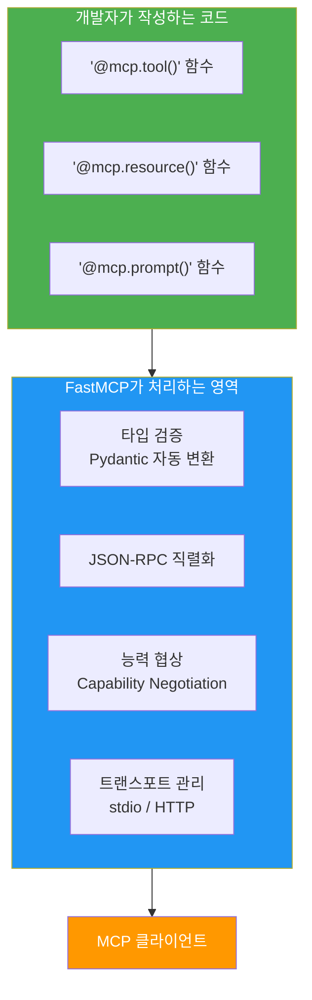
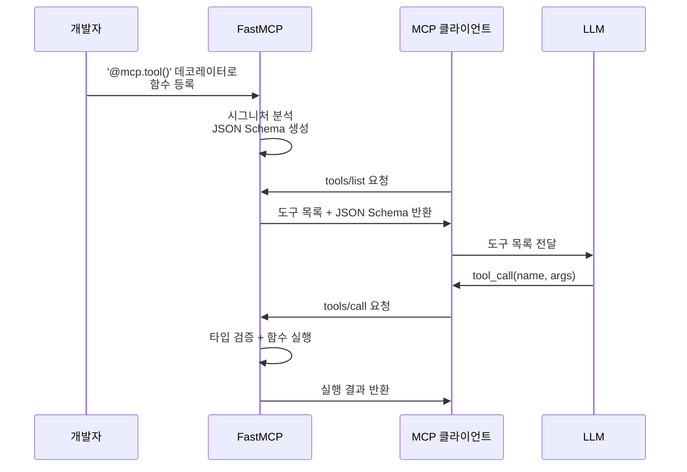
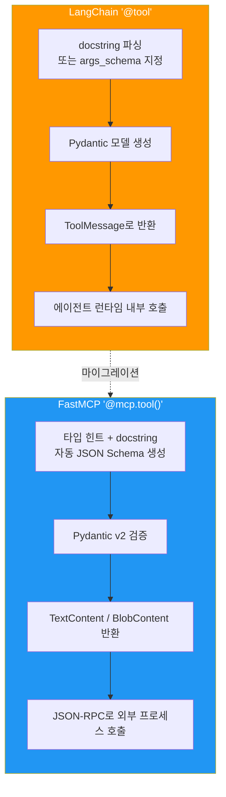
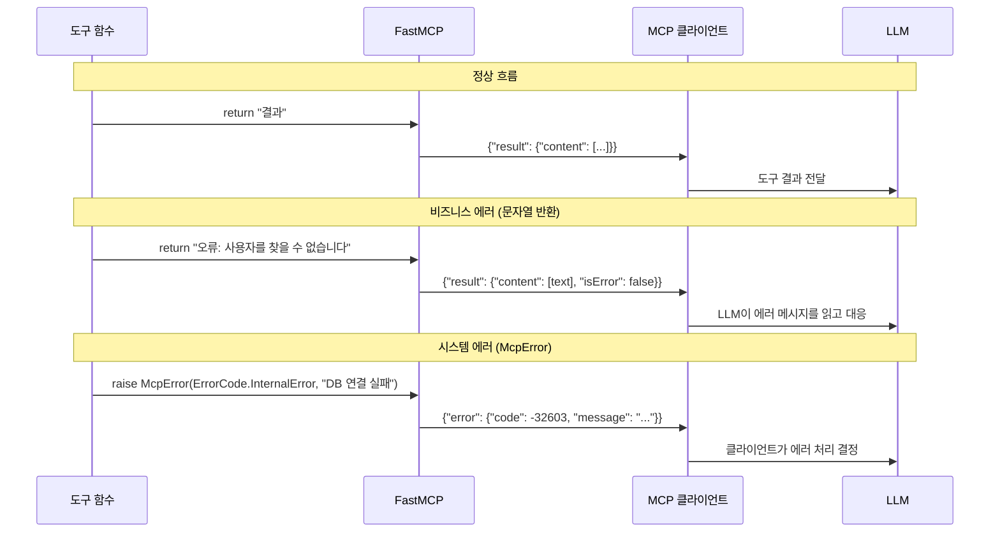
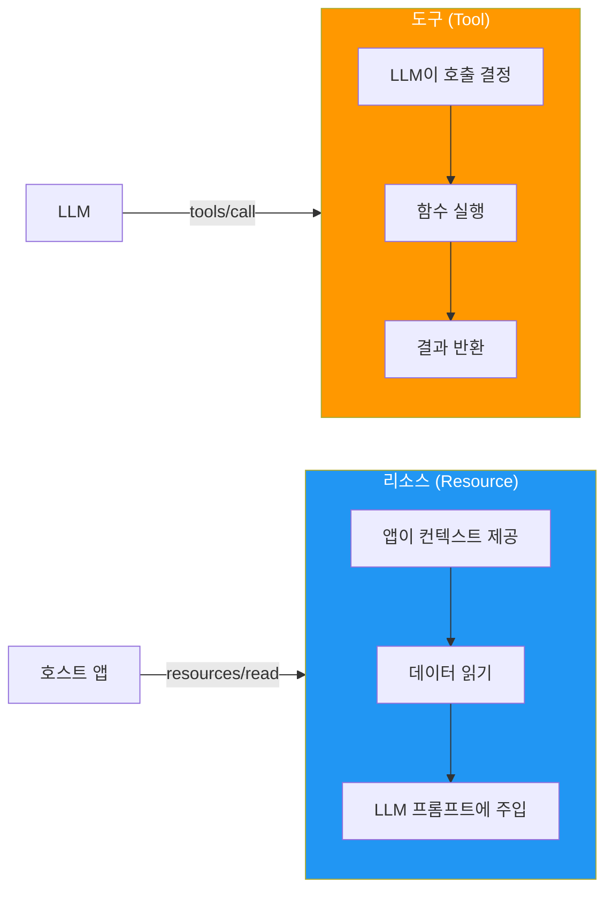
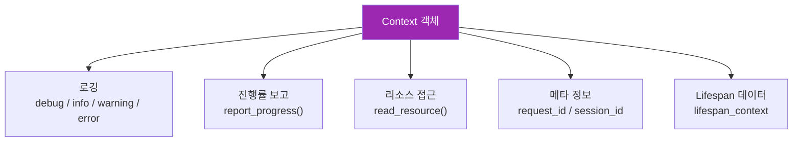
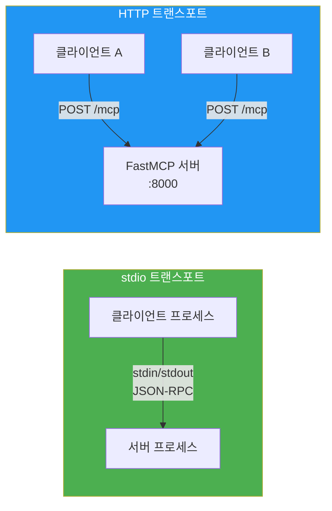

# 02. FastMCP 서버 기초

> MCP Python SDK의 FastMCP 프레임워크로 도구·리소스를 노출하는 서버를 처음부터 구축하고, 기존 에이전트 도구를 MCP로 마이그레이션합니다.

## 개요

이 섹션에서는 FastMCP를 설치하고, `@mcp.tool()`로 도구를, `@mcp.resource()`로 데이터를 노출하는 MCP 서버를 직접 만들어봅니다. 데코레이터 하나로 Python 함수가 AI 에이전트의 도구로 변신하는 과정을 체험하게 됩니다. 나아가 [Ch8에서 만든 커스텀 도구](08-ch8-도구-사용-tool-use-심화/01-01-커스텀-도구-설계와-구현.md)를 MCP 서버로 래핑하는 실전 마이그레이션까지 다룹니다.

**선수 지식**: [MCP 프로토콜 이해](09-ch9-mcp-서버-구축/01-01-mcp-프로토콜-이해.md)에서 배운 Host/Client/Server 아키텍처, Tools·Resources·Prompts 프리미티브 개념. [Ch8 커스텀 도구 설계](08-ch8-도구-사용-tool-use-심화/01-01-커스텀-도구-설계와-구현.md)에서 다룬 `@tool` 데코레이터와 스키마 정의 경험.
**학습 목표**:
- MCP Python SDK를 설치하고 FastMCP 인스턴스를 생성할 수 있다
- `@mcp.tool()` 데코레이터로 함수를 MCP 도구로 노출할 수 있다
- `@mcp.resource()`로 데이터를 URI 기반으로 제공할 수 있다
- Context 객체를 활용하여 로깅, 진행률 보고, 에러 전파를 구현할 수 있다
- 기존 `@tool` 함수를 `@mcp.tool()`로 마이그레이션할 수 있다
- 에러 처리와 타입 검증 전략을 설계할 수 있다

## 왜 알아야 할까?

[이전 섹션](09-ch9-mcp-서버-구축/01-01-mcp-프로토콜-이해.md)에서 MCP의 **이론**을 배웠다면, 이제는 **실전**입니다. FastMCP는 MCP 프로토콜의 복잡한 JSON-RPC 통신, 능력 협상, 메시지 직렬화를 모두 추상화해서, 개발자가 **비즈니스 로직에만 집중**할 수 있게 해주거든요.

Flask가 HTTP 서버 구축을 단순화한 것처럼, FastMCP는 MCP 서버 구축을 단순화합니다. 데코레이터 하나면 Python 함수가 Claude, Cursor, VS Code 같은 AI 호스트에서 호출 가능한 도구가 됩니다. 실무에서 사내 API, 데이터베이스, 파일 시스템을 AI 에이전트에게 열어줄 때 가장 먼저 쓰게 될 프레임워크입니다.

그런데 한 가지 현실적인 문제가 있습니다. **이미 Ch8에서 `@tool` 데코레이터로 만든 도구가 잔뜩 있는데, 이걸 MCP로 어떻게 전환하지?** 실무에서는 기존 에이전트 코드를 MCP 서버로 마이그레이션하는 일이 매우 흔합니다. 이 섹션에서 그 전환 과정까지 함께 다루겠습니다.

## 핵심 개념

### 개념 1: FastMCP — MCP의 Flask

> 💡 **비유**: 레스토랑을 열 때, 주방 기기·테이블·POS 시스템을 직접 만들 필요는 없죠. 프랜차이즈 패키지를 받으면 요리에만 집중할 수 있습니다. FastMCP는 MCP 서버의 "프랜차이즈 패키지"입니다. JSON-RPC 통신, 능력 협상, 타입 검증 같은 인프라를 모두 제공하니까, 개발자는 도구 함수만 작성하면 됩니다.

FastMCP는 MCP Python SDK(`mcp` 패키지)에 포함된 고수준 서버 프레임워크입니다. 설치부터 시작하겠습니다.

```bash
# uv 사용 (권장)
uv add "mcp[cli]"

# 또는 pip 사용
pip install "mcp[cli]"
```

`[cli]`는 `fastmcp` CLI 도구를 함께 설치하는 옵션입니다. 서버 실행과 디버깅에 유용하죠.

> 📊 **그림 1**: FastMCP가 추상화하는 영역



FastMCP 인스턴스를 생성하는 것이 모든 것의 시작입니다:

```python
from mcp.server.fastmcp import FastMCP

# 서버 인스턴스 생성
mcp = FastMCP("my-server")
```

생성자의 주요 파라미터를 살펴볼까요?

| 파라미터 | 타입 | 기본값 | 용도 |
|----------|------|--------|------|
| `name` | `str` | `"FastMCP"` | 서버 식별자 (클라이언트에 전달) |
| `instructions` | `str \| None` | `None` | 클라이언트에게 서버 사용법 안내 |
| `lifespan` | `AsyncContextManager` | `None` | 서버 시작/종료 시 리소스 관리 |
| `on_duplicate` | `str` | `"warn"` | 중복 도구/리소스 등록 시 동작 |

```python
# 실무에서 자주 쓰는 패턴
mcp = FastMCP(
    "data-service",
    instructions="데이터 조회에는 query_db 도구를, 스키마 확인에는 db://schema 리소스를 사용하세요.",
)
```

`instructions`는 LLM에게 "이 서버를 어떻게 쓰면 되는지" 알려주는 가이드입니다. 사람이 매뉴얼을 읽듯, LLM이 이 텍스트를 참고해서 도구를 선택하게 됩니다.

### 개념 2: @mcp.tool() — 함수를 도구로 변환

> 💡 **비유**: 스마트폰의 앱 스토어를 떠올려보세요. 개발자가 앱을 만들어 등록하면, 사용자가 검색해서 설치하고 실행합니다. `@mcp.tool()`은 Python 함수를 "MCP 앱 스토어"에 등록하는 것과 같습니다. LLM이 도구 목록을 검색하고, 필요한 도구를 골라 호출하죠.

`@mcp.tool()` 데코레이터를 붙이면, FastMCP가 자동으로 다음을 처리합니다:
1. 함수 시그니처에서 **JSON Schema** 생성 (파라미터 이름, 타입, 설명)
2. docstring에서 **도구 설명** 추출
3. 호출 시 **타입 검증** 수행
4. 반환값을 **MCP 응답 형식**으로 변환

> 📊 **그림 2**: @mcp.tool() 데코레이터의 자동 변환 과정



가장 기본적인 도구부터 만들어보겠습니다:

```python
from mcp.server.fastmcp import FastMCP

mcp = FastMCP("calculator")

@mcp.tool()
def add(a: int, b: int) -> int:
    """두 수를 더합니다.

    Args:
        a: 첫 번째 숫자
        b: 두 번째 숫자
    """
    return a + b
```

이 코드에서 FastMCP가 자동으로 추출하는 정보를 정리하면:

| 요소 | 추출 원본 | 결과 |
|------|----------|------|
| 도구 이름 | 함수명 `add` | `"add"` |
| 설명 | docstring 첫 줄 | `"두 수를 더합니다."` |
| 파라미터 스키마 | 타입 힌트 `a: int, b: int` | `{"a": {"type": "integer"}, "b": {"type": "integer"}}` |
| 반환 타입 | `-> int` | `TextContent` (문자열 변환) |

**타입 힌트가 핵심입니다.** FastMCP는 Pydantic을 내부적으로 사용해서 타입 검증을 수행합니다. `int`로 선언한 파라미터에 문자열이 들어오면 자동으로 변환을 시도하고, 실패하면 에러를 반환합니다.

더 실용적인 비동기 도구를 만들어볼까요?

```python
import httpx

@mcp.tool()
async def get_weather(city: str) -> str:
    """지정한 도시의 현재 날씨를 조회합니다.

    Args:
        city: 날씨를 조회할 도시 이름 (영문)
    """
    async with httpx.AsyncClient() as client:
        response = await client.get(
            f"https://wttr.in/{city}",
            params={"format": "3"},
            timeout=10.0,
        )
        response.raise_for_status()
        return response.text.strip()
```

`async def`로 정의하면 FastMCP가 비동기로 실행합니다. 외부 API를 호출하는 도구는 거의 항상 비동기로 만드는 것이 좋습니다 — 서버가 블로킹 없이 여러 요청을 처리할 수 있거든요.

데코레이터에 옵션을 직접 지정할 수도 있습니다:

```python
@mcp.tool(
    name="search_database",          # 함수명 대신 커스텀 이름
    description="사내 DB에서 고객 정보를 검색합니다",  # docstring 대신 사용
    tags={"database", "customer"},    # 도구 분류용 태그
    annotations={
        "readOnlyHint": True,         # 읽기 전용 힌트
        "openWorldHint": False,       # 외부 세계 접근 안 함
    },
)
async def search_db(query: str, limit: int = 10) -> str:
    # ...
    pass
```

`annotations`는 MCP 2025-03-26 스펙에서 추가된 기능으로, 클라이언트에게 도구의 특성을 힌트로 전달합니다. `readOnlyHint=True`면 "이 도구는 데이터를 변경하지 않는다"는 뜻이어서, Human-in-the-Loop 승인 없이 자동 실행할 수 있다는 판단 근거가 됩니다 — [Ch7의 HITL 워크플로우](07-ch7-human-in-the-loop-워크플로우/01-01-human-in-the-loop-패턴-개관.md)에서 배운 개념이죠.

#### 반환 타입과 자동 변환

FastMCP는 반환 타입에 따라 자동으로 MCP 응답 형식을 결정합니다:

| 반환 타입 | MCP 변환 결과 | 예시 |
|----------|--------------|------|
| `str` | `TextContent` | `return "결과입니다"` |
| `int`, `float` | `TextContent` (문자열 변환) | `return 42` |
| `dict` | `TextContent` (JSON 직렬화) | `return {"key": "value"}` |
| `bytes` | `BlobResourceContents` (Base64) | `return image_bytes` |
| `None` | 빈 응답 | `return None` |

### 개념 3: @tool → @mcp.tool() 마이그레이션

> 💡 **비유**: 회사에서 내부 메신저를 쓰다가 Slack으로 전환한 경험이 있으신가요? 메시지를 보내는 본질은 같지만, 인터페이스와 규약이 다르죠. `@tool` → `@mcp.tool()` 전환도 비슷합니다. 도구의 비즈니스 로직은 그대로 두고, **등록 방식과 에러 처리 규약만 바꾸면** 됩니다.

[Ch8에서 만든 커스텀 도구](08-ch8-도구-사용-tool-use-심화/01-01-커스텀-도구-설계와-구현.md)를 기억하시나요? LangChain의 `@tool` 데코레이터로 함수를 도구로 등록했었죠. 이제 이 도구들을 MCP 서버로 래핑하는 과정을 단계별로 살펴보겠습니다.

> 📊 **그림 3**: @tool vs @mcp.tool() — 스키마 생성 방식 비교



#### Before: LangChain @tool 방식

```python
# Ch8에서 만든 도구 (LangChain 방식)
from langchain_core.tools import tool

@tool
def search_documents(query: str, max_results: int = 5) -> str:
    """사내 문서를 검색합니다.

    Args:
        query: 검색 쿼리
        max_results: 최대 결과 수
    """
    results = document_store.search(query, limit=max_results)
    return "\n".join(f"- {r.title}: {r.snippet}" for r in results)
```

#### After: FastMCP @mcp.tool() 방식

```python
# MCP 서버로 래핑한 도구
from mcp.server.fastmcp import FastMCP, Context

mcp = FastMCP("document-service")

@mcp.tool()
async def search_documents(
    query: str,
    max_results: int = 5,
    ctx: Context = None,   # Context는 선택적 — 클라이언트에 노출 안 됨
) -> str:
    """사내 문서를 검색합니다.

    Args:
        query: 검색 쿼리
        max_results: 최대 결과 수 (1-50)
    """
    if ctx:
        await ctx.info(f"검색 시작: '{query}' (최대 {max_results}건)")

    try:
        results = await document_store.async_search(query, limit=max_results)
    except ConnectionError as e:
        if ctx:
            await ctx.error(f"문서 저장소 연결 실패: {e}")
        raise McpError(
            ErrorCode.InternalError,
            f"문서 저장소에 연결할 수 없습니다: {e}"
        )

    if ctx:
        await ctx.info(f"검색 완료: {len(results)}건 발견")

    return "\n".join(f"- {r.title}: {r.snippet}" for r in results)
```

두 방식의 핵심 차이점을 정리하면:

| 항목 | LangChain `@tool` | FastMCP `@mcp.tool()` |
|------|-------------------|----------------------|
| **스키마 생성** | docstring 파싱 또는 `args_schema` 수동 지정 | 타입 힌트에서 자동 생성 (Pydantic v2) |
| **호출 방식** | 에이전트 런타임 내 동일 프로세스 | JSON-RPC로 프로세스 경계 넘어 호출 |
| **에러 처리** | `ToolException` → `ToolMessage(error=...)` | `McpError(ErrorCode, message)` → JSON-RPC error |
| **비동기** | `async def` 지원하나 런타임 의존 | 네이티브 asyncio, 비동기 권장 |
| **컨텍스트** | 없음 (직접 구현) | `Context` 객체로 로깅·진행률 내장 |
| **검증** | `handle_validation_error=True` 옵션 | Pydantic v2 자동 coercion + 검증 |
| **재사용** | 해당 에이전트 내부에서만 | 어떤 MCP 클라이언트에서든 호출 가능 |

마이그레이션 시 가장 주의할 점은 **에러 처리 전환**입니다:

```python
from mcp.shared.exceptions import McpError
from mcp.types import ErrorCode

# ❌ LangChain 방식 — MCP에서는 작동하지 않음
from langchain_core.tools import ToolException
raise ToolException("문서를 찾을 수 없습니다")

# ✅ MCP 방식 — JSON-RPC 에러로 전달됨
raise McpError(
    ErrorCode.InvalidParams,   # 표준 에러 코드
    "문서를 찾을 수 없습니다"   # 에러 메시지
)
```

> 📊 **그림 4**: 에러 전파 경로 비교



MCP에서 에러를 처리하는 두 가지 전략이 있습니다:

1. **비즈니스 에러** — 문자열로 반환: LLM이 에러 내용을 읽고 사용자에게 설명하거나 대안을 찾습니다
2. **시스템 에러** — `McpError` 발생: 네트워크 장애, DB 연결 실패 등 복구 불가능한 오류. 클라이언트가 재시도 여부를 결정합니다

```python
@mcp.tool()
async def get_user(user_id: str, ctx: Context) -> str:
    """사용자 정보를 조회합니다."""
    # 비즈니스 에러: LLM이 대응할 수 있는 에러
    user = users_db.get(user_id)
    if not user:
        return f"오류: 사용자 '{user_id}'를 찾을 수 없습니다. 올바른 ID인지 확인해주세요."

    # 시스템 에러: 클라이언트가 처리해야 하는 에러
    try:
        details = await external_api.fetch_details(user_id)
    except TimeoutError:
        raise McpError(
            ErrorCode.InternalError,
            "외부 API 타임아웃. 잠시 후 다시 시도해주세요."
        )

    return json.dumps({**user, **details}, ensure_ascii=False)
```

### 개념 4: @mcp.resource() — URI 기반 데이터 제공

> 💡 **비유**: 도서관의 청구 기호를 생각해보세요. `813.54-ㄱ234ㅁ`라는 번호만 알면 어느 도서관에서든 해당 책을 찾을 수 있듯이, MCP 리소스는 `config://app/settings` 같은 **URI**로 데이터를 식별합니다. 클라이언트가 URI만 알면 어떤 서버에서든 해당 데이터에 접근할 수 있죠.

[이전 섹션](09-ch9-mcp-서버-구축/01-01-mcp-프로토콜-이해.md)에서 배웠듯이, 리소스는 **애플리케이션이 제어**하는 데이터입니다. 도구(Tool)가 "LLM이 실행을 결정"하는 것이라면, 리소스(Resource)는 "앱이 컨텍스트로 제공"하는 것입니다.

> 📊 **그림 5**: Tool vs Resource — 제어권의 차이



**정적 리소스** — 고정 URI로 접근:

```python
@mcp.resource("config://app/settings")
def get_app_settings() -> str:
    """애플리케이션 설정 정보를 반환합니다."""
    return json.dumps({
        "version": "2.1.0",
        "environment": "production",
        "features": ["search", "analytics"],
    })
```

**URI 템플릿 리소스** — 동적 파라미터 지원:

```python
@mcp.resource("users://{user_id}/profile")
def get_user_profile(user_id: str) -> str:
    """사용자 프로필 정보를 반환합니다."""
    # 실제로는 DB에서 조회
    profiles = {
        "alice": {"name": "Alice Kim", "role": "engineer"},
        "bob": {"name": "Bob Park", "role": "designer"},
    }
    profile = profiles.get(user_id, {"error": "User not found"})
    return json.dumps(profile)
```

URI 템플릿의 `{user_id}` 부분이 함수의 `user_id` 파라미터에 자동으로 매핑됩니다. 클라이언트가 `users://alice/profile`을 요청하면, `user_id="alice"`로 함수가 호출되는 거죠.

`mime_type`을 지정하면 클라이언트가 응답을 올바르게 해석할 수 있습니다:

```python
@mcp.resource("reports://daily", mime_type="application/json")
def get_daily_report() -> str:
    """오늘의 일일 보고서를 JSON으로 반환합니다."""
    return json.dumps({
        "date": "2026-03-19",
        "total_users": 1234,
        "active_sessions": 567,
    })
```

### 개념 5: Context 객체 심화 — 에러 전파와 리소스 조합

> 💡 **비유**: 요리사에게 주방이 필요하듯, 도구 함수에도 "작업 환경"이 필요합니다. Context 객체는 로깅, 진행률 보고, 다른 리소스 접근 등 서버 환경과 상호작용할 수 있는 도구 함수의 "주방"입니다. 단순히 `print()` 대체가 아니라, 클라이언트와의 **구조화된 통신 채널**이죠.

함수 파라미터에 `Context` 타입을 추가하면, FastMCP가 자동으로 주입합니다. 파라미터 이름은 자유롭게 지을 수 있어요:

```python
from mcp.server.fastmcp import FastMCP, Context

mcp = FastMCP("my-server")

@mcp.tool()
async def process_data(file_path: str, ctx: Context) -> str:
    """파일을 처리하고 결과를 반환합니다."""
    # 로깅 — 클라이언트 측 로그에 표시됨
    await ctx.info(f"파일 처리 시작: {file_path}")

    # 진행률 보고
    await ctx.report_progress(progress=0, total=100)

    # 처리 로직...
    await ctx.report_progress(progress=50, total=100)
    await ctx.info("파일 파싱 완료, 분석 중...")

    await ctx.report_progress(progress=100, total=100)
    return "처리 완료: 42개 레코드 분석됨"
```

> 📊 **그림 6**: Context 객체가 제공하는 기능



Context는 **MCP 클라이언트에게 보이지 않습니다.** JSON Schema에 포함되지 않기 때문에, LLM이 Context 파라미터를 신경 쓸 필요가 없습니다. FastMCP가 내부적으로 주입하는 것이죠.

Context의 `read_resource()`를 사용하면 **도구 안에서 리소스를 조합**하는 강력한 패턴을 구현할 수 있습니다:

```python
@mcp.resource("config://thresholds", mime_type="application/json")
def get_thresholds() -> str:
    """알림 임계값 설정을 반환합니다."""
    return json.dumps({"cpu_warn": 70, "cpu_critical": 90, "memory_warn": 80})


@mcp.tool()
async def check_system_health(ctx: Context) -> str:
    """시스템 상태를 점검하고 임계값 기반으로 알림 여부를 판단합니다."""
    # 같은 서버의 리소스를 내부적으로 읽기
    threshold_data = await ctx.read_resource("config://thresholds")
    thresholds = json.loads(threshold_data[0].content)

    await ctx.info(f"임계값 로드 완료: CPU 경고={thresholds['cpu_warn']}%")

    # 시스템 메트릭 수집 (예시)
    cpu_usage = 75.2
    memory_usage = 62.1

    # 임계값과 비교
    alerts = []
    if cpu_usage >= thresholds["cpu_critical"]:
        await ctx.error(f"CPU 사용률 위험: {cpu_usage}%")
        alerts.append(f"[CRITICAL] CPU {cpu_usage}%")
    elif cpu_usage >= thresholds["cpu_warn"]:
        await ctx.warning(f"CPU 사용률 경고: {cpu_usage}%")
        alerts.append(f"[WARN] CPU {cpu_usage}%")

    return json.dumps({
        "cpu": cpu_usage,
        "memory": memory_usage,
        "alerts": alerts or ["정상"],
    }, ensure_ascii=False)
```

이 패턴의 핵심은 **설정(리소스)과 로직(도구)의 분리**입니다. 임계값을 바꾸려면 리소스만 수정하면 되고, 도구 코드는 건드릴 필요가 없습니다.

### 개념 6: 서버 실행과 트랜스포트

서버 코드를 완성했으면 실행해야겠죠. `mcp.run()`이 가장 간단한 방법입니다:

```python
if __name__ == "__main__":
    # stdio 트랜스포트 (기본값, 로컬 실행)
    mcp.run()

    # 또는 HTTP 트랜스포트 (원격 접근)
    # mcp.run(transport="streamable-http", host="127.0.0.1", port=8000)
```

CLI로도 실행할 수 있습니다:

```bash
# 기본 실행 (stdio)
fastmcp run server.py

# HTTP 모드로 실행
fastmcp run server.py --transport streamable-http --port 8080

# 핫 리로드 (개발 시)
fastmcp run server.py --transport streamable-http --port 8080 --reload
```

> ⚠️ **흔한 오해**: "stdio는 표준 입출력이니까 `print()`로 디버깅하면 되겠지?" — **절대 안 됩니다!** stdio 트랜스포트에서 `print()`를 쓰면 JSON-RPC 메시지 스트림이 오염되어 통신이 깨집니다. 반드시 `ctx.info()` 또는 `print(..., file=sys.stderr)`를 사용하세요.

> 📊 **그림 7**: 트랜스포트별 실행 방식



| 트랜스포트 | 용도 | 특징 |
|-----------|------|------|
| `stdio` | 로컬 개발, IDE 통합 | 프로세스 1:1, 설정 간단 |
| `streamable-http` | 원격 서버, 다중 클라이언트 | HTTP 기반, 스케일 가능 |
| `sse` | 레거시 클라이언트 호환 | **deprecated**, HTTP로 대체 |

## 실습: 직접 해보기

학생 성적 관리 MCP 서버를 처음부터 만들어보겠습니다. 도구로 성적을 조회·계산하고, 리소스로 학생 데이터를 제공합니다. Context를 적극 활용해 로깅과 에러 처리를 구조화하고, 비즈니스 에러와 시스템 에러를 구분하는 실전 패턴을 적용합니다.

```python
"""학생 성적 관리 MCP 서버 — student_server.py"""
import json
from mcp.server.fastmcp import FastMCP, Context
from mcp.shared.exceptions import McpError
from mcp.types import ErrorCode

# ── 서버 인스턴스 생성 ──
mcp = FastMCP(
    "student-grades",
    instructions="학생 성적 조회에는 get_grade 도구를, "
                 "전체 학생 목록은 students://list 리소스를 사용하세요. "
                 "석차 확인에는 get_ranking, 성적 분석에는 analyze_student 프롬프트를 활용하세요.",
)

# ── 샘플 데이터 ──
STUDENTS: dict[str, dict] = {
    "S001": {
        "name": "김민수",
        "grades": {"math": 92, "english": 85, "science": 88},
    },
    "S002": {
        "name": "이지은",
        "grades": {"math": 78, "english": 95, "science": 91},
    },
    "S003": {
        "name": "박준영",
        "grades": {"math": 88, "english": 72, "science": 95},
    },
}

VALID_SUBJECTS = {"math", "english", "science"}


# ── 헬퍼: 학생 조회 (비즈니스 에러를 일관되게 처리) ──
def _get_student_or_error(student_id: str) -> dict:
    """학생 ID로 데이터를 조회합니다. 없으면 ValueError."""
    student = STUDENTS.get(student_id)
    if not student:
        raise ValueError(
            f"학생 '{student_id}'을(를) 찾을 수 없습니다. "
            f"유효한 ID: {', '.join(STUDENTS.keys())}"
        )
    return student


# ── 리소스: 학생 목록 ──
@mcp.resource("students://list", mime_type="application/json")
def list_students() -> str:
    """등록된 전체 학생 목록을 반환합니다."""
    summary = [
        {"id": sid, "name": info["name"]}
        for sid, info in STUDENTS.items()
    ]
    return json.dumps(summary, ensure_ascii=False)


# ── 리소스: 개별 학생 프로필 (URI 템플릿) ──
@mcp.resource("students://{student_id}/profile", mime_type="application/json")
def get_student_profile(student_id: str) -> str:
    """특정 학생의 프로필과 성적을 반환합니다."""
    student = STUDENTS.get(student_id)
    if not student:
        return json.dumps({"error": f"학생 {student_id}을(를) 찾을 수 없습니다"})
    return json.dumps(student, ensure_ascii=False)


# ── 도구: 성적 조회 (입력 검증 강화) ──
@mcp.tool(
    annotations={"readOnlyHint": True},
)
def get_grade(student_id: str, subject: str) -> str:
    """특정 학생의 과목 성적을 조회합니다.

    Args:
        student_id: 학생 ID (예: S001, S002, S003)
        subject: 과목명 (math, english, science)
    """
    # 입력 검증 — 비즈니스 에러는 문자열로 반환
    try:
        student = _get_student_or_error(student_id)
    except ValueError as e:
        return f"오류: {e}"

    if subject not in VALID_SUBJECTS:
        return (
            f"오류: '{subject}'은(는) 유효한 과목이 아닙니다. "
            f"선택 가능: {', '.join(sorted(VALID_SUBJECTS))}"
        )

    grade = student["grades"].get(subject)
    if grade is None:
        return f"오류: {student['name']}의 {subject} 성적이 없습니다."
    return f"{student['name']}의 {subject} 성적: {grade}점"


# ── 도구: 평균 계산 (Context 활용 + 에러 처리) ──
@mcp.tool()
async def calculate_average(student_id: str, ctx: Context) -> str:
    """학생의 전 과목 평균 성적을 계산합니다.

    Args:
        student_id: 학생 ID (예: S001, S002, S003)
    """
    await ctx.info(f"학생 {student_id}의 평균 계산 시작")

    try:
        student = _get_student_or_error(student_id)
    except ValueError as e:
        await ctx.warning(str(e))
        return f"오류: {e}"

    grades = student["grades"]
    total = len(grades)

    # 진행률 보고
    await ctx.report_progress(progress=0, total=total)

    score_sum = 0
    for i, (subject, score) in enumerate(grades.items()):
        score_sum += score
        await ctx.info(f"  {subject}: {score}점")
        await ctx.report_progress(progress=i + 1, total=total)

    average = score_sum / total
    await ctx.info(f"평균 계산 완료: {average:.1f}점")

    return (
        f"{student['name']}의 전 과목 평균: {average:.1f}점 "
        f"({total}과목 합산: {score_sum}점)"
    )


# ── 도구: 석차 산출 ──
@mcp.tool(annotations={"readOnlyHint": True})
def get_ranking(subject: str) -> str:
    """특정 과목의 석차를 반환합니다.

    Args:
        subject: 과목명 (math, english, science)
    """
    if subject not in VALID_SUBJECTS:
        return (
            f"오류: '{subject}'은(는) 유효한 과목이 아닙니다. "
            f"선택 가능: {', '.join(sorted(VALID_SUBJECTS))}"
        )

    rankings: list[tuple[str, str, int]] = []
    for sid, info in STUDENTS.items():
        grade = info["grades"].get(subject)
        if grade is not None:
            rankings.append((sid, info["name"], grade))

    # 점수 내림차순 정렬
    rankings.sort(key=lambda x: x[2], reverse=True)

    lines = [f"📊 {subject} 석차:"]
    for rank, (sid, name, score) in enumerate(rankings, 1):
        lines.append(f"  {rank}위: {name} ({score}점)")
    return "\n".join(lines)


# ── 도구: 비교 분석 (Context + read_resource 조합) ──
@mcp.tool()
async def compare_students(
    student_ids: list[str],
    ctx: Context,
) -> str:
    """여러 학생의 성적을 비교 분석합니다.

    Args:
        student_ids: 비교할 학생 ID 목록 (예: ["S001", "S002"])
    """
    if len(student_ids) < 2:
        return "오류: 비교하려면 최소 2명의 학생 ID가 필요합니다."

    await ctx.info(f"비교 분석 시작: {student_ids}")
    await ctx.report_progress(progress=0, total=len(student_ids))

    results = []
    for i, sid in enumerate(student_ids):
        # 리소스를 통해 학생 데이터 조회 (도구-리소스 조합 패턴)
        try:
            data = await ctx.read_resource(f"students://{sid}/profile")
            profile = json.loads(data[0].content)
        except Exception as e:
            await ctx.warning(f"학생 {sid} 조회 실패: {e}")
            continue

        if "error" in profile:
            await ctx.warning(f"학생 {sid}: {profile['error']}")
            continue

        avg = sum(profile["grades"].values()) / len(profile["grades"])
        results.append({"id": sid, "name": profile["name"], "average": avg})
        await ctx.report_progress(progress=i + 1, total=len(student_ids))

    if not results:
        return "오류: 유효한 학생 데이터를 찾을 수 없습니다."

    results.sort(key=lambda x: x["average"], reverse=True)
    lines = ["학생 성적 비교:"]
    for r in results:
        lines.append(f"  {r['name']}: 평균 {r['average']:.1f}점")

    return "\n".join(lines)


# ── 프롬프트: 성적 분석 요청 ──
@mcp.prompt()
def analyze_student(student_id: str) -> str:
    """학생의 성적을 종합 분석하는 프롬프트를 생성합니다."""
    student = STUDENTS.get(student_id)
    if not student:
        return f"학생 {student_id}을(를) 찾을 수 없습니다."
    return (
        f"{student['name']}({student_id})의 성적을 분석해주세요.\n"
        f"각 과목별 강점/약점을 파악하고, "
        f"학습 전략을 추천해주세요.\n"
        f"성적 데이터는 get_grade 도구로 조회할 수 있습니다."
    )


# ── 서버 실행 ──
if __name__ == "__main__":
    mcp.run()  # 기본: stdio 트랜스포트
```

이 서버를 테스트하려면 MCP Inspector를 사용합니다:

```bash
# MCP Inspector로 대화형 테스트
fastmcp dev student_server.py
```

Inspector가 브라우저에서 열리면, Tools 탭에서 `get_grade`, `calculate_average`, `get_ranking`, `compare_students`를, Resources 탭에서 `students://list`를 확인하고 직접 호출해볼 수 있습니다.

Claude Desktop에 연결하는 것도 간단합니다. `claude_desktop_config.json`에 다음을 추가하세요:

```json
{
  "mcpServers": {
    "student-grades": {
      "command": "uv",
      "args": ["run", "student_server.py"]
    }
  }
}
```

실행 결과를 미리 확인해보겠습니다:

```run:python
# 서버 코드의 핵심 로직만 추출하여 테스트
STUDENTS = {
    "S001": {"name": "김민수", "grades": {"math": 92, "english": 85, "science": 88}},
    "S002": {"name": "이지은", "grades": {"math": 78, "english": 95, "science": 91}},
    "S003": {"name": "박준영", "grades": {"math": 88, "english": 72, "science": 95}},
}

# get_grade 로직
student = STUDENTS["S001"]
subject = "math"
print(f"{student['name']}의 {subject} 성적: {student['grades'][subject]}점")

# calculate_average 로직
grades = student["grades"]
average = sum(grades.values()) / len(grades)
print(f"{student['name']}의 전 과목 평균: {average:.1f}점")

# get_ranking 로직
rankings = [(sid, info["name"], info["grades"]["math"]) for sid, info in STUDENTS.items()]
rankings.sort(key=lambda x: x[2], reverse=True)
print(f"\nmath 석차:")
for rank, (sid, name, score) in enumerate(rankings, 1):
    print(f"  {rank}위: {name} ({score}점)")

# compare_students 로직
print(f"\n학생 비교:")
for sid in ["S001", "S002", "S003"]:
    info = STUDENTS[sid]
    avg = sum(info["grades"].values()) / len(info["grades"])
    print(f"  {info['name']}: 평균 {avg:.1f}점")
```

```output
김민수의 math 성적: 92점
김민수의 전 과목 평균: 88.3점

math 석차:
  1위: 김민수 (92점)
  2위: 박준영 (88점)
  3위: 이지은 (78점)

학생 비교:
  김민수: 평균 88.3점
  이지은: 평균 88.0점
  박준영: 평균 85.0점
```

## 더 깊이 알아보기

### FastMCP의 탄생 이야기

FastMCP는 원래 Anthropic이 만든 것이 아닙니다. **Jeremiah Lowin**이 2024년 말에 독립 프로젝트로 시작했습니다. Lowin은 워크플로우 자동화 프레임워크 Prefect의 창업자인데, MCP 프로토콜이 발표된 직후 "MCP 서버 만들기가 너무 번거롭다"는 문제를 해결하기 위해 FastMCP를 만들었죠.

당시 공식 MCP SDK로 서버를 만들려면 저수준 API를 직접 다뤄야 했습니다 — JSON-RPC 메시지 핸들러를 등록하고, 능력 협상을 구현하고, 스키마를 수동으로 정의해야 했거든요. FastMCP는 이 모든 것을 데코레이터 패턴으로 추상화했습니다.

이 프로젝트가 폭발적으로 인기를 끌자, Anthropic은 FastMCP를 **공식 MCP Python SDK에 통합**했습니다. 그래서 현재는 두 가지 경로로 FastMCP를 사용할 수 있습니다:
- **공식 SDK**: `from mcp.server.fastmcp import FastMCP` (`pip install mcp`)
- **독립 패키지**: `from fastmcp import FastMCP` (`pip install fastmcp`)

독립 패키지(fastmcp v3.x)는 더 많은 기능을 제공하지만, 이 코스에서는 호환성과 안정성이 검증된 **공식 SDK** 경로를 사용합니다.

> 💡 **알고 계셨나요?**: FastMCP라는 이름은 Python 웹 프레임워크 **FastAPI**에서 영감을 받았습니다. FastAPI가 Python 타입 힌트로 자동 API 문서를 생성하듯, FastMCP도 타입 힌트로 자동 JSON Schema를 생성합니다. 둘 다 Pydantic을 핵심 엔진으로 사용한다는 공통점도 있죠.

### @tool → @mcp.tool() 마이그레이션 체크리스트

기존 에이전트 코드를 MCP로 전환할 때 실무에서 빈번히 마주치는 항목을 정리합니다:

| 단계 | 변경 사항 | 주의점 |
|------|----------|--------|
| 1. 임포트 교체 | `from langchain_core.tools import tool` → `from mcp.server.fastmcp import FastMCP, Context` | FastMCP 인스턴스 생성 필요 |
| 2. 데코레이터 교체 | `@tool` → `@mcp.tool()` | 괄호 필수 (`@mcp.tool` ❌, `@mcp.tool()` ✅) |
| 3. 타입 힌트 강화 | 선택사항이었던 타입 힌트가 **필수** | `list[str]`, `dict[str, int]` 등 구체적으로 |
| 4. 에러 전환 | `ToolException` → 문자열 반환 또는 `McpError` | 비즈니스 vs 시스템 에러 구분 |
| 5. 비동기 전환 | 외부 I/O 있는 함수는 `async def`로 | `httpx`, `aiofiles` 등 비동기 라이브러리 사용 |
| 6. Context 추가 | 로깅·진행률이 필요한 함수에 `ctx: Context` 파라미터 | JSON Schema에 포함 안 됨 |
| 7. `args_schema` 제거 | Pydantic 모델 수동 정의 불필요 | 타입 힌트에서 자동 생성됨 |

## 흔한 오해와 팁

> ⚠️ **흔한 오해**: "@mcp.tool()과 @mcp.resource()의 차이를 모르겠어요. 둘 다 데이터를 반환하잖아요?"
> 핵심은 **누가 호출을 결정하는가**입니다. Tool은 **LLM이** 상황을 판단해서 호출합니다 (예: "날씨 알려줘" → LLM이 get_weather 도구 호출 결정). Resource는 **호스트 앱이** 컨텍스트로 제공합니다 (예: 앱이 설정 파일을 LLM 프롬프트에 자동 첨부). Tool은 부수 효과(side effect)를 가질 수 있지만, Resource는 읽기 전용입니다.

> ⚠️ **흔한 오해**: "LangChain `@tool`에서 `@mcp.tool()`로 바꾸면 그냥 데코레이터만 교체하면 되는 거 아닌가요?"
> 데코레이터 교체는 시작일 뿐입니다. 가장 큰 차이는 **프로세스 경계**입니다. `@tool`은 에이전트와 같은 프로세스에서 실행되지만, `@mcp.tool()`은 별도 프로세스에서 JSON-RPC로 호출됩니다. 이 때문에 (1) 모든 입출력이 직렬화 가능해야 하고, (2) 에러가 JSON-RPC 규격으로 전달되어야 하며, (3) 공유 메모리가 아닌 Context를 통해 상태를 주고받아야 합니다.

> 🔥 **실무 팁**: docstring을 꼼꼼히 작성하세요! LLM은 도구의 `description`을 보고 어떤 도구를 호출할지 결정합니다. "데이터를 처리합니다" 같은 모호한 설명보다 "주어진 CSV 파일을 파싱하여 컬럼별 통계(평균, 중앙값, 표준편차)를 계산합니다"처럼 구체적으로 쓰면 LLM의 도구 선택 정확도가 크게 올라갑니다. `Args:` 섹션도 필수예요 — LLM이 어떤 값을 넣어야 하는지 이해하는 데 직접적으로 사용됩니다.

> 🔥 **실무 팁**: stdio 트랜스포트 사용 시, 디버깅 출력은 **반드시** `print(..., file=sys.stderr)` 또는 Context의 `ctx.info()`를 사용하세요. stdout의 `print()`는 JSON-RPC 메시지 스트림을 오염시켜 "파싱 에러" 또는 "연결 끊김" 현상을 일으킵니다. 실무에서 가장 흔한 MCP 서버 오류 원인 1위입니다.

> 🔥 **실무 팁**: 비즈니스 에러는 문자열로, 시스템 에러는 `McpError`로 구분하세요. "사용자를 찾을 수 없습니다"는 LLM이 대응할 수 있는 비즈니스 에러(문자열 반환)이고, "DB 연결 타임아웃"은 LLM이 해결할 수 없는 시스템 에러(`McpError` 발생)입니다. 이 구분이 명확해야 에이전트가 불필요한 재시도를 하지 않습니다.

> 💡 **알고 계셨나요?**: FastMCP의 타입 검증은 Pydantic v2를 사용합니다. `int` 파라미터에 `"42"` 문자열이 들어오면 자동으로 `42`로 변환합니다 (coercion). 하지만 `"hello"`가 들어오면 검증 에러를 반환하죠. 생성자에서 `strict_input_validation=True`로 설정하면 이 자동 변환을 비활성화하여 타입을 엄격하게 검증할 수 있습니다.

## 핵심 정리

| 개념 | 설명 |
|------|------|
| `FastMCP(name)` | MCP 서버 인스턴스 생성. `instructions`로 LLM에게 사용법 안내 |
| `@mcp.tool()` | 함수를 MCP 도구로 등록. 타입 힌트 → JSON Schema 자동 생성 |
| `@mcp.resource(uri)` | URI 기반 읽기 전용 데이터 제공. `{param}` 템플릿 지원 |
| `@mcp.prompt()` | 재사용 가능한 프롬프트 템플릿 등록 |
| `Context` | 도구 함수 내에서 로깅·진행률 보고·리소스 접근·에러 전파 |
| `McpError` | 시스템 에러 전파. `ErrorCode.InvalidParams`, `InternalError` 등 |
| `@tool` → `@mcp.tool()` | 프로세스 경계 전환. 타입 힌트 강화, 에러 규약 변경, Context 추가 |
| `mcp.run()` | 서버 실행. `transport="stdio"` (기본) 또는 `"streamable-http"` |
| `annotations` | `readOnlyHint`, `destructiveHint` 등 도구 특성 힌트 |
| `fastmcp dev` | MCP Inspector를 열어 대화형 테스트 |

## 다음 섹션 미리보기

이번 섹션에서 도구와 리소스의 기본, 그리고 기존 도구의 MCP 마이그레이션을 다뤘다면, [다음 섹션](09-ch9-mcp-서버-구축/03-03-리소스와-프롬프트-설계.md)에서는 **리소스와 프롬프트의 고급 설계 패턴**을 다룹니다. URI 설계 전략, 동적 리소스 목록 제공, 멀티 메시지 프롬프트 구성, 그리고 리소스·프롬프트·도구를 조합하는 실전 패턴을 배우게 됩니다.

## 참고 자료

- [Build a MCP Server — 공식 튜토리얼](https://modelcontextprotocol.io/docs/develop/build-server) - FastMCP로 날씨 서버를 만드는 공식 가이드. 이 섹션의 구조와 패턴의 원전
- [MCP Python SDK GitHub](https://github.com/modelcontextprotocol/python-sdk) - 공식 SDK 소스 코드와 예제. `mcp.server.fastmcp` 모듈의 실제 구현 확인
- [FastMCP 공식 문서 (gofastmcp.com)](https://gofastmcp.com/getting-started/installation) - 독립 FastMCP 패키지의 상세 문서. 도구·리소스·프롬프트 데코레이터의 모든 옵션 설명
- [MCP 프로토콜 스펙 2025-11-25](https://modelcontextprotocol.io/specification/2025-11-25) - 도구·리소스·프롬프트 프리미티브의 공식 스펙. JSON-RPC 메시지 형식 상세
- [MCP Error Handling Guide](https://modelcontextprotocol.io/docs/develop/error-handling) - McpError와 ErrorCode 사용법. 비즈니스 에러 vs 시스템 에러 구분 가이드

---
### 🔗 Related Sessions
- [mcp](09-ch9-mcp-서버-구축/01-01-mcp-프로토콜-이해.md) (prerequisite)
- [tools 프리미티브](09-ch9-mcp-서버-구축/01-01-mcp-프로토콜-이해.md) (prerequisite)
- [resources 프리미티브](09-ch9-mcp-서버-구축/01-01-mcp-프로토콜-이해.md) (prerequisite)
- [prompts 프리미티브](09-ch9-mcp-서버-구축/01-01-mcp-프로토콜-이해.md) (prerequisite)
- [stdio 트랜스포트](09-ch9-mcp-서버-구축/01-01-mcp-프로토콜-이해.md) (prerequisite)
