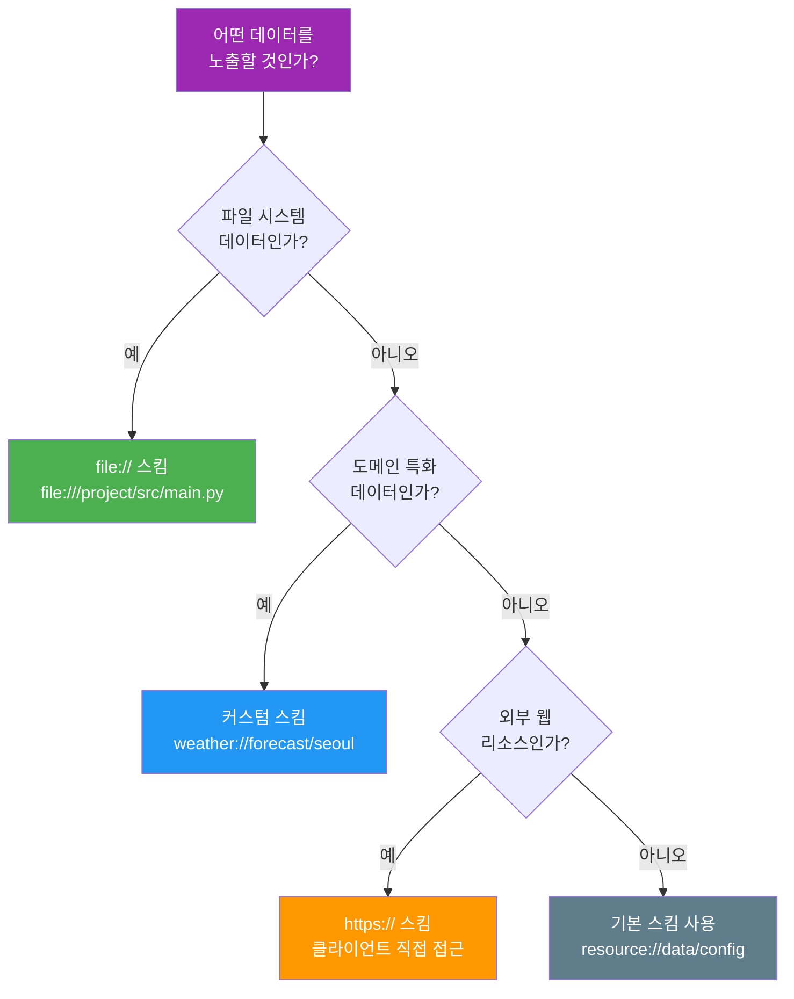
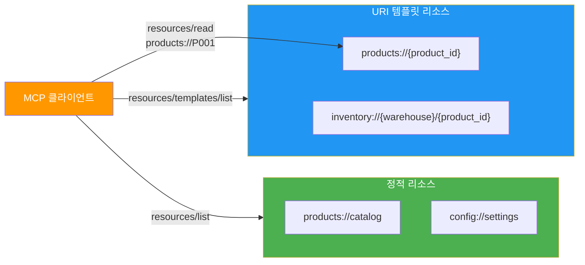
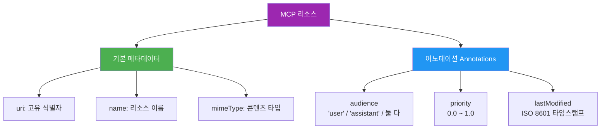
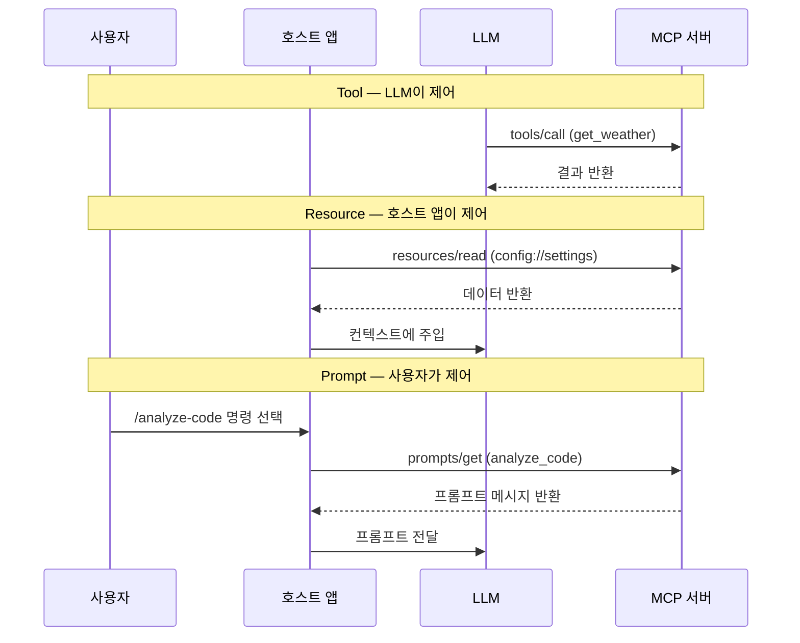
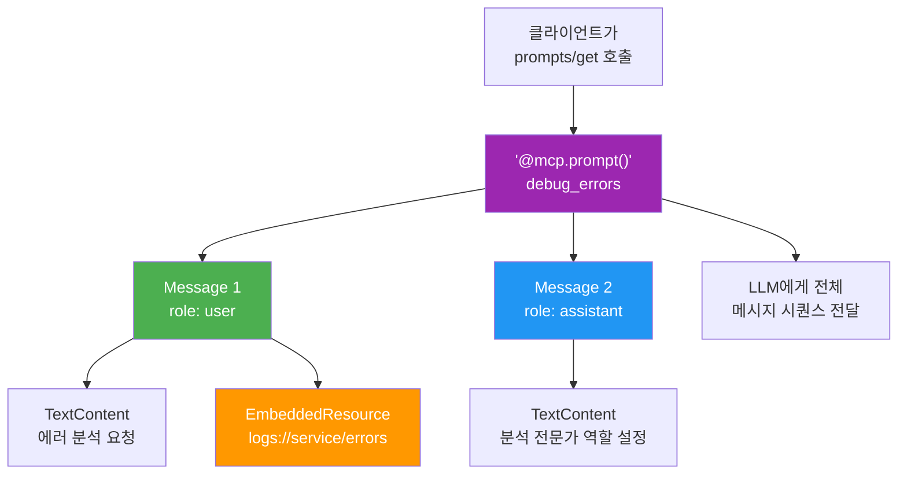

# 03. 리소스와 프롬프트 설계

> MCP 리소스의 URI 체계·템플릿 설계와 프롬프트 노출 패턴을 익혀, AI 에이전트에게 풍부한 컨텍스트를 제공하는 서버를 설계합니다.

## 개요

이 섹션에서는 MCP의 세 가지 프리미티브 중 **리소스(Resources)**와 **프롬프트(Prompts)**를 깊이 파고듭니다. [이전 섹션](09-ch9-mcp-서버-구축/02-02-fastmcp-서버-기초.md)에서 `@mcp.resource()`와 `@mcp.prompt()`의 기초를 맛봤다면, 이번에는 실전에서 마주치는 설계 판단을 다룹니다 — URI 체계를 어떻게 잡을지, 동적으로 변하는 리소스를 어떻게 노출할지, 멀티 메시지 프롬프트로 Few-shot 패턴을 어떻게 구성할지요.

**선수 지식**: [MCP 프로토콜 이해](09-ch9-mcp-서버-구축/01-01-mcp-프로토콜-이해.md)의 Host/Client/Server 아키텍처, [FastMCP 서버 기초](09-ch9-mcp-서버-구축/02-02-fastmcp-서버-기초.md)의 `@mcp.resource()`, `@mcp.prompt()` 기본 사용법
**학습 목표**:
- MCP 리소스의 URI 체계를 설계하고 커스텀 스킴을 활용할 수 있다
- URI 템플릿으로 파라미터화된 리소스를 구현할 수 있다
- `@mcp.prompt()`로 멀티 메시지 프롬프트와 리소스 임베딩 프롬프트를 만들 수 있다
- 리소스·프롬프트·도구를 조합하여 실전 MCP 서버를 설계할 수 있다

## 왜 알아야 할까?

도구(Tool)만으로 MCP 서버를 만들 수 있긴 합니다. 그런데 실전에서는 금방 벽에 부딪히거든요. LLM에게 "현재 시스템 설정을 분석해줘"라고 요청하면, LLM은 먼저 설정 데이터를 가져와야 하고, 그 데이터에 맞는 분석을 수행해야 합니다. 도구만으로 이걸 하면? LLM이 매번 "설정 가져오기 도구"를 호출한 다음 "분석 도구"를 호출하는 2단계를 거쳐야 합니다.

리소스를 쓰면 더 효율적입니다. 호스트 앱이 `config://app/settings` 리소스를 LLM 컨텍스트에 **미리 주입**하면, LLM은 별도 도구 호출 없이 바로 분석에 들어갈 수 있죠. 프롬프트는 여기서 한 발 더 나아갑니다 — 사용자가 "코드 리뷰해줘" 슬래시 명령을 실행하면, 프롬프트가 리소스를 임베드하고 분석 지침까지 포함한 완전한 요청을 LLM에게 전달합니다.

**리소스는 정보의 배달**, **프롬프트는 작업의 레시피**입니다. 이 둘을 잘 설계하면 도구 호출 횟수를 줄이고, LLM의 응답 품질을 높이며, 사용자 경험을 크게 개선할 수 있습니다.

## 핵심 개념

### 개념 1: 리소스 URI 체계 — 데이터의 주소 체계

> 💡 **비유**: 도서관에서 책을 찾으려면 "분류 번호 체계"가 필요하죠. 813.6(미국 소설)이면 바로 해당 서가로 갈 수 있지만, "어딘가에 있는 소설"이면 도서관 전체를 뒤져야 합니다. MCP 리소스의 URI 체계는 데이터의 "분류 번호 체계"입니다 — 잘 설계하면 AI가 원하는 데이터를 즉시 찾아갈 수 있고, 어설프게 설계하면 혼란만 가중됩니다.

MCP 리소스는 **URI(Uniform Resource Identifier)**로 식별됩니다. RFC 3986을 따르기 때문에 여러분이 이미 아는 URL과 구조가 같습니다:

```
scheme://authority/path?query#fragment
```

MCP에서는 **커스텀 스킴(scheme)**을 자유롭게 만들 수 있다는 점이 핵심입니다. 몇 가지 패턴을 살펴볼까요?

> 📊 **그림 1**: MCP 리소스 URI 스킴의 선택 기준



| 스킴 | 용도 | 예시 |
|------|------|------|
| `file://` | 파일 시스템 리소스 | `file:///project/README.md` |
| `https://` | 클라이언트가 직접 접근 가능한 웹 리소스 | `https://api.example.com/status` |
| 커스텀 스킴 | 도메인 특화 데이터 | `weather://forecast/seoul`, `db://users/123` |

커스텀 스킴은 실전에서 가장 많이 쓰입니다. 도메인 용어로 스킴을 만들면 LLM과 사용자 모두 직관적으로 이해할 수 있거든요:

```python
from mcp.server.fastmcp import FastMCP

mcp = FastMCP("ecommerce-server")

# 도메인 스킴: 제품 카탈로그
@mcp.resource("products://catalog", mime_type="application/json")
def product_catalog() -> str:
    """전체 제품 카탈로그를 반환합니다."""
    return json.dumps(get_all_products(), ensure_ascii=False)

# 도메인 스킴: 주문 상태
@mcp.resource("orders://recent", mime_type="application/json")
def recent_orders() -> str:
    """최근 24시간 주문 목록을 반환합니다."""
    return json.dumps(get_recent_orders(), ensure_ascii=False)

# 설정/메타데이터 스킴
@mcp.resource("config://shipping-rules", mime_type="application/json")
def shipping_rules() -> str:
    """배송 규칙 설정을 반환합니다."""
    return json.dumps(load_shipping_config(), ensure_ascii=False)
```

URI 설계 시 지켜야 할 원칙이 있습니다:

| 원칙 | 좋은 예 | 나쁜 예 |
|------|---------|---------|
| 일관된 스킴 사용 | `products://`, `orders://` | `prod://`, `order-data://` |
| 계층적 경로 | `products://electronics/phones` | `products://phone-electronics` |
| 의미 있는 이름 | `config://database/connection` | `config://item42` |
| 소문자·하이픈 | `api://health-check` | `API://HealthCheck` |

### 개념 2: URI 템플릿 — 파라미터화된 리소스

> 💡 **비유**: 호텔 프론트 데스크를 생각해보세요. "501호 키 주세요"라고 하면 501호 키를, "302호 키 주세요"라고 하면 302호 키를 줍니다. 방 번호가 바뀌어도 같은 프론트 데스크에서 처리하죠. URI 템플릿은 이 프론트 데스크처럼, `{room_number}` 자리에 어떤 값이 들어오든 같은 함수가 응답합니다.

URI 템플릿은 `{param}` 문법으로 경로의 일부를 변수화합니다. RFC 6570 표준을 따르죠:

```python
import json
from mcp.server.fastmcp import FastMCP

mcp = FastMCP("inventory-server")

# ── 단일 파라미터 ──
@mcp.resource("products://{product_id}", mime_type="application/json")
def get_product(product_id: str) -> str:
    """특정 제품의 상세 정보를 반환합니다."""
    product = find_product(product_id)
    return json.dumps(product, ensure_ascii=False)

# ── 복수 파라미터 ──
@mcp.resource("inventory://{warehouse}/{product_id}", mime_type="application/json")
def get_inventory(warehouse: str, product_id: str) -> str:
    """특정 창고의 제품 재고를 반환합니다."""
    stock = check_stock(warehouse, product_id)
    return json.dumps(stock, ensure_ascii=False)
```

> 📊 **그림 2**: URI 템플릿과 정적 리소스의 관계



정적 리소스와 템플릿 리소스는 **발견 방식이 다릅니다**. 클라이언트가 `resources/list`를 호출하면 정적 리소스만, `resources/templates/list`를 호출하면 템플릿 리소스만 반환됩니다. 그래서 정적 리소스에서 "사용 가능한 ID 목록"을 제공하고, 템플릿 리소스에서 "개별 상세"를 제공하는 조합이 일반적입니다:

```python
# 목록 조회 — 정적 리소스
@mcp.resource("projects://list", mime_type="application/json")
def list_projects() -> str:
    """모든 프로젝트의 ID와 이름 목록을 반환합니다."""
    projects = [
        {"id": "proj-001", "name": "웹 리디자인"},
        {"id": "proj-002", "name": "모바일 앱 v2"},
        {"id": "proj-003", "name": "API 마이그레이션"},
    ]
    return json.dumps(projects, ensure_ascii=False)

# 상세 조회 — 템플릿 리소스
@mcp.resource("projects://{project_id}", mime_type="application/json")
def get_project(project_id: str) -> str:
    """특정 프로젝트의 상세 정보를 반환합니다."""
    return json.dumps(load_project(project_id), ensure_ascii=False)

# 중첩 리소스 — 프로젝트 내 태스크
@mcp.resource("projects://{project_id}/tasks", mime_type="application/json")
def get_tasks(project_id: str) -> str:
    """프로젝트의 태스크 목록을 반환합니다."""
    return json.dumps(load_tasks(project_id), ensure_ascii=False)
```

이 패턴은 REST API의 설계 철학과 유사합니다. `GET /projects` → `GET /projects/{id}` → `GET /projects/{id}/tasks`처럼 계층적으로 설계하면, LLM도 사용자도 구조를 쉽게 파악할 수 있죠.

### 개념 3: 리소스의 콘텐츠 타입과 어노테이션

> 💡 **비유**: 택배 박스에 "취급주의", "냉동보관" 같은 라벨이 붙어 있으면 배송 기사가 어떻게 다뤄야 하는지 즉시 알 수 있죠. MCP 리소스의 어노테이션(annotations)은 이 라벨과 같습니다 — "이 데이터는 사용자용입니다", "이 리소스는 중요도가 높습니다"라고 클라이언트에게 힌트를 주는 거예요.

리소스는 **텍스트**(`str`) 또는 **바이너리**(`bytes`) 콘텐츠를 반환할 수 있습니다. `mime_type`으로 콘텐츠 형식을 명시하죠:

```python
# 텍스트 리소스 — JSON
@mcp.resource("data://metrics", mime_type="application/json")
def get_metrics() -> str:
    return json.dumps({"cpu": 72.5, "memory": 68.3})

# 텍스트 리소스 — 마크다운
@mcp.resource("docs://api-guide", mime_type="text/markdown")
def get_api_guide() -> str:
    return "# API 가이드\n\n## 인증\nBearer 토큰을 사용합니다..."

# 바이너리 리소스 — 이미지
@mcp.resource("charts://sales-trend", mime_type="image/png")
def get_sales_chart() -> bytes:
    return generate_chart_png()
```

> 📊 **그림 3**: 리소스 어노테이션의 구조



MCP 2025-11-25 스펙에서 어노테이션은 클라이언트에게 리소스 처리 방법을 안내합니다:

| 어노테이션 | 타입 | 용도 |
|-----------|------|------|
| `audience` | `list[str]` | `["user"]`, `["assistant"]`, 또는 둘 다. 누구를 위한 데이터인지 |
| `priority` | `float` | 0.0(낮음) ~ 1.0(높음). 컨텍스트 윈도우 부족 시 우선순위 |
| `lastModified` | `str` | ISO 8601 형식. 캐싱 판단에 사용 |

```python
# 공식 SDK에서는 리소스 데코레이터에서 직접 어노테이션 설정이 제한적이므로
# 독립 FastMCP(fastmcp) 패키지의 문법을 참고합니다

# 공식 SDK 방식: 기본 리소스 정의
@mcp.resource("logs://errors", mime_type="application/json")
def get_error_logs() -> str:
    """최근 에러 로그를 반환합니다. (AI 어시스턴트 분석용)"""
    return json.dumps(fetch_recent_errors(), ensure_ascii=False)
```

어노테이션의 `audience` 필드가 특히 유용합니다. `["assistant"]`로 표시하면 "이 데이터는 LLM이 분석할 용도"라는 뜻이고, `["user"]`로 표시하면 "이 데이터는 사용자에게 직접 보여줄 용도"라는 뜻이거든요. 클라이언트는 이 힌트를 보고 데이터를 어디에 배치할지 결정합니다.

### 개념 4: 프롬프트 — 사용자가 선택하는 작업 레시피

> 💡 **비유**: 카페의 메뉴판을 떠올려보세요. "아메리카노", "카페라떼", "바닐라 프라푸치노" 같은 메뉴는 고객이 **선택**합니다. 바리스타(LLM)가 임의로 음료를 정하지 않죠. MCP 프롬프트는 이 메뉴판입니다 — 사용자가 슬래시 명령이나 UI 버튼으로 "이 작업을 해줘"라고 명시적으로 선택하는 거예요.

프롬프트의 핵심은 **제어 주체가 사용자**라는 점입니다. 도구는 LLM이 호출을 결정하고, 리소스는 앱이 포함을 결정하지만, 프롬프트는 사용자가 직접 선택합니다:

> 📊 **그림 4**: MCP 프리미티브의 제어 주체 비교



기본적인 프롬프트는 문자열을 반환하면 됩니다:

```python
from mcp.server.fastmcp import FastMCP

mcp = FastMCP("code-assistant")

@mcp.prompt()
def review_code(language: str, code_snippet: str) -> str:
    """코드 리뷰를 요청하는 프롬프트를 생성합니다."""
    return (
        f"다음 {language} 코드를 리뷰해주세요.\n\n"
        f"```{language}\n{code_snippet}\n```\n\n"
        f"보안 취약점, 성능 이슈, 코드 스타일을 중심으로 분석하고, "
        f"개선 사항을 구체적인 코드 예시와 함께 제안해주세요."
    )
```

하지만 실전에서 진짜 강력한 건 **멀티 메시지 프롬프트**입니다.

### 개념 5: 멀티 메시지 프롬프트와 리소스 임베딩

> 💡 **비유**: 영화 감독이 배우에게 대본을 줄 때, 단순히 대사만 주지 않죠. "이 장면의 배경", "상대 배우의 감정", "이전 장면에서의 맥락"까지 함께 전달합니다. 멀티 메시지 프롬프트도 마찬가지예요 — 사용자 요청뿐 아니라, 시스템 지침·예시 대화·참고 데이터를 함께 묶어서 LLM에게 완전한 "대본"을 전달합니다.

멀티 메시지 프롬프트를 만들려면 `PromptMessage`를 리스트로 반환합니다:

```python
from mcp.server.fastmcp import FastMCP
from mcp.server.fastmcp.prompts import base as prompt_base

mcp = FastMCP("data-analyst")

@mcp.prompt()
def analyze_dataset(dataset_name: str, analysis_type: str = "summary") -> list[prompt_base.Message]:
    """데이터셋 분석 프롬프트를 생성합니다.

    Args:
        dataset_name: 분석할 데이터셋 이름
        analysis_type: 분석 유형 (summary, trend, anomaly)
    """
    return [
        # 시스템 역할 설정 (assistant 메시지로)
        prompt_base.AssistantMessage(
            "저는 데이터 분석 전문가입니다. 데이터셋을 꼼꼼히 분석하고 "
            "시각화 제안까지 포함한 리포트를 작성하겠습니다."
        ),
        # 사용자 요청 메시지
        prompt_base.UserMessage(
            f"'{dataset_name}' 데이터셋에 대해 {analysis_type} 분석을 수행해주세요.\n\n"
            f"분석 시 다음 사항을 포함해주세요:\n"
            f"1. 데이터 구조와 기본 통계\n"
            f"2. 주요 패턴과 인사이트\n"
            f"3. 시각화 추천 (차트 유형과 이유)\n"
            f"4. 추가 분석 제안"
        ),
    ]
```

프롬프트의 진짜 힘은 **리소스를 임베딩**할 때 발휘됩니다. 프롬프트 메시지 안에 리소스 데이터를 포함하면, 사용자가 프롬프트 하나만 선택해도 필요한 컨텍스트가 자동으로 딸려옵니다:

```python
from mcp.types import TextContent, EmbeddedResource, TextResourceContents

@mcp.prompt()
def debug_errors(service_name: str) -> list[prompt_base.Message]:
    """서비스 에러를 디버깅하는 프롬프트입니다."""
    return [
        prompt_base.UserMessage(
            content=[
                TextContent(
                    type="text",
                    text=f"'{service_name}' 서비스에서 에러가 발생했습니다. "
                         f"아래 로그를 분석하고 원인과 해결 방법을 알려주세요."
                ),
                # 리소스를 프롬프트에 임베딩
                EmbeddedResource(
                    type="resource",
                    resource=TextResourceContents(
                        uri=f"logs://{service_name}/errors",
                        mimeType="application/json",
                        text='[{"level": "ERROR", "msg": "DB connection timeout"}]',
                    ),
                ),
            ]
        ),
    ]
```

> 📊 **그림 5**: 멀티 메시지 프롬프트의 구조



이 패턴이 왜 강력한지 정리하면:

| 패턴 | 단일 메시지 | 멀티 메시지 + 리소스 임베딩 |
|------|-----------|-------------------------|
| 컨텍스트 | 텍스트만 전달 | 데이터 + 지침 + 예시 통합 |
| Few-shot | 불가 | assistant 메시지로 예시 대화 구성 |
| 데이터 참조 | 사용자가 수동 복사 | 리소스 자동 주입 |
| 재사용성 | 낮음 | 높음 — 파라미터만 바꿔서 재활용 |

## 실습: 직접 해보기

프로젝트 관리 MCP 서버를 만들어보겠습니다. 리소스로 프로젝트 데이터를 제공하고, 프롬프트로 분석·리포트 작업을 정의하고, 도구로 데이터 변경을 처리합니다.

```python
"""프로젝트 관리 MCP 서버 — project_server.py"""
import json
from datetime import datetime
from mcp.server.fastmcp import FastMCP, Context
from mcp.server.fastmcp.prompts import base as prompt_base
from mcp.types import TextContent, EmbeddedResource, TextResourceContents

# ── 서버 인스턴스 ──
mcp = FastMCP(
    "project-manager",
    instructions=(
        "프로젝트 목록은 projects://list 리소스를, "
        "개별 프로젝트 상세는 projects://{id} 리소스를 사용하세요. "
        "프로젝트 상태 변경은 update_status 도구를 사용하세요."
    ),
)

# ── 샘플 데이터 ──
PROJECTS: dict[str, dict] = {
    "proj-001": {
        "name": "웹 리디자인",
        "status": "in-progress",
        "priority": "high",
        "owner": "김민수",
        "tasks": [
            {"title": "와이어프레임 설계", "done": True},
            {"title": "UI 컴포넌트 개발", "done": False},
            {"title": "반응형 테스트", "done": False},
        ],
        "deadline": "2026-04-15",
    },
    "proj-002": {
        "name": "API 마이그레이션",
        "status": "planning",
        "priority": "critical",
        "owner": "이지은",
        "tasks": [
            {"title": "엔드포인트 매핑", "done": True},
            {"title": "인증 모듈 전환", "done": True},
            {"title": "부하 테스트", "done": False},
            {"title": "무중단 전환", "done": False},
        ],
        "deadline": "2026-03-31",
    },
    "proj-003": {
        "name": "모바일 앱 v2",
        "status": "in-progress",
        "priority": "medium",
        "owner": "박준영",
        "tasks": [
            {"title": "SwiftUI 마이그레이션", "done": True},
            {"title": "오프라인 모드 구현", "done": False},
        ],
        "deadline": "2026-05-20",
    },
}


# ══════════════════════════════════════
# 리소스 — 읽기 전용 데이터 제공
# ══════════════════════════════════════

@mcp.resource("projects://list", mime_type="application/json")
def list_projects() -> str:
    """등록된 전체 프로젝트 요약 목록을 반환합니다."""
    summary = [
        {
            "id": pid,
            "name": p["name"],
            "status": p["status"],
            "priority": p["priority"],
            "owner": p["owner"],
        }
        for pid, p in PROJECTS.items()
    ]
    return json.dumps(summary, ensure_ascii=False, indent=2)


@mcp.resource("projects://{project_id}", mime_type="application/json")
def get_project(project_id: str) -> str:
    """특정 프로젝트의 전체 상세 정보를 반환합니다."""
    project = PROJECTS.get(project_id)
    if not project:
        return json.dumps(
            {"error": f"프로젝트 '{project_id}'을(를) 찾을 수 없습니다"},
            ensure_ascii=False,
        )
    return json.dumps(
        {"id": project_id, **project}, ensure_ascii=False, indent=2
    )


@mcp.resource("projects://{project_id}/tasks", mime_type="application/json")
def get_project_tasks(project_id: str) -> str:
    """프로젝트의 태스크 목록과 진행률을 반환합니다."""
    project = PROJECTS.get(project_id)
    if not project:
        return json.dumps({"error": "프로젝트를 찾을 수 없습니다"})
    tasks = project["tasks"]
    done_count = sum(1 for t in tasks if t["done"])
    return json.dumps(
        {
            "project": project["name"],
            "total": len(tasks),
            "completed": done_count,
            "progress_pct": round(done_count / len(tasks) * 100, 1),
            "tasks": tasks,
        },
        ensure_ascii=False,
        indent=2,
    )


@mcp.resource("dashboard://summary", mime_type="application/json")
def dashboard_summary() -> str:
    """전체 프로젝트 대시보드 요약을 반환합니다."""
    total = len(PROJECTS)
    by_status: dict[str, int] = {}
    overdue = 0
    today = datetime.now().strftime("%Y-%m-%d")

    for p in PROJECTS.values():
        by_status[p["status"]] = by_status.get(p["status"], 0) + 1
        if p["deadline"] < today and p["status"] != "completed":
            overdue += 1

    return json.dumps(
        {
            "total_projects": total,
            "by_status": by_status,
            "overdue": overdue,
            "generated_at": datetime.now().isoformat(),
        },
        ensure_ascii=False,
        indent=2,
    )


# ══════════════════════════════════════
# 프롬프트 — 사용자가 선택하는 작업 템플릿
# ══════════════════════════════════════

@mcp.prompt()
def weekly_report() -> list[prompt_base.Message]:
    """주간 프로젝트 리포트를 생성하는 프롬프트입니다."""
    # 대시보드 데이터를 임베딩
    dashboard = dashboard_summary()
    return [
        prompt_base.AssistantMessage(
            "저는 프로젝트 관리 전문가입니다. "
            "데이터를 기반으로 정확하고 실행 가능한 리포트를 작성합니다."
        ),
        prompt_base.UserMessage(
            content=[
                TextContent(
                    type="text",
                    text=(
                        "아래 대시보드 데이터를 바탕으로 주간 프로젝트 리포트를 작성해주세요.\n\n"
                        "포함 사항:\n"
                        "1. 전체 진행 현황 요약\n"
                        "2. 위험 프로젝트 (마감 임박 또는 지연)\n"
                        "3. 다음 주 핵심 액션 아이템\n"
                        "4. 리소스 재배치 제안"
                    ),
                ),
                EmbeddedResource(
                    type="resource",
                    resource=TextResourceContents(
                        uri="dashboard://summary",
                        mimeType="application/json",
                        text=dashboard,
                    ),
                ),
            ]
        ),
    ]


@mcp.prompt()
def risk_assessment(project_id: str) -> list[prompt_base.Message]:
    """프로젝트 리스크를 평가하는 프롬프트입니다.

    Args:
        project_id: 평가할 프로젝트 ID (예: proj-001)
    """
    project_data = get_project(project_id)
    tasks_data = get_project_tasks(project_id)
    return [
        prompt_base.UserMessage(
            content=[
                TextContent(
                    type="text",
                    text=(
                        f"프로젝트 '{project_id}'의 리스크를 평가해주세요.\n\n"
                        "다음 관점에서 분석해주세요:\n"
                        "1. 일정 리스크: 마감까지 남은 태스크 대비 시간\n"
                        "2. 기술 리스크: 미완료 태스크의 복잡도\n"
                        "3. 리소스 리스크: 담당자 과부하 여부\n\n"
                        "각 리스크에 HIGH/MEDIUM/LOW 등급을 매기고, "
                        "완화 방안을 제안해주세요."
                    ),
                ),
                EmbeddedResource(
                    type="resource",
                    resource=TextResourceContents(
                        uri=f"projects://{project_id}",
                        mimeType="application/json",
                        text=project_data,
                    ),
                ),
                EmbeddedResource(
                    type="resource",
                    resource=TextResourceContents(
                        uri=f"projects://{project_id}/tasks",
                        mimeType="application/json",
                        text=tasks_data,
                    ),
                ),
            ]
        ),
    ]


# ══════════════════════════════════════
# 도구 — LLM이 호출하는 액션
# ══════════════════════════════════════

@mcp.tool()
async def update_status(
    project_id: str, new_status: str, ctx: Context
) -> str:
    """프로젝트 상태를 변경합니다.

    Args:
        project_id: 프로젝트 ID (예: proj-001)
        new_status: 새 상태 (planning, in-progress, review, completed)
    """
    valid_statuses = {"planning", "in-progress", "review", "completed"}
    if new_status not in valid_statuses:
        return f"오류: 유효하지 않은 상태입니다. 가능한 값: {valid_statuses}"

    project = PROJECTS.get(project_id)
    if not project:
        return f"오류: 프로젝트 '{project_id}'을(를) 찾을 수 없습니다."

    old_status = project["status"]
    project["status"] = new_status
    await ctx.info(f"상태 변경: {old_status} → {new_status}")
    return (
        f"'{project['name']}' 상태가 '{old_status}'에서 "
        f"'{new_status}'로 변경되었습니다."
    )


@mcp.tool()
def complete_task(project_id: str, task_index: int) -> str:
    """프로젝트의 특정 태스크를 완료 처리합니다.

    Args:
        project_id: 프로젝트 ID (예: proj-001)
        task_index: 태스크 번호 (0부터 시작)
    """
    project = PROJECTS.get(project_id)
    if not project:
        return f"오류: 프로젝트 '{project_id}'을(를) 찾을 수 없습니다."

    tasks = project["tasks"]
    if task_index < 0 or task_index >= len(tasks):
        return f"오류: 태스크 번호 {task_index}이(가) 범위를 벗어났습니다."

    task = tasks[task_index]
    if task["done"]:
        return f"'{task['title']}'은(는) 이미 완료된 태스크입니다."

    task["done"] = True
    done_count = sum(1 for t in tasks if t["done"])
    return (
        f"'{task['title']}' 태스크를 완료했습니다. "
        f"진행률: {done_count}/{len(tasks)} "
        f"({done_count / len(tasks) * 100:.0f}%)"
    )


# ── 서버 실행 ──
if __name__ == "__main__":
    mcp.run()
```

서버의 핵심 로직을 확인해보겠습니다:

```run:python
import json
from datetime import datetime

# 샘플 데이터
PROJECTS = {
    "proj-001": {
        "name": "웹 리디자인", "status": "in-progress",
        "priority": "high", "owner": "김민수",
        "tasks": [
            {"title": "와이어프레임 설계", "done": True},
            {"title": "UI 컴포넌트 개발", "done": False},
            {"title": "반응형 테스트", "done": False},
        ],
        "deadline": "2026-04-15",
    },
    "proj-002": {
        "name": "API 마이그레이션", "status": "planning",
        "priority": "critical", "owner": "이지은",
        "tasks": [
            {"title": "엔드포인트 매핑", "done": True},
            {"title": "인증 모듈 전환", "done": True},
            {"title": "부하 테스트", "done": False},
            {"title": "무중단 전환", "done": False},
        ],
        "deadline": "2026-03-31",
    },
}

# 리소스: 프로젝트 목록
summary = [
    {"id": pid, "name": p["name"], "status": p["status"]}
    for pid, p in PROJECTS.items()
]
print("=== projects://list ===")
print(json.dumps(summary, ensure_ascii=False, indent=2))

# 리소스: 태스크 진행률
tasks = PROJECTS["proj-002"]["tasks"]
done = sum(1 for t in tasks if t["done"])
print(f"\n=== projects://proj-002/tasks ===")
print(f"진행률: {done}/{len(tasks)} ({done/len(tasks)*100:.0f}%)")
for i, t in enumerate(tasks):
    mark = "V" if t["done"] else " "
    print(f"  [{mark}] {i}. {t['title']}")
```

```output
=== projects://list ===
[
  {
    "id": "proj-001",
    "name": "웹 리디자인",
    "status": "in-progress"
  },
  {
    "id": "proj-002",
    "name": "API 마이그레이션",
    "status": "planning"
  }
]

=== projects://proj-002/tasks ===
진행률: 2/4 (50%)
  [V] 0. 엔드포인트 매핑
  [V] 1. 인증 모듈 전환
  [ ] 2. 부하 테스트
  [ ] 3. 무중단 전환
```

이 서버를 MCP Inspector로 테스트합니다:

```bash
# 대화형 테스트
fastmcp dev project_server.py
```

Inspector에서 확인할 포인트:
1. **Resources 탭**: `projects://list`, `dashboard://summary` 정적 리소스가 보임
2. **Resource Templates 탭**: `projects://{project_id}`, `projects://{project_id}/tasks` 템플릿이 보임
3. **Prompts 탭**: `weekly_report`, `risk_assessment` 프롬프트가 보임
4. **Tools 탭**: `update_status`, `complete_task` 도구가 보임

## 더 깊이 알아보기

### URI의 탄생과 MCP의 선택

URI(Uniform Resource Identifier)라는 개념은 1994년, 팀 버너스리(Tim Berners-Lee)가 RFC 1630에서 처음 제안했습니다. 당시에는 웹 페이지의 주소(URL)로만 쓰였죠. 그런데 버너스리는 더 큰 그림을 그리고 있었습니다 — 세상의 모든 자원(resource)을 하나의 식별 체계로 가리킬 수 있다면 어떨까?

2005년에 RFC 3986으로 정리된 URI 표준은 `scheme://authority/path?query#fragment`라는 범용 구조를 확립했습니다. 이 구조가 30년이 지난 지금, AI 에이전트의 데이터 접근 체계로 다시 부활한 거예요.

Anthropic이 MCP 리소스에 URI를 채택한 이유는 명확합니다. 개발자들이 이미 익숙한 체계이고, 커스텀 스킴(`weather://`, `db://`)으로 확장할 수 있으며, RFC 6570 URI 템플릿까지 자연스럽게 연결되거든요. 웹이 URL로 세상의 문서를 연결했듯, MCP는 URI로 AI가 접근할 수 있는 모든 데이터를 연결하려는 것이죠.

> 💡 **알고 계셨나요?**: MCP 스펙 2025-11-25 버전에서는 원래 있던 `Sampling` 기능(서버가 클라이언트에게 LLM 호출을 요청하는 기능)이 **Elicitation**으로 대체되었습니다. Elicitation은 서버가 사용자에게 직접 정보를 요청할 수 있는 기능인데, 프롬프트와 함께 사용하면 더 인터랙티브한 워크플로우를 만들 수 있습니다.

### 프롬프트가 슬래시 명령이 된 이유

MCP 프롬프트가 "사용자 제어"로 설계된 배경에는 Claude Desktop의 UX 실험이 있습니다. 초기에 Anthropic 내부에서는 프롬프트도 LLM이 자동으로 선택하게 하자는 의견이 있었는데, 테스트 결과 사용자가 의도하지 않은 프롬프트가 실행되는 문제가 빈번했습니다. 

결국 "프롬프트 = 슬래시 명령"이라는 모델이 채택되었고, 이는 Discord, Slack, IDE의 명령 팔레트와 동일한 UX 패턴입니다. 사용자가 `/` 를 입력하면 사용 가능한 프롬프트 목록이 나타나고, 원하는 것을 선택하는 방식이죠.

## 흔한 오해와 팁

> ⚠️ **흔한 오해**: "리소스는 단순 데이터 제공이니까 도구보다 덜 중요하다?" — 오히려 반대입니다. 잘 설계된 리소스는 LLM의 도구 호출 횟수를 줄여줍니다. 설정 데이터를 리소스로 미리 주입하면, LLM이 "설정 가져오기" 도구를 호출할 필요가 없어지거든요. 도구 호출 한 번이 줄 때마다 지연 시간과 토큰 비용이 절감됩니다.

> 🔥 **실무 팁**: URI 스킴 네이밍은 팀 전체가 합의해야 합니다. `products://`인지 `product://`인지, `config://db/connection`인지 `config://database-connection`인지 — 초기에 명확한 컨벤션을 정하지 않으면, 서버가 많아질수록 혼란이 기하급수적으로 커집니다. REST API 설계의 교훈과 동일합니다.

> 🔥 **실무 팁**: 프롬프트에 리소스를 임베딩할 때, 리소스 데이터가 너무 크면 LLM의 컨텍스트 윈도우를 초과할 수 있습니다. 프롬프트 함수 안에서 데이터를 요약하거나 필터링한 뒤 임베딩하세요. 전체 로그 5000줄을 그대로 넣는 것보다, 최근 에러 로그 20줄만 선별해서 넣는 것이 훨씬 효과적입니다.

> 💡 **알고 계셨나요?**: MCP 리소스의 `resources/subscribe` 기능을 사용하면, 클라이언트가 특정 리소스의 변경을 실시간으로 감지할 수 있습니다. 서버가 `notifications/resources/updated`를 보내면 클라이언트가 자동으로 최신 데이터를 다시 읽는 구조예요. 아직 FastMCP 공식 SDK에서 고수준 API를 제공하지는 않지만, 프로토콜 수준에서는 이미 지원됩니다.

## 핵심 정리

| 개념 | 설명 |
|------|------|
| 커스텀 URI 스킴 | `products://`, `config://` 등 도메인 특화 스킴으로 리소스 식별 |
| URI 템플릿 | `products://{id}` 형식으로 파라미터화된 리소스 정의. RFC 6570 표준 |
| 정적 vs 템플릿 리소스 | `resources/list`(정적) vs `resources/templates/list`(템플릿)로 분리 발견 |
| `mime_type` | `application/json`, `text/markdown` 등 콘텐츠 타입 명시 |
| 어노테이션 | `audience`, `priority`, `lastModified`로 리소스 처리 힌트 제공 |
| 멀티 메시지 프롬프트 | `list[Message]` 반환으로 시스템 설정 + 사용자 요청 + 예시 대화 구성 |
| 리소스 임베딩 | `EmbeddedResource`로 프롬프트 안에 리소스 데이터 자동 주입 |
| 목록 + 상세 패턴 | 정적 리소스(목록) + 템플릿 리소스(상세)의 조합 설계 |

## 다음 섹션 미리보기

리소스와 프롬프트를 설계하는 방법을 익혔으니, [다음 섹션](09-ch9-mcp-서버-구축/04-04-트랜스포트-설정.md)에서는 **트랜스포트 설정**을 다룹니다. stdio와 Streamable HTTP 트랜스포트의 구체적인 설정 방법, 인증·보안 고려사항, 그리고 로컬 개발에서 원격 배포까지의 트랜스포트 전환 전략을 배우게 됩니다. MCP 서버를 "어디서, 어떻게" 실행할지를 결정하는 핵심 섹션이죠.

## 참고 자료

- [MCP Specification: Resources (2025-11-25)](https://modelcontextprotocol.io/specification/2025-11-25/server/resources) - 리소스 URI 체계, 템플릿, 구독, 어노테이션의 공식 스펙. 이 섹션의 모든 URI 설계 원칙의 근거
- [MCP Specification: Prompts (2025-11-25)](https://modelcontextprotocol.io/specification/2025-11-25/server/prompts) - 프롬프트 프리미티브의 공식 스펙. 멀티 메시지 구조, 리소스 임베딩, 인자 정의 규격
- [MCP Build Server Guide](https://modelcontextprotocol.io/docs/develop/build-server) - 공식 서버 구축 튜토리얼. FastMCP로 리소스·프롬프트를 구현하는 실습 예제 포함
- [MCP Python SDK GitHub](https://github.com/modelcontextprotocol/python-sdk) - 공식 MCP Python SDK 소스. `mcp.server.fastmcp` 모듈의 리소스·프롬프트 데코레이터 구현 확인
- [FastMCP Resources Documentation](https://gofastmcp.com/servers/resources) - 독립 FastMCP 패키지의 리소스 상세 문서. URI 템플릿 고급 문법, 와일드카드 파라미터, 동적 리소스 목록 패턴
- [MCP Server Concepts](https://modelcontextprotocol.io/docs/learn/server-concepts) - Tools vs Resources vs Prompts의 제어 주체 차이와 설계 가이드라인

---
### 🔗 Related Sessions
- [mcp](09-ch9-mcp-서버-구축/01-01-mcp-프로토콜-이해.md) (prerequisite)
- [tools 프리미티브](09-ch9-mcp-서버-구축/01-01-mcp-프로토콜-이해.md) (prerequisite)
- [resources 프리미티브](09-ch9-mcp-서버-구축/01-01-mcp-프로토콜-이해.md) (prerequisite)
- [prompts 프리미티브](09-ch9-mcp-서버-구축/01-01-mcp-프로토콜-이해.md) (prerequisite)
- [fastmcp 인스턴스](09-ch9-mcp-서버-구축/02-02-fastmcp-서버-기초.md) (prerequisite)
- [@mcp.tool() 데코레이터](09-ch9-mcp-서버-구축/02-02-fastmcp-서버-기초.md) (prerequisite)
- [@mcp.resource() 데코레이터](09-ch9-mcp-서버-구축/02-02-fastmcp-서버-기초.md) (prerequisite)
- [@mcp.prompt() 데코레이터](09-ch9-mcp-서버-구축/02-02-fastmcp-서버-기초.md) (prerequisite)
- [context 객체](09-ch9-mcp-서버-구축/02-02-fastmcp-서버-기초.md) (prerequisite)
