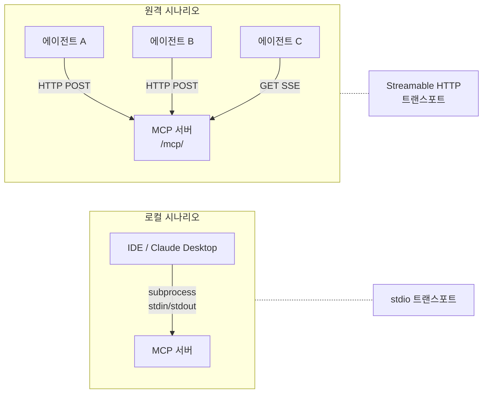
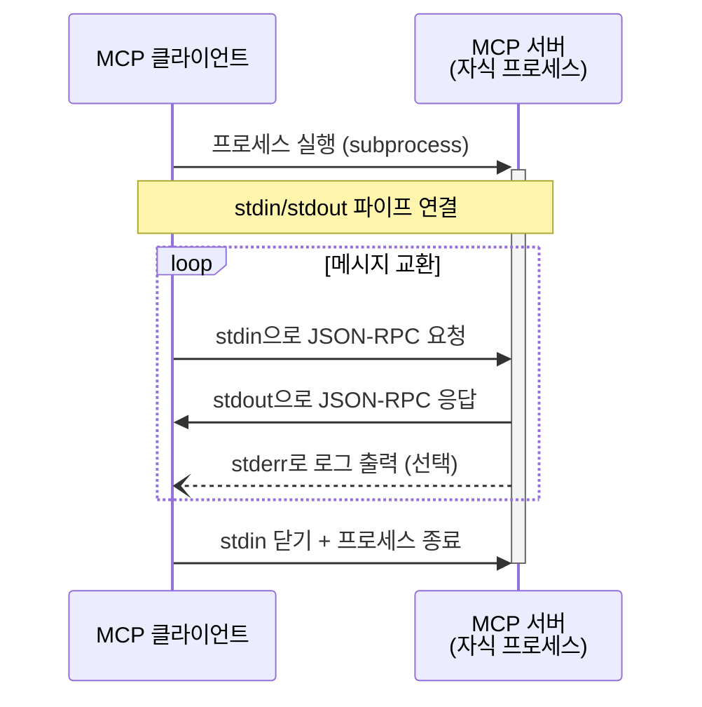
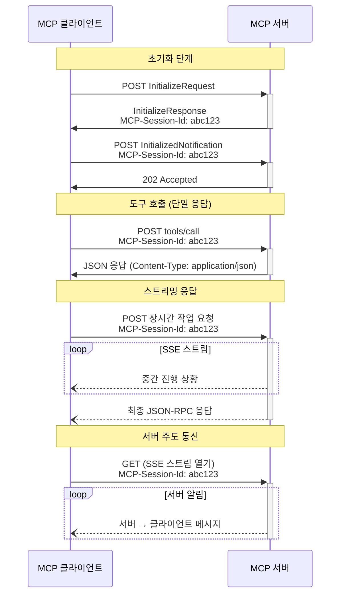
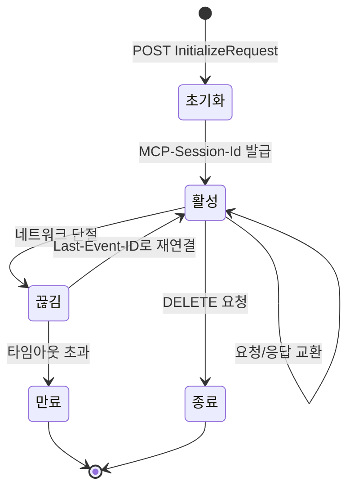
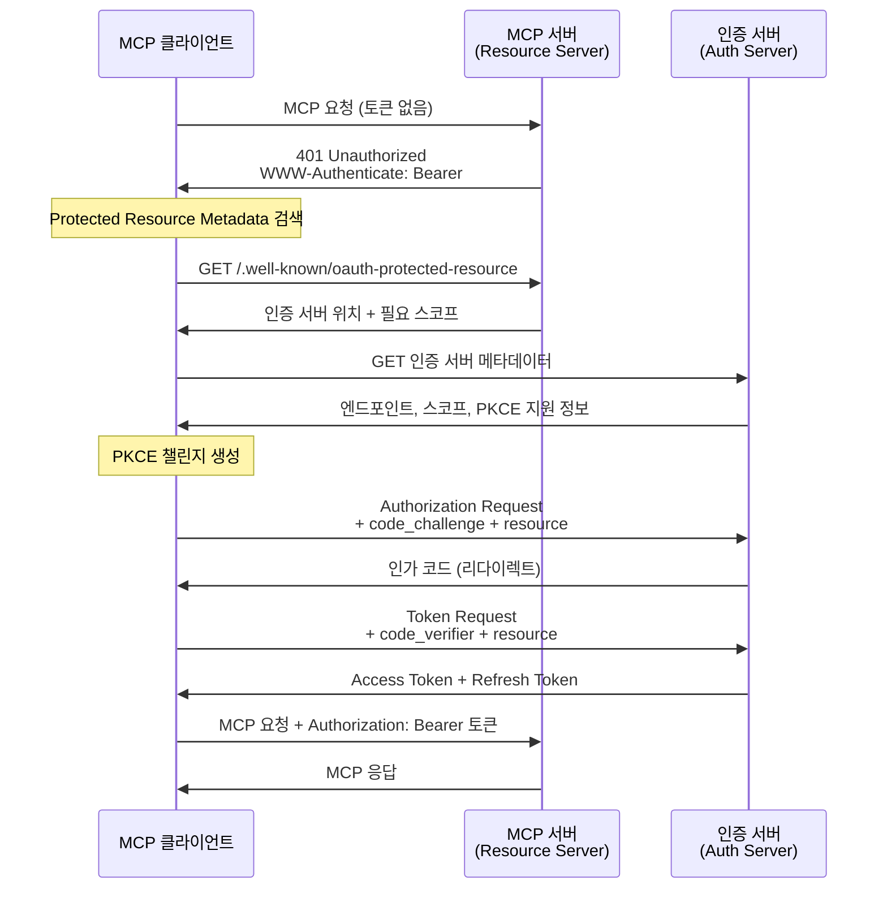
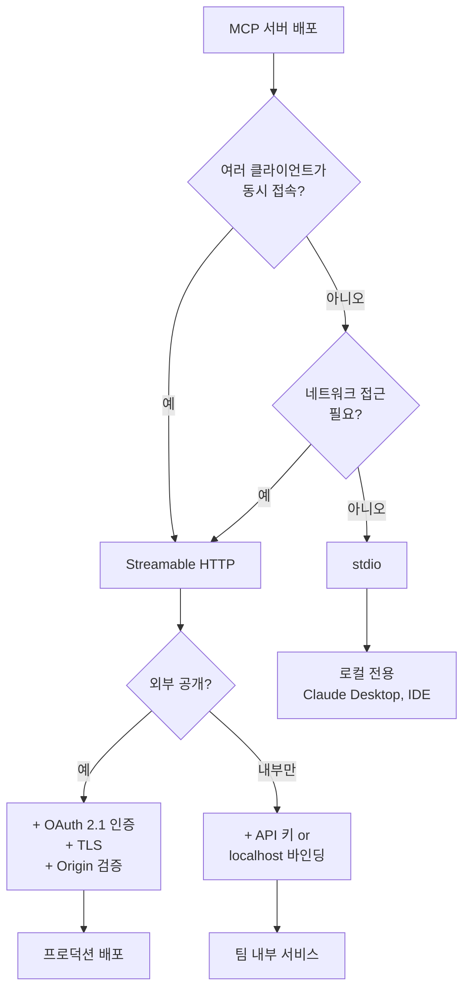

# 트랜스포트 설정

> MCP 서버와 클라이언트가 통신하는 두 가지 표준 경로 — stdio와 Streamable HTTP — 를 이해하고, 보안 설정까지 완성합니다.

## 개요

이 섹션에서는 MCP의 두 가지 공식 트랜스포트인 **stdio**와 **Streamable HTTP**를 깊이 있게 다루고, 각각의 설정법과 보안 구성을 실습합니다. [FastMCP 서버 기초](09-ch9-mcp-서버-구축/02-02-fastmcp-서버-기초.md)에서 `mcp.run()`으로 서버를 띄워봤고, [리소스와 프롬프트 설계](09-ch9-mcp-서버-구축/03-03-리소스와-프롬프트-설계.md)에서 풍부한 데이터를 노출하는 방법을 배웠죠. 이제 **그 서버가 클라이언트와 어떤 경로로 대화하는지**, 그리고 **원격 배포 시 보안은 어떻게 지키는지**를 완성할 차례입니다.

**선수 지식**: FastMCP 서버 생성(`FastMCP()`, `@mcp.tool()`, `mcp.run()`), [MCP 3계층 아키텍처(Host/Client/Server)](09-ch9-mcp-서버-구축/01-01-mcp-프로토콜-이해.md)
**학습 목표**:
- stdio 트랜스포트의 동작 원리와 제약을 설명할 수 있다
- Streamable HTTP 트랜스포트로 원격 MCP 서버를 구성할 수 있다
- 세션 관리, 재연결, SSE 스트리밍의 동작 방식을 이해한다
- OAuth 2.1 기반 인증/인가 흐름을 설명하고 Bearer 토큰 보호를 적용할 수 있다

## 왜 알아야 할까?

[MCP 프로토콜 이해](09-ch9-mcp-서버-구축/01-01-mcp-프로토콜-이해.md)에서 MCP의 3계층 아키텍처(Host → Client → Server)와 "AI 앱의 USB-C" 비유를 다뤘는데요, USB-C가 아무리 훌륭한 표준이어도 **케이블** 없이는 기기를 연결할 수 없습니다. 트랜스포트가 바로 그 케이블 역할입니다. 이 섹션에서는 아키텍처 자체가 아닌, **아키텍처를 연결하는 통신 계층**에 집중합니다.

실제 프로덕션 환경을 생각해 보면 상황이 명확해집니다:

- **로컬 IDE 플러그인** — Claude Desktop이 여러분의 코드 분석 MCP 서버를 subprocess로 띄울 때 → **stdio**
- **팀 공유 서비스** — 회사 내부의 DB 조회 MCP 서버를 여러 에이전트가 동시에 호출할 때 → **Streamable HTTP**
- **SaaS 플랫폼** — 외부 고객이 API 키로 접근하는 MCP 서버 → **Streamable HTTP + OAuth 2.1 인증**

> 📊 **그림 1**: 배포 시나리오별 트랜스포트 선택



트랜스포트 선택을 잘못하면 단일 사용자 도구가 네트워크에 무방비 상태로 노출되거나, 반대로 팀 서비스가 한 번에 하나의 클라이언트만 받을 수 있는 병목이 됩니다. 이번 섹션에서 올바른 선택 기준과 설정법을 확실히 잡아두겠습니다.

## 핵심 개념

### 개념 1: stdio 트랜스포트 — 로컬의 왕도

> 💡 **비유**: stdio는 **인터폰**과 같습니다. 건물 1층과 집 안을 직접 연결하는 전용 회선이죠. 외부에 노출되지 않고, 1:1로만 통신합니다. 건물 밖 사람은 이 인터폰에 접근할 수 없어요.

stdio 트랜스포트에서는 **MCP 클라이언트가 서버를 자식 프로세스(subprocess)로 실행**합니다. 서버는 `stdin`으로 JSON-RPC 메시지를 받고, `stdout`으로 응답을 보냅니다. 이게 전부입니다. ([MCP 프로토콜 이해](09-ch9-mcp-서버-구축/01-01-mcp-프로토콜-이해.md)에서 다룬 Host → Client → Server 흐름에서, stdio는 Client와 Server 사이의 파이프가 됩니다.)

> 📊 **그림 2**: stdio 트랜스포트의 통신 흐름



**핵심 규칙들**:

| 규칙 | 설명 |
|------|------|
| 메시지 구분 | 줄바꿈(`\n`)으로 구분, 메시지 내부에 줄바꿈 금지 |
| stdout 독점 | 서버는 stdout에 MCP 메시지만 출력 (디버그 로그 금지!) |
| stderr 활용 | 로깅은 반드시 stderr로 — 클라이언트가 선택적으로 캡처 |
| 1:1 전용 | 하나의 클라이언트가 하나의 서버 프로세스를 소유 |

FastMCP에서 stdio는 **기본 트랜스포트**입니다:

```python
from fastmcp import FastMCP

mcp = FastMCP("CodeAnalyzer")

@mcp.tool()
def analyze_code(code: str, language: str = "python") -> str:
    """코드의 복잡도와 잠재적 이슈를 분석합니다."""
    lines = code.strip().split("\n")
    return f"{language} 코드 {len(lines)}줄 분석 완료: 이슈 없음"

if __name__ == "__main__":
    mcp.run()  # 기본값: transport="stdio"
```

Claude Desktop이나 다른 MCP 호스트에서 이 서버를 사용하려면, 설정 파일에 실행 명령을 등록합니다:

```json
{
  "mcpServers": {
    "code-analyzer": {
      "command": "python",
      "args": ["server.py"]
    }
  }
}
```

> ⚠️ **흔한 오해**: "서버에서 `print()`로 디버깅해도 되겠지?" — **절대 안 됩니다!** `print()`는 stdout으로 출력되는데, 클라이언트는 stdout의 모든 내용을 JSON-RPC 메시지로 파싱하려 합니다. 디버그 출력이 섞이면 즉시 파싱 에러가 발생합니다. 디버깅은 반드시 `stderr`나 FastMCP의 `Context.info()` / `Context.error()`를 사용하세요.

### 개념 2: Streamable HTTP 트랜스포트 — 원격의 표준

> 💡 **비유**: Streamable HTTP는 **콜센터 전화 시스템**과 같습니다. 여러 고객(클라이언트)이 동시에 전화를 걸 수 있고, 상담사(서버)는 독립적으로 운영되며, 통화가 끊겨도 다시 연결하면 이어서 상담받을 수 있죠. 전용선이 아닌 공용 네트워크를 통해 소통합니다.

Streamable HTTP는 2025년 3월에 도입되어 기존의 HTTP+SSE 트랜스포트를 대체한 MCP의 **원격 통신 표준**입니다. 서버가 독립 프로세스로 운영되며, 여러 클라이언트의 동시 연결을 지원합니다.

**동작 방식**:

서버는 단일 HTTP 엔드포인트(예: `https://example.com/mcp/`)를 노출하고, 이 엔드포인트가 POST와 GET 두 메서드를 처리합니다.

| 방향 | HTTP 메서드 | 용도 |
|------|-----------|------|
| 클라이언트 → 서버 | POST | JSON-RPC 요청/알림/응답 전송 |
| 서버 → 클라이언트 | POST 응답 | 단일 JSON 응답 또는 SSE 스트림 |
| 서버 → 클라이언트 | GET | 서버 주도 알림/요청을 위한 SSE 스트림 |

FastMCP에서의 설정은 간단합니다:

```python
from fastmcp import FastMCP

mcp = FastMCP("TeamDBServer")

@mcp.tool()
def query_database(sql: str) -> str:
    """SQL 쿼리를 실행하고 결과를 반환합니다."""
    # 실제로는 DB 연결 로직
    return f"쿼리 실행 완료: {sql}"

if __name__ == "__main__":
    # Streamable HTTP로 실행
    mcp.run(
        transport="streamable-http",  # 또는 "http"
        host="127.0.0.1",             # 바인딩 주소
        port=8000                      # 포트
    )
```

> 📊 **그림 3**: Streamable HTTP의 요청-응답 시퀀스



**필수 HTTP 헤더**:

```python
# 클라이언트가 보내야 하는 헤더들
headers = {
    "Accept": "application/json, text/event-stream",  # 두 타입 모두 지원 명시
    "MCP-Session-Id": "abc123...",                     # 초기화 후 필수
    "MCP-Protocol-Version": "2025-11-25",              # 프로토콜 버전
    "Content-Type": "application/json",                # POST 본문 타입
}
```

### 개념 3: 세션 관리와 재연결

> 💡 **비유**: MCP 세션은 **영화관 좌석 예매**와 비슷합니다. 처음 예매(초기화)할 때 좌석 번호(Session ID)를 받고, 이후 팝콘을 사러 갔다 와도(재연결) 같은 번호를 보여주면 자리를 찾을 수 있죠. 상영이 끝나면(세션 만료) 그 번호는 더 이상 유효하지 않습니다.

Streamable HTTP에서 세션 관리는 선택적이지만, 상태 유지가 필요한 서버에서는 필수적입니다.

> 📊 **그림 4**: 세션 생명주기와 재연결 흐름



**세션 생명주기**:

```python
# 1. 클라이언트가 InitializeRequest를 POST
# 2. 서버가 응답에 MCP-Session-Id 헤더 포함
#    → "MCP-Session-Id: 1868a90c-..."
# 3. 이후 모든 요청에 이 ID를 포함
# 4. 세션 종료 시 클라이언트가 DELETE 요청
# 5. 만료된 세션 ID → 서버가 404 반환 → 클라이언트는 새 세션 시작
```

**재연결(Resumability)** 메커니즘도 사양에 포함되어 있습니다:

```python
# SSE 이벤트에 id 필드가 있으면 재연결 가능
# 네트워크 단절 시:
# 1. 클라이언트가 GET /mcp/ 요청
# 2. Last-Event-ID 헤더에 마지막 수신 이벤트 ID 포함
# 3. 서버가 해당 지점부터 메시지 재전송
```

> 🔥 **실무 팁**: 네트워크 불안정한 환경(모바일, 원격 서버)에서는 재연결 메커니즘이 매우 중요합니다. 서버 측에서 SSE 이벤트에 `id`와 `retry` 필드를 반드시 포함시키세요. `retry` 값은 밀리초 단위로, 클라이언트의 재연결 간격을 제어합니다.

### 개념 4: 보안과 OAuth 2.1 인증

> 💡 **비유**: 인증 없는 원격 MCP 서버는 **열쇠 없는 집**과 같습니다. 누구나 들어와서 데이터를 가져가거나 도구를 실행할 수 있죠. OAuth 2.1은 현관에 **스마트 도어락**을 설치하는 것 — 본인 인증(PKCE), 방문 허가(스코프), 출입 기록(토큰 검증)까지 갖춘 보안 시스템입니다.

MCP 사양에서 인증은 **선택적**이지만, 원격 배포에서는 사실상 필수입니다.

> 📊 **그림 5**: MCP OAuth 2.1 인증 흐름



**트랜스포트별 보안 전략**:

| 항목 | stdio | Streamable HTTP |
|------|-------|----------------|
| 인증 방식 | 환경변수에서 자격증명 읽기 | OAuth 2.1 / Bearer 토큰 |
| 네트워크 노출 | 없음 (로컬 프로세스) | 있음 (HTTP 엔드포인트) |
| Origin 검증 | 불필요 | **필수** (DNS 리바인딩 방지) |
| 바인딩 주소 | 해당 없음 | localhost(127.0.0.1) 권장 |
| TLS | 불필요 | 프로덕션에서 필수 |

**FastMCP에서의 기본 토큰 검증** (커스텀 미들웨어 예시):

```python
from fastmcp import FastMCP
from starlette.requests import Request
from starlette.responses import JSONResponse, PlainTextResponse
import os

mcp = FastMCP("SecureServer")

# API 키 기반 간이 인증 (프로덕션에서는 OAuth 2.1 권장)
VALID_API_KEYS = {os.environ.get("MCP_API_KEY", "dev-key-12345")}

@mcp.custom_route("/health", methods=["GET"])
async def health_check(request: Request) -> PlainTextResponse:
    """헬스 체크 — 인증 불필요"""
    return PlainTextResponse("OK")

@mcp.tool()
def get_user_data(user_id: str) -> dict:
    """사용자 데이터를 조회합니다."""
    return {"user_id": user_id, "name": "홍길동", "role": "admin"}

if __name__ == "__main__":
    mcp.run(transport="streamable-http", host="127.0.0.1", port=8000)
```

> 📊 **그림 6**: 트랜스포트 선택 의사결정 트리



## 실습: 직접 해보기

두 트랜스포트 모드를 모두 지원하는 MCP 서버를 구축하고, HTTP 모드에서 보안 헤더 검증과 헬스 체크를 포함하는 실전 서버를 만들어 보겠습니다.

### 1단계: 듀얼 트랜스포트 MCP 서버

```python
"""dual_transport_server.py — stdio/HTTP 듀얼 트랜스포트 MCP 서버"""

import argparse
import json
from datetime import datetime
from fastmcp import FastMCP
from starlette.requests import Request
from starlette.responses import JSONResponse, PlainTextResponse

# FastMCP 인스턴스 생성
mcp = FastMCP(
    "NotificationHub",
    instructions="알림 관리 서버입니다. 알림 생성, 조회, 통계 기능을 제공합니다.",
)

# 인메모리 알림 저장소
notifications: list[dict] = []


# ─── 도구 ───

@mcp.tool()
def send_notification(
    title: str,
    message: str,
    priority: str = "normal",
    channel: str = "general",
) -> dict:
    """새 알림을 생성합니다.

    Args:
        title: 알림 제목
        message: 알림 내용
        priority: 우선순위 (low, normal, high, critical)
        channel: 알림 채널
    """
    notification = {
        "id": len(notifications) + 1,
        "title": title,
        "message": message,
        "priority": priority,
        "channel": channel,
        "created_at": datetime.now().isoformat(),
        "read": False,
    }
    notifications.append(notification)
    return {"status": "sent", "notification": notification}


@mcp.tool()
def get_notifications(
    channel: str | None = None,
    unread_only: bool = False,
) -> list[dict]:
    """알림 목록을 조회합니다.

    Args:
        channel: 특정 채널 필터 (None이면 전체)
        unread_only: True면 읽지 않은 알림만
    """
    result = notifications
    if channel:
        result = [n for n in result if n["channel"] == channel]
    if unread_only:
        result = [n for n in result if not n["read"]]
    return result


@mcp.tool()
def get_stats() -> dict:
    """알림 통계를 반환합니다."""
    total = len(notifications)
    unread = sum(1 for n in notifications if not n["read"])
    by_priority = {}
    for n in notifications:
        p = n["priority"]
        by_priority[p] = by_priority.get(p, 0) + 1
    return {
        "total": total,
        "unread": unread,
        "by_priority": by_priority,
    }


# ─── 리소스 ───

@mcp.resource("notification://stats")
def notification_stats() -> str:
    """현재 알림 통계를 JSON으로 반환합니다."""
    stats = get_stats()
    return json.dumps(stats, ensure_ascii=False, indent=2)


# ─── HTTP 전용: 커스텀 라우트 ───

@mcp.custom_route("/health", methods=["GET"])
async def health(request: Request) -> JSONResponse:
    """헬스 체크 엔드포인트"""
    return JSONResponse({
        "status": "healthy",
        "server": "NotificationHub",
        "transport": "streamable-http",
        "timestamp": datetime.now().isoformat(),
    })


# ─── 실행 ───

if __name__ == "__main__":
    parser = argparse.ArgumentParser(description="NotificationHub MCP Server")
    parser.add_argument(
        "--transport",
        choices=["stdio", "http"],
        default="stdio",
        help="트랜스포트 선택 (기본: stdio)",
    )
    parser.add_argument("--host", default="127.0.0.1", help="HTTP 바인딩 주소")
    parser.add_argument("--port", type=int, default=8000, help="HTTP 포트")

    args = parser.parse_args()

    if args.transport == "http":
        print(f"🚀 HTTP 모드: http://{args.host}:{args.port}/mcp/")
        mcp.run(
            transport="streamable-http",
            host=args.host,
            port=args.port,
        )
    else:
        # stdio 모드 — print 사용 금지! (위의 print는 서버 시작 전이라 OK)
        mcp.run()  # 기본 stdio
```

### 2단계: 서버 실행 및 테스트

**stdio 모드**:

```terminal
# stdio 모드로 실행 (Claude Desktop 등에서 사용)
$ python dual_transport_server.py --transport stdio
```

**HTTP 모드**:

```terminal
# HTTP 모드로 실행
$ python dual_transport_server.py --transport http
🚀 HTTP 모드: http://127.0.0.1:8000/mcp/

# 다른 터미널에서 헬스 체크
$ curl http://127.0.0.1:8000/health
{"status":"healthy","server":"NotificationHub","transport":"streamable-http","timestamp":"2026-03-19T14:30:00"}
```

**MCP Inspector로 테스트** (두 모드 모두 지원):

```terminal
# stdio 모드 테스트
$ fastmcp dev dual_transport_server.py

# HTTP 모드 테스트 — 별도로 서버를 띄운 뒤 Inspector에서 URL 입력
$ python dual_transport_server.py --transport http --port 8000
# Inspector에서 http://127.0.0.1:8000/mcp/ 로 연결
```

### 3단계: ASGI 프로덕션 배포

실제 프로덕션에서는 Uvicorn이나 Gunicorn 같은 ASGI 서버로 배포합니다:

```python
"""asgi_app.py — ASGI 배포용 앱 팩토리"""

from fastmcp import FastMCP

def create_app() -> object:
    """ASGI 앱 팩토리 — Uvicorn/Gunicorn에서 사용"""
    mcp = FastMCP("NotificationHub")

    @mcp.tool()
    def send_notification(title: str, message: str) -> dict:
        return {"status": "sent", "title": title}

    @mcp.tool()
    def get_stats() -> dict:
        return {"total": 0, "unread": 0}

    # http_app()은 ASGI 호환 앱 객체를 반환
    return mcp.http_app()

# Uvicorn이 이 변수를 직접 로드
app = create_app()
```

```terminal
# Uvicorn으로 프로덕션 실행
$ uvicorn asgi_app:app --host 0.0.0.0 --port 8000 --workers 4

# 또는 자동 리로드 개발 모드
$ fastmcp run dual_transport_server.py --transport http --port 8000 --reload
```

### 4단계: 도구 호출 테스트

```run:python
# 서버가 떠 있다고 가정하고, HTTP 요청 구조를 확인합니다
import json

# MCP 초기화 요청 구조
initialize_request = {
    "jsonrpc": "2.0",
    "id": 1,
    "method": "initialize",
    "params": {
        "protocolVersion": "2025-11-25",
        "capabilities": {},
        "clientInfo": {"name": "test-client", "version": "1.0.0"},
    },
}

# 도구 호출 요청 구조
tool_call_request = {
    "jsonrpc": "2.0",
    "id": 2,
    "method": "tools/call",
    "params": {
        "name": "send_notification",
        "arguments": {
            "title": "서버 점검",
            "message": "오늘 22시 정기 점검 예정",
            "priority": "high",
            "channel": "ops",
        },
    },
}

# 필수 HTTP 헤더
headers = {
    "Content-Type": "application/json",
    "Accept": "application/json, text/event-stream",
    "MCP-Protocol-Version": "2025-11-25",
    "MCP-Session-Id": "abc123-session-id",  # 초기화 후 받은 값
}

print("=== 초기화 요청 ===")
print(json.dumps(initialize_request, indent=2, ensure_ascii=False))
print()
print("=== 도구 호출 요청 ===")
print(json.dumps(tool_call_request, indent=2, ensure_ascii=False))
print()
print("=== 필수 헤더 ===")
for k, v in headers.items():
    print(f"  {k}: {v}")
```

```output
=== 초기화 요청 ===
{
  "jsonrpc": "2.0",
  "id": 1,
  "method": "initialize",
  "params": {
    "protocolVersion": "2025-11-25",
    "capabilities": {},
    "clientInfo": {
      "name": "test-client",
      "version": "1.0.0"
    }
  }
}

=== 도구 호출 요청 ===
{
  "jsonrpc": "2.0",
  "id": 2,
  "method": "tools/call",
  "params": {
    "name": "send_notification",
    "arguments": {
      "title": "서버 점검",
      "message": "오늘 22시 정기 점검 예정",
      "priority": "high",
      "channel": "ops"
    }
  }
}

=== 필수 헤더 ===
  Content-Type: application/json
  Accept: application/json, text/event-stream
  MCP-Protocol-Version: 2025-11-25
  MCP-Session-Id: abc123-session-id
```

## 더 깊이 알아보기

### SSE에서 Streamable HTTP로: 왜 바뀌었을까?

MCP의 트랜스포트 역사는 짧지만 흥미롭습니다. 2024년 11월 첫 번째 MCP 사양에서는 원격 통신에 **HTTP+SSE** 트랜스포트를 사용했습니다. 클라이언트가 먼저 SSE 엔드포인트에 GET으로 연결하면, 서버가 별도의 POST 엔드포인트 URL을 SSE 이벤트로 알려주는 방식이었죠.

하지만 이 설계에는 근본적인 문제가 있었습니다:

1. **SSE는 단방향** — 서버→클라이언트만 스트리밍 가능. 클라이언트→서버는 별도 POST가 필요
2. **두 개의 엔드포인트** — SSE용 GET과 메시지용 POST가 따로 존재하여 복잡
3. **상태 동기화** — 두 연결 사이의 세션 매핑이 까다로움

2025년 3월, MCP 팀은 이를 **Streamable HTTP**로 전면 교체했습니다. 핵심 변화는 "단일 엔드포인트에서 POST와 GET 모두 처리"하는 것이었죠. POST 응답 자체가 SSE 스트림이 될 수 있어서, 양방향 통신이 자연스럽게 구현됩니다.

> 💡 **알고 계셨나요?**: "Streamable HTTP"라는 이름은 커뮤니티에서 격론 끝에 정해졌습니다. 처음에는 "HTTP+SSE v2", "Bidirectional HTTP" 등의 후보가 있었지만, SSE가 선택적이라는 점을 강조하기 위해 "Streamable"이 채택되었습니다. SSE를 쓰지 않고 단순 JSON 응답만 반환하는 것도 완전히 유효한 구현이거든요.

### OAuth 2.1과 MCP의 만남

MCP 사양에 OAuth 2.1 인증이 추가된 것도 2025년의 중요한 이정표입니다. Anthropic은 MCP를 원격 서비스 통합 표준으로 만들려 했고, 그러려면 표준화된 보안이 필수였습니다.

흥미로운 점은, MCP가 기존 OAuth 2.0이 아닌 아직 드래프트 단계인 **OAuth 2.1**을 선택했다는 것입니다. OAuth 2.1은 기존 2.0의 모범 사례를 공식 사양으로 통합하면서, implicit grant 같은 취약한 흐름을 제거한 버전입니다. PKCE(Proof Key for Code Exchange)가 필수가 된 것도 이 때문이죠.

2025년 11월 사양에서는 **Step-Up Authorization**이 추가되어, 실행 중에 권한이 부족하면 추가 스코프를 동적으로 요청할 수 있게 되었습니다. 이는 에이전트가 대화 중에 새로운 도구를 사용하려 할 때 특히 유용합니다.

## 흔한 오해와 팁

> ⚠️ **흔한 오해**: "SSE 트랜스포트가 deprecated되었으니 기존 서버를 당장 마이그레이션해야 한다" — 그렇지 않습니다. MCP 사양은 하위 호환성 가이드를 제공합니다. 새 Streamable HTTP 엔드포인트와 기존 SSE 엔드포인트를 동시에 운영할 수 있고, 클라이언트가 자동으로 적절한 트랜스포트를 감지합니다. 새 프로젝트만 Streamable HTTP를 쓰면 됩니다.

> 💡 **알고 계셨나요?**: MCP의 stdio 트랜스포트가 JSON-RPC 메시지를 줄바꿈으로 구분하는 것은 **JSON Lines(JSONL)** 형식과 동일합니다. JSONL은 빅데이터와 로그 처리에서 널리 쓰이는 형식으로, 한 줄에 하나의 완전한 JSON 객체를 담습니다. 스트리밍 파싱에 최적화되어 있어서, 메시지 경계를 찾기 위해 전체 버퍼를 분석할 필요가 없죠.

> 🔥 **실무 팁**: 로컬에서 HTTP 모드로 개발할 때도 반드시 `host="127.0.0.1"`로 바인딩하세요. `0.0.0.0`으로 바인딩하면 같은 네트워크의 모든 기기에서 접근 가능해집니다. 특히 카페나 공유 오피스의 Wi-Fi에서 작업할 때, 인증 없는 MCP 서버가 `0.0.0.0`에 떠 있으면 DNS 리바인딩 공격에 취약해집니다. MCP 사양이 Origin 헤더 검증을 **MUST**로 지정한 이유입니다.

> 🔥 **실무 팁**: `fastmcp run server.py --reload`는 개발 중 코드 변경을 자동 감지하여 서버를 재시작합니다. `--reload-dir ./src`로 감시 디렉토리를 지정하면 불필요한 재시작을 줄일 수 있습니다. FastMCP v3.0.0+에서 지원됩니다.

## 핵심 정리

| 개념 | 설명 |
|------|------|
| **stdio 트랜스포트** | 클라이언트가 서버를 subprocess로 실행, stdin/stdout으로 JSON-RPC 교환. 로컬 1:1 전용 |
| **Streamable HTTP** | 단일 HTTP 엔드포인트(/mcp/)에서 POST(요청)와 GET(스트림)을 처리. 다중 클라이언트 지원 |
| **SSE(Server-Sent Events)** | Streamable HTTP 내에서 서버→클라이언트 스트리밍에 선택적 사용. 독립 SSE 트랜스포트는 deprecated |
| **MCP-Session-Id** | 서버가 초기화 시 발급하는 세션 식별자. 이후 모든 요청에 헤더로 포함 |
| **재연결(Resumability)** | SSE 이벤트 ID + Last-Event-ID 헤더로 끊어진 스트림을 이어받는 메커니즘 |
| **OAuth 2.1 인증** | Streamable HTTP 서버의 표준 인증. PKCE 필수, Bearer 토큰, Resource Indicators 사용 |
| **Origin 검증** | DNS 리바인딩 방지를 위해 서버가 Origin 헤더를 검증 (MUST 요건) |
| **`mcp.run(transport=)`** | FastMCP에서 `"stdio"` (기본), `"streamable-http"`, `"sse"` (레거시) 중 선택 |

## 다음 섹션 미리보기

트랜스포트 설정까지 마쳤으니, 이제 모든 퍼즐 조각이 갖춰졌습니다. 다음 섹션 [MCP 서버 실전 프로젝트](09-ch9-mcp-서버-구축/05-05-mcp-서버-실전-프로젝트.md)에서는 지금까지 배운 도구, 리소스, 프롬프트, 트랜스포트를 **하나의 완성된 프로젝트**로 통합합니다. 실제 비즈니스 시나리오를 기반으로 한 MCP 서버를 처음부터 끝까지 구축하고, 테스트하고, 배포 준비까지 완료하겠습니다.

## 참고 자료

- [MCP Transports Specification (2025-11-25)](https://modelcontextprotocol.io/specification/2025-11-25/basic/transports) - 두 가지 표준 트랜스포트의 공식 사양. MUST/SHOULD 요건을 상세히 정의합니다
- [MCP Authorization Specification (2025-11-25)](https://modelcontextprotocol.io/specification/2025-11-25/basic/authorization) - OAuth 2.1 기반 MCP 인증/인가 사양. PKCE, Resource Indicators, Step-Up Authorization 포함
- [FastMCP — Running Your Server](https://gofastmcp.com/deployment/running-server) - FastMCP의 트랜스포트 설정 공식 문서. stdio, HTTP, SSE 실행법과 ASGI 배포 패턴
- [MCP Python SDK GitHub](https://github.com/modelcontextprotocol/python-sdk) - 공식 Python SDK 소스코드. 트랜스포트 구현 참조
- [Why MCP Deprecated SSE and Went with Streamable HTTP](https://blog.fka.dev/blog/2025-06-06-why-mcp-deprecated-sse-and-go-with-streamable-http/) - SSE에서 Streamable HTTP로 전환된 배경과 기술적 이유를 다룬 분석 글

---
### 🔗 Related Sessions
- [mcp](09-ch9-mcp-서버-구축/01-01-mcp-프로토콜-이해.md) (prerequisite)
