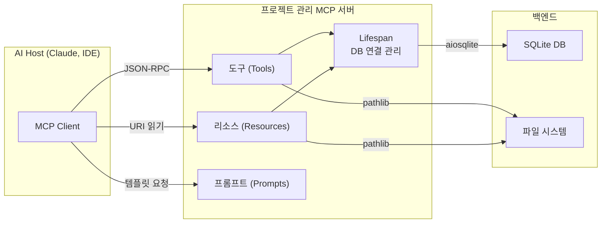
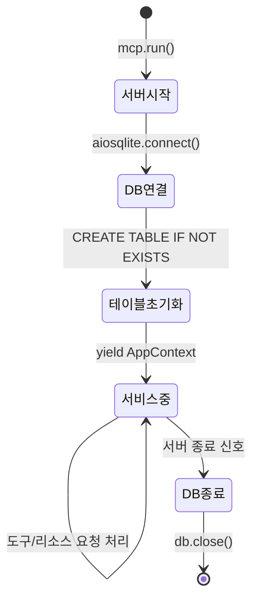
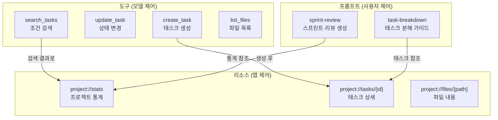
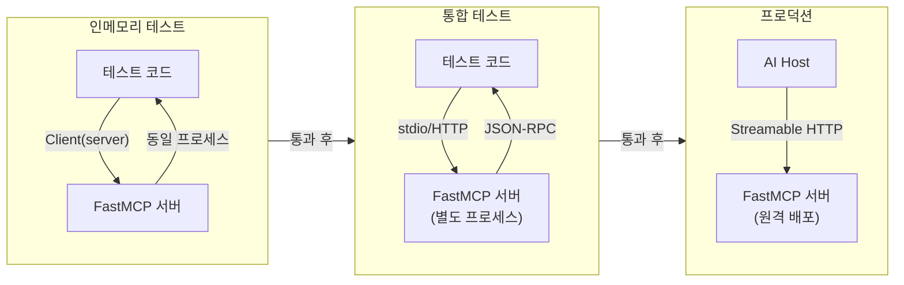
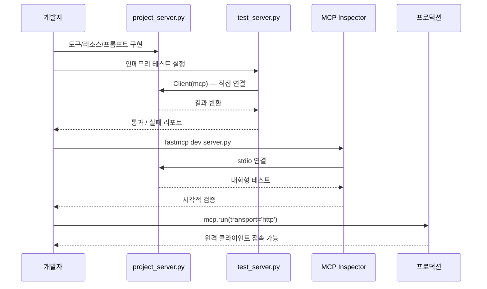

# MCP 서버 실전 프로젝트

> 데이터베이스 조회와 파일 관리 기능을 하나의 MCP 서버로 통합 구축하고, 체계적으로 테스트하는 실전 프로젝트

## 개요

이 섹션에서는 Ch9 전체에서 배운 MCP 프로토콜, FastMCP 서버, 리소스/프롬프트 설계, 트랜스포트 설정을 **하나의 완성형 프로젝트**로 통합합니다. SQLite 데이터베이스 조회와 파일 관리 기능을 제공하는 실전 MCP 서버를 처음부터 끝까지 구축하고, FastMCP 클라이언트로 자동화된 테스트까지 작성합니다.

**선수 지식**: 
- [MCP 프로토콜 아키텍처](09-ch9-mcp-서버-구축/01-01-mcp-프로토콜-이해.md)의 Host/Client/Server 3계층 구조
- [FastMCP 서버 기초](09-ch9-mcp-서버-구축/02-02-fastmcp-서버-기초.md)의 @mcp.tool(), @mcp.resource(), Context 객체
- [리소스와 프롬프트 설계](09-ch9-mcp-서버-구축/03-03-리소스와-프롬프트-설계.md)의 URI 체계와 멀티 메시지 프롬프트
- [트랜스포트 설정](09-ch9-mcp-서버-구축/04-04-트랜스포트-설정.md)의 stdio/HTTP 트랜스포트와 보안

**학습 목표**:
- Lifespan 패턴으로 데이터베이스 연결을 관리하는 MCP 서버를 구축할 수 있다
- 도구·리소스·프롬프트를 비즈니스 시나리오에 맞게 설계하고 조합할 수 있다
- FastMCP Client의 인메모리 트랜스포트로 서버를 테스트할 수 있다
- 서버를 stdio와 HTTP 트랜스포트로 각각 배포할 수 있다

## 왜 알아야 할까?

지금까지 도구, 리소스, 프롬프트, 트랜스포트를 **개별적으로** 배웠습니다. 하지만 실제 프로덕션에서는 이 모든 요소가 하나의 서버 안에서 유기적으로 작동해야 하죠. 데이터베이스 연결은 서버 시작 시 한 번만 열고 종료 시 안전하게 닫아야 하며, 여러 도구가 같은 연결을 공유해야 합니다. 파일 시스템 접근은 보안 경계를 설정해야 하고, 에러가 발생해도 서버가 멈추면 안 됩니다.

이 섹션의 프로젝트는 **"프로젝트 관리 어시스턴트"** 시나리오입니다. AI 에이전트가 프로젝트의 태스크를 관리하고, 관련 파일을 조회하며, 분석 프롬프트를 활용하는 — 실제 개발 팀에서 쓸 수 있는 수준의 MCP 서버를 만듭니다.

> 📊 **그림 1**: 실전 프로젝트의 전체 구조



## 핵심 개념

### 개념 1: Lifespan 패턴으로 데이터베이스 관리

> 💡 **비유**: 레스토랑을 생각해보세요. 매일 아침 문을 열 때 가스불을 켜고 식재료를 준비하며, 밤에 문을 닫을 때 가스를 끄고 정리합니다. 손님(클라이언트)이 올 때마다 가스를 켜고 끄진 않죠. Lifespan은 바로 이 "개점/폐점" 루틴입니다.

MCP 서버에서 데이터베이스 연결은 **서버 수명 주기**와 함께 관리해야 합니다. 매 요청마다 연결을 열고 닫으면 오버헤드가 크고, 전역 변수로 관리하면 비동기 환경에서 문제가 생기거든요. FastMCP의 `lifespan` 패턴이 이 문제를 깔끔하게 해결합니다.

> 📊 **그림 2**: Lifespan 패턴의 생명주기



핵심 구조는 `@asynccontextmanager`로 감싼 비동기 제너레이터입니다. `yield` 이전이 초기화, 이후가 정리 코드가 되죠.

```python
from contextlib import asynccontextmanager
from collections.abc import AsyncIterator
from dataclasses import dataclass, field
from pathlib import Path
import aiosqlite
from mcp.server.fastmcp import FastMCP, Context

@dataclass
class AppContext:
    """서버 수명 주기 동안 공유되는 애플리케이션 컨텍스트"""
    db: aiosqlite.Connection
    workspace: Path

@asynccontextmanager
async def app_lifespan(server: FastMCP) -> AsyncIterator[AppContext]:
    """서버 시작 시 DB 연결, 종료 시 정리"""
    workspace = Path("./workspace")
    workspace.mkdir(exist_ok=True)
    
    # 개점 — DB 연결 및 테이블 생성
    db = await aiosqlite.connect(workspace / "projects.db")
    db.row_factory = aiosqlite.Row  # 딕셔너리 스타일 접근
    await _initialize_tables(db)
    
    try:
        yield AppContext(db=db, workspace=workspace)
    finally:
        # 폐점 — 안전하게 연결 종료
        await db.close()
```

도구나 리소스 함수에서는 `Context` 객체를 통해 이 공유 컨텍스트에 접근합니다:

```python
@mcp.tool()
async def some_tool(ctx: Context) -> str:
    # Lifespan에서 yield한 AppContext에 접근
    app: AppContext = ctx.request_context.lifespan_context
    db = app.db  # 공유 DB 연결
    workspace = app.workspace  # 공유 작업 디렉토리
```

> ⚠️ **흔한 오해**: "매 요청마다 새 DB 연결을 만들어야 하는 거 아닌가요?" — 아닙니다. `aiosqlite`는 내부적으로 스레드 하나에서 SQLite를 실행하면서 비동기 인터페이스를 제공합니다. Lifespan에서 한 번 열어두면 모든 요청이 같은 연결을 공유하고, 이게 SQLite의 권장 패턴이기도 합니다.

### 개념 2: 도구·리소스·프롬프트 통합 설계

> 💡 **비유**: 도구는 **리모컨 버튼**(동작 실행), 리소스는 **TV 화면**(정보 표시), 프롬프트는 **추천 채널 목록**(미리 정의된 시나리오)입니다. 사용자가 리모컨으로 채널을 바꾸면(도구), 화면에 내용이 표시되고(리소스), 추천 목록이 뭘 볼지 제안합니다(프롬프트). 이 셋이 함께 작동해야 완전한 경험이 되죠.

프로젝트 관리 서버의 구성 요소를 역할별로 설계합니다:

> 📊 **그림 3**: 프로젝트 관리 서버의 도구·리소스·프롬프트 구조



**설계 원칙**을 정리하면 이렇습니다:

| 구성 요소 | 역할 | 제어 주체 | 예시 |
|-----------|------|-----------|------|
| 도구 (Tools) | 상태를 **변경**하는 액션 | LLM이 판단하여 호출 | `create_task`, `update_task` |
| 리소스 (Resources) | 상태를 **읽기만** 하는 데이터 | 클라이언트 앱이 자동 로드 | `project://stats`, `project://tasks/42` |
| 프롬프트 (Prompts) | 특정 시나리오의 **대화 템플릿** | 사용자가 선택 | `sprint-review`, `task-breakdown` |

### 개념 3: 인메모리 테스트 전략

> 💡 **비유**: 새 요리를 개발할 때 바로 손님에게 내놓진 않죠. 주방에서 **시식**을 먼저 합니다. FastMCP Client의 인메모리 트랜스포트는 바로 이 "주방 시식"입니다 — 네트워크도, 프로세스 분리도 없이 서버 로직을 직접 검증합니다.

FastMCP는 테스트를 위한 인메모리 클라이언트를 기본 제공합니다. 서버 인스턴스를 직접 클라이언트에 전달하면, 별도 프로세스나 네트워크 없이 동일 프로세스 내에서 MCP 프로토콜을 완전히 시뮬레이션합니다.

```python
from fastmcp import Client

# 서버 인스턴스를 직접 전달 — 인메모리 통신
client = Client(mcp)

async with client:
    # 도구 호출 테스트
    result = await client.call_tool("create_task", {
        "title": "테스트 태스크",
        "priority": "high"
    })
    
    # 리소스 읽기 테스트
    stats = await client.read_resource("project://stats")
    
    # 프롬프트 테스트
    messages = await client.get_prompt("sprint-review")
```

> 📊 **그림 4**: 테스트 전략 — 인메모리 vs 통합 테스트



인메모리 테스트의 장점은 **속도**와 **격리**입니다. 네트워크 지연이 없고, 테스트마다 독립된 데이터베이스를 사용할 수 있어서 병렬 실행도 가능하거든요.

## 실습: 직접 해보기

프로젝트 관리 MCP 서버를 처음부터 끝까지 구축합니다. 하나의 파일에 모든 구성 요소를 담아 바로 실행할 수 있게 만들겠습니다.

### 1단계: 프로젝트 설정

```python
# 의존성 설치
# pip install "mcp[cli]" aiosqlite
```

### 2단계: 서버 전체 코드 — `project_server.py`

```python
"""프로젝트 관리 MCP 서버 — 태스크 DB + 파일 관리"""

from contextlib import asynccontextmanager
from collections.abc import AsyncIterator
from dataclasses import dataclass
from datetime import datetime
from pathlib import Path
from typing import Any

import aiosqlite
from mcp.server.fastmcp import FastMCP, Context
from mcp.types import TextContent

# ──────────────────────────────────────────────
# 1. Lifespan — DB 연결 및 작업 디렉토리 관리
# ──────────────────────────────────────────────

@dataclass
class AppContext:
    """서버 전역에서 공유하는 애플리케이션 상태"""
    db: aiosqlite.Connection
    workspace: Path


async def _initialize_tables(db: aiosqlite.Connection) -> None:
    """DB 테이블 초기화 — 없으면 생성"""
    await db.execute("""
        CREATE TABLE IF NOT EXISTS tasks (
            id INTEGER PRIMARY KEY AUTOINCREMENT,
            title TEXT NOT NULL,
            description TEXT DEFAULT '',
            status TEXT DEFAULT 'todo',
            priority TEXT DEFAULT 'medium',
            assignee TEXT DEFAULT '',
            created_at TEXT NOT NULL,
            updated_at TEXT NOT NULL
        )
    """)
    await db.execute("""
        CREATE TABLE IF NOT EXISTS task_comments (
            id INTEGER PRIMARY KEY AUTOINCREMENT,
            task_id INTEGER NOT NULL,
            content TEXT NOT NULL,
            author TEXT DEFAULT 'system',
            created_at TEXT NOT NULL,
            FOREIGN KEY (task_id) REFERENCES tasks(id)
        )
    """)
    await db.commit()


@asynccontextmanager
async def app_lifespan(server: FastMCP) -> AsyncIterator[AppContext]:
    """서버 시작 시 초기화, 종료 시 정리"""
    workspace = Path("./workspace")
    workspace.mkdir(exist_ok=True)
    (workspace / "docs").mkdir(exist_ok=True)

    db = await aiosqlite.connect(workspace / "projects.db")
    db.row_factory = aiosqlite.Row
    await _initialize_tables(db)

    try:
        yield AppContext(db=db, workspace=workspace)
    finally:
        await db.close()


# FastMCP 서버 인스턴스 — lifespan 연결
mcp = FastMCP(
    "ProjectManager",
    lifespan=app_lifespan,
    instructions="프로젝트 태스크를 관리하고 파일을 조회하는 서버입니다."
)


# ──────────────────────────────────────────────
# 2. 도구 (Tools) — 상태를 변경하는 액션
# ──────────────────────────────────────────────

def _get_ctx(ctx: Context) -> AppContext:
    """Context에서 AppContext를 꺼내는 헬퍼"""
    return ctx.request_context.lifespan_context


@mcp.tool()
async def create_task(
    title: str,
    description: str = "",
    priority: str = "medium",
    assignee: str = "",
    ctx: Context = None,
) -> str:
    """새 태스크를 생성합니다.
    
    Args:
        title: 태스크 제목
        description: 상세 설명
        priority: 우선순위 (low, medium, high, critical)
        assignee: 담당자 이름
    """
    app = _get_ctx(ctx)
    now = datetime.now().isoformat()

    # 우선순위 검증
    valid_priorities = {"low", "medium", "high", "critical"}
    if priority not in valid_priorities:
        return f"오류: priority는 {valid_priorities} 중 하나여야 합니다."

    cursor = await app.db.execute(
        """INSERT INTO tasks (title, description, priority, assignee, created_at, updated_at)
           VALUES (?, ?, ?, ?, ?, ?)""",
        (title, description, priority, assignee, now, now),
    )
    await app.db.commit()
    task_id = cursor.lastrowid

    await ctx.info(f"태스크 #{task_id} 생성: {title}")
    return f"태스크 #{task_id}이(가) 생성되었습니다. (제목: {title}, 우선순위: {priority})"


@mcp.tool()
async def update_task(
    task_id: int,
    status: str | None = None,
    priority: str | None = None,
    assignee: str | None = None,
    ctx: Context = None,
) -> str:
    """태스크 상태, 우선순위, 담당자를 변경합니다.
    
    Args:
        task_id: 변경할 태스크 ID
        status: 새 상태 (todo, in_progress, review, done)
        priority: 새 우선순위 (low, medium, high, critical)
        assignee: 새 담당자
    """
    app = _get_ctx(ctx)

    # 태스크 존재 확인
    async with app.db.execute("SELECT id FROM tasks WHERE id = ?", (task_id,)) as cur:
        if not await cur.fetchone():
            return f"오류: 태스크 #{task_id}을(를) 찾을 수 없습니다."

    # 동적 UPDATE 구성
    updates, params = [], []
    if status:
        valid_statuses = {"todo", "in_progress", "review", "done"}
        if status not in valid_statuses:
            return f"오류: status는 {valid_statuses} 중 하나여야 합니다."
        updates.append("status = ?")
        params.append(status)
    if priority:
        updates.append("priority = ?")
        params.append(priority)
    if assignee is not None:
        updates.append("assignee = ?")
        params.append(assignee)

    if not updates:
        return "변경할 항목이 없습니다."

    updates.append("updated_at = ?")
    params.append(datetime.now().isoformat())
    params.append(task_id)

    await app.db.execute(
        f"UPDATE tasks SET {', '.join(updates)} WHERE id = ?", params
    )
    await app.db.commit()
    await ctx.info(f"태스크 #{task_id} 업데이트됨")
    return f"태스크 #{task_id}이(가) 업데이트되었습니다."


@mcp.tool()
async def search_tasks(
    status: str | None = None,
    priority: str | None = None,
    assignee: str | None = None,
    keyword: str | None = None,
    ctx: Context = None,
) -> str:
    """조건에 맞는 태스크를 검색합니다.
    
    Args:
        status: 상태 필터 (todo, in_progress, review, done)
        priority: 우선순위 필터
        assignee: 담당자 필터
        keyword: 제목/설명에서 키워드 검색
    """
    app = _get_ctx(ctx)
    conditions, params = [], []

    if status:
        conditions.append("status = ?")
        params.append(status)
    if priority:
        conditions.append("priority = ?")
        params.append(priority)
    if assignee:
        conditions.append("assignee = ?")
        params.append(assignee)
    if keyword:
        conditions.append("(title LIKE ? OR description LIKE ?)")
        params.extend([f"%{keyword}%", f"%{keyword}%"])

    where = f"WHERE {' AND '.join(conditions)}" if conditions else ""
    query = f"SELECT * FROM tasks {where} ORDER BY created_at DESC LIMIT 50"

    async with app.db.execute(query, params) as cursor:
        rows = await cursor.fetchall()

    if not rows:
        return "조건에 맞는 태스크가 없습니다."

    lines = [f"검색 결과: {len(rows)}건\n"]
    for row in rows:
        lines.append(
            f"  #{row['id']} [{row['status']}] ({row['priority']}) "
            f"{row['title']} — 담당: {row['assignee'] or '미배정'}"
        )
    return "\n".join(lines)


@mcp.tool()
async def list_files(
    subdirectory: str = "",
    ctx: Context = None,
) -> str:
    """작업 디렉토리의 파일 목록을 반환합니다.
    
    Args:
        subdirectory: 하위 디렉토리 (예: 'docs')
    """
    app = _get_ctx(ctx)
    target = app.workspace / subdirectory

    # 경로 탈출 방지 (보안)
    try:
        target = target.resolve()
        app.workspace.resolve()
        if not str(target).startswith(str(app.workspace.resolve())):
            return "오류: 작업 디렉토리 밖의 경로에 접근할 수 없습니다."
    except (OSError, ValueError):
        return "오류: 잘못된 경로입니다."

    if not target.exists():
        return f"디렉토리가 존재하지 않습니다: {subdirectory}"

    entries = []
    for item in sorted(target.iterdir()):
        kind = "📁" if item.is_dir() else "📄"
        size = f" ({item.stat().st_size:,}B)" if item.is_file() else ""
        entries.append(f"  {kind} {item.name}{size}")

    return f"📂 {subdirectory or '/'} ({len(entries)}개 항목)\n" + "\n".join(entries)


# ──────────────────────────────────────────────
# 3. 리소스 (Resources) — 데이터 읽기 전용
# ──────────────────────────────────────────────

@mcp.resource("project://stats")
async def get_project_stats(ctx: Context) -> str:
    """프로젝트 전체 통계를 반환합니다."""
    app = _get_ctx(ctx)

    async with app.db.execute(
        "SELECT status, COUNT(*) as cnt FROM tasks GROUP BY status"
    ) as cursor:
        status_counts = {row["status"]: row["cnt"] async for row in cursor}

    async with app.db.execute("SELECT COUNT(*) as total FROM tasks") as cursor:
        total = (await cursor.fetchone())["total"]

    async with app.db.execute(
        "SELECT priority, COUNT(*) as cnt FROM tasks GROUP BY priority"
    ) as cursor:
        priority_counts = {row["priority"]: row["cnt"] async for row in cursor}

    lines = [
        f"📊 프로젝트 통계 (총 {total}건)",
        "\n상태별:",
    ]
    for s in ["todo", "in_progress", "review", "done"]:
        lines.append(f"  {s}: {status_counts.get(s, 0)}건")
    lines.append("\n우선순위별:")
    for p in ["critical", "high", "medium", "low"]:
        lines.append(f"  {p}: {priority_counts.get(p, 0)}건")

    return "\n".join(lines)


@mcp.resource("project://tasks/{task_id}")
async def get_task_detail(task_id: int, ctx: Context) -> str:
    """특정 태스크의 상세 정보와 코멘트를 반환합니다."""
    app = _get_ctx(ctx)

    async with app.db.execute(
        "SELECT * FROM tasks WHERE id = ?", (task_id,)
    ) as cursor:
        task = await cursor.fetchone()

    if not task:
        return f"태스크 #{task_id}을(를) 찾을 수 없습니다."

    # 코멘트 조회
    async with app.db.execute(
        "SELECT * FROM task_comments WHERE task_id = ? ORDER BY created_at",
        (task_id,),
    ) as cursor:
        comments = await cursor.fetchall()

    lines = [
        f"# 태스크 #{task['id']}: {task['title']}",
        f"상태: {task['status']} | 우선순위: {task['priority']}",
        f"담당자: {task['assignee'] or '미배정'}",
        f"생성: {task['created_at']} | 수정: {task['updated_at']}",
        f"\n설명:\n{task['description'] or '(없음)'}",
    ]

    if comments:
        lines.append(f"\n💬 코멘트 ({len(comments)}개):")
        for c in comments:
            lines.append(f"  [{c['author']}] {c['content']} ({c['created_at']})")

    return "\n".join(lines)


@mcp.resource("project://files/{path}")
async def get_file_content(path: str, ctx: Context) -> str:
    """작업 디렉토리 내 파일의 내용을 반환합니다."""
    app = _get_ctx(ctx)
    file_path = (app.workspace / path).resolve()

    # 보안: 작업 디렉토리 외부 접근 차단
    if not str(file_path).startswith(str(app.workspace.resolve())):
        return "오류: 접근 권한이 없는 경로입니다."

    if not file_path.exists():
        return f"파일을 찾을 수 없습니다: {path}"

    if file_path.stat().st_size > 1_000_000:  # 1MB 제한
        return f"파일이 너무 큽니다: {file_path.stat().st_size:,}B (최대 1MB)"

    return file_path.read_text(encoding="utf-8")


# ──────────────────────────────────────────────
# 4. 프롬프트 (Prompts) — 대화 템플릿
# ──────────────────────────────────────────────

@mcp.prompt()
async def sprint_review(ctx: Context) -> str:
    """현재 프로젝트 상태를 바탕으로 스프린트 리뷰를 생성합니다."""
    app = _get_ctx(ctx)

    async with app.db.execute("SELECT * FROM tasks ORDER BY status, priority") as cur:
        tasks = await cur.fetchall()

    task_summary = "\n".join(
        f"- #{t['id']} [{t['status']}]({t['priority']}) {t['title']}"
        for t in tasks
    )

    return (
        f"아래 프로젝트 태스크 현황을 분석하여 스프린트 리뷰를 작성해주세요.\n\n"
        f"## 현재 태스크 목록\n{task_summary or '(태스크 없음)'}\n\n"
        f"## 요청 사항\n"
        f"1. 완료된 작업 요약\n"
        f"2. 진행 중인 작업의 위험 요소\n"
        f"3. 다음 스프린트 추천 우선순위"
    )


@mcp.prompt()
async def task_breakdown(task_title: str) -> str:
    """큰 태스크를 하위 태스크로 분해하는 가이드를 생성합니다."""
    return (
        f"다음 태스크를 실행 가능한 하위 태스크로 분해해주세요.\n\n"
        f"## 태스크: {task_title}\n\n"
        f"## 분해 기준\n"
        f"- 각 하위 태스크는 하루 이내에 완료 가능해야 합니다\n"
        f"- 의존성 관계를 명시해주세요\n"
        f"- 우선순위(critical/high/medium/low)를 지정해주세요\n"
        f"- 담당자 역할(backend/frontend/devops)을 제안해주세요"
    )


# ──────────────────────────────────────────────
# 5. 서버 실행
# ──────────────────────────────────────────────

if __name__ == "__main__":
    mcp.run()  # 기본: stdio 트랜스포트
```

### 3단계: 테스트 코드 — `test_server.py`

```run:python
"""FastMCP 인메모리 클라이언트로 서버 테스트"""
import asyncio
from fastmcp import Client

# 서버 모듈에서 인스턴스 가져오기
from project_server import mcp


async def test_full_workflow():
    """전체 워크플로우 통합 테스트"""
    client = Client(mcp)

    async with client:
        # 1. 도구 목록 확인
        tools = await client.list_tools()
        tool_names = [t.name for t in tools]
        print(f"등록된 도구: {tool_names}")
        assert "create_task" in tool_names
        assert "search_tasks" in tool_names

        # 2. 태스크 생성
        result = await client.call_tool("create_task", {
            "title": "MCP 서버 배포",
            "description": "프로덕션 환경에 MCP 서버 배포",
            "priority": "high",
            "assignee": "김개발",
        })
        print(f"생성 결과: {result[0].text}")

        # 3. 두 번째 태스크 생성
        await client.call_tool("create_task", {
            "title": "API 문서 작성",
            "priority": "medium",
            "assignee": "이기획",
        })

        # 4. 태스크 상태 변경
        result = await client.call_tool("update_task", {
            "task_id": 1,
            "status": "in_progress",
        })
        print(f"업데이트: {result[0].text}")

        # 5. 검색 테스트
        result = await client.call_tool("search_tasks", {
            "status": "in_progress",
        })
        print(f"검색 결과:\n{result[0].text}")

        # 6. 리소스 읽기 — 프로젝트 통계
        stats = await client.read_resource("project://stats")
        print(f"\n프로젝트 통계:\n{stats[0].text}")

        # 7. 리소스 읽기 — 태스크 상세
        detail = await client.read_resource("project://tasks/1")
        print(f"\n태스크 상세:\n{detail[0].text}")

        # 8. 프롬프트 테스트
        prompts = await client.list_prompts()
        print(f"\n등록된 프롬프트: {[p.name for p in prompts]}")

        review = await client.get_prompt("sprint_review")
        print(f"\n스프린트 리뷰 프롬프트:\n{review.messages[0].content.text[:200]}...")

    print("\n✅ 모든 테스트 통과!")


asyncio.run(test_full_workflow())
```

```output
등록된 도구: ['create_task', 'update_task', 'search_tasks', 'list_files']
생성 결과: 태스크 #1이(가) 생성되었습니다. (제목: MCP 서버 배포, 우선순위: high)
업데이트: 태스크 #1이(가) 업데이트되었습니다.
검색 결과:
검색 결과: 1건

  #1 [in_progress] (high) MCP 서버 배포 — 담당: 김개발

프로젝트 통계:
📊 프로젝트 통계 (총 2건)

상태별:
  todo: 1건
  in_progress: 1건
  review: 0건
  done: 0건

우선순위별:
  critical: 0건
  high: 1건
  medium: 1건
  low: 0건

태스크 상세:
# 태스크 #1: MCP 서버 배포
상태: in_progress | 우선순위: high
담당자: 김개발
생성: 2026-03-19T10:30:00 | 수정: 2026-03-19T10:30:05

설명:
프로덕션 환경에 MCP 서버 배포

등록된 프롬프트: ['sprint_review', 'task_breakdown']

스프린트 리뷰 프롬프트:
아래 프로젝트 태스크 현황을 분석하여 스프린트 리뷰를 작성해주세요.

## 현재 태스크 목록
- #1 [in_progress](high) MCP 서버 배포
- #2 [todo](medium) API 문서 작성

## 요청 사항
1. 완료된 작업 요약
2. 진행 중인 작업의...

✅ 모든 테스트 통과!
```

### 4단계: HTTP 트랜스포트로 배포

stdio 대신 HTTP로 서버를 실행하면 네트워크를 통해 여러 클라이언트가 접속할 수 있습니다.

```python
# project_server_http.py — HTTP 트랜스포트 버전
from project_server import mcp

if __name__ == "__main__":
    # Streamable HTTP로 실행 (포트 8000)
    mcp.run(transport="http", host="0.0.0.0", port=8000)
```

```console
$ python project_server_http.py
INFO:     Started server process
INFO:     Uvicorn running on http://0.0.0.0:8000
INFO:     MCP endpoint: http://0.0.0.0:8000/mcp
```

### 5단계: Claude Desktop 연동 설정

```json
{
  "mcpServers": {
    "project-manager": {
      "command": "python",
      "args": ["project_server.py"],
      "cwd": "/path/to/your/project"
    }
  }
}
```

### 6단계: MCP Inspector로 디버깅

```console
$ fastmcp dev project_server.py
Starting MCP Inspector...
⚡ Server running at http://localhost:6274
```

MCP Inspector는 브라우저에서 도구 호출, 리소스 읽기, 프롬프트 렌더링을 대화형으로 테스트할 수 있는 디버깅 도구입니다. 서버를 배포하기 전에 반드시 Inspector로 모든 기능을 검증하세요.

> 📊 **그림 5**: 서버 개발부터 배포까지의 워크플로우



## 더 깊이 알아보기

### MCP의 탄생 — "N×M 문제"를 해결하려는 시도

MCP가 탄생한 배경에는 **커넥터 폭발 문제**가 있습니다. 2024년 초, AI 애플리케이션 생태계는 빠르게 성장하고 있었지만 각 AI 앱이 각 외부 서비스마다 독자적인 통합 코드를 작성해야 했습니다. N개의 AI 앱과 M개의 외부 서비스가 있으면 N×M개의 커넥터가 필요했죠. USB가 등장하기 전 프린터마다 전용 케이블이 필요했던 시대와 비슷합니다.

Anthropic의 엔지니어링 팀은 2024년 내부적으로 Claude가 외부 도구를 사용하는 방식을 표준화하는 작업을 시작했고, 2024년 11월에 MCP를 오픈 프로토콜로 공개했습니다. "USB-C for AI"라는 비전 아래, 한 번 MCP 서버를 만들면 모든 MCP 호환 AI 앱에서 사용할 수 있게 한 것입니다.

### FastMCP의 진화 — 커뮤니티가 만든 표준

FastMCP는 원래 Jericho Luo가 개인 프로젝트로 시작한 것이 Prefect사가 인수하여 발전시켰습니다. MCP Python SDK 공식 구현의 저수준 API가 사용하기 어렵다는 커뮤니티 피드백을 반영해, 데코레이터 기반의 직관적인 인터페이스를 제공했죠. 그 인기가 워낙 높아 **MCP Python SDK 자체에 FastMCP가 공식 포함**되는 결과로 이어졌습니다. 오픈소스 커뮤니티의 힘을 보여주는 사례입니다.

> 💡 **알고 계셨나요?**: FastMCP 3.0(2026년 1월 출시)은 컴포넌트 버전 관리, 세분화된 권한 부여, OpenTelemetry 계측 등 엔터프라이즈급 기능을 추가했습니다. MCP Python SDK에 포함된 `mcp.server.fastmcp`는 SDK 번들 버전이고, `pip install fastmcp`로 설치하는 것은 최신 기능이 포함된 커뮤니티 버전입니다.

## 흔한 오해와 팁

> ⚠️ **흔한 오해**: "MCP 서버는 항상 별도 프로세스로 실행해야 한다" — 개발 단계에서는 그렇지 않습니다. `Client(server)` 인메모리 패턴을 사용하면 테스트 코드와 서버가 같은 프로세스에서 실행됩니다. 네트워크·프로세스 오버헤드가 없어서 단위 테스트에 이상적이죠.

> 🔥 **실무 팁**: SQL 인젝션 방지를 위해 **항상 파라미터 바인딩**(`?` 플레이스홀더)을 사용하세요. f-string으로 SQL을 조립하면 LLM이 악의적인 쿼리를 생성할 수 있습니다. 위 실습 코드에서 `search_tasks`의 keyword 검색도 `LIKE ?`와 파라미터 바인딩으로 안전하게 처리했습니다.

> 🔥 **실무 팁**: `list_files` 같은 파일 시스템 도구에는 반드시 **경로 탈출 방지** 로직을 넣으세요. `resolve()` 후 작업 디렉토리의 하위인지 검증하는 패턴은 보안의 기본입니다. LLM이 `../../etc/passwd` 같은 경로를 요청할 수 있거든요.

> 💡 **알고 계셨나요?**: MCP Inspector(`fastmcp dev`)는 내부적으로 stdio 트랜스포트로 서버에 연결하며, 브라우저 UI에서 도구 호출 인자를 직접 편집하고 결과를 실시간으로 확인할 수 있습니다. `--reload` 플래그를 추가하면 코드 변경 시 서버가 자동 재시작됩니다.

## 핵심 정리

| 개념 | 설명 |
|------|------|
| Lifespan 패턴 | `@asynccontextmanager`로 서버 수명 주기에 맞춰 DB 연결 등 공유 자원을 관리 |
| AppContext | `@dataclass`로 정의한 서버 전역 상태. `ctx.request_context.lifespan_context`로 접근 |
| 도구 설계 원칙 | 상태를 **변경**하는 액션만 도구로 노출. 입력 검증 + 파라미터 바인딩 필수 |
| 리소스 설계 원칙 | **읽기 전용** 데이터를 URI 기반으로 노출. 정적 + 템플릿 조합 |
| 프롬프트 설계 원칙 | DB 데이터를 동적으로 주입한 **대화 시나리오** 템플릿 |
| 인메모리 테스트 | `Client(server)`로 프로세스 내 테스트. 네트워크 없이 전체 MCP 프로토콜 검증 |
| 경로 보안 | `resolve()` + 상위 경로 비교로 작업 디렉토리 탈출 방지 |
| MCP Inspector | `fastmcp dev`로 브라우저 기반 대화형 디버깅 |

## 다음 섹션 미리보기

Ch9에서 MCP **서버**를 완성했으니, 다음 [Ch10. MCP 클라이언트와 에이전트 통합](10-ch10-mcp-클라이언트와-에이전트-통합/01-01-mcp-클라이언트-구축.md)에서는 반대편 — **클라이언트**를 구축합니다. 방금 만든 프로젝트 관리 서버에 프로그래밍 방식으로 연결하는 MCP 클라이언트를 만들고, 이를 LLM과 연동하여 에이전트가 MCP 도구를 자율적으로 호출하는 구조를 완성합니다. 서버를 만들 줄 아는 것과 클라이언트에서 활용하는 것은 전혀 다른 기술이거든요.

## 참고 자료

- [MCP 공식 문서 — Build a Server](https://modelcontextprotocol.io/docs/develop/build-server) - MCP 서버 구축의 공식 가이드. Python FastMCP를 포함한 단계별 튜토리얼
- [MCP Python SDK GitHub](https://github.com/modelcontextprotocol/python-sdk) - FastMCP가 포함된 공식 Python SDK 소스 코드와 예제
- [FastMCP 공식 문서 — Server Context](https://gofastmcp.com/python-sdk/fastmcp-server-context) - Context 객체, Lifespan 관리, 상태 관리 등 서버 개발 심화 가이드
- [FastMCP 공식 문서 — Client for Testing](https://gofastmcp.com/clients/client) - 인메모리 클라이언트를 활용한 MCP 서버 테스트 방법
- [Real Python — Python MCP Server](https://realpython.com/python-mcp/) - Python으로 MCP 서버를 구축하는 실전 튜토리얼

---
### 🔗 Related Sessions
- [mcp](09-ch9-mcp-서버-구축/01-01-mcp-프로토콜-이해.md) (prerequisite)
- [stdio 트랜스포트](09-ch9-mcp-서버-구축/01-01-mcp-프로토콜-이해.md) (prerequisite)
- [streamable http 트랜스포트](09-ch9-mcp-서버-구축/01-01-mcp-프로토콜-이해.md) (prerequisite)
- [uri 템플릿 리소스](09-ch9-mcp-서버-구축/02-02-fastmcp-서버-기초.md) (prerequisite)
- [멀티 메시지 프롬프트](09-ch9-mcp-서버-구축/03-03-리소스와-프롬프트-설계.md) (prerequisite)
