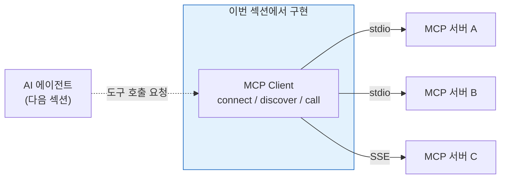
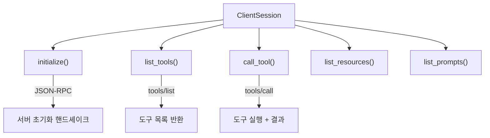
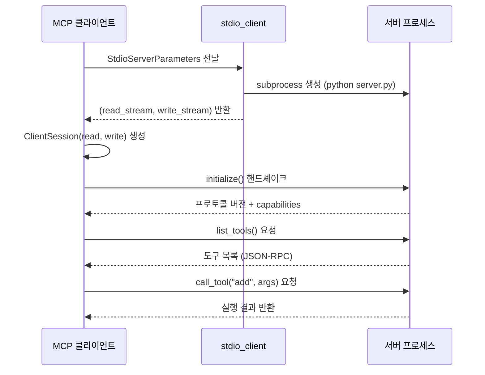
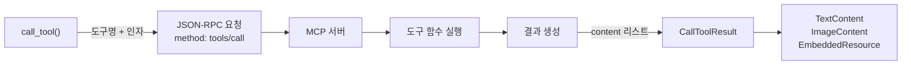
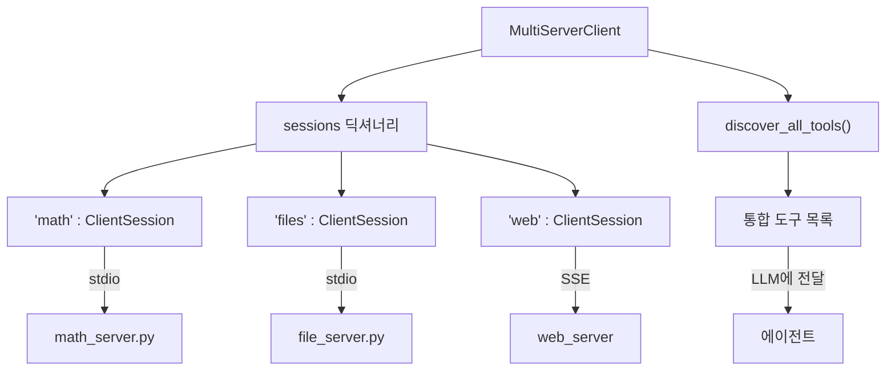
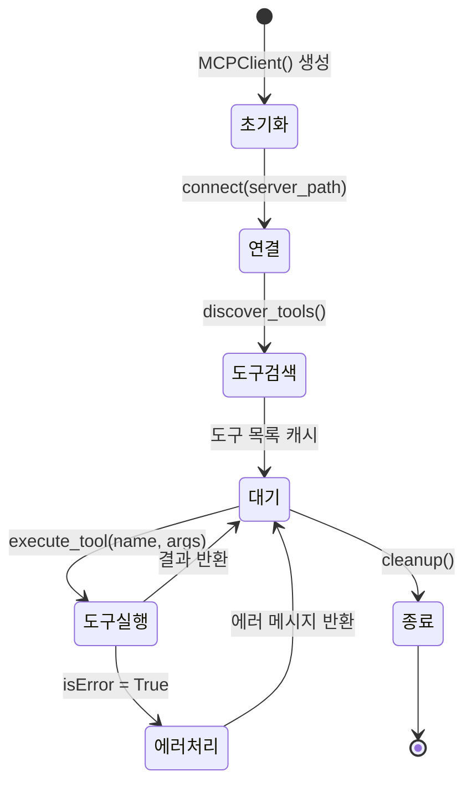

# MCP 클라이언트 구축

> MCP 서버에 연결하여 도구를 검색하고 호출하는 클라이언트를 직접 만들어봅니다

## 개요

이 섹션에서는 MCP(Model Context Protocol) 클라이언트를 처음부터 구축합니다. 서버에 stdio 트랜스포트로 연결하고, 사용 가능한 도구를 조회하고, 도구를 실행하는 전체 흐름을 배웁니다.

**선수 지식**: [MCP 프로토콜 이해](09-ch9-mcp-서버-구축/01-01-mcp-프로토콜-이해.md)에서 배운 MCP의 기본 아키텍처와 JSON-RPC 통신 구조, [FastMCP 서버 기초](09-ch9-mcp-서버-구축/02-02-fastmcp-서버-기초.md)에서 만든 서버 구현 경험

**학습 목표**:
- `ClientSession`과 `stdio_client`로 MCP 서버에 연결할 수 있다
- `list_tools()`로 서버의 도구 목록을 동적으로 검색할 수 있다
- `call_tool()`로 도구를 실행하고 결과를 처리할 수 있다

## 왜 알아야 할까?

[MCP 프로토콜 이해](09-ch9-mcp-서버-구축/01-01-mcp-프로토콜-이해.md)에서 Host → Client → Server 3계층 아키텍처를 배웠습니다. Ch9에서는 그 중 **Server** 쪽을 집중적으로 구현했죠. 이제 시선을 반대편으로 돌려, **Client** 계층을 직접 코드로 만들어볼 차례입니다.

MCP 서버를 만드는 건 식당 주방을 여는 것과 같습니다. 아무리 요리를 잘해도 주문을 받고 서빙할 사람이 없으면 의미가 없죠. MCP 클라이언트가 바로 그 "주문-서빙" 역할을 합니다.

실제 프로덕션 환경에서 AI 에이전트는 여러 MCP 서버의 도구를 자유롭게 사용해야 합니다. 파일 시스템, 데이터베이스, 외부 API — 이 모든 서버와 통신하는 단일 진입점이 바로 MCP 클라이언트입니다. 클라이언트 구축 방법을 알면 어떤 MCP 서버든 에이전트에 연결할 수 있게 되거든요.

> 📊 **그림 1**: 이번 섹션에서 구현할 범위 — Client 계층의 연결·검색·호출 흐름



## 핵심 개념

### 개념 1: ClientSession — MCP 통신의 심장

> 💡 **비유**: `ClientSession`은 전화 통화에서의 "회선"과 같습니다. 전화를 걸고(연결), 말하고(요청), 듣는(응답) 모든 과정이 하나의 회선 위에서 이루어지듯, MCP의 모든 통신은 `ClientSession` 하나를 통해 이루어집니다.

`ClientSession`은 MCP Python SDK에서 제공하는 클라이언트 측 세션 관리 클래스입니다. 서버와의 JSON-RPC 메시지 교환을 추상화하여, 개발자는 저수준 프로토콜을 신경 쓰지 않고 `list_tools()`, `call_tool()` 같은 고수준 메서드만 호출하면 됩니다.

> 📊 **그림 2**: ClientSession이 제공하는 주요 API



`ClientSession`을 사용하려면 읽기/쓰기 스트림 쌍이 필요합니다. 이 스트림은 트랜스포트 계층(`stdio_client` 또는 SSE)이 제공하거든요.

```python
from mcp import ClientSession, StdioServerParameters
from mcp.client.stdio import stdio_client

# 트랜스포트가 제공하는 read/write 스트림으로 세션 생성
session = ClientSession(read_stream, write_stream)

# 서버와 핸드셰이크 — 프로토콜 버전, 기능 협상
await session.initialize()
```

`initialize()` 호출은 필수입니다. 이 단계에서 클라이언트와 서버가 프로토콜 버전을 맞추고, 서로 지원하는 기능(capabilities)을 교환합니다. 이걸 건너뛰면 이후 모든 요청이 실패하게 되죠.

### 개념 2: stdio 트랜스포트 — 서브프로세스 기반 연결

> 💡 **비유**: stdio 트랜스포트는 "내선 전화"와 같습니다. 같은 컴퓨터에서 서버를 자식 프로세스(subprocess)로 띄우고, 표준 입출력(stdin/stdout)으로 대화합니다. 네트워크를 거치지 않으니 빠르고 간단하죠.

`stdio_client`는 서버 스크립트를 자식 프로세스로 실행하고, 그 프로세스의 stdin/stdout을 MCP 통신 채널로 사용합니다. `StdioServerParameters`에 실행할 명령어와 인자를 전달하면 됩니다.

> 📊 **그림 3**: stdio 트랜스포트의 동작 흐름



핵심 코드 패턴을 봅시다:

```python
from contextlib import AsyncExitStack
from mcp import ClientSession, StdioServerParameters
from mcp.client.stdio import stdio_client

async def connect_to_server(server_path: str) -> ClientSession:
    """MCP 서버에 stdio 트랜스포트로 연결합니다."""
    exit_stack = AsyncExitStack()

    # 서버 프로세스 실행 파라미터 설정
    server_params = StdioServerParameters(
        command="python",        # 실행할 명령어
        args=[server_path],      # 서버 스크립트 경로
        env=None                 # 환경 변수 (None이면 현재 환경 상속)
    )

    # stdio 트랜스포트로 서버에 연결 — (read, write) 스트림 쌍 반환
    read, write = await exit_stack.enter_async_context(
        stdio_client(server_params)
    )

    # 세션 생성 및 초기화
    session = await exit_stack.enter_async_context(
        ClientSession(read, write)
    )
    await session.initialize()

    return session
```

`AsyncExitStack`은 비동기 리소스의 생명주기를 안전하게 관리합니다. 프로그램이 종료될 때 트랜스포트와 세션이 올바른 순서로 정리되거든요.

> ⚠️ **흔한 오해**: `env=None`으로 설정하면 환경 변수가 아예 없는 상태로 서버가 뜨는 것은 아닙니다. `None`은 현재 프로세스의 환경 변수를 그대로 상속한다는 의미입니다. API 키 같은 환경 변수가 필요하면 부모 프로세스에 설정해두거나, `env` 딕셔너리에 명시적으로 전달하면 됩니다.

### 개념 3: list_tools() — 도구 카탈로그 조회

> 💡 **비유**: 레스토랑에 처음 가면 메뉴판부터 보잖아요? `list_tools()`는 서버의 "메뉴판"을 가져오는 것과 같습니다. 어떤 도구가 있는지, 각 도구가 어떤 매개변수를 받는지 알 수 있습니다.

`list_tools()`를 호출하면 서버가 노출하는 모든 도구의 목록을 받습니다. 각 도구에는 이름, 설명, 그리고 입력 스키마(JSON Schema)가 포함되어 있습니다.

```python
# 서버의 도구 목록 조회
response = await session.list_tools()

for tool in response.tools:
    print(f"도구: {tool.name}")
    print(f"  설명: {tool.description}")
    print(f"  스키마: {tool.inputSchema}")
```

반환되는 `tool.inputSchema`는 JSON Schema 형태로, LLM에게 그대로 전달하면 LLM이 적절한 인자로 도구 호출을 생성할 수 있습니다. 이것이 MCP의 핵심 설계 — "도구 검색의 표준화"입니다.

```run:python
# list_tools() 반환값의 구조 예시
tool_example = {
    "name": "get_weather",
    "description": "지정된 도시의 현재 날씨를 조회합니다",
    "inputSchema": {
        "type": "object",
        "properties": {
            "city": {
                "type": "string",
                "description": "날씨를 조회할 도시명"
            }
        },
        "required": ["city"]
    }
}

print(f"도구 이름: {tool_example['name']}")
print(f"설명: {tool_example['description']}")
print(f"필수 파라미터: {tool_example['inputSchema']['required']}")
```

```output
도구 이름: get_weather
설명: 지정된 도시의 현재 날씨를 조회합니다
필수 파라미터: ['city']
```

> 🔥 **실무 팁**: `list_tools()`는 서버에 연결할 때 한 번만 호출하는 게 일반적입니다. 하지만 동적으로 도구가 추가/제거되는 서버라면, 에이전트 루프 시작 시마다 호출해서 최신 목록을 유지하는 것도 좋은 패턴이에요.

### 개념 4: call_tool() — 도구 실행

> 💡 **비유**: 메뉴에서 요리를 고른 다음엔? 주문을 하죠! `call_tool()`은 서버에 "이 도구를 이 인자로 실행해줘"라고 주문하는 것입니다.

`call_tool()`은 도구 이름과 인자 딕셔너리를 받아 서버에 실행을 요청하고, 결과를 반환합니다.

```python
# 도구 실행
result = await session.call_tool(
    "get_weather",                    # 도구 이름
    arguments={"city": "서울"}        # 인자 딕셔너리
)

# 결과 처리 — result.content는 리스트
for content in result.content:
    if hasattr(content, 'text'):
        print(content.text)
```

반환되는 `result.content`는 `TextContent`, `ImageContent` 등의 객체 리스트입니다. 대부분의 도구는 `TextContent`를 반환하므로 `.text` 속성에서 결과 문자열을 꺼내면 됩니다.

> 📊 **그림 4**: call_tool()의 요청-응답 흐름



에러가 발생하면 `result.isError`가 `True`가 되고, `result.content`에 에러 메시지가 담깁니다:

```python
result = await session.call_tool("risky_tool", arguments={"input": "bad"})

if result.isError:
    # 에러 처리
    error_text = result.content[0].text
    print(f"도구 실행 실패: {error_text}")
else:
    # 정상 결과 처리
    print(result.content[0].text)
```

### 개념 5: 다중 서버 연결 — 실전 클라이언트 패턴

> 💡 **비유**: 스마트폰 하나로 여러 앱(카카오톡, 이메일, 은행 앱)을 동시에 사용하는 것처럼, 하나의 MCP 클라이언트 매니저가 여러 MCP 서버에 동시 연결하여 다양한 도구를 통합 관리할 수 있습니다.

프로덕션 에이전트는 보통 하나의 서버만 사용하지 않습니다. 파일을 읽는 서버, 웹을 검색하는 서버, 코드를 실행하는 서버 등 여러 서버를 동시에 연결해야 하죠. 이를 위해 각 서버별 세션을 관리하는 클래스를 만들 수 있습니다.

> 📊 **그림 5**: 다중 서버 연결 아키텍처



```python
class MultiServerClient:
    """여러 MCP 서버에 동시 연결하는 클라이언트 매니저."""

    def __init__(self):
        self.sessions: dict[str, ClientSession] = {}
        self.exit_stack = AsyncExitStack()
        self.tool_to_server: dict[str, str] = {}  # 도구 → 서버 매핑

    async def add_server(self, name: str, server_path: str) -> None:
        """새 MCP 서버를 연결합니다."""
        server_params = StdioServerParameters(
            command="python", args=[server_path]
        )
        read, write = await self.exit_stack.enter_async_context(
            stdio_client(server_params)
        )
        session = await self.exit_stack.enter_async_context(
            ClientSession(read, write)
        )
        await session.initialize()
        self.sessions[name] = session

        # 도구-서버 매핑 등록
        response = await session.list_tools()
        for tool in response.tools:
            self.tool_to_server[tool.name] = name

        print(f"서버 '{name}' 연결 완료 (도구 {len(response.tools)}개)")

    async def call(self, tool_name: str, arguments: dict) -> str:
        """도구 이름으로 적절한 서버를 찾아 호출합니다."""
        server_name = self.tool_to_server.get(tool_name)
        if not server_name:
            raise ValueError(f"도구 '{tool_name}'을 제공하는 서버가 없습니다")

        session = self.sessions[server_name]
        result = await session.call_tool(tool_name, arguments)

        if result.isError:
            return f"Error: {result.content[0].text}"
        return result.content[0].text if result.content else ""

    async def get_all_tools(self) -> list[dict]:
        """모든 서버의 도구를 통합 목록으로 반환합니다."""
        all_tools = []
        for name, session in self.sessions.items():
            response = await session.list_tools()
            for tool in response.tools:
                all_tools.append({
                    "name": tool.name,
                    "description": tool.description,
                    "input_schema": tool.inputSchema,
                    "server": name,  # 어느 서버의 도구인지 추적
                })
        return all_tools
```

이 패턴은 다음 섹션에서 LLM과 연동할 때 핵심이 됩니다. LLM은 `get_all_tools()`로 전체 도구 목록을 받고, 호출이 결정되면 `call()` 메서드가 알아서 올바른 서버에 요청을 라우팅하거든요.

## 실습: 직접 해보기

Ch9에서 만든 MCP 서버에 연결하는 완전한 클라이언트를 구축해봅시다. 먼저 간단한 MCP 서버를 준비하고, 그 서버에 연결하는 클라이언트를 만듭니다.

**Step 1 — 테스트용 MCP 서버 준비 (math_server.py)**

```python
# math_server.py — 간단한 수학 도구 서버
from mcp.server.fastmcp import FastMCP

mcp = FastMCP("Math Tools")

@mcp.tool()
def add(a: float, b: float) -> float:
    """두 수를 더합니다."""
    return a + b

@mcp.tool()
def multiply(a: float, b: float) -> float:
    """두 수를 곱합니다."""
    return a * b

@mcp.tool()
def factorial(n: int) -> int:
    """양의 정수의 팩토리얼을 계산합니다."""
    if n < 0:
        raise ValueError("음수의 팩토리얼은 정의되지 않습니다")
    result = 1
    for i in range(2, n + 1):
        result *= i
    return result

if __name__ == "__main__":
    mcp.run()  # stdio 트랜스포트로 실행
```

**Step 2 — MCP 클라이언트 구현 (mcp_client.py)**

```python
# mcp_client.py — MCP 클라이언트 전체 구현
import asyncio
import json
from contextlib import AsyncExitStack

from mcp import ClientSession, StdioServerParameters
from mcp.client.stdio import stdio_client


class MCPClient:
    """MCP 서버에 연결하여 도구를 검색·호출하는 클라이언트."""

    def __init__(self):
        self.session: ClientSession | None = None
        self.exit_stack = AsyncExitStack()
        self.tools: list[dict] = []  # 서버에서 가져온 도구 목록 캐시

    async def connect(self, server_path: str) -> None:
        """MCP 서버에 stdio 트랜스포트로 연결합니다."""
        server_params = StdioServerParameters(
            command="python",
            args=[server_path],
            env=None,
        )

        # stdio 트랜스포트 열기 — (read, write) 스트림 반환
        read, write = await self.exit_stack.enter_async_context(
            stdio_client(server_params)
        )

        # 세션 생성 후 초기화 (프로토콜 핸드셰이크)
        self.session = await self.exit_stack.enter_async_context(
            ClientSession(read, write)
        )
        await self.session.initialize()
        print("서버에 연결되었습니다!")

    async def discover_tools(self) -> list[dict]:
        """서버의 도구 목록을 조회합니다."""
        if not self.session:
            raise RuntimeError("서버에 먼저 연결하세요")

        response = await self.session.list_tools()
        self.tools = [
            {
                "name": tool.name,
                "description": tool.description,
                "input_schema": tool.inputSchema,
            }
            for tool in response.tools
        ]

        print(f"\n발견된 도구 {len(self.tools)}개:")
        for tool in self.tools:
            print(f"  - {tool['name']}: {tool['description']}")

        return self.tools

    async def execute_tool(
        self, tool_name: str, arguments: dict
    ) -> str:
        """도구를 실행하고 결과를 문자열로 반환합니다."""
        if not self.session:
            raise RuntimeError("서버에 먼저 연결하세요")

        print(f"\n도구 실행: {tool_name}({json.dumps(arguments, ensure_ascii=False)})")

        result = await self.session.call_tool(tool_name, arguments)

        # 에러 체크
        if result.isError:
            error_msg = result.content[0].text if result.content else "알 수 없는 에러"
            print(f"  에러: {error_msg}")
            return f"Error: {error_msg}"

        # 결과 텍스트 추출
        output_parts = []
        for content in result.content:
            if hasattr(content, "text"):
                output_parts.append(content.text)

        output = "\n".join(output_parts)
        print(f"  결과: {output}")
        return output

    async def cleanup(self) -> None:
        """리소스를 정리합니다."""
        await self.exit_stack.aclose()
        print("\n연결이 종료되었습니다.")


async def main():
    client = MCPClient()

    try:
        # 1. 서버 연결
        await client.connect("math_server.py")

        # 2. 도구 검색
        tools = await client.discover_tools()

        # 3. 도구 실행
        await client.execute_tool("add", {"a": 10, "b": 25})
        await client.execute_tool("multiply", {"a": 7, "b": 8})
        await client.execute_tool("factorial", {"n": 5})

        # 4. 스키마 확인 — LLM에 전달할 형태
        print("\n=== LLM에 전달할 도구 스키마 ===")
        for tool in tools:
            print(json.dumps(tool, indent=2, ensure_ascii=False))

    finally:
        await client.cleanup()


if __name__ == "__main__":
    asyncio.run(main())
```

```run:python
# 실행 결과 미리보기 (실제로는 asyncio.run(main())으로 실행)
print("서버에 연결되었습니다!")
print()
print("발견된 도구 3개:")
print("  - add: 두 수를 더합니다.")
print("  - multiply: 두 수를 곱합니다.")
print("  - factorial: 양의 정수의 팩토리얼을 계산합니다.")
print()
print('도구 실행: add({"a": 10, "b": 25})')
print("  결과: 35.0")
print()
print('도구 실행: multiply({"a": 7, "b": 8})')
print("  결과: 56.0")
print()
print('도구 실행: factorial({"n": 5})')
print("  결과: 120")
```

```output
서버에 연결되었습니다!

발견된 도구 3개:
  - add: 두 수를 더합니다.
  - multiply: 두 수를 곱합니다.
  - factorial: 양의 정수의 팩토리얼을 계산합니다.

도구 실행: add({"a": 10, "b": 25})
  결과: 35.0

도구 실행: multiply({"a": 7, "b": 8})
  결과: 56.0

도구 실행: factorial({"n": 5})
  결과: 120
```

**Step 3 — 대화형 클라이언트 확장**

위 클라이언트에 인터랙티브 루프를 추가하면 터미널에서 직접 도구를 테스트할 수 있습니다:

```python
async def interactive_loop(client: MCPClient) -> None:
    """대화형으로 도구를 실행하는 루프."""
    print("\n=== MCP 대화형 클라이언트 ===")
    print("형식: 도구이름 인자1=값1 인자2=값2")
    print("'quit'으로 종료\n")

    while True:
        try:
            user_input = input(">> ").strip()
            if user_input.lower() == "quit":
                break

            # "add a=10 b=25" 형태 파싱
            parts = user_input.split()
            tool_name = parts[0]
            arguments = {}
            for part in parts[1:]:
                key, value = part.split("=")
                # 숫자면 변환, 아니면 문자열 유지
                try:
                    arguments[key] = float(value)
                    if arguments[key] == int(arguments[key]):
                        arguments[key] = int(arguments[key])
                except ValueError:
                    arguments[key] = value

            await client.execute_tool(tool_name, arguments)

        except (KeyboardInterrupt, EOFError):
            break
        except Exception as e:
            print(f"오류: {e}")
```

실행하면 아래와 같이 터미널에서 직접 도구를 테스트할 수 있습니다:

```console
=== MCP 대화형 클라이언트 ===
형식: 도구이름 인자1=값1 인자2=값2
'quit'으로 종료

>> add a=10 b=25
도구 실행: add({"a": 10, "b": 25})
  결과: 35.0
>> factorial n=10
도구 실행: factorial({"n": 10})
  결과: 3628800
>> quit
```

`main()` 함수에서 `interactive_loop`을 호출하도록 수정하면 됩니다:

```python
async def main():
    client = MCPClient()
    try:
        await client.connect("math_server.py")
        await client.discover_tools()
        await interactive_loop(client)  # 대화형 루프 진입
    finally:
        await client.cleanup()
```

> 📊 **그림 6**: 전체 클라이언트 생명주기



## 더 깊이 알아보기

### MCP의 탄생 — 왜 또 하나의 프로토콜이 필요했을까?

2024년 11월, Anthropic은 Model Context Protocol을 오픈소스로 공개했습니다. 당시 AI 에이전트 생태계는 각 프레임워크마다 도구 연결 방식이 제각각이었거든요. LangChain은 `Tool` 클래스를, OpenAI는 Function Calling JSON을, 그 외 프레임워크들도 각자의 방식을 사용했습니다.

이 상황은 USB가 표준화되기 전과 비슷합니다. 프린터마다, 스캐너마다, 외장하드마다 다른 포트와 케이블이 필요했죠. USB가 등장하면서 "하나의 포트로 모든 기기를 연결"할 수 있게 된 것처럼, MCP는 "하나의 프로토콜로 모든 도구/데이터 소스를 연결"하려는 목표로 탄생했습니다.

MCP의 이름에서 "Context"가 특히 중요합니다. 단순히 도구만 호출하는 게 아니라, LLM에게 필요한 **맥락(context)** — 데이터, 도구, 프롬프트 — 을 표준화된 방식으로 제공하겠다는 뜻이거든요. 초기 사양의 공식 명칭은 "2024-11-05"이었고, 이후 "2025-03-26", "2025-06-18" 등으로 발전하며 Streamable HTTP 트랜스포트, OAuth 인증, 엘리시테이션(Elicitation) 같은 기능이 추가되었습니다.

### stdio vs SSE — 트랜스포트 선택

MCP는 여러 트랜스포트를 지원하지만, 로컬 개발에서 가장 간편한 것이 stdio입니다. 서버를 자식 프로세스로 띄우므로 별도의 포트 설정이나 네트워크 구성이 불필요하죠. 반면 원격 서버나 웹 기반 배포에서는 SSE(Server-Sent Events)나 최신 Streamable HTTP 트랜스포트를 사용합니다. 이 부분은 [트랜스포트 설정](09-ch9-mcp-서버-구축/04-04-트랜스포트-설정.md)에서 이미 다루었습니다.

## 흔한 오해와 팁

> ⚠️ **흔한 오해**: "MCP 클라이언트는 LLM 없이는 쓸 수 없다" — 아닙니다! 이번 실습에서 본 것처럼, MCP 클라이언트는 LLM 없이도 서버의 도구를 직접 호출할 수 있습니다. LLM은 "어떤 도구를 언제 호출할지" 결정하는 역할이고, 클라이언트는 "실제로 호출을 수행하는" 역할입니다. 테스트나 자동화 스크립트에서는 LLM 없이 클라이언트만 사용하는 것도 흔한 패턴이에요.

> 💡 **알고 계셨나요?**: MCP의 `list_tools()` 반환 형식은 OpenAI의 Function Calling 스키마와 의도적으로 유사하게 설계되었습니다. `inputSchema`가 JSON Schema를 따르기 때문에, MCP 도구를 OpenAI, Anthropic, 어떤 LLM API에든 최소한의 변환만으로 전달할 수 있습니다. 이것이 "프로토콜"이라는 이름에 걸맞은 상호운용성이죠.

> 🔥 **실무 팁**: `AsyncExitStack`을 사용할 때는 `async with` 문법으로 감싸는 것이 가장 안전합니다. `try/finally` 패턴보다 리소스 누수 가능성이 적습니다. 특히 여러 MCP 서버에 동시 연결할 때 `exit_stack`이 모든 연결을 역순으로 정리해주거든요.

```python
# 권장 패턴: async with로 클라이언트 생명주기 관리
class MCPClient:
    async def __aenter__(self):
        self.exit_stack = AsyncExitStack()
        await self.exit_stack.__aenter__()
        return self

    async def __aexit__(self, *exc):
        await self.exit_stack.aclose()

# 사용
async with MCPClient() as client:
    await client.connect("server.py")
    await client.discover_tools()
    # 블록을 벗어나면 자동 정리
```

## 핵심 정리

| 개념 | 설명 |
|------|------|
| `ClientSession` | MCP 클라이언트의 핵심 클래스. 서버와의 모든 JSON-RPC 통신을 관리 |
| `StdioServerParameters` | stdio 트랜스포트 설정. `command`, `args`, `env`로 서버 프로세스 정의 |
| `stdio_client()` | 서버를 자식 프로세스로 생성하고 `(read, write)` 스트림 쌍 반환 |
| `initialize()` | 프로토콜 핸드셰이크. 버전 협상 + 기능(capabilities) 교환. **필수 호출** |
| `list_tools()` | 서버가 노출하는 도구 목록 조회. 이름, 설명, JSON Schema 포함 |
| `call_tool()` | 도구 이름 + 인자 딕셔너리로 도구 실행. `CallToolResult` 반환 |
| `AsyncExitStack` | 비동기 리소스 정리 관리자. 트랜스포트와 세션의 안전한 해제 보장 |
| `MultiServerClient` | 여러 서버를 연결하고 도구-서버 매핑으로 자동 라우팅하는 확장 패턴 |

## 다음 섹션 미리보기

클라이언트로 도구를 직접 호출하는 방법을 배웠으니, 다음 섹션 [MCP 도구와 LLM 연동](10-ch10-mcp-클라이언트와-에이전트-통합/02-02-mcp-도구와-llm-연동.md)에서는 `list_tools()`로 가져온 도구 스키마를 LLM에 전달하여, LLM이 자율적으로 도구 호출을 결정하는 패턴을 구현합니다. 클라이언트가 "팔"이라면, LLM은 그 팔을 움직이는 "두뇌"가 됩니다.

## 참고 자료

- [Build an MCP Client — 공식 튜토리얼](https://modelcontextprotocol.io/docs/develop/build-client) - MCP 공식 문서의 클라이언트 구축 가이드. Python, TypeScript, Java, Kotlin 예제 포함
- [Build a Python MCP Client — Real Python](https://realpython.com/python-mcp-client/) - `ClientSession`, `stdio_client`, `AsyncExitStack` 패턴을 상세히 설명하는 실전 튜토리얼
- [MCP Python SDK — GitHub](https://github.com/modelcontextprotocol/python-sdk) - MCP Python SDK 소스 코드. `ClientSession`, `stdio_client` 등의 실제 구현 확인 가능
- [MCP Specification 2025-11-25](https://modelcontextprotocol.io/specification/2025-11-25) - MCP 프로토콜 공식 사양서. JSON-RPC 메시지 형식, 도구 스키마 정의 등 프로토콜 세부사항
- [MCP Quickstart Client Code](https://github.com/modelcontextprotocol/quickstart-resources/blob/main/mcp-client-python/client.py) - 공식 MCP 클라이언트 퀵스타트 예제 코드