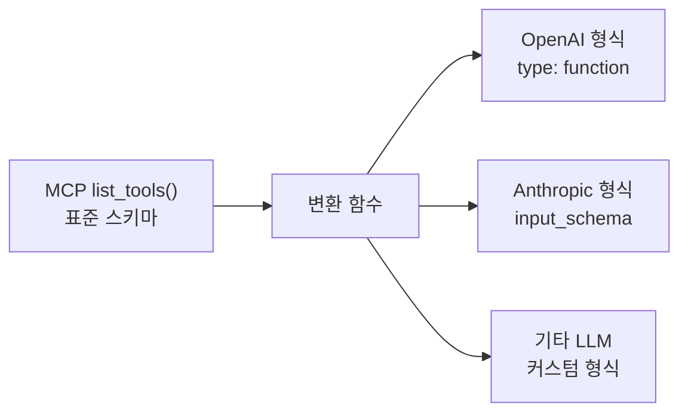
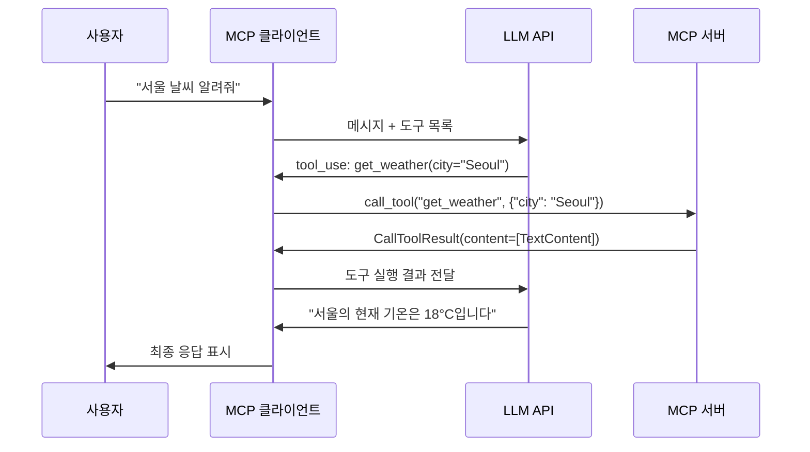
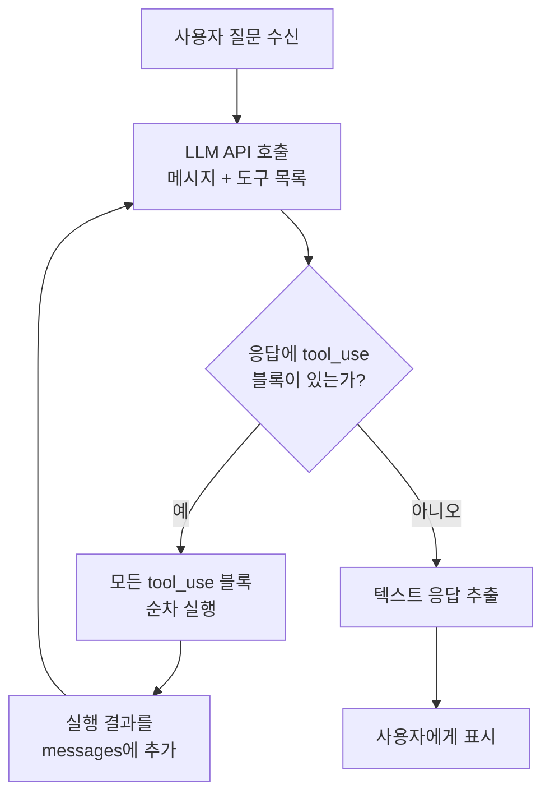
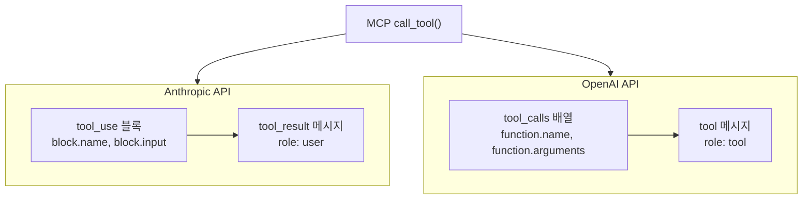

# MCP 도구와 LLM 연동

> MCP 서버의 도구 스키마를 LLM이 이해하는 형식으로 변환하고, 자율적 도구 호출이 가능한 대화 루프를 구축합니다

## 개요

이 섹션에서는 MCP 서버에서 가져온 도구 정보를 LLM API에 전달하여, LLM이 스스로 어떤 도구를 호출할지 판단하고 실행 결과를 활용해 답변을 생성하는 전체 흐름을 구축합니다.

**선수 지식**: [MCP 클라이언트 구축](10-ch10-mcp-클라이언트와-에이전트-통합/01-01-mcp-클라이언트-구축.md)에서 배운 `ClientSession`, `list_tools()`, `call_tool()` 사용법
**학습 목표**:
- MCP 도구 스키마를 OpenAI/Anthropic 도구 형식으로 변환할 수 있다
- LLM의 도구 호출 결과를 MCP `call_tool()`로 실행하는 브릿지를 구현할 수 있다
- 도구 호출을 포함한 멀티턴 대화 루프를 구축할 수 있다

## 왜 알아야 할까?

이전 섹션에서 MCP 클라이언트로 서버에 연결하고 도구를 수동으로 호출하는 방법을 배웠습니다. 하지만 사용자가 직접 "어떤 도구를 어떤 인자로 호출할지" 결정해야 했죠. 이건 마치 GPS 없이 지도만 보고 운전하는 것과 같습니다 — 목적지에 도달할 수는 있지만, 매 교차로마다 직접 판단해야 합니다.

LLM을 연동하면 상황이 완전히 달라집니다. LLM이 GPS 역할을 하면서 "지금 날씨 도구를 호출해야겠다", "검색 결과를 요약하겠다"고 자율적으로 판단하거든요. 이것이 바로 **에이전트의 핵심** — 도구를 자율적으로 선택하고 실행하는 능력입니다. Ch1에서 배운 [Tool Calling 메커니즘](01-ch1-llm-도구-호출의-이해/02-02-llm-tool-calling-메커니즘.md)이 MCP와 만나는 지점이기도 합니다.

## 핵심 개념

### 개념 1: MCP 도구 스키마와 LLM 도구 형식의 차이

> 💡 **비유**: MCP 도구 스키마는 '국제 여권'이고, LLM 도구 형식은 각 나라의 '입국 신고서'입니다. 여권에 담긴 정보는 동일하지만, 미국 입국 신고서와 일본 입국 신고서의 양식이 다르듯이, OpenAI와 Anthropic이 요구하는 도구 형식이 다릅니다. 변환 함수는 이 '번역관' 역할을 합니다.

MCP 서버가 `list_tools()`로 반환하는 도구 스키마는 JSON Schema 기반의 표준 형식입니다. 하지만 각 LLM 제공자(OpenAI, Anthropic)는 자체적인 도구 형식을 요구합니다. 핵심은 이 세 가지 필드를 올바르게 매핑하는 것입니다:

| MCP 스키마 필드 | OpenAI 형식 | Anthropic 형식 |
|----------------|-------------|---------------|
| `tool.name` | `function.name` | `name` |
| `tool.description` | `function.description` | `description` |
| `tool.inputSchema` | `function.parameters` | `input_schema` |

> 📊 **그림 1**: MCP 도구 스키마가 각 LLM API 형식으로 변환되는 흐름



MCP 도구 스키마의 실제 모습을 먼저 확인해보겠습니다:

```run:python
# MCP list_tools()가 반환하는 도구 스키마 구조 (시뮬레이션)
import json

mcp_tool_schema = {
    "name": "get_weather",
    "description": "Get current weather for a city",
    "inputSchema": {
        "type": "object",
        "properties": {
            "city": {"type": "string", "description": "City name"},
            "units": {"type": "string", "enum": ["celsius", "fahrenheit"]}
        },
        "required": ["city"]
    }
}

print("=== MCP 도구 스키마 ===")
print(json.dumps(mcp_tool_schema, indent=2))
```

```output
=== MCP 도구 스키마 ===
{
  "name": "get_weather",
  "description": "Get current weather for a city",
  "inputSchema": {
    "type": "object",
    "properties": {
      "city": {
        "type": "string",
        "description": "City name"
      },
      "units": {
        "type": "string",
        "enum": [
          "celsius",
          "fahrenheit"
        ]
      }
    },
    "required": [
      "city"
    ]
  }
}
```

이제 이 스키마를 각 LLM 형식으로 변환하는 함수를 만들어봅시다:

```python
from mcp.types import Tool as MCPTool

def mcp_to_openai_tools(mcp_tools: list[MCPTool]) -> list[dict]:
    """MCP 도구 스키마를 OpenAI 함수 호출 형식으로 변환"""
    return [
        {
            "type": "function",
            "function": {
                "name": tool.name,
                "description": tool.description or "No description",
                "parameters": tool.inputSchema  # JSON Schema 그대로 사용
            }
        }
        for tool in mcp_tools
    ]


def mcp_to_anthropic_tools(mcp_tools: list[MCPTool]) -> list[dict]:
    """MCP 도구 스키마를 Anthropic 도구 형식으로 변환"""
    return [
        {
            "name": tool.name,
            "description": tool.description or "No description",
            "input_schema": tool.inputSchema  # 키 이름만 다름!
        }
        for tool in mcp_tools
    ]
```

눈치채셨나요? `inputSchema`는 JSON Schema 표준을 따르기 때문에 OpenAI의 `parameters`와 Anthropic의 `input_schema` 모두에 **거의 그대로** 전달할 수 있습니다. MCP가 JSON Schema를 채택한 덕분에 변환이 놀라울 정도로 간단합니다.

> 🔥 **실무 팁**: OpenAI는 `parameters` 안에 `additionalProperties: false`를 추가하면 도구 호출이 더 엄격해집니다. Anthropic은 이 필드 없이도 스키마를 잘 따르는 편이에요.

### 개념 2: 도구 호출 결과 브릿지 — LLM 응답을 MCP 실행으로

> 💡 **비유**: LLM이 "이 레스토랑에 전화해서 예약해줘"라고 말하면(도구 호출 요청), 비서(브릿지)가 실제로 전화를 걸어(call_tool) 결과를 돌려주는 구조입니다. LLM은 전화기를 직접 들지 않습니다 — 요청과 결과만 오갑니다.

LLM이 도구 호출을 결정하면, 클라이언트는 그 결정을 MCP 서버의 `call_tool()`로 실행하고 결과를 다시 LLM에 전달해야 합니다. 이 **브릿지 패턴**이 MCP-LLM 연동의 핵심입니다.

> 📊 **그림 2**: 도구 호출 브릿지의 요청-응답 흐름



Anthropic API 기준으로 브릿지 함수를 구현하면 이렇습니다:

```python
import json
from mcp import ClientSession

async def execute_tool_bridge(
    session: ClientSession,
    tool_use_block,  # Anthropic의 ToolUseBlock
) -> dict:
    """LLM의 도구 호출 요청을 MCP 서버에서 실행하고 결과를 LLM 형식으로 반환"""
    tool_name = tool_use_block.name
    tool_args = tool_use_block.input  # dict 형태

    try:
        # MCP 서버에 도구 실행 요청
        result = await session.call_tool(tool_name, tool_args)

        # CallToolResult에서 텍스트 추출
        if result.content:
            text = result.content[0].text
        else:
            text = "도구가 결과를 반환하지 않았습니다."

        return {
            "type": "tool_result",
            "tool_use_id": tool_use_block.id,
            "content": text
        }
    except Exception as e:
        # 에러도 LLM에 전달하여 대처하게 함
        return {
            "type": "tool_result",
            "tool_use_id": tool_use_block.id,
            "content": f"도구 실행 오류: {str(e)}",
            "is_error": True
        }
```

여기서 주목할 점이 두 가지 있습니다:

1. **`result.content[0].text`**: MCP의 `CallToolResult`는 `content` 리스트 안에 `TextContent` 객체를 담습니다. `text` 속성으로 문자열을 꺼냅니다.
2. **`is_error: True`**: 에러가 발생해도 예외를 던지지 않고 LLM에 에러 정보를 전달합니다. LLM이 "이 도구가 실패했으니 다른 방법을 시도하겠습니다"라고 자율적으로 대처할 수 있거든요.

### 개념 3: 멀티턴 도구 호출 루프

> 💡 **비유**: 의사의 진찰 과정을 생각해보세요. 증상을 듣고(사용자 질문) → 혈압을 재고(도구 1) → 혈액 검사를 하고(도구 2) → 결과를 종합해 진단합니다(최종 응답). 한 번에 끝나지 않고 **필요한 만큼 검사를 반복**하는 것이 멀티턴 루프입니다.

LLM은 한 번의 응답에서 여러 도구를 호출하거나, 도구 결과를 보고 추가 도구를 호출할 수 있습니다. 이를 처리하려면 **루프 기반 처리**가 필요합니다.

> 📊 **그림 3**: 멀티턴 도구 호출 루프의 상태 흐름



이 루프의 핵심은 **stop_reason** (또는 응답 내 `tool_use` 블록의 유무)을 확인하는 것입니다. Anthropic API에서는 `response.stop_reason == "tool_use"`일 때 추가 도구 호출이 필요하다는 뜻이고, `"end_turn"`이면 최종 응답이 완성되었다는 의미입니다.

```python
from anthropic import Anthropic

async def process_query_loop(
    query: str,
    session: ClientSession,
    anthropic_client: Anthropic,
    tools: list[dict],  # Anthropic 형식 도구 목록
) -> str:
    """멀티턴 도구 호출을 지원하는 대화 처리 함수"""
    messages = [{"role": "user", "content": query}]

    while True:
        # LLM 호출
        response = anthropic_client.messages.create(
            model="claude-sonnet-4-20250514",
            max_tokens=1024,
            tools=tools,
            messages=messages,
        )

        # assistant 메시지를 대화 히스토리에 추가
        messages.append({
            "role": "assistant",
            "content": response.content
        })

        # 도구 호출이 없으면 루프 종료
        if response.stop_reason != "tool_use":
            break

        # 모든 tool_use 블록 실행
        tool_results = []
        for block in response.content:
            if block.type == "tool_use":
                result = await execute_tool_bridge(session, block)
                tool_results.append(result)

        # 도구 결과를 user 메시지로 추가
        messages.append({
            "role": "user",
            "content": tool_results
        })

    # 최종 텍스트 응답 추출
    final_text = ""
    for block in response.content:
        if hasattr(block, "text"):
            final_text += block.text

    return final_text
```

> ⚠️ **흔한 오해**: "LLM이 도구를 한 번만 호출한다"고 생각하기 쉽지만, 복잡한 질문에서는 도구를 3~4번 연속 호출하기도 합니다. 예를 들어 "서울과 도쿄 날씨를 비교해줘"라고 하면 날씨 도구를 두 번 호출한 뒤 비교 답변을 생성합니다. 루프 없이는 이런 시나리오를 처리할 수 없어요.

### 개념 4: OpenAI API 방식의 변환

Anthropic뿐 아니라 OpenAI API를 사용하는 경우도 많습니다. 두 API의 도구 호출 프로토콜은 구조적으로 유사하지만 필드명과 메시지 형식이 다릅니다.

> 📊 **그림 4**: Anthropic vs OpenAI 도구 호출 메시지 구조 비교



```python
from openai import OpenAI
import json

async def process_query_openai(
    query: str,
    session: ClientSession,
    openai_client: OpenAI,
    tools: list[dict],  # OpenAI 형식 도구 목록
) -> str:
    """OpenAI API 기반 멀티턴 도구 호출 루프"""
    messages = [{"role": "user", "content": query}]

    while True:
        response = openai_client.chat.completions.create(
            model="gpt-4o",
            messages=messages,
            tools=tools,
        )

        choice = response.choices[0]
        messages.append(choice.message)

        # 도구 호출이 없으면 종료
        if choice.finish_reason != "tool_calls":
            break

        # 각 도구 호출 실행
        for tool_call in choice.message.tool_calls:
            tool_name = tool_call.function.name
            tool_args = json.loads(tool_call.function.arguments)

            # MCP 서버에 실행 위임
            result = await session.call_tool(tool_name, tool_args)
            content = result.content[0].text if result.content else ""

            # OpenAI는 role: "tool" + tool_call_id 형식
            messages.append({
                "role": "tool",
                "tool_call_id": tool_call.id,
                "content": content,
            })

    return choice.message.content or ""
```

핵심 차이를 정리하면:

| 항목 | Anthropic | OpenAI |
|------|-----------|--------|
| 도구 호출 위치 | `response.content` 내 `tool_use` 블록 | `message.tool_calls` 배열 |
| 인자 형태 | `dict` (파싱 완료) | JSON 문자열 (`json.loads` 필요) |
| 결과 전달 | `role: "user"` + `tool_result` | `role: "tool"` + `tool_call_id` |
| 종료 판단 | `stop_reason == "end_turn"` | `finish_reason == "stop"` |

## 실습: 직접 해보기

Anthropic API와 MCP를 연동한 완전한 대화형 클라이언트를 구축합니다. 먼저 간단한 MCP 서버를 만들고, 이어서 LLM 연동 클라이언트를 작성합니다.

**Step 1: 테스트용 MCP 서버 (math_server.py)**

```python
# math_server.py — 수학 연산 MCP 서버
from mcp.server.fastmcp import FastMCP

mcp = FastMCP("Math Tools")


@mcp.tool()
def add(a: float, b: float) -> str:
    """두 수를 더합니다."""
    return str(a + b)


@mcp.tool()
def multiply(a: float, b: float) -> str:
    """두 수를 곱합니다."""
    return str(a * b)


@mcp.tool()
def factorial(n: int) -> str:
    """양의 정수의 팩토리얼을 계산합니다."""
    if n < 0:
        return "오류: 음수는 팩토리얼을 계산할 수 없습니다"
    result = 1
    for i in range(2, n + 1):
        result *= i
    return str(result)


if __name__ == "__main__":
    mcp.run(transport="stdio")
```

**Step 2: LLM 연동 MCP 클라이언트 (llm_client.py)**

```python
# llm_client.py — MCP 도구와 LLM을 연동하는 대화형 클라이언트
import asyncio
import sys
from contextlib import AsyncExitStack

from mcp import ClientSession, StdioServerParameters
from mcp.client.stdio import stdio_client
from anthropic import Anthropic
from dotenv import load_dotenv

load_dotenv()


class MCPLLMClient:
    """MCP 서버의 도구를 LLM과 연동하는 클라이언트"""

    def __init__(self):
        self.session: ClientSession | None = None
        self.exit_stack = AsyncExitStack()
        self.anthropic = Anthropic()
        self.tools: list[dict] = []  # Anthropic 형식 도구 캐시

    async def connect(self, server_script: str) -> None:
        """MCP 서버에 연결하고 도구 목록을 가져옵니다."""
        is_python = server_script.endswith(".py")
        command = "python" if is_python else "node"

        server_params = StdioServerParameters(
            command=command,
            args=[server_script],
            env=None,
        )

        # stdio 트랜스포트로 서버 연결
        transport = await self.exit_stack.enter_async_context(
            stdio_client(server_params)
        )
        read_stream, write_stream = transport

        # 세션 초기화
        self.session = await self.exit_stack.enter_async_context(
            ClientSession(read_stream, write_stream)
        )
        await self.session.initialize()

        # 도구 스키마를 Anthropic 형식으로 변환 & 캐싱
        response = await self.session.list_tools()
        self.tools = [
            {
                "name": tool.name,
                "description": tool.description or "",
                "input_schema": tool.inputSchema,
            }
            for tool in response.tools
        ]
        print(f"서버 연결 완료 — 사용 가능한 도구: {[t['name'] for t in self.tools]}")

    async def chat(self, user_message: str) -> str:
        """사용자 메시지를 처리하고 도구 호출을 포함한 응답을 생성합니다."""
        messages = [{"role": "user", "content": user_message}]

        # 멀티턴 도구 호출 루프
        while True:
            response = self.anthropic.messages.create(
                model="claude-sonnet-4-20250514",
                max_tokens=1024,
                tools=self.tools,
                messages=messages,
            )

            # assistant 응답을 히스토리에 기록
            messages.append({"role": "assistant", "content": response.content})

            # 도구 호출이 없으면 최종 응답 추출
            if response.stop_reason != "tool_use":
                break

            # 도구 호출 실행
            tool_results = []
            for block in response.content:
                if block.type == "tool_use":
                    print(f"  🔧 도구 호출: {block.name}({block.input})")

                    try:
                        result = await self.session.call_tool(
                            block.name, block.input
                        )
                        content = result.content[0].text if result.content else ""
                        print(f"  ✅ 결과: {content}")
                    except Exception as e:
                        content = f"오류: {e}"
                        print(f"  ❌ 오류: {e}")

                    tool_results.append({
                        "type": "tool_result",
                        "tool_use_id": block.id,
                        "content": content,
                    })

            messages.append({"role": "user", "content": tool_results})

        # 최종 텍스트 응답 조합
        return "".join(
            block.text for block in response.content
            if hasattr(block, "text")
        )

    async def interactive_loop(self) -> None:
        """대화형 루프를 실행합니다."""
        print("\nMCP + LLM 클라이언트 시작! ('quit'으로 종료)")
        while True:
            try:
                query = input("\n질문: ").strip()
                if query.lower() in ("quit", "exit", "q"):
                    break
                answer = await self.chat(query)
                print(f"\n답변: {answer}")
            except KeyboardInterrupt:
                break
            except Exception as e:
                print(f"\n오류 발생: {e}")

    async def cleanup(self) -> None:
        """리소스를 정리합니다."""
        await self.exit_stack.aclose()


async def main() -> None:
    if len(sys.argv) < 2:
        print("사용법: python llm_client.py <서버스크립트.py>")
        sys.exit(1)

    client = MCPLLMClient()
    try:
        await client.connect(sys.argv[1])
        await client.interactive_loop()
    finally:
        await client.cleanup()


if __name__ == "__main__":
    asyncio.run(main())
```

**실행 방법:**

```terminal
$ python llm_client.py math_server.py

서버 연결 완료 — 사용 가능한 도구: ['add', 'multiply', 'factorial']

MCP + LLM 클라이언트 시작! ('quit'으로 종료)

질문: 7 팩토리얼에 3을 더하면?
  🔧 도구 호출: factorial({"n": 7})
  ✅ 결과: 5040
  🔧 도구 호출: add({"a": 5040, "b": 3})
  ✅ 결과: 5043

답변: 7! + 3 = 5043입니다. 7의 팩토리얼은 5040이고, 여기에 3을 더하면 5043이 됩니다.
```

LLM이 질문을 분석하여 `factorial`을 먼저 호출하고, 그 결과를 `add`에 전달하는 두 단계 추론을 자율적으로 수행한 것을 확인할 수 있습니다.

## 더 깊이 알아보기

### MCP 클라이언트 표준화의 여정

MCP가 2024년 11월에 처음 공개되었을 때, 도구 스키마를 LLM 형식으로 변환하는 표준적인 방법이 없었습니다. 각 개발자가 자체 변환 함수를 작성해야 했죠. 2025년에 GitHub에 [공식 어댑터 함수 제안](https://github.com/modelcontextprotocol/python-sdk/issues/235)이 올라왔는데, "OpenAI, Anthropic, Google 등 주요 LLM 제공자별 변환 유틸리티를 SDK에 포함하자"는 내용이었습니다.

흥미로운 것은, 이 제안이 나오기 전에 이미 커뮤니티에서 `liteLLM`의 `load_mcp_tools(format="openai")`나 `mcp-use` 같은 서드파티 솔루션이 등장했다는 점입니다. 사실 MCP가 JSON Schema를 채택한 덕분에 변환 자체는 단순하지만, 각 LLM API의 미묘한 차이(OpenAI의 `strict` 모드, Anthropic의 `cache_control` 등)를 완벽히 처리하려면 공식 지원이 필요합니다.

2025년 12월에 Anthropic은 MCP를 Linux Foundation에 기증했고, 이는 프로토콜의 거버넌스가 단일 기업에서 오픈 커뮤니티로 이전되었음을 의미합니다. OpenAI가 2025년 3월에 MCP를 채택하고, Google DeepMind도 뒤따르면서, MCP는 사실상 AI 도구 통합의 표준이 되었습니다.

> 💡 **알고 계셨나요?**: MCP의 도구 스키마가 JSON Schema를 기반으로 한 것은 우연이 아닙니다. OpenAPI(Swagger)가 REST API를 표준화한 것처럼, MCP는 AI 도구 인터페이스를 표준화하려는 명확한 의도로 설계되었습니다. 실제로 MCP 스펙 문서에는 "OpenAPI for AI"라는 비유가 자주 등장합니다.

## 흔한 오해와 팁

> ⚠️ **흔한 오해**: "MCP 도구 스키마를 LLM에 전달하면 자동으로 도구를 실행한다" — 아닙니다! LLM은 어떤 도구를 어떤 인자로 호출할지 **결정**만 합니다. 실제 실행은 클라이언트가 `call_tool()`을 통해 MCP 서버에 위임해야 합니다. LLM은 도구에 직접 접근하지 않습니다.

> 🔥 **실무 팁**: 도구 목록을 매 턴마다 `list_tools()`로 가져오는 것은 비효율적입니다. 연결 시 한 번만 가져와서 캐싱하세요. 단, 서버가 동적으로 도구를 추가/제거하는 경우에는 `tools/list_changed` 알림을 구독하여 캐시를 갱신해야 합니다.

> 🔥 **실무 팁**: Anthropic API에서 도구 호출 결과를 전달할 때 `is_error: True`를 설정하면, LLM이 에러를 인지하고 다른 전략을 시도합니다. 에러를 무시하거나 빈 문자열로 전달하면 LLM이 혼란스러워합니다.

> ⚠️ **흔한 오해**: "OpenAI와 Anthropic의 도구 형식이 완전히 다르다" — 실제로는 래핑 구조만 다를 뿐, 핵심 정보(이름, 설명, 스키마)는 동일합니다. MCP가 JSON Schema를 선택한 이유도 이 호환성 때문입니다.

## 핵심 정리

| 개념 | 설명 |
|------|------|
| 스키마 변환 | MCP `inputSchema`(JSON Schema)를 각 LLM API 형식으로 매핑. 래핑 구조만 다르고 내용은 동일 |
| 도구 브릿지 | LLM의 도구 호출 결정 → `call_tool()` 실행 → 결과를 LLM 메시지 형식으로 반환 |
| 멀티턴 루프 | `stop_reason`을 확인하며 도구 호출이 없을 때까지 반복. 복수 도구 순차 호출 지원 |
| 에러 전달 | 도구 실행 오류를 LLM에 전달하여 자율적 대처 유도 (`is_error: True`) |
| 도구 캐싱 | 연결 시 `list_tools()` 한 번 호출 후 캐싱. `tools/list_changed` 알림으로 갱신 |

## 다음 섹션 미리보기

이번 섹션에서는 단일 MCP 서버의 도구를 LLM에 연동하는 패턴을 배웠습니다. 다음 섹션 [LangGraph MCP 통합](10-ch10-mcp-클라이언트와-에이전트-통합/03-03-langgraph-mcp-통합.md)에서는 이 연동을 LangGraph StateGraph 안에 통합합니다. MCP 도구를 LangGraph의 `ToolNode`로 감싸고, 체크포인트와 조건 분기를 활용해 더 강력한 에이전트를 만들어봅니다.

## 참고 자료

- [Build an MCP Client — MCP 공식 문서](https://modelcontextprotocol.io/docs/develop/build-client) - MCP 클라이언트 구축의 공식 튜토리얼. Anthropic API 기반 전체 코드 포함
- [Build a Python MCP Client — Real Python](https://realpython.com/python-mcp-client/) - OpenAI API 기반 MCP 클라이언트 구현을 상세히 다루는 튜토리얼
- [MCP Python SDK — GitHub](https://github.com/modelcontextprotocol/python-sdk) - ClientSession, list_tools, call_tool 등 클라이언트 API 레퍼런스
- [MCP Specification 2025-11-25](https://modelcontextprotocol.io/specification/2025-11-25) - 도구 스키마 표준, CallToolResult 구조 등 프로토콜 상세 스펙
- [Official Adapter Functions for LLM Providers — GitHub Issue #235](https://github.com/modelcontextprotocol/python-sdk/issues/235) - MCP SDK에 LLM 제공자별 변환 유틸리티 추가 제안과 커뮤니티 논의

---
### 🔗 Related Sessions
- [tool calling](01-ch1-llm-도구-호출의-이해/02-02-llm-tool-calling-메커니즘.md) (prerequisite)
