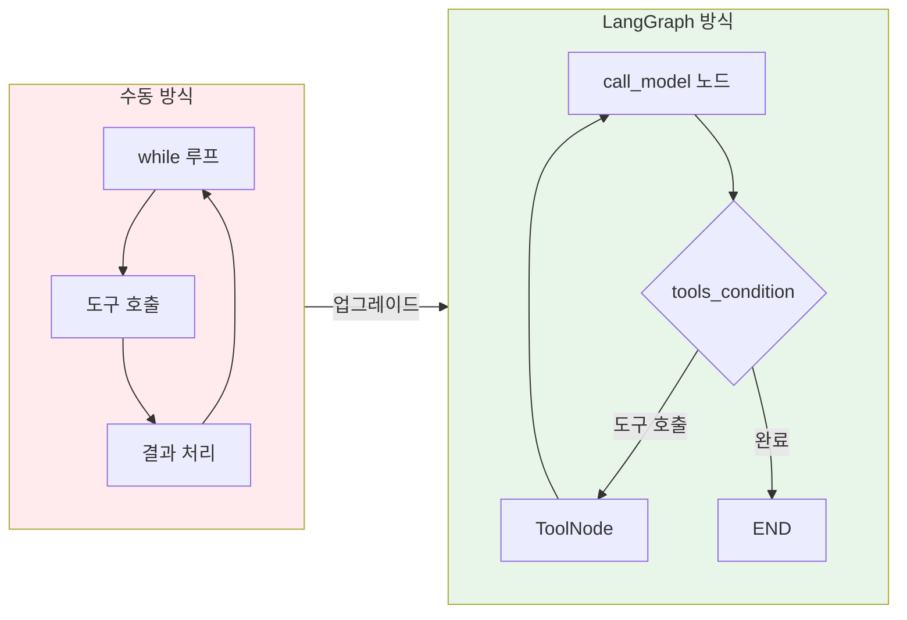
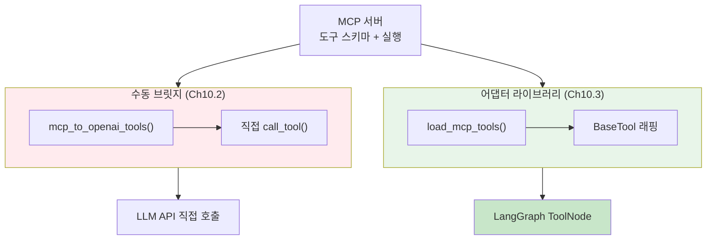
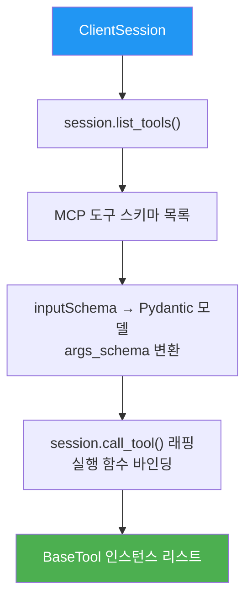
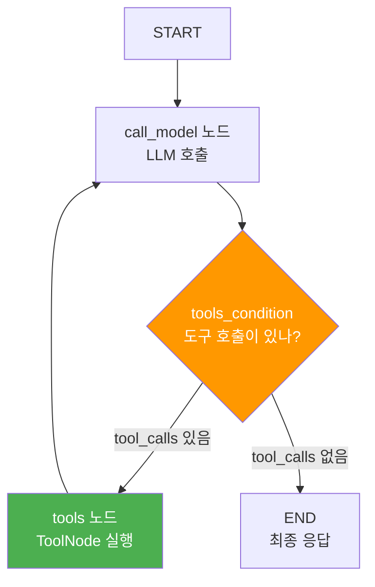
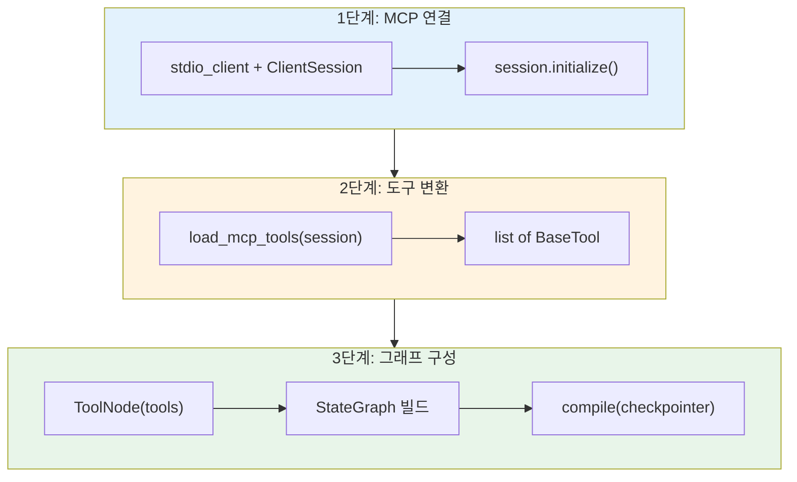
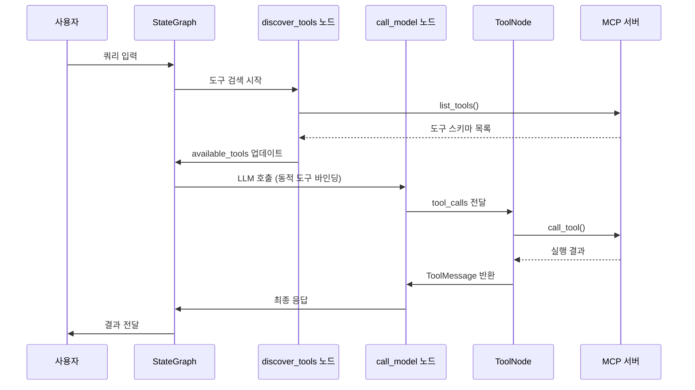

# LangGraph + MCP 통합

> MCP 도구를 LangGraph StateGraph의 ToolNode에 연결하여 체크포인트, 조건 분기가 가능한 그래프 기반 MCP 에이전트를 구축합니다

## 개요

이 섹션에서는 **단일 MCP 서버**의 도구를 LangGraph의 StateGraph에 통합하는 방법을 배웁니다. 앞선 두 섹션에서 MCP 클라이언트를 직접 구축하고 LLM과 연동하는 패턴을 익혔다면, 이제는 `langchain-mcp-adapters` 라이브러리의 `load_mcp_tools()`와 LangGraph의 `ToolNode`를 활용하여 **체크포인트, 조건 분기, 메모리**가 모두 갖춰진 프로덕션급 에이전트를 만들어 보겠습니다.

**선수 지식**:
- [MCP 클라이언트 구축](10-ch10-mcp-클라이언트와-에이전트-통합/01-01-mcp-클라이언트-구축.md)에서 배운 `ClientSession`, `stdio_client` 사용법
- [MCP 도구와 LLM 연동](10-ch10-mcp-클라이언트와-에이전트-통합/02-02-mcp-도구와-llm-연동.md)에서 배운 스키마 변환과 멀티턴 도구 루프
- [LangGraph StateGraph 기초](04-ch4-langgraph-stategraph-기초/01-01-langgraph-아키텍처-개관.md)에서 배운 노드, 엣지, 상태 스키마

**학습 목표**:
- `langchain-mcp-adapters`의 `load_mcp_tools()`로 MCP 도구를 LangChain 도구로 변환할 수 있다
- `ToolNode`와 `tools_condition`으로 도구 실행 노드를 구성할 수 있다
- 단일 MCP 서버가 포함된 완전한 StateGraph 에이전트를 구축할 수 있다
- 동적 도구 로딩으로 런타임에 도구 목록을 갱신할 수 있다

## 왜 알아야 할까?

앞선 세션에서 MCP 클라이언트를 직접 구현하고 LLM과 연동하는 패턴을 만들었죠. 작동은 하지만 한 가지 문제가 있습니다 — `while` 루프 기반의 순차 실행이라 **체크포인트, 조건 분기, 병렬 실행, Human-in-the-Loop** 같은 고급 기능을 추가하려면 처음부터 다시 만들어야 합니다.

LangGraph의 StateGraph는 바로 이 문제를 해결합니다. 노드와 엣지로 에이전트의 실행 흐름을 선언적으로 정의하면, 체크포인트는 `compile(checkpointer=...)`한 줄로, 사람 승인은 `interrupt_before` 한 줄로 추가됩니다. MCP 도구를 이 그래프에 꽂기만 하면 **MCP의 표준화된 도구 생태계 + LangGraph의 워크플로우 엔진**이라는 최강 조합이 완성되는 거죠.

> 📊 **그림 1**: 수동 루프 vs LangGraph 통합의 구조 비교



실제로 프로덕션 환경에서는 "MCP 서버에서 도구를 가져와서 → LangGraph 에이전트에서 실행"하는 패턴이 표준으로 자리잡고 있습니다. 이 세션에서 단일 서버 통합의 핵심 패턴을 완전히 익혀보겠습니다.

## 핵심 개념

### 개념 1: 수동 브릿지에서 어댑터 라이브러리로 — 왜 전환하는가?

> 💡 **비유**: USB 충전기를 떠올려 보세요. 초기에는 폰마다 전용 케이블이 달랐죠(수동 브릿지). 하지만 USB-C라는 표준 어댑터가 등장하면서 하나의 케이블로 모든 기기를 충전할 수 있게 되었습니다. `langchain-mcp-adapters`는 MCP-LangChain 세계의 USB-C 같은 존재입니다.

[이전 세션](10-ch10-mcp-클라이언트와-에이전트-통합/02-02-mcp-도구와-llm-연동.md)에서 우리는 `mcp_to_openai_tools()` 같은 변환 함수를 직접 작성했습니다. 이 **수동 브릿지** 접근법은 MCP의 내부 구조를 이해하는 데 훌륭하지만, 프로덕션에서는 `langchain-mcp-adapters`라는 **어댑터 라이브러리**를 사용하는 게 표준입니다. 두 접근법의 핵심 차이를 정리하면:

| 항목 | 수동 브릿지 (Ch10.2) | 어댑터 라이브러리 (Ch10.3) |
|------|---------------------|--------------------------|
| **스키마 변환** | `mcp_to_openai_tools()` 직접 구현 | `load_mcp_tools()`가 자동 처리 |
| **지원 포맷** | 직접 작성한 포맷만 (OpenAI/Anthropic) | OpenAI, Anthropic, Google 등 주요 포맷 모두 지원 |
| **엣지 케이스** | 중첩 객체, optional 필드 등 직접 처리 | 라이브러리가 검증된 로직으로 처리 |
| **도구 실행** | `session.call_tool()` 직접 호출 | `BaseTool.invoke()`로 래핑, LangGraph 호환 |
| **유지보수** | MCP 스펙 변경 시 직접 수정 | 라이브러리 업데이트로 자동 대응 |
| **적합한 상황** | 학습, 커스텀 프레임워크, 비LangChain 환경 | LangChain/LangGraph 기반 프로덕션 |

> 📊 **그림 2**: 수동 브릿지 vs 어댑터 라이브러리의 위치



**언제 어떤 접근법을 쓸까?**

- **수동 브릿지를 쓸 때**: LangChain/LangGraph를 사용하지 않는 프로젝트, MCP 스키마를 직접 제어해야 하는 특수한 경우, 또는 MCP 내부 동작을 학습할 때
- **어댑터 라이브러리를 쓸 때**: LangGraph 기반 에이전트를 구축하는 대부분의 경우. 스키마 변환의 엣지 케이스를 걱정하지 않아도 되고, `ToolNode`와의 통합이 즉시 가능

이 세션부터는 어댑터 라이브러리를 사용합니다. 수동 브릿지에서 쌓은 이해 — `inputSchema`가 어떻게 변환되고, `call_tool()`이 어떻게 호출되는지 — 가 있으니, 어댑터가 내부에서 무슨 일을 하는지 투명하게 이해할 수 있죠.

### 개념 2: load_mcp_tools — 한 줄 변환의 내부

> 💡 **비유**: 해외여행에서 전원 어댑터를 생각해 보세요. 한국 플러그(MCP 도구)를 미국 콘센트(LangChain/LangGraph)에 꽂으려면 변환 어댑터가 필요합니다. `load_mcp_tools()`가 바로 그 어댑터의 핵심 함수입니다.

핵심 함수 `load_mcp_tools()`는 MCP의 `ClientSession`을 받아서 LangChain `BaseTool` 리스트로 변환해 줍니다:

```python
# 설치
# pip install langchain-mcp-adapters langgraph langchain-openai

from mcp import ClientSession, StdioServerParameters
from mcp.client.stdio import stdio_client
from langchain_mcp_adapters.tools import load_mcp_tools

server_params = StdioServerParameters(
    command="python",
    args=["math_server.py"],
)

async with stdio_client(server_params) as (read, write):
    async with ClientSession(read, write) as session:
        await session.initialize()
        
        # MCP 도구 → LangChain 도구로 자동 변환
        tools = await load_mcp_tools(session)
        
        # 이제 tools는 list[BaseTool] — LangGraph에서 바로 사용 가능
        for tool in tools:
            print(f"{tool.name}: {tool.description}")
```

내부적으로 `load_mcp_tools()`는 다음을 수행합니다:

> 📊 **그림 3**: load_mcp_tools 내부 변환 과정



1. `session.list_tools()`로 MCP 도구 스키마를 가져옴
2. 각 도구의 `inputSchema`를 LangChain의 `args_schema`(Pydantic 모델)로 변환
3. `session.call_tool()`을 래핑한 실행 함수를 바인딩
4. `BaseTool` 인스턴스 리스트를 반환

이전 세션에서 우리가 수동으로 한 작업을 한 줄로 해결하는 거죠!

### 개념 3: ToolNode와 tools_condition — LangGraph의 도구 실행 엔진

> 💡 **비유**: 레스토랑의 주문 시스템을 상상해 보세요. 웨이터(LLM)가 주문서를 작성하면, 주방(ToolNode)에서 요리를 만들고, 매니저(tools_condition)가 "음식이 다 나왔나?"를 확인해서 서빙하거나 추가 주문을 받습니다.

LangGraph에서 도구를 실행하는 핵심 컴포넌트는 두 가지입니다:

**ToolNode** — 도구 실행 담당 노드:
- LLM이 생성한 `tool_calls`를 받아서 실제 도구를 실행
- **복수 도구 호출이 있으면 병렬로 실행** (이건 수동 루프에서는 구현하기 까다로운 부분!)
- 실행 결과를 `ToolMessage`로 변환하여 상태에 추가

**tools_condition** — 라우팅 함수:
- LLM 응답에 `tool_calls`가 있으면 → `"tools"` 노드로 라우팅
- 없으면 → `END`로 라우팅 (최종 응답)

> 📊 **그림 4**: ToolNode와 tools_condition의 실행 흐름



이 패턴이 바로 LangGraph 에이전트의 표준 구조입니다. [ReAct 에이전트](02-ch2-react-패턴과-에이전트-루프/04-04-langgraph의-create-react-agent.md)에서 배운 `create_react_agent`도 내부적으로 이 구조를 사용하고 있죠:

```python
from langgraph.graph import StateGraph, MessagesState, START, END
from langgraph.prebuilt import ToolNode, tools_condition

# tools = MCP에서 가져온 LangChain 도구 리스트

# 1. ToolNode 생성 — 도구 실행을 담당하는 노드
tool_node = ToolNode(tools)

# 2. LLM에 도구 스키마를 바인딩
model_with_tools = model.bind_tools(tools)

# 3. 모델 호출 노드
def call_model(state: MessagesState):
    response = model_with_tools.invoke(state["messages"])
    return {"messages": [response]}

# 4. 그래프 구성
builder = StateGraph(MessagesState)
builder.add_node("call_model", call_model)
builder.add_node("tools", tool_node)           # 도구 실행 노드
builder.add_edge(START, "call_model")
builder.add_conditional_edges(                  # 조건 분기
    "call_model", 
    tools_condition                             # 자동 라우팅
)
builder.add_edge("tools", "call_model")         # 도구 → 다시 모델

graph = builder.compile()
```

> ⚠️ **흔한 오해**: `ToolNode`가 도구를 "선택"한다고 생각하는 분이 있는데, 아닙니다! **도구 선택은 LLM**이 하고, `ToolNode`는 LLM이 요청한 도구를 **실행만** 합니다. "어떤 도구를 쓸까?"의 지능은 LLM에, "도구를 실행하고 결과를 돌려주는" 기계적 작업은 ToolNode에 분리된 거죠.

### 개념 4: 완전한 단일 서버 통합 패턴 — 세 가지 빌딩 블록 조립

> 💡 **비유**: 레고 세트를 생각해 보세요. 지금까지 개별 블록(MCP 세션, load_mcp_tools, ToolNode, tools_condition)을 하나씩 살펴봤으니, 이제 이 블록들을 조립해서 완성된 모델을 만들 차례입니다.

단일 MCP 서버를 LangGraph에 통합하는 완전한 패턴은 세 단계로 이루어집니다:

> 📊 **그림 5**: 단일 서버 통합의 세 단계



핵심은 **MCP 세션의 수명 주기** 안에서 그래프를 실행해야 한다는 점입니다. `async with` 블록이 닫히면 MCP 연결도 끊어지거든요:

```python
from mcp import ClientSession, StdioServerParameters
from mcp.client.stdio import stdio_client
from langchain_mcp_adapters.tools import load_mcp_tools
from langgraph.graph import StateGraph, MessagesState, START, END
from langgraph.prebuilt import ToolNode, tools_condition
from langgraph.checkpoint.memory import MemorySaver
from langchain_openai import ChatOpenAI

model = ChatOpenAI(model="gpt-4o", temperature=0)

async def run_single_server_agent():
    server_params = StdioServerParameters(
        command="python", args=["task_server.py"]
    )
    
    # ── MCP 세션 수명 주기 안에서 모든 작업 수행 ──
    async with stdio_client(server_params) as (read, write):
        async with ClientSession(read, write) as session:
            await session.initialize()
            
            # 1단계 → 2단계: MCP 도구를 LangChain 도구로 변환
            tools = await load_mcp_tools(session)
            
            # 3단계: 그래프 구성 + 컴파일
            model_with_tools = model.bind_tools(tools)
            
            def call_model(state: MessagesState):
                return {"messages": [model_with_tools.invoke(state["messages"])]}
            
            builder = StateGraph(MessagesState)
            builder.add_node("call_model", call_model)
            builder.add_node("tools", ToolNode(tools))
            builder.add_edge(START, "call_model")
            builder.add_conditional_edges("call_model", tools_condition)
            builder.add_edge("tools", "call_model")
            
            graph = builder.compile(checkpointer=MemorySaver())
            
            # 이 스코프 안에서 graph.ainvoke() 실행
            result = await graph.ainvoke(
                {"messages": [("user", "2 + 3을 계산해줘")]},
                config={"configurable": {"thread_id": "s1"}},
            )
            print(result["messages"][-1].content)
```

이 패턴이 단일 MCP 서버 통합의 **정석**입니다. 한 가지 주의할 점 — `async with` 블록 밖에서 `graph.ainvoke()`를 호출하면 MCP 세션이 이미 닫혀 있어서 도구 실행이 실패합니다. MCP 세션과 그래프 실행의 수명 주기를 반드시 맞춰야 해요.

### 개념 5: 동적 도구 로딩 — 런타임에 도구 갱신하기

> 💡 **비유**: 공구함을 작업 현장에 가져갈 때, 미리 모든 공구를 넣어가는 게 아니라 작업 내용에 따라 필요한 공구를 꺼내 씁니다. 동적 도구 로딩도 마찬가지로, 에이전트가 실행 중에 필요한 도구를 그때그때 불러옵니다.

기본 패턴에서는 그래프를 컴파일하기 전에 도구를 고정합니다. 하지만 실전에서는 MCP 서버의 도구가 업데이트되거나, 사용자 권한에 따라 다른 도구를 노출해야 할 때가 있죠. 이럴 때 **동적 도구 로딩** 패턴을 사용합니다:

```python
from langgraph.graph import StateGraph, MessagesState, START, END
from langgraph.prebuilt import tools_condition
from langchain_mcp_adapters.tools import load_mcp_tools

class DynamicMCPState(MessagesState):
    """동적 도구 로딩을 위한 확장 상태"""
    available_tools: list[str]  # 현재 사용 가능한 도구 이름 목록


async def discover_tools_node(state: DynamicMCPState):
    """MCP 서버에서 도구를 동적으로 검색하는 노드"""
    # session은 외부 스코프에서 주입 (MCP 세션 수명 주기 내)
    tools = await load_mcp_tools(session)
    tool_names = [t.name for t in tools]
    return {"available_tools": tool_names}


async def call_model_dynamic(state: DynamicMCPState):
    """사용 가능한 도구만 바인딩하여 LLM 호출"""
    all_tools = await load_mcp_tools(session)
    active_tools = [
        t for t in all_tools 
        if t.name in state["available_tools"]
    ]
    
    model_with_tools = model.bind_tools(active_tools)
    response = model_with_tools.invoke(state["messages"])
    return {"messages": [response]}
```

> 📊 **그림 6**: 동적 도구 로딩이 포함된 에이전트 흐름



이 패턴은 특히 **장시간 실행 에이전트**에서 유용합니다. MCP 서버가 새로운 도구를 추가하거나 기존 도구의 스키마를 변경해도, 에이전트가 매 턴마다 최신 도구 목록을 가져와서 대응할 수 있거든요.

## 실습: 직접 해보기

완전한 LangGraph + MCP 단일 서버 통합 에이전트를 구축해 봅시다. 먼저 MCP 서버를 하나 만들고, `load_mcp_tools()`와 `ToolNode`로 StateGraph에 연결합니다.

### Step 1: MCP 서버 준비

```python
# task_server.py — 할 일 관리 MCP 서버
from fastmcp import FastMCP

mcp = FastMCP("TaskManager")

# 인메모리 할 일 저장소
tasks: dict[int, dict] = {}
next_id: int = 1


@mcp.tool()
def add_task(title: str, priority: str = "medium") -> str:
    """할 일을 추가합니다. priority는 low, medium, high 중 하나."""
    global next_id
    tasks[next_id] = {
        "id": next_id,
        "title": title,
        "priority": priority,
        "done": False
    }
    result = f"할 일 #{next_id} '{title}' (우선순위: {priority}) 추가됨"
    next_id += 1
    return result


@mcp.tool()
def list_tasks() -> str:
    """현재 등록된 모든 할 일을 조회합니다."""
    if not tasks:
        return "등록된 할 일이 없습니다."
    lines = []
    for t in tasks.values():
        status = "done" if t["done"] else "todo"
        lines.append(f"[{status}] #{t['id']} {t['title']} ({t['priority']})")
    return "\n".join(lines)


@mcp.tool()
def complete_task(task_id: int) -> str:
    """할 일을 완료 처리합니다."""
    if task_id not in tasks:
        return f"오류: #{task_id} 할 일을 찾을 수 없습니다."
    tasks[task_id]["done"] = True
    return f"할 일 #{task_id} '{tasks[task_id]['title']}' 완료 처리됨"


if __name__ == "__main__":
    mcp.run(transport="stdio")
```

### Step 2: LangGraph + MCP 단일 서버 통합 에이전트

```python
# langgraph_mcp_agent.py — 단일 서버 통합 에이전트
import asyncio
from mcp import ClientSession, StdioServerParameters
from mcp.client.stdio import stdio_client
from langchain_mcp_adapters.tools import load_mcp_tools
from langgraph.graph import StateGraph, MessagesState, START, END
from langgraph.prebuilt import ToolNode, tools_condition
from langgraph.checkpoint.memory import MemorySaver
from langchain_openai import ChatOpenAI

# ── 1. LLM 초기화 ──
model = ChatOpenAI(model="gpt-4o", temperature=0)


async def build_and_run():
    # ── 2. MCP 서버 연결 (단일 서버, stdio 전송) ──
    server_params = StdioServerParameters(
        command="python",
        args=["task_server.py"],
    )
    
    async with stdio_client(server_params) as (read, write):
        async with ClientSession(read, write) as session:
            await session.initialize()
            
            # ── 3. MCP 도구 → LangChain 도구 변환 ──
            tools = await load_mcp_tools(session)
            
            # 변환된 도구 확인
            for tool in tools:
                print(f"도구: {tool.name} — {tool.description}")
            
            # ── 4. 그래프 노드 정의 ──
            model_with_tools = model.bind_tools(tools)
            
            def call_model(state: MessagesState):
                """LLM을 호출하여 응답 또는 도구 호출을 생성"""
                response = model_with_tools.invoke(state["messages"])
                return {"messages": [response]}
            
            # ── 5. StateGraph 구성 ──
            builder = StateGraph(MessagesState)
            
            # 노드 추가
            builder.add_node("call_model", call_model)
            builder.add_node("tools", ToolNode(tools))
            
            # 엣지 연결
            builder.add_edge(START, "call_model")
            builder.add_conditional_edges("call_model", tools_condition)
            builder.add_edge("tools", "call_model")
            
            # ── 6. 체크포인터와 함께 컴파일 ──
            memory = MemorySaver()
            graph = builder.compile(checkpointer=memory)
            
            # ── 7. 대화 실행 ──
            config = {"configurable": {"thread_id": "session-1"}}
            
            # 첫 번째 요청: 할 일 추가
            result = await graph.ainvoke(
                {"messages": [("user", "보고서 작성을 높은 우선순위로 추가해줘")]},
                config=config,
            )
            print(result["messages"][-1].content)
            
            # 두 번째 요청: 추가 + 조회
            result = await graph.ainvoke(
                {"messages": [("user", "코드 리뷰도 추가하고, 전체 목록을 보여줘")]},
                config=config,
            )
            print(result["messages"][-1].content)
            
            # 세 번째 요청: 완료 처리
            result = await graph.ainvoke(
                {"messages": [("user", "보고서 작성을 완료 처리해줘")]},
                config=config,
            )
            print(result["messages"][-1].content)


# 실행
asyncio.run(build_and_run())
```

```run:python
# 실행 흐름 시뮬레이션 (실제로는 asyncio.run(build_and_run())으로 실행)
steps = [
    "도구: add_task — 할 일을 추가합니다.",
    "도구: list_tasks — 현재 등록된 모든 할 일을 조회합니다.",
    "도구: complete_task — 할 일을 완료 처리합니다.",
    "",
    "[요청 1] 보고서 작성을 높은 우선순위로 추가해줘",
    "→ add_task(title='보고서 작성', priority='high')",
    "→ 할 일 #1 '보고서 작성' (우선순위: high) 추가됨",
    "",
    "[요청 2] 코드 리뷰도 추가하고, 전체 목록을 보여줘",
    "→ add_task(title='코드 리뷰', priority='medium')",
    "→ list_tasks()",
    "→ [todo] #1 보고서 작성 (high)",
    "  [todo] #2 코드 리뷰 (medium)",
    "",
    "[요청 3] 보고서 작성을 완료 처리해줘",
    "→ complete_task(task_id=1)",
    "→ 할 일 #1 '보고서 작성' 완료 처리됨",
]
for line in steps:
    print(line)
```

```output
도구: add_task — 할 일을 추가합니다.
도구: list_tasks — 현재 등록된 모든 할 일을 조회합니다.
도구: complete_task — 할 일을 완료 처리합니다.

[요청 1] 보고서 작성을 높은 우선순위로 추가해줘
→ add_task(title='보고서 작성', priority='high')
→ 할 일 #1 '보고서 작성' (우선순위: high) 추가됨

[요청 2] 코드 리뷰도 추가하고, 전체 목록을 보여줘
→ add_task(title='코드 리뷰', priority='medium')
→ list_tasks()
→ [todo] #1 보고서 작성 (high)
  [todo] #2 코드 리뷰 (medium)

[요청 3] 보고서 작성을 완료 처리해줘
→ complete_task(task_id=1)
→ 할 일 #1 '보고서 작성' 완료 처리됨
```

### Step 3: 체크포인트 활용 — 대화 이어가기

위 코드에서 `MemorySaver`와 `thread_id`를 사용했기 때문에, 세 번의 요청이 모두 같은 대화 스레드에서 이어집니다. LLM은 이전 대화 맥락을 기억하고, "보고서 작성"이 어떤 할 일인지 체크포인트에서 복원할 수 있습니다.

이것이 수동 `while` 루프 대비 LangGraph 통합의 핵심 이점입니다:

```python
# 수동 방식 vs LangGraph 방식 비교

# 수동 방식: 체크포인트 직접 구현 필요
conversation_history = []
while True:
    user_input = input("> ")
    conversation_history.append({"role": "user", "content": user_input})
    # ... 도구 호출 루프 ...
    # 체크포인트? 직접 저장/복원 로직 작성해야 함
    # 조건 분기? if-else 중첩 지옥
    # 병렬 도구 실행? threading 직접 관리

# LangGraph 방식: 선언적 구성
graph = builder.compile(
    checkpointer=MemorySaver(),     # 체크포인트 한 줄
    interrupt_before=["tools"],      # HITL 한 줄 (7장에서 배움)
)
# 조건 분기 → add_conditional_edges
# 병렬 도구 → ToolNode가 자동 처리
```

### Step 4: 에러 핸들링 추가

MCP 서버와의 통신은 언제든 실패할 수 있습니다. 에러 핸들링을 추가한 버전:

```python
from langchain_core.messages import ToolMessage


def call_model_with_retry(state: MessagesState):
    """에러 핸들링이 포함된 모델 호출 노드"""
    messages = state["messages"]
    
    # 마지막 ToolMessage가 에러인지 확인
    last_msg = messages[-1] if messages else None
    if isinstance(last_msg, ToolMessage) and "오류:" in last_msg.content:
        # 에러 메시지를 LLM에게 전달 → LLM이 대안을 찾도록 유도
        error_context = (
            f"이전 도구 호출이 실패했습니다: {last_msg.content}\n"
            "다른 방법을 시도하거나, 사용자에게 상황을 설명해주세요."
        )
        messages = list(messages) + [
            {"role": "system", "content": error_context}
        ]
    
    response = model_with_tools.invoke(messages)
    return {"messages": [response]}
```

> 🔥 **실무 팁**: MCP 서버의 `call_tool()` 결과에는 `isError` 필드가 있습니다. `langchain-mcp-adapters`는 이를 자동으로 처리하여 `ToolMessage`에 에러 내용을 담아주므로, LLM이 에러를 보고 스스로 대처할 수 있습니다. 대부분의 경우 위처럼 별도 에러 핸들링 없이도 LLM이 알아서 재시도하거나 대안을 제시합니다.

## 더 깊이 알아보기

### langchain-mcp-adapters의 탄생 배경

MCP가 2024년 11월에 공개된 이후, LangChain 커뮤니티에서 가장 많이 요청된 기능이 바로 "MCP 도구를 LangGraph에서 쓰고 싶다"는 것이었습니다. 초기에는 개발자들이 각자 변환 코드를 작성했는데 — 우리가 10.2 세션에서 한 것처럼요 — 이 코드가 프로젝트마다 미묘하게 달라서 호환성 문제가 발생했습니다.

LangChain 팀은 2025년 초에 이 문제를 해결하기 위해 `langchain-mcp-adapters`를 공식 패키지로 출시했습니다. 흥미로운 점은 이 패키지의 설계 철학인데, **MCP의 추상화를 그대로 존중**하면서 LangChain 생태계로 연결한다는 것입니다. MCP 도구를 LangChain 도구로 "변환"하는 게 아니라, MCP 세션을 유지한 채로 LangChain 인터페이스를 **래핑**합니다. 덕분에 MCP의 리소스, 프롬프트 같은 도구 이외의 기능도 함께 사용할 수 있죠.

### ToolNode의 병렬 실행 비밀

`ToolNode`가 복수 도구 호출을 병렬로 실행한다고 했는데, 이것이 가능한 이유는 LangGraph의 **Pregel 실행 모델** 덕분입니다. [LangGraph 아키텍처 개관](04-ch4-langgraph-stategraph-기초/01-01-langgraph-아키텍처-개관.md)에서 배운 슈퍼스텝 개념을 기억하시나요? 하나의 슈퍼스텝 내에서 독립적인 작업은 병렬로 처리됩니다. LLM이 `[add_task("A"), add_task("B")]`처럼 두 개의 도구 호출을 동시에 요청하면, `ToolNode`는 이를 하나의 슈퍼스텝에서 동시에 실행하고 결과를 모아서 반환합니다.

## 흔한 오해와 팁

> ⚠️ **흔한 오해**: "MCP 도구를 LangGraph에 연결하려면 `langchain-mcp-adapters`가 반드시 필요하다"고 생각하는 분이 있습니다. 사실 10.2 세션에서 본 것처럼 직접 변환 코드를 작성할 수도 있습니다. 하지만 어댑터 라이브러리는 스키마 변환의 엣지 케이스(중첩 객체, 배열 파라미터, optional 필드 등)를 모두 처리하므로, LangGraph 기반 프로젝트에서는 적극 활용하세요. 비LangChain 환경이라면 10.2의 수동 브릿지가 여전히 유효합니다.

> 💡 **알고 계셨나요?**: `load_mcp_tools()`는 호출할 때마다 `session.list_tools()`를 실행합니다. 즉, MCP 서버가 런타임에 새 도구를 추가하면, 다음 `load_mcp_tools()` 호출에서 자동으로 반영됩니다. 이 특성을 활용하면 앞서 배운 동적 도구 로딩 패턴을 자연스럽게 구현할 수 있죠.

> 🔥 **실무 팁**: `model.bind_tools(tools)` 호출 시 도구 수가 20개를 넘으면 LLM의 도구 선택 정확도가 떨어집니다. 단일 서버에서도 도구가 많을 수 있는데, 이때는 자주 쓰는 핵심 도구만 바인딩하고 나머지는 "도구 목록 조회" 메타 도구를 통해 접근하게 하는 **2단계 도구 접근 전략**이 효과적입니다.

## 핵심 정리

| 개념 | 설명 |
|------|------|
| 수동 브릿지 vs 어댑터 | 수동 브릿지(Ch10.2)는 학습/비LangChain 환경, 어댑터(Ch10.3)는 LangGraph 프로덕션 |
| `langchain-mcp-adapters` | MCP 도구를 LangChain `BaseTool`로 변환하는 공식 브릿지 라이브러리 |
| `load_mcp_tools(session)` | 단일 MCP 세션에서 도구를 LangChain 형식으로 로딩하는 핵심 함수 |
| `ToolNode(tools)` | LLM의 `tool_calls`를 받아 도구를 실행하는 LangGraph 노드 (병렬 지원) |
| `tools_condition` | 도구 호출 유무에 따라 `"tools"` 또는 `END`로 라우팅하는 조건 함수 |
| `model.bind_tools(tools)` | LLM에 도구 스키마를 바인딩하여 구조화된 도구 호출 생성 가능하게 함 |
| MCP 세션 수명 주기 | `async with` 블록 안에서 그래프를 실행해야 도구 호출이 정상 작동 |
| 동적 도구 로딩 | 런타임에 `load_mcp_tools()`를 재호출하여 도구 목록을 갱신하는 패턴 |

## 다음 섹션 미리보기

이번 세션에서 단일 MCP 서버를 LangGraph에 통합하는 핵심 패턴을 익혔습니다. 하지만 실전에서는 파일 시스템, 데이터베이스, API 등 **여러 MCP 서버를 동시에 관리**해야 합니다. 다음 세션 [다중 MCP 서버 관리](10-ch10-mcp-클라이언트와-에이전트-통합/04-04-다중-mcp-서버-관리.md)에서는 `MultiServerMCPClient`를 활용한 다중 서버 통합, 서버별 연결 관리, 도구 이름 충돌 해결, 서버 헬스체크, 그리고 쿼리 기반 서버 라우팅 전략을 본격적으로 다룹니다.

## 참고 자료

- [langchain-mcp-adapters GitHub 저장소](https://github.com/langchain-ai/langchain-mcp-adapters) - 공식 소스 코드와 예제. README의 Quick Start가 가장 정확한 최신 사용법
- [LangChain MCP 통합 공식 문서](https://docs.langchain.com/oss/python/langchain/mcp) - `load_mcp_tools`의 API 레퍼런스와 설정 가이드
- [LangGraph Workflows and Agents 공식 문서](https://docs.langchain.com/oss/python/langgraph/workflows-agents) - `ToolNode`, `tools_condition`을 활용한 에이전트 구성 패턴
- [MCP Python SDK GitHub](https://github.com/modelcontextprotocol/python-sdk) - `ClientSession`, `stdio_client` 등 MCP 클라이언트 측 API 레퍼런스
- [LangGraph ToolNode API Reference](https://reference.langchain.com/python/langgraph.prebuilt/tool_node) - ToolNode의 상세 동작 방식과 설정 옵션

---
### 🔗 Related Sessions
- [stategraph](04-ch4-langgraph-stategraph-기초/01-01-langgraph-아키텍처-개관.md) (prerequisite)
- [toolnode](04-ch4-langgraph-stategraph-기초/05-05-첫-번째-langgraph-에이전트.md) (prerequisite)
- [messagesstate](04-ch4-langgraph-stategraph-기초/02-02-상태-스키마-정의.md) (prerequisite)
- [mcpclient](10-ch10-mcp-클라이언트와-에이전트-통합/01-01-mcp-클라이언트-구축.md) (prerequisite)
- [connect_to_server](10-ch10-mcp-클라이언트와-에이전트-통합/01-01-mcp-클라이언트-구축.md) (prerequisite)
- [discover_tools](10-ch10-mcp-클라이언트와-에이전트-통합/01-01-mcp-클라이언트-구축.md) (prerequisite)
- [execute_tool](10-ch10-mcp-클라이언트와-에이전트-통합/01-01-mcp-클라이언트-구축.md) (prerequisite)
- [tools_condition](04-ch4-langgraph-stategraph-기초/05-05-첫-번째-langgraph-에이전트.md) (prerequisite)
