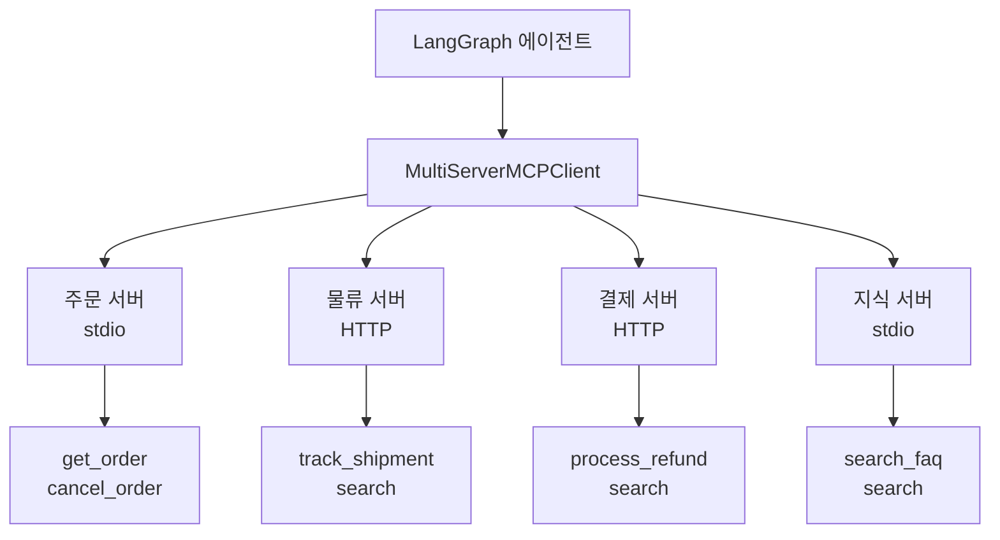
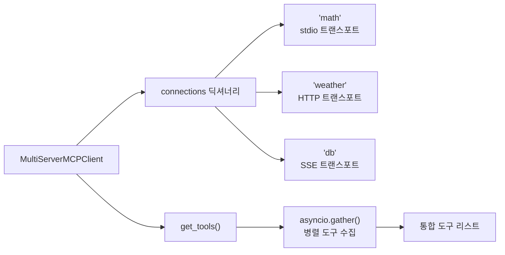
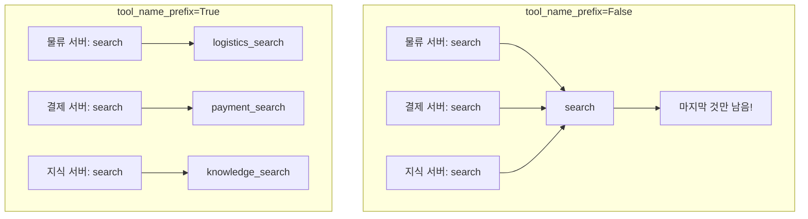
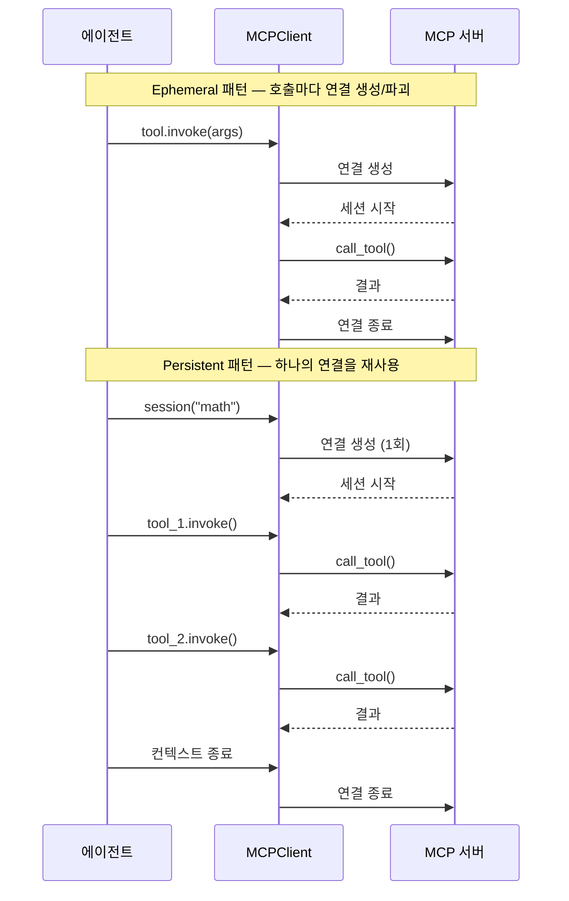
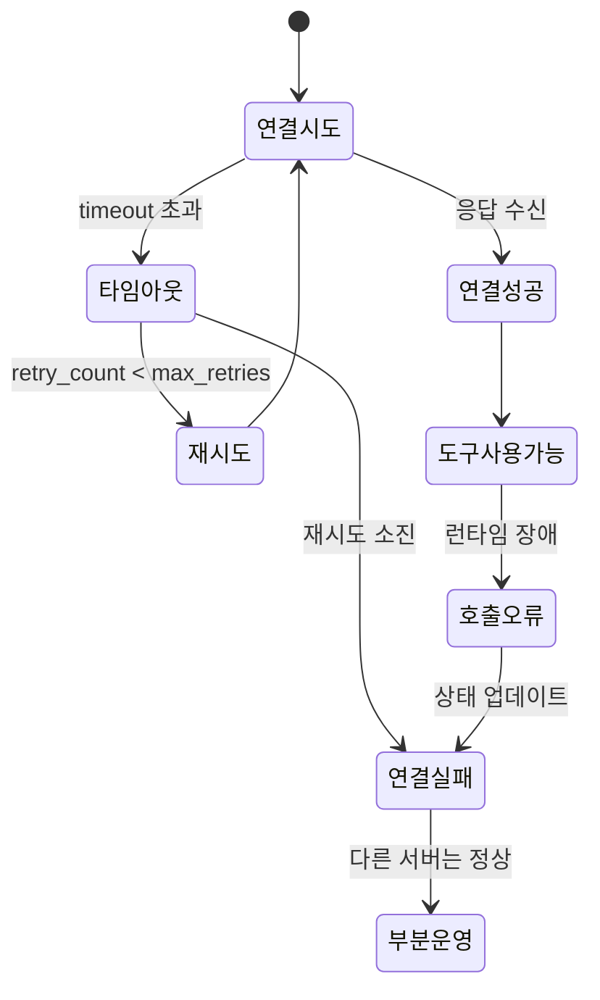

# 다중 MCP 서버 관리

> 여러 MCP 서버를 동시에 연결하고, 도구 네임스페이스 충돌을 해결하며, 서버 장애에 대응하는 전략을 학습합니다.

## 개요

이 섹션에서는 실전 에이전트가 여러 MCP 서버에 동시에 연결하여 다양한 도구를 활용하는 패턴을 학습합니다. 하나의 에이전트가 날씨 서버, 데이터베이스 서버, 검색 서버를 동시에 사용하는 상황을 떠올려 보세요 — 이런 멀티 서버 환경에서는 연결 관리, 도구 이름 충돌, 장애 대응이라는 세 가지 핵심 과제가 등장합니다.

**선수 지식**: [MCP 클라이언트 구축](10-ch10-mcp-클라이언트와-에이전트-통합/01-01-mcp-클라이언트-구축.md)에서 배운 `ClientSession`과 `stdio_client`, [LangGraph + MCP 통합](10-ch10-mcp-클라이언트와-에이전트-통합/03-03-langgraph-mcp-통합.md)에서 배운 `MultiServerMCPClient`와 `load_mcp_tools`

**학습 목표**:
- 여러 MCP 서버를 동시에 연결하고 관리하는 아키텍처를 설계할 수 있다
- `tool_name_prefix`를 활용하여 도구 이름 충돌을 방지할 수 있다
- 서버 장애 시 우아한 대응(graceful degradation)을 구현할 수 있다
- 연결 전략 패턴(Ephemeral / Persistent)을 상황에 맞게 선택할 수 있다

## 왜 알아야 할까?

실제 프로덕션 에이전트는 단 하나의 MCP 서버만 사용하는 경우가 드뭅니다. 생각해 보세요 — 고객 지원 에이전트 하나만 해도 주문 조회(주문 서버), 배송 추적(물류 서버), 환불 처리(결제 서버), FAQ 검색(지식 서버) 등 여러 백엔드 시스템에 동시에 접근해야 하거든요.

문제는 이런 서버들이 저마다 다른 팀에서 개발되기 때문에, `search`라는 이름의 도구가 세 서버에 동시에 존재할 수 있다는 겁니다. 게다가 어떤 서버는 stdio 로컬 프로세스로, 어떤 서버는 HTTP 원격 엔드포인트로 연결해야 하죠. 하나의 서버가 장애를 일으킨다고 전체 에이전트가 멈춰버리면 안 되고요.

이 섹션에서 다루는 다중 서버 관리 패턴은 이런 현실적인 문제를 체계적으로 해결하는 방법을 제공합니다.

> 📊 **그림 1**: 다중 MCP 서버 환경의 전체 구조



세 서버 모두 `search`라는 도구를 노출하고 있는데, 이런 이름 충돌을 어떻게 해결할까요? 지금부터 하나씩 알아보겠습니다.

## 핵심 개념

### 개념 1: 다중 서버 연결 아키텍처

> 💡 **비유**: 다중 MCP 서버 관리는 **국제공항의 터미널 관리**와 비슷합니다. 공항(에이전트)은 여러 터미널(서버)을 운영하는데, 각 터미널은 서로 다른 항공사(도구)를 담당합니다. 승객(쿼리)이 도착하면 어떤 터미널로 안내할지 결정하고, 특정 터미널이 폐쇄(장애)되어도 다른 터미널은 정상 운영되어야 합니다.

`MultiServerMCPClient`는 서버 이름을 키, 연결 설정을 값으로 하는 딕셔너리로 초기화됩니다. 각 서버는 독립된 트랜스포트를 사용할 수 있어, stdio 로컬 서버와 HTTP 원격 서버를 하나의 클라이언트에서 동시에 관리할 수 있죠.

> 📊 **그림 2**: MultiServerMCPClient 내부 아키텍처



핵심 코드를 살펴보겠습니다:

```python
from langchain_mcp_adapters.client import MultiServerMCPClient

# 다중 서버 연결 설정
client = MultiServerMCPClient(
    connections={
        # stdio 트랜스포트: 로컬 프로세스로 실행
        "math": {
            "transport": "stdio",
            "command": "python",
            "args": ["servers/math_server.py"],
        },
        # HTTP 트랜스포트: 원격 서버에 연결
        "weather": {
            "transport": "streamable_http",
            "url": "http://localhost:8001/mcp",
        },
        # HTTP + 인증: Bearer 토큰 포함
        "database": {
            "transport": "streamable_http",
            "url": "https://api.example.com/mcp",
            "headers": {
                "Authorization": "Bearer sk-prod-abc123",
            },
        },
    }
)

# 모든 서버에서 도구를 병렬로 수집
tools = await client.get_tools()
print(f"총 {len(tools)}개 도구 로드 완료")
```

주목할 점은 `get_tools()`가 내부적으로 `asyncio.gather()`를 사용하여 **모든 서버에 동시에** 도구 목록을 요청한다는 것입니다. 서버 3개가 각각 2초씩 응답한다면, 순차적으로는 6초가 걸리겠지만 병렬로는 2초면 됩니다.

특정 서버의 도구만 가져올 수도 있습니다:

```python
# 특정 서버의 도구만 로드
math_tools = await client.get_tools("math")
weather_tools = await client.get_tools("weather")
```

### 개념 2: 도구 네임스페이스와 충돌 해결

> 💡 **비유**: 도구 이름 충돌은 **같은 이름의 학생이 여러 반에 있는 상황**과 같습니다. "김민수"라고만 부르면 어느 반의 김민수인지 모르죠. 해결책은 간단합니다 — "1반 김민수", "3반 김민수"처럼 반 이름을 접두어로 붙이는 거죠. `tool_name_prefix`가 정확히 이 역할을 합니다.

서로 다른 MCP 서버가 같은 이름의 도구를 노출하면, 나중에 로드된 도구가 앞서 로드된 도구를 **조용히 덮어쓰는** 심각한 문제가 발생합니다. `tool_name_prefix=True`를 설정하면 서버 이름이 접두어로 붙어 이 문제를 방지합니다.

> 📊 **그림 3**: tool_name_prefix의 동작 원리



```python
from langchain_mcp_adapters.client import MultiServerMCPClient

# ❌ 위험: 이름 충돌 시 도구가 덮어씌워짐
client_unsafe = MultiServerMCPClient(
    connections={
        "logistics": {
            "transport": "stdio",
            "command": "python",
            "args": ["servers/logistics_server.py"],
        },
        "payment": {
            "transport": "stdio",
            "command": "python",
            "args": ["servers/payment_server.py"],
        },
    },
    tool_name_prefix=False,  # 기본값
)

# ✅ 안전: 서버 이름이 접두어로 붙음
client_safe = MultiServerMCPClient(
    connections={
        "logistics": {
            "transport": "stdio",
            "command": "python",
            "args": ["servers/logistics_server.py"],
        },
        "payment": {
            "transport": "stdio",
            "command": "python",
            "args": ["servers/payment_server.py"],
        },
    },
    tool_name_prefix=True,  # logistics_search, payment_search
)
```

```run:python
# tool_name_prefix 동작 시뮬레이션
servers = {
    "logistics": ["search", "track_shipment"],
    "payment": ["search", "process_refund"],
    "knowledge": ["search", "get_faq"],
}

# prefix=False: 충돌 발생
tools_no_prefix = {}
for server, tool_names in servers.items():
    for name in tool_names:
        if name in tools_no_prefix:
            print(f"⚠️  충돌! '{name}' 도구가 {tools_no_prefix[name]}에서 {server}로 덮어쓰기됨")
        tools_no_prefix[name] = server

print(f"\nprefix=False 결과: {len(tools_no_prefix)}개 도구")

# prefix=True: 충돌 없음
tools_with_prefix = {}
for server, tool_names in servers.items():
    for name in tool_names:
        prefixed = f"{server}_{name}"
        tools_with_prefix[prefixed] = server

print(f"prefix=True 결과: {len(tools_with_prefix)}개 도구")
print(f"도구 목록: {list(tools_with_prefix.keys())}")
```

```output
⚠️  충돌! 'search' 도구가 logistics에서 payment로 덮어쓰기됨
⚠️  충돌! 'search' 도구가 payment에서 knowledge로 덮어쓰기됨

prefix=False 결과: 4개 도구
prefix=True 결과: 6개 도구
도구 목록: ['logistics_search', 'logistics_track_shipment', 'payment_search', 'payment_process_refund', 'knowledge_search', 'knowledge_get_faq']
```

6개 도구가 모두 살아남았습니다! `tool_name_prefix=True` 한 줄로 충돌 문제가 깔끔하게 해결되는 거죠.

> ⚠️ **흔한 오해**: "도구 이름이 겹치지 않으면 `tool_name_prefix`는 필요 없다" — 지금 당장은 그럴 수 있지만, MCP 서버는 독립적으로 업데이트되기 때문에 언제든 새 서버에 동일한 이름의 도구가 추가될 수 있습니다. 멀티 서버 환경에서는 **항상 `tool_name_prefix=True`를 기본으로** 사용하는 것이 안전합니다.

### 개념 3: 연결 전략 패턴 — Ephemeral vs. Persistent

> 💡 **비유**: 에피메럴 연결은 **편의점 일회용 우산**과 같고, 영속 연결은 **사무실에 보관하는 접이식 우산**과 같습니다. 갑자기 비가 올 때 일회용이 편하지만, 매일 비가 오면 접이식 우산을 사두는 게 경제적이죠. 도구 호출 빈도에 따라 전략을 선택합니다.

> ⚠️ **용어 참고**: "Ephemeral"과 "Persistent" 세션은 MCP SDK가 직접 제공하는 API가 아니라, 다중 서버 환경에서 **연결 수명을 관리하는 아키텍처 패턴(연결 전략 패턴)**입니다. MCP 프로토콜 자체는 세션의 수명주기를 규정하지 않으며, 이를 어떻게 관리할지는 호스트(클라이언트 코드)의 설계 결정이에요. 아래에서 설명하는 두 패턴은 실무에서 가장 흔히 사용되는 연결 전략을 정리한 것입니다.

`MultiServerMCPClient`를 사용하여 두 가지 연결 전략 패턴을 구현할 수 있습니다:

> 📊 **그림 4**: Ephemeral vs. Persistent 연결 전략 비교



```python
from langchain_mcp_adapters.client import MultiServerMCPClient
from langchain_mcp_adapters.tools import load_mcp_tools

client = MultiServerMCPClient(
    connections={
        "math": {
            "transport": "stdio",
            "command": "python",
            "args": ["servers/math_server.py"],
        },
    }
)

# ── 연결 전략 1: Ephemeral 패턴 (기본) ──
# 각 도구 호출마다 내부적으로 새 세션 생성 → 자동 정리
# 구현이 단순하고 리소스 점유가 최소화됨
tools = await client.get_tools()
result = await tools[0].ainvoke({"a": 5, "b": 3})
# ↑ 내부적으로: 연결 → call_tool → 연결 종료

# ── 연결 전략 2: Persistent 패턴 ──
# 하나의 세션을 컨텍스트 매니저로 유지하여 연결 오버헤드 절감
# 배치 처리나 연속 호출 시 효율적
async with client.session("math") as session:
    tools = await load_mcp_tools(session)
    # 같은 세션으로 여러 도구 호출
    result1 = await tools[0].ainvoke({"a": 5, "b": 3})
    result2 = await tools[1].ainvoke({"x": 10})
    result3 = await tools[0].ainvoke({"a": 7, "b": 2})
    # ↑ 연결 1회로 3번 호출 — 훨씬 효율적!
# ← 컨텍스트 종료 시 자동 정리
```

각 전략 패턴의 선택 기준을 정리하면:

| 기준 | Ephemeral 패턴 (기본) | Persistent 패턴 |
|------|----------------------|-----------------|
| **연결 오버헤드** | 호출마다 발생 | 1회만 발생 |
| **리소스 사용** | 최소 (사용 시에만) | 세션 유지 동안 점유 |
| **적합한 상황** | 간헐적 도구 호출 | 연속적 도구 호출, 배치 처리 |
| **서버 상태** | 호출 간 상태 없음 | 세션 내 상태 유지 가능 |
| **에러 복구** | 자동 (새 연결) | 수동 재연결 필요 |
| **구현 방식** | `get_tools()` → `invoke()` | `client.session()` 컨텍스트 매니저 |

이 두 패턴은 MCP SDK의 기본 빌딩블록(`ClientSession`, `stdio_client`)을 조합하여 구현하는 것이지, SDK가 "ephemeral 모드"나 "persistent 모드"라는 명시적 API를 제공하는 것은 아닙니다. 핵심은 **세션 객체의 수명을 개발자가 직접 관리**한다는 점이에요.

### 개념 4: 서버 장애 대응과 Graceful Degradation

> 💡 **비유**: 서버 장애 대응은 **음식점의 메뉴 관리**와 같습니다. 해산물 공급이 끊겼다고 음식점 전체를 닫지 않죠 — "오늘 해산물 메뉴는 주문 불가"라고 안내하면서 나머지 메뉴는 정상 영업합니다. 에이전트도 마찬가지로, 하나의 MCP 서버가 죽었다고 전체가 멈추면 안 됩니다.

MCP Python SDK 기반으로 다중 서버 장애 대응 패턴을 구현해 보겠습니다:

```python
import asyncio
import logging
from dataclasses import dataclass, field
from mcp import ClientSession, StdioServerParameters
from mcp.client.stdio import stdio_client

logger = logging.getLogger(__name__)


@dataclass
class ServerConfig:
    """개별 MCP 서버 연결 설정"""
    name: str
    command: str
    args: list[str]
    env: dict[str, str] | None = None
    timeout: float = 10.0          # 연결 타임아웃 (초)
    max_retries: int = 3           # 최대 재시도 횟수
    retry_delay: float = 1.0       # 재시도 간격 (초)


@dataclass
class ServerStatus:
    """서버 상태 추적"""
    name: str
    connected: bool = False
    tools: list = field(default_factory=list)
    error: str | None = None
    retry_count: int = 0


class MultiMCPManager:
    """다중 MCP 서버를 관리하는 매니저 클래스"""

    def __init__(self, configs: list[ServerConfig]):
        self.configs = {cfg.name: cfg for cfg in configs}
        self.statuses: dict[str, ServerStatus] = {}
        self.sessions: dict[str, ClientSession] = {}
        self._exit_stacks: dict[str, asyncio.TaskGroup] = {}

    async def connect_all(self) -> dict[str, ServerStatus]:
        """모든 서버에 병렬로 연결 시도"""
        tasks = [
            self._connect_server(name, config)
            for name, config in self.configs.items()
        ]
        # 병렬 연결 — 하나가 실패해도 나머지 진행
        results = await asyncio.gather(*tasks, return_exceptions=True)

        for name, result in zip(self.configs.keys(), results):
            if isinstance(result, Exception):
                self.statuses[name] = ServerStatus(
                    name=name,
                    connected=False,
                    error=str(result),
                )
                logger.warning(f"서버 '{name}' 연결 실패: {result}")

        return self.statuses

    async def _connect_server(
        self, name: str, config: ServerConfig
    ) -> ServerStatus:
        """개별 서버 연결 (재시도 로직 포함)"""
        status = ServerStatus(name=name)

        for attempt in range(config.max_retries):
            try:
                params = StdioServerParameters(
                    command=config.command,
                    args=config.args,
                    env=config.env,
                )
                # 타임아웃이 있는 연결 시도
                session = await asyncio.wait_for(
                    self._create_session(params),
                    timeout=config.timeout,
                )
                # 도구 목록 로드
                tools_response = await session.list_tools()
                status.connected = True
                status.tools = tools_response.tools
                self.sessions[name] = session
                self.statuses[name] = status

                logger.info(
                    f"서버 '{name}' 연결 성공: "
                    f"{len(status.tools)}개 도구"
                )
                return status

            except asyncio.TimeoutError:
                status.retry_count = attempt + 1
                status.error = f"연결 타임아웃 ({config.timeout}초)"
                logger.warning(
                    f"서버 '{name}' 타임아웃 "
                    f"(시도 {attempt + 1}/{config.max_retries})"
                )
            except Exception as e:
                status.retry_count = attempt + 1
                status.error = str(e)
                logger.warning(
                    f"서버 '{name}' 연결 오류: {e} "
                    f"(시도 {attempt + 1}/{config.max_retries})"
                )

            if attempt < config.max_retries - 1:
                await asyncio.sleep(config.retry_delay)

        # 모든 재시도 실패
        self.statuses[name] = status
        return status

    def get_available_tools(self) -> list[dict]:
        """연결된 서버의 도구만 네임스페이스 접두어와 함께 반환"""
        tools = []
        for name, status in self.statuses.items():
            if status.connected:
                for tool in status.tools:
                    tools.append({
                        "name": f"{name}_{tool.name}",
                        "original_name": tool.name,
                        "server": name,
                        "description": tool.description,
                        "schema": tool.inputSchema,
                    })
        return tools

    async def call_tool(
        self, server_name: str, tool_name: str, arguments: dict
    ) -> str:
        """특정 서버의 도구 호출 (장애 시 에러 반환)"""
        if server_name not in self.sessions:
            return f"[오류] 서버 '{server_name}' 연결되지 않음"

        try:
            result = await self.sessions[server_name].call_tool(
                tool_name, arguments
            )
            return result.content[0].text if result.content else ""
        except Exception as e:
            logger.error(
                f"도구 호출 실패: {server_name}/{tool_name}: {e}"
            )
            # 서버 상태 업데이트
            self.statuses[server_name].connected = False
            self.statuses[server_name].error = str(e)
            return f"[오류] {server_name}/{tool_name} 호출 실패: {e}"

    def health_check(self) -> dict:
        """전체 서버 상태 요약"""
        total = len(self.configs)
        connected = sum(
            1 for s in self.statuses.values() if s.connected
        )
        return {
            "total_servers": total,
            "connected": connected,
            "degraded": total - connected,
            "servers": {
                name: {
                    "status": "connected" if s.connected else "failed",
                    "tools": len(s.tools),
                    "error": s.error,
                }
                for name, s in self.statuses.items()
            },
        }
```

> 📊 **그림 5**: 서버 장애 대응 흐름 — Graceful Degradation



이 패턴의 핵심은 **`asyncio.gather(*tasks, return_exceptions=True)`** 입니다. `return_exceptions=True`를 설정하면 하나의 서버 연결이 실패해도 예외가 즉시 전파되지 않고, 다른 서버 연결은 정상적으로 진행됩니다.

### 개념 5: 인터셉터 패턴 — 도구 호출에 횡단 관심사 끼워넣기

> 💡 **비유**: 인터셉터는 **공항 보안 검색대**와 비슷합니다. 승객(도구 호출 요청)이 탑승구(실제 서버)에 도달하기 전에 여러 검문(로깅, 캐싱, 인증)을 거치는 거죠. 검문은 순서대로 통과하며, 각 검문소는 독립적으로 추가하거나 제거할 수 있습니다.

> ⚠️ **용어 참고**: 여기서 소개하는 `LoggingInterceptor`, `CacheInterceptor` 등의 인터셉터는 **MCP SDK의 내장 기능이 아니라, MCP 위에 구축하는 커스텀 디자인 패턴**입니다. MCP 프로토콜은 도구 호출 전후에 미들웨어를 끼워넣는 표준 API를 제공하지 않습니다. 대신 우리가 직접 도구 호출 래퍼를 작성하여 로깅, 캐싱, 인증 등의 **횡단 관심사(cross-cutting concerns)**를 처리하는 것이죠. 이 패턴은 웹 프레임워크의 미들웨어나 gRPC의 인터셉터에서 영감을 받은 것입니다.

> 📊 **그림 6**: 인터셉터 체인의 양파(Onion) 패턴


```python
# interceptor_pattern.py
"""
커스텀 인터셉터 패턴: MCP 도구 호출에 횡단 관심사를 추가하는 디자인 패턴.
참고: 이 코드는 MCP SDK 위에 구축하는 애플리케이션 레벨 추상화입니다.
MCP SDK 자체에는 인터셉터 API가 포함되어 있지 않습니다.
"""
import time
import hashlib
import json
from typing import Any, Callable, Awaitable
from dataclasses import dataclass


@dataclass
class ToolRequest:
    """도구 호출 요청을 캡슐화하는 데이터 클래스"""
    server_name: str
    tool_name: str
    arguments: dict


# 인터셉터 타입 정의: 요청과 다음 핸들러를 받아 결과를 반환
InterceptorFunc = Callable[
    [ToolRequest, Callable[[ToolRequest], Awaitable[Any]]],
    Awaitable[Any],
]


class LoggingInterceptor:
    """모든 도구 호출을 로깅하는 인터셉터"""

    async def __call__(
        self,
        request: ToolRequest,
        next_handler: Callable[[ToolRequest], Awaitable[Any]],
    ) -> Any:
        start = time.time()
        print(
            f"[LOG] 도구 호출 시작: {request.tool_name} "
            f"서버: {request.server_name}"
        )

        result = await next_handler(request)

        elapsed = time.time() - start
        print(f"[LOG] 도구 호출 완료: {elapsed:.2f}초")
        return result


class CacheInterceptor:
    """동일한 입력에 대한 결과를 캐싱하는 인터셉터"""

    def __init__(self, ttl: int = 300):
        self.cache: dict[str, tuple[float, Any]] = {}
        self.ttl = ttl  # 캐시 유효 시간 (초)

    def _make_key(self, request: ToolRequest) -> str:
        """요청에서 캐시 키 생성"""
        data = (
            f"{request.server_name}:{request.tool_name}:"
            f"{json.dumps(request.arguments, sort_keys=True)}"
        )
        return hashlib.md5(data.encode()).hexdigest()

    async def __call__(
        self,
        request: ToolRequest,
        next_handler: Callable[[ToolRequest], Awaitable[Any]],
    ) -> Any:
        key = self._make_key(request)

        # 캐시 히트 확인
        if key in self.cache:
            cached_time, cached_result = self.cache[key]
            if time.time() - cached_time < self.ttl:
                print(f"[CACHE] 캐시 히트: {request.tool_name}")
                return cached_result

        # 캐시 미스 → 실제 호출
        result = await next_handler(request)
        self.cache[key] = (time.time(), result)
        return result


def build_interceptor_chain(
    interceptors: list[InterceptorFunc],
    final_handler: Callable[[ToolRequest], Awaitable[Any]],
) -> Callable[[ToolRequest], Awaitable[Any]]:
    """인터셉터 체인을 구성하여 최종 핸들러를 감싸는 함수"""
    handler = final_handler
    # 역순으로 감싸서 첫 번째 인터셉터가 가장 바깥
    for interceptor in reversed(interceptors):
        prev_handler = handler
        async def make_handler(req, _int=interceptor, _next=prev_handler):
            return await _int(req, _next)
        handler = make_handler
    return handler
```

이 인터셉터 체인을 실제 `MultiMCPManager`와 통합하는 방법은 다음과 같습니다:

```python
# 인터셉터 체인을 매니저에 적용하는 예시
async def call_tool_with_interceptors(
    manager: MultiMCPManager,
    server_name: str,
    tool_name: str,
    arguments: dict,
) -> str:
    """인터셉터 체인을 거쳐 도구를 호출"""
    interceptors = [
        CacheInterceptor(ttl=60),   # 바깥: 캐시 확인
        LoggingInterceptor(),        # 안쪽: 로깅
    ]

    # 최종 핸들러: 실제 MCP 서버 호출
    async def final_handler(request: ToolRequest) -> str:
        return await manager.call_tool(
            request.server_name,
            request.tool_name,
            request.arguments,
        )

    # 체인 구성
    chain = build_interceptor_chain(interceptors, final_handler)

    # 호출 실행
    request = ToolRequest(server_name, tool_name, arguments)
    return await chain(request)
```

인터셉터는 **양파 껍질(Onion) 패턴**으로 동작합니다 — 첫 번째 인터셉터가 가장 바깥 레이어, 마지막이 가장 안쪽입니다. `CacheInterceptor`가 먼저 캐시를 확인하고, 캐시 미스일 때만 `LoggingInterceptor` → 실제 호출 순서로 진행됩니다. 이 패턴은 프로젝트 요구사항에 따라 인증 검사, 속도 제한(rate limiting), 메트릭 수집 등의 인터셉터를 자유롭게 추가할 수 있어 확장성이 뛰어납니다.

## 실습: 직접 해보기

실전에서 사용할 수 있는 다중 MCP 서버 관리 시스템을 처음부터 끝까지 구축해 보겠습니다. 먼저 테스트용 MCP 서버 두 개를 만들고, 이를 동시에 관리하는 클라이언트를 작성합니다.

### Step 1: 테스트용 MCP 서버 작성

```python
# servers/calc_server.py
"""간단한 계산 MCP 서버"""
from mcp.server.fastmcp import FastMCP

mcp = FastMCP("calculator")


@mcp.tool()
def add(a: float, b: float) -> float:
    """두 수를 더합니다"""
    return a + b


@mcp.tool()
def multiply(a: float, b: float) -> float:
    """두 수를 곱합니다"""
    return a * b


@mcp.tool()
def search(query: str) -> str:
    """계산 관련 공식을 검색합니다"""
    formulas = {
        "원의 넓이": "π × r²",
        "피타고라스": "a² + b² = c²",
    }
    return formulas.get(query, f"'{query}'에 대한 공식을 찾을 수 없습니다")


if __name__ == "__main__":
    mcp.run()
```

```python
# servers/text_server.py
"""간단한 텍스트 처리 MCP 서버"""
from mcp.server.fastmcp import FastMCP

mcp = FastMCP("text-processor")


@mcp.tool()
def word_count(text: str) -> int:
    """텍스트의 단어 수를 셉니다"""
    return len(text.split())


@mcp.tool()
def search(query: str) -> str:
    """텍스트 관련 가이드를 검색합니다"""
    guides = {
        "마크다운": "# 제목, **굵게**, *기울임*",
        "이모지": "유니코드 이모지 코드포인트 사용",
    }
    return guides.get(query, f"'{query}'에 대한 가이드를 찾을 수 없습니다")


if __name__ == "__main__":
    mcp.run()
```

두 서버 모두 `search`라는 도구를 가지고 있는 점에 주목하세요!

### Step 2: langchain-mcp-adapters로 다중 서버 관리

```python
# multi_server_agent.py
"""다중 MCP 서버를 관리하는 LangGraph 에이전트"""
import asyncio
from langchain_mcp_adapters.client import MultiServerMCPClient
from langchain_openai import ChatOpenAI
from langgraph.prebuilt import create_react_agent


async def main():
    # ── 1. 다중 서버 설정 (tool_name_prefix로 충돌 방지) ──
    client = MultiServerMCPClient(
        connections={
            "calc": {
                "transport": "stdio",
                "command": "python",
                "args": ["servers/calc_server.py"],
            },
            "text": {
                "transport": "stdio",
                "command": "python",
                "args": ["servers/text_server.py"],
            },
        },
        tool_name_prefix=True,  # calc_search, text_search로 구분
    )

    # ── 2. 모든 서버에서 도구 수집 ──
    tools = await client.get_tools()
    print(f"로드된 도구: {[t.name for t in tools]}")

    # ── 3. LangGraph 에이전트 구성 ──
    llm = ChatOpenAI(model="gpt-4o-mini", temperature=0)
    agent = create_react_agent(llm, tools)

    # ── 4. 에이전트에게 복합 질문 ──
    response = await agent.ainvoke({
        "messages": [
            {
                "role": "user",
                "content": (
                    "3과 7을 곱하고, '마크다운'에 대한 "
                    "텍스트 가이드도 찾아줘"
                ),
            }
        ]
    })

    # 결과 출력
    for msg in response["messages"]:
        if hasattr(msg, "content") and msg.content:
            print(f"[{msg.type}] {msg.content}")


if __name__ == "__main__":
    asyncio.run(main())
```

### Step 3: 장애 대응이 포함된 프로덕션 패턴

```python
# resilient_multi_server.py
"""장애 대응이 포함된 다중 MCP 서버 관리"""
import asyncio
import logging
from langchain_mcp_adapters.client import MultiServerMCPClient
from langchain_core.tools import StructuredTool

logging.basicConfig(level=logging.INFO)
logger = logging.getLogger(__name__)


class ResilientMCPManager:
    """장애 대응이 포함된 다중 MCP 서버 매니저"""

    def __init__(self, server_configs: dict):
        self.server_configs = server_configs
        self.healthy_servers: set[str] = set()
        self.failed_servers: dict[str, str] = {}  # name → error

    async def load_tools_with_fallback(
        self,
    ) -> list[StructuredTool]:
        """서버별로 독립적으로 도구를 로드하고, 실패한 서버는 건너뜀"""
        all_tools: list[StructuredTool] = []

        for name, config in self.server_configs.items():
            try:
                # 서버 하나짜리 클라이언트로 개별 연결 시도
                single_client = MultiServerMCPClient(
                    connections={name: config},
                    tool_name_prefix=True,
                )
                tools = await asyncio.wait_for(
                    single_client.get_tools(),
                    timeout=15.0,  # 15초 타임아웃
                )
                all_tools.extend(tools)
                self.healthy_servers.add(name)
                logger.info(
                    f"✓ '{name}' 서버: {len(tools)}개 도구 로드"
                )
            except asyncio.TimeoutError:
                self.failed_servers[name] = "연결 타임아웃"
                logger.warning(
                    f"✗ '{name}' 서버: 연결 타임아웃 (건너뜀)"
                )
            except Exception as e:
                self.failed_servers[name] = str(e)
                logger.warning(
                    f"✗ '{name}' 서버: {e} (건너뜀)"
                )

        logger.info(
            f"결과: {len(self.healthy_servers)}/"
            f"{len(self.server_configs)} 서버 연결, "
            f"총 {len(all_tools)}개 도구"
        )
        return all_tools

    def get_status_report(self) -> str:
        """서버 상태 리포트를 텍스트로 반환"""
        lines = ["=== MCP 서버 상태 ==="]
        for name in self.server_configs:
            if name in self.healthy_servers:
                lines.append(f"  [연결됨] {name}")
            else:
                error = self.failed_servers.get(name, "알 수 없음")
                lines.append(f"  [실패] {name}: {error}")
        return "\n".join(lines)


async def main():
    configs = {
        "calc": {
            "transport": "stdio",
            "command": "python",
            "args": ["servers/calc_server.py"],
        },
        "text": {
            "transport": "stdio",
            "command": "python",
            "args": ["servers/text_server.py"],
        },
        "broken": {
            "transport": "stdio",
            "command": "python",
            "args": ["servers/nonexistent_server.py"],  # 의도적 실패
        },
    }

    manager = ResilientMCPManager(configs)
    tools = await manager.load_tools_with_fallback()

    print(manager.get_status_report())
    print(f"\n사용 가능한 도구: {[t.name for t in tools]}")
    # broken 서버 제외, calc과 text 서버의 도구만 로드됨


if __name__ == "__main__":
    asyncio.run(main())
```

```run:python
# 실행 결과 시뮬레이션
print("=== MCP 서버 상태 ===")
print("  [연결됨] calc")
print("  [연결됨] text")
print("  [실패] broken: No such file: 'servers/nonexistent_server.py'")
print()
print("결과: 2/3 서버 연결, 총 5개 도구")
print("사용 가능한 도구: ['calc_add', 'calc_multiply', 'calc_search', 'text_word_count', 'text_search']")
```

```output
=== MCP 서버 상태 ===
  [연결됨] calc
  [연결됨] text
  [실패] broken: No such file: 'servers/nonexistent_server.py'

결과: 2/3 서버 연결, 총 5개 도구
사용 가능한 도구: ['calc_add', 'calc_multiply', 'calc_search', 'text_word_count', 'text_search']
```

`broken` 서버가 실패해도 나머지 서버의 도구 5개는 정상적으로 사용할 수 있습니다. 이것이 **Graceful Degradation**의 핵심입니다.

## 더 깊이 알아보기

### MCP의 다중 서버 철학: "호스트-클라이언트-서버" 삼중 구조

MCP 명세(2025-11-25)는 아키텍처를 세 계층으로 정의합니다:

- **호스트(Host)**: Claude Desktop, IDE 같은 최상위 애플리케이션. 여러 클라이언트를 생성하고 관리
- **클라이언트(Client)**: MCP 프로토콜의 클라이언트 측. 각 클라이언트는 **하나의 서버**와 1:1 연결을 유지
- **서버(Server)**: 도구, 리소스, 프롬프트를 노출하는 경량 프로그램

여기서 핵심적인 설계 의도가 있습니다 — MCP 명세는 클라이언트와 서버를 **1:1 관계**로 정의합니다. 즉, 하나의 클라이언트가 여러 서버에 동시에 연결하는 것은 명세 범위 밖이에요. 대신 **호스트가 여러 클라이언트를 생성**하여 각각 다른 서버에 연결하는 방식을 권장합니다.

`MultiServerMCPClient`는 이 패턴을 그대로 구현한 것입니다. 내부적으로 서버마다 별도의 `ClientSession`을 생성하고, 외부에는 단일 인터페이스를 제공합니다. 이름은 "Multi Server Client"이지만, 사실은 "여러 단일-서버 클라이언트를 관리하는 호스트"에 더 가깝죠.

### "Too Many Tools" 문제와 도구 오케스트레이션

다중 서버를 연결하다 보면 흥미로운 문제에 부딪힙니다 — 도구가 너무 많아지는 거예요. LLM은 도구가 20~30개를 넘어가면 선택 정확도가 떨어지기 시작합니다. 이 문제를 해결하기 위해 MCP 커뮤니티에서는 "MCP 오케스트레이터" 패턴이 등장했습니다 — 쿼리를 분석하여 관련 서버의 도구만 선별적으로 LLM에 전달하는 중간 계층을 두는 방식입니다. 이 패턴은 [Ch15. Supervisor/Worker 멀티 에이전트](15-ch15-supervisorworker-멀티-에이전트/01-01-멀티-에이전트-아키텍처-패턴.md)에서 다루는 Supervisor 패턴과 결합하면 더욱 강력해집니다.

### 커스텀 패턴과 SDK 기능의 구분

이 섹션에서 다룬 개념 중 어디까지가 MCP SDK 기능이고 어디부터가 커스텀 설계인지 정리해 두겠습니다:

| 개념 | 출처 | 설명 |
|------|------|------|
| `ClientSession`, `stdio_client` | **MCP Python SDK** | 프로토콜 레벨 API |
| `MultiServerMCPClient`, `tool_name_prefix` | **langchain-mcp-adapters** | LangChain 생태계 어댑터 라이브러리 |
| Ephemeral / Persistent 연결 전략 | **아키텍처 패턴** | 세션 수명을 관리하는 설계 패턴 |
| 인터셉터 체인 (Logging, Cache) | **커스텀 디자인 패턴** | MCP 위에 구축하는 애플리케이션 레벨 추상화 |
| `MultiMCPManager`, `ResilientMCPManager` | **커스텀 구현** | 장애 대응을 위한 매니저 패턴 |

SDK가 제공하는 기본 빌딩블록 위에 프로젝트 요구사항에 맞는 패턴을 조합하는 것이 다중 서버 관리의 핵심입니다.

## 흔한 오해와 팁

> ⚠️ **흔한 오해**: "MultiServerMCPClient는 async with 컨텍스트 매니저로 사용해야 한다" — `langchain-mcp-adapters` 0.1.0 이후로 `MultiServerMCPClient`는 **더 이상 컨텍스트 매니저가 아닙니다**. 직접 인스턴스를 생성하고 `get_tools()`를 호출하면 됩니다. `async with MultiServerMCPClient(...) as client:` 패턴은 deprecated입니다.

> 💡 **알고 계셨나요?**: MCP 명세에서 클라이언트-서버 관계를 1:1로 제한한 이유는 **보안 격리** 때문입니다. 각 서버가 독립된 세션을 가지므로, 악의적인 서버가 다른 서버의 세션 정보에 접근하는 것이 원천적으로 불가능합니다. 다중 서버 관리는 항상 **호스트 레벨**에서 이루어져야 합니다.

> 🔥 **실무 팁**: 프로덕션에서 HTTP/SSE 트랜스포트로 원격 MCP 서버에 연결할 때는 반드시 `headers`에 인증 토큰을 설정하세요. stdio 트랜스포트는 로컬 프로세스이므로 별도 인증이 불필요하지만, 원격 서버는 반드시 `Authorization` 헤더가 필요합니다. 또한, 서버 수가 10개를 넘어가면 `get_tools()` 결과를 캐싱하여 LLM 컨텍스트 낭비를 줄이세요.

> ⚠️ **흔한 오해**: "인터셉터는 MCP SDK에 내장된 기능이다" — 이 섹션에서 다룬 `LoggingInterceptor`, `CacheInterceptor` 등은 **우리가 직접 설계한 커스텀 디자인 패턴**입니다. MCP 프로토콜 자체에는 미들웨어나 인터셉터 API가 없습니다. 다만 이 패턴은 충분히 범용적이어서, 여러 MCP 기반 프로젝트에서 비슷한 형태로 구현하여 사용하고 있습니다.

## 핵심 정리

| 개념 | 설명 |
|------|------|
| **MultiServerMCPClient** | 서버 이름 → 연결 설정 딕셔너리로 다중 서버를 단일 인터페이스로 관리 (langchain-mcp-adapters 제공) |
| **tool_name_prefix** | `True` 설정 시 서버 이름을 도구 이름 앞에 붙여 충돌 방지 (예: `calc_search`) |
| **Ephemeral 연결 패턴** | 도구 호출마다 새 세션 생성·파괴하는 아키텍처 패턴. 간헐적 호출에 적합 |
| **Persistent 연결 패턴** | `client.session("name")`으로 세션을 재사용하는 아키텍처 패턴. 연속 호출에 효율적 |
| **Graceful Degradation** | 일부 서버 장애 시에도 나머지 서버의 도구를 정상 제공 |
| **return_exceptions=True** | `asyncio.gather()`에서 예외를 전파하지 않고 결과로 반환하여 부분 실패 처리 |
| **인터셉터 패턴** | MCP 위에 구축하는 커스텀 디자인 패턴. 양파 구조로 로깅·캐싱·인증 등 횡단 관심사 처리 |
| **호스트-클라이언트-서버** | MCP 명세의 삼중 구조. 다중 서버는 호스트 레벨에서 관리 |

## 다음 섹션 미리보기

다음 섹션 [MCP 에이전트 실전 프로젝트](10-ch10-mcp-클라이언트와-에이전트-통합/05-05-mcp-에이전트-실전-프로젝트.md)에서는 이번에 배운 다중 서버 관리, 장애 대응, 인터셉터 패턴을 모두 통합하여 실전형 MCP 에이전트를 처음부터 끝까지 구축합니다. 사용자의 자연어 요청을 분석하여 적절한 MCP 서버를 선택하고, 복수 도구를 조합하여 복잡한 작업을 수행하는 에이전트를 만들어 보겠습니다.

## 참고 자료

- [MCP Python SDK (GitHub)](https://github.com/modelcontextprotocol/python-sdk) - MCP 클라이언트/서버 구현의 공식 Python SDK. `ClientSession`, `stdio_client` 등의 API 레퍼런스
- [MCP 명세 v2025-11-25](https://modelcontextprotocol.io/specification/2025-11-25) - 호스트-클라이언트-서버 아키텍처, 트랜스포트 프로토콜, 도구 스키마의 공식 명세
- [langchain-mcp-adapters (GitHub)](https://github.com/langchain-ai/langchain-mcp-adapters) - `MultiServerMCPClient`, `load_mcp_tools` 등 LangChain/LangGraph와 MCP 통합을 위한 어댑터 라이브러리
- [MultiServerMCPClient API 레퍼런스](https://reference.langchain.com/python/langchain-mcp-adapters/client/MultiServerMCPClient) - `connections`, `tool_name_prefix` 파라미터 상세 문서
- [MCP 클라이언트 구축 가이드 (Real Python)](https://realpython.com/python-mcp-client/) - Python으로 MCP 클라이언트를 구축하는 단계별 튜토리얼

---
### 🔗 Related Sessions
- [toolnode](04-ch4-langgraph-stategraph-기초/05-05-첫-번째-langgraph-에이전트.md) (prerequisite)
- [mcpclient](10-ch10-mcp-클라이언트와-에이전트-통합/01-01-mcp-클라이언트-구축.md) (prerequisite)
- [tools_condition](04-ch4-langgraph-stategraph-기초/05-05-첫-번째-langgraph-에이전트.md) (prerequisite)
- [load_mcp_tools](10-ch10-mcp-클라이언트와-에이전트-통합/03-03-langgraph-mcp-통합.md) (prerequisite)
- [multiservermcpclient](10-ch10-mcp-클라이언트와-에이전트-통합/03-03-langgraph-mcp-통합.md) (prerequisite)
- [create_react_agent](02-ch2-react-패턴과-에이전트-루프/04-04-langgraph의-create-react-agent.md) (prerequisite)
