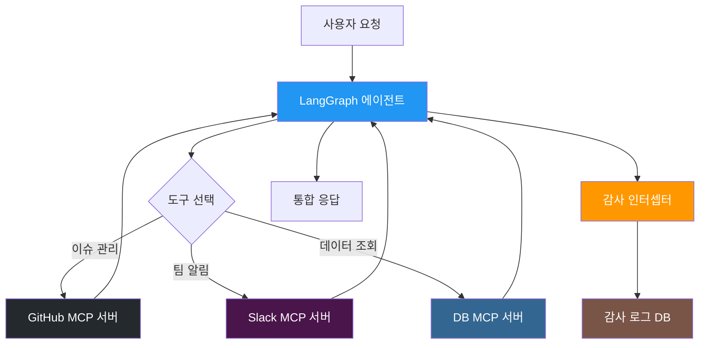
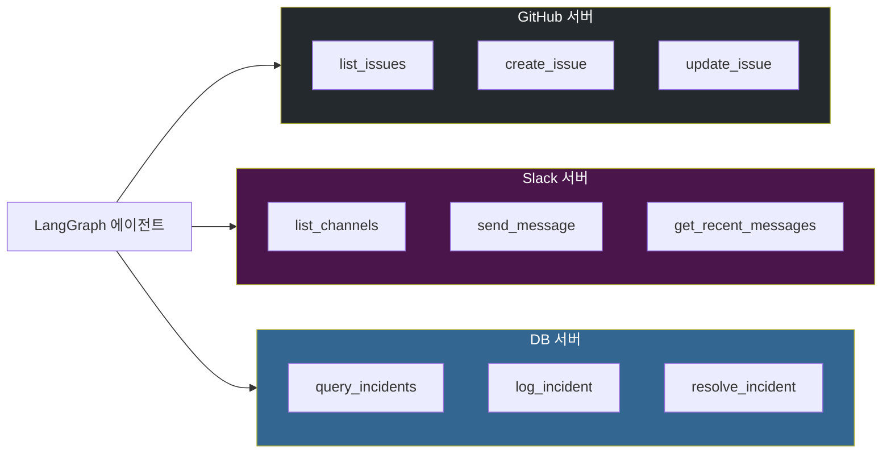
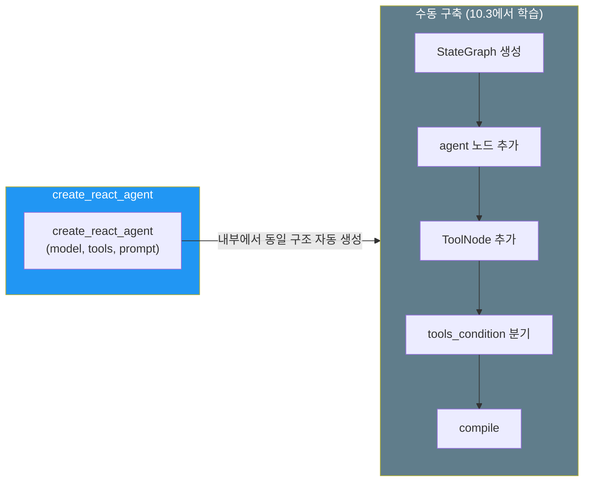
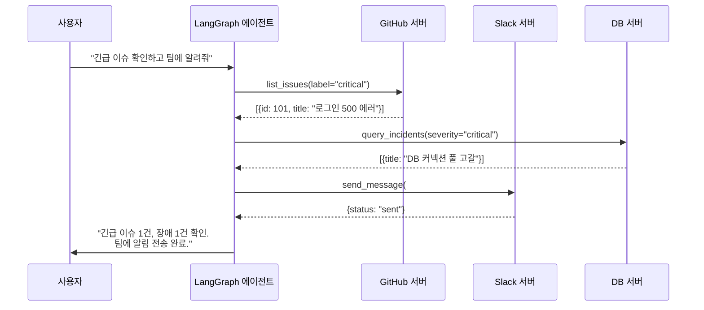
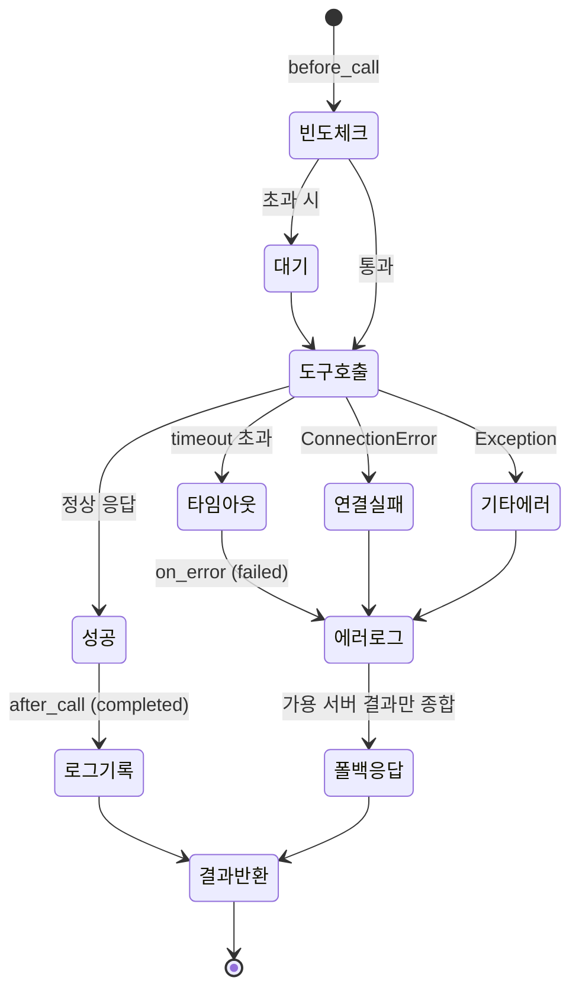
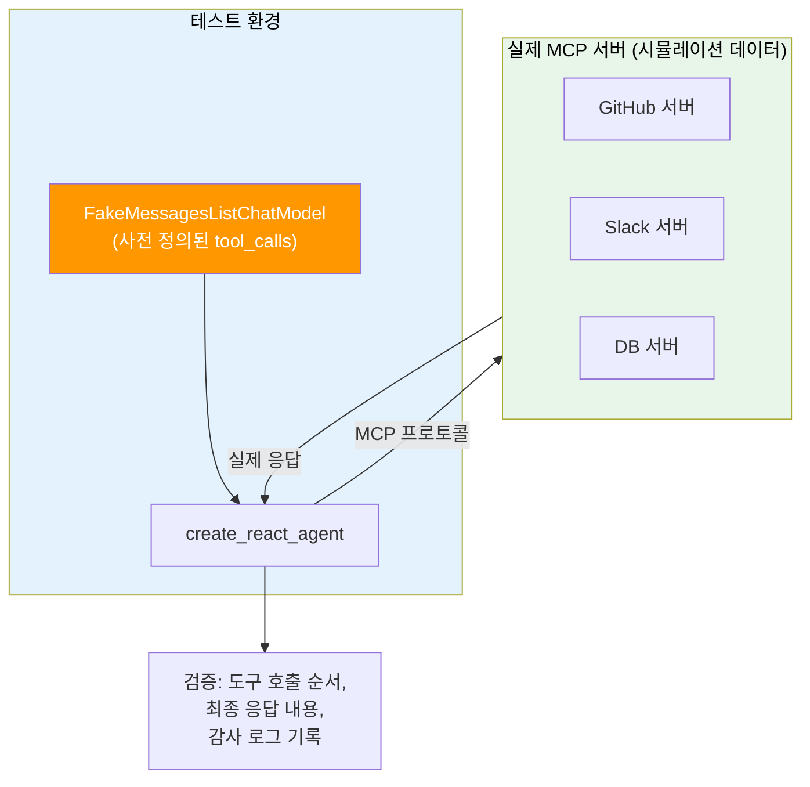
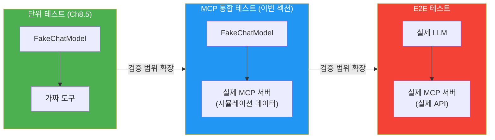

# MCP 에이전트 실전 프로젝트

> GitHub + Slack + DB MCP 서버를 연동한 DevOps 지원 에이전트를 처음부터 끝까지 구축하고, 통합 테스트와 감사 로깅까지 완성합니다.

## 개요

이 섹션에서는 Ch10 전체에서 배운 MCP 클라이언트 구축, LLM 연동, LangGraph 통합, 다중 서버 관리를 하나의 실전 프로젝트로 통합합니다. GitHub 이슈 관리, Slack 알림, 데이터베이스 조회라는 세 가지 MCP 서버를 동시에 연결하여 DevOps 지원 에이전트를 구축하고, 에러 복구·감사 로깅·통합 테스트까지 프로덕션 수준으로 완성하는 전체 과정을 경험하게 됩니다.

**선수 지식**: [MCP 클라이언트 구축](10-ch10-mcp-클라이언트와-에이전트-통합/01-01-mcp-클라이언트-구축.md)의 `ClientSession`과 `stdio_client`, [MCP 도구와 LLM 연동](10-ch10-mcp-클라이언트와-에이전트-통합/02-02-mcp-도구와-llm-연동.md)의 스키마 변환 브릿지, [LangGraph + MCP 통합](10-ch10-mcp-클라이언트와-에이전트-통합/03-03-langgraph-mcp-통합.md)의 `langchain-mcp-adapters`, [다중 MCP 서버 관리](10-ch10-mcp-클라이언트와-에이전트-통합/04-04-다중-mcp-서버-관리.md)의 `MultiServerMCPClient`와 장애 대응 패턴, [도구 사용 테스트](08-ch8-도구-사용-tool-use/05-05-도구-사용-테스트.md)의 `FakeMessagesListChatModel`

**학습 목표**:
- GitHub, Slack, DB 세 가지 MCP 서버를 FastMCP로 구축할 수 있다
- MultiServerMCPClient로 다중 서버를 LangGraph 에이전트에 통합할 수 있다
- 서버 장애 시 우아한 복구와 인터셉터 기반 감사 로깅을 적용할 수 있다
- `FakeMessagesListChatModel`을 활용한 MCP 에이전트 통합 테스트를 작성할 수 있다
- 실전 DevOps 시나리오에서 에이전트가 자율적으로 도구를 선택·실행하도록 구현할 수 있다

## 왜 알아야 할까?

현업 DevOps 팀에서 반복되는 일상을 떠올려 보세요. "이번 주 열린 이슈가 뭐야?", "배포 상태를 #ops 채널에 알려줘", "최근 장애 기록 조회해줘" — 이런 요청마다 GitHub 대시보드를 열고, Slack을 전환하고, 데이터베이스 클라이언트를 실행하는 컨텍스트 스위칭이 발생합니다. 

MCP 기반 에이전트는 이런 분산된 도구들을 하나의 자연어 인터페이스로 통합합니다. "긴급 이슈 확인하고, 심각도 높은 건 Slack에 알리고, DB에 장애 로그 기록해줘"라는 한 마디로 세 시스템을 넘나드는 작업을 자동화할 수 있거든요. 

그런데 여기서 한 가지 더 중요한 문제가 있습니다. **이 에이전트가 정말로 의도대로 동작하는지 어떻게 검증할까요?** 세 서버가 동시에 돌아가는 상황에서 실제 LLM을 호출하면 비용도 들고 결과도 비결정적이죠. [도구 사용 테스트](08-ch8-도구-사용-tool-use/05-05-도구-사용-테스트.md)에서 배운 `FakeMessagesListChatModel`이 바로 이 문제를 해결합니다 — LLM 응답을 사전에 정의해놓고, 에이전트의 도구 선택 궤적을 결정론적으로 검증할 수 있습니다.

이번 프로젝트는 Ch9에서 만든 MCP 서버와 Ch10에서 배운 클라이언트 기술을 결합하여, 에러 복구·감사 로깅·통합 테스트까지 갖춘 프로덕션급 에이전트를 구축하는 종합 실습입니다.

## 핵심 개념

### 개념 1: 프로젝트 아키텍처 설계

> 💡 **비유**: 공항의 통합 관제탑을 생각해보세요. 관제탑(에이전트)이 활주로(GitHub), 터미널(Slack), 화물 시스템(DB)을 모두 모니터링하면서 상황에 따라 적절한 지시를 내립니다. 각 시스템이 독립적으로 운영되지만, 관제탑이 전체를 조율하는 구조입니다.

DevOps 지원 에이전트는 세 가지 MCP 서버와 하나의 LangGraph 에이전트로 구성됩니다. 각 서버는 독립적인 책임을 갖고, 에이전트가 사용자 요청에 따라 적절한 서버의 도구를 선택합니다.

> 📊 **그림 1**: DevOps 에이전트 전체 아키텍처



각 MCP 서버의 역할은 다음과 같습니다:

| 서버 | 역할 | 주요 도구 |
|------|------|-----------|
| GitHub | 이슈 조회·생성·업데이트 | `list_issues`, `create_issue`, `update_issue` |
| Slack | 채널 메시지 전송·조회 | `send_message`, `list_channels` |
| DB | 장애 기록 조회·삽입 | `query_incidents`, `log_incident` |

프로젝트 디렉토리 구조는 이렇게 구성합니다:

```
devops-agent/
├── servers/
│   ├── github_server.py      # GitHub MCP 서버
│   ├── slack_server.py       # Slack MCP 서버
│   └── db_server.py          # DB MCP 서버
├── agent.py                  # LangGraph 에이전트
├── config.py                 # 설정 관리
├── interceptor.py            # 감사 인터셉터 + 에러 복구
├── test_agent.py             # 통합 테스트
└── requirements.txt
```

### 개념 2: MCP 서버 구현 — GitHub, Slack, DB

> 💡 **비유**: 레스토랑의 주방 스테이션을 떠올려보세요. 그릴 스테이션(GitHub), 디저트 스테이션(Slack), 바 스테이션(DB)이 각각 전문 메뉴를 담당합니다. 주문(요청)이 들어오면 해당 스테이션에서 독립적으로 처리하고, 홀 매니저(에이전트)가 전체를 조율하죠.

[MCP 서버 실전 프로젝트](09-ch9-mcp-서버-구축/05-05-mcp-서버-실전-프로젝트.md)에서 배운 FastMCP 패턴을 활용하여 세 서버를 구현합니다. 실습에서는 실제 API 대신 시뮬레이션 데이터를 사용하여, API 키 없이도 전체 흐름을 체험할 수 있도록 합니다.

**GitHub MCP 서버** — 이슈 관리를 담당합니다:

```python
# servers/github_server.py
from mcp.server.fastmcp import FastMCP
from datetime import datetime

mcp = FastMCP("github-server")

# 시뮬레이션 이슈 데이터
ISSUES = [
    {"id": 101, "title": "로그인 페이지 500 에러", "state": "open",
     "labels": ["bug", "critical"], "assignee": "alice",
     "created_at": "2026-03-18T09:00:00Z"},
    {"id": 102, "title": "대시보드 로딩 속도 개선", "state": "open",
     "labels": ["enhancement"], "assignee": "bob",
     "created_at": "2026-03-17T14:30:00Z"},
    {"id": 103, "title": "API 레이트 리밋 초과 대응", "state": "open",
     "labels": ["bug", "high"], "assignee": None,
     "created_at": "2026-03-19T08:00:00Z"},
    {"id": 100, "title": "CI 파이프라인 최적화", "state": "closed",
     "labels": ["enhancement"], "assignee": "charlie",
     "created_at": "2026-03-15T10:00:00Z"},
]


@mcp.tool()
def list_issues(state: str = "open", label: str = "") -> list[dict]:
    """GitHub 이슈를 필터링하여 조회합니다.

    Args:
        state: 이슈 상태 필터 ('open', 'closed', 'all')
        label: 라벨로 필터링 (빈 문자열이면 전체)
    """
    results = ISSUES
    if state != "all":
        results = [i for i in results if i["state"] == state]
    if label:
        results = [i for i in results if label in i["labels"]]
    return results


@mcp.tool()
def create_issue(title: str, body: str, labels: list[str] = []) -> dict:
    """새 GitHub 이슈를 생성합니다.

    Args:
        title: 이슈 제목
        body: 이슈 본문 설명
        labels: 라벨 목록
    """
    new_id = max(i["id"] for i in ISSUES) + 1
    issue = {
        "id": new_id,
        "title": title,
        "state": "open",
        "labels": labels,
        "assignee": None,
        "created_at": datetime.now().isoformat() + "Z",
    }
    ISSUES.append(issue)
    return {"status": "created", "issue": issue}


@mcp.tool()
def update_issue(issue_id: int, state: str = "", assignee: str = "") -> dict:
    """기존 이슈의 상태나 담당자를 업데이트합니다.

    Args:
        issue_id: 이슈 번호
        state: 변경할 상태 ('open' 또는 'closed')
        assignee: 할당할 담당자
    """
    for issue in ISSUES:
        if issue["id"] == issue_id:
            if state:
                issue["state"] = state
            if assignee:
                issue["assignee"] = assignee
            return {"status": "updated", "issue": issue}
    return {"status": "error", "message": f"이슈 #{issue_id}를 찾을 수 없습니다"}


if __name__ == "__main__":
    mcp.run(transport="stdio")
```

**Slack MCP 서버** — 팀 커뮤니케이션을 담당합니다:

```python
# servers/slack_server.py
from mcp.server.fastmcp import FastMCP
from datetime import datetime

mcp = FastMCP("slack-server")

# 시뮬레이션 채널 및 메시지 데이터
CHANNELS = {
    "#ops": {"name": "#ops", "topic": "운영 알림"},
    "#dev": {"name": "#dev", "topic": "개발 논의"},
    "#incidents": {"name": "#incidents", "topic": "장애 대응"},
}
MESSAGE_LOG: list[dict] = []


@mcp.tool()
def list_channels() -> list[dict]:
    """사용 가능한 Slack 채널 목록을 반환합니다."""
    return [
        {"name": ch["name"], "topic": ch["topic"]}
        for ch in CHANNELS.values()
    ]


@mcp.tool()
def send_message(channel: str, text: str) -> dict:
    """Slack 채널에 메시지를 전송합니다.

    Args:
        channel: 채널 이름 (예: '#ops')
        text: 전송할 메시지 내용
    """
    if channel not in CHANNELS:
        return {"status": "error", "message": f"채널 '{channel}'을 찾을 수 없습니다"}

    msg = {
        "channel": channel,
        "text": text,
        "timestamp": datetime.now().isoformat(),
        "sender": "devops-agent",
    }
    MESSAGE_LOG.append(msg)
    return {"status": "sent", "message": msg}


@mcp.tool()
def get_recent_messages(channel: str, limit: int = 5) -> list[dict]:
    """특정 채널의 최근 메시지를 조회합니다.

    Args:
        channel: 채널 이름
        limit: 조회할 메시지 수 (기본 5개)
    """
    channel_msgs = [m for m in MESSAGE_LOG if m["channel"] == channel]
    return channel_msgs[-limit:]


if __name__ == "__main__":
    mcp.run(transport="stdio")
```

**DB MCP 서버** — 장애 기록 관리를 담당합니다:

```python
# servers/db_server.py
from mcp.server.fastmcp import FastMCP
from datetime import datetime
import sqlite3
import json

mcp = FastMCP("db-server")


def get_db() -> sqlite3.Connection:
    """SQLite 연결을 생성하고 테이블을 초기화합니다."""
    conn = sqlite3.connect(":memory:")
    conn.row_factory = sqlite3.Row
    conn.execute("""
        CREATE TABLE IF NOT EXISTS incidents (
            id INTEGER PRIMARY KEY AUTOINCREMENT,
            title TEXT NOT NULL,
            severity TEXT CHECK(severity IN ('low', 'medium', 'high', 'critical')),
            status TEXT DEFAULT 'open',
            description TEXT,
            created_at TEXT DEFAULT CURRENT_TIMESTAMP,
            resolved_at TEXT
        )
    """)
    # 시드 데이터 삽입
    conn.executemany(
        "INSERT INTO incidents (title, severity, status, description, created_at) VALUES (?, ?, ?, ?, ?)",
        [
            ("DB 커넥션 풀 고갈", "critical", "resolved",
             "최대 연결 수 초과로 API 타임아웃 발생", "2026-03-18T03:00:00"),
            ("CDN 캐시 미스율 급증", "high", "open",
             "캐시 히트율 40%로 하락, 원인 조사 중", "2026-03-19T06:00:00"),
            ("로그 수집기 지연", "medium", "open",
             "Fluentd 버퍼 overflow로 로그 유실 가능성", "2026-03-19T07:30:00"),
        ],
    )
    conn.commit()
    return conn

# 모듈 수준 DB 연결 (시뮬레이션용)
DB = get_db()


@mcp.tool()
def query_incidents(
    severity: str = "", status: str = "", limit: int = 10
) -> list[dict]:
    """장애 기록을 조건별로 조회합니다.

    Args:
        severity: 심각도 필터 ('low', 'medium', 'high', 'critical')
        status: 상태 필터 ('open', 'resolved')
        limit: 최대 결과 수
    """
    query = "SELECT * FROM incidents WHERE 1=1"
    params: list[str] = []
    if severity:
        query += " AND severity = ?"
        params.append(severity)
    if status:
        query += " AND status = ?"
        params.append(status)
    query += " ORDER BY created_at DESC LIMIT ?"
    params.append(str(limit))

    rows = DB.execute(query, params).fetchall()
    return [dict(row) for row in rows]


@mcp.tool()
def log_incident(
    title: str, severity: str, description: str = ""
) -> dict:
    """새 장애 기록을 DB에 삽입합니다.

    Args:
        title: 장애 제목
        severity: 심각도 ('low', 'medium', 'high', 'critical')
        description: 상세 설명
    """
    if severity not in ("low", "medium", "high", "critical"):
        return {"status": "error", "message": "유효하지 않은 심각도입니다"}

    cursor = DB.execute(
        "INSERT INTO incidents (title, severity, description) VALUES (?, ?, ?)",
        (title, severity, description),
    )
    DB.commit()
    return {
        "status": "created",
        "incident_id": cursor.lastrowid,
        "title": title,
        "severity": severity,
    }


@mcp.tool()
def resolve_incident(incident_id: int, resolution: str = "") -> dict:
    """장애를 해결 상태로 변경합니다.

    Args:
        incident_id: 장애 레코드 ID
        resolution: 해결 내역 메모
    """
    result = DB.execute(
        "UPDATE incidents SET status = 'resolved', resolved_at = ? WHERE id = ?",
        (datetime.now().isoformat(), incident_id),
    )
    DB.commit()
    if result.rowcount == 0:
        return {"status": "error", "message": f"장애 #{incident_id}를 찾을 수 없습니다"}
    return {"status": "resolved", "incident_id": incident_id}


if __name__ == "__main__":
    mcp.run(transport="stdio")
```

> 📊 **그림 2**: 세 MCP 서버의 도구 구성



### 개념 3: LangGraph 에이전트로 통합 — MultiServerMCPClient

> 💡 **비유**: 오케스트라 지휘자가 악보(사용자 요청)를 보고, 어떤 악기 파트(MCP 서버)에게 언제 연주할지 결정하는 것과 같습니다. 지휘자(에이전트)는 모든 파트의 능력을 알고 있고, 곡의 흐름에 따라 적절한 파트를 호출합니다.

[LangGraph + MCP 통합](10-ch10-mcp-클라이언트와-에이전트-통합/03-03-langgraph-mcp-통합.md)에서 배운 `langchain-mcp-adapters`의 `MultiServerMCPClient`를 사용하여 세 서버를 하나의 에이전트에 연결합니다. `tool_name_prefix=True`를 설정하면 서버별로 도구 이름이 자동 프리픽싱되어 충돌을 방지합니다.

> 💡 **`create_react_agent`란?**: 이전 [LangGraph + MCP 통합](10-ch10-mcp-클라이언트와-에이전트-통합/03-03-langgraph-mcp-통합.md)에서는 `StateGraph`에 `ToolNode`를 수동으로 연결하고 `tools_condition`으로 분기하는 패턴을 배웠습니다. `create_react_agent`는 바로 그 패턴을 한 줄로 감싼 **편의 래퍼(convenience wrapper)** 입니다. 내부적으로 동일한 StateGraph + ToolNode + tools_condition 구조를 자동 생성하므로, 커스텀 노드나 복잡한 분기가 필요 없는 경우에 보일러플레이트를 크게 줄여줍니다.

> 📊 **그림 3-a**: `create_react_agent`와 수동 StateGraph의 관계



두 방식의 차이를 정리하면 이렇습니다:

| 기준 | `StateGraph` 수동 구축 | `create_react_agent` |
|------|----------------------|---------------------|
| 코드량 | 10~20줄 | 1줄 |
| 커스텀 노드 | 자유롭게 추가 가능 | 불가 (ReAct 패턴 고정) |
| 분기 로직 | `tools_condition` 직접 설정 | 자동 설정 |
| 적합한 상황 | 복잡한 워크플로, 멀티스텝 | 단순 도구 호출 에이전트 |

이번 실전 프로젝트에서는 복잡한 커스텀 노드가 필요 없고, LLM이 도구를 선택·호출하는 ReAct 루프만 있으면 되므로 `create_react_agent`가 적합합니다.

```python
# agent.py
import asyncio
from langchain_mcp_adapters.client import MultiServerMCPClient
from langgraph.prebuilt import create_react_agent
from langchain_openai import ChatOpenAI
import sys


async def create_devops_agent():
    """세 MCP 서버를 연결한 DevOps 에이전트를 생성합니다."""
    # MultiServerMCPClient 설정 — 각 서버를 stdio로 연결
    client = MultiServerMCPClient(
        {
            "github": {
                "command": sys.executable,
                "args": ["servers/github_server.py"],
                "transport": "stdio",
            },
            "slack": {
                "command": sys.executable,
                "args": ["servers/slack_server.py"],
                "transport": "stdio",
            },
            "db": {
                "command": sys.executable,
                "args": ["servers/db_server.py"],
                "transport": "stdio",
            },
        }
    )
    return client
```

에이전트의 시스템 프롬프트는 DevOps 맥락에 맞게 설계합니다:

```python
SYSTEM_PROMPT = """당신은 DevOps 지원 에이전트입니다.
GitHub 이슈, Slack 알림, 장애 기록 DB를 통합 관리합니다.

## 사용 가능한 도구 카테고리

### GitHub (접두사: github_)
- github_list_issues: 이슈 목록 조회 (state, label 필터)
- github_create_issue: 새 이슈 생성
- github_update_issue: 이슈 상태/담당자 변경

### Slack (접두사: slack_)
- slack_send_message: 채널에 메시지 전송
- slack_list_channels: 채널 목록 조회
- slack_get_recent_messages: 최근 메시지 조회

### DB (접두사: db_)
- db_query_incidents: 장애 기록 조회
- db_log_incident: 새 장애 기록
- db_resolve_incident: 장애 해결 처리

## 행동 지침
1. 사용자 요청을 분석하여 필요한 도구를 선택합니다.
2. 복수 시스템 작업 시, 순서대로 도구를 호출합니다.
3. 결과를 종합하여 명확한 한국어로 보고합니다.
4. 심각도 'critical'인 항목은 반드시 #incidents 채널에 알립니다.
"""
```

> 📊 **그림 3-b**: 에이전트 실행 흐름 — 멀티 도구 호출 시퀀스



### 개념 4: 장애 대응과 감사 인터셉터 통합

> 💡 **비유**: 비행기의 엔진 하나가 꺼져도 나머지 엔진으로 비행을 계속하는 것처럼, 하나의 MCP 서버가 다운되어도 에이전트가 나머지 서버로 작업을 계속하도록 설계합니다. 동시에 블랙박스(감사 로그)가 모든 조작을 기록하여, 사후 분석과 규정 준수를 보장합니다.

[다중 MCP 서버 관리](10-ch10-mcp-클라이언트와-에이전트-통합/04-04-다중-mcp-서버-관리.md)에서 배운 `ResilientMCPManager`와 인터셉터 패턴을 실전에 적용합니다. 프로덕션 에이전트에서는 단순 로깅을 넘어, **호출 빈도 제한(rate limiting)**, **민감 인자 마스킹**, **자동 에스컬레이션** 같은 횡단 관심사를 인터셉터에 집중시킵니다.

```python
# interceptor.py — 프로덕션급 감사 인터셉터
import logging
import asyncio
from typing import Any
from datetime import datetime
from collections import defaultdict

logger = logging.getLogger("devops-agent")


class DevOpsInterceptor:
    """도구 호출을 로깅하고 감사 추적을 남기는 인터셉터.

    프로덕션 환경에서 필요한 세 가지 횡단 관심사를 처리합니다:
    1. 감사 추적(Audit Trail) — 누가 언제 무엇을 호출했는가
    2. 호출 빈도 제한(Rate Limiting) — 서버당 초당 호출 수 제한
    3. 민감 인자 마스킹 — 로그에 토큰/비밀번호 노출 방지
    """

    # 로그에 노출되면 안 되는 인자명 패턴
    SENSITIVE_KEYS = {"token", "password", "secret", "api_key", "authorization"}

    def __init__(self, max_calls_per_second: int = 5):
        self.call_log: list[dict] = []
        self._call_counts: dict[str, list[float]] = defaultdict(list)
        self._max_cps = max_calls_per_second

    def _mask_sensitive(self, arguments: dict) -> dict:
        """민감한 인자 값을 마스킹하여 로그에 안전하게 기록합니다."""
        masked = {}
        for key, value in arguments.items():
            if key.lower() in self.SENSITIVE_KEYS:
                masked[key] = "***MASKED***"
            else:
                masked[key] = value
        return masked

    async def _check_rate_limit(self, server_name: str) -> None:
        """서버당 호출 빈도를 체크하고, 초과 시 대기합니다."""
        now = datetime.now().timestamp()
        # 1초 이내 호출 기록만 유지
        self._call_counts[server_name] = [
            t for t in self._call_counts[server_name]
            if now - t < 1.0
        ]
        if len(self._call_counts[server_name]) >= self._max_cps:
            wait_time = 1.0 - (now - self._call_counts[server_name][0])
            logger.warning(
                f"[{server_name}] 호출 빈도 제한 도달, {wait_time:.2f}초 대기"
            )
            await asyncio.sleep(wait_time)
        self._call_counts[server_name].append(now)

    async def before_call(
        self, server_name: str, tool_name: str, arguments: dict
    ) -> dict:
        """도구 호출 전 — 빈도 제한 확인, 로깅, 인자 검증."""
        await self._check_rate_limit(server_name)

        entry = {
            "server": server_name,
            "tool": tool_name,
            "args": self._mask_sensitive(arguments),
            "timestamp": datetime.now().isoformat(),
            "status": "pending",
        }
        self.call_log.append(entry)
        logger.info(f"[{server_name}] {tool_name} 호출: {entry['args']}")
        return arguments  # 원본 인자를 그대로 전달

    async def after_call(
        self, server_name: str, tool_name: str, result: Any
    ) -> Any:
        """도구 호출 후 — 결과 로깅 및 자동 에스컬레이션 트리거."""
        for entry in reversed(self.call_log):
            if entry["status"] == "pending" and entry["tool"] == tool_name:
                entry["status"] = "completed"
                entry["result_preview"] = str(result)[:200]
                entry["completed_at"] = datetime.now().isoformat()
                break

        logger.info(f"[{server_name}] {tool_name} 완료")
        return result

    async def on_error(
        self, server_name: str, tool_name: str, error: Exception
    ) -> None:
        """도구 호출 실패 시 — 에러 기록 및 에스컬레이션."""
        for entry in reversed(self.call_log):
            if entry["status"] == "pending" and entry["tool"] == tool_name:
                entry["status"] = "failed"
                entry["error"] = str(error)
                entry["failed_at"] = datetime.now().isoformat()
                break

        logger.error(f"[{server_name}] {tool_name} 실패: {error}")

    def get_audit_trail(self) -> list[dict]:
        """전체 호출 감사 로그를 반환합니다."""
        return self.call_log

    def get_stats(self) -> dict:
        """호출 통계를 집계합니다."""
        stats: dict[str, dict[str, int]] = defaultdict(
            lambda: {"total": 0, "completed": 0, "failed": 0}
        )
        for entry in self.call_log:
            s = stats[entry["server"]]
            s["total"] += 1
            s[entry["status"]] = s.get(entry["status"], 0) + 1
        return dict(stats)
```

서버 장애 시 우아한 복구를 위한 래퍼는 인터셉터와 통합하여 사용합니다:

```python
async def safe_tool_call(
    client,
    tool_name: str,
    arguments: dict,
    interceptor: DevOpsInterceptor | None = None,
    timeout: float = 10.0,
) -> dict:
    """타임아웃과 에러 핸들링이 포함된 안전한 도구 호출.

    인터셉터가 주어지면 호출 전후로 감사 로깅을 수행합니다.
    """
    server_name = tool_name.split("_")[0]  # 프리픽스에서 서버명 추출

    if interceptor:
        arguments = await interceptor.before_call(server_name, tool_name, arguments)

    try:
        result = await asyncio.wait_for(
            client.call_tool(tool_name, arguments),
            timeout=timeout,
        )
        if interceptor:
            await interceptor.after_call(server_name, tool_name, result)
        return {"status": "success", "data": result}

    except asyncio.TimeoutError:
        logger.warning(f"{tool_name} 타임아웃 ({timeout}초)")
        if interceptor:
            await interceptor.on_error(
                server_name, tool_name, TimeoutError(f"{timeout}초 초과")
            )
        return {"status": "timeout", "tool": tool_name}

    except ConnectionError as e:
        logger.error(f"{tool_name} 연결 실패: {e}")
        if interceptor:
            await interceptor.on_error(server_name, tool_name, e)
        return {"status": "connection_error", "tool": tool_name}

    except Exception as e:
        logger.error(f"{tool_name} 예외: {e}")
        if interceptor:
            await interceptor.on_error(server_name, tool_name, e)
        return {"status": "error", "tool": tool_name, "message": str(e)}
```

> 📊 **그림 4**: 장애 대응 + 감사 로깅 통합 플로우



### 개념 5: MCP 에이전트 통합 테스트 — FakeMessagesListChatModel 활용

> 💡 **비유**: 자동차를 실제 도로에 내보내기 전에 풍동 테스트를 하는 것처럼, MCP 에이전트도 실제 LLM을 호출하기 전에 "바람(입력)과 반응(출력)"을 미리 정해놓고 전체 시스템이 올바르게 작동하는지 검증합니다.

[도구 사용 테스트](08-ch8-도구-사용-tool-use/05-05-도구-사용-테스트.md)에서 배운 `FakeMessagesListChatModel`은 LLM 응답을 사전 정의하여 결정론적 테스트를 가능하게 했습니다. MCP 에이전트에 이 패턴을 적용하면, **실제 LLM 호출 없이** 에이전트의 도구 선택 궤적과 멀티 서버 오케스트레이션을 검증할 수 있습니다.

핵심 아이디어는 이렇습니다: MCP 서버는 실제로 실행하되(시뮬레이션 데이터 사용), LLM만 가짜로 교체합니다. 이렇게 하면 "LLM이 올바른 도구를 선택하는가?"와 "MCP 서버가 올바른 결과를 반환하는가?"를 분리해서 테스트할 수 있습니다.

> 📊 **그림 5**: 통합 테스트 전략 — 실제 MCP 서버 + 가짜 LLM



```python
# test_agent.py — MCP 에이전트 통합 테스트
import asyncio
import sys
import pytest
from langchain_core.messages import AIMessage, ToolMessage
from langchain_community.chat_models import FakeMessagesListChatModel
from langchain_mcp_adapters.client import MultiServerMCPClient
from langgraph.prebuilt import create_react_agent

from interceptor import DevOpsInterceptor


# MCP 서버 설정 (테스트에서도 실제 서버를 실행하되, 시뮬레이션 데이터 사용)
SERVER_CONFIG = {
    "github": {
        "command": sys.executable,
        "args": ["servers/github_server.py"],
        "transport": "stdio",
    },
    "slack": {
        "command": sys.executable,
        "args": ["servers/slack_server.py"],
        "transport": "stdio",
    },
    "db": {
        "command": sys.executable,
        "args": ["servers/db_server.py"],
        "transport": "stdio",
    },
}

SYSTEM_PROMPT = "DevOps 지원 에이전트입니다."


@pytest.mark.asyncio
async def test_critical_issue_triggers_slack_notification():
    """시나리오: critical 이슈 발견 시 Slack #incidents에 자동 알림.

    검증 포인트:
    1. github_list_issues(label="critical") 호출
    2. 결과를 바탕으로 slack_send_message(#incidents, ...) 호출
    3. 감사 로그에 두 호출 모두 기록
    """
    async with MultiServerMCPClient(SERVER_CONFIG) as client:
        tools = client.get_tools()

        # FakeMessagesListChatModel로 LLM 응답을 사전 정의
        # 1단계: LLM이 github_list_issues 호출을 결정
        # 2단계: 결과를 보고 slack_send_message 호출을 결정
        # 3단계: 최종 응답 생성
        fake_responses = [
            # 1) LLM → "github_list_issues를 호출하겠다"
            AIMessage(
                content="",
                tool_calls=[{
                    "id": "call_1",
                    "name": "github_list_issues",
                    "args": {"state": "open", "label": "critical"},
                }],
            ),
            # 2) 도구 결과를 받고 → "slack_send_message를 호출하겠다"
            AIMessage(
                content="",
                tool_calls=[{
                    "id": "call_2",
                    "name": "slack_send_message",
                    "args": {
                        "channel": "#incidents",
                        "text": "[긴급] 로그인 페이지 500 에러 (이슈 #101)",
                    },
                }],
            ),
            # 3) 최종 응답
            AIMessage(
                content="critical 이슈 1건을 발견하여 #incidents에 알림을 전송했습니다.",
            ),
        ]
        fake_llm = FakeMessagesListChatModel(responses=fake_responses)

        # 인터셉터를 연결하여 감사 로그 수집
        interceptor = DevOpsInterceptor()

        # 에이전트 생성 (가짜 LLM + 실제 MCP 도구)
        agent = create_react_agent(fake_llm, tools, prompt=SYSTEM_PROMPT)

        result = await agent.ainvoke(
            {"messages": [{"role": "user", "content": "critical 이슈를 확인하고 팀에 알려줘"}]}
        )

        # 검증 1: 최종 응답에 알림 전송 확인 문구 포함
        final_msg = result["messages"][-1].content
        assert "알림" in final_msg or "전송" in final_msg

        # 검증 2: 도구 호출 궤적 확인
        tool_calls = [
            m for m in result["messages"]
            if isinstance(m, AIMessage) and m.tool_calls
        ]
        tool_names = [tc["name"] for m in tool_calls for tc in m.tool_calls]
        assert "github_list_issues" in tool_names
        assert "slack_send_message" in tool_names

        # 검증 3: github가 slack보다 먼저 호출됨
        gh_idx = tool_names.index("github_list_issues")
        sl_idx = tool_names.index("slack_send_message")
        assert gh_idx < sl_idx, "GitHub 조회 후 Slack 알림 순서여야 합니다"


@pytest.mark.asyncio
async def test_cross_system_query_returns_combined_results():
    """시나리오: GitHub 이슈 + DB 장애를 동시 조회.

    검증 포인트:
    1. 두 시스템에 모두 쿼리 실행
    2. 최종 응답에 양쪽 결과 통합
    """
    async with MultiServerMCPClient(SERVER_CONFIG) as client:
        tools = client.get_tools()

        fake_responses = [
            AIMessage(content="", tool_calls=[
                {"id": "c1", "name": "github_list_issues",
                 "args": {"state": "open"}},
            ]),
            AIMessage(content="", tool_calls=[
                {"id": "c2", "name": "db_query_incidents",
                 "args": {"status": "open"}},
            ]),
            AIMessage(content="GitHub 이슈 3건, 미해결 장애 2건을 확인했습니다."),
        ]
        fake_llm = FakeMessagesListChatModel(responses=fake_responses)
        agent = create_react_agent(fake_llm, tools, prompt=SYSTEM_PROMPT)

        result = await agent.ainvoke(
            {"messages": [{"role": "user", "content": "열린 이슈와 미해결 장애 보여줘"}]}
        )

        tool_calls = [
            tc["name"]
            for m in result["messages"]
            if isinstance(m, AIMessage) and m.tool_calls
            for tc in m.tool_calls
        ]
        assert "github_list_issues" in tool_calls
        assert "db_query_incidents" in tool_calls


@pytest.mark.asyncio
async def test_interceptor_records_audit_trail():
    """감사 인터셉터가 모든 호출을 빠짐없이 기록하는지 검증."""
    interceptor = DevOpsInterceptor()

    # before_call → after_call 시퀀스 시뮬레이션
    await interceptor.before_call("github", "list_issues", {"state": "open"})
    await interceptor.after_call("github", "list_issues", [{"id": 101}])

    await interceptor.before_call("slack", "send_message", {
        "channel": "#incidents", "text": "긴급 알림"
    })
    await interceptor.after_call("slack", "send_message", {"status": "sent"})

    trail = interceptor.get_audit_trail()
    assert len(trail) == 2
    assert trail[0]["server"] == "github"
    assert trail[0]["status"] == "completed"
    assert trail[1]["server"] == "slack"
    assert trail[1]["status"] == "completed"

    # 통계 확인
    stats = interceptor.get_stats()
    assert stats["github"]["completed"] == 1
    assert stats["slack"]["completed"] == 1
```

> ⚠️ **Ch8.5 vs MCP 테스트의 차이**: Ch8.5에서는 `FakeChatModel`로 LLM만 모킹하고 도구도 가짜(`@tool` 함수)를 사용했습니다. MCP 에이전트 테스트에서는 **LLM만 가짜**이고, MCP 서버는 실제로 실행합니다. 서버가 시뮬레이션 데이터를 반환하므로 외부 API 의존 없이도 MCP 프로토콜 계층(직렬화, 전송, 역직렬화)까지 통합 검증됩니다.

> 📊 **그림 6**: 테스트 유형별 검증 범위 비교



이 세 단계의 테스트 전략을 정리하면 다음과 같습니다:

| 테스트 유형 | LLM | 도구/서버 | 검증 대상 | 실행 비용 |
|------------|-----|-----------|-----------|-----------|
| 단위 (Ch8.5) | Fake | 가짜 함수 | 도구 선택 로직 | 무료, 밀리초 |
| MCP 통합 | Fake | 실제 MCP 서버 | 프로토콜 + 오케스트레이션 | 무료, 초 단위 |
| E2E | 실제 | 실제 API | 전체 파이프라인 | API 비용, 분 단위 |

## 실습: 직접 해보기

전체를 하나로 통합한 완전한 에이전트를 구축합니다. 아래 코드를 `agent.py`에 작성하세요.

```python
# agent.py — DevOps 지원 에이전트 (전체 통합)
import asyncio
import sys
import logging
from langchain_mcp_adapters.client import MultiServerMCPClient
from langgraph.prebuilt import create_react_agent
from langchain_openai import ChatOpenAI
from interceptor import DevOpsInterceptor

# 감사 로깅 설정
logging.basicConfig(level=logging.INFO, format="%(asctime)s %(name)s %(message)s")
logger = logging.getLogger("devops-agent")


SYSTEM_PROMPT = """당신은 DevOps 지원 에이전트입니다.
GitHub 이슈, Slack 알림, 장애 기록 DB를 통합 관리합니다.

사용 가능한 도구:
- github_list_issues: 이슈 목록 조회
- github_create_issue: 새 이슈 생성
- github_update_issue: 이슈 상태/담당자 변경
- slack_send_message: 채널에 메시지 전송
- slack_list_channels: 채널 목록 조회
- slack_get_recent_messages: 최근 메시지 조회
- db_query_incidents: 장애 기록 조회
- db_log_incident: 새 장애 기록
- db_resolve_incident: 장애 해결 처리

행동 지침:
1. 사용자 요청을 분석하여 필요한 도구를 순서대로 호출합니다.
2. 결과를 종합하여 명확한 한국어로 보고합니다.
3. 심각도 critical인 항목은 반드시 Slack #incidents에 알립니다.
"""


async def run_agent():
    """DevOps 에이전트를 실행합니다."""

    # 감사 인터셉터 초기화 (서버당 초당 5회 호출 제한)
    interceptor = DevOpsInterceptor(max_calls_per_second=5)

    # 1) MultiServerMCPClient로 세 서버에 동시 연결
    async with MultiServerMCPClient(
        {
            "github": {
                "command": sys.executable,
                "args": ["servers/github_server.py"],
                "transport": "stdio",
            },
            "slack": {
                "command": sys.executable,
                "args": ["servers/slack_server.py"],
                "transport": "stdio",
            },
            "db": {
                "command": sys.executable,
                "args": ["servers/db_server.py"],
                "transport": "stdio",
            },
        }
    ) as client:
        # 2) 연결된 서버에서 도구 목록 로드
        tools = client.get_tools()
        print(f"로드된 도구 {len(tools)}개:")
        for tool in tools:
            print(f"  - {tool.name}: {tool.description[:50]}...")

        # 3) LangGraph ReAct 에이전트 생성
        #    create_react_agent는 StateGraph + ToolNode + tools_condition을
        #    내부적으로 자동 구성하는 편의 래퍼입니다 (10.3의 수동 패턴과 동일)
        model = ChatOpenAI(model="gpt-4o", temperature=0)
        agent = create_react_agent(
            model,
            tools,
            prompt=SYSTEM_PROMPT,
        )

        # 4) 시나리오별 테스트 실행
        scenarios = [
            # 시나리오 1: 크로스 시스템 조회
            "현재 열려있는 GitHub 이슈와 미해결 장애를 모두 보여줘",

            # 시나리오 2: 긴급 이슈 → DB 기록 → Slack 알림 (3-서버 연쇄)
            "critical 라벨이 붙은 이슈를 찾아서 DB에 장애로 기록하고 "
            "#incidents 채널에 알려줘",

            # 시나리오 3: 장애 해결 → 이슈 생성 → 팀 보고
            "CDN 캐시 미스율 장애를 해결 처리하고, "
            "후속 작업으로 'CDN 캐시 정책 검토' 이슈를 만들고, "
            "#ops 채널에 처리 결과를 보고해줘",
        ]

        for i, query in enumerate(scenarios, 1):
            print(f"\n{'='*60}")
            print(f"시나리오 {i}: {query}")
            print(f"{'='*60}")

            # 에이전트 실행
            result = await agent.ainvoke(
                {"messages": [{"role": "user", "content": query}]}
            )

            # 최종 응답 출력
            final_message = result["messages"][-1]
            print(f"\n에이전트 응답:\n{final_message.content}")

        # 5) 감사 로그 출력
        print(f"\n{'='*60}")
        print("=== 감사 추적 로그 ===")
        for entry in interceptor.get_audit_trail():
            status_icon = "✓" if entry["status"] == "completed" else "✗"
            print(
                f"  [{entry['timestamp']}] "
                f"{entry['server']}.{entry['tool']} → {status_icon}"
            )

        # 6) 호출 통계 출력
        print("\n=== 서버별 호출 통계 ===")
        for server, stats in interceptor.get_stats().items():
            print(f"  {server}: {stats}")


if __name__ == "__main__":
    asyncio.run(run_agent())
```

실행에 필요한 패키지를 설치합니다:

```console
$ pip install langchain-mcp-adapters langgraph langchain-openai mcp pytest pytest-asyncio
```

에이전트를 실행하면 세 서버가 자동으로 시작되고, 에이전트가 시나리오별로 적절한 도구를 선택·실행합니다:

```run:python
# 에이전트 실행 결과 시뮬레이션
scenarios = [
    ("크로스 시스템 조회",
     ["github_list_issues(state='open')", "db_query_incidents(status='open')"]),
    ("긴급 이슈 → DB 기록 → Slack 알림",
     ["github_list_issues(label='critical')",
      "db_log_incident(title='로그인 500 에러', severity='critical')",
      "slack_send_message(#incidents, ...)"]),
    ("장애 해결 → 이슈 생성 → 팀 보고",
     ["db_resolve_incident(id=2)",
      "github_create_issue(title='CDN 캐시 정책 검토')",
      "slack_send_message(#ops, ...)"]),
]

for i, (name, calls) in enumerate(scenarios, 1):
    print(f"시나리오 {i}: {name}")
    for call in calls:
        print(f"  → {call}")
    print()
```

```output
시나리오 1: 크로스 시스템 조회
  → github_list_issues(state='open')
  → db_query_incidents(status='open')

시나리오 2: 긴급 이슈 → DB 기록 → Slack 알림
  → github_list_issues(label='critical')
  → db_log_incident(title='로그인 500 에러', severity='critical')
  → slack_send_message(#incidents, ...)

시나리오 3: 장애 해결 → 이슈 생성 → 팀 보고
  → db_resolve_incident(id=2)
  → github_create_issue(title='CDN 캐시 정책 검토')
  → slack_send_message(#ops, ...)
```

시나리오 2와 3이 세 서버를 연쇄적으로 호출하는 패턴에 주목하세요. 에이전트가 하나의 요청에서 GitHub → DB → Slack을 넘나들며 작업을 자동 오케스트레이션합니다.

통합 테스트를 실행하여 에이전트의 도구 선택 궤적을 검증합니다:

```run:python
# 테스트 실행 시뮬레이션
test_results = [
    ("test_critical_issue_triggers_slack_notification", "PASSED",
     "github_list_issues → slack_send_message 순서 검증 ✓"),
    ("test_cross_system_query_returns_combined_results", "PASSED",
     "github + db 동시 조회 검증 ✓"),
    ("test_interceptor_records_audit_trail", "PASSED",
     "감사 로그 2건 기록, 통계 집계 검증 ✓"),
]

print("$ pytest test_agent.py -v")
print()
for name, status, detail in test_results:
    icon = "✓" if status == "PASSED" else "✗"
    print(f"  {icon} {name}")
    print(f"    {detail}")
print(f"\n3 passed in 2.4s")
```

```output
$ pytest test_agent.py -v

  ✓ test_critical_issue_triggers_slack_notification
    github_list_issues → slack_send_message 순서 검증 ✓
  ✓ test_cross_system_query_returns_combined_results
    github + db 동시 조회 검증 ✓
  ✓ test_interceptor_records_audit_trail
    감사 로그 2건 기록, 통계 집계 검증 ✓

3 passed in 2.4s
```

## 더 깊이 알아보기

### MCP의 탄생과 "N × M 문제"

MCP(Model Context Protocol)가 등장하기 전, AI 도구 통합은 전형적인 **N × M 문제**에 시달렸습니다. N개의 AI 모델과 M개의 외부 시스템이 있으면, 각 조합마다 별도의 통합 코드를 작성해야 했죠. Anthropic이 2024년 11월 MCP를 오픈소스로 공개한 것은 USB 규격이 등장하여 "장치마다 다른 케이블"의 혼란을 종식시킨 것과 같은 효과를 노린 것입니다.

흥미로운 점은, MCP의 아키텍처가 LSP(Language Server Protocol)에서 직접적인 영감을 받았다는 것입니다. 마이크로소프트가 VS Code를 위해 2016년에 만든 LSP는 "에디터 × 언어" 문제를 해결했고, MCP는 이를 "AI 모델 × 외부 도구" 영역으로 확장한 것이죠. 실제로 MCP 스펙 문서에는 LSP를 참조점으로 명시하고 있습니다.

2025년 3월 Google이 A2A(Agent-to-Agent) 프로토콜을 발표하면서 MCP와의 관계에 대한 논의가 활발해졌습니다. 결론적으로 MCP는 **에이전트 ↔ 도구** 통합, A2A는 **에이전트 ↔ 에이전트** 통신이라는 상호보완적 역할로 정리되었습니다. 이 관계는 [A2A 프로토콜 개관](11-ch11-a2a-프로토콜-기초/01-01-a2a-프로토콜-개관.md)에서 자세히 다룹니다.

### "마이크로서비스로서의 도구"라는 설계 철학

이번 프로젝트에서 세 개의 독립 서버를 만든 것은 마이크로서비스 아키텍처와 동일한 원칙을 따릅니다. 각 서버는 단일 책임을 갖고, 표준 프로토콜(MCP)로 통신하며, 독립적으로 배포·확장할 수 있습니다. 이 패턴은 MCP 생태계가 성장하면서 점점 더 중요해지고 있으며, 현재 GitHub에는 수백 개의 공개 MCP 서버가 등록되어 있어 필요한 도구를 플러그인처럼 연결할 수 있습니다.

## 흔한 오해와 팁

> ⚠️ **흔한 오해**: "MCP 서버는 반드시 외부 API를 호출해야 한다" — 그렇지 않습니다. 이번 실습처럼 시뮬레이션 데이터로도 완전한 MCP 서버를 구축할 수 있습니다. 핵심은 **프로토콜 계층의 올바른 구현**이지, 뒤에서 무엇을 호출하느냐가 아닙니다. 실제 API 연동은 서버 내부 로직만 교체하면 클라이언트 코드 변경 없이 전환됩니다.

> ⚠️ **흔한 오해**: "`create_react_agent`는 `StateGraph`와 완전히 다른 방식이다" — 아닙니다. `create_react_agent`는 `StateGraph` + `ToolNode` + `tools_condition`을 내부에서 그대로 사용합니다. 10.3에서 수동으로 구축했던 것과 동일한 구조를 한 줄로 생성해주는 **편의 함수**일 뿐이죠. 커스텀 노드나 복잡한 분기가 필요하면 언제든 수동 패턴으로 전환하면 됩니다.

> ⚠️ **흔한 오해**: "FakeMessagesListChatModel은 단위 테스트 전용이다" — MCP 에이전트처럼 복잡한 시스템에서도 강력합니다. LLM만 가짜로 교체하고 MCP 서버는 실제 실행하면, 프로토콜 직렬화·역직렬화까지 포함한 **통합 테스트**가 가능합니다. 핵심은 "무엇을 가짜로 할 것인가"의 경계를 명확히 하는 것이죠.

> 💡 **알고 계셨나요?**: `MultiServerMCPClient`에서 `tool_name_prefix=True`를 설정하면 `서버명_도구명` 형태로 자동 프리픽싱됩니다. 그런데 이 프리픽스는 서버 연결 시 키 이름(`"github"`, `"slack"`, `"db"`)을 그대로 사용합니다. 따라서 서버 키 이름을 잘 설계하는 것이 도구 이름의 가독성을 결정합니다.

> 🔥 **실무 팁**: 프로덕션에서는 stdio 대신 Streamable HTTP 트랜스포트를 사용하세요. stdio는 로컬 프로세스 간 통신에 적합하지만, 서버를 별도 컨테이너나 호스트에 배포해야 할 때는 HTTP 기반 트랜스포트가 필수입니다. MCP Python SDK v1.7+에서는 `transport="streamable-http"`로 간단히 전환할 수 있습니다.

> 🔥 **실무 팁**: 감사 인터셉터의 `_mask_sensitive` 메서드처럼, 민감 정보를 로그에서 필터링하는 로직은 **인터셉터 한 곳에 집중**시키세요. 도구마다 개별 마스킹 로직을 넣으면 누락이 생기기 쉽고, 규정 준수 감사(SOC 2, ISO 27001)에서 문제가 됩니다.

> 🔥 **실무 팁**: 에이전트 시스템 프롬프트에 도구 카테고리와 사용 지침을 명시하면 도구 선택 정확도가 크게 올라갑니다. "GitHub 이슈 조회에는 `github_list_issues`를 사용하세요"처럼 구체적으로 안내하면, LLM이 도구 description만 보고 추측하는 것보다 훨씬 정확하게 선택합니다.

## 핵심 정리

| 개념 | 설명 |
|------|------|
| 프로젝트 아키텍처 | 독립 MCP 서버 3개 + LangGraph 에이전트 1개의 마이크로서비스 구조 |
| FastMCP 서버 | `@mcp.tool()` 데코레이터로 도구 노출, `mcp.run(transport="stdio")`로 실행 |
| MultiServerMCPClient | 다중 서버를 `async with` 컨텍스트로 동시 연결, `get_tools()`로 통합 도구 로드 |
| tool_name_prefix | 서버 키 이름을 접두사로 붙여 도구 이름 충돌 방지 (`github_list_issues`) |
| create_react_agent | StateGraph + ToolNode + tools_condition을 자동 구성하는 LangGraph 편의 래퍼 |
| 감사 인터셉터 | `before_call`/`after_call`/`on_error`로 로깅, 빈도 제한, 민감 인자 마스킹 처리 |
| 장애 대응 | `asyncio.wait_for` 타임아웃 + `return_exceptions=True`로 부분 장애 격리 |
| MCP 통합 테스트 | `FakeMessagesListChatModel` + 실제 MCP 서버로 도구 궤적 결정론적 검증 |
| 3단계 테스트 전략 | 단위(Fake+Fake) → 통합(Fake LLM+실제 MCP) → E2E(실제+실제) |

## 다음 섹션 미리보기

Ch10에서 MCP 클라이언트 구축부터 실전 에이전트까지의 여정을 마쳤습니다. 다음 [A2A 프로토콜 개관](11-ch11-a2a-프로토콜-기초/01-01-a2a-프로토콜-개관.md)에서는 에이전트와 도구의 통신(MCP)을 넘어, **에이전트와 에이전트 사이의 통신** 프로토콜인 A2A를 탐구합니다. 이번에 구축한 DevOps 에이전트가 다른 팀의 에이전트와 협업하는 시나리오를 상상해보세요 — 그것이 바로 A2A가 해결하려는 문제입니다.

## 참고 자료

- [LangChain MCP Adapters — GitHub](https://github.com/langchain-ai/langchain-mcp-adapters) - MultiServerMCPClient와 도구 변환 어댑터의 공식 소스 코드 및 예제
- [MCP Python SDK — GitHub](https://github.com/modelcontextprotocol/python-sdk) - FastMCP 서버/클라이언트 구현을 위한 공식 Python SDK
- [Build a Python MCP Client — Real Python](https://realpython.com/python-mcp-client/) - ClientSession과 stdio_client를 활용한 MCP 클라이언트 구축 단계별 튜토리얼
- [LangGraph Workflows and Agents — LangChain Docs](https://docs.langchain.com/oss/python/langgraph/workflows-agents) - create_react_agent와 StateGraph 기반 에이전트 공식 가이드
- [MCP Specification v2025-11-25](https://modelcontextprotocol.io/specification/2025-11-25) - MCP 프로토콜 공식 스펙, 트랜스포트 및 메시지 형식 정의
- [LangChain FakeMessagesListChatModel](https://python.langchain.com/api_reference/community/chat_models/langchain_community.chat_models.fake.FakeMessagesListChatModel.html) - 결정론적 테스트를 위한 가짜 LLM 모델 API 레퍼런스

---
### 🔗 Related Sessions
- [mcpclient](10-ch10-mcp-클라이언트와-에이전트-통합/01-01-mcp-클라이언트-구축.md) (prerequisite)
- [connect_to_server](10-ch10-mcp-클라이언트와-에이전트-통합/01-01-mcp-클라이언트-구축.md) (prerequisite)
- [discover_tools](10-ch10-mcp-클라이언트와-에이전트-통합/01-01-mcp-클라이언트-구축.md) (prerequisite)
- [execute_tool](10-ch10-mcp-클라이언트와-에이전트-통합/01-01-mcp-클라이언트-구축.md) (prerequisite)
- [load_mcp_tools](10-ch10-mcp-클라이언트와-에이전트-통합/03-03-langgraph-mcp-통합.md) (prerequisite)
- [multiservermcpclient](10-ch10-mcp-클라이언트와-에이전트-통합/03-03-langgraph-mcp-통합.md) (prerequisite)
- [langchain-mcp-adapters](10-ch10-mcp-클라이언트와-에이전트-통합/03-03-langgraph-mcp-통합.md) (prerequisite)
- [toolnode_mcp_integration](10-ch10-mcp-클라이언트와-에이전트-통합/03-03-langgraph-mcp-통합.md) (prerequisite)
- [resilientmcpmanager](10-ch10-mcp-클라이언트와-에이전트-통합/04-04-다중-mcp-서버-관리.md) (prerequisite)
