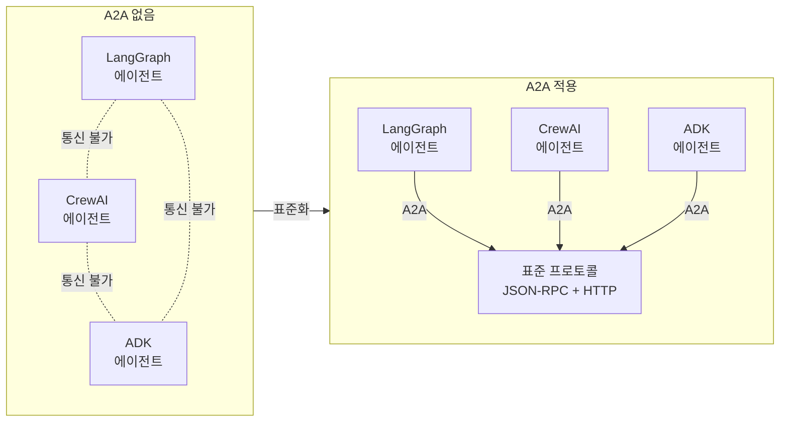
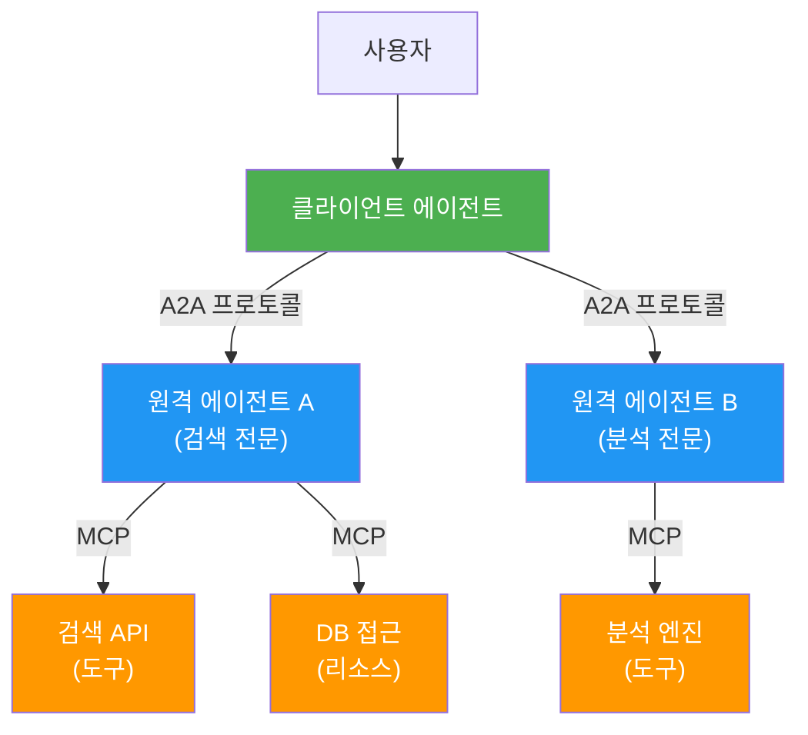
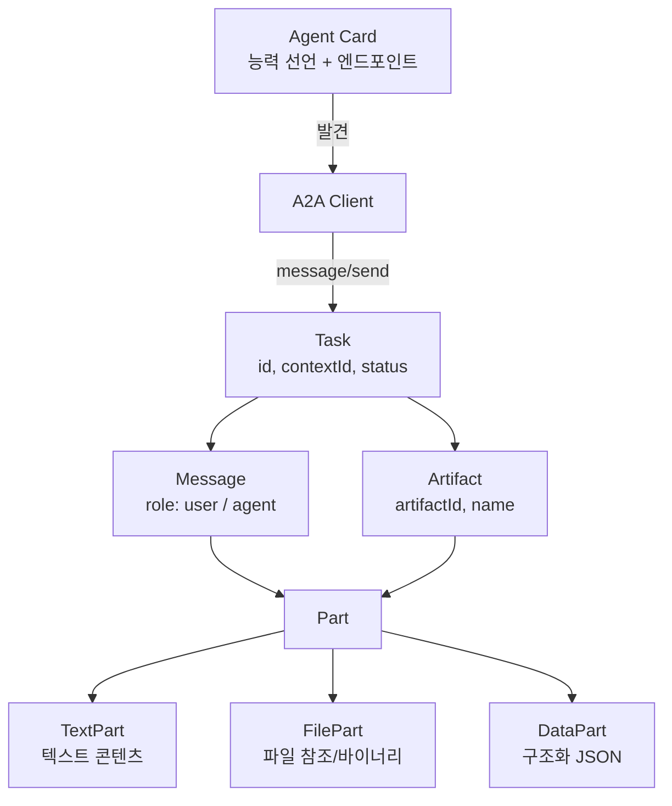
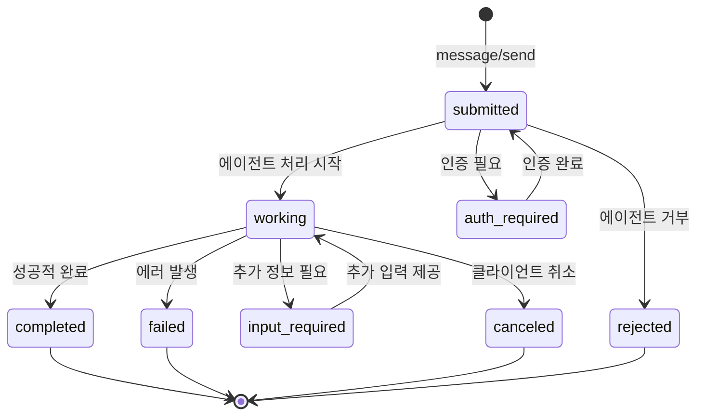
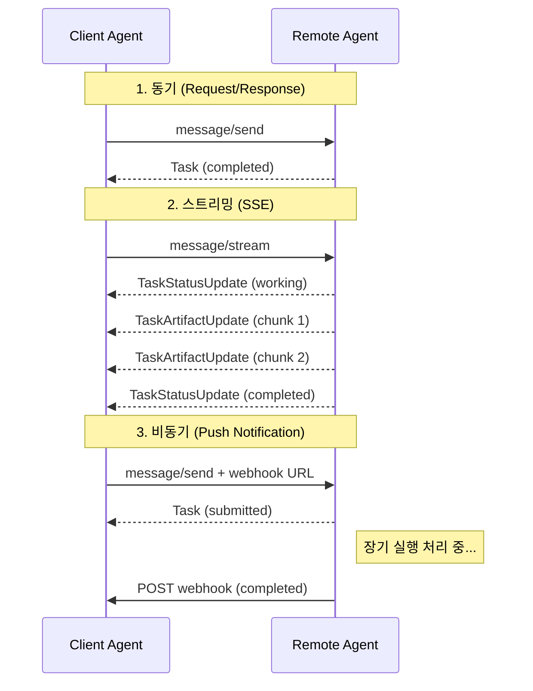

# A2A 프로토콜 개관

> Google 주도의 Agent-to-Agent 프로토콜 — AI 에이전트 간 통신의 새로운 표준

## 개요

이 섹션에서는 AI 에이전트 간 상호운용성을 위한 오픈 프로토콜인 A2A(Agent-to-Agent)의 탄생 배경, 핵심 개념, 그리고 MCP와의 역할 구분을 학습합니다.

**선수 지식**: [MCP 프로토콜 이해](09-ch9-mcp-서버-구축/01-01-mcp-프로토콜-이해.md)에서 배운 MCP의 구조, [MCP 클라이언트 구축](10-ch10-mcp-클라이언트와-에이전트-통합/01-01-mcp-클라이언트-구축.md)에서 다룬 클라이언트-서버 통신 패턴

**학습 목표**:
- A2A 프로토콜이 등장한 배경과 해결하려는 문제를 설명할 수 있다
- Agent Card, Task, Artifact, Message, Part 등 핵심 개념을 이해한다
- MCP와 A2A의 역할 차이를 명확히 구분할 수 있다
- A2A Python SDK로 기본적인 Agent Card를 작성할 수 있다

## 왜 알아야 할까?

여러분이 회사에서 AI 에이전트를 만들었다고 상상해보세요. 고객 문의를 처리하는 에이전트, 재고를 확인하는 에이전트, 배송을 추적하는 에이전트가 각각 다른 팀에서 다른 프레임워크로 만들어졌습니다. 이 에이전트들이 서로 협력해야 할 때 — 예를 들어 고객이 "내 주문 어디쯤 왔어?"라고 물으면 — 어떻게 해야 할까요?

MCP는 에이전트가 **도구와 데이터에 접근**하는 문제를 해결했습니다. 하지만 에이전트가 **다른 에이전트와 대화**하는 건 MCP의 영역이 아닙니다. 마치 MCP가 "연장통(도구)"이라면, A2A는 "동료 간의 대화 규칙"인 셈이죠.

2025년 Google이 50개 이상의 기업과 함께 A2A를 발표한 이유가 바로 이겁니다. 엔터프라이즈 환경에서 에이전트 간 협업 없이는 진정한 자율성을 달성할 수 없기 때문입니다. A2A는 이제 Linux Foundation 산하 오픈소스 프로젝트로, Salesforce, SAP, ServiceNow 같은 대형 플랫폼이 모두 지원합니다. AI 에이전트 개발자라면 반드시 알아야 할 프로토콜입니다.

## 핵심 개념

### 개념 1: A2A가 해결하는 문제 — 에이전트 사일로

> 💡 **비유**: 회사의 각 부서가 다른 언어를 쓴다고 생각해보세요. 영업팀은 영어, 개발팀은 한국어, 법무팀은 일본어. 업무를 하려면 매번 통역사를 불러야 합니다. A2A는 이 부서들이 공통으로 사용하는 **업무 프로토콜** — "요청서를 이 양식으로 쓰면 누구든 읽을 수 있다"는 약속입니다.

현실의 AI 에이전트 생태계에서도 같은 문제가 발생합니다. LangGraph로 만든 에이전트, CrewAI로 만든 에이전트, Google ADK로 만든 에이전트가 각각 **불투명한(opaque) 블랙박스**로 존재합니다. 내부 구현을 공유하지 않으면서도 협업해야 하는 상황이죠.

> 📊 **그림 1**: A2A가 없는 세계 vs A2A가 있는 세계



A2A의 핵심 설계 원칙은 다섯 가지입니다:

1. **에이전트 능력 중심(Agentic Capabilities)**: 에이전트를 단순 "도구"로 격하하지 않고, 독립적인 행위자로 존중
2. **기존 표준 활용**: HTTP, SSE, JSON-RPC 등 검증된 웹 표준 위에 구축
3. **엔터프라이즈 보안**: OAuth2, API Key, mTLS 등 OpenAPI 수준의 인증 체계
4. **장기 실행 태스크 지원**: 몇 초에서 며칠까지 걸리는 작업을 상태 관리와 함께 처리
5. **모달리티 무관(Modality Agnostic)**: 텍스트, 오디오, 비디오, 구조화 데이터 모두 지원

### 개념 2: MCP vs A2A — 상호보완적 프로토콜

> 💡 **비유**: MCP는 요리사가 사용하는 **주방 도구와 식재료 창고** (도구 호출, 데이터 접근)이고, A2A는 여러 요리사가 함께 코스 요리를 만들 때의 **소통 규칙** (주문 전달, 진행 상황 공유, 완성 요리 전달)입니다. 한 요리사가 "디저트 준비됐어?"라고 물을 때 — 그건 도구 호출이 아니라 동료 간의 대화입니다.

MCP와 A2A는 경쟁이 아니라 상호보완 관계입니다. Google 공식 블로그에서도 "A2A complements Anthropic's MCP"라고 명시했습니다.

> 📊 **그림 2**: MCP와 A2A의 역할 구분



| 비교 항목 | MCP | A2A |
|-----------|-----|-----|
| **주도** | Anthropic | Google + Linux Foundation |
| **대상** | 에이전트 ↔ 도구/데이터 | 에이전트 ↔ 에이전트 |
| **통신 모델** | 클라이언트가 서버의 도구를 호출 | 클라이언트가 원격 에이전트에게 태스크 위임 |
| **투명성** | 서버가 스키마를 노출 (도구 목록, 파라미터) | 에이전트는 블랙박스 (내부 구현 비공개) |
| **상태 관리** | Stateless (요청-응답) | Stateful (태스크 라이프사이클) |
| **전송 프로토콜** | JSON-RPC over stdio/SSE | JSON-RPC over HTTP(S), SSE, gRPC |
| **장기 실행** | 기본적으로 동기 | 비동기 + 폴링 + 푸시 알림 |

실전에서는 이 두 프로토콜을 **함께** 사용합니다. 에이전트는 MCP로 자신의 도구에 접근하고, A2A로 다른 에이전트와 협업합니다. 이 조합 아키텍처는 [MCP+A2A 통합 아키텍처](11-ch11-a2a-프로토콜-기초/04-04-mcp-a2a-통합-아키텍처.md)에서 자세히 다룹니다.

### 개념 3: A2A 핵심 구성 요소 — Agent Card, Task, Message, Artifact, Part

A2A 프로토콜의 데이터 모델은 다섯 가지 핵심 요소로 구성됩니다. 하나씩 살펴보겠습니다.

> 💡 **비유**: 프리랜서 플랫폼을 생각해보세요. **Agent Card**는 프리랜서의 프로필 페이지(이름, 전문 분야, 연락처), **Task**는 발주된 프로젝트(상태: 진행 중, 검토 요청, 완료), **Message**는 클라이언트와 프리랜서 간의 채팅, **Artifact**는 납품물(디자인 파일, 보고서), **Part**는 납품물 안의 개별 파일(텍스트, 이미지, 데이터)입니다.

> 📊 **그림 3**: A2A 핵심 데이터 모델 관계



#### Agent Card — 에이전트의 명함

Agent Card는 에이전트가 "나는 누구이고, 무엇을 할 수 있다"를 선언하는 JSON 문서입니다. 보통 `/.well-known/agent.json` 경로에 배포합니다. 여기서는 가장 간단한 형태의 Agent Card를 살펴보겠습니다. 전체 스키마와 고급 설정(다중 스킬, 보안 스킴 등)은 [Agent Card와 능력 선언](11-ch11-a2a-프로토콜-기초/02-02-agent-card와-능력-선언.md)에서 깊이 다룹니다.

```python
from a2a.types import AgentCard, AgentSkill, AgentCapabilities

# 최소한의 Agent Card — 이름, URL, 스킬 하나
agent_card = AgentCard(
    name="Translation Agent",
    description="50개 이상의 언어를 지원하는 실시간 번역 에이전트",
    url="https://translation-agent.example.com/",
    version="1.0.0",
    capabilities=AgentCapabilities(streaming=True),
    skills=[
        AgentSkill(
            id="translate_text",
            name="텍스트 번역",
            description="다국어 텍스트를 실시간으로 번역합니다",
            tags=["translation", "multilingual"],
            examples=["Translate 'hello' to Korean"],
        )
    ],
)
```

이것이 Agent Card의 핵심입니다. `name`, `url`, `skills`만 있으면 다른 에이전트가 이 에이전트를 발견하고 무엇을 할 수 있는지 파악할 수 있죠. 인증 스킴(`AgentAuthentication`), 다중 입출력 모달리티, 푸시 알림 설정 등은 다음 섹션에서 본격적으로 다룹니다.

#### Task — 상태를 가진 작업 단위

Task는 A2A의 핵심 작업 단위입니다. 고유 ID를 가지며, 정의된 라이프사이클을 따라 상태가 전이됩니다.

> 📊 **그림 4**: Task 상태 전이 다이어그램



Task의 상태값(TaskState)은 다음과 같습니다:

| 상태 | 의미 |
|------|------|
| `submitted` | 요청 접수됨 |
| `working` | 에이전트가 처리 중 |
| `input_required` | 추가 입력 대기 중 |
| `completed` | 성공적으로 완료 |
| `failed` | 에러로 실패 |
| `canceled` | 클라이언트가 취소 |
| `rejected` | 에이전트가 거부 |
| `auth_required` | 인증 필요 |

`input_required` 상태가 특히 흥미로운데요 — 에이전트가 작업 중 사용자에게 추가 정보를 요청할 수 있다는 뜻입니다. [Human-in-the-Loop 패턴](07-ch7-human-in-the-loop-워크플로우/01-01-human-in-the-loop-패턴-개관.md)에서 배운 개념과 유사하죠?

#### Message, Artifact, Part

**Message**는 클라이언트와 에이전트 간의 대화 턴입니다. `role` 필드가 `"user"` 또는 `"agent"`로 누가 보낸 건지 구분합니다.

**Artifact**는 에이전트가 생성한 산출물(문서, 이미지, 구조화 데이터)입니다. 고유 `artifactId`와 이름을 가지며, 스트리밍으로 점진적 전달도 가능합니다.

**Part**는 Message와 Artifact 안의 최소 콘텐츠 단위입니다. 세 가지 타입이 있습니다:

```python
# TextPart — 텍스트 콘텐츠
text_part = {"type": "text", "text": "번역 결과입니다: 안녕하세요"}

# FilePart — 파일 (인라인 바이너리 또는 URL 참조)
file_part = {
    "type": "file",
    "file": {
        "url": "https://example.com/report.pdf",
        "mediaType": "application/pdf",
        "filename": "analysis_report.pdf",
    },
}

# DataPart — 구조화된 JSON 데이터
data_part = {
    "type": "data",
    "data": {
        "source_lang": "en",
        "target_lang": "ko",
        "confidence": 0.95,
    },
}
```

### 개념 4: 통신 메커니즘 — 동기, 스트리밍, 비동기

A2A는 세 가지 통신 방식을 지원합니다. 모두 JSON-RPC 2.0 over HTTP(S)를 기반으로 합니다.

> 📊 **그림 5**: A2A의 세 가지 통신 패턴



주요 JSON-RPC 메서드는 다음과 같습니다:

| JSON-RPC 메서드 | SDK 메서드 | 용도 |
|--------|--------|------|
| `message/send` | `send_message()` | 메시지 전송 → Task 또는 Message 반환 |
| `message/stream` | `send_message_streaming()` | 스트리밍으로 실시간 업데이트 수신 (SSE) |
| `tasks/get` | `get_task()` | 태스크 현재 상태 조회 |
| `tasks/list` | `list_tasks()` | 태스크 목록 필터링 조회 |
| `tasks/cancel` | `cancel_task()` | 태스크 취소 요청 |
| `agent/authenticatedExtendedCard` | - | 인증 후 상세 Agent Card 조회 |

> 💡 **알고 계셨나요?**: A2A v0.3 이전에는 이 메서드들이 `SendMessage`, `SendStreamingMessage` 같은 PascalCase 이름이었습니다. v0.3부터 `message/send`, `message/stream` 같은 슬래시 구분 형식으로 표준화되었는데, 이는 JSON-RPC의 네임스페이스 관례(`namespace/method`)를 따른 것입니다. 이 코스에서는 v0.3+ 명명을 사용합니다.

## 실습: 직접 해보기

A2A Python SDK v0.3(`a2a-sdk`)을 사용하여 Agent Card를 정의하고, 간단한 A2A 서버와 클라이언트를 구축해보겠습니다.

### 환경 설정

```python
# A2A Python SDK v0.3 설치
# pip install a2a-sdk uvicorn
# 또는
# uv add a2a-sdk uvicorn
```

### Step 1: Agent Card와 서버 구축

```python
"""a2a_server.py — 간단한 A2A 에이전트 서버"""
import uvicorn
from typing_extensions import override

from a2a.types import (
    AgentCard,
    AgentSkill,
    AgentCapabilities,
    AgentAuthentication,
)
from a2a.server.agent_execution import AgentExecutor, RequestContext
from a2a.server.events import EventQueue
from a2a.server.apps import A2AStarletteApplication
from a2a.server.request_handlers import DefaultRequestHandler
from a2a.server.tasks import InMemoryTaskStore
from a2a.utils import new_agent_text_message


# 1) 에이전트 로직 정의
class GreetingAgent:
    """인사 에이전트 — 다국어 인사를 반환합니다."""

    GREETINGS = {
        "en": "Hello! How can I help you today?",
        "ko": "안녕하세요! 무엇을 도와드릴까요?",
        "ja": "こんにちは！何かお手伝いしましょうか？",
    }

    async def invoke(self, lang: str = "ko") -> str:
        return self.GREETINGS.get(lang, self.GREETINGS["en"])


# 2) AgentExecutor 구현 — A2A 요청을 에이전트 로직에 연결
class GreetingAgentExecutor(AgentExecutor):
    def __init__(self):
        self.agent = GreetingAgent()

    @override
    async def execute(
        self,
        context: RequestContext,
        event_queue: EventQueue,
    ) -> None:
        # 사용자 메시지에서 언어 추출 (간단한 파싱)
        user_text = ""
        if context.message and context.message.parts:
            for part in context.message.parts:
                if hasattr(part, "text"):
                    user_text = part.text
                    break

        lang = "ko"  # 기본 한국어
        if "english" in user_text.lower():
            lang = "en"
        elif "japanese" in user_text.lower():
            lang = "ja"

        result = await self.agent.invoke(lang)
        # 결과를 Message로 이벤트 큐에 전달
        event_queue.enqueue_event(new_agent_text_message(result))

    @override
    async def cancel(
        self,
        context: RequestContext,
        event_queue: EventQueue,
    ) -> None:
        raise Exception("cancel not supported")


# 3) Agent Card 정의 — 최소 구성
greeting_skill = AgentSkill(
    id="greet_user",
    name="다국어 인사",
    description="한국어, 영어, 일본어로 인사합니다",
    tags=["greeting", "multilingual"],
    examples=["안녕", "hello", "english로 인사해줘"],
)

agent_card = AgentCard(
    name="Greeting Agent",
    description="다국어 인사 에이전트 — A2A 프로토콜 학습용",
    url="http://localhost:9999/",
    version="1.0.0",
    defaultInputModes=["text"],
    defaultOutputModes=["text"],
    capabilities=AgentCapabilities(streaming=False),
    skills=[greeting_skill],
    authentication=AgentAuthentication(schemes=["public"]),
)

# 4) 서버 조립 및 실행
if __name__ == "__main__":
    handler = DefaultRequestHandler(
        agent_executor=GreetingAgentExecutor(),
        task_store=InMemoryTaskStore(),
    )
    app_builder = A2AStarletteApplication(
        agent_card=agent_card,
        http_handler=handler,
    )
    uvicorn.run(app_builder.build(), host="0.0.0.0", port=9999)
```

### Step 2: A2A 클라이언트로 메시지 전송

```python
"""a2a_client.py — A2A 클라이언트로 에이전트와 통신"""
import asyncio
from uuid import uuid4
import httpx

from a2a.client import A2AClient
from a2a.types import (
    MessageSendParams,
    SendMessageRequest,
)


async def main():
    async with httpx.AsyncClient() as httpx_client:
        # 1) Agent Card를 자동 발견하여 클라이언트 생성
        client = await A2AClient.get_client_from_agent_card_url(
            httpx_client, "http://localhost:9999"
        )

        # 2) 메시지 전송 (한국어 인사 요청)
        #    SDK의 send_message()는 내부적으로 JSON-RPC 'message/send' 호출
        request = SendMessageRequest(
            params=MessageSendParams(
                message={
                    "role": "user",
                    "parts": [{"type": "text", "text": "안녕하세요!"}],
                    "messageId": uuid4().hex,
                }
            )
        )
        response = await client.send_message(request)
        print("=== 응답 ===")
        print(response.model_dump(mode="json", exclude_none=True))

        # 3) 영어 인사 요청
        request_en = SendMessageRequest(
            params=MessageSendParams(
                message={
                    "role": "user",
                    "parts": [
                        {"type": "text", "text": "Please greet in english"}
                    ],
                    "messageId": uuid4().hex,
                }
            )
        )
        response_en = await client.send_message(request_en)
        print("\n=== English Response ===")
        print(response_en.model_dump(mode="json", exclude_none=True))


if __name__ == "__main__":
    asyncio.run(main())
```

터미널 1에서 서버를 실행하고, 터미널 2에서 클라이언트를 실행하면 다음과 같은 결과를 볼 수 있습니다:

```run:python
# 클라이언트 실행 결과 시뮬레이션
print("=== 응답 ===")
print({
    "result": {
        "role": "agent",
        "parts": [{"type": "text", "text": "안녕하세요! 무엇을 도와드릴까요?"}],
        "messageId": "abc123"
    }
})

print("\n=== English Response ===")
print({
    "result": {
        "role": "agent",
        "parts": [{"type": "text", "text": "Hello! How can I help you today?"}],
        "messageId": "def456"
    }
})
```

```output
=== 응답 ===
{'result': {'role': 'agent', 'parts': [{'type': 'text', 'text': '안녕하세요! 무엇을 도와드릴까요?'}], 'messageId': 'abc123'}}

=== English Response ===
{'result': {'role': 'agent', 'parts': [{'type': 'text', 'text': 'Hello! How can I help you today?'}], 'messageId': 'def456'}}
```

### Step 3: Agent Card 자동 발견 확인

A2A 서버는 `/.well-known/agent.json` 경로로 Agent Card를 자동 노출합니다:

```run:python
# Agent Card 발견 결과 시뮬레이션
import json

agent_card_response = {
    "name": "Greeting Agent",
    "description": "다국어 인사 에이전트 — A2A 프로토콜 학습용",
    "url": "http://localhost:9999/",
    "version": "1.0.0",
    "capabilities": {"streaming": False},
    "skills": [
        {
            "id": "greet_user",
            "name": "다국어 인사",
            "description": "한국어, 영어, 일본어로 인사합니다",
        }
    ],
}
print("GET http://localhost:9999/.well-known/agent.json")
print(json.dumps(agent_card_response, ensure_ascii=False, indent=2))
```

```output
GET http://localhost:9999/.well-known/agent.json
{
  "name": "Greeting Agent",
  "description": "다국어 인사 에이전트 — A2A 프로토콜 학습용",
  "url": "http://localhost:9999/",
  "version": "1.0.0",
  "capabilities": {
    "streaming": false
  },
  "skills": [
    {
      "id": "greet_user",
      "name": "다국어 인사",
      "description": "한국어, 영어, 일본어로 인사합니다"
    }
  ]
}
```

## 더 깊이 알아보기

### A2A의 탄생 스토리

A2A의 탄생은 2024년 후반 Google Cloud 팀의 내부 실험에서 시작됩니다. Google은 Vertex AI Agent Builder로 에이전트를 구축하면서, 고객사의 에이전트와 자사 에이전트가 **상호운용**되어야 한다는 요구를 반복적으로 받았습니다.

문제는 에이전트 프레임워크의 파편화였습니다. LangChain, AutoGen, CrewAI, 각 클라우드 벤더의 자체 솔루션까지 — 모두 다른 방식으로 에이전트를 구현했습니다. MCP가 도구 접근을 표준화했지만, 에이전트 **간**의 통신은 여전히 표준이 없었죠.

2025년 4월, Google은 Salesforce, SAP, Atlassian, MongoDB, Cohere, LangChain 등 **50개 이상의 기업**과 함께 A2A를 공식 발표했습니다. 특히 Deloitte, McKinsey, Accenture 같은 대형 컨설팅 회사들도 참여한 것이 눈길을 끕니다 — 엔터프라이즈 현장에서 실제로 이 문제를 겪고 있었다는 증거입니다.

2025년 6월, A2A는 Linux Foundation 산하 오픈소스 프로젝트로 이관되었고, Apache License 2.0으로 공개되었습니다. 프로토콜 이름도 "Agent2Agent"로 확정되었고, Google이 주도하되 커뮤니티가 함께 발전시키는 구조가 만들어졌습니다.

### 왜 "불투명성(Opacity)"이 핵심인가?

A2A의 가장 독특한 설계 결정은 **에이전트의 불투명성을 보장**한다는 점입니다. MCP 서버는 도구 목록, 파라미터 스키마, 리소스 구조를 클라이언트에게 공개합니다. 하지만 A2A에서 원격 에이전트는 자신의 내부 추론, 프롬프트, 도구 구현을 일절 공개하지 않습니다.

이것은 엔터프라이즈 환경에서 매우 중요합니다. 기업 A의 에이전트와 기업 B의 에이전트가 협업할 때, 각자의 IP(지적 재산)를 보호하면서도 결과물은 교환할 수 있어야 하니까요. "나한테 이 일을 맡겨주면 결과를 줄게. 내가 어떻게 하는지는 묻지 마"라는 원칙입니다.

## 흔한 오해와 팁

> ⚠️ **흔한 오해**: "A2A가 MCP를 대체한다" — 아닙니다! 두 프로토콜은 완전히 다른 계층의 문제를 해결합니다. MCP는 에이전트-도구 통합, A2A는 에이전트-에이전트 통신입니다. 실전에서는 하나의 에이전트가 MCP로 도구에 접근하면서 동시에 A2A로 다른 에이전트와 협업합니다.

> 💡 **알고 계셨나요?**: A2A의 Agent Card 발견 메커니즘(`/.well-known/agent.json`)은 웹의 `robots.txt`나 `/.well-known/openid-configuration`에서 영감을 받았습니다. 웹 표준의 검증된 패턴을 재활용한 거죠. 덕분에 기존 웹 인프라(CDN, 리버스 프록시)와 자연스럽게 호환됩니다.

> 🔥 **실무 팁**: A2A 서버를 개발할 때 Agent Card의 `skills` 배열을 잘 설계하세요. 클라이언트 에이전트는 이 정보를 보고 "이 에이전트에게 이 일을 맡길 수 있나?"를 판단합니다. `description`과 `examples`가 명확할수록 다른 에이전트가 올바른 요청을 보낼 확률이 높아집니다.

## 핵심 정리

| 개념 | 설명 |
|------|------|
| A2A 프로토콜 | 불투명한(opaque) AI 에이전트 간 통신과 협업을 위한 오픈 프로토콜 |
| Agent Card | 에이전트의 능력, 엔드포인트, 인증 정보를 선언하는 JSON 메타데이터 |
| Task | 상태를 가진 작업 단위. submitted → working → completed 등의 라이프사이클 |
| Message | 클라이언트-에이전트 간 대화 턴 (role: user / agent) |
| Artifact | 에이전트가 생성한 산출물 (문서, 데이터 등) |
| Part | Message/Artifact 내 최소 콘텐츠 단위 (TextPart, FilePart, DataPart) |
| MCP vs A2A | MCP = 에이전트↔도구, A2A = 에이전트↔에이전트. 상호보완적 |
| 불투명성(Opacity) | 에이전트 내부 구현을 공개하지 않고도 협업 가능 |
| `message/send` | 메시지 전송 JSON-RPC 메서드 (v0.3+). SDK에서는 `send_message()` |
| `message/stream` | 스트리밍 전송 JSON-RPC 메서드 (v0.3+). SDK에서는 `send_message_streaming()` |
| `/.well-known/agent.json` | Agent Card 자동 발견 경로 |

## 다음 섹션 미리보기

이번 섹션에서 A2A의 큰 그림을 살펴봤습니다. 다음 섹션 [Agent Card와 능력 선언](11-ch11-a2a-프로토콜-기초/02-02-agent-card와-능력-선언.md)에서는 Agent Card의 세부 스키마를 깊이 파고들어, 다중 Skills, OAuth2 인증 스킴, 고급 Capabilities를 실전 수준으로 설계하는 방법을 학습합니다.

## 참고 자료

- [A2A Protocol Official Specification](https://a2a-protocol.org/latest/specification/) - A2A 프로토콜 공식 스펙 문서. 모든 JSON-RPC 메서드와 스키마 정의의 원본
- [A2A GitHub Repository](https://github.com/a2aproject/A2A) - A2A 프로젝트 공식 GitHub. 스펙, SDK, 샘플 코드 포함
- [Google Developers Blog: A2A — A New Era of Agent Interoperability](https://developers.googleblog.com/en/a2a-a-new-era-of-agent-interoperability/) - Google의 A2A 발표 블로그. 탄생 배경과 설계 원칙을 가장 잘 설명
- [A2A Python SDK (a2a-python)](https://github.com/a2aproject/a2a-python) - A2A 공식 Python SDK v0.3. AgentCard, A2AClient, A2AServer 등 핵심 클래스 제공
- [A2A Core Concepts](https://a2a-protocol.org/latest/topics/key-concepts/) - Agent Card, Task, Message, Artifact, Part 등 핵심 개념의 공식 설명
- [Linux Foundation A2A Project Launch](https://www.linuxfoundation.org/press/linux-foundation-launches-the-agent2agent-protocol-project-to-enable-secure-intelligent-communication-between-ai-agents) - Linux Foundation의 A2A 프로젝트 공식 발표

---
### 🔗 Related Sessions
- [mcp](09-ch9-mcp-서버-구축/01-01-mcp-프로토콜-이해.md) (prerequisite)
