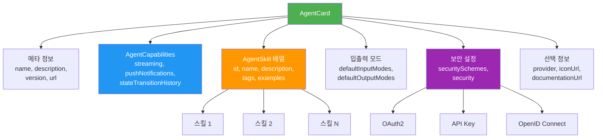
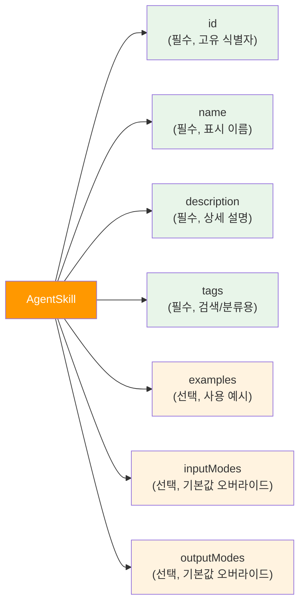
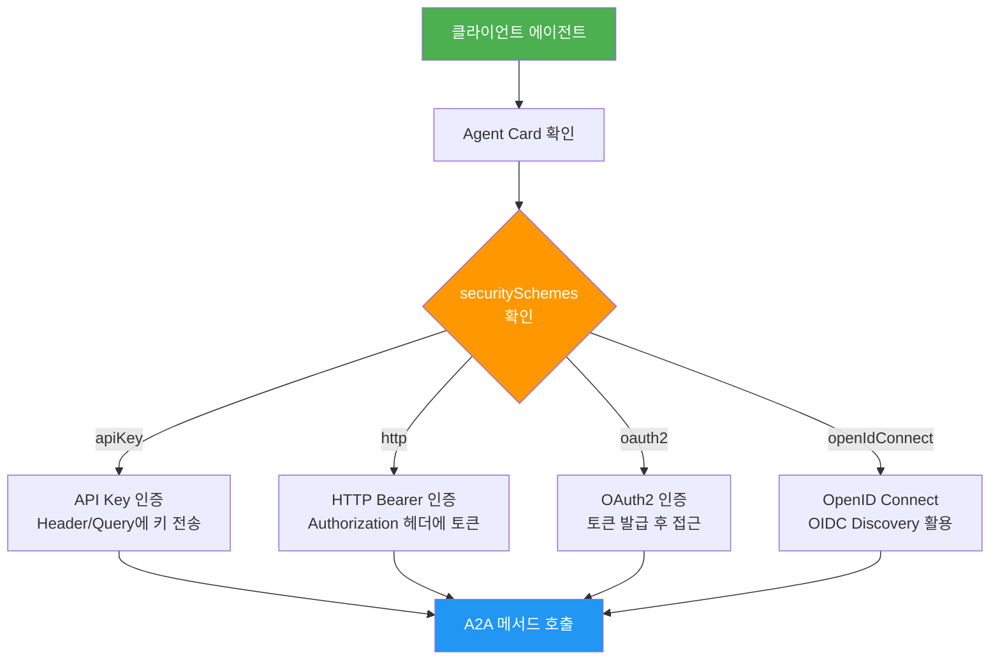
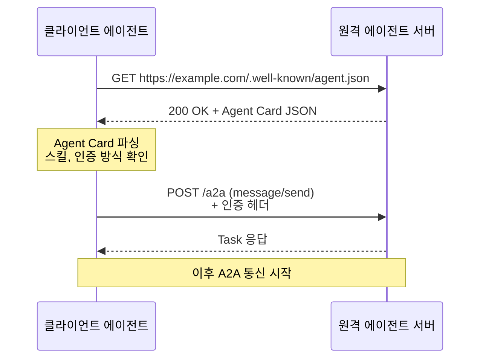

# Agent Card와 능력 선언

> A2A 에이전트의 명함 — Agent Card JSON 스키마, 스킬 정의, 인증 설정, 그리고 에이전트 디스커버리 메커니즘

## 개요

이 섹션에서는 A2A 프로토콜의 핵심 데이터 구조인 **Agent Card**를 깊이 있게 학습합니다. Agent Card의 전체 JSON 스키마를 분석하고, 스킬(Skill) 선언으로 에이전트의 능력을 표현하며, 인증 스킴(Security Scheme)을 설정하고, `.well-known` 디스커버리 메커니즘으로 에이전트를 자동 발견하는 방법을 배웁니다.

**선수 지식**: [A2A 프로토콜 개관](11-ch11-a2a-프로토콜-기초/01-01-a2a-프로토콜-개관.md)에서 배운 A2A의 핵심 개념(Agent Card, Task, Message, Part)과 기본 서버 구축 경험

**학습 목표**:
- Agent Card JSON 스키마의 필수/선택 필드를 정확히 이해하고 작성할 수 있다
- AgentSkill로 에이전트의 능력을 체계적으로 선언할 수 있다
- SecurityScheme을 활용하여 OAuth2, API Key, mTLS 인증을 설정할 수 있다
- `.well-known/agent.json` 디스커버리 메커니즘의 동작 원리를 설명할 수 있다

## 왜 알아야 할까?

여러분이 새 회사에 입사했다고 상상해보세요. 첫 출근날 가장 먼저 하는 건 뭘까요? **명함 교환**입니다. 명함에는 이름, 직책, 전문 분야, 연락처가 적혀 있어서, 상대방이 "이 사람에게 어떤 업무를 맡길 수 있는지" 즉시 파악할 수 있습니다.

Agent Card는 AI 에이전트 세계의 명함입니다. 하지만 사람의 명함보다 훨씬 구조화되어 있죠 — 이 에이전트가 **무엇을 할 수 있는지**(Skills), **어떤 형식의 데이터를 주고받는지**(Input/Output Modes), **어떻게 인증해야 하는지**(Security Schemes)까지 기계가 읽을 수 있는 JSON 형식으로 담겨 있습니다.

Agent Card를 잘 설계하면 클라이언트 에이전트가 **자동으로** 원격 에이전트를 발견하고, 능력을 파악하고, 적절한 태스크를 위임할 수 있습니다. 반대로 Agent Card가 부실하면? 아무리 뛰어난 에이전트도 다른 에이전트에게 "발견"되지 못하는 고립된 존재가 됩니다.

## 핵심 개념

### 개념 1: Agent Card 전체 스키마 — 에이전트의 신분증

> 💡 **비유**: Agent Card는 마치 **레스토랑의 상세 프로필 페이지**와 같습니다. 가게 이름, 주소, 메뉴(스킬), 영업 시간, 예약 방법(인증), 결제 수단(입출력 모드), 별점과 리뷰(capabilities) 등 — 손님(클라이언트 에이전트)이 방문 전에 알아야 할 모든 정보가 담겨 있습니다.

Agent Card는 A2A 프로토콜의 **진입점(entry point)**입니다. 클라이언트 에이전트가 원격 에이전트와 통신하기 전에 반드시 먼저 읽는 JSON 문서이죠. 현재 안정 버전인 v0.3.0 기준으로 전체 스키마를 살펴보겠습니다.

> 📊 **그림 1**: Agent Card JSON 스키마 구조



Agent Card의 필드를 역할별로 분류하면 이렇습니다:

| 분류 | 필드 | 필수 | 설명 |
|------|------|:----:|------|
| **식별** | `name` | ✅ | 에이전트의 이름 (사람이 읽기 쉬운 형태) |
| **식별** | `description` | ✅ | 에이전트 기능 설명 (CommonMark 지원) |
| **식별** | `url` | ✅ | A2A 서비스의 절대 HTTPS URL |
| **식별** | `version` | ✅ | 에이전트 버전 (예: "1.0.0") |
| **능력** | `capabilities` | ✅ | 프로토콜 기능 지원 여부 |
| **능력** | `skills` | ✅ | 에이전트가 수행할 수 있는 작업 목록 |
| **입출력** | `defaultInputModes` | ✅ | 수신 가능한 MIME 타입 |
| **입출력** | `defaultOutputModes` | ✅ | 생성 가능한 MIME 타입 |
| **프로토콜** | `protocolVersion` | ❌ | 기본값 "0.3.0" |
| **보안** | `securitySchemes` | ❌ | 인증 방식 정의 |
| **보안** | `security` | ❌ | 인증 요구사항 (OR-of-ANDs) |
| **기타** | `provider` | ❌ | 제공 조직 정보 |
| **기타** | `iconUrl` | ❌ | 에이전트 아이콘 |
| **기타** | `documentationUrl` | ❌ | 문서 링크 |

실제 Agent Card JSON이 어떻게 생겼는지 보겠습니다:

```python
"""Agent Card의 기본 구조 — Python 딕셔너리로 표현"""
agent_card_json = {
    # === 필수 필드 ===
    "name": "코드 리뷰 에이전트",
    "description": "Python 코드의 보안 취약점, 성능 이슈, 스타일 위반을 검토합니다",
    "url": "https://code-review-agent.example.com/a2a",
    "version": "2.1.0",

    # 프로토콜 기능 지원
    "capabilities": {
        "streaming": True,           # SSE 스트리밍 지원
        "pushNotifications": False,  # 푸시 알림 미지원
        "stateTransitionHistory": True  # 상태 전이 이력 제공
    },

    # 입출력 MIME 타입
    "defaultInputModes": ["text/plain", "application/json"],
    "defaultOutputModes": ["application/json", "text/plain"],

    # 스킬 목록 (최소 1개 필수)
    "skills": [
        {
            "id": "security-scan",
            "name": "보안 취약점 스캔",
            "description": "OWASP Top 10 기반 보안 취약점을 탐지합니다",
            "tags": ["security", "code-review", "owasp"],
            "examples": ["이 Python 코드의 SQL 인젝션 취약점을 찾아줘"]
        }
    ],

    # === 선택 필드 ===
    "protocolVersion": "0.3.0",
    "provider": {
        "organization": "SecureCode Inc.",
        "url": "https://securecode.example.com"
    },
    "iconUrl": "https://code-review-agent.example.com/icon.png",
    "documentationUrl": "https://docs.securecode.example.com/api"
}
```

> ⚠️ **흔한 오해**: "`url` 필드에 에이전트의 홈페이지 URL을 넣으면 되겠지?"라고 생각할 수 있는데, 아닙니다. `url`은 **A2A JSON-RPC 엔드포인트**의 베이스 URL이어야 합니다. 실제로 `message/send`, `message/stream` 같은 A2A 메서드가 이 URL로 요청됩니다. 홈페이지 URL은 `provider.url`이나 `documentationUrl`에 넣으세요.

### 개념 2: AgentSkill — 에이전트가 할 수 있는 일을 선언하기

> 💡 **비유**: AgentSkill은 프리랜서의 **포트폴리오 항목**과 같습니다. "로고 디자인 가능, 반응형 웹사이트 제작 가능, UI/UX 리서치 가능" — 각 항목에 카테고리 태그(`#design`, `#web`)와 포트폴리오 예시가 붙어 있어서, 클라이언트가 "이 프리랜서에게 이 일을 맡겨도 되겠다"고 판단할 수 있죠.

AgentSkill은 에이전트가 수행할 수 있는 **개별 작업의 능력 선언**입니다. 하나의 Agent Card에 여러 스킬을 등록할 수 있으며, 각 스킬은 독립적인 입출력 모드를 가질 수 있습니다.

> 📊 **그림 2**: AgentSkill 스키마와 필드 관계



AgentSkill의 전체 필드를 정리하면:

| 필드 | 타입 | 필수 | 설명 |
|------|------|:----:|------|
| `id` | string | ✅ | 고유 식별자 (예: `"route-optimizer"`) |
| `name` | string | ✅ | 사람이 읽기 쉬운 이름 |
| `description` | string | ✅ | 상세 설명 (LLM이 이 텍스트로 적합성을 판단) |
| `tags` | string[] | ✅ | 검색/분류를 위한 태그 |
| `examples` | string[] | ❌ | 사용 예시 프롬프트 |
| `inputModes` | string[] | ❌ | 이 스킬의 입력 MIME (기본값 오버라이드) |
| `outputModes` | string[] | ❌ | 이 스킬의 출력 MIME (기본값 오버라이드) |

여기서 **`description`과 `tags`의 품질**이 매우 중요합니다. 클라이언트 에이전트의 LLM이 이 텍스트를 읽고 "이 에이전트에게 이 태스크를 위임해도 되겠다"고 판단하기 때문입니다. 마치 검색 엔진 최적화(SEO)와 비슷하죠 — 정확하고 구체적인 설명이 필요합니다.

```python
"""잘 설계된 스킬 vs 부실한 스킬 비교"""
from a2a.types import AgentSkill

# ❌ 부실한 스킬 정의 — 클라이언트가 판단하기 어려움
bad_skill = AgentSkill(
    id="analyze",
    name="분석",                      # 너무 모호한 이름
    description="데이터를 분석합니다",   # 무엇을 어떻게?
    tags=["data"],                    # 태그가 1개뿐
)

# ✅ 잘 설계된 스킬 정의 — 클라이언트가 즉시 판단 가능
good_skill = AgentSkill(
    id="sentiment-analysis-korean",
    name="한국어 감성 분석기",
    description=(
        "한국어 텍스트의 감성을 긍정/부정/중립으로 분류합니다. "
        "상품 리뷰, SNS 게시글, 고객 피드백에 최적화되어 있으며, "
        "감성 점수(-1.0~1.0)와 근거 문장을 함께 반환합니다."
    ),
    tags=["nlp", "sentiment", "korean", "text-analysis", "review"],
    examples=[
        "이 상품 리뷰들의 전반적인 감성을 분석해줘",
        "고객 피드백 100건의 긍정/부정 비율을 알려줘",
    ],
    input_modes=["text/plain", "application/json"],
    output_modes=["application/json"],
)
```

> 🔥 **실무 팁**: `examples` 필드는 선택 사항이지만, 실무에서는 **반드시 작성**하세요. 클라이언트 에이전트가 "이 스킬에 어떤 형식으로 요청해야 하는지" 판단하는 가장 직관적인 참고 자료입니다. Few-shot 프롬프팅과 같은 원리입니다.

### 개념 3: AgentCapabilities — 프로토콜 기능 지원 선언

> 💡 **비유**: AgentCapabilities는 호텔의 **시설 안내표**와 같습니다. "Wi-Fi 무료, 수영장 있음, 주차장 없음, 룸서비스 24시간" — 투숙하기 전에 이 호텔이 어떤 서비스를 제공하는지 한눈에 파악할 수 있죠.

AgentCapabilities는 에이전트가 **A2A 프로토콜 수준에서 지원하는 기능**을 선언합니다. 이건 "무엇을 할 수 있느냐"(Skills)가 아니라 "어떤 방식으로 소통할 수 있느냐"에 관한 것입니다.

```python
from a2a.types import AgentCapabilities

# 기본적인 요청-응답만 지원하는 에이전트
basic_capabilities = AgentCapabilities(
    streaming=False,                # SSE 스트리밍 미지원
    push_notifications=False,       # 푸시 알림 미지원
    state_transition_history=False, # 상태 이력 미제공
)

# 엔터프라이즈급 풀 기능 에이전트
advanced_capabilities = AgentCapabilities(
    streaming=True,                 # 실시간 진행 상황 스트리밍
    push_notifications=True,        # 장기 실행 태스크 완료 알림
    state_transition_history=True,  # 디버깅용 상태 전이 이력
)
```

세 가지 기능이 각각 어떤 상황에서 필요한지 정리하면:

| 기능 | 기본값 | 사용 시나리오 |
|------|--------|-------------|
| `streaming` | false | 긴 응답을 실시간으로 보여줘야 할 때 (코드 생성, 문서 작성) |
| `pushNotifications` | false | 태스크가 수분~수시간 걸릴 때 (모델 학습, 대용량 분석) |
| `stateTransitionHistory` | false | 디버깅이 중요한 엔터프라이즈 환경 |

### 개념 4: 보안 설정 — SecurityScheme과 인증 흐름

> 💡 **비유**: 건물에 들어갈 때 상황에 따라 다른 인증이 필요하듯 — 로비는 자유 출입, 사무실은 사원증(API Key), 서버실은 지문+사원증(mTLS+OAuth2) — A2A도 에이전트마다 다른 수준의 인증을 요구할 수 있습니다.

A2A의 `securitySchemes`는 **OpenAPI 3.0의 Security Scheme Object**와 동일한 형식을 따릅니다. 웹 API 개발 경험이 있다면 익숙하실 거예요. 지원하는 인증 타입은 네 가지입니다:

> 📊 **그림 3**: A2A 보안 인증 타입과 적용 시나리오



각 인증 타입의 JSON 설정을 살펴보겠습니다:

```python
"""네 가지 인증 타입 설정 예시"""

# 1) API Key — 가장 간단. 개발/테스트용에 적합
apikey_scheme = {
    "securitySchemes": {
        "apiKey": {
            "type": "apiKey",
            "in": "header",             # header, query, cookie 중 선택
            "name": "X-API-Key"         # 헤더 이름
        }
    },
    "security": [{"apiKey": []}]        # 빈 배열 = 스코프 없음
}

# 2) HTTP Bearer Token — JWT 등 토큰 기반
bearer_scheme = {
    "securitySchemes": {
        "bearer": {
            "type": "http",
            "scheme": "bearer",
            "bearerFormat": "JWT"        # 선택: 토큰 형식 힌트
        }
    },
    "security": [{"bearer": []}]
}

# 3) OAuth2 — 엔터프라이즈 표준. Client Credentials 플로우
oauth2_scheme = {
    "securitySchemes": {
        "oauth2": {
            "type": "oauth2",
            "flows": {
                "clientCredentials": {   # M2M(에이전트 간) 통신에 적합
                    "tokenUrl": "https://auth.example.com/oauth/token",
                    "scopes": {
                        "agent:read": "에이전트 정보 읽기",
                        "task:write": "태스크 생성 및 수정"
                    }
                }
            }
        }
    },
    "security": [{"oauth2": ["agent:read", "task:write"]}]
}

# 4) OpenID Connect — Google, Azure AD 등과 통합
oidc_scheme = {
    "securitySchemes": {
        "google": {
            "type": "openIdConnect",
            "openIdConnectUrl": (
                "https://accounts.google.com/"
                ".well-known/openid-configuration"
            )
        }
    },
    "security": [{"google": ["openid", "profile", "email"]}]
}
```

`security` 필드는 **OR-of-ANDs** 패턴을 따릅니다. 이게 무슨 뜻이냐면:

```python
# 클라이언트는 아래 두 옵션 중 하나로 인증하면 됩니다 (OR)
security_example = [
    {"google": ["openid", "profile"]},  # 옵션 1: Google OIDC
    {"apiKey": []}                       # 옵션 2: API Key
]

# AND가 필요한 경우 — 하나의 딕셔너리에 여러 스킴을 넣습니다
security_strict = [
    {
        "oauth2": ["task:write"],        # OAuth2 AND
        "apiKey": []                     # API Key — 둘 다 필요
    }
]
```

> 💡 **알고 계셨나요?**: A2A v1.0(2026년 3월 릴리스)에서는 **mTLS(Mutual TLS)** 인증과 OAuth2 **Device Code** 플로우가 새로 추가되었습니다. mTLS는 양방향 인증서 검증으로, 에이전트 간 제로트러스트 네트워크에서 특히 유용합니다. 또한 보안이 강화되어 OAuth2의 `implicit`과 `password` 플로우는 제거되었죠 — OAuth BCP(Best Current Practice)의 권고를 반영한 겁니다.

### 개념 5: 에이전트 디스커버리 — `.well-known` 메커니즘

> 💡 **비유**: 웹사이트의 `robots.txt`를 아시나요? 검색엔진 크롤러가 웹사이트에 방문하면 **항상 정해진 위치**(`/robots.txt`)를 먼저 확인하여 크롤링 규칙을 파악합니다. A2A의 `.well-known/agent.json`도 같은 원리입니다 — 클라이언트 에이전트가 정해진 위치를 조회하면 Agent Card를 발견할 수 있습니다.

A2A는 **RFC 8615**(Well-Known URIs) 표준을 활용하여 에이전트 디스커버리를 구현합니다. 동작 방식은 놀랍도록 단순합니다:

> 📊 **그림 4**: 에이전트 디스커버리 흐름



A2A 사양에서는 세 가지 디스커버리 전략을 정의합니다:

| 전략 | 설명 | 적합한 상황 |
|------|------|-------------|
| **Well-Known URI** | `/.well-known/agent.json`에 GET 요청 | 공개 에이전트 자동 발견 |
| **큐레이션 레지스트리** | 중앙 저장소에 Agent Card 등록/검색 | 엔터프라이즈 에이전트 마켓플레이스 |
| **직접 설정** | URL을 환경변수, 설정 파일에 하드코딩 | 사내 에이전트 간 연동 |

Python SDK의 `A2AStarletteApplication`은 서버를 시작할 때 자동으로 `.well-known/agent.json` 엔드포인트를 등록해줍니다. 별도 라우팅 설정이 필요 없다는 뜻이죠.

```run:python
# 디스커버리 시뮬레이션 — 에이전트 카드 발견과 파싱
import json

# 실제로는 HTTP GET으로 가져오는 Agent Card JSON
agent_card_json = {
    "name": "여행 플래너 에이전트",
    "description": "항공편, 호텔, 관광지를 포함한 여행 계획을 수립합니다",
    "url": "https://travel-planner.example.com/a2a",
    "version": "1.3.0",
    "capabilities": {"streaming": True},
    "defaultInputModes": ["text/plain"],
    "defaultOutputModes": ["application/json", "text/plain"],
    "skills": [
        {
            "id": "trip-planning",
            "name": "여행 일정 수립",
            "description": "출발지, 목적지, 기간을 기반으로 최적 여행 일정을 생성합니다",
            "tags": ["travel", "planning", "itinerary"],
            "examples": ["서울에서 도쿄 3박 4일 여행 계획 세워줘"],
        },
        {
            "id": "flight-search",
            "name": "항공편 검색",
            "description": "최저가 항공편을 검색하고 비교합니다",
            "tags": ["travel", "flights", "booking"],
            "examples": ["인천-나리타 다음 주 금요일 왕복 항공편 찾아줘"],
        },
    ],
}

# 클라이언트가 Agent Card를 파싱하여 능력 판단
print(f"에이전트: {agent_card_json['name']}")
print(f"설명: {agent_card_json['description']}")
print(f"스트리밍 지원: {agent_card_json['capabilities']['streaming']}")
print(f"\n등록된 스킬 {len(agent_card_json['skills'])}개:")
for skill in agent_card_json["skills"]:
    print(f"  - [{skill['id']}] {skill['name']}")
    print(f"    태그: {', '.join(skill['tags'])}")
```

```output
에이전트: 여행 플래너 에이전트
설명: 항공편, 호텔, 관광지를 포함한 여행 계획을 수립합니다
스트리밍 지원: True

등록된 스킬 2개:
  - [trip-planning] 여행 일정 수립
    태그: travel, planning, itinerary
  - [flight-search] 항공편 검색
    태그: travel, flights, booking
```

### 개념 6: Extended Agent Card — 인증 후 확장 정보

때로는 Agent Card의 모든 정보를 공개하고 싶지 않을 수 있습니다. 예를 들어, 내부 전용 스킬이나 민감한 엔드포인트 정보는 인증된 클라이언트에게만 노출해야 하죠.

이를 위해 A2A는 **Extended Agent Card** 메커니즘을 제공합니다:

1. 공개 Agent Card에 `supportsAuthenticatedExtendedCard: true` 설정
2. 클라이언트가 `securitySchemes`에 정의된 방식으로 인증
3. `agent/getAuthenticatedExtendedCard` JSON-RPC 메서드 호출
4. 추가 스킬, 상세 설정이 포함된 확장 카드 수신

```python
"""Extended Agent Card 개념 예시"""

# 공개 Agent Card — 누구나 볼 수 있음
public_card = {
    "name": "HR 어시스턴트 에이전트",
    "description": "인사 관련 일반 문의에 응답합니다",
    "url": "https://hr-agent.internal.company.com/a2a",
    "version": "2.0.0",
    "capabilities": {"streaming": True},
    "defaultInputModes": ["text/plain"],
    "defaultOutputModes": ["text/plain"],
    "skills": [
        {
            "id": "policy-faq",
            "name": "사내 정책 FAQ",
            "description": "휴가, 복리후생 등 일반 인사 정책 문의",
            "tags": ["hr", "policy", "faq"],
        }
    ],
    # 인증하면 더 많은 스킬이 보입니다
    "supportsAuthenticatedExtendedCard": True,
    "securitySchemes": {
        "internal_oauth": {
            "type": "oauth2",
            "flows": {
                "clientCredentials": {
                    "tokenUrl": "https://auth.company.com/token",
                    "scopes": {"hr:read": "HR 데이터 읽기"}
                }
            }
        }
    },
    "security": [{"internal_oauth": ["hr:read"]}],
}

# Extended Agent Card — 인증 후에만 볼 수 있는 추가 스킬
extended_skills = [
    {
        "id": "salary-lookup",
        "name": "급여 조회",        # 민감 정보 — 공개 불가
        "description": "직원 개인 급여 내역을 조회합니다",
        "tags": ["hr", "salary", "confidential"],
    },
    {
        "id": "performance-review",
        "name": "성과 평가 조회",    # 권한 필요
        "description": "분기별 성과 평가 결과를 조회합니다",
        "tags": ["hr", "performance", "review"],
    },
]
```

## 실습: 직접 해보기

실제 A2A Python SDK를 사용하여 **다중 스킬 에이전트**의 Agent Card를 설계하고, 서버로 띄우고, 클라이언트에서 디스커버리하는 전체 과정을 구현합니다.

### 환경 준비

```console
pip install a2a-sdk uvicorn httpx
# 또는
uv add a2a-sdk uvicorn httpx
```

### Step 1: 다중 스킬 Agent Card 정의

```python
"""multi_skill_server.py — 데이터 분석 에이전트 서버"""
import uvicorn
from typing_extensions import override

from a2a.types import (
    AgentCard,
    AgentSkill,
    AgentCapabilities,
)
from a2a.server.agent_execution import AgentExecutor, RequestContext
from a2a.server.events import EventQueue
from a2a.server.apps import A2AStarletteApplication
from a2a.server.request_handlers import DefaultRequestHandler
from a2a.server.tasks import InMemoryTaskStore
from a2a.utils import new_agent_text_message


# === 1) 스킬 정의 ===

# 스킬 1: CSV 분석
csv_analysis_skill = AgentSkill(
    id="csv-analysis",
    name="CSV 데이터 분석",
    description=(
        "CSV 파일을 읽어 기술 통계, 상관관계, 결측치 분석을 수행합니다. "
        "Pandas 기반으로 동작하며, 분석 결과를 JSON 형식으로 반환합니다."
    ),
    tags=["data", "csv", "analysis", "statistics", "pandas"],
    examples=[
        "sales.csv 파일의 기본 통계를 분석해줘",
        "이 CSV에서 결측치가 있는 컬럼을 찾아줘",
    ],
    input_modes=["text/csv", "application/json"],
    output_modes=["application/json"],
)

# 스킬 2: 차트 생성
chart_skill = AgentSkill(
    id="chart-generation",
    name="데이터 시각화 차트 생성",
    description=(
        "분석 데이터를 기반으로 막대그래프, 라인차트, 산점도 등을 생성합니다. "
        "Matplotlib/Seaborn 기반이며, PNG 이미지로 반환합니다."
    ),
    tags=["data", "visualization", "chart", "matplotlib"],
    examples=[
        "월별 매출 추이를 라인 차트로 그려줘",
        "카테고리별 판매량 막대그래프를 만들어줘",
    ],
    input_modes=["application/json"],
    output_modes=["image/png", "application/json"],
)

# 스킬 3: 인사이트 요약
insight_skill = AgentSkill(
    id="data-insight",
    name="데이터 인사이트 요약",
    description=(
        "데이터 분석 결과를 사람이 읽기 쉬운 한국어 인사이트로 요약합니다. "
        "주요 트렌드, 이상치, 핵심 지표를 하이라이트합니다."
    ),
    tags=["data", "insight", "summary", "korean", "nlp"],
    examples=[
        "이번 분기 판매 데이터에서 핵심 인사이트 3개를 뽑아줘",
        "이 분석 결과를 경영진 보고용으로 요약해줘",
    ],
)


# === 2) Agent Card 조립 ===

agent_card = AgentCard(
    name="데이터 애널리스트 에이전트",
    description=(
        "CSV 데이터 분석, 시각화 차트 생성, "
        "인사이트 요약을 수행하는 데이터 분석 에이전트입니다."
    ),
    url="http://localhost:8080/",
    version="1.0.0",
    capabilities=AgentCapabilities(
        streaming=True,
        push_notifications=False,
        state_transition_history=True,
    ),
    default_input_modes=["text/plain", "application/json"],
    default_output_modes=["application/json", "text/plain"],
    skills=[csv_analysis_skill, chart_skill, insight_skill],
)


# === 3) AgentExecutor 구현 ===

class DataAnalystExecutor(AgentExecutor):
    """데이터 분석 에이전트 실행기 — 요청을 받아 결과를 반환합니다."""

    @override
    async def execute(
        self,
        context: RequestContext,
        event_queue: EventQueue,
    ) -> None:
        # 사용자 메시지에서 텍스트 추출
        user_message = context.get_user_input()
        query = user_message or "데이터를 분석해주세요"

        # 간단한 데모 응답 (실제로는 Pandas 분석 로직)
        result = (
            f"분석 요청을 받았습니다: '{query}'\n"
            f"등록된 스킬: {', '.join(s.name for s in agent_card.skills)}\n"
            f"분석 결과가 준비되면 스트리밍으로 전달합니다."
        )

        # 결과를 이벤트 큐에 전송
        await event_queue.enqueue_event(
            new_agent_text_message(result)
        )


# === 4) 서버 구동 ===

if __name__ == "__main__":
    request_handler = DefaultRequestHandler(
        agent_executor=DataAnalystExecutor(),
        task_store=InMemoryTaskStore(),
    )

    # A2AStarletteApplication이 자동으로 아래 엔드포인트를 등록:
    # - GET /.well-known/agent.json → Agent Card 반환
    # - POST / → A2A JSON-RPC 요청 처리
    server = A2AStarletteApplication(
        agent_card=agent_card,
        http_handler=request_handler,
    )

    print("데이터 애널리스트 에이전트 서버 시작")
    print("Agent Card: http://localhost:8080/.well-known/agent.json")
    uvicorn.run(server.build(), host="0.0.0.0", port=8080)
```

### Step 2: 클라이언트에서 Agent Card 디스커버리

```python
"""discover_agent.py — Agent Card를 발견하고 파싱하는 클라이언트"""
import httpx
import json


async def discover_agent(base_url: str) -> dict:
    """Well-Known URI로 Agent Card를 가져옵니다."""
    well_known_url = f"{base_url}/.well-known/agent.json"

    async with httpx.AsyncClient() as client:
        response = await client.get(well_known_url)
        response.raise_for_status()
        return response.json()


def analyze_agent_card(card: dict) -> None:
    """Agent Card를 분석하여 능력을 요약합니다."""
    print(f"=== 에이전트 발견: {card['name']} ===")
    print(f"설명: {card['description']}")
    print(f"버전: {card['version']}")
    print(f"엔드포인트: {card['url']}")

    # 능력 확인
    caps = card.get("capabilities", {})
    print(f"\n[프로토콜 기능]")
    print(f"  스트리밍: {'지원' if caps.get('streaming') else '미지원'}")
    print(f"  푸시 알림: {'지원' if caps.get('pushNotifications') else '미지원'}")

    # 스킬 목록
    skills = card.get("skills", [])
    print(f"\n[등록 스킬: {len(skills)}개]")
    for skill in skills:
        print(f"  [{skill['id']}] {skill['name']}")
        print(f"    → {skill['description'][:60]}...")
        if skill.get("tags"):
            print(f"    태그: {', '.join(skill['tags'])}")
        if skill.get("examples"):
            print(f"    예시: {skill['examples'][0]}")

    # 보안 확인
    if card.get("securitySchemes"):
        print(f"\n[인증 필요]")
        for name, scheme in card["securitySchemes"].items():
            print(f"  {name}: {scheme['type']}")
    else:
        print(f"\n[인증 불필요 — 공개 에이전트]")

    # 입출력 모드
    print(f"\n[입력 모드]: {', '.join(card.get('defaultInputModes', []))}")
    print(f"[출력 모드]: {', '.join(card.get('defaultOutputModes', []))}")


def select_skill_for_task(card: dict, task_description: str) -> dict | None:
    """태스크 설명과 스킬 태그를 매칭하여 적합한 스킬을 선택합니다."""
    keywords = task_description.lower().split()
    best_match = None
    best_score = 0

    for skill in card.get("skills", []):
        # 태그 + 설명에서 키워드 매칭 (간단한 TF 방식)
        searchable = " ".join(skill.get("tags", [])) + " " + skill.get("description", "")
        score = sum(1 for kw in keywords if kw in searchable.lower())
        if score > best_score:
            best_score = score
            best_match = skill

    return best_match


# 사용 예시 (서버가 실행 중일 때)
# import asyncio
# card = asyncio.run(discover_agent("http://localhost:8080"))
# analyze_agent_card(card)
# matched = select_skill_for_task(card, "CSV 데이터 통계 분석")
# print(f"\n매칭된 스킬: {matched['name']}")
```

### Step 3: 보안이 설정된 Agent Card

```python
"""secured_agent.py — OAuth2 인증이 적용된 에이전트 서버"""
from a2a.types import (
    AgentCard,
    AgentSkill,
    AgentCapabilities,
)

# 보안 스킴 포함 Agent Card
secured_agent_card = AgentCard(
    name="금융 분석 에이전트",
    description="실시간 시장 데이터 분석과 투자 포트폴리오 최적화를 수행합니다",
    url="https://finance-agent.example.com/a2a",
    version="1.0.0",
    capabilities=AgentCapabilities(
        streaming=True,
        push_notifications=True,       # 장기 분석 완료 알림
        state_transition_history=True,  # 규제 준수를 위한 감사 추적
    ),
    default_input_modes=["application/json"],
    default_output_modes=["application/json"],
    skills=[
        AgentSkill(
            id="market-analysis",
            name="시장 동향 분석",
            description="실시간 주가, 환율, 원자재 데이터를 분석하여 시장 동향을 제공합니다",
            tags=["finance", "market", "analysis", "realtime"],
            examples=["오늘 KOSPI 주요 섹터별 등락률을 분석해줘"],
        ),
        AgentSkill(
            id="portfolio-optimization",
            name="포트폴리오 최적화",
            description="현대 포트폴리오 이론(MPT) 기반 최적 자산 배분을 계산합니다",
            tags=["finance", "portfolio", "optimization", "mpt"],
            examples=["이 종목들로 샤프 비율이 최대인 포트폴리오를 구성해줘"],
            # 이 스킬은 JSON만 입력받음 (기본값 오버라이드)
            input_modes=["application/json"],
        ),
    ],
    # 보안 설정 — dict로 전달
    security_schemes={
        "oauth2": {
            "type": "oauth2",
            "flows": {
                "clientCredentials": {
                    "tokenUrl": "https://auth.example.com/oauth/token",
                    "scopes": {
                        "finance:read": "시장 데이터 읽기",
                        "finance:analyze": "분석 실행",
                    }
                }
            }
        },
        "apiKey": {
            "type": "apiKey",
            "in": "header",
            "name": "X-Agent-API-Key",
        }
    },
    # OR 패턴: OAuth2 또는 API Key 중 하나로 인증
    security=[
        {"oauth2": ["finance:read", "finance:analyze"]},
        {"apiKey": []},
    ],
    # 인증 후 확장 카드 제공
    supports_authenticated_extended_card=True,
)
```

## 더 깊이 알아보기

### `.well-known` URI의 역사

`.well-known` URI 패턴은 인터넷의 역사에서 꾸준히 사용되어 온 **컨벤션 기반 디스커버리** 메커니즘입니다. 2010년에 **RFC 5785**로 처음 표준화되었고, 이후 2019년에 **RFC 8615**로 업데이트되었습니다.

가장 유명한 사례는 Let's Encrypt의 **ACME 프로토콜**이 사용하는 `/.well-known/acme-challenge/`입니다. SSL 인증서 발급 시 도메인 소유권을 증명하는 데 쓰이죠. Apple의 Universal Links(`/.well-known/apple-app-site-association`), Android App Links(`/.well-known/assetlinks.json`), OpenID Connect의 디스커버리(`/.well-known/openid-configuration`)도 모두 같은 패턴을 따릅니다.

A2A가 `/.well-known/agent.json`을 선택한 것도 이 전통을 잇는 것입니다. 표준화된 위치에 메타데이터를 두면, 클라이언트가 **사전 지식 없이도** 서비스의 능력을 발견할 수 있습니다. 흥미로운 점은 A2A v1.0에서 경로가 `/.well-known/agent-card.json`으로 변경되었다는 것인데, 이는 다른 `.well-known` 항목과의 이름 충돌을 방지하기 위한 결정이었습니다.

### A2A vs OpenAPI — 왜 새 스키마가 필요했을까?

"OpenAPI Spec이 이미 있는데 왜 Agent Card라는 새 스키마를 만들었을까?"라는 질문이 자연스럽습니다. 핵심 차이는 **추상화 수준**에 있습니다. OpenAPI는 REST API의 엔드포인트, 파라미터, 응답 형식을 기술합니다 — 이건 "함수 시그니처" 수준입니다. 반면 Agent Card는 에이전트의 **능력과 의도**를 기술합니다 — "이 에이전트가 무엇을 도와줄 수 있는지"라는 더 높은 수준의 선언이죠.

OpenAPI: "POST /analyze에 body={csv_data: string}을 보내면 {stats: object}를 반환한다"
Agent Card: "이 에이전트는 CSV 데이터를 분석할 수 있고, 통계, 차트, 인사이트를 제공한다"

이 차이가 왜 중요하냐면, 클라이언트 **에이전트**(사람이 아닌 LLM)가 "이 에이전트에게 이 일을 맡길까?"를 판단해야 하기 때문입니다. OpenAPI의 엔드포인트 목록보다 Agent Card의 skill description이 LLM에게는 훨씬 유용한 판단 근거가 됩니다.

## 흔한 오해와 팁

> ⚠️ **흔한 오해**: "Agent Card에 스킬을 가능한 한 많이 넣으면 더 많은 일을 위임받겠지?" — 오히려 역효과입니다. 스킬이 너무 많으면 클라이언트 LLM이 적합한 스킬을 선택하는 데 혼란을 겪습니다. 하나의 에이전트에는 **명확히 구분되는 3~7개의 스킬**이 적정합니다. 스킬이 20개가 넘어가면 에이전트를 분리하는 것을 고려하세요.

> 💡 **알고 계셨나요?**: A2A의 `securitySchemes`는 OpenAPI 3.0의 Security Scheme Object를 **그대로** 재사용합니다. 새로운 인증 프로토콜을 발명하지 않고 기존 표준을 활용한다는 A2A의 설계 원칙이 여기서도 드러나죠. 덕분에 OpenAPI 기반 API Gateway(Kong, Envoy 등)와의 통합이 자연스럽습니다.

> 🔥 **실무 팁**: Agent Card의 `description`과 스킬의 `description`은 **LLM이 읽는 텍스트**라는 것을 항상 기억하세요. SEO처럼 — 구체적인 키워드, 명확한 입출력 설명, 한계점 명시가 중요합니다. "데이터를 분석합니다" 대신 "Pandas 기반으로 CSV/Excel 데이터의 기술 통계, 상관관계, 시계열 분석을 수행하며, 결과를 JSON 형식으로 반환합니다"라고 작성하세요.

> 🔥 **실무 팁**: 캐싱을 활용하세요. Agent Card는 자주 변경되지 않으므로 `Cache-Control` 헤더에 `max-age`를 설정하고, `ETag` 헤더를 포함하여 클라이언트가 조건부 요청(`If-None-Match`)으로 불필요한 트래픽을 줄일 수 있게 하세요.

## 핵심 정리

| 개념 | 설명 |
|------|------|
| **Agent Card** | A2A 에이전트의 자기소개서. 이름, 능력, 입출력 형식, 인증 방법을 JSON으로 선언 |
| **AgentSkill** | 에이전트의 개별 능력 선언. id, name, description, tags, examples로 구성 |
| **AgentCapabilities** | streaming, pushNotifications, stateTransitionHistory 세 가지 프로토콜 수준 기능 |
| **securitySchemes** | OpenAPI 3.0과 동일한 인증 정의. apiKey, http, oauth2, openIdConnect 지원 |
| **security (OR-of-ANDs)** | 여러 인증 옵션을 OR로 나열, 하나의 항목 내 여러 스킴은 AND |
| **`.well-known/agent.json`** | RFC 8615 기반 에이전트 자동 디스커버리 경로 |
| **Extended Agent Card** | 인증 후에만 제공되는 추가 스킬/설정이 담긴 확장 카드 |
| **description 품질** | LLM이 판단 근거로 사용하므로, 구체적이고 명확하게 작성해야 함 |

## 다음 섹션 미리보기

Agent Card로 에이전트의 존재를 알렸으니, 이제 실제로 **일을 시키고 결과를 받을** 차례입니다. [태스크 기반 통신 구현](11-ch11-a2a-프로토콜-기초/03-03-태스크-기반-통신-구현.md)에서는 A2A의 핵심 동작인 **태스크 라이프사이클** — `message/send`로 메시지를 전송하고, `message/stream`으로 스트리밍 응답을 받는 전체 통신 흐름을 구현합니다. Agent Card에서 선언한 `streaming: true`가 실제로 어떻게 동작하는지 직접 경험해볼 수 있습니다.

## 참고 자료

- [A2A Protocol Specification (v0.3.0)](https://a2a-protocol.org/v0.3.0/specification/) - Agent Card의 공식 JSON 스키마와 전체 필드 정의
- [A2A Agent Discovery](https://a2a-protocol.org/latest/topics/agent-discovery/) - `.well-known` 디스커버리 메커니즘, 캐싱, Extended Card 상세 설명
- [A2A Python Tutorial — Agent Skills & Card](https://a2a-protocol.org/latest/tutorials/python/3-agent-skills-and-card/) - Python SDK로 Agent Card를 작성하는 공식 튜토리얼
- [A2A GitHub Repository](https://github.com/a2aproject/A2A) - 프로토콜 사양과 커뮤니티 논의
- [A2A Python SDK (a2a-python)](https://github.com/a2aproject/a2a-python) - Python SDK 소스 코드와 타입 정의
- [A2A: A New Era of Agent Interoperability (Google Blog)](https://developers.googleblog.com/en/a2a-a-new-era-of-agent-interoperability/) - A2A 탄생 배경과 비전을 담은 Google 공식 블로그 포스트

---
### 🔗 Related Sessions
- [a2a](01-ch1-llm-도구-호출의-이해/01-01-ai-에이전트란-무엇인가.md) (prerequisite)
- [agent_card](11-ch11-a2a-프로토콜-기초/01-01-a2a-프로토콜-개관.md) (prerequisite)
- [task_state](11-ch11-a2a-프로토콜-기초/01-01-a2a-프로토콜-개관.md) (prerequisite)
- [artifact](11-ch11-a2a-프로토콜-기초/01-01-a2a-프로토콜-개관.md) (prerequisite)
- [message](11-ch11-a2a-프로토콜-기초/01-01-a2a-프로토콜-개관.md) (prerequisite)
- [part](11-ch11-a2a-프로토콜-기초/01-01-a2a-프로토콜-개관.md) (prerequisite)
- [a2a_client](11-ch11-a2a-프로토콜-기초/01-01-a2a-프로토콜-개관.md) (prerequisite)
- [a2a_server](11-ch11-a2a-프로토콜-기초/01-01-a2a-프로토콜-개관.md) (prerequisite)
